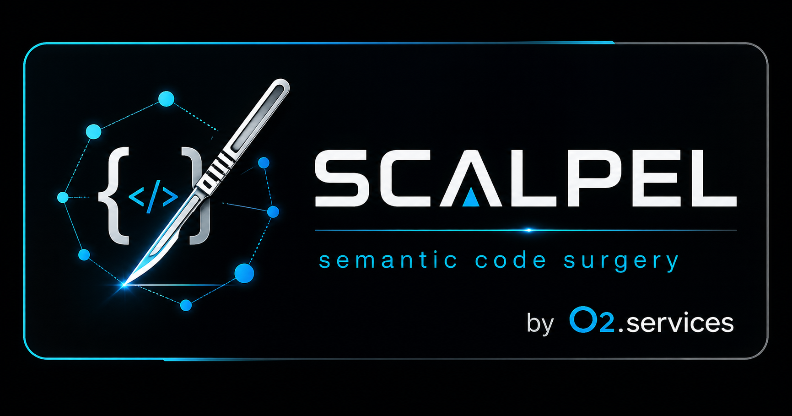

<p align="center">
  
</p>

# o2.scalpel

LSP-driven semantic refactoring for agentic AI clients via the Model Context Protocol.

## Status

**v1.13.2** — engine bumps shipped through `v1.13.2-dashboard-no-awk` (dashboard port discovery without `awk`). **46 always-on MCP tools** ship across all 23 per-language plugins (regenerated at marketplace `version: 1.0.5`):

- **35 task-level facades** in `vendor/serena/src/serena/tools/scalpel_facades.py`:
  - **Cross-language core (5)**: `scalpel_split_file`, `scalpel_extract`, `scalpel_inline`, `scalpel_rename`, `scalpel_imports_organize`.
  - **Rust-leaning (12)**: `convert_module_layout`, `change_visibility`, `tidy_structure`, `change_type_shape`, `change_return_type`, `complete_match_arms`, `extract_lifetime`, `expand_glob_imports`, `generate_trait_impl_scaffold`, `generate_member`, `expand_macro`, `verify_after_refactor`.
  - **Python-leaning (11)**: `convert_to_method_object`, `local_to_field`, `use_function`, `introduce_parameter`, `generate_from_undefined`, `auto_import_specialized`, `fix_lints`, `ignore_diagnostic`, `convert_to_async`, `annotate_return_type`, `convert_from_relative_imports`.
  - **Java (2)**: `generate_constructor`, `override_methods`.
  - **Markdown (4)**: `rename_heading`, `split_doc`, `extract_section`, `organize_links`.
  - **Transaction (1)**: `transaction_commit`.
- **11 primitives & safety/diagnostic tools** in `vendor/serena/src/serena/tools/scalpel_primitives.py`: `scalpel_capabilities_list`, `scalpel_capability_describe`, `scalpel_apply_capability`, `scalpel_dry_run_compose`, `scalpel_confirm_annotations`, `scalpel_rollback`, `scalpel_transaction_rollback`, `scalpel_workspace_health`, `scalpel_execute_command`, `scalpel_reload_plugins`, `scalpel_install_lsp_servers`.

Milestones since v0.2.0 (in order): v1.1 marketplace + persistent checkpoints, v1.1.1 markdown + LspInstaller, v1.2 installer expansion + marketplace reconciliation, v1.2.2 playground (remote-install smoke green), v1.3 PyPI + Linux CI + Python/Markdown playgrounds, v1.4 Stream 6 polyglot (TypeScript / Go / C-C++ / Java / Lean / SMT2 / Prolog / ProbLog), v1.4.1 SMT2 → real `dolmenls`, v1.5 `PREFERRED:`/`FALLBACK:` routing convention + Java facades, v1.6 / v1.7 stub-facade fix + real rollback inverse-applier, v1.8 dashboard rebrand, v1.9 Phase 4 routing uplift, v1.10 per-plugin `/<plugin>-dashboard` slash command + Scalpel-vs-Serena routing audit, v1.12 cache to plugin-data dir, v1.13.0–v1.13.2 engine refinements (`absolute_path` symbol output, `supports_kind` LSP kind hierarchy, dashboard port discovery without `awk`).

The complete design report and all supporting research live under [`docs/`](docs/).

## What it is

A Claude Code plugin that exposes write/refactor operations from any installed Language Server Protocol server as MCP tools, complementing Claude Code's built-in (read-only) `LSP` umbrella tool.

- **Read** comes from Claude Code itself: `definition`, `references`, `hover`, `documentSymbol`, `callHierarchy`.
- **Write** comes from o2.scalpel: `codeAction`, `codeAction/resolve`, `applyEdit`, `rename`, `executeCommand`, plus **35 task-level ergonomic facades** and **11 always-on primitive / safety / diagnostic tools**.

Built on top of the [Serena](https://github.com/oraios/serena) MCP server (forked as [`o2-scalpel-engine`](https://github.com/o2alexanderfedin/o2-scalpel-engine)), extended with a language-agnostic facade layer and per-language `LanguageStrategy` plugins.

## Supported languages (as of v1.14)

**52 languages**, each shipped as its own Claude Code plugin in the marketplace (regenerated at `version: 1.0.5`).

### First-class plugins (curated facade sets)

These 23 plugins ship language-tailored facade sets (`split_file`, `organize_imports`, the v1.5 P2 Java triple, the four Markdown facades, etc.) on top of the universal pair:

| Plugin | Language | LSP | Install |
|---|---|---|---|
| `o2-scalpel-rust` | Rust | rust-analyzer | `rustup component add rust-analyzer` |
| `o2-scalpel-python` | Python | pylsp + basedpyright + ruff | `pipx install python-lsp-server basedpyright ruff` |
| `o2-scalpel-markdown` | Markdown | marksman | `brew install marksman` (macOS) / `snap install marksman` (Linux) |
| `o2-scalpel-typescript` | TypeScript / JavaScript | vtsls | `npm install -g @vtsls/language-server` |
| `o2-scalpel-go` | Go | gopls | `go install golang.org/x/tools/gopls@latest` |
| `o2-scalpel-cpp` | C / C++ | clangd | `brew install clangd` / `apt install clangd` |
| `o2-scalpel-java` | Java | jdtls | `brew install jdtls` / `snap install jdtls --classic` |
| `o2-scalpel-csharp` | C# | csharp-ls | `dotnet tool install --global csharp-ls` |
| `o2-scalpel-lean` | Lean 4 | `lean --server` | via elan toolchain manager |
| `o2-scalpel-smt2` | SMT-LIB v2 | [dolmenls](https://github.com/Gbury/dolmen) (v0.10, diagnostics-focused) | pre-built binary download from GitHub Releases — see `scalpel_install_lsp_servers` |
| `o2-scalpel-prolog` | Prolog (SWI) | swipl-lsp | via SWI-Prolog pack manager (`swipl -g 'pack_install(lsp_server)' -t halt`) |
| `o2-scalpel-problog` | ProbLog | (research-mode; inherits Prolog) | `pip install problog` + `swipl` on PATH |
| `o2-scalpel-haxe` | Haxe | haxe-language-server | `brew install haxe` + `npm install -g haxe-language-server` (also needs `nekovm` on PATH) |
| `o2-scalpel-erlang` | Erlang | erlang_ls | `brew install erlang_ls` (macOS) / build from [erlang-ls/erlang_ls](https://github.com/erlang-ls/erlang_ls) |
| `o2-scalpel-ocaml` | OCaml | ocamllsp | `opam install ocaml-lsp-server` |
| `o2-scalpel-powershell` | PowerShell | PowerShell Editor Services (`pwsh`) | `brew install --cask powershell`, then from a `pwsh` prompt: `Install-Module -Name PowerShellEditorServices` |
| `o2-scalpel-systemverilog` | SystemVerilog | verible-verilog-ls | `brew install verible` (macOS) / binary download from [chipsalliance/verible](https://github.com/chipsalliance/verible/releases) |
| `o2-scalpel-clojure` | Clojure | clojure-lsp | `brew install clojure-lsp/brew/clojure-lsp-native` |
| `o2-scalpel-crystal` | Crystal | crystalline | `brew install crystalline` (macOS) / `shards build` from [elbywan/crystalline](https://github.com/elbywan/crystalline) |
| `o2-scalpel-elixir` | Elixir | elixir-ls | `brew install elixir-ls` (macOS) / build from [elixir-lsp/elixir-ls](https://github.com/elixir-lsp/elixir-ls) |
| `o2-scalpel-haskell` | Haskell | haskell-language-server-wrapper | via [ghcup](https://www.haskell.org/ghcup/) — `ghcup install hls --set` |
| `o2-scalpel-perl` | Perl | Perl::LanguageServer | `cpanm Perl::LanguageServer` |
| `o2-scalpel-ruby` | Ruby | ruby-lsp | `gem install --user-install ruby-lsp` |

### Generated minimal plugins (v1.14)

These 29 plugins were generated from the universal minimal facade pair (`rename_symbol` + `fix_lints`, backed by `textDocument/rename` and `textDocument/codeAction` + `workspace/applyEdit`). They work with any LSP that implements those LSP methods. To extend a plugin with a richer, language-tailored facade set, add a `_StrategyView` row to `serena.refactoring.cli_newplugin._LANGUAGE_METADATA` and re-run `make generate-plugins`.

| Plugin | Language | LSP | Install |
|---|---|---|---|
| `o2-scalpel-al` | AL | al-language-server | AL Language Server (auto-downloads VSIX from VS Code marketplace) — see plugin README |
| `o2-scalpel-ansible` | Ansible | ansible-language-server | `npm install -g @ansible/ansible-language-server` |
| `o2-scalpel-bash` | Bash | bash-language-server | `npm install -g bash-language-server` |
| `o2-scalpel-dart` | Dart | `dart language-server` | Dart SDK ships dart language-server — install Dart from dart.dev |
| `o2-scalpel-elm` | Elm | elm-language-server | `npm install -g @elm-tooling/elm-language-server` |
| `o2-scalpel-fortran` | Fortran | fortls | `pip install fortls` |
| `o2-scalpel-fsharp` | F# | fsautocomplete | `dotnet tool install --global fsautocomplete` |
| `o2-scalpel-groovy` | Groovy | groovy-language-server | see [GroovyLanguageServer/groovy-language-server](https://github.com/GroovyLanguageServer/groovy-language-server) (jar download) |
| `o2-scalpel-hlsl` | HLSL | shader-language-server | see [antaalt/shader-language-server](https://github.com/antaalt/shader-language-server) (binary download) |
| `o2-scalpel-json` | JSON | vscode-json-languageserver | `npm install -g vscode-langservers-extracted` |
| `o2-scalpel-julia` | Julia | LanguageServer.jl | `julia --project=@languageserver -e 'using Pkg; Pkg.add("LanguageServer")'` |
| `o2-scalpel-kotlin` | Kotlin | kotlin-language-server | see [fwcd/kotlin-language-server](https://github.com/fwcd/kotlin-language-server) (release download) |
| `o2-scalpel-lua` | Lua | lua-language-server | `brew install lua-language-server` (macOS) — see [LuaLS/lua-language-server](https://github.com/LuaLS/lua-language-server) |
| `o2-scalpel-luau` | Luau | luau-lsp | see [JohnnyMorganz/luau-lsp](https://github.com/JohnnyMorganz/luau-lsp) (release download) |
| `o2-scalpel-matlab` | MATLAB | matlab-language-server | MathWorks MATLAB R2021b+ ships matlab-language-server — see plugin README |
| `o2-scalpel-msl` | MSL | (custom pygls server) | see plugin README (custom pygls server for mIRC scripting) |
| `o2-scalpel-nix` | Nix | nixd | see [nix-community/nixd](https://github.com/nix-community/nixd) (cargo or nix-env install) |
| `o2-scalpel-pascal` | Pascal | pasls | see [genericptr/pascal-language-server](https://github.com/genericptr/pascal-language-server) (build from source) |
| `o2-scalpel-php` | PHP | intelephense | `npm install -g intelephense` (closed-source freemium; see also `php_phpactor` alternate) |
| `o2-scalpel-r` | R | languageserver | `Rscript -e 'install.packages("languageserver")'` |
| `o2-scalpel-rego` | Rego | regal | see [StyraInc/regal](https://github.com/StyraInc/regal) (binary download) |
| `o2-scalpel-scala` | Scala | metals | `brew install coursier && cs install metals` (macOS) |
| `o2-scalpel-solidity` | Solidity | nomicfoundation-solidity-language-server | `npm install -g @nomicfoundation/solidity-language-server` |
| `o2-scalpel-swift` | Swift | sourcekit-lsp | Swift toolchain ships sourcekit-lsp — install Swift from swift.org |
| `o2-scalpel-terraform` | Terraform | terraform-ls | `brew install hashicorp/tap/terraform-ls` (macOS) — or download from releases.hashicorp.com |
| `o2-scalpel-toml` | TOML | taplo | `cargo install --features lsp --locked taplo-cli` |
| `o2-scalpel-vue` | Vue | vue-language-server | `npm install -g @vue/language-server` |
| `o2-scalpel-yaml` | YAML | yaml-language-server | `npm install -g yaml-language-server` |
| `o2-scalpel-zig` | Zig | zls | see [zigtools/zls](https://github.com/zigtools/zls) (binary download or zig build) |

LSP installation can also be triggered from inside Claude via the `scalpel_install_lsp_servers` MCP tool (safety-gated: `dry_run=True` default + `allow_install=True` required for actual subprocess invocation).

### Engine-level language coverage

As of v1.14 every primary `LanguageStrategy` adapter in the engine ships as a dedicated plugin tree — the previous 29-language gap between the engine registry and the marketplace is closed. The engine's `Language` registry lives at `vendor/serena/src/solidlsp/ls_config.py` (59 enum entries total).

Plus **7 alternate adapters** for the same primary languages (different LSP backend selectable via `--language <alternate>`): `cpp_ccls`, `csharp_omnisharp`, `php_phpactor`, `python_jedi`, `python_ty`, `ruby_solargraph`, `typescript_vts` — these are not yet shipped as dedicated plugins (pending a directory-naming convention discussion); they remain accessible via `serena start-mcp-server --language <name>` directly.

**Total: 52 languages addressable through O2 Scalpel** — all 52 ship as dedicated plugins; 59 distinct LSP adapters when alternates are counted. Adding more languages (e.g. an alternate-adapter plugin) is one `o2-scalpel-newplugin <language>` invocation away.

## Relationship to Serena (what Scalpel adds)

**Scalpel is derived from [Serena](https://github.com/oraios/serena).** Serena already provides solid LSP-backed editing primitives — `RenameSymbolTool`, `ReplaceSymbolBodyTool`, `InsertBeforeSymbolTool`, `InsertAfterSymbolTool`, `SafeDeleteSymbol`, all marked `ToolMarkerSymbolicEdit` and routed through `LanguageServerCodeEditor` (real `textDocument/applyEdit` + LSP `TextEdit` lists, not text manipulation).

What Scalpel adds on top of that foundation:

| Layer | Serena (upstream) | Scalpel (this project) |
|---|---|---|
| **Symbol-level edits** | `rename_symbol`, `replace_symbol_body`, `insert_*_symbol`, `safe_delete_symbol` | (inherited from Serena — re-exposed unchanged) |
| **Task-level facades** | — | **35 `scalpel_*` facades + 11 primitives = 46 always-on tools**: `split_file`, `extract`, `inline`, `rename`, `imports_organize`, `change_visibility`, `tidy_structure`, `complete_match_arms`, `extract_lifetime`, `convert_to_async`, `annotate_return_type`, `generate_constructor`, `override_methods`, `rename_heading`, `split_doc`, `extract_section`, `organize_links`, etc. — task-shaped wrappers around `textDocument/codeAction` + Serena's primitives. |
| **Languages out of the box** | Python, TypeScript, Go, Rust, Java, etc. (programming languages) | Adds **Markdown** as a first-class language (marksman LSP + 4 markdown facades) and ships **52 per-language Claude Code plugins** — 23 with curated facade sets (Rust, Python, Markdown, TypeScript, Go, C/C++, Java, C#, Lean, SMT2, Prolog, ProbLog, Haxe, Erlang, OCaml, PowerShell, SystemVerilog, Clojure, Crystal, Elixir, Haskell, Perl, Ruby) and 29 generated minimal plugins (`rename_symbol` + `fix_lints` against any conforming LSP) covering the rest of the engine's adapter registry. |
| **LSP capability gating** | Static; assumes the LSP supports what's asked | **Dynamic capability discovery** (DLp0–DLp6): runtime `supports_method` / `supports_kind` consults the live `ServerCapabilities` + dynamic registrations. Pyright's missing `textDocument/implementation` returns a `CAPABILITY_NOT_AVAILABLE` envelope at dispatch time instead of a slow `SYMBOL_NOT_FOUND`. |
| **Distribution** | One MCP server, manual project config | **Claude Code marketplace** (`o2alexanderfedin/o2-scalpel`) with per-language plugins (`o2-scalpel-rust`, `o2-scalpel-python`, …) installable via `claude /plugin install`. |
| **LSP server installation** | Assumes LSPs are pre-installed on `$PATH` | `scalpel_install_lsp_servers` MCP tool (safety-gated: `dry_run=True` default + `allow_install=True` required) bootstraps marksman / rust-analyzer / pylsp / basedpyright / ruff / clippy / vtsls / gopls / clangd / jdtls / lean / csharp-ls / dolmenls / etc. via the right per-platform package manager (or pre-built binary download for dolmenls). |
| **E2E install verification** | — | `playground/{rust,python,markdown}/` workspaces + `make e2e-playground` + `.github/workflows/playground.yml` exercise the full marketplace-add → plugin-install → MCP-boot path against the live GitHub repo. |
| **Branding & UX** | Generic Serena MCP | Scalpel marketplace, `Alex Fedin & AI Hive®` author block, per-language READMEs with banner, generator-stamped provenance SHAs, `o2-scalpel-newplugin` CLI for adding new languages. |

In short: Scalpel = Serena's editing primitives + a task-shaped facade layer + first-class polyglot distribution + dynamic capability gating, packaged as Claude Code plugins.

## Install

Prerequisites:

```sh
# Claude Code >= 1.0.0 (the /plugin marketplace API was added in 1.0.0)
brew upgrade claude-code   # if upgrading from <1.0.0

# Rust plugin: rust-analyzer via rustup
rustup component add rust-analyzer
```

### Recommended: install via Claude Code's plugin manager

In Claude Code:

```
/plugin marketplace add o2alexanderfedin/o2-scalpel
/plugin install o2-scalpel-rust@o2-scalpel
/reload-plugins
```

This path fetches the engine (`o2-scalpel-engine`) automatically from
GitHub via the plugin's `.mcp.json` `git+URL` reference. No submodules
are cloned into your workspace.

To verify the install worked, ask Claude to call the
`scalpel_workspace_health` MCP tool — it reports LSP binary status,
dynamic capability discovery results, and engine version. (It is an MCP
tool, not a slash command — Claude dispatches it directly via the
`mcp__plugin_o2-scalpel-rust__scalpel_workspace_health` namespace.)

### Engine developers only: local-dev shortcut

This path is for contributors hacking on the engine itself
(`vendor/serena`, package name `o2-scalpel-engine`). It bypasses the
plugin manager and uses the in-tree submodule directly:

```sh
git clone https://github.com/o2alexanderfedin/o2-scalpel.git
cd o2-scalpel
git submodule update --init --recursive
uvx --from ./vendor/serena serena start-mcp-server \
    --project-from-cwd --server-name scalpel-rust
```

(Use `--server-name scalpel-python`, `scalpel-markdown`, etc. for other
languages — the server name is what every facade, dashboard discovery,
and statusline hook keys off. There is no `--language` flag in the
production invocation; the project is auto-detected via cwd.)

If you only want to *use* the plugin, prefer the recommended path above —
it does not require submodule recursion.

To smoke-test the locally-checked-out engine against the rust + python
plugin trees:

```sh
make verify-plugins-fresh
```

(Verifies `o2-scalpel-rust` and `o2-scalpel-python` only — these two
flagship languages anchor the regression gate via
`scripts/stage_1i_uvx_smoke.sh`. The other 50 generated plugins follow
the same template and are covered by `make generate-plugins` drift
checks rather than per-plugin smokes.)

See [`docs/install.md`](docs/install.md) for Python and Markdown LSP
binary setup (`pylsp`, `basedpyright-langserver`, `ruff`, `marksman`).
That document is marked stale for the install path itself but its
LSP-binary install instructions remain accurate.

## Slash commands

Every installed plugin contributes the following slash commands to Claude Code:

| Command | Scope | What it does |
|---|---|---|
| `/o2-scalpel-<lang>-dashboard` | per-plugin (one per installed language) | Discovers the running `scalpel-<lang>` MCP server's dashboard port (`pgrep -f "start-mcp-server.*--server-name scalpel-<lang>"` cross-referenced against `lsof -iTCP -sTCP:LISTEN`, no `awk`, pinned to `--server-name` so multiple scalpel-* servers don't collide) and opens it in the browser. **Lazy-bind caveat**: the engine binds the dashboard only after the first `scalpel_*` tool call against that server, so if discovery reports "not yet bound", invoke any facade (e.g. `scalpel_workspace_health`) and re-run. The command body is per-language (server name templated in) but follows an identical shape across the [Supported languages](#supported-languages-as-of-v114) table — e.g. `/o2-scalpel-rust-dashboard`, `/o2-scalpel-python-dashboard`, `/o2-scalpel-markdown-dashboard`. |
| `/o2-scalpel-update` | engine-global | Force-refreshes the uvx-cached `o2-scalpel-engine` to the latest commit on `main` (`uvx --refresh --from git+https://github.com/o2alexanderfedin/o2-scalpel-engine.git scalpel --version`), **auto-kills stale `scalpel-*` MCP servers** so Claude Code respawns them on the next tool call from the freshly-refreshed cache (avoiding schema-mismatch errors), and writes the cleared-update marker to every installed plugin's `${CLAUDE_PLUGIN_DATA}/update-cache/installed-sha` (Claude Code's per-plugin scratch dir, auto-cleaned on uninstall). The body is byte-identical across all 52 plugins so Claude Code's plugin registry surfaces a single command. The legacy v1.11 cache at `~/.cache/o2-scalpel/` is removed on every run as a one-time migration cleanup. |

## Status-line update indicator

Every plugin ships a SessionStart hook (`hooks/check-scalpel-update.sh`) that probes `git ls-remote` for upstream HEAD — throttled to **one network call per 6 hours per plugin** (`THROTTLE_SECONDS=21600`) — and writes `${CLAUDE_PLUGIN_DATA}/update-cache/update-check.json` (Claude Code's per-plugin scratch dir, auto-cleaned on plugin uninstall). A standalone `hooks/scalpel-statusline.sh` POSIX-shell emitter (no Python, no uvx) reads that cache and prints a yellow `⬆ /o2-scalpel-update` segment when an update is available.

The recommended `statusLine.command` is an inline shell snippet (no dependency on any specific plugin's install path — survives uninstall and reinstall):

```jsonc
// ~/.claude/settings.json
{
  "statusLine": {
    "type": "command",
    "command": "F=$(find $HOME/.claude/plugins/data -maxdepth 3 -path '*o2-scalpel-*/update-cache/update-check.json' -print -quit 2>/dev/null); [ -n \"$F\" ] && grep -q '\"update_available\":true' \"$F\" && printf '\\033[33m\\xe2\\xac\\x86 /o2-scalpel-update\\033[0m'"
  }
}
```

The per-plugin `hooks/scalpel-statusline.sh` script is shipped as a reference implementation and can be wired directly if you prefer a script reference, but the inline form above is uninstall-safe. Running `/o2-scalpel-update` updates every installed scalpel-* plugin's cache in one shot, so the indicator clears across all plugins simultaneously.

For the full setup recipe — wrapping with an existing status-line, force-recheck, disable instructions, and the v1.11 → v1.12 cache-path migration note — see [`docs/reviews/2026-05-01-scalpel-vs-serena-routing-audit/STATUSLINE.md`](docs/reviews/2026-05-01-scalpel-vs-serena-routing-audit/STATUSLINE.md).

The cache schema and integration model deliberately mirror the [`gsd`](https://github.com/o2alexanderfedin/get-shit-done) update indicator so the same mental model applies.

## Routing convention

Scalpel facades open with a `PREFERRED:` / `FALLBACK:` opener in their MCP descriptions; Serena upstream primitives (re-exposed unchanged) intentionally don't. The absence of the opener is the AST-fallback signal — Claude Code routes to the LSP-backed Scalpel facade by default and falls back to the Serena primitive only when no facade matches. The convention is enforced by a drift-CI regex over `Scalpel*Tools` descriptions. Full spec: [`docs/superpowers/specs/2026-04-29-lsp-feature-coverage-spec.md`](docs/superpowers/specs/2026-04-29-lsp-feature-coverage-spec.md). Recent audit: [`docs/reviews/2026-05-01-scalpel-vs-serena-routing-audit/REPORT.md`](docs/reviews/2026-05-01-scalpel-vs-serena-routing-audit/REPORT.md) + [`PLAN.md`](docs/reviews/2026-05-01-scalpel-vs-serena-routing-audit/PLAN.md).

## Troubleshooting

| Symptom | Cause | Fix |
|---|---|---|
| `Plugin not found in any marketplace` | Catalog stale or never added | `/plugin marketplace update o2-scalpel` or re-add with `/plugin marketplace add o2alexanderfedin/o2-scalpel` |
| `Executable not found in $PATH: rust-analyzer` | LSP not installed | `rustup component add rust-analyzer` |
| `Executable not found in $PATH: pylsp` | Python LSP not installed | `pipx install python-lsp-server` |
| `Executable not found in $PATH: marksman` | Markdown LSP not installed | `brew install marksman` |
| `applied=False` on a refactor | rust-analyzer not yet indexed | Run `cargo build` in the project once before retrying |
| `git+URL` install hangs | Network or GitHub auth issue | Check `~/.netrc` or SSH key; try `uvx --from git+https://github.com/o2alexanderfedin/o2-scalpel-engine.git scalpel --version` directly |
| Plugin cache stale after re-publish at same version | `version: "1.0.0"` is pinned in cache | `/plugin uninstall o2-scalpel-rust` then reinstall, or bump `plugin.json` version |
| Skill / tool namespace not found after install | Claude Code < 1.0.0 | `brew upgrade claude-code` |
| Skill not appearing after plugin install | Plugins not reloaded | Run `/reload-plugins` in Claude Code |
| `verify-scalpel-rust.sh` exits with code 2 at SessionStart | `rust-analyzer` not on PATH — blocking error | Install via `rustup component add rust-analyzer`, then verify with `which rust-analyzer` |
| `make e2e-playground` exits 2 with `ERROR: uv not on PATH` | `uv` missing — script hard-fails the prereq check | `curl -LsSf https://astral.sh/uv/install.sh \| sh` then re-run |
| `make e2e-playground` skips Rust / Python / Markdown tests | One of `rust-analyzer` / `cargo` / `pylsp` / `marksman` missing on PATH | Install the missing binary; verify with `which rust-analyzer cargo pylsp marksman` |
| `cargo test` fails with `cannot open shared object file` | rustc dylib mismatch | Reinstall toolchain via `rustup toolchain install stable` |

## Verifying the install end-to-end

The repository ships **Rust**, **Python**, and **Markdown** playground
workspaces under `playground/`, plus a programmatic E2E suite at
`vendor/serena/test/e2e/test_e2e_playground_{rust,python,markdown}.py`
that drives each facade against a real LSP process.

```sh
# One-shot — runs all three suites; gated on rust-analyzer / cargo / pylsp / marksman / uv
make e2e-playground
```

What each suite covers (counts are the facade tests; suites also include
`cargo`/`pytest` smoke tests and a `uvx`-based remote-install smoke):

| Playground | LSP | Facades exercised |
|---|---|---|
| `playground/rust/`     | rust-analyzer | `split_file`, `rename`, `extract`, `change_visibility`, `inline`, `extract_lifetime`, `complete_match_arms`, `change_return_type`, `change_type_shape`, `generate_member`, `generate_trait_impl_scaffold`, `expand_glob_imports` (12) |
| `playground/python/`   | pylsp         | `split_file`, `rename`, `extract`, `inline`, `imports_organize` (5) |
| `playground/markdown/` | marksman      | `rename_heading` (LSP, including cross-file wiki-link propagation), `split_doc`, `extract_section`, `organize_links` (4 — the latter three are pure-text and run without marksman) |

The Python playground was added in the v1.3 milestone; the Markdown
playground was added in the same milestone alongside marksman LSP
support. The Rust playground was the v1.2.2 deliverable and remains the
most-developed of the three.

CI mirrors the local target via `.github/workflows/playground.yml`,
which runs on push to `main` and `develop`, on PRs to `main`, and via
`workflow_dispatch`. The matrix covers `macos-latest` and
`ubuntu-latest`.

If you only want the legacy uvx-launch smoke (faster, no LSP needed),
`make verify-plugins-fresh` runs `scripts/stage_1i_uvx_smoke.sh` against
the rust + python plugin trees.

## Layout

```
.
├── .claude-plugin/
│   └── marketplace.json            Canonical marketplace catalog (52 plugins)
├── .github/workflows/
│   └── playground.yml              E2E CI (macOS + Ubuntu matrix)
├── docs/
│   ├── design/                     Authoritative design reports + MVP scope
│   ├── install.md                  Setup + LSP-server prerequisites
│   ├── superpowers/{plans,specs,research}/
│   │                               Per-stage plans, drift specs, research notes
│   ├── reviews/                    Audit reports (e.g. scalpel-vs-serena routing)
│   ├── gap-analysis/               LSP capability gap reference
│   ├── research/                   Background research
│   └── dev/                        Developer notes
├── vendor/
│   ├── serena/                     Engine submodule (a.k.a. o2-scalpel-engine)
│   ├── claude-code-lsps-boostvolt/ Marketplace shape reference (analysis-only)
│   └── claude-code-lsps-piebald/   Analysis-only fork
├── playground/
│   ├── rust/                       cargo workspace driven by rust-analyzer
│   ├── python/                     pyproject workspace driven by pylsp
│   └── markdown/                   .md tree driven by marksman
├── o2-scalpel-rust/                Generated per-language plugin tree (curated facades)
├── o2-scalpel-python/              Generated per-language plugin tree (curated facades)
├── o2-scalpel-markdown/            Generated per-language plugin tree (curated facades)
├── o2-scalpel-{typescript,go,cpp,java,csharp,lean,smt2,prolog,problog,
│              clojure,crystal,elixir,erlang,haskell,haxe,ocaml,perl,
│              powershell,ruby,systemverilog}/
│                                   20 more curated-facade plugin trees (23 total)
├── o2-scalpel-{al,ansible,bash,dart,elm,fortran,fsharp,groovy,hlsl,json,
│              julia,kotlin,lua,luau,matlab,msl,nix,pascal,php,r,rego,
│              scala,solidity,swift,terraform,toml,vue,yaml,zig}/
│                                   29 v1.14 minimal-facade plugin trees
│                                   (rename_symbol + fix_lints — universal LSP pair)
├── scripts/
│   ├── e2e_playground.sh           Driver for `make e2e-playground`
│   ├── stage_1i_uvx_smoke.sh       Driver for `make verify-plugins-fresh`
│   └── dev_env_shim.sh             Local PATH/venv shim
├── tests/
│   └── governance/                 Repo-level governance tests (banners, drift)
├── Makefile                        generate-plugins, e2e-playground, etc.
└── CHANGELOG.md
```

All `o2-scalpel-<lang>/` trees are generated by `make generate-plugins`
from the engine in `vendor/serena/`. Do not hand-edit them — every
emitted JSON file carries a `_generator` banner pinned to the engine
SHA.

## Where to start

1. [Install guide](docs/install.md) — setup + LSP-server prerequisites
2. [MVP scope report](docs/design/mvp/2026-04-24-mvp-scope-report.md) — canonical contract for what ships and when
3. [Design report — Serena rust-analyzer refactoring extensions](docs/design/2026-04-24-serena-rust-refactoring-extensions-design.md)
4. [Open-questions resolution](docs/design/2026-04-24-o2-scalpel-open-questions-resolution.md)
5. [Post-v0.3.0 plan INDEX](docs/superpowers/plans/2026-04-26-INDEX-post-v0.3.0.md) — portfolio of all execution streams (v1.1 through v2)
6. [LSP feature-coverage spec](docs/superpowers/specs/2026-04-29-lsp-feature-coverage-spec.md) — Scalpel-facade vs. Serena-primitive routing authority (`PREFERRED:` / `FALLBACK:` convention)
7. [CHANGELOG](CHANGELOG.md) — version-by-version what landed when

## Capability discovery

The MCP catalog is auto-introspected from the per-language `LanguageStrategy` registry plus each LSP adapter's advertised `codeActionKind.valueSet`. Drift between the runtime catalog and the checked-in golden file is enforced by a CI gate:

```sh
cd vendor/serena
PATH="$(pwd)/.venv/bin:$PATH" .venv/bin/pytest test/spikes/test_stage_1f_t5_catalog_drift.py
# Refresh the baseline (after a rust-analyzer / basedpyright / ruff version bump):
PATH="$(pwd)/.venv/bin:$PATH" .venv/bin/pytest test/spikes/test_stage_1f_t4_baseline_round_trip.py --update-catalog-baseline
```

Catalog hash for external drift detection: `CapabilityCatalog.hash()` returns the SHA-256 of the canonical JSON.

## Origin

Spun out of `hupyy/hupyy-cpp-to-rust` on 2026-04-24 once it became clear the LSP-write capability is a general-purpose agentic-AI tool, not coupled to any specific transpiler project.

## License

To be determined for original code in this repo (no `LICENSE` file at the root yet — pick before first external release). Forks under `vendor/` retain their upstream licenses:

- `vendor/serena/` (the engine, fork of [oraios/serena](https://github.com/oraios/serena), now [o2alexanderfedin/o2-scalpel-engine](https://github.com/o2alexanderfedin/o2-scalpel-engine)): **MIT**
- `vendor/claude-code-lsps-boostvolt/` (marketplace shape reference): **MIT**
- `vendor/claude-code-lsps-piebald/` (analysis-only, no upstream LICENSE file): **redistribution status unclear** — treat as analysis-only and do not redistribute.
