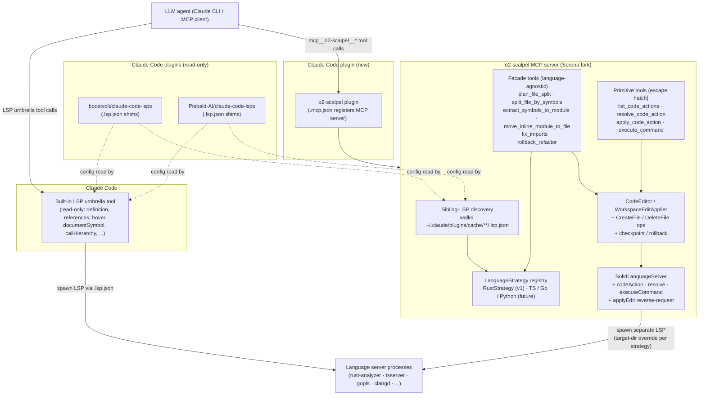
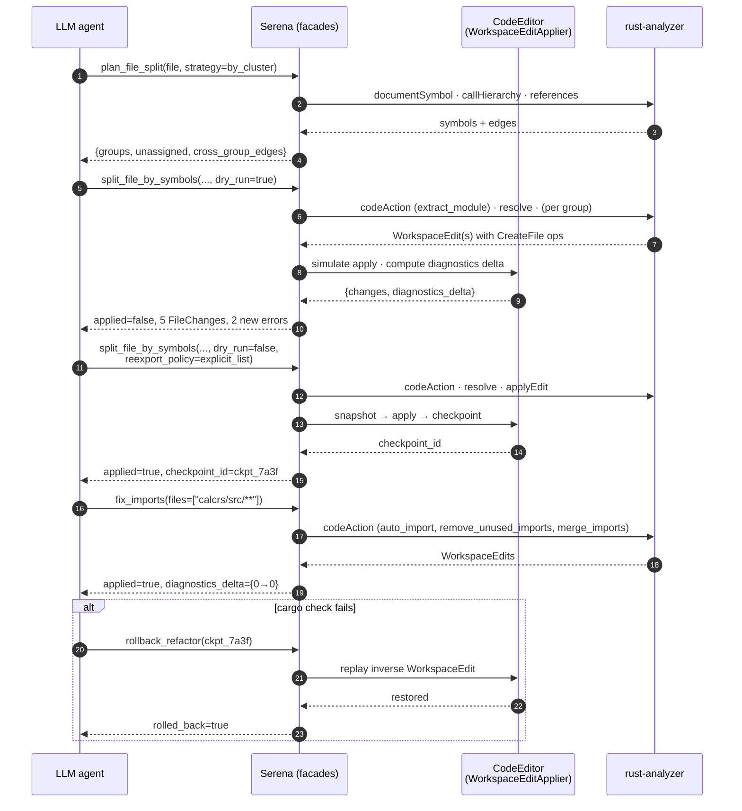

# Serena + rust-analyzer Refactoring Extensions — Design Report

Status: report-only. No implementation in this iteration.
Scope: general-purpose refactoring tooling for agentic AI clients driving rust-analyzer via MCP.
Serena fork: `vendor/serena/` (submodule — https://github.com/o2alexanderfedin/serena)
Upstream rust-analyzer: https://github.com/rust-lang/rust-analyzer (master, Apr 2026)

## TL;DR

- Serena today exposes symbol-level edits (`replace_symbol_body`, `insert_before/after_symbol`, `rename_symbol`) but **does not expose `textDocument/codeAction`, `codeAction/resolve`, or `workspace/executeCommand`**. rust-analyzer's 158 refactoring assists are therefore invisible to any MCP client driving Serena.
- The design adds three layers to the fork: (1) a small **LSP primitive layer** in `solidlsp` that unlocks the code-action pipeline and `WorkspaceEdit` resource operations (`CreateFile`, `RenameFile`, `DeleteFile`, `changeAnnotations`); (2) a **language-agnostic facade layer** of six task-level MCP tools (`plan_file_split`, `split_file_by_symbols`, `extract_symbols_to_module`, `move_inline_module_to_file`, `fix_imports`, `rollback_refactor`); (3) a **language-strategy plugin** per language that supplies the small set of language-specific answers the facades need (module declaration syntax, which code-action kind corresponds to "extract module", file-layout conventions).
- **Facades are language-agnostic.** Every facade's signature, input schema, output schema, and MCP tool name is identical across languages. Language-specific behavior is isolated to a narrow `LanguageStrategy` interface. Rust is the v1 strategy; additional languages are pure plugin additions, not facade rewrites.
- The primary driver is giving agentic AI a safe way to split 1000+ line files into modules without doing byte-offset arithmetic. rust-analyzer has no single "move top-level item to another file" assist — the design documents the required `extract_module` → `move_module_to_file` composition and wraps it behind `extract_symbols_to_module` / `split_file_by_symbols`. Equivalent compositions for TypeScript, Go, Python, etc. are future strategy plugins.
- Atomic by default, `dry_run: bool` on every mutator, checkpoint-based rollback, name-path addressing (no byte ranges at the facade boundary), fail-loud on ambiguity.
- **Deployment.** Bundled in a Claude Code plugin (`o2-scalpel`) that auto-discovers sibling LSP plugins' `.lsp.json` configs and provides write capability for every language those plugins already support. One install on top of any read-only LSP plugin set (boostvolt/claude-code-lsps, Piebald-AI/claude-code-lsps, or any third-party plugin shipping `.lsp.json`). See §Deployment as a Claude Code Plugin.
- Deliverable is a design report only. Implementation is a follow-up, staged small → medium → large as described under Effort.

## Problem Statement

### Current Serena state (Specialist 1)

Serena's edit surface is entirely symbol-level and routes through `/src/serena/code_editor.py`. Primitives in place today:

- `replace_body()` at line 97, `insert_before_symbol()` at line 174, `insert_after_symbol()` at line 133, `delete_symbol()` at line 229.
- `LanguageServerCodeEditor.rename_symbol()` at line 350 — the only primitive that uses a real LSP refactoring (`textDocument/rename` at line 368) and applies the resulting `WorkspaceEdit` via `_apply_workspace_edit()` at line 376.
- `_workspace_edit_to_edit_operations()` at lines 317–348 handles the `changes` map and `documentChanges` with `TextDocumentEdit` and `kind == "rename"` file operations only. `create` and `delete` raise at line 332.

The LSP client in `/src/solidlsp/ls.py` forwards `didOpen`/`didChange`/`didClose`, `documentSymbol`, `definition`, `references`, and `rename`. It does **not** forward `textDocument/codeAction`, `codeAction/resolve`, or `workspace/executeCommand`.

### rust-analyzer gap (Specialist 2)

rust-analyzer advertises `codeActionProvider = { codeActionKinds: [...], resolveProvider: true }` and emits 158 assists registered in `crates/ide-assists/src/lib.rs::all()`. Every one of them is reachable only through the two-phase `textDocument/codeAction` → `codeAction/resolve` pipeline.

For file splitting, the relevant assists live in `crates/ide-assists/src/handlers/`:

- `extract_module` — creates an inline `mod foo { … }` block; does **not** create a file.
- `move_module_to_file` — takes an existing inline `mod foo { … }` and emits a `WorkspaceEdit` with `CreateFile` + replacement `mod foo;` declaration.
- `move_from_mod_rs`, `move_to_mod_rs` — rename-based layout swaps between `foo/mod.rs` and `foo.rs`.
- Pre- and post-split helpers: `extract_function`, `extract_variable`, `auto_import`, `qualify_path`, `fix_visibility`, `remove_unused_imports`, `merge_imports`.

**The critical gap in rust-analyzer itself:** no `move_item_to_file` assist exists. Moving a top-level item from `big.rs` to `new_module.rs` requires the client to compose `extract_module` → `move_module_to_file`. This is the single biggest orchestration problem the design must solve.

Additional rust-analyzer wrinkles:

- `workspace/executeCommand` is not registered as a server capability. Commands embedded in `CodeAction.command` are client-side; do not round-trip them.
- `workspace/willRenameFiles` is wired (filter `**/*.rs`), but `willCreateFiles`/`willDeleteFiles` are not.
- WorkspaceEdits always use `documentChanges` with `SnippetDocumentChangeOperation` entries; edits may carry `$0` snippet markers that non-VSCode clients must strip.
- Resolution is version-sensitive: `data = { id, code_action_params, version }`; if the document changes between list and resolve, the server returns `ContentModified` (−32801).

### Goals this design serves

- **Far goal.** Enable Claude CLI (and any MCP-capable agent) to work with Rust source code safely and optimally — semantic refactorings driven by the language server rather than text surgery driven by the LLM.
- **Near goal.** Ship a general-purpose tool surface sufficient to split any large Rust file into modules with compile-checked safety and rollback. Validation is done against a purpose-built throwaway fixture crate, never against production code.

## Goals & Non-Goals

### Goals

- Expose the generic LSP code-action pipeline through Serena as reusable primitives — usable against any LSP server that advertises `codeActionProvider`.
- Handle every `WorkspaceEdit` shape the protocol emits (`CreateFile`, `RenameFile`, `DeleteFile`, snippet text edits, change annotations). The v1 Rust strategy exercises the CreateFile + RenameFile paths; DeleteFile is included for forward compatibility across future strategies.
- Offer a small number of **language-agnostic** agent-facing facade tools covering the file-splitting workflow end-to-end. Same tool signatures regardless of language.
- Define a narrow `LanguageStrategy` interface so adding a new language is a plugin addition (one class), not a facade rewrite.
- Preserve Serena's existing layered architecture: nothing language-specific lands in the LSP client or the facades; language-specific behavior is isolated to strategy plugins.
- Atomic semantics with checkpoint-based rollback; dry-run on every mutator.

### Non-Goals

- **Implementation in this iteration.** This is a design report.
- Covering the full 158 rust-analyzer assists. Only file-splitting and its cleanup helpers are in scope for v1.
- **Non-Rust language strategies in v1.** Only the Rust `LanguageStrategy` is implemented initially; the plugin interface is defined and documented so TypeScript / Go / Python / etc. can follow without facade changes.
- Within-function extractions (`extract_function`, `extract_variable`) — useful pre-shaping but not required for the v1 split-file workflow. The primitive layer makes them reachable; no dedicated facade is proposed.
- `typeHierarchy` — not offered by rust-analyzer; future strategies may opt in.
- Writing new rust-analyzer assists. If `move_item_to_file` is ever needed as a native assist, that is a separate upstream contribution to rust-analyzer.
- Streaming LSP operations or async tool `apply()` methods. Current Serena tools are synchronous; keep that.

## Architecture Overview



Design rule preserved and strengthened: nothing language-specific lives in `solidlsp`, `code_editor.py`, or the facade tools. Language-specific knowledge is confined to `LanguageStrategy` plugins selected per project based on detected language (reuses Serena's existing `Language` enum + filename-extension matcher). Deployment-specific knowledge (CC plugin cache layout, env-var conventions) is confined to the discovery module — see §Deployment as a Claude Code Plugin.

## Component Design

### 1. LSP Client Extensions (solidlsp layer)

All four additions are localized. No architectural rework.

**1.1 New LSP methods on `SolidLanguageServer` (`/src/solidlsp/ls.py`)**

Per Specialist 1 §7.1–§7.3, three thin methods, roughly 25 lines total:

- `request_code_actions(relative_path, range_, only=None, trigger_kind=1, diagnostics=None) -> list[CodeAction]` — wraps `self.server.send.code_action(CodeActionParams(...))`. Uses `open_file()` context manager to guarantee `didOpen`.
- `resolve_code_action(action: CodeAction) -> CodeAction` — wraps `code_action_resolve`. Never mutates `data`; passes the action object through verbatim (Specialist 3 §1.3).
- `execute_command(command: str, arguments: list | None = None) -> Any` — wraps `executeCommand` for completeness. Not used by rust-analyzer today but required for non-RA servers and for forward compatibility.

**1.2 `workspace/applyEdit` reverse-request handler**

Specialist 3 §4 flags that the current `multilspy` shim may respond `{applied: false}`, silently dropping edits emitted by server commands. The fork must register a handler in the protocol plumbing (`/src/solidlsp/lsp_protocol_handler/server.py`) that delegates to the same `WorkspaceEditApplier` used for `codeAction.edit` and returns `{applied: true, failureReason: null}` on success, `{applied: false, failedChange: i, failureReason: str}` on partial failure.

Before building, verify against current `solidlsp` — the hook may already exist under a different name.

**1.3 `$/progress` tracking for `rustAnalyzer/Indexing`**

Specialist 3 §8.2: during indexing, rust-analyzer returns empty results or `ContentModified`. The client must:

- Listen for `$/progress` with token `rustAnalyzer/Indexing`.
- Expose `wait_for_indexing(timeout_s: float) -> {"ready": bool, "progress": str|None}` on `SolidLanguageServer`.
- Facade tools call `wait_for_indexing()` before their first `codeAction` request per session.
- Retry once on `ContentModified` (−32801); re-raise after second failure.

**1.4 WorkspaceEdit applier upgrades (`/src/serena/code_editor.py`)**

Extend `_workspace_edit_to_edit_operations()` at lines 317–348. New `EditOperation` subclasses:

- `EditOperationCreateFile` — honors `options.overwrite`, `options.ignoreIfExists`; creates parent directories; writes empty file (content comes from a subsequent `TextDocumentEdit` in the same `documentChanges` array — Specialist 3 §2.3).
- `EditOperationDeleteFile` — honors `options.recursive`, `options.ignoreIfNotExists`.
- `EditOperationRenameFile` — already exists at line 306; verify it uses atomic rename and fires `workspace/willRenameFiles` beforehand so rust-analyzer can update `mod` declarations (Specialist 2 §2 on `willRenameFiles`).

Additional applier rules:

- **Order preservation.** `documentChanges` apply in array order (LSP §3.16). Inside a single `TextDocumentEdit`, sort `edits` by descending `start` offset before applying to the buffer (Specialist 3 §2.3). `CreateFile` must come before any `TextDocumentEdit` targeting that URI.
- **Version check.** Reject a `TextDocumentEdit` whose `textDocument.version` doesn't match Serena's tracked `LSPFileBuffer` version; raise `STALE_VERSION` so the caller can re-request the code action (Specialist 3 §2.2).
- **Snippet markers.** rust-analyzer emits `SnippetTextEdit` with `insertTextFormat = Snippet` and `$0` placeholders. Serena is headless; advertise `snippetTextEdit: false` at initialize, or strip markers in post-processing. Prefer advertising false — rust-analyzer falls back to plain `TextEdit` automatically (Specialist 2 §5).
- **`changeAnnotations`.** Honor `needsConfirmation`. Default policy: autonomous MCP server rejects annotated edits unless the facade sets `allow_out_of_workspace: true` (rare; only for workspace-crossing assists). Surface annotations in dry-run previews (Specialist 3 §2.6).
- **Checkpoint capture.** Before applying any `WorkspaceEdit`, snapshot the content of every affected file (keyed by content hash) and compute an inverse `WorkspaceEdit`. Store under a `checkpoint_id` in an LRU plus `.serena/checkpoints/` for durability. The facade layer uses this for rollback (Specialist 4 §3).
- **Atomicity.** Specialist 3 §2.4: in-memory snapshot, apply in array order, restore snapshots on any failure. Fail loud.

**Concrete files to touch in `vendor/serena/`:**

| File | Change | Size |
|---|---|---|
| `/src/solidlsp/ls.py` | Add three methods, indexing-progress tracker, `wait_for_indexing()` | ~60 lines |
| `/src/solidlsp/lsp_protocol_handler/server.py` | Register `workspace/applyEdit` handler | ~30 lines |
| `/src/serena/code_editor.py` lines 317–348 | New `EditOperation` subclasses, ordering, version-check, snippet strip, checkpoint capture | ~150 lines |
| `/src/solidlsp/language_servers/rust_analyzer.py` | Advertise `snippetTextEdit: false`, keep init otherwise minimal | ~5 lines |

### 2. Primitive Tools (new low-level MCP tools)

New file: `/src/serena/tools/code_action_tools.py`.

These are the **escape hatch** (Specialist 3 §5 Option B). The LLM rarely calls them directly — the facades cover the 80% path — but they exist so the LLM can fall back when a facade fails (Specialist 4 §2 "Composition vs. Atomic Ops"). All four subclass `Tool` and use marker `ToolMarkerSymbolicEdit` except `list_code_actions` which is read-only (`ToolMarkerSymbolicRead`).

**2.1 `list_code_actions`**

```python
def apply(self, file: str, range: Range, kinds: list[str] | None = None) -> list[CodeActionDescriptor]:
    """Return lightweight CodeAction descriptors for `range`, filtered by kind prefix.
    IDs live 60s or until document version changes."""
```

Output: `[{"id": str, "title": str, "kind": str, "disabled_reason": str | None, "is_preferred": bool}]`. IDs are session-scoped UUIDs keyed to a cache entry `{action: CodeAction, file_version: int, captured_at: float}`.

**2.2 `resolve_code_action`**

```python
def apply(self, id: str) -> ResolvedAction:
    """Call codeAction/resolve; return the hydrated action including its WorkspaceEdit."""
```

Output: `{"id": str, "title": str, "kind": str, "workspace_edit": WorkspaceEditSummary, "needs_confirmation": bool}`. The `workspace_edit` is summarized (affected paths, creates, deletes, edit count) — the raw LSP JSON is not exposed to the LLM (Specialist 3 §9 "What not to expose").

**2.3 `apply_code_action`**

```python
def apply(self, id: str, dry_run: bool = False) -> ApplyResult:
    """Resolve (if not already) and apply. Atomic; rolls back on failure."""
```

Output schema matches the facade `RefactorResult` (§3). Returns a `checkpoint_id` on success.

**2.4 `execute_command`**

```python
def apply(self, command: str, arguments: list[Any] | None = None) -> Any:
    """Pass-through to workspace/executeCommand. Guarded: rust-analyzer does not register this capability, so calls to RA will fail fast."""
```

Included because `solidlsp` supports multiple language servers; some (clangd, pylsp) do register executeCommand.

**Error codes (Specialist 3 §9):**

| Code | Meaning |
|---|---|
| `STALE_VERSION` | File changed between list and apply — re-list |
| `ASSIST_DISABLED` | Server returned `disabled.reason` |
| `NOT_APPLICABLE` | No action matched `kinds` at `range` |
| `INDEXING` | rust-analyzer still indexing; call `wait_for_indexing` |
| `APPLY_FAILED` | WorkspaceEdit application errored; rolled back |
| `PREVIEW_EXPIRED` | Action/preview ID past TTL or invalidated |
| `AMBIGUOUS_SYMBOL` | Name-path resolved to multiple candidates |
| `SYMBOL_NOT_FOUND` | Name-path did not resolve |

### 3. Facade Tools (new high-level MCP tools, language-agnostic)

Adopted wholesale from Specialist 4 §1, with one resolution documented below: Specialist 3 proposed a separate `preview_code_action` tool; Specialist 4 argues `dry_run: bool` on every mutator is strictly better. **Chosen: `dry_run` parameter.** Rationale: single surface area, identical output schema, matches the "show me what you'd do, then do it" agent loop. `preview_code_action` is not added as a facade; it exists only implicitly as `apply_code_action(id, dry_run=True)` at the primitive layer.

New file: `/src/serena/tools/refactoring_tools.py`. The file is deliberately language-free; every language-specific decision is delegated to an injected `LanguageStrategy` (see §5). Facades detect the target language from the file path using Serena's existing `Language` enum + filename matcher, then look up the corresponding registered strategy.

Shared `RefactorResult` schema (Pydantic-style, Specialist 4 §Formal Signatures):

```python
class FileChange(BaseModel):
    path: str
    kind: Literal["create", "modify", "delete"]
    hunks: list[Hunk]

class DiagnosticsDelta(BaseModel):
    before: int
    after: int
    new_errors: list[Diagnostic]

class RefactorResult(BaseModel):
    applied: bool
    changes: list[FileChange]
    diagnostics_delta: DiagnosticsDelta
    checkpoint_id: str | None
    resolved_symbols: list[ResolvedSymbol]   # {requested, resolved}
    warnings: list[str]
    failure: FailureInfo | None = None
    lsp_ops: list[LspOpStat]                 # {method, count, total_ms}
    duration_ms: int
```

**3.1 `plan_file_split` (read-only)**

Inputs: `file, strategy in {"by_visibility","by_cluster","by_type_affinity"}=by_cluster, max_groups: int = 5`.
LSP ops: `documentSymbol` (once), `callHierarchy/incomingCalls` per top-level fn, `references` per type.
Output: `{suggested_groups: [{module_name, rationale, symbols}], unassigned, cross_group_edges, warnings}`.
Failure modes: rust-analyzer not ready → `warnings: ["indexing in progress"]`, no partial plan.

**3.2 `split_file_by_symbols` (mutating, bulk)**

Inputs: `file, groups: dict[str, list[name_path]], parent_module_style in {"dir","mod_rs"}=dir, keep_in_original=[], reexport_policy in {"preserve_public_api","none","explicit_list"}="preserve_public_api", explicit_reexports=[], allow_partial=False, dry_run=False`.

LSP ops invoked, in order:

1. `documentSymbol(file)` — verify every `name_path` resolves (Specialist 4 §7 hallucination resistance).
2. For each group:
   a. `codeAction` on the spanning range of that group's items, `only: ["refactor.extract.module"]`.
   b. `codeAction/resolve` on the chosen action → `WorkspaceEdit` creates inline `mod <name> { … }`.
   c. Apply.
   d. `didChange` with the post-edit buffer.
   e. `codeAction` on the inline `mod` keyword, `only: ["refactor.extract"]`; pick `move_module_to_file`.
   f. `codeAction/resolve` → `WorkspaceEdit` with `CreateFile` for `<name>.rs` + replacement `mod <name>;` in parent.
   g. Apply. Wait 500ms or poll `$/progress` until the `rustAnalyzer/Indexing` token clears (Specialist 3 §6 "Cargo workspace refresh").
3. `textDocument/rename` if the generated module name differs from caller-supplied `module_name` (Specialist 3 §6 step 7).
4. `fix_imports` substep (§3.5) on all touched files.
5. `textDocument/publishDiagnostics` listener — compare `before` vs `after` counts.
6. In strict mode (default), if `diagnostics_delta.new_errors > 0`, invoke `rollback_refactor(checkpoint_id)` and return `{applied: false, failure: {...}, checkpoint_id}`.

Failure modes: any step → rollback; `ContentModified` → retry once, then rollback.

**3.3 `extract_symbols_to_module` (mutating, surgical)**

Inputs: `file, symbols: list[name_path], new_module: str, dry_run=False`.
Implementation: thin wrapper over `split_file_by_symbols` with `groups = {new_module: symbols}`. Same pipeline. Exists because the LLM conceptually distinguishes "move these 3 things" from "split this file N ways".

**3.4 `move_inline_module_to_file` (mutating, narrow)**

Inputs: `file, module_name: str, target_style in {"dir","mod_rs"}=dir, dry_run=False`.
LSP ops: one `codeAction` + `resolve` + apply (`move_module_to_file` or `move_to_mod_rs` depending on `target_style`), then `fix_imports` on the touched file.

**3.5 `fix_imports` (mutating, cleanup)**

Inputs: `files: list[str], add_missing=True, remove_unused=True, reorder=True`.
LSP ops: for each file, `codeAction` with `only: ["source.organizeImports", "quickfix"]`, filter for `auto_import`, `remove_unused_imports`, `merge_imports`, `qualify_path`. Apply in sequence.
Special: when `files == ["**"]`, enumerate via `workspace/symbol` or filesystem walk scoped to `src/`.

**3.6 `rollback_refactor` (recovery)**

Inputs: `{checkpoint_id: str}`.
Output: `{restored_files: [str], ok: bool}`.
Replays the inverse WorkspaceEdit stored at apply-time. Checkpoint is consumed on first rollback; second call is a no-op returning `{ok: true, restored_files: []}` (Specialist 4 §8 idempotency).

**Name-path vs byte-range boundary (Specialist 4 §5):** facades accept **name-paths only** at the API boundary. Byte ranges are used internally (e.g., to specify the `codeAction` range for `extract_module`) and derived from `documentSymbol`. If we later add `extract_expression_to_variable`, that tool will take `{file, range}` — a deliberate exception.

**Hallucination resistance (Specialist 4 §7):** normalize name-paths case-insensitively, try exact → case-insensitive → `ends_with` match against `documentSymbol`. One match → proceed, record in `resolved_symbols`. Zero or ≥2 → fail with `{error: "ambiguous_symbol"|"symbol_not_found", candidates: [...]}`.

**Idempotency (Specialist 4 §8):**

- `plan_file_split` — pure.
- `split_file_by_symbols`, `extract_symbols_to_module` — if all symbols already at target, return `{applied: true, no_op: true, changes: []}`. Mixed state → treat moved as no-op, proceed on remainder.
- `move_inline_module_to_file` — if the inline module no longer exists, `{applied: true, no_op: true}`.
- `fix_imports` — naturally idempotent.
- `rollback_refactor` — checkpoint consumed; second call no-op.

### 4. Server-specific extension gateway (per-language)

Many LSP servers ship custom JSON-RPC methods outside the standard protocol. rust-analyzer alone has 33 (Specialist 2 §3). Rather than hard-code each server's extensions into Serena, the design provides one generic primitive — `execute_command(method, params)` — plus a per-server **whitelist** maintained by the corresponding `LanguageStrategy`.

For the v1 `RustStrategy`, the whitelist exposes a minimal valuable subset:

- `experimental/ssr` — structural search/replace, fallback for bulk path rewrites when `fix_imports` misses something.
- `experimental/parentModule` — used by `plan_file_split` to confirm parent-module relationships.
- `experimental/runnables` — post-split test/check discovery.
- `rust-analyzer/runFlycheck` — force diagnostic pass after a multi-step apply.
- `rust-analyzer/expandMacro` — debugging aid when a refactor trips macro expansion surprises.
- `rust-analyzer/viewItemTree` — faster structural enumeration than walking `documentSymbol` (used internally by `plan_file_split`).

Everything else (`viewHir`, `viewMir`, `viewCrateGraph`, Test Explorer methods, etc.) is reachable via the generic `execute_command` primitive when needed but not whitelisted until a use case emerges. Appendix A lists rust-analyzer's full inventory.

Future strategies declare their own whitelists. `GoStrategy` might expose `gopls.run_tests`, `TypeScriptStrategy` might expose tsserver's `_typescript.applyCompletionCodeAction`. The `solidlsp` bridge forwards any JSON-RPC method verbatim; the whitelist lives in the strategy, not in `solidlsp`.

### 5. Language Strategy Interface

The narrow seam that keeps facades language-agnostic. Every language gets one plugin class implementing `LanguageStrategy`. Lives at `/src/serena/refactoring/language_strategy.py`.

```python
class LanguageStrategy(Protocol):
    """Per-language plugin. One instance per supported language.
    Keeps the interface small; if it grows past ~15 methods, the
    abstraction is wrong and the facades are leaking."""

    language: Language   # reuses existing Serena enum
    file_extensions: frozenset[str]  # {".rs"} for Rust, {".ts",".tsx"} for TS, etc.

    # --- Code-action identification ------------------------------------
    def extract_module_kind(self) -> str: ...
        # Rust: "refactor.extract.module"; TS: "refactor.extract.function", etc.
    def move_to_file_kind(self) -> str | None: ...
        # None if the language server has no such assist (pure composition path)
    def rename_kind(self) -> str: ...
        # Usually "refactor.rewrite" or "quickfix"

    # --- Module / file layout ------------------------------------------
    def module_declaration_syntax(self, module_name: str,
                                   style: ParentModuleStyle) -> str: ...
        # Rust: "mod foo;"  |  TS: 'export * from "./foo";'
        # Python: "from . import foo"  |  Go: (no-op, filesystem-based)
    def module_filename_for(self, module_name: str,
                            style: ParentModuleStyle) -> Path: ...
        # Rust+dir: foo/mod.rs  |  Rust+mod_rs: foo.rs  |  TS: foo.ts
    def reexport_syntax(self, symbol: str) -> str: ...
        # Rust: "pub use foo::Bar;"  |  TS: "export { Bar } from './foo';"

    # --- Planning heuristics -------------------------------------------
    def is_top_level_item(self, symbol: DocumentSymbol) -> bool: ...
    def symbol_size_heuristic(self, symbol: DocumentSymbol) -> int: ...
        # Used by plan_file_split to prioritize clustering; often LoC

    # --- Server extensions ---------------------------------------------
    def execute_command_whitelist(self) -> frozenset[str]: ...
        # Rust: {"experimental/ssr", "rust-analyzer/runFlycheck", ...}

    # --- Diagnostics -----------------------------------------------------
    def post_apply_health_check_commands(self) -> list[ExecuteCommand]: ...
        # Rust: [ExecuteCommand("rust-analyzer/runFlycheck")]
        # Go:   [ExecuteCommand("gopls.check")] (if needed)
```

Registration: strategies are registered in `/src/serena/refactoring/__init__.py` at import time in a module-level dict keyed by `Language`. A facade resolves the strategy by looking up the Language for the target file. Unknown language → facade returns `failure: {kind: "language_unsupported", hint: "no LanguageStrategy registered for <ext>"}`.

v1 ships exactly one implementation: `RustStrategy` in `/src/serena/refactoring/rust_strategy.py`. Stub strategies for the top 3 additional languages (TypeScript, Go, Python) can be added as `NotImplementedStrategy` placeholders so the MCP surface clearly signals "works for Rust today, others coming" instead of a generic 404.

Design principle enforced: **if a decision involves the word "Rust" in its name or its docstring, it belongs in `RustStrategy`, not in a facade.** Code review must reject any language-specific branch in `refactoring_tools.py`.

## Deployment as a Claude Code Plugin

Claude Code's built-in `LSP` umbrella tool ([code.claude.com/docs/en/tools.md](https://code.claude.com/docs/en/tools.md)) covers exactly nine read-only operations: `definition`, `references`, `hover`, `documentSymbol`, `workspace/symbol`, `implementation`, `callHierarchy/{prepare,incomingCalls,outgoingCalls}`. Write/refactor operations are not exposed and are not on a published roadmap (open feature requests: [anthropics/claude-code#24249](https://github.com/anthropics/claude-code/issues/24249), [#1315](https://github.com/anthropics/claude-code/issues/1315)).

The Claude Code plugin schema ([code.claude.com/docs/en/plugins-reference](https://code.claude.com/docs/en/plugins-reference)) provides exactly one slot capable of adding new tools the model can call: `.mcp.json` / `mcp_servers`. Hooks are decorators (they fire on tool calls Claude already decided to make); skills, commands, and subagents are prompt templates. Therefore the only legitimate non-core path to LSP write capability is **a plugin that bundles an MCP server**.

This deployment section specifies that plugin.

### The `o2-scalpel` plugin

A separate Claude Code plugin distributed under the o2.services brand. Single plugin install delivers write/refactor capability on top of whatever LSP plugins (boostvolt/claude-code-lsps, Piebald-AI/claude-code-lsps, or any plugin shipping `.lsp.json`) the user already has.

**Layout.**

```
o2-scalpel/
├── .claude-plugin/plugin.json
├── .mcp.json                  # registers the scalpel MCP server
├── README.md
└── hooks/
    └── verify-scalpel.sh      # SessionStart sanity check
```

**`.mcp.json`** registers the scalpel binary built from the Serena fork:

```json
{
  "mcpServers": {
    "o2-scalpel": {
      "command": "uvx",
      "args": ["--from", "git+https://github.com/o2alexanderfedin/serena",
               "serena-mcp-server",
               "--mode", "scalpel"],
      "env": {
        "O2_SCALPEL_DISCOVER_SIBLING_LSPS": "1",
        "O2_SCALPEL_LAZY_SPAWN": "1"
      }
      // optional overrides:
      //   O2_SCALPEL_PLUGINS_CACHE              — full path override to plugin cache dir
      //   O2_SCALPEL_LSP_IDLE_SHUTDOWN_SECONDS  — default 600 (10 min)
      //   O2_SCALPEL_DISABLE_LANGS              — csv of languages to skip (e.g. "rust,go")
    }
  }
}
```

The model sees the facade and primitive tools as `mcp__o2-scalpel__plan_file_split`, `mcp__o2-scalpel__split_file_by_symbols`, `mcp__o2-scalpel__list_code_actions`, etc. — one namespace, every language.

### Sibling-plugin LSP discovery

When the scalpel MCP server starts, with `O2_SCALPEL_DISCOVER_SIBLING_LSPS=1` it walks the Claude Code plugin cache for sibling plugins' `.lsp.json` files:

```
~/.claude/plugins/cache/**/.lsp.json
```

Path resolution uses `platformdirs.user_data_dir("claude")` (cross-platform), with override chain `$O2_SCALPEL_PLUGINS_CACHE` → `~/.config/o2.scalpel/config.toml` → `platformdirs` default → hardcoded fallback. Schemas are validated through `pydantic` v2 models; mismatches fail loud with an actionable error. See [open-questions-resolution](2026-04-24-o2-scalpel-open-questions-resolution.md) §Q10.

For each `.lsp.json` it finds, scalpel:

1. Parses the `command` / `args` / `extensionToLanguage` fields.
2. Builds a `LanguageDescriptor` keyed by file extension.
3. Registers the descriptor in an in-memory table.

When a facade is invoked with a file path, scalpel:

1. Detects the language from the extension via the table.
2. Looks up the corresponding `LanguageStrategy` (§5).
3. Spawns (or reuses, with reference counting) an LSP client to the descriptor's command.
4. Forwards `initializationOptions` from the sibling plugin's `.lsp.json` — guarantees identical server behavior to what CC's built-in LSP would see.
5. Applies any `LanguageStrategy.lsp_init_overrides()` (e.g., `rust-analyzer.cargo.targetDir` override — see §"Two-LSP-process problem" below).
6. Performs the operation; returns `RefactorResult`.

This means: **the user installs an LSP plugin (rust-analyzer, gopls, vtsls, …) for read coverage and `o2-scalpel` once for write coverage.** Adding another language is "install another LSP plugin" — no scalpel changes needed if a `LanguageStrategy` exists for that language.

### Strategy registration vs. sibling-plugin presence

A language is **fully supported** when both conditions hold:

1. Some installed LSP plugin provides a `.lsp.json` for the file extension.
2. A `LanguageStrategy` is registered inside scalpel for that `Language` enum value.

Mismatch handling:

- LSP plugin present, no strategy → facade returns `failure: {kind: "language_unsupported", hint: "no LanguageStrategy registered for <ext>; primitive tools (apply_code_action, etc.) remain available"}`. Primitives still work because they don't need language-specific decisions.
- Strategy present, no LSP plugin → facade returns `failure: {kind: "lsp_plugin_missing", hint: "install <suggested-plugin> for .<ext> support"}`.
- Both missing → `failure: {kind: "language_unknown"}`.

v1 ships `RustStrategy`. v1.x ships `TypeScriptStrategy` and `GoStrategy` based on the paper-design referenced in Open Question #7.

### Two-LSP-process problem and mitigation

Scalpel spawns its own LSP server process. Claude Code's built-in `LSP` integration spawns its own. Two `rust-analyzer` instances against the same Cargo workspace will both build into `target/`, creating cargo-lock contention and redundant work.

Mitigations belong inside `LanguageStrategy.lsp_init_overrides()`:

- **Rust:** override `rust-analyzer.cargo.targetDir` to `${CLAUDE_PLUGIN_DATA}/ra-target` so scalpel's rust-analyzer builds into a separate target directory. Cost: extra disk + duplicate builds, but zero contention.
- **TypeScript / vtsls:** mostly fine — tsserver builds are in-memory, no on-disk artifacts to contend over.
- **Go / gopls:** `GOFLAGS=-mod=readonly` plus `GOCACHE` override to a scalpel-specific cache.
- **Python / pyright:** no on-disk artifacts; safe.
- **Java / jdtls:** override `-data` to a scalpel-specific workspace directory.
- **C/C++ / clangd:** `--compile-commands-dir` override only; clangd writes nothing else.

Each strategy documents its mitigation. v1 (`RustStrategy`) is the canonical example.

Rust on a 227-crate workspace pays ~4–8 GB RAM and ~5 min cold-start. This is acceptable on 32–64 GB dev machines, **not** on 16 GB laptops — set `O2_SCALPEL_DISABLE_LANGS=rust` (or `scalpel.lsp.rust.disable=true`) to fall back to CC's read-only LSP plus standard `Edit` for writes. Go strategy reuses `gopls -remote=auto` daemon when available; C/C++ strategy shares a pre-built `clangd --index-file=`. See [open-questions-resolution](2026-04-24-o2-scalpel-open-questions-resolution.md) §Q12.

### Plugin discovery in environments other than Claude Code

The MCP server is plain MCP. It can be invoked by any MCP-capable client (Claude Desktop, Cursor, etc.) by setting `O2_SCALPEL_DISCOVER_SIBLING_LSPS=0` and supplying explicit LSP descriptors via env or config. The CC-plugin packaging is *one* deployment vehicle, not a coupling. Strategy plugins, primitives, and facades are unchanged.

### What this section does NOT do

- It does not modify boostvolt or Piebald plugins. They remain pure read-only configs. Scalpel piggybacks on them by reading their `.lsp.json` files at runtime.
- It does not register `o2-scalpel` from inside per-language plugins. One registration only, owned by the `o2-scalpel` plugin.
- It does not bypass Claude Code's built-in LSP for read operations. Users continue using `LSP__definition` etc. for navigation; scalpel is strictly additive.

## Workflow: Splitting a 1000-line Rust file

Target: the `calcrs` fixture crate's `src/lib.rs` (~900 lines — see §Fixture Crate below). Arbitrary Rust code; chosen because it builds, runs, and exercises every relevant refactor shape without tying the design to any specific application.



**Turn 1 — understand the file.**

```json
{"tool": "plan_file_split",
 "args": {"file": "calcrs/src/lib.rs",
          "strategy": "by_cluster", "max_groups": 4}}
```

Response: 4 suggested groups (`ast`, `parser`, `eval`, `errors`), 38 of 48 top-level items assigned, 10 unassigned helpers, 23 cross-group edges. LLM reviews `rationale` for each group and the `cross_group_edges` list.

**Turn 2 — dry-run the split.**

```json
{"tool": "split_file_by_symbols",
 "args": {"file": "calcrs/src/lib.rs",
          "groups": {
            "ast":    ["Expr","BinaryOp","UnaryOp","Value"],
            "errors": ["CalcError","ParseError","RuntimeError"],
            "parser": ["parse","tokenize","Token","..."],
            "eval":   ["evaluate","apply_binary","apply_unary","..."]},
          "keep_in_original": ["run","VERSION"],
          "parent_module_style": "dir",
          "reexport_policy": "preserve_public_api",
          "dry_run": true}}
```

Response: `applied: false`, 5 `FileChange` entries (one create per module + modifications to `calcrs/src/lib.rs`), `diagnostics_delta: {before: 0, after: 2, new_errors: [...]}`. LLM sees two new errors: `eval::evaluate` calls private `parser::tokenize`.

**Turn 3 — adjust and commit.** LLM flips `reexport_policy: "explicit_list"`, adds `"parser::tokenize"` to `explicit_reexports`, flips `dry_run: false`. Response: `applied: true`, `checkpoint_id: "ckpt_7a3f"`, `diagnostics_delta: {before: 0, after: 0}`.

**Turn 4 — tidy imports crate-wide.**

```json
{"tool": "fix_imports",
 "args": {"files": ["calcrs/src/**"]}}
```

**Turn 5 — verify.** LLM runs `cargo check` externally (out of Serena's scope) or invokes `rust_analyzer_command(method="rust-analyzer/runFlycheck")` if exposed. On success, refactor is complete. On failure, `rollback_refactor(checkpoint_id="ckpt_7a3f")` restores pre-refactor state.

Total: 4–5 tool calls. Zero byte-offset arithmetic. Atomic, with rollback available throughout.

## Gaps & Workarounds

### Gap 1: No "move top-level item to another file" assist (Specialist 2 §6.1)

The single largest orchestration problem. No `move_item_to_file`, `move_to_file`, or equivalent exists in `crates/ide-assists/src/handlers/`.

**Workaround:** `extract_module` → `move_module_to_file`, chained with explicit `didChange` between steps. Encapsulated in `split_file_by_symbols` and `extract_symbols_to_module`. The LLM never sees the two-step dance.

### Gap 2: `extract_module` requires contiguous selection (Specialist 2 §6.2)

Cannot cherry-pick non-adjacent items in a single assist call.

**Workaround:** `split_file_by_symbols` sorts each group's symbols by source location, then emits one `codeAction` request per contiguous run. Non-contiguous groups become multiple `extract_module` calls whose outputs are merged in the target module during the subsequent `move_module_to_file` step (or via a post-merge text edit).

### Gap 3: `extract_module` imperfect on private field access (Specialist 2 §6.3)

Edge cases where moved code accesses private fields across the new module boundary may emit diagnostics post-extraction.

**Workaround:** `split_file_by_symbols` runs `diagnostics_delta` check post-apply. In strict mode, new errors trigger rollback; `allow_partial: true` returns them annotated so the LLM can fix visibility via `fix_imports` or by adjusting `reexport_policy: "explicit_list"`.

### Gap 4: Two-phase resolve + version drift (Specialist 2 §6.10, Specialist 3 §1.3, §8.2)

`codeAction/resolve` validates `data.version` against the server's current document version. Batching multiple refactors across long operations risks `ContentModified`.

**Workaround:** explicit `didChange` between every step in the facade pipeline; one retry on `ContentModified`; permanent failure rolls back. `wait_for_indexing()` before the first action per session.

### Gap 5: Snippet markers (`$0`) in `SnippetTextEdit` (Specialist 2 §6 tricky items)

Non-VSCode clients receiving snippet-format edits get literal `$0` in their output.

**Workaround:** advertise `snippetTextEdit: false` at initialize; rust-analyzer falls back to plain `TextEdit`. Also strip `$0`/`$N` defensively in the applier in case a future capability path still emits them.

### Gap 6: `changeAnnotations` with `needsConfirmation` for out-of-workspace edits

An autonomous MCP agent has no UI to confirm. Assists that touch sysroot/registry files attach `"OutsideWorkspace"` annotations.

**Workaround:** default policy rejects annotated edits; facade exposes `allow_out_of_workspace: bool = False` only where justified (not in the v1 facade set). Dry-run output lists annotations so the LLM can see them.

### Gap 7: No `executeCommand` on rust-analyzer (Specialist 2 §2)

`CodeAction.command` payloads are client-side only on rust-analyzer.

**Workaround:** facades ignore `command` and rely exclusively on `edit`. For commands that need server-side computation (e.g., `rust-analyzer.applySnippetWorkspaceEdit`), the `workspace/applyEdit` reverse-request handler (§1.2) catches the resulting edit.

### Gap 8: No `willCreateFiles` / `willDeleteFiles` (Specialist 2 §6.7)

Creating `.rs` externally does not auto-generate the parent `mod` declaration.

**Workaround:** facades always emit the parent `mod <name>;` as part of the same `WorkspaceEdit`. We never create a file externally and then hope rust-analyzer wires it.

## Risks & Mitigations

| Risk | Likelihood | Mitigation |
|---|---|---|
| `WorkspaceEdit` partial apply corrupts files | Medium | Snapshot-based checkpoint before apply; on any `IOError`/version mismatch, restore; atomic rename for `CreateFile`/`RenameFile`; fail loud (Specialist 3 §2.4). |
| `extract_module` + `move_module_to_file` chain leaves dangling `use` paths | High | Mandatory `fix_imports` substep at end of every `split_file_by_symbols`/`extract_symbols_to_module` call. Diagnostics delta in strict mode catches residue. |
| rust-analyzer returns `ContentModified` mid-sequence | Medium | `didChange` before each step; one retry; otherwise rollback. |
| LLM passes a mismatched name-path (case drift, scope drop) | High | Case-insensitive + `ends_with` resolution; exactly-one-match proceeds, else fail with `candidates` (Specialist 4 §7). |
| Indexing in progress on first call | Medium | `wait_for_indexing()` guard in every facade; returns `{warnings: ["indexing in progress"]}` if timeout reached instead of partial work. |
| Non-contiguous symbol groups confuse `extract_module` | Medium | Split into contiguous runs at facade level; merge post-move. |
| Checkpoint file grows unbounded | Low | LRU cap (10 checkpoints in-memory, 50 on disk); opt-in persistence via `.serena/checkpoints/`; consumed on rollback. |
| `multilspy` `workspace/applyEdit` handler still a no-op | Low (verifiable) | Verified at §1.2 implementation time; override at `LanguageServer.__init__`. |
| `mod.rs` vs `foo.rs` preference conflicts with existing code style | Low | `parent_module_style` input default `dir`; `move_from_mod_rs`/`move_to_mod_rs` assists available for post-hoc conversion. |
| Rust edition differences (2018 vs 2021 vs 2024) change `use` path resolution | Low | rust-analyzer reads `Cargo.toml` edition; assists emit edition-correct code. Document that mixed-edition workspaces may need manual `fix_imports` passes. |

## Testing Strategy

### Fixture Crate

All integration and E2E tests operate on **copies** of a purpose-built throwaway fixture crate named `calcrs`. The fixture is authored for this design; it is not derived from and never touches any production code. Every test begins by copying the fixture to a scratch directory, so the checked-in pristine copy is never mutated.

**Design of `calcrs`.**

| Property | Value |
|---|---|
| Kind | Single Cargo package with a library target plus a thin binary (`cargo run` prints a banner + evaluates a sample expression) |
| Purpose | A miniature arithmetic-expression evaluator: `run("2 + 3 * 4") == Ok(Value::Int(14))` |
| Size | `src/lib.rs` ≈ 900 LoC (intentionally large; deliberately not split into modules) |
| Build | Must build cleanly on stable Rust with zero warnings under `-D warnings` |
| Test | `cargo test` runs ~30 unit tests covering parser and evaluator; all pass before any refactor |
| External deps | None (no crates.io dependencies — keeps CI fast and deterministic) |
| Structure inside `lib.rs` | Four implicit clusters that the refactor exercises: `ast` (types), `errors`, `parser`, `eval`, plus a narrow public API (`run`, `VERSION`) that must remain exported after refactor |
| Ugly-on-purpose features | Mixed `pub` / `pub(crate)` / private visibility; an inline `mod tests { … }` block; a helper function referenced from three clusters; one `impl` block that spans a 120-line region; two intertwined `use` chains |

**Layout.**

```
/test/e2e/fixtures/calcrs/
├── Cargo.toml         # package name = "calcrs-fixture", edition = 2021
├── src/
│   ├── lib.rs         # ~900 LoC, deliberately monolithic
│   └── main.rs        # ~15 LoC — imports `calcrs_fixture::run`
├── tests/
│   └── smoke.rs       # cargo test baseline
└── expected/
    ├── post_split/    # expected file tree + contents after E1 happy-path split
    └── baseline.txt   # frozen `cargo test` output for semantic-equivalence check
```

**Why invent a fixture instead of using existing Rust corpora.**

- **Isolation.** No chance of accidentally breaking real project code during refactor experiments.
- **Minimality.** 900 LoC is small enough to audit by hand but large enough to exercise multi-module splits.
- **Determinism.** Zero external deps → no crates.io network flakes, no version drift across CI runs.
- **Portability.** Fixture lives inside `vendor/serena/test/e2e/fixtures/`; upstream-friendly if the feature is later contributed back.
- **Targeted shape.** Every relevant refactor scenario (clustering, visibility promotion, inline-module extraction, private cross-module calls) has a hand-authored trigger inside the fixture — tests cover known shapes, not emergent ones.

**Operational rule.** No test may read from, write to, or reference any path outside `/test/e2e/fixtures/calcrs/` and the per-test scratch copy. Any test violating this rule fails a lint pass in `conftest.py`.

### Unit tests

Location: `/test/serena/test_rust_refactoring.py` (new), following the pattern of `/test/serena/test_symbol_editing.py`. Snapshot tests via `syrupy`.

- `WorkspaceEditApplier`: fixtures with each `documentChanges` variant (`TextDocumentEdit`, `CreateFile`, `RenameFile`, `DeleteFile`, `changeAnnotations`). Verify order preservation, version checks, snippet stripping, checkpoint/rollback round-trip.
- Name-path resolution: fixtures with case-drift and scope-drop inputs; assert ambiguity vs correction behavior.
- Idempotency: call each facade twice, assert no-op second call.

### Integration tests

Location: `/test/solidlsp/rust/test_rust_refactoring_integration.py` (new). Real `rust-analyzer` binary (auto-downloaded via `DependencyProvider` in `/src/solidlsp/language_servers/rust_analyzer.py`).

Fixtures in `/test/solidlsp/rust/fixtures/refactor/`:

- `big_cohesive.rs` — 500-line single-concept file; test `plan_file_split` clustering quality.
- `big_heterogeneous.rs` — 500-line mixed-concerns file; test 4-way split round-trip.
- `cross_visibility.rs` — file where moving items forces `pub(crate)` promotions.
- `with_macros.rs` — contains proc-macro usage; verify `expandMacro` reachability and that refactors don't break macro-expanded code.
- `inline_modules.rs` — tests `move_inline_module_to_file`.
- `mod_rs_swap.rs` — tests `move_from_mod_rs` / `move_to_mod_rs`.

Each fixture has an expected-output snapshot. CI runs `cargo check` on the post-refactor tree to verify the result compiles.

### Semantic-equivalence verification

Location: `/test/e2e/test_calcrs_semantic_equivalence.py`. Against a pristine copy of the `calcrs` fixture (see §Fixture Crate):

1. `cargo test` on the pristine copy — establishes the pre-refactor green baseline.
2. Copy the fixture into a scratch directory.
3. Invoke `plan_file_split` → `split_file_by_symbols` via the MCP server on the copy.
4. Assert `cargo check --workspace` is clean on the refactored copy.
5. Assert `cargo test` still passes with byte-identical test output — the split must not change runtime behavior.
6. Compare output file sizes — target modules each under 400 lines.
7. Discard the copy. The pristine fixture is never mutated.

### Regression guards

Following the "frustrations: regression" directive in the user profile: every existing Serena test passes unchanged. The new `EditOperation` classes are additive; the existing `_workspace_edit_to_edit_operations()` parser path is extended, not replaced. `rename_symbol` (the one existing LSP-refactoring primitive) continues to route through the same applier.

### End-to-end tests

E2E validates the full stack — MCP client → Serena → WorkspaceEditApplier → SolidLanguageServer → real rust-analyzer binary → filesystem → `cargo check` — on realistic inputs. Distinct from integration tests (which exercise one component against a real LSP) in that E2E drives the system as an agent would, end-user workflow and all.

**Harness.**

- Location: `/test/e2e/` (new top-level in the Serena fork).
- Driver: `pytest` with a lightweight MCP client (`mcp.client.stdio`) that spawns `serena-mcp-server` as a subprocess and talks to it over stdio.
- Fixtures live in `/test/e2e/fixtures/` as small Cargo workspaces (each with `Cargo.toml`, `src/`, and an expected-state snapshot).
- Each scenario is declarative: fixture name, tool-call script, expected post-state (file tree + `cargo check` exit code + diagnostics count).

**Scenarios (must-pass before any release tag).**

| # | Scenario | What it proves |
|---|---|---|
| E1 | Happy-path 1200-line split into 4 modules | The 5-turn workflow from §Workflow runs end-to-end, post-state compiles. |
| E2 | Dry-run → inspect → adjust → commit | `dry_run=true` returns the same `WorkspaceEdit` that `dry_run=false` applies; diagnostics delta matches. |
| E3 | Rollback after failed `cargo check` | `rollback_refactor(checkpoint_id)` restores byte-identical pre-refactor tree (verified via content-hash). |
| E4 | Concurrent edit during refactor | Simulate external `didChange` between `list` and `resolve`; expect `ContentModified (-32801)` and one retry. |
| E5 | Multi-crate workspace | Refactor in `crates/foo/` preserves `Cargo.toml` dependency graph; `cargo check --workspace` passes. |
| E6 | `fix_imports` on crate-wide glob | `remove_unused_imports` + `auto_import` reach every `*.rs` matched by the glob; idempotent on second call. |
| E7 | rust-analyzer cold start | First tool call after server spawn blocks on `$/progress rustAnalyzer/Indexing` end event; fixture with large `Cargo.lock`. |
| E8 | Crash recovery | Kill rust-analyzer mid-refactor; tool returns `failure: {kind: "lsp_disconnected"}`; checkpoint auto-rollback fires. |
| E9 | Semantic equivalence on fixture crate | Copy `calcrs`, split `src/lib.rs` into 4 modules, `cargo test` emits byte-identical output vs. pre-refactor baseline. Gates the near goal. |
| E10 | Regression: existing `rename_symbol` behavior | Same assertions as the pre-existing `rename_symbol` E2E pass byte-for-byte. |

**Execution.**

- `pytest -m e2e` under the `e2e` marker; default CI excludes it (slow — each scenario is 10–60s wall-clock due to rust-analyzer startup) and runs it on the nightly job.
- rust-analyzer pinned to a specific version in `/test/e2e/conftest.py` via `DependencyProvider`; tests assert the pinned version on startup to catch capability drift.
- Fixtures checked into git, but post-refactor snapshots are regenerated by running `pytest --snapshot-update`.
- Each scenario writes a JSONL trace of MCP tool calls to `/test/e2e/traces/<scenario>.jsonl` for post-mortem diff when a test regresses.

**Coverage gates.**

- E1, E2, E3, E10 block every commit to the fork's `main`.
- E9 (semantic equivalence) blocks every fork-main commit alongside E1/E2/E3/E10.
- E4, E5, E6, E7, E8 run nightly; a failure there opens an issue but does not block.

**Out of scope for E2E** (explicit, to avoid scope creep): LSP client failure modes other than disconnect (covered in unit tests); Serena auth/config variants; non-rust-analyzer language servers. Each is fine to add later as a separate scenario marker.

## Effort Estimate

No time estimates. Sizing by file count and line count.

| Layer | Files touched | New LoC (approx) | Complexity |
|---|---|---|---|
| `solidlsp` primitive methods | 2 (`ls.py`, `server.py`) | ~90 | Small |
| `rust_analyzer.py` init tweak | 1 | ~5 | Trivial |
| WorkspaceEdit applier upgrade | 1 (`code_editor.py`) | ~150 | Medium |
| Checkpoint/rollback machinery | 1 (within `code_editor.py` or new module) | ~100 | Medium |
| Primitive tools | 1 (`code_action_tools.py`) | ~200 | Small |
| Facade tools (language-agnostic) | 1 (`refactoring_tools.py`) | ~600 | Large (planning algorithm + orchestration) |
| `LanguageStrategy` interface + registry | 1 (`language_strategy.py` + `__init__.py`) | ~120 | Small |
| `RustStrategy` plugin | 1 (`rust_strategy.py`) | ~180 | Small |
| Unit tests | 1 (`test_rust_refactoring.py`) | ~300 | Small |
| Integration tests | 1 + fixtures | ~400 + 6 fixture files | Medium |
| E2E harness + scenarios | 1 driver + 10 scenarios + `conftest.py` | ~500 + 10 fixture workspaces | Medium |

Total approximate: ~2,450 LoC plus 300+ LoC of fixtures, across 10 new or touched files. Specialist 1's bottom-up estimate was 150–200 LoC for the primitive layer alone, which aligns with the 90+150 = 240 LoC in rows 1–3.

Staging:

1. Small: primitive layer + `LanguageStrategy` interface skeleton (rows 1–3, 7). Validates the protocol end-to-end.
2. Medium: checkpoint/rollback + primitive tools + `RustStrategy` (rows 4–5, 8). Escape hatch is usable; Rust strategy implements the narrow seam.
3. Large: language-agnostic facade layer (row 6). The `plan_file_split` clustering algorithm and `split_file_by_symbols` orchestration dominate; all Rust-specific decisions delegate to the strategy.
4. Test coverage for each stage before moving to the next (TDD per the project guidelines).

## Open Questions

1. **Planning algorithm for `plan_file_split`.** Specialist 4 proposes label propagation over the call/type-reference graph as a cheap community-detection pass. Do we need the three strategies (`by_visibility`, `by_cluster`, `by_type_affinity`) in v1, or is `by_cluster` sufficient? Default answer: ship `by_cluster` only; add the others on demand. Flagged for user decision because it affects the API surface.
2. **Snippet capability negotiation.** Advertise `snippetTextEdit: false` (simplest, loses snippet features forever) or advertise `true` and strip markers (more code, keeps the door open)? Specialist 2 and Specialist 3 disagree by implication. Default answer: advertise `false` in v1; revisit if any future assist's value depends on snippet markers.
3. **Default `reexport_policy`.** Specialist 4 picks `preserve_public_api` as default. This works for library crates but can over-expose internals in binary crates. Should we auto-detect via `Cargo.toml` `[lib]` vs `[[bin]]`? Default: document the trade-off; keep `preserve_public_api` default; no auto-detect in v1.
4. **Checkpoint persistence location.** `.serena/checkpoints/` inside the project vs. user-scoped `$XDG_STATE_HOME/serena/checkpoints/`. Project-scoped aids multi-clone workflows; user-scoped avoids polluting the repo. Default: project-scoped with `.serena/` added to `.gitignore` automatically.
5. **`workspace/executeCommand` exposure for non-RA servers.** Should the generic `execute_command` primitive be enabled for all language servers or gated per-language? Default: enabled globally but documented as server-specific; rust-analyzer calls fail fast because RA doesn't register the capability.
6. **Upstream contribution.** Should the WorkspaceEdit applier upgrades (CreateFile/DeleteFile/changeAnnotations) go upstream to `oraios/serena` as a PR once stable, or stay in-fork indefinitely? Default: maintain in-fork; revisit upstreaming after v1 stabilizes and the fixture-crate E2E suite is green.
7. **Second `LanguageStrategy` to validate the abstraction.** Shipping only `RustStrategy` risks designing the interface around Rust's shape. Do we gate v1 on delivering a second strategy (e.g., a minimal `TypeScriptStrategy` or `GoStrategy`) even if the feature set is narrower? Default: no — ship v1 Rust-only, **but** require the interface to be reviewed against at least a paper design of TS and Go strategies before the facade layer is merged. Rationale: a paper design catches abstraction leaks cheaply; a full second implementation slows v1.
8. **Product rename.** Current working name is "o2.scalpel" per the o2.services brand family. Rename the fork, Python package (`src/serena/` → `src/o2_scalpel/`), and CLI binary before or after v1? Default: after v1 is green on the fixture-crate E2E — avoids churning imports while the design is still fluid.
9. **`LanguageStrategy` registration discovery.** Static dict vs. Python entry-points (so third-party packages can drop in a strategy without forking)? Default: static dict in v1 for simplicity; revisit entry-points if external strategy contributions materialize.
10. **Sibling-LSP discovery cache path.** Resolved (see [open-questions-resolution](2026-04-24-o2-scalpel-open-questions-resolution.md) §Q10). Discovery uses a layered chain (`$O2_SCALPEL_PLUGINS_CACHE` → `~/.config/o2.scalpel/config.toml` → `platformdirs.user_data_dir("claude")/plugins/cache` → hardcoded fallback → fail loud), schemas validated by `pydantic`, no filesystem watcher (refresh via `scalpel_reload_plugins` MCP tool), LSP processes spawned lazily through `multilspy` with a SQLAlchemy `pool_pre_ping`-style health probe and 10-min idle-shutdown.
11. **Where to publish the `o2-scalpel` plugin.** Resolved (§Q11). Multi-plugin marketplace at `o2alexanderfedin/claude-code-plugins` containing `o2-scalpel/` (with `.mcp.json` + skills) plus a top-level `.claude-plugin/marketplace.json`. Single-plugin layout was rejected on discoverability and migration-trap grounds. Marketplace contents stay minimal — see Q14 for the on-demand-generator decision that replaces bulk-authoring of LSP-config plugins.
12. **Two-LSP-process resource cost.** Resolved (§Q12). Per-language Strategy mitigations: Rust uses separate `cargo.targetDir` + lazy-spawn + idle-shutdown; Go reuses `gopls -remote=auto` daemon when available; C/C++ shares `clangd --index-file=`; Python does nothing. Two opt-out env vars: `O2_SCALPEL_LAZY_SPAWN=1` (default on) and `O2_SCALPEL_DISABLE_LANGS=<csv>` for low-memory hosts.
13. **Fork / rename feasibility for upstream `claude-code-lsps` marketplaces.** Resolved (§Q13). Boostvolt: fork + rename + redistribute (MIT, attribution required). Piebald: no LICENSE → all rights reserved; private analysis only, file licensing-inquiry issue, clean-room re-author Piebald-only manifests using upstream LSP docs as the data source. `vendor/claude-code-lsps-piebald/` excluded from release tarballs.
14. **LSP-config plugin authoring strategy.** Resolved (§Q14). Ship a small `o2-scalpel-newplugin` template-generator CLI (~100 LoC + ~150 LoC templates + 2 hand-authored reference plugins) instead of bulk-authoring ~30 plugins. Generator is a developer tool; end users install from the marketplace. Clean-room boundary enforced by pre-commit hook: generator source never reads `vendor/claude-code-lsps-*`.

## Appendices

### Appendix A — rust-analyzer assists and extensions relevant to file splitting (from Specialist 2)

All assists in `crates/ide-assists/src/handlers/<name>.rs`.

**Module/file boundary:** `extract_module`, `move_module_to_file`, `move_from_mod_rs`, `move_to_mod_rs`.
**Pre-split extractors:** `extract_function`, `extract_variable`, `extract_type_alias`, `extract_struct_from_enum_variant`, `extract_expressions_from_format_string`, `promote_local_to_const`.
**Pre-split inliners:** `inline_local_variable`, `inline_call` / `inline_into_callers`, `inline_type_alias` / `inline_type_alias_uses`, `inline_macro`, `inline_const_as_literal`.
**Post-split import & visibility:** `change_visibility`, `fix_visibility`, `auto_import`, `qualify_path`, `replace_qualified_name_with_use`, `remove_unused_imports`, `merge_imports`, `unmerge_imports`, `normalize_import`, `split_import`, `expand_glob_import`, `expand_glob_reexport`.
**Ordering helpers:** `reorder_impl_items`, `sort_items`, `reorder_fields`.
**Scaffolders:** `generate_impl`, `generate_trait_impl`, `generate_impl_trait`.

rust-analyzer custom LSP extensions (33 total), reference only. Full spec: `docs/book/src/contributing/lsp-extensions.md`. Whitelisted for v1: `experimental/ssr`, `experimental/parentModule`, `experimental/runnables`, `rust-analyzer/runFlycheck`, `rust-analyzer/expandMacro`, `rust-analyzer/viewItemTree`.

### Appendix B — Serena extension point map (from Specialist 1)

| Concern | File | Line(s) | Action |
|---|---|---|---|
| Tool registration | `/src/serena/tools/tools_base.py` | 463–576 | Auto-discovery; new tools register for free. |
| MCP tool instantiation | `/src/serena/mcp.py` | 249–260 | `make_mcp_tool()`; no change. |
| LSP client base | `/src/solidlsp/ls.py` | — | Add `request_code_actions`, `resolve_code_action`, `execute_command`, `wait_for_indexing`. |
| LSP protocol plumbing | `/src/solidlsp/lsp_protocol_handler/server.py` | — | Register `workspace/applyEdit` handler. |
| LSP file buffers | `/src/solidlsp/ls.py` | 73–150 | `LSPFileBuffer`; no change. |
| Rust-analyzer init | `/src/solidlsp/language_servers/rust_analyzer.py` | 24, 45 | Advertise `snippetTextEdit: false`. |
| WorkspaceEdit parser | `/src/serena/code_editor.py` | 317–348 | Extend for `CreateFile`/`DeleteFile`/`changeAnnotations`. |
| Rename primitive | `/src/serena/code_editor.py` | 350–376 | Reference implementation for multi-file WorkspaceEdit; no change. |
| EditedFile abstraction | `/src/serena/code_editor.py` | 252–271 | LSP-path application; no change. |
| Symbol edit tests | `/test/serena/test_symbol_editing.py` | — | Pattern for new tests. |
| Rust integration tests | `/test/solidlsp/rust/` | — | Add refactor subdirectory and fixtures. |
| Language enum | `/src/solidlsp/ls_config.py` | 29 | No change. |

### Appendix C — MCP tool JSON schemas (from Specialist 4)

Python/Pydantic representation. Verbatim in the facade tool module; MCP server converts to JSON Schema at registration time.

```python
class PlanResult(BaseModel):
    file: str
    total_symbols: int
    suggested_groups: list[SuggestedGroup]
    unassigned: list[str]
    cross_group_edges: list[CrossEdge]
    warnings: list[str]

class SuggestedGroup(BaseModel):
    module_name: str
    rationale: str
    symbols: list[str]       # name-paths

class CrossEdge(BaseModel):
    from_: str               # name-path
    to: str
    kind: Literal["call", "type_ref", "trait_impl"]

class FileChange(BaseModel):
    path: str
    kind: Literal["create", "modify", "delete"]
    hunks: list[Hunk]

class DiagnosticsDelta(BaseModel):
    before: int
    after: int
    new_errors: list[Diagnostic]

class ResolvedSymbol(BaseModel):
    requested: str
    resolved: str

class FailureInfo(BaseModel):
    stage: str
    symbol: str | None
    reason: str
    recoverable: bool

class LspOpStat(BaseModel):
    method: str
    count: int
    total_ms: int

class RefactorResult(BaseModel):
    applied: bool
    changes: list[FileChange]
    diagnostics_delta: DiagnosticsDelta
    checkpoint_id: str | None
    resolved_symbols: list[ResolvedSymbol]
    warnings: list[str]
    failure: FailureInfo | None = None
    lsp_ops: list[LspOpStat]
    duration_ms: int

# -- Facade signatures --

def plan_file_split(
    file: str,
    strategy: Literal["by_visibility", "by_cluster", "by_type_affinity"] = "by_cluster",
    max_groups: int = 5,
) -> PlanResult: ...

def split_file_by_symbols(
    file: str,
    groups: dict[str, list[str]],
    parent_module_style: Literal["dir", "mod_rs"] = "dir",
    keep_in_original: list[str] = [],
    reexport_policy: Literal["preserve_public_api", "none", "explicit_list"] = "preserve_public_api",
    explicit_reexports: list[str] = [],
    allow_partial: bool = False,
    dry_run: bool = False,
) -> RefactorResult: ...

def extract_symbols_to_module(
    file: str, symbols: list[str], new_module: str, dry_run: bool = False,
) -> RefactorResult: ...

def move_inline_module_to_file(
    file: str, module_name: str,
    target_style: Literal["dir", "mod_rs"] = "dir", dry_run: bool = False,
) -> RefactorResult: ...

def fix_imports(
    files: list[str],
    add_missing: bool = True, remove_unused: bool = True, reorder: bool = True,
) -> RefactorResult: ...

def rollback_refactor(checkpoint_id: str) -> RefactorResult: ...

# -- Primitive signatures --

def list_code_actions(
    file: str, range: Range, kinds: list[str] | None = None,
) -> list[CodeActionDescriptor]: ...

def resolve_code_action(id: str) -> ResolvedAction: ...

def apply_code_action(id: str, dry_run: bool = False) -> RefactorResult: ...

def execute_command(command: str, arguments: list[Any] | None = None) -> Any: ...
```

### Appendix D — References

- Serena repo (fork): https://github.com/o2alexanderfedin/serena
- Serena repo (upstream): https://github.com/oraios/serena
- rust-analyzer master: https://github.com/rust-lang/rust-analyzer
- rust-analyzer assist registry: `crates/ide-assists/src/lib.rs::all()`
- rust-analyzer capabilities: `crates/rust-analyzer/src/lsp/capabilities.rs`
- rust-analyzer WorkspaceEdit builder: `crates/rust-analyzer/src/lsp/to_proto.rs::snippet_workspace_edit`
- rust-analyzer LSP extensions spec: `docs/book/src/contributing/lsp-extensions.md`
- LSP specification 3.17: https://microsoft.github.io/language-server-protocol/specifications/lsp/3.17/specification/
- Serena tool base: `/src/serena/tools/tools_base.py` (lines 463–576 for registry)
- Serena MCP integration: `/src/serena/mcp.py` (lines 249–260)
- Serena code editor: `/src/serena/code_editor.py` (lines 97, 133, 174, 229, 317–348, 350–376)
- Serena LSP client: `/src/solidlsp/ls.py`
- Serena LSP protocol: `/src/solidlsp/lsp_protocol_handler/server.py`
- Serena rust-analyzer driver: `/src/solidlsp/language_servers/rust_analyzer.py`
- Specialist briefs (initial design): `/tmp/brainstorm-serena/01-serena-architecture.md`, `02-rust-analyzer-capabilities.md`, `03-mcp-lsp-protocol.md`, `04-dx-facades.md`
- Specialist briefs (open-questions resolution): `/tmp/brainstorm-oq/01-cache-discovery-and-lazy-spawn.md`, `02-marketplace.md`, `03-two-process-problem.md`, `04-license-rename-feasibility.md`
- Resolution report: [`docs/superpowers/specs/2026-04-24-o2-scalpel-open-questions-resolution.md`](2026-04-24-o2-scalpel-open-questions-resolution.md)
- multilspy (Microsoft): https://github.com/microsoft/multilspy
- platformdirs: https://github.com/platformdirs/platformdirs
- SQLAlchemy connection pooling — `pool_pre_ping`: https://docs.sqlalchemy.org/en/20/core/pooling.html
- rust-analyzer #4712 (persistent caches): https://github.com/rust-lang/rust-analyzer/issues/4712
- golang/go #78668 (gopls multi-workspace daemon): https://github.com/golang/go/issues/78668
- clangd indexing design: https://clangd.llvm.org/design/indexing
- Plugin marketplaces (Claude Code): https://code.claude.com/docs/en/plugin-marketplaces
- GitHub licensing docs: https://docs.github.com/en/repositories/managing-your-repositorys-settings-and-features/customizing-your-repository/licensing-a-repository
