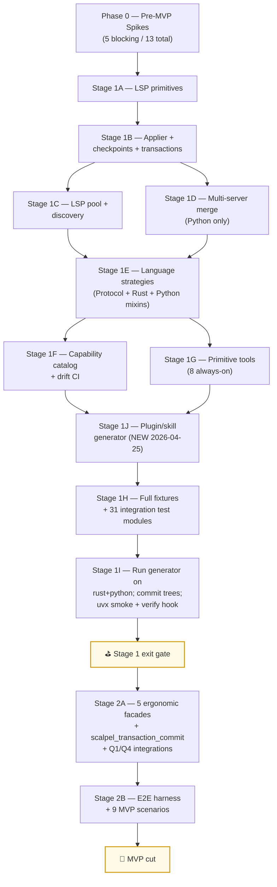

# o2.scalpel MVP — Execution Plan Index

> **For agentic workers:** REQUIRED SUB-SKILL: Use `superpowers:subagent-driven-development` (recommended) or `superpowers:executing-plans` to implement each sub-plan task-by-task. Each sub-plan uses checkbox (`- [ ]`) syntax for tracking.

**Goal:** Deliver the v2 full-coverage MVP described in [`docs/design/mvp/2026-04-24-mvp-scope-report.md`](../../design/mvp/2026-04-24-mvp-scope-report.md): 13 always-on MCP tools + ~11 deferred-loading specialty facades for Rust + Python, with full LSP capability coverage on chosen LSPs (rust-analyzer; pylsp + basedpyright + ruff), wired through a forked Serena MCP server.

**Architecture:** Three-layer extension of the Serena fork — primitive LSP layer (codeAction/resolve/executeCommand/applyEdit + multi-server merge), language-agnostic facades (5 ergonomic + 8 catalog/safety + dispatcher), and per-language `LanguageStrategy` plugins with Rust/Python mixin extensions. Distribution via `uvx --from <local-path>` at MVP; marketplace at v1.1. Stage 1 + Stage 2 = MVP cut; Stage 3 = v0.2.0.

**Tech Stack:** Python 3.11+ (Serena baseline), `multilspy`, `pydantic` v2, `platformdirs`, `pytest`, `pytest-asyncio`, `syrupy` (snapshot tests), `uv`, `rust-analyzer` (pinned), `python-lsp-server` + `pylsp-rope` + `pylsp-mypy` + `pylsp-ruff`, `basedpyright==1.39.3` (exact pin per [Q3 resolution](../../design/mvp/open-questions/q3-basedpyright-pinning.md)), `ruff` server.

---

## Why an index plan

The MVP is ~17,600 LoC across two LSPs, 14 source files in the fork, ~4 LSP processes, 9 E2E gates, ~70 integration sub-tests, ~120 unit sub-tests, plus 12 pre-MVP spikes. Per the `writing-plans` scope-check rule, this is multiple independent subsystems and must be split into sub-plans. Each sub-plan below produces working, testable software (or, for Phase 0, working evidence) on its own.

Sub-plans are executed in dependency order. Phase 0 must complete before Stage 1 begins; Stage 1 must complete before Stage 2 begins. Inside Stage 1 and Stage 2, parallelization is documented per the dependency graph in §14.5 of the scope report.

## Sub-plan inventory

| Phase | Sub-plan | Scope | Status |
|---|---|---|---|
| **Phase 0** | [`2026-04-24-phase-0-pre-mvp-spikes.md`](2026-04-24-phase-0-pre-mvp-spikes.md) | 12 spikes (5 blocking, 7 non-blocking) — bootstrap repo skeleton, seed `calcrs` + `calcpy` minimal fixtures, run each spike, record findings | **Plan ready** |
| **Stage 1A** | [`2026-04-24-stage-1a-lsp-primitives.md`](2026-04-24-stage-1a-lsp-primitives.md) | LSP primitive layer in `solidlsp` — codeAction/resolve/executeCommand facades, multi-callback `$/progress` tap, `applyEdit` reverse-request handler with WorkspaceEdit capture (per P1), reverse-request auto-responders, `wait_for_indexing()`, `override_initialize_params()` hook, `is_in_workspace()` filter. Files 1–3 of §14.1 (~550 LoC). **File 4 (`python_lsp.py` adapters) moved to Stage 1E** per SUMMARY §5 — adapters live with their strategy. | **Plan ready** |
| **Stage 1B** | [`2026-04-24-stage-1b-applier-checkpoints-transactions.md`](2026-04-24-stage-1b-applier-checkpoints-transactions.md) | `WorkspaceEdit` applier upgrade with full shape × options matrix; checkpoint/rollback machinery; transaction store. Files 5–7 of §14.1, ~830 LoC + ~60-80 unit tests. Consumes Stage 1A's `is_in_workspace` filter for boundary enforcement (Q4 §7.1). | **Plan ready** |
| **Stage 1C** | [`2026-04-24-stage-1c-lsp-pool-discovery.md`](2026-04-24-stage-1c-lsp-pool-discovery.md) | Per-(language, project_root) LSP pool, sibling-plugin discovery, lazy spawn, idle shutdown, `pool_pre_ping` health probe, RAM-budget guard, transaction acquire-affinity, telemetry. Files 8–9 of §14.1, ~290 LoC. | **DONE** (tag `stage-1c-lsp-pool-discovery-complete`) |
| **Stage 1D** | [`2026-04-24-stage-1d-multi-server-merge.md`](2026-04-24-stage-1d-multi-server-merge.md) | Python multi-LSP coordinator, two-stage priority + dedup-by-equivalence merge, §11.7 four invariants, rename merger with P6 reconciliation, edit-attribution log. File 10 of §14.1, ~430 LoC + multi-server unit tests. | **DONE** (tag `stage-1d-multi-server-merge-complete`) |
| **Stage 1E** | [`2026-04-25-stage-1e-python-strategies.md`](2026-04-25-stage-1e-python-strategies.md) | `LanguageStrategy` Protocol + `RustStrategyExtensions` + `PythonStrategyExtensions` mixins; `RustStrategy` skeleton with assist-family declarations + extension whitelist; `PythonStrategy` with multi-server orchestration + 14-step interpreter discovery + Rope library bridge. **Plus `PylspServer`/`BasedpyrightServer`/`RuffServer` adapters in `solidlsp/language_servers/`.** Files 11–14 of §14.1 + adapters, ~1,238 production LoC + ~940 test LoC. 10 tasks T0..T9; honors P3/P4/P5a/Q3 + Q1 cascade (no didSave). Closed Stage 1D T11 deferred concern (real `workspace/applyEdit` drain). | **DONE** (tag `stage-1e-python-strategies-complete`; 356/356 spike-suite green) |
| **Stage 1F** | [`2026-04-24-stage-1f-capability-catalog.md`](2026-04-24-stage-1f-capability-catalog.md) | Capability catalog assembly + drift CI assertion + golden-file checked-in baseline. File 15 of §14.1, ~324 production LoC + ~520 test LoC + 13-record golden JSON. 7 tasks T0..T6. | **DONE** (tag `stage-1f-capability-catalog-complete`; 391/391 + 1 skip green) |
| **Stage 1G** | [`2026-04-24-stage-1g-primitive-tools.md`](2026-04-24-stage-1g-primitive-tools.md) | All 8 primitive/safety/diagnostics MCP tools (`scalpel_capabilities_list`, `scalpel_capability_describe`, `scalpel_apply_capability`, `scalpel_dry_run_compose`, `scalpel_rollback`, `scalpel_transaction_rollback`, `scalpel_workspace_health`, `scalpel_execute_command`). File 16 of §14.1, ~1,206 production LoC + ~1,186 test LoC. 10 tasks T0..T9. | **DONE** (tag `stage-1g-primitive-tools-complete`; 448/1-skip green) |
| **Stage 1J** | [`2026-04-25-stage-1j-plugin-skill-generator.md`](2026-04-25-stage-1j-plugin-skill-generator.md) | **Pulled from v1.1 to MVP cut on 2026-04-25.** `o2-scalpel-newplugin` generator — introspects `LanguageStrategy` (1E) + capability catalog (1F) + primitive tools (1G); emits BOTH plugins (`.claude-plugin/plugin.json` + `.mcp.json` + hooks + README in boostvolt marketplace shape) AND skills (markdown + YAML frontmatter for LLM workflow guidance). 13 tasks T0..T12 (T13 = orchestrator-manual close). ~1,500 production LoC + 51 tests. Generated trees committed at parent root. | **DONE** (tag `stage-1j-plugin-skill-generator-complete`; submodule 499/1-skip green) |
| **Stage 1H** | [`2026-04-24-stage-1h-fixtures-integration-tests.md`](2026-04-24-stage-1h-fixtures-integration-tests.md) | Full `calcrs` + 18 RA companions; full `calcpy` + 4 sub-fixtures; 31 per-assist-family integration test modules (~70 sub-tests). Files 17 + 19 of §14.1, ~5,278 fixture LoC + ~3,930 test LoC. 13 tasks T0..T12. | **Plan ready** (drafted 2026-04-26; 6,061 lines) |
| **Stage 1I** | [`2026-04-24-stage-1i-plugin-package.md`](2026-04-24-stage-1i-plugin-package.md) | **Refactored 2026-04-25**: drops hand-written `o2-scalpel/.claude-plugin/plugin.json`; instead runs `o2-scalpel-newplugin --language rust --out o2-scalpel-rust/` + `--language python --out o2-scalpel-python/`; commits generated trees; keeps `verify-scalpel.sh` SessionStart hook + `uvx --from <local-path>` smoke wiring. File 20 of §14.1 replaced by generator output. 8 tasks T0..T7. | **Plan ready** (drafted 2026-04-26; 1,355 lines) |
| **Stage 2A** | [`2026-04-24-stage-2a-ergonomic-facades.md`](2026-04-24-stage-2a-ergonomic-facades.md) | 5 ergonomic intent facades + 13th always-on `scalpel_transaction_commit` + real `solidlsp` factory (Stage 1G placeholder) + Q4 workspace-boundary integration. Items 21–25c of §14.2, ~1,130 production LoC + ~1,840 test LoC. 12 tasks T0..T11. | **Plan ready** (drafted 2026-04-26; 3,835 lines) |
| **Stage 2B** | [`2026-04-24-stage-2b-e2e-harness-scenarios.md`](2026-04-24-stage-2b-e2e-harness-scenarios.md) | E2E harness (`test/e2e/conftest.py`, four-LSP wiring) + 9 MVP E2E scenarios + Q3 catalog-gate-blind-spot fixtures + Q4 workspace-boundary integration tests. Items 26–27b of §14.2, ~1,520 test LoC. 14 tasks T0..T14 (T10 collapsed). | **Plan ready** (drafted 2026-04-26; 3,221 lines) |

**Total MVP plans: 1 (this index) + Phase 0 + 10 Stage 1 sub-plans (1A–1J) + 2 Stage 2 sub-plans = 14 documents.** Stage 3 (v0.2.0) gets its own sub-plan tree after MVP ships.

## Dependency graph (high level)

Stage 1 sub-phases C / D are parallelizable after 1B exits. Sub-phases F and G are parallelizable after 1E exits. **Stage 1J (plugin/skill generator, inserted 2026-04-25 from v1.1) consumes both F and G** — it introspects the catalog (F) for plugin manifest contents and the primitive tools (G) for the surfaces generated plugins expose via `.mcp.json`. Sub-phase H runs after 1J exits so integration tests can use generated plugins. **Stage 1I refactored 2026-04-25**: drops hand-written manifest; instead runs the generator for rust + python and commits the generated trees. 1I is still the gate before Stage 2.

## Success criteria for the index

The index is "done" when every sub-plan has been executed, every sub-plan's exit gate is green, and the MVP cut gate from §14.2 of the scope report holds:

- 9 MVP E2E scenarios green (E1, E1-py, E2, E3, E9, E9-py, E10, E11, E12).
- 5 ergonomic facades pass per-facade integration tests.
- Stage 1 gate still green.
- `pytest -m e2e` completes within wall-clock budget on CI runner.
- `O2_SCALPEL_DISABLE_LANGS={rust,python}` opt-out paths exercised in degradation tests.

## Out of scope for these plans

- Stage 3 = v0.2.0 — separate plan tree after MVP cut.
- Marketplace publication at `o2alexanderfedin/claude-code-plugins` — v1.1.
- C/C++, Go, Java, TypeScript strategies — v2+ per cut list (§4.2 of scope report).
- IDE-debug rust-analyzer extensions (`viewHir`, `viewMir`, `viewCrateGraph`) — reachable via primitives only, not surfaced.
- Persistent checkpoints beyond LRU + `.serena/checkpoints/` — v1.1.
- Plugin generator (`o2-scalpel-newplugin`) — v1.1.

## Sources of truth referenced by every sub-plan

- [`docs/design/mvp/2026-04-24-mvp-scope-report.md`](../../design/mvp/2026-04-24-mvp-scope-report.md) — canonical specification
- [`docs/design/2026-04-24-serena-rust-refactoring-extensions-design.md`](../../design/2026-04-24-serena-rust-refactoring-extensions-design.md) — original design report
- [`docs/design/2026-04-24-o2-scalpel-open-questions-resolution.md`](../../design/2026-04-24-o2-scalpel-open-questions-resolution.md) — Q10–Q14 resolutions
- [`docs/design/mvp/open-questions/q1-pylsp-mypy-live-mode.md`](../../design/mvp/open-questions/q1-pylsp-mypy-live-mode.md), `q2-*.md`, `q3-*.md`, `q4-*.md` — Q1–Q4 resolutions
- `CLAUDE.md` — project rules (no time estimates; size by S/M/L+LoC; TDD; AI Hive(R) author; no PRs)

## Author

AI Hive(R), 2026-04-24.
