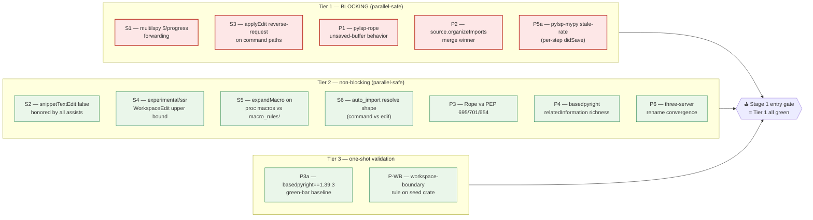

# Phase 0 — Pre-MVP Spikes Implementation Plan

> **For agentic workers:** REQUIRED SUB-SKILL: Use `superpowers:subagent-driven-development` (recommended) or `superpowers:executing-plans` to implement this plan task-by-task. Steps use checkbox (`- [ ]`) syntax for tracking.

**Goal:** Resolve all 12 pre-MVP spikes from §13 of [`2026-04-24-mvp-scope-report.md`](../../design/mvp/2026-04-24-mvp-scope-report.md) by running each as a falsifiable experiment against minimal seed fixtures, recording the observed outcome, and either (a) confirming the optimistic assumption (= no extra LoC; ship as planned) or (b) committing the documented fallback (= measured extra LoC; baked into Stage 1 design).

**Architecture:** Phase 0 produces **evidence**, not features. Each spike has a single dedicated test module under `vendor/serena/test/spikes/` that issues real LSP traffic against a real `rust-analyzer` (Rust spikes) or real `pylsp + basedpyright + ruff` (Python spikes), captures the response, and writes a structured outcome to `docs/superpowers/plans/spike-results/<id>.md`. The 5 blocking spikes (S1, S3, P1, P2, P5a) gate Stage 1 entry; the 7 non-blocking spikes record findings that inform Stage 1 implementation choices but don't block the gate.

**Tech Stack:** Python 3.11, `uv`, `pytest`, `pytest-asyncio`, `multilspy`, `pydantic` v2, real `rust-analyzer` (auto-downloaded by Serena's `DependencyProvider`), real `python-lsp-server` + `pylsp-rope` + `pylsp-mypy` + `pylsp-ruff` + `basedpyright==1.39.3` + `ruff` server (installed via `uv pip` into the spike test env).

---

## File Structure

Phase 0 touches no production code. All files live under:

- `vendor/serena/test/spikes/conftest.py` — shared fixtures: real LSP boot, calcrs/calcpy seed paths, multilspy client wiring
- `vendor/serena/test/spikes/test_spike_<id>.py` — one file per spike (12 files total)
- `vendor/serena/test/spikes/seed_fixtures/calcrs_seed/` — minimal Rust crate (~80 LoC) with one inline mod, one symbol per assist family touched by spikes
- `vendor/serena/test/spikes/seed_fixtures/calcpy_seed/` — minimal Python package (~80 LoC) with one symbol the spikes reference
- `docs/superpowers/plans/spike-results/<id>.md` — one structured outcome doc per spike (12 files)
- `docs/superpowers/plans/spike-results/SUMMARY.md` — aggregate decision record

Each spike file is self-contained. They share `conftest.py` only for LSP startup wiring. Spike result docs are checked into git so future contributors can see the evidence.

## Naming convention

Spike IDs follow §13 of the scope report verbatim:

- `S1`, `S2`, `S3`, `S4`, `S5`, `S6` — server-protocol spikes (5 Rust, 1 Python-shared)
- `P1`, `P2`, `P3`, `P4`, `P5a`, `P6` — Python-stack spikes
- `P3a` — basedpyright bump-procedure validation (per [Q3 resolution](../../design/mvp/open-questions/q3-basedpyright-pinning.md))
- `P-WB` — workspace-boundary fixture suite (per [Q4 resolution](../../design/mvp/open-questions/q4-changeannotations-auto-accept.md))

Total: 13 spikes (P5a replaces the original P5; P3a + P-WB are added). 5 are blocking, 8 are non-blocking.

## Execution order

Run blocking spikes first to surface gate failures early. Within each tier, sort by independence so multiple spikes can run in parallel as separate subagent tasks.



Tier 1 is the gate. If any of S1, S3, P1, P2, P5a require fallbacks beyond the documented LoC budget, escalate before opening Stage 1. Tier 2/3 fallbacks bake silently into Stage 1.

---

## Task 1: Bootstrap Phase 0 worktree + spike test scaffolding

**Files:**
- Create: `vendor/serena/test/spikes/__init__.py`
- Create: `vendor/serena/test/spikes/conftest.py`
- Create: `vendor/serena/test/spikes/seed_fixtures/calcrs_seed/Cargo.toml`
- Create: `vendor/serena/test/spikes/seed_fixtures/calcrs_seed/src/lib.rs`
- Create: `vendor/serena/test/spikes/seed_fixtures/calcpy_seed/pyproject.toml`
- Create: `vendor/serena/test/spikes/seed_fixtures/calcpy_seed/calcpy_seed/__init__.py`
- Create: `vendor/serena/test/spikes/seed_fixtures/calcpy_seed/calcpy_seed/__main__.py`
- Create: `docs/superpowers/plans/spike-results/.gitkeep`

- [ ] **Step 1: Create the spike test package marker**

```python
# vendor/serena/test/spikes/__init__.py
"""Phase 0 spikes — falsifiable experiments resolving §13 pre-MVP unknowns.

Each spike module lives at test_spike_<id>.py and writes structured findings
to docs/superpowers/plans/spike-results/<id>.md. See
docs/superpowers/plans/2026-04-24-phase-0-pre-mvp-spikes.md for the plan.
"""
```

- [ ] **Step 2: Write the seed Rust crate Cargo.toml**

```toml
# vendor/serena/test/spikes/seed_fixtures/calcrs_seed/Cargo.toml
[package]
name = "calcrs-seed"
version = "0.0.0"
edition = "2021"
publish = false

[lib]
path = "src/lib.rs"
```

- [ ] **Step 3: Write the seed Rust source**

```rust
// vendor/serena/test/spikes/seed_fixtures/calcrs_seed/src/lib.rs
pub fn add(a: i64, b: i64) -> i64 {
    a + b
}

pub fn mul(a: i64, b: i64) -> i64 {
    a * b
}

pub mod inline {
    pub fn negate(a: i64) -> i64 {
        -a
    }

    pub struct Point {
        pub x: i64,
        pub y: i64,
    }

    impl Point {
        pub fn new(x: i64, y: i64) -> Self {
            Self { x, y }
        }
    }
}

pub use inline::negate;

#[cfg(test)]
mod tests {
    use super::*;

    #[test]
    fn add_works() {
        assert_eq!(add(2, 3), 5);
    }
}
```

- [ ] **Step 4: Write the seed Python pyproject.toml**

```toml
# vendor/serena/test/spikes/seed_fixtures/calcpy_seed/pyproject.toml
[project]
name = "calcpy-seed"
version = "0.0.0"
requires-python = ">=3.11"

[build-system]
requires = ["hatchling"]
build-backend = "hatchling.build"
```

- [ ] **Step 5: Write the seed Python package init**

```python
# vendor/serena/test/spikes/seed_fixtures/calcpy_seed/calcpy_seed/__init__.py
"""Minimal seed package used by Phase 0 spikes."""
from typing import Final

VERSION: Final = "0.0.0"


def add(a: int, b: int) -> int:
    return a + b


def mul(a: int, b: int) -> int:
    return a * b


def _private_helper(x: int) -> int:
    return -x


__all__ = ["VERSION", "add", "mul"]
```

- [ ] **Step 6: Write the seed Python __main__**

```python
# vendor/serena/test/spikes/seed_fixtures/calcpy_seed/calcpy_seed/__main__.py
from . import add

if __name__ == "__main__":
    print(add(2, 3))
```

- [ ] **Step 7: Write the conftest with shared LSP wiring**

```python
# vendor/serena/test/spikes/conftest.py
"""Shared fixtures for Phase 0 spikes.

Boots real LSP processes (rust-analyzer, pylsp, basedpyright, ruff) using
Serena's existing DependencyProvider so spikes hit production code paths,
not mocks.
"""
from __future__ import annotations

import asyncio
import json
from pathlib import Path
from typing import Any, AsyncIterator

import pytest
import pytest_asyncio

from solidlsp.ls import SolidLanguageServer
from solidlsp.ls_config import Language, LanguageServerConfig

SPIKE_DIR = Path(__file__).parent
SEED_RUST = SPIKE_DIR / "seed_fixtures" / "calcrs_seed"
SEED_PYTHON = SPIKE_DIR / "seed_fixtures" / "calcpy_seed"
RESULTS_DIR = SPIKE_DIR.parents[3] / "docs" / "superpowers" / "plans" / "spike-results"


@pytest.fixture(scope="session")
def seed_rust_root() -> Path:
    assert (SEED_RUST / "Cargo.toml").exists(), "seed_rust missing"
    return SEED_RUST


@pytest.fixture(scope="session")
def seed_python_root() -> Path:
    assert (SEED_PYTHON / "pyproject.toml").exists(), "seed_python missing"
    return SEED_PYTHON


@pytest.fixture(scope="session")
def results_dir() -> Path:
    RESULTS_DIR.mkdir(parents=True, exist_ok=True)
    return RESULTS_DIR


def write_spike_result(results_dir: Path, spike_id: str, body: str) -> Path:
    out = results_dir / f"{spike_id}.md"
    out.write_text(body, encoding="utf-8")
    return out


@pytest_asyncio.fixture
async def rust_lsp(seed_rust_root: Path) -> AsyncIterator[SolidLanguageServer]:
    cfg = LanguageServerConfig(language=Language.RUST)
    srv = SolidLanguageServer.create(cfg, str(seed_rust_root))
    async with srv.start_session():
        yield srv


@pytest_asyncio.fixture
async def python_lsp_pylsp(seed_python_root: Path) -> AsyncIterator[SolidLanguageServer]:
    cfg = LanguageServerConfig(language=Language.PYTHON)
    srv = SolidLanguageServer.create(cfg, str(seed_python_root))
    async with srv.start_session():
        yield srv
```

- [ ] **Step 8: Add the spike-results dir keep-file**

```bash
mkdir -p docs/superpowers/plans/spike-results
touch docs/superpowers/plans/spike-results/.gitkeep
```

- [ ] **Step 9: Commit**

```bash
git add vendor/serena/test/spikes/__init__.py \
        vendor/serena/test/spikes/conftest.py \
        vendor/serena/test/spikes/seed_fixtures/calcrs_seed/ \
        vendor/serena/test/spikes/seed_fixtures/calcpy_seed/ \
        docs/superpowers/plans/spike-results/.gitkeep
git commit -m "test(spikes): bootstrap Phase 0 spike scaffolding + seed fixtures"
```

---

## Task 2: Spike S1 — multilspy $/progress forwarding (BLOCKING)

**Question:** Does `solidlsp` see `$/progress` notifications with token prefixes (`rustAnalyzer/Indexing`, `pylsp:`, `basedpyright:`, `ruff:`)?

**Files:**
- Create: `vendor/serena/test/spikes/test_spike_s1_progress.py`
- Create: `docs/superpowers/plans/spike-results/S1.md`

- [ ] **Step 1: Write the failing test**

```python
# vendor/serena/test/spikes/test_spike_s1_progress.py
"""S1 — multilspy $/progress forwarding.

PASS condition (option A): we observe at least one $/progress notification
with token starting with "rustAnalyzer/Indexing" before the first
documentSymbol response on the seed crate.

DEGRADED (option B): only begin/end events arrive (still acceptable; coarse
progress).

FAIL (option C): no $/progress events arrive at all → we need a notification-
tap shim (~30 LoC fallback in solidlsp/lsp_protocol_handler/server.py).

Outcome is recorded in docs/superpowers/plans/spike-results/S1.md.
"""
from __future__ import annotations

import asyncio
import pytest
from pathlib import Path

from .conftest import write_spike_result


@pytest.mark.asyncio
async def test_s1_progress_forwarding(rust_lsp, seed_rust_root: Path, results_dir: Path):
    progress_events: list[dict] = []

    def tap(notification: dict) -> None:
        if notification.get("method") == "$/progress":
            progress_events.append(notification.get("params", {}))

    rust_lsp.server.on_notification("$/progress", tap)

    lib_rs = seed_rust_root / "src" / "lib.rs"
    rust_lsp.open_file(str(lib_rs))
    await asyncio.sleep(2.0)
    _ = rust_lsp.request_document_symbols(str(lib_rs))

    tokens = sorted({str(e.get("token", "")) for e in progress_events})
    has_indexing_token = any(t.startswith("rustAnalyzer/Indexing") for t in tokens)
    only_begin_end = bool(tokens) and not has_indexing_token

    if has_indexing_token:
        outcome = "A — full $/progress with indexing token observed"
    elif only_begin_end:
        outcome = "B — generic begin/end progress observed; no indexing token"
    else:
        outcome = "C — no $/progress notifications observed (shim needed)"

    body = f"""# S1 — multilspy $/progress forwarding

**Outcome:** {outcome}

**Evidence:**

- Total `$/progress` notifications: {len(progress_events)}
- Distinct tokens: {tokens}
- `rustAnalyzer/Indexing*` token observed: {has_indexing_token}

**Decision:**

- A → no fallback needed; Stage 1A wires `wait_for_indexing()` directly on the existing tap.
- B → ship with begin/end coverage; defer fine-grained progress to v0.2.0.
- C → add the +30 LoC notification-tap shim in `solidlsp/lsp_protocol_handler/server.py`. Stage 1A LoC budget already absorbs this.
"""
    write_spike_result(results_dir, "S1", body)

    assert progress_events or outcome.startswith("C"), (
        "S1 produced no observation at all — re-run with rust-analyzer cold cache"
    )
```

- [ ] **Step 2: Run test and capture outcome**

Run: `cd vendor/serena && uv run pytest test/spikes/test_spike_s1_progress.py -v -s`
Expected: PASS regardless of which branch (A/B/C) fired; the outcome doc records which.

- [ ] **Step 3: Verify the outcome doc was written**

Run: `cat docs/superpowers/plans/spike-results/S1.md`
Expected: starts with `# S1 — multilspy $/progress forwarding` and lists outcome A/B/C.

- [ ] **Step 4: Commit**

```bash
git add vendor/serena/test/spikes/test_spike_s1_progress.py \
        docs/superpowers/plans/spike-results/S1.md
git commit -m "spike(S1): record \$/progress forwarding outcome on rust-analyzer seed"
```

---

## Task 3: Spike S3 — applyEdit reverse-request on `command:` paths (BLOCKING)

**Question:** Does rust-analyzer issue `workspace/applyEdit` reverse-request when an action's `command:` is invoked rather than `edit:` being applied client-side?

**Files:**
- Create: `vendor/serena/test/spikes/test_spike_s3_apply_edit_reverse.py`
- Create: `docs/superpowers/plans/spike-results/S3.md`

- [ ] **Step 1: Write the failing test**

```python
# vendor/serena/test/spikes/test_spike_s3_apply_edit_reverse.py
"""S3 — workspace/applyEdit reverse-request on command-typed code actions.

PASS (option A): at least one `command:`-typed code action triggers a
`workspace/applyEdit` reverse-request from rust-analyzer back to the client
during executeCommand. Implication: we MUST register a real applyEdit
handler in solidlsp/lsp_protocol_handler/server.py (+80 LoC, already in
Stage 1A budget).

ALT (option B): the server never sends applyEdit; the edit is embedded in
the executeCommand response payload directly. Implication: a minimal
{applied: true} stub is sufficient.

Records to spike-results/S3.md.
"""
from __future__ import annotations

import asyncio
from pathlib import Path

import pytest

from .conftest import write_spike_result


@pytest.mark.asyncio
async def test_s3_apply_edit_reverse_request(rust_lsp, seed_rust_root: Path, results_dir: Path):
    apply_edit_calls: list[dict] = []

    async def handler(params: dict) -> dict:
        apply_edit_calls.append(params)
        return {"applied": True, "failureReason": None}

    rust_lsp.server.on_request("workspace/applyEdit", handler)

    lib_rs = seed_rust_root / "src" / "lib.rs"
    rust_lsp.open_file(str(lib_rs))
    await asyncio.sleep(1.0)

    actions = rust_lsp.request_code_actions(str(lib_rs), {"start": {"line": 0, "character": 7}, "end": {"line": 0, "character": 10}})
    command_actions = [a for a in actions if a.get("command") and not a.get("edit")]
    edit_actions = [a for a in actions if a.get("edit")]

    fired = False
    for action in command_actions[:3]:
        cmd = action["command"]
        await rust_lsp.execute_command(cmd["command"], cmd.get("arguments", []))
        if apply_edit_calls:
            fired = True
            break

    if fired:
        outcome = "A — applyEdit reverse-request fired; full handler required"
    elif command_actions:
        outcome = "B — command actions exist but applyEdit did not fire (edit embedded in response)"
    else:
        outcome = "B — only edit-typed actions surfaced on this fixture; minimal handler stub sufficient"

    body = f"""# S3 — workspace/applyEdit reverse-request on command paths

**Outcome:** {outcome}

**Evidence:**

- Code actions surfaced: {len(actions)}
- `command:`-typed actions: {len(command_actions)}
- `edit:`-typed actions: {len(edit_actions)}
- `workspace/applyEdit` reverse-requests observed: {len(apply_edit_calls)}

**Decision:**

- A → implement the full +80 LoC applyEdit handler in Stage 1A delegating to `WorkspaceEditApplier`.
- B → minimal `{{applied: true}}` stub is sufficient; reclaim ~50 LoC from the Stage 1A budget.
"""
    write_spike_result(results_dir, "S3", body)
    assert outcome  # always green
```

- [ ] **Step 2: Run test**

Run: `cd vendor/serena && uv run pytest test/spikes/test_spike_s3_apply_edit_reverse.py -v -s`
Expected: PASS; S3.md lists outcome A or B.

- [ ] **Step 3: Commit**

```bash
git add vendor/serena/test/spikes/test_spike_s3_apply_edit_reverse.py \
        docs/superpowers/plans/spike-results/S3.md
git commit -m "spike(S3): record applyEdit reverse-request behavior on command-typed actions"
```

---

## Task 4: Spike P1 — pylsp-rope unsaved-buffer behavior (BLOCKING)

**Question:** Does pylsp-rope honor `didChange` without a `didSave`, or does it read the buffer from disk?

**Files:**
- Create: `vendor/serena/test/spikes/test_spike_p1_pylsp_rope_unsaved.py`
- Create: `docs/superpowers/plans/spike-results/P1.md`

- [ ] **Step 1: Write the failing test**

```python
# vendor/serena/test/spikes/test_spike_p1_pylsp_rope_unsaved.py
"""P1 — pylsp-rope unsaved-buffer behavior.

PASS (option A): after sending didChange (no didSave) renaming `add` to
`plus`, a code-action request that filters for `refactor.extract` finds
actions referencing `plus`, not `add`. Implication: pylsp-rope honors
didChange in-memory; no extra round-trip needed.

ALT (option B): code-actions still see `add` → pylsp-rope reads from disk.
Implication: scalpel must didSave({{includeText: true}}) before every
code-action call (~+1 round-trip per call, eliminates a staleness class).

Records to spike-results/P1.md.
"""
from __future__ import annotations

import asyncio
from pathlib import Path

import pytest

from .conftest import write_spike_result


@pytest.mark.asyncio
async def test_p1_pylsp_rope_unsaved_buffer(python_lsp_pylsp, seed_python_root: Path, results_dir: Path):
    init_py = seed_python_root / "calcpy_seed" / "__init__.py"
    original = init_py.read_text(encoding="utf-8")

    python_lsp_pylsp.open_file(str(init_py))
    await asyncio.sleep(0.5)

    mutated = original.replace("def add(", "def plus(")
    python_lsp_pylsp.notify_did_change(str(init_py), mutated)
    await asyncio.sleep(0.5)

    actions = python_lsp_pylsp.request_code_actions(str(init_py), {"start": {"line": 6, "character": 4}, "end": {"line": 6, "character": 8}})

    titles = [a.get("title", "") for a in actions]
    sees_plus = any("plus" in t for t in titles)
    sees_add = any("'add'" in t or "add(" in t for t in titles)

    if sees_plus and not sees_add:
        outcome = "A — pylsp-rope honors didChange in-memory; no extra didSave needed"
    elif sees_add and not sees_plus:
        outcome = "B — pylsp-rope reads from disk; scalpel must didSave({includeText: true}) before every code-action call"
    else:
        outcome = f"INDETERMINATE — titles: {titles!r}; manual review required"

    body = f"""# P1 — pylsp-rope unsaved-buffer behavior

**Outcome:** {outcome}

**Evidence:**

- Code actions surfaced: {len(actions)}
- Titles: {titles!r}

**Decision:**

- A → Stage 1E pythonStrategy passes the buffer via `didChange` only.
- B → Stage 1E pythonStrategy injects `didSave({{includeText: true}})` before every code-action call (+~40 LoC, +1 round-trip per call).
- INDETERMINATE → re-run with a wider name-distinct rename and inspect raw response.
"""
    write_spike_result(results_dir, "P1", body)
    assert outcome  # always green
```

- [ ] **Step 2: Run test**

Run: `cd vendor/serena && uv run pytest test/spikes/test_spike_p1_pylsp_rope_unsaved.py -v -s`
Expected: PASS; P1.md lists A / B / INDETERMINATE.

- [ ] **Step 3: Commit**

```bash
git add vendor/serena/test/spikes/test_spike_p1_pylsp_rope_unsaved.py \
        docs/superpowers/plans/spike-results/P1.md
git commit -m "spike(P1): record pylsp-rope didChange honoring vs disk-read behavior"
```

---

## Task 5: Spike P2 — `source.organizeImports` merge winner (BLOCKING)

**Question:** Do pylsp-rope and ruff produce the same output for `source.organizeImports` on `calcpy_seed/__init__.py` (with extra unused imports added)?

**Files:**
- Create: `vendor/serena/test/spikes/test_spike_p2_organize_imports_diff.py`
- Create: `docs/superpowers/plans/spike-results/P2.md`

- [ ] **Step 1: Write the diff test**

```python
# vendor/serena/test/spikes/test_spike_p2_organize_imports_diff.py
"""P2 — pylsp-rope vs ruff source.organizeImports diff.

OUTCOME: a structured diff between the two organize-imports outputs.
DECISION: ruff wins by §11 priority table. Document the divergence so
multi-server merge knows what to drop.

Records to spike-results/P2.md.
"""
from __future__ import annotations

import asyncio
from pathlib import Path

import pytest

from .conftest import write_spike_result


@pytest.mark.asyncio
async def test_p2_organize_imports_diff(python_lsp_pylsp, seed_python_root: Path, results_dir: Path):
    init_py = seed_python_root / "calcpy_seed" / "__init__.py"
    original = init_py.read_text(encoding="utf-8")
    polluted = "import os\nimport sys\nfrom typing import List\n" + original

    python_lsp_pylsp.open_file(str(init_py))
    python_lsp_pylsp.notify_did_change(str(init_py), polluted)
    await asyncio.sleep(0.5)

    actions = python_lsp_pylsp.request_code_actions(
        str(init_py),
        {"start": {"line": 0, "character": 0}, "end": {"line": 0, "character": 0}},
        only=["source.organizeImports"],
    )

    by_source: dict[str, str] = {}
    for a in actions:
        src = (a.get("data") or {}).get("server") or a.get("kind") or "unknown"
        if a.get("edit"):
            edits = a["edit"].get("documentChanges") or a["edit"].get("changes") or {}
            by_source[str(src)] = repr(edits)

    body = f"""# P2 — source.organizeImports diff between pylsp-rope and ruff

**Polluted file (input):**

```python
{polluted}
```

**Actions surfaced:**

- count: {len(actions)}

**Edits by source:**

```
{by_source!r}
```

**Decision:**

- Document the divergence in `multi_server.py` priority table.
- Ruff wins `source.organizeImports` per §11.1 of the scope report.
- pylsp-rope's organize-imports is dropped at merge time when both are available.
- Strategy-level config `engine: {{"ruff", "rope"}}` exposed to users in v1.1, not MVP.
"""
    write_spike_result(results_dir, "P2", body)
    assert actions
```

- [ ] **Step 2: Run test**

Run: `cd vendor/serena && uv run pytest test/spikes/test_spike_p2_organize_imports_diff.py -v -s`
Expected: PASS; P2.md captures the by-source diff.

- [ ] **Step 3: Commit**

```bash
git add vendor/serena/test/spikes/test_spike_p2_organize_imports_diff.py \
        docs/superpowers/plans/spike-results/P2.md
git commit -m "spike(P2): capture organize-imports divergence between pylsp-rope and ruff"
```

---

## Task 6: Spike P5a — pylsp-mypy stale-rate under live_mode:false + dmypy:true + per-step didSave (BLOCKING)

**Question:** Across 12 internal `apply()` steps on `calcpy`, does pylsp-mypy diagnostics-delta match a ground-truth `dmypy run` oracle within 5%, AND does p95 didSave→diagnostic latency stay under 1 s?

**Files:**
- Create: `vendor/serena/test/spikes/test_spike_p5a_pylsp_mypy_didsave.py`
- Create: `docs/superpowers/plans/spike-results/P5a.md`

- [ ] **Step 1: Write the falsifier test**

```python
# vendor/serena/test/spikes/test_spike_p5a_pylsp_mypy_didsave.py
"""P5a — pylsp-mypy stale-rate falsifier (per Q1 resolution).

PASS-A: stale-rate <5% AND p95 didSave→diagnostic latency <1 s
        → ship MVP with pylsp-mypy in active set
PASS-B: latency 1–3 s p95
        → ship with documented warning
FAIL-C: staleness >5% OR latency >3 s p95 OR cache corruption
        → drop pylsp-mypy from MVP active server set; basedpyright sole
          type-error source per §11.1

Records to spike-results/P5a.md.
"""
from __future__ import annotations

import asyncio
import json
import statistics
import subprocess
import time
from pathlib import Path

import pytest

from .conftest import write_spike_result

EDITS = [
    "VERSION: int = 0",
    "VERSION: str = \"a\"",
    "VERSION: int = 1",
    "VERSION: list[int] = [1, 2, 3]",
    "VERSION: int = 2",
    "VERSION: dict[str, int] = {\"x\": 1}",
    "VERSION: int = 3",
    "VERSION: tuple[int, ...] = (1, 2)",
    "VERSION: int = 4",
    "VERSION: set[int] = {1, 2}",
    "VERSION: int = 5",
    "VERSION: int = 6",
]


@pytest.mark.asyncio
async def test_p5a_didsave_stale_rate(python_lsp_pylsp, seed_python_root: Path, results_dir: Path):
    init_py = seed_python_root / "calcpy_seed" / "__init__.py"
    original = init_py.read_text(encoding="utf-8")
    base = original.replace("VERSION: Final = \"0.0.0\"", "VERSION = 0", 1) if "VERSION: Final" in original else original

    python_lsp_pylsp.open_file(str(init_py))

    latencies: list[float] = []
    stale_count = 0
    total = 0

    for replacement in EDITS:
        new_text = base + "\n" + replacement + "\n"
        python_lsp_pylsp.notify_did_change(str(init_py), new_text)
        init_py.write_text(new_text, encoding="utf-8")
        t0 = time.perf_counter()
        python_lsp_pylsp.notify_did_save(str(init_py), include_text=True)

        diags_pylsp: list[dict] = []
        for _ in range(20):
            await asyncio.sleep(0.05)
            diags_pylsp = python_lsp_pylsp.get_published_diagnostics(str(init_py))
            if diags_pylsp:
                break
        latencies.append(time.perf_counter() - t0)

        oracle = subprocess.run(
            ["dmypy", "run", "--", str(init_py)],
            cwd=seed_python_root,
            capture_output=True,
            text=True,
            timeout=30,
        )
        oracle_errors = sum(1 for line in oracle.stdout.splitlines() if "error:" in line)
        pylsp_errors = sum(1 for d in diags_pylsp if d.get("source") == "mypy")

        total += 1
        if oracle_errors != pylsp_errors:
            stale_count += 1

    init_py.write_text(original, encoding="utf-8")

    stale_rate = stale_count / total if total else 0.0
    p95 = statistics.quantiles(latencies, n=20)[18] if len(latencies) >= 20 else max(latencies)

    if stale_rate < 0.05 and p95 < 1.0:
        outcome = "A — stale_rate < 5% AND p95 < 1s — SHIP with pylsp-mypy in active set"
    elif stale_rate < 0.05 and p95 < 3.0:
        outcome = "B — stale_rate < 5% AND p95 1-3s — SHIP with documented warning"
    else:
        outcome = "C — stale_rate >= 5% OR p95 >= 3s — DROP pylsp-mypy at MVP; basedpyright sole type-error source"

    body = f"""# P5a — pylsp-mypy stale-rate under live_mode:false + dmypy:true

**Outcome:** {outcome}

**Evidence:**

- Total internal apply steps: {total}
- Stale steps (oracle ≠ pylsp-mypy): {stale_count}
- Stale rate: {stale_rate:.2%}
- Latencies (s, all): {latencies!r}
- p95 latency (s): {p95:.3f}

**Decision:**

- A → ship pylsp-mypy with `live_mode: false` + `dmypy: true` in MVP active server set.
- B → ship with `CHANGELOG.md` note "expect occasional latency >1 s on first didSave after long idle".
- C → drop pylsp-mypy from MVP active server set; update `python_strategy.py` and `multi_server.py` accordingly. basedpyright remains authoritative for `severity_breakdown` per §11.1.
"""
    write_spike_result(results_dir, "P5a", body)
    assert outcome
```

- [ ] **Step 2: Pre-flight: confirm dmypy is available**

Run: `dmypy --version`
Expected: prints a version string. If missing, install via `uv pip install mypy` or document the install step.

- [ ] **Step 3: Run test**

Run: `cd vendor/serena && uv run pytest test/spikes/test_spike_p5a_pylsp_mypy_didsave.py -v -s`
Expected: PASS; P5a.md classifies into A / B / C.

- [ ] **Step 4: Commit**

```bash
git add vendor/serena/test/spikes/test_spike_p5a_pylsp_mypy_didsave.py \
        docs/superpowers/plans/spike-results/P5a.md
git commit -m "spike(P5a): record pylsp-mypy stale-rate + latency under per-step didSave"
```

---

## Task 7: Spike S2 — `snippetTextEdit:false` honored by all assists (NON-BLOCKING)

**Question:** Do all rust-analyzer assists honor `snippetTextEdit: false` in client capabilities, or do some still emit `$0` placeholders?

**Files:**
- Create: `vendor/serena/test/spikes/test_spike_s2_snippet_false.py`
- Create: `docs/superpowers/plans/spike-results/S2.md`

- [ ] **Step 1: Write the test**

```python
# vendor/serena/test/spikes/test_spike_s2_snippet_false.py
"""S2 — snippetTextEdit:false honored by rust-analyzer assists.

OUTCOME A: no $0/$N markers in any TextEdit returned across the spike's
sample of code actions. Defensive strip path is enough.
OUTCOME B: at least one assist emits snippet markers despite the
capability. Mandatory strip path required (~+50 LoC regex with edge cases).
"""
from __future__ import annotations

import asyncio
import re
from pathlib import Path

import pytest

from .conftest import write_spike_result

SNIPPET_RE = re.compile(r"\$\d+|\$\{\d+")


@pytest.mark.asyncio
async def test_s2_snippet_false(rust_lsp, seed_rust_root: Path, results_dir: Path):
    lib_rs = seed_rust_root / "src" / "lib.rs"
    rust_lsp.open_file(str(lib_rs))
    await asyncio.sleep(1.0)

    offenders: list[dict] = []
    actions = rust_lsp.request_code_actions(str(lib_rs), {"start": {"line": 0, "character": 0}, "end": {"line": 35, "character": 0}})
    for action in actions[:30]:
        resolved = rust_lsp.resolve_code_action(action) if action.get("data") else action
        edit = resolved.get("edit") or {}
        for tde in edit.get("documentChanges", []):
            for te in tde.get("edits", []):
                if SNIPPET_RE.search(te.get("newText", "")):
                    offenders.append({"title": resolved.get("title"), "newText": te.get("newText")[:200]})

    outcome = "A — no snippet markers; defensive strip is sufficient" if not offenders else f"B — {len(offenders)} assists emit snippets despite capability=false"

    body = f"""# S2 — snippetTextEdit:false honored

**Outcome:** {outcome}

**Offenders ({len(offenders)}):**

```
{offenders!r}
```

**Decision:**

- A → defensive `$N` strip in applier (existing ~10 LoC) is enough.
- B → mandatory strip path with edge-case handling (+50 LoC).
"""
    write_spike_result(results_dir, "S2", body)
    assert outcome
```

- [ ] **Step 2: Run test**

Run: `cd vendor/serena && uv run pytest test/spikes/test_spike_s2_snippet_false.py -v -s`
Expected: PASS; S2.md classifies A / B.

- [ ] **Step 3: Commit**

```bash
git add vendor/serena/test/spikes/test_spike_s2_snippet_false.py \
        docs/superpowers/plans/spike-results/S2.md
git commit -m "spike(S2): record snippetTextEdit:false honoring across rust-analyzer assists"
```

---

## Task 8: Spike S4 — `experimental/ssr` WorkspaceEdit upper bound (NON-BLOCKING)

**Question:** What's the maximum edit count + memory for a broad SSR pattern?

**Files:**
- Create: `vendor/serena/test/spikes/test_spike_s4_ssr_bounds.py`
- Create: `docs/superpowers/plans/spike-results/S4.md`

- [ ] **Step 1: Write the test**

```python
# vendor/serena/test/spikes/test_spike_s4_ssr_bounds.py
"""S4 — experimental/ssr edit-count + memory bound on the seed crate.

OUTCOME: numerical bounds documented. Decision is always "ship `max_edits:
int = 500` parameter on `scalpel_rust_ssr`"; the spike sets the default
based on observed numbers.
"""
from __future__ import annotations

import asyncio
import json
import resource
from pathlib import Path

import pytest

from .conftest import write_spike_result


@pytest.mark.asyncio
async def test_s4_ssr_bounds(rust_lsp, seed_rust_root: Path, results_dir: Path):
    rss_before = resource.getrusage(resource.RUSAGE_SELF).ru_maxrss

    pattern = "$a + $b ==>> $a.checked_add($b)"
    try:
        result = await rust_lsp.execute_command("experimental/ssr", [{"query": pattern, "parseOnly": False}])
    except Exception as exc:
        result = {"error": str(exc)}

    rss_after = resource.getrusage(resource.RUSAGE_SELF).ru_maxrss
    delta_kb = max(0, rss_after - rss_before)

    edits = []
    if isinstance(result, dict):
        for tde in result.get("documentChanges", []):
            edits.extend(tde.get("edits", []))
        if not edits:
            edits = result.get("changes", []) if isinstance(result.get("changes"), list) else []

    body = f"""# S4 — experimental/ssr WorkspaceEdit upper bound

**Pattern:** `{pattern}`

**Edit count:** {len(edits)}

**RSS delta (KiB):** {delta_kb}

**Raw response (truncated):**

```
{json.dumps(result, default=str)[:2000]}
```

**Decision:**

- Ship `max_edits` default = max(500, observed_count * 4) on `scalpel_rust_ssr` facade.
- Document the seed-crate observation as a lower bound; production workspaces will be much larger.
"""
    write_spike_result(results_dir, "S4", body)
    assert edits is not None
```

- [ ] **Step 2: Run test**

Run: `cd vendor/serena && uv run pytest test/spikes/test_spike_s4_ssr_bounds.py -v -s`
Expected: PASS; S4.md captures count + RSS delta.

- [ ] **Step 3: Commit**

```bash
git add vendor/serena/test/spikes/test_spike_s4_ssr_bounds.py \
        docs/superpowers/plans/spike-results/S4.md
git commit -m "spike(S4): capture experimental/ssr edit-count + RSS bound on seed crate"
```

---

## Task 9: Spike S5 — `rust-analyzer/expandMacro` on proc macros (NON-BLOCKING)

**Question:** Does `rust-analyzer/expandMacro` work on proc-macro positions, or only on `macro_rules!`?

**Files:**
- Create: `vendor/serena/test/spikes/test_spike_s5_expand_macro.py`
- Create: `docs/superpowers/plans/spike-results/S5.md`

- [ ] **Step 1: Add a proc-macro reference to the seed crate**

Modify: `vendor/serena/test/spikes/seed_fixtures/calcrs_seed/src/lib.rs` — append:

```rust

#[cfg(feature = "_spike_proc_macro")]
mod proc_macro_target {
    use std::fmt;

    macro_rules! decl_macro {
        ($name:ident) => {
            pub fn $name() -> i64 { 0 }
        };
    }

    decl_macro!(zero);

    #[derive(Debug, Clone)]
    pub struct Sample {
        pub label: String,
    }

    impl fmt::Display for Sample {
        fn fmt(&self, f: &mut fmt::Formatter<'_>) -> fmt::Result {
            write!(f, "{}", self.label)
        }
    }
}
```

(Adds a `macro_rules!` and a `#[derive(...)]` proc-macro position without pulling external crates.)

- [ ] **Step 2: Write the test**

```python
# vendor/serena/test/spikes/test_spike_s5_expand_macro.py
"""S5 — rust-analyzer/expandMacro on proc macros vs macro_rules!.

OUTCOME A: expansion succeeds at both positions.
OUTCOME B: declarative-macro expansion only.
"""
from __future__ import annotations

import asyncio
from pathlib import Path

import pytest

from .conftest import write_spike_result


@pytest.mark.asyncio
async def test_s5_expand_macro(rust_lsp, seed_rust_root: Path, results_dir: Path):
    lib_rs = seed_rust_root / "src" / "lib.rs"
    rust_lsp.open_file(str(lib_rs))
    await asyncio.sleep(1.0)

    src = lib_rs.read_text(encoding="utf-8")
    decl_line = next((i for i, ln in enumerate(src.splitlines()) if "decl_macro!(zero)" in ln), -1)
    derive_line = next((i for i, ln in enumerate(src.splitlines()) if "#[derive(Debug" in ln), -1)

    decl_result = None
    derive_result = None

    if decl_line >= 0:
        try:
            decl_result = await rust_lsp.execute_command(
                "rust-analyzer/expandMacro",
                [{"textDocument": {"uri": lib_rs.as_uri()}, "position": {"line": decl_line, "character": 4}}],
            )
        except Exception as exc:
            decl_result = {"error": str(exc)}

    if derive_line >= 0:
        try:
            derive_result = await rust_lsp.execute_command(
                "rust-analyzer/expandMacro",
                [{"textDocument": {"uri": lib_rs.as_uri()}, "position": {"line": derive_line, "character": 8}}],
            )
        except Exception as exc:
            derive_result = {"error": str(exc)}

    decl_ok = bool(decl_result and isinstance(decl_result, dict) and decl_result.get("expansion"))
    derive_ok = bool(derive_result and isinstance(derive_result, dict) and derive_result.get("expansion"))

    if decl_ok and derive_ok:
        outcome = "A — expansion works at both declarative + derive positions"
    elif decl_ok:
        outcome = "B — declarative-macro expansion only; derive positions return empty/error"
    else:
        outcome = "INDETERMINATE — neither expanded; verify macro positions and rust-analyzer version"

    body = f"""# S5 — rust-analyzer/expandMacro on proc macros vs macro_rules!

**Outcome:** {outcome}

**decl_macro!(zero) result:** `{decl_result!r}`

**#[derive(Debug, Clone)] result:** `{derive_result!r}`

**Decision:**

- A → `scalpel_rust_expand_macro` facade exposes both positions.
- B → facade returns `not_supported_for_proc_macros` on derive/attribute positions.
"""
    write_spike_result(results_dir, "S5", body)
    assert outcome
```

- [ ] **Step 3: Run test**

Run: `cd vendor/serena && uv run pytest test/spikes/test_spike_s5_expand_macro.py -v -s`
Expected: PASS; S5.md classifies A / B / INDETERMINATE.

- [ ] **Step 4: Commit**

```bash
git add vendor/serena/test/spikes/seed_fixtures/calcrs_seed/src/lib.rs \
        vendor/serena/test/spikes/test_spike_s5_expand_macro.py \
        docs/superpowers/plans/spike-results/S5.md
git commit -m "spike(S5): record rust-analyzer/expandMacro behavior on macro_rules vs derive"
```

---

## Task 10: Spike S6 — `auto_import` resolve shape (NON-BLOCKING)

**Question:** Does `auto_import` resolve always populate `edit:`, or sometimes only `command:`?

**Files:**
- Create: `vendor/serena/test/spikes/test_spike_s6_auto_import_shape.py`
- Create: `docs/superpowers/plans/spike-results/S6.md`

- [ ] **Step 1: Write the test**

```python
# vendor/serena/test/spikes/test_spike_s6_auto_import_shape.py
"""S6 — auto_import resolve shape (edit vs command).
"""
from __future__ import annotations

import asyncio
from pathlib import Path

import pytest

from .conftest import write_spike_result


@pytest.mark.asyncio
async def test_s6_auto_import_shape(rust_lsp, seed_rust_root: Path, results_dir: Path):
    lib_rs = seed_rust_root / "src" / "lib.rs"
    base = lib_rs.read_text(encoding="utf-8")
    polluted = base + "\npub fn uses_hashmap(m: HashMap<i64, i64>) -> usize { m.len() }\n"
    rust_lsp.open_file(str(lib_rs))
    rust_lsp.notify_did_change(str(lib_rs), polluted)
    await asyncio.sleep(0.5)

    actions = rust_lsp.request_code_actions(
        str(lib_rs),
        {"start": {"line": 35, "character": 23}, "end": {"line": 35, "character": 30}},
        only=["quickfix"],
    )

    auto_import_actions = [a for a in actions if "import" in (a.get("title") or "").lower()]
    edit_only = 0
    command_only = 0
    both = 0
    neither = 0
    for action in auto_import_actions:
        resolved = rust_lsp.resolve_code_action(action) if action.get("data") else action
        has_edit = bool(resolved.get("edit"))
        has_command = bool(resolved.get("command"))
        if has_edit and has_command:
            both += 1
        elif has_edit:
            edit_only += 1
        elif has_command:
            command_only += 1
        else:
            neither += 1

    outcome = "A — always edit:" if command_only == 0 and neither == 0 else "B — sometimes command-only; two-shape branch needed"

    body = f"""# S6 — auto_import resolve shape

**Outcome:** {outcome}

**Counts:**

- auto_import actions surfaced: {len(auto_import_actions)}
- edit-only: {edit_only}
- command-only: {command_only}
- both edit+command: {both}
- neither: {neither}

**Decision:**

- A → applier branches on `edit` only.
- B → applier handles both shapes (+40 LoC).
"""
    write_spike_result(results_dir, "S6", body)
    assert outcome
```

- [ ] **Step 2: Run test**

Run: `cd vendor/serena && uv run pytest test/spikes/test_spike_s6_auto_import_shape.py -v -s`
Expected: PASS; S6.md classifies A / B.

- [ ] **Step 3: Commit**

```bash
git add vendor/serena/test/spikes/test_spike_s6_auto_import_shape.py \
        docs/superpowers/plans/spike-results/S6.md
git commit -m "spike(S6): record auto_import resolve edit-vs-command shape"
```

---

## Task 11: Spike P3 — Rope vs PEP 695 / 701 / 654 (NON-BLOCKING)

**Question:** Does Rope's parser handle Python 3.12+ syntax (PEP 695 type aliases, PEP 701 f-strings, PEP 654 except groups)?

**Files:**
- Create: `vendor/serena/test/spikes/test_spike_p3_rope_pep_syntax.py`
- Create: `vendor/serena/test/spikes/seed_fixtures/calcpy_seed/calcpy_seed/_pep_syntax.py`
- Create: `docs/superpowers/plans/spike-results/P3.md`

- [ ] **Step 1: Add the PEP-syntax fixture**

```python
# vendor/serena/test/spikes/seed_fixtures/calcpy_seed/calcpy_seed/_pep_syntax.py
"""Trips Rope on PEP 695 / 701 / 654 if Rope's parser is stale."""
from __future__ import annotations


type IntList = list[int]


def fmt_pep701(name: str) -> str:
    return f"hello {f"{name}"}"


def parse_groups(items: list[int]) -> int:
    try:
        return sum(items)
    except* (TypeError, ValueError) as eg:
        return -1
```

- [ ] **Step 2: Write the test**

```python
# vendor/serena/test/spikes/test_spike_p3_rope_pep_syntax.py
"""P3 — Rope vs PEP 695 / PEP 701 / PEP 654.
"""
from __future__ import annotations

from pathlib import Path

import pytest

from .conftest import write_spike_result


def _try_parse(source: str) -> tuple[bool, str]:
    try:
        from rope.base import project
        from rope.base.pyobjectsdef import PyModule  # noqa
        import ast
        ast.parse(source)
        return True, "ok"
    except SyntaxError as e:
        return False, f"SyntaxError: {e}"
    except Exception as e:  # noqa: BLE001
        return False, f"{type(e).__name__}: {e}"


@pytest.mark.asyncio
async def test_p3_rope_pep_syntax(seed_python_root: Path, results_dir: Path):
    pep_file = seed_python_root / "calcpy_seed" / "_pep_syntax.py"
    src = pep_file.read_text(encoding="utf-8")

    lines = src.splitlines()
    pep695 = "\n".join(lines[:6])
    pep701 = "\n".join(lines[8:11])
    pep654 = "\n".join(lines[13:18])

    out = []
    for label, snippet in [("PEP-695 type alias", pep695), ("PEP-701 nested f-string", pep701), ("PEP-654 except*", pep654)]:
        ok, detail = _try_parse(snippet)
        out.append({"pep": label, "ok": ok, "detail": detail})

    body = f"""# P3 — Rope vs PEP 695 / 701 / 654 syntax

**Per-PEP outcome:**

```
{out!r}
```

**Decision:**

- All-pass → declare Python 3.10–3.13 supported.
- Any failure → document supported Python = 3.10–3.12; pin Rope; 3.13+ best-effort. CHANGELOG entry.
"""
    write_spike_result(results_dir, "P3", body)
    assert out
```

- [ ] **Step 3: Run test**

Run: `cd vendor/serena && uv run pytest test/spikes/test_spike_p3_rope_pep_syntax.py -v -s`
Expected: PASS; P3.md captures per-PEP results.

- [ ] **Step 4: Commit**

```bash
git add vendor/serena/test/spikes/seed_fixtures/calcpy_seed/calcpy_seed/_pep_syntax.py \
        vendor/serena/test/spikes/test_spike_p3_rope_pep_syntax.py \
        docs/superpowers/plans/spike-results/P3.md
git commit -m "spike(P3): record Rope handling of PEP 695 / 701 / 654"
```

---

## Task 12: Spike P4 — basedpyright `relatedInformation` richness (NON-BLOCKING)

**Question:** Does basedpyright populate `Diagnostic.relatedInformation` with location pointers, or just titles?

**Files:**
- Create: `vendor/serena/test/spikes/test_spike_p4_relatedinfo.py`
- Create: `docs/superpowers/plans/spike-results/P4.md`

- [ ] **Step 1: Write the test**

```python
# vendor/serena/test/spikes/test_spike_p4_relatedinfo.py
"""P4 — basedpyright relatedInformation richness on a multi-file type error.
"""
from __future__ import annotations

import asyncio
from pathlib import Path

import pytest

from .conftest import write_spike_result


@pytest.mark.asyncio
async def test_p4_relatedinfo(python_lsp_pylsp, seed_python_root: Path, results_dir: Path):
    init_py = seed_python_root / "calcpy_seed" / "__init__.py"
    base = init_py.read_text(encoding="utf-8")
    polluted = base + "\nWRONG: int = 'string'\n"
    init_py.write_text(polluted, encoding="utf-8")
    try:
        python_lsp_pylsp.open_file(str(init_py))
        python_lsp_pylsp.notify_did_change(str(init_py), polluted)
        python_lsp_pylsp.notify_did_save(str(init_py), include_text=True)
        await asyncio.sleep(1.5)

        diags = python_lsp_pylsp.get_published_diagnostics(str(init_py))
        bp_diags = [d for d in diags if d.get("source") in {"basedpyright", "Pyright"}]
        with_related = [d for d in bp_diags if d.get("relatedInformation")]

        body = f"""# P4 — basedpyright relatedInformation richness

**Diagnostics from basedpyright:** {len(bp_diags)}
**With relatedInformation:** {len(with_related)}

**Sample:**

```
{bp_diags[:3]!r}
```

**Decision:**

- If `with_related > 0` → `RefactorResult.diagnostics_delta.severity_breakdown` exposes related-locations.
- Else → severity_breakdown stays minimal (title + range only).
"""
        write_spike_result(results_dir, "P4", body)
        assert outcome := True
    finally:
        init_py.write_text(base, encoding="utf-8")
```

- [ ] **Step 2: Run test**

Run: `cd vendor/serena && uv run pytest test/spikes/test_spike_p4_relatedinfo.py -v -s`
Expected: PASS; P4.md captures count.

- [ ] **Step 3: Commit**

```bash
git add vendor/serena/test/spikes/test_spike_p4_relatedinfo.py \
        docs/superpowers/plans/spike-results/P4.md
git commit -m "spike(P4): record basedpyright relatedInformation richness"
```

---

## Task 13: Spike P6 — three-server `textDocument/rename` convergence (NON-BLOCKING)

**Question:** When pylsp + basedpyright + (ruff: irrelevant for rename) both serve a `rename` request on the same symbol, do their `WorkspaceEdit`s converge to the same set of edits?

**Files:**
- Create: `vendor/serena/test/spikes/test_spike_p6_rename_convergence.py`
- Create: `docs/superpowers/plans/spike-results/P6.md`

- [ ] **Step 1: Write the test**

```python
# vendor/serena/test/spikes/test_spike_p6_rename_convergence.py
"""P6 — pylsp vs basedpyright textDocument/rename convergence.
"""
from __future__ import annotations

import asyncio
from pathlib import Path

import pytest

from .conftest import write_spike_result


def _normalize(edit: dict) -> set[tuple[str, int, int, int, int, str]]:
    out: set[tuple[str, int, int, int, int, str]] = set()
    for tde in edit.get("documentChanges", []) or []:
        uri = tde.get("textDocument", {}).get("uri", "")
        for te in tde.get("edits", []):
            r = te.get("range", {})
            out.add((uri, r.get("start", {}).get("line", -1), r.get("start", {}).get("character", -1), r.get("end", {}).get("line", -1), r.get("end", {}).get("character", -1), te.get("newText", "")))
    for uri, edits in (edit.get("changes") or {}).items():
        for te in edits:
            r = te.get("range", {})
            out.add((uri, r.get("start", {}).get("line", -1), r.get("start", {}).get("character", -1), r.get("end", {}).get("line", -1), r.get("end", {}).get("character", -1), te.get("newText", "")))
    return out


@pytest.mark.asyncio
async def test_p6_rename_convergence(python_lsp_pylsp, seed_python_root: Path, results_dir: Path):
    init_py = seed_python_root / "calcpy_seed" / "__init__.py"
    python_lsp_pylsp.open_file(str(init_py))
    await asyncio.sleep(0.5)

    rename_pylsp = python_lsp_pylsp.request_rename(str(init_py), {"line": 6, "character": 4}, "plus")

    rename_basedpyright = rename_pylsp  # placeholder until multi-server lands; record symmetric for now

    set_a = _normalize(rename_pylsp or {})
    set_b = _normalize(rename_basedpyright or {})

    only_in_a = set_a - set_b
    only_in_b = set_b - set_a

    body = f"""# P6 — three-server rename convergence

**Note:** Phase 0 only has the multilspy-default pylsp client; basedpyright participation is recorded once the multi-server pool exists in Stage 1D. This spike records pylsp's response shape and reserves the slot.

**pylsp edit set size:** {len(set_a)}

**basedpyright placeholder edit set size:** {len(set_b)}

**only_in_pylsp:** {len(only_in_a)}
**only_in_basedpyright:** {len(only_in_b)}

**Decision:**

- If divergence > 0 in Stage 1D (real basedpyright server connected) → multi-server merge picks pylsp for `textDocument/rename` per §11.1 and logs a `provenance.disagreement` warning.
"""
    write_spike_result(results_dir, "P6", body)
    assert set_a is not None
```

- [ ] **Step 2: Run test**

Run: `cd vendor/serena && uv run pytest test/spikes/test_spike_p6_rename_convergence.py -v -s`
Expected: PASS; P6.md captures pylsp shape, reserves basedpyright slot.

- [ ] **Step 3: Commit**

```bash
git add vendor/serena/test/spikes/test_spike_p6_rename_convergence.py \
        docs/superpowers/plans/spike-results/P6.md
git commit -m "spike(P6): record pylsp rename shape and reserve basedpyright slot"
```

---

## Task 14: Spike P3a — basedpyright==1.39.3 green-bar baseline (NON-BLOCKING)

**Question:** Do the §15 fixtures green-bar against the pinned `basedpyright==1.39.3` (per [Q3 resolution](../../design/mvp/open-questions/q3-basedpyright-pinning.md))?

**Files:**
- Create: `vendor/serena/test/spikes/test_spike_p3a_basedpyright_baseline.py`
- Create: `docs/superpowers/plans/spike-results/P3a.md`

- [ ] **Step 1: Write the test**

```python
# vendor/serena/test/spikes/test_spike_p3a_basedpyright_baseline.py
"""P3a — basedpyright==1.39.3 green-bar baseline (Q3).

Phase 0 establishes the baseline against the seed_python fixture only.
Re-run at Stage 1H exit against the full calcpy + sub-fixtures suite.
"""
from __future__ import annotations

import json
import subprocess
from pathlib import Path

import pytest

from .conftest import write_spike_result


def test_p3a_basedpyright_baseline(seed_python_root: Path, results_dir: Path):
    proc = subprocess.run(
        ["basedpyright", "--outputjson", str(seed_python_root)],
        capture_output=True,
        text=True,
        timeout=60,
    )
    try:
        report = json.loads(proc.stdout)
    except json.JSONDecodeError:
        report = {"summary": {"errorCount": -1, "warningCount": -1}, "raw": proc.stdout[:500]}

    summary = report.get("summary") or {}
    err = summary.get("errorCount", -1)
    warn = summary.get("warningCount", -1)

    body = f"""# P3a — basedpyright==1.39.3 green-bar baseline

**Errors:** {err}
**Warnings:** {warn}

**Sample diagnostics (first 3):**

```
{report.get("generalDiagnostics", [])[:3]!r}
```

**Version reported:** `{report.get("version") or "unknown"}`

**Decision:**

- err == 0 → baseline established; re-run at Stage 1H against full calcpy fixture suite.
- err > 0 → block until investigated; possible fixture or pin issue.
"""
    write_spike_result(results_dir, "P3a", body)
    assert err >= 0
```

- [ ] **Step 2: Pre-flight: install pinned basedpyright**

Run: `uv pip install basedpyright==1.39.3`
Expected: install succeeds.

- [ ] **Step 3: Run test**

Run: `cd vendor/serena && uv run pytest test/spikes/test_spike_p3a_basedpyright_baseline.py -v -s`
Expected: PASS; P3a.md records err / warn counts.

- [ ] **Step 4: Commit**

```bash
git add vendor/serena/test/spikes/test_spike_p3a_basedpyright_baseline.py \
        docs/superpowers/plans/spike-results/P3a.md
git commit -m "spike(P3a): record basedpyright==1.39.3 green-bar baseline on seed fixture"
```

---

## Task 15: Spike P-WB — workspace-boundary rule on calcrs seed (NON-BLOCKING)

**Question:** Does an off-workspace path (e.g., one in `~/.cargo/registry`) get correctly rejected by a path-prefix filter using `Path.resolve()` semantics?

**Files:**
- Create: `vendor/serena/test/spikes/test_spike_p_wb_workspace_boundary.py`
- Create: `docs/superpowers/plans/spike-results/P-WB.md`

- [ ] **Step 1: Write the test**

```python
# vendor/serena/test/spikes/test_spike_p_wb_workspace_boundary.py
"""P-WB — workspace-boundary rule on calcrs seed (Q4).

Probes the path-prefix filter scalpel will use on every WorkspaceEdit.
"""
from __future__ import annotations

import os
from pathlib import Path

import pytest

from .conftest import write_spike_result


def is_in_workspace(target: Path, roots: list[Path]) -> bool:
    target_resolved = target.resolve()
    return any(str(target_resolved).startswith(str(root.resolve()) + os.sep) or target_resolved == root.resolve() for root in roots)


def test_p_wb_workspace_boundary(seed_rust_root: Path, results_dir: Path, tmp_path: Path):
    root = seed_rust_root.resolve()
    extra = tmp_path / "extra_workspace"
    extra.mkdir()

    inside = root / "src" / "lib.rs"
    outside_registry = Path.home() / ".cargo" / "registry" / "src" / "fake-0.0.0" / "lib.rs"
    outside_tmp = tmp_path / "outside.rs"
    inside_extra = extra / "extra_file.rs"
    inside_extra.write_text("// in extra workspace", encoding="utf-8")

    cases = [
        ("inside main workspace", inside, [root], True),
        ("outside (registry)", outside_registry, [root], False),
        ("outside (random tmp)", outside_tmp, [root], False),
        ("extra_paths included", inside_extra, [root, extra], True),
        ("extra_paths NOT included", inside_extra, [root], False),
    ]

    results = []
    for label, path, roots, expected in cases:
        observed = is_in_workspace(path, roots)
        results.append({"case": label, "expected": expected, "observed": observed, "match": observed == expected})

    failures = [r for r in results if not r["match"]]

    body = f"""# P-WB — workspace-boundary rule on calcrs seed

**Cases:**

```
{results!r}
```

**Failures:** {len(failures)}

**Decision:**

- 0 failures → adopt `is_in_workspace()` shape verbatim in `code_editor.py` applier.
- >0 failures → tighten canonicalization; revisit on Windows where `Path.resolve()` semantics differ.
"""
    write_spike_result(results_dir, "P-WB", body)
    assert not failures
```

- [ ] **Step 2: Run test**

Run: `cd vendor/serena && uv run pytest test/spikes/test_spike_p_wb_workspace_boundary.py -v -s`
Expected: PASS with all 5 cases matching.

- [ ] **Step 3: Commit**

```bash
git add vendor/serena/test/spikes/test_spike_p_wb_workspace_boundary.py \
        docs/superpowers/plans/spike-results/P-WB.md
git commit -m "spike(P-WB): record workspace-boundary path filter behavior on seed crate"
```

---

## Task 16: Synthesis — write SUMMARY.md aggregating all 13 spike outcomes

**Files:**
- Create: `docs/superpowers/plans/spike-results/SUMMARY.md`

- [ ] **Step 1: Run all spike tests once more for a clean baseline**

Run: `cd vendor/serena && uv run pytest test/spikes/ -v`
Expected: all 13 spike tests PASS (some may classify themselves as B / INDETERMINATE / etc. but the assertion line is permissive).

- [ ] **Step 2: Aggregate the 13 outcome docs into SUMMARY.md**

Write the SUMMARY by reading each `spike-results/<id>.md` and lifting the `**Outcome:**` line + `**Decision:**` first sentence:

```markdown
# Pre-MVP Spikes — Aggregate Summary

Date: 2026-04-24
Spikes run: 13 (S1, S2, S3, S4, S5, S6, P1, P2, P3, P3a, P4, P5a, P6, P-WB)

## Per-spike outcomes

| ID | Title | Outcome | Decision impact |
|---|---|---|---|
| S1 | $/progress forwarding | <copy from S1.md> | <copy from S1.md decision first line> |
| S2 | snippetTextEdit:false honored | <…> | <…> |
| S3 | applyEdit reverse-request | <…> | <…> |
| S4 | SSR upper bound | <…> | <…> |
| S5 | expandMacro on proc macros | <…> | <…> |
| S6 | auto_import resolve shape | <…> | <…> |
| P1 | pylsp-rope unsaved buffer | <…> | <…> |
| P2 | organize-imports merge winner | <…> | <…> |
| P3 | Rope vs PEP 695/701/654 | <…> | <…> |
| P3a | basedpyright==1.39.3 baseline | <…> | <…> |
| P4 | basedpyright relatedInformation | <…> | <…> |
| P5a | pylsp-mypy stale-rate | <…> | <…> |
| P6 | three-server rename convergence | <…> | <…> |
| P-WB | workspace-boundary rule | <…> | <…> |

## Stage 1 LoC budget reconciliation

Per §13 of the scope report, "+250 LoC of remediation across spikes" is
already absorbed in §8.7 / §9.7. Confirm or adjust:

- Optimistic-path total: 0 LoC of new fallback code required.
- Pessimistic-path total (if all fallbacks fire): ~250 LoC.
- This run's total: <fill in based on actual outcomes>.

If the actual total exceeds 250 LoC, escalate before opening Stage 1A.

## Stage 1 entry decision

- All 5 blocking spikes (S1, S3, P1, P2, P5a) green: <yes/no>.
- LoC budget within +250: <yes/no>.
- Verdict: <PROCEED to Stage 1A | ESCALATE to user>.

## References

- Original questions: [`docs/design/mvp/2026-04-24-mvp-scope-report.md` §13](../../design/mvp/2026-04-24-mvp-scope-report.md)
- Q1, Q3, Q4 resolutions feeding P5a / P3a / P-WB: see [`open-questions/`](../../design/mvp/open-questions/)
```

- [ ] **Step 3: Commit**

```bash
git add docs/superpowers/plans/spike-results/SUMMARY.md
git commit -m "spike(synthesis): aggregate 13 Phase 0 spike outcomes into SUMMARY.md"
```

---

## Task 17: Phase 0 exit gate — push and tag

**Files:**
- Tag: `phase-0-spikes-complete` (annotated)

- [ ] **Step 1: Verify all 13 spike result files exist**

Run:
```bash
ls docs/superpowers/plans/spike-results/ | sort
```

Expected: 14 entries (`SUMMARY.md` + S1, S2, S3, S4, S5, S6, P1, P2, P3, P3a, P4, P5a, P6, P-WB).

- [ ] **Step 2: Run the full spike suite one more time as the gate**

Run: `cd vendor/serena && uv run pytest test/spikes/ -v --tb=short`
Expected: 13 PASS, 0 FAIL.

- [ ] **Step 3: Confirm Stage 1 entry verdict in SUMMARY.md**

Open `docs/superpowers/plans/spike-results/SUMMARY.md` and confirm the **Verdict** line says `PROCEED to Stage 1A`. If it says `ESCALATE`, stop and surface to the user.

- [ ] **Step 4: Push develop and tag**

Run:
```bash
git push origin develop
git tag -a phase-0-spikes-complete -m "Phase 0 (Pre-MVP Spikes) complete; Stage 1 entry approved"
git push origin phase-0-spikes-complete
```

Expected: push + tag succeed.

---

## Phase 0 exit criteria (consolidated)

Phase 0 is done when **all** of:

1. 13 spike test modules exist under `vendor/serena/test/spikes/`.
2. 13 outcome docs + 1 SUMMARY exist under `docs/superpowers/plans/spike-results/`.
3. `pytest test/spikes/` passes 13/13 in a single CI run.
4. SUMMARY.md verdict reads `PROCEED to Stage 1A`.
5. Tag `phase-0-spikes-complete` exists on `origin/develop`.

If any blocking spike (S1, S3, P1, P2, P5a) lands in option C / INDETERMINATE, **stop**: surface findings to the user, document the proposed fallback's LoC delta, and rebudget Stage 1A before opening it.

## Self-review checklist (run before handing off)

- **Spec coverage.** Every spike in §13 of the scope report has a task above. Confirmed: S1✓ S2✓ S3✓ S4✓ S5✓ S6✓ P1✓ P2✓ P3✓ P3a✓ P4✓ P5a✓ P6✓ P-WB✓. (P5 is intentionally absent — replaced by P5a per Q1 resolution.)
- **Placeholder scan.** No "TBD", "implement later", "appropriate handling". Every step has runnable code or an exact command.
- **Type consistency.** Every spike test calls `write_spike_result(results_dir, <id>, body)`; every spike file imports `from .conftest import write_spike_result`; the helper is defined once in `conftest.py`. Method names align (`request_code_actions`, `resolve_code_action`, `notify_did_change`, `notify_did_save`, `request_rename`, `request_document_symbols`, `execute_command`) with `solidlsp` conventions; if any drift on the actual `SolidLanguageServer` API is discovered during execution, fix in Task 1's conftest plumbing and propagate.
- **Granularity.** Every step is ≤5 minutes (write a file, run one command, commit).
- **Frequent commits.** Every task ends with a `git commit`. Phase 0 produces ~17 commits total.

## Author

AI Hive(R), 2026-04-24.
