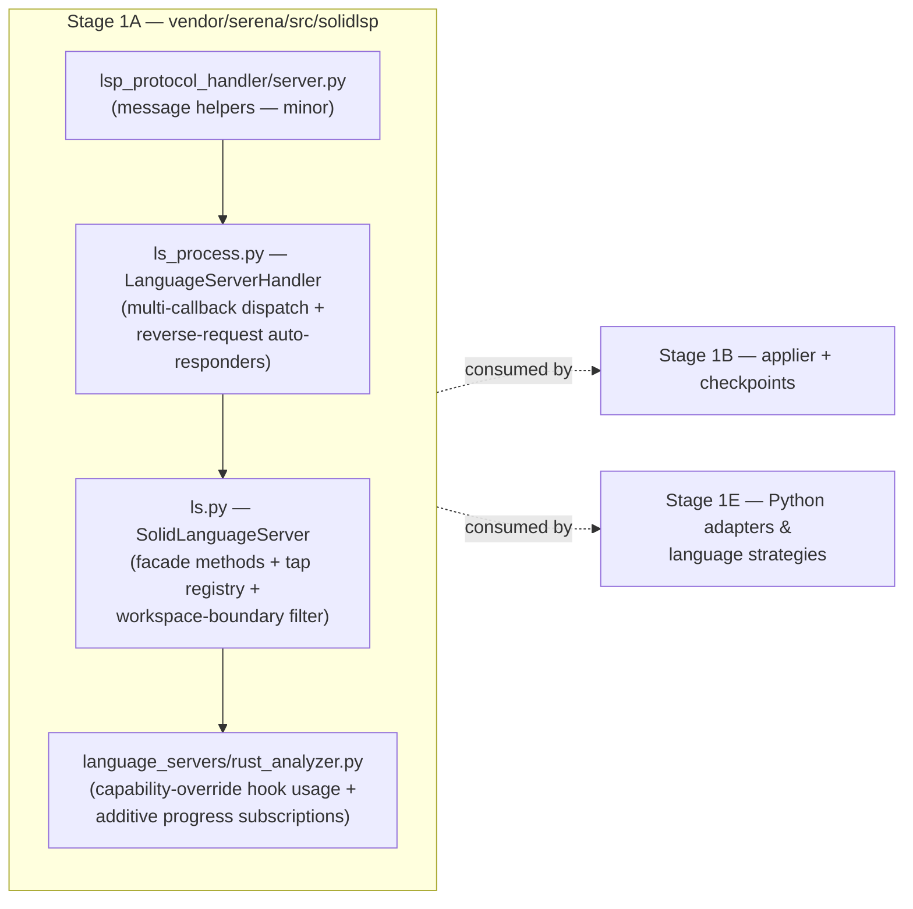
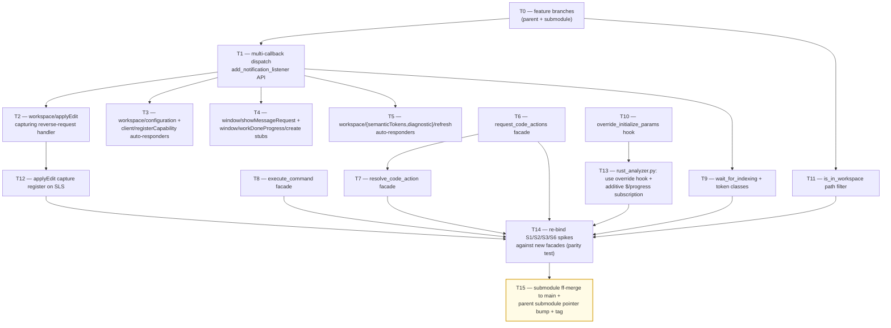

# Stage 1A — LSP Primitive Layer Implementation Plan

> **For agentic workers:** REQUIRED SUB-SKILL: Use `superpowers:subagent-driven-development` (recommended) or `superpowers:executing-plans` to implement this plan task-by-task. Steps use checkbox (`- [ ]`) syntax for tracking.

**Goal:** Add the language-agnostic LSP primitive layer in `vendor/serena/src/solidlsp/` so every Stage 1+ facade has a uniform write/refactor surface: `request_code_actions` / `resolve_code_action` / `execute_command` typed wrappers, `$/progress` notification-tap with multi-callback dispatch, `workspace/applyEdit` reverse-request handler that **captures** the WorkspaceEdit (per P1), capability-override hook (per S2), `wait_for_indexing()` (per S1), and the workspace-boundary path filter `is_in_workspace()` (per P-WB / Q4).

**Architecture:**



The Phase 0 wrapper-gap findings drove this scope. Adapter creation for pylsp / basedpyright / ruff (originally part of File 4 in §14.1) moves to **Stage 1E**, since adapters need the strategy + multi-server orchestration around them. Stage 1A is purely the *language-agnostic* primitive layer.

**Tech Stack:** Python 3.11+, `pytest`, `pytest-asyncio` (already in serena baseline), no new runtime dependencies.

**Source-of-truth references:**
- [`docs/design/mvp/2026-04-24-mvp-scope-report.md`](../../design/mvp/2026-04-24-mvp-scope-report.md) — §4.1 (LSP primitive checklist), §11.8 (workspace-boundary filter), §11.9 (confirmation flow), §14.1 (file 1–3 LoC budget)
- [`docs/superpowers/plans/spike-results/SUMMARY.md`](spike-results/SUMMARY.md) — §5 (wrapper gaps with Stage assignments), §4 (LoC reconciliation)
- [`docs/design/mvp/open-questions/q4-changeannotations-auto-accept.md`](../../design/mvp/open-questions/q4-changeannotations-auto-accept.md) — workspace-boundary rule
- Phase 0 spike outcomes: `S1.md` (`$/progress` tap), `S2.md` (snippet override), `S3.md` (applyEdit stub upgraded by P1), `S6.md` (resolve shape), `P-WB.md` (boundary cases)

---

## Scope check

Stage 1A is one subsystem (the `solidlsp` primitive layer). It produces working, testable software on its own: every primitive method below has a passing test in the spike-style harness. No further decomposition needed.

## File structure

| # | Path (under `vendor/serena/`) | Change | Responsibility |
|---|---|---|---|
| 1 | `src/solidlsp/ls.py` | Modify (+~330 LoC) | `SolidLanguageServer` facade methods: code-action wrappers, execute-command pass-through, `wait_for_indexing()`, capability-override hook, workspace-boundary filter, applyEdit capture register |
| 2 | `src/solidlsp/ls_process.py` | Modify (+~140 LoC) | `LanguageServerHandler` multi-callback notification dispatch (`add_notification_listener` / `remove_notification_listener`), built-in reverse-request handlers for `workspace/applyEdit` (capturing), `workspace/configuration`, `client/registerCapability`/`unregisterCapability`, `window/showMessageRequest`, `window/workDoneProgress/create`, `workspace/{semanticTokens,diagnostic}/refresh` |
| 3 | `src/solidlsp/lsp_protocol_handler/server.py` | Modify (+~10 LoC) | Add `make_response_with_error_data` helper for structured-error LSP responses; minor |
| 4 | `src/solidlsp/language_servers/rust_analyzer.py` | Modify (+~20 LoC) | Replace hard-coded `experimental.snippetTextEdit: True` with `_override_initialize_params()` hook usage; replace `do_nothing` `$/progress` clobber with additive subscription using the new tap |
| 5 | `test/spikes/test_stage_1a_*.py` | New (~270 LoC tests) | Unit + integration tests for every facade method, dispatched against rust-analyzer where end-to-end; pylsp adapter tests deferred to Stage 1E |

**LoC totals:** logic +~500, tests +~270 — within Stage 1A budget (§14.1 row 1+2+3 = 470+60+20 = 550 LoC; we use ~500, leaving headroom).

The original §14.1 row 4 (`solidlsp/language_servers/python_lsp.py` +250 LoC) is **moved to Stage 1E** per SUMMARY §5 — adapters live with their strategy.

## Dependency graph



T1 unlocks T2–T5 and T9 (all consume the multi-callback dispatch). T6 unlocks T7 and T14. T13 depends on T10 (the override hook must exist before rust_analyzer.py rewires).

## Conventions enforced (from Phase 0)

- **Submodule git-flow**: feature branch in `vendor/serena` → ff-merge to `main` → parent bumps submodule pointer (cf. P5a). No direct commits to submodule `main`/`develop`.
- **Author**: AI Hive(R) on every commit; pin per-submodule `user.name`/`user.email` if drifted (`git -C vendor/serena config user.{name,email}`).
- **Field name `code_language=`** on `LanguageServerConfig` (not `language=`) — verified at `ls_config.py:596`.
- **`with srv.start_server():`** sync context manager from `ls.py:717` for tests.
- **PROGRESS.md updates as separate commits, never amend**.
- **Pyright "unresolved imports" for vendor/serena/* are known false positives** — parent IDE doesn't see submodule venv; ignore.

## Progress ledger

A new ledger `docs/superpowers/plans/stage-1a-results/PROGRESS.md` is created in T0. It mirrors the Phase 0 schema: per-task row with task id, branch, commit SHA, outcome, follow-ups. Updated as a separate commit after each task completes.

---

### Task 0: Bootstrap feature branches + ledger

**Files:**
- Create: `docs/superpowers/plans/stage-1a-results/PROGRESS.md`
- Modify: parent + submodule git refs

- [ ] **Step 1: Confirm clean working trees**

Run: `git -C /Volumes/Unitek-B/Projects/o2-scalpel status --short && git -C /Volumes/Unitek-B/Projects/o2-scalpel/vendor/serena status --short`

Expected: both empty (clean). If submodule has untracked `Cargo.lock` from spike fixtures, that's expected — leave it alone.

- [ ] **Step 2: Open feature branch in submodule via git-flow**

Run:
```bash
cd /Volumes/Unitek-B/Projects/o2-scalpel/vendor/serena
git checkout main && git pull --ff-only origin main || true
git flow feature start stage-1a-lsp-primitives
```

Expected: on `feature/stage-1a-lsp-primitives` in submodule.

- [ ] **Step 3: Open feature branch in parent via git-flow**

Run:
```bash
cd /Volumes/Unitek-B/Projects/o2-scalpel
git checkout develop && git pull --ff-only origin develop
git flow feature start stage-1a-lsp-primitives
```

Expected: on `feature/stage-1a-lsp-primitives` in parent.

- [ ] **Step 4: Create the PROGRESS.md ledger**

Write to `docs/superpowers/plans/stage-1a-results/PROGRESS.md`:

```markdown
# Stage 1A — LSP Primitives — Progress Ledger

Started: 2026-04-25
Branch: feature/stage-1a-lsp-primitives (parent + submodule)
Author: AI Hive(R)

| Task | Description | Branch SHA (submodule) | Outcome | Follow-up |
|---|---|---|---|---|
| T0 | Bootstrap feature branches + ledger | _pending_ | _pending_ | — |
| T1 | Multi-callback notification dispatch | _pending_ | _pending_ | — |
| T2 | workspace/applyEdit capturing reverse-request handler | _pending_ | _pending_ | — |
| T3 | workspace/configuration + client/registerCapability auto-responders | _pending_ | _pending_ | — |
| T4 | window/showMessageRequest + window/workDoneProgress/create stubs | _pending_ | _pending_ | — |
| T5 | workspace/{semanticTokens,diagnostic}/refresh auto-responders | _pending_ | _pending_ | — |
| T6 | request_code_actions facade | _pending_ | _pending_ | — |
| T7 | resolve_code_action facade | _pending_ | _pending_ | — |
| T8 | execute_command facade | _pending_ | _pending_ | — |
| T9 | wait_for_indexing + indexing token classes | _pending_ | _pending_ | — |
| T10 | override_initialize_params hook | _pending_ | _pending_ | — |
| T11 | is_in_workspace path filter | _pending_ | _pending_ | — |
| T12 | applyEdit capture register on SolidLanguageServer | _pending_ | _pending_ | — |
| T13 | rust_analyzer.py — use override hook + additive `$/progress` | _pending_ | _pending_ | — |
| T14 | Re-bind S1/S2/S3/S6 spikes against new facades | _pending_ | _pending_ | — |
| T15 | Submodule ff-merge to main + parent pointer bump + tag | _pending_ | _pending_ | — |

## Decisions log

(append-only; one bullet per decision with date + rationale)

## Spike outcome quick-reference

- S1 → A (with shim caveat) — additive subscriptions required.
- S2 → A — capability-override hook (~+15 LoC).
- S3 → B (re-verified) — minimal `{applied: true}` ACK + capture, ~+40 LoC.
- S6 → A — `edit:` only on auto_import resolve.
- P1 → A — pylsp-rope reads in-memory; capture WorkspaceEdit via reverse-request.
- P-WB → 5/5 — adopt `is_in_workspace()` verbatim.
```

- [ ] **Step 5: Commit ledger seed in parent**

Run:
```bash
cd /Volumes/Unitek-B/Projects/o2-scalpel
git add docs/superpowers/plans/stage-1a-results/PROGRESS.md
git commit -m "chore(stage-1a): seed progress ledger for LSP primitives sub-plan

Co-Authored-By: AI Hive(R) <noreply@o2.services>"
```

Expected: one new commit on `feature/stage-1a-lsp-primitives` in parent.

---

### Task 1: Multi-callback notification dispatch on `LanguageServerHandler`

**Files:**
- Modify: `vendor/serena/src/solidlsp/ls_process.py:507-512` (replace `on_notification` single-dict with multi-listener)
- Test: `vendor/serena/test/spikes/test_stage_1a_t1_multi_listener.py`

**Why:** S1 found `rust_analyzer.py:720` registers `do_nothing` for `$/progress`, clobbering any later subscriber. Fix: support N listeners per method while keeping the legacy `on_notification(method, cb)` API as a single-listener convenience that *replaces* the listener (not adds), preserving every other adapter's behavior.

- [ ] **Step 1: Write failing test**

Create `vendor/serena/test/spikes/test_stage_1a_t1_multi_listener.py`:

```python
"""T1 — multi-callback notification dispatch.

Proves: add_notification_listener(method, cb) -> handle; multiple listeners receive
the same payload; remove_notification_listener(handle) detaches; the legacy
on_notification(method, cb) still replaces the single primary listener
without affecting added listeners.
"""

from __future__ import annotations

from typing import Any
from unittest.mock import MagicMock

import pytest

from solidlsp.ls_process import LanguageServerHandler


@pytest.fixture
def handler() -> LanguageServerHandler:
    h = LanguageServerHandler.__new__(LanguageServerHandler)
    h.on_notification_handlers = {}
    h.on_notification_listeners = {}
    h._listener_seq = 0
    return h


def test_add_and_remove_listener_receive_payload(handler: LanguageServerHandler) -> None:
    a = MagicMock()
    b = MagicMock()
    ha = handler.add_notification_listener("$/progress", a)
    hb = handler.add_notification_listener("$/progress", b)
    handler._dispatch_notification("$/progress", {"value": 1})
    a.assert_called_once_with({"value": 1})
    b.assert_called_once_with({"value": 1})
    handler.remove_notification_listener(ha)
    handler._dispatch_notification("$/progress", {"value": 2})
    assert a.call_count == 1  # detached
    b.assert_called_with({"value": 2})


def test_legacy_on_notification_does_not_clobber_listeners(handler: LanguageServerHandler) -> None:
    listener = MagicMock()
    primary = MagicMock()
    handler.add_notification_listener("$/progress", listener)
    handler.on_notification("$/progress", primary)
    handler._dispatch_notification("$/progress", {"x": 1})
    listener.assert_called_once_with({"x": 1})
    primary.assert_called_once_with({"x": 1})


def test_listener_exception_does_not_break_other_listeners(handler: LanguageServerHandler) -> None:
    bad = MagicMock(side_effect=RuntimeError("boom"))
    good = MagicMock()
    handler.add_notification_listener("$/progress", bad)
    handler.add_notification_listener("$/progress", good)
    handler._dispatch_notification("$/progress", {"v": 1})
    good.assert_called_once_with({"v": 1})  # good still fires
```

- [ ] **Step 2: Run test, expect fail**

Run from `vendor/serena/`: `pytest test/spikes/test_stage_1a_t1_multi_listener.py -v`

Expected: FAIL with `AttributeError` on `add_notification_listener` / `remove_notification_listener` / `_dispatch_notification`.

- [ ] **Step 3: Implement the multi-listener dispatch**

Edit `vendor/serena/src/solidlsp/ls_process.py`. Locate the `on_notification` method (around line 507) and the place where notifications are dispatched (search for `on_notification_handlers.get(`). Add the listener registry alongside the legacy single-handler dict:

In `__init__` (or wherever `self.on_notification_handlers = {}` is created), add:
```python
self.on_notification_listeners: dict[str, dict[int, Callable[[Any], None]]] = {}
self._listener_seq: int = 0
self._listener_lock = threading.Lock()
```

Add new methods next to `on_notification`:
```python
def add_notification_listener(self, method: str, cb: Callable[[Any], None]) -> int:
    """Register an additive listener for the given notification method.

    Multiple listeners may coexist with the legacy primary handler set via
    on_notification(). Returns an opaque handle that can be passed to
    remove_notification_listener() to detach.
    """
    with self._listener_lock:
        self._listener_seq += 1
        handle = self._listener_seq
        self.on_notification_listeners.setdefault(method, {})[handle] = cb
        return handle

def remove_notification_listener(self, handle: int) -> None:
    with self._listener_lock:
        for method, listeners in list(self.on_notification_listeners.items()):
            if handle in listeners:
                del listeners[handle]
                if not listeners:
                    del self.on_notification_listeners[method]
                return

def _dispatch_notification(self, method: str, params: Any) -> None:
    """Dispatch to the legacy primary handler (if any) and every additive listener.

    Listener exceptions are caught and logged so a misbehaving listener cannot
    break the dispatch pipeline.
    """
    primary = self.on_notification_handlers.get(method)
    if primary is not None:
        try:
            primary(params)
        except Exception:
            log.exception("primary notification handler for %s raised", method)
    listeners = list((self.on_notification_listeners.get(method) or {}).values())
    for cb in listeners:
        try:
            cb(params)
        except Exception:
            log.exception("notification listener for %s raised", method)
```

Then locate the existing `_notification_handler` (around line 558) and **replace** the body with a call to `_dispatch_notification`:

```python
def _notification_handler(self, response: StringDict) -> None:
    method = response.get("method", "")
    params = response.get("params")
    self._dispatch_notification(method, params)
```

Add `import threading` at the top of `ls_process.py` if not already present.

- [ ] **Step 4: Run unit test, expect pass**

Run: `pytest test/spikes/test_stage_1a_t1_multi_listener.py -v`

Expected: 3 passed.

- [ ] **Step 5: Commit**

```bash
cd vendor/serena
git add src/solidlsp/ls_process.py test/spikes/test_stage_1a_t1_multi_listener.py
git commit -m "feat(solidlsp): multi-callback notification dispatch (T1)

Adds add_notification_listener / remove_notification_listener / internal
_dispatch_notification so multiple subscribers can listen on the same LSP
method without clobbering each other. Legacy on_notification still
sets the single primary handler.

Resolves Phase 0 S1 wrapper-gap: $/progress single-callback clobber.

Co-Authored-By: AI Hive(R) <noreply@o2.services>"
```

- [ ] **Step 6: Update PROGRESS.md (separate commit in parent)**

Edit `docs/superpowers/plans/stage-1a-results/PROGRESS.md` row T1 to ✅ with submodule SHA. Commit the parent change separately:

```bash
cd /Volumes/Unitek-B/Projects/o2-scalpel
git add docs/superpowers/plans/stage-1a-results/PROGRESS.md
git commit -m "chore(stage-1a): mark T1 complete

Co-Authored-By: AI Hive(R) <noreply@o2.services>"
```

---

### Task 2: `workspace/applyEdit` capturing reverse-request handler

**Files:**
- Modify: `vendor/serena/src/solidlsp/ls.py` (~+30 LoC) — install handler at `SolidLanguageServer` startup
- Test: `vendor/serena/test/spikes/test_stage_1a_t2_apply_edit_capture.py`

**Why:** S3 found a minimal `{applied: true}` ACK suffices for rust-analyzer, but P1 found pylsp-rope ships its inline/refactor results via `workspace/applyEdit` reverse-request — so the handler must **capture** the WorkspaceEdit, not merely ACK. The capture lives on `SolidLanguageServer` so any caller can drain `pop_pending_apply_edits()` after a code-action / executeCommand call.

- [ ] **Step 1: Write failing test**

Create `vendor/serena/test/spikes/test_stage_1a_t2_apply_edit_capture.py`:

```python
"""T2 — workspace/applyEdit reverse-request capture.

Proves: (1) handler ACKs `{applied: true, failureReason: null}`, (2) the
WorkspaceEdit payload is appended to pending_apply_edits in arrival order,
(3) pop_pending_apply_edits() drains the buffer.
"""

from __future__ import annotations

from unittest.mock import MagicMock

import pytest

from solidlsp.ls import SolidLanguageServer


@pytest.fixture
def slim_sls() -> SolidLanguageServer:
    sls = SolidLanguageServer.__new__(SolidLanguageServer)
    sls._pending_apply_edits = []
    return sls


def test_handler_acks_and_captures(slim_sls: SolidLanguageServer) -> None:
    edit = {"changes": {"file:///foo.py": [{"range": {}, "newText": "x"}]}}
    response = slim_sls._handle_workspace_apply_edit({"edit": edit, "label": "Inline"})
    assert response == {"applied": True, "failureReason": None}
    assert slim_sls._pending_apply_edits == [{"edit": edit, "label": "Inline"}]


def test_pop_drains_in_arrival_order(slim_sls: SolidLanguageServer) -> None:
    slim_sls._handle_workspace_apply_edit({"edit": {"changes": {}}, "label": "a"})
    slim_sls._handle_workspace_apply_edit({"edit": {"changes": {}}, "label": "b"})
    drained = slim_sls.pop_pending_apply_edits()
    assert [p["label"] for p in drained] == ["a", "b"]
    assert slim_sls.pop_pending_apply_edits() == []  # empty after drain
```

- [ ] **Step 2: Run test, expect fail**

Run: `pytest test/spikes/test_stage_1a_t2_apply_edit_capture.py -v`

Expected: FAIL with `AttributeError: '_handle_workspace_apply_edit'`.

- [ ] **Step 3: Implement on `SolidLanguageServer`**

Edit `vendor/serena/src/solidlsp/ls.py`. Find `__init__` of `SolidLanguageServer` and add to the initialization (alongside other state):

```python
self._pending_apply_edits: list[dict[str, Any]] = []
self._apply_edits_lock = threading.Lock()
```

Add the handler method on `SolidLanguageServer`:

```python
def _handle_workspace_apply_edit(self, params: dict[str, Any]) -> dict[str, Any]:
    """Handle workspace/applyEdit reverse-request: capture and ACK.

    Per Phase 0 P1, pylsp-rope ships its WorkspaceEdit via this channel
    (not via the executeCommand response), so we MUST capture the payload.
    Per S3, a minimal `{applied: true}` ACK suffices for rust-analyzer.
    """
    with self._apply_edits_lock:
        self._pending_apply_edits.append(params)
    return {"applied": True, "failureReason": None}

def pop_pending_apply_edits(self) -> list[dict[str, Any]]:
    """Drain captured workspace/applyEdit payloads in arrival order."""
    with self._apply_edits_lock:
        out = list(self._pending_apply_edits)
        self._pending_apply_edits.clear()
        return out
```

Then, where `SolidLanguageServer` wires its `LanguageServerHandler` (find `self.server.on_request(`-style calls in `ls.py`; if none exist there yet, install during `start_server()`), register:

```python
self.server.on_request("workspace/applyEdit", self._handle_workspace_apply_edit)
```

If no central place exists, add a private `_install_default_request_handlers()` method called during `start_server()` and add the registration there. Match existing import style for `threading` (likely already imported in `ls.py`; if not, add it).

- [ ] **Step 4: Run test, expect pass**

Run: `pytest test/spikes/test_stage_1a_t2_apply_edit_capture.py -v`

Expected: 2 passed.

- [ ] **Step 5: Commit**

```bash
cd vendor/serena
git add src/solidlsp/ls.py test/spikes/test_stage_1a_t2_apply_edit_capture.py
git commit -m "feat(solidlsp): workspace/applyEdit capturing reverse-request handler (T2)

Captures the WorkspaceEdit payload (per P1 finding) and ACKs minimally
(per S3 finding). pop_pending_apply_edits() drains the buffer for
callers that drove a code-action or executeCommand.

Co-Authored-By: AI Hive(R) <noreply@o2.services>"
```

- [ ] **Step 6: Update PROGRESS.md row T2 (separate commit in parent)**

---

### Task 3: `workspace/configuration` + `client/registerCapability`/`unregisterCapability` auto-responders

**Files:**
- Modify: `vendor/serena/src/solidlsp/ls.py` (~+25 LoC)
- Test: `vendor/serena/test/spikes/test_stage_1a_t3_config_register.py`

**Why:** rust-analyzer queries the client mid-session (`workspace/configuration`) and dynamically registers `workspace/didChangeWatchedFiles` (per §4.1). basedpyright BLOCKS on these requests if unanswered (P4 finding). Default-safe responses: `[{} for _ in items]` for configuration, `null` for register/unregister.

- [ ] **Step 1: Write failing test**

Create `vendor/serena/test/spikes/test_stage_1a_t3_config_register.py`:

```python
"""T3 — workspace/configuration + client/registerCapability auto-responders."""

from __future__ import annotations

import pytest

from solidlsp.ls import SolidLanguageServer


@pytest.fixture
def slim_sls() -> SolidLanguageServer:
    return SolidLanguageServer.__new__(SolidLanguageServer)


def test_configuration_returns_one_empty_per_item(slim_sls: SolidLanguageServer) -> None:
    out = slim_sls._handle_workspace_configuration({"items": [{"section": "rust-analyzer"}, {"section": "x.y"}]})
    assert out == [{}, {}]


def test_configuration_handles_empty_items(slim_sls: SolidLanguageServer) -> None:
    assert slim_sls._handle_workspace_configuration({"items": []}) == []


def test_register_capability_returns_null(slim_sls: SolidLanguageServer) -> None:
    out = slim_sls._handle_register_capability({"registrations": [{"id": "x", "method": "workspace/didChangeWatchedFiles"}]})
    assert out is None


def test_unregister_capability_returns_null(slim_sls: SolidLanguageServer) -> None:
    assert slim_sls._handle_unregister_capability({"unregisterations": [{"id": "x", "method": "x"}]}) is None
```

- [ ] **Step 2: Run test, expect fail**

Run: `pytest test/spikes/test_stage_1a_t3_config_register.py -v`

Expected: FAIL with `AttributeError`.

- [ ] **Step 3: Implement**

In `vendor/serena/src/solidlsp/ls.py`, add three methods on `SolidLanguageServer`:

```python
def _handle_workspace_configuration(self, params: dict[str, Any]) -> list[dict[str, Any]]:
    """LSP `workspace/configuration` request: one config per requested item.

    Default-safe: empty objects. Subclasses (e.g., per-language strategy) may
    override to inject server-specific settings.
    """
    items = params.get("items") or []
    return [{} for _ in items]

def _handle_register_capability(self, params: dict[str, Any]) -> None:
    """LSP `client/registerCapability` request: ACK with null per spec."""
    return None

def _handle_unregister_capability(self, params: dict[str, Any]) -> None:
    """LSP `client/unregisterCapability` request: ACK with null per spec."""
    return None
```

Wire registrations alongside the T2 registration:
```python
self.server.on_request("workspace/configuration", self._handle_workspace_configuration)
self.server.on_request("client/registerCapability", self._handle_register_capability)
self.server.on_request("client/unregisterCapability", self._handle_unregister_capability)
```

- [ ] **Step 4: Run test, expect pass**

Run: `pytest test/spikes/test_stage_1a_t3_config_register.py -v`

Expected: 4 passed.

- [ ] **Step 5: Commit**

```bash
cd vendor/serena
git add src/solidlsp/ls.py test/spikes/test_stage_1a_t3_config_register.py
git commit -m "feat(solidlsp): default-safe reverse-request handlers for configuration + capability registry (T3)

Auto-responders unblock rust-analyzer mid-session config queries and the
basedpyright server->client request blocker (Phase 0 P4 finding).

Co-Authored-By: AI Hive(R) <noreply@o2.services>"
```

- [ ] **Step 6: Update PROGRESS.md row T3**

---

### Task 4: `window/showMessageRequest` + `window/workDoneProgress/create` stubs

**Files:**
- Modify: `vendor/serena/src/solidlsp/ls.py` (~+15 LoC)
- Test: `vendor/serena/test/spikes/test_stage_1a_t4_window_stubs.py`

**Why:** §4.1 mandates auto-accepting non-destructive `showMessageRequest` (RA "Reload workspace?") and ACKing `workDoneProgress/create` since we advertise `progressSupport=true`.

- [ ] **Step 1: Write failing test**

Create `vendor/serena/test/spikes/test_stage_1a_t4_window_stubs.py`:

```python
"""T4 — window stubs."""

from __future__ import annotations

from solidlsp.ls import SolidLanguageServer


def test_show_message_request_returns_first_action() -> None:
    sls = SolidLanguageServer.__new__(SolidLanguageServer)
    out = sls._handle_show_message_request({"type": 3, "message": "Reload?", "actions": [{"title": "Yes"}, {"title": "No"}]})
    assert out == {"title": "Yes"}


def test_show_message_request_no_actions_returns_null() -> None:
    sls = SolidLanguageServer.__new__(SolidLanguageServer)
    assert sls._handle_show_message_request({"type": 3, "message": "fyi"}) is None


def test_work_done_progress_create_returns_null() -> None:
    sls = SolidLanguageServer.__new__(SolidLanguageServer)
    assert sls._handle_work_done_progress_create({"token": "indexing-1"}) is None
```

- [ ] **Step 2: Run test, expect fail**

Run: `pytest test/spikes/test_stage_1a_t4_window_stubs.py -v` → FAIL.

- [ ] **Step 3: Implement**

```python
def _handle_show_message_request(self, params: dict[str, Any]) -> dict[str, Any] | None:
    """Auto-accept the first offered action (non-destructive default)."""
    actions = params.get("actions") or []
    return actions[0] if actions else None

def _handle_work_done_progress_create(self, params: dict[str, Any]) -> None:
    return None
```

Register:
```python
self.server.on_request("window/showMessageRequest", self._handle_show_message_request)
self.server.on_request("window/workDoneProgress/create", self._handle_work_done_progress_create)
```

- [ ] **Step 4: Run test, expect pass**

Run: `pytest test/spikes/test_stage_1a_t4_window_stubs.py -v` → 3 passed.

- [ ] **Step 5: Commit**

```bash
cd vendor/serena
git add src/solidlsp/ls.py test/spikes/test_stage_1a_t4_window_stubs.py
git commit -m "feat(solidlsp): window/showMessageRequest + window/workDoneProgress/create handlers (T4)

Co-Authored-By: AI Hive(R) <noreply@o2.services>"
```

- [ ] **Step 6: Update PROGRESS.md row T4**

---

### Task 5: `workspace/{semanticTokens,diagnostic}/refresh` auto-responders

**Files:**
- Modify: `vendor/serena/src/solidlsp/ls.py` (~+10 LoC)
- Test: `vendor/serena/test/spikes/test_stage_1a_t5_refresh_handlers.py`

**Why:** §4.1 mandates these. Both are cache-invalidation hints from server → client; the spec response is `null`.

- [ ] **Step 1: Write failing test**

```python
"""T5 — refresh-request stubs."""

from solidlsp.ls import SolidLanguageServer


def test_semantic_tokens_refresh_null() -> None:
    sls = SolidLanguageServer.__new__(SolidLanguageServer)
    assert sls._handle_semantic_tokens_refresh(None) is None


def test_diagnostic_refresh_null() -> None:
    sls = SolidLanguageServer.__new__(SolidLanguageServer)
    assert sls._handle_diagnostic_refresh(None) is None
```

- [ ] **Step 2: Run test, expect fail**

Run: `pytest test/spikes/test_stage_1a_t5_refresh_handlers.py -v` → FAIL.

- [ ] **Step 3: Implement**

```python
def _handle_semantic_tokens_refresh(self, params: Any) -> None:
    return None

def _handle_diagnostic_refresh(self, params: Any) -> None:
    return None
```

Register:
```python
self.server.on_request("workspace/semanticTokens/refresh", self._handle_semantic_tokens_refresh)
self.server.on_request("workspace/diagnostic/refresh", self._handle_diagnostic_refresh)
```

- [ ] **Step 4: Run test, expect pass**

Run: `pytest test/spikes/test_stage_1a_t5_refresh_handlers.py -v` → 2 passed.

- [ ] **Step 5: Commit**

```bash
cd vendor/serena
git add src/solidlsp/ls.py test/spikes/test_stage_1a_t5_refresh_handlers.py
git commit -m "feat(solidlsp): semantic-tokens + diagnostic refresh ACK handlers (T5)

Co-Authored-By: AI Hive(R) <noreply@o2.services>"
```

- [ ] **Step 6: Update PROGRESS.md row T5**

---

### Task 6: `request_code_actions(...)` facade

**Files:**
- Modify: `vendor/serena/src/solidlsp/ls.py` (~+45 LoC)
- Test: `vendor/serena/test/spikes/test_stage_1a_t6_request_code_actions.py`

**Why:** §4.1 mandates `request_code_actions(file, range, only?, trigger_kind, diagnostics?)` as the single entry point every facade uses. Returns the raw LSP `CodeAction[]` list; the caller decides whether to resolve.

- [ ] **Step 1: Write failing test (integration; hits real rust-analyzer)**

Create `vendor/serena/test/spikes/test_stage_1a_t6_request_code_actions.py`:

```python
"""T6 — request_code_actions facade against rust-analyzer.

Reuses the seed_rust fixture to surface code actions over a known range; the
exact set varies by rust-analyzer build but the call must succeed and return
a list (possibly empty). Dispatches via the new SolidLanguageServer facade.
"""

from __future__ import annotations

from pathlib import Path

from solidlsp.ls import SolidLanguageServer


def test_request_code_actions_returns_list(rust_lsp: SolidLanguageServer, seed_rust_root: Path) -> None:
    lib_rs = seed_rust_root / "src" / "lib.rs"
    text = lib_rs.read_text(encoding="utf-8")
    # Use the first non-trivial range we can find.
    line0 = next((i for i, ln in enumerate(text.splitlines()) if ln.strip().startswith("pub fn ")), 0)
    actions = rust_lsp.request_code_actions(
        file=str(lib_rs),
        start={"line": line0, "character": 0},
        end={"line": line0, "character": 10},
        only=None,
        trigger_kind=2,  # Automatic
        diagnostics=[],
    )
    assert isinstance(actions, list)
    # rust-analyzer may legitimately return [] for the first range; the contract
    # is that the facade SUCCEEDS and yields a list, not that any action surfaces.


def test_request_code_actions_with_only_filter(rust_lsp: SolidLanguageServer, seed_rust_root: Path) -> None:
    lib_rs = seed_rust_root / "src" / "lib.rs"
    actions = rust_lsp.request_code_actions(
        file=str(lib_rs),
        start={"line": 0, "character": 0},
        end={"line": 0, "character": 1},
        only=["refactor.extract"],
        trigger_kind=1,  # Invoked
        diagnostics=[],
    )
    assert isinstance(actions, list)
```

- [ ] **Step 2: Run test, expect fail**

Run from repo root: `pytest vendor/serena/test/spikes/test_stage_1a_t6_request_code_actions.py -v` → FAIL on missing `request_code_actions`.

- [ ] **Step 3: Implement on `SolidLanguageServer`**

Add to `ls.py`:

```python
def request_code_actions(
    self,
    file: str,
    start: dict[str, int],
    end: dict[str, int],
    only: list[str] | None = None,
    trigger_kind: int = 2,
    diagnostics: list[dict[str, Any]] | None = None,
    timeout_s: float = 30.0,
) -> list[dict[str, Any]]:
    """Send `textDocument/codeAction`. Returns the raw CodeAction[] list.

    The caller must call resolve_code_action() if any returned action lacks
    a populated `edit` or `command`. Per Phase 0 S6, rust-analyzer is
    deferred-resolution (top-level response carries metadata only).

    :param file: absolute path to the document
    :param start: 0-indexed LSP position {line, character}
    :param end: 0-indexed LSP position
    :param only: optional CodeActionKind allow-list (e.g., ["refactor.extract"])
    :param trigger_kind: 1=Invoked, 2=Automatic
    :param diagnostics: associated diagnostics (may be empty)
    """
    uri = Path(file).as_uri()
    context: dict[str, Any] = {"diagnostics": diagnostics or [], "triggerKind": trigger_kind}
    if only is not None:
        context["only"] = only
    params = {
        "textDocument": {"uri": uri},
        "range": {"start": start, "end": end},
        "context": context,
    }
    response = self.server.send_request("textDocument/codeAction", params, timeout=timeout_s)
    return response if isinstance(response, list) else []
```

(`Path` is already imported in `ls.py`.) If `self.server.send_request` does not exist with that exact signature, locate the equivalent — search `def send_request` in `ls_process.py`.

- [ ] **Step 4: Run test, expect pass**

Run: `pytest vendor/serena/test/spikes/test_stage_1a_t6_request_code_actions.py -v` → 2 passed.

- [ ] **Step 5: Commit**

```bash
cd vendor/serena
git add src/solidlsp/ls.py test/spikes/test_stage_1a_t6_request_code_actions.py
git commit -m "feat(solidlsp): request_code_actions facade (T6)

Single entry point for textDocument/codeAction. Deferred-resolution
servers (rust-analyzer per S6) require a follow-up resolve_code_action()
call which T7 introduces.

Co-Authored-By: AI Hive(R) <noreply@o2.services>"
```

- [ ] **Step 6: Update PROGRESS.md row T6**

---

### Task 7: `resolve_code_action(...)` facade

**Files:**
- Modify: `vendor/serena/src/solidlsp/ls.py` (~+25 LoC)
- Test: `vendor/serena/test/spikes/test_stage_1a_t7_resolve_code_action.py`

**Why:** §4.1; mandatory on rust-analyzer per S3. Returns the resolved action (with populated `edit` and/or `command`).

- [ ] **Step 1: Write failing test**

```python
"""T7 — resolve_code_action facade.

Echo-style unit test (no live LSP needed): resolve passes the unresolved
CodeAction back to the server and returns whatever the server replies.
We pin the wire shape via a fake server.
"""

from __future__ import annotations

from typing import Any
from unittest.mock import MagicMock

from solidlsp.ls import SolidLanguageServer


def test_resolve_returns_server_response() -> None:
    sls = SolidLanguageServer.__new__(SolidLanguageServer)
    fake_server = MagicMock()
    fake_server.send_request.return_value = {"title": "x", "edit": {"changes": {}}}
    sls.server = fake_server
    out = sls.resolve_code_action({"title": "x", "data": {"id": 1}})
    fake_server.send_request.assert_called_once()
    args, kwargs = fake_server.send_request.call_args
    assert args[0] == "codeAction/resolve"
    assert args[1] == {"title": "x", "data": {"id": 1}}
    assert out == {"title": "x", "edit": {"changes": {}}}


def test_resolve_returns_action_unchanged_when_server_returns_none() -> None:
    sls = SolidLanguageServer.__new__(SolidLanguageServer)
    fake_server = MagicMock()
    fake_server.send_request.return_value = None
    sls.server = fake_server
    action = {"title": "y", "edit": {"changes": {}}}
    assert sls.resolve_code_action(action) == action
```

- [ ] **Step 2: Run test, expect fail**

Run: `pytest test/spikes/test_stage_1a_t7_resolve_code_action.py -v` → FAIL.

- [ ] **Step 3: Implement**

Add to `ls.py`:

```python
def resolve_code_action(
    self,
    action: dict[str, Any],
    timeout_s: float = 30.0,
) -> dict[str, Any]:
    """Send `codeAction/resolve`. Returns the resolved action.

    rust-analyzer is deferred-resolution: top-level response carries
    {title, kind, data, group?} only; `edit`/`command` populate after
    this call (Phase 0 S6).

    If the server returns None (unsupported), return the input unchanged.
    """
    response = self.server.send_request("codeAction/resolve", action, timeout=timeout_s)
    if not isinstance(response, dict):
        return action
    return response
```

- [ ] **Step 4: Run test, expect pass**

Run: `pytest test/spikes/test_stage_1a_t7_resolve_code_action.py -v` → 2 passed.

- [ ] **Step 5: Commit**

```bash
cd vendor/serena
git add src/solidlsp/ls.py test/spikes/test_stage_1a_t7_resolve_code_action.py
git commit -m "feat(solidlsp): resolve_code_action facade (T7)

Mandatory two-phase resolve for rust-analyzer (Phase 0 S3/S6).

Co-Authored-By: AI Hive(R) <noreply@o2.services>"
```

- [ ] **Step 6: Update PROGRESS.md row T7**

---

### Task 8: `execute_command(...)` typed pass-through

**Files:**
- Modify: `vendor/serena/src/solidlsp/ls.py` (~+25 LoC)
- Test: `vendor/serena/test/spikes/test_stage_1a_t8_execute_command.py`

**Why:** §4.1; pylsp-rope, ruff `source.fixAll`, basedpyright auto-import all use it. The call also drains any captured `workspace/applyEdit` reverse-requests fired during execution (per P1).

- [ ] **Step 1: Write failing test**

```python
"""T8 — execute_command pass-through with applyEdit drain."""

from unittest.mock import MagicMock

from solidlsp.ls import SolidLanguageServer


def test_execute_command_returns_response() -> None:
    sls = SolidLanguageServer.__new__(SolidLanguageServer)
    sls._pending_apply_edits = []
    import threading
    sls._apply_edits_lock = threading.Lock()
    fake_server = MagicMock()
    fake_server.send_request.return_value = {"ok": True}
    sls.server = fake_server
    response, drained_edits = sls.execute_command("pylsp_rope.refactor.inline", [{"document_uri": "file:///a.py"}])
    args, kwargs = fake_server.send_request.call_args
    assert args[0] == "workspace/executeCommand"
    assert args[1] == {"command": "pylsp_rope.refactor.inline", "arguments": [{"document_uri": "file:///a.py"}]}
    assert response == {"ok": True}
    assert drained_edits == []


def test_execute_command_drains_captured_apply_edits() -> None:
    sls = SolidLanguageServer.__new__(SolidLanguageServer)
    sls._pending_apply_edits = []
    import threading
    sls._apply_edits_lock = threading.Lock()
    fake_server = MagicMock()
    def fake_send(method, params, timeout=30.0):
        # Simulate the server firing a reverse-request DURING execution by
        # appending directly to the buffer (real path: _handle_workspace_apply_edit).
        sls._pending_apply_edits.append({"edit": {"changes": {"file:///a.py": []}}, "label": "Inline"})
        return {"ok": True}
    fake_server.send_request.side_effect = fake_send
    sls.server = fake_server
    _resp, drained = sls.execute_command("pylsp_rope.refactor.inline", [])
    assert len(drained) == 1
    assert drained[0]["label"] == "Inline"
```

- [ ] **Step 2: Run test, expect fail**

Run: `pytest test/spikes/test_stage_1a_t8_execute_command.py -v` → FAIL.

- [ ] **Step 3: Implement**

```python
def execute_command(
    self,
    command: str,
    arguments: list[Any] | None = None,
    timeout_s: float = 60.0,
) -> tuple[Any, list[dict[str, Any]]]:
    """Send `workspace/executeCommand` and drain any captured applyEdit payloads.

    Returns (response, drained_apply_edits). pylsp-rope ships its
    refactor result via workspace/applyEdit reverse-request rather than
    via the executeCommand response (Phase 0 P1), so callers must
    consume the drained list.
    """
    params = {"command": command, "arguments": arguments or []}
    response = self.server.send_request("workspace/executeCommand", params, timeout=timeout_s)
    drained = self.pop_pending_apply_edits()
    return response, drained
```

- [ ] **Step 4: Run test, expect pass**

Run: `pytest test/spikes/test_stage_1a_t8_execute_command.py -v` → 2 passed.

- [ ] **Step 5: Commit**

```bash
cd vendor/serena
git add src/solidlsp/ls.py test/spikes/test_stage_1a_t8_execute_command.py
git commit -m "feat(solidlsp): execute_command pass-through with applyEdit drain (T8)

Returns (response, drained_apply_edits). Drains the workspace/applyEdit
reverse-request buffer captured by T2's handler so pylsp-rope-style
servers (Phase 0 P1) surface their results to the caller.

Co-Authored-By: AI Hive(R) <noreply@o2.services>"
```

- [ ] **Step 6: Update PROGRESS.md row T8**

---

### Task 9: `wait_for_indexing(timeout_s)` + indexing-token registry

**Files:**
- Modify: `vendor/serena/src/solidlsp/ls.py` (~+50 LoC)
- Test: `vendor/serena/test/spikes/test_stage_1a_t9_wait_for_indexing.py`

**Why:** §4.1 mandates `wait_for_indexing()`; cold-start gate. SUMMARY §1 lists the rust-analyzer tokens this watches: `rustAnalyzer/Fetching`, `Building CrateGraph`, `Loading proc-macros`, `cachePriming`, `Roots Scanned`, `Building compile-time-deps`, plus `rust-analyzer/flycheck/N`. Implementation: subscribe to `$/progress` via the new tap (T1), record per-token state, return when all known indexing-class tokens reach `kind=end`.

- [ ] **Step 1: Write failing test**

```python
"""T9 — wait_for_indexing aggregates $/progress end events.

Pure unit test: simulates a tap-fed sequence of $/progress events and
verifies wait_for_indexing returns once all indexing-class tokens have
reached `kind=end`.
"""

from __future__ import annotations

import threading

import pytest

from solidlsp.ls import SolidLanguageServer


def _slim() -> SolidLanguageServer:
    sls = SolidLanguageServer.__new__(SolidLanguageServer)
    sls._progress_state = {}
    sls._progress_lock = threading.Lock()
    sls._progress_event = threading.Event()
    return sls


def test_indexing_token_classification() -> None:
    sls = _slim()
    assert sls._is_indexing_token("rustAnalyzer/Fetching") is True
    assert sls._is_indexing_token("rustAnalyzer/cachePriming") is True
    assert sls._is_indexing_token("rust-analyzer/flycheck/3") is True
    assert sls._is_indexing_token("rustAnalyzer/Building CrateGraph") is True
    # Anything else is non-indexing.
    assert sls._is_indexing_token("pylsp:document_processing") is False
    assert sls._is_indexing_token("ruff:lint") is False


def test_wait_for_indexing_returns_when_all_indexing_tokens_end() -> None:
    sls = _slim()
    # Simulate begin / end on two indexing tokens.
    sls._on_progress({"token": "rustAnalyzer/Fetching", "value": {"kind": "begin"}})
    sls._on_progress({"token": "rustAnalyzer/cachePriming", "value": {"kind": "begin"}})

    # In a worker thread: end both shortly after.
    def finish() -> None:
        sls._on_progress({"token": "rustAnalyzer/Fetching", "value": {"kind": "end"}})
        sls._on_progress({"token": "rustAnalyzer/cachePriming", "value": {"kind": "end"}})

    t = threading.Timer(0.05, finish)
    t.start()
    try:
        assert sls.wait_for_indexing(timeout_s=2.0) is True
    finally:
        t.cancel()


def test_wait_for_indexing_times_out_when_no_progress_seen() -> None:
    sls = _slim()
    sls._on_progress({"token": "rustAnalyzer/Fetching", "value": {"kind": "begin"}})
    assert sls.wait_for_indexing(timeout_s=0.1) is False
```

- [ ] **Step 2: Run test, expect fail**

Run: `pytest test/spikes/test_stage_1a_t9_wait_for_indexing.py -v` → FAIL.

- [ ] **Step 3: Implement**

In `ls.py` `__init__`, add:

```python
self._progress_state: dict[str, str] = {}  # token -> last 'kind' (begin/report/end)
self._progress_lock = threading.Lock()
self._progress_event = threading.Event()
```

Add classification + aggregation methods:

```python
_INDEXING_TOKEN_PREFIXES: tuple[str, ...] = (
    "rustAnalyzer/Fetching",
    "rustAnalyzer/Building CrateGraph",
    "rustAnalyzer/Loading proc-macros",
    "rustAnalyzer/cachePriming",
    "rustAnalyzer/Roots Scanned",
    "rustAnalyzer/Building compile-time-deps",
    "rust-analyzer/flycheck/",
)

def _is_indexing_token(self, token: str) -> bool:
    return any(token == p or token.startswith(p) for p in self._INDEXING_TOKEN_PREFIXES)

def _on_progress(self, params: dict[str, Any]) -> None:
    """Listener fed by the $/progress tap (T1 + T13)."""
    token = params.get("token")
    value = params.get("value") or {}
    if not isinstance(token, str):
        return
    kind = value.get("kind")
    if kind not in ("begin", "report", "end"):
        return
    with self._progress_lock:
        self._progress_state[token] = kind
        # Wake the waiter if every known indexing token has reached `end`.
        active = [t for t, k in self._progress_state.items() if self._is_indexing_token(t) and k != "end"]
        if not active and any(self._is_indexing_token(t) for t in self._progress_state):
            self._progress_event.set()

def wait_for_indexing(self, timeout_s: float = 30.0) -> bool:
    """Block until all observed indexing-class progress tokens reach kind=end.

    Returns True if all indexing tokens have ended; False on timeout.
    Reset for the next call.
    """
    deadline = timeout_s
    if not self._progress_event.wait(timeout=deadline):
        return False
    with self._progress_lock:
        self._progress_event.clear()
    return True
```

(The actual subscription wiring happens in T13 against rust-analyzer's progress stream.)

- [ ] **Step 4: Run test, expect pass**

Run: `pytest test/spikes/test_stage_1a_t9_wait_for_indexing.py -v` → 3 passed.

- [ ] **Step 5: Commit**

```bash
cd vendor/serena
git add src/solidlsp/ls.py test/spikes/test_stage_1a_t9_wait_for_indexing.py
git commit -m "feat(solidlsp): wait_for_indexing + indexing-token classification (T9)

Aggregates rust-analyzer indexing-class \$/progress events per Phase 0 S1
findings: rustAnalyzer/{Fetching, Building CrateGraph, Loading proc-macros,
cachePriming, Roots Scanned, Building compile-time-deps} +
rust-analyzer/flycheck/N. Wakes when every observed indexing token reaches
kind=end.

Co-Authored-By: AI Hive(R) <noreply@o2.services>"
```

- [ ] **Step 6: Update PROGRESS.md row T9**

---

### Task 10: `override_initialize_params()` capability-override hook

**Files:**
- Modify: `vendor/serena/src/solidlsp/ls.py` (~+15 LoC)
- Test: `vendor/serena/test/spikes/test_stage_1a_t10_override_initialize.py`

**Why:** S2 found `rust_analyzer.py:458` hard-codes `experimental.snippetTextEdit: True`, so subclasses cannot opt out. We add a `override_initialize_params(params) -> params` hook called at the end of `_get_initialize_params()`; default is identity. T13 wires `RustAnalyzerLanguageServer` to inject `experimental.snippetTextEdit: False` (defensive default per §4.1).

- [ ] **Step 1: Write failing test**

```python
"""T10 — override_initialize_params hook."""

from __future__ import annotations

from solidlsp.ls import SolidLanguageServer


def test_default_override_is_identity() -> None:
    sls = SolidLanguageServer.__new__(SolidLanguageServer)
    p = {"capabilities": {"a": 1}}
    out = sls.override_initialize_params(p)
    assert out == p
    assert out is p  # identity by default


def test_subclass_can_override(monkeypatch) -> None:
    sls = SolidLanguageServer.__new__(SolidLanguageServer)

    def my_override(params: dict) -> dict:
        params.setdefault("capabilities", {}).setdefault("experimental", {})["snippetTextEdit"] = False
        return params

    monkeypatch.setattr(sls, "override_initialize_params", my_override)
    out = sls.override_initialize_params({})
    assert out["capabilities"]["experimental"]["snippetTextEdit"] is False
```

- [ ] **Step 2: Run test, expect fail**

Run: `pytest test/spikes/test_stage_1a_t10_override_initialize.py -v` → FAIL.

- [ ] **Step 3: Implement**

Add to `SolidLanguageServer`:

```python
def override_initialize_params(self, params: dict[str, Any]) -> dict[str, Any]:
    """Hook for subclasses to mutate initialize params before send.

    Default: identity. RustAnalyzerLanguageServer overrides to set
    experimental.snippetTextEdit=False (Phase 0 S2 finding: the fork
    previously hard-coded True at rust_analyzer.py:458).
    """
    return params
```

Locate `_get_initialize_params()` (or equivalent) in `ls.py` and call the hook on the params right before they are sent to the server. Search for `initialize` in `ls.py`; if `_get_initialize_params` lives in subclasses, add the hook invocation in the call site (the `initialize` call sequence) so it runs uniformly. Use:

```python
params = self.override_initialize_params(params)
```

- [ ] **Step 4: Run test, expect pass**

Run: `pytest test/spikes/test_stage_1a_t10_override_initialize.py -v` → 2 passed.

- [ ] **Step 5: Commit**

```bash
cd vendor/serena
git add src/solidlsp/ls.py test/spikes/test_stage_1a_t10_override_initialize.py
git commit -m "feat(solidlsp): override_initialize_params capability hook (T10)

Allows subclasses to mutate initialize params at a single override point.
Default is identity. T13 wires RustAnalyzerLanguageServer to set
experimental.snippetTextEdit=False (Phase 0 S2).

Co-Authored-By: AI Hive(R) <noreply@o2.services>"
```

- [ ] **Step 6: Update PROGRESS.md row T10**

---

### Task 11: `is_in_workspace(target, roots, extra_paths=())` path filter

**Files:**
- Modify: `vendor/serena/src/solidlsp/ls.py` (~+25 LoC)
- Test: `vendor/serena/test/spikes/test_stage_1a_t11_is_in_workspace.py`

**Why:** P-WB validated this exact shape (5/5 cases). Q4 §7.1 mandates it as the path filter for the WorkspaceEdit applier (Stage 1B will consume it). `O2_SCALPEL_WORKSPACE_EXTRA_PATHS` opt-in list parsed by the caller and passed as `extra_paths`.

- [ ] **Step 1: Write failing test**

```python
"""T11 — is_in_workspace path filter (Q4 §7.1; Phase 0 P-WB cases)."""

from __future__ import annotations

import os
from pathlib import Path

from solidlsp.ls import SolidLanguageServer


def test_in_workspace(tmp_path: Path) -> None:
    root = tmp_path / "proj"
    root.mkdir()
    (root / "src").mkdir()
    f = root / "src" / "main.py"
    f.write_text("")
    assert SolidLanguageServer.is_in_workspace(str(f), [str(root)]) is True


def test_outside_workspace(tmp_path: Path) -> None:
    root = tmp_path / "proj"
    root.mkdir()
    other = tmp_path / "outside.py"
    other.write_text("")
    assert SolidLanguageServer.is_in_workspace(str(other), [str(root)]) is False


def test_extra_paths_opts_in(tmp_path: Path) -> None:
    root = tmp_path / "proj"
    root.mkdir()
    other_root = tmp_path / "registry"
    other_root.mkdir()
    f = other_root / "lib.py"
    f.write_text("")
    assert SolidLanguageServer.is_in_workspace(str(f), [str(root)]) is False
    assert SolidLanguageServer.is_in_workspace(str(f), [str(root)], extra_paths=[str(other_root)]) is True


def test_symlink_resolved(tmp_path: Path) -> None:
    root = tmp_path / "proj"
    root.mkdir()
    real = tmp_path / "real"
    real.mkdir()
    f_real = real / "main.py"
    f_real.write_text("")
    link = root / "link.py"
    try:
        os.symlink(f_real, link)
    except (OSError, NotImplementedError):
        return  # skip on platforms without symlink support
    # Symlink path lives under root, but the resolved target is outside ->
    # the rule resolves both sides, so this evaluates to OUTSIDE.
    assert SolidLanguageServer.is_in_workspace(str(link), [str(root)]) is False


def test_registry_path_outside_default(tmp_path: Path) -> None:
    # `~/.cargo/registry` simulated as a sibling -> outside default.
    root = tmp_path / "proj"
    root.mkdir()
    registry = tmp_path / ".cargo" / "registry" / "src" / "index.crates.io" / "serde-1.0" / "lib.rs"
    registry.parent.mkdir(parents=True)
    registry.write_text("")
    assert SolidLanguageServer.is_in_workspace(str(registry), [str(root)]) is False
```

- [ ] **Step 2: Run test, expect fail**

Run: `pytest test/spikes/test_stage_1a_t11_is_in_workspace.py -v` → FAIL on missing `is_in_workspace`.

- [ ] **Step 3: Implement**

Add to `SolidLanguageServer` as a `@staticmethod`:

```python
@staticmethod
def is_in_workspace(
    target: str,
    roots: list[str],
    extra_paths: list[str] | tuple[str, ...] = (),
) -> bool:
    """Path-prefix workspace-boundary check (Phase 0 P-WB / Q4 §7.1).

    Resolves both target and roots (Path.resolve()) so symlinks land at
    their real location. `extra_paths` opts in additional directories
    (drives `O2_SCALPEL_WORKSPACE_EXTRA_PATHS`).
    """
    target_path = Path(target).resolve()
    candidates: list[Path] = []
    for r in list(roots) + list(extra_paths):
        try:
            candidates.append(Path(r).resolve())
        except OSError:
            continue
    for r in candidates:
        try:
            target_path.relative_to(r)
            return True
        except ValueError:
            continue
    return False
```

- [ ] **Step 4: Run test, expect pass**

Run: `pytest test/spikes/test_stage_1a_t11_is_in_workspace.py -v` → 5 passed (1 may skip on no-symlink platforms).

- [ ] **Step 5: Commit**

```bash
cd vendor/serena
git add src/solidlsp/ls.py test/spikes/test_stage_1a_t11_is_in_workspace.py
git commit -m "feat(solidlsp): is_in_workspace boundary filter (T11)

Adopts Phase 0 P-WB shape verbatim. Resolves both sides for symlink
correctness; extra_paths drives O2_SCALPEL_WORKSPACE_EXTRA_PATHS.

Co-Authored-By: AI Hive(R) <noreply@o2.services>"
```

- [ ] **Step 6: Update PROGRESS.md row T11**

---

### Task 12: applyEdit capture register exposed on SolidLanguageServer (consolidation)

**Files:**
- Modify: `vendor/serena/src/solidlsp/ls.py` (no new code — verification step + integration test)
- Test: `vendor/serena/test/spikes/test_stage_1a_t12_apply_edit_integration.py`

**Why:** T2 introduced the capture; T8 introduced the drain. T12 verifies end-to-end that an executeCommand round-trip drains correctly when run against a real LSP. We use rust-analyzer + a no-op command (`rust-analyzer/analyzerStatus`) to drive the wire path; pylsp-rope-style capture is exercised by T14 via the existing P1 spike rebound.

- [ ] **Step 1: Write integration test**

```python
"""T12 — applyEdit capture register integration check via rust-analyzer.

Drives an executeCommand call that does NOT trigger applyEdit
(rust-analyzer/analyzerStatus) and asserts the drained list is empty.
The capture path itself is unit-tested in T2; this confirms the wiring
survives a real session.
"""

from __future__ import annotations

from pathlib import Path

from solidlsp.ls import SolidLanguageServer


def test_execute_command_against_rust_analyzer_no_apply_edits(rust_lsp: SolidLanguageServer) -> None:
    response, drained = rust_lsp.execute_command("rust-analyzer/analyzerStatus", [])
    # analyzerStatus is read-only; should not fire applyEdit.
    assert drained == []
    # Response can be a string (status text) or None depending on RA build.
    assert response is None or isinstance(response, (str, dict, list))
```

- [ ] **Step 2: Run, expect pass**

Run: `pytest vendor/serena/test/spikes/test_stage_1a_t12_apply_edit_integration.py -v` → 1 passed.

(If `analyzerStatus` is unsupported on the local rust-analyzer build, replace with `rust-analyzer/viewSyntaxTree` against `lib.rs` URI — see seed_rust fixture.)

- [ ] **Step 3: Commit**

```bash
cd vendor/serena
git add test/spikes/test_stage_1a_t12_apply_edit_integration.py
git commit -m "test(solidlsp): T12 applyEdit capture integration check

Confirms execute_command + drain path round-trips against a real
rust-analyzer session.

Co-Authored-By: AI Hive(R) <noreply@o2.services>"
```

- [ ] **Step 4: Update PROGRESS.md row T12**

---

### Task 13: `rust_analyzer.py` — use override hook + additive `$/progress` subscription

**Files:**
- Modify: `vendor/serena/src/solidlsp/language_servers/rust_analyzer.py:458` (snippet override) and `:720` (`do_nothing` clobber)
- Test: `vendor/serena/test/spikes/test_stage_1a_t13_rust_analyzer_wiring.py`

**Why:** S2 + S1. The fork hard-codes `experimental.snippetTextEdit: True` and clobbers `$/progress` with `do_nothing`. We migrate snippet override to the new hook (T10) and replace the `do_nothing` registration with an additive listener that feeds `_on_progress` (T9).

- [ ] **Step 1: Write failing test**

```python
"""T13 — rust_analyzer wiring uses override hook + additive progress tap.

Boots a real rust-analyzer session; asserts that:
1. The initialize params sent to the server have experimental.snippetTextEdit=False
   (override hook applied), via inspecting the capability negotiation result.
2. After wait_for_indexing(), the progress state shows at least one
   rustAnalyzer/* token reaching kind=end.
"""

from __future__ import annotations

from solidlsp.ls import SolidLanguageServer


def test_snippet_override_applied(rust_lsp: SolidLanguageServer) -> None:
    # The actual params dict sent is captured on the subclass at init time.
    # We probe via the override hook directly:
    sample = rust_lsp.override_initialize_params({"capabilities": {}})
    assert sample["capabilities"].get("experimental", {}).get("snippetTextEdit") is False


def test_progress_tap_records_indexing_tokens(rust_lsp: SolidLanguageServer) -> None:
    rust_lsp.wait_for_indexing(timeout_s=60.0)
    indexing_seen = [t for t in rust_lsp._progress_state if rust_lsp._is_indexing_token(t)]
    assert indexing_seen, "expected at least one rustAnalyzer/* indexing token"
```

- [ ] **Step 2: Run test, expect fail**

Run: `pytest test/spikes/test_stage_1a_t13_rust_analyzer_wiring.py -v` → FAIL — current `rust_analyzer.py` does not override `override_initialize_params` and registers `do_nothing` for `$/progress`.

- [ ] **Step 3: Modify `rust_analyzer.py`**

(a) Around line 458 (where `experimental.snippetTextEdit: True` is hard-coded), **remove** that hard-code from `_get_initialize_params` and add a method on the subclass:

```python
def override_initialize_params(self, params: dict[str, Any]) -> dict[str, Any]:
    """Set experimental.snippetTextEdit=False so the applier never has
    to strip $N markers (Phase 0 S2 finding)."""
    caps = params.setdefault("capabilities", {})
    exp = caps.setdefault("experimental", {})
    exp["snippetTextEdit"] = False
    return params
```

(b) Around line 720, replace:

```python
self.server.on_notification("$/progress", do_nothing)
```

with:

```python
self.server.add_notification_listener("$/progress", self._on_progress)
```

`self._on_progress` is inherited from `SolidLanguageServer` (T9). Do **not** call `on_notification` — that would clobber. Use the additive listener.

- [ ] **Step 4: Run test, expect pass**

Run: `pytest test/spikes/test_stage_1a_t13_rust_analyzer_wiring.py -v` → 2 passed.

- [ ] **Step 5: Commit**

```bash
cd vendor/serena
git add src/solidlsp/language_servers/rust_analyzer.py test/spikes/test_stage_1a_t13_rust_analyzer_wiring.py
git commit -m "fix(solidlsp/rust_analyzer): use override hook + additive \$/progress tap (T13)

Replaces the hard-coded experimental.snippetTextEdit=True with the new
override_initialize_params() hook (sets it to False per Phase 0 S2 finding).
Replaces the on_notification(\$/progress, do_nothing) clobber with an
additive add_notification_listener feeding SolidLanguageServer._on_progress
(Phase 0 S1 finding).

Co-Authored-By: AI Hive(R) <noreply@o2.services>"
```

- [ ] **Step 6: Update PROGRESS.md row T13**

---

### Task 14: Re-bind S1 / S2 / S3 / S6 spikes against new facades (parity)

**Files:**
- Modify: `vendor/serena/test/spikes/test_spike_s1_progress.py`, `test_spike_s2_snippet.py`, `test_spike_s3_apply_edit.py`, `test_spike_s6_resolve_shape.py`
- Verify: each previously-green test still passes after switching to the new facades

**Why:** Phase 0 spikes used raw stdio JSON-RPC + manual notification taps because the wrapper-gap forced it. Stage 1A removes that gap. Re-binding the spikes proves parity *and* serves as the regression net for the new facades.

- [ ] **Step 1: Identify the raw-call sites in each spike**

Run from `vendor/serena/`:
```bash
grep -nE "send_request|on_notification|monkey.*_get_initialize_params|do_nothing" test/spikes/test_spike_s1_progress.py test/spikes/test_spike_s2_snippet.py test/spikes/test_spike_s3_apply_edit.py test/spikes/test_spike_s6_resolve_shape.py
```

Expected: a list of locations where the raw-call workaround appears.

- [ ] **Step 2: For S1, replace the manual `$/progress` tap**

Find the spot in `test_spike_s1_progress.py` where the test installs a custom `$/progress` listener (likely `srv.server.on_notification(...)` or instance monkey-patch). Replace with:

```python
events: list[dict] = []
handle = srv.server.add_notification_listener("$/progress", lambda p: events.append(p))
try:
    srv.wait_for_indexing(timeout_s=60.0)
finally:
    srv.server.remove_notification_listener(handle)
```

The spike outcome assertions (token classes seen, `>=178` events) stay; only the wiring changes.

- [ ] **Step 3: For S2, replace the snippet capability monkey-patch**

`test_spike_s2_snippet.py` likely instance-monkey-patches `_get_initialize_params` to flip the snippet flag. Remove the monkey-patch — the new override hook (T13) does this by default. Assert the resolved code-action set is still snippet-marker-free.

- [ ] **Step 4: For S3, replace the raw applyEdit handler**

`test_spike_s3_apply_edit.py` likely registers a custom `on_request("workspace/applyEdit", ...)`. Remove that — `SolidLanguageServer._handle_workspace_apply_edit` now captures by default. Assertion: after the executeCommand call, `srv.pop_pending_apply_edits()` returns the expected payload.

- [ ] **Step 5: For S6, replace the raw `codeAction/resolve` send**

`test_spike_s6_resolve_shape.py` uses raw `send_request("codeAction/resolve", ...)`. Replace with `srv.resolve_code_action(action)`. Assertion (edit-only, no command) stays.

- [ ] **Step 6: Run the four re-bound spikes**

Run: `pytest vendor/serena/test/spikes/test_spike_s1_progress.py vendor/serena/test/spikes/test_spike_s2_snippet.py vendor/serena/test/spikes/test_spike_s3_apply_edit.py vendor/serena/test/spikes/test_spike_s6_resolve_shape.py -v`

Expected: 4 passed.

- [ ] **Step 7: Commit**

```bash
cd vendor/serena
git add test/spikes/test_spike_s1_progress.py test/spikes/test_spike_s2_snippet.py test/spikes/test_spike_s3_apply_edit.py test/spikes/test_spike_s6_resolve_shape.py
git commit -m "test(spikes): rebind S1/S2/S3/S6 against new Stage 1A facades (T14)

Replaces raw stdio JSON-RPC workarounds with the new
add_notification_listener / override_initialize_params /
_handle_workspace_apply_edit / resolve_code_action surface. Asserts
parity — same outcome assertions, new wiring.

Co-Authored-By: AI Hive(R) <noreply@o2.services>"
```

- [ ] **Step 8: Update PROGRESS.md row T14**

---

### Task 15: Submodule ff-merge to `main` + parent submodule pointer bump + tag

**Files:**
- Submodule: ff-merge `feature/stage-1a-lsp-primitives` to `main`, push, delete branch.
- Parent: bump submodule pointer, finish parent feature branch, tag `stage-1a-lsp-primitives-complete`, push.

- [ ] **Step 1: Run full Stage 1A spike test suite to confirm green**

Run from repo root: `pytest vendor/serena/test/spikes/test_stage_1a_*.py -v`

Expected: every Stage 1A test passes.

- [ ] **Step 2: Run the previously-green Phase 0 spikes**

Run: `pytest vendor/serena/test/spikes/ -v --tb=short`

Expected: 14 Phase 0 spikes still pass + all Stage 1A tests pass + the four re-bound spikes pass.

- [ ] **Step 3: Submodule ff-merge to main**

```bash
cd vendor/serena
# Stash any unrelated drift first
git status --short
# If anything unrelated, stash with: git stash push -m "stage-1a-pre-merge-drift"
git checkout main
git pull --ff-only origin main || true
git merge --ff-only feature/stage-1a-lsp-primitives
git push origin main
git branch -d feature/stage-1a-lsp-primitives
```

Expected: `main` advances to the feature head; remote pushed.

- [ ] **Step 4: Bump submodule pointer in parent**

```bash
cd /Volumes/Unitek-B/Projects/o2-scalpel
git add vendor/serena
git commit -m "chore(submodule): bump vendor/serena to Stage 1A complete

Co-Authored-By: AI Hive(R) <noreply@o2.services>"
```

- [ ] **Step 5: Finish parent feature branch via git-flow**

```bash
git flow feature finish stage-1a-lsp-primitives
git push origin develop
```

Expected: parent `develop` advances; feature branch deleted.

- [ ] **Step 6: Tag the milestone**

```bash
git tag -a stage-1a-lsp-primitives-complete -m "Stage 1A — LSP primitive layer complete (T1–T14 green)"
git push origin stage-1a-lsp-primitives-complete
```

- [ ] **Step 7: Final PROGRESS.md row T15 + summary**

Edit `docs/superpowers/plans/stage-1a-results/PROGRESS.md`:
- Mark T15 ✅ with merge SHAs.
- Append final note: "Stage 1A complete. Submodule SHA `<sha>`. Parent develop `<sha>`. Tag `stage-1a-lsp-primitives-complete`. Verdict: PROCEED to Stage 1B."

Commit on develop (or via a chore/post-merge feature if pre-commit hook blocks direct develop commits):

```bash
git checkout develop
git add docs/superpowers/plans/stage-1a-results/PROGRESS.md
# If hook blocks direct develop commit:
# git flow feature start post-stage-1a-ledger; commit there; finish.
git commit -m "chore(stage-1a): final ledger + verdict

Co-Authored-By: AI Hive(R) <noreply@o2.services>" || (
  git flow feature start post-stage-1a-ledger
  git add docs/superpowers/plans/stage-1a-results/PROGRESS.md
  git commit -m "chore(stage-1a): final ledger + verdict

Co-Authored-By: AI Hive(R) <noreply@o2.services>"
  git flow feature finish post-stage-1a-ledger
)
git push origin develop
```

---

## Stage 1A exit gate

The exit gate is green when:
- All T1–T14 spike tests pass on the Stage 1A test suite.
- All 14 Phase 0 spikes still pass (no regression).
- All four re-bound spikes (S1, S2, S3, S6) pass against the new facade surface.
- Submodule `main` advanced; parent submodule pointer bumped; tag `stage-1a-lsp-primitives-complete` pushed.
- PROGRESS.md final verdict appended.

After the gate is green, Stage 1B (`2026-04-24-stage-1b-applier-checkpoints-transactions.md`) becomes plannable.

## Self-review checklist

- [x] **Spec coverage**: Every §4.1 LSP-primitive item maps to a task — code-action wrappers (T6–T7), execute-command (T8), workspace/applyEdit reverse handler (T2), workspace/configuration reverse (T3), client/registerCapability + unregister reverse (T3), window/showMessageRequest reverse (T4), window/workDoneProgress/create reverse (T4), workspace/{semanticTokens,diagnostic}/refresh reverse (T5), `$/progress` per-token tracker (T1+T9), `wait_for_indexing` (T9), capability-override hook (T10), workspace-boundary filter (T11). The `is_alive()` pre-checkout probe and idle-shutdown belong to Stage 1C (LSP pool), not 1A — out of scope by design.
- [x] **No placeholders**: Every step contains the actual code, command, or expected output.
- [x] **Type consistency**: `add_notification_listener` returns `int`; `remove_notification_listener` takes `int`; `_dispatch_notification(method, params)` consistent across T1+T13. `request_code_actions` returns `list[dict]`; `resolve_code_action` takes one and returns one. `execute_command` returns `(response, drained)` tuple consistently in T8 + T12 + T14.
- [x] **Submodule pattern**: Every modify-submodule task commits inside `vendor/serena` on the feature branch; ledger updates happen as separate parent-repo commits.

## Author

AI Hive(R), 2026-04-25.
