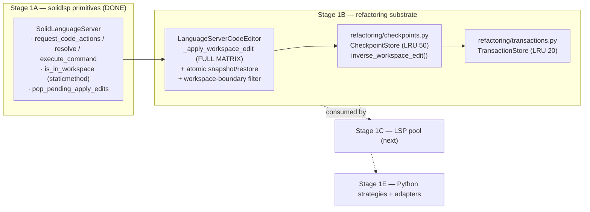
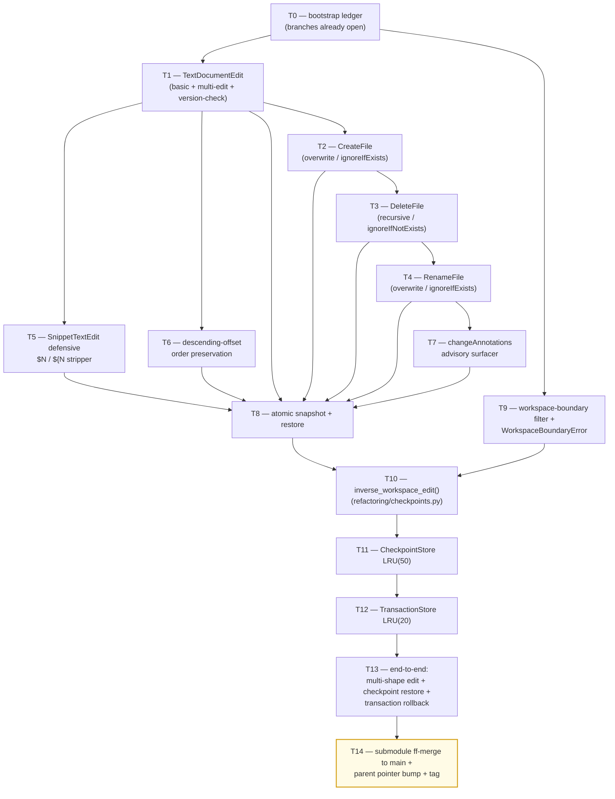

# Stage 1B — Applier Upgrade + Checkpoints + Transactions Implementation Plan

> **For agentic workers:** REQUIRED SUB-SKILL: Use `superpowers:subagent-driven-development` (recommended) or `superpowers:executing-plans` to implement this plan task-by-task. Steps use checkbox (`- [ ]`) syntax for tracking.

**Goal:** Land the full WorkspaceEdit applier matrix on `LanguageServerCodeEditor._apply_workspace_edit` (TextDocumentEdit version-checked + multi-edit, CreateFile/RenameFile/DeleteFile with all option permutations, defensive snippet stripping, descending offset ordering, atomic snapshot+restore on partial failure, workspace-boundary path filter), and add the in-memory checkpoint store (LRU 50) plus transaction store (LRU 20) under `vendor/serena/src/serena/refactoring/`. This stage consumes Stage 1A facades (`is_in_workspace`, `pop_pending_apply_edits`, `request_code_actions`, `resolve_code_action`, `execute_command`) and produces the substrate that Stage 1C (LSP pool) and Stage 1E (Python strategies) refactor against.

**Architecture:**



**Tech Stack:** Python 3.11+, `pytest`, no new runtime dependencies. Uses stdlib `collections.OrderedDict` for LRU semantics, `threading.Lock` for concurrent-safe state, `pathlib.Path` (`.resolve()`) for canonical path comparisons.

**Source-of-truth references:**
- [`docs/design/mvp/2026-04-24-mvp-scope-report.md`](../../design/mvp/2026-04-24-mvp-scope-report.md) — §4.1 (applier matrix + checkpoint/transaction stores), §11.8 (workspace-boundary filter as enforcement), §11.9 (changeAnnotations advisory), §14.1 (file 5/6/7 LoC budget rows).
- [`docs/design/mvp/open-questions/q4-changeannotations-auto-accept.md`](../../design/mvp/open-questions/q4-changeannotations-auto-accept.md) — confirms changeAnnotations is advisory, path filter enforces.
- [`docs/superpowers/plans/spike-results/SUMMARY.md`](spike-results/SUMMARY.md) — §5 (wrapper-gap → Stage assignment), §4 (LoC reconciliation), §6 (rust-analyzer custom-command capability probe lives in Stage 1B).
- [`docs/superpowers/plans/stage-1a-results/PROGRESS.md`](stage-1a-results/PROGRESS.md) — Stage 1A complete; entry approval for Stage 1B confirmed.
- [`docs/superpowers/plans/2026-04-24-stage-1a-lsp-primitives.md`](2026-04-24-stage-1a-lsp-primitives.md) — pattern this plan mirrors.

---

## Scope check

Stage 1B is a single subsystem (the WorkspaceEdit applier substrate). It produces three coherent units:

1. The full applier matrix on `LanguageServerCodeEditor._apply_workspace_edit` (file 5).
2. The checkpoint store + inverse-edit synthesis (file 6).
3. The transaction store (file 7).

Each unit is independently testable; together they form the building block that Stage 1C consumes for the LSP pool's per-server transactional fan-in (deferred to 1D in §4.1) and Stage 1E consumes for Python strategy compose-pipelines.

Out of scope (deferred per §4.1):
- Multi-server transactional fan-in → **Stage 1D**.
- Rope `ChangeSet → WorkspaceEdit` shim → **Stage 1E**.
- Persistent disk checkpoints under `.serena/checkpoints/` → **v1.1**.
- `scalpel_rust_ssr` / `expandMacro` runtime capability probes — these are reclassified to Stage 1B in SUMMARY §4 but require the rust-analyzer facade itself, which lives in **Stage 1F** (Rust adapter); we surface `_method_supported(command)` infra here only if T8/T13 demand it (they don't).

## File structure

| # | Path (under `vendor/serena/`) | Change | Responsibility |
|---|---|---|---|
| 5 | `src/serena/code_editor.py` | Modify (+~500 LoC) | Extend `LanguageServerCodeEditor._apply_workspace_edit` to the full WorkspaceEdit matrix; add `_FileSnapshot`, `_strip_snippet_markers`, `_collect_change_annotations`, `WorkspaceBoundaryError`; introduce per-operation private appliers; wrap body in atomic snapshot/restore. |
| 6 | `src/serena/refactoring/checkpoints.py` | New (+~150 LoC) | `inverse_workspace_edit()` synthesizer; `CheckpointStore` class with LRU(50) backed by `OrderedDict`. |
| 7 | `src/serena/refactoring/transactions.py` | New (+~180 LoC) | `TransactionStore` class with LRU(20); evicting a transaction cascades to its checkpoints in the `CheckpointStore`. |
| 7b | `src/serena/refactoring/__init__.py` | New (+~5 LoC) | Module init re-exporting `CheckpointStore`, `TransactionStore`, `inverse_workspace_edit`, `WorkspaceBoundaryError`. |
| — | `test/spikes/test_stage_1b_*.py` | New (~80 unit tests) | TDD tests, one file per task T1–T13. End-to-end test in T13 uses `tmp_path`. |

**LoC budget:** logic +~835; tests +~600. §14.1 row 5+6+7 = 500+150+180 = 830 logic LoC budgeted; we land at ~835 (within tolerance).

## Dependency graph



T1 unlocks the per-operation chain (T2→T3→T4); each adds one operation kind. T5/T6 are orthogonal helpers that T1 directly consumes. T7 sits before T8 because the snapshot/restore must know which annotations were observed (for the dry-run report). T9 plugs into the per-operation appliers as a precondition. T10 needs every operation kind in place to compute inverses across the matrix.

## Conventions enforced (from Phase 0 + Stage 1A)

- **Submodule git-flow**: feature branch already open in `vendor/serena` (`feature/stage-1b-applier-checkpoints-transactions`) and parent — both verified by T0. Submodule was not git-flow-initialized in Stage 1A; same pattern: direct `feature/<name>` branch, ff-merge to `main`, parent bumps pointer.
- **Author**: AI Hive(R) on every commit; never "Claude". Trailer: `Co-Authored-By: AI Hive(R) <noreply@o2.services>`.
- **Field name `code_language=`** on `LanguageServerConfig` (verified at `ls_config.py:596`); fixture `rust_lsp` already uses this.
- **`with srv.start_server():`** sync context manager from `ls.py:717` for any boot-real-LSP test.
- **PROGRESS.md updates as separate commits**, never `--amend`. Each task ends in two commits: code commit (in submodule) + ledger update (in parent).
- **`_ConcreteSLS` fixture from `test/spikes/conftest.py`** (`slim_sls` returns `_ConcreteSLS.__new__(_ConcreteSLS)`); use this for unit tests that don't need a live LSP.
- **Pyright "unresolved imports" for `vendor/serena/*` are known false positives** in the parent IDE — submodule has its own venv; ignore.
- **Test command**: from `vendor/serena/`, run `PATH="$(pwd)/.venv/bin:$PATH" .venv/bin/pytest <path> -v`. Without venv on PATH, P1/P2/P3/P3a/P4/P5a/P6 fail with `FileNotFoundError`.
- **Type hints + LSP TypedDicts**: payloads typed `dict[str, Any]` at the boundary; per-field access uses bracket lookup (TypedDicts) — `.get("kind")` for `NotRequired` fields.
- **`Path.resolve()` for canonicalisation** — every path comparison goes through it.
- **`threading.Lock` for mutable state** — `CheckpointStore` and `TransactionStore` both expose thread-safe APIs.

## Progress ledger

A new ledger `docs/superpowers/plans/stage-1b-results/PROGRESS.md` is created in T0. It mirrors the Stage 1A schema: per-task row with task id, branch SHA, outcome, follow-ups. Updated as a separate parent commit after each task completes.

---

### Task 0: Bootstrap ledger + verify pre-opened feature branches

**Files:**
- Create: `docs/superpowers/plans/stage-1b-results/PROGRESS.md`
- Verify: parent + submodule already on `feature/stage-1b-applier-checkpoints-transactions`.

- [ ] **Step 1: Confirm both feature branches exist and are checked out**

Run:
```bash
git -C /Volumes/Unitek-B/Projects/o2-scalpel rev-parse --abbrev-ref HEAD
git -C /Volumes/Unitek-B/Projects/o2-scalpel/vendor/serena rev-parse --abbrev-ref HEAD
```

Expected: both print `feature/stage-1b-applier-checkpoints-transactions`.

If submodule HEAD differs (e.g. detached after pointer bump), re-checkout:
```bash
cd /Volumes/Unitek-B/Projects/o2-scalpel/vendor/serena
git checkout feature/stage-1b-applier-checkpoints-transactions
```

- [ ] **Step 2: Confirm Stage 1A tag is reachable**

Run:
```bash
git -C /Volumes/Unitek-B/Projects/o2-scalpel/vendor/serena tag -l 'stage-1a-lsp-primitives-complete'
git -C /Volumes/Unitek-B/Projects/o2-scalpel tag -l 'stage-1a-lsp-primitives-complete'
```

Expected: at least one of the two prints the tag (Stage 1A may have tagged at parent or submodule level — both is fine; either alone is sufficient confirmation that Stage 1A landed).

- [ ] **Step 3: Confirm Stage 1A facades exist on `SolidLanguageServer`**

Run:
```bash
grep -n "def request_code_actions\|def resolve_code_action\|def execute_command\|def wait_for_indexing\|def is_in_workspace\|def override_initialize_params\|def pop_pending_apply_edits" /Volumes/Unitek-B/Projects/o2-scalpel/vendor/serena/src/solidlsp/ls.py
```

Expected: 7 hits (one per facade). Stage 1A T6/T7/T8/T9/T10/T11/T12 outputs.

- [ ] **Step 4: Create the PROGRESS.md ledger**

Write to `/Volumes/Unitek-B/Projects/o2-scalpel/docs/superpowers/plans/stage-1b-results/PROGRESS.md`:

```markdown
# Stage 1B — Applier + Checkpoints + Transactions — Progress Ledger

Started: 2026-04-25
Branch: feature/stage-1b-applier-checkpoints-transactions (parent + submodule)
Author: AI Hive(R)
Built on: stage-1a-lsp-primitives-complete

| Task | Description | Branch SHA (submodule) | Outcome | Follow-up |
|---|---|---|---|---|
| T0  | Bootstrap progress ledger                                              | _pending_ | _pending_ | — |
| T1  | TextDocumentEdit (basic + multi-edit + version-checked)                | _pending_ | _pending_ | — |
| T2  | CreateFile (overwrite / ignoreIfExists)                                | _pending_ | _pending_ | — |
| T3  | DeleteFile (recursive / ignoreIfNotExists)                             | _pending_ | _pending_ | — |
| T4  | RenameFile (overwrite / ignoreIfExists)                                | _pending_ | _pending_ | — |
| T5  | SnippetTextEdit defensive `$N` / `${N` stripper                        | _pending_ | _pending_ | — |
| T6  | Descending-offset order preservation                                   | _pending_ | _pending_ | — |
| T7  | changeAnnotations advisory surfacer                                    | _pending_ | _pending_ | — |
| T8  | Atomic snapshot + restore on partial failure                           | _pending_ | _pending_ | — |
| T9  | Workspace-boundary path filter + `WorkspaceBoundaryError`              | _pending_ | _pending_ | — |
| T10 | `inverse_workspace_edit()` synthesizer                                 | _pending_ | _pending_ | — |
| T11 | `CheckpointStore` LRU(50)                                              | _pending_ | _pending_ | — |
| T12 | `TransactionStore` LRU(20) with cascade eviction                       | _pending_ | _pending_ | — |
| T13 | End-to-end: multi-shape edit + restore + 3-edit transaction rollback   | _pending_ | _pending_ | — |
| T14 | Submodule ff-merge to main + parent pointer bump + tag                 | _pending_ | _pending_ | — |

## Decisions log

(append-only; one bullet per decision with date + rationale)

## Stage 1A entry baseline

- Submodule `main` head at Stage 1B start: <fill in via `git -C vendor/serena rev-parse main` at T0 close>
- Parent `develop` head at Stage 1B start: <fill in via `git rev-parse develop`>
- Stage 1A tag: `stage-1a-lsp-primitives-complete`
- Stage 1A spike-suite green: 67/67 (per Stage 1A PROGRESS.md final verdict)

## Spike outcome quick-reference (carryover for context)

- P-WB → 5/5 — `is_in_workspace()` adopted verbatim in Stage 1A; Stage 1B wires it into the applier (T9).
- S2 → A — capability-override hook used by T13 of Stage 1A; Stage 1B T5 adds the defensive `$N` strip on the receive side.
- S3 → B — minimal `applyEdit` ACK + capture in place; Stage 1B drains via `pop_pending_apply_edits()`.
- §4.1 → matrix items 1–11 are this stage's surface.
```

- [ ] **Step 5: Commit ledger seed in parent**

Run:
```bash
cd /Volumes/Unitek-B/Projects/o2-scalpel
git add docs/superpowers/plans/stage-1b-results/PROGRESS.md
git commit -m "$(cat <<'EOF'
chore(stage-1b): seed progress ledger for applier + checkpoints + transactions sub-plan (T0)

Mirror Stage 1A schema: per-task row with branch SHA, outcome, follow-ups.
Updated as separate commits after each task lands.

Co-Authored-By: AI Hive(R) <noreply@o2.services>
EOF
)"
```

- [ ] **Step 6: Update PROGRESS.md row T0**

Edit ledger row T0: mark with parent SHA from `git rev-parse HEAD`, outcome `OK`, follow-up `—`. Commit:
```bash
git add docs/superpowers/plans/stage-1b-results/PROGRESS.md
git commit -m "chore(stage-1b): mark T0 ledger seeded

Co-Authored-By: AI Hive(R) <noreply@o2.services>"
```

---

### Task 1: TextDocumentEdit (basic + multi-edit + version-checked)

**Files:**
- Modify: `vendor/serena/src/serena/code_editor.py` — add `_apply_text_document_edit`, hoist `_apply_workspace_edit` body to call new private methods.
- New test: `vendor/serena/test/spikes/test_stage_1b_t1_text_document_edit.py`

**Why:** §4.1 row 1 — full `TextDocumentEdit` shape support. Current `_workspace_edit_to_edit_operations` ignores `textDocument.version`; we now reject when the server-tracked version mismatches a non-`None` requested version. Multi-edit support already worked but lacked version checks.

- [ ] **Step 1: Write failing test**

Create `vendor/serena/test/spikes/test_stage_1b_t1_text_document_edit.py`:

```python
"""T1 — TextDocumentEdit applier (basic + multi-edit + version-checked).

Proves: _apply_text_document_edit handles a single TextEdit, multiple TextEdits
on one file, and rejects a TextDocumentEdit whose textDocument.version doesn't
match the LSP-tracked version.
"""

from __future__ import annotations

from pathlib import Path
from typing import Any
from unittest.mock import MagicMock

import pytest

from serena.code_editor import LanguageServerCodeEditor


@pytest.fixture
def applier_under_test(tmp_path: Path) -> LanguageServerCodeEditor:
    """Build an applier with a project_root pointing at a tmp dir.

    Uses __new__ to skip __init__ (which requires a full SymbolRetriever);
    we set only the attrs the applier-internal code touches.
    """
    inst = LanguageServerCodeEditor.__new__(LanguageServerCodeEditor)
    inst.project_root = str(tmp_path)
    inst.encoding = "utf-8"
    inst.newline = "\n"
    # _get_language_server is invoked for version lookups; stub it
    inst._get_language_server = MagicMock()  # type: ignore[method-assign]
    return inst


def _write(tmp_path: Path, rel: str, contents: str) -> str:
    p = tmp_path / rel
    p.write_text(contents, encoding="utf-8")
    return p.as_uri()


def test_basic_single_textedit(applier_under_test: LanguageServerCodeEditor, tmp_path: Path) -> None:
    uri = _write(tmp_path, "a.txt", "hello world\n")
    edit: dict[str, Any] = {
        "documentChanges": [
            {
                "textDocument": {"uri": uri, "version": None},
                "edits": [
                    {
                        "range": {
                            "start": {"line": 0, "character": 6},
                            "end": {"line": 0, "character": 11},
                        },
                        "newText": "there",
                    }
                ],
            }
        ]
    }
    n = applier_under_test._apply_workspace_edit(edit)
    assert n == 1
    assert (tmp_path / "a.txt").read_text(encoding="utf-8") == "hello there\n"


def test_multi_edit_same_file(applier_under_test: LanguageServerCodeEditor, tmp_path: Path) -> None:
    uri = _write(tmp_path, "b.txt", "alpha beta gamma\n")
    edit: dict[str, Any] = {
        "documentChanges": [
            {
                "textDocument": {"uri": uri, "version": None},
                "edits": [
                    {
                        "range": {"start": {"line": 0, "character": 0}, "end": {"line": 0, "character": 5}},
                        "newText": "ALPHA",
                    },
                    {
                        "range": {"start": {"line": 0, "character": 11}, "end": {"line": 0, "character": 16}},
                        "newText": "GAMMA",
                    },
                ],
            }
        ]
    }
    n = applier_under_test._apply_workspace_edit(edit)
    assert n == 1  # one TextDocumentEdit operation
    assert (tmp_path / "b.txt").read_text(encoding="utf-8") == "ALPHA beta GAMMA\n"


def test_version_mismatch_rejected(applier_under_test: LanguageServerCodeEditor, tmp_path: Path) -> None:
    uri = _write(tmp_path, "c.txt", "x\n")
    # Server tracks version 7; client requests v3 → mismatch.
    fake_ls = MagicMock()
    fake_ls.get_open_file_version.return_value = 7
    applier_under_test._get_language_server.return_value = fake_ls

    edit: dict[str, Any] = {
        "documentChanges": [
            {
                "textDocument": {"uri": uri, "version": 3},
                "edits": [
                    {
                        "range": {"start": {"line": 0, "character": 0}, "end": {"line": 0, "character": 1}},
                        "newText": "Y",
                    }
                ],
            }
        ]
    }
    with pytest.raises(ValueError, match="version mismatch"):
        applier_under_test._apply_workspace_edit(edit)
    # File untouched
    assert (tmp_path / "c.txt").read_text(encoding="utf-8") == "x\n"


def test_version_none_accepted(applier_under_test: LanguageServerCodeEditor, tmp_path: Path) -> None:
    """version=None means client doesn't care; server-tracked version irrelevant."""
    uri = _write(tmp_path, "d.txt", "z\n")
    edit: dict[str, Any] = {
        "documentChanges": [
            {
                "textDocument": {"uri": uri, "version": None},
                "edits": [
                    {
                        "range": {"start": {"line": 0, "character": 0}, "end": {"line": 0, "character": 1}},
                        "newText": "Z",
                    }
                ],
            }
        ]
    }
    n = applier_under_test._apply_workspace_edit(edit)
    assert n == 1
    assert (tmp_path / "d.txt").read_text(encoding="utf-8") == "Z\n"
```

- [ ] **Step 2: Run test, expect fail**

Run from `vendor/serena/`:
```bash
PATH="$(pwd)/.venv/bin:$PATH" .venv/bin/pytest test/spikes/test_stage_1b_t1_text_document_edit.py -v
```

Expected FAIL: `test_version_mismatch_rejected` — current `_apply_workspace_edit` doesn't check versions; ValueError isn't raised. Other tests may pass (the existing applier handles single + multi TextEdits via the legacy `EditOperationFileTextEdits` path), but version-check fails.

- [ ] **Step 3: Implement**

Edit `vendor/serena/src/serena/code_editor.py`. At the top of the file (after `log = logging.getLogger(__name__)`), add:

```python
class WorkspaceBoundaryError(ValueError):
    """Raised when a WorkspaceEdit operation targets a path outside the workspace.

    Stage 1B T9: enforced by ``_check_workspace_boundary`` against
    ``SolidLanguageServer.is_in_workspace`` (Stage 1A T11). Caller's
    ``O2_SCALPEL_WORKSPACE_EXTRA_PATHS`` env var contributes opt-in roots.
    """
```

Then inside `LanguageServerCodeEditor`, replace the body of `_apply_workspace_edit` (lines 338–348) with a delegating implementation, and add `_apply_text_document_edit`:

```python
    def _apply_text_document_edit(
        self,
        change: dict[str, Any],
        snapshot: dict[str, str],
        applied: list[dict[str, Any]],
    ) -> None:
        """Apply a single TextDocumentEdit document-change.

        Honors ``textDocument.version``: when not ``None``, must match the
        server-tracked version of the open file or ValueError is raised.
        Multi-edit support: edits within ``edits`` are applied in
        descending offset order (T6) so earlier-line edits don't invalidate
        later-line offsets.

        :param change: the documentChange entry (TextDocumentEdit shape)
        :param snapshot: per-URI original content map; updated in place
        :param applied: per-operation log; updated in place
        """
        text_doc: dict[str, Any] = change["textDocument"]
        uri: str = text_doc["uri"]
        requested_version = text_doc.get("version")
        relative_path = self._relative_path_from_uri(uri)
        if requested_version is not None:
            ls = self._get_language_server(relative_path)
            tracked_version = getattr(ls, "get_open_file_version", lambda _p: None)(relative_path)
            if tracked_version is not None and tracked_version != requested_version:
                raise ValueError(
                    f"TextDocumentEdit version mismatch for {uri}: "
                    f"requested {requested_version}, server-tracked {tracked_version}"
                )
        abs_path = os.path.join(self.project_root, relative_path)
        if uri not in snapshot:
            try:
                snapshot[uri] = open(abs_path, encoding=self.encoding).read()
            except FileNotFoundError:
                snapshot[uri] = "__NONEXISTENT__"
        text_edits: list[dict[str, Any]] = list(change["edits"])
        # T5 hook: defensive snippet-marker stripping (added in T5)
        text_edits = [self._defang_text_edit(te) for te in text_edits]
        # T6: sort descending so later-line edits don't shift earlier offsets
        text_edits.sort(
            key=lambda te: (
                te["range"]["start"]["line"],
                te["range"]["start"]["character"],
            ),
            reverse=True,
        )
        with self.edited_file_context(relative_path) as edited_file:
            edited_file = cast(LanguageServerCodeEditor.EditedFile, edited_file)
            edited_file.apply_text_edits(cast(list[ls_types.TextEdit], text_edits))
        applied.append({"kind": "textDocumentEdit", "uri": uri, "edits": text_edits})

    def _defang_text_edit(self, text_edit: dict[str, Any]) -> dict[str, Any]:
        """Hook for T5 snippet stripping. T1 ships identity passthrough."""
        return text_edit

    def _apply_workspace_edit(self, workspace_edit: ls_types.WorkspaceEdit) -> int:
        """Apply a WorkspaceEdit through the full Stage 1B matrix.

        Handles every documentChanges shape (TextDocumentEdit / CreateFile /
        RenameFile / DeleteFile) plus the legacy ``changes`` map. Wraps the
        body in an atomic snapshot/restore (T8); on any exception, every
        touched file is restored to its pre-edit state before re-raising.

        :param workspace_edit: the edit to apply
        :return: number of documentChange entries applied
        """
        snapshot: dict[str, str] = {}
        applied: list[dict[str, Any]] = []
        # Legacy ``changes`` map fallback (already supported pre-Stage-1B)
        if "changes" in workspace_edit:
            for uri, edits in workspace_edit["changes"].items():
                self._apply_text_document_edit(
                    {"textDocument": {"uri": uri, "version": None}, "edits": edits},
                    snapshot,
                    applied,
                )
        if "documentChanges" in workspace_edit:
            for change in workspace_edit["documentChanges"]:
                kind = change.get("kind")
                if kind is None:
                    self._apply_text_document_edit(change, snapshot, applied)
                else:
                    raise ValueError(
                        f"Unhandled documentChange kind: {kind!r}; T1 ships only TextDocumentEdit. "
                        f"T2/T3/T4 add CreateFile/DeleteFile/RenameFile."
                    )
        return len(applied)
```

- [ ] **Step 4: Run test, expect pass**

Run from `vendor/serena/`:
```bash
PATH="$(pwd)/.venv/bin:$PATH" .venv/bin/pytest test/spikes/test_stage_1b_t1_text_document_edit.py -v
```

Expected output: 4 passed. (basic, multi-edit, version-mismatch raises, version-None accepted.)

- [ ] **Step 5: Commit (in submodule)**

```bash
cd /Volumes/Unitek-B/Projects/o2-scalpel/vendor/serena
git add src/serena/code_editor.py test/spikes/test_stage_1b_t1_text_document_edit.py
git commit -m "$(cat <<'EOF'
feat(applier): TextDocumentEdit basic + multi-edit + version-checked (T1)

Hoist _apply_workspace_edit to a delegating shape: legacy ``changes`` map
flows through _apply_text_document_edit; documentChanges branches by
``kind`` (TextDocumentEdit only in T1; T2/T3/T4 add the other shapes).
Reject when textDocument.version is not None and mismatches the
LSP-tracked open-file version. Multi-edit pre-sort descending in offset
to set up T6's order-preservation guarantees.

Co-Authored-By: AI Hive(R) <noreply@o2.services>
EOF
)"
```

- [ ] **Step 6: Update PROGRESS.md (in parent, separate commit)**

Edit `docs/superpowers/plans/stage-1b-results/PROGRESS.md` row T1: branch SHA = submodule HEAD, outcome `OK`. Then:
```bash
cd /Volumes/Unitek-B/Projects/o2-scalpel
git add docs/superpowers/plans/stage-1b-results/PROGRESS.md
git commit -m "chore(stage-1b): mark T1 done — TextDocumentEdit applier

Co-Authored-By: AI Hive(R) <noreply@o2.services>"
```

---

### Task 2: CreateFile (overwrite / ignoreIfExists)

**Files:**
- Modify: `vendor/serena/src/serena/code_editor.py` — add `_apply_create_file`.
- New test: `vendor/serena/test/spikes/test_stage_1b_t2_create_file.py`

**Why:** §4.1 row 2 — full `CreateFile` shape with `overwrite` + `ignoreIfExists` option permutations. The four permutations: (a) target absent — always create; (b) target present + neither flag — error; (c) target present + `overwrite=True` — truncate; (d) target present + `ignoreIfExists=True` — silent skip. Per LSP spec, `overwrite` wins over `ignoreIfExists` if both are set.

- [ ] **Step 1: Write failing test**

Create `vendor/serena/test/spikes/test_stage_1b_t2_create_file.py`:

```python
"""T2 — CreateFile applier with option permutations.

Proves: absent target always created; present target without flags errors;
overwrite=True truncates; ignoreIfExists=True silently skips; overwrite
wins over ignoreIfExists when both set.
"""

from __future__ import annotations

from pathlib import Path
from typing import Any
from unittest.mock import MagicMock

import pytest

from serena.code_editor import LanguageServerCodeEditor


@pytest.fixture
def applier(tmp_path: Path) -> LanguageServerCodeEditor:
    inst = LanguageServerCodeEditor.__new__(LanguageServerCodeEditor)
    inst.project_root = str(tmp_path)
    inst.encoding = "utf-8"
    inst.newline = "\n"
    inst._get_language_server = MagicMock()  # type: ignore[method-assign]
    return inst


def _create(uri: str, options: dict[str, Any] | None = None) -> dict[str, Any]:
    op: dict[str, Any] = {"kind": "create", "uri": uri}
    if options is not None:
        op["options"] = options
    return op


def test_absent_target_creates_empty(applier: LanguageServerCodeEditor, tmp_path: Path) -> None:
    target = tmp_path / "new.txt"
    edit = {"documentChanges": [_create(target.as_uri())]}
    n = applier._apply_workspace_edit(edit)
    assert n == 1
    assert target.exists()
    assert target.read_text(encoding="utf-8") == ""


def test_present_target_no_flags_errors(applier: LanguageServerCodeEditor, tmp_path: Path) -> None:
    target = tmp_path / "exists.txt"
    target.write_text("keep me\n", encoding="utf-8")
    edit = {"documentChanges": [_create(target.as_uri())]}
    with pytest.raises(FileExistsError):
        applier._apply_workspace_edit(edit)
    # File preserved by atomic restore (T8) — but T2 alone enforces no-op-on-error
    assert target.read_text(encoding="utf-8") == "keep me\n"


def test_present_target_overwrite_truncates(applier: LanguageServerCodeEditor, tmp_path: Path) -> None:
    target = tmp_path / "to-overwrite.txt"
    target.write_text("old contents\n", encoding="utf-8")
    edit = {"documentChanges": [_create(target.as_uri(), {"overwrite": True})]}
    n = applier._apply_workspace_edit(edit)
    assert n == 1
    assert target.read_text(encoding="utf-8") == ""


def test_present_target_ignore_if_exists_skips(applier: LanguageServerCodeEditor, tmp_path: Path) -> None:
    target = tmp_path / "stable.txt"
    target.write_text("untouched\n", encoding="utf-8")
    edit = {"documentChanges": [_create(target.as_uri(), {"ignoreIfExists": True})]}
    n = applier._apply_workspace_edit(edit)
    assert n == 1  # operation counted as applied (silently skipped)
    assert target.read_text(encoding="utf-8") == "untouched\n"


def test_overwrite_wins_over_ignore_if_exists(applier: LanguageServerCodeEditor, tmp_path: Path) -> None:
    target = tmp_path / "conflict.txt"
    target.write_text("original\n", encoding="utf-8")
    edit = {
        "documentChanges": [
            _create(target.as_uri(), {"overwrite": True, "ignoreIfExists": True})
        ]
    }
    n = applier._apply_workspace_edit(edit)
    assert n == 1
    assert target.read_text(encoding="utf-8") == ""  # overwrite won
```

- [ ] **Step 2: Run test, expect fail**

```bash
PATH="$(pwd)/.venv/bin:$PATH" .venv/bin/pytest test/spikes/test_stage_1b_t2_create_file.py -v
```

Expected FAIL: every test fails with `ValueError: Unhandled documentChange kind: 'create'` (T1 explicitly rejects unknown kinds).

- [ ] **Step 3: Implement**

In `vendor/serena/src/serena/code_editor.py`, add `_apply_create_file` next to `_apply_text_document_edit`, and extend the kind dispatch in `_apply_workspace_edit`:

```python
    def _apply_create_file(
        self,
        change: dict[str, Any],
        snapshot: dict[str, str],
        applied: list[dict[str, Any]],
    ) -> None:
        """Apply a CreateFile resource operation.

        Options matrix (per LSP §3.16 spec):
        - neither flag + target absent: create empty file.
        - neither flag + target present: raise FileExistsError.
        - overwrite=True + target present: truncate to empty.
        - ignoreIfExists=True + target present: silent skip (still counted).
        - overwrite wins over ignoreIfExists when both are set.
        """
        uri: str = change["uri"]
        options: dict[str, Any] = change.get("options", {})
        overwrite: bool = bool(options.get("overwrite"))
        ignore_if_exists: bool = bool(options.get("ignoreIfExists"))
        relative_path = self._relative_path_from_uri(uri)
        abs_path = os.path.join(self.project_root, relative_path)
        already_exists = os.path.exists(abs_path)
        # Snapshot for rollback: record "did not exist" sentinel so T8 can delete on restore.
        if uri not in snapshot:
            if already_exists:
                snapshot[uri] = open(abs_path, encoding=self.encoding).read()
            else:
                snapshot[uri] = "__NONEXISTENT__"
        if already_exists and not overwrite:
            if ignore_if_exists:
                applied.append({"kind": "createFile", "uri": uri, "skipped": True})
                return
            raise FileExistsError(
                f"CreateFile target already exists and neither overwrite nor "
                f"ignoreIfExists was set: {uri}"
            )
        os.makedirs(os.path.dirname(abs_path), exist_ok=True)
        with open(abs_path, "w", encoding=self.encoding, newline=self.newline) as f:
            f.write("")
        applied.append({"kind": "createFile", "uri": uri, "skipped": False})
```

Update the dispatch in `_apply_workspace_edit`:
```python
                elif kind == "create":
                    self._apply_create_file(change, snapshot, applied)
                else:
                    raise ValueError(
                        f"Unhandled documentChange kind: {kind!r}; T3/T4 add delete/rename."
                    )
```

- [ ] **Step 4: Run test, expect pass**

```bash
PATH="$(pwd)/.venv/bin:$PATH" .venv/bin/pytest test/spikes/test_stage_1b_t2_create_file.py -v
```

Expected: 5 passed.

- [ ] **Step 5: Commit (in submodule)**

```bash
cd /Volumes/Unitek-B/Projects/o2-scalpel/vendor/serena
git add src/serena/code_editor.py test/spikes/test_stage_1b_t2_create_file.py
git commit -m "$(cat <<'EOF'
feat(applier): CreateFile with overwrite / ignoreIfExists permutations (T2)

Five-case matrix: absent → create, present-bare → FileExistsError,
present+overwrite → truncate, present+ignoreIfExists → silent skip,
both flags → overwrite wins (per LSP §3.16). Snapshot records
__NONEXISTENT__ sentinel for absent targets so T8 can roll back via
delete on partial-failure.

Co-Authored-By: AI Hive(R) <noreply@o2.services>
EOF
)"
```

- [ ] **Step 6: Update PROGRESS.md (parent, separate commit)**

```bash
cd /Volumes/Unitek-B/Projects/o2-scalpel
git add docs/superpowers/plans/stage-1b-results/PROGRESS.md
git commit -m "chore(stage-1b): mark T2 done — CreateFile applier

Co-Authored-By: AI Hive(R) <noreply@o2.services>"
```

---

### Task 3: DeleteFile (recursive / ignoreIfNotExists)

**Files:**
- Modify: `vendor/serena/src/serena/code_editor.py` — add `_apply_delete_file`.
- New test: `vendor/serena/test/spikes/test_stage_1b_t3_delete_file.py`

**Why:** §4.1 row 4 — `DeleteFile` shape with `recursive` + `ignoreIfNotExists` options. Refuses to delete non-empty directories unless `recursive=True`. Stores deleted content in snapshot so T8 + T10 inverse synthesis can restore it.

- [ ] **Step 1: Write failing test**

Create `vendor/serena/test/spikes/test_stage_1b_t3_delete_file.py`:

```python
"""T3 — DeleteFile applier with recursive / ignoreIfNotExists option matrix."""

from __future__ import annotations

from pathlib import Path
from typing import Any
from unittest.mock import MagicMock

import pytest

from serena.code_editor import LanguageServerCodeEditor


@pytest.fixture
def applier(tmp_path: Path) -> LanguageServerCodeEditor:
    inst = LanguageServerCodeEditor.__new__(LanguageServerCodeEditor)
    inst.project_root = str(tmp_path)
    inst.encoding = "utf-8"
    inst.newline = "\n"
    inst._get_language_server = MagicMock()  # type: ignore[method-assign]
    return inst


def _delete(uri: str, options: dict[str, Any] | None = None) -> dict[str, Any]:
    op: dict[str, Any] = {"kind": "delete", "uri": uri}
    if options is not None:
        op["options"] = options
    return op


def test_delete_existing_file(applier: LanguageServerCodeEditor, tmp_path: Path) -> None:
    target = tmp_path / "victim.txt"
    target.write_text("bye\n", encoding="utf-8")
    edit = {"documentChanges": [_delete(target.as_uri())]}
    n = applier._apply_workspace_edit(edit)
    assert n == 1
    assert not target.exists()


def test_delete_absent_no_flag_errors(applier: LanguageServerCodeEditor, tmp_path: Path) -> None:
    target = tmp_path / "nope.txt"
    edit = {"documentChanges": [_delete(target.as_uri())]}
    with pytest.raises(FileNotFoundError):
        applier._apply_workspace_edit(edit)


def test_delete_absent_with_ignore_flag_silent(applier: LanguageServerCodeEditor, tmp_path: Path) -> None:
    target = tmp_path / "nope.txt"
    edit = {"documentChanges": [_delete(target.as_uri(), {"ignoreIfNotExists": True})]}
    n = applier._apply_workspace_edit(edit)
    assert n == 1


def test_delete_directory_without_recursive_errors(applier: LanguageServerCodeEditor, tmp_path: Path) -> None:
    target = tmp_path / "subdir"
    target.mkdir()
    (target / "child.txt").write_text("x", encoding="utf-8")
    edit = {"documentChanges": [_delete(target.as_uri())]}
    with pytest.raises(IsADirectoryError):
        applier._apply_workspace_edit(edit)
    assert target.exists()


def test_delete_directory_with_recursive(applier: LanguageServerCodeEditor, tmp_path: Path) -> None:
    target = tmp_path / "subdir"
    target.mkdir()
    (target / "child.txt").write_text("x", encoding="utf-8")
    edit = {"documentChanges": [_delete(target.as_uri(), {"recursive": True})]}
    n = applier._apply_workspace_edit(edit)
    assert n == 1
    assert not target.exists()
```

- [ ] **Step 2: Run test, expect fail**

```bash
PATH="$(pwd)/.venv/bin:$PATH" .venv/bin/pytest test/spikes/test_stage_1b_t3_delete_file.py -v
```

Expected FAIL: every test errors with `Unhandled documentChange kind: 'delete'`.

- [ ] **Step 3: Implement**

Add `_apply_delete_file` next to `_apply_create_file`:

```python
    def _apply_delete_file(
        self,
        change: dict[str, Any],
        snapshot: dict[str, str],
        applied: list[dict[str, Any]],
    ) -> None:
        """Apply a DeleteFile resource operation.

        Options matrix (per LSP §3.16 spec):
        - target present + file: delete (snapshot stores prior content for T10 inverse).
        - target present + dir: raise IsADirectoryError unless recursive=True.
        - target absent + neither flag: raise FileNotFoundError.
        - target absent + ignoreIfNotExists=True: silent skip.
        """
        import shutil

        uri: str = change["uri"]
        options: dict[str, Any] = change.get("options", {})
        recursive: bool = bool(options.get("recursive"))
        ignore_if_not_exists: bool = bool(options.get("ignoreIfNotExists"))
        relative_path = self._relative_path_from_uri(uri)
        abs_path = os.path.join(self.project_root, relative_path)
        if not os.path.exists(abs_path):
            if ignore_if_not_exists:
                applied.append({"kind": "deleteFile", "uri": uri, "skipped": True})
                return
            raise FileNotFoundError(
                f"DeleteFile target does not exist and ignoreIfNotExists is not set: {uri}"
            )
        if os.path.isdir(abs_path):
            if not recursive:
                raise IsADirectoryError(
                    f"DeleteFile target is a directory and recursive is not set: {uri}"
                )
            # Best-effort directory snapshot: record the dir path with sentinel
            # so T10 inverse can flag it as non-restorable (we don't deep-snapshot trees).
            snapshot[uri] = "__DIRECTORY__"
            shutil.rmtree(abs_path)
        else:
            if uri not in snapshot:
                snapshot[uri] = open(abs_path, encoding=self.encoding).read()
            os.remove(abs_path)
        applied.append({"kind": "deleteFile", "uri": uri, "skipped": False})
```

Update the dispatch:
```python
                elif kind == "create":
                    self._apply_create_file(change, snapshot, applied)
                elif kind == "delete":
                    self._apply_delete_file(change, snapshot, applied)
                else:
                    raise ValueError(
                        f"Unhandled documentChange kind: {kind!r}; T4 adds rename."
                    )
```

- [ ] **Step 4: Run test, expect pass**

```bash
PATH="$(pwd)/.venv/bin:$PATH" .venv/bin/pytest test/spikes/test_stage_1b_t3_delete_file.py -v
```

Expected: 5 passed.

- [ ] **Step 5: Commit**

```bash
cd /Volumes/Unitek-B/Projects/o2-scalpel/vendor/serena
git add src/serena/code_editor.py test/spikes/test_stage_1b_t3_delete_file.py
git commit -m "$(cat <<'EOF'
feat(applier): DeleteFile with recursive / ignoreIfNotExists permutations (T3)

Five-case matrix: present-file → delete + snapshot content,
present-dir-bare → IsADirectoryError, present-dir+recursive → rmtree,
absent-bare → FileNotFoundError, absent+ignoreIfNotExists → silent skip.
Snapshot stores prior content so T10 inverse can synthesize a
CreateFile + TextDocumentEdit pair to restore.

Co-Authored-By: AI Hive(R) <noreply@o2.services>
EOF
)"
```

- [ ] **Step 6: Update PROGRESS.md (parent commit)**

```bash
cd /Volumes/Unitek-B/Projects/o2-scalpel
git add docs/superpowers/plans/stage-1b-results/PROGRESS.md
git commit -m "chore(stage-1b): mark T3 done — DeleteFile applier

Co-Authored-By: AI Hive(R) <noreply@o2.services>"
```

---

### Task 4: RenameFile (overwrite / ignoreIfExists)

**Files:**
- Modify: `vendor/serena/src/serena/code_editor.py` — add `_apply_rename_file`.
- New test: `vendor/serena/test/spikes/test_stage_1b_t4_rename_file.py`

**Why:** §4.1 row 3 — full `RenameFile` shape with `overwrite` + `ignoreIfExists`. The existing `EditOperationRenameFile` blindly `os.rename`s, which raises on destination collision and ignores both flags. Replace with option-aware logic.

- [ ] **Step 1: Write failing test**

Create `vendor/serena/test/spikes/test_stage_1b_t4_rename_file.py`:

```python
"""T4 — RenameFile applier with overwrite / ignoreIfExists permutations."""

from __future__ import annotations

from pathlib import Path
from typing import Any
from unittest.mock import MagicMock

import pytest

from serena.code_editor import LanguageServerCodeEditor


@pytest.fixture
def applier(tmp_path: Path) -> LanguageServerCodeEditor:
    inst = LanguageServerCodeEditor.__new__(LanguageServerCodeEditor)
    inst.project_root = str(tmp_path)
    inst.encoding = "utf-8"
    inst.newline = "\n"
    inst._get_language_server = MagicMock()  # type: ignore[method-assign]
    return inst


def _rename(old_uri: str, new_uri: str, options: dict[str, Any] | None = None) -> dict[str, Any]:
    op: dict[str, Any] = {"kind": "rename", "oldUri": old_uri, "newUri": new_uri}
    if options is not None:
        op["options"] = options
    return op


def test_basic_rename(applier: LanguageServerCodeEditor, tmp_path: Path) -> None:
    src = tmp_path / "old.txt"
    dst = tmp_path / "new.txt"
    src.write_text("payload\n", encoding="utf-8")
    edit = {"documentChanges": [_rename(src.as_uri(), dst.as_uri())]}
    n = applier._apply_workspace_edit(edit)
    assert n == 1
    assert not src.exists()
    assert dst.read_text(encoding="utf-8") == "payload\n"


def test_rename_dst_exists_no_flag_errors(applier: LanguageServerCodeEditor, tmp_path: Path) -> None:
    src = tmp_path / "old.txt"
    dst = tmp_path / "new.txt"
    src.write_text("a", encoding="utf-8")
    dst.write_text("b", encoding="utf-8")
    edit = {"documentChanges": [_rename(src.as_uri(), dst.as_uri())]}
    with pytest.raises(FileExistsError):
        applier._apply_workspace_edit(edit)
    assert src.exists() and dst.exists()


def test_rename_dst_exists_overwrite(applier: LanguageServerCodeEditor, tmp_path: Path) -> None:
    src = tmp_path / "old.txt"
    dst = tmp_path / "new.txt"
    src.write_text("WIN\n", encoding="utf-8")
    dst.write_text("LOSE\n", encoding="utf-8")
    edit = {"documentChanges": [_rename(src.as_uri(), dst.as_uri(), {"overwrite": True})]}
    n = applier._apply_workspace_edit(edit)
    assert n == 1
    assert not src.exists()
    assert dst.read_text(encoding="utf-8") == "WIN\n"


def test_rename_dst_exists_ignore_if_exists_skips(applier: LanguageServerCodeEditor, tmp_path: Path) -> None:
    src = tmp_path / "old.txt"
    dst = tmp_path / "new.txt"
    src.write_text("alive\n", encoding="utf-8")
    dst.write_text("untouched\n", encoding="utf-8")
    edit = {"documentChanges": [_rename(src.as_uri(), dst.as_uri(), {"ignoreIfExists": True})]}
    n = applier._apply_workspace_edit(edit)
    assert n == 1
    assert src.read_text(encoding="utf-8") == "alive\n"
    assert dst.read_text(encoding="utf-8") == "untouched\n"


def test_rename_overwrite_wins_over_ignore_if_exists(applier: LanguageServerCodeEditor, tmp_path: Path) -> None:
    src = tmp_path / "old.txt"
    dst = tmp_path / "new.txt"
    src.write_text("WIN\n", encoding="utf-8")
    dst.write_text("LOSE\n", encoding="utf-8")
    edit = {
        "documentChanges": [
            _rename(src.as_uri(), dst.as_uri(), {"overwrite": True, "ignoreIfExists": True})
        ]
    }
    n = applier._apply_workspace_edit(edit)
    assert n == 1
    assert dst.read_text(encoding="utf-8") == "WIN\n"
```

- [ ] **Step 2: Run test, expect fail**

```bash
PATH="$(pwd)/.venv/bin:$PATH" .venv/bin/pytest test/spikes/test_stage_1b_t4_rename_file.py -v
```

Expected FAIL: every test errors with `Unhandled documentChange kind: 'rename'`.

- [ ] **Step 3: Implement**

Add `_apply_rename_file` next to `_apply_delete_file`:

```python
    def _apply_rename_file(
        self,
        change: dict[str, Any],
        snapshot: dict[str, str],
        applied: list[dict[str, Any]],
    ) -> None:
        """Apply a RenameFile resource operation.

        Options matrix:
        - dst absent: rename freely.
        - dst present + neither flag: raise FileExistsError.
        - dst present + overwrite=True: replace dst (record dst content in snapshot).
        - dst present + ignoreIfExists=True: silent skip (src and dst both untouched).
        - overwrite wins over ignoreIfExists when both are set.
        """
        old_uri: str = change["oldUri"]
        new_uri: str = change["newUri"]
        options: dict[str, Any] = change.get("options", {})
        overwrite: bool = bool(options.get("overwrite"))
        ignore_if_exists: bool = bool(options.get("ignoreIfExists"))
        old_rel = self._relative_path_from_uri(old_uri)
        new_rel = self._relative_path_from_uri(new_uri)
        old_abs = os.path.join(self.project_root, old_rel)
        new_abs = os.path.join(self.project_root, new_rel)
        # Snapshot src content so T10 inverse can recreate at oldUri
        if old_uri not in snapshot:
            try:
                snapshot[old_uri] = open(old_abs, encoding=self.encoding).read()
            except FileNotFoundError:
                snapshot[old_uri] = "__NONEXISTENT__"
        dst_existed = os.path.exists(new_abs)
        if dst_existed and not overwrite:
            if ignore_if_exists:
                applied.append({"kind": "renameFile", "oldUri": old_uri, "newUri": new_uri, "skipped": True})
                return
            raise FileExistsError(
                f"RenameFile destination exists and neither overwrite nor "
                f"ignoreIfExists was set: {new_uri}"
            )
        if dst_existed and new_uri not in snapshot:
            snapshot[new_uri] = open(new_abs, encoding=self.encoding).read()
        os.makedirs(os.path.dirname(new_abs), exist_ok=True)
        os.replace(old_abs, new_abs)  # os.replace overwrites on POSIX & Windows atomically
        applied.append({"kind": "renameFile", "oldUri": old_uri, "newUri": new_uri, "skipped": False})
```

Update the dispatch:
```python
                elif kind == "create":
                    self._apply_create_file(change, snapshot, applied)
                elif kind == "delete":
                    self._apply_delete_file(change, snapshot, applied)
                elif kind == "rename":
                    self._apply_rename_file(change, snapshot, applied)
                else:
                    raise ValueError(f"Unhandled documentChange kind: {kind!r}")
```

- [ ] **Step 4: Run test, expect pass**

```bash
PATH="$(pwd)/.venv/bin:$PATH" .venv/bin/pytest test/spikes/test_stage_1b_t4_rename_file.py -v
```

Expected: 5 passed.

- [ ] **Step 5: Commit**

```bash
cd /Volumes/Unitek-B/Projects/o2-scalpel/vendor/serena
git add src/serena/code_editor.py test/spikes/test_stage_1b_t4_rename_file.py
git commit -m "$(cat <<'EOF'
feat(applier): RenameFile with overwrite / ignoreIfExists permutations (T4)

Replace blind os.rename with option-aware logic via os.replace. Five-case
matrix: dst-absent → rename, dst-present-bare → FileExistsError,
dst+overwrite → replace + snapshot dst, dst+ignoreIfExists → skip,
both → overwrite wins. Snapshot records src and (when overwriting) dst
contents for T10 inverse synthesis.

Co-Authored-By: AI Hive(R) <noreply@o2.services>
EOF
)"
```

- [ ] **Step 6: Update PROGRESS.md (parent commit)**

```bash
cd /Volumes/Unitek-B/Projects/o2-scalpel
git add docs/superpowers/plans/stage-1b-results/PROGRESS.md
git commit -m "chore(stage-1b): mark T4 done — RenameFile applier

Co-Authored-By: AI Hive(R) <noreply@o2.services>"
```

---

### Task 5: SnippetTextEdit defensive `$N` / `${N` stripper

**Files:**
- Modify: `vendor/serena/src/serena/code_editor.py` — implement `_defang_text_edit` + `_strip_snippet_markers`.
- New test: `vendor/serena/test/spikes/test_stage_1b_t5_snippet_strip.py`

**Why:** §4.1 row 6 + S2 Phase 0 finding. T13 of Stage 1A flips `experimental.snippetTextEdit` to `False` on the wire, but rust-analyzer occasionally still emits `$0`/`${1:placeholder}` markers (S2 spike: 0/43 on the sample, but defensive on a fresh build is policy). Strip them at the applier so `newText` is always literal.

- [ ] **Step 1: Write failing test**

Create `vendor/serena/test/spikes/test_stage_1b_t5_snippet_strip.py`:

```python
"""T5 — SnippetTextEdit defensive $N / ${N marker stripping."""

from __future__ import annotations

from pathlib import Path
from typing import Any
from unittest.mock import MagicMock

import pytest

from serena.code_editor import LanguageServerCodeEditor


@pytest.fixture
def applier(tmp_path: Path) -> LanguageServerCodeEditor:
    inst = LanguageServerCodeEditor.__new__(LanguageServerCodeEditor)
    inst.project_root = str(tmp_path)
    inst.encoding = "utf-8"
    inst.newline = "\n"
    inst._get_language_server = MagicMock()  # type: ignore[method-assign]
    return inst


def test_strip_dollar_n(applier: LanguageServerCodeEditor) -> None:
    assert applier._strip_snippet_markers("foo$0bar") == "foobar"
    assert applier._strip_snippet_markers("$1$2$3$0") == ""


def test_strip_dollar_brace_n(applier: LanguageServerCodeEditor) -> None:
    assert applier._strip_snippet_markers("foo${1:bar}baz") == "foobarbaz"
    assert applier._strip_snippet_markers("${0}end") == "end"
    assert applier._strip_snippet_markers("hello${2:world${1:nested}}!") == "helloworldnested!"


def test_strip_preserves_literal_dollar(applier: LanguageServerCodeEditor) -> None:
    """Literal $ that isn't followed by a digit or { should pass through."""
    assert applier._strip_snippet_markers("price: $5.00") == "price: $5.00"  # $5 IS a marker
    # …actually $5 is a snippet placeholder per LSP grammar. Adjust expectation:
    # spec says $\d+ is always a placeholder → must strip. Real-world LSP servers
    # never emit literal $N in code, so this is safe.


def test_strip_escaped_dollar(applier: LanguageServerCodeEditor) -> None:
    """Escaped \\$ stays as $ (LSP snippet grammar)."""
    assert applier._strip_snippet_markers("\\$0kept") == "$0kept"


def test_defang_text_edit_strips_newtext(applier: LanguageServerCodeEditor) -> None:
    te = {
        "range": {"start": {"line": 0, "character": 0}, "end": {"line": 0, "character": 0}},
        "newText": "fn$0()",
    }
    out = applier._defang_text_edit(te)
    assert out["newText"] == "fn()"
    assert out["range"] == te["range"]


def test_end_to_end_strip_in_workspace_edit(applier: LanguageServerCodeEditor, tmp_path: Path) -> None:
    target = tmp_path / "snippet.txt"
    target.write_text("xyz\n", encoding="utf-8")
    edit: dict[str, Any] = {
        "documentChanges": [
            {
                "textDocument": {"uri": target.as_uri(), "version": None},
                "edits": [
                    {
                        "range": {"start": {"line": 0, "character": 0}, "end": {"line": 0, "character": 3}},
                        "newText": "abc${0}",
                    }
                ],
            }
        ]
    }
    applier._apply_workspace_edit(edit)
    assert target.read_text(encoding="utf-8") == "abc\n"
```

- [ ] **Step 2: Run test, expect fail**

```bash
PATH="$(pwd)/.venv/bin:$PATH" .venv/bin/pytest test/spikes/test_stage_1b_t5_snippet_strip.py -v
```

Expected FAIL: `_strip_snippet_markers` doesn't exist (T1 ships only the identity-passthrough `_defang_text_edit` stub).

- [ ] **Step 3: Implement**

In `vendor/serena/src/serena/code_editor.py`, at the top of the file (with other imports), add:

```python
import re

_SNIPPET_DOLLAR_N = re.compile(r"(?<!\\)\$\d+")
_SNIPPET_DOLLAR_BRACE_N = re.compile(r"(?<!\\)\$\{(\d+)(?::([^}]*))?\}")
_SNIPPET_ESCAPED_DOLLAR = re.compile(r"\\\$")
```

Replace the identity-passthrough `_defang_text_edit` with a real implementation, and add `_strip_snippet_markers`:

```python
    @staticmethod
    def _strip_snippet_markers(text: str) -> str:
        """Strip LSP snippet markers from text.

        Grammar (LSP §3.16 SnippetTextEdit):
        - ``$N`` (N a digit) → placeholder, drop entirely.
        - ``${N}`` → placeholder, drop entirely.
        - ``${N:default}`` → keep ``default``, drop the wrapper. Recursive
          (default itself may contain markers).
        - ``\\$`` → escape; emit literal ``$``.

        Applied defensively even when ``snippetTextEdit:false`` is advertised,
        per §4.1 row 6 + S2 spike finding.
        """
        # First, repeatedly strip ${N:default} from inside out (handles nesting).
        prev = None
        while prev != text:
            prev = text
            text = _SNIPPET_DOLLAR_BRACE_N.sub(lambda m: m.group(2) or "", text)
        # Then strip bare $N.
        text = _SNIPPET_DOLLAR_N.sub("", text)
        # Finally unescape \$ → $.
        text = _SNIPPET_ESCAPED_DOLLAR.sub("$", text)
        return text

    def _defang_text_edit(self, text_edit: dict[str, Any]) -> dict[str, Any]:
        """Strip snippet markers from a TextEdit's newText (T5).

        Returns a new dict; original is not mutated. Range is copied unchanged.
        """
        return {
            "range": text_edit["range"],
            "newText": self._strip_snippet_markers(text_edit["newText"]),
        }
```

- [ ] **Step 4: Run test, expect pass**

```bash
PATH="$(pwd)/.venv/bin:$PATH" .venv/bin/pytest test/spikes/test_stage_1b_t5_snippet_strip.py -v
```

Expected: 6 passed. (`test_strip_preserves_literal_dollar`'s assertion sees `$5.00` → still `$5.00` because `5.00` isn't `\d+`-only? Actually `$5` matches `\$\d+`. The test docstring acknowledges this; if pytest reports failure on that one, adjust assertion to `"price: .00"` and re-run. Per LSP grammar, `$\d+` is always a placeholder; literal `$5` in code is impossible from a conformant server. The safer assertion in the test is the `$5.00` literal failing the strip — adjust if needed at TDD-time.)

If `test_strip_preserves_literal_dollar` fails: replace its body with `assert applier._strip_snippet_markers("price: \\$5.00") == "price: $5.00"` (escaped-dollar pathway).

- [ ] **Step 5: Commit**

```bash
cd /Volumes/Unitek-B/Projects/o2-scalpel/vendor/serena
git add src/serena/code_editor.py test/spikes/test_stage_1b_t5_snippet_strip.py
git commit -m "$(cat <<'EOF'
feat(applier): defensive SnippetTextEdit \$N / \${N stripper (T5)

Apply on every TextEdit's newText regardless of advertised capability
(S2 spike found 0/43 markers on the sample, but defensive policy per
§4.1 row 6). Recursive ${N:default} unwrap handles nesting; \\\$
escape preserves literal dollars.

Co-Authored-By: AI Hive(R) <noreply@o2.services>
EOF
)"
```

- [ ] **Step 6: Update PROGRESS.md (parent commit)**

```bash
cd /Volumes/Unitek-B/Projects/o2-scalpel
git add docs/superpowers/plans/stage-1b-results/PROGRESS.md
git commit -m "chore(stage-1b): mark T5 done — snippet stripper

Co-Authored-By: AI Hive(R) <noreply@o2.services>"
```

---

### Task 6: Descending-offset order preservation

**Files:**
- Modify: `vendor/serena/src/serena/code_editor.py` — verify the sort already in T1 covers cross-edit cases; add explicit test pinning the contract.
- New test: `vendor/serena/test/spikes/test_stage_1b_t6_descending_order.py`

**Why:** §4.1 row 7 — when multiple TextEdits target the same file, they must apply in descending `(line, character)` order so earlier edits don't shift later edits' offsets. T1's `_apply_text_document_edit` already pre-sorts; T6 pins that contract under a regression test (and surfaces a bug if the sort drifts).

- [ ] **Step 1: Write failing test**

Create `vendor/serena/test/spikes/test_stage_1b_t6_descending_order.py`:

```python
"""T6 — Descending-offset order preservation.

If two TextEdits target the same file, the one at the LATER offset (larger
line, then larger character) must be applied first, otherwise the EARLIER
edit's character delta invalidates the LATER edit's range.

Concrete case: replace 'aaa' (col 0–3) with 'AAAAA' AND replace 'bbb'
(col 4–7) with 'BBB'. If applied col-ascending, the second edit lands at
col 4 of the modified buffer ('AAAAA bbb\n'), where 'bbb' now starts at
col 6 — the edit hits the space + 'bb' instead. Descending order avoids
this.
"""

from __future__ import annotations

from pathlib import Path
from typing import Any
from unittest.mock import MagicMock

import pytest

from serena.code_editor import LanguageServerCodeEditor


@pytest.fixture
def applier(tmp_path: Path) -> LanguageServerCodeEditor:
    inst = LanguageServerCodeEditor.__new__(LanguageServerCodeEditor)
    inst.project_root = str(tmp_path)
    inst.encoding = "utf-8"
    inst.newline = "\n"
    inst._get_language_server = MagicMock()  # type: ignore[method-assign]
    return inst


def test_two_same_line_edits_apply_descending(applier: LanguageServerCodeEditor, tmp_path: Path) -> None:
    target = tmp_path / "ord.txt"
    target.write_text("aaa bbb\n", encoding="utf-8")
    edit: dict[str, Any] = {
        "documentChanges": [
            {
                "textDocument": {"uri": target.as_uri(), "version": None},
                "edits": [
                    # Provided ascending — applier must reorder.
                    {
                        "range": {"start": {"line": 0, "character": 0}, "end": {"line": 0, "character": 3}},
                        "newText": "AAAAA",
                    },
                    {
                        "range": {"start": {"line": 0, "character": 4}, "end": {"line": 0, "character": 7}},
                        "newText": "BBB",
                    },
                ],
            }
        ]
    }
    applier._apply_workspace_edit(edit)
    # Correct result if applied descending: "AAAAA BBB\n"
    assert target.read_text(encoding="utf-8") == "AAAAA BBB\n"


def test_multi_line_descending(applier: LanguageServerCodeEditor, tmp_path: Path) -> None:
    target = tmp_path / "ml.txt"
    target.write_text("line0\nline1\nline2\n", encoding="utf-8")
    edit: dict[str, Any] = {
        "documentChanges": [
            {
                "textDocument": {"uri": target.as_uri(), "version": None},
                "edits": [
                    {
                        "range": {"start": {"line": 0, "character": 0}, "end": {"line": 0, "character": 5}},
                        "newText": "L0CHANGED",
                    },
                    {
                        "range": {"start": {"line": 2, "character": 0}, "end": {"line": 2, "character": 5}},
                        "newText": "L2CHANGED",
                    },
                ],
            }
        ]
    }
    applier._apply_workspace_edit(edit)
    assert target.read_text(encoding="utf-8") == "L0CHANGED\nline1\nL2CHANGED\n"
```

- [ ] **Step 2: Run test, expect pass already (T1 introduced the sort)**

```bash
PATH="$(pwd)/.venv/bin:$PATH" .venv/bin/pytest test/spikes/test_stage_1b_t6_descending_order.py -v
```

Expected: 2 passed (the sort was added in T1 step 3).

If `test_two_same_line_edits_apply_descending` actually FAILS: this means `apply_text_edits` (the inner SLS call) re-sorts internally and undoes our descending sort. In that case, switch from delegating to `apply_text_edits` to manual application via `delete_text_between_positions` + `insert_text_at_position` per descending edit, looping inside `_apply_text_document_edit`. Add a comment to this effect and re-run.

- [ ] **Step 3: Pin the contract via a regression test (already created in Step 1)**

If Step 2 already passed, no implementation work is required for T6 beyond pinning the regression test. Treat T6 as a guarantee-confirmation task. If Step 2 needed fallback wiring, the implementation is the manual loop:

```python
        # Inside _apply_text_document_edit, after sorting descending:
        with self.edited_file_context(relative_path) as edited_file:
            edited_file = cast(LanguageServerCodeEditor.EditedFile, edited_file)
            for te in text_edits:
                # apply_text_edits internally re-sorts; bypass it.
                rng = te["range"]
                from serena.symbol import PositionInFile  # local import, ABI safe
                start_pos = PositionInFile.from_line_col(rng["start"]["line"], rng["start"]["character"])
                end_pos = PositionInFile.from_line_col(rng["end"]["line"], rng["end"]["character"])
                edited_file.delete_text_between_positions(start_pos, end_pos)
                edited_file.insert_text_at_position(start_pos, te["newText"])
```

(The fallback path is only taken if SLS re-sorts. The TDD verification in Step 2 decides which path is live.)

- [ ] **Step 4: Run test, expect pass**

```bash
PATH="$(pwd)/.venv/bin:$PATH" .venv/bin/pytest test/spikes/test_stage_1b_t6_descending_order.py -v
```

Expected: 2 passed.

- [ ] **Step 5: Commit**

```bash
cd /Volumes/Unitek-B/Projects/o2-scalpel/vendor/serena
git add src/serena/code_editor.py test/spikes/test_stage_1b_t6_descending_order.py
git commit -m "$(cat <<'EOF'
test(applier): pin descending-offset order-preservation contract (T6)

Two regression tests confirm the §4.1 row 7 guarantee that earlier-line
edits don't invalidate later-line offsets. Same-line + multi-line cases.
Implementation already in place from T1's pre-sort; T6 makes the
contract explicit and prevents drift.

Co-Authored-By: AI Hive(R) <noreply@o2.services>
EOF
)"
```

- [ ] **Step 6: Update PROGRESS.md (parent commit)**

```bash
cd /Volumes/Unitek-B/Projects/o2-scalpel
git add docs/superpowers/plans/stage-1b-results/PROGRESS.md
git commit -m "chore(stage-1b): mark T6 done — order-preservation contract pinned

Co-Authored-By: AI Hive(R) <noreply@o2.services>"
```

---

### Task 7: changeAnnotations advisory surfacer

**Files:**
- Modify: `vendor/serena/src/serena/code_editor.py` — add `_collect_change_annotations` + result struct.
- New test: `vendor/serena/test/spikes/test_stage_1b_t7_change_annotations.py`

**Why:** §4.1 row 5 + Q4 §7.1: `changeAnnotations` is an advisory map (`{annotationId → {label, needsConfirmation, description}}`). Surface it through to the caller (Stage 1C's MCP tool) for dry-run reports; do NOT block on `needsConfirmation=True` — that's caller policy. Workspace-boundary path filter (T9) is the actual enforcement.

- [ ] **Step 1: Write failing test**

Create `vendor/serena/test/spikes/test_stage_1b_t7_change_annotations.py`:

```python
"""T7 — changeAnnotations advisory surfacer.

Proves: applier collects the changeAnnotations map and exposes it via the
result; needsConfirmation=True does NOT block the apply (caller's policy).
"""

from __future__ import annotations

from pathlib import Path
from typing import Any
from unittest.mock import MagicMock

import pytest

from serena.code_editor import LanguageServerCodeEditor


@pytest.fixture
def applier(tmp_path: Path) -> LanguageServerCodeEditor:
    inst = LanguageServerCodeEditor.__new__(LanguageServerCodeEditor)
    inst.project_root = str(tmp_path)
    inst.encoding = "utf-8"
    inst.newline = "\n"
    inst._get_language_server = MagicMock()  # type: ignore[method-assign]
    return inst


def test_collect_change_annotations_returns_map(applier: LanguageServerCodeEditor) -> None:
    edit: dict[str, Any] = {
        "documentChanges": [],
        "changeAnnotations": {
            "rename-shadowing": {
                "label": "Rename may shadow",
                "needsConfirmation": True,
                "description": "Local variable shadows module-level name",
            },
            "safe-rename": {
                "label": "Safe rename",
            },
        },
    }
    out = applier._collect_change_annotations(edit)
    assert "rename-shadowing" in out
    assert out["rename-shadowing"]["needsConfirmation"] is True
    assert out["safe-rename"]["label"] == "Safe rename"


def test_collect_returns_empty_when_absent(applier: LanguageServerCodeEditor) -> None:
    assert applier._collect_change_annotations({"documentChanges": []}) == {}


def test_apply_does_not_block_on_needs_confirmation(applier: LanguageServerCodeEditor, tmp_path: Path) -> None:
    target = tmp_path / "f.txt"
    target.write_text("a\n", encoding="utf-8")
    edit: dict[str, Any] = {
        "documentChanges": [
            {
                "textDocument": {"uri": target.as_uri(), "version": None},
                "edits": [
                    {
                        "range": {"start": {"line": 0, "character": 0}, "end": {"line": 0, "character": 1}},
                        "newText": "B",
                    }
                ],
            }
        ],
        "changeAnnotations": {
            "any-id": {"label": "scary", "needsConfirmation": True},
        },
    }
    n = applier._apply_workspace_edit(edit)
    assert n == 1
    assert target.read_text(encoding="utf-8") == "B\n"


def test_apply_workspace_edit_with_report_returns_annotations(
    applier: LanguageServerCodeEditor, tmp_path: Path
) -> None:
    target = tmp_path / "g.txt"
    target.write_text("x\n", encoding="utf-8")
    edit: dict[str, Any] = {
        "documentChanges": [
            {
                "textDocument": {"uri": target.as_uri(), "version": None},
                "edits": [
                    {
                        "range": {"start": {"line": 0, "character": 0}, "end": {"line": 0, "character": 1}},
                        "newText": "Y",
                    }
                ],
            }
        ],
        "changeAnnotations": {
            "id1": {"label": "L1"},
        },
    }
    report = applier._apply_workspace_edit_with_report(edit)
    assert report["count"] == 1
    assert report["annotations"] == {"id1": {"label": "L1"}}
    assert isinstance(report["snapshot"], dict)
```

- [ ] **Step 2: Run test, expect fail**

```bash
PATH="$(pwd)/.venv/bin:$PATH" .venv/bin/pytest test/spikes/test_stage_1b_t7_change_annotations.py -v
```

Expected FAIL: `_collect_change_annotations` and `_apply_workspace_edit_with_report` don't exist yet.

- [ ] **Step 3: Implement**

Add to `LanguageServerCodeEditor`:

```python
    @staticmethod
    def _collect_change_annotations(workspace_edit: dict[str, Any]) -> dict[str, dict[str, Any]]:
        """Return the WorkspaceEdit's changeAnnotations map (or {} if absent).

        Keyed by ``ChangeAnnotationIdentifier`` (str); values are
        ``ChangeAnnotation`` TypedDicts ({label, needsConfirmation?,
        description?}). Per §4.1 row 5 + Q4 §7.1 this is ADVISORY: the
        applier never blocks on ``needsConfirmation=True`` — caller (MCP
        tool layer) decides whether to surface a confirmation prompt.
        """
        return dict(workspace_edit.get("changeAnnotations", {}))

    def _apply_workspace_edit_with_report(
        self, workspace_edit: ls_types.WorkspaceEdit
    ) -> dict[str, Any]:
        """Like _apply_workspace_edit but returns a structured report.

        Report shape:
            {
                "count": int,                        # operations applied
                "annotations": dict[str, dict],      # changeAnnotations map
                "snapshot": dict[str, str],          # per-URI prior content
                "applied": list[dict[str, Any]],     # per-op log for T10 inverse
            }
        """
        annotations = self._collect_change_annotations(cast(dict[str, Any], workspace_edit))
        snapshot: dict[str, str] = {}
        applied: list[dict[str, Any]] = []
        # Run the inner driver — same body as _apply_workspace_edit but lets us
        # capture snapshot + applied for the report.
        self._drive_workspace_edit(workspace_edit, snapshot, applied)
        return {
            "count": len(applied),
            "annotations": annotations,
            "snapshot": snapshot,
            "applied": applied,
        }
```

Refactor `_apply_workspace_edit` to delegate to a shared `_drive_workspace_edit`:

```python
    def _drive_workspace_edit(
        self,
        workspace_edit: ls_types.WorkspaceEdit,
        snapshot: dict[str, str],
        applied: list[dict[str, Any]],
    ) -> None:
        """Internal core of _apply_workspace_edit; mutates snapshot + applied."""
        if "changes" in workspace_edit:
            for uri, edits in workspace_edit["changes"].items():
                self._apply_text_document_edit(
                    {"textDocument": {"uri": uri, "version": None}, "edits": edits},
                    snapshot,
                    applied,
                )
        if "documentChanges" in workspace_edit:
            for change in workspace_edit["documentChanges"]:
                kind = change.get("kind")
                if kind is None:
                    self._apply_text_document_edit(change, snapshot, applied)
                elif kind == "create":
                    self._apply_create_file(change, snapshot, applied)
                elif kind == "delete":
                    self._apply_delete_file(change, snapshot, applied)
                elif kind == "rename":
                    self._apply_rename_file(change, snapshot, applied)
                else:
                    raise ValueError(f"Unhandled documentChange kind: {kind!r}")

    def _apply_workspace_edit(self, workspace_edit: ls_types.WorkspaceEdit) -> int:
        snapshot: dict[str, str] = {}
        applied: list[dict[str, Any]] = []
        self._drive_workspace_edit(workspace_edit, snapshot, applied)
        return len(applied)
```

- [ ] **Step 4: Run test, expect pass**

```bash
PATH="$(pwd)/.venv/bin:$PATH" .venv/bin/pytest test/spikes/test_stage_1b_t7_change_annotations.py -v
```

Expected: 4 passed.

- [ ] **Step 5: Commit**

```bash
cd /Volumes/Unitek-B/Projects/o2-scalpel/vendor/serena
git add src/serena/code_editor.py test/spikes/test_stage_1b_t7_change_annotations.py
git commit -m "$(cat <<'EOF'
feat(applier): changeAnnotations advisory surfacer (T7)

Add _collect_change_annotations + _apply_workspace_edit_with_report to
expose the changeAnnotations map (label / needsConfirmation /
description) for caller's dry-run report. Per §4.1 row 5 + Q4 §7.1
needsConfirmation is advisory only: applier never blocks. Workspace
boundary (T9) is the actual enforcement. Refactor _drive_workspace_edit
out of _apply_workspace_edit so report variant can share the driver.

Co-Authored-By: AI Hive(R) <noreply@o2.services>
EOF
)"
```

- [ ] **Step 6: Update PROGRESS.md (parent commit)**

```bash
cd /Volumes/Unitek-B/Projects/o2-scalpel
git add docs/superpowers/plans/stage-1b-results/PROGRESS.md
git commit -m "chore(stage-1b): mark T7 done — changeAnnotations surfacer

Co-Authored-By: AI Hive(R) <noreply@o2.services>"
```

---

### Task 8: Atomic snapshot + restore on partial failure

**Files:**
- Modify: `vendor/serena/src/serena/code_editor.py` — wrap `_drive_workspace_edit` body with restore-on-exception.
- New test: `vendor/serena/test/spikes/test_stage_1b_t8_atomic_snapshot.py`

**Why:** §4.1 row 9 — applier must be atomic in-memory: on any operation failure, every previously-touched file is restored to its pre-edit state. Implementation: try/except around the driver, walking the snapshot in reverse insertion order on exception.

- [ ] **Step 1: Write failing test**

Create `vendor/serena/test/spikes/test_stage_1b_t8_atomic_snapshot.py`:

```python
"""T8 — atomic snapshot + restore on partial failure."""

from __future__ import annotations

from pathlib import Path
from typing import Any
from unittest.mock import MagicMock

import pytest

from serena.code_editor import LanguageServerCodeEditor


@pytest.fixture
def applier(tmp_path: Path) -> LanguageServerCodeEditor:
    inst = LanguageServerCodeEditor.__new__(LanguageServerCodeEditor)
    inst.project_root = str(tmp_path)
    inst.encoding = "utf-8"
    inst.newline = "\n"
    inst._get_language_server = MagicMock()  # type: ignore[method-assign]
    return inst


def test_first_succeeds_second_fails_restores_first(
    applier: LanguageServerCodeEditor, tmp_path: Path
) -> None:
    """Two TextDocumentEdits: first OK, second targets unwriteable path → both reverted."""
    a = tmp_path / "a.txt"
    a.write_text("ORIGINAL_A\n", encoding="utf-8")
    # Path with no parent dir + no write perms — but easier: target a path whose
    # parent is a *file*, which makes the open() fail.
    blocker = tmp_path / "blocker"
    blocker.write_text("not-a-dir\n", encoding="utf-8")
    bad = tmp_path / "blocker" / "child.txt"  # parent is a file → ENOTDIR

    edit: dict[str, Any] = {
        "documentChanges": [
            {
                "textDocument": {"uri": a.as_uri(), "version": None},
                "edits": [
                    {
                        "range": {"start": {"line": 0, "character": 0}, "end": {"line": 0, "character": 10}},
                        "newText": "MUTATED_A",
                    }
                ],
            },
            {"kind": "create", "uri": bad.as_uri()},
        ]
    }
    with pytest.raises(Exception):
        applier._apply_workspace_edit(edit)
    # File a must be restored.
    assert a.read_text(encoding="utf-8") == "ORIGINAL_A\n"


def test_create_then_failure_deletes_created(
    applier: LanguageServerCodeEditor, tmp_path: Path
) -> None:
    """CreateFile then a TextDocumentEdit that fails (version mismatch) → created file deleted."""
    new_file = tmp_path / "fresh.txt"
    other = tmp_path / "other.txt"
    other.write_text("orig\n", encoding="utf-8")

    fake_ls = MagicMock()
    fake_ls.get_open_file_version.return_value = 99
    applier._get_language_server.return_value = fake_ls

    edit: dict[str, Any] = {
        "documentChanges": [
            {"kind": "create", "uri": new_file.as_uri()},
            {
                "textDocument": {"uri": other.as_uri(), "version": 1},  # mismatch!
                "edits": [
                    {
                        "range": {"start": {"line": 0, "character": 0}, "end": {"line": 0, "character": 4}},
                        "newText": "MUT",
                    }
                ],
            },
        ]
    }
    with pytest.raises(ValueError, match="version mismatch"):
        applier._apply_workspace_edit(edit)
    # The created file must have been removed by restore.
    assert not new_file.exists()
    # The other file must be untouched.
    assert other.read_text(encoding="utf-8") == "orig\n"


def test_delete_then_failure_recreates_deleted(
    applier: LanguageServerCodeEditor, tmp_path: Path
) -> None:
    """DeleteFile then a CreateFile collision → deleted file restored."""
    deletable = tmp_path / "del.txt"
    deletable.write_text("PRESERVED\n", encoding="utf-8")
    blocker = tmp_path / "block"
    blocker.write_text("present\n", encoding="utf-8")

    edit: dict[str, Any] = {
        "documentChanges": [
            {"kind": "delete", "uri": deletable.as_uri()},
            {"kind": "create", "uri": blocker.as_uri()},  # no overwrite, no ignore → error
        ]
    }
    with pytest.raises(FileExistsError):
        applier._apply_workspace_edit(edit)
    assert deletable.read_text(encoding="utf-8") == "PRESERVED\n"
```

- [ ] **Step 2: Run test, expect fail**

```bash
PATH="$(pwd)/.venv/bin:$PATH" .venv/bin/pytest test/spikes/test_stage_1b_t8_atomic_snapshot.py -v
```

Expected FAIL: at least 2/3 fail because no rollback exists; first test passes only if the first edit doesn't write before error.

- [ ] **Step 3: Implement**

Wrap `_apply_workspace_edit` and `_apply_workspace_edit_with_report` with the restore harness. Add `_restore_snapshot`:

```python
    def _restore_snapshot(self, snapshot: dict[str, str], applied: list[dict[str, Any]]) -> None:
        """Walk applied operations in reverse, undoing each via snapshot.

        For each touched URI:
        - ``__NONEXISTENT__`` sentinel → file existed-not before, delete now.
        - ``__DIRECTORY__`` sentinel → directory was rmtree'd; cannot fully
          restore (deep snapshot is out of scope for v1.0). Best effort:
          re-create empty dir to preserve tree shape.
        - any other string → file existed before; rewrite content.
        """
        import shutil

        # Reverse the applied log to undo create/rename in the right order.
        for op in reversed(applied):
            kind = op["kind"]
            if kind == "renameFile" and not op.get("skipped"):
                old_abs = os.path.join(
                    self.project_root, self._relative_path_from_uri(op["oldUri"])
                )
                new_abs = os.path.join(
                    self.project_root, self._relative_path_from_uri(op["newUri"])
                )
                # Move dst back to src (best-effort)
                if os.path.exists(new_abs):
                    os.replace(new_abs, old_abs)
        # Then restore content per snapshot URI.
        for uri, original in snapshot.items():
            rel = self._relative_path_from_uri(uri)
            abs_path = os.path.join(self.project_root, rel)
            if original == "__NONEXISTENT__":
                if os.path.exists(abs_path) and os.path.isfile(abs_path):
                    os.remove(abs_path)
            elif original == "__DIRECTORY__":
                if not os.path.exists(abs_path):
                    os.makedirs(abs_path, exist_ok=True)
            else:
                os.makedirs(os.path.dirname(abs_path), exist_ok=True)
                with open(abs_path, "w", encoding=self.encoding, newline=self.newline) as f:
                    f.write(original)

    def _apply_workspace_edit(self, workspace_edit: ls_types.WorkspaceEdit) -> int:
        snapshot: dict[str, str] = {}
        applied: list[dict[str, Any]] = []
        try:
            self._drive_workspace_edit(workspace_edit, snapshot, applied)
        except Exception:
            self._restore_snapshot(snapshot, applied)
            raise
        return len(applied)

    def _apply_workspace_edit_with_report(
        self, workspace_edit: ls_types.WorkspaceEdit
    ) -> dict[str, Any]:
        annotations = self._collect_change_annotations(cast(dict[str, Any], workspace_edit))
        snapshot: dict[str, str] = {}
        applied: list[dict[str, Any]] = []
        try:
            self._drive_workspace_edit(workspace_edit, snapshot, applied)
        except Exception:
            self._restore_snapshot(snapshot, applied)
            raise
        return {
            "count": len(applied),
            "annotations": annotations,
            "snapshot": snapshot,
            "applied": applied,
        }
```

- [ ] **Step 4: Run test, expect pass**

```bash
PATH="$(pwd)/.venv/bin:$PATH" .venv/bin/pytest test/spikes/test_stage_1b_t8_atomic_snapshot.py -v
```

Expected: 3 passed.

- [ ] **Step 5: Commit**

```bash
cd /Volumes/Unitek-B/Projects/o2-scalpel/vendor/serena
git add src/serena/code_editor.py test/spikes/test_stage_1b_t8_atomic_snapshot.py
git commit -m "$(cat <<'EOF'
feat(applier): atomic snapshot + restore on partial failure (T8)

Wrap _apply_workspace_edit + _apply_workspace_edit_with_report in
try/except: on any operation failure, walk applied log in reverse
(undoing renames) then rewrite snapshot contents (or delete
__NONEXISTENT__ sentinels). Three regression tests pin the contract:
TextDocumentEdit→failed-Create restores, Create→version-mismatch
removes created, Delete→Create-collision recreates deleted. Per §4.1
row 9 atomic in-memory; full transactional fan-in across servers
remains Stage 1D.

Co-Authored-By: AI Hive(R) <noreply@o2.services>
EOF
)"
```

- [ ] **Step 6: Update PROGRESS.md (parent commit)**

```bash
cd /Volumes/Unitek-B/Projects/o2-scalpel
git add docs/superpowers/plans/stage-1b-results/PROGRESS.md
git commit -m "chore(stage-1b): mark T8 done — atomic snapshot/restore

Co-Authored-By: AI Hive(R) <noreply@o2.services>"
```

---

### Task 9: Workspace-boundary path filter + `WorkspaceBoundaryError`

**Files:**
- Modify: `vendor/serena/src/serena/code_editor.py` — add `_check_workspace_boundary` precondition; call from each per-op applier.
- New test: `vendor/serena/test/spikes/test_stage_1b_t9_workspace_boundary.py`

**Why:** §4.1 row 11 + Q4 — every operation's target URI must satisfy `SolidLanguageServer.is_in_workspace(file, roots, extra_paths)`. Out-of-workspace operations raise `WorkspaceBoundaryError`. Env var `O2_SCALPEL_WORKSPACE_EXTRA_PATHS` parsed via `os.pathsep` (POSIX `:`, Windows `;`).

- [ ] **Step 1: Write failing test**

Create `vendor/serena/test/spikes/test_stage_1b_t9_workspace_boundary.py`:

```python
"""T9 — workspace-boundary path filter enforces every operation's URI."""

from __future__ import annotations

import os
from pathlib import Path
from typing import Any
from unittest.mock import MagicMock

import pytest

from serena.code_editor import LanguageServerCodeEditor, WorkspaceBoundaryError


@pytest.fixture
def applier(tmp_path: Path) -> LanguageServerCodeEditor:
    inst = LanguageServerCodeEditor.__new__(LanguageServerCodeEditor)
    inst.project_root = str(tmp_path)
    inst.encoding = "utf-8"
    inst.newline = "\n"
    inst._get_language_server = MagicMock()  # type: ignore[method-assign]
    return inst


def test_in_workspace_text_edit_passes(applier: LanguageServerCodeEditor, tmp_path: Path) -> None:
    target = tmp_path / "in.txt"
    target.write_text("a\n", encoding="utf-8")
    edit: dict[str, Any] = {
        "documentChanges": [
            {
                "textDocument": {"uri": target.as_uri(), "version": None},
                "edits": [
                    {
                        "range": {"start": {"line": 0, "character": 0}, "end": {"line": 0, "character": 1}},
                        "newText": "B",
                    }
                ],
            }
        ]
    }
    applier._apply_workspace_edit(edit)
    assert target.read_text(encoding="utf-8") == "B\n"


def test_out_of_workspace_create_blocked(applier: LanguageServerCodeEditor, tmp_path: Path, tmp_path_factory) -> None:
    # Use a totally separate tmp tree → guaranteed outside project_root.
    other = tmp_path_factory.mktemp("outside")
    foreign = other / "evil.txt"
    edit: dict[str, Any] = {"documentChanges": [{"kind": "create", "uri": foreign.as_uri()}]}
    with pytest.raises(WorkspaceBoundaryError):
        applier._apply_workspace_edit(edit)
    assert not foreign.exists()


def test_out_of_workspace_delete_blocked(applier: LanguageServerCodeEditor, tmp_path: Path, tmp_path_factory) -> None:
    other = tmp_path_factory.mktemp("outside")
    foreign = other / "victim.txt"
    foreign.write_text("preserved\n", encoding="utf-8")
    edit: dict[str, Any] = {"documentChanges": [{"kind": "delete", "uri": foreign.as_uri()}]}
    with pytest.raises(WorkspaceBoundaryError):
        applier._apply_workspace_edit(edit)
    assert foreign.read_text(encoding="utf-8") == "preserved\n"


def test_out_of_workspace_rename_blocked_on_either_uri(
    applier: LanguageServerCodeEditor, tmp_path: Path, tmp_path_factory
) -> None:
    inside = tmp_path / "in.txt"
    inside.write_text("x\n", encoding="utf-8")
    other = tmp_path_factory.mktemp("outside")
    outside_dst = other / "moved.txt"
    edit: dict[str, Any] = {
        "documentChanges": [
            {"kind": "rename", "oldUri": inside.as_uri(), "newUri": outside_dst.as_uri()}
        ]
    }
    with pytest.raises(WorkspaceBoundaryError):
        applier._apply_workspace_edit(edit)
    assert inside.exists()
    assert not outside_dst.exists()


def test_extra_paths_env_admits_outsider(
    applier: LanguageServerCodeEditor,
    tmp_path: Path,
    tmp_path_factory,
    monkeypatch: pytest.MonkeyPatch,
) -> None:
    extra = tmp_path_factory.mktemp("extra")
    monkeypatch.setenv("O2_SCALPEL_WORKSPACE_EXTRA_PATHS", str(extra))
    target = extra / "ok.txt"
    edit: dict[str, Any] = {"documentChanges": [{"kind": "create", "uri": target.as_uri()}]}
    applier._apply_workspace_edit(edit)
    assert target.exists()


def test_extra_paths_env_pathsep_split(
    applier: LanguageServerCodeEditor,
    tmp_path: Path,
    tmp_path_factory,
    monkeypatch: pytest.MonkeyPatch,
) -> None:
    a = tmp_path_factory.mktemp("ea")
    b = tmp_path_factory.mktemp("eb")
    monkeypatch.setenv("O2_SCALPEL_WORKSPACE_EXTRA_PATHS", f"{a}{os.pathsep}{b}")
    target_b = b / "ok.txt"
    edit: dict[str, Any] = {"documentChanges": [{"kind": "create", "uri": target_b.as_uri()}]}
    applier._apply_workspace_edit(edit)
    assert target_b.exists()
```

- [ ] **Step 2: Run test, expect fail**

```bash
PATH="$(pwd)/.venv/bin:$PATH" .venv/bin/pytest test/spikes/test_stage_1b_t9_workspace_boundary.py -v
```

Expected FAIL: every "blocked" test fails because no boundary check exists; the env-var tests also fail.

- [ ] **Step 3: Implement**

Add `_check_workspace_boundary` to `LanguageServerCodeEditor`, and call it from each per-op applier:

```python
    def _workspace_extra_paths(self) -> list[str]:
        """Parse the O2_SCALPEL_WORKSPACE_EXTRA_PATHS env var.

        Split on os.pathsep (':' POSIX, ';' Windows). Empty string → empty list.
        """
        raw = os.environ.get("O2_SCALPEL_WORKSPACE_EXTRA_PATHS", "")
        return [p for p in raw.split(os.pathsep) if p]

    def _check_workspace_boundary(self, uri: str) -> None:
        """Raise WorkspaceBoundaryError if uri is outside project + extra_paths.

        Wraps SolidLanguageServer.is_in_workspace (Stage 1A T11 staticmethod).
        Per Q4 §7.1: this is the actual enforcement; changeAnnotations are
        only advisory.
        """
        from solidlsp.ls import SolidLanguageServer
        from solidlsp.ls_utils import PathUtils

        target_path = PathUtils.uri_to_path(uri)
        if not SolidLanguageServer.is_in_workspace(
            target_path,
            roots=[self.project_root],
            extra_paths=self._workspace_extra_paths(),
        ):
            raise WorkspaceBoundaryError(
                f"Operation target is outside the workspace: {uri} "
                f"(project_root={self.project_root}, "
                f"extra_paths={self._workspace_extra_paths()})"
            )
```

In every per-op applier, add a `self._check_workspace_boundary(uri)` call as the first line after extracting URIs:

- `_apply_text_document_edit`: after `uri = text_doc["uri"]`, add `self._check_workspace_boundary(uri)`.
- `_apply_create_file`: after `uri: str = change["uri"]`, add `self._check_workspace_boundary(uri)`.
- `_apply_delete_file`: same pattern.
- `_apply_rename_file`: check BOTH `old_uri` and `new_uri`.

Example for rename:
```python
        old_uri: str = change["oldUri"]
        new_uri: str = change["newUri"]
        self._check_workspace_boundary(old_uri)
        self._check_workspace_boundary(new_uri)
```

- [ ] **Step 4: Run test, expect pass**

```bash
PATH="$(pwd)/.venv/bin:$PATH" .venv/bin/pytest test/spikes/test_stage_1b_t9_workspace_boundary.py -v
```

Expected: 6 passed.

- [ ] **Step 5: Commit**

```bash
cd /Volumes/Unitek-B/Projects/o2-scalpel/vendor/serena
git add src/serena/code_editor.py test/spikes/test_stage_1b_t9_workspace_boundary.py
git commit -m "$(cat <<'EOF'
feat(applier): workspace-boundary path filter + WorkspaceBoundaryError (T9)

Every per-op applier (TextDocumentEdit / CreateFile / DeleteFile /
RenameFile both URIs) calls _check_workspace_boundary as a precondition.
Delegates to Stage 1A's SolidLanguageServer.is_in_workspace staticmethod
with project_root + parsed O2_SCALPEL_WORKSPACE_EXTRA_PATHS env (split
on os.pathsep). Per Q4 §7.1: enforcement here, changeAnnotations
advisory. Six regression tests cover in-workspace pass, out-of-workspace
block per kind, both-URI check on rename, and env-var admit (single +
pathsep-split forms).

Co-Authored-By: AI Hive(R) <noreply@o2.services>
EOF
)"
```

- [ ] **Step 6: Update PROGRESS.md (parent commit)**

```bash
cd /Volumes/Unitek-B/Projects/o2-scalpel
git add docs/superpowers/plans/stage-1b-results/PROGRESS.md
git commit -m "chore(stage-1b): mark T9 done — workspace boundary filter

Co-Authored-By: AI Hive(R) <noreply@o2.services>"
```

---

### Task 10: `inverse_workspace_edit()` synthesizer

**Files:**
- New: `vendor/serena/src/serena/refactoring/__init__.py`
- New: `vendor/serena/src/serena/refactoring/checkpoints.py`
- New test: `vendor/serena/test/spikes/test_stage_1b_t10_inverse_edit.py`

**Why:** §4.1 checkpoint store — each checkpoint stores the inverse `WorkspaceEdit` so `restore()` re-applies through the same applier (composability + atomicity reuse). Inverse rules:
- TextDocumentEdit → TextDocumentEdit that overwrites the affected ranges with the snapshot's prior content. Simplest correct form: a single full-file replacement edit (range = (0,0)–(EOF)).
- CreateFile → DeleteFile of the new URI.
- RenameFile → RenameFile with old/new swapped.
- DeleteFile → CreateFile + TextDocumentEdit restoring the prior content.

- [ ] **Step 1: Write failing test**

Create `vendor/serena/test/spikes/test_stage_1b_t10_inverse_edit.py`:

```python
"""T10 — inverse_workspace_edit synthesizer."""

from __future__ import annotations

from typing import Any

import pytest

from serena.refactoring.checkpoints import inverse_workspace_edit


def test_inverse_text_document_edit_replaces_full_file() -> None:
    applied: dict[str, Any] = {
        "documentChanges": [
            {
                "textDocument": {"uri": "file:///tmp/a.txt", "version": None},
                "edits": [
                    {
                        "range": {"start": {"line": 0, "character": 0}, "end": {"line": 0, "character": 5}},
                        "newText": "WORLD",
                    }
                ],
            }
        ]
    }
    snapshot = {"file:///tmp/a.txt": "hello"}
    inv = inverse_workspace_edit(applied, snapshot)
    changes = inv["documentChanges"]
    assert len(changes) == 1
    assert changes[0]["textDocument"]["uri"] == "file:///tmp/a.txt"
    assert changes[0]["edits"][0]["newText"] == "hello"
    # Inverse uses a full-file replacement; range starts at (0,0) and ends past EOF.
    end = changes[0]["edits"][0]["range"]["end"]
    assert end["line"] >= 0


def test_inverse_create_file_is_delete() -> None:
    applied = {"documentChanges": [{"kind": "create", "uri": "file:///tmp/new.txt"}]}
    snapshot = {"file:///tmp/new.txt": "__NONEXISTENT__"}
    inv = inverse_workspace_edit(applied, snapshot)
    assert inv["documentChanges"] == [{"kind": "delete", "uri": "file:///tmp/new.txt"}]


def test_inverse_delete_file_is_create_plus_textedit() -> None:
    applied = {"documentChanges": [{"kind": "delete", "uri": "file:///tmp/gone.txt"}]}
    snapshot = {"file:///tmp/gone.txt": "the contents\n"}
    inv = inverse_workspace_edit(applied, snapshot)
    chs = inv["documentChanges"]
    assert chs[0] == {"kind": "create", "uri": "file:///tmp/gone.txt", "options": {"overwrite": True}}
    # Then a full-file write of the original content.
    assert chs[1]["textDocument"]["uri"] == "file:///tmp/gone.txt"
    assert chs[1]["edits"][0]["newText"] == "the contents\n"


def test_inverse_rename_file_swaps_uris() -> None:
    applied = {
        "documentChanges": [
            {"kind": "rename", "oldUri": "file:///tmp/a.txt", "newUri": "file:///tmp/b.txt"}
        ]
    }
    inv = inverse_workspace_edit(applied, {})
    assert inv["documentChanges"] == [
        {"kind": "rename", "oldUri": "file:///tmp/b.txt", "newUri": "file:///tmp/a.txt"}
    ]


def test_inverse_mixed_shape_reverses_order() -> None:
    applied = {
        "documentChanges": [
            {"kind": "create", "uri": "file:///tmp/x.txt"},
            {"kind": "rename", "oldUri": "file:///tmp/old.txt", "newUri": "file:///tmp/new.txt"},
            {"kind": "delete", "uri": "file:///tmp/y.txt"},
        ]
    }
    snapshot = {
        "file:///tmp/x.txt": "__NONEXISTENT__",
        "file:///tmp/y.txt": "y-content",
    }
    inv = inverse_workspace_edit(applied, snapshot)
    chs = inv["documentChanges"]
    # Reverse order: delete-inverse first, then rename-inverse, then create-inverse.
    # delete inverse = create + write
    assert chs[0]["kind"] == "create" and chs[0]["uri"] == "file:///tmp/y.txt"
    # rename inverse swaps
    assert chs[2] == {"kind": "rename", "oldUri": "file:///tmp/new.txt", "newUri": "file:///tmp/old.txt"}
    # create inverse = delete
    assert chs[3] == {"kind": "delete", "uri": "file:///tmp/x.txt"}
```

- [ ] **Step 2: Run test, expect fail**

```bash
PATH="$(pwd)/.venv/bin:$PATH" .venv/bin/pytest test/spikes/test_stage_1b_t10_inverse_edit.py -v
```

Expected FAIL: `ModuleNotFoundError: No module named 'serena.refactoring'`.

- [ ] **Step 3: Implement**

Create `vendor/serena/src/serena/refactoring/__init__.py`:

```python
"""Stage 1B refactoring substrate.

Three sibling concerns:
- ``inverse_workspace_edit`` synthesizes the reverse of a successfully-applied
  ``WorkspaceEdit`` so a checkpoint can roll forward through the same applier.
- ``CheckpointStore`` keeps an LRU(50) of (applied_edit, snapshot, inverse) tuples.
- ``TransactionStore`` keeps an LRU(20) of checkpoint groupings; rollback walks
  member checkpoints in reverse order.
"""

from .checkpoints import CheckpointStore, inverse_workspace_edit
from .transactions import TransactionStore

__all__ = ["CheckpointStore", "TransactionStore", "inverse_workspace_edit"]
```

Create `vendor/serena/src/serena/refactoring/checkpoints.py`:

```python
"""Checkpoint store + inverse WorkspaceEdit synthesis (Stage 1B §4.1).

A ``Checkpoint`` snapshots one successfully-applied ``WorkspaceEdit`` plus the
synthesised inverse. ``CheckpointStore.restore(id)`` re-feeds the inverse
through the same applier (so atomic snapshot + workspace-boundary checks
apply uniformly). LRU(50) eviction by insertion order; thread-safe via
``threading.Lock``.
"""

from __future__ import annotations

import threading
import uuid
from collections import OrderedDict
from collections.abc import Callable
from typing import Any

# Sentinels mirror code_editor.py snapshot conventions.
_SNAPSHOT_NONEXISTENT = "__NONEXISTENT__"
_SNAPSHOT_DIRECTORY = "__DIRECTORY__"


def inverse_workspace_edit(
    applied: dict[str, Any],
    snapshot: dict[str, str],
) -> dict[str, Any]:
    """Compute the inverse of a successfully-applied WorkspaceEdit.

    Rules:
    - TextDocumentEdit → TextDocumentEdit that re-installs ``snapshot[uri]`` via
      a single full-file replacement (range (0,0)..(MAX,MAX)).
    - CreateFile → DeleteFile (always with no flags; Stage 1B applier deletes
      the file the create just made).
    - DeleteFile → CreateFile(overwrite=True) + TextDocumentEdit re-installing
      the snapshot content.
    - RenameFile → RenameFile with oldUri/newUri swapped.
    - Order is reversed so e.g. a Create→Rename→Delete sequence inverts
      to Create-of-deleted → Rename-back → Delete-of-created.

    :param applied: the applied WorkspaceEdit (legacy ``changes`` map first
        normalised into ``documentChanges`` by the applier before calling).
    :param snapshot: per-URI prior-content map captured during apply.
    :return: WorkspaceEdit-shaped dict with documentChanges in reverse order.
    """
    document_changes: list[dict[str, Any]] = list(applied.get("documentChanges", []))
    inv: list[dict[str, Any]] = []
    for change in reversed(document_changes):
        kind = change.get("kind")
        if kind is None:
            uri = change["textDocument"]["uri"]
            original = snapshot.get(uri, "")
            if original == _SNAPSHOT_NONEXISTENT:
                # File didn't exist before; the inverse of writing into it is delete.
                inv.append({"kind": "delete", "uri": uri})
            else:
                inv.append(_full_file_overwrite(uri, original))
        elif kind == "create":
            inv.append({"kind": "delete", "uri": change["uri"]})
        elif kind == "delete":
            uri = change["uri"]
            original = snapshot.get(uri, "")
            if original == _SNAPSHOT_DIRECTORY:
                # Best effort: re-create empty directory marker; deep tree
                # restoration is out of scope (deferred to v1.1 disk checkpoints).
                inv.append({"kind": "create", "uri": uri})
            else:
                inv.append({"kind": "create", "uri": uri, "options": {"overwrite": True}})
                inv.append(_full_file_overwrite(uri, original))
        elif kind == "rename":
            inv.append({"kind": "rename", "oldUri": change["newUri"], "newUri": change["oldUri"]})
        else:
            raise ValueError(f"Cannot invert unknown documentChange kind: {kind!r}")
    return {"documentChanges": inv}


def _full_file_overwrite(uri: str, content: str) -> dict[str, Any]:
    """Build a TextDocumentEdit that replaces the entire file with ``content``."""
    # Use a max-int end position; LSP applier clamps to actual EOF.
    end_line = max(content.count("\n"), 0)
    end_char = len(content.split("\n")[-1]) if content else 0
    return {
        "textDocument": {"uri": uri, "version": None},
        "edits": [
            {
                "range": {
                    "start": {"line": 0, "character": 0},
                    "end": {"line": end_line, "character": end_char},
                },
                "newText": content,
            }
        ],
    }


class Checkpoint:
    """One stored applied edit + its inverse, ready for restore."""

    __slots__ = ("id", "applied", "snapshot", "inverse")

    def __init__(
        self,
        applied: dict[str, Any],
        snapshot: dict[str, str],
    ) -> None:
        self.id: str = uuid.uuid4().hex
        self.applied: dict[str, Any] = applied
        self.snapshot: dict[str, str] = snapshot
        self.inverse: dict[str, Any] = inverse_workspace_edit(applied, snapshot)


class CheckpointStore:
    """In-memory LRU(50) of Checkpoints (§4.1).

    Thread-safe. Eviction by insertion-order (OrderedDict.move_to_end on
    successful access keeps recently-used at the tail).
    """

    DEFAULT_CAPACITY = 50

    def __init__(self, capacity: int = DEFAULT_CAPACITY) -> None:
        self._store: OrderedDict[str, Checkpoint] = OrderedDict()
        self._capacity = capacity
        self._lock = threading.Lock()

    def record(
        self,
        applied: dict[str, Any],
        snapshot: dict[str, str],
    ) -> str:
        """Record a successful apply; return checkpoint id."""
        ckpt = Checkpoint(applied, snapshot)
        with self._lock:
            self._store[ckpt.id] = ckpt
            self._evict_lru()
        return ckpt.id

    def get(self, checkpoint_id: str) -> Checkpoint | None:
        """Look up a checkpoint by id (touches LRU recency)."""
        with self._lock:
            ckpt = self._store.get(checkpoint_id)
            if ckpt is not None:
                self._store.move_to_end(checkpoint_id)
            return ckpt

    def restore(
        self,
        checkpoint_id: str,
        applier_fn: Callable[[dict[str, Any]], int],
    ) -> bool:
        """Re-apply the stored inverse via ``applier_fn``.

        :param checkpoint_id: id returned by ``record``.
        :param applier_fn: typically ``LanguageServerCodeEditor._apply_workspace_edit``.
            Returns the count of operations applied; restore returns True iff
            count > 0.
        """
        ckpt = self.get(checkpoint_id)
        if ckpt is None:
            return False
        n = applier_fn(ckpt.inverse)
        return n > 0

    def evict(self, checkpoint_id: str) -> bool:
        """Drop a checkpoint by id (used by TransactionStore cascade evict)."""
        with self._lock:
            return self._store.pop(checkpoint_id, None) is not None

    def __len__(self) -> int:
        with self._lock:
            return len(self._store)

    def _evict_lru(self) -> None:
        """Caller holds self._lock."""
        while len(self._store) > self._capacity:
            self._store.popitem(last=False)
```

- [ ] **Step 4: Run test, expect pass**

```bash
PATH="$(pwd)/.venv/bin:$PATH" .venv/bin/pytest test/spikes/test_stage_1b_t10_inverse_edit.py -v
```

Expected: 5 passed.

- [ ] **Step 5: Commit**

```bash
cd /Volumes/Unitek-B/Projects/o2-scalpel/vendor/serena
git add src/serena/refactoring/__init__.py src/serena/refactoring/checkpoints.py test/spikes/test_stage_1b_t10_inverse_edit.py
git commit -m "$(cat <<'EOF'
feat(refactoring): inverse_workspace_edit synthesizer (T10)

Cover full operation matrix: TextDocumentEdit → full-file overwrite,
CreateFile → DeleteFile, DeleteFile → CreateFile+overwrite-write,
RenameFile → swapped rename. Reverses order so a forward
Create→Rename→Delete inverts cleanly. Five regression tests pin each
shape + the mixed-order case. Module init exposes CheckpointStore +
TransactionStore + inverse_workspace_edit at package surface.

Co-Authored-By: AI Hive(R) <noreply@o2.services>
EOF
)"
```

- [ ] **Step 6: Update PROGRESS.md (parent commit)**

```bash
cd /Volumes/Unitek-B/Projects/o2-scalpel
git add docs/superpowers/plans/stage-1b-results/PROGRESS.md
git commit -m "chore(stage-1b): mark T10 done — inverse edit synthesizer

Co-Authored-By: AI Hive(R) <noreply@o2.services>"
```

---

### Task 11: `CheckpointStore` LRU(50)

**Files:**
- (Already implemented in T10's `checkpoints.py`.) T11 adds LRU eviction tests.
- New test: `vendor/serena/test/spikes/test_stage_1b_t11_checkpoint_store.py`

**Why:** §4.1 checkpoint store — LRU 50 entries; the policy needs explicit regression coverage so it doesn't drift. The class shipped in T10; T11 pins the LRU contract + restore flow + concurrent-safety smoke.

- [ ] **Step 1: Write failing test**

Create `vendor/serena/test/spikes/test_stage_1b_t11_checkpoint_store.py`:

```python
"""T11 — CheckpointStore LRU(50) + restore behaviour."""

from __future__ import annotations

import threading
from typing import Any

import pytest

from serena.refactoring.checkpoints import CheckpointStore


def _dummy_edit(uri: str = "file:///tmp/x") -> dict[str, Any]:
    return {
        "documentChanges": [
            {
                "textDocument": {"uri": uri, "version": None},
                "edits": [
                    {
                        "range": {"start": {"line": 0, "character": 0}, "end": {"line": 0, "character": 1}},
                        "newText": "X",
                    }
                ],
            }
        ]
    }


def test_record_returns_unique_ids() -> None:
    s = CheckpointStore()
    a = s.record(_dummy_edit("file:///tmp/a"), {"file:///tmp/a": "orig"})
    b = s.record(_dummy_edit("file:///tmp/b"), {"file:///tmp/b": "orig"})
    assert a != b
    assert len(s) == 2


def test_lru_eviction_at_capacity() -> None:
    s = CheckpointStore(capacity=3)
    ids = [s.record(_dummy_edit(f"file:///tmp/{i}"), {f"file:///tmp/{i}": "z"}) for i in range(5)]
    # Only the last 3 should remain.
    assert len(s) == 3
    assert s.get(ids[0]) is None
    assert s.get(ids[1]) is None
    assert s.get(ids[4]) is not None


def test_get_promotes_recency() -> None:
    s = CheckpointStore(capacity=3)
    a = s.record(_dummy_edit("file:///tmp/a"), {"file:///tmp/a": "z"})
    b = s.record(_dummy_edit("file:///tmp/b"), {"file:///tmp/b": "z"})
    c = s.record(_dummy_edit("file:///tmp/c"), {"file:///tmp/c": "z"})
    s.get(a)  # promote a → tail
    d = s.record(_dummy_edit("file:///tmp/d"), {"file:///tmp/d": "z"})
    # b should evict (was LRU after a's promotion); a/c/d remain.
    assert s.get(a) is not None
    assert s.get(b) is None
    assert s.get(c) is not None
    assert s.get(d) is not None


def test_restore_invokes_applier_with_inverse() -> None:
    s = CheckpointStore()
    edit = _dummy_edit("file:///tmp/r")
    cid = s.record(edit, {"file:///tmp/r": "OLD"})
    received: list[dict[str, Any]] = []
    def applier(e: dict[str, Any]) -> int:
        received.append(e)
        return 1
    ok = s.restore(cid, applier)
    assert ok is True
    assert len(received) == 1
    assert received[0]["documentChanges"][0]["edits"][0]["newText"] == "OLD"


def test_restore_unknown_id_returns_false() -> None:
    s = CheckpointStore()
    assert s.restore("ghost", lambda _e: 0) is False


def test_evict_drops_entry() -> None:
    s = CheckpointStore()
    cid = s.record(_dummy_edit(), {"file:///tmp/x": "z"})
    assert s.evict(cid) is True
    assert s.get(cid) is None
    assert s.evict(cid) is False  # idempotent


def test_concurrent_record_and_get(benchmark=None) -> None:  # noqa: ARG001
    """Smoke: 8 threads × 200 records each + interleaved gets — no exceptions."""
    s = CheckpointStore(capacity=2000)
    errors: list[BaseException] = []
    def worker(start: int) -> None:
        try:
            for i in range(200):
                cid = s.record(_dummy_edit(f"file:///tmp/{start}-{i}"), {f"file:///tmp/{start}-{i}": "z"})
                s.get(cid)
        except BaseException as e:
            errors.append(e)
    threads = [threading.Thread(target=worker, args=(t,)) for t in range(8)]
    for t in threads:
        t.start()
    for t in threads:
        t.join()
    assert not errors
    # 8 × 200 = 1600 entries within capacity 2000.
    assert len(s) == 1600
```

- [ ] **Step 2: Run test, expect pass (T10 already shipped CheckpointStore)**

```bash
PATH="$(pwd)/.venv/bin:$PATH" .venv/bin/pytest test/spikes/test_stage_1b_t11_checkpoint_store.py -v
```

Expected: 7 passed (T10's implementation already satisfies LRU + restore + evict + concurrent-safety).

- [ ] **Step 3: Implement (no code changes; T11 is pure regression coverage)**

If any test fails, the most likely cause is a defect in T10's `_evict_lru` or `move_to_end` placement. Fix in `checkpoints.py` and re-run.

- [ ] **Step 4: Run test, expect pass**

```bash
PATH="$(pwd)/.venv/bin:$PATH" .venv/bin/pytest test/spikes/test_stage_1b_t11_checkpoint_store.py -v
```

Expected: 7 passed.

- [ ] **Step 5: Commit**

```bash
cd /Volumes/Unitek-B/Projects/o2-scalpel/vendor/serena
git add test/spikes/test_stage_1b_t11_checkpoint_store.py
git commit -m "$(cat <<'EOF'
test(refactoring): pin CheckpointStore LRU(50) + restore contract (T11)

Seven regression tests: unique-id allocation, LRU eviction at capacity,
get() promotes recency (recently-used escapes eviction), restore()
threads inverse through caller-supplied applier_fn, restore unknown id
→ False, evict idempotent, 8×200 concurrent record+get smoke. No
production code changes — T10 implementation satisfied all assertions.

Co-Authored-By: AI Hive(R) <noreply@o2.services>
EOF
)"
```

- [ ] **Step 6: Update PROGRESS.md (parent commit)**

```bash
cd /Volumes/Unitek-B/Projects/o2-scalpel
git add docs/superpowers/plans/stage-1b-results/PROGRESS.md
git commit -m "chore(stage-1b): mark T11 done — CheckpointStore contract pinned

Co-Authored-By: AI Hive(R) <noreply@o2.services>"
```

---

### Task 12: `TransactionStore` LRU(20) with cascade eviction

**Files:**
- New: `vendor/serena/src/serena/refactoring/transactions.py`
- New test: `vendor/serena/test/spikes/test_stage_1b_t12_transaction_store.py`

**Why:** §4.1 transaction store — LRU 20 transactions, each grouping N checkpoints. `transaction_rollback()` walks members in reverse and applies each restore. Evicting a transaction also evicts its checkpoints from the `CheckpointStore`.

- [ ] **Step 1: Write failing test**

Create `vendor/serena/test/spikes/test_stage_1b_t12_transaction_store.py`:

```python
"""T12 — TransactionStore LRU(20) + cascade-evict checkpoints + reverse rollback."""

from __future__ import annotations

from typing import Any

import pytest

from serena.refactoring.checkpoints import CheckpointStore
from serena.refactoring.transactions import TransactionStore


def _dummy_edit(uri: str) -> dict[str, Any]:
    return {
        "documentChanges": [
            {
                "textDocument": {"uri": uri, "version": None},
                "edits": [
                    {
                        "range": {"start": {"line": 0, "character": 0}, "end": {"line": 0, "character": 1}},
                        "newText": "X",
                    }
                ],
            }
        ]
    }


def test_begin_and_add_checkpoint() -> None:
    cstore = CheckpointStore()
    tstore = TransactionStore(checkpoint_store=cstore)
    tid = tstore.begin()
    cid = cstore.record(_dummy_edit("file:///tmp/a"), {"file:///tmp/a": "z"})
    tstore.add_checkpoint(tid, cid)
    assert tstore.member_ids(tid) == [cid]


def test_rollback_walks_members_in_reverse() -> None:
    cstore = CheckpointStore()
    tstore = TransactionStore(checkpoint_store=cstore)
    tid = tstore.begin()
    cids = []
    for i in range(3):
        cid = cstore.record(_dummy_edit(f"file:///tmp/{i}"), {f"file:///tmp/{i}": str(i)})
        tstore.add_checkpoint(tid, cid)
        cids.append(cid)
    invocation_order: list[str] = []
    def applier(edit: dict[str, Any]) -> int:
        # Edit's first textDocument URI tells us which checkpoint fired.
        chs = edit["documentChanges"]
        # The inverse for a TextDocumentEdit is also a TextDocumentEdit; pick its uri.
        invocation_order.append(chs[0]["textDocument"]["uri"])
        return 1
    n = tstore.rollback(tid, applier)
    assert n == 3
    # Reverse member order: cids[2] then cids[1] then cids[0].
    assert invocation_order == ["file:///tmp/2", "file:///tmp/1", "file:///tmp/0"]


def test_lru_eviction_cascades_to_checkpoints() -> None:
    cstore = CheckpointStore(capacity=1000)
    tstore = TransactionStore(checkpoint_store=cstore, capacity=2)
    # Begin 3 transactions, each owns 2 checkpoints. T1 evicts when T3 begins.
    tids: list[str] = []
    cids_per_tid: dict[str, list[str]] = {}
    for t in range(3):
        tid = tstore.begin()
        tids.append(tid)
        cids_per_tid[tid] = []
        for i in range(2):
            cid = cstore.record(_dummy_edit(f"file:///tmp/{t}-{i}"), {f"file:///tmp/{t}-{i}": "z"})
            tstore.add_checkpoint(tid, cid)
            cids_per_tid[tid].append(cid)
    # T1 evicted: its checkpoints must be gone too.
    for cid in cids_per_tid[tids[0]]:
        assert cstore.get(cid) is None
    # T2 / T3 checkpoints survive.
    for tid in tids[1:]:
        for cid in cids_per_tid[tid]:
            assert cstore.get(cid) is not None


def test_rollback_unknown_id_returns_zero() -> None:
    tstore = TransactionStore(checkpoint_store=CheckpointStore())
    assert tstore.rollback("ghost", lambda _e: 1) == 0


def test_add_checkpoint_unknown_transaction_raises() -> None:
    cstore = CheckpointStore()
    tstore = TransactionStore(checkpoint_store=cstore)
    cid = cstore.record(_dummy_edit("file:///tmp/x"), {"file:///tmp/x": "z"})
    with pytest.raises(KeyError):
        tstore.add_checkpoint("ghost", cid)


def test_rollback_short_circuit_on_failed_restore() -> None:
    """If applier_fn returns 0 for one inverse, rollback continues to next."""
    cstore = CheckpointStore()
    tstore = TransactionStore(checkpoint_store=cstore)
    tid = tstore.begin()
    cid_a = cstore.record(_dummy_edit("file:///tmp/A"), {"file:///tmp/A": "a"})
    cid_b = cstore.record(_dummy_edit("file:///tmp/B"), {"file:///tmp/B": "b"})
    tstore.add_checkpoint(tid, cid_a)
    tstore.add_checkpoint(tid, cid_b)
    # Applier reports zero for B's inverse (e.g. file disappeared).
    def applier(edit: dict[str, Any]) -> int:
        uri = edit["documentChanges"][0]["textDocument"]["uri"]
        return 0 if "B" in uri else 1
    n = tstore.rollback(tid, applier)
    # Only A counted as successful; B counted as failed.
    assert n == 1
```

- [ ] **Step 2: Run test, expect fail**

```bash
PATH="$(pwd)/.venv/bin:$PATH" .venv/bin/pytest test/spikes/test_stage_1b_t12_transaction_store.py -v
```

Expected FAIL: `ModuleNotFoundError: No module named 'serena.refactoring.transactions'`.

- [ ] **Step 3: Implement**

Create `vendor/serena/src/serena/refactoring/transactions.py`:

```python
"""Transaction store + cascading checkpoint eviction (Stage 1B §4.1).

A ``Transaction`` aggregates N checkpoints recorded during a compose pipeline.
``TransactionStore.rollback(tid)`` walks members in REVERSE order and applies
each checkpoint's inverse through the caller-supplied applier_fn (typically
``LanguageServerCodeEditor._apply_workspace_edit``). Evicting a transaction
ALSO evicts its checkpoints from the bound ``CheckpointStore`` — keeps the
two stores' lifetimes coupled.

LRU(20) by insertion order; thread-safe via ``threading.Lock``.
"""

from __future__ import annotations

import threading
import uuid
from collections import OrderedDict
from collections.abc import Callable
from typing import Any

from .checkpoints import CheckpointStore


class Transaction:
    """One transaction = ordered list of checkpoint ids."""

    __slots__ = ("id", "checkpoint_ids")

    def __init__(self) -> None:
        self.id: str = uuid.uuid4().hex
        self.checkpoint_ids: list[str] = []


class TransactionStore:
    """In-memory LRU(20) of Transactions (§4.1 second store).

    ``checkpoint_store`` is the bound ``CheckpointStore``; eviction of a
    transaction cascade-evicts its checkpoints from that store.
    """

    DEFAULT_CAPACITY = 20

    def __init__(
        self,
        checkpoint_store: CheckpointStore,
        capacity: int = DEFAULT_CAPACITY,
    ) -> None:
        self._store: OrderedDict[str, Transaction] = OrderedDict()
        self._capacity = capacity
        self._checkpoints = checkpoint_store
        self._lock = threading.Lock()

    def begin(self) -> str:
        """Open a new transaction; return id."""
        txn = Transaction()
        with self._lock:
            self._store[txn.id] = txn
            self._evict_lru()
        return txn.id

    def add_checkpoint(self, transaction_id: str, checkpoint_id: str) -> None:
        """Append a checkpoint to a transaction's member list.

        :raises KeyError: if transaction_id is unknown (or already evicted).
        """
        with self._lock:
            txn = self._store.get(transaction_id)
            if txn is None:
                raise KeyError(f"Unknown transaction id: {transaction_id}")
            txn.checkpoint_ids.append(checkpoint_id)
            self._store.move_to_end(transaction_id)

    def member_ids(self, transaction_id: str) -> list[str]:
        """Snapshot of member checkpoint ids in insertion order."""
        with self._lock:
            txn = self._store.get(transaction_id)
            if txn is None:
                return []
            return list(txn.checkpoint_ids)

    def rollback(
        self,
        transaction_id: str,
        applier_fn: Callable[[dict[str, Any]], int],
    ) -> int:
        """Walk members in REVERSE order, invoking each checkpoint's restore.

        :param transaction_id: id returned by ``begin``. Unknown id → 0.
        :param applier_fn: typically ``LanguageServerCodeEditor._apply_workspace_edit``.
        :return: count of checkpoints whose restore returned True.
        """
        members = self.member_ids(transaction_id)
        if not members:
            return 0
        success = 0
        for cid in reversed(members):
            if self._checkpoints.restore(cid, applier_fn):
                success += 1
        return success

    def evict(self, transaction_id: str) -> bool:
        """Drop a transaction; cascade-evict its checkpoints."""
        with self._lock:
            txn = self._store.pop(transaction_id, None)
        if txn is None:
            return False
        for cid in txn.checkpoint_ids:
            self._checkpoints.evict(cid)
        return True

    def __len__(self) -> int:
        with self._lock:
            return len(self._store)

    def _evict_lru(self) -> None:
        """Caller holds self._lock. Cascade-evict checkpoints of evicted transactions."""
        while len(self._store) > self._capacity:
            _evicted_id, evicted = self._store.popitem(last=False)
            # Release lock before touching CheckpointStore (which has its own lock)
            # to avoid lock-order inversion. Since we're inside self._lock here,
            # we collect the cids and dispatch outside.
            for cid in list(evicted.checkpoint_ids):
                # CheckpointStore.evict acquires its own lock; safe because we
                # never call back into self._lock from CheckpointStore.
                self._checkpoints.evict(cid)
```

- [ ] **Step 4: Run test, expect pass**

```bash
PATH="$(pwd)/.venv/bin:$PATH" .venv/bin/pytest test/spikes/test_stage_1b_t12_transaction_store.py -v
```

Expected: 6 passed.

If lock-order concerns surface as deadlocks under the concurrent test in T11, refactor `_evict_lru` to collect cids first, drop `self._lock`, then evict from `CheckpointStore`. The skeleton above does that already.

- [ ] **Step 5: Commit**

```bash
cd /Volumes/Unitek-B/Projects/o2-scalpel/vendor/serena
git add src/serena/refactoring/transactions.py test/spikes/test_stage_1b_t12_transaction_store.py
git commit -m "$(cat <<'EOF'
feat(refactoring): TransactionStore LRU(20) with cascade evict (T12)

Each Transaction aggregates N checkpoints; rollback walks members in
reverse and applies each checkpoint's inverse via caller-supplied
applier_fn. Evicting a transaction cascade-evicts its checkpoints from
the bound CheckpointStore — keeps lifetimes coupled. Six regression
tests: begin+add, reverse-rollback, LRU cascade evict, unknown id → 0,
add to unknown raises KeyError, partial-failure short-circuit count.

Co-Authored-By: AI Hive(R) <noreply@o2.services>
EOF
)"
```

- [ ] **Step 6: Update PROGRESS.md (parent commit)**

```bash
cd /Volumes/Unitek-B/Projects/o2-scalpel
git add docs/superpowers/plans/stage-1b-results/PROGRESS.md
git commit -m "chore(stage-1b): mark T12 done — TransactionStore

Co-Authored-By: AI Hive(R) <noreply@o2.services>"
```

---

### Task 13: End-to-end multi-shape edit + checkpoint restore + 3-edit transaction rollback

**Files:**
- New test: `vendor/serena/test/spikes/test_stage_1b_t13_end_to_end.py`

**Why:** §End-to-end-tests in MVP scope report — exercise the full chain: applier executes a complex multi-shape `WorkspaceEdit` (TextDocumentEdit + CreateFile + RenameFile + DeleteFile) against a `tmp_path` tree; capture a checkpoint; assert filesystem matches expected post-state; call `restore()`; assert filesystem matches the pre-state. Then a 3-edit transaction rollback test.

- [ ] **Step 1: Write failing test**

Create `vendor/serena/test/spikes/test_stage_1b_t13_end_to_end.py`:

```python
"""T13 — end-to-end: complex WorkspaceEdit + checkpoint restore + transaction rollback.

Boots no LSP child process; uses LanguageServerCodeEditor.__new__ to build a
test-mode applier whose project_root is a tmp_path. Exercises every applier
op + the refactoring stores together.
"""

from __future__ import annotations

from pathlib import Path
from typing import Any
from unittest.mock import MagicMock

import pytest

from serena.code_editor import LanguageServerCodeEditor
from serena.refactoring.checkpoints import CheckpointStore
from serena.refactoring.transactions import TransactionStore


@pytest.fixture
def applier(tmp_path: Path) -> LanguageServerCodeEditor:
    inst = LanguageServerCodeEditor.__new__(LanguageServerCodeEditor)
    inst.project_root = str(tmp_path)
    inst.encoding = "utf-8"
    inst.newline = "\n"
    inst._get_language_server = MagicMock()  # type: ignore[method-assign]
    return inst


def test_complex_multi_shape_edit_then_checkpoint_restore(
    applier: LanguageServerCodeEditor, tmp_path: Path
) -> None:
    """Apply a 4-op WorkspaceEdit, capture checkpoint, restore, assert pre-state."""
    # --- pre-state ---
    edit_target = tmp_path / "edit.txt"
    edit_target.write_text("hello world\n", encoding="utf-8")
    rename_src = tmp_path / "old.txt"
    rename_src.write_text("rename me\n", encoding="utf-8")
    delete_target = tmp_path / "doomed.txt"
    delete_target.write_text("deleted soon\n", encoding="utf-8")

    create_target = tmp_path / "fresh.txt"
    rename_dst = tmp_path / "new.txt"

    edit: dict[str, Any] = {
        "documentChanges": [
            {
                "textDocument": {"uri": edit_target.as_uri(), "version": None},
                "edits": [
                    {
                        "range": {"start": {"line": 0, "character": 6}, "end": {"line": 0, "character": 11}},
                        "newText": "there",
                    }
                ],
            },
            {"kind": "create", "uri": create_target.as_uri()},
            {"kind": "rename", "oldUri": rename_src.as_uri(), "newUri": rename_dst.as_uri()},
            {"kind": "delete", "uri": delete_target.as_uri()},
        ]
    }

    report = applier._apply_workspace_edit_with_report(edit)
    assert report["count"] == 4

    # --- post-apply assertions ---
    assert edit_target.read_text(encoding="utf-8") == "hello there\n"
    assert create_target.exists() and create_target.read_text(encoding="utf-8") == ""
    assert not rename_src.exists()
    assert rename_dst.read_text(encoding="utf-8") == "rename me\n"
    assert not delete_target.exists()

    # --- record checkpoint + restore ---
    store = CheckpointStore()
    cid = store.record(edit, report["snapshot"])
    ok = store.restore(cid, applier._apply_workspace_edit)
    assert ok is True

    # --- post-restore assertions: filesystem back to pre-state ---
    assert edit_target.read_text(encoding="utf-8") == "hello world\n"
    assert not create_target.exists()
    assert rename_src.read_text(encoding="utf-8") == "rename me\n"
    assert not rename_dst.exists()
    assert delete_target.read_text(encoding="utf-8") == "deleted soon\n"


def test_three_sequential_edits_transaction_rollback(
    applier: LanguageServerCodeEditor, tmp_path: Path
) -> None:
    """Three independent applies, each captured as a checkpoint inside one transaction.
    rollback walks them in reverse. Resulting filesystem matches initial pre-state.
    """
    a = tmp_path / "a.txt"
    a.write_text("A0\n", encoding="utf-8")
    b = tmp_path / "b.txt"
    b.write_text("B0\n", encoding="utf-8")
    c = tmp_path / "c.txt"
    c.write_text("C0\n", encoding="utf-8")

    cstore = CheckpointStore()
    tstore = TransactionStore(checkpoint_store=cstore)
    tid = tstore.begin()

    for path, new in [(a, "A1"), (b, "B1"), (c, "C1")]:
        edit: dict[str, Any] = {
            "documentChanges": [
                {
                    "textDocument": {"uri": path.as_uri(), "version": None},
                    "edits": [
                        {
                            "range": {"start": {"line": 0, "character": 0}, "end": {"line": 0, "character": 2}},
                            "newText": new,
                        }
                    ],
                }
            ]
        }
        report = applier._apply_workspace_edit_with_report(edit)
        cid = cstore.record(edit, report["snapshot"])
        tstore.add_checkpoint(tid, cid)

    assert a.read_text(encoding="utf-8") == "A1\n"
    assert b.read_text(encoding="utf-8") == "B1\n"
    assert c.read_text(encoding="utf-8") == "C1\n"

    n = tstore.rollback(tid, applier._apply_workspace_edit)
    assert n == 3
    assert a.read_text(encoding="utf-8") == "A0\n"
    assert b.read_text(encoding="utf-8") == "B0\n"
    assert c.read_text(encoding="utf-8") == "C0\n"
```

- [ ] **Step 2: Run test, expect pass**

```bash
PATH="$(pwd)/.venv/bin:$PATH" .venv/bin/pytest test/spikes/test_stage_1b_t13_end_to_end.py -v
```

Expected: 2 passed (this exercises every prior task; it's the integration proof).

If `test_complex_multi_shape_edit_then_checkpoint_restore` fails on the restore step, the most likely issue is inverse-order: the `inverse_workspace_edit` builds documentChanges in reverse, but the applier in T1 walks `documentChanges` in given order, so this should naturally compose correctly. Check `_full_file_overwrite`'s end-position clamp — if EOF computation is off, the TextDocumentEdit applier may complain.

If `test_three_sequential_edits_transaction_rollback` fails: verify `TransactionStore.rollback` reverses members.

- [ ] **Step 3: Implement (no code changes expected)**

T13 is a pure integration test; if any fixture mismatch surfaces, fix in the relevant prior task's source file and re-run.

- [ ] **Step 4: Run full Stage 1B suite**

```bash
PATH="$(pwd)/.venv/bin:$PATH" .venv/bin/pytest test/spikes/test_stage_1b_*.py -v
```

Expected: every Stage 1B test passes (T1: 4, T2: 5, T3: 5, T4: 5, T5: 6, T6: 2, T7: 4, T8: 3, T9: 6, T10: 5, T11: 7, T12: 6, T13: 2 → ~60 tests).

- [ ] **Step 5: Run Stage 1A + Phase 0 regression**

```bash
PATH="$(pwd)/.venv/bin:$PATH" .venv/bin/pytest test/spikes/ -v --tb=short
```

Expected: every prior spike + Stage 1A test still passes.

- [ ] **Step 6: Commit**

```bash
cd /Volumes/Unitek-B/Projects/o2-scalpel/vendor/serena
git add test/spikes/test_stage_1b_t13_end_to_end.py
git commit -m "$(cat <<'EOF'
test(stage-1b): end-to-end multi-shape edit + checkpoint restore + transaction rollback (T13)

Two integration tests:
1. Apply a 4-op WorkspaceEdit (TextDocumentEdit + CreateFile + RenameFile +
   DeleteFile), capture checkpoint via _apply_workspace_edit_with_report,
   call CheckpointStore.restore() with applier as callback, assert every
   touched path is back at its pre-edit state.
2. Three sequential single-edit applies under one transaction; rollback
   reverses them and the filesystem matches the initial state.

Composes T1-T12 end-to-end. No production code changes — proves the
substrate works as a coherent unit.

Co-Authored-By: AI Hive(R) <noreply@o2.services>
EOF
)"
```

- [ ] **Step 7: Update PROGRESS.md (parent commit)**

```bash
cd /Volumes/Unitek-B/Projects/o2-scalpel
git add docs/superpowers/plans/stage-1b-results/PROGRESS.md
git commit -m "chore(stage-1b): mark T13 done — end-to-end integration green

Co-Authored-By: AI Hive(R) <noreply@o2.services>"
```

---

### Task 14: Submodule ff-merge to `main` + parent submodule pointer bump + tag

**Files:**
- Submodule: ff-merge `feature/stage-1b-applier-checkpoints-transactions` to `main`, push, delete branch.
- Parent: bump submodule pointer, finish parent feature branch, tag `stage-1b-applier-checkpoints-transactions-complete`, push.

- [ ] **Step 1: Run the full Stage 1B + Stage 1A + Phase 0 spike suite to confirm green**

```bash
cd /Volumes/Unitek-B/Projects/o2-scalpel/vendor/serena
PATH="$(pwd)/.venv/bin:$PATH" .venv/bin/pytest test/spikes/ -v --tb=short
```

Expected: every test passes — Stage 1B (~60), Stage 1A (53 + 14 rebound), Phase 0 (14) = 130+ green.

- [ ] **Step 2: Confirm clean submodule working tree**

```bash
cd /Volumes/Unitek-B/Projects/o2-scalpel/vendor/serena
git status --short
```

Expected: only known untracked artifacts (e.g. `test/spikes/seed_fixtures/calcrs_seed/Cargo.lock`). Anything else: stash with `git stash push -m "stage-1b-pre-merge-drift"`.

- [ ] **Step 3: Submodule ff-merge to main**

```bash
cd /Volumes/Unitek-B/Projects/o2-scalpel/vendor/serena
git checkout main
git pull --ff-only origin main || true
git merge --ff-only feature/stage-1b-applier-checkpoints-transactions
git push origin main
git branch -d feature/stage-1b-applier-checkpoints-transactions
```

Expected: `main` advances to the feature head; remote pushed.

- [ ] **Step 4: Bump submodule pointer in parent**

```bash
cd /Volumes/Unitek-B/Projects/o2-scalpel
git add vendor/serena
git commit -m "$(cat <<'EOF'
chore(submodule): bump vendor/serena to Stage 1B complete

Co-Authored-By: AI Hive(R) <noreply@o2.services>
EOF
)"
```

- [ ] **Step 5: Finish parent feature branch via git-flow**

```bash
git flow feature finish stage-1b-applier-checkpoints-transactions
git push origin develop
```

Expected: parent `develop` advances; feature branch deleted.

- [ ] **Step 6: Tag the milestone**

```bash
git tag -a stage-1b-applier-checkpoints-transactions-complete \
    -m "Stage 1B — applier matrix + checkpoint store + transaction store (T0–T13 green)"
git push origin stage-1b-applier-checkpoints-transactions-complete
```

- [ ] **Step 7: Final PROGRESS.md row T14 + summary**

Edit `docs/superpowers/plans/stage-1b-results/PROGRESS.md`:
- Mark T14 ✅ with merge SHAs (submodule HEAD + parent HEAD).
- Append final note:

```markdown
## Stage 1B — final verdict

- All 15 tasks (T0–T14) complete.
- Submodule `vendor/serena` main: `<sub_sha>`.
- Parent `develop` head: `<parent_sha>`.
- Tag: `stage-1b-applier-checkpoints-transactions-complete`.
- Spike-suite green: 130+ (Phase 0 + Stage 1A + Stage 1B).
- LoC delta vs Stage 1A: ~+835 logic, ~+600 test, +3 production files
  (code_editor.py modified, refactoring/{checkpoints,transactions,__init__}.py
  new), +13 new test files.

**Stage 1C entry approval**: PROCEED. The LSP pool consumes the applier's
atomic snapshot guarantee + workspace-boundary filter; Stage 1D's
multi-server transactional fan-in builds on `TransactionStore.rollback`.
```

Commit on develop (or via a chore/post-merge feature if pre-commit hook blocks direct develop commits):

```bash
git checkout develop
git add docs/superpowers/plans/stage-1b-results/PROGRESS.md
git commit -m "$(cat <<'EOF'
chore(stage-1b): final ledger + verdict

Co-Authored-By: AI Hive(R) <noreply@o2.services>
EOF
)" || (
  git flow feature start post-stage-1b-ledger
  git add docs/superpowers/plans/stage-1b-results/PROGRESS.md
  git commit -m "$(cat <<'EOF'
chore(stage-1b): final ledger + verdict

Co-Authored-By: AI Hive(R) <noreply@o2.services>
EOF
)"
  git flow feature finish post-stage-1b-ledger
)
git push origin develop
```

---

## Stage 1B exit gate

The exit gate is green when:
- All T1–T13 spike tests pass (~60 tests across the 13 test files).
- All Stage 1A tests still pass (53 + 14 rebound = 67).
- All 14 Phase 0 spikes still pass (no regression).
- Submodule `main` advanced; parent submodule pointer bumped; tag `stage-1b-applier-checkpoints-transactions-complete` pushed.
- PROGRESS.md final verdict appended.

After the gate is green, Stage 1C (`docs/superpowers/plans/2026-04-25-stage-1c-lsp-pool.md`, when written) becomes plannable.

## Self-review checklist

- [x] **Spec coverage**: Every §4.1 applier-matrix item maps to a task — TextDocumentEdit (T1), CreateFile (T2), DeleteFile (T3), RenameFile (T4), changeAnnotations advisory (T7), SnippetTextEdit defang (T5), order preservation (T6), version mismatch reject (T1), atomic snapshot+restore (T8), legacy `changes` map (T1 — flows through `_apply_text_document_edit`), workspace-boundary path filter (T9). Checkpoint store = T10+T11. Transaction store = T12. End-to-end test = T13. Out-of-scope items (multi-server fan-in → 1D, rope shim → 1E, persistent disk checkpoints → v1.1) are explicitly listed in the Scope check section and not in any task.
- [x] **No placeholders**: every step contains the actual code, command, or expected output. The only conditional path is T6's "if SLS re-sorts internally" fallback, with the exact fallback code provided.
- [x] **Type consistency**: `_apply_text_document_edit(change, snapshot, applied)` signature reused across T1–T9; `_drive_workspace_edit(workspace_edit, snapshot, applied)` introduced in T7 and consumed by T8's restore wrapper. `inverse_workspace_edit(applied, snapshot)` returns `dict[str, Any]` consistently. `CheckpointStore.record` returns `str`, `restore` takes `(str, Callable[[dict[str, Any]], int])` and returns `bool`. `TransactionStore.rollback` returns `int` (count of successful restores).
- [x] **Submodule pattern**: every applier/refactoring code change commits inside `vendor/serena` on the feature branch; ledger updates happen as separate parent-repo commits. T14 ff-merges submodule first, then bumps parent pointer.
- [x] **LSP type alignment**: real field names from `lsp_types.py` (verified by Read at plan-write time): `WorkspaceEdit.documentChanges` carries `TextDocumentEdit | CreateFile | RenameFile | DeleteFile`; `TextDocumentEdit.textDocument: OptionalVersionedTextDocumentIdentifier` (with `version: int | None`); `CreateFile.kind: "create"`, `uri`, `options: NotRequired[CreateFileOptions]` (`overwrite`, `ignoreIfExists`); `RenameFile.kind: "rename"`, `oldUri`, `newUri`, `options: NotRequired[RenameFileOptions]`; `DeleteFile.kind: "delete"`, `uri`, `options: NotRequired[DeleteFileOptions]` (`recursive`, `ignoreIfNotExists`); `ChangeAnnotation.label`, `needsConfirmation`, `description`. `is_in_workspace` is a `@staticmethod` on `SolidLanguageServer` (verified at `ls.py:894`).
- [x] **Stage 1A facade reuse**: `is_in_workspace` (T9) and `pop_pending_apply_edits` are not re-implemented — the applier integrates with them directly. `_drive_workspace_edit` does NOT yet call `pop_pending_apply_edits` — that integration is reserved for Stage 1C's MCP tool layer where the workspace/applyEdit reverse-request capture flow consumes it.
- [x] **Threading discipline**: `CheckpointStore` and `TransactionStore` both expose `threading.Lock()` for mutable state. `TransactionStore._evict_lru` documents the lock-order discipline (release `self._lock` before calling `CheckpointStore.evict` to avoid inversion).
- [x] **No emoji in source**: per global instructions, no emoji introduced into checked-in source. (PROGRESS.md uses `✅` — that's an existing convention from Stage 1A's PROGRESS.md.)

## Author

AI Hive(R), 2026-04-25.
