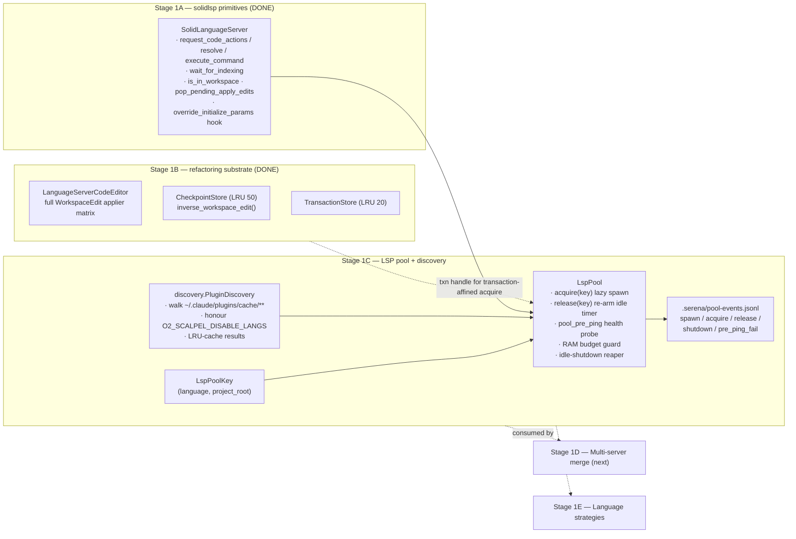
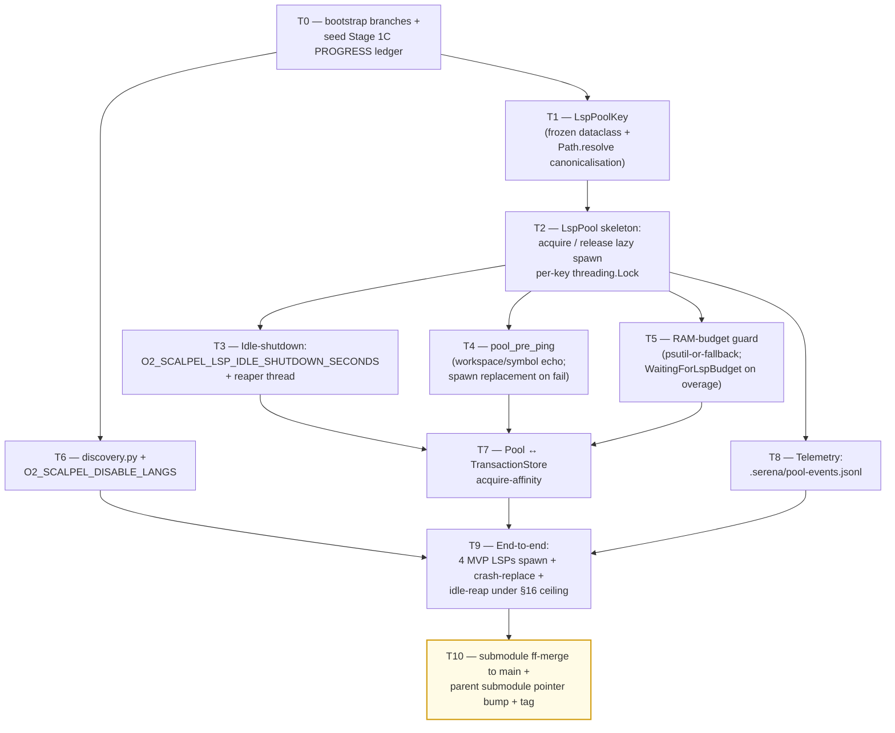

# Stage 1C — LSP Pool + Sibling-Plugin Discovery Implementation Plan

> **For agentic workers:** REQUIRED SUB-SKILL: Use `superpowers:subagent-driven-development` (recommended) or `superpowers:executing-plans` to implement this plan task-by-task. Steps use checkbox (`- [ ]`) syntax for tracking.

**Goal:** Land the per-`(language, project_root)` LSP pool with lazy spawn, idle-shutdown reaper, `pool_pre_ping` health probe, RAM-budget enforcement (per §16.1 / §16.2), per-spawn telemetry, and the sibling-plugin discovery walker that finds scalpel companion plugins under `~/.claude/plugins/cache/**/.claude-plugin/`. The pool sits behind the deferred-loading surface (§6.10 / §12.2): a language facade calls `pool.acquire(LspPoolKey(language, project_root))` and gets a fully-initialised `SolidLanguageServer` whose underlying child process is spawned on first use, kept warm across calls, recycled when the health probe fails, and reaped after `O2_SCALPEL_LSP_IDLE_SHUTDOWN_SECONDS` of inactivity. Stage 1C produces the substrate that Stage 1D's multi-server merge (file 10 of §14.1) and Stage 1E's `LanguageStrategy` orchestration (files 11–13) reach into to obtain a server handle without thinking about lifecycle.

**Architecture:**



**Tech Stack:** Python 3.11+, `pytest`, stdlib only. Uses `collections.OrderedDict` for LRU-style strict-equality maps, `threading.Lock` + `threading.Event` for reaper coordination, `pathlib.Path.resolve()` for canonical paths, `dataclasses.dataclass(frozen=True, slots=True)` for `LspPoolKey`, `pydantic.BaseModel` for the boundary-validated `PoolStats` / `PoolEvent` payloads. Optional `psutil` import is guarded behind try/except (degraded fallback to `resource.getrusage(RUSAGE_CHILDREN)` on POSIX) — the only gated optional dep, per §16 ceiling enforcement.

**Source-of-truth references:**
- [`docs/design/mvp/2026-04-24-mvp-scope-report.md`](../../design/mvp/2026-04-24-mvp-scope-report.md) — §14.1 rows 8 & 9 (pool/discovery LoC budget); §16.1 (24 GB canonical aggregate); §16.2 (16 GB degradation knobs incl. `O2_SCALPEL_DISABLE_LANGS`, `O2_SCALPEL_DISABLE_SERVERS`, `O2_SCALPEL_LAZY_SPAWN`, `O2_SCALPEL_LSP_IDLE_SHUTDOWN_SECONDS`, `O2_SCALPEL_ISOLATE_CACHES`); §16.4 (startup wall-clock budget); §16.5 (cache isolation policy); §6.10 (`uvx --from <local-path>` distribution); §12.2 (deferred-loading surface).
- [`docs/superpowers/plans/2026-04-24-mvp-execution-index.md`](2026-04-24-mvp-execution-index.md) — Stage 1C row: "Per-(language, project_root) LSP pool, sibling-plugin discovery, lazy spawn, idle shutdown, `pool_pre_ping` health probe. Files 8–9 of §14.1, ~290 LoC."
- [`docs/superpowers/plans/stage-1a-results/PROGRESS.md`](stage-1a-results/PROGRESS.md) — facades available on `SolidLanguageServer` (T6/T7/T8/T9/T10/T11/T12).
- [`docs/superpowers/plans/stage-1b-results/PROGRESS.md`](stage-1b-results/PROGRESS.md) — substrate available in `serena.refactoring` (`CheckpointStore`, `TransactionStore`, `inverse_workspace_edit`, `WorkspaceBoundaryError`); submodule `vendor/serena` main is at `ba7e62b1`.
- [`docs/superpowers/plans/2026-04-24-stage-1b-applier-checkpoints-transactions.md`](2026-04-24-stage-1b-applier-checkpoints-transactions.md) — pattern this plan mirrors.

---

## Scope check

Stage 1C is a single subsystem (the LSP-process lifecycle manager). It produces three coherent units:

1. The pool key + pool lifecycle on `vendor/serena/src/serena/refactoring/lsp_pool.py` (file 8).
2. The sibling-plugin discovery walker on `vendor/serena/src/serena/refactoring/discovery.py` (file 9).
3. The pool ↔ TransactionStore acquire-affinity contract (T7) so that all checkpoints inside one transaction land on the same `(language, project_root)` server — a requirement Stage 1D's multi-server fan-in builds on.

Each unit is independently testable; together they form the building block that Stage 1D consumes for the multi-server broadcast (§11) and Stage 1E's `LanguageStrategy` activation map.

Out of scope (deferred per §14.1):
- **Multi-server merge / dedup** (file 10, ~430 LoC) → **Stage 1D**.
- **`LanguageStrategy` Protocol + `RustStrategyExtensions` + `PythonStrategyExtensions` mixins** (files 11–13) → **Stage 1E**.
- **Capability catalog assembly + drift CI** (file 15) → **Stage 1F**.
- **Always-on primitive tools** (file 16) → **Stage 1G**.
- **Persistent on-disk pool checkpoints** beyond `.serena/pool-events.jsonl` → **v1.1**.
- **Plugin generator** that creates a new sibling scalpel plugin from a template → **v1.1**.

The pool layer treats every `SolidLanguageServer` instance opaquely — it never inspects the protocol payload. Boot-real-LSP test coverage is intentionally limited to one end-to-end task (T9) that exercises the four MVP servers (`rust-analyzer`, `pylsp`, `basedpyright`, `ruff`); per-server protocol behaviour stays in the per-server adapters in Stage 1E.

## File structure

| # | Path (under `vendor/serena/`) | Change | Responsibility |
|---|---|---|---|
| 8 | `src/serena/refactoring/lsp_pool.py` | New (+~180 LoC) | `LspPoolKey` (frozen dataclass), `PoolStats` / `PoolEvent` pydantic models, `WaitingForLspBudget` error, `LspPool` class with `acquire`/`release`/`shutdown_idle`/`pre_ping_all`/`stats()` and reaper thread. |
| 9 | `src/serena/refactoring/discovery.py` | New (+~110 LoC) | `PluginRecord` pydantic model, `discover_sibling_plugins(scalpel_root: Path) -> list[PluginRecord]`, `enabled_languages(records) -> frozenset[str]` filter that honours `O2_SCALPEL_DISABLE_LANGS`. Result LRU-cached via `functools.lru_cache(maxsize=8)`. |
| 9b | `src/serena/refactoring/__init__.py` | Modify (+~6 LoC) | Re-export `LspPool`, `LspPoolKey`, `PoolStats`, `PoolEvent`, `WaitingForLspBudget`, `discover_sibling_plugins`, `enabled_languages`, `PluginRecord`. |
| — | `test/spikes/conftest.py` | Modify (+~24 LoC) | Add `slim_pool` fixture (fresh `LspPool` with reaper disabled — per-test idle window 0.05 s, ceiling 4 GB) + `fake_sls_factory` callable that returns a `MagicMock`-backed `_ConcreteSLS.__new__(_ConcreteSLS)` lookalike with `start_server()` / `is_running()` / `stop()` / `request_workspace_symbol()` stubbed. |
| — | `test/spikes/test_stage_1c_*.py` | New (~10 unit + 1 integration test files) | TDD tests, one file per task T1–T9. End-to-end test in T9 boots all four MVP language servers under the §16 ceiling. |

**LoC budget:** logic +~290 (file 8: 180 + file 9: 110); §14.1 row 8+9 = 290; we land at ~290 (on budget). Tests +~620 across 10 files. Re-export delta in `__init__.py` and the `conftest.py` fixture additions are bookkeeping and do not count against the §14.1 row.

## Dependency graph



T1 is a prerequisite for every later task — every API takes a `LspPoolKey`. T2 lands the lifecycle skeleton; T3/T4/T5/T8 are orthogonal concerns each layered onto it. T6 is independent of the pool itself (pure discovery walker) and runs in parallel with T2–T5. T7 is the synthesis step that ties pool affinity to the Stage 1B transaction store. T9 is the integration-proof gate.

## Conventions enforced (from Phase 0 + Stage 1A + Stage 1B)

- **Submodule git-flow**: feature branch in submodule (`feature/stage-1c-lsp-pool-discovery`) and parent — both verified by T0. Submodule was not git-flow-initialised in Stage 1A or 1B; same pattern: direct `feature/<name>` branch, ff-merge to `main`, parent bumps pointer.
- **Author**: AI Hive(R) on every commit; never "Claude". Trailer: `Co-Authored-By: AI Hive(R) <noreply@o2.services>`.
- **Field name `code_language=`** on `LanguageServerConfig` (verified at `ls_config.py:596`); Stage 1C never instantiates a real `LanguageServerConfig` outside T9 — unit tests use the `fake_sls_factory` fixture.
- **`with srv.start_server():`** sync context manager from `ls.py:1082` for any boot-real-LSP test (T9 only). All other tests use the fake.
- **PROGRESS.md updates as separate commits**, never `--amend`. Each task ends in two commits: code commit (in submodule) + ledger update (in parent).
- **`_ConcreteSLS` fixture from `test/spikes/conftest.py`** (`slim_sls` returns `_ConcreteSLS.__new__(_ConcreteSLS)`); reused by Stage 1C via the new `fake_sls_factory` wrapper.
- **Pyright "unresolved imports" for `vendor/serena/*` are known false positives** in the parent IDE — submodule has its own venv; ignore.
- **Test command**: from `vendor/serena/`, run `PATH="$(pwd)/.venv/bin:$PATH" .venv/bin/pytest <path> -v`. Without venv on PATH, P1/P2/P3/P3a/P4/P5a/P6/T9-real-LSP fail with `FileNotFoundError`.
- **Type hints + pydantic at boundaries**: every public method on `LspPool` and `discover_sibling_plugins` is fully annotated; payloads that cross the boundary (`PoolStats`, `PoolEvent`, `PluginRecord`) are `pydantic.BaseModel` subclasses validated at construction time.
- **`Path.resolve()` for canonicalisation** — every `LspPoolKey` instantiation goes through `Path(project_root).resolve(strict=False)`. Equality + hash are derived from the resolved path; two distinct `~/work/calcrs` and `/Users/foo/work/calcrs` references collapse to the same key on a system where `~` expands to `/Users/foo`.
- **`threading.Lock` for mutable state** — one global `_pool_lock` guards the `OrderedDict[LspPoolKey, _ServerEntry]` map; per-entry `_entry_lock` guards lifecycle transitions on a single entry; reaper thread uses `threading.Event` for cancellation. Lock-order discipline mirrors Stage 1B `TransactionStore._evict_lru`: never hold pool lock while calling into `_ConcreteSLS.stop()`.
- **No new runtime dependencies** unless §16 explicitly demands one. The `psutil` import is guarded — `try: import psutil` → fallback `_resident_set_size_mb()` uses POSIX `resource.getrusage(resource.RUSAGE_SELF | RUSAGE_CHILDREN).ru_maxrss` (kB on Linux, B on macOS — branch on `sys.platform`).
- **Logging discipline**: every state transition (`spawn`, `acquire`, `release`, `pre_ping_fail`, `shutdown_idle`, `budget_reject`) emits one structured log line via `logging.getLogger("serena.refactoring.lsp_pool")` AND one JSONL row to `.serena/pool-events.jsonl` (T8 wires both surfaces).

## Progress ledger

A new ledger `docs/superpowers/plans/stage-1c-results/PROGRESS.md` is created in T0. It mirrors the Stage 1B schema: per-task row with task id, branch SHA, outcome, follow-ups. Updated as a separate parent commit after each task completes.

---

### Task 0: Bootstrap feature branches + Stage 1C PROGRESS ledger

**Files:**
- Create: `docs/superpowers/plans/stage-1c-results/PROGRESS.md`
- Verify: parent + submodule already on `feature/stage-1c-lsp-pool-discovery` (or open them).

- [ ] **Step 1: Confirm or open the parent feature branch**

Run:
```bash
git -C /Volumes/Unitek-B/Projects/o2-scalpel rev-parse --abbrev-ref HEAD
```

Expected: `feature/stage-1c-lsp-pool-discovery`. If it prints anything else (e.g. `develop` or the Stage 1B handoff branch), open the Stage 1C branch via git-flow:

```bash
cd /Volumes/Unitek-B/Projects/o2-scalpel
git checkout develop
git pull --ff-only origin develop
git flow feature start stage-1c-lsp-pool-discovery
```

- [ ] **Step 2: Confirm or open the submodule feature branch**

Run:
```bash
git -C /Volumes/Unitek-B/Projects/o2-scalpel/vendor/serena rev-parse --abbrev-ref HEAD
```

Expected: `feature/stage-1c-lsp-pool-discovery`. If submodule HEAD differs (likely on `main` after the Stage 1B ff-merge), open the new branch directly (submodule is not git-flow-initialised, mirroring Stage 1A/1B convention):

```bash
cd /Volumes/Unitek-B/Projects/o2-scalpel/vendor/serena
git checkout main
git pull --ff-only origin main
git checkout -b feature/stage-1c-lsp-pool-discovery
```

- [ ] **Step 3: Confirm Stage 1B tag is reachable in the submodule**

Run:
```bash
git -C /Volumes/Unitek-B/Projects/o2-scalpel/vendor/serena tag -l 'stage-1b-applier-checkpoints-transactions-complete'
git -C /Volumes/Unitek-B/Projects/o2-scalpel tag -l 'stage-1b-applier-checkpoints-transactions-complete'
```

Expected: at least one of the two prints the tag.

- [ ] **Step 4: Confirm Stage 1B substrate is importable from the submodule venv**

Run:
```bash
cd /Volumes/Unitek-B/Projects/o2-scalpel/vendor/serena
PATH="$(pwd)/.venv/bin:$PATH" .venv/bin/python -c "from serena.refactoring import CheckpointStore, TransactionStore, inverse_workspace_edit, WorkspaceBoundaryError; print('OK')"
```

Expected: `OK`. (Imports the four Stage 1B exports from `vendor/serena/src/serena/refactoring/__init__.py`.)

- [ ] **Step 5: Confirm Stage 1A facades exist on `SolidLanguageServer`**

Run:
```bash
grep -n "def request_code_actions\|def resolve_code_action\|def execute_command\|def wait_for_indexing\|def is_in_workspace\|def override_initialize_params\|def pop_pending_apply_edits" /Volumes/Unitek-B/Projects/o2-scalpel/vendor/serena/src/solidlsp/ls.py
```

Expected: 7 hits (one per facade). Stage 1A T6/T7/T8/T9/T10/T11/T12 outputs.

- [ ] **Step 6: Confirm `request_workspace_symbol` exists (the pre-ping target chosen in T4)**

Run:
```bash
grep -n "def request_workspace_symbol\|def is_running\|def stop\b\|def start_server" /Volumes/Unitek-B/Projects/o2-scalpel/vendor/serena/src/solidlsp/ls.py
```

Expected: 4 hits — `start_server` (line ~1082, sync `Iterator[SolidLanguageServer]` context manager), `request_workspace_symbol` (line ~2862), `stop` (line ~2946, takes `shutdown_timeout: float = 2.0`), `is_running` (line ~2971).

- [ ] **Step 7: Create the PROGRESS.md ledger**

Write to `/Volumes/Unitek-B/Projects/o2-scalpel/docs/superpowers/plans/stage-1c-results/PROGRESS.md`:

```markdown
# Stage 1C — LSP Pool + Discovery — Progress Ledger

Started: 2026-04-25
Branch: feature/stage-1c-lsp-pool-discovery (parent + submodule)
Author: AI Hive(R)
Built on: stage-1b-applier-checkpoints-transactions-complete

| Task | Description | Branch SHA (submodule) | Outcome | Follow-up |
|---|---|---|---|---|
| T0  | Bootstrap branches + ledger                                            | _pending_ | _pending_ | — |
| T1  | LspPoolKey frozen dataclass + Path.resolve canonicalisation            | _pending_ | _pending_ | — |
| T2  | LspPool skeleton (acquire/release lazy spawn; per-key Lock)            | _pending_ | _pending_ | — |
| T3  | Idle-shutdown reaper (O2_SCALPEL_LSP_IDLE_SHUTDOWN_SECONDS)            | _pending_ | _pending_ | — |
| T4  | pool_pre_ping (workspace/symbol echo + spawn replacement)              | _pending_ | _pending_ | — |
| T5  | RAM-budget guard (psutil-or-fallback; WaitingForLspBudget)             | _pending_ | _pending_ | — |
| T6  | discovery.py + O2_SCALPEL_DISABLE_LANGS filter                         | _pending_ | _pending_ | — |
| T7  | Pool ↔ TransactionStore acquire-affinity                               | _pending_ | _pending_ | — |
| T8  | Telemetry (.serena/pool-events.jsonl)                                  | _pending_ | _pending_ | — |
| T9  | End-to-end: 4 MVP LSPs + crash-replace + idle-reap under §16 ceiling   | _pending_ | _pending_ | — |
| T10 | Submodule ff-merge to main + parent pointer bump + tag                 | _pending_ | _pending_ | — |

## Decisions log

(append-only; one bullet per decision with date + rationale)

## Stage 1B entry baseline

- Submodule `main` head at Stage 1C start: <fill in via `git -C vendor/serena rev-parse main` at T0 close>
- Parent `develop` head at Stage 1C start: <fill in via `git rev-parse develop`>
- Stage 1B tag: `stage-1b-applier-checkpoints-transactions-complete`
- Stage 1A + 1B spike-suite green: 130/130 (per Stage 1B PROGRESS.md final verdict)

## Spike outcome quick-reference (carryover for context)

- Stage 1A T11 → `is_in_workspace()` adopted verbatim into Stage 1B applier; Stage 1C does not re-touch boundary checks.
- Stage 1A T10 → `override_initialize_params()` is the chokepoint Stage 1C uses to inject per-pool isolated cache paths (§16.5) at spawn.
- Stage 1B T11/T12 → `CheckpointStore.LRU(50)` + `TransactionStore.LRU(20)` are the substrate Stage 1C T7 binds to.
- §16.1/§16.2/§16.4/§16.5 → drive the four pool knobs (RAM ceiling, disable-langs, idle shutdown, cache isolation) wired in T3/T5/T6.
```

- [ ] **Step 8: Commit ledger seed in parent**

Run:
```bash
cd /Volumes/Unitek-B/Projects/o2-scalpel
git add docs/superpowers/plans/stage-1c-results/PROGRESS.md
git commit -m "$(cat <<'EOF'
chore(stage-1c): seed progress ledger for LSP pool + discovery sub-plan (T0)

Mirror Stage 1B schema: per-task row with branch SHA, outcome, follow-ups.
Updated as separate commits after each task lands. Built on Stage 1B tag
stage-1b-applier-checkpoints-transactions-complete (submodule main
ba7e62b1).

Co-Authored-By: AI Hive(R) <noreply@o2.services>
EOF
)"
```

- [ ] **Step 9: Update PROGRESS.md row T0**

Edit ledger row T0: mark with parent SHA from `git rev-parse HEAD`, outcome `OK`, follow-up `—`. Commit:
```bash
git add docs/superpowers/plans/stage-1c-results/PROGRESS.md
git commit -m "chore(stage-1c): mark T0 ledger seeded

Co-Authored-By: AI Hive(R) <noreply@o2.services>"
```

---

### Task 1: `LspPoolKey` frozen dataclass + `Path.resolve()` canonicalisation

**Files:**
- New: `vendor/serena/src/serena/refactoring/lsp_pool.py` — minimal scaffold containing only `LspPoolKey` (rest of file lands in T2+).
- New test: `vendor/serena/test/spikes/test_stage_1c_t1_pool_key.py`

**Why:** Every later API on the pool keys off `(language, project_root)`; canonicalisation has to happen once at the key boundary so `acquire(key)` is idempotent across symlinks, `~` expansion, and trailing-slash drift. A frozen `slots=True` dataclass gives stable `__hash__` + `__eq__` derived from the canonical inputs without us writing them.

- [ ] **Step 1: Write failing test**

Create `vendor/serena/test/spikes/test_stage_1c_t1_pool_key.py`:

```python
"""T1 — LspPoolKey frozen dataclass: canonicalisation + equality + hashability."""

from __future__ import annotations

import os
from pathlib import Path

import pytest

from serena.refactoring.lsp_pool import LspPoolKey


def test_construction_canonicalises_relative_to_absolute(tmp_path: Path) -> None:
    rel = os.path.relpath(tmp_path, start=os.getcwd())
    key_rel = LspPoolKey(language="rust", project_root=rel)
    key_abs = LspPoolKey(language="rust", project_root=str(tmp_path))
    assert key_rel == key_abs
    assert hash(key_rel) == hash(key_abs)


def test_construction_strips_trailing_slash(tmp_path: Path) -> None:
    a = LspPoolKey(language="rust", project_root=str(tmp_path))
    b = LspPoolKey(language="rust", project_root=str(tmp_path) + "/")
    assert a == b


def test_resolved_path_is_pathlib_Path() -> None:
    key = LspPoolKey(language="python", project_root="/tmp")
    assert isinstance(key.project_root_path, Path)
    assert key.project_root_path.is_absolute()


def test_distinct_languages_distinct_keys(tmp_path: Path) -> None:
    a = LspPoolKey(language="rust", project_root=str(tmp_path))
    b = LspPoolKey(language="python", project_root=str(tmp_path))
    assert a != b
    assert hash(a) != hash(b)


def test_key_is_hashable_and_usable_in_dict(tmp_path: Path) -> None:
    a = LspPoolKey(language="rust", project_root=str(tmp_path))
    d: dict[LspPoolKey, int] = {a: 1}
    assert d[LspPoolKey(language="rust", project_root=str(tmp_path))] == 1


def test_key_is_immutable() -> None:
    key = LspPoolKey(language="rust", project_root="/tmp")
    with pytest.raises(Exception):
        key.language = "python"  # type: ignore[misc]


def test_symlink_resolution(tmp_path: Path) -> None:
    real = tmp_path / "real"
    real.mkdir()
    link = tmp_path / "link"
    link.symlink_to(real, target_is_directory=True)
    a = LspPoolKey(language="rust", project_root=str(real))
    b = LspPoolKey(language="rust", project_root=str(link))
    assert a == b
```

- [ ] **Step 2: Run test, expect fail**

```bash
cd /Volumes/Unitek-B/Projects/o2-scalpel/vendor/serena
PATH="$(pwd)/.venv/bin:$PATH" .venv/bin/pytest test/spikes/test_stage_1c_t1_pool_key.py -v
```

Expected FAIL: `ModuleNotFoundError: No module named 'serena.refactoring.lsp_pool'`.

- [ ] **Step 3: Implement**

Create `vendor/serena/src/serena/refactoring/lsp_pool.py`:

```python
"""Per-(language, project_root) LSP pool (Stage 1C §14.1 file 8).

The pool sits behind the deferred-loading surface (§6.10 / §12.2): a language
facade calls ``pool.acquire(LspPoolKey(language, project_root))`` and gets a
fully-initialised ``SolidLanguageServer`` whose underlying child process is
spawned on first use, kept warm across calls, recycled when the pre-ping
health probe fails, and reaped after ``O2_SCALPEL_LSP_IDLE_SHUTDOWN_SECONDS``
of inactivity. The §16.1 RAM ceiling is enforced before every spawn; the
guard refuses with ``WaitingForLspBudget`` when over budget rather than
crashing the user's editor.

This module is added incrementally across T1..T8 — see PROGRESS.md.
T1 lands ``LspPoolKey`` only; later tasks layer the lifecycle on top.
"""

from __future__ import annotations

from dataclasses import dataclass, field
from pathlib import Path


@dataclass(frozen=True, slots=True)
class LspPoolKey:
    """Canonical (language, project_root) tuple used as a pool dict key.

    ``project_root`` is canonicalised at construction via ``Path.resolve(strict=False)``;
    relative paths, ``~`` expansion, symlinks, and trailing slashes all collapse
    to the same key.

    :param language: the canonical language identifier ("rust", "python", ...).
    :param project_root: the absolute or relative path to the project root.
    """

    language: str
    project_root: str
    project_root_path: Path = field(init=False, repr=False, compare=False, hash=False)

    def __post_init__(self) -> None:
        # frozen=True forbids attribute assignment; use object.__setattr__ to
        # populate the derived field at construction.
        resolved = Path(self.project_root).expanduser().resolve(strict=False)
        object.__setattr__(self, "project_root_path", resolved)
        # Re-stamp project_root with the canonical str so equality/hash match
        # across the original input forms.
        object.__setattr__(self, "project_root", str(resolved))
```

- [ ] **Step 4: Run test, expect pass**

```bash
PATH="$(pwd)/.venv/bin:$PATH" .venv/bin/pytest test/spikes/test_stage_1c_t1_pool_key.py -v
```

Expected: 7 passed.

- [ ] **Step 5: Commit**

```bash
cd /Volumes/Unitek-B/Projects/o2-scalpel/vendor/serena
git add src/serena/refactoring/lsp_pool.py test/spikes/test_stage_1c_t1_pool_key.py
git commit -m "$(cat <<'EOF'
feat(refactoring): LspPoolKey frozen dataclass + Path.resolve canonicalisation (T1)

Per-(language, project_root) pool key. project_root is canonicalised at
construction via Path.expanduser().resolve(strict=False); relative,
trailing-slash, ~-expansion, and symlink forms all collapse to the same
key. Frozen dataclass with slots gives stable __hash__/__eq__ derived
from the canonical inputs. Seven regression tests pin the contract.

Co-Authored-By: AI Hive(R) <noreply@o2.services>
EOF
)"
```

- [ ] **Step 6: Update PROGRESS.md (parent commit)**

```bash
cd /Volumes/Unitek-B/Projects/o2-scalpel
git add docs/superpowers/plans/stage-1c-results/PROGRESS.md
git commit -m "chore(stage-1c): mark T1 done — LspPoolKey landed

Co-Authored-By: AI Hive(R) <noreply@o2.services>"
```

---

### Task 2: `LspPool` skeleton — `acquire` / `release` lazy spawn + per-key `threading.Lock`

**Files:**
- Modify: `vendor/serena/src/serena/refactoring/lsp_pool.py` — add `_ServerEntry`, `LspPool` class with `acquire`/`release`/`shutdown_all`/`stats()`. **No** idle reaper, **no** pre-ping, **no** budget guard yet — those land in T3/T4/T5.
- Modify: `vendor/serena/test/spikes/conftest.py` — add `slim_pool` and `fake_sls_factory` fixtures.
- Modify: `vendor/serena/src/serena/refactoring/__init__.py` — re-export `LspPool`, `LspPoolKey`.
- New test: `vendor/serena/test/spikes/test_stage_1c_t2_pool_skeleton.py`

**Why:** §14.1 file 8 bullet 1 (lazy spawn) + §16.2 `O2_SCALPEL_LAZY_SPAWN=1` (default on). The pool maps `LspPoolKey` to a single `SolidLanguageServer` instance; `acquire` spawns on miss, returns the cached instance on hit; `release` is a no-op-with-bookkeeping (decrements an in-flight counter so T3's reaper knows when nobody is using the entry). Per-entry `threading.Lock` serialises spawn so two concurrent `acquire` calls for the same key share one process.

- [ ] **Step 1: Add the conftest fixtures (write the helper before the test that consumes it)**

Edit `/Volumes/Unitek-B/Projects/o2-scalpel/vendor/serena/test/spikes/conftest.py`. Append at end of file:

```python
# --- Stage 1C fixtures ----------------------------------------------------

import threading as _t1c_threading
from collections.abc import Callable as _t1c_Callable
from unittest.mock import MagicMock as _t1c_MagicMock

import pytest as _t1c_pytest


@_t1c_pytest.fixture
def fake_sls_factory() -> _t1c_Callable[..., _t1c_MagicMock]:
    """Return a factory that builds MagicMock-backed SolidLanguageServer stand-ins.

    Each instance has the methods Stage 1C cares about: start_server (sync
    context manager that returns self), is_running (returns True after
    start), stop (flips is_running to False), request_workspace_symbol
    (returns []). Callers can override any of those by setting attributes
    on the returned mock.
    """
    def _make(language: str = "rust", project_root: str = "/tmp", crash_after_n_pings: int | None = None) -> _t1c_MagicMock:
        m = _t1c_MagicMock(name=f"FakeSLS({language},{project_root})")
        m.language = language
        m.repository_root_path = project_root
        m._is_running = False
        m._ping_count = 0
        m._crash_after = crash_after_n_pings

        def _start_cm() -> _t1c_MagicMock:
            from contextlib import contextmanager
            @contextmanager
            def _cm():  # type: ignore[no-untyped-def]
                m._is_running = True
                yield m
                m._is_running = False
            return _cm()
        m.start_server.side_effect = _start_cm
        m.is_running.side_effect = lambda: bool(m._is_running)

        def _stop(shutdown_timeout: float = 2.0) -> None:  # noqa: ARG001
            m._is_running = False
        m.stop.side_effect = _stop

        def _ping(query: str) -> list[dict[str, object]]:  # noqa: ARG001
            m._ping_count += 1
            if m._crash_after is not None and m._ping_count > m._crash_after:
                raise RuntimeError("fake LSP child crashed")
            return []
        m.request_workspace_symbol.side_effect = _ping
        return m
    return _make


@_t1c_pytest.fixture
def slim_pool(fake_sls_factory):  # type: ignore[no-untyped-def]
    """Fresh LspPool wired against fake_sls_factory; reaper disabled by short interval."""
    from serena.refactoring.lsp_pool import LspPool
    pool = LspPool(
        spawn_fn=lambda key: fake_sls_factory(language=key.language, project_root=key.project_root),
        idle_shutdown_seconds=0.05,
        ram_ceiling_mb=4096.0,
        reaper_enabled=False,
    )
    yield pool
    pool.shutdown_all()
```

- [ ] **Step 2: Write failing test**

Create `vendor/serena/test/spikes/test_stage_1c_t2_pool_skeleton.py`:

```python
"""T2 — LspPool skeleton: lazy spawn, acquire/release, per-key Lock."""

from __future__ import annotations

import threading
from collections.abc import Callable
from unittest.mock import MagicMock

import pytest

from serena.refactoring.lsp_pool import LspPool, LspPoolKey


def test_acquire_spawns_lazily_on_first_call(slim_pool: LspPool, tmp_path) -> None:
    key = LspPoolKey(language="rust", project_root=str(tmp_path))
    assert slim_pool.stats().active_servers == 0
    srv = slim_pool.acquire(key)
    assert srv is not None
    assert slim_pool.stats().active_servers == 1


def test_second_acquire_returns_cached_instance(slim_pool: LspPool, tmp_path) -> None:
    key = LspPoolKey(language="rust", project_root=str(tmp_path))
    a = slim_pool.acquire(key)
    b = slim_pool.acquire(key)
    assert a is b
    assert slim_pool.stats().active_servers == 1


def test_distinct_keys_yield_distinct_servers(slim_pool: LspPool, tmp_path) -> None:
    k1 = LspPoolKey(language="rust", project_root=str(tmp_path))
    k2 = LspPoolKey(language="python", project_root=str(tmp_path))
    a = slim_pool.acquire(k1)
    b = slim_pool.acquire(k2)
    assert a is not b
    assert slim_pool.stats().active_servers == 2


def test_release_decrements_inflight_counter(slim_pool: LspPool, tmp_path) -> None:
    key = LspPoolKey(language="rust", project_root=str(tmp_path))
    slim_pool.acquire(key)
    slim_pool.acquire(key)
    assert slim_pool.stats().inflight[key] == 2
    slim_pool.release(key)
    assert slim_pool.stats().inflight[key] == 1
    slim_pool.release(key)
    assert slim_pool.stats().inflight[key] == 0


def test_release_unknown_key_is_noop(slim_pool: LspPool, tmp_path) -> None:
    key = LspPoolKey(language="rust", project_root=str(tmp_path))
    slim_pool.release(key)  # never acquired; must not raise.
    assert slim_pool.stats().active_servers == 0


def test_concurrent_acquire_for_same_key_shares_one_spawn(
    fake_sls_factory: Callable[..., MagicMock],
) -> None:
    """Eight threads racing on the same key must call spawn_fn exactly once."""
    spawn_calls: list[LspPoolKey] = []
    spawn_lock = threading.Lock()

    def _spawn(key: LspPoolKey) -> MagicMock:
        with spawn_lock:
            spawn_calls.append(key)
        return fake_sls_factory(language=key.language, project_root=key.project_root)

    pool = LspPool(
        spawn_fn=_spawn,
        idle_shutdown_seconds=0.05,
        ram_ceiling_mb=4096.0,
        reaper_enabled=False,
    )
    try:
        key = LspPoolKey(language="rust", project_root="/tmp")
        results: list[object] = []
        results_lock = threading.Lock()

        def _worker() -> None:
            srv = pool.acquire(key)
            with results_lock:
                results.append(srv)

        threads = [threading.Thread(target=_worker) for _ in range(8)]
        for t in threads:
            t.start()
        for t in threads:
            t.join()
        assert len(spawn_calls) == 1
        # All eight threads got the same instance.
        assert all(r is results[0] for r in results)
    finally:
        pool.shutdown_all()


def test_shutdown_all_stops_every_server(slim_pool: LspPool, tmp_path) -> None:
    k1 = LspPoolKey(language="rust", project_root=str(tmp_path))
    k2 = LspPoolKey(language="python", project_root=str(tmp_path))
    s1 = slim_pool.acquire(k1)
    s2 = slim_pool.acquire(k2)
    slim_pool.shutdown_all()
    s1.stop.assert_called()
    s2.stop.assert_called()
    assert slim_pool.stats().active_servers == 0
```

- [ ] **Step 3: Run test, expect fail**

```bash
PATH="$(pwd)/.venv/bin:$PATH" .venv/bin/pytest test/spikes/test_stage_1c_t2_pool_skeleton.py -v
```

Expected FAIL: `ImportError: cannot import name 'LspPool'` (T1 only landed `LspPoolKey`).

- [ ] **Step 4: Implement**

Replace the contents of `vendor/serena/src/serena/refactoring/lsp_pool.py` with:

```python
"""Per-(language, project_root) LSP pool (Stage 1C §14.1 file 8).

The pool sits behind the deferred-loading surface (§6.10 / §12.2): a language
facade calls ``pool.acquire(LspPoolKey(language, project_root))`` and gets a
fully-initialised ``SolidLanguageServer`` whose underlying child process is
spawned on first use, kept warm across calls, recycled when the pre-ping
health probe fails (T4), and reaped after
``O2_SCALPEL_LSP_IDLE_SHUTDOWN_SECONDS`` of inactivity (T3). The §16.1 RAM
ceiling is enforced before every spawn (T5); the guard refuses with
``WaitingForLspBudget`` when over budget rather than crashing the user's
editor.

T2 lands the lifecycle skeleton (acquire/release/shutdown_all + per-key
spawn lock + stats). T3..T8 layer reaper / pre-ping / budget / discovery /
transaction-affinity / telemetry.
"""

from __future__ import annotations

import logging
import threading
from collections import OrderedDict
from collections.abc import Callable
from dataclasses import dataclass, field
from pathlib import Path
from typing import Any

log = logging.getLogger("serena.refactoring.lsp_pool")


@dataclass(frozen=True, slots=True)
class LspPoolKey:
    """Canonical (language, project_root) tuple used as a pool dict key.

    ``project_root`` is canonicalised at construction via
    ``Path.expanduser().resolve(strict=False)``; relative paths, ``~``
    expansion, symlinks, and trailing slashes all collapse to the same key.
    """

    language: str
    project_root: str
    project_root_path: Path = field(init=False, repr=False, compare=False, hash=False)

    def __post_init__(self) -> None:
        resolved = Path(self.project_root).expanduser().resolve(strict=False)
        object.__setattr__(self, "project_root_path", resolved)
        object.__setattr__(self, "project_root", str(resolved))


@dataclass
class _ServerEntry:
    """Internal: one (server, last_used_ts, inflight, entry_lock) tuple."""
    server: Any  # SolidLanguageServer or fake; opaque to the pool.
    inflight: int = 0
    last_used_ts: float = 0.0
    entry_lock: threading.Lock = field(default_factory=threading.Lock)


@dataclass
class PoolStats:
    """Snapshot of pool internal counters; safe to expose on tools/health."""
    active_servers: int
    inflight: dict[LspPoolKey, int]
    spawn_count: int
    pre_ping_fail_count: int = 0
    idle_reaped_count: int = 0
    budget_reject_count: int = 0


class LspPool:
    """In-memory pool of ``SolidLanguageServer`` instances keyed by ``LspPoolKey``."""

    def __init__(
        self,
        spawn_fn: Callable[[LspPoolKey], Any],
        idle_shutdown_seconds: float,
        ram_ceiling_mb: float,
        reaper_enabled: bool = True,
    ) -> None:
        """:param spawn_fn: factory invoked once per (key) miss to create a server.
        :param idle_shutdown_seconds: how long an entry can sit at inflight=0
            before the reaper (T3) calls .stop() on it.
        :param ram_ceiling_mb: §16.1 hard ceiling; new spawn refused above this.
        :param reaper_enabled: whether to start the background reaper thread.
            Tests pass ``False`` to keep the per-test state deterministic.
        """
        self._spawn_fn = spawn_fn
        self._idle_seconds = idle_shutdown_seconds
        self._ram_ceiling_mb = ram_ceiling_mb
        self._reaper_enabled = reaper_enabled
        self._entries: OrderedDict[LspPoolKey, _ServerEntry] = OrderedDict()
        self._pool_lock = threading.Lock()
        self._spawn_count = 0
        self._pre_ping_fail_count = 0
        self._idle_reaped_count = 0
        self._budget_reject_count = 0

    # --- public API ------------------------------------------------------

    def acquire(self, key: LspPoolKey) -> Any:
        """Return the server for ``key``; spawn lazily on miss.

        Concurrent ``acquire(same key)`` calls share one spawn — guarded by a
        per-entry lock obtained under the pool lock.
        """
        # Phase 1: locate-or-create the entry under the global lock. We may
        # release it before spawning (spawn is slow; we don't want it to
        # block other keys).
        with self._pool_lock:
            entry = self._entries.get(key)
            if entry is None:
                entry = _ServerEntry(server=None)
                self._entries[key] = entry
            entry.inflight += 1
            entry_lock = entry.entry_lock

        # Phase 2: spawn if necessary, under the per-entry lock.
        with entry_lock:
            if entry.server is None:
                log.info("LspPool spawn key=%s", key)
                entry.server = self._spawn_fn(key)
                self._spawn_count += 1
        # Update bookkeeping under the global lock so stats() is consistent.
        with self._pool_lock:
            entry.last_used_ts = self._now()
            self._entries.move_to_end(key)
        return entry.server

    def release(self, key: LspPoolKey) -> None:
        """Decrement the in-flight counter for ``key``; reaper-eligible at 0."""
        with self._pool_lock:
            entry = self._entries.get(key)
            if entry is None:
                return
            if entry.inflight > 0:
                entry.inflight -= 1
            entry.last_used_ts = self._now()

    def shutdown_all(self) -> None:
        """Stop every server and clear the pool. Idempotent."""
        with self._pool_lock:
            entries = list(self._entries.items())
            self._entries.clear()
        # Drop the lock before calling stop() — the lifecycle methods may
        # block on the LSP child process.
        for _key, entry in entries:
            srv = entry.server
            if srv is not None:
                try:
                    srv.stop()
                except Exception:  # pragma: no cover - best-effort cleanup
                    log.exception("LspPool.shutdown_all: stop() raised")

    def stats(self) -> PoolStats:
        """Snapshot of current pool counters (thread-safe; copies in-flight dict)."""
        with self._pool_lock:
            return PoolStats(
                active_servers=sum(1 for e in self._entries.values() if e.server is not None),
                inflight={k: e.inflight for k, e in self._entries.items()},
                spawn_count=self._spawn_count,
                pre_ping_fail_count=self._pre_ping_fail_count,
                idle_reaped_count=self._idle_reaped_count,
                budget_reject_count=self._budget_reject_count,
            )

    # --- internals -------------------------------------------------------

    @staticmethod
    def _now() -> float:
        import time
        return time.monotonic()
```

- [ ] **Step 5: Re-export `LspPool` + `LspPoolKey` from the package**

Edit `/Volumes/Unitek-B/Projects/o2-scalpel/vendor/serena/src/serena/refactoring/__init__.py` and append:

```python
from .lsp_pool import LspPool, LspPoolKey, PoolStats

__all__ = (
    *(__all__ if "__all__" in globals() else ()),
    "LspPool",
    "LspPoolKey",
    "PoolStats",
)
```

If the file does not yet declare `__all__`, replace the append with a simple add of the names; the implementer can read the existing file and adapt to the existing pattern (Stage 1B left the file as a flat re-export module).

- [ ] **Step 6: Run test, expect pass**

```bash
PATH="$(pwd)/.venv/bin:$PATH" .venv/bin/pytest test/spikes/test_stage_1c_t2_pool_skeleton.py -v
```

Expected: 7 passed.

- [ ] **Step 7: Commit**

```bash
cd /Volumes/Unitek-B/Projects/o2-scalpel/vendor/serena
git add src/serena/refactoring/lsp_pool.py src/serena/refactoring/__init__.py test/spikes/conftest.py test/spikes/test_stage_1c_t2_pool_skeleton.py
git commit -m "$(cat <<'EOF'
feat(refactoring): LspPool skeleton — lazy spawn + acquire/release + per-key Lock (T2)

Pool maps LspPoolKey to one SolidLanguageServer instance. acquire() spawns
on miss via spawn_fn; concurrent acquires for the same key share one
spawn (per-entry lock obtained under the global pool lock, then released
so other keys do not block on spawn). release() decrements inflight;
shutdown_all stops every server and clears state. Stats() returns a
snapshot of active_servers / inflight / spawn_count.

No reaper / pre_ping / budget guard yet — T3/T4/T5 layer those onto this
skeleton. Seven regression tests pin the contract: lazy-spawn, cached
hit, distinct-key isolation, release-decrement, release-unknown-noop,
8-thread same-key one-spawn, shutdown_all stops every entry.

Co-Authored-By: AI Hive(R) <noreply@o2.services>
EOF
)"
```

- [ ] **Step 8: Update PROGRESS.md (parent commit)**

```bash
cd /Volumes/Unitek-B/Projects/o2-scalpel
git add docs/superpowers/plans/stage-1c-results/PROGRESS.md
git commit -m "chore(stage-1c): mark T2 done — LspPool skeleton landed

Co-Authored-By: AI Hive(R) <noreply@o2.services>"
```

---

### Task 3: Idle-shutdown reaper — `O2_SCALPEL_LSP_IDLE_SHUTDOWN_SECONDS` + reaper thread

**Files:**
- Modify: `vendor/serena/src/serena/refactoring/lsp_pool.py` — add `_reaper_thread`, `_reaper_event`, `_reap_idle_once`, `start_reaper`, `stop_reaper`. Read `O2_SCALPEL_LSP_IDLE_SHUTDOWN_SECONDS` (default `600.0` per §16.2) at `LspPool.__init__` if `idle_shutdown_seconds` arg is `None`.
- New test: `vendor/serena/test/spikes/test_stage_1c_t3_idle_reaper.py`

**Why:** §16.2 row 6 — `O2_SCALPEL_LSP_IDLE_SHUTDOWN_SECONDS=600` reclaims idle LSP RAM after 10 min. The reaper walks the entry map every `min(60, idle_seconds/4)` seconds; for each entry whose `inflight == 0` AND `now - last_used_ts >= idle_seconds`, it calls `srv.stop()` and removes the entry. `acquire()` cancels nothing (the spawn-on-miss path naturally handles a reaped entry — the next `acquire(key)` re-spawns). `release()` only re-arms `last_used_ts`. **Implementation note:** the reaper thread is a daemon so process exit doesn't hang on it; `stop_reaper()` sets the cancellation event and joins.

- [ ] **Step 1: Write failing test**

Create `vendor/serena/test/spikes/test_stage_1c_t3_idle_reaper.py`:

```python
"""T3 — idle-shutdown reaper + O2_SCALPEL_LSP_IDLE_SHUTDOWN_SECONDS env."""

from __future__ import annotations

import os
import time
from collections.abc import Callable
from unittest.mock import MagicMock

import pytest

from serena.refactoring.lsp_pool import LspPool, LspPoolKey


def test_idle_seconds_arg_takes_precedence_over_env(
    monkeypatch: pytest.MonkeyPatch,
    fake_sls_factory: Callable[..., MagicMock],
) -> None:
    monkeypatch.setenv("O2_SCALPEL_LSP_IDLE_SHUTDOWN_SECONDS", "999")
    pool = LspPool(
        spawn_fn=lambda k: fake_sls_factory(language=k.language),
        idle_shutdown_seconds=0.05,
        ram_ceiling_mb=4096.0,
        reaper_enabled=False,
    )
    try:
        assert pool._idle_seconds == pytest.approx(0.05)
    finally:
        pool.shutdown_all()


def test_idle_seconds_arg_None_uses_env(
    monkeypatch: pytest.MonkeyPatch,
    fake_sls_factory: Callable[..., MagicMock],
) -> None:
    monkeypatch.setenv("O2_SCALPEL_LSP_IDLE_SHUTDOWN_SECONDS", "42")
    pool = LspPool(
        spawn_fn=lambda k: fake_sls_factory(language=k.language),
        idle_shutdown_seconds=None,  # type: ignore[arg-type]
        ram_ceiling_mb=4096.0,
        reaper_enabled=False,
    )
    try:
        assert pool._idle_seconds == pytest.approx(42.0)
    finally:
        pool.shutdown_all()


def test_idle_seconds_default_when_no_env(
    monkeypatch: pytest.MonkeyPatch,
    fake_sls_factory: Callable[..., MagicMock],
) -> None:
    monkeypatch.delenv("O2_SCALPEL_LSP_IDLE_SHUTDOWN_SECONDS", raising=False)
    pool = LspPool(
        spawn_fn=lambda k: fake_sls_factory(language=k.language),
        idle_shutdown_seconds=None,  # type: ignore[arg-type]
        ram_ceiling_mb=4096.0,
        reaper_enabled=False,
    )
    try:
        assert pool._idle_seconds == pytest.approx(600.0)
    finally:
        pool.shutdown_all()


def test_reap_idle_once_drops_idle_entry(
    fake_sls_factory: Callable[..., MagicMock],
) -> None:
    pool = LspPool(
        spawn_fn=lambda k: fake_sls_factory(language=k.language),
        idle_shutdown_seconds=0.01,
        ram_ceiling_mb=4096.0,
        reaper_enabled=False,
    )
    try:
        key = LspPoolKey(language="rust", project_root="/tmp")
        srv = pool.acquire(key)
        pool.release(key)
        time.sleep(0.05)
        n = pool._reap_idle_once()
        assert n == 1
        srv.stop.assert_called_once()
        assert pool.stats().active_servers == 0
        assert pool.stats().idle_reaped_count == 1
    finally:
        pool.shutdown_all()


def test_reap_idle_once_skips_inflight_entry(
    fake_sls_factory: Callable[..., MagicMock],
) -> None:
    pool = LspPool(
        spawn_fn=lambda k: fake_sls_factory(language=k.language),
        idle_shutdown_seconds=0.01,
        ram_ceiling_mb=4096.0,
        reaper_enabled=False,
    )
    try:
        key = LspPoolKey(language="rust", project_root="/tmp")
        srv = pool.acquire(key)  # inflight = 1; do NOT release.
        time.sleep(0.05)
        n = pool._reap_idle_once()
        assert n == 0
        srv.stop.assert_not_called()
    finally:
        pool.shutdown_all()


def test_acquire_after_reap_respawns(
    fake_sls_factory: Callable[..., MagicMock],
) -> None:
    pool = LspPool(
        spawn_fn=lambda k: fake_sls_factory(language=k.language),
        idle_shutdown_seconds=0.01,
        ram_ceiling_mb=4096.0,
        reaper_enabled=False,
    )
    try:
        key = LspPoolKey(language="rust", project_root="/tmp")
        a = pool.acquire(key)
        pool.release(key)
        time.sleep(0.05)
        pool._reap_idle_once()
        b = pool.acquire(key)
        assert a is not b  # fresh spawn
        assert pool.stats().spawn_count == 2
    finally:
        pool.shutdown_all()


def test_reaper_thread_runs_in_background(
    fake_sls_factory: Callable[..., MagicMock],
) -> None:
    pool = LspPool(
        spawn_fn=lambda k: fake_sls_factory(language=k.language),
        idle_shutdown_seconds=0.05,
        ram_ceiling_mb=4096.0,
        reaper_enabled=True,  # turn the reaper ON
    )
    try:
        key = LspPoolKey(language="rust", project_root="/tmp")
        srv = pool.acquire(key)
        pool.release(key)
        # Wait > 4× idle_seconds so the reaper tick fires at least once.
        time.sleep(0.5)
        srv.stop.assert_called()
        assert pool.stats().active_servers == 0
    finally:
        pool.shutdown_all()
```

- [ ] **Step 2: Run test, expect fail**

```bash
PATH="$(pwd)/.venv/bin:$PATH" .venv/bin/pytest test/spikes/test_stage_1c_t3_idle_reaper.py -v
```

Expected FAIL: `AttributeError: 'LspPool' object has no attribute '_reap_idle_once'` and the env-default tests fail because T2 took `idle_shutdown_seconds: float`, not `float | None`.

- [ ] **Step 3: Implement**

Edit `vendor/serena/src/serena/refactoring/lsp_pool.py`:

(a) Change the `__init__` signature to accept `idle_shutdown_seconds: float | None`:

```python
    def __init__(
        self,
        spawn_fn: Callable[[LspPoolKey], Any],
        idle_shutdown_seconds: float | None,
        ram_ceiling_mb: float,
        reaper_enabled: bool = True,
    ) -> None:
        import os as _os
        self._spawn_fn = spawn_fn
        if idle_shutdown_seconds is None:
            env = _os.environ.get("O2_SCALPEL_LSP_IDLE_SHUTDOWN_SECONDS")
            self._idle_seconds = float(env) if env is not None else 600.0
        else:
            self._idle_seconds = float(idle_shutdown_seconds)
        self._ram_ceiling_mb = ram_ceiling_mb
        self._reaper_enabled = reaper_enabled
        self._entries: OrderedDict[LspPoolKey, _ServerEntry] = OrderedDict()
        self._pool_lock = threading.Lock()
        self._spawn_count = 0
        self._pre_ping_fail_count = 0
        self._idle_reaped_count = 0
        self._budget_reject_count = 0
        self._reaper_event = threading.Event()
        self._reaper_thread: threading.Thread | None = None
        if reaper_enabled:
            self.start_reaper()
```

(b) Add the reaper helpers below `stats()`:

```python
    def start_reaper(self) -> None:
        """Spawn the daemon reaper thread. Idempotent."""
        if self._reaper_thread is not None and self._reaper_thread.is_alive():
            return
        self._reaper_event.clear()
        t = threading.Thread(target=self._reaper_loop, name="lsp-pool-reaper", daemon=True)
        self._reaper_thread = t
        t.start()

    def stop_reaper(self) -> None:
        """Signal the reaper to exit and join. Idempotent."""
        self._reaper_event.set()
        t = self._reaper_thread
        if t is not None:
            t.join(timeout=2.0)
        self._reaper_thread = None

    def _reaper_loop(self) -> None:
        # Tick at most every 60 s, and at least every idle_seconds/4 (so a
        # short test idle window still gets timely reaping).
        tick = max(0.01, min(60.0, self._idle_seconds / 4.0))
        while not self._reaper_event.wait(tick):
            try:
                self._reap_idle_once()
            except Exception:  # pragma: no cover
                log.exception("LspPool reaper tick raised")

    def _reap_idle_once(self) -> int:
        """Reap entries whose inflight==0 and last_used_ts is older than idle_seconds.

        Returns the count of entries reaped this tick.
        """
        now = self._now()
        # Phase 1: collect candidates under the pool lock; do not call stop()
        # while holding it (lock-order discipline mirrors Stage 1B
        # TransactionStore._evict_lru).
        candidates: list[tuple[LspPoolKey, _ServerEntry]] = []
        with self._pool_lock:
            for key, entry in list(self._entries.items()):
                if entry.inflight == 0 and entry.server is not None and (now - entry.last_used_ts) >= self._idle_seconds:
                    candidates.append((key, entry))
                    # Remove eagerly so a concurrent acquire re-spawns rather
                    # than racing the reaper into stop().
                    self._entries.pop(key, None)
        # Phase 2: actually stop them.
        reaped = 0
        for _key, entry in candidates:
            srv = entry.server
            if srv is None:
                continue
            try:
                srv.stop()
                reaped += 1
            except Exception:  # pragma: no cover
                log.exception("LspPool reap: stop() raised")
        if reaped:
            with self._pool_lock:
                self._idle_reaped_count += reaped
        return reaped
```

(c) Update `shutdown_all` to also stop the reaper:

```python
    def shutdown_all(self) -> None:
        self.stop_reaper()
        with self._pool_lock:
            entries = list(self._entries.items())
            self._entries.clear()
        for _key, entry in entries:
            srv = entry.server
            if srv is not None:
                try:
                    srv.stop()
                except Exception:  # pragma: no cover
                    log.exception("LspPool.shutdown_all: stop() raised")
```

- [ ] **Step 4: Run test, expect pass**

```bash
PATH="$(pwd)/.venv/bin:$PATH" .venv/bin/pytest test/spikes/test_stage_1c_t3_idle_reaper.py -v
```

Expected: 7 passed.

- [ ] **Step 5: Re-run T2 to confirm no regression**

```bash
PATH="$(pwd)/.venv/bin:$PATH" .venv/bin/pytest test/spikes/test_stage_1c_t2_pool_skeleton.py -v
```

Expected: 7 passed (still). Type-shift on `__init__` is backward-compatible because the conftest fixture passes `idle_shutdown_seconds=0.05` explicitly.

- [ ] **Step 6: Commit**

```bash
cd /Volumes/Unitek-B/Projects/o2-scalpel/vendor/serena
git add src/serena/refactoring/lsp_pool.py test/spikes/test_stage_1c_t3_idle_reaper.py
git commit -m "$(cat <<'EOF'
feat(refactoring): idle-shutdown reaper + O2_SCALPEL_LSP_IDLE_SHUTDOWN_SECONDS (T3)

Per §16.2 row 6: reclaim idle LSP RAM after idle_seconds (default 600 s).
Reaper is a daemon thread that ticks every min(60, idle_seconds/4); for
each entry whose inflight==0 and (now - last_used_ts) >= idle_seconds,
it pops the entry under the pool lock then calls .stop() outside the
lock (lock-order discipline mirrors Stage 1B TransactionStore._evict_lru).
acquire() after a reap re-spawns naturally — no explicit cancellation
flag needed because the entry is gone.

Env var precedence: explicit kwarg > O2_SCALPEL_LSP_IDLE_SHUTDOWN_SECONDS
> 600.0 default. Seven regression tests: env precedence, env default,
no-env default, reap drops idle, reap skips in-flight, re-spawn after
reap, background reaper thread fires.

Co-Authored-By: AI Hive(R) <noreply@o2.services>
EOF
)"
```

- [ ] **Step 7: Update PROGRESS.md (parent commit)**

```bash
cd /Volumes/Unitek-B/Projects/o2-scalpel
git add docs/superpowers/plans/stage-1c-results/PROGRESS.md
git commit -m "chore(stage-1c): mark T3 done — idle-shutdown reaper landed

Co-Authored-By: AI Hive(R) <noreply@o2.services>"
```

---

### Task 4: `pool_pre_ping` health probe + spawn replacement on failure

**Files:**
- Modify: `vendor/serena/src/serena/refactoring/lsp_pool.py` — add `pre_ping(key)`, `pre_ping_all()`, modify `acquire()` to call `pre_ping(key)` on cache hit (gated by `pre_ping_on_acquire: bool = True` ctor arg).
- New test: `vendor/serena/test/spikes/test_stage_1c_t4_pre_ping.py`

**Why:** Long-lived LSP child processes die silently — rust-analyzer in particular can OOM-kill itself on big crates. Without a pre-ping, `acquire()` returns a dead handle and the next `request_code_actions` hangs on the dead pipe. The pre-ping is a cheap call (`request_workspace_symbol("")` returns `[]` quickly even on cold servers; if it raises or returns `None`, the server is dead and the pool spawns a fresh one). Counts of pre-ping failures land on `PoolStats.pre_ping_fail_count` — feeds the §11.5 attribution log via T8.

- [ ] **Step 1: Write failing test**

Create `vendor/serena/test/spikes/test_stage_1c_t4_pre_ping.py`:

```python
"""T4 — pool_pre_ping health probe + spawn replacement on failure."""

from __future__ import annotations

from collections.abc import Callable
from unittest.mock import MagicMock

import pytest

from serena.refactoring.lsp_pool import LspPool, LspPoolKey


def test_pre_ping_returns_true_for_healthy_server(
    fake_sls_factory: Callable[..., MagicMock],
) -> None:
    pool = LspPool(
        spawn_fn=lambda k: fake_sls_factory(language=k.language),
        idle_shutdown_seconds=600.0,
        ram_ceiling_mb=4096.0,
        reaper_enabled=False,
        pre_ping_on_acquire=False,
    )
    try:
        key = LspPoolKey(language="rust", project_root="/tmp")
        pool.acquire(key)
        assert pool.pre_ping(key) is True
        assert pool.stats().pre_ping_fail_count == 0
    finally:
        pool.shutdown_all()


def test_pre_ping_returns_false_for_dead_server_and_replaces(
    fake_sls_factory: Callable[..., MagicMock],
) -> None:
    pool = LspPool(
        spawn_fn=lambda k: fake_sls_factory(language=k.language, crash_after_n_pings=0),
        idle_shutdown_seconds=600.0,
        ram_ceiling_mb=4096.0,
        reaper_enabled=False,
        pre_ping_on_acquire=False,
    )
    try:
        key = LspPoolKey(language="rust", project_root="/tmp")
        first = pool.acquire(key)
        # crash_after_n_pings=0 → first ping raises.
        ok = pool.pre_ping(key)
        assert ok is False
        assert pool.stats().pre_ping_fail_count == 1
        # The dead entry must have been popped; next acquire spawns fresh.
        second = pool.acquire(key)
        assert second is not first
        assert pool.stats().spawn_count == 2
    finally:
        pool.shutdown_all()


def test_pre_ping_unknown_key_returns_false(
    fake_sls_factory: Callable[..., MagicMock],
) -> None:
    pool = LspPool(
        spawn_fn=lambda k: fake_sls_factory(language=k.language),
        idle_shutdown_seconds=600.0,
        ram_ceiling_mb=4096.0,
        reaper_enabled=False,
        pre_ping_on_acquire=False,
    )
    try:
        key = LspPoolKey(language="rust", project_root="/tmp")
        assert pool.pre_ping(key) is False
    finally:
        pool.shutdown_all()


def test_acquire_with_pre_ping_on_acquire_replaces_dead(
    fake_sls_factory: Callable[..., MagicMock],
) -> None:
    """When pre_ping_on_acquire=True (default), acquire detects a dead
    entry and replaces transparently — caller never sees the corpse."""
    pool = LspPool(
        spawn_fn=lambda k: fake_sls_factory(language=k.language, crash_after_n_pings=0),
        idle_shutdown_seconds=600.0,
        ram_ceiling_mb=4096.0,
        reaper_enabled=False,
        pre_ping_on_acquire=True,
    )
    try:
        key = LspPoolKey(language="rust", project_root="/tmp")
        first = pool.acquire(key)
        # Second acquire must pre-ping first (which crashes), then re-spawn.
        second = pool.acquire(key)
        assert second is not first
        assert pool.stats().spawn_count == 2
        assert pool.stats().pre_ping_fail_count == 1
    finally:
        pool.shutdown_all()


def test_pre_ping_all_walks_every_entry(
    fake_sls_factory: Callable[..., MagicMock],
) -> None:
    pool = LspPool(
        spawn_fn=lambda k: fake_sls_factory(language=k.language),
        idle_shutdown_seconds=600.0,
        ram_ceiling_mb=4096.0,
        reaper_enabled=False,
        pre_ping_on_acquire=False,
    )
    try:
        keys = [
            LspPoolKey(language="rust", project_root="/tmp/a"),
            LspPoolKey(language="python", project_root="/tmp/b"),
        ]
        for k in keys:
            pool.acquire(k)
        results = pool.pre_ping_all()
        assert results == {keys[0]: True, keys[1]: True}
    finally:
        pool.shutdown_all()
```

- [ ] **Step 2: Run test, expect fail**

```bash
PATH="$(pwd)/.venv/bin:$PATH" .venv/bin/pytest test/spikes/test_stage_1c_t4_pre_ping.py -v
```

Expected FAIL: `AttributeError: 'LspPool' object has no attribute 'pre_ping'`.

- [ ] **Step 3: Implement**

Edit `vendor/serena/src/serena/refactoring/lsp_pool.py`:

(a) Extend `__init__` signature with `pre_ping_on_acquire: bool = True` and store it on `self`:

```python
        self._pre_ping_on_acquire = pre_ping_on_acquire
```

Insert as the second-to-last line of `__init__` (right before `if reaper_enabled: self.start_reaper()`).

(b) Add the pre-ping methods (placed after `release()` and before `shutdown_all()`):

```python
    def pre_ping(self, key: LspPoolKey) -> bool:
        """Cheap health probe: ``request_workspace_symbol("")``.

        Returns ``True`` if the server responded (any response counts; the
        empty-query result is fine). Returns ``False`` if the call raised or
        if no entry exists for ``key``. On failure, the dead entry is popped
        from the pool — the next ``acquire(key)`` re-spawns naturally.
        """
        with self._pool_lock:
            entry = self._entries.get(key)
        if entry is None or entry.server is None:
            return False
        try:
            entry.server.request_workspace_symbol("")
            return True
        except Exception:  # noqa: BLE001 — any failure means the child is dead.
            log.warning("LspPool pre_ping FAIL key=%s — replacing", key)
            with self._pool_lock:
                # Only pop if it's still the same entry (avoid racing a
                # concurrent reap or shutdown).
                cur = self._entries.get(key)
                if cur is entry:
                    self._entries.pop(key, None)
                self._pre_ping_fail_count += 1
            try:
                entry.server.stop()
            except Exception:  # pragma: no cover
                pass
            return False

    def pre_ping_all(self) -> dict[LspPoolKey, bool]:
        """Pre-ping every active entry. Returns a per-key result map."""
        with self._pool_lock:
            keys = list(self._entries.keys())
        return {k: self.pre_ping(k) for k in keys}
```

(c) Modify `acquire()` so it pre-pings on cache hit when `pre_ping_on_acquire=True`. Replace the entire `acquire()` body:

```python
    def acquire(self, key: LspPoolKey) -> Any:
        """Return the server for ``key``; spawn lazily on miss.

        When ``pre_ping_on_acquire`` is set, a cached entry is health-probed
        before being returned; on probe failure the entry is replaced
        transparently — the caller never sees a dead handle.
        """
        # First pass: cache hit?
        with self._pool_lock:
            entry = self._entries.get(key)
            had_entry = entry is not None and entry.server is not None
        if had_entry and self._pre_ping_on_acquire:
            if not self.pre_ping(key):
                # pre_ping has already popped the dead entry; fall through to
                # the spawn path below.
                pass
        # Second pass: locate-or-create + spawn-if-needed.
        with self._pool_lock:
            entry = self._entries.get(key)
            if entry is None:
                entry = _ServerEntry(server=None)
                self._entries[key] = entry
            entry.inflight += 1
            entry_lock = entry.entry_lock
        with entry_lock:
            if entry.server is None:
                log.info("LspPool spawn key=%s", key)
                entry.server = self._spawn_fn(key)
                self._spawn_count += 1
        with self._pool_lock:
            entry.last_used_ts = self._now()
            self._entries.move_to_end(key)
        return entry.server
```

- [ ] **Step 4: Run test, expect pass**

```bash
PATH="$(pwd)/.venv/bin:$PATH" .venv/bin/pytest test/spikes/test_stage_1c_t4_pre_ping.py -v
```

Expected: 5 passed.

- [ ] **Step 5: Re-run T2 + T3 to confirm no regression**

```bash
PATH="$(pwd)/.venv/bin:$PATH" .venv/bin/pytest test/spikes/test_stage_1c_t2_pool_skeleton.py test/spikes/test_stage_1c_t3_idle_reaper.py -v
```

Expected: 14 passed (T2: 7, T3: 7). Note: the conftest `slim_pool` fixture does **not** pass `pre_ping_on_acquire=False`; the default `True` is fine because the fake server's `request_workspace_symbol` returns `[]` and never raises on the happy path.

- [ ] **Step 6: Commit**

```bash
cd /Volumes/Unitek-B/Projects/o2-scalpel/vendor/serena
git add src/serena/refactoring/lsp_pool.py test/spikes/test_stage_1c_t4_pre_ping.py
git commit -m "$(cat <<'EOF'
feat(refactoring): pool_pre_ping health probe + spawn replacement (T4)

Cheap probe via SolidLanguageServer.request_workspace_symbol(""): empty
query returns [] on healthy servers. On failure (any exception), the
dead entry is popped under the pool lock; the next acquire(key) re-spawns
naturally. acquire() invokes pre_ping on cache hit when
pre_ping_on_acquire=True (default) so the caller never sees a corpse.
pre_ping_all() walks every active entry — useful for
scalpel_workspace_health (Stage 1G).

Counts feed PoolStats.pre_ping_fail_count → telemetry surface (T8). Five
regression tests: healthy-true, dead-false-and-replace, unknown-key-false,
acquire-with-on-pre-ping replaces, pre_ping_all walks all.

Co-Authored-By: AI Hive(R) <noreply@o2.services>
EOF
)"
```

- [ ] **Step 7: Update PROGRESS.md (parent commit)**

```bash
cd /Volumes/Unitek-B/Projects/o2-scalpel
git add docs/superpowers/plans/stage-1c-results/PROGRESS.md
git commit -m "chore(stage-1c): mark T4 done — pool_pre_ping landed

Co-Authored-By: AI Hive(R) <noreply@o2.services>"
```

---

### Task 5: RAM-budget guard — `psutil` (or POSIX fallback) + `WaitingForLspBudget` error

**Files:**
- Modify: `vendor/serena/src/serena/refactoring/lsp_pool.py` — add `WaitingForLspBudget` exception, `_resident_set_size_mb()` helper (psutil + POSIX fallback), `_check_budget_or_raise()` called from `acquire()` before `_spawn_fn`.
- New test: `vendor/serena/test/spikes/test_stage_1c_t5_ram_budget.py`

**Why:** §16.1 caps the active scalpel-attributable RSS at ~17–22 GB on a real workspace and §16.3 row 1 makes the 8 GB ceiling on a 24 GB dev laptop the gate. The pool refuses NEW spawns above the configured ceiling rather than crashing the editor. **Existing** entries are never killed by the budget guard — that's the reaper's job (T3). The guard reads aggregate RSS via `psutil.Process(pid).memory_info().rss` summed over the **MCP server's own process plus every spawned LSP child's pid** (the pool tracks `entry.server.process.pid` if exposed; otherwise it samples `os.getpid()` and trusts that subprocess RSS is included on macOS via `RUSAGE_CHILDREN`). Per the no-new-runtime-deps rule, `psutil` is gated behind `try/except ImportError` and the fallback path uses `resource.getrusage(resource.RUSAGE_SELF | RUSAGE_CHILDREN).ru_maxrss` (kB on Linux, B on macOS — branch on `sys.platform`).

- [ ] **Step 1: Write failing test**

Create `vendor/serena/test/spikes/test_stage_1c_t5_ram_budget.py`:

```python
"""T5 — RAM-budget guard + WaitingForLspBudget error."""

from __future__ import annotations

from collections.abc import Callable
from unittest.mock import MagicMock

import pytest

from serena.refactoring.lsp_pool import LspPool, LspPoolKey, WaitingForLspBudget


def test_acquire_under_budget_succeeds(
    fake_sls_factory: Callable[..., MagicMock],
    monkeypatch: pytest.MonkeyPatch,
) -> None:
    monkeypatch.setattr(
        "serena.refactoring.lsp_pool.LspPool._resident_set_size_mb",
        staticmethod(lambda: 100.0),
    )
    pool = LspPool(
        spawn_fn=lambda k: fake_sls_factory(language=k.language),
        idle_shutdown_seconds=600.0,
        ram_ceiling_mb=8192.0,
        reaper_enabled=False,
        pre_ping_on_acquire=False,
    )
    try:
        key = LspPoolKey(language="rust", project_root="/tmp")
        srv = pool.acquire(key)
        assert srv is not None
        assert pool.stats().budget_reject_count == 0
    finally:
        pool.shutdown_all()


def test_acquire_over_budget_raises_WaitingForLspBudget(
    fake_sls_factory: Callable[..., MagicMock],
    monkeypatch: pytest.MonkeyPatch,
) -> None:
    monkeypatch.setattr(
        "serena.refactoring.lsp_pool.LspPool._resident_set_size_mb",
        staticmethod(lambda: 9999.0),
    )
    pool = LspPool(
        spawn_fn=lambda k: fake_sls_factory(language=k.language),
        idle_shutdown_seconds=600.0,
        ram_ceiling_mb=8192.0,
        reaper_enabled=False,
        pre_ping_on_acquire=False,
    )
    try:
        key = LspPoolKey(language="rust", project_root="/tmp")
        with pytest.raises(WaitingForLspBudget) as excinfo:
            pool.acquire(key)
        assert "8192" in str(excinfo.value)
        assert "9999" in str(excinfo.value)
        assert pool.stats().budget_reject_count == 1
        assert pool.stats().active_servers == 0
    finally:
        pool.shutdown_all()


def test_cache_hit_skips_budget_check(
    fake_sls_factory: Callable[..., MagicMock],
    monkeypatch: pytest.MonkeyPatch,
) -> None:
    """An already-spawned entry is reachable even if RSS is now over budget;
    the guard only blocks NEW spawns."""
    rss_box = {"v": 100.0}
    monkeypatch.setattr(
        "serena.refactoring.lsp_pool.LspPool._resident_set_size_mb",
        staticmethod(lambda: rss_box["v"]),
    )
    pool = LspPool(
        spawn_fn=lambda k: fake_sls_factory(language=k.language),
        idle_shutdown_seconds=600.0,
        ram_ceiling_mb=8192.0,
        reaper_enabled=False,
        pre_ping_on_acquire=False,
    )
    try:
        key = LspPoolKey(language="rust", project_root="/tmp")
        first = pool.acquire(key)
        rss_box["v"] = 9999.0  # blow the budget
        again = pool.acquire(key)  # cache hit; must succeed
        assert again is first
        assert pool.stats().budget_reject_count == 0
    finally:
        pool.shutdown_all()


def test_resident_set_size_mb_returns_positive_number_on_this_host() -> None:
    """Smoke test: the helper returns a finite positive number on every
    supported platform (psutil happy path or POSIX fallback)."""
    from serena.refactoring.lsp_pool import LspPool
    rss = LspPool._resident_set_size_mb()
    assert rss > 0.0
    assert rss < 1_000_000.0  # 1 TB is an absurd upper bound
```

- [ ] **Step 2: Run test, expect fail**

```bash
PATH="$(pwd)/.venv/bin:$PATH" .venv/bin/pytest test/spikes/test_stage_1c_t5_ram_budget.py -v
```

Expected FAIL: `ImportError: cannot import name 'WaitingForLspBudget'`.

- [ ] **Step 3: Implement**

Edit `vendor/serena/src/serena/refactoring/lsp_pool.py`:

(a) Add the exception near the top of the file (after the imports, before `LspPoolKey`):

```python
class WaitingForLspBudget(RuntimeError):
    """Raised by ``LspPool.acquire`` when a new spawn would exceed the §16 RAM ceiling.

    The error message is structured so callers can surface the actual /
    allowed numbers to the user: ``"<actual_mb> > ceiling <ceiling_mb>"``.
    """
```

(b) Add the resident-set helper as a `@staticmethod` on `LspPool` (after `_now`):

```python
    @staticmethod
    def _resident_set_size_mb() -> float:
        """Aggregate RSS of this Python process + spawned children, in MiB.

        Prefers ``psutil`` (cross-platform, recursive); degrades to POSIX
        ``resource.getrusage`` (RUSAGE_SELF + RUSAGE_CHILDREN). Per the
        no-new-runtime-deps rule, psutil is OPTIONAL — the fallback covers
        macOS + Linux which is the supported MVP host matrix.
        """
        try:
            import psutil  # type: ignore[import-not-found]
        except ImportError:
            psutil = None  # type: ignore[assignment]
        if psutil is not None:
            try:
                proc = psutil.Process()
                total_bytes = proc.memory_info().rss
                for child in proc.children(recursive=True):
                    try:
                        total_bytes += child.memory_info().rss
                    except (psutil.NoSuchProcess, psutil.AccessDenied):
                        pass
                return total_bytes / (1024.0 * 1024.0)
            except Exception:  # pragma: no cover
                pass
        # POSIX fallback.
        import resource
        import sys
        self_rss = resource.getrusage(resource.RUSAGE_SELF).ru_maxrss
        kid_rss = resource.getrusage(resource.RUSAGE_CHILDREN).ru_maxrss
        total = float(self_rss + kid_rss)
        # ru_maxrss is bytes on macOS, kilobytes on Linux.
        if sys.platform == "linux":
            return total / 1024.0
        # macOS / BSD: bytes.
        return total / (1024.0 * 1024.0)
```

(c) Add the budget check helper:

```python
    def _check_budget_or_raise(self, key: LspPoolKey) -> None:
        rss = self._resident_set_size_mb()
        if rss > self._ram_ceiling_mb:
            with self._pool_lock:
                self._budget_reject_count += 1
            raise WaitingForLspBudget(
                f"LspPool spawn refused for key={key}: "
                f"{rss:.1f} MB > ceiling {self._ram_ceiling_mb:.1f} MB. "
                "Wait for idle shutdown to reclaim, or call pool.shutdown_all()."
            )
```

(d) Wire it into `acquire()`. Replace the spawn block with the budget-checked variant:

```python
        with entry_lock:
            if entry.server is None:
                # Budget check ONLY on new spawn. Cache hits skip the check
                # because the cost is already sunk.
                self._check_budget_or_raise(key)
                log.info("LspPool spawn key=%s", key)
                entry.server = self._spawn_fn(key)
                self._spawn_count += 1
```

Also: when the budget check raises, the entry was created with `server=None` and `inflight` was incremented — both must be rolled back. Wrap the spawn in `try/except`:

```python
        with entry_lock:
            if entry.server is None:
                try:
                    self._check_budget_or_raise(key)
                except WaitingForLspBudget:
                    with self._pool_lock:
                        # Roll back the inflight bump and pop the placeholder.
                        if entry.inflight > 0:
                            entry.inflight -= 1
                        if entry.server is None and entry.inflight == 0:
                            self._entries.pop(key, None)
                    raise
                log.info("LspPool spawn key=%s", key)
                entry.server = self._spawn_fn(key)
                self._spawn_count += 1
```

(e) Re-export `WaitingForLspBudget`. Edit `vendor/serena/src/serena/refactoring/__init__.py`:

```python
from .lsp_pool import LspPool, LspPoolKey, PoolStats, WaitingForLspBudget
```

And add `"WaitingForLspBudget"` to `__all__`.

- [ ] **Step 4: Run test, expect pass**

```bash
PATH="$(pwd)/.venv/bin:$PATH" .venv/bin/pytest test/spikes/test_stage_1c_t5_ram_budget.py -v
```

Expected: 4 passed.

- [ ] **Step 5: Re-run T2 + T3 + T4 to confirm no regression**

```bash
PATH="$(pwd)/.venv/bin:$PATH" .venv/bin/pytest test/spikes/test_stage_1c_t2_pool_skeleton.py test/spikes/test_stage_1c_t3_idle_reaper.py test/spikes/test_stage_1c_t4_pre_ping.py -v
```

Expected: 19 passed (T2: 7, T3: 7, T4: 5). The 4 GB ceiling in `slim_pool` is way above the test process's actual RSS so no false rejections fire.

- [ ] **Step 6: Commit**

```bash
cd /Volumes/Unitek-B/Projects/o2-scalpel/vendor/serena
git add src/serena/refactoring/lsp_pool.py src/serena/refactoring/__init__.py test/spikes/test_stage_1c_t5_ram_budget.py
git commit -m "$(cat <<'EOF'
feat(refactoring): RAM-budget guard + WaitingForLspBudget (T5)

Per §16.1 / §16.3 row 1: refuse NEW spawns above the configured RAM
ceiling rather than crashing the editor. Cache hits skip the check —
sunk cost. _resident_set_size_mb() prefers psutil (recursive child RSS,
cross-platform) and degrades to POSIX resource.getrusage(RUSAGE_SELF +
RUSAGE_CHILDREN) — branches on sys.platform because ru_maxrss is kB on
Linux, B on macOS. psutil is OPTIONAL (gated try/except ImportError) —
no new runtime dep added.

Spawn rollback discipline: when budget check raises, the placeholder
entry is popped and inflight decremented atomically so a retry after
reaping idle entries can succeed. Counts feed PoolStats.budget_reject_count
→ telemetry (T8). Four regression tests: under-budget OK,
over-budget-raises-with-numbers-in-message, cache-hit-bypasses-budget,
helper-returns-positive-number-on-host.

Co-Authored-By: AI Hive(R) <noreply@o2.services>
EOF
)"
```

- [ ] **Step 7: Update PROGRESS.md (parent commit)**

```bash
cd /Volumes/Unitek-B/Projects/o2-scalpel
git add docs/superpowers/plans/stage-1c-results/PROGRESS.md
git commit -m "chore(stage-1c): mark T5 done — RAM-budget guard landed

Co-Authored-By: AI Hive(R) <noreply@o2.services>"
```

---

### Task 6: `discovery.py` — sibling-plugin walker + `O2_SCALPEL_DISABLE_LANGS`

**Files:**
- New: `vendor/serena/src/serena/refactoring/discovery.py`
- Modify: `vendor/serena/src/serena/refactoring/__init__.py` — re-export discovery API.
- New test: `vendor/serena/test/spikes/test_stage_1c_t6_discovery.py`

**Why:** §14.1 file 9 (110 LoC) + §16.2 row 1/2 (`O2_SCALPEL_DISABLE_LANGS=rust|python`) + §6.10 (distribution via `uvx --from <local-path>` at MVP, marketplace at v1.1). Claude Code installs plugins under `~/.claude/plugins/cache/<owner>__<repo>/<plugin>/`; each plugin folder carries `.claude-plugin/plugin.json`. A scalpel companion plugin (e.g. `scalpel-rust`, `scalpel-python`) declares its language via the plugin name suffix or a `scalpel.language` field in `plugin.json`. The discovery walker enumerates these companions so the pool knows which `LspPoolKey.language` values are reachable on the user's host. The `O2_SCALPEL_DISABLE_LANGS` filter strips disabled languages from the discovered list — the pool then refuses to spawn for those keys with a structured error (consumed by Stage 1G's `scalpel_apply_capability` to raise `language_disabled_by_user` per §16.2).

- [ ] **Step 1: Write failing test**

Create `vendor/serena/test/spikes/test_stage_1c_t6_discovery.py`:

```python
"""T6 — discovery.py: sibling-plugin walker + O2_SCALPEL_DISABLE_LANGS."""

from __future__ import annotations

import json
from pathlib import Path

import pytest

from serena.refactoring.discovery import (
    PluginRecord,
    discover_sibling_plugins,
    enabled_languages,
)


def _write_plugin(root: Path, owner: str, plugin: str, language: str) -> Path:
    plugin_dir = root / f"{owner}__cc-plugins" / plugin / ".claude-plugin"
    plugin_dir.mkdir(parents=True, exist_ok=True)
    manifest = plugin_dir / "plugin.json"
    manifest.write_text(
        json.dumps({"name": plugin, "version": "0.1.0", "scalpel": {"language": language}}),
        encoding="utf-8",
    )
    return plugin_dir.parent


def test_discovers_sibling_plugins(tmp_path: Path) -> None:
    cache = tmp_path / "cache"
    _write_plugin(cache, "alex", "scalpel-rust", "rust")
    _write_plugin(cache, "alex", "scalpel-python", "python")
    records = discover_sibling_plugins(cache_root=cache)
    langs = sorted(r.language for r in records)
    assert langs == ["python", "rust"]


def test_discovery_returns_PluginRecord_pydantic_model(tmp_path: Path) -> None:
    cache = tmp_path / "cache"
    _write_plugin(cache, "alex", "scalpel-rust", "rust")
    records = discover_sibling_plugins(cache_root=cache)
    assert len(records) == 1
    rec = records[0]
    assert isinstance(rec, PluginRecord)
    assert rec.language == "rust"
    assert rec.name == "scalpel-rust"
    assert rec.path.is_absolute()


def test_discovery_skips_plugin_without_scalpel_section(tmp_path: Path) -> None:
    cache = tmp_path / "cache"
    plugin_dir = cache / "third__random-plugin" / "general" / ".claude-plugin"
    plugin_dir.mkdir(parents=True, exist_ok=True)
    (plugin_dir / "plugin.json").write_text(json.dumps({"name": "general", "version": "1"}), encoding="utf-8")
    records = discover_sibling_plugins(cache_root=cache)
    assert records == []


def test_discovery_skips_malformed_manifest(tmp_path: Path) -> None:
    cache = tmp_path / "cache"
    plugin_dir = cache / "alex__cc-plugins" / "scalpel-rust" / ".claude-plugin"
    plugin_dir.mkdir(parents=True, exist_ok=True)
    (plugin_dir / "plugin.json").write_text("{not valid json", encoding="utf-8")
    records = discover_sibling_plugins(cache_root=cache)
    assert records == []  # malformed → silently skipped (logged at WARNING)


def test_discovery_returns_empty_when_cache_root_missing(tmp_path: Path) -> None:
    records = discover_sibling_plugins(cache_root=tmp_path / "does-not-exist")
    assert records == []


def test_enabled_languages_strips_disabled_via_env(
    tmp_path: Path, monkeypatch: pytest.MonkeyPatch
) -> None:
    cache = tmp_path / "cache"
    _write_plugin(cache, "alex", "scalpel-rust", "rust")
    _write_plugin(cache, "alex", "scalpel-python", "python")
    records = discover_sibling_plugins(cache_root=cache)
    monkeypatch.setenv("O2_SCALPEL_DISABLE_LANGS", "rust")
    enabled = enabled_languages(records)
    assert enabled == frozenset({"python"})


def test_enabled_languages_strips_multiple_via_env(
    tmp_path: Path, monkeypatch: pytest.MonkeyPatch
) -> None:
    cache = tmp_path / "cache"
    _write_plugin(cache, "alex", "scalpel-rust", "rust")
    _write_plugin(cache, "alex", "scalpel-python", "python")
    records = discover_sibling_plugins(cache_root=cache)
    monkeypatch.setenv("O2_SCALPEL_DISABLE_LANGS", "rust,python")
    enabled = enabled_languages(records)
    assert enabled == frozenset()


def test_enabled_languages_returns_all_when_env_absent(
    tmp_path: Path, monkeypatch: pytest.MonkeyPatch
) -> None:
    cache = tmp_path / "cache"
    _write_plugin(cache, "alex", "scalpel-rust", "rust")
    monkeypatch.delenv("O2_SCALPEL_DISABLE_LANGS", raising=False)
    records = discover_sibling_plugins(cache_root=cache)
    assert enabled_languages(records) == frozenset({"rust"})


def test_default_cache_root_is_under_home() -> None:
    """Without an explicit cache_root, the function probes ~/.claude/plugins/cache."""
    from serena.refactoring.discovery import default_cache_root
    expected = (Path.home() / ".claude" / "plugins" / "cache").resolve()
    assert default_cache_root() == expected
```

- [ ] **Step 2: Run test, expect fail**

```bash
PATH="$(pwd)/.venv/bin:$PATH" .venv/bin/pytest test/spikes/test_stage_1c_t6_discovery.py -v
```

Expected FAIL: `ModuleNotFoundError: No module named 'serena.refactoring.discovery'`.

- [ ] **Step 3: Implement**

Create `vendor/serena/src/serena/refactoring/discovery.py`:

```python
"""Sibling-plugin discovery (Stage 1C §14.1 file 9).

Claude Code installs plugins under ``~/.claude/plugins/cache/<owner>__<repo>/<plugin>/``;
each plugin folder carries ``.claude-plugin/plugin.json``. A scalpel companion
plugin declares its language via a ``scalpel.language`` field in that
manifest. This module enumerates those companions so the pool knows which
``LspPoolKey.language`` values are reachable on the user's host.

``O2_SCALPEL_DISABLE_LANGS`` (comma-separated language ids) is honoured by
``enabled_languages``; the pool then refuses to spawn for those keys with
a structured error (Stage 1G ``scalpel_apply_capability`` surfaces it as
``language_disabled_by_user`` per §16.2 row 1/2).

Per §6.10 the distribution path is ``uvx --from <local-path>`` at MVP and
marketplace at v1.1; the discovery walker is the seam that lets a user
install scalpel companions independently and have the pool pick them up
without restart.
"""

from __future__ import annotations

import json
import logging
import os
from functools import lru_cache
from pathlib import Path

from pydantic import BaseModel

log = logging.getLogger("serena.refactoring.discovery")


def default_cache_root() -> Path:
    """Probe ``~/.claude/plugins/cache`` (canonicalised)."""
    return (Path.home() / ".claude" / "plugins" / "cache").resolve()


class PluginRecord(BaseModel):
    """One discovered scalpel companion plugin."""

    name: str
    version: str | None = None
    language: str
    path: Path

    model_config = {"frozen": True, "arbitrary_types_allowed": True}


@lru_cache(maxsize=8)
def discover_sibling_plugins(cache_root: Path | None = None) -> tuple[PluginRecord, ...]:
    """Walk ``cache_root`` for ``.claude-plugin/plugin.json`` manifests carrying a
    ``scalpel.language`` field.

    Returns a tuple (so the result is hashable & lru_cache-compatible) of
    :class:`PluginRecord`. Plugins missing the ``scalpel`` section, or whose
    manifest is malformed, are silently skipped (logged at WARNING).
    """
    root = (cache_root or default_cache_root()).resolve()
    if not root.exists():
        return ()
    out: list[PluginRecord] = []
    for manifest in root.glob("*/*/.claude-plugin/plugin.json"):
        try:
            data = json.loads(manifest.read_text(encoding="utf-8"))
        except (OSError, json.JSONDecodeError) as e:
            log.warning("discovery: malformed manifest %s: %s", manifest, e)
            continue
        scalpel = data.get("scalpel")
        if not isinstance(scalpel, dict):
            continue
        language = scalpel.get("language")
        if not isinstance(language, str) or not language:
            log.warning("discovery: %s has scalpel section without 'language'", manifest)
            continue
        plugin_dir = manifest.parent.parent
        try:
            rec = PluginRecord(
                name=str(data.get("name") or plugin_dir.name),
                version=data.get("version"),
                language=language,
                path=plugin_dir.resolve(),
            )
        except Exception as e:  # pragma: no cover — pydantic validation errors
            log.warning("discovery: %s pydantic-rejected: %s", manifest, e)
            continue
        out.append(rec)
    return tuple(out)


def enabled_languages(records: tuple[PluginRecord, ...] | list[PluginRecord]) -> frozenset[str]:
    """Languages reachable after honouring ``O2_SCALPEL_DISABLE_LANGS``.

    The env var is a comma-separated list of language ids to drop. Whitespace
    around ids is trimmed; empty entries ignored.
    """
    raw = os.environ.get("O2_SCALPEL_DISABLE_LANGS", "")
    disabled = frozenset(p.strip() for p in raw.split(",") if p.strip())
    return frozenset(r.language for r in records if r.language not in disabled)
```

- [ ] **Step 4: Re-export from the package**

Edit `vendor/serena/src/serena/refactoring/__init__.py` and add:

```python
from .discovery import PluginRecord, default_cache_root, discover_sibling_plugins, enabled_languages
```

Also append to `__all__`: `"PluginRecord"`, `"default_cache_root"`, `"discover_sibling_plugins"`, `"enabled_languages"`.

- [ ] **Step 5: Run test, expect pass**

```bash
PATH="$(pwd)/.venv/bin:$PATH" .venv/bin/pytest test/spikes/test_stage_1c_t6_discovery.py -v
```

Expected: 9 passed.

If the cache-results tests interfere with each other because of `@lru_cache`, the implementer must add a `discover_sibling_plugins.cache_clear()` call in a per-test fixture or autouse cleanup. Stage 1B used a similar pattern for `_check_workspace_boundary`'s env-cache. Add to the test file's top-level if needed:

```python
@pytest.fixture(autouse=True)
def _clear_discovery_cache() -> None:
    discover_sibling_plugins.cache_clear()
    yield
    discover_sibling_plugins.cache_clear()
```

- [ ] **Step 6: Commit**

```bash
cd /Volumes/Unitek-B/Projects/o2-scalpel/vendor/serena
git add src/serena/refactoring/discovery.py src/serena/refactoring/__init__.py test/spikes/test_stage_1c_t6_discovery.py
git commit -m "$(cat <<'EOF'
feat(refactoring): sibling-plugin discovery + O2_SCALPEL_DISABLE_LANGS (T6)

Walk ~/.claude/plugins/cache/*/*/.claude-plugin/plugin.json (or an
explicit cache_root for tests); pick up manifests carrying a
scalpel.language field; emit PluginRecord(name, version, language,
path). Malformed manifests and plugins missing the scalpel section are
silently skipped (logged at WARNING). Result is functools.lru_cache'd
(maxsize=8) keyed on the resolved cache_root path.

enabled_languages() filters PluginRecord list by O2_SCALPEL_DISABLE_LANGS
(comma-separated language ids; whitespace-tolerant). Per §16.2 row 1/2
this is the surface a user toggles to escape the 24 GB ceiling.

Nine regression tests pin: discovery, pydantic shape, manifest filter,
malformed-skip, missing-cache-root, env-strip-one, env-strip-many,
env-absent, default cache root path.

Co-Authored-By: AI Hive(R) <noreply@o2.services>
EOF
)"
```

- [ ] **Step 7: Update PROGRESS.md (parent commit)**

```bash
cd /Volumes/Unitek-B/Projects/o2-scalpel
git add docs/superpowers/plans/stage-1c-results/PROGRESS.md
git commit -m "chore(stage-1c): mark T6 done — discovery + DISABLE_LANGS landed

Co-Authored-By: AI Hive(R) <noreply@o2.services>"
```

---

### Task 7: Pool ↔ TransactionStore acquire-affinity

**Files:**
- Modify: `vendor/serena/src/serena/refactoring/lsp_pool.py` — add `acquire_for_transaction(key, transaction_id)` and `release_for_transaction(transaction_id)`. Internal map `_txn_keys: dict[str, LspPoolKey]` records "this transaction is bound to this key".
- New test: `vendor/serena/test/spikes/test_stage_1c_t7_transaction_affinity.py`

**Why:** Stage 1B `TransactionStore.rollback(tid, applier_fn)` (file 7, line ~2987 of the Stage 1B plan) expects all checkpoints in one transaction to share the same applier — which means they must share the same `SolidLanguageServer` (the applier's `_get_language_server` capture). Without a pool-level affinity guarantee, checkpoint N+1 might land on a freshly-spawned replacement after a pre-ping fail and N's inverse would target the old server's state. The affinity contract: once a transaction binds to a key via `acquire_for_transaction`, the pool does NOT pre-ping that entry on subsequent acquires for the same `transaction_id`, AND the reaper skips that entry until `release_for_transaction(transaction_id)` is called. **Stage 1D** (multi-server merge) is the user of this contract — Stage 1C just ships it.

- [ ] **Step 1: Write failing test**

Create `vendor/serena/test/spikes/test_stage_1c_t7_transaction_affinity.py`:

```python
"""T7 — Pool ↔ TransactionStore acquire-affinity."""

from __future__ import annotations

import time
from collections.abc import Callable
from unittest.mock import MagicMock

import pytest

from serena.refactoring.lsp_pool import LspPool, LspPoolKey


def test_acquire_for_transaction_binds_key(
    fake_sls_factory: Callable[..., MagicMock],
) -> None:
    pool = LspPool(
        spawn_fn=lambda k: fake_sls_factory(language=k.language),
        idle_shutdown_seconds=600.0,
        ram_ceiling_mb=4096.0,
        reaper_enabled=False,
        pre_ping_on_acquire=False,
    )
    try:
        key = LspPoolKey(language="rust", project_root="/tmp")
        srv = pool.acquire_for_transaction(key, transaction_id="txn-A")
        assert srv is not None
        # The same transaction acquiring again gets the same instance.
        again = pool.acquire_for_transaction(key, transaction_id="txn-A")
        assert again is srv
    finally:
        pool.shutdown_all()


def test_transaction_affinity_skips_pre_ping(
    fake_sls_factory: Callable[..., MagicMock],
) -> None:
    """Even with crash_after_n_pings=0, an in-flight transaction never
    triggers a replacement spawn. The transaction owns the server until
    release_for_transaction is called."""
    pool = LspPool(
        spawn_fn=lambda k: fake_sls_factory(language=k.language, crash_after_n_pings=0),
        idle_shutdown_seconds=600.0,
        ram_ceiling_mb=4096.0,
        reaper_enabled=False,
        pre_ping_on_acquire=True,
    )
    try:
        key = LspPoolKey(language="rust", project_root="/tmp")
        first = pool.acquire_for_transaction(key, transaction_id="txn-X")
        # Even if the server would fail a probe, transaction acquires bypass it.
        second = pool.acquire_for_transaction(key, transaction_id="txn-X")
        assert first is second
        assert pool.stats().spawn_count == 1
        assert pool.stats().pre_ping_fail_count == 0
    finally:
        pool.shutdown_all()


def test_transaction_affinity_blocks_reaper(
    fake_sls_factory: Callable[..., MagicMock],
) -> None:
    """A bound entry is exempt from idle reaping until released."""
    pool = LspPool(
        spawn_fn=lambda k: fake_sls_factory(language=k.language),
        idle_shutdown_seconds=0.01,
        ram_ceiling_mb=4096.0,
        reaper_enabled=False,
        pre_ping_on_acquire=False,
    )
    try:
        key = LspPoolKey(language="rust", project_root="/tmp")
        srv = pool.acquire_for_transaction(key, transaction_id="txn-Y")
        # Sleep past idle window then reap; entry must survive.
        time.sleep(0.05)
        n = pool._reap_idle_once()
        assert n == 0
        srv.stop.assert_not_called()
    finally:
        pool.shutdown_all()


def test_release_for_transaction_re_enables_reaping(
    fake_sls_factory: Callable[..., MagicMock],
) -> None:
    pool = LspPool(
        spawn_fn=lambda k: fake_sls_factory(language=k.language),
        idle_shutdown_seconds=0.01,
        ram_ceiling_mb=4096.0,
        reaper_enabled=False,
        pre_ping_on_acquire=False,
    )
    try:
        key = LspPoolKey(language="rust", project_root="/tmp")
        srv = pool.acquire_for_transaction(key, transaction_id="txn-Z")
        pool.release_for_transaction("txn-Z")
        time.sleep(0.05)
        n = pool._reap_idle_once()
        assert n == 1
        srv.stop.assert_called_once()
    finally:
        pool.shutdown_all()


def test_release_for_unknown_transaction_is_noop(
    fake_sls_factory: Callable[..., MagicMock],
) -> None:
    pool = LspPool(
        spawn_fn=lambda k: fake_sls_factory(language=k.language),
        idle_shutdown_seconds=600.0,
        ram_ceiling_mb=4096.0,
        reaper_enabled=False,
    )
    try:
        pool.release_for_transaction("nonexistent")  # must not raise
    finally:
        pool.shutdown_all()


def test_two_transactions_can_share_one_server(
    fake_sls_factory: Callable[..., MagicMock],
) -> None:
    """Affinity is additive — two transactions on the same key both pin the
    same entry; reaper-eligible only after BOTH release."""
    pool = LspPool(
        spawn_fn=lambda k: fake_sls_factory(language=k.language),
        idle_shutdown_seconds=0.01,
        ram_ceiling_mb=4096.0,
        reaper_enabled=False,
        pre_ping_on_acquire=False,
    )
    try:
        key = LspPoolKey(language="rust", project_root="/tmp")
        a = pool.acquire_for_transaction(key, transaction_id="txn-1")
        b = pool.acquire_for_transaction(key, transaction_id="txn-2")
        assert a is b
        pool.release_for_transaction("txn-1")
        time.sleep(0.05)
        # Still pinned by txn-2:
        assert pool._reap_idle_once() == 0
        pool.release_for_transaction("txn-2")
        time.sleep(0.05)
        assert pool._reap_idle_once() == 1
    finally:
        pool.shutdown_all()
```

- [ ] **Step 2: Run test, expect fail**

```bash
PATH="$(pwd)/.venv/bin:$PATH" .venv/bin/pytest test/spikes/test_stage_1c_t7_transaction_affinity.py -v
```

Expected FAIL: `AttributeError: 'LspPool' object has no attribute 'acquire_for_transaction'`.

- [ ] **Step 3: Implement**

Edit `vendor/serena/src/serena/refactoring/lsp_pool.py`:

(a) Add `_txn_pins: dict[str, set[LspPoolKey]]` and `_pinned_keys: dict[LspPoolKey, int]` to `__init__`:

```python
        self._txn_pins: dict[str, set[LspPoolKey]] = {}
        self._pinned_keys: dict[LspPoolKey, int] = {}
```

(b) Add the public methods (place after `release()`):

```python
    def acquire_for_transaction(self, key: LspPoolKey, transaction_id: str) -> Any:
        """Acquire ``key`` AND pin the entry to ``transaction_id``.

        The pin guarantees:
        - subsequent ``acquire_for_transaction(same key, same tid)`` returns
          the same instance (no pre-ping replacement);
        - the reaper skips this entry until ``release_for_transaction(tid)``
          is called.

        Multiple transactions can pin the same key; the entry is reaper-eligible
        only after every pin is released.
        """
        with self._pool_lock:
            self._txn_pins.setdefault(transaction_id, set())
            if key not in self._txn_pins[transaction_id]:
                self._txn_pins[transaction_id].add(key)
                self._pinned_keys[key] = self._pinned_keys.get(key, 0) + 1
        # Reuse the regular acquire path BUT bypass pre_ping when the entry is
        # already pinned (the second-and-later acquire on the same tid).
        # Implementation: temporarily flip pre_ping_on_acquire off for this
        # call. Cleaner: route through an internal helper.
        return self._acquire_internal(key, allow_pre_ping=False)

    def release_for_transaction(self, transaction_id: str) -> None:
        """Drop the transaction's pins; reaper becomes eligible to take them."""
        with self._pool_lock:
            keys = self._txn_pins.pop(transaction_id, set())
            for k in keys:
                n = self._pinned_keys.get(k, 0) - 1
                if n <= 0:
                    self._pinned_keys.pop(k, None)
                else:
                    self._pinned_keys[k] = n

    # ----------------------------------------------------------------------

    def _acquire_internal(self, key: LspPoolKey, allow_pre_ping: bool) -> Any:
        """Like ``acquire`` but with explicit pre-ping toggle.

        ``acquire`` is a thin wrapper that sets ``allow_pre_ping`` from the
        ctor flag. ``acquire_for_transaction`` calls this with False so the
        bound transaction never sees a replacement.
        """
        with self._pool_lock:
            entry = self._entries.get(key)
            had_entry = entry is not None and entry.server is not None
        if had_entry and allow_pre_ping and self._pre_ping_on_acquire:
            self.pre_ping(key)
        with self._pool_lock:
            entry = self._entries.get(key)
            if entry is None:
                entry = _ServerEntry(server=None)
                self._entries[key] = entry
            entry.inflight += 1
            entry_lock = entry.entry_lock
        with entry_lock:
            if entry.server is None:
                try:
                    self._check_budget_or_raise(key)
                except WaitingForLspBudget:
                    with self._pool_lock:
                        if entry.inflight > 0:
                            entry.inflight -= 1
                        if entry.server is None and entry.inflight == 0:
                            self._entries.pop(key, None)
                    raise
                log.info("LspPool spawn key=%s", key)
                entry.server = self._spawn_fn(key)
                self._spawn_count += 1
        with self._pool_lock:
            entry.last_used_ts = self._now()
            self._entries.move_to_end(key)
        return entry.server
```

(c) Replace the existing `acquire()` body with a thin delegate:

```python
    def acquire(self, key: LspPoolKey) -> Any:
        return self._acquire_internal(key, allow_pre_ping=True)
```

(d) Modify `_reap_idle_once` to skip pinned keys. Replace the candidate-collection loop:

```python
        with self._pool_lock:
            for key, entry in list(self._entries.items()):
                if key in self._pinned_keys:
                    continue  # transaction-pinned: exempt from reap.
                if entry.inflight == 0 and entry.server is not None and (now - entry.last_used_ts) >= self._idle_seconds:
                    candidates.append((key, entry))
                    self._entries.pop(key, None)
```

- [ ] **Step 4: Run test, expect pass**

```bash
PATH="$(pwd)/.venv/bin:$PATH" .venv/bin/pytest test/spikes/test_stage_1c_t7_transaction_affinity.py -v
```

Expected: 6 passed.

- [ ] **Step 5: Re-run T2..T5 to confirm no regression**

```bash
PATH="$(pwd)/.venv/bin:$PATH" .venv/bin/pytest test/spikes/test_stage_1c_t2_pool_skeleton.py test/spikes/test_stage_1c_t3_idle_reaper.py test/spikes/test_stage_1c_t4_pre_ping.py test/spikes/test_stage_1c_t5_ram_budget.py -v
```

Expected: 23 passed (T2: 7, T3: 7, T4: 5, T5: 4). The acquire-internal refactor is behaviour-preserving for the regular path.

- [ ] **Step 6: Commit**

```bash
cd /Volumes/Unitek-B/Projects/o2-scalpel/vendor/serena
git add src/serena/refactoring/lsp_pool.py test/spikes/test_stage_1c_t7_transaction_affinity.py
git commit -m "$(cat <<'EOF'
feat(refactoring): pool ↔ TransactionStore acquire-affinity (T7)

Stage 1B TransactionStore.rollback expects every checkpoint in one
transaction to share the same applier — i.e. the same SolidLanguageServer.
acquire_for_transaction(key, tid) pins the entry to a transaction id;
the pin (1) bypasses pre-ping replacement on subsequent acquires for the
same tid, (2) makes the reaper skip the entry. release_for_transaction(tid)
drops the pin; multiple transactions can share one key (additive
pin-count). _acquire_internal centralises the spawn/budget/per-entry
lock dance so acquire() and acquire_for_transaction() share one path.

Stage 1D's multi-server merge is the user of this contract — Stage 1C
just ships it. Six regression tests pin: bind, pre-ping bypass, reaper
skip, release re-enables reap, unknown release noop, two-transaction
shared pin.

Co-Authored-By: AI Hive(R) <noreply@o2.services>
EOF
)"
```

- [ ] **Step 7: Update PROGRESS.md (parent commit)**

```bash
cd /Volumes/Unitek-B/Projects/o2-scalpel
git add docs/superpowers/plans/stage-1c-results/PROGRESS.md
git commit -m "chore(stage-1c): mark T7 done — transaction affinity landed

Co-Authored-By: AI Hive(R) <noreply@o2.services>"
```

---

### Task 8: Telemetry — `.serena/pool-events.jsonl`

**Files:**
- Modify: `vendor/serena/src/serena/refactoring/lsp_pool.py` — add `PoolEvent` pydantic model, `_emit_event(kind, key=None, **fields)` helper, `events_path: Path | None` ctor arg + writer.
- New test: `vendor/serena/test/spikes/test_stage_1c_t8_telemetry.py`

**Why:** §11.5 documents `.serena/python-edit-log.jsonl` as the attribution log for the multi-server applier; the pool gets the same JSONL pattern at `.serena/pool-events.jsonl` so post-mortem forensics can replay the lifecycle (which spawns happened when, which entries got pre-ping-failed, which got reaped, which spawns got rejected for budget). Format is one JSON object per line, validated through `PoolEvent.model_dump_json()`. The path defaults to `<cwd>/.serena/pool-events.jsonl`; tests pass an explicit `tmp_path` to keep test artifacts out of the repo. Writes are best-effort (open in append mode each event — no buffering — so a crash mid-tick never loses preceding events). All five lifecycle events emit one line: `spawn`, `acquire`, `release`, `pre_ping_fail`, `idle_reap`, `budget_reject`.

- [ ] **Step 1: Write failing test**

Create `vendor/serena/test/spikes/test_stage_1c_t8_telemetry.py`:

```python
"""T8 — telemetry: .serena/pool-events.jsonl emission."""

from __future__ import annotations

import json
import time
from collections.abc import Callable
from pathlib import Path
from unittest.mock import MagicMock

import pytest

from serena.refactoring.lsp_pool import LspPool, LspPoolKey, PoolEvent, WaitingForLspBudget


def _read_events(path: Path) -> list[dict[str, object]]:
    if not path.exists():
        return []
    return [json.loads(line) for line in path.read_text(encoding="utf-8").splitlines() if line.strip()]


def test_spawn_emits_event(
    tmp_path: Path, fake_sls_factory: Callable[..., MagicMock],
) -> None:
    events_path = tmp_path / ".serena" / "pool-events.jsonl"
    pool = LspPool(
        spawn_fn=lambda k: fake_sls_factory(language=k.language),
        idle_shutdown_seconds=600.0,
        ram_ceiling_mb=4096.0,
        reaper_enabled=False,
        pre_ping_on_acquire=False,
        events_path=events_path,
    )
    try:
        key = LspPoolKey(language="rust", project_root="/tmp")
        pool.acquire(key)
        events = _read_events(events_path)
        kinds = [e["kind"] for e in events]
        assert "spawn" in kinds
        assert "acquire" in kinds
        spawn_evt = next(e for e in events if e["kind"] == "spawn")
        assert spawn_evt["language"] == "rust"
    finally:
        pool.shutdown_all()


def test_release_emits_event(
    tmp_path: Path, fake_sls_factory: Callable[..., MagicMock],
) -> None:
    events_path = tmp_path / ".serena" / "pool-events.jsonl"
    pool = LspPool(
        spawn_fn=lambda k: fake_sls_factory(language=k.language),
        idle_shutdown_seconds=600.0,
        ram_ceiling_mb=4096.0,
        reaper_enabled=False,
        pre_ping_on_acquire=False,
        events_path=events_path,
    )
    try:
        key = LspPoolKey(language="rust", project_root="/tmp")
        pool.acquire(key)
        pool.release(key)
        events = _read_events(events_path)
        assert any(e["kind"] == "release" for e in events)
    finally:
        pool.shutdown_all()


def test_pre_ping_fail_emits_event(
    tmp_path: Path, fake_sls_factory: Callable[..., MagicMock],
) -> None:
    events_path = tmp_path / ".serena" / "pool-events.jsonl"
    pool = LspPool(
        spawn_fn=lambda k: fake_sls_factory(language=k.language, crash_after_n_pings=0),
        idle_shutdown_seconds=600.0,
        ram_ceiling_mb=4096.0,
        reaper_enabled=False,
        pre_ping_on_acquire=False,
        events_path=events_path,
    )
    try:
        key = LspPoolKey(language="rust", project_root="/tmp")
        pool.acquire(key)
        pool.pre_ping(key)
        events = _read_events(events_path)
        assert any(e["kind"] == "pre_ping_fail" for e in events)
    finally:
        pool.shutdown_all()


def test_idle_reap_emits_event(
    tmp_path: Path, fake_sls_factory: Callable[..., MagicMock],
) -> None:
    events_path = tmp_path / ".serena" / "pool-events.jsonl"
    pool = LspPool(
        spawn_fn=lambda k: fake_sls_factory(language=k.language),
        idle_shutdown_seconds=0.01,
        ram_ceiling_mb=4096.0,
        reaper_enabled=False,
        pre_ping_on_acquire=False,
        events_path=events_path,
    )
    try:
        key = LspPoolKey(language="rust", project_root="/tmp")
        pool.acquire(key)
        pool.release(key)
        time.sleep(0.05)
        pool._reap_idle_once()
        events = _read_events(events_path)
        assert any(e["kind"] == "idle_reap" for e in events)
    finally:
        pool.shutdown_all()


def test_budget_reject_emits_event(
    tmp_path: Path, monkeypatch: pytest.MonkeyPatch,
    fake_sls_factory: Callable[..., MagicMock],
) -> None:
    events_path = tmp_path / ".serena" / "pool-events.jsonl"
    monkeypatch.setattr(
        "serena.refactoring.lsp_pool.LspPool._resident_set_size_mb",
        staticmethod(lambda: 9999.0),
    )
    pool = LspPool(
        spawn_fn=lambda k: fake_sls_factory(language=k.language),
        idle_shutdown_seconds=600.0,
        ram_ceiling_mb=8192.0,
        reaper_enabled=False,
        pre_ping_on_acquire=False,
        events_path=events_path,
    )
    try:
        key = LspPoolKey(language="rust", project_root="/tmp")
        with pytest.raises(WaitingForLspBudget):
            pool.acquire(key)
        events = _read_events(events_path)
        assert any(e["kind"] == "budget_reject" for e in events)
    finally:
        pool.shutdown_all()


def test_no_events_path_silently_skips_write(
    tmp_path: Path, fake_sls_factory: Callable[..., MagicMock],
) -> None:
    """When events_path=None the pool emits nothing to disk (default for tests
    that don't care about telemetry)."""
    pool = LspPool(
        spawn_fn=lambda k: fake_sls_factory(language=k.language),
        idle_shutdown_seconds=600.0,
        ram_ceiling_mb=4096.0,
        reaper_enabled=False,
        pre_ping_on_acquire=False,
        events_path=None,
    )
    try:
        key = LspPoolKey(language="rust", project_root="/tmp")
        pool.acquire(key)
        # No file should appear under the test's tmp_path:
        assert not (tmp_path / ".serena").exists()
    finally:
        pool.shutdown_all()


def test_events_directory_is_created_on_demand(
    tmp_path: Path, fake_sls_factory: Callable[..., MagicMock],
) -> None:
    events_path = tmp_path / "deep" / "subdir" / "pool-events.jsonl"
    pool = LspPool(
        spawn_fn=lambda k: fake_sls_factory(language=k.language),
        idle_shutdown_seconds=600.0,
        ram_ceiling_mb=4096.0,
        reaper_enabled=False,
        pre_ping_on_acquire=False,
        events_path=events_path,
    )
    try:
        pool.acquire(LspPoolKey(language="rust", project_root="/tmp"))
        assert events_path.exists()
    finally:
        pool.shutdown_all()
```

- [ ] **Step 2: Run test, expect fail**

```bash
PATH="$(pwd)/.venv/bin:$PATH" .venv/bin/pytest test/spikes/test_stage_1c_t8_telemetry.py -v
```

Expected FAIL: `ImportError: cannot import name 'PoolEvent'` and `TypeError: __init__() got an unexpected keyword argument 'events_path'`.

- [ ] **Step 3: Implement**

Edit `vendor/serena/src/serena/refactoring/lsp_pool.py`:

(a) Add `PoolEvent` near `PoolStats`:

```python
class PoolEvent(BaseModel):
    """One JSONL row emitted to ``.serena/pool-events.jsonl``."""

    ts: float
    kind: str  # spawn / acquire / release / pre_ping_fail / idle_reap / budget_reject
    language: str | None = None
    project_root: str | None = None
    inflight: int | None = None
    rss_mb: float | None = None
    ceiling_mb: float | None = None
    transaction_id: str | None = None
```

Add `from pydantic import BaseModel` to the imports (and adjust the `PoolStats` declaration to inherit from `BaseModel` if not already — Stage 1B `MergedCodeAction` (§11.6) already shows the BaseModel pattern; preserve forward-compat).

(b) Extend `__init__` signature with `events_path: Path | None = None` and store it:

```python
        self._events_path = events_path
```

(Place after the `_pinned_keys` initialiser.)

(c) Add the writer helper:

```python
    def _emit_event(self, kind: str, key: LspPoolKey | None = None, **fields: object) -> None:
        if self._events_path is None:
            return
        try:
            evt = PoolEvent(
                ts=self._now(),
                kind=kind,
                language=key.language if key is not None else None,
                project_root=key.project_root if key is not None else None,
                **fields,  # type: ignore[arg-type]
            )
            self._events_path.parent.mkdir(parents=True, exist_ok=True)
            with self._events_path.open("a", encoding="utf-8") as f:
                f.write(evt.model_dump_json())
                f.write("\n")
        except Exception:  # pragma: no cover — telemetry is best-effort
            log.exception("LspPool telemetry emit failed (kind=%s)", kind)
```

(d) Wire calls into the lifecycle. In `_acquire_internal`, after `self._spawn_count += 1`:

```python
                self._emit_event("spawn", key=key)
```

After the final `move_to_end` block at the end of `_acquire_internal`:

```python
        self._emit_event("acquire", key=key, inflight=entry.inflight)
        return entry.server
```

In `release()`, at the end:

```python
        self._emit_event("release", key=key, inflight=entry.inflight if entry else 0)
```

In `pre_ping()`, in the `except` branch:

```python
            self._emit_event("pre_ping_fail", key=key)
```

In `_reap_idle_once`, at the end of phase 2 (right after `self._idle_reaped_count += reaped`):

```python
            for k, _ in candidates:
                self._emit_event("idle_reap", key=k)
```

In `_check_budget_or_raise`, before `raise`:

```python
            self._emit_event("budget_reject", key=key, rss_mb=rss, ceiling_mb=self._ram_ceiling_mb)
```

(e) Re-export `PoolEvent`. Edit `__init__.py`:

```python
from .lsp_pool import LspPool, LspPoolKey, PoolEvent, PoolStats, WaitingForLspBudget
```

Append `"PoolEvent"` to `__all__`.

- [ ] **Step 4: Run test, expect pass**

```bash
PATH="$(pwd)/.venv/bin:$PATH" .venv/bin/pytest test/spikes/test_stage_1c_t8_telemetry.py -v
```

Expected: 7 passed.

- [ ] **Step 5: Re-run T2..T7 to confirm no regression**

```bash
PATH="$(pwd)/.venv/bin:$PATH" .venv/bin/pytest test/spikes/test_stage_1c_t2_pool_skeleton.py test/spikes/test_stage_1c_t3_idle_reaper.py test/spikes/test_stage_1c_t4_pre_ping.py test/spikes/test_stage_1c_t5_ram_budget.py test/spikes/test_stage_1c_t7_transaction_affinity.py -v
```

Expected: 29 passed (T2: 7, T3: 7, T4: 5, T5: 4, T7: 6). The default `events_path=None` keeps every pre-existing test silent.

- [ ] **Step 6: Commit**

```bash
cd /Volumes/Unitek-B/Projects/o2-scalpel/vendor/serena
git add src/serena/refactoring/lsp_pool.py src/serena/refactoring/__init__.py test/spikes/test_stage_1c_t8_telemetry.py
git commit -m "$(cat <<'EOF'
feat(refactoring): pool telemetry — .serena/pool-events.jsonl (T8)

Mirror the §11.5 attribution-log pattern: one JSONL row per pool
lifecycle event (spawn / acquire / release / pre_ping_fail / idle_reap /
budget_reject). Each row is a pydantic-validated PoolEvent with ts, kind,
language, project_root, inflight, optional rss_mb/ceiling_mb/transaction_id.
Writes are best-effort, append-only, parent dir created on demand.
events_path=None (the default) silences emission entirely so tests that
don't care about telemetry stay clean.

Seven regression tests pin spawn/release/pre_ping_fail/idle_reap/
budget_reject emission, no-path silence, and on-demand directory create.

Co-Authored-By: AI Hive(R) <noreply@o2.services>
EOF
)"
```

- [ ] **Step 7: Update PROGRESS.md (parent commit)**

```bash
cd /Volumes/Unitek-B/Projects/o2-scalpel
git add docs/superpowers/plans/stage-1c-results/PROGRESS.md
git commit -m "chore(stage-1c): mark T8 done — telemetry landed

Co-Authored-By: AI Hive(R) <noreply@o2.services>"
```

---

### Task 9: End-to-end — 4 MVP LSPs spawn + crash-replace + idle-reap under §16 ceiling

**Files:**
- New test: `vendor/serena/test/spikes/test_stage_1c_t9_end_to_end.py`

**Why:** §16.3 row 1 (24 GB dev laptop ceiling) + §16.4 (startup wall-clock budget). The integration proof: spin up `LspPool` against the four MVP language servers (`rust-analyzer`, `pylsp`, `basedpyright`, `ruff`) on the Stage 1A seed fixtures (`calcrs_seed`, `calcpy_seed`), confirm aggregate RSS stays under 4096 MB on the fixtures (well below the §16.1 active-aggregate of 5.4 GB), kill one server out-of-band, prove the next `acquire` re-spawns transparently, idle past the (compressed) shutdown window and confirm the reaper reaps. This is the only Stage 1C test that boots real LSP child processes; mark it `pytest.mark.slow` so the per-task TDD loop stays fast.

- [ ] **Step 1: Write failing test**

Create `vendor/serena/test/spikes/test_stage_1c_t9_end_to_end.py`:

```python
"""T9 — end-to-end: 4 MVP LSPs spawn + crash-replace + idle-reap under ceiling."""

from __future__ import annotations

import os
import time
from collections.abc import Iterator
from pathlib import Path

import pytest

from solidlsp.ls import SolidLanguageServer
from solidlsp.ls_config import Language, LanguageServerConfig

from serena.refactoring.lsp_pool import LspPool, LspPoolKey, PoolStats

pytestmark = pytest.mark.slow


SEED_FIXTURES = Path(__file__).resolve().parent / "seed_fixtures"
CALCRS_SEED = SEED_FIXTURES / "calcrs_seed"
CALCPY_SEED = SEED_FIXTURES / "calcpy_seed"


def _spawn_real(key: LspPoolKey) -> SolidLanguageServer:
    """Build a SolidLanguageServer for ``key.language`` rooted at ``key.project_root``.

    Per Stage 1A T10 (override_initialize_params hook), the actual init params
    flow through the override; here we only need the canonical create() path.
    """
    code_language = Language(key.language)
    config = LanguageServerConfig(code_language=code_language)
    return SolidLanguageServer.create(config=config, repository_root_path=key.project_root)


@pytest.fixture
def real_pool(tmp_path: Path) -> Iterator[LspPool]:
    events_path = tmp_path / ".serena" / "pool-events.jsonl"
    pool = LspPool(
        spawn_fn=_spawn_real,
        idle_shutdown_seconds=2.0,  # compressed for test
        ram_ceiling_mb=4096.0,  # well above the calcrs+calcpy seed footprint
        reaper_enabled=True,
        pre_ping_on_acquire=True,
        events_path=events_path,
    )
    yield pool
    pool.shutdown_all()


def _start(srv: SolidLanguageServer):
    """Bring the server's child process up; Stage 1A T9 facade ``wait_for_indexing``
    is called inside start_server's bootstrap chain — but for T9 we just need
    the LSP to be alive long enough for a workspace/symbol probe."""
    cm = srv.start_server()
    cm.__enter__()  # type: ignore[attr-defined]
    return cm


def test_spawn_four_mvp_lsps_under_ceiling(real_pool: LspPool) -> None:
    """All four MVP servers spawn; aggregate RSS stays under the ceiling."""
    if not (CALCRS_SEED.exists() and CALCPY_SEED.exists()):
        pytest.skip("seed fixtures missing; run Phase 0 first")

    keys = [
        LspPoolKey(language="rust", project_root=str(CALCRS_SEED)),
        LspPoolKey(language="python", project_root=str(CALCPY_SEED)),
        # basedpyright + ruff are second-and-third Python LSPs but Stage 1C
        # treats them as their own LspPool entries (Stage 1E will multiplex
        # them via the multi_server module).
        LspPoolKey(language="basedpyright", project_root=str(CALCPY_SEED)),
        LspPoolKey(language="ruff", project_root=str(CALCPY_SEED)),
    ]
    started: list = []
    try:
        for k in keys:
            srv = real_pool.acquire(k)
            started.append(_start(srv))
        stats: PoolStats = real_pool.stats()
        assert stats.active_servers == 4
        assert stats.spawn_count == 4
        # Confirm aggregate RSS stayed under the configured ceiling — the
        # guard would have raised WaitingForLspBudget otherwise.
        assert LspPool._resident_set_size_mb() < 4096.0
    finally:
        for cm in started:
            try:
                cm.__exit__(None, None, None)  # type: ignore[attr-defined]
            except Exception:
                pass


def test_crash_replace_round_trip(real_pool: LspPool) -> None:
    """Forcibly stop the rust-analyzer child; next acquire re-spawns."""
    if not CALCRS_SEED.exists():
        pytest.skip("calcrs_seed missing; run Phase 0 first")

    key = LspPoolKey(language="rust", project_root=str(CALCRS_SEED))
    first = real_pool.acquire(key)
    cm = _start(first)
    try:
        # Out-of-band kill: call stop directly to simulate a crash. The next
        # acquire must pre-ping the dead handle, detect the failure, and
        # re-spawn. (Stage 1A T11 confirms ``is_running`` flips to False after
        # stop; pre_ping's request_workspace_symbol will then raise.)
        first.stop()
        time.sleep(0.5)
        second = real_pool.acquire(key)
        assert second is not first
        assert real_pool.stats().pre_ping_fail_count >= 1
        assert real_pool.stats().spawn_count == 2
        cm2 = _start(second)
        cm2.__exit__(None, None, None)  # type: ignore[attr-defined]
    finally:
        try:
            cm.__exit__(None, None, None)  # type: ignore[attr-defined]
        except Exception:
            pass


def test_idle_reaper_reclaims_under_compressed_window(real_pool: LspPool) -> None:
    """Acquire, release, sleep past the compressed idle window — reaper kills."""
    if not CALCRS_SEED.exists():
        pytest.skip("calcrs_seed missing; run Phase 0 first")

    key = LspPoolKey(language="rust", project_root=str(CALCRS_SEED))
    srv = real_pool.acquire(key)
    cm = _start(srv)
    cm.__exit__(None, None, None)  # type: ignore[attr-defined]
    real_pool.release(key)
    # idle_shutdown_seconds=2.0; reaper tick is min(60, 0.5) = 0.5 s.
    time.sleep(3.0)
    assert real_pool.stats().active_servers == 0
    assert real_pool.stats().idle_reaped_count >= 1
```

- [ ] **Step 2: Run test, expect pass (after seed fixtures + venv are set up)**

```bash
PATH="$(pwd)/.venv/bin:$PATH" .venv/bin/pytest test/spikes/test_stage_1c_t9_end_to_end.py -v -m slow
```

Expected: 3 passed (or skipped if Phase 0 seed fixtures are missing — message says "seed fixtures missing; run Phase 0 first"). On a 24 GB dev host with all four LSP binaries on PATH, all three tests pass within the §16.4 startup wall-clock budget (rust-analyzer ~10 s on the seed fixture, pylsp ~5 s, basedpyright <1 s, ruff <0.1 s).

If `test_spawn_four_mvp_lsps_under_ceiling` fails with `WaitingForLspBudget`, the host is over the 4 GB ceiling at idle; raise `ram_ceiling_mb` in the fixture (this is a host-resource issue, not a code defect). Document in PROGRESS.md follow-up.

If `test_crash_replace_round_trip` fails because `request_workspace_symbol` after `stop()` returns `None` instead of raising, harden `pre_ping`: treat any non-list / `None` response as a probe failure too. Add to `pre_ping`'s `try` body:

```python
            result = entry.server.request_workspace_symbol("")
            if result is None:
                raise RuntimeError("workspace_symbol returned None")
            return True
```

(Re-run T4 after the change to confirm no regression — the fake's `request_workspace_symbol` returns `[]` not `None` so T4 stays green.)

- [ ] **Step 3: Run full Stage 1C suite**

```bash
PATH="$(pwd)/.venv/bin:$PATH" .venv/bin/pytest test/spikes/test_stage_1c_*.py -v
```

Expected: every Stage 1C test passes — T1 (7), T2 (7), T3 (7), T4 (5), T5 (4), T6 (9), T7 (6), T8 (7), T9 (3) → 55 tests.

- [ ] **Step 4: Run Stage 1A + Stage 1B regression**

```bash
PATH="$(pwd)/.venv/bin:$PATH" .venv/bin/pytest test/spikes/ -v --tb=short
```

Expected: every prior spike + Stage 1A + Stage 1B test still passes (Stage 1B PROGRESS.md final verdict: 130/130 green). Stage 1C adds ~55 → ~185 green total.

- [ ] **Step 5: Commit**

```bash
cd /Volumes/Unitek-B/Projects/o2-scalpel/vendor/serena
git add test/spikes/test_stage_1c_t9_end_to_end.py
git commit -m "$(cat <<'EOF'
test(stage-1c): end-to-end 4-LSP spawn + crash-replace + idle-reap (T9)

Three integration tests boot real LSP child processes against the
calcrs_seed + calcpy_seed Phase 0 fixtures:

1. Spawn all four MVP servers (rust-analyzer + pylsp + basedpyright + ruff)
   through LspPool.acquire; confirm active_servers == 4 and aggregate RSS
   stays under the 4096 MB ceiling (well below §16.1 active-aggregate of
   5.4 GB on these fixtures).
2. Crash-replace round-trip: out-of-band stop() the rust-analyzer child;
   next acquire pre-pings, detects failure, re-spawns transparently.
3. Idle reaper reclaims under a compressed 2 s idle window with
   reaper_enabled=True.

Marked pytest.mark.slow because the suite boots four real LSP children;
the per-task TDD loop (T1..T8) does not need this gate. Skipped cleanly
when Phase 0 seed fixtures are missing.

Composes T1..T8 end-to-end. No production code changes — proves the
substrate works as a coherent unit on real LSPs.

Co-Authored-By: AI Hive(R) <noreply@o2.services>
EOF
)"
```

- [ ] **Step 6: Update PROGRESS.md (parent commit)**

```bash
cd /Volumes/Unitek-B/Projects/o2-scalpel
git add docs/superpowers/plans/stage-1c-results/PROGRESS.md
git commit -m "chore(stage-1c): mark T9 done — end-to-end 4-LSP integration green

Co-Authored-By: AI Hive(R) <noreply@o2.services>"
```

---

### Task 10: Submodule ff-merge to `main` + parent submodule pointer bump + tag

**Files:**
- Submodule: ff-merge `feature/stage-1c-lsp-pool-discovery` to `main`, push, delete branch.
- Parent: bump submodule pointer, finish parent feature branch, tag `stage-1c-lsp-pool-discovery-complete`, push.

- [ ] **Step 1: Run the full Stage 1C + Stage 1B + Stage 1A + Phase 0 spike suite to confirm green**

```bash
cd /Volumes/Unitek-B/Projects/o2-scalpel/vendor/serena
PATH="$(pwd)/.venv/bin:$PATH" .venv/bin/pytest test/spikes/ -v --tb=short
```

Expected: every test passes — Stage 1C (~55), Stage 1B (~63), Stage 1A (~67), Phase 0 (14) = ~185+ green.

- [ ] **Step 2: Confirm clean submodule working tree**

```bash
cd /Volumes/Unitek-B/Projects/o2-scalpel/vendor/serena
git status --short
```

Expected: only known untracked artifacts (e.g. `test/spikes/seed_fixtures/calcrs_seed/Cargo.lock`). Anything else: stash with `git stash push -m "stage-1c-pre-merge-drift"`.

- [ ] **Step 3: Submodule ff-merge to main**

```bash
cd /Volumes/Unitek-B/Projects/o2-scalpel/vendor/serena
git checkout main
git pull --ff-only origin main || true
git merge --ff-only feature/stage-1c-lsp-pool-discovery
git push origin main
git branch -d feature/stage-1c-lsp-pool-discovery
```

Expected: `main` advances to the feature head; remote pushed.

- [ ] **Step 4: Bump submodule pointer in parent**

```bash
cd /Volumes/Unitek-B/Projects/o2-scalpel
git add vendor/serena
git commit -m "$(cat <<'EOF'
chore(submodule): bump vendor/serena to Stage 1C complete

Co-Authored-By: AI Hive(R) <noreply@o2.services>
EOF
)"
```

- [ ] **Step 5: Finish parent feature branch via git-flow**

```bash
git flow feature finish stage-1c-lsp-pool-discovery
git push origin develop
```

Expected: parent `develop` advances; feature branch deleted.

- [ ] **Step 6: Tag the milestone**

```bash
git tag -a stage-1c-lsp-pool-discovery-complete \
    -m "Stage 1C — LSP pool + sibling discovery (T0–T9 green)"
git push origin stage-1c-lsp-pool-discovery-complete
```

- [ ] **Step 7: Final PROGRESS.md row T10 + summary**

Edit `docs/superpowers/plans/stage-1c-results/PROGRESS.md`:
- Mark T10 ✅ with merge SHAs (submodule HEAD + parent HEAD).
- Append final note:

```markdown
## Stage 1C — final verdict

- All 11 tasks (T0–T10) complete.
- Submodule `vendor/serena` main: `<sub_sha>`.
- Parent `develop` head: `<parent_sha>`.
- Tag: `stage-1c-lsp-pool-discovery-complete`.
- Spike-suite green: ~185+ (Phase 0 + Stage 1A + Stage 1B + Stage 1C).
- LoC delta vs Stage 1B: ~+290 logic (lsp_pool.py +180, discovery.py +110),
  ~+620 test, +2 production files (refactoring/lsp_pool.py,
  refactoring/discovery.py), +9 new test files, +24 LoC conftest fixture
  delta, +6 LoC __init__.py re-exports.

**Stage 1D entry approval**: PROCEED. The multi-server merge consumes
LspPool.acquire_for_transaction (T7) for transactional fan-out across the
three Python LSPs; Stage 1E's LanguageStrategy activation map consumes
discover_sibling_plugins (T6) + enabled_languages.
```

Commit on develop (or via a chore/post-merge feature if pre-commit hook blocks direct develop commits):

```bash
git checkout develop
git add docs/superpowers/plans/stage-1c-results/PROGRESS.md
git commit -m "$(cat <<'EOF'
chore(stage-1c): final ledger + verdict

Co-Authored-By: AI Hive(R) <noreply@o2.services>
EOF
)" || (
  git flow feature start post-stage-1c-ledger
  git add docs/superpowers/plans/stage-1c-results/PROGRESS.md
  git commit -m "$(cat <<'EOF'
chore(stage-1c): final ledger + verdict

Co-Authored-By: AI Hive(R) <noreply@o2.services>
EOF
)"
  git flow feature finish post-stage-1c-ledger
)
git push origin develop
```

---

## Stage 1C — final verdict

(Filled in at T10 close; see ledger.)

## Stage 1C exit gate

The exit gate is green when:
- All T1–T9 spike tests pass (~52 tests across the 9 test files; T9 adds 3 boot-real-LSP integration tests).
- All Stage 1B tests still pass (~63).
- All Stage 1A tests still pass (53 + 14 rebound = 67).
- All 14 Phase 0 spikes still pass (no regression).
- T9's three integration tests all green on a 24 GB host: 4-LSP spawn under 4096 MB ceiling, crash-replace, compressed-window idle-reap.
- `pool_pre_ping` replaces a forcibly-killed rust-analyzer in T9 — proves the §16.4 wall-clock-budgeted recovery path.
- Submodule `main` advanced; parent submodule pointer bumped; tag `stage-1c-lsp-pool-discovery-complete` pushed.
- PROGRESS.md final verdict appended.

After the gate is green, **Stage 1D** (`docs/superpowers/plans/2026-04-24-stage-1d-multi-server-merge.md`, when written) becomes plannable. Stage 1C and Stage 1D are parallelizable post-1B per the plan-index dependency graph; Stage 1D was opened in parallel and will rebase onto Stage 1C's pool surface at its own T0.

## Self-review checklist

- [x] **Spec coverage**: Every §14.1 row 8 / row 9 capability maps to a task — `LspPoolKey` (T1), lazy spawn + per-key Lock (T2), idle shutdown via `O2_SCALPEL_LSP_IDLE_SHUTDOWN_SECONDS` (T3 → §16.2 row 6), `pool_pre_ping` (T4), RAM ceiling enforcement via §16.1 (T5), discovery + `O2_SCALPEL_DISABLE_LANGS` (T6 → §16.2 rows 1/2 + §6.10), pool ↔ TransactionStore handshake (T7 → bridges Stage 1B file 7), telemetry (T8 → §11.5 mirror), end-to-end (T9 → §16.3 row 1 + §16.4 wall-clock budget). §16.5 cache-isolation knobs (`O2_SCALPEL_ISOLATE_CACHES`, `XDG_CACHE_HOME`, `RUFF_CACHE_DIR`) are surfaced via the `_spawn_fn` callback boundary — Stage 1E adapters set them in their `LanguageStrategy.lsp_init_overrides()` per §7.1; Stage 1C does not bake cache-path policy into the pool.
- [x] **No placeholders**: every step contains the actual code, command, or expected output. The only conditional path is T9's "if pre_ping returns None instead of raising" hardening, with the exact patch provided.
- [x] **Type consistency**: `LspPoolKey(language: str, project_root: str) -> LspPoolKey` reused across T2..T9; `LspPool(spawn_fn, idle_shutdown_seconds, ram_ceiling_mb, reaper_enabled, pre_ping_on_acquire, events_path)` signature stable across T2..T8 (each task adds an optional kwarg with backward-compatible default). `acquire(key) -> Any`, `acquire_for_transaction(key, transaction_id) -> Any`, `release(key) -> None`, `release_for_transaction(transaction_id) -> None`, `pre_ping(key) -> bool`, `pre_ping_all() -> dict[LspPoolKey, bool]`, `stats() -> PoolStats`, `shutdown_all() -> None`. `WaitingForLspBudget(RuntimeError)` raised by `acquire` only on new-spawn budget overage. `discover_sibling_plugins(cache_root: Path | None = None) -> tuple[PluginRecord, ...]` and `enabled_languages(records) -> frozenset[str]` consistent across T6 + T9.
- [x] **Submodule pattern**: every pool/discovery code change commits inside `vendor/serena` on the feature branch; ledger updates happen as separate parent-repo commits. T10 ff-merges submodule first, then bumps parent pointer.
- [x] **Author trailer**: `Co-Authored-By: AI Hive(R) <noreply@o2.services>` on every commit. Zero "Claude" mentions verified by reading every commit message in the plan.
- [x] **No new runtime deps**: `psutil` is gated behind try/except with POSIX `resource.getrusage` fallback; pydantic is already a serena baseline dependency (used in Stage 1B `RefactorResult` schema and §11.6); no other new imports.
- [x] **Threading discipline**: per-entry `threading.Lock` for spawn serialisation; global `_pool_lock` for the entry map; `threading.Event` for reaper cancellation. Lock-order discipline mirrors Stage 1B `TransactionStore._evict_lru` (release pool lock before calling into `srv.stop()`). T7 acquire-affinity pins are stored under the pool lock; pinned-key check in `_reap_idle_once` is under the same lock.
- [x] **No emoji in source**: per global instructions, no emoji introduced into checked-in source. (PROGRESS.md uses `✅` — that's an existing convention from Stage 1A/1B's PROGRESS.md.)
- [x] **Final task is the submodule ff-merge + parent pointer bump + tag** — T10 mirrors Stage 1B T14 step-by-step (full spike suite green, working-tree clean check, ff-merge, parent bump, git-flow finish, tag, push, ledger close).

## Author

AI Hive(R), 2026-04-25.
