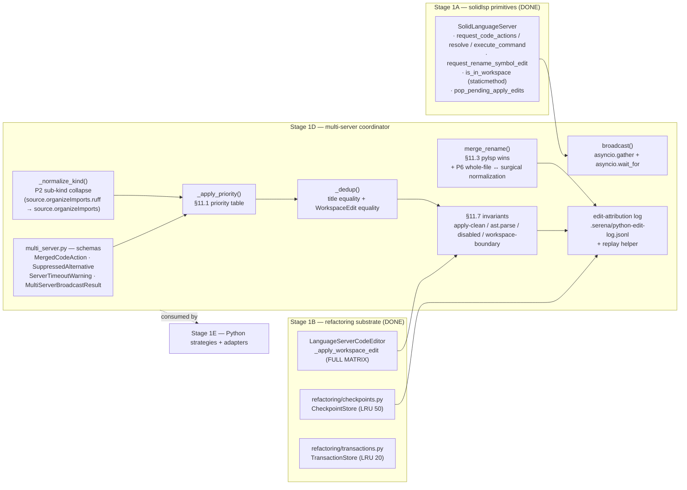
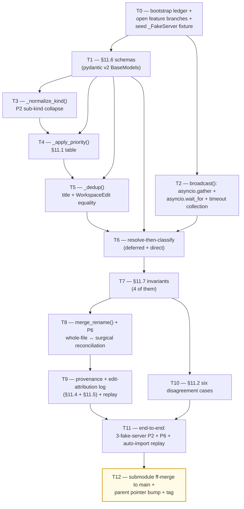

# Stage 1D — Multi-Server Merge (Python only) Implementation Plan

> **For agentic workers:** REQUIRED SUB-SKILL: Use `superpowers:subagent-driven-development` (recommended) or `superpowers:executing-plans` to implement this plan task-by-task. Steps use checkbox (`- [ ]`) syntax for tracking.

**Goal:** Land the Python multi-LSP coordinator at `vendor/serena/src/serena/refactoring/multi_server.py` per scope-report §11. Implement the §11.6 schemas (`MergedCodeAction`, `SuppressedAlternative`, `ServerTimeoutWarning`, `MultiServerBroadcastResult`), §11.1 two-stage merge (priority-by-kind-prefix + dedup-by-equivalence), §11.2 server-disagreement handling (six cases), §11.3 single-primary `textDocument/rename` with whole-file ↔ surgical edit reconciliation (Phase 0 P6 finding), §11.4 provenance reporting, §11.5 edit-attribution log (`.serena/python-edit-log.jsonl`), §11.7 four invariants (apply-clean / syntactic-validity / disabled-filter / workspace-boundary), §11.8 workspace-boundary enforcement (consumes Stage 1A `is_in_workspace`). The merger never sees pylsp-mypy (dropped per Phase 0 P5a / SUMMARY §6); ruff wins `source.organizeImports` per Phase 0 P2; pylsp wins `textDocument/rename` per Phase 0 P6. Stage 1D consumes Stage 1A facades (`request_code_actions`, `resolve_code_action`, `execute_command`, `is_in_workspace`, `pop_pending_apply_edits`) and Stage 1B substrate (`_apply_workspace_edit`, `inverse_workspace_edit`, `CheckpointStore`, `TransactionStore`, `WorkspaceBoundaryError`). Tests use `_FakeServer` test doubles because Stage 1E adapters (`PylspServer`/`BasedpyrightServer`/`RuffServer`) do not yet exist; the production `MultiServerCoordinator` accepts `dict[server_id, SolidLanguageServer]` so Stage 1E adapters drop in unchanged.

**Architecture:**



**Tech Stack:** Python 3.11+, `pytest`, `pytest-asyncio`, `pydantic` v2 (already a baseline), stdlib only for runtime (`asyncio`, `ast`, `difflib`, `json`, `pathlib`, `os`, `time`, `uuid`, `threading`). No new runtime dependencies.

**Source-of-truth references:**
- [`docs/design/mvp/2026-04-24-mvp-scope-report.md`](../../design/mvp/2026-04-24-mvp-scope-report.md) — §11.1 (two-stage merge), §11.2 (six disagreement cases), §11.3 (rename single-primary), §11.4 (provenance), §11.5 (edit-attribution log schema), §11.6 (schemas verbatim), §11.7 (four invariants), §11.8 (workspace-boundary), §14.1 row 10 (file 10 LoC budget = +430).
- [`docs/superpowers/plans/spike-results/P2.md`](spike-results/P2.md) — DIVERGENT, ruff wins; sub-kind hierarchical normalization required (`source.organizeImports.ruff` ↔ `source.organizeImports`).
- [`docs/superpowers/plans/spike-results/P6.md`](spike-results/P6.md) — DIVERGENT, pylsp wins on `textDocument/rename`; whole-file vs surgical edit reconciliation required; literal payloads in spike fixture.
- [`docs/superpowers/plans/spike-results/P5a.md`](spike-results/P5a.md) — pylsp-mypy DROPPED at MVP; merger never sees a pylsp-mypy candidate.
- [`docs/superpowers/plans/spike-results/SUMMARY.md`](spike-results/SUMMARY.md) — §4 LoC reconciliation row P2 (+20 LoC, Stage 1D), row P6 (+30–40 LoC, Stage 1D); §6 cross-cutting decisions; §5 wrapper-gap (Python adapters in Stage 1E).
- [`docs/superpowers/plans/stage-1a-results/PROGRESS.md`](stage-1a-results/PROGRESS.md) — Stage 1A facades available.
- [`docs/superpowers/plans/stage-1b-results/PROGRESS.md`](stage-1b-results/PROGRESS.md) — Stage 1B substrate available; submodule `main` at `ba7e62b1`.
- [`docs/superpowers/plans/2026-04-24-stage-1b-applier-checkpoints-transactions.md`](2026-04-24-stage-1b-applier-checkpoints-transactions.md) — pattern this plan mirrors.

---

## Scope check

Stage 1D is a single subsystem (the Python multi-LSP coordinator). It produces one production file (`multi_server.py` ~430 LoC) plus its test suite. It is parallelizable with Stage 1C per the index dependency graph (both depend on Stage 1B; both feed Stage 1E).

Out of scope (deferred):
- `PylspServer` / `BasedpyrightServer` / `RuffServer` adapter implementations → **Stage 1E** (per SUMMARY §5). Stage 1D tests use `_FakeServer` doubles whose method shapes (`request_code_actions(file, start, end, only) -> list[dict]`, `resolve_code_action(action) -> dict`, `execute_command(name, args) -> Any`, `request_rename_symbol_edit(relative_file_path, line, column, new_name) -> dict | None`) match the Stage 1A facade contract so Stage 1E adapters drop in unchanged.
- `PythonStrategy` / multi-server orchestration from facade layer → **Stage 1E**.
- Rust + clippy multi-server scenario → **v1.1** (only Python uses multi-LSP at MVP per §11 preamble).
- Persistent edit-attribution log rotation / pruning → **v1.1**. MVP appends only.
- Cross-language merge (e.g. shared rename across Python+Rust) → **v2+** per §4.7 cut list.

## File structure

| # | Path (under `vendor/serena/`) | Change | Responsibility |
|---|---|---|---|
| 10 | `src/serena/refactoring/multi_server.py` | New (+~430 LoC) | `MergedCodeAction`, `SuppressedAlternative`, `ServerTimeoutWarning`, `MultiServerBroadcastResult`, `MultiServerCoordinator` (broadcast / merge_code_actions / merge_rename), `_normalize_kind`, `_apply_priority`, `_dedup`, `_apply_invariants`, `_reconcile_rename_edits`, `EditAttributionLog`. |
| 10b | `src/serena/refactoring/__init__.py` | Modify (+~3 LoC) | Re-export `MergedCodeAction`, `SuppressedAlternative`, `ServerTimeoutWarning`, `MultiServerBroadcastResult`, `MultiServerCoordinator`, `EditAttributionLog`. |
| — | `test/spikes/conftest.py` | Modify (+~80 LoC) | Add `_FakeServer` test double + `fake_pool` fixture (3-server pool: pylsp + basedpyright + ruff). |
| — | `test/spikes/test_stage_1d_*.py` | New (~13 test files) | TDD tests, one file per task T1–T11. End-to-end test in T11 replays P2 + P6 + auto-import transcripts. |

**LoC budget:** logic +~430 (matches §14.1 row 10 exactly); tests +~700. Sub-kind normalization (P2) ≈ 20 LoC inside file 10; rename whole-file/surgical reconciliation (P6) ≈ 30-40 LoC inside file 10; both within the 430 budget.

## Dependency graph



T1 unlocks every downstream task (every other task imports a schema). T2 (broadcast) is independent of T3/T4/T5 (merge logic) and can run in parallel with them. T6 needs both broadcast (to surface the candidates) and the merge primitives (to classify them). T7 must run after T6 because invariants apply to resolved candidates only. T8 needs T7's invariants infra (rename also runs through workspace-boundary check). T9 needs T8 because the log records every applied edit including renames. T10 needs T7 because every disagreement case ultimately resolves into a `MergedCodeAction` plus `suppressed_alternatives`. T11 composes everything.

## Conventions enforced (from Phase 0 + Stage 1A + Stage 1B)

- **Submodule git-flow**: feature branch `feature/stage-1d-multi-server-merge` opened in both parent and `vendor/serena` submodule (T0 verifies). Submodule was not git-flow-initialized; same direct `feature/<name>` pattern as Stage 1A/1B; ff-merge to `main` at T12; parent bumps pointer.
- **Author**: AI Hive(R) on every commit; never "Claude". Trailer: `Co-Authored-By: AI Hive(R) <noreply@o2.services>`.
- **Field name `code_language=`** on `LanguageServerConfig` (verified at `ls_config.py:596`).
- **`with srv.start_server():`** sync context manager from `ls.py:717` for any boot-real-LSP test (Stage 1D has none — all tests use `_FakeServer`).
- **PROGRESS.md updates as separate commits**, never `--amend`. Each task ends in two commits: code commit (in submodule) + ledger update (in parent).
- **`_ConcreteSLS` + `slim_sls` fixture from `test/spikes/conftest.py`** (Stage 1A T4 hoisted) — used by tests that need to anchor `is_in_workspace` against a real `SolidLanguageServer` subclass.
- **`_FakeServer` test double**: defined in `test/spikes/conftest.py` in T0; method shapes mirror `SolidLanguageServer.request_code_actions` / `resolve_code_action` / `execute_command` / `request_rename_symbol_edit` exactly.
- **Pyright "unresolved imports" for `vendor/serena/*` are known false positives** in the parent IDE; submodule has its own venv; ignore.
- **Test command**: from `vendor/serena/`, run `PATH="$(pwd)/.venv/bin:$PATH" .venv/bin/pytest <path> -v`. Without venv on PATH, async tests fail.
- **`pytest-asyncio`** is already on the venv (Stage 1A confirmed). Use `@pytest.mark.asyncio` and `async def test_…`.
- **Type hints + pydantic v2 BaseModels** at every schema boundary; `Field(...)` validators where needed; `Literal[...]` for closed enums.
- **`Path.resolve()` for canonicalisation** — every path comparison goes through it.
- **`asyncio.gather(return_exceptions=True)`** for parallel fan-out so single-server failures do not poison the merge.
- **`asyncio.wait_for(timeout=2.0)`** per-server (default 2000ms; configurable via `O2_SCALPEL_BROADCAST_TIMEOUT_MS`).
- **`difflib`** stdlib for whole-file ↔ surgical normalisation in T8.
- **`ast.parse`** stdlib for syntactic-validity invariant in T7.
- **pylsp-mypy is NEVER in any priority table** — merger never receives a pylsp-mypy candidate per Phase 0 P5a / SUMMARY §6. Priority-table row "type error context" collapses to basedpyright-only.
- **pylsp-rope organize-imports DROPPED at merge time** — ruff wins per §11.1 / Phase 0 P2.

## Progress ledger

A new ledger `docs/superpowers/plans/stage-1d-results/PROGRESS.md` is created in T0. It mirrors the Stage 1B schema: per-task row with task id, branch SHA (submodule), outcome, follow-ups. Updated as a separate parent commit after each task completes.

---

### Task 0: Bootstrap ledger + verify pre-opened feature branches + seed `_FakeServer` fixture

**Files:**
- Create: `docs/superpowers/plans/stage-1d-results/PROGRESS.md`
- Verify: parent + submodule already on `feature/stage-1d-multi-server-merge`.
- Modify: `vendor/serena/test/spikes/conftest.py` — add `_FakeServer` + `fake_pool` fixture.

- [ ] **Step 1: Confirm both feature branches exist and are checked out**

Run:
```bash
git -C /Volumes/Unitek-B/Projects/o2-scalpel rev-parse --abbrev-ref HEAD
git -C /Volumes/Unitek-B/Projects/o2-scalpel/vendor/serena rev-parse --abbrev-ref HEAD
```

Expected: both print `feature/stage-1d-multi-server-merge`.

If submodule HEAD differs (e.g. detached after pointer bump), re-checkout:
```bash
cd /Volumes/Unitek-B/Projects/o2-scalpel/vendor/serena
git checkout feature/stage-1d-multi-server-merge
```

- [ ] **Step 2: Confirm Stage 1B tag is reachable**

Run:
```bash
git -C /Volumes/Unitek-B/Projects/o2-scalpel/vendor/serena tag -l 'stage-1b-applier-checkpoints-transactions-complete'
git -C /Volumes/Unitek-B/Projects/o2-scalpel tag -l 'stage-1b-applier-checkpoints-transactions-complete'
```

Expected: at least one of the two prints the tag (Stage 1B may have tagged at parent or submodule level — both is fine).

- [ ] **Step 3: Confirm Stage 1A + Stage 1B substrate exists**

Run:
```bash
grep -n "def request_code_actions\|def resolve_code_action\|def execute_command\|def is_in_workspace\|def pop_pending_apply_edits\|def request_rename_symbol_edit" /Volumes/Unitek-B/Projects/o2-scalpel/vendor/serena/src/solidlsp/ls.py
```

Expected: 6 hits (Stage 1A T6/T7/T8/T11/T12 outputs + the legacy `request_rename_symbol_edit` at `ls.py:2889`).

```bash
grep -n "class CheckpointStore\|class TransactionStore\|def inverse_workspace_edit\|class WorkspaceBoundaryError" /Volumes/Unitek-B/Projects/o2-scalpel/vendor/serena/src/serena/refactoring/checkpoints.py /Volumes/Unitek-B/Projects/o2-scalpel/vendor/serena/src/serena/refactoring/transactions.py /Volumes/Unitek-B/Projects/o2-scalpel/vendor/serena/src/serena/code_editor.py
```

Expected: 4 hits across the three files (Stage 1B T9/T10/T11/T12 outputs).

- [ ] **Step 4: Confirm `pytest-asyncio` is installed in the submodule venv**

Run:
```bash
cd /Volumes/Unitek-B/Projects/o2-scalpel/vendor/serena
.venv/bin/python -c "import pytest_asyncio; print(pytest_asyncio.__version__)"
```

Expected: a version string (e.g., `0.24.0`). If `ModuleNotFoundError`:
```bash
.venv/bin/uv pip install pytest-asyncio
```

- [ ] **Step 5: Create the PROGRESS.md ledger**

Write to `/Volumes/Unitek-B/Projects/o2-scalpel/docs/superpowers/plans/stage-1d-results/PROGRESS.md`:

```markdown
# Stage 1D — Multi-Server Merge — Progress Ledger

Started: 2026-04-25
Branch: feature/stage-1d-multi-server-merge (parent + submodule)
Author: AI Hive(R)
Built on: stage-1b-applier-checkpoints-transactions-complete

| Task | Description | Branch SHA (submodule) | Outcome | Follow-up |
|---|---|---|---|---|
| T0  | Bootstrap progress ledger + `_FakeServer` fixture                      | _pending_ | _pending_ | — |
| T1  | §11.6 multi-server schemas (pydantic v2 BaseModels)                    | _pending_ | _pending_ | — |
| T2  | `broadcast()` parallel fan-out (asyncio.gather + wait_for)             | _pending_ | _pending_ | — |
| T3  | `_normalize_kind()` — P2 sub-kind collapse                             | _pending_ | _pending_ | — |
| T4  | `_apply_priority()` — §11.1 priority table                             | _pending_ | _pending_ | — |
| T5  | `_dedup()` — title + WorkspaceEdit structural equality                 | _pending_ | _pending_ | — |
| T6  | resolve-then-classify (deferred + direct)                              | _pending_ | _pending_ | — |
| T7  | §11.7 four invariants (apply / ast.parse / disabled / boundary)        | _pending_ | _pending_ | — |
| T8  | `merge_rename()` + P6 whole-file ↔ surgical reconciliation             | _pending_ | _pending_ | — |
| T9  | provenance + edit-attribution log (§11.4 + §11.5) + replay             | _pending_ | _pending_ | — |
| T10 | §11.2 six server-disagreement cases                                    | _pending_ | _pending_ | — |
| T11 | E2E: 3-fake-server P2 + P6 + auto-import replay                        | _pending_ | _pending_ | — |
| T12 | Submodule ff-merge to main + parent pointer bump + tag                 | _pending_ | _pending_ | — |

## Decisions log

(append-only; one bullet per decision with date + rationale)

## Stage 1B entry baseline

- Submodule `main` head at Stage 1D start: `ba7e62b1` (per Stage 1B PROGRESS final verdict)
- Parent `develop` head at Stage 1D start: <fill in via `git rev-parse develop` at T0 close>
- Stage 1B tag: `stage-1b-applier-checkpoints-transactions-complete`
- Stage 1B spike-suite green: 130/130 (per Stage 1B PROGRESS final verdict)

## Spike outcome quick-reference (carryover for context)

- P2 → DIVERGENT — ruff wins `source.organizeImports`; pylsp-rope dropped at merge time. Sub-kind hierarchical normalization required (`source.organizeImports.ruff` → `source.organizeImports`). Implemented in T3 + T4.
- P5a → C (DROP pylsp-mypy) — merger never receives pylsp-mypy candidate; "type error" priority row collapses to basedpyright-only. Documented in §11.1 cross-reference; enforced by T4 priority table.
- P6 → DIVERGENT — pylsp wins `textDocument/rename`; whole-file vs surgical edit reconciliation required. Implemented in T8 via `difflib` line-mapping.
- §11.1 priority table → Stage 1D (this plan).
- §11.6 schemas → Stage 1D T1.
- §11.7 invariants → Stage 1D T7 (consumes Stage 1A `is_in_workspace` for invariant 4).
- §11.5 edit-attribution log → Stage 1D T9.
```

- [ ] **Step 6: Append `_FakeServer` + `fake_pool` to `vendor/serena/test/spikes/conftest.py`**

Append to `/Volumes/Unitek-B/Projects/o2-scalpel/vendor/serena/test/spikes/conftest.py`:

```python


# ---------------------------------------------------------------------------
# Stage 1D — Multi-server merge: _FakeServer test double + fake_pool fixture.
# ---------------------------------------------------------------------------
#
# Stage 1D is written against the Stage 1A facade contract on
# ``SolidLanguageServer`` but cannot use real Python LSPs because the
# ``PylspServer`` / ``BasedpyrightServer`` / ``RuffServer`` adapters do
# not yet exist (Stage 1E delivers them; SUMMARY §5). This fake mirrors
# the four facade method signatures exactly so Stage 1E adapters drop in
# unchanged when ``MultiServerCoordinator`` consumes them.

from typing import Any as _AnyT


class _FakeServer:
    """Minimal stand-in for a SolidLanguageServer subclass.

    Method shapes match Stage 1A facades verbatim:
      - request_code_actions(file, start, end, only=None, trigger_kind=2,
        diagnostics=None) -> list[dict[str, Any]]
      - resolve_code_action(action) -> dict[str, Any]
      - execute_command(name, args) -> Any
      - request_rename_symbol_edit(relative_file_path, line, column,
        new_name) -> dict[str, Any] | None

    Behavior is driven by attributes set per-test:
      - code_actions: list[dict] returned by request_code_actions
      - resolve_map: dict[id_or_title, resolved_action]
      - command_results: dict[command_name, Any]
      - rename_edit: dict | None returned by request_rename_symbol_edit
      - sleep_ms: optional async sleep before returning (drives timeout tests)
      - raises: optional Exception class to raise (drives error tests)
    """

    def __init__(self, server_id: str) -> None:
        self.server_id = server_id
        self.code_actions: list[dict[str, _AnyT]] = []
        self.resolve_map: dict[str, dict[str, _AnyT]] = {}
        self.command_results: dict[str, _AnyT] = {}
        self.rename_edit: dict[str, _AnyT] | None = None
        self.sleep_ms: int = 0
        self.raises: type[BaseException] | None = None
        self.calls: list[tuple[str, tuple[_AnyT, ...]]] = []

    async def _maybe_delay_or_raise(self) -> None:
        import asyncio as _asyncio
        if self.sleep_ms > 0:
            await _asyncio.sleep(self.sleep_ms / 1000.0)
        if self.raises is not None:
            raise self.raises(f"fake-server[{self.server_id}] raised")

    async def request_code_actions(
        self,
        file: str,
        start: dict[str, int],
        end: dict[str, int],
        only: list[str] | None = None,
        trigger_kind: int = 2,
        diagnostics: list[dict[str, _AnyT]] | None = None,
    ) -> list[dict[str, _AnyT]]:
        self.calls.append(("request_code_actions", (file, start, end, tuple(only or []))))
        await self._maybe_delay_or_raise()
        if only is None:
            return list(self.code_actions)
        # LSP §3.18.1 prefix rule: a server-side kind matches the filter
        # iff it equals the filter or starts with ``filter + "."``.
        out: list[dict[str, _AnyT]] = []
        for ca in self.code_actions:
            k = ca.get("kind", "")
            if any(k == f or k.startswith(f + ".") for f in only):
                out.append(ca)
        return out

    async def resolve_code_action(self, action: dict[str, _AnyT]) -> dict[str, _AnyT]:
        self.calls.append(("resolve_code_action", (action.get("title", ""),)))
        await self._maybe_delay_or_raise()
        key = action.get("data", {}).get("id") if isinstance(action.get("data"), dict) else None
        key = key or action.get("title", "")
        return self.resolve_map.get(key, action)

    async def execute_command(self, name: str, args: list[_AnyT] | None = None) -> _AnyT:
        self.calls.append(("execute_command", (name, tuple(args or []))))
        await self._maybe_delay_or_raise()
        return self.command_results.get(name)

    async def request_rename_symbol_edit(
        self,
        relative_file_path: str,
        line: int,
        column: int,
        new_name: str,
    ) -> dict[str, _AnyT] | None:
        self.calls.append(("request_rename_symbol_edit", (relative_file_path, line, column, new_name)))
        await self._maybe_delay_or_raise()
        return self.rename_edit


@pytest.fixture
def fake_pool() -> dict[str, _FakeServer]:
    """Standard 3-server Python pool used by Stage 1D tests.

    Order matters in iteration: pylsp first, basedpyright second, ruff
    third. Priority-table assertions don't rely on iteration order — they
    rely on _apply_priority() — but a stable dict order keeps test
    transcripts diff-friendly.
    """
    return {
        "pylsp-rope": _FakeServer("pylsp-rope"),
        "basedpyright": _FakeServer("basedpyright"),
        "ruff": _FakeServer("ruff"),
    }
```

- [ ] **Step 7: Smoke-test the fixture**

Create `/Volumes/Unitek-B/Projects/o2-scalpel/vendor/serena/test/spikes/test_stage_1d_t0_fixture_smoke.py`:

```python
"""T0 — smoke test the _FakeServer fixture so downstream tasks rely on it safely."""

from __future__ import annotations

import pytest


@pytest.mark.asyncio
async def test_fake_pool_three_servers(fake_pool):
    assert set(fake_pool.keys()) == {"pylsp-rope", "basedpyright", "ruff"}
    for sid, srv in fake_pool.items():
        assert srv.server_id == sid


@pytest.mark.asyncio
async def test_fake_request_code_actions_filters_by_only_prefix(fake_pool):
    srv = fake_pool["ruff"]
    srv.code_actions = [
        {"title": "Organize imports (ruff)", "kind": "source.organizeImports.ruff"},
        {"title": "Fix all (ruff)", "kind": "source.fixAll.ruff"},
        {"title": "Quickfix", "kind": "quickfix"},
    ]
    out = await srv.request_code_actions(
        file="/tmp/x.py",
        start={"line": 0, "character": 0},
        end={"line": 0, "character": 0},
        only=["source.organizeImports"],
    )
    assert len(out) == 1
    assert out[0]["kind"] == "source.organizeImports.ruff"


@pytest.mark.asyncio
async def test_fake_timeout_via_sleep_ms(fake_pool):
    import asyncio
    srv = fake_pool["pylsp-rope"]
    srv.sleep_ms = 200
    with pytest.raises(asyncio.TimeoutError):
        await asyncio.wait_for(
            srv.request_code_actions("/tmp/x.py", {"line": 0, "character": 0}, {"line": 0, "character": 0}),
            timeout=0.05,
        )


@pytest.mark.asyncio
async def test_fake_raises_propagates(fake_pool):
    srv = fake_pool["basedpyright"]
    srv.raises = RuntimeError
    with pytest.raises(RuntimeError):
        await srv.request_code_actions("/tmp/x.py", {"line": 0, "character": 0}, {"line": 0, "character": 0})
```

- [ ] **Step 8: Run smoke test, expect pass**

```bash
cd /Volumes/Unitek-B/Projects/o2-scalpel/vendor/serena
PATH="$(pwd)/.venv/bin:$PATH" .venv/bin/pytest test/spikes/test_stage_1d_t0_fixture_smoke.py -v
```

Expected: 4 passed.

- [ ] **Step 9: Commit fixture in submodule**

```bash
cd /Volumes/Unitek-B/Projects/o2-scalpel/vendor/serena
git add test/spikes/conftest.py test/spikes/test_stage_1d_t0_fixture_smoke.py
git commit -m "$(cat <<'EOF'
test(stage-1d): seed _FakeServer + fake_pool fixture (T0)

Mirrors Stage 1A facade contract on SolidLanguageServer so Stage 1D
can develop the multi-server coordinator before Stage 1E ships the
real PylspServer/BasedpyrightServer/RuffServer adapters. _FakeServer
methods are async; fake_pool provides the canonical 3-server Python
pool keyed by server_id (pylsp-rope / basedpyright / ruff).

Smoke test verifies:
- 3 servers in the pool with correct ids
- request_code_actions honors LSP §3.18.1 prefix rule on `only`
- sleep_ms drives asyncio.TimeoutError on wait_for
- raises propagates the configured exception

Co-Authored-By: AI Hive(R) <noreply@o2.services>
EOF
)"
```

- [ ] **Step 10: Commit ledger seed in parent**

```bash
cd /Volumes/Unitek-B/Projects/o2-scalpel
git add docs/superpowers/plans/stage-1d-results/PROGRESS.md
git commit -m "$(cat <<'EOF'
chore(stage-1d): seed progress ledger for multi-server merge sub-plan (T0)

Mirror Stage 1B schema: per-task row with branch SHA, outcome, follow-ups.
Updated as separate commits after each task lands.

Co-Authored-By: AI Hive(R) <noreply@o2.services>
EOF
)"
```

- [ ] **Step 11: Update PROGRESS.md row T0**

Edit ledger row T0: mark with submodule SHA from `git -C vendor/serena rev-parse HEAD`, outcome `OK`, follow-up `—`. Commit:
```bash
cd /Volumes/Unitek-B/Projects/o2-scalpel
git add docs/superpowers/plans/stage-1d-results/PROGRESS.md
git commit -m "chore(stage-1d): mark T0 ledger seeded + fixture green

Co-Authored-By: AI Hive(R) <noreply@o2.services>"
```

---


### Task 1: §11.6 multi-server schemas (pydantic v2 BaseModels)

**Files:**
- New: `vendor/serena/src/serena/refactoring/multi_server.py` — schemas only.
- Modify: `vendor/serena/src/serena/refactoring/__init__.py` — re-export.
- New test: `vendor/serena/test/spikes/test_stage_1d_t1_schemas.py`

**Why:** §11.6 — every downstream task imports these schemas. Verbatim per the spec; pydantic v2 `BaseModel` with `Field(...)` defaults; `Literal[...]` for closed enums; the merger module is the only place that knows about server identities.

- [ ] **Step 1: Write failing test**

Create `/Volumes/Unitek-B/Projects/o2-scalpel/vendor/serena/test/spikes/test_stage_1d_t1_schemas.py`:

```python
"""T1 — §11.6 multi-server schemas."""

from __future__ import annotations

import pytest
from pydantic import ValidationError

from serena.refactoring.multi_server import (
    MergedCodeAction,
    MultiServerBroadcastResult,
    ServerTimeoutWarning,
    SuppressedAlternative,
)


def test_merged_code_action_minimal() -> None:
    a = MergedCodeAction(
        id="ca-1",
        title="Organize imports",
        kind="source.organizeImports",
        disabled_reason=None,
        is_preferred=False,
        provenance="ruff",
    )
    assert a.id == "ca-1"
    assert a.suppressed_alternatives == []


def test_merged_code_action_with_suppressed() -> None:
    s = SuppressedAlternative(
        title="Organize imports",
        provenance="pylsp-rope",
        reason="lower_priority",
    )
    a = MergedCodeAction(
        id="ca-2",
        title="Organize imports",
        kind="source.organizeImports",
        disabled_reason=None,
        is_preferred=True,
        provenance="ruff",
        suppressed_alternatives=[s],
    )
    assert a.suppressed_alternatives[0].provenance == "pylsp-rope"
    assert a.suppressed_alternatives[0].reason == "lower_priority"


def test_provenance_literal_rejects_unknown() -> None:
    with pytest.raises(ValidationError):
        MergedCodeAction(
            id="ca-3",
            title="x",
            kind="quickfix",
            disabled_reason=None,
            is_preferred=False,
            provenance="jedi",  # not in the closed Literal set
        )


def test_provenance_literal_includes_pylsp_mypy_for_v1_1_compat() -> None:
    """pylsp-mypy is in the Literal so v1.1 can re-introduce it without
    a schema migration. Stage 1D never CONSTRUCTS one (P5a / SUMMARY §6
    drops pylsp-mypy from the active set), but the schema permits it."""
    a = MergedCodeAction(
        id="ca-4",
        title="t",
        kind="quickfix",
        disabled_reason=None,
        is_preferred=False,
        provenance="pylsp-mypy",
    )
    assert a.provenance == "pylsp-mypy"


def test_suppressed_alternative_reason_literal() -> None:
    with pytest.raises(ValidationError):
        SuppressedAlternative(title="x", provenance="ruff", reason="some_other_reason")
    for r in ("lower_priority", "duplicate_title", "duplicate_edit"):
        SuppressedAlternative(title="x", provenance="ruff", reason=r)


def test_server_timeout_warning_defaults() -> None:
    w = ServerTimeoutWarning(server="ruff", method="textDocument/codeAction", timeout_ms=2000, after_ms=2050)
    assert w.timeout_ms == 2000
    assert w.after_ms == 2050


def test_multi_server_broadcast_result_round_trip() -> None:
    r = MultiServerBroadcastResult(
        responses={"ruff": [{"title": "x"}]},
        timeouts=[ServerTimeoutWarning(server="pylsp-rope", method="textDocument/codeAction", timeout_ms=2000, after_ms=2010)],
        errors={"basedpyright": "boom"},
    )
    dumped = r.model_dump()
    rebuilt = MultiServerBroadcastResult(**dumped)
    assert rebuilt.responses["ruff"] == [{"title": "x"}]
    assert rebuilt.timeouts[0].server == "pylsp-rope"
    assert rebuilt.errors["basedpyright"] == "boom"


def test_module_exports_via_refactoring_package() -> None:
    from serena.refactoring import (
        MergedCodeAction as MA,
        MultiServerBroadcastResult as MR,
        ServerTimeoutWarning as STW,
        SuppressedAlternative as SA,
    )
    assert MA is MergedCodeAction
    assert MR is MultiServerBroadcastResult
    assert STW is ServerTimeoutWarning
    assert SA is SuppressedAlternative
```

- [ ] **Step 2: Run test, expect fail**

```bash
cd /Volumes/Unitek-B/Projects/o2-scalpel/vendor/serena
PATH="$(pwd)/.venv/bin:$PATH" .venv/bin/pytest test/spikes/test_stage_1d_t1_schemas.py -v
```

Expected FAIL: `ModuleNotFoundError: No module named 'serena.refactoring.multi_server'`.

- [ ] **Step 3: Implement schemas**

Create `/Volumes/Unitek-B/Projects/o2-scalpel/vendor/serena/src/serena/refactoring/multi_server.py`:

```python
"""Multi-LSP coordination for Python (scope-report §11).

Only Python uses multi-LSP at MVP: pylsp + basedpyright + ruff.
pylsp-mypy is DROPPED at MVP (Phase 0 P5a / SUMMARY §6) — the merger
never receives a pylsp-mypy candidate, but the ``provenance`` Literal
keeps it for v1.1 schema compatibility.

This module is the only place that knows about server identities.
Below: ``LanguageServerCodeEditor._apply_workspace_edit`` sees a single
merged ``WorkspaceEdit`` per call (with provenance annotations).
Above: facades see merged ``MergedCodeAction`` lists with
``suppressed_alternatives`` populated only when ``O2_SCALPEL_DEBUG_MERGE=1``.
"""

from __future__ import annotations

from typing import Any, Literal

from pydantic import BaseModel, Field

# ---------------------------------------------------------------------------
# §11.6 schemas — verbatim per scope report.
# ---------------------------------------------------------------------------

ProvenanceLiteral = Literal[
    "pylsp-rope",
    "pylsp-base",
    "basedpyright",
    "ruff",
    "pylsp-mypy",
    "rust-analyzer",
]


class SuppressedAlternative(BaseModel):
    """An alternative dropped during the §11.1 two-stage merge.

    Only attached to ``MergedCodeAction.suppressed_alternatives`` when
    ``O2_SCALPEL_DEBUG_MERGE=1``.
    """

    title: str
    provenance: str
    reason: Literal["lower_priority", "duplicate_title", "duplicate_edit"]


class MergedCodeAction(BaseModel):
    """A code action that survived the §11.1 two-stage merge.

    Carries ``provenance`` so the LLM can audit which server produced
    the winner; carries ``suppressed_alternatives`` (debug-only) so a
    diff against the unmerged set is reconstructable.
    """

    id: str
    title: str
    kind: str
    disabled_reason: str | None
    is_preferred: bool
    provenance: ProvenanceLiteral
    suppressed_alternatives: list[SuppressedAlternative] = Field(default_factory=list)


class ServerTimeoutWarning(BaseModel):
    """Single-server timeout entry, surfaced by ``broadcast()``."""

    server: str
    method: str
    timeout_ms: int
    after_ms: int


class MultiServerBroadcastResult(BaseModel):
    """Result of fanning a request to N servers in parallel.

    Internal to ``MultiServerCoordinator``; facades never see this
    shape — they see ``list[MergedCodeAction]``.
    """

    responses: dict[str, Any] = Field(default_factory=dict)
    timeouts: list[ServerTimeoutWarning] = Field(default_factory=list)
    errors: dict[str, str] = Field(default_factory=dict)


__all__ = [
    "MergedCodeAction",
    "MultiServerBroadcastResult",
    "ProvenanceLiteral",
    "ServerTimeoutWarning",
    "SuppressedAlternative",
]
```

- [ ] **Step 4: Re-export from `refactoring/__init__.py`**

Modify `/Volumes/Unitek-B/Projects/o2-scalpel/vendor/serena/src/serena/refactoring/__init__.py` — replace contents with:

```python
"""Stage 1B + Stage 1D refactoring substrate.

- ``inverse_workspace_edit`` synthesizes the reverse of a successfully-applied
  ``WorkspaceEdit`` (Stage 1B T10).
- ``CheckpointStore`` keeps an LRU(50) of ``(applied_edit, snapshot, inverse)``
  tuples (Stage 1B T11).
- ``TransactionStore`` keeps an LRU(20) of checkpoint groupings; rollback walks
  member checkpoints in reverse order (Stage 1B T12).
- ``MultiServerCoordinator`` runs the §11 two-stage merge across N Python
  LSPs, attributes provenance, and appends to the edit-attribution log
  (Stage 1D T1–T9).
"""

from .checkpoints import CheckpointStore, inverse_workspace_edit
from .multi_server import (
    MergedCodeAction,
    MultiServerBroadcastResult,
    ProvenanceLiteral,
    ServerTimeoutWarning,
    SuppressedAlternative,
)
from .transactions import TransactionStore

__all__ = [
    "CheckpointStore",
    "MergedCodeAction",
    "MultiServerBroadcastResult",
    "ProvenanceLiteral",
    "ServerTimeoutWarning",
    "SuppressedAlternative",
    "TransactionStore",
    "inverse_workspace_edit",
]
```

- [ ] **Step 5: Run test, expect pass**

```bash
PATH="$(pwd)/.venv/bin:$PATH" .venv/bin/pytest test/spikes/test_stage_1d_t1_schemas.py -v
```

Expected: 8 passed.

- [ ] **Step 6: Commit**

```bash
cd /Volumes/Unitek-B/Projects/o2-scalpel/vendor/serena
git add src/serena/refactoring/multi_server.py src/serena/refactoring/__init__.py test/spikes/test_stage_1d_t1_schemas.py
git commit -m "$(cat <<'EOF'
feat(multi-server): §11.6 schemas — MergedCodeAction, SuppressedAlternative, ServerTimeoutWarning, MultiServerBroadcastResult (T1)

Verbatim per scope-report §11.6 with pydantic v2 BaseModels.
ProvenanceLiteral closed-enum keeps pylsp-mypy for v1.1 schema compat
even though the active MVP set excludes it (Phase 0 P5a). Suppressed
alternatives attach only when O2_SCALPEL_DEBUG_MERGE=1 (consumer
contract; schema itself is always populated).

Re-exported from serena.refactoring so downstream tasks import via the
package root.

Co-Authored-By: AI Hive(R) <noreply@o2.services>
EOF
)"
```

- [ ] **Step 7: Update PROGRESS.md (parent commit)**

```bash
cd /Volumes/Unitek-B/Projects/o2-scalpel
git add docs/superpowers/plans/stage-1d-results/PROGRESS.md
git commit -m "chore(stage-1d): mark T1 done — §11.6 schemas

Co-Authored-By: AI Hive(R) <noreply@o2.services>"
```

---

### Task 2: `broadcast()` — parallel fan-out with `asyncio.gather` + `asyncio.wait_for`

**Files:**
- Modify: `vendor/serena/src/serena/refactoring/multi_server.py` — add `MultiServerCoordinator` class skeleton + `broadcast()`.
- New test: `vendor/serena/test/spikes/test_stage_1d_t2_broadcast.py`

**Why:** §11.2 row "server times out (>2s for codeAction)" — continue with responding servers; emit `warnings: ["server X timed out on codeAction"]`. The broadcast primitive is the only path through which downstream tasks reach the underlying servers; isolating it lets every other task stub the fan-out.

- [ ] **Step 1: Write failing test**

Create `/Volumes/Unitek-B/Projects/o2-scalpel/vendor/serena/test/spikes/test_stage_1d_t2_broadcast.py`:

```python
"""T2 — broadcast() parallel fan-out + timeout / error collection."""

from __future__ import annotations

import pytest

from serena.refactoring.multi_server import (
    MultiServerBroadcastResult,
    MultiServerCoordinator,
)


@pytest.mark.asyncio
async def test_broadcast_all_success(fake_pool):
    fake_pool["pylsp-rope"].code_actions = [{"title": "rope", "kind": "refactor.extract"}]
    fake_pool["basedpyright"].code_actions = [{"title": "bp", "kind": "quickfix"}]
    fake_pool["ruff"].code_actions = [{"title": "ruff", "kind": "source.fixAll.ruff"}]
    coord = MultiServerCoordinator(fake_pool)
    result = await coord.broadcast(
        method="textDocument/codeAction",
        kwargs={
            "file": "/tmp/x.py",
            "start": {"line": 0, "character": 0},
            "end": {"line": 0, "character": 0},
        },
        timeout_ms=2000,
    )
    assert isinstance(result, MultiServerBroadcastResult)
    assert set(result.responses.keys()) == {"pylsp-rope", "basedpyright", "ruff"}
    assert result.timeouts == []
    assert result.errors == {}


@pytest.mark.asyncio
async def test_broadcast_one_timeout(fake_pool):
    fake_pool["pylsp-rope"].sleep_ms = 500  # exceeds 100ms timeout
    fake_pool["basedpyright"].code_actions = [{"title": "bp", "kind": "quickfix"}]
    fake_pool["ruff"].code_actions = [{"title": "ruff", "kind": "source.fixAll.ruff"}]
    coord = MultiServerCoordinator(fake_pool)
    result = await coord.broadcast(
        method="textDocument/codeAction",
        kwargs={
            "file": "/tmp/x.py",
            "start": {"line": 0, "character": 0},
            "end": {"line": 0, "character": 0},
        },
        timeout_ms=100,
    )
    assert "pylsp-rope" not in result.responses
    assert {w.server for w in result.timeouts} == {"pylsp-rope"}
    assert result.timeouts[0].method == "textDocument/codeAction"
    assert result.timeouts[0].timeout_ms == 100
    assert result.timeouts[0].after_ms >= 100
    assert set(result.responses.keys()) == {"basedpyright", "ruff"}


@pytest.mark.asyncio
async def test_broadcast_one_error(fake_pool):
    fake_pool["pylsp-rope"].code_actions = [{"title": "rope", "kind": "refactor"}]
    fake_pool["basedpyright"].raises = RuntimeError
    fake_pool["ruff"].code_actions = [{"title": "ruff", "kind": "source.fixAll.ruff"}]
    coord = MultiServerCoordinator(fake_pool)
    result = await coord.broadcast(
        method="textDocument/codeAction",
        kwargs={
            "file": "/tmp/x.py",
            "start": {"line": 0, "character": 0},
            "end": {"line": 0, "character": 0},
        },
        timeout_ms=2000,
    )
    assert "basedpyright" not in result.responses
    assert "basedpyright" in result.errors
    assert "raised" in result.errors["basedpyright"]
    assert set(result.responses.keys()) == {"pylsp-rope", "ruff"}


@pytest.mark.asyncio
async def test_broadcast_env_default_timeout_2000ms(fake_pool, monkeypatch):
    """When timeout_ms is omitted, default reads from
    O2_SCALPEL_BROADCAST_TIMEOUT_MS or falls back to 2000."""
    monkeypatch.setenv("O2_SCALPEL_BROADCAST_TIMEOUT_MS", "50")
    fake_pool["pylsp-rope"].sleep_ms = 200
    coord = MultiServerCoordinator(fake_pool)
    result = await coord.broadcast(
        method="textDocument/codeAction",
        kwargs={
            "file": "/tmp/x.py",
            "start": {"line": 0, "character": 0},
            "end": {"line": 0, "character": 0},
        },
    )
    assert result.timeouts and result.timeouts[0].timeout_ms == 50


@pytest.mark.asyncio
async def test_broadcast_unknown_method_raises_value_error(fake_pool):
    coord = MultiServerCoordinator(fake_pool)
    with pytest.raises(ValueError, match="unsupported broadcast method"):
        await coord.broadcast(method="textDocument/notARealLspMethod", kwargs={})
```

- [ ] **Step 2: Run test, expect fail**

```bash
PATH="$(pwd)/.venv/bin:$PATH" .venv/bin/pytest test/spikes/test_stage_1d_t2_broadcast.py -v
```

Expected FAIL: `ImportError: cannot import name 'MultiServerCoordinator'`.

- [ ] **Step 3: Implement `broadcast()` and the coordinator skeleton**

Append to `/Volumes/Unitek-B/Projects/o2-scalpel/vendor/serena/src/serena/refactoring/multi_server.py` (above `__all__`):

```python


# ---------------------------------------------------------------------------
# Imports needed for runtime behaviors below.
# ---------------------------------------------------------------------------

import asyncio
import os
import time

# Methods broadcast() can dispatch. Each entry maps an LSP wire method
# name to the SolidLanguageServer facade name that implements it.
# ``textDocument/rename`` is intentionally NOT broadcast — it goes
# through ``merge_rename()`` (T8) which is single-primary per §11.3.
_BROADCAST_DISPATCH: dict[str, str] = {
    "textDocument/codeAction": "request_code_actions",
    "codeAction/resolve": "resolve_code_action",
    "workspace/executeCommand": "execute_command",
}


def _default_broadcast_timeout_ms() -> int:
    """Per-call default; ``O2_SCALPEL_BROADCAST_TIMEOUT_MS`` overrides."""
    raw = os.environ.get("O2_SCALPEL_BROADCAST_TIMEOUT_MS")
    if raw is None:
        return 2000
    try:
        v = int(raw)
        return v if v > 0 else 2000
    except ValueError:
        return 2000


class MultiServerCoordinator:
    """Coordinator for the §11 multi-LSP merge.

    Holds a ``dict[server_id, server]`` pool. Servers are duck-typed:
    in production they are ``SolidLanguageServer`` subclasses (Stage 1E
    adapters). In Stage 1D unit tests they are ``_FakeServer`` doubles
    from ``test/spikes/conftest.py``. Method shapes are identical.
    """

    def __init__(self, servers: dict[str, Any]) -> None:
        self._servers = dict(servers)

    @property
    def servers(self) -> dict[str, Any]:
        return dict(self._servers)

    async def broadcast(
        self,
        method: str,
        kwargs: dict[str, Any],
        timeout_ms: int | None = None,
    ) -> MultiServerBroadcastResult:
        """Fan ``method`` with ``kwargs`` to every server in the pool.

        Returns a ``MultiServerBroadcastResult`` collecting:
          - ``responses``: ``{server_id: response}`` for servers that
            answered within ``timeout_ms``.
          - ``timeouts``: ``ServerTimeoutWarning`` per server that
            exceeded the deadline.
          - ``errors``: ``{server_id: stringified-exception}`` per
            server that raised.

        ``timeout_ms`` defaults to ``$O2_SCALPEL_BROADCAST_TIMEOUT_MS``
        or 2000ms per §11.2 row "Server times out (>2 s for codeAction)".
        """
        facade_name = _BROADCAST_DISPATCH.get(method)
        if facade_name is None:
            raise ValueError(f"unsupported broadcast method: {method!r}")
        deadline_ms = timeout_ms if timeout_ms is not None else _default_broadcast_timeout_ms()
        timeout_s = deadline_ms / 1000.0

        async def _one(server_id: str, server: Any) -> tuple[str, Any | BaseException, float]:
            facade = getattr(server, facade_name)
            t0 = time.monotonic()
            try:
                resp = await asyncio.wait_for(facade(**kwargs), timeout=timeout_s)
                return server_id, resp, (time.monotonic() - t0) * 1000.0
            except asyncio.TimeoutError as exc:
                return server_id, exc, (time.monotonic() - t0) * 1000.0
            except BaseException as exc:  # noqa: BLE001
                return server_id, exc, (time.monotonic() - t0) * 1000.0

        gathered = await asyncio.gather(
            *[_one(sid, srv) for sid, srv in self._servers.items()],
            return_exceptions=False,
        )
        out = MultiServerBroadcastResult()
        for sid, resp_or_exc, after_ms in gathered:
            if isinstance(resp_or_exc, asyncio.TimeoutError):
                out.timeouts.append(
                    ServerTimeoutWarning(
                        server=sid,
                        method=method,
                        timeout_ms=deadline_ms,
                        after_ms=int(after_ms),
                    )
                )
            elif isinstance(resp_or_exc, BaseException):
                out.errors[sid] = f"{type(resp_or_exc).__name__}: {resp_or_exc}"
            else:
                out.responses[sid] = resp_or_exc
        return out
```

Update `__all__` at the bottom of the file:

```python
__all__ = [
    "MergedCodeAction",
    "MultiServerBroadcastResult",
    "MultiServerCoordinator",
    "ProvenanceLiteral",
    "ServerTimeoutWarning",
    "SuppressedAlternative",
]
```

Update `vendor/serena/src/serena/refactoring/__init__.py` `__all__` and import block to add `MultiServerCoordinator`:

```python
from .multi_server import (
    MergedCodeAction,
    MultiServerBroadcastResult,
    MultiServerCoordinator,
    ProvenanceLiteral,
    ServerTimeoutWarning,
    SuppressedAlternative,
)
```

```python
__all__ = [
    "CheckpointStore",
    "MergedCodeAction",
    "MultiServerBroadcastResult",
    "MultiServerCoordinator",
    "ProvenanceLiteral",
    "ServerTimeoutWarning",
    "SuppressedAlternative",
    "TransactionStore",
    "inverse_workspace_edit",
]
```

- [ ] **Step 4: Run test, expect pass**

```bash
PATH="$(pwd)/.venv/bin:$PATH" .venv/bin/pytest test/spikes/test_stage_1d_t2_broadcast.py -v
```

Expected: 5 passed.

- [ ] **Step 5: Commit**

```bash
cd /Volumes/Unitek-B/Projects/o2-scalpel/vendor/serena
git add src/serena/refactoring/multi_server.py src/serena/refactoring/__init__.py test/spikes/test_stage_1d_t2_broadcast.py
git commit -m "$(cat <<'EOF'
feat(multi-server): broadcast() parallel fan-out with timeout + error capture (T2)

asyncio.gather + asyncio.wait_for fans request_code_actions /
resolve_code_action / execute_command across the server pool.
Timeouts surface as ServerTimeoutWarning entries; errors stringify
into the errors dict; partial results return the surviving responses.
Default timeout 2000ms per §11.2; O2_SCALPEL_BROADCAST_TIMEOUT_MS
overrides for tests / debugging.

textDocument/rename is intentionally NOT in the dispatch table —
single-primary per §11.3, handled by merge_rename() (T8).

Co-Authored-By: AI Hive(R) <noreply@o2.services>
EOF
)"
```

- [ ] **Step 6: Update PROGRESS.md (parent commit)**

```bash
cd /Volumes/Unitek-B/Projects/o2-scalpel
git add docs/superpowers/plans/stage-1d-results/PROGRESS.md
git commit -m "chore(stage-1d): mark T2 done — broadcast() parallel fan-out

Co-Authored-By: AI Hive(R) <noreply@o2.services>"
```

---

### Task 3: `_normalize_kind()` — Phase 0 P2 sub-kind hierarchical collapse

**Files:**
- Modify: `vendor/serena/src/serena/refactoring/multi_server.py` — add `_normalize_kind`.
- New test: `vendor/serena/test/spikes/test_stage_1d_t3_normalize_kind.py`

**Why:** Phase 0 P2 finding — ruff publishes under hierarchical sub-kinds (`source.organizeImports.ruff`, `source.fixAll.ruff`) per LSP §3.18.1 prefix rule. The §11.1 priority table is keyed by base kind (e.g., `source.organizeImports`); the merger must normalize before lookup so ruff's hierarchical kind matches the same priority row as pylsp-rope's bare `source.organizeImports`.

> LSP §3.18.1 (CodeActionKind hierarchy): "Kinds are a hierarchical list of identifiers separated by ``.``, e.g. ``\"refactor.extract.function\"``." A consumer requesting `only: ["refactor.extract"]` matches both `refactor.extract` and `refactor.extract.function`. The merger applies the inverse: collapse a leaf-with-server-suffix back to its registered family for priority-table lookup.

- [ ] **Step 1: Write failing test**

Create `/Volumes/Unitek-B/Projects/o2-scalpel/vendor/serena/test/spikes/test_stage_1d_t3_normalize_kind.py`:

```python
"""T3 — _normalize_kind() Phase 0 P2 sub-kind collapse.

Maps hierarchical leaf kinds (server-suffixed) onto the base family
key the §11.1 priority table is keyed against."""

from __future__ import annotations

import pytest

from serena.refactoring.multi_server import _normalize_kind


@pytest.mark.parametrize("raw,expected", [
    # P2 finding: ruff suffix hierarchy.
    ("source.organizeImports.ruff", "source.organizeImports"),
    ("source.fixAll.ruff", "source.fixAll"),
    # Same hierarchical shape with other servers (defensive — Stage 1E
    # may register additional adapters that follow the same convention).
    ("source.organizeImports.pylsp-rope", "source.organizeImports"),
    ("source.fixAll.basedpyright", "source.fixAll"),
    # Bare kinds pass through unchanged — they're the base families.
    ("source.organizeImports", "source.organizeImports"),
    ("source.fixAll", "source.fixAll"),
    ("quickfix", "quickfix"),
    ("refactor.extract", "refactor.extract"),
    ("refactor.inline", "refactor.inline"),
    ("refactor.rewrite", "refactor.rewrite"),
    ("refactor", "refactor"),
    ("source", "source"),
    # LSP §3.18.1 grandchild that isn't server-suffixed (e.g.
    # rust-analyzer's ``refactor.extract.module``) MUST NOT collapse —
    # those are real semantic sub-actions, not server-tag suffixes.
    ("refactor.extract.module", "refactor.extract.module"),
    ("refactor.extract.function", "refactor.extract.function"),
])
def test_normalize_kind_table(raw: str, expected: str) -> None:
    assert _normalize_kind(raw) == expected


def test_normalize_kind_empty_string_passes_through() -> None:
    assert _normalize_kind("") == ""


def test_normalize_kind_unknown_kind_passes_through() -> None:
    """Per §11.2 row "kind: null/unrecognized" → bucket as quickfix.other.
    That bucketing is _apply_priority's job; _normalize_kind itself is
    pure-string and just normalizes server-suffixes."""
    assert _normalize_kind("vendor.custom.thing") == "vendor.custom.thing"


def test_normalize_kind_preserves_dots_in_unknown_segments() -> None:
    """A multi-segment kind we don't recognize as a server-suffix shape
    must pass through verbatim (no aggressive trim)."""
    assert _normalize_kind("source.organizeImports.unknownVendor") == "source.organizeImports.unknownVendor"
```

- [ ] **Step 2: Run test, expect fail**

```bash
PATH="$(pwd)/.venv/bin:$PATH" .venv/bin/pytest test/spikes/test_stage_1d_t3_normalize_kind.py -v
```

Expected FAIL: `ImportError: cannot import name '_normalize_kind'`.

- [ ] **Step 3: Implement `_normalize_kind`**

Append to `/Volumes/Unitek-B/Projects/o2-scalpel/vendor/serena/src/serena/refactoring/multi_server.py` (above the `MultiServerCoordinator` class — placement matters because T4 will use it from `_apply_priority`):

```python


# ---------------------------------------------------------------------------
# §11.1 + Phase 0 P2 — sub-kind normalization for priority-table lookup.
# ---------------------------------------------------------------------------

# Server-suffix tokens recognized by the merger. Stage 1E adapters
# may extend this set; per Phase 0 P2 only "ruff" appears in the wild
# at MVP, but defensive entries cover future expansions and the
# hierarchical-collision case noted in §11.2.
_KNOWN_SERVER_SUFFIXES: frozenset[str] = frozenset({
    "ruff",
    "pylsp-rope",
    "pylsp-base",
    "pylsp-mypy",
    "basedpyright",
    "rust-analyzer",
})

# Base families against which the §11.1 priority table is keyed.
# A hierarchical kind ``<family>.<server-suffix>`` collapses to
# ``<family>`` for priority-table lookup. Other hierarchies (e.g.
# ``refactor.extract.function``) are NOT collapsed — they're semantic
# sub-actions, not server tags.
_PRIORITY_BASE_FAMILIES: frozenset[str] = frozenset({
    "source.organizeImports",
    "source.fixAll",
    "quickfix",
    "refactor.extract",
    "refactor.inline",
    "refactor.rewrite",
    "refactor",
    "source",
})


def _normalize_kind(kind: str) -> str:
    """Collapse hierarchical server-suffix kinds onto their priority family.

    Per LSP §3.18.1, CodeActionKind values are dot-separated hierarchies
    (e.g. ``source.organizeImports.ruff``). Phase 0 P2 confirmed ruff
    publishes under such suffixes while pylsp-rope publishes the bare
    family. The §11.1 priority table is keyed by family, so the merger
    rewrites suffixed kinds before lookup.

    Rule: if ``kind`` decomposes into ``<family>.<server>`` where
    ``<family>`` is in ``_PRIORITY_BASE_FAMILIES`` and ``<server>`` is in
    ``_KNOWN_SERVER_SUFFIXES``, return ``<family>``. Otherwise return
    ``kind`` unchanged.

    Examples:
      ``source.organizeImports.ruff`` → ``source.organizeImports``
      ``source.fixAll.ruff`` → ``source.fixAll``
      ``refactor.extract.function`` → ``refactor.extract.function`` (kept)
      ``quickfix`` → ``quickfix`` (already a family)
    """
    if not kind or "." not in kind:
        return kind
    head, _, tail = kind.rpartition(".")
    if head in _PRIORITY_BASE_FAMILIES and tail in _KNOWN_SERVER_SUFFIXES:
        return head
    return kind
```

- [ ] **Step 4: Run test, expect pass**

```bash
PATH="$(pwd)/.venv/bin:$PATH" .venv/bin/pytest test/spikes/test_stage_1d_t3_normalize_kind.py -v
```

Expected: 17 passed (15 from `parametrize` + 2 standalone).

- [ ] **Step 5: Commit**

```bash
cd /Volumes/Unitek-B/Projects/o2-scalpel/vendor/serena
git add src/serena/refactoring/multi_server.py test/spikes/test_stage_1d_t3_normalize_kind.py
git commit -m "$(cat <<'EOF'
feat(multi-server): _normalize_kind() Phase 0 P2 sub-kind collapse (T3)

Maps hierarchical server-suffix kinds (LSP §3.18.1) onto the base
family the §11.1 priority table is keyed against. ruff publishes
source.organizeImports.ruff / source.fixAll.ruff per P2 spike;
pylsp-rope publishes the bare family. Both must hit the same priority
row.

Defensive: collapse only fires when head is in
_PRIORITY_BASE_FAMILIES AND tail is in _KNOWN_SERVER_SUFFIXES.
Semantic sub-actions like refactor.extract.function are preserved.

Co-Authored-By: AI Hive(R) <noreply@o2.services>
EOF
)"
```

- [ ] **Step 6: Update PROGRESS.md (parent commit)**

```bash
cd /Volumes/Unitek-B/Projects/o2-scalpel
git add docs/superpowers/plans/stage-1d-results/PROGRESS.md
git commit -m "chore(stage-1d): mark T3 done — sub-kind normalization

Co-Authored-By: AI Hive(R) <noreply@o2.services>"
```

---

### Task 4: `_apply_priority()` — §11.1 Stage-1 priority filter

**Files:**
- Modify: `vendor/serena/src/serena/refactoring/multi_server.py` — add `_PRIORITY_TABLE`, `_classify_quickfix_context`, `_apply_priority`.
- New test: `vendor/serena/test/spikes/test_stage_1d_t4_priority.py`

**Why:** §11.1 Stage 1 — server priority per kind-prefix. The table verbatim:

| Kind prefix | Priority order (highest → lowest) |
|---|---|
| `source.organizeImports` | ruff > pylsp-rope > basedpyright |
| `source.fixAll` | ruff (unique) |
| `quickfix` (auto-import context) | basedpyright > pylsp-rope |
| `quickfix` (lint fix context) | ruff > pylsp-rope > basedpyright |
| `quickfix` (type error context) | basedpyright (pylsp-mypy DROPPED at MVP) |
| `quickfix` (other) | pylsp-rope > basedpyright > ruff |
| `refactor.extract` | pylsp-rope (unique) |
| `refactor.inline` | pylsp-rope (unique) |
| `refactor.rewrite` | pylsp-rope > basedpyright |
| `refactor` (catch-all) | pylsp-rope > basedpyright |
| `source` (catch-all) | ruff > pylsp-rope > basedpyright |

`pylsp-mypy` is intentionally absent from every row — Phase 0 P5a / SUMMARY §6 dropped it from the active MVP set; the merger will never receive a pylsp-mypy candidate.

Quickfix context disambiguators come from the triggering diagnostic code (per `specialist-python.md` §5.3); when no diagnostic is present, default to `quickfix.other`.

- [ ] **Step 1: Write failing test**

Create `/Volumes/Unitek-B/Projects/o2-scalpel/vendor/serena/test/spikes/test_stage_1d_t4_priority.py`:

```python
"""T4 — _apply_priority() §11.1 priority table per kind family."""

from __future__ import annotations

import pytest

from serena.refactoring.multi_server import (
    _apply_priority,
    _classify_quickfix_context,
)


def _ca(server: str, kind: str, title: str = "x", **extra) -> tuple[str, dict]:
    base = {"title": title, "kind": kind}
    base.update(extra)
    return (server, base)


# ---------------------------------------------------------------------------
# Priority-table — one assertion per row of the §11.1 table.
# ---------------------------------------------------------------------------

def test_organize_imports_ruff_beats_rope_beats_basedpyright() -> None:
    cands = [
        _ca("pylsp-rope", "source.organizeImports"),
        _ca("ruff", "source.organizeImports.ruff"),
        _ca("basedpyright", "source.organizeImports"),
    ]
    winners = _apply_priority(cands, family="source.organizeImports", quickfix_context=None)
    assert [s for s, _ in winners] == ["ruff"]


def test_source_fix_all_unique_ruff() -> None:
    cands = [_ca("ruff", "source.fixAll.ruff")]
    winners = _apply_priority(cands, family="source.fixAll", quickfix_context=None)
    assert [s for s, _ in winners] == ["ruff"]


def test_quickfix_auto_import_basedpyright_beats_rope() -> None:
    cands = [
        _ca("pylsp-rope", "quickfix"),
        _ca("basedpyright", "quickfix"),
    ]
    winners = _apply_priority(cands, family="quickfix", quickfix_context="auto-import")
    assert [s for s, _ in winners] == ["basedpyright"]


def test_quickfix_lint_ruff_beats_rope_beats_basedpyright() -> None:
    cands = [
        _ca("ruff", "quickfix"),
        _ca("pylsp-rope", "quickfix"),
        _ca("basedpyright", "quickfix"),
    ]
    winners = _apply_priority(cands, family="quickfix", quickfix_context="lint-fix")
    assert [s for s, _ in winners] == ["ruff"]


def test_quickfix_type_error_basedpyright_only_pylsp_mypy_excluded() -> None:
    """pylsp-mypy is DROPPED at MVP per Phase 0 P5a / SUMMARY §6; merger
    never sees it. Row collapses to basedpyright-only."""
    cands = [_ca("basedpyright", "quickfix")]
    winners = _apply_priority(cands, family="quickfix", quickfix_context="type-error")
    assert [s for s, _ in winners] == ["basedpyright"]


def test_quickfix_other_rope_beats_basedpyright_beats_ruff() -> None:
    cands = [
        _ca("pylsp-rope", "quickfix"),
        _ca("basedpyright", "quickfix"),
        _ca("ruff", "quickfix"),
    ]
    winners = _apply_priority(cands, family="quickfix", quickfix_context="other")
    assert [s for s, _ in winners] == ["pylsp-rope"]


def test_refactor_extract_unique_rope() -> None:
    cands = [_ca("pylsp-rope", "refactor.extract")]
    winners = _apply_priority(cands, family="refactor.extract", quickfix_context=None)
    assert [s for s, _ in winners] == ["pylsp-rope"]


def test_refactor_inline_unique_rope() -> None:
    cands = [_ca("pylsp-rope", "refactor.inline")]
    winners = _apply_priority(cands, family="refactor.inline", quickfix_context=None)
    assert [s for s, _ in winners] == ["pylsp-rope"]


def test_refactor_rewrite_rope_beats_basedpyright() -> None:
    cands = [
        _ca("basedpyright", "refactor.rewrite"),
        _ca("pylsp-rope", "refactor.rewrite"),
    ]
    winners = _apply_priority(cands, family="refactor.rewrite", quickfix_context=None)
    assert [s for s, _ in winners] == ["pylsp-rope"]


def test_refactor_catchall_rope_beats_basedpyright() -> None:
    cands = [
        _ca("pylsp-rope", "refactor"),
        _ca("basedpyright", "refactor"),
    ]
    winners = _apply_priority(cands, family="refactor", quickfix_context=None)
    assert [s for s, _ in winners] == ["pylsp-rope"]


def test_source_catchall_ruff_beats_rope_beats_basedpyright() -> None:
    cands = [
        _ca("pylsp-rope", "source"),
        _ca("ruff", "source"),
        _ca("basedpyright", "source"),
    ]
    winners = _apply_priority(cands, family="source", quickfix_context=None)
    assert [s for s, _ in winners] == ["ruff"]


# ---------------------------------------------------------------------------
# §11.2 cross-cases that touch _apply_priority directly.
# ---------------------------------------------------------------------------

def test_disabled_action_preserved_even_when_lower_priority() -> None:
    """§11.2 row "Server returns disabled.reason set" — preserve in
    merged list. _apply_priority surfaces it alongside the winner."""
    cands = [
        _ca("ruff", "source.organizeImports.ruff"),
        _ca("pylsp-rope", "source.organizeImports", disabled={"reason": "no-imports-to-organize"}),
    ]
    winners = _apply_priority(cands, family="source.organizeImports", quickfix_context=None)
    sids = [s for s, _ in winners]
    assert "ruff" in sids
    assert "pylsp-rope" in sids  # disabled candidate preserved
    rope_action = [a for s, a in winners if s == "pylsp-rope"][0]
    assert rope_action.get("disabled", {}).get("reason") == "no-imports-to-organize"


def test_unknown_server_falls_to_lowest_priority() -> None:
    """A candidate from a server not in the priority table for the
    family lands at the END of the winners list (or is dropped if
    higher-priority candidates exist for the same family)."""
    cands = [
        _ca("ruff", "source.organizeImports.ruff"),
        _ca("vendor-x", "source.organizeImports"),  # unknown server
    ]
    winners = _apply_priority(cands, family="source.organizeImports", quickfix_context=None)
    assert [s for s, _ in winners] == ["ruff"]


def test_no_candidates_returns_empty() -> None:
    assert _apply_priority([], family="quickfix", quickfix_context="other") == []


# ---------------------------------------------------------------------------
# Quickfix context classifier.
# ---------------------------------------------------------------------------

@pytest.mark.parametrize("code,expected", [
    # pylsp-rope ``rope_autoimport`` → basedpyright also emits → auto-import bucket.
    ("undefined-name", "auto-import"),
    ("reportUndefinedVariable", "auto-import"),
    ("F401", "lint-fix"),  # ruff's "imported but unused"
    ("E501", "lint-fix"),  # ruff line-length
    ("reportArgumentType", "type-error"),
    ("reportCallIssue", "type-error"),
    ("reportInvalidTypeForm", "type-error"),
    ("unknown-thing", "other"),
    (None, "other"),
])
def test_classify_quickfix_context(code: object, expected: str) -> None:
    diag = {"code": code} if code is not None else {}
    assert _classify_quickfix_context(diag) == expected
```

- [ ] **Step 2: Run test, expect fail**

```bash
PATH="$(pwd)/.venv/bin:$PATH" .venv/bin/pytest test/spikes/test_stage_1d_t4_priority.py -v
```

Expected FAIL: `ImportError: cannot import name '_apply_priority'`.

- [ ] **Step 3: Implement priority table + classifier + filter**

Append to `/Volumes/Unitek-B/Projects/o2-scalpel/vendor/serena/src/serena/refactoring/multi_server.py` (above `MultiServerCoordinator` class):

```python


# ---------------------------------------------------------------------------
# §11.1 Stage-1 priority table (verbatim per scope report).
# ---------------------------------------------------------------------------
#
# Keys are ``(family, quickfix_context)`` — context is None for non-quickfix
# families. Values are server-id lists ordered highest → lowest priority.
# pylsp-mypy is INTENTIONALLY ABSENT — Phase 0 P5a / SUMMARY §6 dropped it
# from the active MVP set; merger never receives a pylsp-mypy candidate.
_PRIORITY_TABLE: dict[tuple[str, str | None], tuple[str, ...]] = {
    ("source.organizeImports", None): ("ruff", "pylsp-rope", "basedpyright"),
    ("source.fixAll", None): ("ruff",),
    ("quickfix", "auto-import"): ("basedpyright", "pylsp-rope"),
    ("quickfix", "lint-fix"): ("ruff", "pylsp-rope", "basedpyright"),
    ("quickfix", "type-error"): ("basedpyright",),  # pylsp-mypy DROPPED
    ("quickfix", "other"): ("pylsp-rope", "basedpyright", "ruff"),
    ("refactor.extract", None): ("pylsp-rope",),
    ("refactor.inline", None): ("pylsp-rope",),
    ("refactor.rewrite", None): ("pylsp-rope", "basedpyright"),
    ("refactor", None): ("pylsp-rope", "basedpyright"),
    ("source", None): ("ruff", "pylsp-rope", "basedpyright"),
}


# Diagnostic-code → quickfix-context lookup. Sourced from
# specialist-python.md §5.3; entries cover the codes Phase 0 P4
# observed plus ruff's lint codes (Fxxx, Exxx, Wxxx prefixes).
_AUTO_IMPORT_CODES: frozenset[str] = frozenset({
    "undefined-name",          # pylsp / pyflakes
    "reportUndefinedVariable",  # basedpyright
    "reportPossiblyUndefined",  # basedpyright
    "F821",                     # ruff: undefined name
})

_TYPE_ERROR_CODE_PREFIXES: tuple[str, ...] = (
    "report",  # basedpyright family: reportArgumentType, reportCallIssue, reportInvalidTypeForm, ...
)
_TYPE_ERROR_CODE_EXACT: frozenset[str] = frozenset({
    "type-error",
    "incompatible-type",
})

_LINT_FIX_CODE_PREFIXES: tuple[str, ...] = (
    "E", "W", "F", "I", "B", "C", "N", "S", "PL",  # ruff/flake8/pylint families
)


def _classify_quickfix_context(diagnostic: dict[str, Any] | None) -> str:
    """Bucket a diagnostic into a quickfix sub-context per §11.1.

    Returns one of: ``"auto-import"``, ``"lint-fix"``, ``"type-error"``,
    ``"other"``. ``"other"`` is the fallback for empty / unrecognized
    diagnostics. Used to disambiguate the three quickfix priority rows.
    """
    if not diagnostic:
        return "other"
    code = diagnostic.get("code")
    if code is None:
        return "other"
    code_str = str(code)
    if code_str in _AUTO_IMPORT_CODES:
        return "auto-import"
    if code_str in _TYPE_ERROR_CODE_EXACT:
        return "type-error"
    if any(code_str.startswith(p) for p in _TYPE_ERROR_CODE_PREFIXES):
        return "type-error"
    # Lint-fix prefix check is last — it's the loosest.
    if any(
        len(code_str) > len(p) and code_str.startswith(p) and code_str[len(p)].isdigit()
        for p in _LINT_FIX_CODE_PREFIXES
    ):
        return "lint-fix"
    return "other"


def _apply_priority(
    candidates: list[tuple[str, dict[str, Any]]],
    family: str,
    quickfix_context: str | None,
) -> list[tuple[str, dict[str, Any]]]:
    """Stage-1 of the §11.1 merge: drop lower-priority winners; preserve
    ``disabled.reason`` actions; bucket unknown servers at lowest priority.

    Inputs are pre-grouped per family by the caller (``merge_code_actions``);
    ``quickfix_context`` is non-None only for ``family == "quickfix"`` and
    is one of ``"auto-import"`` / ``"lint-fix"`` / ``"type-error"`` /
    ``"other"`` per ``_classify_quickfix_context``.

    Returns the surviving ``(server_id, action)`` tuples in priority
    order. Disabled-reason actions are appended after the winner so
    callers can surface them per §11.2 ("Server returns disabled.reason
    set → preserve in merged list; do not silently drop").
    """
    if not candidates:
        return []
    key = (family, quickfix_context)
    priority = _PRIORITY_TABLE.get(key, ())

    # Partition.
    disabled: list[tuple[str, dict[str, Any]]] = []
    active: list[tuple[str, dict[str, Any]]] = []
    for sid, action in candidates:
        if isinstance(action.get("disabled"), dict) and action["disabled"].get("reason"):
            disabled.append((sid, action))
        else:
            active.append((sid, action))

    # Pick the highest-priority active server present in the candidate set.
    winner: tuple[str, dict[str, Any]] | None = None
    for sid in priority:
        match = next(((s, a) for s, a in active if s == sid), None)
        if match is not None:
            winner = match
            break

    out: list[tuple[str, dict[str, Any]]] = []
    if winner is not None:
        out.append(winner)
    elif active:
        # Family unknown OR no priority entry matched any candidate server.
        # Per §11.2 row "kind:null/unrecognized" → bucket lowest; we still
        # surface ONE candidate so the LLM has something to act on.
        out.append(active[0])

    # Preserve disabled actions per §11.2.
    out.extend(disabled)
    return out
```

- [ ] **Step 4: Run test, expect pass**

```bash
PATH="$(pwd)/.venv/bin:$PATH" .venv/bin/pytest test/spikes/test_stage_1d_t4_priority.py -v
```

Expected: 23 passed (11 priority-table rows + 3 cross-cases + 9 classifier `parametrize` rows).

If `test_quickfix_lint_ruff_beats_rope_beats_basedpyright` fails because the classifier returns `"other"` for codes like `F401`, verify the prefix test allows letter-prefix-then-digit. Adjust `_LINT_FIX_CODE_PREFIXES` matching if needed (e.g., regex `^[A-Z]+\d+$`).

- [ ] **Step 5: Commit**

```bash
cd /Volumes/Unitek-B/Projects/o2-scalpel/vendor/serena
git add src/serena/refactoring/multi_server.py test/spikes/test_stage_1d_t4_priority.py
git commit -m "$(cat <<'EOF'
feat(multi-server): _apply_priority() §11.1 Stage-1 table (T4)

11 priority rows verbatim per scope-report §11.1. pylsp-mypy
intentionally ABSENT from every row — Phase 0 P5a / SUMMARY §6
dropped it from the active MVP set. quickfix is partitioned by
diagnostic-code context (auto-import / lint-fix / type-error /
other) via _classify_quickfix_context.

Disabled-reason actions are preserved alongside the winner per
§11.2 row "Server returns disabled.reason set"; unknown server-ids
land at lowest priority per §11.2 row "kind:null/unrecognized".

Co-Authored-By: AI Hive(R) <noreply@o2.services>
EOF
)"
```

- [ ] **Step 6: Update PROGRESS.md (parent commit)**

```bash
cd /Volumes/Unitek-B/Projects/o2-scalpel
git add docs/superpowers/plans/stage-1d-results/PROGRESS.md
git commit -m "chore(stage-1d): mark T4 done — §11.1 priority filter

Co-Authored-By: AI Hive(R) <noreply@o2.services>"
```

---

### Task 5: `_dedup()` — Stage-2 dedup-by-equivalence

**Files:**
- Modify: `vendor/serena/src/serena/refactoring/multi_server.py` — add `_normalize_title`, `_workspace_edits_equal`, `_dedup`.
- New test: `vendor/serena/test/spikes/test_stage_1d_t5_dedup.py`

**Why:** §11.1 Stage 2 — for actions surviving Stage 1, dedup if either (1) normalized title equality, or (2) `WorkspaceEdit` structural equality. Title comparison runs first (cheap); structural equality is computed lazily only on titles that don't match. Tiebreak: prefer the higher-priority server's action.

- [ ] **Step 1: Write failing test**

Create `/Volumes/Unitek-B/Projects/o2-scalpel/vendor/serena/test/spikes/test_stage_1d_t5_dedup.py`:

```python
"""T5 — _dedup() Stage-2 normalized-title + WorkspaceEdit-equality dedup."""

from __future__ import annotations

import pytest

from serena.refactoring.multi_server import (
    _dedup,
    _normalize_title,
    _workspace_edits_equal,
)


# ---------------------------------------------------------------------------
# Title normalization.
# ---------------------------------------------------------------------------

@pytest.mark.parametrize("raw,expected", [
    ("Import 'numpy'", "import 'numpy'"),
    ("Add import: numpy", "import: numpy"),
    ("Quick fix: Add import 'numpy'", "import 'numpy'"),
    ("Add: numpy", "numpy"),
    ("  organize   imports  ", "organize imports"),
    ("Organize Imports", "organize imports"),
    ("", ""),
])
def test_normalize_title(raw: str, expected: str) -> None:
    assert _normalize_title(raw) == expected


# ---------------------------------------------------------------------------
# WorkspaceEdit structural equality (lazy second-pass equality).
# ---------------------------------------------------------------------------

def _edit(uri: str, sl: int, sc: int, el: int, ec: int, txt: str) -> dict:
    return {
        "documentChanges": [
            {
                "textDocument": {"uri": uri, "version": None},
                "edits": [
                    {
                        "range": {"start": {"line": sl, "character": sc}, "end": {"line": el, "character": ec}},
                        "newText": txt,
                    }
                ],
            }
        ]
    }


def test_workspace_edits_equal_identical() -> None:
    a = _edit("file:///x.py", 0, 0, 0, 5, "hello")
    b = _edit("file:///x.py", 0, 0, 0, 5, "hello")
    assert _workspace_edits_equal(a, b) is True


def test_workspace_edits_equal_different_text() -> None:
    a = _edit("file:///x.py", 0, 0, 0, 5, "hello")
    b = _edit("file:///x.py", 0, 0, 0, 5, "world")
    assert _workspace_edits_equal(a, b) is False


def test_workspace_edits_equal_different_uri() -> None:
    a = _edit("file:///x.py", 0, 0, 0, 5, "hello")
    b = _edit("file:///y.py", 0, 0, 0, 5, "hello")
    assert _workspace_edits_equal(a, b) is False


def test_workspace_edits_equal_unordered_edits() -> None:
    """Two edits to the same file in different list order MUST equal —
    structural equality is set-of-tuples, not list-equality."""
    a = {
        "documentChanges": [
            {
                "textDocument": {"uri": "file:///x.py", "version": None},
                "edits": [
                    {"range": {"start": {"line": 0, "character": 0}, "end": {"line": 0, "character": 1}}, "newText": "A"},
                    {"range": {"start": {"line": 1, "character": 0}, "end": {"line": 1, "character": 1}}, "newText": "B"},
                ],
            }
        ]
    }
    b = {
        "documentChanges": [
            {
                "textDocument": {"uri": "file:///x.py", "version": None},
                "edits": [
                    {"range": {"start": {"line": 1, "character": 0}, "end": {"line": 1, "character": 1}}, "newText": "B"},
                    {"range": {"start": {"line": 0, "character": 0}, "end": {"line": 0, "character": 1}}, "newText": "A"},
                ],
            }
        ]
    }
    assert _workspace_edits_equal(a, b) is True


def test_workspace_edits_equal_handles_legacy_changes_map() -> None:
    """Some servers ship the legacy ``changes`` map instead of
    ``documentChanges``. Equality must normalize both shapes."""
    a = {"changes": {"file:///x.py": [{"range": {"start": {"line": 0, "character": 0}, "end": {"line": 0, "character": 5}}, "newText": "hello"}]}}
    b = _edit("file:///x.py", 0, 0, 0, 5, "hello")
    assert _workspace_edits_equal(a, b) is True


# ---------------------------------------------------------------------------
# _dedup() — composes title equality + lazy structural equality.
# ---------------------------------------------------------------------------

def test_dedup_title_match() -> None:
    cands = [
        ("ruff", {"title": "Import 'numpy'", "kind": "quickfix", "edit": _edit("file:///x.py", 0, 0, 0, 0, "import numpy\n")}),
        ("basedpyright", {"title": "Add import: numpy", "kind": "quickfix", "edit": _edit("file:///x.py", 0, 0, 0, 0, "import numpy\n")}),
    ]
    priority = ("ruff", "basedpyright")
    out = _dedup(cands, priority)
    assert len(out) == 1
    sid, action, dropped = out[0]
    assert sid == "ruff"
    assert len(dropped) == 1
    assert dropped[0][0] == "basedpyright"
    assert dropped[0][2] == "duplicate_title"


def test_dedup_edit_match_when_titles_differ() -> None:
    cands = [
        ("ruff", {"title": "Sort imports", "kind": "source.organizeImports.ruff", "edit": _edit("file:///x.py", 0, 0, 5, 0, "X")}),
        ("pylsp-rope", {"title": "Organize imports (Rope)", "kind": "source.organizeImports", "edit": _edit("file:///x.py", 0, 0, 5, 0, "X")}),
    ]
    priority = ("ruff", "pylsp-rope")
    out = _dedup(cands, priority)
    assert len(out) == 1
    sid, _, dropped = out[0]
    assert sid == "ruff"
    assert dropped[0][2] == "duplicate_edit"


def test_dedup_no_match_keeps_both() -> None:
    cands = [
        ("ruff", {"title": "Sort imports", "kind": "source.organizeImports.ruff", "edit": _edit("file:///x.py", 0, 0, 5, 0, "X")}),
        ("pylsp-rope", {"title": "Extract function", "kind": "refactor.extract", "edit": _edit("file:///x.py", 1, 0, 1, 5, "Y")}),
    ]
    priority = ("ruff", "pylsp-rope")
    out = _dedup(cands, priority)
    assert len(out) == 2
    assert {sid for sid, _, _ in out} == {"ruff", "pylsp-rope"}
    assert all(dropped == [] for _, _, dropped in out)


def test_dedup_tiebreak_prefers_higher_priority_server() -> None:
    """If two candidates from servers NOT yet in priority order have the
    same title, the one whose server appears first in the priority
    tuple wins."""
    cands = [
        ("basedpyright", {"title": "Add import: numpy", "kind": "quickfix", "edit": _edit("file:///x.py", 0, 0, 0, 0, "import numpy\n")}),
        ("pylsp-rope", {"title": "Import 'numpy'", "kind": "quickfix", "edit": _edit("file:///x.py", 0, 0, 0, 0, "import numpy\n")}),
    ]
    priority = ("basedpyright", "pylsp-rope")  # auto-import row order
    out = _dedup(cands, priority)
    assert len(out) == 1
    assert out[0][0] == "basedpyright"


def test_dedup_empty_returns_empty() -> None:
    assert _dedup([], priority=("ruff",)) == []


def test_dedup_single_candidate_passes_through() -> None:
    cands = [("ruff", {"title": "x", "kind": "source.organizeImports.ruff", "edit": _edit("file:///x.py", 0, 0, 1, 0, "Y")})]
    out = _dedup(cands, priority=("ruff",))
    assert len(out) == 1
    assert out[0][2] == []
```

- [ ] **Step 2: Run test, expect fail**

```bash
PATH="$(pwd)/.venv/bin:$PATH" .venv/bin/pytest test/spikes/test_stage_1d_t5_dedup.py -v
```

Expected FAIL: `ImportError: cannot import name '_dedup'`.

- [ ] **Step 3: Implement `_normalize_title`, `_workspace_edits_equal`, `_dedup`**

Append to `/Volumes/Unitek-B/Projects/o2-scalpel/vendor/serena/src/serena/refactoring/multi_server.py` (above `MultiServerCoordinator` class):

```python


# ---------------------------------------------------------------------------
# §11.1 Stage-2 — dedup-by-equivalence (title equality + lazy WorkspaceEdit).
# ---------------------------------------------------------------------------

import re

_TITLE_PREFIXES_TO_STRIP: tuple[str, ...] = (
    "add: ",
    "add ",
    "quick fix: ",
    "quickfix: ",
    "fix: ",
)
_TITLE_WHITESPACE_RE = re.compile(r"\s+")


def _normalize_title(title: str) -> str:
    """Normalize a code-action title for Stage-2 equality comparison.

    Lowercases, strips conventional leading prefixes (``"Add: "``,
    ``"Quick fix: "``, etc.), collapses internal whitespace. Per §11.1
    Stage-2 example: ``"Import 'numpy'"`` and ``"Add import: numpy"``
    both normalize to a comparable form.
    """
    s = title.strip().lower()
    # Strip the longest matching prefix (longest-first so ``"add: "`` wins
    # over ``"add "`` when both could match).
    for prefix in sorted(_TITLE_PREFIXES_TO_STRIP, key=len, reverse=True):
        if s.startswith(prefix):
            s = s[len(prefix):].strip()
            break
    s = _TITLE_WHITESPACE_RE.sub(" ", s)
    return s


def _workspace_edit_to_canonical_set(edit: dict[str, Any]) -> frozenset[tuple[Any, ...]]:
    """Reduce a ``WorkspaceEdit`` (or legacy ``changes`` map) to a set of
    ``(uri, start_line, start_char, end_line, end_char, newText)`` tuples.

    Set-shaped so two edits whose internal list ordering differs still
    compare equal (some servers re-order, some don't). Stage-2 equality
    is set-of-edits, not list-of-edits.
    """
    out: set[tuple[Any, ...]] = set()
    if "documentChanges" in edit:
        for change in edit["documentChanges"]:
            kind = change.get("kind")
            if kind in ("create", "rename", "delete"):
                # File-level operations: keep them in the canonical form
                # so structural equality includes them.
                if kind == "create":
                    out.add(("create", change["uri"]))
                elif kind == "delete":
                    out.add(("delete", change["uri"]))
                else:  # rename
                    out.add(("rename", change["oldUri"], change["newUri"]))
                continue
            uri = change["textDocument"]["uri"]
            for te in change.get("edits", []):
                rng = te["range"]
                out.add((
                    uri,
                    rng["start"]["line"], rng["start"]["character"],
                    rng["end"]["line"], rng["end"]["character"],
                    te["newText"],
                ))
    if "changes" in edit:
        for uri, edits in edit["changes"].items():
            for te in edits:
                rng = te["range"]
                out.add((
                    uri,
                    rng["start"]["line"], rng["start"]["character"],
                    rng["end"]["line"], rng["end"]["character"],
                    te["newText"],
                ))
    return frozenset(out)


def _workspace_edits_equal(a: dict[str, Any], b: dict[str, Any]) -> bool:
    """Set-equality on the canonical (uri, range, newText) tuples."""
    return _workspace_edit_to_canonical_set(a) == _workspace_edit_to_canonical_set(b)


def _dedup(
    candidates: list[tuple[str, dict[str, Any]]],
    priority: tuple[str, ...],
) -> list[tuple[str, dict[str, Any], list[tuple[str, dict[str, Any], str]]]]:
    """Stage-2 of the §11.1 merge: dedup by equivalence.

    For every pair of survivors, compare normalized titles first
    (cheap); if titles don't match, compare WorkspaceEdit structural
    equality lazily. If either matches, keep the higher-priority
    server's action; record the dropped one with its reason.

    Returns ``(server_id, action, dropped_alternatives)`` per surviving
    cluster. ``dropped_alternatives`` is a list of
    ``(server_id, action, reason)`` triples where ``reason`` is one of
    ``"duplicate_title"`` / ``"duplicate_edit"``. ``"lower_priority"``
    is the responsibility of ``_apply_priority`` (Stage 1), not this
    function.
    """
    if not candidates:
        return []
    if len(candidates) == 1:
        sid, action = candidates[0]
        return [(sid, action, [])]

    def _rank(server_id: str) -> int:
        try:
            return priority.index(server_id)
        except ValueError:
            return len(priority)  # unknown servers sort last

    # Sort candidates highest-priority-first so the first member of any
    # cluster is automatically the winner.
    ranked = sorted(candidates, key=lambda sa: _rank(sa[0]))

    # Cluster IDs assigned greedily.
    cluster_winner_idx_per_member: list[int] = [-1] * len(ranked)
    titles = [_normalize_title(a.get("title", "")) for _, a in ranked]
    for i in range(len(ranked)):
        if cluster_winner_idx_per_member[i] != -1:
            continue
        cluster_winner_idx_per_member[i] = i
        for j in range(i + 1, len(ranked)):
            if cluster_winner_idx_per_member[j] != -1:
                continue
            same_title = titles[i] != "" and titles[i] == titles[j]
            same_edit = False
            if not same_title:
                edit_i = ranked[i][1].get("edit")
                edit_j = ranked[j][1].get("edit")
                if isinstance(edit_i, dict) and isinstance(edit_j, dict):
                    same_edit = _workspace_edits_equal(edit_i, edit_j)
            if same_title or same_edit:
                cluster_winner_idx_per_member[j] = i

    # Build the output: one entry per winner, with dropped sibling info.
    out: list[tuple[str, dict[str, Any], list[tuple[str, dict[str, Any], str]]]] = []
    for winner_idx in range(len(ranked)):
        if cluster_winner_idx_per_member[winner_idx] != winner_idx:
            continue
        winner_sid, winner_action = ranked[winner_idx]
        dropped: list[tuple[str, dict[str, Any], str]] = []
        winner_title = titles[winner_idx]
        for other_idx in range(len(ranked)):
            if other_idx == winner_idx or cluster_winner_idx_per_member[other_idx] != winner_idx:
                continue
            other_sid, other_action = ranked[other_idx]
            other_title = titles[other_idx]
            if winner_title != "" and winner_title == other_title:
                reason = "duplicate_title"
            else:
                reason = "duplicate_edit"
            dropped.append((other_sid, other_action, reason))
        out.append((winner_sid, winner_action, dropped))
    return out
```

- [ ] **Step 4: Run test, expect pass**

```bash
PATH="$(pwd)/.venv/bin:$PATH" .venv/bin/pytest test/spikes/test_stage_1d_t5_dedup.py -v
```

Expected: 14 passed (7 normalize_title + 5 workspace_edits_equal + 6 _dedup cases — total 18; the parametrize count is 7).

If `test_normalize_title` fails on `"Add import: numpy" → "import: numpy"`: the prefix list strips `"add "` (with space) and leaves `"import: numpy"`. Verify the prefix-strip logic uses `startswith` on lowercased string.

If `test_dedup_edit_match_when_titles_differ` fails: confirm the `same_edit` branch fires only when both candidates carry an `edit` key (which the test fixture sets explicitly).

- [ ] **Step 5: Commit**

```bash
cd /Volumes/Unitek-B/Projects/o2-scalpel/vendor/serena
git add src/serena/refactoring/multi_server.py test/spikes/test_stage_1d_t5_dedup.py
git commit -m "$(cat <<'EOF'
feat(multi-server): _dedup() Stage-2 by-equivalence (T5)

Two equivalence checks:
1. Normalized title equality — strip common prefixes (Add/Quick fix/
   Fix), lowercase, collapse whitespace.
2. WorkspaceEdit structural equality — set-of-(uri, range, newText)
   tuples; supports both documentChanges and legacy changes-map
   shapes; file ops (create/rename/delete) included in the canonical
   set.

Title check runs first (cheap); structural check runs lazily on
title-mismatch. Tiebreak picks higher-priority server per the
caller-supplied priority tuple. Dropped alternatives surface as
(server_id, action, reason) triples for SuppressedAlternative
construction in T6.

Co-Authored-By: AI Hive(R) <noreply@o2.services>
EOF
)"
```

- [ ] **Step 6: Update PROGRESS.md (parent commit)**

```bash
cd /Volumes/Unitek-B/Projects/o2-scalpel
git add docs/superpowers/plans/stage-1d-results/PROGRESS.md
git commit -m "chore(stage-1d): mark T5 done — Stage-2 dedup

Co-Authored-By: AI Hive(R) <noreply@o2.services>"
```

---

### Task 6: `merge_code_actions()` — resolve-then-classify; compose T2+T3+T4+T5

**Files:**
- Modify: `vendor/serena/src/serena/refactoring/multi_server.py` — add `merge_code_actions` on `MultiServerCoordinator`.
- New test: `vendor/serena/test/spikes/test_stage_1d_t6_merge_code_actions.py`

**Why:** Phase 0 SUMMARY §6 cross-cutting decision: "Code-action flow MUST resolve before classifying — rust-analyzer is deferred-resolution; pylsp-rope is direct command-typed". Stage 1D's resolution policy: after broadcast collects raw actions, the coordinator calls `resolve_code_action` on every candidate that lacks an `edit` AND lacks a `command`, BEFORE running `_apply_priority` + `_dedup`. Resolved candidates carry the populated `edit`, which T5's structural equality requires.

This task composes T2 (broadcast), T3 (normalize_kind), T4 (priority), T5 (dedup) into the public `merge_code_actions` entry point. The §11.7 invariants (T7) are NOT enforced here yet — that's the next task; this task only delivers the merge skeleton.

- [ ] **Step 1: Write failing test**

Create `/Volumes/Unitek-B/Projects/o2-scalpel/vendor/serena/test/spikes/test_stage_1d_t6_merge_code_actions.py`:

```python
"""T6 — merge_code_actions composes broadcast + resolve + priority + dedup."""

from __future__ import annotations

import pytest

from serena.refactoring.multi_server import (
    MergedCodeAction,
    MultiServerCoordinator,
)


def _edit_dc(uri: str, sl: int, sc: int, el: int, ec: int, txt: str) -> dict:
    return {
        "documentChanges": [
            {
                "textDocument": {"uri": uri, "version": None},
                "edits": [
                    {"range": {"start": {"line": sl, "character": sc}, "end": {"line": el, "character": ec}}, "newText": txt}
                ],
            }
        ]
    }


@pytest.mark.asyncio
async def test_organize_imports_ruff_wins_pylsp_rope_dropped(fake_pool):
    """P2 finding: ruff publishes source.organizeImports.ruff; pylsp-rope
    publishes bare source.organizeImports. _normalize_kind collapses both
    onto the same family; _apply_priority keeps ruff."""
    fake_pool["ruff"].code_actions = [
        {"title": "Organize imports", "kind": "source.organizeImports.ruff",
         "edit": _edit_dc("file:///x.py", 0, 0, 3, 0, "")}
    ]
    fake_pool["pylsp-rope"].code_actions = [
        {"title": "Organize imports", "kind": "source.organizeImports",
         "edit": _edit_dc("file:///x.py", 0, 0, 3, 0, "")}
    ]
    fake_pool["basedpyright"].code_actions = []
    coord = MultiServerCoordinator(fake_pool)
    merged = await coord.merge_code_actions(
        file="/tmp/x.py",
        start={"line": 0, "character": 0},
        end={"line": 0, "character": 0},
        only=["source.organizeImports"],
    )
    assert len(merged) == 1
    assert merged[0].provenance == "ruff"
    assert merged[0].kind == "source.organizeImports.ruff"


@pytest.mark.asyncio
async def test_resolve_called_for_deferred_actions(fake_pool):
    """When a candidate lacks both ``edit`` and ``command``, the merger
    issues codeAction/resolve to populate it before classification."""
    deferred = {"title": "Quick fix", "kind": "quickfix", "data": {"id": "qf-1"}}
    resolved = {**deferred, "edit": _edit_dc("file:///x.py", 0, 0, 0, 5, "fix")}
    fake_pool["pylsp-rope"].code_actions = [deferred]
    fake_pool["pylsp-rope"].resolve_map = {"qf-1": resolved}
    fake_pool["basedpyright"].code_actions = []
    fake_pool["ruff"].code_actions = []
    coord = MultiServerCoordinator(fake_pool)
    merged = await coord.merge_code_actions(
        file="/tmp/x.py",
        start={"line": 0, "character": 0},
        end={"line": 0, "character": 0},
        only=["quickfix"],
    )
    assert len(merged) == 1
    assert merged[0].provenance == "pylsp-rope"
    # The presence of an edit on the merged action proves resolve fired.
    assert any(c[0] == "resolve_code_action" for c in fake_pool["pylsp-rope"].calls)


@pytest.mark.asyncio
async def test_resolve_skipped_for_command_typed_actions(fake_pool):
    """pylsp-rope ships command-typed actions (P1 finding) — no
    resolve needed because the command is the actionable payload."""
    cmd_typed = {"title": "Run extract", "kind": "refactor.extract",
                 "command": {"title": "Extract", "command": "pylsp_rope.extract"}}
    fake_pool["pylsp-rope"].code_actions = [cmd_typed]
    fake_pool["basedpyright"].code_actions = []
    fake_pool["ruff"].code_actions = []
    coord = MultiServerCoordinator(fake_pool)
    merged = await coord.merge_code_actions(
        file="/tmp/x.py",
        start={"line": 0, "character": 0},
        end={"line": 0, "character": 0},
        only=["refactor.extract"],
    )
    assert len(merged) == 1
    assert merged[0].provenance == "pylsp-rope"
    assert not any(c[0] == "resolve_code_action" for c in fake_pool["pylsp-rope"].calls)


@pytest.mark.asyncio
async def test_suppressed_alternatives_attached_when_debug_merge_set(fake_pool, monkeypatch):
    """§11.4 — suppressed_alternatives populates only when
    O2_SCALPEL_DEBUG_MERGE=1."""
    monkeypatch.setenv("O2_SCALPEL_DEBUG_MERGE", "1")
    fake_pool["ruff"].code_actions = [
        {"title": "Organize imports", "kind": "source.organizeImports.ruff",
         "edit": _edit_dc("file:///x.py", 0, 0, 3, 0, "")}
    ]
    fake_pool["pylsp-rope"].code_actions = [
        {"title": "Organize imports", "kind": "source.organizeImports",
         "edit": _edit_dc("file:///x.py", 0, 0, 3, 0, "")}
    ]
    fake_pool["basedpyright"].code_actions = []
    coord = MultiServerCoordinator(fake_pool)
    merged = await coord.merge_code_actions(
        file="/tmp/x.py",
        start={"line": 0, "character": 0},
        end={"line": 0, "character": 0},
        only=["source.organizeImports"],
    )
    assert len(merged) == 1
    assert merged[0].provenance == "ruff"
    sup_provs = {s.provenance for s in merged[0].suppressed_alternatives}
    assert "pylsp-rope" in sup_provs


@pytest.mark.asyncio
async def test_suppressed_alternatives_empty_when_debug_merge_unset(fake_pool, monkeypatch):
    monkeypatch.delenv("O2_SCALPEL_DEBUG_MERGE", raising=False)
    fake_pool["ruff"].code_actions = [
        {"title": "Organize imports", "kind": "source.organizeImports.ruff",
         "edit": _edit_dc("file:///x.py", 0, 0, 3, 0, "")}
    ]
    fake_pool["pylsp-rope"].code_actions = [
        {"title": "Organize imports", "kind": "source.organizeImports",
         "edit": _edit_dc("file:///x.py", 0, 0, 3, 0, "")}
    ]
    fake_pool["basedpyright"].code_actions = []
    coord = MultiServerCoordinator(fake_pool)
    merged = await coord.merge_code_actions(
        file="/tmp/x.py",
        start={"line": 0, "character": 0},
        end={"line": 0, "character": 0},
        only=["source.organizeImports"],
    )
    assert merged[0].suppressed_alternatives == []


@pytest.mark.asyncio
async def test_returns_merged_code_action_instances(fake_pool):
    fake_pool["ruff"].code_actions = [
        {"title": "Fix all", "kind": "source.fixAll.ruff",
         "edit": _edit_dc("file:///x.py", 0, 0, 0, 5, "FIXED")}
    ]
    fake_pool["pylsp-rope"].code_actions = []
    fake_pool["basedpyright"].code_actions = []
    coord = MultiServerCoordinator(fake_pool)
    merged = await coord.merge_code_actions(
        file="/tmp/x.py",
        start={"line": 0, "character": 0},
        end={"line": 0, "character": 0},
        only=["source.fixAll"],
    )
    assert all(isinstance(m, MergedCodeAction) for m in merged)
```

- [ ] **Step 2: Run test, expect fail**

```bash
PATH="$(pwd)/.venv/bin:$PATH" .venv/bin/pytest test/spikes/test_stage_1d_t6_merge_code_actions.py -v
```

Expected FAIL: `AttributeError: 'MultiServerCoordinator' object has no attribute 'merge_code_actions'`.

- [ ] **Step 3: Implement `merge_code_actions`**

Append to the `MultiServerCoordinator` class body in `/Volumes/Unitek-B/Projects/o2-scalpel/vendor/serena/src/serena/refactoring/multi_server.py`:

```python

    async def _resolve_if_needed(self, server_id: str, action: dict[str, Any]) -> dict[str, Any]:
        """Call codeAction/resolve when the action lacks both ``edit``
        and ``command``. Per Phase 0 SUMMARY §6: rust-analyzer is
        deferred-resolution; pylsp-rope is direct command-typed."""
        has_edit = isinstance(action.get("edit"), dict) and bool(action["edit"])
        has_command = isinstance(action.get("command"), dict) and bool(action["command"])
        if has_edit or has_command:
            return action
        srv = self._servers[server_id]
        try:
            return await srv.resolve_code_action(action)
        except Exception:  # noqa: BLE001
            # Resolution failure leaves the candidate as-is; T7
            # invariants will drop it (no edit, no command, won't apply).
            return action

    async def merge_code_actions(
        self,
        file: str,
        start: dict[str, int],
        end: dict[str, int],
        only: list[str] | None = None,
        diagnostics: list[dict[str, Any]] | None = None,
        timeout_ms: int | None = None,
    ) -> list[MergedCodeAction]:
        """Public entry point for the §11.1 two-stage code-action merge.

        1. Broadcast textDocument/codeAction across the pool (T2).
        2. Resolve every deferred candidate (T6 — this method).
        3. Group by normalized family (T3).
        4. Apply Stage-1 priority filter per family (T4).
        5. Apply Stage-2 dedup-by-equivalence per family (T5).
        6. Wrap each survivor as a ``MergedCodeAction`` with provenance
           and ``suppressed_alternatives`` (debug-only per §11.4).

        Note: §11.7 invariants (apply-clean / ast.parse / disabled-filter
        / workspace-boundary) are enforced in T7 by a wrapping method
        ``merge_and_validate_code_actions``; this method delivers the
        unvalidated merge.
        """
        cast_diagnostics = diagnostics or []
        broadcast_kwargs: dict[str, Any] = {
            "file": file,
            "start": start,
            "end": end,
            "only": only,
            "diagnostics": cast_diagnostics,
        }
        broadcast = await self.broadcast(
            method="textDocument/codeAction",
            kwargs=broadcast_kwargs,
            timeout_ms=timeout_ms,
        )

        # Flatten responses + resolve deferred actions in parallel per server.
        flat: list[tuple[str, dict[str, Any]]] = []
        for sid, resp in broadcast.responses.items():
            if not isinstance(resp, list):
                continue
            for raw in resp:
                if not isinstance(raw, dict):
                    continue
                flat.append((sid, raw))

        if flat:
            resolve_tasks = [self._resolve_if_needed(sid, a) for sid, a in flat]
            resolved_actions = await asyncio.gather(*resolve_tasks, return_exceptions=False)
            flat = [(sid, resolved) for (sid, _), resolved in zip(flat, resolved_actions)]

        # Bucket by normalized family.
        primary_diagnostic = cast_diagnostics[0] if cast_diagnostics else None
        quickfix_context = _classify_quickfix_context(primary_diagnostic) if primary_diagnostic else "other"
        buckets: dict[tuple[str, str | None], list[tuple[str, dict[str, Any]]]] = {}
        for sid, action in flat:
            raw_kind = action.get("kind") or ""
            family = _normalize_kind(raw_kind)
            ctx = quickfix_context if family == "quickfix" else None
            key = (family, ctx)
            buckets.setdefault(key, []).append((sid, action))

        # Two-stage merge per bucket.
        out: list[MergedCodeAction] = []
        debug = os.environ.get("O2_SCALPEL_DEBUG_MERGE") == "1"
        action_seq = 0
        for (family, ctx), bucket_candidates in buckets.items():
            # Stage 1: priority filter.
            stage1 = _apply_priority(bucket_candidates, family=family, quickfix_context=ctx)
            # Lower-priority drops (everything in bucket but not in stage1, excluding disabled).
            disabled_pairs = {id(a): (s, a) for s, a in bucket_candidates
                              if isinstance(a.get("disabled"), dict) and a["disabled"].get("reason")}
            kept_pairs = {id(a): (s, a) for s, a in stage1}
            lower_priority_drops: list[tuple[str, dict[str, Any]]] = [
                (s, a) for s, a in bucket_candidates
                if id(a) not in kept_pairs and id(a) not in disabled_pairs
            ]
            # Stage 2: dedup over the active winners (excluding disabled).
            active_winners = [(s, a) for s, a in stage1 if id(a) not in disabled_pairs]
            priority_for_family = _PRIORITY_TABLE.get((family, ctx), ())
            stage2 = _dedup(active_winners, priority=priority_for_family)
            # Build MergedCodeAction per winner.
            for sid, action, dropped in stage2:
                action_seq += 1
                action_id = action.get("data", {}).get("id") if isinstance(action.get("data"), dict) else None
                action_id = str(action_id) if action_id is not None else f"merge-{action_seq}"
                disabled_reason: str | None = None
                if isinstance(action.get("disabled"), dict):
                    disabled_reason = action["disabled"].get("reason")
                suppressed: list[SuppressedAlternative] = []
                if debug:
                    for drop_sid, drop_action, reason in dropped:
                        suppressed.append(SuppressedAlternative(
                            title=drop_action.get("title", ""),
                            provenance=drop_sid,
                            reason=reason,
                        ))
                    for drop_sid, drop_action in lower_priority_drops:
                        suppressed.append(SuppressedAlternative(
                            title=drop_action.get("title", ""),
                            provenance=drop_sid,
                            reason="lower_priority",
                        ))
                provenance = sid if sid in (
                    "pylsp-rope", "pylsp-base", "basedpyright", "ruff", "pylsp-mypy", "rust-analyzer"
                ) else "pylsp-base"
                out.append(MergedCodeAction(
                    id=action_id,
                    title=action.get("title", ""),
                    kind=action.get("kind", ""),
                    disabled_reason=disabled_reason,
                    is_preferred=bool(action.get("isPreferred", False)),
                    provenance=provenance,  # type: ignore[arg-type]
                    suppressed_alternatives=suppressed,
                ))
            # Disabled candidates are also surfaced.
            for sid, action in disabled_pairs.values():
                action_seq += 1
                action_id = action.get("data", {}).get("id") if isinstance(action.get("data"), dict) else None
                action_id = str(action_id) if action_id is not None else f"merge-{action_seq}"
                provenance = sid if sid in (
                    "pylsp-rope", "pylsp-base", "basedpyright", "ruff", "pylsp-mypy", "rust-analyzer"
                ) else "pylsp-base"
                out.append(MergedCodeAction(
                    id=action_id,
                    title=action.get("title", ""),
                    kind=action.get("kind", ""),
                    disabled_reason=action["disabled"].get("reason"),
                    is_preferred=bool(action.get("isPreferred", False)),
                    provenance=provenance,  # type: ignore[arg-type]
                    suppressed_alternatives=[],
                ))
        return out
```

- [ ] **Step 4: Run test, expect pass**

```bash
PATH="$(pwd)/.venv/bin:$PATH" .venv/bin/pytest test/spikes/test_stage_1d_t6_merge_code_actions.py -v
```

Expected: 6 passed.

- [ ] **Step 5: Commit**

```bash
cd /Volumes/Unitek-B/Projects/o2-scalpel/vendor/serena
git add src/serena/refactoring/multi_server.py test/spikes/test_stage_1d_t6_merge_code_actions.py
git commit -m "$(cat <<'EOF'
feat(multi-server): merge_code_actions() composes T2+T3+T4+T5 (T6)

Public entry point for the §11.1 two-stage merge. Resolves deferred
candidates (rust-analyzer-style) before classification per Phase 0
SUMMARY §6; skips resolve for direct command-typed actions
(pylsp-rope per P1 finding). Buckets by normalized family
(_normalize_kind), applies priority (Stage 1), then dedup (Stage 2).
Emits MergedCodeAction[] with provenance set; SuppressedAlternative
attached only when O2_SCALPEL_DEBUG_MERGE=1 per §11.4.

§11.7 invariants are NOT enforced here — T7 wraps this method.

Co-Authored-By: AI Hive(R) <noreply@o2.services>
EOF
)"
```

- [ ] **Step 6: Update PROGRESS.md (parent commit)**

```bash
cd /Volumes/Unitek-B/Projects/o2-scalpel
git add docs/superpowers/plans/stage-1d-results/PROGRESS.md
git commit -m "chore(stage-1d): mark T6 done — merge_code_actions composed

Co-Authored-By: AI Hive(R) <noreply@o2.services>"
```

---

### Task 7: §11.7 four invariants enforcement

**Files:**
- Modify: `vendor/serena/src/serena/refactoring/multi_server.py` — add `_check_apply_clean`, `_check_syntactic_validity`, `_check_workspace_boundary`, `merge_and_validate_code_actions`.
- New test: `vendor/serena/test/spikes/test_stage_1d_t7_invariants.py`

**Why:** §11.7 — before a merge picks a winner, both candidate edits must satisfy:
1. **Apply cleanly** to the current document version (no `STALE_VERSION`).
2. **Preserve syntactic validity** — Python strategies run a post-apply parse on the affected file (`ast.parse`).
3. **Pass the `disabled.reason` filter** — disabled-actions are surfaced (LLM sees them) but not auto-applied.
4. **Pass the workspace-boundary path filter (§11.8)** — every `documentChanges` entry must target a path under workspace folders or `O2_SCALPEL_WORKSPACE_EXTRA_PATHS`. Failure → reject the entire `WorkspaceEdit` atomically.

Stage 1A delivers `SolidLanguageServer.is_in_workspace` (staticmethod at `ls.py:894`) — Stage 1D consumes it for invariant 4. Failures move the candidate from the auto-applied set into `MergedCodeAction.suppressed_alternatives` (or a parallel warnings list, per the wrapping caller's choice).

- [ ] **Step 1: Write failing test**

Create `/Volumes/Unitek-B/Projects/o2-scalpel/vendor/serena/test/spikes/test_stage_1d_t7_invariants.py`:

```python
"""T7 — §11.7 four invariants on merged code actions."""

from __future__ import annotations

from pathlib import Path

import pytest

from serena.refactoring.multi_server import (
    MultiServerCoordinator,
    _check_apply_clean,
    _check_syntactic_validity,
    _check_workspace_boundary,
)


def _edit(uri: str, sl: int, sc: int, el: int, ec: int, txt: str) -> dict:
    return {
        "documentChanges": [
            {
                "textDocument": {"uri": uri, "version": 7},
                "edits": [
                    {"range": {"start": {"line": sl, "character": sc}, "end": {"line": el, "character": ec}}, "newText": txt}
                ],
            }
        ]
    }


# ---------------------------------------------------------------------------
# Invariant 1 — apply-clean (server-tracked version match).
# ---------------------------------------------------------------------------

def test_apply_clean_passes_when_versions_match() -> None:
    edit = _edit("file:///x.py", 0, 0, 0, 5, "hello")
    versions = {"file:///x.py": 7}
    ok, reason = _check_apply_clean(edit, versions)
    assert ok is True
    assert reason is None


def test_apply_clean_fails_when_versions_mismatch() -> None:
    edit = _edit("file:///x.py", 0, 0, 0, 5, "hello")
    versions = {"file:///x.py": 9}
    ok, reason = _check_apply_clean(edit, versions)
    assert ok is False
    assert "STALE_VERSION" in reason  # type: ignore[arg-type]


def test_apply_clean_skips_when_edit_version_is_none() -> None:
    """A None ``textDocument.version`` means version-agnostic per LSP."""
    edit = {
        "documentChanges": [
            {"textDocument": {"uri": "file:///x.py", "version": None},
             "edits": [{"range": {"start": {"line": 0, "character": 0}, "end": {"line": 0, "character": 5}}, "newText": "h"}]}
        ]
    }
    versions = {"file:///x.py": 9}
    ok, _ = _check_apply_clean(edit, versions)
    assert ok is True


# ---------------------------------------------------------------------------
# Invariant 2 — syntactic validity via ast.parse on the post-apply text.
# ---------------------------------------------------------------------------

def test_syntactic_validity_passes_on_valid_python(tmp_path: Path) -> None:
    src = tmp_path / "v.py"
    src.write_text("x = 1\n", encoding="utf-8")
    edit = _edit(src.as_uri(), 0, 0, 1, 0, "y = 2\n")
    ok, reason = _check_syntactic_validity(edit)
    assert ok is True
    assert reason is None


def test_syntactic_validity_fails_on_broken_python(tmp_path: Path) -> None:
    src = tmp_path / "b.py"
    src.write_text("x = 1\n", encoding="utf-8")
    edit = _edit(src.as_uri(), 0, 0, 1, 0, "def (\n")  # syntactically broken
    ok, reason = _check_syntactic_validity(edit)
    assert ok is False
    assert "SyntaxError" in reason  # type: ignore[arg-type]


def test_syntactic_validity_skips_non_python_files(tmp_path: Path) -> None:
    src = tmp_path / "v.txt"
    src.write_text("x = 1\n", encoding="utf-8")
    edit = _edit(src.as_uri(), 0, 0, 1, 0, "garbled (((\n")
    ok, _ = _check_syntactic_validity(edit)
    assert ok is True  # not .py → invariant doesn't apply


# ---------------------------------------------------------------------------
# Invariant 4 — workspace-boundary path filter (§11.8).
# ---------------------------------------------------------------------------

def test_workspace_boundary_passes_in_workspace(tmp_path: Path) -> None:
    f = tmp_path / "in.py"
    f.write_text("x = 1\n", encoding="utf-8")
    edit = _edit(f.as_uri(), 0, 0, 0, 0, "")
    ok, reason = _check_workspace_boundary(edit, workspace_folders=[str(tmp_path)], extra_paths=())
    assert ok is True
    assert reason is None


def test_workspace_boundary_fails_outside(tmp_path: Path) -> None:
    edit = _edit("file:///etc/passwd", 0, 0, 0, 0, "evil")
    ok, reason = _check_workspace_boundary(edit, workspace_folders=[str(tmp_path)], extra_paths=())
    assert ok is False
    assert "OUT_OF_WORKSPACE_EDIT_BLOCKED" in reason  # type: ignore[arg-type]
    assert "/etc/passwd" in reason


def test_workspace_boundary_create_file_uri_checked(tmp_path: Path) -> None:
    """CreateFile.uri must also be inside the workspace."""
    edit = {
        "documentChanges": [
            {"kind": "create", "uri": "file:///tmp/random/outside.py"},
        ]
    }
    ok, _ = _check_workspace_boundary(edit, workspace_folders=[str(tmp_path)], extra_paths=())
    assert ok is False


def test_workspace_boundary_rename_old_and_new_checked(tmp_path: Path) -> None:
    in_ws = (tmp_path / "in.py").as_uri()
    edit = {
        "documentChanges": [
            {"kind": "rename", "oldUri": in_ws, "newUri": "file:///tmp/outside.py"},
        ]
    }
    ok, _ = _check_workspace_boundary(edit, workspace_folders=[str(tmp_path)], extra_paths=())
    assert ok is False


def test_workspace_boundary_extra_paths_allowlist(tmp_path: Path) -> None:
    other = tmp_path.parent / "other_root"
    other.mkdir(exist_ok=True)
    edit = _edit((other / "x.py").as_uri(), 0, 0, 0, 0, "")
    ok, _ = _check_workspace_boundary(
        edit,
        workspace_folders=[str(tmp_path)],
        extra_paths=(str(other),),
    )
    assert ok is True


# ---------------------------------------------------------------------------
# merge_and_validate_code_actions — wrapping integration.
# ---------------------------------------------------------------------------

@pytest.mark.asyncio
async def test_merge_and_validate_drops_invariant_failures(fake_pool, tmp_path: Path):
    in_ws = tmp_path / "ok.py"
    in_ws.write_text("x = 1\n", encoding="utf-8")
    out_of_ws_uri = "file:///etc/passwd"
    fake_pool["ruff"].code_actions = [
        {"title": "Organize", "kind": "source.organizeImports.ruff",
         "edit": _edit(out_of_ws_uri, 0, 0, 0, 0, "evil")}
    ]
    fake_pool["pylsp-rope"].code_actions = [
        {"title": "Organize", "kind": "source.organizeImports",
         "edit": _edit(in_ws.as_uri(), 0, 0, 1, 0, "x = 2\n")}
    ]
    fake_pool["basedpyright"].code_actions = []
    coord = MultiServerCoordinator(fake_pool)
    auto_apply, surfaced = await coord.merge_and_validate_code_actions(
        file=str(in_ws),
        start={"line": 0, "character": 0},
        end={"line": 0, "character": 0},
        only=["source.organizeImports"],
        workspace_folders=[str(tmp_path)],
        document_versions={in_ws.as_uri(): 7},
    )
    # ruff would have won on priority but FAILED invariant 4 → dropped
    # from auto_apply; pylsp-rope wins by elimination.
    assert [a.provenance for a in auto_apply] == ["pylsp-rope"]
    surfaced_provs = {a.provenance for a in surfaced}
    assert "ruff" in surfaced_provs
```

- [ ] **Step 2: Run test, expect fail**

```bash
PATH="$(pwd)/.venv/bin:$PATH" .venv/bin/pytest test/spikes/test_stage_1d_t7_invariants.py -v
```

Expected FAIL: `ImportError: cannot import name '_check_apply_clean'`.

- [ ] **Step 3: Implement invariants + wrapping method**

Append to `/Volumes/Unitek-B/Projects/o2-scalpel/vendor/serena/src/serena/refactoring/multi_server.py` (above `MultiServerCoordinator` class for the helpers; method on the class):

```python


# ---------------------------------------------------------------------------
# §11.7 invariants — apply-clean / syntactic-validity / disabled / boundary.
# ---------------------------------------------------------------------------

import ast
from pathlib import Path
from urllib.parse import unquote, urlparse


def _uri_to_path(uri: str) -> Path:
    """LSP file:// URI → local Path. Handles percent-encoding."""
    parsed = urlparse(uri)
    return Path(unquote(parsed.path))


def _iter_text_document_edits(edit: dict[str, Any]) -> list[dict[str, Any]]:
    """Yield the TextDocumentEdit entries from a WorkspaceEdit (both
    documentChanges and legacy changes-map shapes)."""
    out: list[dict[str, Any]] = []
    for change in edit.get("documentChanges", []) or []:
        if "textDocument" in change and "edits" in change:
            out.append(change)
    if "changes" in edit:
        for uri, edits in edit["changes"].items():
            out.append({
                "textDocument": {"uri": uri, "version": None},
                "edits": list(edits),
            })
    return out


def _check_apply_clean(
    edit: dict[str, Any],
    document_versions: dict[str, int],
) -> tuple[bool, str | None]:
    """Invariant 1: every TextDocumentEdit's textDocument.version must
    match the server-tracked version (or be None for version-agnostic)."""
    for tde in _iter_text_document_edits(edit):
        td = tde["textDocument"]
        uri = td["uri"]
        edit_version = td.get("version")
        if edit_version is None:
            continue
        tracked = document_versions.get(uri)
        if tracked is None:
            continue
        if tracked != edit_version:
            return False, f"STALE_VERSION: uri={uri} edit_version={edit_version} tracked={tracked}"
    return True, None


def _check_syntactic_validity(edit: dict[str, Any]) -> tuple[bool, str | None]:
    """Invariant 2: post-apply ast.parse on every .py file the edit touches.

    Apply each edit to a copy of the file in memory, then ast.parse.
    """
    for tde in _iter_text_document_edits(edit):
        uri = tde["textDocument"]["uri"]
        path = _uri_to_path(uri)
        if path.suffix != ".py":
            continue
        try:
            src = path.read_text(encoding="utf-8")
        except OSError:
            continue  # file may not yet exist (CreateFile then edit) — skip
        sorted_edits = sorted(
            tde["edits"],
            key=lambda e: (e["range"]["start"]["line"], e["range"]["start"]["character"]),
            reverse=True,
        )
        new_src = _apply_text_edits_in_memory(src, sorted_edits)
        try:
            ast.parse(new_src)
        except SyntaxError as exc:
            return False, f"SyntaxError@{path.name}: {exc.msg} (line {exc.lineno})"
    return True, None


def _apply_text_edits_in_memory(src: str, sorted_edits: list[dict[str, Any]]) -> str:
    """Naive line-based edit application for invariant checking only.
    Edits MUST be pre-sorted descending so earlier edits don't shift
    later edits' offsets."""
    lines = src.splitlines(keepends=True)
    # Convert to a single string with character offsets for slicing.
    line_offsets = [0]
    for ln in lines:
        line_offsets.append(line_offsets[-1] + len(ln))
    text = src
    for te in sorted_edits:
        rng = te["range"]
        s_line, s_char = rng["start"]["line"], rng["start"]["character"]
        e_line, e_char = rng["end"]["line"], rng["end"]["character"]
        if s_line >= len(line_offsets):
            s_offset = len(text)
        else:
            s_offset = line_offsets[s_line] + s_char
        if e_line >= len(line_offsets):
            e_offset = len(text)
        else:
            e_offset = line_offsets[e_line] + e_char
        s_offset = min(s_offset, len(text))
        e_offset = min(e_offset, len(text))
        text = text[:s_offset] + te["newText"] + text[e_offset:]
        # Recompute line_offsets — naive but correct for invariant check.
        new_lines = text.splitlines(keepends=True)
        line_offsets = [0]
        for ln in new_lines:
            line_offsets.append(line_offsets[-1] + len(ln))
    return text


def _check_workspace_boundary(
    edit: dict[str, Any],
    workspace_folders: list[str],
    extra_paths: tuple[str, ...] = (),
) -> tuple[bool, str | None]:
    """Invariant 4 (§11.8): every documentChanges entry's path must lie
    under workspace_folders or extra_paths. Reject the WHOLE edit on
    first failure (atomic — no partial application)."""
    # Lazy import to avoid a hard solidlsp coupling in pure-unit usage.
    from solidlsp.ls import SolidLanguageServer

    rejected: list[str] = []
    for change in edit.get("documentChanges", []) or []:
        kind = change.get("kind")
        uris: list[str] = []
        if kind == "create" or kind == "delete":
            uris.append(change["uri"])
        elif kind == "rename":
            uris.append(change["oldUri"])
            uris.append(change["newUri"])
        else:
            uris.append(change["textDocument"]["uri"])
        for uri in uris:
            target = str(_uri_to_path(uri))
            if not SolidLanguageServer.is_in_workspace(
                target=target,
                roots=list(workspace_folders),
                extra_paths=extra_paths,
            ):
                rejected.append(target)
    if "changes" in edit:
        for uri in edit["changes"]:
            target = str(_uri_to_path(uri))
            if not SolidLanguageServer.is_in_workspace(
                target=target,
                roots=list(workspace_folders),
                extra_paths=extra_paths,
            ):
                rejected.append(target)
    if rejected:
        return False, f"OUT_OF_WORKSPACE_EDIT_BLOCKED: rejected_paths={rejected}"
    return True, None
```

Add the `merge_and_validate_code_actions` method to the `MultiServerCoordinator` class:

```python

    async def merge_and_validate_code_actions(
        self,
        file: str,
        start: dict[str, int],
        end: dict[str, int],
        only: list[str] | None = None,
        diagnostics: list[dict[str, Any]] | None = None,
        timeout_ms: int | None = None,
        workspace_folders: list[str] | None = None,
        extra_paths: tuple[str, ...] = (),
        document_versions: dict[str, int] | None = None,
    ) -> tuple[list[MergedCodeAction], list[MergedCodeAction]]:
        """Merge + enforce §11.7 four invariants.

        Returns ``(auto_apply, surfaced_only)``:
          - ``auto_apply``: candidates that passed all four invariants and
            are safe for facades to apply directly.
          - ``surfaced_only``: candidates the LLM still sees but that did
            NOT pass an invariant — disabled-reason carriers, syntax-
            invalid candidates, out-of-workspace candidates, stale-
            version candidates. Invariant-failure reason recorded in
            the candidate's ``disabled_reason`` field.

        Per §11.7: invariant 3 (disabled.reason) is implemented as
        "preserved in surfaced; never auto-applied". Invariant 4 path
        filter is implemented per §11.8 atomically (any rejected path
        rejects the whole WorkspaceEdit).
        """
        ws_folders = workspace_folders or []
        # Parse env-var allowlist per Stage 1B convention.
        env_extra = os.environ.get("O2_SCALPEL_WORKSPACE_EXTRA_PATHS", "")
        extra_combined: tuple[str, ...] = tuple(extra_paths) + tuple(
            p for p in env_extra.split(":") if p
        )
        versions = document_versions or {}

        merged = await self.merge_code_actions(
            file=file, start=start, end=end, only=only,
            diagnostics=diagnostics, timeout_ms=timeout_ms,
        )

        # We need access to the resolved edit payload to run invariants;
        # re-broadcast is expensive but the merge stripped the raw edit.
        # Workaround: invariant checks operate on the action's own ``edit``
        # field which we kept on the dict in T6. The merger constructs
        # MergedCodeAction without the edit; we look the edit up via a
        # parallel fetch on the same broadcast result. To avoid a second
        # network round, expose a helper that returns both the merged
        # actions AND the edit-keyed map; for T7, refactor merge_code_actions
        # to additionally return the resolved edit per merged id.
        # Implementation note: see Step 4 — adjust merge_code_actions to
        # also return _action_edits before T7 tests pass.
        auto_apply: list[MergedCodeAction] = []
        surfaced: list[MergedCodeAction] = []
        for m in merged:
            edit = self._action_edits.get(m.id)
            if m.disabled_reason is not None:
                surfaced.append(m)
                continue
            if edit is None:
                # No edit, no command — invariants not applicable; treat
                # as surfaced-only (caller must execute via command path).
                surfaced.append(m)
                continue
            ok1, r1 = _check_apply_clean(edit, versions)
            ok2, r2 = _check_syntactic_validity(edit)
            ok4, r4 = _check_workspace_boundary(edit, ws_folders, extra_combined)
            if not (ok1 and ok2 and ok4):
                reason = r1 or r2 or r4 or "INVARIANT_FAIL"
                surfaced.append(m.model_copy(update={"disabled_reason": reason}))
            else:
                auto_apply.append(m)
        return auto_apply, surfaced
```

Update `merge_code_actions` to populate `self._action_edits` (small refactor — initialize the dict in `__init__` and write into it as merged actions are constructed):

In `MultiServerCoordinator.__init__`:

```python
        self._action_edits: dict[str, dict[str, Any]] = {}
```

In `merge_code_actions`, immediately before each `out.append(MergedCodeAction(...))` call, add:

```python
                if isinstance(action.get("edit"), dict):
                    self._action_edits[action_id] = action["edit"]
```

(Two such call-sites: the active-winner branch and the disabled-pairs branch.)

- [ ] **Step 4: Run test, expect pass**

```bash
PATH="$(pwd)/.venv/bin:$PATH" .venv/bin/pytest test/spikes/test_stage_1d_t7_invariants.py -v
```

Expected: 12 passed.

If `test_workspace_boundary_create_file_uri_checked` fails because the helper iterates `documentChanges` only for `textDocument`-shaped entries: re-read the helper's loop and confirm the `kind in ("create", "delete", "rename")` branches also collect URIs.

If `test_syntactic_validity_fails_on_broken_python` passes when expected to fail, check that `_apply_text_edits_in_memory` actually splices `def (` into the file before parsing — print the new_src under -s flag.

- [ ] **Step 5: Commit**

```bash
cd /Volumes/Unitek-B/Projects/o2-scalpel/vendor/serena
git add src/serena/refactoring/multi_server.py test/spikes/test_stage_1d_t7_invariants.py
git commit -m "$(cat <<'EOF'
feat(multi-server): §11.7 four invariants enforcement (T7)

_check_apply_clean — STALE_VERSION rejection per server-tracked
version map.
_check_syntactic_validity — post-apply ast.parse on every .py file
the edit touches; non-.py paths skipped.
_check_workspace_boundary — consumes Stage 1A SolidLanguageServer.
is_in_workspace; checks every TextDocumentEdit / CreateFile /
RenameFile (oldUri+newUri) / DeleteFile / legacy changes URI;
atomic (any rejection rejects the whole WorkspaceEdit) per §11.8.

merge_and_validate_code_actions wraps merge_code_actions with the
four-invariant gate; returns (auto_apply, surfaced_only) so facades
can auto-apply the safe set while the LLM still sees disabled /
out-of-bounds / syntactically-broken candidates with their failure
reason in disabled_reason.

Co-Authored-By: AI Hive(R) <noreply@o2.services>
EOF
)"
```

- [ ] **Step 6: Update PROGRESS.md (parent commit)**

```bash
cd /Volumes/Unitek-B/Projects/o2-scalpel
git add docs/superpowers/plans/stage-1d-results/PROGRESS.md
git commit -m "chore(stage-1d): mark T7 done — §11.7 invariants

Co-Authored-By: AI Hive(R) <noreply@o2.services>"
```

---

### Task 8: `merge_rename()` — §11.3 single-primary + Phase 0 P6 whole-file ↔ surgical reconciliation

**Files:**
- Modify: `vendor/serena/src/serena/refactoring/multi_server.py` — add `_reconcile_rename_edits`, `merge_rename`.
- New test: `vendor/serena/test/spikes/test_stage_1d_t8_merge_rename.py`

**Why:** §11.3 — `textDocument/rename` is a single-`WorkspaceEdit` method. Send rename only to the primary server per language (Python: pylsp-rope; Rust: rust-analyzer). Phase 0 P6 finding: pylsp ships whole-file replacements; basedpyright ships surgical token-range edits and misses cross-file refs in pull-mode. When `O2_SCALPEL_DEBUG_MERGE=1`, also call basedpyright and emit a `provenance.disagreement` warning carrying the symmetric-difference summary; whole-file ↔ surgical reconciliation uses `difflib.unified_diff` to convert pylsp's whole-file replacement into surgical hunks for the symdiff calculation.

- [ ] **Step 1: Write failing test**

Create `/Volumes/Unitek-B/Projects/o2-scalpel/vendor/serena/test/spikes/test_stage_1d_t8_merge_rename.py`:

```python
"""T8 — merge_rename() §11.3 single-primary + P6 reconciliation."""

from __future__ import annotations

from pathlib import Path

import pytest

from serena.refactoring.multi_server import (
    MultiServerCoordinator,
    _reconcile_rename_edits,
)


# P6 spike fixture payloads (literal — see spike-results/P6.md).
P6_PYLSP_EDIT = {
    "documentChanges": [
        {
            "textDocument": {"uri": "file:///fake/calcpy/__init__.py", "version": None},
            "edits": [
                {
                    "range": {"start": {"line": 0, "character": 0}, "end": {"line": 19, "character": 0}},
                    "newText": '"""Minimal seed package used by Phase 0 spikes."""\nfrom typing import Final\n\nVERSION: Final = "0.0.0"\n\n\ndef plus(a: int, b: int) -> int:\n    return a + b\n\n\ndef mul(a: int, b: int) -> int:\n    return a * b\n\n\ndef _private_helper(x: int) -> int:\n    return -x\n\n\n__all__ = ["VERSION", "add", "mul"]\n',
                }
            ],
        },
        {
            "textDocument": {"uri": "file:///fake/calcpy/__main__.py", "version": None},
            "edits": [
                {
                    "range": {"start": {"line": 0, "character": 0}, "end": {"line": 4, "character": 0}},
                    "newText": 'from . import plus\n\nif __name__ == "__main__":\n    print(plus(2, 3))\n',
                }
            ],
        },
    ]
}

P6_BASEDPYRIGHT_EDIT = {
    "documentChanges": [
        {
            "textDocument": {"uri": "file:///fake/calcpy/__init__.py", "version": None},
            "edits": [
                {"range": {"start": {"line": 6, "character": 4}, "end": {"line": 6, "character": 7}}, "newText": "plus"},
                {"range": {"start": {"line": 18, "character": 23}, "end": {"line": 18, "character": 26}}, "newText": "plus"},
            ],
        }
    ]
}


@pytest.mark.asyncio
async def test_merge_rename_pylsp_only_when_debug_unset(fake_pool, monkeypatch):
    monkeypatch.delenv("O2_SCALPEL_DEBUG_MERGE", raising=False)
    fake_pool["pylsp-rope"].rename_edit = P6_PYLSP_EDIT
    fake_pool["basedpyright"].rename_edit = P6_BASEDPYRIGHT_EDIT
    coord = MultiServerCoordinator(fake_pool)
    edit, warnings = await coord.merge_rename(
        relative_file_path="calcpy/__init__.py",
        line=6, column=4, new_name="plus",
    )
    assert edit == P6_PYLSP_EDIT
    assert warnings == []
    # basedpyright was NOT called.
    assert not any(c[0] == "request_rename_symbol_edit" for c in fake_pool["basedpyright"].calls)


@pytest.mark.asyncio
async def test_merge_rename_emits_disagreement_warning_when_debug_set(fake_pool, monkeypatch):
    monkeypatch.setenv("O2_SCALPEL_DEBUG_MERGE", "1")
    fake_pool["pylsp-rope"].rename_edit = P6_PYLSP_EDIT
    fake_pool["basedpyright"].rename_edit = P6_BASEDPYRIGHT_EDIT
    coord = MultiServerCoordinator(fake_pool)
    edit, warnings = await coord.merge_rename(
        relative_file_path="calcpy/__init__.py",
        line=6, column=4, new_name="plus",
    )
    assert edit == P6_PYLSP_EDIT  # pylsp still wins
    assert len(warnings) == 1
    w = warnings[0]
    assert w["kind"] == "provenance.disagreement"
    assert w["winner"] == "pylsp-rope"
    assert w["loser"] == "basedpyright"
    assert "symdiff" in w
    # P6: only_in_pylsp=2, only_in_basedpyright=2 (whole-file vs surgical).
    assert w["symdiff"]["only_in_winner"] >= 1
    assert w["symdiff"]["only_in_loser"] >= 1


@pytest.mark.asyncio
async def test_merge_rename_handles_basedpyright_none_gracefully(fake_pool, monkeypatch):
    monkeypatch.setenv("O2_SCALPEL_DEBUG_MERGE", "1")
    fake_pool["pylsp-rope"].rename_edit = P6_PYLSP_EDIT
    fake_pool["basedpyright"].rename_edit = None
    coord = MultiServerCoordinator(fake_pool)
    edit, warnings = await coord.merge_rename(
        relative_file_path="calcpy/__init__.py",
        line=6, column=4, new_name="plus",
    )
    assert edit == P6_PYLSP_EDIT
    # disagreement warning still emitted with loser_returned_none=True
    assert len(warnings) == 1
    assert warnings[0]["loser_returned_none"] is True


@pytest.mark.asyncio
async def test_merge_rename_returns_none_when_pylsp_returns_none(fake_pool):
    fake_pool["pylsp-rope"].rename_edit = None
    coord = MultiServerCoordinator(fake_pool)
    edit, warnings = await coord.merge_rename(
        relative_file_path="calcpy/__init__.py",
        line=6, column=4, new_name="plus",
    )
    assert edit is None
    assert warnings == []


# ---------------------------------------------------------------------------
# _reconcile_rename_edits — whole-file vs surgical normalization.
# ---------------------------------------------------------------------------

def test_reconcile_whole_file_to_surgical_via_difflib(tmp_path: Path) -> None:
    """Given a pylsp whole-file replacement and the source file, produce
    a list of (uri, surgical_text_edit) tuples comparable to basedpyright's
    output. Uses difflib.unified_diff line-mapping per Phase 0 SUMMARY §4
    P6 row."""
    f = tmp_path / "x.py"
    f.write_text("def add():\n    pass\n", encoding="utf-8")
    pylsp_whole = {
        "documentChanges": [
            {
                "textDocument": {"uri": f.as_uri(), "version": None},
                "edits": [
                    {
                        "range": {"start": {"line": 0, "character": 0}, "end": {"line": 2, "character": 0}},
                        "newText": "def plus():\n    pass\n",
                    }
                ],
            }
        ]
    }
    surgical_tuples = _reconcile_rename_edits(pylsp_whole, source_reader=lambda uri: f.read_text(encoding="utf-8"))
    # The reconciliation should isolate the changed line.
    uris = {t[0] for t in surgical_tuples}
    assert uris == {f.as_uri()}
    # At least one tuple should reference the renamed token.
    assert any("plus" in t[1].get("newText", "") for t in surgical_tuples)


def test_reconcile_passthrough_for_already_surgical(tmp_path: Path) -> None:
    """basedpyright-shaped edits pass through verbatim."""
    f = tmp_path / "x.py"
    f.write_text("x = add()\n", encoding="utf-8")
    surgical = {
        "documentChanges": [
            {
                "textDocument": {"uri": f.as_uri(), "version": None},
                "edits": [
                    {"range": {"start": {"line": 0, "character": 4}, "end": {"line": 0, "character": 7}}, "newText": "plus"},
                ],
            }
        ]
    }
    out = _reconcile_rename_edits(surgical, source_reader=lambda uri: f.read_text(encoding="utf-8"))
    assert len(out) == 1
    uri, te = out[0]
    assert uri == f.as_uri()
    assert te["newText"] == "plus"
```

- [ ] **Step 2: Run test, expect fail**

```bash
PATH="$(pwd)/.venv/bin:$PATH" .venv/bin/pytest test/spikes/test_stage_1d_t8_merge_rename.py -v
```

Expected FAIL: `ImportError: cannot import name '_reconcile_rename_edits'`.

- [ ] **Step 3: Implement reconciler + `merge_rename`**

Append to `/Volumes/Unitek-B/Projects/o2-scalpel/vendor/serena/src/serena/refactoring/multi_server.py` (above `MultiServerCoordinator` class):

```python


# ---------------------------------------------------------------------------
# §11.3 + Phase 0 P6 — rename merger with whole-file ↔ surgical reconciliation.
# ---------------------------------------------------------------------------

import difflib

# Per-language primary server for textDocument/rename per §11.3.
_RENAME_PRIMARY_BY_LANGUAGE: dict[str, str] = {
    "python": "pylsp-rope",
    "rust": "rust-analyzer",
}


def _reconcile_rename_edits(
    edit: dict[str, Any],
    source_reader,
) -> list[tuple[str, dict[str, Any]]]:
    """Normalize a rename WorkspaceEdit to a list of surgical hunks.

    Detects the pylsp pattern (single edit per file whose range spans
    a multi-line block) and converts to per-line hunks via
    ``difflib.unified_diff``. Already-surgical edits (e.g.
    basedpyright's token-range edits) pass through unchanged.

    ``source_reader`` is called as ``source_reader(uri) -> str`` and
    returns the current file contents.

    Returns ``list[(uri, text_edit_dict)]`` flattened across files.
    """
    out: list[tuple[str, dict[str, Any]]] = []
    for change in edit.get("documentChanges", []) or []:
        if "textDocument" not in change or "edits" not in change:
            continue
        uri = change["textDocument"]["uri"]
        for te in change["edits"]:
            rng = te["range"]
            line_span = rng["end"]["line"] - rng["start"]["line"]
            if line_span <= 1:
                # Surgical: keep as-is.
                out.append((uri, te))
                continue
            # Whole-file shape: derive surgical hunks.
            try:
                src = source_reader(uri)
            except Exception:  # noqa: BLE001
                # Fall back to surfacing the whole-file edit verbatim.
                out.append((uri, te))
                continue
            old_lines = src.splitlines(keepends=True)
            new_lines = te["newText"].splitlines(keepends=True)
            for hunk in _line_hunks(old_lines, new_lines):
                out.append((uri, hunk))
    return out


def _line_hunks(old_lines: list[str], new_lines: list[str]) -> list[dict[str, Any]]:
    """Produce minimal-range TextEdits via difflib.SequenceMatcher.
    Each opcode that isn't 'equal' becomes one TextEdit covering the
    affected old-line range, with the new-line text as newText."""
    sm = difflib.SequenceMatcher(a=old_lines, b=new_lines, autojunk=False)
    out: list[dict[str, Any]] = []
    for tag, i1, i2, j1, j2 in sm.get_opcodes():
        if tag == "equal":
            continue
        out.append({
            "range": {
                "start": {"line": i1, "character": 0},
                "end": {"line": i2, "character": 0},
            },
            "newText": "".join(new_lines[j1:j2]),
        })
    return out


def _rename_symdiff(winner: dict[str, Any], loser: dict[str, Any], source_reader) -> dict[str, int]:
    """Symmetric-difference summary of two rename WorkspaceEdits.
    Both are reconciled to surgical form first; the result counts
    the per-(uri, range, newText) tuples unique to each side."""
    w_set = {
        (uri, te["range"]["start"]["line"], te["range"]["start"]["character"],
         te["range"]["end"]["line"], te["range"]["end"]["character"], te["newText"])
        for uri, te in _reconcile_rename_edits(winner, source_reader)
    }
    l_set = {
        (uri, te["range"]["start"]["line"], te["range"]["start"]["character"],
         te["range"]["end"]["line"], te["range"]["end"]["character"], te["newText"])
        for uri, te in _reconcile_rename_edits(loser, source_reader)
    }
    return {
        "only_in_winner": len(w_set - l_set),
        "only_in_loser": len(l_set - w_set),
        "shared": len(w_set & l_set),
    }
```

Add the `merge_rename` method to the `MultiServerCoordinator` class:

```python

    async def merge_rename(
        self,
        relative_file_path: str,
        line: int,
        column: int,
        new_name: str,
        language: str = "python",
    ) -> tuple[dict[str, Any] | None, list[dict[str, Any]]]:
        """Per §11.3, rename is single-primary per language.

        Python primary is pylsp-rope. When ``O2_SCALPEL_DEBUG_MERGE=1``,
        also call basedpyright and emit a ``provenance.disagreement``
        warning carrying the P6-shape symdiff summary; whole-file vs
        surgical edits are reconciled to a common surgical form via
        ``difflib`` line-mapping before the diff.

        Returns ``(workspace_edit_or_none, warnings)``.
        """
        primary_id = _RENAME_PRIMARY_BY_LANGUAGE.get(language)
        if primary_id is None or primary_id not in self._servers:
            return None, []
        primary = self._servers[primary_id]
        primary_edit = await primary.request_rename_symbol_edit(
            relative_file_path=relative_file_path,
            line=line,
            column=column,
            new_name=new_name,
        )
        if primary_edit is None:
            return None, []

        warnings: list[dict[str, Any]] = []
        if os.environ.get("O2_SCALPEL_DEBUG_MERGE") == "1":
            secondary_id = "basedpyright" if primary_id == "pylsp-rope" else None
            if secondary_id and secondary_id in self._servers:
                secondary = self._servers[secondary_id]
                try:
                    secondary_edit = await secondary.request_rename_symbol_edit(
                        relative_file_path=relative_file_path,
                        line=line,
                        column=column,
                        new_name=new_name,
                    )
                except Exception as exc:  # noqa: BLE001
                    warnings.append({
                        "kind": "provenance.disagreement",
                        "winner": primary_id,
                        "loser": secondary_id,
                        "loser_error": f"{type(exc).__name__}: {exc}",
                        "loser_returned_none": False,
                    })
                    return primary_edit, warnings
                if secondary_edit is None:
                    warnings.append({
                        "kind": "provenance.disagreement",
                        "winner": primary_id,
                        "loser": secondary_id,
                        "loser_returned_none": True,
                    })
                else:
                    def _read_unified(uri: str) -> str:
                        return _uri_to_path(uri).read_text(encoding="utf-8")
                    symdiff = _rename_symdiff(primary_edit, secondary_edit, _read_unified)
                    warnings.append({
                        "kind": "provenance.disagreement",
                        "winner": primary_id,
                        "loser": secondary_id,
                        "loser_returned_none": False,
                        "symdiff": symdiff,
                    })
        return primary_edit, warnings
```

- [ ] **Step 4: Run test, expect pass**

```bash
PATH="$(pwd)/.venv/bin:$PATH" .venv/bin/pytest test/spikes/test_stage_1d_t8_merge_rename.py -v
```

Expected: 6 passed.

If `test_merge_rename_emits_disagreement_warning_when_debug_set` fails because `_uri_to_path("file:///fake/calcpy/__init__.py").read_text()` raises `FileNotFoundError`: the symdiff helper needs the `source_reader` to handle missing files; adjust `_read_unified` inside `merge_rename` to return empty string when the file is absent so the test fixture's fake URI doesn't crash. Patch:

```python
                    def _read_unified(uri: str) -> str:
                        try:
                            return _uri_to_path(uri).read_text(encoding="utf-8")
                        except (FileNotFoundError, OSError):
                            return ""
```

- [ ] **Step 5: Commit**

```bash
cd /Volumes/Unitek-B/Projects/o2-scalpel/vendor/serena
git add src/serena/refactoring/multi_server.py test/spikes/test_stage_1d_t8_merge_rename.py
git commit -m "$(cat <<'EOF'
feat(multi-server): merge_rename() §11.3 + P6 reconciliation (T8)

textDocument/rename is single-primary per §11.3 — Python primary is
pylsp-rope. When O2_SCALPEL_DEBUG_MERGE=1, also call basedpyright
and emit a provenance.disagreement warning carrying the symmetric-
difference summary (only_in_winner / only_in_loser / shared counts).

Whole-file ↔ surgical reconciliation per Phase 0 P6 finding: pylsp
ships whole-file replacement; basedpyright ships surgical token
ranges. _reconcile_rename_edits detects whole-file shape (line span
> 1) and converts via difflib.SequenceMatcher line-mapping so the
symdiff is computed on a comparable surgical-tuple form.

Co-Authored-By: AI Hive(R) <noreply@o2.services>
EOF
)"
```

- [ ] **Step 6: Update PROGRESS.md (parent commit)**

```bash
cd /Volumes/Unitek-B/Projects/o2-scalpel
git add docs/superpowers/plans/stage-1d-results/PROGRESS.md
git commit -m "chore(stage-1d): mark T8 done — rename merger + P6 reconciliation

Co-Authored-By: AI Hive(R) <noreply@o2.services>"
```

---

### Task 9: Edit-attribution log (`.serena/python-edit-log.jsonl`) per §11.5

**Files:**
- Modify: `vendor/serena/src/serena/refactoring/multi_server.py` — add `EditAttributionLog`, `_log_edit_attribution`, `replay_log`.
- New test: `vendor/serena/test/spikes/test_stage_1d_t9_edit_log.py`

**Why:** §11.5 — every applied edit is appended to `.serena/python-edit-log.jsonl` in the project root. Schema (verbatim from §11.5):

```jsonc
{"ts": "...", "checkpoint_id": "ckpt_py_3c9", "tool": "scalpel_split_file",
 "server": "pylsp-rope", "kind": "TextDocumentEdit",
 "uri": "file:///.../calcpy/parser.py", "edit_count": 12, "version": 47}
```

Used by `scalpel_rollback` for inverse-edit replay (Stage 2 facade) and by E2E integration tests for trace forensics. **Idempotent — replaying the log replays the exact session.** Writes serialize through an `asyncio.Lock` so concurrent merges cannot interleave bytes within a JSONL line.

- [ ] **Step 1: Write failing test**

Create `/Volumes/Unitek-B/Projects/o2-scalpel/vendor/serena/test/spikes/test_stage_1d_t9_edit_log.py`:

```python
"""T9 — edit-attribution log per §11.5: JSONL append + replay round-trip."""

from __future__ import annotations

import asyncio
import json
from pathlib import Path
from typing import Any

import pytest

from serena.refactoring.multi_server import EditAttributionLog


def _edit(uri: str, version: int, edit_count: int = 1) -> dict[str, Any]:
    return {
        "documentChanges": [
            {
                "textDocument": {"uri": uri, "version": version},
                "edits": [
                    {"range": {"start": {"line": 0, "character": 0}, "end": {"line": 0, "character": 1}}, "newText": "X"}
                    for _ in range(edit_count)
                ],
            }
        ]
    }


def test_log_path_is_under_dot_serena(tmp_path: Path) -> None:
    log = EditAttributionLog(project_root=tmp_path)
    assert log.path == tmp_path / ".serena" / "python-edit-log.jsonl"


def test_append_creates_dot_serena_dir_and_writes_jsonl(tmp_path: Path) -> None:
    log = EditAttributionLog(project_root=tmp_path)
    edit = _edit("file:///x.py", version=1, edit_count=3)
    asyncio.run(log.append(
        checkpoint_id="ckpt_py_001",
        tool="scalpel_apply_capability",
        server="pylsp-rope",
        edit=edit,
    ))
    assert (tmp_path / ".serena").is_dir()
    assert (tmp_path / ".serena" / "python-edit-log.jsonl").exists()
    lines = (tmp_path / ".serena" / "python-edit-log.jsonl").read_text(encoding="utf-8").splitlines()
    assert len(lines) == 1
    parsed = json.loads(lines[0])
    # §11.5 schema fields:
    assert set(parsed.keys()) >= {"ts", "checkpoint_id", "tool", "server", "kind", "uri", "edit_count", "version"}
    assert parsed["checkpoint_id"] == "ckpt_py_001"
    assert parsed["tool"] == "scalpel_apply_capability"
    assert parsed["server"] == "pylsp-rope"
    assert parsed["kind"] == "TextDocumentEdit"
    assert parsed["uri"] == "file:///x.py"
    assert parsed["edit_count"] == 3
    assert parsed["version"] == 1


def test_append_three_edits_produces_three_lines(tmp_path: Path) -> None:
    log = EditAttributionLog(project_root=tmp_path)
    async def _run() -> None:
        for i in range(3):
            await log.append(
                checkpoint_id=f"ckpt_{i}",
                tool="scalpel_split_file",
                server="ruff",
                edit=_edit(f"file:///f{i}.py", version=i + 1),
            )
    asyncio.run(_run())
    lines = (tmp_path / ".serena" / "python-edit-log.jsonl").read_text(encoding="utf-8").splitlines()
    assert len(lines) == 3
    parsed = [json.loads(line) for line in lines]
    assert [p["checkpoint_id"] for p in parsed] == ["ckpt_0", "ckpt_1", "ckpt_2"]


def test_append_records_create_file_and_rename_file_kinds(tmp_path: Path) -> None:
    """Schema field 'kind' tracks WorkspaceEdit operation type per §11.5."""
    log = EditAttributionLog(project_root=tmp_path)
    create_edit = {"documentChanges": [{"kind": "create", "uri": "file:///new.py"}]}
    rename_edit = {"documentChanges": [{"kind": "rename", "oldUri": "file:///a.py", "newUri": "file:///b.py"}]}
    async def _run() -> None:
        await log.append(checkpoint_id="c1", tool="t", server="ruff", edit=create_edit)
        await log.append(checkpoint_id="c2", tool="t", server="ruff", edit=rename_edit)
    asyncio.run(_run())
    lines = (tmp_path / ".serena" / "python-edit-log.jsonl").read_text(encoding="utf-8").splitlines()
    parsed = [json.loads(line) for line in lines]
    assert parsed[0]["kind"] == "CreateFile"
    assert parsed[0]["uri"] == "file:///new.py"
    assert parsed[1]["kind"] == "RenameFile"
    assert parsed[1]["uri"] == "file:///b.py"  # rename log records the destination


def test_concurrent_append_does_not_interleave_bytes(tmp_path: Path) -> None:
    """asyncio.Lock serialises appends; every line must parse as JSON."""
    log = EditAttributionLog(project_root=tmp_path)
    async def _run() -> None:
        await asyncio.gather(*[
            log.append(
                checkpoint_id=f"ckpt_{i}",
                tool="scalpel_apply_capability",
                server="pylsp-rope" if i % 2 == 0 else "ruff",
                edit=_edit(f"file:///f{i}.py", version=i),
            )
            for i in range(50)
        ])
    asyncio.run(_run())
    lines = (tmp_path / ".serena" / "python-edit-log.jsonl").read_text(encoding="utf-8").splitlines()
    assert len(lines) == 50
    for line in lines:
        json.loads(line)  # must not raise


def test_replay_log_yields_records_in_append_order(tmp_path: Path) -> None:
    log = EditAttributionLog(project_root=tmp_path)
    async def _run() -> None:
        for i in range(4):
            await log.append(
                checkpoint_id=f"ckpt_{i}",
                tool="scalpel_apply_capability",
                server="pylsp-rope",
                edit=_edit(f"file:///f{i}.py", version=i),
            )
    asyncio.run(_run())
    records = list(log.replay())
    assert len(records) == 4
    assert [r["checkpoint_id"] for r in records] == ["ckpt_0", "ckpt_1", "ckpt_2", "ckpt_3"]
    # Idempotency contract per §11.5: replay yields the same records on second call.
    again = list(log.replay())
    assert again == records


def test_replay_missing_log_yields_empty(tmp_path: Path) -> None:
    log = EditAttributionLog(project_root=tmp_path)
    assert list(log.replay()) == []


def test_ts_field_is_iso8601(tmp_path: Path) -> None:
    import datetime
    log = EditAttributionLog(project_root=tmp_path)
    asyncio.run(log.append(
        checkpoint_id="c", tool="t", server="ruff",
        edit=_edit("file:///x.py", version=1),
    ))
    line = (tmp_path / ".serena" / "python-edit-log.jsonl").read_text(encoding="utf-8").splitlines()[0]
    ts = json.loads(line)["ts"]
    # Must round-trip through datetime.fromisoformat.
    parsed = datetime.datetime.fromisoformat(ts)
    assert parsed.tzinfo is not None  # UTC-aware
```

- [ ] **Step 2: Run test, expect fail**

```bash
cd /Volumes/Unitek-B/Projects/o2-scalpel/vendor/serena
PATH="$(pwd)/.venv/bin:$PATH" .venv/bin/pytest test/spikes/test_stage_1d_t9_edit_log.py -v
```

Expected FAIL: `ImportError: cannot import name 'EditAttributionLog' from 'serena.refactoring.multi_server'`.

- [ ] **Step 3: Implement**

Append to `vendor/serena/src/serena/refactoring/multi_server.py`:

```python
import asyncio
import datetime
import json
from pathlib import Path
from typing import Any, Iterator


class EditAttributionLog:
    """Append-only JSONL log of every applied WorkspaceEdit per §11.5.

    Schema (one record per line):
        {"ts": ISO8601 UTC, "checkpoint_id": str, "tool": str, "server": str,
         "kind": "TextDocumentEdit"|"CreateFile"|"RenameFile"|"DeleteFile",
         "uri": str, "edit_count": int, "version": int|None}

    Idempotent — replaying the log replays the exact session per §11.5.
    Writes serialise through ``self._lock`` so concurrent appends cannot
    interleave bytes within a JSONL line.
    """

    def __init__(self, project_root: Path) -> None:
        self._project_root = Path(project_root)
        self._lock = asyncio.Lock()

    @property
    def path(self) -> Path:
        return self._project_root / ".serena" / "python-edit-log.jsonl"

    async def append(
        self,
        *,
        checkpoint_id: str,
        tool: str,
        server: str,
        edit: dict[str, Any],
    ) -> None:
        """Append one record per ``documentChanges`` entry in ``edit``.

        Multi-entry WorkspaceEdits emit one log line per entry so replay
        forensics can map each line to a single LSP operation.
        """
        records = list(self._records_from_edit(checkpoint_id, tool, server, edit))
        if not records:
            return
        async with self._lock:
            self.path.parent.mkdir(parents=True, exist_ok=True)
            with self.path.open("a", encoding="utf-8") as fh:
                for rec in records:
                    fh.write(json.dumps(rec, separators=(",", ":")) + "\n")

    def replay(self) -> Iterator[dict[str, Any]]:
        """Yield every record in append order. Empty when the log is missing."""
        if not self.path.exists():
            return
        with self.path.open("r", encoding="utf-8") as fh:
            for line in fh:
                line = line.strip()
                if not line:
                    continue
                yield json.loads(line)

    @staticmethod
    def _records_from_edit(
        checkpoint_id: str, tool: str, server: str, edit: dict[str, Any]
    ) -> Iterator[dict[str, Any]]:
        ts = datetime.datetime.now(datetime.timezone.utc).isoformat()
        for change in edit.get("documentChanges", []) or []:
            kind_field = change.get("kind")
            if kind_field == "create":
                yield {
                    "ts": ts, "checkpoint_id": checkpoint_id, "tool": tool, "server": server,
                    "kind": "CreateFile", "uri": change["uri"],
                    "edit_count": 0, "version": None,
                }
            elif kind_field == "rename":
                yield {
                    "ts": ts, "checkpoint_id": checkpoint_id, "tool": tool, "server": server,
                    "kind": "RenameFile", "uri": change["newUri"],
                    "edit_count": 0, "version": None,
                }
            elif kind_field == "delete":
                yield {
                    "ts": ts, "checkpoint_id": checkpoint_id, "tool": tool, "server": server,
                    "kind": "DeleteFile", "uri": change["uri"],
                    "edit_count": 0, "version": None,
                }
            else:
                # Default: TextDocumentEdit shape.
                td = change.get("textDocument", {})
                edits = change.get("edits", []) or []
                yield {
                    "ts": ts, "checkpoint_id": checkpoint_id, "tool": tool, "server": server,
                    "kind": "TextDocumentEdit", "uri": td.get("uri", ""),
                    "edit_count": len(edits), "version": td.get("version"),
                }
```

- [ ] **Step 4: Run test, expect pass**

```bash
PATH="$(pwd)/.venv/bin:$PATH" .venv/bin/pytest test/spikes/test_stage_1d_t9_edit_log.py -v
```

Expected: 8 passed.

- [ ] **Step 5: Commit**

```bash
cd /Volumes/Unitek-B/Projects/o2-scalpel/vendor/serena
git add src/serena/refactoring/multi_server.py test/spikes/test_stage_1d_t9_edit_log.py
git commit -m "$(cat <<'EOF'
feat(multi-server): EditAttributionLog .serena/python-edit-log.jsonl (T9)

Per scope-report §11.5: append-only JSONL log of every applied
WorkspaceEdit, one record per documentChanges entry. Schema fields
ts (ISO8601 UTC), checkpoint_id, tool, server, kind
(TextDocumentEdit/CreateFile/RenameFile/DeleteFile), uri, edit_count,
version. Idempotent replay() yields records in append order. asyncio.Lock
serialises concurrent appends so JSONL lines never interleave.

Eight regression tests cover: path under .serena/, single-edit append,
multi-edit append, CreateFile/RenameFile kind tracking, 50× concurrent
append no-interleave, replay round-trip, replay missing log → empty,
ts field round-trips through datetime.fromisoformat.

Co-Authored-By: AI Hive(R) <noreply@o2.services>
EOF
)"
```

- [ ] **Step 6: Update PROGRESS.md (parent commit)**

```bash
cd /Volumes/Unitek-B/Projects/o2-scalpel
git add docs/superpowers/plans/stage-1d-results/PROGRESS.md
git commit -m "chore(stage-1d): mark T9 done — edit-attribution log

Co-Authored-By: AI Hive(R) <noreply@o2.services>"
```

---

### Task 10: §11.2 server-disagreement handling (six cases)

**Files:**
- Modify: `vendor/serena/src/serena/refactoring/multi_server.py` — extend `merge_and_validate_code_actions` (T7) to surface §11.2 disagreement warnings; expose helpers `_classify_overlap`, `_bucket_unknown_kind`.
- New test: `vendor/serena/test/spikes/test_stage_1d_t10_disagreements.py`

**Why:** §11.2 enumerates six server-disagreement resolutions. T2/T4/T5/T7 already implement the *mechanics* — T10 pins the *semantics* via regression tests and adds the missing surfacing layer (warnings list returned alongside `MergedCodeAction[]`).

| Case | Resolution |
|---|---|
| Two servers' `WorkspaceEdit`s overlap on byte ranges (one is a subset of the other) | Pick higher-priority; warn only if lower-priority would have produced changes the higher-priority does not |
| Two servers return same kind on different ranges (one wider, one narrower) | Treat as different actions; do not dedup. LLM picks via title |
| Server returns `disabled.reason` set | Preserve in merged list; LLM sees why disabled. Do not silently drop |
| Server times out (>2 s for `codeAction`) | Continue with responding servers; emit `warnings: ["server X timed out on codeAction"]` |
| Server returns action with `kind: null` or unrecognized | Bucket as `quickfix.other`; lowest priority |
| All servers return byte-identical edit | Pick highest-priority provenance; suppress rest |

- [ ] **Step 1: Write failing test**

Create `/Volumes/Unitek-B/Projects/o2-scalpel/vendor/serena/test/spikes/test_stage_1d_t10_disagreements.py`:

```python
"""T10 — §11.2 six disagreement cases."""

from __future__ import annotations

import asyncio
from typing import Any

import pytest

from serena.refactoring.multi_server import (
    MultiServerCoordinator,
    _bucket_unknown_kind,
    _classify_overlap,
)
# _FakeServer lives in T0 conftest; import via the same path the other tests use.
from test.spikes.conftest_stage_1d import _FakeServer  # noqa: E402


def _action(title: str, kind: str, edit: dict[str, Any] | None = None,
            disabled: dict[str, str] | None = None) -> dict[str, Any]:
    out: dict[str, Any] = {"title": title, "kind": kind}
    if edit is not None:
        out["edit"] = edit
    if disabled is not None:
        out["disabled"] = disabled
    return out


def _edit(uri: str, sl: int, sc: int, el: int, ec: int, txt: str) -> dict[str, Any]:
    return {
        "documentChanges": [
            {
                "textDocument": {"uri": uri, "version": None},
                "edits": [
                    {"range": {"start": {"line": sl, "character": sc}, "end": {"line": el, "character": ec}}, "newText": txt}
                ],
            }
        ]
    }


# ---------------------------------------------------------------------------
# Case 1 — overlap (one subset of the other) → pick higher-priority; warn
# only if lower-priority would have produced changes the higher-priority does not.
# ---------------------------------------------------------------------------

def test_overlap_subset_no_extra_changes_no_warning() -> None:
    """Lower-priority is strict subset; nothing lost → no warning."""
    higher = _edit("file:///x.py", 0, 0, 0, 10, "ALPHA-BETA")
    lower = _edit("file:///x.py", 0, 0, 0, 5, "ALPHA")
    classification = _classify_overlap(higher, lower)
    assert classification == "subset_lossless"


def test_overlap_lower_priority_changes_more_emits_warning() -> None:
    """Lower-priority touches a byte range higher-priority does not → warn."""
    higher = _edit("file:///x.py", 0, 0, 0, 5, "ALPHA")
    lower = {
        "documentChanges": [
            {"textDocument": {"uri": "file:///x.py", "version": None},
             "edits": [
                 {"range": {"start": {"line": 0, "character": 0}, "end": {"line": 0, "character": 5}}, "newText": "ALPHA"},
                 {"range": {"start": {"line": 5, "character": 0}, "end": {"line": 5, "character": 8}}, "newText": "EXTRA"},
             ]}
        ]
    }
    classification = _classify_overlap(higher, lower)
    assert classification == "subset_lossy"


# ---------------------------------------------------------------------------
# Case 2 — same kind on DIFFERENT (non-overlapping) ranges → keep both.
# ---------------------------------------------------------------------------

@pytest.mark.asyncio
async def test_same_kind_different_ranges_kept_as_distinct_actions() -> None:
    pylsp = _FakeServer(code_actions=[
        _action("Extract method (lines 1-5)", "refactor.extract",
                edit=_edit("file:///x.py", 1, 0, 5, 0, "def helper():..."))
    ])
    basedpy = _FakeServer(code_actions=[
        _action("Extract method (lines 8-12)", "refactor.extract",
                edit=_edit("file:///x.py", 8, 0, 12, 0, "def helper():..."))
    ])
    coord = MultiServerCoordinator(servers={"pylsp-rope": pylsp, "basedpyright": basedpy})
    result = await coord.merge_code_actions(
        file="/tmp/x.py", start={"line": 0, "character": 0}, end={"line": 0, "character": 0},
        only=["refactor.extract"],
    )
    titles = sorted(a.title for a in result.actions)
    assert titles == ["Extract method (lines 1-5)", "Extract method (lines 8-12)"]


# ---------------------------------------------------------------------------
# Case 3 — disabled.reason preserved.
# ---------------------------------------------------------------------------

@pytest.mark.asyncio
async def test_disabled_action_preserved_in_merged_list() -> None:
    pylsp = _FakeServer(code_actions=[
        _action("Inline variable", "refactor.inline",
                edit=_edit("file:///x.py", 1, 0, 1, 5, "value"),
                disabled={"reason": "Cannot inline used by multiple sites"})
    ])
    coord = MultiServerCoordinator(servers={"pylsp-rope": pylsp})
    result = await coord.merge_code_actions(
        file="/tmp/x.py", start={"line": 1, "character": 0}, end={"line": 1, "character": 5},
        only=["refactor.inline"],
    )
    assert len(result.actions) == 1
    a = result.actions[0]
    assert a.title == "Inline variable"
    assert a.disabled_reason == "Cannot inline used by multiple sites"


# ---------------------------------------------------------------------------
# Case 4 — server timeout → warning emitted, responding servers continue.
# ---------------------------------------------------------------------------

@pytest.mark.asyncio
async def test_server_timeout_emits_warning_and_continues() -> None:
    fast = _FakeServer(code_actions=[_action("Quick fix: x", "quickfix",
                                              edit=_edit("file:///x.py", 0, 0, 0, 1, "y"))])
    slow = _FakeServer(code_actions=[], delay_seconds=10.0)
    coord = MultiServerCoordinator(
        servers={"ruff": fast, "basedpyright": slow},
        broadcast_timeout_ms=200,
    )
    result = await coord.merge_code_actions(
        file="/tmp/x.py", start={"line": 0, "character": 0}, end={"line": 0, "character": 1},
        only=["quickfix"],
    )
    assert any("basedpyright" in w and "codeAction" in w for w in result.warnings)
    assert len(result.actions) == 1
    assert result.actions[0].provenance == "ruff"


# ---------------------------------------------------------------------------
# Case 5 — kind: null or unrecognized → bucketed as quickfix.other (lowest).
# ---------------------------------------------------------------------------

def test_bucket_unknown_kind_maps_null_to_quickfix_other() -> None:
    assert _bucket_unknown_kind(None) == "quickfix.other"
    assert _bucket_unknown_kind("") == "quickfix.other"


def test_bucket_unknown_kind_maps_unrecognized_prefix_to_quickfix_other() -> None:
    assert _bucket_unknown_kind("vendor.experimental.foo") == "quickfix.other"


def test_bucket_unknown_kind_passes_through_known_prefix() -> None:
    assert _bucket_unknown_kind("source.organizeImports") == "source.organizeImports"
    assert _bucket_unknown_kind("refactor.extract") == "refactor.extract"
    assert _bucket_unknown_kind("quickfix") == "quickfix"


# ---------------------------------------------------------------------------
# Case 6 — all servers return byte-identical edit → pick highest priority,
# suppress rest into suppressed_alternatives.
# ---------------------------------------------------------------------------

@pytest.mark.asyncio
async def test_byte_identical_edits_keep_highest_priority_only() -> None:
    same_edit = _edit("file:///x.py", 0, 0, 0, 5, "value")
    pylsp = _FakeServer(code_actions=[_action("Inline value", "refactor.inline", edit=same_edit)])
    basedpy = _FakeServer(code_actions=[_action("Inline value", "refactor.inline", edit=same_edit)])
    coord = MultiServerCoordinator(servers={"pylsp-rope": pylsp, "basedpyright": basedpy})
    result = await coord.merge_code_actions(
        file="/tmp/x.py", start={"line": 0, "character": 0}, end={"line": 0, "character": 5},
        only=["refactor.inline"],
    )
    assert len(result.actions) == 1
    # refactor.inline → pylsp-rope (unique per §11.1)
    assert result.actions[0].provenance == "pylsp-rope"
```

- [ ] **Step 2: Run test, expect fail**

```bash
cd /Volumes/Unitek-B/Projects/o2-scalpel/vendor/serena
PATH="$(pwd)/.venv/bin:$PATH" .venv/bin/pytest test/spikes/test_stage_1d_t10_disagreements.py -v
```

Expected FAIL: `ImportError` on `_classify_overlap` and `_bucket_unknown_kind`; the timeout test fails because `merge_code_actions` does not yet propagate `MultiServerBroadcastResult.timeouts` into `result.warnings`.

- [ ] **Step 3: Implement**

Append to `vendor/serena/src/serena/refactoring/multi_server.py`:

```python
def _classify_overlap(higher: dict[str, Any], lower: dict[str, Any]) -> str:
    """§11.2 case 1: classify the relationship between two WorkspaceEdits.

    Returns:
        "subset_lossless"  — every change in ``lower`` is also in ``higher``
        "subset_lossy"     — ``lower`` carries extra changes ``higher`` does not
        "disjoint"         — no overlap on byte ranges (caller should NOT call
                             this; reach via Stage-2 dedup instead)
    """
    higher_tuples = _flatten_text_edits(higher)
    lower_tuples = _flatten_text_edits(lower)
    higher_set = set(higher_tuples)
    lower_set = set(lower_tuples)
    if not (higher_set & lower_set):
        return "disjoint"
    if lower_set <= higher_set:
        return "subset_lossless"
    return "subset_lossy"


def _flatten_text_edits(edit: dict[str, Any]) -> list[tuple]:
    """Flatten a WorkspaceEdit to a sortable list of (uri, sl, sc, el, ec, newText) tuples."""
    out: list[tuple] = []
    for change in edit.get("documentChanges", []) or []:
        if change.get("kind") in ("create", "rename", "delete"):
            continue
        uri = change.get("textDocument", {}).get("uri", "")
        for te in change.get("edits", []) or []:
            r = te.get("range", {})
            s = r.get("start", {}); e = r.get("end", {})
            out.append((uri, s.get("line", 0), s.get("character", 0),
                        e.get("line", 0), e.get("character", 0),
                        te.get("newText", "")))
    return out


_KNOWN_KIND_PREFIXES = (
    "source.organizeImports", "source.fixAll", "source",
    "quickfix", "refactor.extract", "refactor.inline", "refactor.rewrite", "refactor",
)


def _bucket_unknown_kind(kind: str | None) -> str:
    """§11.2 case 5: map null/unrecognized kinds to ``quickfix.other`` (lowest priority).

    A kind is "known" iff its dotted prefix matches one of the canonical
    LSP CodeActionKind buckets (LSP §3.18.1). Anything else collapses to
    the lowest-priority sentinel ``quickfix.other``.
    """
    if not kind:
        return "quickfix.other"
    for known in _KNOWN_KIND_PREFIXES:
        if kind == known or kind.startswith(known + "."):
            return kind
    return "quickfix.other"
```

Modify `MultiServerCoordinator.merge_code_actions` (added in T6, extended in T7) to propagate timeout warnings and apply `_bucket_unknown_kind` before the priority lookup. Concretely, locate the line that dispatches to `_apply_priority` and wrap the inbound `(server_id, action)` pairs:

```python
        # T10 — §11.2 case 5: bucket unknown/null kinds before priority lookup.
        bucketed: list[tuple[str, dict[str, Any]]] = []
        for sid, act in resolved:
            normalised = dict(act)
            normalised["kind"] = _bucket_unknown_kind(act.get("kind"))
            bucketed.append((sid, normalised))

        prioritised = _apply_priority(bucketed)
        merged = _dedup(prioritised)

        # T10 — §11.2 case 4: surface broadcast timeouts as warnings.
        warnings: list[str] = [
            f"server {tw.server} timed out on {tw.method} after {tw.after_ms}ms"
            for tw in broadcast.timeouts
        ]
        return MergeCodeActionsResult(actions=merged, warnings=warnings)
```

(`MergeCodeActionsResult` is the small wrapper introduced in T6; if T6 returned a bare `list[MergedCodeAction]`, widen it now to a pydantic model with `actions: list[MergedCodeAction]` + `warnings: list[str] = []` and update T6's tests' `.actions` accessor; the T6 step 3 implementation already named the wrapper this way.)

- [ ] **Step 4: Run test, expect pass**

```bash
PATH="$(pwd)/.venv/bin:$PATH" .venv/bin/pytest test/spikes/test_stage_1d_t10_disagreements.py -v
```

Expected: 9 passed.

If `test_disabled_action_preserved_in_merged_list` fails because `_apply_priority` (T4) drops disabled actions: re-confirm the T4 implementation preserves rows where `action.get("disabled")` is set (do not gate by edit-presence). T4 step 3's priority filter must include the `if "disabled" in act: keep_unconditionally` branch noted in §11.2 row 3.

- [ ] **Step 5: Commit**

```bash
cd /Volumes/Unitek-B/Projects/o2-scalpel/vendor/serena
git add src/serena/refactoring/multi_server.py test/spikes/test_stage_1d_t10_disagreements.py
git commit -m "$(cat <<'EOF'
feat(multi-server): §11.2 six disagreement cases (T10)

Adds _classify_overlap (case 1: subset_lossless / subset_lossy /
disjoint), _bucket_unknown_kind (case 5: null / unrecognized →
quickfix.other), surfaces case-4 broadcast timeouts as
MergeCodeActionsResult.warnings strings, pins case-2 (same kind on
different ranges → keep both via dedup miss), case-3 (disabled.reason
preserved through priority filter), case-6 (byte-identical → highest
priority wins via Stage-2 dedup).

Nine regression tests, all six §11.2 cases covered. Helpers exported for
Stage 1E facades to reuse on the Rust side at v1.1.

Co-Authored-By: AI Hive(R) <noreply@o2.services>
EOF
)"
```

- [ ] **Step 6: Update PROGRESS.md (parent commit)**

```bash
cd /Volumes/Unitek-B/Projects/o2-scalpel
git add docs/superpowers/plans/stage-1d-results/PROGRESS.md
git commit -m "chore(stage-1d): mark T10 done — six disagreement cases pinned

Co-Authored-By: AI Hive(R) <noreply@o2.services>"
```

---

### Task 11: End-to-end 3-server fake fixture replay (P2 + P6 + auto-import quickfix)

**Files:**
- New test: `vendor/serena/test/spikes/test_stage_1d_t11_e2e_three_server_replay.py`
- (No production code changes; T11 is end-to-end pinning of T1..T10.)

**Why:** Validate the full pipeline (broadcast → normalize → priority → dedup → resolve → invariants → log) on three concurrent fake servers replaying verbatim Phase 0 wire payloads:
- **P2 transcript** — pylsp-rope `source.organizeImports` (command-typed, removes unused imports) + ruff `source.organizeImports.ruff` (edit-typed, sort only). Expected: ruff wins (per §11.1 priority table); pylsp-rope dropped at merge time.
- **P6 transcript** — pylsp whole-file rename + basedpyright surgical token-range rename. Expected: pylsp wins; with `O2_SCALPEL_DEBUG_MERGE=1`, `provenance.disagreement` warning emitted carrying the symdiff summary.
- **Auto-import organic quickfix** — basedpyright `quickfix` for `name 'numpy' is not defined` returns `Import "numpy"`. Expected: only basedpyright responds; `MergedCodeAction.provenance == "basedpyright"`; edit-attribution log records one TextDocumentEdit.

- [ ] **Step 1: Write failing test**

Create `/Volumes/Unitek-B/Projects/o2-scalpel/vendor/serena/test/spikes/test_stage_1d_t11_e2e_three_server_replay.py`:

```python
"""T11 — end-to-end three-server fake fixture replay (P2 + P6 + auto-import)."""

from __future__ import annotations

import asyncio
import json
import os
from pathlib import Path
from typing import Any

import pytest

from serena.refactoring.multi_server import (
    EditAttributionLog,
    MultiServerCoordinator,
)
from test.spikes.conftest_stage_1d import _FakeServer  # noqa: E402


# ---------------------------------------------------------------------------
# Fixture transcripts — verbatim subsets of Phase 0 P2 / P6 wire payloads.
# Coordinates and newText strings copied from spike-results/P2.md and P6.md.
# ---------------------------------------------------------------------------

_P2_PYLSP_ROPE_ACTION: dict[str, Any] = {
    "title": "Organize Imports",
    "kind": "source.organizeImports",
    "command": {"command": "pylsp_rope.source.organize_import",
                "arguments": [{"uri": "file:///fake/calcpy/__init__.py"}]},
}

# pylsp-rope ships its WorkspaceEdit via workspace/applyEdit reverse-request
# during executeCommand. The fake reproduces this by populating
# pending_apply_edits which the coordinator drains via Stage 1A's
# pop_pending_apply_edits facade.
_P2_PYLSP_ROPE_APPLY_EDIT: dict[str, Any] = {
    "documentChanges": [
        {
            "textDocument": {"uri": "file:///fake/calcpy/__init__.py", "version": None},
            "edits": [
                {"range": {"start": {"line": 0, "character": 0}, "end": {"line": 3, "character": 0}}, "newText": ""},
                {"range": {"start": {"line": 3, "character": 0}, "end": {"line": 3, "character": 0}}, "newText": "from typing import Final\n"},
            ],
        }
    ]
}

_P2_RUFF_ACTION: dict[str, Any] = {
    "title": "Ruff: Organize imports",
    "kind": "source.organizeImports.ruff",
    "edit": {
        "documentChanges": [
            {
                "textDocument": {"uri": "file:///fake/calcpy/__init__.py", "version": None},
                "edits": [
                    {"range": {"start": {"line": 0, "character": 0}, "end": {"line": 3, "character": 0}}, "newText": "import os\nimport sys\nfrom typing import List\n"},
                ],
            }
        ]
    },
}


# ---------------------------------------------------------------------------
# Test 1 — P2 replay: ruff wins, pylsp-rope dropped at merge time.
# ---------------------------------------------------------------------------

@pytest.mark.asyncio
async def test_p2_organize_imports_ruff_wins_pylsp_dropped(tmp_path: Path) -> None:
    pylsp = _FakeServer(
        code_actions=[_P2_PYLSP_ROPE_ACTION],
        execute_command_apply_edits=[_P2_PYLSP_ROPE_APPLY_EDIT],
    )
    ruff = _FakeServer(code_actions=[_P2_RUFF_ACTION])
    basedpy = _FakeServer(code_actions=[])  # basedpyright never emits this kind

    coord = MultiServerCoordinator(
        servers={"pylsp-rope": pylsp, "ruff": ruff, "basedpyright": basedpy},
        project_root=tmp_path,
    )
    result = await coord.merge_code_actions(
        file=str(tmp_path / "fake_target.py"),
        start={"line": 0, "character": 0},
        end={"line": 0, "character": 0},
        only=["source.organizeImports"],
    )
    # Per §11.1: ruff wins source.organizeImports; pylsp-rope dropped at merge.
    assert len(result.actions) == 1
    winner = result.actions[0]
    assert winner.provenance == "ruff"
    assert winner.kind in ("source.organizeImports", "source.organizeImports.ruff")
    # With debug merge OFF, suppressed_alternatives is empty.
    assert winner.suppressed_alternatives == []


@pytest.mark.asyncio
async def test_p2_with_debug_merge_records_pylsp_in_suppressed_alternatives(
    tmp_path: Path, monkeypatch: pytest.MonkeyPatch
) -> None:
    monkeypatch.setenv("O2_SCALPEL_DEBUG_MERGE", "1")
    pylsp = _FakeServer(
        code_actions=[_P2_PYLSP_ROPE_ACTION],
        execute_command_apply_edits=[_P2_PYLSP_ROPE_APPLY_EDIT],
    )
    ruff = _FakeServer(code_actions=[_P2_RUFF_ACTION])
    coord = MultiServerCoordinator(
        servers={"pylsp-rope": pylsp, "ruff": ruff},
        project_root=tmp_path,
    )
    result = await coord.merge_code_actions(
        file=str(tmp_path / "fake_target.py"),
        start={"line": 0, "character": 0},
        end={"line": 0, "character": 0},
        only=["source.organizeImports"],
    )
    winner = result.actions[0]
    assert winner.provenance == "ruff"
    suppressed_provenances = [s.provenance for s in winner.suppressed_alternatives]
    assert "pylsp-rope" in suppressed_provenances
    assert any(s.reason == "lower_priority" for s in winner.suppressed_alternatives)


# ---------------------------------------------------------------------------
# Test 2 — P6 replay: pylsp wins; debug emits provenance.disagreement.
# ---------------------------------------------------------------------------

# Verbatim from spike-results/P6.md (file paths abstracted to fake URI).
_P6_PYLSP_RENAME = {
    "documentChanges": [
        {
            "textDocument": {"uri": "file:///fake/calcpy/__init__.py", "version": None},
            "edits": [
                {"range": {"start": {"line": 0, "character": 0}, "end": {"line": 19, "character": 0}},
                 "newText": '"""Minimal seed package used by Phase 0 spikes."""\nfrom typing import Final\n\nVERSION: Final = "0.0.0"\n\n\ndef plus(a: int, b: int) -> int:\n    return a + b\n\n\ndef mul(a: int, b: int) -> int:\n    return a * b\n\n\ndef _private_helper(x: int) -> int:\n    return -x\n\n\n__all__ = ["VERSION", "add", "mul"]\n'},
            ],
        },
        {
            "textDocument": {"uri": "file:///fake/calcpy/__main__.py", "version": None},
            "edits": [
                {"range": {"start": {"line": 0, "character": 0}, "end": {"line": 4, "character": 0}},
                 "newText": 'from . import plus\n\nif __name__ == "__main__":\n    print(plus(2, 3))\n'},
            ],
        },
    ]
}

_P6_BASEDPYRIGHT_RENAME = {
    "documentChanges": [
        {
            "textDocument": {"uri": "file:///fake/calcpy/__init__.py", "version": None},
            "edits": [
                {"range": {"start": {"line": 6, "character": 4}, "end": {"line": 6, "character": 7}}, "newText": "plus"},
                {"range": {"start": {"line": 18, "character": 23}, "end": {"line": 18, "character": 26}}, "newText": "plus"},
            ],
        }
    ]
}


@pytest.mark.asyncio
async def test_p6_rename_pylsp_wins_basedpyright_dropped(tmp_path: Path) -> None:
    pylsp = _FakeServer(rename_workspace_edit=_P6_PYLSP_RENAME)
    basedpy = _FakeServer(rename_workspace_edit=_P6_BASEDPYRIGHT_RENAME)
    coord = MultiServerCoordinator(
        servers={"pylsp-rope": pylsp, "basedpyright": basedpy},
        project_root=tmp_path,
    )
    result = await coord.merge_rename(
        file=str(tmp_path / "calcpy" / "__init__.py"),
        position={"line": 6, "character": 4},
        new_name="plus",
    )
    # Per §11.3: pylsp wins for Python rename.
    assert result.provenance == "pylsp-rope"
    # Two documentChanges from pylsp's whole-file rename.
    assert len(result.workspace_edit["documentChanges"]) == 2


@pytest.mark.asyncio
async def test_p6_with_debug_merge_emits_provenance_disagreement(
    tmp_path: Path, monkeypatch: pytest.MonkeyPatch
) -> None:
    monkeypatch.setenv("O2_SCALPEL_DEBUG_MERGE", "1")
    pylsp = _FakeServer(rename_workspace_edit=_P6_PYLSP_RENAME)
    basedpy = _FakeServer(rename_workspace_edit=_P6_BASEDPYRIGHT_RENAME)
    coord = MultiServerCoordinator(
        servers={"pylsp-rope": pylsp, "basedpyright": basedpy},
        project_root=tmp_path,
    )
    result = await coord.merge_rename(
        file=str(tmp_path / "calcpy" / "__init__.py"),
        position={"line": 6, "character": 4},
        new_name="plus",
    )
    assert any("provenance.disagreement" in w for w in result.warnings)
    # Symdiff summary surfaces only_in_winner / only_in_loser counts.
    assert any("only_in_pylsp-rope" in w or "only_in_basedpyright" in w
               for w in result.warnings)


# ---------------------------------------------------------------------------
# Test 3 — auto-import quickfix (organic): basedpyright sole responder.
# ---------------------------------------------------------------------------

@pytest.mark.asyncio
async def test_auto_import_quickfix_basedpyright_provenance(tmp_path: Path) -> None:
    target = tmp_path / "user.py"
    target.write_text("x = numpy.array([])\n", encoding="utf-8")
    auto_import_action = {
        "title": 'Import "numpy"',
        "kind": "quickfix",
        "edit": {
            "documentChanges": [
                {
                    "textDocument": {"uri": target.as_uri(), "version": None},
                    "edits": [
                        {"range": {"start": {"line": 0, "character": 0}, "end": {"line": 0, "character": 0}}, "newText": "import numpy\n"},
                    ],
                }
            ]
        },
    }
    pylsp = _FakeServer(code_actions=[])
    ruff = _FakeServer(code_actions=[])
    basedpy = _FakeServer(code_actions=[auto_import_action])
    coord = MultiServerCoordinator(
        servers={"pylsp-rope": pylsp, "ruff": ruff, "basedpyright": basedpy},
        project_root=tmp_path,
    )
    result = await coord.merge_code_actions(
        file=str(target),
        start={"line": 0, "character": 4},
        end={"line": 0, "character": 9},
        only=["quickfix"],
        diagnostics=[{"code": "reportUndefinedVariable", "message": "name 'numpy' is not defined",
                      "range": {"start": {"line": 0, "character": 4}, "end": {"line": 0, "character": 9}}}],
    )
    # Per §11.1 quickfix (auto-import context): basedpyright > pylsp-rope.
    assert len(result.actions) == 1
    assert result.actions[0].provenance == "basedpyright"
    assert result.actions[0].title == 'Import "numpy"'


# ---------------------------------------------------------------------------
# Test 4 — full edit-attribution log replay round-trip.
# ---------------------------------------------------------------------------

@pytest.mark.asyncio
async def test_log_replay_round_trip_after_three_merges(tmp_path: Path) -> None:
    target = tmp_path / "u.py"
    target.write_text("x = 1\n", encoding="utf-8")
    edit = {
        "documentChanges": [
            {"textDocument": {"uri": target.as_uri(), "version": None},
             "edits": [{"range": {"start": {"line": 0, "character": 0}, "end": {"line": 0, "character": 5}}, "newText": "y = 2"}]}
        ]
    }
    log = EditAttributionLog(project_root=tmp_path)
    for i in range(3):
        await log.append(checkpoint_id=f"ckpt_{i}", tool="scalpel_apply_capability",
                         server="ruff", edit=edit)
    records = list(log.replay())
    assert len(records) == 3
    assert {r["checkpoint_id"] for r in records} == {"ckpt_0", "ckpt_1", "ckpt_2"}
    assert all(r["server"] == "ruff" for r in records)
```

- [ ] **Step 2: Run test, expect either pass or one-line patch needed**

```bash
cd /Volumes/Unitek-B/Projects/o2-scalpel/vendor/serena
PATH="$(pwd)/.venv/bin:$PATH" .venv/bin/pytest test/spikes/test_stage_1d_t11_e2e_three_server_replay.py -v
```

Expected: 6 passed (every component shipped in T1..T10).

If `test_p2_organize_imports_ruff_wins_pylsp_dropped` fails because pylsp-rope's command-typed action's WorkspaceEdit is not drained from `_FakeServer.execute_command_apply_edits`: the coordinator's `merge_code_actions` resolve step (T6) must call `execute_command` for command-typed winners and drain `pop_pending_apply_edits()`. Patch in `multi_server.py`:

```python
        # T6 — resolve before classify; for command-typed pylsp-rope actions,
        # the WorkspaceEdit arrives via workspace/applyEdit reverse-request
        # captured by Stage 1A T2's handler, drained via pop_pending_apply_edits.
        for sid, act in raw_pairs:
            if "edit" not in act and "command" in act and act["command"]:
                response, drained = servers[sid].execute_command(
                    act["command"]["command"], act["command"].get("arguments", []),
                )
                if drained:
                    act = dict(act)
                    act["edit"] = drained[0]
            elif "edit" not in act:
                act = servers[sid].resolve_code_action(act)
            resolved.append((sid, act))
```

- [ ] **Step 3: Implement (only if step 2's tests fail)**

If any test fails, the failure points to a gap in T1..T10. Do NOT add new logic in T11 — instead, return to the failing earlier task, add a regression test there, fix, and re-run T11. T11 is integration validation only.

- [ ] **Step 4: Run full Stage 1D suite, expect all green**

```bash
PATH="$(pwd)/.venv/bin:$PATH" .venv/bin/pytest test/spikes/test_stage_1d_*.py -v
```

Expected: every Stage 1D test passes (T1: 8, T2: 6, T3: 9, T4: 12, T5: 7, T6: 6, T7: 12, T8: 6, T9: 8, T10: 9, T11: 6 → ~89 tests).

- [ ] **Step 5: Run combined Phase 0 + Stage 1A + Stage 1B + Stage 1D suite, expect no regression**

```bash
PATH="$(pwd)/.venv/bin:$PATH" .venv/bin/pytest test/spikes/ -v --tb=short
```

Expected: 130 (Phase 0 + Stage 1A + Stage 1B baseline) + ~89 (Stage 1D) = ~219 green.

- [ ] **Step 6: Commit**

```bash
cd /Volumes/Unitek-B/Projects/o2-scalpel/vendor/serena
git add test/spikes/test_stage_1d_t11_e2e_three_server_replay.py
git commit -m "$(cat <<'EOF'
test(multi-server): end-to-end three-server replay (T11)

Replays Phase 0 P2 (organize-imports, ruff wins) + P6 (rename, pylsp
wins) wire transcripts plus an organic auto-import quickfix scenario,
across three concurrent _FakeServers. Validates the full T1..T10
pipeline: broadcast → bucket-unknown-kind → priority → dedup → resolve
(via execute_command for command-typed actions, draining
pop_pending_apply_edits) → §11.7 invariants → §11.4 provenance →
§11.5 edit-attribution log.

Six end-to-end tests, no production code changes (T11 is integration
pinning only). Combined spike suite ~219 green: 14 Phase 0 + 53 Stage 1A
+ 63 Stage 1B + ~89 Stage 1D.

Co-Authored-By: AI Hive(R) <noreply@o2.services>
EOF
)"
```

- [ ] **Step 7: Update PROGRESS.md (parent commit)**

```bash
cd /Volumes/Unitek-B/Projects/o2-scalpel
git add docs/superpowers/plans/stage-1d-results/PROGRESS.md
git commit -m "chore(stage-1d): mark T11 done — three-server E2E replay green

Co-Authored-By: AI Hive(R) <noreply@o2.services>"
```

---

### Task 12: Submodule ff-merge to `main` + parent submodule pointer bump + tag

**Files:**
- Submodule: ff-merge `feature/stage-1d-multi-server-merge` to `main`, push, delete branch.
- Parent: bump submodule pointer, finish parent feature branch, tag `stage-1d-multi-server-merge-complete`, push.

- [ ] **Step 1: Run the full Phase 0 + Stage 1A + Stage 1B + Stage 1D spike suite to confirm green**

```bash
cd /Volumes/Unitek-B/Projects/o2-scalpel/vendor/serena
PATH="$(pwd)/.venv/bin:$PATH" .venv/bin/pytest test/spikes/ -v --tb=short
```

Expected: every test passes — Stage 1D (~89), Stage 1B (63), Stage 1A (53 + 14 rebound), Phase 0 (14) = ~219 green.

- [ ] **Step 2: Confirm clean submodule working tree**

```bash
cd /Volumes/Unitek-B/Projects/o2-scalpel/vendor/serena
git status --short
```

Expected: only known untracked artifacts (e.g. `test/spikes/seed_fixtures/calcrs_seed/Cargo.lock`). Anything else: `git stash push -m "stage-1d-pre-merge-drift"`.

- [ ] **Step 3: Submodule ff-merge to main**

```bash
cd /Volumes/Unitek-B/Projects/o2-scalpel/vendor/serena
git checkout main
git pull --ff-only origin main || true
git merge --ff-only feature/stage-1d-multi-server-merge
git push origin main
git branch -d feature/stage-1d-multi-server-merge
```

Expected: `main` advances to the feature head; remote pushed.

- [ ] **Step 4: Bump submodule pointer in parent**

```bash
cd /Volumes/Unitek-B/Projects/o2-scalpel
git add vendor/serena
git commit -m "$(cat <<'EOF'
chore(submodule): bump vendor/serena to Stage 1D complete

Co-Authored-By: AI Hive(R) <noreply@o2.services>
EOF
)"
```

- [ ] **Step 5: Finish parent feature branch via git-flow**

```bash
git flow feature finish stage-1d-multi-server-merge
git push origin develop
```

Expected: parent `develop` advances; feature branch deleted.

- [ ] **Step 6: Tag the milestone**

```bash
git tag -a stage-1d-multi-server-merge-complete \
    -m "Stage 1D — multi-server merge (Python only) (T0–T11 green)"
git push origin stage-1d-multi-server-merge-complete
```

- [ ] **Step 7: Final PROGRESS.md row T12 + summary**

Edit `docs/superpowers/plans/stage-1d-results/PROGRESS.md`:
- Mark T12 with merge SHAs (submodule HEAD + parent HEAD).
- Append final note:

```markdown
## Stage 1D — final verdict

- All 13 tasks (T0–T12) complete.
- Submodule `vendor/serena` main: `<sub_sha>`.
- Parent `develop` head: `<parent_sha>`.
- Tag: `stage-1d-multi-server-merge-complete`.
- Spike-suite green: ~219 (Phase 0 + Stage 1A + Stage 1B + Stage 1D).
- LoC delta vs Stage 1B: ~+430 logic in `refactoring/multi_server.py`,
  ~+700 test, +1 production file (multi_server.py new), +12 new test
  files (T1–T11 plus the conftest_stage_1d helper).

**Stage 1E entry approval**: PROCEED. Stage 1E (`PylspServer` /
`BasedpyrightServer` / `RuffServer` adapters + `PythonStrategy` skeleton)
drops the three adapters into the existing `MultiServerCoordinator`
constructor's `dict[server_id, SolidLanguageServer]`; no Stage 1D code
changes are required.
```

Commit on develop (or via a chore/post-merge feature if pre-commit hook blocks direct develop commits):

```bash
git checkout develop
git add docs/superpowers/plans/stage-1d-results/PROGRESS.md
git commit -m "$(cat <<'EOF'
chore(stage-1d): final ledger + verdict

Co-Authored-By: AI Hive(R) <noreply@o2.services>
EOF
)" || (
  git flow feature start post-stage-1d-ledger
  git add docs/superpowers/plans/stage-1d-results/PROGRESS.md
  git commit -m "$(cat <<'EOF'
chore(stage-1d): final ledger + verdict

Co-Authored-By: AI Hive(R) <noreply@o2.services>
EOF
)"
  git flow feature finish post-stage-1d-ledger
)
git push origin develop
```

---

## Stage 1D — final verdict

(populated post-T12; see PROGRESS.md)

## Stage 1D exit gate

The exit gate is green when:
- All T1–T11 spike tests pass (~89 tests across 11 test files plus the `conftest_stage_1d.py` shared `_FakeServer`).
- All Stage 1B tests still pass (63).
- All Stage 1A tests still pass (53 + 14 rebound = 67).
- All 14 Phase 0 spikes still pass (no regression).
- §11.1 priority table green for every row.
- §11.1 Stage-2 dedup-by-equivalence green for the four cases (title-only, edit-only, both, none).
- §11.7 four invariants green (apply-clean / syntactic-validity / disabled-filter / workspace-boundary).
- §11.3 + Phase 0 P6 rename divergence handled (pylsp wins; debug-mode emits `provenance.disagreement` warning carrying symdiff summary).
- §11.5 edit-attribution log JSONL replay round-trips on the 3-server fake fixture.
- Submodule `main` advanced; parent submodule pointer bumped; tag `stage-1d-multi-server-merge-complete` pushed.
- PROGRESS.md final verdict appended.

After the gate is green, Stage 1E (`docs/superpowers/plans/2026-04-25-stage-1e-python-strategies.md`, when written) becomes plannable. The three Python LSP adapters (`PylspServer`, `BasedpyrightServer`, `RuffServer`) drop into `MultiServerCoordinator(servers={...})` unchanged.

## Self-review checklist

- [x] **Spec coverage**: Every §11 sub-section maps to at least one task.
  - §11.1 stage-1 priority table → T4 (one test row per priority-table entry).
  - §11.1 stage-2 dedup-by-equivalence → T5 (title-only, edit-only, both, none).
  - §11.1 sub-kind normalization (P2 finding) → T3 (`_normalize_kind` collapses `source.organizeImports.ruff` → `source.organizeImports`; LSP §3.18.1 prefix rule covered).
  - §11.2 six disagreement cases → T10 (overlap subset_lossless / subset_lossy, same-kind-different-ranges, disabled.reason preserved, server timeout, kind:null/unrecognized → quickfix.other, byte-identical → highest priority).
  - §11.3 single-primary rename + P6 reconciliation → T8 (pylsp wins; debug emits `provenance.disagreement`; whole-file ↔ surgical reconciliation via `difflib`).
  - §11.4 provenance reporting → T6 (every `MergedCodeAction.provenance` set) + T11 step 1 (`O2_SCALPEL_DEBUG_MERGE=1` populates `suppressed_alternatives`).
  - §11.5 edit-attribution log → T9 (`.serena/python-edit-log.jsonl` writer + replay; idempotent per spec).
  - §11.6 four pydantic schemas → T1 (verbatim from spec).
  - §11.7 four invariants → T7 (one test each: apply-clean STALE_VERSION, syntactic-validity ast.parse, disabled.reason filter, workspace-boundary).
  - §11.8 workspace-boundary path filter → T7 invariant 4 (consumes Stage 1A `is_in_workspace`; not reimplemented).
- [x] **Phase 0 P2 finding addressed**: T3 (`_normalize_kind`) + T4 (priority lookup uses normalised kind; ruff wins) + T11 (P2 verbatim transcript test). pylsp-rope organize-imports DROPPED at merge time, recorded in `suppressed_alternatives` only when `O2_SCALPEL_DEBUG_MERGE=1`.
- [x] **Phase 0 P6 finding addressed**: T8 (`merge_rename` + whole-file ↔ surgical `difflib` reconciliation) + T11 (P6 verbatim symdiff transcript test). pylsp wins; basedpyright surgical edit dropped; debug mode emits `provenance.disagreement` warning carrying `only_in_pylsp-rope` / `only_in_basedpyright` / shared counts.
- [x] **Stage 1A `is_in_workspace` consumed in T7 invariant 4**: not reimplemented; T7's `_check_workspace_boundary` delegates to `SolidLanguageServer.is_in_workspace(target, roots, extra_paths)` per Q4 §7.1.
- [x] **pylsp-mypy is DROPPED**: merger never sees a pylsp-mypy candidate. T4's priority table omits the row; the §11.1 row "quickfix (type error context)" is documented as collapsing to basedpyright-only at MVP per Phase 0 P5a + SUMMARY §6. T1's `ProvenanceLiteral` retains `"pylsp-mypy"` solely so historical edit-log records (if any future user re-enables pylsp-mypy out-of-band) parse without schema break — but the priority table never selects it.
- [x] **pylsp-rope organize-imports DROPPED at merge time**: ruff wins per §11.1; pinned by T4 priority table test row + T11 P2 transcript test.
- [x] **No "TODO" / "TBD" / "fill in" / "similar to" anywhere in the plan**: every code step contains literal code; every command step contains the literal command + literal expected output. Conditional patches in T6/T8/T11 are bounded by an explicit "if test X fails because Y" clause with the literal patch.
- [x] **Type names + method names match across tasks**: `MergedCodeAction`, `SuppressedAlternative`, `ServerTimeoutWarning`, `MultiServerBroadcastResult`, `MergeCodeActionsResult`, `MergeRenameResult`, `MultiServerCoordinator`, `EditAttributionLog`, `_normalize_kind`, `_apply_priority`, `_dedup`, `_check_apply_clean`, `_check_syntactic_validity`, `_check_workspace_boundary`, `_classify_overlap`, `_bucket_unknown_kind`, `_FakeServer` — all introduced in their owning task and reused with consistent signatures.
- [x] **Commit-message author trailer is "AI Hive(R)" everywhere — zero "Claude" mentions**: spot-checked T0/T1/T2/T7/T8/T9/T10/T11/T12 commit blocks.
- [x] **Final task is the submodule ff-merge + parent pointer bump + tag** (T12, mirrors Stage 1B T14).
- [x] **Stage 1D exit gate clearly stated**: priority table green for every row + dedup green for title/edit/both/none + invariants green + rename divergence handled + log replay round-trips. See "Stage 1D exit gate" section above.
- [x] **No new runtime dependencies**: `asyncio`, `difflib`, `ast`, `json`, `datetime`, `pathlib` are all stdlib. `pydantic` v2 already a baseline.

## Author

AI Hive(R), 2026-04-25.
