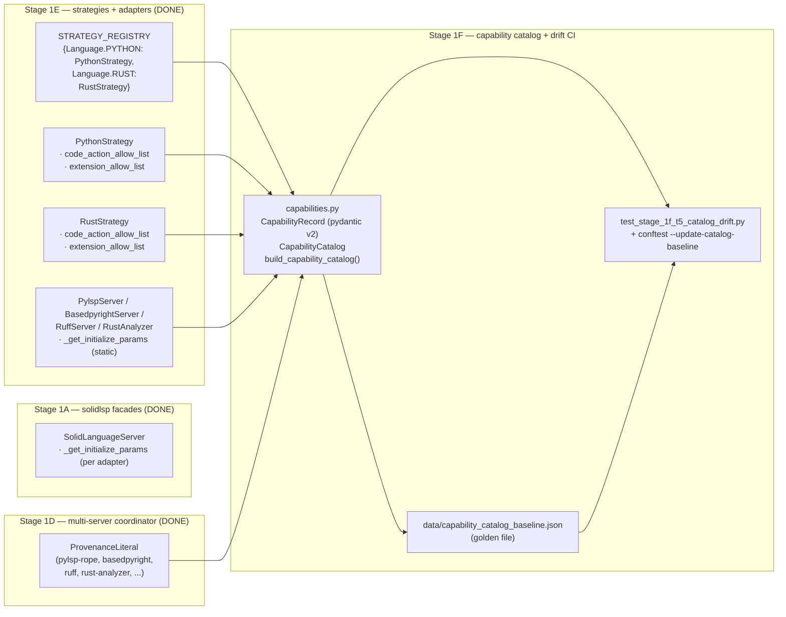
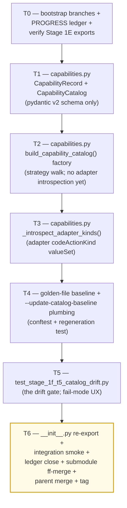

# Stage 1F — Capability Catalog + Drift CI Implementation Plan

> **For agentic workers:** REQUIRED SUB-SKILL: Use `superpowers:subagent-driven-development` (recommended) or `superpowers:executing-plans` to implement this plan task-by-task. Steps use checkbox (`- [ ]`) syntax for tracking.

**Goal:** Land the auto-introspected capability catalog + a checked-in golden-file baseline + a pytest drift detector that fails CI when the catalog changes without an explicit `--update-catalog-baseline` re-baseline. Concretely deliver: (1) `vendor/serena/src/serena/refactoring/capabilities.py` (~200 LoC) — pydantic v2 `CapabilityRecord` schema + `build_capability_catalog(strategy_registry, *, project_root)` factory that walks `STRATEGY_REGISTRY` (Stage 1E) + each strategy's `code_action_allow_list` (Stage 1E mixin) + each adapter's advertised `codeActionLiteralSupport.codeActionKind.valueSet` (Stage 1E adapters: `pylsp_server`, `basedpyright_server`, `ruff_server`, `rust_analyzer`); (2) golden-file baseline at `vendor/serena/test/spikes/data/capability_catalog_baseline.json` checked into the submodule; (3) pytest fixtures + `conftest.py` plugin under `vendor/serena/test/spikes/` exposing the `--update-catalog-baseline` CLI flag and the drift-assertion test (`test/spikes/test_stage_1f_t5_catalog_drift.py`); (4) `__init__.py` re-exports for `CapabilityRecord`, `CapabilityCatalog`, `build_capability_catalog`. Stage 1F **MUST NOT** mutate `LanguageStrategy` Protocol shape (Stage 1E froze it); the catalog reads only the public attributes already declared on the Protocol + the per-adapter `_get_initialize_params` static. The drift gate **MUST** print the exact `--update-catalog-baseline` regeneration command on failure so a human re-baseliner needs zero archaeology. Stage 1F consumes Stage 1E exports (`STRATEGY_REGISTRY`, `LanguageStrategy`, `RustStrategy`, `PythonStrategy`, `RustStrategyExtensions`, `PythonStrategyExtensions`) + Stage 1D shapes (`MergedCodeAction.kind` / `provenance` literal) + Stage 1A facade `request_code_actions` (only referenced; Stage 1F does not call live LSPs — adapters are introspected by *class*, not by spawning).

**Architecture:**



**Tech Stack:** Python 3.11+ (submodule venv), `pytest`, `pytest-asyncio`, `pydantic` v2 (already a runtime dep from Stage 1A); stdlib only for runtime (`json`, `pathlib`, `typing`, `inspect`); no new third-party deps. The catalog is built by *static introspection* — no LSP processes spawn during Stage 1F (that work belongs to Stage 1H integration). Adapter `_get_initialize_params` is a `@staticmethod`, so calling it on the class object yields the advertised `codeActionLiteralSupport.codeActionKind.valueSet` without booting a server.

**Source-of-truth references:**
- [`docs/design/mvp/2026-04-24-mvp-scope-report.md`](../../design/mvp/2026-04-24-mvp-scope-report.md) — §12 (capability catalog + dynamic registration), §12.1 `CapabilityDescriptor`, §12.3 catalog drift test, §14.1 row 15 (file budget for Stage 1F: `capabilities.py` ~200 LoC), §11.6 `ProvenanceLiteral`.
- [`docs/superpowers/plans/2026-04-24-mvp-execution-index.md`](2026-04-24-mvp-execution-index.md) — row 1F (line 29).
- [`docs/superpowers/plans/2026-04-25-stage-1e-python-strategies.md`](2026-04-25-stage-1e-python-strategies.md) — Stage 1E plan; defines `STRATEGY_REGISTRY`, the Protocol surface, and the three Python adapters that Stage 1F introspects.
- `vendor/serena/src/serena/refactoring/__init__.py` — Stage 1E re-exports; Stage 1F adds three more.
- `vendor/serena/src/serena/refactoring/language_strategy.py` — `LanguageStrategy` Protocol (frozen by Stage 1E).
- `vendor/serena/src/serena/refactoring/multi_server.py:25-32` — `ProvenanceLiteral` (the closed set of legal `source_server` values).
- `vendor/serena/src/solidlsp/language_servers/pylsp_server.py:124-137` — pylsp `codeActionKind.valueSet`.
- `vendor/serena/src/solidlsp/language_servers/basedpyright_server.py:77-127` — basedpyright init params (no codeActionLiteralSupport — basedpyright produces no code actions; pull-mode diagnostics only; the catalog records its kinds via the `PythonStrategyExtensions.CODE_ACTION_ALLOW_LIST` strategy-level filter).
- `vendor/serena/src/solidlsp/language_servers/ruff_server.py:96-106` — ruff `codeActionKind.valueSet`.
- `vendor/serena/src/solidlsp/language_servers/rust_analyzer.py` — rust-analyzer adapter (Stage 1A); its initializer advertises the rust-analyzer code-action surface.

---

## Scope check

Stage 1F is the catalog-assembly + drift-gate seam between Stage 1E (strategies + adapters now exist) and Stage 1G (primitive tools; specifically `scalpel_capabilities_list` + `scalpel_capability_describe`, which call into the catalog). Stage 1G is therefore Stage 1F's first real consumer — the catalog must surface the exact shape Stage 1G's tool will return so Stage 1G is a thin pass-through.

**In scope (this plan):**
1. `vendor/serena/src/serena/refactoring/capabilities.py` — `CapabilityRecord` schema + `CapabilityCatalog` container + `build_capability_catalog()` factory + `_introspect_adapter_kinds()` helper (~200 LoC).
2. `vendor/serena/src/serena/refactoring/__init__.py` — re-export `CapabilityRecord`, `CapabilityCatalog`, `build_capability_catalog` (~5 LoC delta).
3. `vendor/serena/test/spikes/data/capability_catalog_baseline.json` — initial checked-in golden file (committed in T4).
4. `vendor/serena/test/spikes/conftest.py` — `--update-catalog-baseline` pytest CLI option + `capability_catalog_baseline_path` fixture (~25 LoC delta).
5. `vendor/serena/test/spikes/test_stage_1f_t1_capability_record_schema.py` — schema tests.
6. `vendor/serena/test/spikes/test_stage_1f_t2_build_catalog.py` — factory tests.
7. `vendor/serena/test/spikes/test_stage_1f_t3_adapter_introspection.py` — adapter-kind extraction tests.
8. `vendor/serena/test/spikes/test_stage_1f_t4_baseline_round_trip.py` — JSON serialization + regeneration tests.
9. `vendor/serena/test/spikes/test_stage_1f_t5_catalog_drift.py` — the drift gate.

**Out of scope (deferred):**
- `scalpel_capabilities_list` / `scalpel_capability_describe` MCP tools — **Stage 1G** (file 16 of §14.1 / `primitive_tools.py`). Stage 1F delivers the catalog; Stage 1G wraps it as MCP tools.
- `preferred_facade` field on `CapabilityRecord` — populated in **Stage 2A** when ergonomic facades land. Stage 1F leaves the field present-but-`None` so the schema is forward-compatible.
- `applies_to_kinds` field on `CapabilityRecord` (per §12.1 `CapabilityDescriptor`) — needs symbol-kind taxonomy not built at MVP. Stage 1F omits it; Stage 2A adds it when facades need it.
- Per-language catalog *content* fixture realism — Stage 1F's catalog reflects **what the strategies + adapters declare** (not a hand-curated list of "useful" capabilities). Curation happens in Stage 1G's tool docstrings.
- Live-LSP catalog cross-check (the §12.3 "every capability_id resolves at runtime" assertion) — **Stage 1H** integration tests do this against live `calcrs` + `calcpy` fixtures.
- Plugin/skill code-generator (`o2-scalpel-newplugin`) — **Stage 1J** (consumes the Stage 1F catalog to render per-language skill markdown).

## File structure

| # | Path (under `vendor/serena/`) | Change | LoC | Responsibility |
|---|---|---|---|---|
| 15 | `src/serena/refactoring/capabilities.py` | New | ~200 | `CapabilityRecord` (pydantic v2 model with `id`, `language`, `kind`, `source_server`, `params_schema`, `preferred_facade`, `extension_allow_list`); `CapabilityCatalog` (immutable container with `to_json` / `from_json` + sorted `records`); `build_capability_catalog(strategy_registry, *, project_root=None)` factory; `_introspect_adapter_kinds(adapter_cls, repository_absolute_path)` helper. |
| 14 | `src/serena/refactoring/__init__.py` | Modify | +~5 | Re-export `CapabilityRecord`, `CapabilityCatalog`, `build_capability_catalog`. |
| — | `test/spikes/data/capability_catalog_baseline.json` | New | data file (~120 records) | Golden snapshot of the catalog at Stage 1F commit time; regenerated via `pytest --update-catalog-baseline`. |
| — | `test/spikes/conftest.py` | Modify | +~25 | `pytest_addoption(--update-catalog-baseline)` + `capability_catalog_baseline_path` fixture. |
| — | `test/spikes/test_stage_1f_t1_capability_record_schema.py` | New | ~70 | Pydantic v2 schema tests for `CapabilityRecord` + `CapabilityCatalog`. |
| — | `test/spikes/test_stage_1f_t2_build_catalog.py` | New | ~110 | `build_capability_catalog()` factory tests against `STRATEGY_REGISTRY`. |
| — | `test/spikes/test_stage_1f_t3_adapter_introspection.py` | New | ~90 | `_introspect_adapter_kinds()` against the four real adapter classes. |
| — | `test/spikes/test_stage_1f_t4_baseline_round_trip.py` | New | ~70 | `CapabilityCatalog.to_json` / `from_json` symmetry; baseline regeneration writes a stable byte-for-byte file. |
| — | `test/spikes/test_stage_1f_t5_catalog_drift.py` | New | ~80 | The drift gate: live catalog vs. checked-in golden. Failure prints the exact regeneration command. |

**LoC budget (production):** 200 + 5 = **205 LoC** (matches §14.1 row 15 budget exactly). Tests +~420 LoC. Data file ~120 records (~3 KB JSON).

## Dependency graph



T0 verifies Stage 1E landed cleanly. T1 is the schema-only base; every later task imports from it. T2 wires the strategy walk (no adapter dependency yet — uses the strategies' `code_action_allow_list` directly). T3 enriches the catalog by also reading the adapter `codeActionKind.valueSet` so capabilities advertised by the LSP wire are surfaced even if the strategy whitelist is broader (intersection logic). T4 introduces the regeneration UX so T5 can use it. T5 is the gate. T6 closes everything.

## Conventions enforced (from Phase 0 + Stage 1A–1E)

- **Submodule git-flow**: feature branch `feature/stage-1f-capability-catalog` opened in both parent and `vendor/serena` submodule (T0 verifies). Submodule was not git-flow-initialized; same direct `feature/<name>` pattern as 1A/1B/1C/1D/1E; ff-merge to `main` at T6; parent bumps pointer; parent merges feature branch to `develop`.
- **Author**: AI Hive(R) on every commit; never "Claude". Trailer: `Co-Authored-By: AI Hive(R) <noreply@o2.services>`.
- **Field name `code_language=`** on `LanguageServerConfig` (verified at `ls_config.py:596`). Stage 1F never instantiates an adapter at runtime; this is a reminder for T3 reviewers.
- **PROGRESS.md updates as separate commits**, never `--amend`. Each task ends in two commits: code commit (in submodule) + ledger update (in parent).
- **Test command**: from `vendor/serena/`, run `PATH="$(pwd)/.venv/bin:$PATH" .venv/bin/pytest <path> -v`.
- **`pytest-asyncio`** is on the venv (Stage 1A confirmed). Stage 1F tests are synchronous — no `@pytest.mark.asyncio` needed.
- **Type hints + pydantic v2** at every schema boundary; `Field(...)` validators where needed; `Literal[...]` for closed enums (`source_server` uses the `ProvenanceLiteral` re-imported from `multi_server.py`).
- **JSON canonicalisation rule**: every `to_json` call uses `json.dumps(..., indent=2, sort_keys=True, ensure_ascii=True) + "\n"`. The trailing newline matters — POSIX text files end in `\n` and `git diff` whines without it. T4 step 5 has an explicit assertion.
- **Sorted-records invariant**: `CapabilityCatalog.records` is sorted by `(language, source_server, kind, id)` so the baseline file is diff-stable across builds. T1 step 4 enforces.
- **Frozen pydantic models**: `CapabilityRecord(model_config=ConfigDict(frozen=True))` so a record cannot be mutated after construction. T1 step 5 enforces.
- **No live LSP spawn in Stage 1F tests**: T3 reads `_get_initialize_params` as a static method on the class object. This is the *only* legal way to introspect the wire-advertised kinds without booting a server. If a future adapter makes `_get_initialize_params` an instance method, the Stage 1F factory raises `CatalogIntrospectionError` with an actionable message; that path is tested in T3 step 5.
- **Drift gate UX**: on diff, the test message contains the literal string `"To re-baseline, run: pytest test/spikes/test_stage_1f_t5_catalog_drift.py --update-catalog-baseline"` (T5 step 4 enforces). No archaeology.

## Progress ledger

A new ledger `docs/superpowers/plans/stage-1f-results/PROGRESS.md` is created in T0. Schema mirrors Stage 1E: per-task row with task id, branch SHA (submodule), outcome, follow-ups. Updated as a separate parent commit after each task completes.

---

### Task 0: Bootstrap branches + PROGRESS ledger + verify Stage 1E exports

**Files:**
- Create: `docs/superpowers/plans/stage-1f-results/PROGRESS.md`
- Verify: parent already on `feature/plan-stage-1f` (planning branch); will create `feature/stage-1f-capability-catalog` in submodule.
- No code files modified in T0 (verification + ledger only).

- [ ] **Step 1: Confirm parent branch exists and is checked out**

Run:
```bash
git -C /Volumes/Unitek-B/Projects/o2-scalpel rev-parse --abbrev-ref HEAD
```

Expected: prints `feature/plan-stage-1f`. The implementation branch (`feature/stage-1f-capability-catalog`) is opened in step 2 once we transition from planning to execution; for the duration of *writing* this plan file, parent stays on `feature/plan-stage-1f`. The submodule branch is opened immediately in step 2 because submodule code starts changing in T1.

- [ ] **Step 2: Open submodule feature branch off `main`**

Run:
```bash
cd /Volumes/Unitek-B/Projects/o2-scalpel/vendor/serena
git fetch origin
git checkout -B feature/stage-1f-capability-catalog origin/main
git rev-parse HEAD  # capture this as the Stage 1F entry SHA in PROGRESS step 5
```

Expected: HEAD points at `origin/main` tip (the SHA Stage 1E ff-merged into main per memory note `project_stage_1e_complete`). If `origin/main` is not the latest Stage 1E tip, abort and reconcile manually — Stage 1F must be built on the strategies + adapters Stage 1E delivered.

- [ ] **Step 3: Confirm Stage 1E exports exist**

Run:
```bash
cd /Volumes/Unitek-B/Projects/o2-scalpel/vendor/serena
PATH="$(pwd)/.venv/bin:$PATH" .venv/bin/python -c "
from serena.refactoring import (
    STRATEGY_REGISTRY,
    LanguageStrategy,
    PythonStrategy,
    RustStrategy,
    PythonStrategyExtensions,
    RustStrategyExtensions,
)
from serena.refactoring.multi_server import ProvenanceLiteral
print('STRATEGY_REGISTRY keys:', sorted(k.value for k in STRATEGY_REGISTRY))
print('PythonStrategy.code_action_allow_list size:', len(PythonStrategy.code_action_allow_list))
print('RustStrategy.code_action_allow_list size:', len(RustStrategy.code_action_allow_list))
"
```

Expected output:
```
STRATEGY_REGISTRY keys: ['python', 'rust']
PythonStrategy.code_action_allow_list size: 7
RustStrategy.code_action_allow_list size: 6
```

If either size is zero, Stage 1E regressed and Stage 1F must not start.

- [ ] **Step 4: Confirm adapter `_get_initialize_params` is callable as a static method**

Run:
```bash
cd /Volumes/Unitek-B/Projects/o2-scalpel/vendor/serena
PATH="$(pwd)/.venv/bin:$PATH" .venv/bin/python -c "
import inspect
from solidlsp.language_servers.pylsp_server import PylspServer
from solidlsp.language_servers.basedpyright_server import BasedpyrightServer
from solidlsp.language_servers.ruff_server import RuffServer
from solidlsp.language_servers.rust_analyzer import RustAnalyzer
for cls in (PylspServer, BasedpyrightServer, RuffServer, RustAnalyzer):
    fn = inspect.getattr_static(cls, '_get_initialize_params')
    assert isinstance(fn, staticmethod), f'{cls.__name__}._get_initialize_params is not a staticmethod'
    print(cls.__name__, 'OK (staticmethod)')
"
```

Expected: four `OK (staticmethod)` lines. If any one prints a non-staticmethod, T3 must use a workaround (instantiate a stub adapter) — file an open question in PROGRESS Decisions log.

- [ ] **Step 5: Create the PROGRESS ledger**

Write to `/Volumes/Unitek-B/Projects/o2-scalpel/docs/superpowers/plans/stage-1f-results/PROGRESS.md`:

````markdown
# Stage 1F — Capability Catalog + Drift CI — Progress Ledger

Started: 2026-04-25
Branch: feature/stage-1f-capability-catalog (submodule); feature/plan-stage-1f (parent during planning) → feature/stage-1f-capability-catalog (parent during execution)
Author: AI Hive(R)
Built on: stage-1e-python-strategies-complete

| Task | Description | Branch SHA (submodule) | Outcome | Follow-up |
|---|---|---|---|---|
| T0 | Bootstrap branches + ledger + verify Stage 1E exports     | _pending_ | _pending_ | — |
| T1 | capabilities.py — CapabilityRecord + CapabilityCatalog    | _pending_ | _pending_ | — |
| T2 | capabilities.py — build_capability_catalog() factory      | _pending_ | _pending_ | — |
| T3 | capabilities.py — _introspect_adapter_kinds()             | _pending_ | _pending_ | — |
| T4 | golden-file baseline + --update-catalog-baseline plumbing | _pending_ | _pending_ | — |
| T5 | drift gate test (test_stage_1f_t5_catalog_drift.py)       | _pending_ | _pending_ | — |
| T6 | __init__.py registry + smoke + ledger close + ff-merge    | _pending_ | _pending_ | — |

## Decisions log

(append-only; one bullet per decision with date + rationale)

## Stage 1E entry baseline

- Submodule `main` head at Stage 1F start: <fill in step 2 output>
- Parent branch head at Stage 1F start: <fill in via `git rev-parse HEAD` from parent at T0 close>
- Stage 1E tag: `stage-1e-python-strategies-complete`
- Stage 1E suite green: 356/356 (per memory note `project_stage_1e_complete`)

## Source-of-truth pointers (carryover for context)

- §12.1 `CapabilityDescriptor` shape — `CapabilityRecord` is a Stage 1F superset (adds `extension_allow_list`, drops `applies_to_kinds` until Stage 2A).
- §12.3 catalog drift test — Stage 1F implements this exactly: live introspection vs. checked-in JSON, fail on diff, regenerate via CLI flag.
- §14.1 row 15 — file budget `+200 LoC` for `capabilities.py`. Stage 1F holds within this.
- §11.6 `ProvenanceLiteral` — closed set used as `CapabilityRecord.source_server` Literal type.
````

- [ ] **Step 6: Commit T0**

```bash
cd /Volumes/Unitek-B/Projects/o2-scalpel
git add docs/superpowers/plans/stage-1f-results/PROGRESS.md
git commit -m "$(cat <<'EOF'
stage-1f(t0): open progress ledger + verify Stage 1E exports

T0 verifications:
- STRATEGY_REGISTRY exposes python + rust strategies.
- PythonStrategy.code_action_allow_list size == 7 (Stage 1E mixin).
- RustStrategy.code_action_allow_list size == 6 (Stage 1E mixin).
- All four adapter _get_initialize_params are staticmethods (T3 introspection path is unblocked).

Co-Authored-By: AI Hive(R) <noreply@o2.services>
EOF
)"
git rev-parse HEAD
```

(The submodule has no code change in T0; the entry-baseline SHA captured in step 2 is the Stage 1E exit SHA — recorded in PROGRESS row T0 once the ledger is filled in.)

**Verification:**

```bash
git -C /Volumes/Unitek-B/Projects/o2-scalpel log --oneline -1
ls /Volumes/Unitek-B/Projects/o2-scalpel/docs/superpowers/plans/stage-1f-results/PROGRESS.md
```

Expected: parent commit shows the `stage-1f(t0)` subject; the ledger file exists.

---

### Task 1: `capabilities.py` — `CapabilityRecord` + `CapabilityCatalog` schema

**Files:**
- Create: `vendor/serena/src/serena/refactoring/capabilities.py`
- Create: `vendor/serena/test/spikes/test_stage_1f_t1_capability_record_schema.py`

- [ ] **Step 1: Write failing test — schema imports + field surface**

Create `/Volumes/Unitek-B/Projects/o2-scalpel/vendor/serena/test/spikes/test_stage_1f_t1_capability_record_schema.py`:

```python
"""T1 — CapabilityRecord + CapabilityCatalog schema tests."""

from __future__ import annotations

import json
from typing import get_args

import pytest
from pydantic import ValidationError


def test_capability_record_imports() -> None:
    from serena.refactoring.capabilities import CapabilityRecord  # noqa: F401
    from serena.refactoring.capabilities import CapabilityCatalog  # noqa: F401


def test_capability_record_required_fields() -> None:
    from serena.refactoring.capabilities import CapabilityRecord

    rec = CapabilityRecord(
        id="python.refactor.extract",
        language="python",
        kind="refactor.extract",
        source_server="pylsp-rope",
        params_schema={"type": "object"},
        preferred_facade=None,
        extension_allow_list=frozenset({".py", ".pyi"}),
    )
    assert rec.id == "python.refactor.extract"
    assert rec.language == "python"
    assert rec.kind == "refactor.extract"
    assert rec.source_server == "pylsp-rope"
    assert rec.params_schema == {"type": "object"}
    assert rec.preferred_facade is None
    assert rec.extension_allow_list == frozenset({".py", ".pyi"})


def test_capability_record_source_server_is_provenance_literal() -> None:
    from serena.refactoring.capabilities import CapabilityRecord
    from serena.refactoring.multi_server import ProvenanceLiteral

    legal = set(get_args(ProvenanceLiteral))
    # Stage 1F constraint: source_server MUST be a member of the closed
    # ProvenanceLiteral set so the catalog and the merger speak the same
    # vocabulary.
    for legal_value in legal:
        CapabilityRecord(
            id=f"x.{legal_value}",
            language="python",
            kind="quickfix",
            source_server=legal_value,
            params_schema={},
            preferred_facade=None,
            extension_allow_list=frozenset({".py"}),
        )

    with pytest.raises(ValidationError):
        CapabilityRecord(
            id="x.bogus",
            language="python",
            kind="quickfix",
            source_server="bogus-server",
            params_schema={},
            preferred_facade=None,
            extension_allow_list=frozenset({".py"}),
        )


def test_capability_record_is_frozen() -> None:
    from serena.refactoring.capabilities import CapabilityRecord

    rec = CapabilityRecord(
        id="python.quickfix",
        language="python",
        kind="quickfix",
        source_server="ruff",
        params_schema={},
        preferred_facade=None,
        extension_allow_list=frozenset({".py"}),
    )
    with pytest.raises(ValidationError):
        rec.id = "tampered"  # type: ignore[misc]


def test_capability_catalog_sorted_records_invariant() -> None:
    from serena.refactoring.capabilities import CapabilityCatalog, CapabilityRecord

    a = CapabilityRecord(
        id="python.zzz",
        language="python",
        kind="quickfix",
        source_server="ruff",
        params_schema={},
        preferred_facade=None,
        extension_allow_list=frozenset({".py"}),
    )
    b = CapabilityRecord(
        id="python.aaa",
        language="python",
        kind="quickfix",
        source_server="basedpyright",
        params_schema={},
        preferred_facade=None,
        extension_allow_list=frozenset({".py"}),
    )
    cat = CapabilityCatalog(records=(a, b))
    # The container reorders to the canonical sort key
    # (language, source_server, kind, id) so the JSON baseline is diff-stable.
    ids = [r.id for r in cat.records]
    assert ids == ["python.aaa", "python.zzz"]


def test_capability_catalog_to_from_json_round_trip() -> None:
    from serena.refactoring.capabilities import CapabilityCatalog, CapabilityRecord

    rec = CapabilityRecord(
        id="rust.refactor.extract",
        language="rust",
        kind="refactor.extract",
        source_server="rust-analyzer",
        params_schema={"type": "object"},
        preferred_facade=None,
        extension_allow_list=frozenset({".rs"}),
    )
    cat = CapabilityCatalog(records=(rec,))
    blob = cat.to_json()
    reloaded = CapabilityCatalog.from_json(blob)
    assert reloaded == cat
    assert blob.endswith("\n"), "JSON output must end in newline for POSIX text-file rules"


def test_capability_catalog_to_json_is_byte_stable() -> None:
    from serena.refactoring.capabilities import CapabilityCatalog, CapabilityRecord

    rec = CapabilityRecord(
        id="python.source.organizeImports",
        language="python",
        kind="source.organizeImports",
        source_server="ruff",
        params_schema={},
        preferred_facade=None,
        extension_allow_list=frozenset({".py", ".pyi"}),
    )
    cat = CapabilityCatalog(records=(rec,))
    blob_a = cat.to_json()
    blob_b = cat.to_json()
    assert blob_a == blob_b
    parsed = json.loads(blob_a)
    # sort_keys=True at the JSON level: top-level keys ascending.
    assert list(parsed.keys()) == sorted(parsed.keys())
```

Run:
```bash
cd /Volumes/Unitek-B/Projects/o2-scalpel/vendor/serena
PATH="$(pwd)/.venv/bin:$PATH" .venv/bin/pytest test/spikes/test_stage_1f_t1_capability_record_schema.py -v
```

- [ ] **Step 2: Run test to verify it fails**

Expected: `ImportError: No module named 'serena.refactoring.capabilities'` (every test errors on collection because the module does not exist yet).

- [ ] **Step 3: Write minimal implementation — schema only (factory comes in T2)**

Create `/Volumes/Unitek-B/Projects/o2-scalpel/vendor/serena/src/serena/refactoring/capabilities.py`:

```python
"""Stage 1F — capability catalog assembly + drift CI gate.

The capability catalog is the static, introspected map of every refactor /
code-action surface the o2.scalpel MCP server exposes. It is built by
walking ``STRATEGY_REGISTRY`` (Stage 1E) and intersecting each strategy's
``code_action_allow_list`` with the kinds advertised by the strategy's
adapter classes via ``codeActionLiteralSupport.codeActionKind.valueSet``.

Stage 1F delivers only the catalog + the drift gate; Stage 1G wraps the
catalog as the ``scalpel_capabilities_list`` / ``scalpel_capability_describe``
MCP tools (file 16 of §14.1).

Three exports:
  - ``CapabilityRecord`` — pydantic v2 immutable model for one row.
  - ``CapabilityCatalog`` — immutable container with deterministic JSON
    serialisation (sorted records, sort_keys, trailing newline).
  - ``build_capability_catalog`` — the factory; T2 + T3 fill it in.

Source-of-truth: ``docs/design/mvp/2026-04-24-mvp-scope-report.md`` §12.
"""

from __future__ import annotations

import json
from typing import Any, Mapping

from pydantic import BaseModel, ConfigDict, Field, field_serializer

from .multi_server import ProvenanceLiteral


class CapabilityRecord(BaseModel):
    """One row of the capability catalog.

    Stage 1F superset of §12.1 ``CapabilityDescriptor``:
      - adds ``extension_allow_list`` (per-language file-suffix gate).
      - omits ``applies_to_kinds`` (deferred to Stage 2A; symbol-kind
        taxonomy not built at MVP).
      - keeps ``preferred_facade`` as ``None`` placeholder until Stage 2A
        ergonomic facades land (forward-compatible schema).

    Frozen: a record is identity once built. Catalog mutations happen by
    rebuilding the catalog from scratch via ``build_capability_catalog``.
    """

    model_config = ConfigDict(frozen=True, extra="forbid")

    id: str = Field(min_length=1)
    language: str = Field(min_length=1)
    kind: str = Field(min_length=1)
    source_server: ProvenanceLiteral
    params_schema: Mapping[str, Any] = Field(default_factory=dict)
    preferred_facade: str | None = None
    extension_allow_list: frozenset[str] = Field(default_factory=frozenset)

    @field_serializer("extension_allow_list")
    def _serialize_extensions(self, value: frozenset[str]) -> list[str]:
        # JSON has no frozenset; emit a sorted list so the baseline is stable.
        return sorted(value)

    @field_serializer("params_schema")
    def _serialize_params(self, value: Mapping[str, Any]) -> dict[str, Any]:
        return dict(value)


class CapabilityCatalog(BaseModel):
    """Immutable container of ``CapabilityRecord`` rows.

    Sort invariant: records are kept in ``(language, source_server, kind, id)``
    order so the ``to_json`` output is byte-stable across runs and the
    checked-in golden file diffs cleanly.
    """

    model_config = ConfigDict(frozen=True, extra="forbid")

    records: tuple[CapabilityRecord, ...] = Field(default_factory=tuple)

    def model_post_init(self, __context: Any) -> None:
        # Re-sort on construction so every catalog (built by factory or
        # loaded from JSON) shares the same iteration order.
        sorted_records = tuple(
            sorted(
                self.records,
                key=lambda r: (r.language, r.source_server, r.kind, r.id),
            )
        )
        if sorted_records != self.records:
            # Frozen — bypass attribute assignment via __dict__ once.
            object.__setattr__(self, "records", sorted_records)

    def to_json(self) -> str:
        """Return canonical JSON: indent=2, sort_keys, trailing newline."""
        payload = {
            "schema_version": 1,
            "records": [r.model_dump(mode="json") for r in self.records],
        }
        return json.dumps(payload, indent=2, sort_keys=True, ensure_ascii=True) + "\n"

    @classmethod
    def from_json(cls, blob: str) -> "CapabilityCatalog":
        payload = json.loads(blob)
        if not isinstance(payload, dict) or payload.get("schema_version") != 1:
            raise ValueError(
                "capability catalog JSON missing schema_version=1; "
                "regenerate via `pytest --update-catalog-baseline`"
            )
        records = tuple(
            CapabilityRecord(
                id=r["id"],
                language=r["language"],
                kind=r["kind"],
                source_server=r["source_server"],
                params_schema=r.get("params_schema", {}),
                preferred_facade=r.get("preferred_facade"),
                extension_allow_list=frozenset(r.get("extension_allow_list", [])),
            )
            for r in payload.get("records", [])
        )
        return cls(records=records)


def build_capability_catalog(
    strategy_registry: Mapping[Any, type] | None = None,
    *,
    project_root: Any = None,
) -> CapabilityCatalog:
    """Stage 1F factory — T2 fills in the strategy walk; T3 adds adapter introspection.

    Stage 1F T1 lands a stub that returns an empty catalog so the schema
    tests can assert importability without forcing a strategy-walk. T2's
    failing test is what drives the real implementation.
    """
    return CapabilityCatalog(records=())
```

Run:
```bash
cd /Volumes/Unitek-B/Projects/o2-scalpel/vendor/serena
PATH="$(pwd)/.venv/bin:$PATH" .venv/bin/pytest test/spikes/test_stage_1f_t1_capability_record_schema.py -v
```

- [ ] **Step 4: Run test to verify it passes**

Expected: 7 passing tests. If any fail:
- `frozen` failure → confirm `model_config = ConfigDict(frozen=True)` on both models.
- `byte stable` failure → confirm `json.dumps(..., sort_keys=True)` and trailing newline.
- `ProvenanceLiteral` failure → confirm `from .multi_server import ProvenanceLiteral` and the field type annotation.

- [ ] **Step 5: Commit T1**

```bash
cd /Volumes/Unitek-B/Projects/o2-scalpel/vendor/serena
git add src/serena/refactoring/capabilities.py test/spikes/test_stage_1f_t1_capability_record_schema.py
git commit -m "$(cat <<'EOF'
stage-1f(t1): CapabilityRecord + CapabilityCatalog pydantic v2 schema

- CapabilityRecord (frozen) with source_server typed as ProvenanceLiteral.
- CapabilityCatalog (frozen) with sort-on-construct invariant
  (language, source_server, kind, id) for diff-stable JSON.
- to_json: indent=2 + sort_keys=True + trailing newline.
- from_json: round-trip symmetric; schema_version=1 guard.
- build_capability_catalog stub returns empty catalog (T2 fills in).

Tests: 7/7 green.

Co-Authored-By: AI Hive(R) <noreply@o2.services>
EOF
)"
git rev-parse HEAD  # paste into PROGRESS row T1
```

Then update the parent ledger:
```bash
cd /Volumes/Unitek-B/Projects/o2-scalpel
# Edit docs/superpowers/plans/stage-1f-results/PROGRESS.md row T1: paste SHA + outcome=GREEN
git add docs/superpowers/plans/stage-1f-results/PROGRESS.md
git commit -m "$(cat <<'EOF'
stage-1f(t1): ledger update — schema landed, 7/7 green

Co-Authored-By: AI Hive(R) <noreply@o2.services>
EOF
)"
```

---


