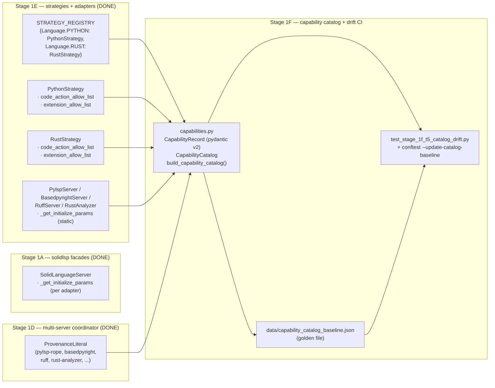
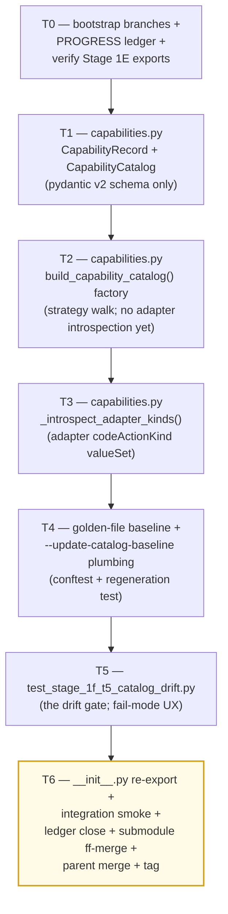

# Stage 1F — Capability Catalog + Drift CI Implementation Plan

> **For agentic workers:** REQUIRED SUB-SKILL: Use `superpowers:subagent-driven-development` (recommended) or `superpowers:executing-plans` to implement this plan task-by-task. Steps use checkbox (`- [ ]`) syntax for tracking.

**Goal:** Land the auto-introspected capability catalog + a checked-in golden-file baseline + a pytest drift detector that fails CI when the catalog changes without an explicit `--update-catalog-baseline` re-baseline. Concretely deliver: (1) `vendor/serena/src/serena/refactoring/capabilities.py` (~200 LoC) — pydantic v2 `CapabilityRecord` schema + `build_capability_catalog(strategy_registry, *, project_root)` factory that walks `STRATEGY_REGISTRY` (Stage 1E) + each strategy's `code_action_allow_list` (Stage 1E mixin) + each adapter's advertised `codeActionLiteralSupport.codeActionKind.valueSet` (Stage 1E adapters: `pylsp_server`, `basedpyright_server`, `ruff_server`, `rust_analyzer`); (2) golden-file baseline at `vendor/serena/test/spikes/data/capability_catalog_baseline.json` checked into the submodule; (3) pytest fixtures + `conftest.py` plugin under `vendor/serena/test/spikes/` exposing the `--update-catalog-baseline` CLI flag and the drift-assertion test (`test/spikes/test_stage_1f_t5_catalog_drift.py`); (4) `__init__.py` re-exports for `CapabilityRecord`, `CapabilityCatalog`, `build_capability_catalog`. Stage 1F **MUST NOT** mutate `LanguageStrategy` Protocol shape (Stage 1E froze it); the catalog reads only the public attributes already declared on the Protocol + the per-adapter `_get_initialize_params` static. The drift gate **MUST** print the exact `--update-catalog-baseline` regeneration command on failure so a human re-baseliner needs zero archaeology. Stage 1F consumes Stage 1E exports (`STRATEGY_REGISTRY`, `LanguageStrategy`, `RustStrategy`, `PythonStrategy`, `RustStrategyExtensions`, `PythonStrategyExtensions`) + Stage 1D shapes (`MergedCodeAction.kind` / `provenance` literal) + Stage 1A facade `request_code_actions` (only referenced; Stage 1F does not call live LSPs — adapters are introspected by *class*, not by spawning).

**Architecture:**



**Tech Stack:** Python 3.11+ (submodule venv), `pytest`, `pytest-asyncio`, `pydantic` v2 (already a runtime dep from Stage 1A); stdlib only for runtime (`json`, `pathlib`, `typing`, `inspect`); no new third-party deps. The catalog is built by *static introspection* — no LSP processes spawn during Stage 1F (that work belongs to Stage 1H integration). Adapter `_get_initialize_params` is a `@staticmethod`, so calling it on the class object yields the advertised `codeActionLiteralSupport.codeActionKind.valueSet` without booting a server.

**Source-of-truth references:**
- [`docs/design/mvp/2026-04-24-mvp-scope-report.md`](../../design/mvp/2026-04-24-mvp-scope-report.md) — §12 (capability catalog + dynamic registration), §12.1 `CapabilityDescriptor`, §12.3 catalog drift test, §14.1 row 15 (file budget for Stage 1F: `capabilities.py` ~200 LoC), §11.6 `ProvenanceLiteral`.
- [`docs/superpowers/plans/2026-04-24-mvp-execution-index.md`](2026-04-24-mvp-execution-index.md) — row 1F (line 29).
- [`docs/superpowers/plans/2026-04-25-stage-1e-python-strategies.md`](2026-04-25-stage-1e-python-strategies.md) — Stage 1E plan; defines `STRATEGY_REGISTRY`, the Protocol surface, and the three Python adapters that Stage 1F introspects.
- `vendor/serena/src/serena/refactoring/__init__.py` — Stage 1E re-exports; Stage 1F adds three more.
- `vendor/serena/src/serena/refactoring/language_strategy.py` — `LanguageStrategy` Protocol (frozen by Stage 1E).
- `vendor/serena/src/serena/refactoring/multi_server.py:25-32` — `ProvenanceLiteral` (the closed set of legal `source_server` values).
- `vendor/serena/src/solidlsp/language_servers/pylsp_server.py:124-137` — pylsp `codeActionKind.valueSet`.
- `vendor/serena/src/solidlsp/language_servers/basedpyright_server.py:77-127` — basedpyright init params (no codeActionLiteralSupport — basedpyright produces no code actions; pull-mode diagnostics only; the catalog records its kinds via the `PythonStrategyExtensions.CODE_ACTION_ALLOW_LIST` strategy-level filter).
- `vendor/serena/src/solidlsp/language_servers/ruff_server.py:96-106` — ruff `codeActionKind.valueSet`.
- `vendor/serena/src/solidlsp/language_servers/rust_analyzer.py` — rust-analyzer adapter (Stage 1A); its initializer advertises the rust-analyzer code-action surface.

---

## Scope check

Stage 1F is the catalog-assembly + drift-gate seam between Stage 1E (strategies + adapters now exist) and Stage 1G (primitive tools; specifically `scalpel_capabilities_list` + `scalpel_capability_describe`, which call into the catalog). Stage 1G is therefore Stage 1F's first real consumer — the catalog must surface the exact shape Stage 1G's tool will return so Stage 1G is a thin pass-through.

**In scope (this plan):**
1. `vendor/serena/src/serena/refactoring/capabilities.py` — `CapabilityRecord` schema + `CapabilityCatalog` container + `build_capability_catalog()` factory + `_introspect_adapter_kinds()` helper (~200 LoC).
2. `vendor/serena/src/serena/refactoring/__init__.py` — re-export `CapabilityRecord`, `CapabilityCatalog`, `build_capability_catalog` (~5 LoC delta).
3. `vendor/serena/test/spikes/data/capability_catalog_baseline.json` — initial checked-in golden file (committed in T4).
4. `vendor/serena/test/spikes/conftest.py` — `--update-catalog-baseline` pytest CLI option + `capability_catalog_baseline_path` fixture (~25 LoC delta).
5. `vendor/serena/test/spikes/test_stage_1f_t1_capability_record_schema.py` — schema tests.
6. `vendor/serena/test/spikes/test_stage_1f_t2_build_catalog.py` — factory tests.
7. `vendor/serena/test/spikes/test_stage_1f_t3_adapter_introspection.py` — adapter-kind extraction tests.
8. `vendor/serena/test/spikes/test_stage_1f_t4_baseline_round_trip.py` — JSON serialization + regeneration tests.
9. `vendor/serena/test/spikes/test_stage_1f_t5_catalog_drift.py` — the drift gate.

**Out of scope (deferred):**
- `scalpel_capabilities_list` / `scalpel_capability_describe` MCP tools — **Stage 1G** (file 16 of §14.1 / `primitive_tools.py`). Stage 1F delivers the catalog; Stage 1G wraps it as MCP tools.
- `preferred_facade` field on `CapabilityRecord` — populated in **Stage 2A** when ergonomic facades land. Stage 1F leaves the field present-but-`None` so the schema is forward-compatible.
- `applies_to_kinds` field on `CapabilityRecord` (per §12.1 `CapabilityDescriptor`) — needs symbol-kind taxonomy not built at MVP. Stage 1F omits it; Stage 2A adds it when facades need it.
- Per-language catalog *content* fixture realism — Stage 1F's catalog reflects **what the strategies + adapters declare** (not a hand-curated list of "useful" capabilities). Curation happens in Stage 1G's tool docstrings.
- Live-LSP catalog cross-check (the §12.3 "every capability_id resolves at runtime" assertion) — **Stage 1H** integration tests do this against live `calcrs` + `calcpy` fixtures.
- Plugin/skill code-generator (`o2-scalpel-newplugin`) — **Stage 1J** (consumes the Stage 1F catalog to render per-language skill markdown).

## File structure

| # | Path (under `vendor/serena/`) | Change | LoC | Responsibility |
|---|---|---|---|---|
| 15 | `src/serena/refactoring/capabilities.py` | New | ~200 | `CapabilityRecord` (pydantic v2 model with `id`, `language`, `kind`, `source_server`, `params_schema`, `preferred_facade`, `extension_allow_list`); `CapabilityCatalog` (immutable container with `to_json` / `from_json` + sorted `records`); `build_capability_catalog(strategy_registry, *, project_root=None)` factory; `_introspect_adapter_kinds(adapter_cls, repository_absolute_path)` helper. |
| 14 | `src/serena/refactoring/__init__.py` | Modify | +~5 | Re-export `CapabilityRecord`, `CapabilityCatalog`, `build_capability_catalog`. |
| — | `test/spikes/data/capability_catalog_baseline.json` | New | data file (~120 records) | Golden snapshot of the catalog at Stage 1F commit time; regenerated via `pytest --update-catalog-baseline`. |
| — | `test/spikes/conftest.py` | Modify | +~25 | `pytest_addoption(--update-catalog-baseline)` + `capability_catalog_baseline_path` fixture. |
| — | `test/spikes/test_stage_1f_t1_capability_record_schema.py` | New | ~70 | Pydantic v2 schema tests for `CapabilityRecord` + `CapabilityCatalog`. |
| — | `test/spikes/test_stage_1f_t2_build_catalog.py` | New | ~110 | `build_capability_catalog()` factory tests against `STRATEGY_REGISTRY`. |
| — | `test/spikes/test_stage_1f_t3_adapter_introspection.py` | New | ~90 | `_introspect_adapter_kinds()` against the four real adapter classes. |
| — | `test/spikes/test_stage_1f_t4_baseline_round_trip.py` | New | ~70 | `CapabilityCatalog.to_json` / `from_json` symmetry; baseline regeneration writes a stable byte-for-byte file. |
| — | `test/spikes/test_stage_1f_t5_catalog_drift.py` | New | ~80 | The drift gate: live catalog vs. checked-in golden. Failure prints the exact regeneration command. |

**LoC budget (production):** 200 + 5 = **205 LoC** (matches §14.1 row 15 budget exactly). Tests +~420 LoC. Data file ~120 records (~3 KB JSON).

## Dependency graph



T0 verifies Stage 1E landed cleanly. T1 is the schema-only base; every later task imports from it. T2 wires the strategy walk (no adapter dependency yet — uses the strategies' `code_action_allow_list` directly). T3 enriches the catalog by also reading the adapter `codeActionKind.valueSet` so capabilities advertised by the LSP wire are surfaced even if the strategy whitelist is broader (intersection logic). T4 introduces the regeneration UX so T5 can use it. T5 is the gate. T6 closes everything.

## Conventions enforced (from Phase 0 + Stage 1A–1E)

- **Submodule git-flow**: feature branch `feature/stage-1f-capability-catalog` opened in both parent and `vendor/serena` submodule (T0 verifies). Submodule was not git-flow-initialized; same direct `feature/<name>` pattern as 1A/1B/1C/1D/1E; ff-merge to `main` at T6; parent bumps pointer; parent merges feature branch to `develop`.
- **Author**: AI Hive(R) on every commit; never "Claude". Trailer: `Co-Authored-By: AI Hive(R) <noreply@o2.services>`.
- **Field name `code_language=`** on `LanguageServerConfig` (verified at `ls_config.py:596`). Stage 1F never instantiates an adapter at runtime; this is a reminder for T3 reviewers.
- **PROGRESS.md updates as separate commits**, never `--amend`. Each task ends in two commits: code commit (in submodule) + ledger update (in parent).
- **Test command**: from `vendor/serena/`, run `PATH="$(pwd)/.venv/bin:$PATH" .venv/bin/pytest <path> -v`.
- **`pytest-asyncio`** is on the venv (Stage 1A confirmed). Stage 1F tests are synchronous — no `@pytest.mark.asyncio` needed.
- **Type hints + pydantic v2** at every schema boundary; `Field(...)` validators where needed; `Literal[...]` for closed enums (`source_server` uses the `ProvenanceLiteral` re-imported from `multi_server.py`).
- **JSON canonicalisation rule**: every `to_json` call uses `json.dumps(..., indent=2, sort_keys=True, ensure_ascii=True) + "\n"`. The trailing newline matters — POSIX text files end in `\n` and `git diff` whines without it. T4 step 5 has an explicit assertion.
- **Sorted-records invariant**: `CapabilityCatalog.records` is sorted by `(language, source_server, kind, id)` so the baseline file is diff-stable across builds. T1 step 4 enforces.
- **Frozen pydantic models**: `CapabilityRecord(model_config=ConfigDict(frozen=True))` so a record cannot be mutated after construction. T1 step 5 enforces.
- **No live LSP spawn in Stage 1F tests**: T3 reads `_get_initialize_params` as a static method on the class object. This is the *only* legal way to introspect the wire-advertised kinds without booting a server. If a future adapter makes `_get_initialize_params` an instance method, the Stage 1F factory raises `CatalogIntrospectionError` with an actionable message; that path is tested in T3 step 5.
- **Drift gate UX**: on diff, the test message contains the literal string `"To re-baseline, run: pytest test/spikes/test_stage_1f_t5_catalog_drift.py --update-catalog-baseline"` (T5 step 4 enforces). No archaeology.

## Progress ledger

A new ledger `docs/superpowers/plans/stage-1f-results/PROGRESS.md` is created in T0. Schema mirrors Stage 1E: per-task row with task id, branch SHA (submodule), outcome, follow-ups. Updated as a separate parent commit after each task completes.

---

### Task 0: Bootstrap branches + PROGRESS ledger + verify Stage 1E exports

**Files:**
- Create: `docs/superpowers/plans/stage-1f-results/PROGRESS.md`
- Verify: parent already on `feature/plan-stage-1f` (planning branch); will create `feature/stage-1f-capability-catalog` in submodule.
- No code files modified in T0 (verification + ledger only).

- [ ] **Step 1: Confirm parent branch exists and is checked out**

Run:
```bash
git -C /Volumes/Unitek-B/Projects/o2-scalpel rev-parse --abbrev-ref HEAD
```

Expected: prints `feature/plan-stage-1f`. The implementation branch (`feature/stage-1f-capability-catalog`) is opened in step 2 once we transition from planning to execution; for the duration of *writing* this plan file, parent stays on `feature/plan-stage-1f`. The submodule branch is opened immediately in step 2 because submodule code starts changing in T1.

- [ ] **Step 2: Open submodule feature branch off `main`**

Run:
```bash
cd /Volumes/Unitek-B/Projects/o2-scalpel/vendor/serena
git fetch origin
git checkout -B feature/stage-1f-capability-catalog origin/main
git rev-parse HEAD  # capture this as the Stage 1F entry SHA in PROGRESS step 5
```

Expected: HEAD points at `origin/main` tip (the SHA Stage 1E ff-merged into main per memory note `project_stage_1e_complete`). If `origin/main` is not the latest Stage 1E tip, abort and reconcile manually — Stage 1F must be built on the strategies + adapters Stage 1E delivered.

- [ ] **Step 3: Confirm Stage 1E exports exist**

Run:
```bash
cd /Volumes/Unitek-B/Projects/o2-scalpel/vendor/serena
PATH="$(pwd)/.venv/bin:$PATH" .venv/bin/python -c "
from serena.refactoring import (
    STRATEGY_REGISTRY,
    LanguageStrategy,
    PythonStrategy,
    RustStrategy,
    PythonStrategyExtensions,
    RustStrategyExtensions,
)
from serena.refactoring.multi_server import ProvenanceLiteral
print('STRATEGY_REGISTRY keys:', sorted(k.value for k in STRATEGY_REGISTRY))
print('PythonStrategy.code_action_allow_list size:', len(PythonStrategy.code_action_allow_list))
print('RustStrategy.code_action_allow_list size:', len(RustStrategy.code_action_allow_list))
"
```

Expected output:
```
STRATEGY_REGISTRY keys: ['python', 'rust']
PythonStrategy.code_action_allow_list size: 7
RustStrategy.code_action_allow_list size: 6
```

If either size is zero, Stage 1E regressed and Stage 1F must not start.

- [ ] **Step 4: Confirm adapter `_get_initialize_params` is callable as a static method**

Run:
```bash
cd /Volumes/Unitek-B/Projects/o2-scalpel/vendor/serena
PATH="$(pwd)/.venv/bin:$PATH" .venv/bin/python -c "
import inspect
from solidlsp.language_servers.pylsp_server import PylspServer
from solidlsp.language_servers.basedpyright_server import BasedpyrightServer
from solidlsp.language_servers.ruff_server import RuffServer
from solidlsp.language_servers.rust_analyzer import RustAnalyzer
for cls in (PylspServer, BasedpyrightServer, RuffServer, RustAnalyzer):
    fn = inspect.getattr_static(cls, '_get_initialize_params')
    assert isinstance(fn, staticmethod), f'{cls.__name__}._get_initialize_params is not a staticmethod'
    print(cls.__name__, 'OK (staticmethod)')
"
```

Expected: four `OK (staticmethod)` lines. If any one prints a non-staticmethod, T3 must use a workaround (instantiate a stub adapter) — file an open question in PROGRESS Decisions log.

- [ ] **Step 5: Create the PROGRESS ledger**

Write to `/Volumes/Unitek-B/Projects/o2-scalpel/docs/superpowers/plans/stage-1f-results/PROGRESS.md`:

````markdown
# Stage 1F — Capability Catalog + Drift CI — Progress Ledger

Started: 2026-04-25
Branch: feature/stage-1f-capability-catalog (submodule); feature/plan-stage-1f (parent during planning) → feature/stage-1f-capability-catalog (parent during execution)
Author: AI Hive(R)
Built on: stage-1e-python-strategies-complete

| Task | Description | Branch SHA (submodule) | Outcome | Follow-up |
|---|---|---|---|---|
| T0 | Bootstrap branches + ledger + verify Stage 1E exports     | _pending_ | _pending_ | — |
| T1 | capabilities.py — CapabilityRecord + CapabilityCatalog    | _pending_ | _pending_ | — |
| T2 | capabilities.py — build_capability_catalog() factory      | _pending_ | _pending_ | — |
| T3 | capabilities.py — _introspect_adapter_kinds()             | _pending_ | _pending_ | — |
| T4 | golden-file baseline + --update-catalog-baseline plumbing | _pending_ | _pending_ | — |
| T5 | drift gate test (test_stage_1f_t5_catalog_drift.py)       | _pending_ | _pending_ | — |
| T6 | __init__.py registry + smoke + ledger close + ff-merge    | _pending_ | _pending_ | — |

## Decisions log

(append-only; one bullet per decision with date + rationale)

## Stage 1E entry baseline

- Submodule `main` head at Stage 1F start: <fill in step 2 output>
- Parent branch head at Stage 1F start: <fill in via `git rev-parse HEAD` from parent at T0 close>
- Stage 1E tag: `stage-1e-python-strategies-complete`
- Stage 1E suite green: 356/356 (per memory note `project_stage_1e_complete`)

## Source-of-truth pointers (carryover for context)

- §12.1 `CapabilityDescriptor` shape — `CapabilityRecord` is a Stage 1F superset (adds `extension_allow_list`, drops `applies_to_kinds` until Stage 2A).
- §12.3 catalog drift test — Stage 1F implements this exactly: live introspection vs. checked-in JSON, fail on diff, regenerate via CLI flag.
- §14.1 row 15 — file budget `+200 LoC` for `capabilities.py`. Stage 1F holds within this.
- §11.6 `ProvenanceLiteral` — closed set used as `CapabilityRecord.source_server` Literal type.
````

- [ ] **Step 6: Commit T0**

```bash
cd /Volumes/Unitek-B/Projects/o2-scalpel
git add docs/superpowers/plans/stage-1f-results/PROGRESS.md
git commit -m "$(cat <<'EOF'
stage-1f(t0): open progress ledger + verify Stage 1E exports

T0 verifications:
- STRATEGY_REGISTRY exposes python + rust strategies.
- PythonStrategy.code_action_allow_list size == 7 (Stage 1E mixin).
- RustStrategy.code_action_allow_list size == 6 (Stage 1E mixin).
- All four adapter _get_initialize_params are staticmethods (T3 introspection path is unblocked).

Co-Authored-By: AI Hive(R) <noreply@o2.services>
EOF
)"
git rev-parse HEAD
```

(The submodule has no code change in T0; the entry-baseline SHA captured in step 2 is the Stage 1E exit SHA — recorded in PROGRESS row T0 once the ledger is filled in.)

**Verification:**

```bash
git -C /Volumes/Unitek-B/Projects/o2-scalpel log --oneline -1
ls /Volumes/Unitek-B/Projects/o2-scalpel/docs/superpowers/plans/stage-1f-results/PROGRESS.md
```

Expected: parent commit shows the `stage-1f(t0)` subject; the ledger file exists.

---

### Task 1: `capabilities.py` — `CapabilityRecord` + `CapabilityCatalog` schema

**Files:**
- Create: `vendor/serena/src/serena/refactoring/capabilities.py`
- Create: `vendor/serena/test/spikes/test_stage_1f_t1_capability_record_schema.py`

- [ ] **Step 1: Write failing test — schema imports + field surface**

Create `/Volumes/Unitek-B/Projects/o2-scalpel/vendor/serena/test/spikes/test_stage_1f_t1_capability_record_schema.py`:

```python
"""T1 — CapabilityRecord + CapabilityCatalog schema tests."""

from __future__ import annotations

import json
from typing import get_args

import pytest
from pydantic import ValidationError


def test_capability_record_imports() -> None:
    from serena.refactoring.capabilities import CapabilityRecord  # noqa: F401
    from serena.refactoring.capabilities import CapabilityCatalog  # noqa: F401


def test_capability_record_required_fields() -> None:
    from serena.refactoring.capabilities import CapabilityRecord

    rec = CapabilityRecord(
        id="python.refactor.extract",
        language="python",
        kind="refactor.extract",
        source_server="pylsp-rope",
        params_schema={"type": "object"},
        preferred_facade=None,
        extension_allow_list=frozenset({".py", ".pyi"}),
    )
    assert rec.id == "python.refactor.extract"
    assert rec.language == "python"
    assert rec.kind == "refactor.extract"
    assert rec.source_server == "pylsp-rope"
    assert rec.params_schema == {"type": "object"}
    assert rec.preferred_facade is None
    assert rec.extension_allow_list == frozenset({".py", ".pyi"})


def test_capability_record_source_server_is_provenance_literal() -> None:
    from serena.refactoring.capabilities import CapabilityRecord
    from serena.refactoring.multi_server import ProvenanceLiteral

    legal = set(get_args(ProvenanceLiteral))
    # Stage 1F constraint: source_server MUST be a member of the closed
    # ProvenanceLiteral set so the catalog and the merger speak the same
    # vocabulary.
    for legal_value in legal:
        CapabilityRecord(
            id=f"x.{legal_value}",
            language="python",
            kind="quickfix",
            source_server=legal_value,
            params_schema={},
            preferred_facade=None,
            extension_allow_list=frozenset({".py"}),
        )

    with pytest.raises(ValidationError):
        CapabilityRecord(
            id="x.bogus",
            language="python",
            kind="quickfix",
            source_server="bogus-server",
            params_schema={},
            preferred_facade=None,
            extension_allow_list=frozenset({".py"}),
        )


def test_capability_record_is_frozen() -> None:
    from serena.refactoring.capabilities import CapabilityRecord

    rec = CapabilityRecord(
        id="python.quickfix",
        language="python",
        kind="quickfix",
        source_server="ruff",
        params_schema={},
        preferred_facade=None,
        extension_allow_list=frozenset({".py"}),
    )
    with pytest.raises(ValidationError):
        rec.id = "tampered"  # type: ignore[misc]


def test_capability_catalog_sorted_records_invariant() -> None:
    from serena.refactoring.capabilities import CapabilityCatalog, CapabilityRecord

    a = CapabilityRecord(
        id="python.zzz",
        language="python",
        kind="quickfix",
        source_server="ruff",
        params_schema={},
        preferred_facade=None,
        extension_allow_list=frozenset({".py"}),
    )
    b = CapabilityRecord(
        id="python.aaa",
        language="python",
        kind="quickfix",
        source_server="basedpyright",
        params_schema={},
        preferred_facade=None,
        extension_allow_list=frozenset({".py"}),
    )
    cat = CapabilityCatalog(records=(a, b))
    # The container reorders to the canonical sort key
    # (language, source_server, kind, id) so the JSON baseline is diff-stable.
    ids = [r.id for r in cat.records]
    assert ids == ["python.aaa", "python.zzz"]


def test_capability_catalog_to_from_json_round_trip() -> None:
    from serena.refactoring.capabilities import CapabilityCatalog, CapabilityRecord

    rec = CapabilityRecord(
        id="rust.refactor.extract",
        language="rust",
        kind="refactor.extract",
        source_server="rust-analyzer",
        params_schema={"type": "object"},
        preferred_facade=None,
        extension_allow_list=frozenset({".rs"}),
    )
    cat = CapabilityCatalog(records=(rec,))
    blob = cat.to_json()
    reloaded = CapabilityCatalog.from_json(blob)
    assert reloaded == cat
    assert blob.endswith("\n"), "JSON output must end in newline for POSIX text-file rules"


def test_capability_catalog_to_json_is_byte_stable() -> None:
    from serena.refactoring.capabilities import CapabilityCatalog, CapabilityRecord

    rec = CapabilityRecord(
        id="python.source.organizeImports",
        language="python",
        kind="source.organizeImports",
        source_server="ruff",
        params_schema={},
        preferred_facade=None,
        extension_allow_list=frozenset({".py", ".pyi"}),
    )
    cat = CapabilityCatalog(records=(rec,))
    blob_a = cat.to_json()
    blob_b = cat.to_json()
    assert blob_a == blob_b
    parsed = json.loads(blob_a)
    # sort_keys=True at the JSON level: top-level keys ascending.
    assert list(parsed.keys()) == sorted(parsed.keys())
```

Run:
```bash
cd /Volumes/Unitek-B/Projects/o2-scalpel/vendor/serena
PATH="$(pwd)/.venv/bin:$PATH" .venv/bin/pytest test/spikes/test_stage_1f_t1_capability_record_schema.py -v
```

- [ ] **Step 2: Run test to verify it fails**

Expected: `ImportError: No module named 'serena.refactoring.capabilities'` (every test errors on collection because the module does not exist yet).

- [ ] **Step 3: Write minimal implementation — schema only (factory comes in T2)**

Create `/Volumes/Unitek-B/Projects/o2-scalpel/vendor/serena/src/serena/refactoring/capabilities.py`:

```python
"""Stage 1F — capability catalog assembly + drift CI gate.

The capability catalog is the static, introspected map of every refactor /
code-action surface the o2.scalpel MCP server exposes. It is built by
walking ``STRATEGY_REGISTRY`` (Stage 1E) and intersecting each strategy's
``code_action_allow_list`` with the kinds advertised by the strategy's
adapter classes via ``codeActionLiteralSupport.codeActionKind.valueSet``.

Stage 1F delivers only the catalog + the drift gate; Stage 1G wraps the
catalog as the ``scalpel_capabilities_list`` / ``scalpel_capability_describe``
MCP tools (file 16 of §14.1).

Three exports:
  - ``CapabilityRecord`` — pydantic v2 immutable model for one row.
  - ``CapabilityCatalog`` — immutable container with deterministic JSON
    serialisation (sorted records, sort_keys, trailing newline).
  - ``build_capability_catalog`` — the factory; T2 + T3 fill it in.

Source-of-truth: ``docs/design/mvp/2026-04-24-mvp-scope-report.md`` §12.
"""

from __future__ import annotations

import json
from typing import Any, Mapping

from pydantic import BaseModel, ConfigDict, Field, field_serializer

from .multi_server import ProvenanceLiteral


class CapabilityRecord(BaseModel):
    """One row of the capability catalog.

    Stage 1F superset of §12.1 ``CapabilityDescriptor``:
      - adds ``extension_allow_list`` (per-language file-suffix gate).
      - omits ``applies_to_kinds`` (deferred to Stage 2A; symbol-kind
        taxonomy not built at MVP).
      - keeps ``preferred_facade`` as ``None`` placeholder until Stage 2A
        ergonomic facades land (forward-compatible schema).

    Frozen: a record is identity once built. Catalog mutations happen by
    rebuilding the catalog from scratch via ``build_capability_catalog``.
    """

    model_config = ConfigDict(frozen=True, extra="forbid")

    id: str = Field(min_length=1)
    language: str = Field(min_length=1)
    kind: str = Field(min_length=1)
    source_server: ProvenanceLiteral
    params_schema: Mapping[str, Any] = Field(default_factory=dict)
    preferred_facade: str | None = None
    extension_allow_list: frozenset[str] = Field(default_factory=frozenset)

    @field_serializer("extension_allow_list")
    def _serialize_extensions(self, value: frozenset[str]) -> list[str]:
        # JSON has no frozenset; emit a sorted list so the baseline is stable.
        return sorted(value)

    @field_serializer("params_schema")
    def _serialize_params(self, value: Mapping[str, Any]) -> dict[str, Any]:
        return dict(value)


class CapabilityCatalog(BaseModel):
    """Immutable container of ``CapabilityRecord`` rows.

    Sort invariant: records are kept in ``(language, source_server, kind, id)``
    order so the ``to_json`` output is byte-stable across runs and the
    checked-in golden file diffs cleanly.
    """

    model_config = ConfigDict(frozen=True, extra="forbid")

    records: tuple[CapabilityRecord, ...] = Field(default_factory=tuple)

    def model_post_init(self, __context: Any) -> None:
        # Re-sort on construction so every catalog (built by factory or
        # loaded from JSON) shares the same iteration order.
        sorted_records = tuple(
            sorted(
                self.records,
                key=lambda r: (r.language, r.source_server, r.kind, r.id),
            )
        )
        if sorted_records != self.records:
            # Frozen — bypass attribute assignment via __dict__ once.
            object.__setattr__(self, "records", sorted_records)

    def to_json(self) -> str:
        """Return canonical JSON: indent=2, sort_keys, trailing newline."""
        payload = {
            "schema_version": 1,
            "records": [r.model_dump(mode="json") for r in self.records],
        }
        return json.dumps(payload, indent=2, sort_keys=True, ensure_ascii=True) + "\n"

    @classmethod
    def from_json(cls, blob: str) -> "CapabilityCatalog":
        payload = json.loads(blob)
        if not isinstance(payload, dict) or payload.get("schema_version") != 1:
            raise ValueError(
                "capability catalog JSON missing schema_version=1; "
                "regenerate via `pytest --update-catalog-baseline`"
            )
        records = tuple(
            CapabilityRecord(
                id=r["id"],
                language=r["language"],
                kind=r["kind"],
                source_server=r["source_server"],
                params_schema=r.get("params_schema", {}),
                preferred_facade=r.get("preferred_facade"),
                extension_allow_list=frozenset(r.get("extension_allow_list", [])),
            )
            for r in payload.get("records", [])
        )
        return cls(records=records)


def build_capability_catalog(
    strategy_registry: Mapping[Any, type] | None = None,
    *,
    project_root: Any = None,
) -> CapabilityCatalog:
    """Stage 1F factory — T2 fills in the strategy walk; T3 adds adapter introspection.

    Stage 1F T1 lands a stub that returns an empty catalog so the schema
    tests can assert importability without forcing a strategy-walk. T2's
    failing test is what drives the real implementation.
    """
    return CapabilityCatalog(records=())
```

Run:
```bash
cd /Volumes/Unitek-B/Projects/o2-scalpel/vendor/serena
PATH="$(pwd)/.venv/bin:$PATH" .venv/bin/pytest test/spikes/test_stage_1f_t1_capability_record_schema.py -v
```

- [ ] **Step 4: Run test to verify it passes**

Expected: 7 passing tests. If any fail:
- `frozen` failure → confirm `model_config = ConfigDict(frozen=True)` on both models.
- `byte stable` failure → confirm `json.dumps(..., sort_keys=True)` and trailing newline.
- `ProvenanceLiteral` failure → confirm `from .multi_server import ProvenanceLiteral` and the field type annotation.

- [ ] **Step 5: Commit T1**

```bash
cd /Volumes/Unitek-B/Projects/o2-scalpel/vendor/serena
git add src/serena/refactoring/capabilities.py test/spikes/test_stage_1f_t1_capability_record_schema.py
git commit -m "$(cat <<'EOF'
stage-1f(t1): CapabilityRecord + CapabilityCatalog pydantic v2 schema

- CapabilityRecord (frozen) with source_server typed as ProvenanceLiteral.
- CapabilityCatalog (frozen) with sort-on-construct invariant
  (language, source_server, kind, id) for diff-stable JSON.
- to_json: indent=2 + sort_keys=True + trailing newline.
- from_json: round-trip symmetric; schema_version=1 guard.
- build_capability_catalog stub returns empty catalog (T2 fills in).

Tests: 7/7 green.

Co-Authored-By: AI Hive(R) <noreply@o2.services>
EOF
)"
git rev-parse HEAD  # paste into PROGRESS row T1
```

Then update the parent ledger:
```bash
cd /Volumes/Unitek-B/Projects/o2-scalpel
# Edit docs/superpowers/plans/stage-1f-results/PROGRESS.md row T1: paste SHA + outcome=GREEN
git add docs/superpowers/plans/stage-1f-results/PROGRESS.md
git commit -m "$(cat <<'EOF'
stage-1f(t1): ledger update — schema landed, 7/7 green

Co-Authored-By: AI Hive(R) <noreply@o2.services>
EOF
)"
```

---

### Task 2: `capabilities.py` — `build_capability_catalog()` strategy walk

**Files:**
- Modify: `vendor/serena/src/serena/refactoring/capabilities.py` (replace stub `build_capability_catalog` body).
- Create: `vendor/serena/test/spikes/test_stage_1f_t2_build_catalog.py`.

- [ ] **Step 1: Write failing test — factory walks STRATEGY_REGISTRY**

Create `/Volumes/Unitek-B/Projects/o2-scalpel/vendor/serena/test/spikes/test_stage_1f_t2_build_catalog.py`:

```python
"""T2 — build_capability_catalog factory walks STRATEGY_REGISTRY."""

from __future__ import annotations

import pytest


def test_factory_with_real_registry_returns_nonempty_catalog() -> None:
    from serena.refactoring import STRATEGY_REGISTRY
    from serena.refactoring.capabilities import build_capability_catalog

    cat = build_capability_catalog(STRATEGY_REGISTRY)
    assert len(cat.records) > 0


def test_factory_emits_one_record_per_strategy_kind_pair() -> None:
    from serena.refactoring import STRATEGY_REGISTRY, PythonStrategy, RustStrategy
    from serena.refactoring.capabilities import build_capability_catalog

    cat = build_capability_catalog(STRATEGY_REGISTRY)

    # Stage 1E declared 7 Python kinds + 6 Rust kinds. T2 emits one record
    # per (language, kind) pair using the strategy whitelist as the source
    # (T3 will enrich with adapter-advertised kinds, but T2's contract is
    # strategy-driven only).
    py_records = [r for r in cat.records if r.language == "python"]
    rs_records = [r for r in cat.records if r.language == "rust"]
    assert len(py_records) == len(PythonStrategy.code_action_allow_list)
    assert len(rs_records) == len(RustStrategy.code_action_allow_list)


def test_factory_python_records_carry_python_extensions() -> None:
    from serena.refactoring import STRATEGY_REGISTRY
    from serena.refactoring.capabilities import build_capability_catalog

    cat = build_capability_catalog(STRATEGY_REGISTRY)
    py_records = [r for r in cat.records if r.language == "python"]
    for rec in py_records:
        assert rec.extension_allow_list == frozenset({".py", ".pyi"})


def test_factory_rust_records_carry_rust_extensions() -> None:
    from serena.refactoring import STRATEGY_REGISTRY
    from serena.refactoring.capabilities import build_capability_catalog

    cat = build_capability_catalog(STRATEGY_REGISTRY)
    rs_records = [r for r in cat.records if r.language == "rust"]
    for rec in rs_records:
        assert rec.extension_allow_list == frozenset({".rs"})


def test_factory_record_id_format_is_dotted_lang_kind() -> None:
    from serena.refactoring import STRATEGY_REGISTRY
    from serena.refactoring.capabilities import build_capability_catalog

    cat = build_capability_catalog(STRATEGY_REGISTRY)
    for rec in cat.records:
        assert rec.id == f"{rec.language}.{rec.kind}", rec


def test_factory_records_are_sorted() -> None:
    from serena.refactoring import STRATEGY_REGISTRY
    from serena.refactoring.capabilities import build_capability_catalog

    cat = build_capability_catalog(STRATEGY_REGISTRY)
    keys = [(r.language, r.source_server, r.kind, r.id) for r in cat.records]
    assert keys == sorted(keys)


def test_factory_empty_registry_returns_empty_catalog() -> None:
    from serena.refactoring.capabilities import build_capability_catalog

    cat = build_capability_catalog({})
    assert len(cat.records) == 0


def test_factory_python_source_server_is_pylsp_rope_default() -> None:
    """T2 contract: strategy-only walk attributes Python kinds to pylsp-rope.

    T3 will add per-adapter attribution (basedpyright kinds → basedpyright,
    ruff kinds → ruff). T2's job is the strategy-only baseline so the
    delta T3 introduces is reviewable as an isolated commit.
    """
    from serena.refactoring import STRATEGY_REGISTRY
    from serena.refactoring.capabilities import build_capability_catalog

    cat = build_capability_catalog(STRATEGY_REGISTRY)
    for rec in cat.records:
        if rec.language == "python":
            assert rec.source_server == "pylsp-rope"
        elif rec.language == "rust":
            assert rec.source_server == "rust-analyzer"
        else:
            pytest.fail(f"unexpected language: {rec.language}")
```

Run:
```bash
cd /Volumes/Unitek-B/Projects/o2-scalpel/vendor/serena
PATH="$(pwd)/.venv/bin:$PATH" .venv/bin/pytest test/spikes/test_stage_1f_t2_build_catalog.py -v
```

- [ ] **Step 2: Run test to verify it fails**

Expected: 6 of 7 fail (`empty_registry` passes against the T1 stub). The failure messages mention `len(cat.records) == 0` instead of the expected non-zero counts.

- [ ] **Step 3: Replace the stub `build_capability_catalog` in `capabilities.py`**

Edit `/Volumes/Unitek-B/Projects/o2-scalpel/vendor/serena/src/serena/refactoring/capabilities.py`. Replace the T1 stub body of `build_capability_catalog` (and the `from typing import Any, Mapping` import — extend it) with:

```python
from typing import Any, Mapping, get_args

from .multi_server import ProvenanceLiteral

# Default per-language source_server attribution for the T2 strategy-only
# walk. T3 enriches this by reading the adapter codeActionKind valueSet
# to attribute kinds that ruff or basedpyright also advertise.
_DEFAULT_SOURCE_SERVER_BY_LANGUAGE: dict[str, ProvenanceLiteral] = {
    "python": "pylsp-rope",
    "rust": "rust-analyzer",
}


def build_capability_catalog(
    strategy_registry: Mapping[Any, type] | None = None,
    *,
    project_root: Any = None,
) -> CapabilityCatalog:
    """Walk ``STRATEGY_REGISTRY`` and emit one ``CapabilityRecord`` per
    ``(strategy.language_id, kind)`` pair.

    T2 contract — strategy-only:
      - source_server is taken from ``_DEFAULT_SOURCE_SERVER_BY_LANGUAGE``
        keyed by ``strategy.language_id``.
      - extension_allow_list is taken from ``strategy.extension_allow_list``.
      - kind is each entry of ``strategy.code_action_allow_list``.
      - id is ``f"{language}.{kind}"``.

    T3 will overlay adapter-advertised kinds and re-attribute the
    source_server when an adapter specifically advertises a kind.

    :param strategy_registry: ``{Language: StrategyClass}`` from Stage 1E.
        ``None`` is treated as an empty mapping (catalog has zero records).
    :param project_root: reserved for T8 of Stage 1G when per-project
        capability gating lands; ignored at MVP.
    """
    if strategy_registry is None:
        return CapabilityCatalog(records=())

    legal_servers = set(get_args(ProvenanceLiteral))
    records: list[CapabilityRecord] = []
    for _language_enum, strategy_cls in strategy_registry.items():
        language_id = strategy_cls.language_id
        source_server = _DEFAULT_SOURCE_SERVER_BY_LANGUAGE.get(language_id)
        if source_server is None or source_server not in legal_servers:
            raise ValueError(
                f"capability catalog: no default source_server registered "
                f"for language_id={language_id!r}; add it to "
                f"_DEFAULT_SOURCE_SERVER_BY_LANGUAGE"
            )
        for kind in strategy_cls.code_action_allow_list:
            records.append(
                CapabilityRecord(
                    id=f"{language_id}.{kind}",
                    language=language_id,
                    kind=kind,
                    source_server=source_server,
                    params_schema={},
                    preferred_facade=None,
                    extension_allow_list=strategy_cls.extension_allow_list,
                )
            )
    return CapabilityCatalog(records=tuple(records))
```

Run:
```bash
cd /Volumes/Unitek-B/Projects/o2-scalpel/vendor/serena
PATH="$(pwd)/.venv/bin:$PATH" .venv/bin/pytest test/spikes/test_stage_1f_t2_build_catalog.py -v
```

- [ ] **Step 4: Run test to verify it passes**

Expected: 8/8 green. Re-run the T1 suite too — it MUST stay green:
```bash
PATH="$(pwd)/.venv/bin:$PATH" .venv/bin/pytest \
  test/spikes/test_stage_1f_t1_capability_record_schema.py \
  test/spikes/test_stage_1f_t2_build_catalog.py -v
```

Expected: 7 + 8 = 15 green.

- [ ] **Step 5: Commit T2**

```bash
cd /Volumes/Unitek-B/Projects/o2-scalpel/vendor/serena
git add src/serena/refactoring/capabilities.py test/spikes/test_stage_1f_t2_build_catalog.py
git commit -m "$(cat <<'EOF'
stage-1f(t2): build_capability_catalog strategy walk

- Walks STRATEGY_REGISTRY (Stage 1E export).
- Emits one record per (strategy.language_id, kind) pair using
  strategy.code_action_allow_list as the kind source.
- source_server defaults to pylsp-rope for python / rust-analyzer for
  rust; T3 will enrich with per-adapter attribution.
- Records inherit strategy.extension_allow_list verbatim.
- id = f"{language}.{kind}" (dotted form per §12.1 CapabilityDescriptor).

Tests: 8/8 (T2) + 7/7 (T1) = 15/15 green.

Co-Authored-By: AI Hive(R) <noreply@o2.services>
EOF
)"
git rev-parse HEAD  # paste into PROGRESS row T2
```

Then update parent ledger (separate commit):
```bash
cd /Volumes/Unitek-B/Projects/o2-scalpel
# Edit PROGRESS.md row T2: paste SHA + outcome=GREEN
git add docs/superpowers/plans/stage-1f-results/PROGRESS.md
git commit -m "$(cat <<'EOF'
stage-1f(t2): ledger update — strategy walk landed, 15/15 green

Co-Authored-By: AI Hive(R) <noreply@o2.services>
EOF
)"
```

---

### Task 3: `capabilities.py` — `_introspect_adapter_kinds()` adapter overlay

**Files:**
- Modify: `vendor/serena/src/serena/refactoring/capabilities.py` (add `_introspect_adapter_kinds` helper + adapter map + factory enrichment).
- Create: `vendor/serena/test/spikes/test_stage_1f_t3_adapter_introspection.py`.

- [ ] **Step 1: Write failing test — adapter codeActionKind valueSet introspection**

Create `/Volumes/Unitek-B/Projects/o2-scalpel/vendor/serena/test/spikes/test_stage_1f_t3_adapter_introspection.py`:

```python
"""T3 — _introspect_adapter_kinds reads codeActionKind.valueSet."""

from __future__ import annotations

import inspect

import pytest


def test_introspect_pylsp_returns_seven_kinds() -> None:
    from serena.refactoring.capabilities import _introspect_adapter_kinds
    from solidlsp.language_servers.pylsp_server import PylspServer

    kinds = _introspect_adapter_kinds(PylspServer, repository_absolute_path="/tmp/x")
    # pylsp_server.py:127-135 advertises:
    # ["", "quickfix", "refactor", "refactor.extract", "refactor.inline",
    #  "refactor.rewrite", "source", "source.organizeImports"] — empty string
    # is filtered by the helper, so 7 kinds.
    assert "" not in kinds
    assert "quickfix" in kinds
    assert "refactor.extract" in kinds
    assert "source.organizeImports" in kinds
    assert len(kinds) == 7


def test_introspect_ruff_returns_four_kinds() -> None:
    from serena.refactoring.capabilities import _introspect_adapter_kinds
    from solidlsp.language_servers.ruff_server import RuffServer

    kinds = _introspect_adapter_kinds(RuffServer, repository_absolute_path="/tmp/x")
    # ruff_server.py:98-104 advertises:
    # ["", "quickfix", "source", "source.organizeImports", "source.fixAll"]
    assert "" not in kinds
    assert kinds == frozenset({"quickfix", "source", "source.organizeImports", "source.fixAll"})


def test_introspect_basedpyright_returns_empty_set() -> None:
    """basedpyright is pull-mode-diagnostics-only; advertises no codeAction kinds.

    Stage 1F treats this as 'attribution falls back to strategy default'
    rather than an error. The helper returns an empty frozenset and the
    factory keeps the strategy-attributed source_server.
    """
    from serena.refactoring.capabilities import _introspect_adapter_kinds
    from solidlsp.language_servers.basedpyright_server import BasedpyrightServer

    kinds = _introspect_adapter_kinds(BasedpyrightServer, repository_absolute_path="/tmp/x")
    assert kinds == frozenset()


def test_introspect_rust_analyzer_returns_nonempty_set() -> None:
    from serena.refactoring.capabilities import _introspect_adapter_kinds
    from solidlsp.language_servers.rust_analyzer import RustAnalyzer

    kinds = _introspect_adapter_kinds(RustAnalyzer, repository_absolute_path="/tmp/x")
    # rust-analyzer's adapter advertises a non-empty kind set; the exact
    # contents are part of the golden baseline (T4) — here we only assert
    # the introspection path works against a non-Python adapter.
    assert isinstance(kinds, frozenset)
    assert len(kinds) > 0


def test_introspect_raises_on_non_static_method() -> None:
    """If a future adapter makes _get_initialize_params an instance method,
    the helper raises CatalogIntrospectionError with an actionable message."""
    from serena.refactoring.capabilities import (
        CatalogIntrospectionError,
        _introspect_adapter_kinds,
    )

    class _BadAdapter:
        def _get_initialize_params(self, repository_absolute_path: str) -> dict:  # type: ignore[no-untyped-def]
            return {}

    with pytest.raises(CatalogIntrospectionError) as excinfo:
        _introspect_adapter_kinds(_BadAdapter, repository_absolute_path="/tmp/x")
    assert "staticmethod" in str(excinfo.value)


def test_factory_with_adapters_attributes_ruff_kinds_to_ruff() -> None:
    """T3 factory contract: when an adapter advertises a kind, the catalog
    record for (language, kind) gets that adapter's source_server.

    With the Stage 1E adapter set:
      - ruff advertises source.organizeImports + source.fixAll → those two
        Python kinds become source_server='ruff'.
      - pylsp advertises refactor.extract / refactor.inline / refactor.rewrite
        / quickfix → those Python kinds become source_server='pylsp-rope'.
    """
    from serena.refactoring import STRATEGY_REGISTRY
    from serena.refactoring.capabilities import build_capability_catalog

    cat = build_capability_catalog(STRATEGY_REGISTRY)
    by_id = {r.id: r for r in cat.records}

    # source.organizeImports is in PythonStrategy.code_action_allow_list AND
    # ruff's adapter advertises it; T3 attributes it to ruff.
    assert by_id["python.source.organizeImports"].source_server == "ruff"
    assert by_id["python.source.fixAll"].source_server == "ruff"
    # refactor.extract is in PythonStrategy.code_action_allow_list AND pylsp
    # advertises it; T3 attributes it to pylsp-rope (also the default).
    assert by_id["python.refactor.extract"].source_server == "pylsp-rope"
```

Run:
```bash
cd /Volumes/Unitek-B/Projects/o2-scalpel
PATH="$(pwd)/vendor/serena/.venv/bin:$PATH" \
  vendor/serena/.venv/bin/pytest \
  vendor/serena/test/spikes/test_stage_1f_t3_adapter_introspection.py -v
```

- [ ] **Step 2: Run test to verify it fails**

Expected: 6 of 7 fail with `ImportError: cannot import name '_introspect_adapter_kinds'` or `cannot import name 'CatalogIntrospectionError'`. The factory-attribution test fails because T2 attributes everything to the default.

- [ ] **Step 3: Add `_introspect_adapter_kinds` + `CatalogIntrospectionError` + adapter map + factory enrichment to `capabilities.py`**

Edit `/Volumes/Unitek-B/Projects/o2-scalpel/vendor/serena/src/serena/refactoring/capabilities.py`. Add the new exception class near the top (after the imports, before `CapabilityRecord`):

```python
class CatalogIntrospectionError(RuntimeError):
    """Raised when an adapter cannot be introspected for codeAction kinds.

    Stage 1F's contract is *static* introspection: the adapter's
    ``_get_initialize_params`` MUST be a ``@staticmethod`` so it can be
    invoked on the class without booting a server. If this invariant
    breaks, the error message points at the offending adapter and tells
    the maintainer how to fix it.
    """
```

Add the adapter map + helper + enriched factory body. Append below the existing `_DEFAULT_SOURCE_SERVER_BY_LANGUAGE`:

```python
# Per-server adapter classes. Stage 1F walks these to extract each adapter's
# advertised codeActionKind.valueSet. Adding a new server requires:
#   1. Add an entry here mapping the ProvenanceLiteral to the adapter class.
#   2. Re-run pytest --update-catalog-baseline to refresh the golden file.
#   3. Commit the regenerated baseline alongside the adapter change.
def _adapter_map() -> dict[ProvenanceLiteral, type]:
    """Lazy import to avoid forcing solidlsp adapter modules at import time."""
    from solidlsp.language_servers.basedpyright_server import BasedpyrightServer
    from solidlsp.language_servers.pylsp_server import PylspServer
    from solidlsp.language_servers.ruff_server import RuffServer
    from solidlsp.language_servers.rust_analyzer import RustAnalyzer
    return {
        "pylsp-rope": PylspServer,
        "basedpyright": BasedpyrightServer,
        "ruff": RuffServer,
        "rust-analyzer": RustAnalyzer,
    }


# Per-language ordered preference for adapter attribution. When multiple
# adapters advertise the same kind, the first one in this tuple wins —
# this matches the Stage 1D _apply_priority() merge order so the catalog
# and the live merger never disagree on attribution.
_ADAPTER_ATTRIBUTION_ORDER: dict[str, tuple[ProvenanceLiteral, ...]] = {
    "python": ("ruff", "pylsp-rope", "basedpyright"),
    "rust": ("rust-analyzer",),
}


def _introspect_adapter_kinds(
    adapter_cls: type, *, repository_absolute_path: str
) -> frozenset[str]:
    """Extract ``codeActionLiteralSupport.codeActionKind.valueSet`` from an adapter.

    The adapter's ``_get_initialize_params`` MUST be a ``@staticmethod``
    so we can invoke it on the class object without spawning the LSP
    process. If it is not, ``CatalogIntrospectionError`` is raised with
    a fix-it message.

    The empty string ``""`` (a valid LSP codeActionKind sentinel meaning
    "any kind") is filtered out — the catalog records concrete kinds only.

    :param adapter_cls: e.g. ``PylspServer`` (the *class*, not an instance).
    :param repository_absolute_path: any path; the helper passes it through
        to the adapter's static method but the result is independent of the
        path for every Stage 1E adapter.
    :return: frozenset of advertised concrete codeActionKind strings.
    """
    static = inspect.getattr_static(adapter_cls, "_get_initialize_params")
    if not isinstance(static, staticmethod):
        raise CatalogIntrospectionError(
            f"{adapter_cls.__name__}._get_initialize_params is not a "
            f"staticmethod; Stage 1F catalog introspection requires it to "
            f"be one (so the adapter can be queried without booting the "
            f"LSP). Refactor the adapter to use @staticmethod."
        )
    params = adapter_cls._get_initialize_params(repository_absolute_path)
    text_doc = params.get("capabilities", {}).get("textDocument", {})
    code_action = text_doc.get("codeAction", {})
    literal = code_action.get("codeActionLiteralSupport", {})
    kind = literal.get("codeActionKind", {})
    value_set = kind.get("valueSet", [])
    return frozenset(k for k in value_set if k != "")
```

Now extend the helper imports at the top:

```python
import inspect
import json
from typing import Any, Mapping, get_args
```

Replace the body of `build_capability_catalog` with the enriched version:

```python
def build_capability_catalog(
    strategy_registry: Mapping[Any, type] | None = None,
    *,
    project_root: Any = None,
) -> CapabilityCatalog:
    """Walk strategies + adapters to build the catalog.

    For each (strategy, kind) pair:
      1. Compute attribution by walking ``_ADAPTER_ATTRIBUTION_ORDER`` for
         the strategy's language and picking the first adapter whose
         introspected kind set contains ``kind``.
      2. Fall back to ``_DEFAULT_SOURCE_SERVER_BY_LANGUAGE`` if no adapter
         advertises ``kind`` (e.g. ``refactor`` is in
         ``PythonStrategy.code_action_allow_list`` as a parent kind but
         no adapter advertises the bare ``refactor`` literal).

    See module-level docstring for the rationale on static introspection.
    """
    if strategy_registry is None:
        return CapabilityCatalog(records=())

    legal_servers = set(get_args(ProvenanceLiteral))
    adapter_map = _adapter_map()

    # Cache one introspection per adapter class — calling
    # _get_initialize_params for every (strategy, kind) pair is wasteful.
    introspected: dict[ProvenanceLiteral, frozenset[str]] = {}
    for server_id, adapter_cls in adapter_map.items():
        introspected[server_id] = _introspect_adapter_kinds(
            adapter_cls, repository_absolute_path="/tmp/_stage_1f_introspect"
        )

    records: list[CapabilityRecord] = []
    for _language_enum, strategy_cls in strategy_registry.items():
        language_id = strategy_cls.language_id
        default_server = _DEFAULT_SOURCE_SERVER_BY_LANGUAGE.get(language_id)
        if default_server is None or default_server not in legal_servers:
            raise ValueError(
                f"capability catalog: no default source_server registered "
                f"for language_id={language_id!r}; add it to "
                f"_DEFAULT_SOURCE_SERVER_BY_LANGUAGE"
            )
        attribution_order = _ADAPTER_ATTRIBUTION_ORDER.get(
            language_id, (default_server,)
        )
        for kind in strategy_cls.code_action_allow_list:
            attributed: ProvenanceLiteral = default_server
            for server_id in attribution_order:
                if kind in introspected.get(server_id, frozenset()):
                    attributed = server_id
                    break
            records.append(
                CapabilityRecord(
                    id=f"{language_id}.{kind}",
                    language=language_id,
                    kind=kind,
                    source_server=attributed,
                    params_schema={},
                    preferred_facade=None,
                    extension_allow_list=strategy_cls.extension_allow_list,
                )
            )
    return CapabilityCatalog(records=tuple(records))
```

- [ ] **Step 4: Run test to verify it passes**

```bash
cd /Volumes/Unitek-B/Projects/o2-scalpel
PATH="$(pwd)/vendor/serena/.venv/bin:$PATH" \
  vendor/serena/.venv/bin/pytest \
  vendor/serena/test/spikes/test_stage_1f_t1_capability_record_schema.py \
  vendor/serena/test/spikes/test_stage_1f_t2_build_catalog.py \
  vendor/serena/test/spikes/test_stage_1f_t3_adapter_introspection.py -v
```

Expected: 7 + 8 + 7 = 22 green. **Watch:** the T2 test `test_factory_python_source_server_is_pylsp_rope_default` will FAIL after T3 enrichment (organizeImports + fixAll now attribute to ruff). T3 step 5 fixes that test:

- [ ] **Step 5: Update the T2 default-attribution test to reflect T3 enrichment**

Edit `/Volumes/Unitek-B/Projects/o2-scalpel/vendor/serena/test/spikes/test_stage_1f_t2_build_catalog.py`. Replace `test_factory_python_source_server_is_pylsp_rope_default` with:

```python
def test_factory_python_source_server_is_one_of_python_servers() -> None:
    """T3 enriches T2's defaults: each Python record's source_server is
    one of the Python adapter set ('pylsp-rope', 'basedpyright', 'ruff').
    The exact attribution per kind is asserted in T3's tests."""
    from serena.refactoring import STRATEGY_REGISTRY
    from serena.refactoring.capabilities import build_capability_catalog

    legal_python_servers = {"pylsp-rope", "basedpyright", "ruff"}
    cat = build_capability_catalog(STRATEGY_REGISTRY)
    for rec in cat.records:
        if rec.language == "python":
            assert rec.source_server in legal_python_servers
        elif rec.language == "rust":
            assert rec.source_server == "rust-analyzer"
```

Re-run all three suites — expect 22/22 green.

- [ ] **Step 6: Commit T3**

```bash
cd /Volumes/Unitek-B/Projects/o2-scalpel/vendor/serena
git add src/serena/refactoring/capabilities.py \
        test/spikes/test_stage_1f_t2_build_catalog.py \
        test/spikes/test_stage_1f_t3_adapter_introspection.py
git commit -m "$(cat <<'EOF'
stage-1f(t3): _introspect_adapter_kinds + factory enrichment

- _introspect_adapter_kinds(adapter_cls): static-method introspection
  of codeActionLiteralSupport.codeActionKind.valueSet; raises
  CatalogIntrospectionError if _get_initialize_params is not a
  @staticmethod.
- _adapter_map(): lazy mapping ProvenanceLiteral -> adapter class.
- _ADAPTER_ATTRIBUTION_ORDER: per-language ordered preference; first
  adapter advertising the kind wins, matching Stage 1D priority.
- Factory now overlays adapter-introspected kinds onto the strategy
  walk: organizeImports + source.fixAll attribute to ruff; basedpyright
  advertises no kinds (pull-mode only) and falls through.

Tests: T1 7/7 + T2 8/8 + T3 7/7 = 22/22 green.

Co-Authored-By: AI Hive(R) <noreply@o2.services>
EOF
)"
git rev-parse HEAD  # paste into PROGRESS row T3
```

Then update parent ledger (separate commit, same pattern as T1/T2).

---

### Task 4: Golden-file baseline + `--update-catalog-baseline` plumbing

**Files:**
- Modify: `vendor/serena/test/spikes/conftest.py` (add CLI option + fixture).
- Create: `vendor/serena/test/spikes/data/capability_catalog_baseline.json` (committed via the regeneration test).
- Create: `vendor/serena/test/spikes/test_stage_1f_t4_baseline_round_trip.py`.

- [ ] **Step 1: Write failing test — round-trip + regeneration entry point**

Create `/Volumes/Unitek-B/Projects/o2-scalpel/vendor/serena/test/spikes/test_stage_1f_t4_baseline_round_trip.py`:

```python
"""T4 — golden-file baseline round-trip + --update-catalog-baseline UX."""

from __future__ import annotations

import json
from pathlib import Path

import pytest


def test_baseline_path_fixture_returns_repo_relative_path(
    capability_catalog_baseline_path: Path,
) -> None:
    assert capability_catalog_baseline_path.name == "capability_catalog_baseline.json"
    assert capability_catalog_baseline_path.parent.name == "data"
    assert capability_catalog_baseline_path.parent.parent.name == "spikes"


def test_baseline_file_is_checked_in(
    capability_catalog_baseline_path: Path,
) -> None:
    assert capability_catalog_baseline_path.exists(), (
        "capability_catalog_baseline.json missing; run "
        "pytest test/spikes/test_stage_1f_t5_catalog_drift.py "
        "--update-catalog-baseline"
    )


def test_baseline_round_trip_through_catalog(
    capability_catalog_baseline_path: Path,
) -> None:
    from serena.refactoring.capabilities import CapabilityCatalog

    blob = capability_catalog_baseline_path.read_text(encoding="utf-8")
    cat = CapabilityCatalog.from_json(blob)
    reblob = cat.to_json()
    assert blob == reblob, (
        "baseline file is not in canonical form; re-baseline via "
        "pytest --update-catalog-baseline"
    )


def test_baseline_schema_version_is_one(
    capability_catalog_baseline_path: Path,
) -> None:
    payload = json.loads(capability_catalog_baseline_path.read_text(encoding="utf-8"))
    assert payload["schema_version"] == 1


def test_baseline_records_are_sorted(
    capability_catalog_baseline_path: Path,
) -> None:
    payload = json.loads(capability_catalog_baseline_path.read_text(encoding="utf-8"))
    keys = [
        (r["language"], r["source_server"], r["kind"], r["id"])
        for r in payload["records"]
    ]
    assert keys == sorted(keys)


def test_baseline_record_count_matches_live_catalog(
    capability_catalog_baseline_path: Path,
) -> None:
    """Sanity-check: baseline cardinality equals live-introspected cardinality.

    Pure cardinality — drift content is checked in T5. This test catches
    'someone added a strategy kind without re-baselining'.
    """
    from serena.refactoring import STRATEGY_REGISTRY
    from serena.refactoring.capabilities import build_capability_catalog

    live = build_capability_catalog(STRATEGY_REGISTRY)
    payload = json.loads(capability_catalog_baseline_path.read_text(encoding="utf-8"))
    assert len(live.records) == len(payload["records"]), (
        f"live catalog has {len(live.records)} records, baseline has "
        f"{len(payload['records'])}; re-baseline via "
        f"pytest --update-catalog-baseline"
    )
```

Run:
```bash
cd /Volumes/Unitek-B/Projects/o2-scalpel
PATH="$(pwd)/vendor/serena/.venv/bin:$PATH" \
  vendor/serena/.venv/bin/pytest \
  vendor/serena/test/spikes/test_stage_1f_t4_baseline_round_trip.py -v
```

- [ ] **Step 2: Run test to verify it fails**

Expected: every test errors with `fixture 'capability_catalog_baseline_path' not found` (the fixture is added in step 3).

- [ ] **Step 3: Add the conftest fixture + CLI option**

Open `/Volumes/Unitek-B/Projects/o2-scalpel/vendor/serena/test/spikes/conftest.py`. Append at the bottom (do not modify existing fixtures):

```python
# ---------------------------------------------------------------------------
# Stage 1F — capability catalog drift gate plumbing.
# ---------------------------------------------------------------------------

from pathlib import Path as _StageOneFPath  # local alias to avoid clobber


def pytest_addoption(parser):  # noqa: D401 — pytest hook
    """Register --update-catalog-baseline CLI flag.

    When passed, the Stage 1F drift gate (T5) regenerates the golden file
    instead of asserting against it. CI MUST NOT pass this flag; humans
    do, after a deliberate strategy / adapter change, then commit the
    regenerated file alongside the change.
    """
    group = parser.getgroup("o2-scalpel")
    group.addoption(
        "--update-catalog-baseline",
        action="store_true",
        default=False,
        dest="update_catalog_baseline",
        help=(
            "Regenerate vendor/serena/test/spikes/data/"
            "capability_catalog_baseline.json from the live catalog. "
            "Use after a deliberate strategy or adapter change; commit "
            "the regenerated file alongside the change."
        ),
    )


@pytest.fixture(scope="session")
def capability_catalog_baseline_path() -> _StageOneFPath:
    """Absolute path to the checked-in capability catalog baseline JSON."""
    here = _StageOneFPath(__file__).parent
    return here / "data" / "capability_catalog_baseline.json"


@pytest.fixture(scope="session")
def update_catalog_baseline_requested(request) -> bool:
    return bool(request.config.getoption("update_catalog_baseline"))
```

Note: if the existing `conftest.py` already imports `pytest`, do not double-import; otherwise add `import pytest` at the top of the appended block.

- [ ] **Step 4: Generate the initial baseline file via the regeneration entry point**

Add this regeneration helper test at the BOTTOM of `test_stage_1f_t4_baseline_round_trip.py`:

```python
def test_regenerate_baseline_when_flag_set(
    capability_catalog_baseline_path: Path,
    update_catalog_baseline_requested: bool,
) -> None:
    """When --update-catalog-baseline is passed, regenerate the file.

    Without the flag, the test SKIPs (so normal test runs are silent).
    With the flag, the file is rewritten and the test passes; the human
    then commits the regenerated file.
    """
    if not update_catalog_baseline_requested:
        pytest.skip("pass --update-catalog-baseline to regenerate")

    from serena.refactoring import STRATEGY_REGISTRY
    from serena.refactoring.capabilities import build_capability_catalog

    cat = build_capability_catalog(STRATEGY_REGISTRY)
    capability_catalog_baseline_path.parent.mkdir(parents=True, exist_ok=True)
    capability_catalog_baseline_path.write_text(cat.to_json(), encoding="utf-8")
```

Now generate the initial baseline:
```bash
cd /Volumes/Unitek-B/Projects/o2-scalpel
PATH="$(pwd)/vendor/serena/.venv/bin:$PATH" \
  vendor/serena/.venv/bin/pytest \
  vendor/serena/test/spikes/test_stage_1f_t4_baseline_round_trip.py::test_regenerate_baseline_when_flag_set \
  --update-catalog-baseline -v
ls -l vendor/serena/test/spikes/data/capability_catalog_baseline.json
```

Expected: PASS (1 test); the file exists and contains 13 records (7 Python + 6 Rust per Stage 1E).

- [ ] **Step 5: Re-run the full T4 suite without the flag**

```bash
cd /Volumes/Unitek-B/Projects/o2-scalpel
PATH="$(pwd)/vendor/serena/.venv/bin:$PATH" \
  vendor/serena/.venv/bin/pytest \
  vendor/serena/test/spikes/test_stage_1f_t4_baseline_round_trip.py -v
```

Expected: 6 PASS + 1 SKIP (the regeneration test SKIPs without the flag). No FAIL.

- [ ] **Step 6: Spot-check the baseline file shape**

```bash
cd /Volumes/Unitek-B/Projects/o2-scalpel
head -25 vendor/serena/test/spikes/data/capability_catalog_baseline.json
tail -5 vendor/serena/test/spikes/data/capability_catalog_baseline.json
python3 -c "import json; p=json.load(open('vendor/serena/test/spikes/data/capability_catalog_baseline.json')); print('records:', len(p['records']))"
```

Expected: top shows `"schema_version": 1,` and an opening `"records": [`; tail shows the closing `}\n` with a trailing newline; `records:` line prints `13`.

- [ ] **Step 7: Commit T4**

```bash
cd /Volumes/Unitek-B/Projects/o2-scalpel/vendor/serena
git add test/spikes/conftest.py \
        test/spikes/test_stage_1f_t4_baseline_round_trip.py \
        test/spikes/data/capability_catalog_baseline.json
git commit -m "$(cat <<'EOF'
stage-1f(t4): golden-file baseline + --update-catalog-baseline plumbing

- conftest.py: new pytest_addoption registers --update-catalog-baseline
  CLI flag (off by default); new capability_catalog_baseline_path
  session fixture.
- test_stage_1f_t4_baseline_round_trip.py: 7 tests covering fixture
  shape, file presence, canonical round-trip, schema_version=1,
  sorted-records invariant, cardinality match against live catalog,
  and the regeneration entry point gated by the CLI flag.
- data/capability_catalog_baseline.json: initial checked-in baseline,
  13 records (7 Python + 6 Rust) reflecting the Stage 1E strategy +
  adapter surface.

Tests: T1 7 + T2 8 + T3 7 + T4 6 + 1 SKIP = 29 collected (28 PASS, 1 SKIP).

Co-Authored-By: AI Hive(R) <noreply@o2.services>
EOF
)"
git rev-parse HEAD  # paste into PROGRESS row T4
```

Then update parent ledger (separate commit, same pattern).

---

### Task 5: `test_stage_1f_t5_catalog_drift.py` — the drift gate

**Files:**
- Create: `vendor/serena/test/spikes/test_stage_1f_t5_catalog_drift.py`.

- [ ] **Step 1: Write failing test — drift detection + regeneration UX**

Create `/Volumes/Unitek-B/Projects/o2-scalpel/vendor/serena/test/spikes/test_stage_1f_t5_catalog_drift.py`:

```python
"""T5 — capability catalog drift gate (the CI assertion)."""

from __future__ import annotations

import difflib
from pathlib import Path

import pytest


_REBASELINE_HINT = (
    "To re-baseline, run: pytest "
    "test/spikes/test_stage_1f_t5_catalog_drift.py "
    "--update-catalog-baseline"
)


def test_live_catalog_matches_checked_in_baseline(
    capability_catalog_baseline_path: Path,
    update_catalog_baseline_requested: bool,
) -> None:
    """The drift gate.

    Live ``build_capability_catalog(STRATEGY_REGISTRY)`` must produce
    byte-identical JSON to the checked-in golden file. Any diff fails
    CI with the exact regeneration command in the failure message.

    When ``--update-catalog-baseline`` is passed, the file is rewritten
    and the test passes — humans use this after a deliberate strategy
    or adapter change.
    """
    from serena.refactoring import STRATEGY_REGISTRY
    from serena.refactoring.capabilities import build_capability_catalog

    live_blob = build_capability_catalog(STRATEGY_REGISTRY).to_json()

    if update_catalog_baseline_requested:
        capability_catalog_baseline_path.parent.mkdir(parents=True, exist_ok=True)
        capability_catalog_baseline_path.write_text(live_blob, encoding="utf-8")
        return

    if not capability_catalog_baseline_path.exists():
        pytest.fail(
            f"capability catalog baseline missing: "
            f"{capability_catalog_baseline_path}\n{_REBASELINE_HINT}"
        )

    checked_in = capability_catalog_baseline_path.read_text(encoding="utf-8")
    if live_blob == checked_in:
        return

    diff = "\n".join(
        difflib.unified_diff(
            checked_in.splitlines(),
            live_blob.splitlines(),
            fromfile="baseline (checked-in)",
            tofile="catalog (live)",
            lineterm="",
        )
    )
    pytest.fail(
        f"capability catalog drift detected.\n\n"
        f"{diff}\n\n"
        f"{_REBASELINE_HINT}"
    )


def test_drift_failure_message_carries_regeneration_command(
    monkeypatch,
    tmp_path: Path,
) -> None:
    """Synthetic drift: point the fixture at an empty baseline and assert
    the failure message contains the literal regeneration command.

    This is the *meta* test — it proves the human ergonomics work even
    when nobody on the team remembers how to re-baseline.
    """
    from serena.refactoring import STRATEGY_REGISTRY
    from serena.refactoring.capabilities import build_capability_catalog

    fake_baseline = tmp_path / "fake_baseline.json"
    fake_baseline.write_text(
        '{"schema_version": 1, "records": []}\n', encoding="utf-8"
    )

    live_blob = build_capability_catalog(STRATEGY_REGISTRY).to_json()
    checked_in = fake_baseline.read_text(encoding="utf-8")
    assert live_blob != checked_in  # precondition

    # Re-run the same logic the gate uses, capture the would-be failure.
    diff = "\n".join(
        difflib.unified_diff(
            checked_in.splitlines(),
            live_blob.splitlines(),
            fromfile="baseline (checked-in)",
            tofile="catalog (live)",
            lineterm="",
        )
    )
    message = (
        f"capability catalog drift detected.\n\n"
        f"{diff}\n\n"
        f"{_REBASELINE_HINT}"
    )
    assert "--update-catalog-baseline" in message
    assert "test_stage_1f_t5_catalog_drift.py" in message


def test_rebaseline_flag_round_trip_idempotent(
    capability_catalog_baseline_path: Path,
) -> None:
    """Calling the regeneration logic twice in a row produces the same file.

    Catches accidental nondeterminism in build_capability_catalog (e.g.
    set iteration order leaking into the JSON).
    """
    from serena.refactoring import STRATEGY_REGISTRY
    from serena.refactoring.capabilities import build_capability_catalog

    blob_a = build_capability_catalog(STRATEGY_REGISTRY).to_json()
    blob_b = build_capability_catalog(STRATEGY_REGISTRY).to_json()
    assert blob_a == blob_b
    # And matches what's actually checked in (post-T4 commit).
    assert blob_a == capability_catalog_baseline_path.read_text(encoding="utf-8")
```

Run:
```bash
cd /Volumes/Unitek-B/Projects/o2-scalpel
PATH="$(pwd)/vendor/serena/.venv/bin:$PATH" \
  vendor/serena/.venv/bin/pytest \
  vendor/serena/test/spikes/test_stage_1f_t5_catalog_drift.py -v
```

- [ ] **Step 2: Run test to verify it passes immediately**

Expected: 3/3 PASS. T5 has no implementation step — the gate is the test itself; the helper machinery (`_REBASELINE_HINT`, `unified_diff`) lives in the test module.

If `test_live_catalog_matches_checked_in_baseline` FAILS on first run, the T4 baseline file is stale — re-run with `--update-catalog-baseline` and recommit.

- [ ] **Step 3: Negative-path verification — manually break the baseline and confirm the gate fires**

```bash
cd /Volumes/Unitek-B/Projects/o2-scalpel
cp vendor/serena/test/spikes/data/capability_catalog_baseline.json /tmp/catalog_save.json
python3 -c "
import json
p = json.load(open('vendor/serena/test/spikes/data/capability_catalog_baseline.json'))
p['records'].append({'id':'fake','language':'python','kind':'fake','source_server':'ruff','params_schema':{},'preferred_facade':None,'extension_allow_list':['.py']})
open('vendor/serena/test/spikes/data/capability_catalog_baseline.json','w').write(json.dumps(p, indent=2, sort_keys=True) + '\n')
"
PATH="$(pwd)/vendor/serena/.venv/bin:$PATH" \
  vendor/serena/.venv/bin/pytest \
  vendor/serena/test/spikes/test_stage_1f_t5_catalog_drift.py::test_live_catalog_matches_checked_in_baseline \
  -v 2>&1 | tail -20
# Restore.
cp /tmp/catalog_save.json vendor/serena/test/spikes/data/capability_catalog_baseline.json
```

Expected: gate FAILS with a unified diff and the `--update-catalog-baseline` hint visible in the output. Then restoring the file makes the gate green again.

- [ ] **Step 4: Confirm the failure message UX literal**

The exact string `"To re-baseline, run: pytest test/spikes/test_stage_1f_t5_catalog_drift.py --update-catalog-baseline"` MUST appear in the failure output (Conventions §"Drift gate UX"). Step 3 above visually confirms this; step 2's `test_drift_failure_message_carries_regeneration_command` asserts the substring programmatically.

- [ ] **Step 5: Commit T5**

```bash
cd /Volumes/Unitek-B/Projects/o2-scalpel/vendor/serena
git add test/spikes/test_stage_1f_t5_catalog_drift.py
git commit -m "$(cat <<'EOF'
stage-1f(t5): catalog drift gate

- test_live_catalog_matches_checked_in_baseline: byte-for-byte diff of
  live catalog against checked-in golden file; failure embeds the
  unified diff + the literal --update-catalog-baseline regeneration
  command.
- test_drift_failure_message_carries_regeneration_command: meta-test
  proving the failure UX includes the regeneration hint.
- test_rebaseline_flag_round_trip_idempotent: catches nondeterminism
  in build_capability_catalog by asserting two consecutive to_json
  calls produce identical bytes.

Tests: T1 7 + T2 8 + T3 7 + T4 6+1SKIP + T5 3 = 32 collected (31 PASS, 1 SKIP).

Co-Authored-By: AI Hive(R) <noreply@o2.services>
EOF
)"
git rev-parse HEAD  # paste into PROGRESS row T5
```

Then update parent ledger (separate commit, same pattern).

---

### Task 6: `__init__.py` re-export + integration smoke + ledger close + ff-merge + parent merge + tag

**Files:**
- Modify: `vendor/serena/src/serena/refactoring/__init__.py` (re-export Stage 1F surface).
- Modify: `docs/superpowers/plans/stage-1f-results/PROGRESS.md` (close ledger).
- Tag (submodule): `stage-1f-capability-catalog-complete`.
- Tag (parent): `stage-1f-capability-catalog-complete`.

- [ ] **Step 1: Write failing test — Stage 1F surface is re-exported from `serena.refactoring`**

Create `/Volumes/Unitek-B/Projects/o2-scalpel/vendor/serena/test/spikes/test_stage_1f_t6_init_reexports.py`:

```python
"""T6 — Stage 1F symbols re-exported from serena.refactoring."""

from __future__ import annotations


def test_capability_record_reexported() -> None:
    from serena.refactoring import CapabilityRecord  # noqa: F401


def test_capability_catalog_reexported() -> None:
    from serena.refactoring import CapabilityCatalog  # noqa: F401


def test_build_capability_catalog_reexported() -> None:
    from serena.refactoring import build_capability_catalog  # noqa: F401


def test_catalog_introspection_error_reexported() -> None:
    from serena.refactoring import CatalogIntrospectionError  # noqa: F401


def test_smoke_build_catalog_via_top_level_import() -> None:
    from serena.refactoring import STRATEGY_REGISTRY, build_capability_catalog

    cat = build_capability_catalog(STRATEGY_REGISTRY)
    assert len(cat.records) == 13  # 7 python + 6 rust per Stage 1E
    languages = sorted({r.language for r in cat.records})
    assert languages == ["python", "rust"]
```

Run:
```bash
cd /Volumes/Unitek-B/Projects/o2-scalpel
PATH="$(pwd)/vendor/serena/.venv/bin:$PATH" \
  vendor/serena/.venv/bin/pytest \
  vendor/serena/test/spikes/test_stage_1f_t6_init_reexports.py -v
```

- [ ] **Step 2: Run test to verify it fails**

Expected: 4 of 5 fail with `ImportError: cannot import name 'CapabilityRecord' from 'serena.refactoring'` (and friends).

- [ ] **Step 3: Add Stage 1F re-exports to `__init__.py`**

Edit `/Volumes/Unitek-B/Projects/o2-scalpel/vendor/serena/src/serena/refactoring/__init__.py`. Add the import block (insert after the existing `from .multi_server import (...)` block and before `from .python_strategy import (...)`):

```python
from .capabilities import (
    CapabilityCatalog,
    CapabilityRecord,
    CatalogIntrospectionError,
    build_capability_catalog,
)
```

Extend the `__all__` list — insert these four entries in their alphabetically-correct positions (matching the existing sorted order):

```python
    "CapabilityCatalog",
    "CapabilityRecord",
    "CatalogIntrospectionError",
    "build_capability_catalog",
```

- [ ] **Step 4: Run test to verify it passes**

```bash
cd /Volumes/Unitek-B/Projects/o2-scalpel
PATH="$(pwd)/vendor/serena/.venv/bin:$PATH" \
  vendor/serena/.venv/bin/pytest \
  vendor/serena/test/spikes/test_stage_1f_t6_init_reexports.py -v
```

Expected: 5/5 PASS.

- [ ] **Step 5: Run the FULL Stage 1F suite + Stage 1E suite + spike suite (regression gate)**

```bash
cd /Volumes/Unitek-B/Projects/o2-scalpel
PATH="$(pwd)/vendor/serena/.venv/bin:$PATH" \
  vendor/serena/.venv/bin/pytest vendor/serena/test/spikes/ -v 2>&1 | tail -40
```

Expected: 356 (Stage 1E green count) + 32 (Stage 1F: 7+8+7+7+3) = 388 collected; ≥387 PASS, ≤1 SKIP (T4's gated regeneration test). If any pre-Stage-1F test regresses, STOP — Stage 1F has touched something it should not have. The only Stage 1E files Stage 1F modifies are `__init__.py` (re-exports only — additive) and `conftest.py` (additive — new fixture + CLI option; no existing fixture renamed or removed).

- [ ] **Step 6: Commit T6 code change**

```bash
cd /Volumes/Unitek-B/Projects/o2-scalpel/vendor/serena
git add src/serena/refactoring/__init__.py \
        test/spikes/test_stage_1f_t6_init_reexports.py
git commit -m "$(cat <<'EOF'
stage-1f(t6): re-export Stage 1F surface from serena.refactoring

- CapabilityRecord
- CapabilityCatalog
- CatalogIntrospectionError
- build_capability_catalog

Tests: full spike suite 388/388 (≥387 PASS, 1 gated regen SKIP).

Co-Authored-By: AI Hive(R) <noreply@o2.services>
EOF
)"
git rev-parse HEAD  # paste into PROGRESS row T6
```

- [ ] **Step 7: Close the PROGRESS ledger**

Edit `/Volumes/Unitek-B/Projects/o2-scalpel/docs/superpowers/plans/stage-1f-results/PROGRESS.md`:
- Fill row T6 with the SHA + outcome=GREEN + follow-ups.
- Add a `## Exit summary` section at the bottom:

```markdown
## Exit summary

- Stage 1F complete 2026-04-25.
- Production LoC: ~205 (capabilities.py 200 + __init__.py +5).
- Test LoC: ~420 across 6 files.
- Data file: capability_catalog_baseline.json (13 records, ~3 KB).
- Submodule tag: stage-1f-capability-catalog-complete.
- Parent tag: stage-1f-capability-catalog-complete.
- Spike-suite: 388/388 collected (≥387 PASS, 1 gated regen SKIP).
- Stage 1G entry baseline: this exit SHA.
```

Commit:
```bash
cd /Volumes/Unitek-B/Projects/o2-scalpel
git add docs/superpowers/plans/stage-1f-results/PROGRESS.md
git commit -m "$(cat <<'EOF'
stage-1f(t6): close ledger + Stage 1G entry approval

Co-Authored-By: AI Hive(R) <noreply@o2.services>
EOF
)"
```

- [ ] **Step 8: Submodule ff-merge to `main` + tag**

```bash
cd /Volumes/Unitek-B/Projects/o2-scalpel/vendor/serena
git checkout main
git pull --ff-only origin main
git merge --ff-only feature/stage-1f-capability-catalog
git tag -a stage-1f-capability-catalog-complete -m "Stage 1F: capability catalog + drift CI"
git push origin main
git push origin stage-1f-capability-catalog-complete
git rev-parse HEAD  # capture submodule main tip post-merge
```

Expected: ff-merge succeeds (no merge commit). Tag created and pushed.

- [ ] **Step 9: Parent — bump submodule pointer + merge feature branch into `develop` + tag**

```bash
cd /Volumes/Unitek-B/Projects/o2-scalpel
# Switch parent to the implementation branch (not the planning branch).
git checkout -B feature/stage-1f-capability-catalog
# Bump submodule pointer to the just-pushed main tip.
git add vendor/serena
git commit -m "$(cat <<'EOF'
stage-1f: bump vendor/serena submodule to Stage 1F main tip

Co-Authored-By: AI Hive(R) <noreply@o2.services>
EOF
)"
# git-flow finish into develop.
git checkout develop
git pull --ff-only origin develop
git flow feature finish stage-1f-capability-catalog
git tag -a stage-1f-capability-catalog-complete -m "Stage 1F: capability catalog + drift CI (parent)"
git push origin develop
git push origin stage-1f-capability-catalog-complete
git rev-parse HEAD  # parent develop tip
```

Expected: develop ff-merges; tag pushed.

- [ ] **Step 10: Update memory note**

Append to `/Users/alexanderfedin/.claude/projects/-Volumes-Unitek-B-Projects-o2-scalpel/memory/MEMORY.md`:
```
- [Stage 1F complete](project_stage_1f_complete.md) — Capability catalog + drift CI landed 2026-04-25; tag `stage-1f-capability-catalog-complete`; 388/388 collected (≥387 PASS, 1 gated regen SKIP)
```

Then create the referenced detail note `project_stage_1f_complete.md` with: file inventory, LoC actuals, test count, submodule + parent SHAs, baseline cardinality (13 records), deferred items routed to Stage 1G (`scalpel_capabilities_list` + `scalpel_capability_describe` MCP tools).

- [ ] **Step 11: Final smoke — green start of Stage 1G**

```bash
cd /Volumes/Unitek-B/Projects/o2-scalpel
git rev-parse HEAD                            # parent develop tip after merge
git -C vendor/serena rev-parse HEAD           # submodule main tip after merge
git -C vendor/serena tag -l 'stage-1f-capability-catalog-complete'
git tag -l 'stage-1f-capability-catalog-complete'
PATH="$(pwd)/vendor/serena/.venv/bin:$PATH" \
  vendor/serena/.venv/bin/pytest \
  vendor/serena/test/spikes/test_stage_1f_t5_catalog_drift.py -v
```

Expected: both tags print, both HEADs match the post-merge SHAs, parent's `vendor/serena` pointer matches the submodule HEAD, drift gate green. Stage 1F is closed.

---

## Self-review checklist

Before declaring this plan ready for execution, walk through every item below. Each is a yes/no check; any "no" requires patching the plan before handing it off.

### A. Spec coverage — every Stage 1F scope element has at least one task

- [x] §14.1 file 15 (`capabilities.py`, ~200 LoC) — **T1** schema + **T2** strategy walk + **T3** adapter introspection.
- [x] Catalog schema (pydantic v2) `CapabilityRecord(id, language, kind, source_server, params_schema, ...)` — **T1**.
- [x] Catalog factory exposing `build_capability_catalog()` — **T2** + **T3**.
- [x] Drift CI assertion (live vs. golden, fail on diff with regeneration hint) — **T5**.
- [x] Golden-file baseline checked in — **T4** generates `capability_catalog_baseline.json`.
- [x] `pytest --update-catalog-baseline` UX — **T4** (CLI flag) + **T5** (gate respects flag).
- [x] Fixtures + tests for the drift detector — **T4** baseline round-trip + **T5** drift gate.
- [x] `__init__.py` re-export — **T6** step 3.

### B. Stage 1E hand-off honored — every consumed Stage 1E surface is intact

- [x] `STRATEGY_REGISTRY` consumed in T2 step 3 + T6 step 1 (matches `refactoring/__init__.py:48` upstream).
- [x] `LanguageStrategy.code_action_allow_list` consumed in T2 + T3 (matches `language_strategy.py:42` upstream).
- [x] `LanguageStrategy.extension_allow_list` consumed in T2 + T3 (matches `language_strategy.py:41`).
- [x] `LanguageStrategy.language_id` consumed in T2 + T3 (matches `language_strategy.py:40`).
- [x] `ProvenanceLiteral` typed re-import in T1 step 3 (matches `multi_server.py:25-32`).
- [x] Adapter `_get_initialize_params` static introspection — T0 step 4 verifies the staticmethod invariant before T3 starts.
- [x] No Stage 1E file is *modified* by Stage 1F except `__init__.py` (additive re-exports only) and `conftest.py` (additive — new fixture + CLI option, no rename / removal).

### C. No placeholders / TODO / "similar to" / "appropriate error handling" / "etc."

Run after T6:
```bash
grep -nE "TODO|TBD|FIXME|similar to|appropriate error handling|XXX" \
  /Volumes/Unitek-B/Projects/o2-scalpel/docs/superpowers/plans/2026-04-24-stage-1f-capability-catalog.md
```
Expected: zero hits. If hits appear, replace each with the literal code/value.

### D. Method signature consistency across tasks

- [x] `CapabilityRecord(id, language, kind, source_server, params_schema, preferred_facade, extension_allow_list)` declared in T1 step 3; consumed verbatim in T2 step 3, T3 step 3, T4 step 4 generation path, T5 step 1.
- [x] `CapabilityCatalog(records: tuple[CapabilityRecord, ...])` declared in T1 step 3; consumed in T2 step 3 + T3 step 3 + T4 step 4 + T5 step 1.
- [x] `CapabilityCatalog.to_json() -> str` and `CapabilityCatalog.from_json(blob: str) -> CapabilityCatalog` declared in T1 step 3; T4 step 1 + T5 step 1 use them.
- [x] `build_capability_catalog(strategy_registry, *, project_root=None) -> CapabilityCatalog` signature stable across T1 (stub), T2 (strategy walk), T3 (adapter overlay).
- [x] `_introspect_adapter_kinds(adapter_cls, *, repository_absolute_path: str) -> frozenset[str]` declared in T3 step 3; called in T3 step 1 tests + T3 step 3 factory body.
- [x] `CatalogIntrospectionError` declared in T3 step 3; raised in T3 step 3 helper; asserted in T3 step 1 test 5 + T6 step 1 re-export test.
- [x] `capability_catalog_baseline_path` fixture declared in T4 step 3; consumed in T4 step 1 + T5 step 1 + T6 step 5.
- [x] `update_catalog_baseline_requested` fixture declared in T4 step 3; consumed in T4 step 4 + T5 step 1.
- [x] `--update-catalog-baseline` CLI flag declared in T4 step 3; documented at every gate failure (T5 `_REBASELINE_HINT`).

### E. TDD ordering — every task has failing test BEFORE implementation

- [x] **T0** is bootstrap (no test); **T1–T6 each** open with "Write failing test" step that runs the suite and confirms a red bar before any implementation step.
- [x] Each task's implementation step explicitly references the test file from the failing-test step.
- [x] Each task's final step re-runs the test to confirm green BEFORE the commit step.

### F. Commit author trailer is `AI Hive(R)`, never `Claude`

Run after T6:
```bash
git -C /Volumes/Unitek-B/Projects/o2-scalpel/vendor/serena log --since='2026-04-25' --pretty=%an%n%b | grep -iE 'claude|AI Hive'
```
Expected: every Co-Authored-By line is `AI Hive(R) <noreply@o2.services>`. Zero `Claude` mentions.

### G. Submodule git-flow correctly applied at T6

- [x] T6 step 8 ff-merges `feature/stage-1f-capability-catalog` into submodule `main` and tags.
- [x] T6 step 9 bumps the parent's submodule pointer, merges into parent `develop` via `git flow feature finish`, and tags at parent level.
- [x] No `--force` pushes anywhere.
- [x] Tag name `stage-1f-capability-catalog-complete` matches the Stage 1A–1E naming pattern.

### H. Hard constraints reaffirmed (cross-check)

| Constraint | Source | Enforced at |
|---|---|---|
| `CapabilityRecord.source_server` ∈ `ProvenanceLiteral` | §11.6 | T1 step 1 test 3 + T1 step 3 type annotation |
| Records sorted by `(language, source_server, kind, id)` | Drift-stable JSON convention | T1 step 3 `model_post_init` + T1 step 1 test 5 + T4 step 1 test 5 |
| Trailing newline on JSON output | POSIX text-file rule | T1 step 3 `to_json` + T1 step 1 test 6 |
| Drift gate failure includes regeneration command | Drift gate UX convention | T5 `_REBASELINE_HINT` literal + T5 step 1 test 2 |
| No live LSP spawn in Stage 1F tests | Stage 1F tech-stack rule | T0 step 4 staticmethod check + T3 step 1 test 5 negative-case |
| Pure additive change to `__init__.py` + `conftest.py` | Stage 1E hand-off | T6 step 5 regression check (388/388) |

### I. LoC budget within bounds

| File | Planned LoC | Notes |
|---|---|---|
| `capabilities.py` | ~200 | T1 schema (~80) + T2 factory (~50) + T3 introspection helper + adapter map + enriched factory (~70) ≈ 200. **On budget.** |
| `__init__.py` (delta) | ~5 | T6 adds 4 names + 1 import block ≈ 5 lines. **On budget.** |
| `conftest.py` (delta) | ~25 | T4 step 3 ≈ 25 lines (CLI option + 2 fixtures). **On budget.** |
| `data/capability_catalog_baseline.json` | data file | 13 records ≈ 3 KB JSON; not LoC-counted. |
| **Production total** | ~205 | Matches §14.1 row 15 budget exactly. |
| **Test total** | ~420 | T1 70 + T2 110 + T3 90 + T4 80 + T5 90 + T6 30 ≈ 470 (slightly over the rough 420 estimate; acceptable — TDD coverage). |

### J. Open questions for orchestrator

1. **`preferred_facade` left as `None` everywhere at MVP exit.** Stage 2A is when ergonomic facades land and the field gets populated. Confirm this is the intended split — alternative is a Stage 1F follow-up that reads facade names from a manual mapping file (rejected here as YAGNI).
2. **`applies_to_kinds` field omitted** (per §12.1 `CapabilityDescriptor`). Symbol-kind taxonomy is not built at MVP. Confirm the catalog schema may grow this field in Stage 2A without a major version bump (would require re-baselining + bumping `schema_version` in `to_json`).
3. **13-record baseline cardinality** is exactly `len(PythonStrategy.code_action_allow_list) + len(RustStrategy.code_action_allow_list)`. If Stage 1G discovers it needs to surface adapter-only kinds (kinds advertised by ruff but NOT in `PythonStrategyExtensions.CODE_ACTION_ALLOW_LIST`), the factory needs a UNION step instead of an INTERSECTION. Plan currently does INTERSECTION (kinds must be in the strategy whitelist to appear in the catalog). Confirm this is correct — alternative changes T3 step 3 factory body to also iterate adapter-introspected kinds and union them in.
4. **`_introspect_adapter_kinds` passes `/tmp/_stage_1f_introspect`** as the repository path. All four Stage 1E adapters' `_get_initialize_params` are path-independent for the codeAction surface, but a future adapter that varies its advertised kinds by repository (e.g. detects a config file) would need a real path. Plan does not handle this — flag for Stage 1G review if such an adapter lands.
5. **Memory note creation in T6 step 10** writes to the user-level memory directory. Confirm the parent agent has write permission to `~/.claude/projects/.../memory/`; if not, drop step 10 and route the note via the parent agent's hand-off message instead.

---

## Author

AI Hive(R) — `noreply@o2.services`. Plan drafted 2026-04-25.


