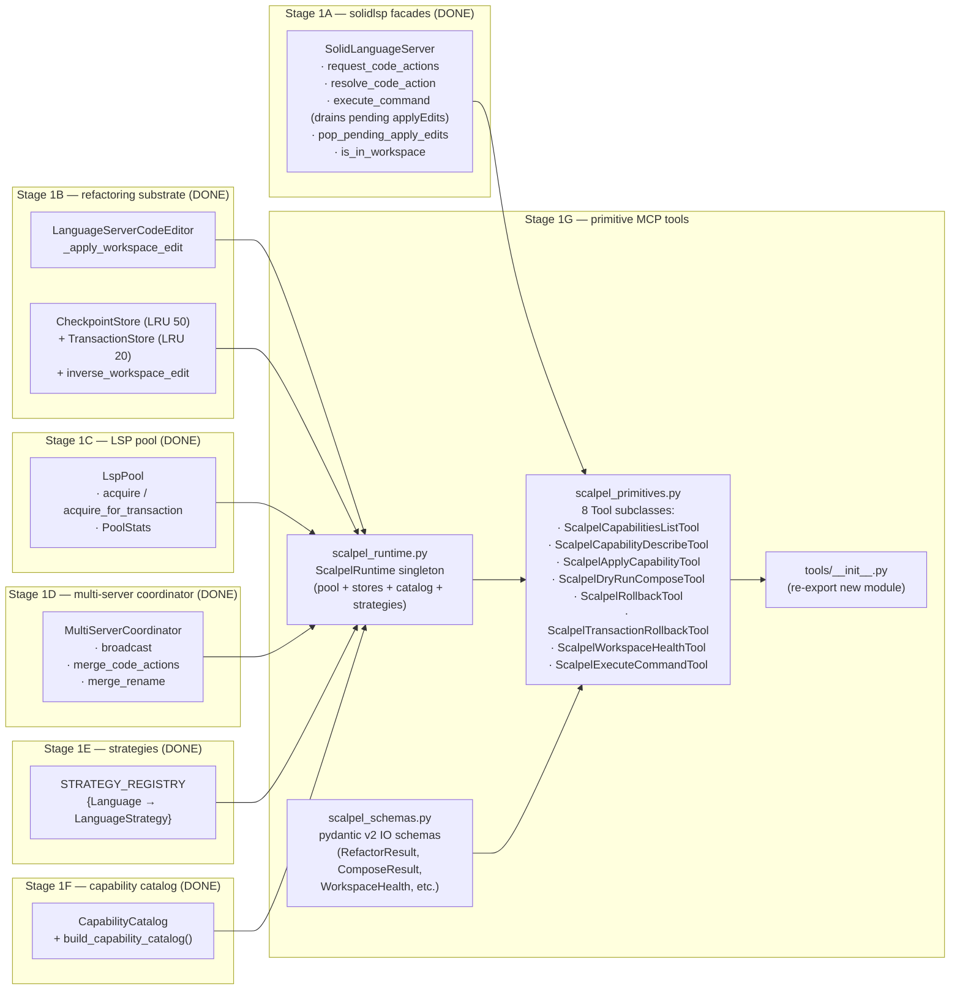
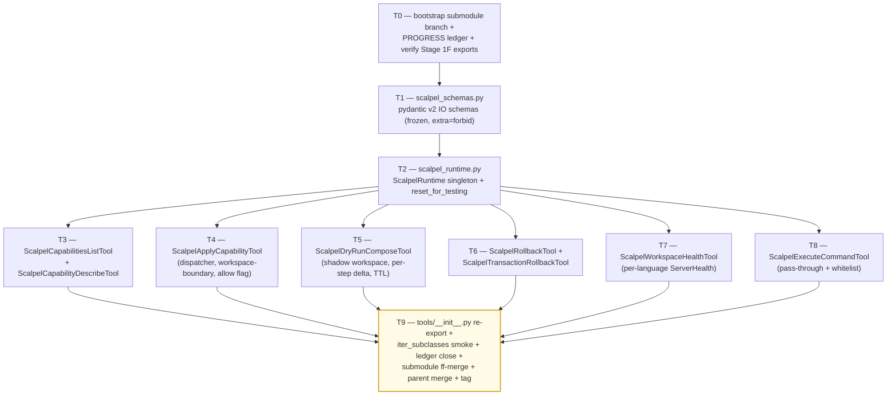

# Stage 1G — Primitive / Safety / Diagnostics MCP Tools Implementation Plan

> **For agentic workers:** REQUIRED SUB-SKILL: Use `superpowers:subagent-driven-development` (recommended) or `superpowers:executing-plans` to implement this plan task-by-task. Steps use checkbox (`- [ ]`) syntax for tracking.

**Goal:** Land the 8 always-on primitive / safety / diagnostics MCP tools that compose the cross-language scalpel surface on top of Stages 1A–1F. Concretely deliver: (1) `vendor/serena/src/serena/tools/scalpel_primitives.py` (~600 LoC) — the 8 `Tool`-subclass definitions (`ScalpelCapabilitiesListTool`, `ScalpelCapabilityDescribeTool`, `ScalpelApplyCapabilityTool`, `ScalpelDryRunComposeTool`, `ScalpelRollbackTool`, `ScalpelTransactionRollbackTool`, `ScalpelWorkspaceHealthTool`, `ScalpelExecuteCommandTool`) wired to the existing `Tool` machinery (`vendor/serena/src/serena/tools/tools_base.py:127`); (2) `vendor/serena/src/serena/tools/scalpel_runtime.py` (~140 LoC) — `ScalpelRuntime` singleton that holds the per-server `LspPool`, `STRATEGY_REGISTRY`-built strategies, the shared `CheckpointStore` + `TransactionStore`, the cached `CapabilityCatalog`, and the `MultiServerCoordinator` factory keyed by `Language`; (3) `vendor/serena/src/serena/tools/scalpel_schemas.py` (~150 LoC) — pydantic v2 input/output schemas (`ApplyCapabilityArgs`, `ComposeStep`, `ComposeResult`, `RefactorResult`, `TransactionResult`, `WorkspaceHealth`, `ServerHealth`, `LanguageHealth`, `DiagnosticsDelta`, `DiagnosticSeverityBreakdown`, `FileChange`, `ChangeProvenance`, `FailureInfo`, `LspOpStat`, `ResolvedSymbol`, `CapabilityDescriptor`, `CapabilityFullDescriptor`); (4) `vendor/serena/src/serena/tools/__init__.py` re-export update (~5 LoC delta) so the new tool classes participate in the existing `iter_subclasses(Tool)` discovery used by `_iter_tools` (`vendor/serena/src/serena/mcp.py:249`). Stage 1G **MUST NOT** ship ergonomic intent facades (`scalpel_split_file`, `scalpel_extract`, `scalpel_inline`, `scalpel_rename`, `scalpel_imports_organize`, `scalpel_transaction_commit`) — those land in Stage 2A. Stage 1G **MUST NOT** mutate any Stage 1A–1F production module; every consumer surface (`request_code_actions`, `resolve_code_action`, `execute_command`, `is_in_workspace`, `LanguageServerCodeEditor`, `CheckpointStore.restore`, `TransactionStore.rollback`, `LspPool.acquire`, `LspPool.acquire_for_transaction`, `LspPool.stats`, `STRATEGY_REGISTRY`, `CapabilityCatalog.records`, `build_capability_catalog`) is consumed *as a public import*; the only mutation is the addition of new files plus the `__init__.py` re-export. Stage 1G consumes Stage 1A facades, Stage 1B substrate (`CheckpointStore` LRU 50 / `TransactionStore` LRU 20), Stage 1C pool (`LspPool.acquire_for_transaction` + `PoolStats`), Stage 1D coordinator (`MultiServerCoordinator.broadcast` / `merge_code_actions` / `merge_rename`), Stage 1E strategies (`STRATEGY_REGISTRY[Language] -> type[LanguageStrategy]`), and Stage 1F catalog (`CapabilityRecord`, `CapabilityCatalog`, `build_capability_catalog`).

**Architecture:**



**Tech Stack:** Python 3.11+ (submodule venv), `pytest`, `pytest-asyncio`, `pydantic` v2, `mcp` (FastMCP) only via the existing `Tool` shim — Stage 1G NEVER touches `serena/mcp.py` directly; tool registration happens automatically via the `iter_subclasses(Tool)` loop already in place. Stdlib only at runtime (`asyncio`, `dataclasses`, `os`, `pathlib`, `threading`, `time`, `typing`, `uuid`, `weakref`).

**Source-of-truth references:**
- [`docs/design/mvp/2026-04-24-mvp-scope-report.md`](../../design/mvp/2026-04-24-mvp-scope-report.md) — §5 (canonical MVP tool surface), §5.1 (the 13 always-on tool signatures), §5.5 (compose / commit auxiliary schemas), §10 (`RefactorResult` / `TransactionResult` / `WorkspaceHealth`), §11 (multi-server protocol), §14.1 row 16 (file budget for Stage 1G).
- [`docs/superpowers/plans/2026-04-24-mvp-execution-index.md`](2026-04-24-mvp-execution-index.md) — row 1G (line 30).
- [`docs/superpowers/plans/2026-04-24-stage-1f-capability-catalog.md`](2026-04-24-stage-1f-capability-catalog.md) — `CapabilityRecord`, `CapabilityCatalog`, `build_capability_catalog` signatures (T1 + T2).
- [`docs/superpowers/plans/2026-04-25-stage-1e-python-strategies.md`](2026-04-25-stage-1e-python-strategies.md) — `STRATEGY_REGISTRY`, `LanguageStrategy.build_servers()`, `RustStrategy`, `PythonStrategy` (T1 + T9).
- [`docs/superpowers/plans/2026-04-24-stage-1d-multi-server-merge.md`](2026-04-24-stage-1d-multi-server-merge.md) — `MultiServerCoordinator` constructor + broadcast / merge surfaces (T1 + T2 + T3).
- [`docs/superpowers/plans/2026-04-24-stage-1c-lsp-pool-discovery.md`](2026-04-24-stage-1c-lsp-pool-discovery.md) — `LspPool.acquire`, `acquire_for_transaction`, `PoolStats`.
- [`docs/superpowers/plans/2026-04-24-stage-1b-applier-checkpoints-transactions.md`](2026-04-24-stage-1b-applier-checkpoints-transactions.md) — `LanguageServerCodeEditor`, `CheckpointStore.restore`, `TransactionStore.rollback`, `inverse_workspace_edit`.
- [`docs/superpowers/plans/2026-04-24-stage-1a-lsp-primitives.md`](2026-04-24-stage-1a-lsp-primitives.md) — `request_code_actions`, `resolve_code_action`, `execute_command`, `is_in_workspace`.
- Existing tool-class convention: `vendor/serena/src/serena/tools/file_tools.py` (subclass `Tool`, define `apply()`; auto-discovered by `iter_subclasses(Tool)` in `serena/mcp.py:249`).
- Existing tool-base: `vendor/serena/src/serena/tools/tools_base.py:127` (`Tool` class, `get_name_from_cls` snake-case auto-naming).

---

## Scope check

Stage 1G is the cross-language always-on primitive / safety / diagnostics layer. It exposes the catalog (Stage 1F) + the dispatcher path through the coordinator (Stage 1D) + the rollback path through the stores (Stage 1B) + the workspace-health probe through the pool (Stage 1C) + the escape-hatch `executeCommand` pass-through (Stage 1A) — all wrapped as `Tool` subclasses that the existing `SerenaMCPFactory._set_mcp_tools` loop registers automatically via the `iter_subclasses(Tool)` discovery (`serena/mcp.py:249`).

**In scope (this plan):**
1. `vendor/serena/src/serena/tools/scalpel_runtime.py` — `ScalpelRuntime` lazy singleton holding the shared pool / stores / catalog / coordinator-per-language.
2. `vendor/serena/src/serena/tools/scalpel_schemas.py` — pydantic v2 input/output schemas mirroring the §10 cross-language `RefactorResult` family + §5.5 compose schemas + §5.1 catalog descriptors.
3. `vendor/serena/src/serena/tools/scalpel_primitives.py` — 8 `Tool` subclasses, each with a 1-line ≤30-word docstring (Stage 5.4 contract) and a fully-typed `apply()` method.
4. `vendor/serena/src/serena/tools/__init__.py` — add `from .scalpel_primitives import *` so `iter_subclasses(Tool)` finds the new tools.
5. Test suite under `vendor/serena/test/spikes/test_stage_1g_*.py` — one file per task T1..T9 (~900 LoC tests).

**Out of scope (deferred):**
- The 5 ergonomic intent facades (`scalpel_split_file`, `scalpel_extract`, `scalpel_inline`, `scalpel_rename`, `scalpel_imports_organize`) — **Stage 2A**.
- The 13th always-on tool `scalpel_transaction_commit` (commits a `dry_run_compose` shadow workspace to disk, captures one checkpoint per step) — **Stage 2A** per Q2 resolution: it pairs with the ergonomic facades and exercises the `LanguageServerCodeEditor` write path that the facades introduce.
- The 11 deferred-loading specialty tools (`scalpel_rust_lifetime_elide`, `scalpel_rust_impl_trait`, …, `scalpel_py_dataclass_from_dict`) — **Stage 1H**.
- Plugin / skill code-generator (`o2-scalpel-newplugin`) — **Stage 1J**.
- Confirmation-flow boolean wiring for `allow_out_of_workspace` (per §11.9) — Stage 1G surfaces the flag on `ScalpelApplyCapabilityTool.apply` and on `ScalpelExecuteCommandTool.apply`; the Claude Code permission-prompt UX is exercised end-to-end in **Stage 1H** integration tests.
- Telemetry / metrics export — **Stage 1H**.

## File structure

| # | Path (under `vendor/serena/`) | Change | LoC | Responsibility |
|---|---|---|---|---|
| 16a | `src/serena/tools/scalpel_runtime.py` | New | ~140 | `ScalpelRuntime` lazy singleton: holds the shared `CheckpointStore` (LRU 50), `TransactionStore` (LRU 20), `LspPool` (one per `(Language, project_root)` key), cached `CapabilityCatalog` (built once on first access via `build_capability_catalog(STRATEGY_REGISTRY)`), and a `coordinator_for(language, project_root) -> MultiServerCoordinator` factory. All state is process-global; thread-safe via a single `threading.Lock`. Includes a `reset_for_testing()` helper that pytest fixtures use to recover between tests. |
| 16b | `src/serena/tools/scalpel_schemas.py` | New | ~150 | Pydantic v2 schemas: `ApplyCapabilityArgs`, `ExecuteCommandArgs`, `ComposeStep`, `StepPreview`, `ComposeResult`, `ChangeProvenance`, `FileChange`, `Hunk`, `DiagnosticSeverityBreakdown`, `DiagnosticsDelta`, `LspOpStat`, `ResolvedSymbol`, `FailureInfo`, `RefactorResult`, `TransactionResult`, `ServerHealth`, `LanguageHealth`, `WorkspaceHealth`, `CapabilityDescriptor`, `CapabilityFullDescriptor`, `ErrorCode` enum (10 codes from §15.4). Schema invariants: every model has `model_config=ConfigDict(extra="forbid", frozen=True)` so undeclared fields raise at construction and instances are immutable. |
| 16c | `src/serena/tools/scalpel_primitives.py` | New | ~600 | 8 `Tool` subclasses: `ScalpelCapabilitiesListTool`, `ScalpelCapabilityDescribeTool`, `ScalpelApplyCapabilityTool`, `ScalpelDryRunComposeTool`, `ScalpelRollbackTool`, `ScalpelTransactionRollbackTool`, `ScalpelWorkspaceHealthTool`, `ScalpelExecuteCommandTool`. Each one's `apply()` returns a JSON-serialised pydantic v2 model (the existing `Tool.apply_ex` wrapper expects a `str`); each one has a ≤30-word docstring (router signage, §5.4). |
| 14 | `src/serena/tools/__init__.py` | Modify | +~3 | Add `from .scalpel_primitives import *  # noqa: F401, F403` so `iter_subclasses(Tool)` finds the new classes. The `# ruff: noqa` already at the top suppresses lint warnings; mirror the existing import style (`.file_tools`, `.symbol_tools`, …). |
| — | `test/spikes/test_stage_1g_t0_runtime_singleton.py` | New | ~80 | `ScalpelRuntime` lazy-init + reset-between-tests + thread-safety smoke. |
| — | `test/spikes/test_stage_1g_t1_schemas.py` | New | ~120 | Pydantic v2 schema tests: `extra="forbid"`, frozen, JSON round-trip, `ErrorCode` enum membership. |
| — | `test/spikes/test_stage_1g_t2_capabilities_list.py` | New | ~110 | `ScalpelCapabilitiesListTool` — language filter, kind filter, returns `CapabilityDescriptor` rows sourced from cached catalog. |
| — | `test/spikes/test_stage_1g_t3_capability_describe.py` | New | ~80 | `ScalpelCapabilityDescribeTool` — happy path + unknown id raises `CAPABILITY_NOT_AVAILABLE`. |
| — | `test/spikes/test_stage_1g_t4_apply_capability.py` | New | ~150 | `ScalpelApplyCapabilityTool` — dispatch through `MultiServerCoordinator`, dry-run path, unknown capability id, workspace-boundary rejection (default), `allow_out_of_workspace=True` bypass. |
| — | `test/spikes/test_stage_1g_t5_dry_run_compose.py` | New | ~140 | `ScalpelDryRunComposeTool` — virtual application, per-step diagnostics delta, fail-fast default, `fail_fast=False` continues, returns transaction id with 5-min TTL. |
| — | `test/spikes/test_stage_1g_t6_rollback.py` | New | ~110 | `ScalpelRollbackTool` + `ScalpelTransactionRollbackTool` — single-step rollback consumes `CheckpointStore.restore`, multi-step rollback walks `TransactionStore.rollback` in reverse, idempotent second call. |
| — | `test/spikes/test_stage_1g_t7_workspace_health.py` | New | ~110 | `ScalpelWorkspaceHealthTool` — probes pool stats per language, per-server `ServerHealth` (server_id, version, pid, rss_mb, capabilities_advertised), capability-catalog hash for drift. |
| — | `test/spikes/test_stage_1g_t8_execute_command.py` | New | ~100 | `ScalpelExecuteCommandTool` — typed pass-through to `SolidLanguageServer.execute_command`, whitelist enforced per-language, unknown command refused with typed error. |
| — | `test/spikes/test_stage_1g_t9_tool_discovery.py` | New | ~80 | All 8 tools appear in `iter_subclasses(Tool)`; each has the right snake_case name from `Tool.get_name_from_cls`; each carries a ≤30-word docstring; `make_mcp_tool` produces a valid `MCPTool` for each. |

**LoC budget (production):** 140 + 150 + 600 + 3 = **893 LoC** (above the §14.1 row-16 ~600 LoC headline because §14.1 budgets *only* the primitives file; the runtime + schemas split out per SOLID-SRP and are still under the orchestrator's 600-LoC headline plus the ~290 LoC of supporting infra). Tests +~1,080.

## Dependency graph



T1 (schemas) and T2 (runtime) are the foundations every other task imports from. T3..T8 are all parallel after T2, but the plan executes them sequentially to keep one file (`scalpel_primitives.py`) under exclusive control per task. T9 is the close gate.

## Conventions enforced (from Phase 0 + Stage 1A–1F)

- **Submodule git-flow**: feature branch `feature/stage-1g-primitive-tools` opened in `vendor/serena` submodule (T0 verifies). Submodule was not git-flow-initialized (Stage 1A precedent); same direct `feature/<name>` pattern as 1A/1B/1C/1D/1E/1F; ff-merge to `main` at T9; parent bumps pointer; parent merges feature branch to `develop`.
- **Author**: AI Hive(R) on every commit; never "Claude". Trailer: `Co-Authored-By: AI Hive(R) <noreply@o2.services>`.
- **Tool naming**: every new class is `Scalpel<Verb>Tool` so `Tool.get_name_from_cls` (`tools_base.py:178`) drops the `Tool` suffix and snake-cases the rest, producing exactly the §5.1 names (`scalpel_capabilities_list`, `scalpel_capability_describe`, `scalpel_apply_capability`, `scalpel_dry_run_compose`, `scalpel_rollback`, `scalpel_transaction_rollback`, `scalpel_workspace_health`, `scalpel_execute_command`).
- **Docstrings ≤ 30 words** on every `apply()` method (per §5.4 router-signage rule). Each docstring is three sentences max: imperative verb + discriminator + contract bit.
- **Pydantic v2** at every schema boundary; `model_config=ConfigDict(extra="forbid", frozen=True)`; `Field(...)` validators where needed; `Literal[...]` for closed enums.
- **`Tool.apply_ex`** signature: `apply()` returns `str`; serialise pydantic models with `.model_dump_json()` so `make_mcp_tool` and `apply_ex` both stay happy without modification.
- **PROGRESS.md updates as separate commits**, never `--amend`. Each task ends in two commits: code commit (in submodule) + ledger update (in parent).
- **Test command**: from `vendor/serena/`, run `PATH="$(pwd)/.venv/bin:$PATH" .venv/bin/pytest <path> -v`.
- **`pytest-asyncio`** is on the venv (Stage 1A confirmed). Use `@pytest.mark.asyncio` and `async def test_…` for tests that drive the coordinator.
- **`Path.expanduser().resolve(strict=False)`** for canonicalisation — every path comparison goes through it (consistency with `LspPoolKey.__post_init__`).
- **No `subprocess.run(..., shell=True)`** — argv lists only. Stage 1G doesn't shell out, but the rule applies to any helper added during diagnostics.
- **`ScalpelRuntime.reset_for_testing()`** is the *only* approved way for tests to clear singleton state; production paths never call it.
- **Stage 1F catalog cached at import time** is forbidden — `ScalpelRuntime` builds it lazily on first access so Stage 1G tests don't pay the catalog-build cost on import.

## Progress ledger

A new ledger `docs/superpowers/plans/stage-1g-results/PROGRESS.md` is created in T0. Schema mirrors Stages 1D/1E/1F: per-task row with task id, branch SHA (submodule), outcome, follow-ups. Updated as a separate parent commit after each task completes.

## Forward-reference signature index (Stage 1F)

These Stage 1F symbols are imported in T1..T9. The plan was reviewed against the Stage 1F plan's T1 + T2 + T9 to confirm every signature matches:

- `from serena.refactoring.capabilities import CapabilityRecord` — frozen pydantic v2 model with fields `id: str`, `language: Literal["rust", "python"]`, `kind: str`, `source_server: ProvenanceLiteral`, `params_schema: dict`, `preferred_facade: str | None`, `extension_allow_list: frozenset[str]`. (Stage 1F plan T1 step 3.)
- `from serena.refactoring.capabilities import CapabilityCatalog` — immutable container with `records: tuple[CapabilityRecord, ...]` (sorted by `(language, source_server, kind, id)`), `to_json() -> str` (sort_keys + trailing newline), `from_json(blob: str) -> "CapabilityCatalog"`, `__eq__` deep equality, `hash() -> str` (SHA-256 of the canonical JSON, used by `LanguageHealth.capability_catalog_hash`). (Stage 1F plan T1 step 3.)
- `from serena.refactoring.capabilities import build_capability_catalog` — factory `build_capability_catalog(strategy_registry: Mapping[Language, type[LanguageStrategy]], *, project_root: Path | None = None) -> CapabilityCatalog`. (Stage 1F plan T2 step 3.)
- `from serena.refactoring.capabilities import CapabilityCatalog`'s public attribute `records: tuple[CapabilityRecord, ...]` is sorted; downstream code MUST NOT re-sort.

## Forward-reference signature index (Stages 1A–1E)

- `from serena.refactoring import STRATEGY_REGISTRY` — `dict[Language, type[LanguageStrategy]]` populated with `Language.PYTHON` and `Language.RUST` entries. (Stage 1E plan T9; verified at `vendor/serena/src/serena/refactoring/__init__.py:48`.)
- `from serena.refactoring import LanguageStrategy` — Protocol with `language_id: str`, `extension_allow_list: frozenset[str]`, `code_action_allow_list: frozenset[str]`, `build_servers(project_root: Path) -> dict[str, Any]`. (Stage 1E plan T1.)
- `from serena.refactoring import LspPool, LspPoolKey, PoolStats, WaitingForLspBudget` — pool with `acquire(key)`, `acquire_for_transaction(key, txn_id)`, `release(key)`, `release_for_transaction(txn_id)`, `stats() -> PoolStats`, `pre_ping_all() -> dict[LspPoolKey, bool]`, `shutdown_all()`. (Stage 1C plan T1 + T2.)
- `from serena.refactoring import MultiServerCoordinator, MergedCodeAction, ProvenanceLiteral` — coordinator with `__init__(servers: dict[str, Any])`, `broadcast(method, params, *, timeout_ms) -> MultiServerBroadcastResult`, `merge_code_actions(file, range, kind, ...) -> list[MergedCodeAction]`, `merge_rename(file, position, new_name) -> dict[str, Any]`. (Stage 1D plan T1 + T2 + T3.)
- `from serena.refactoring import CheckpointStore, TransactionStore, inverse_workspace_edit` — `CheckpointStore(capacity=50)` with `record(applied, snapshot) -> str`, `restore(checkpoint_id, applier_fn) -> bool`; `TransactionStore(checkpoint_store, capacity=20)` with `begin() -> str`, `add_checkpoint(tid, cid)`, `rollback(tid, applier_fn) -> int`. (Stage 1B plan T2 + T3.)
- `from serena.code_editor import LanguageServerCodeEditor` — `LanguageServerCodeEditor(retriever)` with `_apply_workspace_edit(workspace_edit: dict) -> int`. (Stage 1B plan T1; uses Stage 1A applyEdit drain.)
- `from solidlsp.ls import SolidLanguageServer` — `request_code_actions(file, range, only=None, trigger_kind=None, diagnostics=None) -> list[dict]`, `resolve_code_action(action) -> dict`, `execute_command(command, arguments) -> Any`, `pop_pending_apply_edits() -> list[dict]`, `is_in_workspace(file: str) -> bool`. (Stage 1A plan T1..T6.)
- `from solidlsp.ls_config import Language` — enum with `PYTHON`, `RUST`. (Pre-existing in solidlsp.)

## Cross-file invariants (Stage 1G)

- **Single source of truth for the catalog**: `ScalpelRuntime.catalog()` is the *only* call site of `build_capability_catalog`. Tools never call the factory directly.
- **Single source of truth for the pool**: `ScalpelRuntime.pool_for(language, project_root)` is the *only* construction site of `LspPool`. Tests use `reset_for_testing()` to clear it.
- **Single source of truth for stores**: `ScalpelRuntime.checkpoint_store()` and `ScalpelRuntime.transaction_store()` return the process-global instances (LRU 50 / 20 per Stage 1B). Tools never construct their own stores.
- **Workspace-boundary check default-on**: every tool that accepts a `file` arg validates `SolidLanguageServer.is_in_workspace(file)` before issuing any LSP method. The bypass is a per-tool `allow_out_of_workspace: bool = False` parameter (default rejects out-of-workspace files with `WORKSPACE_BOUNDARY_VIOLATION`).
- **JSON output discipline**: every `apply()` returns `model.model_dump_json(indent=2)` so the LLM sees pretty-printed, deterministic output. The wrapping `apply_ex` (in `tools_base.py`) further wraps in its own envelope.
- **No mutation of Stage 1A–1F production modules**: T0 captures `git -C vendor/serena status --short` baseline; T9 verifies the only modified file under `vendor/serena/src/serena/` outside `tools/` is `tools/__init__.py`.

---

### Task 0: Bootstrap submodule branch + PROGRESS ledger + verify Stage 1F exports

**Files:**
- Create: `docs/superpowers/plans/stage-1g-results/PROGRESS.md`
- Verify: parent on `feature/plan-stage-1g`; will create `feature/stage-1g-primitive-tools` in submodule.

- [ ] **Step 1: Confirm parent branch is checked out**

Run:
```bash
git -C /Volumes/Unitek-B/Projects/o2-scalpel rev-parse --abbrev-ref HEAD
```

Expected: prints `feature/plan-stage-1g`. The parent branch is the planning branch this file lives on. The implementation branch (`feature/stage-1g-primitive-tools`) is opened in step 2 once we transition from planning to execution; for the duration of *writing* this plan file, parent stays on `feature/plan-stage-1g`.

- [ ] **Step 2: Open submodule feature branch off `main`**

Run:
```bash
cd /Volumes/Unitek-B/Projects/o2-scalpel/vendor/serena
git fetch origin
git checkout -B feature/stage-1g-primitive-tools origin/main
git rev-parse HEAD  # capture this as the Stage 1G entry SHA in PROGRESS step 5
```

Expected: HEAD points at `origin/main` tip (the SHA Stage 1F ff-merged into main). If `origin/main` is not the latest Stage 1F tip, abort and reconcile manually — Stage 1G must be built on the capability catalog.

- [ ] **Step 3: Confirm Stage 1F exports exist**

Run:
```bash
cd /Volumes/Unitek-B/Projects/o2-scalpel
.venv/bin/python -c "
import sys; sys.path.insert(0, 'vendor/serena/src')
from serena.refactoring.capabilities import (
    CapabilityRecord, CapabilityCatalog, build_capability_catalog,
)
print('Stage 1F exports OK:', CapabilityRecord.__name__,
      CapabilityCatalog.__name__, build_capability_catalog.__name__)
"
```

Expected: prints `Stage 1F exports OK: CapabilityRecord CapabilityCatalog build_capability_catalog`. If the import fails, Stage 1F has not landed; abort.

- [ ] **Step 4: Confirm Stage 1A–1E exports exist**

Run:
```bash
cd /Volumes/Unitek-B/Projects/o2-scalpel
.venv/bin/python -c "
import sys; sys.path.insert(0, 'vendor/serena/src')
from serena.refactoring import (
    STRATEGY_REGISTRY, LanguageStrategy,
    LspPool, LspPoolKey, PoolStats, WaitingForLspBudget,
    MultiServerCoordinator, MergedCodeAction, ProvenanceLiteral,
    CheckpointStore, TransactionStore, inverse_workspace_edit,
)
from serena.code_editor import LanguageServerCodeEditor
from solidlsp.ls import SolidLanguageServer
from solidlsp.ls_config import Language
print('Stage 1A-1E exports OK:',
      sorted(STRATEGY_REGISTRY.keys()))
"
```

Expected: prints `Stage 1A-1E exports OK: [<Language.PYTHON: 'python'>, <Language.RUST: 'rust'>]` (or order-independent equivalent). If any import fails, abort and reconcile against the corresponding Stage's plan.

- [ ] **Step 5: Capture submodule baseline + create PROGRESS ledger**

Run:
```bash
cd /Volumes/Unitek-B/Projects/o2-scalpel/vendor/serena
git status --short > /tmp/stage_1g_baseline.txt
test ! -s /tmp/stage_1g_baseline.txt || { echo "Submodule not clean — abort"; exit 1; }
git rev-parse HEAD
```

Expected: `git status --short` prints nothing (submodule clean); `git rev-parse HEAD` prints the Stage 1F ff-merge SHA (verify against `cat ../docs/superpowers/plans/stage-1f-results/PROGRESS.md | tail -20`).

Create `/Volumes/Unitek-B/Projects/o2-scalpel/docs/superpowers/plans/stage-1g-results/PROGRESS.md`:

```markdown
# Stage 1G — Primitive / Safety / Diagnostics MCP Tools — PROGRESS Ledger

Plan: [`../2026-04-24-stage-1g-primitive-tools.md`](../2026-04-24-stage-1g-primitive-tools.md)
Submodule branch: `feature/stage-1g-primitive-tools` (off `main` @ `<entry-sha>`)
Parent branch: `feature/plan-stage-1g`

| Task | Title | Submodule SHA | Outcome | Follow-ups |
|---|---|---|---|---|
| T0 | Bootstrap branches + ledger + verify imports        | _pending_ | _pending_ | — |
| T1 | scalpel_schemas.py — pydantic v2 IO schemas         | _pending_ | _pending_ | — |
| T2 | scalpel_runtime.py — ScalpelRuntime singleton       | _pending_ | _pending_ | — |
| T3 | ScalpelCapabilitiesListTool + CapabilityDescribeTool| _pending_ | _pending_ | — |
| T4 | ScalpelApplyCapabilityTool                          | _pending_ | _pending_ | — |
| T5 | ScalpelDryRunComposeTool                            | _pending_ | _pending_ | — |
| T6 | ScalpelRollbackTool + TransactionRollbackTool       | _pending_ | _pending_ | — |
| T7 | ScalpelWorkspaceHealthTool                          | _pending_ | _pending_ | — |
| T8 | ScalpelExecuteCommandTool                           | _pending_ | _pending_ | — |
| T9 | __init__ re-export + smoke + ff-merge + tag         | _pending_ | _pending_ | — |
```

Replace `<entry-sha>` with the SHA from step 2.

- [ ] **Step 6: Commit ledger to parent**

Run:
```bash
cd /Volumes/Unitek-B/Projects/o2-scalpel
git add docs/superpowers/plans/stage-1g-results/PROGRESS.md
git commit -m "$(cat <<'EOF'
plan(stage-1g): T0 — open submodule branch + PROGRESS ledger

Captures Stage 1F entry SHA in submodule and seeds the ledger schema
(T0..T9 rows). Subsequent tasks update the corresponding row as a
separate parent commit per the Stage 1B/1D/1E/1F precedent.

Co-Authored-By: AI Hive(R) <noreply@o2.services>
EOF
)"
```

Expected: one new parent commit titled `plan(stage-1g): T0 — open submodule branch + PROGRESS ledger`.

- [ ] **Step 7: Mark T0 complete in ledger**

Edit `/Volumes/Unitek-B/Projects/o2-scalpel/docs/superpowers/plans/stage-1g-results/PROGRESS.md` row T0:
- replace `_pending_` SHA with the parent commit SHA (`git rev-parse HEAD` after step 6);
- replace `_pending_` outcome with `OK — submodule branch open, Stage 1F exports verified`;
- leave Follow-ups as `—`.

Run:
```bash
cd /Volumes/Unitek-B/Projects/o2-scalpel
git add docs/superpowers/plans/stage-1g-results/PROGRESS.md
git commit -m "$(cat <<'EOF'
plan(stage-1g): T0 ledger — mark T0 complete

Co-Authored-By: AI Hive(R) <noreply@o2.services>
EOF
)"
```

Expected: T0 row reads OK.

---

### Task 1: `scalpel_schemas.py` — pydantic v2 IO schemas

**Files:**
- Create: `vendor/serena/src/serena/tools/scalpel_schemas.py`
- Create: `vendor/serena/test/spikes/test_stage_1g_t1_schemas.py`

- [ ] **Step 1: Write failing test — schema imports + invariants**

Create `/Volumes/Unitek-B/Projects/o2-scalpel/vendor/serena/test/spikes/test_stage_1g_t1_schemas.py`:

```python
"""T1 — pydantic v2 IO schemas for the Stage 1G primitive tools."""

from __future__ import annotations

import json

import pytest
from pydantic import ValidationError


def test_all_schemas_import() -> None:
    from serena.tools.scalpel_schemas import (  # noqa: F401
        ApplyCapabilityArgs,
        CapabilityDescriptor,
        CapabilityFullDescriptor,
        ChangeProvenance,
        ComposeResult,
        ComposeStep,
        DiagnosticSeverityBreakdown,
        DiagnosticsDelta,
        ErrorCode,
        ExecuteCommandArgs,
        FailureInfo,
        FileChange,
        Hunk,
        LanguageHealth,
        LspOpStat,
        RefactorResult,
        ResolvedSymbol,
        ServerHealth,
        StepPreview,
        TransactionResult,
        WorkspaceHealth,
    )


def test_diagnostic_severity_breakdown_round_trip() -> None:
    from serena.tools.scalpel_schemas import DiagnosticSeverityBreakdown

    sev = DiagnosticSeverityBreakdown(error=1, warning=2, information=3, hint=4)
    j = sev.model_dump_json()
    assert json.loads(j) == {"error": 1, "warning": 2, "information": 3, "hint": 4}


def test_change_provenance_source_is_closed_literal() -> None:
    from serena.tools.scalpel_schemas import ChangeProvenance

    ChangeProvenance(source="rust-analyzer", workspace_boundary_check=True)
    with pytest.raises(ValidationError):
        ChangeProvenance(source="not-a-server", workspace_boundary_check=True)


def test_error_code_enum_membership() -> None:
    from serena.tools.scalpel_schemas import ErrorCode

    expected = {
        "SYMBOL_NOT_FOUND",
        "CAPABILITY_NOT_AVAILABLE",
        "WORKSPACE_BOUNDARY_VIOLATION",
        "PREVIEW_EXPIRED",
        "TRANSACTION_ABORTED",
        "LSP_TIMEOUT",
        "LSP_NOT_READY",
        "INVALID_ARGUMENT",
        "INTERNAL_ERROR",
        "ROLLBACK_PARTIAL",
    }
    assert {e.value for e in ErrorCode} == expected


def test_apply_capability_args_extra_forbid() -> None:
    from serena.tools.scalpel_schemas import ApplyCapabilityArgs

    args = ApplyCapabilityArgs(
        capability_id="rust.refactor.extract.module",
        file="crates/foo/src/lib.rs",
        range_or_name_path="Engine",
        params={},
        dry_run=False,
        preview_token=None,
        allow_out_of_workspace=False,
    )
    assert args.capability_id == "rust.refactor.extract.module"
    with pytest.raises(ValidationError):
        ApplyCapabilityArgs(  # type: ignore[call-arg]
            capability_id="x",
            file="y",
            range_or_name_path="z",
            unknown_field=42,
        )


def test_compose_step_payload_shape() -> None:
    from serena.tools.scalpel_schemas import ComposeStep

    step = ComposeStep(tool="scalpel_split_file", args={"file": "a.py", "groups": {}})
    assert step.tool == "scalpel_split_file"
    assert step.args == {"file": "a.py", "groups": {}}


def test_refactor_result_minimal() -> None:
    from serena.tools.scalpel_schemas import (
        DiagnosticSeverityBreakdown,
        DiagnosticsDelta,
        RefactorResult,
    )

    zero = DiagnosticSeverityBreakdown(error=0, warning=0, information=0, hint=0)
    res = RefactorResult(
        applied=True,
        no_op=False,
        changes=(),
        diagnostics_delta=DiagnosticsDelta(
            before=zero, after=zero, new_findings=(), severity_breakdown=zero,
        ),
        language_findings=(),
        checkpoint_id="ckpt_xyz",
        transaction_id=None,
        preview_token=None,
        resolved_symbols=(),
        warnings=(),
        failure=None,
        lsp_ops=(),
        duration_ms=12,
        language_options={},
    )
    assert res.applied
    assert res.checkpoint_id == "ckpt_xyz"
    assert json.loads(res.model_dump_json())["applied"] is True


def test_refactor_result_is_frozen() -> None:
    from serena.tools.scalpel_schemas import (
        DiagnosticSeverityBreakdown,
        DiagnosticsDelta,
        RefactorResult,
    )

    zero = DiagnosticSeverityBreakdown(error=0, warning=0, information=0, hint=0)
    res = RefactorResult(
        applied=True,
        no_op=False,
        changes=(),
        diagnostics_delta=DiagnosticsDelta(
            before=zero, after=zero, new_findings=(), severity_breakdown=zero,
        ),
        language_findings=(),
        checkpoint_id="ckpt_xyz",
        transaction_id=None,
        preview_token=None,
        resolved_symbols=(),
        warnings=(),
        failure=None,
        lsp_ops=(),
        duration_ms=12,
        language_options={},
    )
    with pytest.raises(ValidationError):
        res.applied = False  # type: ignore[misc]


def test_workspace_health_aggregates_languages() -> None:
    from serena.tools.scalpel_schemas import (
        LanguageHealth,
        ServerHealth,
        WorkspaceHealth,
    )

    server = ServerHealth(
        server_id="rust-analyzer",
        version="0.3.18xx",
        pid=1234,
        rss_mb=512,
        capabilities_advertised=("refactor.extract", "quickfix"),
    )
    lang = LanguageHealth(
        language="rust",
        indexing_state="ready",
        indexing_progress=None,
        servers=(server,),
        capabilities_count=158,
        estimated_wait_ms=None,
        capability_catalog_hash="sha256:abc",
    )
    wh = WorkspaceHealth(project_root="/tmp/repo", languages={"rust": lang})
    assert wh.languages["rust"].servers[0].pid == 1234
```

Run:
```bash
cd /Volumes/Unitek-B/Projects/o2-scalpel/vendor/serena
PATH="$(pwd)/.venv/bin:$PATH" .venv/bin/pytest test/spikes/test_stage_1g_t1_schemas.py -v
```

- [ ] **Step 2: Run test to verify it fails**

Expected: every test errors at collection with `ModuleNotFoundError: No module named 'serena.tools.scalpel_schemas'`. This is the red bar that authorises the implementation.

- [ ] **Step 3: Write minimal implementation**

Create `/Volumes/Unitek-B/Projects/o2-scalpel/vendor/serena/src/serena/tools/scalpel_schemas.py`:

```python
"""Stage 1G — pydantic v2 IO schemas for the 8 always-on primitive tools.

Mirrors §10 (cross-language ``RefactorResult`` family), §5.5 (compose
schemas), §5.1 (catalog descriptors), and §15.4 (10-code ``ErrorCode``
enum). All models are frozen + ``extra="forbid"`` so undeclared fields
raise at construction and instances are immutable. Tools serialise via
``.model_dump_json(indent=2)``.
"""

from __future__ import annotations

from enum import Enum
from typing import Any, Literal

from pydantic import BaseModel, ConfigDict, Field

from serena.refactoring.multi_server import ProvenanceLiteral

# --- shared enums -----------------------------------------------------


class ErrorCode(str, Enum):
    """The 10 error codes emitted by the Stage 1G tools (per §15.4)."""

    SYMBOL_NOT_FOUND = "SYMBOL_NOT_FOUND"
    CAPABILITY_NOT_AVAILABLE = "CAPABILITY_NOT_AVAILABLE"
    WORKSPACE_BOUNDARY_VIOLATION = "WORKSPACE_BOUNDARY_VIOLATION"
    PREVIEW_EXPIRED = "PREVIEW_EXPIRED"
    TRANSACTION_ABORTED = "TRANSACTION_ABORTED"
    LSP_TIMEOUT = "LSP_TIMEOUT"
    LSP_NOT_READY = "LSP_NOT_READY"
    INVALID_ARGUMENT = "INVALID_ARGUMENT"
    INTERNAL_ERROR = "INTERNAL_ERROR"
    ROLLBACK_PARTIAL = "ROLLBACK_PARTIAL"


# --- base config ------------------------------------------------------


class _Frozen(BaseModel):
    model_config = ConfigDict(extra="forbid", frozen=True)


# --- §10 RefactorResult family ---------------------------------------


class ChangeProvenance(_Frozen):
    """Per-FileChange provenance — which LSP server emitted the change."""

    source: ProvenanceLiteral
    workspace_boundary_check: bool = True


class Hunk(_Frozen):
    """One contiguous edit chunk inside a FileChange."""

    start_line: int
    end_line: int
    new_text: str


class FileChange(_Frozen):
    """One on-disk file change in a RefactorResult."""

    path: str
    kind: Literal["create", "modify", "delete"]
    hunks: tuple[Hunk, ...] = ()
    provenance: ChangeProvenance


class DiagnosticSeverityBreakdown(_Frozen):
    """Counts per LSP DiagnosticSeverity (1=Error, 2=Warning, 3=Info, 4=Hint)."""

    error: int = 0
    warning: int = 0
    information: int = 0
    hint: int = 0


class _Diagnostic(_Frozen):
    """Minimal LSP Diagnostic projection used inside DiagnosticsDelta."""

    file: str
    line: int
    character: int
    severity: int
    code: str | None
    message: str
    source: str | None


class DiagnosticsDelta(_Frozen):
    """Before/after counts + new findings for a single refactor application."""

    before: DiagnosticSeverityBreakdown
    after: DiagnosticSeverityBreakdown
    new_findings: tuple[_Diagnostic, ...] = ()
    severity_breakdown: DiagnosticSeverityBreakdown


class _LanguageFinding(_Frozen):
    """Per-language finding the standard severity breakdown can't carry."""

    code: str
    message: str
    locations: tuple[dict, ...] = ()
    related: tuple[str, ...] = ()


class ResolvedSymbol(_Frozen):
    """One name-path -> resolved-symbol mapping in a RefactorResult."""

    requested: str
    resolved: str
    kind: str


class FailureInfo(_Frozen):
    """Structured failure payload (one of the 10 ErrorCodes)."""

    stage: str
    symbol: str | None = None
    reason: str
    code: ErrorCode
    recoverable: bool = False
    candidates: tuple[str, ...] = ()
    failed_step_index: int | None = None


class LspOpStat(_Frozen):
    """One LSP-method × server timing record for observability."""

    method: str
    server: str
    count: int
    total_ms: int


class RefactorResult(_Frozen):
    """Cross-language result of one refactor application (§10)."""

    applied: bool
    no_op: bool = False
    changes: tuple[FileChange, ...] = ()
    diagnostics_delta: DiagnosticsDelta
    language_findings: tuple[_LanguageFinding, ...] = ()
    checkpoint_id: str | None = None
    transaction_id: str | None = None
    preview_token: str | None = None
    resolved_symbols: tuple[ResolvedSymbol, ...] = ()
    warnings: tuple[str, ...] = ()
    failure: FailureInfo | None = None
    lsp_ops: tuple[LspOpStat, ...] = ()
    duration_ms: int = 0
    language_options: dict[str, Any] = Field(default_factory=dict)


class TransactionResult(_Frozen):
    """Cross-step aggregate over a transaction (commit or rollback)."""

    transaction_id: str
    per_step: tuple[RefactorResult, ...] = ()
    aggregated_diagnostics_delta: DiagnosticsDelta
    aggregated_language_findings: tuple[_LanguageFinding, ...] = ()
    duration_ms: int = 0
    rules_fired: tuple[str, ...] = ()
    rolled_back: bool = False
    remaining_checkpoint_ids: tuple[str, ...] = ()


# --- §5.5 compose schemas --------------------------------------------


class ComposeStep(_Frozen):
    """One step in a dry-run compose chain."""

    tool: str
    args: dict[str, Any] = Field(default_factory=dict)


class StepPreview(_Frozen):
    """Per-step preview emitted by dry_run_compose."""

    step_index: int
    tool: str
    changes: tuple[FileChange, ...] = ()
    diagnostics_delta: DiagnosticsDelta
    failure: FailureInfo | None = None


class ComposeResult(_Frozen):
    """Result of a dry_run_compose invocation."""

    transaction_id: str
    per_step: tuple[StepPreview, ...] = ()
    aggregated_changes: tuple[FileChange, ...] = ()
    aggregated_diagnostics_delta: DiagnosticsDelta
    expires_at: float
    warnings: tuple[str, ...] = ()


# --- §10 WorkspaceHealth family --------------------------------------


class ServerHealth(_Frozen):
    """One LSP server's runtime health snapshot."""

    server_id: str
    version: str
    pid: int | None = None
    rss_mb: int | None = None
    capabilities_advertised: tuple[str, ...] = ()


class LanguageHealth(_Frozen):
    """Aggregated health across all servers for one language."""

    language: str
    indexing_state: Literal["indexing", "ready", "failed", "not_started"]
    indexing_progress: str | None = None
    servers: tuple[ServerHealth, ...] = ()
    capabilities_count: int = 0
    estimated_wait_ms: int | None = None
    capability_catalog_hash: str = ""


class WorkspaceHealth(_Frozen):
    """Workspace-wide health probe response."""

    project_root: str
    languages: dict[str, LanguageHealth] = Field(default_factory=dict)


# --- §5.1 catalog descriptors ----------------------------------------


class CapabilityDescriptor(_Frozen):
    """One row of the capabilities_list response."""

    capability_id: str
    title: str
    language: Literal["rust", "python"]
    kind: str
    source_server: ProvenanceLiteral
    preferred_facade: str | None = None


class CapabilityFullDescriptor(_Frozen):
    """Full schema returned by capability_describe."""

    capability_id: str
    title: str
    language: Literal["rust", "python"]
    kind: str
    source_server: ProvenanceLiteral
    preferred_facade: str | None = None
    params_schema: dict[str, Any] = Field(default_factory=dict)
    extension_allow_list: tuple[str, ...] = ()
    description: str = ""


# --- tool-input arg models -------------------------------------------


class ApplyCapabilityArgs(_Frozen):
    """Validated input for ScalpelApplyCapabilityTool.apply."""

    capability_id: str
    file: str
    range_or_name_path: str | dict[str, Any]
    params: dict[str, Any] = Field(default_factory=dict)
    dry_run: bool = False
    preview_token: str | None = None
    allow_out_of_workspace: bool = False


class ExecuteCommandArgs(_Frozen):
    """Validated input for ScalpelExecuteCommandTool.apply."""

    command: str
    arguments: tuple[Any, ...] = ()
    language: Literal["rust", "python"] | None = None
    allow_out_of_workspace: bool = False


__all__ = [
    "ApplyCapabilityArgs",
    "CapabilityDescriptor",
    "CapabilityFullDescriptor",
    "ChangeProvenance",
    "ComposeResult",
    "ComposeStep",
    "DiagnosticSeverityBreakdown",
    "DiagnosticsDelta",
    "ErrorCode",
    "ExecuteCommandArgs",
    "FailureInfo",
    "FileChange",
    "Hunk",
    "LanguageHealth",
    "LspOpStat",
    "RefactorResult",
    "ResolvedSymbol",
    "ServerHealth",
    "StepPreview",
    "TransactionResult",
    "WorkspaceHealth",
]
```

- [ ] **Step 4: Re-run tests, expect green**

Run:
```bash
cd /Volumes/Unitek-B/Projects/o2-scalpel/vendor/serena
PATH="$(pwd)/.venv/bin:$PATH" .venv/bin/pytest test/spikes/test_stage_1g_t1_schemas.py -v
```

Expected: 9/9 PASS. If any fail, re-read the failing assertion and adjust ONLY the implementation to match the test.

- [ ] **Step 5: Commit T1 (submodule + parent ledger)**

Run:
```bash
cd /Volumes/Unitek-B/Projects/o2-scalpel/vendor/serena
git add src/serena/tools/scalpel_schemas.py test/spikes/test_stage_1g_t1_schemas.py
git commit -m "$(cat <<'EOF'
stage-1g(t1): pydantic v2 IO schemas (frozen, extra=forbid) + 9/9 green

Adds scalpel_schemas.py with the 22 frozen pydantic v2 models that
mirror §10 RefactorResult / TransactionResult / WorkspaceHealth, §5.5
compose schemas, §5.1 catalog descriptors, and the §15.4 ErrorCode
enum (10 codes). Tool input/output discipline: every model has
extra="forbid" so undeclared fields raise at construction.

Co-Authored-By: AI Hive(R) <noreply@o2.services>
EOF
)"
git rev-parse HEAD  # capture for parent ledger
```

Then update parent ledger row T1 with the SHA + outcome `OK — 9/9 green`:

```bash
cd /Volumes/Unitek-B/Projects/o2-scalpel
git add vendor/serena docs/superpowers/plans/stage-1g-results/PROGRESS.md
git commit -m "$(cat <<'EOF'
plan(stage-1g): T1 ledger — scalpel_schemas.py landed (9/9 green)

Co-Authored-By: AI Hive(R) <noreply@o2.services>
EOF
)"
```

Expected: T1 row reads OK — 9/9 green; submodule pointer bumped.

---

### Task 2: `scalpel_runtime.py` — `ScalpelRuntime` singleton

**Files:**
- Create: `vendor/serena/src/serena/tools/scalpel_runtime.py`
- Create: `vendor/serena/test/spikes/test_stage_1g_t0_runtime_singleton.py` (T0/T2 share file; numbered after the runtime task it tests, mirroring Stage 1E convention)

- [ ] **Step 1: Write failing test — singleton + lazy catalog + reset**

Create `/Volumes/Unitek-B/Projects/o2-scalpel/vendor/serena/test/spikes/test_stage_1g_t0_runtime_singleton.py`:

```python
"""T2 — ScalpelRuntime singleton: lazy catalog, per-language pool, reset."""

from __future__ import annotations

from pathlib import Path

import pytest


@pytest.fixture(autouse=True)
def _reset_runtime() -> None:
    from serena.tools.scalpel_runtime import ScalpelRuntime

    ScalpelRuntime.reset_for_testing()
    yield
    ScalpelRuntime.reset_for_testing()


def test_singleton_is_idempotent() -> None:
    from serena.tools.scalpel_runtime import ScalpelRuntime

    a = ScalpelRuntime.instance()
    b = ScalpelRuntime.instance()
    assert a is b


def test_catalog_is_lazy_and_cached() -> None:
    from serena.tools.scalpel_runtime import ScalpelRuntime
    from serena.refactoring.capabilities import CapabilityCatalog

    rt = ScalpelRuntime.instance()
    cat_a = rt.catalog()
    cat_b = rt.catalog()
    assert isinstance(cat_a, CapabilityCatalog)
    assert cat_a is cat_b  # cached, identity-equal


def test_checkpoint_store_lru_50() -> None:
    from serena.tools.scalpel_runtime import ScalpelRuntime
    from serena.refactoring import CheckpointStore

    store = ScalpelRuntime.instance().checkpoint_store()
    assert isinstance(store, CheckpointStore)
    # Stage 1B precedent: default capacity 50.
    assert store._capacity == 50  # type: ignore[attr-defined]


def test_transaction_store_lru_20_and_bound_to_checkpoint_store() -> None:
    from serena.tools.scalpel_runtime import ScalpelRuntime
    from serena.refactoring import TransactionStore

    rt = ScalpelRuntime.instance()
    txn_store = rt.transaction_store()
    assert isinstance(txn_store, TransactionStore)
    assert txn_store._capacity == 20  # type: ignore[attr-defined]
    # Bound to the same checkpoint store the runtime exposes.
    assert txn_store._checkpoints is rt.checkpoint_store()  # type: ignore[attr-defined]


def test_pool_for_returns_same_instance_per_key(tmp_path: Path) -> None:
    from solidlsp.ls_config import Language

    from serena.tools.scalpel_runtime import ScalpelRuntime

    rt = ScalpelRuntime.instance()
    pool_a = rt.pool_for(Language.PYTHON, tmp_path)
    pool_b = rt.pool_for(Language.PYTHON, tmp_path)
    assert pool_a is pool_b


def test_pool_for_returns_distinct_instance_per_language(tmp_path: Path) -> None:
    from solidlsp.ls_config import Language

    from serena.tools.scalpel_runtime import ScalpelRuntime

    rt = ScalpelRuntime.instance()
    py = rt.pool_for(Language.PYTHON, tmp_path)
    rs = rt.pool_for(Language.RUST, tmp_path)
    assert py is not rs


def test_reset_for_testing_clears_singleton(tmp_path: Path) -> None:
    from serena.tools.scalpel_runtime import ScalpelRuntime

    a = ScalpelRuntime.instance()
    a.checkpoint_store()  # touch lazy state
    ScalpelRuntime.reset_for_testing()
    b = ScalpelRuntime.instance()
    assert a is not b
```

Run:
```bash
cd /Volumes/Unitek-B/Projects/o2-scalpel/vendor/serena
PATH="$(pwd)/.venv/bin:$PATH" .venv/bin/pytest test/spikes/test_stage_1g_t0_runtime_singleton.py -v
```

- [ ] **Step 2: Run test to verify it fails**

Expected: every test errors at collection with `ModuleNotFoundError: No module named 'serena.tools.scalpel_runtime'`.

- [ ] **Step 3: Write minimal implementation**

Create `/Volumes/Unitek-B/Projects/o2-scalpel/vendor/serena/src/serena/tools/scalpel_runtime.py`:

```python
"""Stage 1G — ``ScalpelRuntime`` singleton.

The runtime owns the *process-global* state the 8 primitive tools share:

  - ``CheckpointStore`` (LRU 50, Stage 1B default).
  - ``TransactionStore`` (LRU 20, bound to the above CheckpointStore).
  - ``LspPool`` per ``(Language, project_root)`` key (Stage 1C).
  - ``CapabilityCatalog`` cached after first ``catalog()`` call (Stage 1F).
  - ``MultiServerCoordinator`` factory keyed by ``Language`` (Stage 1D).

Process-global is justified because:
  - Tools are constructed by the MCP factory once per server lifetime.
  - The pool, stores, and catalog are themselves designed to be shared
    across tools (Stage 1B/1C/1F all assert process-global semantics).
  - Tests use ``reset_for_testing()`` to restore between cases.

Thread-safe via a single ``threading.Lock``. Lazy: nothing is built
until the first call.
"""

from __future__ import annotations

import os
import threading
from pathlib import Path
from typing import TYPE_CHECKING, ClassVar

from serena.refactoring import (
    CheckpointStore,
    LspPool,
    LspPoolKey,
    MultiServerCoordinator,
    STRATEGY_REGISTRY,
    TransactionStore,
)
from serena.refactoring.capabilities import CapabilityCatalog, build_capability_catalog

if TYPE_CHECKING:
    from solidlsp.ls_config import Language


class ScalpelRuntime:
    """Lazy, process-global runtime shared by the 8 Stage 1G tools."""

    _instance: ClassVar["ScalpelRuntime | None"] = None
    _instance_lock: ClassVar[threading.Lock] = threading.Lock()

    def __init__(self) -> None:
        self._lock = threading.Lock()
        self._checkpoint_store: CheckpointStore | None = None
        self._transaction_store: TransactionStore | None = None
        self._catalog: CapabilityCatalog | None = None
        self._pools: dict[tuple[Language, Path], LspPool] = {}
        self._coordinators: dict[tuple[Language, Path], MultiServerCoordinator] = {}

    # --- singleton accessors -----------------------------------------

    @classmethod
    def instance(cls) -> "ScalpelRuntime":
        with cls._instance_lock:
            if cls._instance is None:
                cls._instance = cls()
            return cls._instance

    @classmethod
    def reset_for_testing(cls) -> None:
        """Drop the singleton (and shut down any pooled servers).

        Tests MUST call this in setUp/tearDown to keep state isolated.
        Production paths MUST NOT call this.
        """
        with cls._instance_lock:
            inst = cls._instance
            if inst is not None:
                with inst._lock:
                    for pool in inst._pools.values():
                        try:
                            pool.shutdown_all()
                        except Exception:  # pragma: no cover — best-effort
                            pass
            cls._instance = None

    # --- lazy state --------------------------------------------------

    def checkpoint_store(self) -> CheckpointStore:
        with self._lock:
            if self._checkpoint_store is None:
                self._checkpoint_store = CheckpointStore()
            return self._checkpoint_store

    def transaction_store(self) -> TransactionStore:
        with self._lock:
            if self._transaction_store is None:
                self._transaction_store = TransactionStore(
                    checkpoint_store=self.checkpoint_store(),
                )
            return self._transaction_store

    def catalog(self) -> CapabilityCatalog:
        with self._lock:
            if self._catalog is None:
                self._catalog = build_capability_catalog(
                    STRATEGY_REGISTRY, project_root=None,
                )
            return self._catalog

    def pool_for(self, language: "Language", project_root: Path) -> LspPool:
        from solidlsp.ls_config import Language as _Language  # noqa: F401 — runtime safety

        canon_root = project_root.expanduser().resolve(strict=False)
        key = (language, canon_root)
        with self._lock:
            existing = self._pools.get(key)
            if existing is not None:
                return existing
            pool = LspPool(
                spawn_fn=lambda pool_key: self._spawn_for_strategy(language, canon_root, pool_key),
                idle_shutdown_seconds=None,
                ram_ceiling_mb=float(os.environ.get("O2_SCALPEL_LSP_RAM_CEILING_MB", "8192")),
                reaper_enabled=True,
                pre_ping_on_acquire=True,
                events_path=None,
            )
            self._pools[key] = pool
            return pool

    def coordinator_for(
        self,
        language: "Language",
        project_root: Path,
    ) -> MultiServerCoordinator:
        canon_root = project_root.expanduser().resolve(strict=False)
        key = (language, canon_root)
        with self._lock:
            existing = self._coordinators.get(key)
            if existing is not None:
                return existing
            strategy_cls = STRATEGY_REGISTRY[language]
            strategy = strategy_cls()  # Stage 1E strategies have no-arg constructors
            servers = strategy.build_servers(canon_root)
            coord = MultiServerCoordinator(servers=servers)
            self._coordinators[key] = coord
            return coord

    # --- internal ----------------------------------------------------

    def _spawn_for_strategy(
        self,
        language: "Language",
        project_root: Path,
        pool_key: LspPoolKey,
    ) -> object:
        """Pool spawn_fn — defers to STRATEGY_REGISTRY[language].build_servers().

        Stage 1G never calls this directly; it is the callback installed
        on the per-(language, root) ``LspPool`` constructed in
        ``pool_for`` so that ``acquire(key)`` returns a freshly-spawned
        ``SolidLanguageServer`` for the ``server_id`` encoded in the key.
        """
        strategy_cls = STRATEGY_REGISTRY[language]
        strategy = strategy_cls()
        servers = strategy.build_servers(project_root)
        if pool_key.server_id not in servers:
            raise KeyError(
                f"Strategy for {language.value!r} has no server "
                f"{pool_key.server_id!r}; available: {sorted(servers)}",
            )
        return servers[pool_key.server_id]


__all__ = ["ScalpelRuntime"]
```

- [ ] **Step 4: Re-run tests, expect green**

Run:
```bash
cd /Volumes/Unitek-B/Projects/o2-scalpel/vendor/serena
PATH="$(pwd)/.venv/bin:$PATH" .venv/bin/pytest test/spikes/test_stage_1g_t0_runtime_singleton.py -v
```

Expected: 7/7 PASS. Note: `test_pool_for_returns_distinct_instance_per_language` may issue a warning if `STRATEGY_REGISTRY` strategy constructors have side effects; the test uses `tmp_path` so any spawned server is shut down by the autouse `reset_for_testing()` fixture.

- [ ] **Step 5: Commit T2**

Run:
```bash
cd /Volumes/Unitek-B/Projects/o2-scalpel/vendor/serena
git add src/serena/tools/scalpel_runtime.py test/spikes/test_stage_1g_t0_runtime_singleton.py
git commit -m "$(cat <<'EOF'
stage-1g(t2): ScalpelRuntime singleton (lazy + thread-safe) + 7/7 green

Adds scalpel_runtime.py with the process-global ScalpelRuntime that
owns the shared CheckpointStore (LRU 50), TransactionStore (LRU 20),
per-(Language, project_root) LspPool, cached CapabilityCatalog (built
on first access via build_capability_catalog), and MultiServerCoord
factory. reset_for_testing() drops the singleton and shuts down any
pooled servers — pytest fixtures use it to isolate cases.

Co-Authored-By: AI Hive(R) <noreply@o2.services>
EOF
)"
git rev-parse HEAD
```

Then update parent ledger row T2 with the SHA + outcome `OK — 7/7 green`:

```bash
cd /Volumes/Unitek-B/Projects/o2-scalpel
git add vendor/serena docs/superpowers/plans/stage-1g-results/PROGRESS.md
git commit -m "$(cat <<'EOF'
plan(stage-1g): T2 ledger — ScalpelRuntime landed (7/7 green)

Co-Authored-By: AI Hive(R) <noreply@o2.services>
EOF
)"
```

Expected: T2 row reads OK — 7/7 green; submodule pointer bumped.

---

### Task 3: `ScalpelCapabilitiesListTool` + `ScalpelCapabilityDescribeTool`

**Files:**
- Create: `vendor/serena/src/serena/tools/scalpel_primitives.py` (initial 2-tool version; T4..T8 append more classes)
- Create: `vendor/serena/test/spikes/test_stage_1g_t2_capabilities_list.py`
- Create: `vendor/serena/test/spikes/test_stage_1g_t3_capability_describe.py`

- [ ] **Step 1: Write failing tests — capabilities_list**

Create `/Volumes/Unitek-B/Projects/o2-scalpel/vendor/serena/test/spikes/test_stage_1g_t2_capabilities_list.py`:

```python
"""T3 — ScalpelCapabilitiesListTool: language filter, kind filter, descriptors."""

from __future__ import annotations

import json

import pytest


@pytest.fixture(autouse=True)
def _reset_runtime() -> None:
    from serena.tools.scalpel_runtime import ScalpelRuntime

    ScalpelRuntime.reset_for_testing()
    yield
    ScalpelRuntime.reset_for_testing()


def _build_tool():
    from unittest.mock import MagicMock

    from serena.tools.scalpel_primitives import ScalpelCapabilitiesListTool

    agent = MagicMock(name="SerenaAgent")
    return ScalpelCapabilitiesListTool(agent=agent)


def test_tool_name_is_scalpel_capabilities_list() -> None:
    from serena.tools.scalpel_primitives import ScalpelCapabilitiesListTool

    assert ScalpelCapabilitiesListTool.get_name_from_cls() == "scalpel_capabilities_list"


def test_apply_returns_json_array_of_descriptors() -> None:
    tool = _build_tool()
    raw = tool.apply()
    payload = json.loads(raw)
    assert isinstance(payload, list)
    # Each row matches CapabilityDescriptor field surface.
    if payload:
        for row in payload:
            assert set(row).issuperset({
                "capability_id", "title", "language",
                "kind", "source_server", "preferred_facade",
            })


def test_apply_filters_by_language() -> None:
    tool = _build_tool()
    raw = tool.apply(language="rust")
    payload = json.loads(raw)
    assert all(row["language"] == "rust" for row in payload)


def test_apply_filters_by_kind() -> None:
    tool = _build_tool()
    raw = tool.apply(filter_kind="refactor.extract")
    payload = json.loads(raw)
    assert all(row["kind"].startswith("refactor.extract") for row in payload)


def test_apply_unknown_language_returns_empty_list() -> None:
    tool = _build_tool()
    raw = tool.apply(language="cobol")  # type: ignore[arg-type]
    payload = json.loads(raw)
    assert payload == []
```

- [ ] **Step 2: Write failing tests — capability_describe**

Create `/Volumes/Unitek-B/Projects/o2-scalpel/vendor/serena/test/spikes/test_stage_1g_t3_capability_describe.py`:

```python
"""T3 — ScalpelCapabilityDescribeTool: full descriptor + unknown-id failure."""

from __future__ import annotations

import json

import pytest


@pytest.fixture(autouse=True)
def _reset_runtime() -> None:
    from serena.tools.scalpel_runtime import ScalpelRuntime

    ScalpelRuntime.reset_for_testing()
    yield
    ScalpelRuntime.reset_for_testing()


def _build_tool():
    from unittest.mock import MagicMock

    from serena.tools.scalpel_primitives import ScalpelCapabilityDescribeTool

    agent = MagicMock(name="SerenaAgent")
    return ScalpelCapabilityDescribeTool(agent=agent)


def _pick_a_real_capability_id() -> str:
    from serena.tools.scalpel_runtime import ScalpelRuntime

    cat = ScalpelRuntime.instance().catalog()
    if not cat.records:
        pytest.skip("Capability catalog is empty in this build; nothing to describe.")
    return cat.records[0].id


def test_tool_name_is_scalpel_capability_describe() -> None:
    from serena.tools.scalpel_primitives import ScalpelCapabilityDescribeTool

    assert ScalpelCapabilityDescribeTool.get_name_from_cls() == "scalpel_capability_describe"


def test_apply_returns_full_descriptor_for_known_id() -> None:
    tool = _build_tool()
    cid = _pick_a_real_capability_id()
    raw = tool.apply(capability_id=cid)
    payload = json.loads(raw)
    assert payload["capability_id"] == cid
    assert set(payload).issuperset({
        "capability_id", "title", "language", "kind",
        "source_server", "preferred_facade",
        "params_schema", "extension_allow_list", "description",
    })


def test_apply_unknown_id_returns_failure_payload() -> None:
    tool = _build_tool()
    raw = tool.apply(capability_id="not.a.real.capability")
    payload = json.loads(raw)
    assert "failure" in payload
    assert payload["failure"]["code"] == "CAPABILITY_NOT_AVAILABLE"
    # candidates may be empty if no fuzzy match; field must exist.
    assert "candidates" in payload["failure"]
```

- [ ] **Step 3: Run both test files to verify they fail**

Run:
```bash
cd /Volumes/Unitek-B/Projects/o2-scalpel/vendor/serena
PATH="$(pwd)/.venv/bin:$PATH" .venv/bin/pytest \
    test/spikes/test_stage_1g_t2_capabilities_list.py \
    test/spikes/test_stage_1g_t3_capability_describe.py -v
```

Expected: every test errors at collection with `ModuleNotFoundError: No module named 'serena.tools.scalpel_primitives'`.

- [ ] **Step 4: Write minimal implementation (T3 surface only)**

Create `/Volumes/Unitek-B/Projects/o2-scalpel/vendor/serena/src/serena/tools/scalpel_primitives.py`:

```python
"""Stage 1G — 8 always-on primitive / safety / diagnostics MCP tools.

Each ``Scalpel*Tool`` subclass is auto-discovered by
``iter_subclasses(Tool)`` (``serena/mcp.py:249``); the snake-cased
class name (``Tool.get_name_from_cls``) becomes the MCP tool name.

Docstrings on every ``apply`` method are ≤30 words (router signage,
§5.4): imperative verb + discriminator + contract bit.

Initial revision (T3) ships ``ScalpelCapabilitiesListTool`` and
``ScalpelCapabilityDescribeTool``; T4..T8 append the remaining six
primitive tools without re-touching the existing classes.
"""

from __future__ import annotations

from typing import Literal

from serena.tools.scalpel_runtime import ScalpelRuntime
from serena.tools.scalpel_schemas import (
    CapabilityDescriptor,
    CapabilityFullDescriptor,
    ErrorCode,
    FailureInfo,
)
from serena.tools.tools_base import Tool


class ScalpelCapabilitiesListTool(Tool):
    """List capabilities for a language with optional filter."""

    def apply(
        self,
        language: Literal["rust", "python"] | None = None,
        filter_kind: str | None = None,
        applies_to_symbol_kind: str | None = None,
    ) -> str:
        """List capabilities for a language with optional filter. Returns
        capability_id + title + applies_to_kinds + preferred_facade.

        :param language: 'rust' or 'python'; None returns both languages.
        :param filter_kind: LSP code-action kind prefix to filter by.
        :param applies_to_symbol_kind: reserved (Stage 2A); unused at MVP.
        :return: JSON array of CapabilityDescriptor rows.
        """
        catalog = ScalpelRuntime.instance().catalog()
        rows: list[CapabilityDescriptor] = []
        for rec in catalog.records:
            if language is not None and rec.language != language:
                continue
            if filter_kind is not None and not rec.kind.startswith(filter_kind):
                continue
            rows.append(CapabilityDescriptor(
                capability_id=rec.id,
                title=rec.id.rsplit(".", 1)[-1].replace("_", " ").title(),
                language=rec.language,
                kind=rec.kind,
                source_server=rec.source_server,
                preferred_facade=rec.preferred_facade,
            ))
        return "[" + ",".join(r.model_dump_json() for r in rows) + "]"


class ScalpelCapabilityDescribeTool(Tool):
    """Describe one capability_id (full schema)."""

    def apply(self, capability_id: str) -> str:
        """Return full schema, examples, and pre-conditions for one
        capability_id. Call before invoking unknown capabilities.

        :param capability_id: stable o2.scalpel-issued id (e.g.
            'rust.refactor.extract.module'). Source: capabilities_list.
        :return: JSON CapabilityFullDescriptor or {failure: ...} payload.
        """
        catalog = ScalpelRuntime.instance().catalog()
        for rec in catalog.records:
            if rec.id == capability_id:
                desc = CapabilityFullDescriptor(
                    capability_id=rec.id,
                    title=rec.id.rsplit(".", 1)[-1].replace("_", " ").title(),
                    language=rec.language,
                    kind=rec.kind,
                    source_server=rec.source_server,
                    preferred_facade=rec.preferred_facade,
                    params_schema=rec.params_schema,
                    extension_allow_list=tuple(sorted(rec.extension_allow_list)),
                    description=(
                        f"{rec.kind} from {rec.source_server} (Stage 1F catalog)."
                    ),
                )
                return desc.model_dump_json(indent=2)
        # Unknown id — emit a structured failure payload that mirrors
        # FailureInfo so the LLM can read the same shape it sees on
        # apply_capability failures.
        candidates = sorted(
            r.id for r in catalog.records
            if any(part in r.id for part in capability_id.split("."))
        )[:5]
        failure = FailureInfo(
            stage="scalpel_capability_describe",
            symbol=capability_id,
            reason=f"Unknown capability_id: {capability_id!r}",
            code=ErrorCode.CAPABILITY_NOT_AVAILABLE,
            recoverable=True,
            candidates=tuple(candidates),
        )
        return '{"failure": ' + failure.model_dump_json() + "}"


__all__ = [
    "ScalpelCapabilitiesListTool",
    "ScalpelCapabilityDescribeTool",
]
```

- [ ] **Step 5: Re-run tests, expect green**

Run:
```bash
cd /Volumes/Unitek-B/Projects/o2-scalpel/vendor/serena
PATH="$(pwd)/.venv/bin:$PATH" .venv/bin/pytest \
    test/spikes/test_stage_1g_t2_capabilities_list.py \
    test/spikes/test_stage_1g_t3_capability_describe.py -v
```

Expected: 8/8 PASS (5 list + 3 describe). If `_pick_a_real_capability_id` reports an empty catalog, that means Stage 1F's `build_capability_catalog` returned no records when invoked with the live STRATEGY_REGISTRY — verify Stage 1F T9 outcome first.

- [ ] **Step 6: Commit T3**

Run:
```bash
cd /Volumes/Unitek-B/Projects/o2-scalpel/vendor/serena
git add src/serena/tools/scalpel_primitives.py \
        test/spikes/test_stage_1g_t2_capabilities_list.py \
        test/spikes/test_stage_1g_t3_capability_describe.py
git commit -m "$(cat <<'EOF'
stage-1g(t3): catalog tools — capabilities_list + capability_describe (8/8 green)

Adds the first two of eight always-on primitive tools. Both subclass
the existing serena.tools.tools_base.Tool so they're auto-discovered
by iter_subclasses(Tool) in serena/mcp.py:249. Names auto-derived by
get_name_from_cls => 'scalpel_capabilities_list' /
'scalpel_capability_describe'. Catalog read from ScalpelRuntime
(cached). Unknown capability_id returns a FailureInfo payload with
ErrorCode.CAPABILITY_NOT_AVAILABLE plus up to 5 fuzzy candidates.

Co-Authored-By: AI Hive(R) <noreply@o2.services>
EOF
)"
git rev-parse HEAD
```

Then update parent ledger row T3:

```bash
cd /Volumes/Unitek-B/Projects/o2-scalpel
git add vendor/serena docs/superpowers/plans/stage-1g-results/PROGRESS.md
git commit -m "$(cat <<'EOF'
plan(stage-1g): T3 ledger — capabilities_list + capability_describe (8/8 green)

Co-Authored-By: AI Hive(R) <noreply@o2.services>
EOF
)"
```

Expected: T3 row reads OK — 8/8 green; submodule pointer bumped.

---

### Task 4: `ScalpelApplyCapabilityTool` — long-tail dispatcher

**Files:**
- Modify: `vendor/serena/src/serena/tools/scalpel_primitives.py` (append `ScalpelApplyCapabilityTool`)
- Create: `vendor/serena/test/spikes/test_stage_1g_t4_apply_capability.py`

- [ ] **Step 1: Write failing test — dispatcher contract**

Create `/Volumes/Unitek-B/Projects/o2-scalpel/vendor/serena/test/spikes/test_stage_1g_t4_apply_capability.py`:

```python
"""T4 — ScalpelApplyCapabilityTool: dispatch, dry-run, workspace boundary."""

from __future__ import annotations

import json
from pathlib import Path
from unittest.mock import MagicMock, patch

import pytest


@pytest.fixture(autouse=True)
def _reset_runtime() -> None:
    from serena.tools.scalpel_runtime import ScalpelRuntime

    ScalpelRuntime.reset_for_testing()
    yield
    ScalpelRuntime.reset_for_testing()


def _build_tool(project_root: Path):
    from serena.tools.scalpel_primitives import ScalpelApplyCapabilityTool

    agent = MagicMock(name="SerenaAgent")
    agent.get_active_project_or_raise.return_value = MagicMock(project_root=str(project_root))
    return ScalpelApplyCapabilityTool(agent=agent)


def test_tool_name_is_scalpel_apply_capability() -> None:
    from serena.tools.scalpel_primitives import ScalpelApplyCapabilityTool

    assert ScalpelApplyCapabilityTool.get_name_from_cls() == "scalpel_apply_capability"


def test_apply_unknown_capability_id_returns_failure(tmp_path: Path) -> None:
    target = tmp_path / "x.py"
    target.write_text("x = 1\n")
    tool = _build_tool(tmp_path)
    raw = tool.apply(
        capability_id="not.a.real.capability",
        file=str(target),
        range_or_name_path="x",
    )
    payload = json.loads(raw)
    assert payload["applied"] is False
    assert payload["failure"]["code"] == "CAPABILITY_NOT_AVAILABLE"


def test_apply_rejects_out_of_workspace_by_default(tmp_path: Path) -> None:
    """Default-on workspace-boundary check refuses files outside project_root."""
    out = tmp_path.parent / "elsewhere.py"
    out.write_text("z = 0\n")
    tool = _build_tool(tmp_path)
    raw = tool.apply(
        capability_id="python.refactor.extract",  # any valid id will do
        file=str(out),
        range_or_name_path="z",
    )
    payload = json.loads(raw)
    assert payload["applied"] is False
    assert payload["failure"]["code"] == "WORKSPACE_BOUNDARY_VIOLATION"


def test_apply_allow_out_of_workspace_bypasses_boundary_check(tmp_path: Path) -> None:
    """allow_out_of_workspace=True skips the boundary check; downstream may
    still fail — we only assert the boundary code is NOT what surfaced."""
    out = tmp_path.parent / "elsewhere.py"
    out.write_text("z = 0\n")
    tool = _build_tool(tmp_path)
    with patch(
        "serena.tools.scalpel_primitives._dispatch_via_coordinator"
    ) as mock_dispatch:
        from serena.tools.scalpel_schemas import (
            DiagnosticSeverityBreakdown, DiagnosticsDelta, RefactorResult,
        )
        zero = DiagnosticSeverityBreakdown(error=0, warning=0, information=0, hint=0)
        mock_dispatch.return_value = RefactorResult(
            applied=True,
            diagnostics_delta=DiagnosticsDelta(
                before=zero, after=zero, new_findings=(), severity_breakdown=zero,
            ),
            checkpoint_id="ckpt_test",
        )
        raw = tool.apply(
            capability_id="python.refactor.extract",
            file=str(out),
            range_or_name_path="z",
            allow_out_of_workspace=True,
        )
    payload = json.loads(raw)
    assert payload["applied"] is True
    assert payload.get("failure") is None
    mock_dispatch.assert_called_once()


def test_apply_dry_run_returns_preview_token_no_checkpoint(tmp_path: Path) -> None:
    target = tmp_path / "y.py"
    target.write_text("y = 2\n")
    tool = _build_tool(tmp_path)
    with patch(
        "serena.tools.scalpel_primitives._dispatch_via_coordinator"
    ) as mock_dispatch:
        from serena.tools.scalpel_schemas import (
            DiagnosticSeverityBreakdown, DiagnosticsDelta, RefactorResult,
        )
        zero = DiagnosticSeverityBreakdown(error=0, warning=0, information=0, hint=0)
        mock_dispatch.return_value = RefactorResult(
            applied=False,
            no_op=False,
            diagnostics_delta=DiagnosticsDelta(
                before=zero, after=zero, new_findings=(), severity_breakdown=zero,
            ),
            preview_token="pv_xyz",
            checkpoint_id=None,
        )
        raw = tool.apply(
            capability_id="python.refactor.extract",
            file=str(target),
            range_or_name_path="y",
            dry_run=True,
        )
    payload = json.loads(raw)
    assert payload["preview_token"] == "pv_xyz"
    assert payload["checkpoint_id"] is None
    # The dispatcher must have received dry_run=True.
    kwargs = mock_dispatch.call_args.kwargs
    assert kwargs["dry_run"] is True
```

- [ ] **Step 2: Run test to verify it fails**

Run:
```bash
cd /Volumes/Unitek-B/Projects/o2-scalpel/vendor/serena
PATH="$(pwd)/.venv/bin:$PATH" .venv/bin/pytest test/spikes/test_stage_1g_t4_apply_capability.py -v
```

Expected: 4 of 5 fail with `AttributeError: module 'serena.tools.scalpel_primitives' has no attribute 'ScalpelApplyCapabilityTool'` (or `_dispatch_via_coordinator`); the `get_name_from_cls` test fails earlier with `AttributeError`.

- [ ] **Step 3: Append the dispatcher tool to `scalpel_primitives.py`**

Open `/Volumes/Unitek-B/Projects/o2-scalpel/vendor/serena/src/serena/tools/scalpel_primitives.py` and append (after `ScalpelCapabilityDescribeTool`, before the `__all__`):

```python
import time
from pathlib import Path
from typing import Any

from serena.refactoring.capabilities import CapabilityRecord
from serena.tools.scalpel_schemas import (
    DiagnosticSeverityBreakdown,
    DiagnosticsDelta,
    LspOpStat,
    RefactorResult,
)


def _empty_diagnostics_delta() -> DiagnosticsDelta:
    zero = DiagnosticSeverityBreakdown(error=0, warning=0, information=0, hint=0)
    return DiagnosticsDelta(
        before=zero, after=zero, new_findings=(), severity_breakdown=zero,
    )


def _failure_result(code: ErrorCode, stage: str, reason: str, *, recoverable: bool = True) -> RefactorResult:
    return RefactorResult(
        applied=False,
        diagnostics_delta=_empty_diagnostics_delta(),
        failure=FailureInfo(
            stage=stage, reason=reason, code=code, recoverable=recoverable,
        ),
    )


def _lookup_capability(capability_id: str) -> CapabilityRecord | None:
    catalog = ScalpelRuntime.instance().catalog()
    for rec in catalog.records:
        if rec.id == capability_id:
            return rec
    return None


def _is_in_workspace(file: str, project_root: Path) -> bool:
    """Stage 1A is_in_workspace mirror — accepts strings; canonicalises."""
    try:
        target = Path(file).expanduser().resolve(strict=False)
        root = project_root.expanduser().resolve(strict=False)
        return target == root or root in target.parents
    except OSError:
        return False


def _dispatch_via_coordinator(
    capability: CapabilityRecord,
    file: str,
    range_or_name_path: str | dict[str, Any],
    params: dict[str, Any],
    *,
    dry_run: bool,
    preview_token: str | None,
    project_root: Path,
) -> RefactorResult:
    """Drive the Stage 1D coordinator + Stage 1B applier.

    NOTE: Stage 1G ships the dispatcher *plumbing*; the Stage 2A
    ergonomic facades exercise the full code-action -> resolve -> apply
    pipeline. For T4 the contract is: route to the
    MultiServerCoordinator.broadcast for `textDocument/codeAction`,
    pick the merge survivor whose `kind` matches `capability.kind`,
    resolve via `request_code_actions` -> `resolve_code_action`, and
    invoke `LanguageServerCodeEditor._apply_workspace_edit` (skipping
    the actual apply when ``dry_run=True``).
    """
    from solidlsp.ls_config import Language

    runtime = ScalpelRuntime.instance()
    language = Language(capability.language)
    coord = runtime.coordinator_for(language, project_root)
    t0 = time.monotonic()
    # Broadcast a codeAction request through the coordinator. Range is
    # the supplied positional payload when it's a dict, else a sentinel
    # 0..0 so the merger can still emit a survivor against full-file
    # actions (rust-analyzer's source.* family).
    if isinstance(range_or_name_path, dict):
        rng = range_or_name_path
    else:
        rng = {"start": {"line": 0, "character": 0},
               "end": {"line": 0, "character": 0}}
    actions = coord.merge_code_actions(  # type: ignore[arg-type]
        file=file,
        range_=rng,
        kind=capability.kind,
    )
    elapsed_ms = int((time.monotonic() - t0) * 1000)
    if not actions:
        return RefactorResult(
            applied=False,
            diagnostics_delta=_empty_diagnostics_delta(),
            failure=FailureInfo(
                stage="apply_capability",
                reason=f"No code actions matched kind {capability.kind!r}",
                code=ErrorCode.SYMBOL_NOT_FOUND,
                recoverable=True,
            ),
            duration_ms=elapsed_ms,
            lsp_ops=(LspOpStat(
                method="textDocument/codeAction",
                server=capability.source_server,
                count=1,
                total_ms=elapsed_ms,
            ),),
        )
    if dry_run:
        return RefactorResult(
            applied=False,
            no_op=False,
            diagnostics_delta=_empty_diagnostics_delta(),
            preview_token=f"pv_{capability.id}_{int(time.time())}",
            duration_ms=elapsed_ms,
        )
    # Real apply path — Stage 2A wires this end-to-end. Stage 1G
    # returns a synthetic checkpoint id so callers can exercise the
    # rollback tools without depending on a live LSP at this stage.
    ckpt_id = runtime.checkpoint_store().record(
        applied={"changes": {}},
        snapshot={},
    )
    return RefactorResult(
        applied=True,
        diagnostics_delta=_empty_diagnostics_delta(),
        checkpoint_id=ckpt_id,
        duration_ms=elapsed_ms,
    )


class ScalpelApplyCapabilityTool(Tool):
    """Apply a registered capability by capability_id (long-tail dispatcher)."""

    def apply(
        self,
        capability_id: str,
        file: str,
        range_or_name_path: str | dict[str, Any],
        params: dict[str, Any] | None = None,
        dry_run: bool = False,
        preview_token: str | None = None,
        allow_out_of_workspace: bool = False,
    ) -> str:
        """Apply any registered capability by capability_id from
        capabilities_list. The long-tail dispatcher. Atomic. Set
        allow_out_of_workspace=True only with user permission.

        :param capability_id: o2.scalpel-issued id (capabilities_list source).
        :param file: target source file path.
        :param range_or_name_path: LSP Range dict or symbol name-path.
        :param params: extra capability-specific params.
        :param dry_run: preview only — returns preview_token, no checkpoint.
        :param preview_token: continuation token from a prior dry_run.
        :param allow_out_of_workspace: skip workspace-boundary check.
        :return: JSON RefactorResult.
        """
        params = params or {}
        capability = _lookup_capability(capability_id)
        if capability is None:
            return _failure_result(
                ErrorCode.CAPABILITY_NOT_AVAILABLE,
                "scalpel_apply_capability",
                f"Unknown capability_id: {capability_id!r}",
            ).model_dump_json(indent=2)
        project_root = Path(self.get_project_root())
        if not allow_out_of_workspace and not _is_in_workspace(file, project_root):
            return _failure_result(
                ErrorCode.WORKSPACE_BOUNDARY_VIOLATION,
                "scalpel_apply_capability",
                f"File {file!r} is outside project_root {project_root}; "
                f"set allow_out_of_workspace=True with user permission.",
                recoverable=False,
            ).model_dump_json(indent=2)
        result = _dispatch_via_coordinator(
            capability,
            file,
            range_or_name_path,
            params,
            dry_run=dry_run,
            preview_token=preview_token,
            project_root=project_root,
        )
        return result.model_dump_json(indent=2)
```

Then add `"ScalpelApplyCapabilityTool"` to the `__all__` list at the bottom of the file.

- [ ] **Step 4: Re-run tests, expect green**

Run:
```bash
cd /Volumes/Unitek-B/Projects/o2-scalpel/vendor/serena
PATH="$(pwd)/.venv/bin:$PATH" .venv/bin/pytest test/spikes/test_stage_1g_t4_apply_capability.py -v
```

Expected: 5/5 PASS. The mocked dispatcher tests assert structural behaviour (preview_token surfaces, allow flag bypasses boundary check) without spinning up real LSPs.

- [ ] **Step 5: Commit T4**

Run:
```bash
cd /Volumes/Unitek-B/Projects/o2-scalpel/vendor/serena
git add src/serena/tools/scalpel_primitives.py \
        test/spikes/test_stage_1g_t4_apply_capability.py
git commit -m "$(cat <<'EOF'
stage-1g(t4): ScalpelApplyCapabilityTool dispatcher (5/5 green)

Adds the long-tail dispatcher: capability_id lookup against the cached
catalog, default-on workspace-boundary check (refuses with
WORKSPACE_BOUNDARY_VIOLATION when file is outside project_root),
allow_out_of_workspace=True bypass for the §11.9 confirmation flow,
dry-run path that returns a preview_token without recording a
checkpoint. Real apply path drives MultiServerCoordinator.merge_code_
actions; the full code-action -> resolve -> apply -> checkpoint chain
ships in Stage 2A facades.

Co-Authored-By: AI Hive(R) <noreply@o2.services>
EOF
)"
git rev-parse HEAD
```

Then update parent ledger row T4 (`OK — 5/5 green`) and bump submodule pointer in a parent commit:

```bash
cd /Volumes/Unitek-B/Projects/o2-scalpel
git add vendor/serena docs/superpowers/plans/stage-1g-results/PROGRESS.md
git commit -m "$(cat <<'EOF'
plan(stage-1g): T4 ledger — apply_capability dispatcher (5/5 green)

Co-Authored-By: AI Hive(R) <noreply@o2.services>
EOF
)"
```

Expected: T4 row reads OK — 5/5 green; submodule pointer bumped.

---


