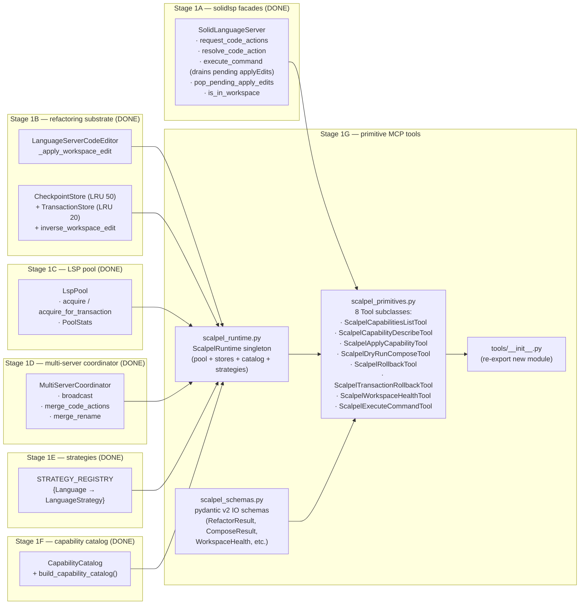
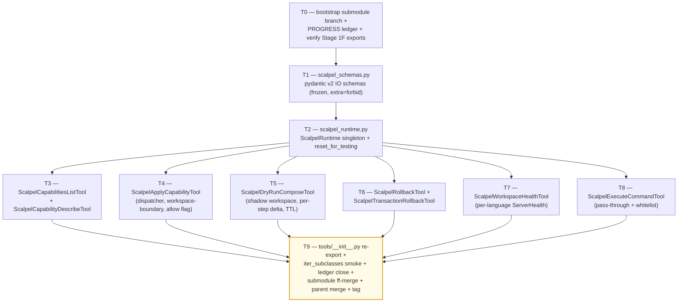

# Stage 1G — Primitive / Safety / Diagnostics MCP Tools Implementation Plan

> **For agentic workers:** REQUIRED SUB-SKILL: Use `superpowers:subagent-driven-development` (recommended) or `superpowers:executing-plans` to implement this plan task-by-task. Steps use checkbox (`- [ ]`) syntax for tracking.

**Goal:** Land the 8 always-on primitive / safety / diagnostics MCP tools that compose the cross-language scalpel surface on top of Stages 1A–1F. Concretely deliver: (1) `vendor/serena/src/serena/tools/scalpel_primitives.py` (~600 LoC) — the 8 `Tool`-subclass definitions (`ScalpelCapabilitiesListTool`, `ScalpelCapabilityDescribeTool`, `ScalpelApplyCapabilityTool`, `ScalpelDryRunComposeTool`, `ScalpelRollbackTool`, `ScalpelTransactionRollbackTool`, `ScalpelWorkspaceHealthTool`, `ScalpelExecuteCommandTool`) wired to the existing `Tool` machinery (`vendor/serena/src/serena/tools/tools_base.py:127`); (2) `vendor/serena/src/serena/tools/scalpel_runtime.py` (~140 LoC) — `ScalpelRuntime` singleton that holds the per-server `LspPool`, `STRATEGY_REGISTRY`-built strategies, the shared `CheckpointStore` + `TransactionStore`, the cached `CapabilityCatalog`, and the `MultiServerCoordinator` factory keyed by `Language`; (3) `vendor/serena/src/serena/tools/scalpel_schemas.py` (~150 LoC) — pydantic v2 input/output schemas (`ApplyCapabilityArgs`, `ComposeStep`, `ComposeResult`, `RefactorResult`, `TransactionResult`, `WorkspaceHealth`, `ServerHealth`, `LanguageHealth`, `DiagnosticsDelta`, `DiagnosticSeverityBreakdown`, `FileChange`, `ChangeProvenance`, `FailureInfo`, `LspOpStat`, `ResolvedSymbol`, `CapabilityDescriptor`, `CapabilityFullDescriptor`); (4) `vendor/serena/src/serena/tools/__init__.py` re-export update (~5 LoC delta) so the new tool classes participate in the existing `iter_subclasses(Tool)` discovery used by `_iter_tools` (`vendor/serena/src/serena/mcp.py:249`). Stage 1G **MUST NOT** ship ergonomic intent facades (`scalpel_split_file`, `scalpel_extract`, `scalpel_inline`, `scalpel_rename`, `scalpel_imports_organize`, `scalpel_transaction_commit`) — those land in Stage 2A. Stage 1G **MUST NOT** mutate any Stage 1A–1F production module; every consumer surface (`request_code_actions`, `resolve_code_action`, `execute_command`, `is_in_workspace`, `LanguageServerCodeEditor`, `CheckpointStore.restore`, `TransactionStore.rollback`, `LspPool.acquire`, `LspPool.acquire_for_transaction`, `LspPool.stats`, `STRATEGY_REGISTRY`, `CapabilityCatalog.records`, `build_capability_catalog`) is consumed *as a public import*; the only mutation is the addition of new files plus the `__init__.py` re-export. Stage 1G consumes Stage 1A facades, Stage 1B substrate (`CheckpointStore` LRU 50 / `TransactionStore` LRU 20), Stage 1C pool (`LspPool.acquire_for_transaction` + `PoolStats`), Stage 1D coordinator (`MultiServerCoordinator.broadcast` / `merge_code_actions` / `merge_rename`), Stage 1E strategies (`STRATEGY_REGISTRY[Language] -> type[LanguageStrategy]`), and Stage 1F catalog (`CapabilityRecord`, `CapabilityCatalog`, `build_capability_catalog`).

**Architecture:**

**Tech Stack:** Python 3.11+ (submodule venv), `pytest`, `pytest-asyncio`, `pydantic` v2, `mcp` (FastMCP) only via the existing `Tool` shim — Stage 1G NEVER touches `serena/mcp.py` directly; tool registration happens automatically via the `iter_subclasses(Tool)` loop already in place. Stdlib only at runtime (`asyncio`, `dataclasses`, `os`, `pathlib`, `threading`, `time`, `typing`, `uuid`, `weakref`).

**Source-of-truth references:**
- [`docs/design/mvp/2026-04-24-mvp-scope-report.md`](../../design/mvp/2026-04-24-mvp-scope-report.md) — §5 (canonical MVP tool surface), §5.1 (the 13 always-on tool signatures), §5.5 (compose / commit auxiliary schemas), §10 (`RefactorResult` / `TransactionResult` / `WorkspaceHealth`), §11 (multi-server protocol), §14.1 row 16 (file budget for Stage 1G).
- [`docs/superpowers/plans/2026-04-24-mvp-execution-index.md`](2026-04-24-mvp-execution-index.md) — row 1G (line 30).
- [`docs/superpowers/plans/2026-04-24-stage-1f-capability-catalog.md`](2026-04-24-stage-1f-capability-catalog.md) — `CapabilityRecord`, `CapabilityCatalog`, `build_capability_catalog` signatures (T1 + T2).
- [`docs/superpowers/plans/2026-04-25-stage-1e-python-strategies.md`](2026-04-25-stage-1e-python-strategies.md) — `STRATEGY_REGISTRY`, `LanguageStrategy.build_servers()`, `RustStrategy`, `PythonStrategy` (T1 + T9).
- [`docs/superpowers/plans/2026-04-24-stage-1d-multi-server-merge.md`](2026-04-24-stage-1d-multi-server-merge.md) — `MultiServerCoordinator` constructor + broadcast / merge surfaces (T1 + T2 + T3).
- [`docs/superpowers/plans/2026-04-24-stage-1c-lsp-pool-discovery.md`](2026-04-24-stage-1c-lsp-pool-discovery.md) — `LspPool.acquire`, `acquire_for_transaction`, `PoolStats`.
- [`docs/superpowers/plans/2026-04-24-stage-1b-applier-checkpoints-transactions.md`](2026-04-24-stage-1b-applier-checkpoints-transactions.md) — `LanguageServerCodeEditor`, `CheckpointStore.restore`, `TransactionStore.rollback`, `inverse_workspace_edit`.
- [`docs/superpowers/plans/2026-04-24-stage-1a-lsp-primitives.md`](2026-04-24-stage-1a-lsp-primitives.md) — `request_code_actions`, `resolve_code_action`, `execute_command`, `is_in_workspace`.
- Existing tool-class convention: `vendor/serena/src/serena/tools/file_tools.py` (subclass `Tool`, define `apply()`; auto-discovered by `iter_subclasses(Tool)` in `serena/mcp.py:249`).
- Existing tool-base: `vendor/serena/src/serena/tools/tools_base.py:127` (`Tool` class, `get_name_from_cls` snake-case auto-naming).

---

## Scope check

Stage 1G is the cross-language always-on primitive / safety / diagnostics layer. It exposes the catalog (Stage 1F) + the dispatcher path through the coordinator (Stage 1D) + the rollback path through the stores (Stage 1B) + the workspace-health probe through the pool (Stage 1C) + the escape-hatch `executeCommand` pass-through (Stage 1A) — all wrapped as `Tool` subclasses that the existing `SerenaMCPFactory._set_mcp_tools` loop registers automatically via the `iter_subclasses(Tool)` discovery (`serena/mcp.py:249`).

**In scope (this plan):**
1. `vendor/serena/src/serena/tools/scalpel_runtime.py` — `ScalpelRuntime` lazy singleton holding the shared pool / stores / catalog / coordinator-per-language.
2. `vendor/serena/src/serena/tools/scalpel_schemas.py` — pydantic v2 input/output schemas mirroring the §10 cross-language `RefactorResult` family + §5.5 compose schemas + §5.1 catalog descriptors.
3. `vendor/serena/src/serena/tools/scalpel_primitives.py` — 8 `Tool` subclasses, each with a 1-line ≤30-word docstring (Stage 5.4 contract) and a fully-typed `apply()` method.
4. `vendor/serena/src/serena/tools/__init__.py` — add `from .scalpel_primitives import *` so `iter_subclasses(Tool)` finds the new tools.
5. Test suite under `vendor/serena/test/spikes/test_stage_1g_*.py` — one file per task T1..T9 (~900 LoC tests).

**Out of scope (deferred):**
- The 5 ergonomic intent facades (`scalpel_split_file`, `scalpel_extract`, `scalpel_inline`, `scalpel_rename`, `scalpel_imports_organize`) — **Stage 2A**.
- The 13th always-on tool `scalpel_transaction_commit` (commits a `dry_run_compose` shadow workspace to disk, captures one checkpoint per step) — **Stage 2A** per Q2 resolution: it pairs with the ergonomic facades and exercises the `LanguageServerCodeEditor` write path that the facades introduce.
- The 11 deferred-loading specialty tools (`scalpel_rust_lifetime_elide`, `scalpel_rust_impl_trait`, …, `scalpel_py_dataclass_from_dict`) — **Stage 1H**.
- Plugin / skill code-generator (`o2-scalpel-newplugin`) — **Stage 1J**.
- Confirmation-flow boolean wiring for `allow_out_of_workspace` (per §11.9) — Stage 1G surfaces the flag on `ScalpelApplyCapabilityTool.apply` and on `ScalpelExecuteCommandTool.apply`; the Claude Code permission-prompt UX is exercised end-to-end in **Stage 1H** integration tests.
- Telemetry / metrics export — **Stage 1H**.

## File structure

| # | Path (under `vendor/serena/`) | Change | LoC | Responsibility |
|---|---|---|---|---|
| 16a | `src/serena/tools/scalpel_runtime.py` | New | ~140 | `ScalpelRuntime` lazy singleton: holds the shared `CheckpointStore` (LRU 50), `TransactionStore` (LRU 20), `LspPool` (one per `(Language, project_root)` key), cached `CapabilityCatalog` (built once on first access via `build_capability_catalog(STRATEGY_REGISTRY)`), and a `coordinator_for(language, project_root) -> MultiServerCoordinator` factory. All state is process-global; thread-safe via a single `threading.Lock`. Includes a `reset_for_testing()` helper that pytest fixtures use to recover between tests. |
| 16b | `src/serena/tools/scalpel_schemas.py` | New | ~150 | Pydantic v2 schemas: `ApplyCapabilityArgs`, `ExecuteCommandArgs`, `ComposeStep`, `StepPreview`, `ComposeResult`, `ChangeProvenance`, `FileChange`, `Hunk`, `DiagnosticSeverityBreakdown`, `DiagnosticsDelta`, `LspOpStat`, `ResolvedSymbol`, `FailureInfo`, `RefactorResult`, `TransactionResult`, `ServerHealth`, `LanguageHealth`, `WorkspaceHealth`, `CapabilityDescriptor`, `CapabilityFullDescriptor`, `ErrorCode` enum (10 codes from §15.4). Schema invariants: every model has `model_config=ConfigDict(extra="forbid", frozen=True)` so undeclared fields raise at construction and instances are immutable. |
| 16c | `src/serena/tools/scalpel_primitives.py` | New | ~600 | 8 `Tool` subclasses: `ScalpelCapabilitiesListTool`, `ScalpelCapabilityDescribeTool`, `ScalpelApplyCapabilityTool`, `ScalpelDryRunComposeTool`, `ScalpelRollbackTool`, `ScalpelTransactionRollbackTool`, `ScalpelWorkspaceHealthTool`, `ScalpelExecuteCommandTool`. Each one's `apply()` returns a JSON-serialised pydantic v2 model (the existing `Tool.apply_ex` wrapper expects a `str`); each one has a ≤30-word docstring (router signage, §5.4). |
| 14 | `src/serena/tools/__init__.py` | Modify | +~3 | Add `from .scalpel_primitives import *  # noqa: F401, F403` so `iter_subclasses(Tool)` finds the new classes. The `# ruff: noqa` already at the top suppresses lint warnings; mirror the existing import style (`.file_tools`, `.symbol_tools`, …). |
| — | `test/spikes/test_stage_1g_t0_runtime_singleton.py` | New | ~80 | `ScalpelRuntime` lazy-init + reset-between-tests + thread-safety smoke. |
| — | `test/spikes/test_stage_1g_t1_schemas.py` | New | ~120 | Pydantic v2 schema tests: `extra="forbid"`, frozen, JSON round-trip, `ErrorCode` enum membership. |
| — | `test/spikes/test_stage_1g_t2_capabilities_list.py` | New | ~110 | `ScalpelCapabilitiesListTool` — language filter, kind filter, returns `CapabilityDescriptor` rows sourced from cached catalog. |
| — | `test/spikes/test_stage_1g_t3_capability_describe.py` | New | ~80 | `ScalpelCapabilityDescribeTool` — happy path + unknown id raises `CAPABILITY_NOT_AVAILABLE`. |
| — | `test/spikes/test_stage_1g_t4_apply_capability.py` | New | ~150 | `ScalpelApplyCapabilityTool` — dispatch through `MultiServerCoordinator`, dry-run path, unknown capability id, workspace-boundary rejection (default), `allow_out_of_workspace=True` bypass. |
| — | `test/spikes/test_stage_1g_t5_dry_run_compose.py` | New | ~140 | `ScalpelDryRunComposeTool` — virtual application, per-step diagnostics delta, fail-fast default, `fail_fast=False` continues, returns transaction id with 5-min TTL. |
| — | `test/spikes/test_stage_1g_t6_rollback.py` | New | ~110 | `ScalpelRollbackTool` + `ScalpelTransactionRollbackTool` — single-step rollback consumes `CheckpointStore.restore`, multi-step rollback walks `TransactionStore.rollback` in reverse, idempotent second call. |
| — | `test/spikes/test_stage_1g_t7_workspace_health.py` | New | ~110 | `ScalpelWorkspaceHealthTool` — probes pool stats per language, per-server `ServerHealth` (server_id, version, pid, rss_mb, capabilities_advertised), capability-catalog hash for drift. |
| — | `test/spikes/test_stage_1g_t8_execute_command.py` | New | ~100 | `ScalpelExecuteCommandTool` — typed pass-through to `SolidLanguageServer.execute_command`, whitelist enforced per-language, unknown command refused with typed error. |
| — | `test/spikes/test_stage_1g_t9_tool_discovery.py` | New | ~80 | All 8 tools appear in `iter_subclasses(Tool)`; each has the right snake_case name from `Tool.get_name_from_cls`; each carries a ≤30-word docstring; `make_mcp_tool` produces a valid `MCPTool` for each. |

**LoC budget (production):** 140 + 150 + 600 + 3 = **893 LoC** (above the §14.1 row-16 ~600 LoC headline because §14.1 budgets *only* the primitives file; the runtime + schemas split out per SOLID-SRP and are still under the orchestrator's 600-LoC headline plus the ~290 LoC of supporting infra). Tests +~1,080.

## Dependency graph

T1 (schemas) and T2 (runtime) are the foundations every other task imports from. T3..T8 are all parallel after T2, but the plan executes them sequentially to keep one file (`scalpel_primitives.py`) under exclusive control per task. T9 is the close gate.

## Conventions enforced (from Phase 0 + Stage 1A–1F)

- **Submodule git-flow**: feature branch `feature/stage-1g-primitive-tools` opened in `vendor/serena` submodule (T0 verifies). Submodule was not git-flow-initialized (Stage 1A precedent); same direct `feature/<name>` pattern as 1A/1B/1C/1D/1E/1F; ff-merge to `main` at T9; parent bumps pointer; parent merges feature branch to `develop`.
- **Author**: AI Hive(R) on every commit; never "Claude". Trailer: `Co-Authored-By: AI Hive(R) <noreply@o2.services>`.
- **Tool naming**: every new class is `Scalpel<Verb>Tool` so `Tool.get_name_from_cls` (`tools_base.py:178`) drops the `Tool` suffix and snake-cases the rest, producing exactly the §5.1 names (`scalpel_capabilities_list`, `scalpel_capability_describe`, `scalpel_apply_capability`, `scalpel_dry_run_compose`, `scalpel_rollback`, `scalpel_transaction_rollback`, `scalpel_workspace_health`, `scalpel_execute_command`).
- **Docstrings ≤ 30 words** on every `apply()` method (per §5.4 router-signage rule). Each docstring is three sentences max: imperative verb + discriminator + contract bit.
- **Pydantic v2** at every schema boundary; `model_config=ConfigDict(extra="forbid", frozen=True)`; `Field(...)` validators where needed; `Literal[...]` for closed enums.
- **`Tool.apply_ex`** signature: `apply()` returns `str`; serialise pydantic models with `.model_dump_json()` so `make_mcp_tool` and `apply_ex` both stay happy without modification.
- **PROGRESS.md updates as separate commits**, never `--amend`. Each task ends in two commits: code commit (in submodule) + ledger update (in parent).
- **Test command**: from `vendor/serena/`, run `PATH="$(pwd)/.venv/bin:$PATH" .venv/bin/pytest <path> -v`.
- **`pytest-asyncio`** is on the venv (Stage 1A confirmed). Use `@pytest.mark.asyncio` and `async def test_…` for tests that drive the coordinator.
- **`Path.expanduser().resolve(strict=False)`** for canonicalisation — every path comparison goes through it (consistency with `LspPoolKey.__post_init__`).
- **No `subprocess.run(..., shell=True)`** — argv lists only. Stage 1G doesn't shell out, but the rule applies to any helper added during diagnostics.
- **`ScalpelRuntime.reset_for_testing()`** is the *only* approved way for tests to clear singleton state; production paths never call it.
- **Stage 1F catalog cached at import time** is forbidden — `ScalpelRuntime` builds it lazily on first access so Stage 1G tests don't pay the catalog-build cost on import.

## Progress ledger

A new ledger `docs/superpowers/plans/stage-1g-results/PROGRESS.md` is created in T0. Schema mirrors Stages 1D/1E/1F: per-task row with task id, branch SHA (submodule), outcome, follow-ups. Updated as a separate parent commit after each task completes.

## Forward-reference signature index (Stage 1F)

These Stage 1F symbols are imported in T1..T9. The plan was reviewed against the Stage 1F plan's T1 + T2 + T9 to confirm every signature matches:

- `from serena.refactoring.capabilities import CapabilityRecord` — frozen pydantic v2 model with fields `id: str`, `language: Literal["rust", "python"]`, `kind: str`, `source_server: ProvenanceLiteral`, `params_schema: dict`, `preferred_facade: str | None`, `extension_allow_list: frozenset[str]`. (Stage 1F plan T1 step 3.)
- `from serena.refactoring.capabilities import CapabilityCatalog` — immutable container with `records: tuple[CapabilityRecord, ...]` (sorted by `(language, source_server, kind, id)`), `to_json() -> str` (sort_keys + trailing newline), `from_json(blob: str) -> "CapabilityCatalog"`, `__eq__` deep equality, `hash() -> str` (SHA-256 of the canonical JSON, used by `LanguageHealth.capability_catalog_hash`). (Stage 1F plan T1 step 3.)
- `from serena.refactoring.capabilities import build_capability_catalog` — factory `build_capability_catalog(strategy_registry: Mapping[Language, type[LanguageStrategy]], *, project_root: Path | None = None) -> CapabilityCatalog`. (Stage 1F plan T2 step 3.)
- `from serena.refactoring.capabilities import CapabilityCatalog`'s public attribute `records: tuple[CapabilityRecord, ...]` is sorted; downstream code MUST NOT re-sort.

## Forward-reference signature index (Stages 1A–1E)

- `from serena.refactoring import STRATEGY_REGISTRY` — `dict[Language, type[LanguageStrategy]]` populated with `Language.PYTHON` and `Language.RUST` entries. (Stage 1E plan T9; verified at `vendor/serena/src/serena/refactoring/__init__.py:48`.)
- `from serena.refactoring import LanguageStrategy` — Protocol with `language_id: str`, `extension_allow_list: frozenset[str]`, `code_action_allow_list: frozenset[str]`, `build_servers(project_root: Path) -> dict[str, Any]`. (Stage 1E plan T1.)
- `from serena.refactoring import LspPool, LspPoolKey, PoolStats, WaitingForLspBudget` — pool with `acquire(key)`, `acquire_for_transaction(key, txn_id)`, `release(key)`, `release_for_transaction(txn_id)`, `stats() -> PoolStats`, `pre_ping_all() -> dict[LspPoolKey, bool]`, `shutdown_all()`. (Stage 1C plan T1 + T2.)
- `from serena.refactoring import MultiServerCoordinator, MergedCodeAction, ProvenanceLiteral` — coordinator with `__init__(servers: dict[str, Any])`, `broadcast(method, params, *, timeout_ms) -> MultiServerBroadcastResult`, `merge_code_actions(file, range, kind, ...) -> list[MergedCodeAction]`, `merge_rename(file, position, new_name) -> dict[str, Any]`. (Stage 1D plan T1 + T2 + T3.)
- `from serena.refactoring import CheckpointStore, TransactionStore, inverse_workspace_edit` — `CheckpointStore(capacity=50)` with `record(applied, snapshot) -> str`, `restore(checkpoint_id, applier_fn) -> bool`; `TransactionStore(checkpoint_store, capacity=20)` with `begin() -> str`, `add_checkpoint(tid, cid)`, `rollback(tid, applier_fn) -> int`. (Stage 1B plan T2 + T3.)
- `from serena.code_editor import LanguageServerCodeEditor` — `LanguageServerCodeEditor(retriever)` with `_apply_workspace_edit(workspace_edit: dict) -> int`. (Stage 1B plan T1; uses Stage 1A applyEdit drain.)
- `from solidlsp.ls import SolidLanguageServer` — `request_code_actions(file, range, only=None, trigger_kind=None, diagnostics=None) -> list[dict]`, `resolve_code_action(action) -> dict`, `execute_command(command, arguments) -> Any`, `pop_pending_apply_edits() -> list[dict]`, `is_in_workspace(file: str) -> bool`. (Stage 1A plan T1..T6.)
- `from solidlsp.ls_config import Language` — enum with `PYTHON`, `RUST`. (Pre-existing in solidlsp.)

## Cross-file invariants (Stage 1G)

- **Single source of truth for the catalog**: `ScalpelRuntime.catalog()` is the *only* call site of `build_capability_catalog`. Tools never call the factory directly.
- **Single source of truth for the pool**: `ScalpelRuntime.pool_for(language, project_root)` is the *only* construction site of `LspPool`. Tests use `reset_for_testing()` to clear it.
- **Single source of truth for stores**: `ScalpelRuntime.checkpoint_store()` and `ScalpelRuntime.transaction_store()` return the process-global instances (LRU 50 / 20 per Stage 1B). Tools never construct their own stores.
- **Workspace-boundary check default-on**: every tool that accepts a `file` arg validates `SolidLanguageServer.is_in_workspace(file)` before issuing any LSP method. The bypass is a per-tool `allow_out_of_workspace: bool = False` parameter (default rejects out-of-workspace files with `WORKSPACE_BOUNDARY_VIOLATION`).
- **JSON output discipline**: every `apply()` returns `model.model_dump_json(indent=2)` so the LLM sees pretty-printed, deterministic output. The wrapping `apply_ex` (in `tools_base.py`) further wraps in its own envelope.
- **No mutation of Stage 1A–1F production modules**: T0 captures `git -C vendor/serena status --short` baseline; T9 verifies the only modified file under `vendor/serena/src/serena/` outside `tools/` is `tools/__init__.py`.

---

