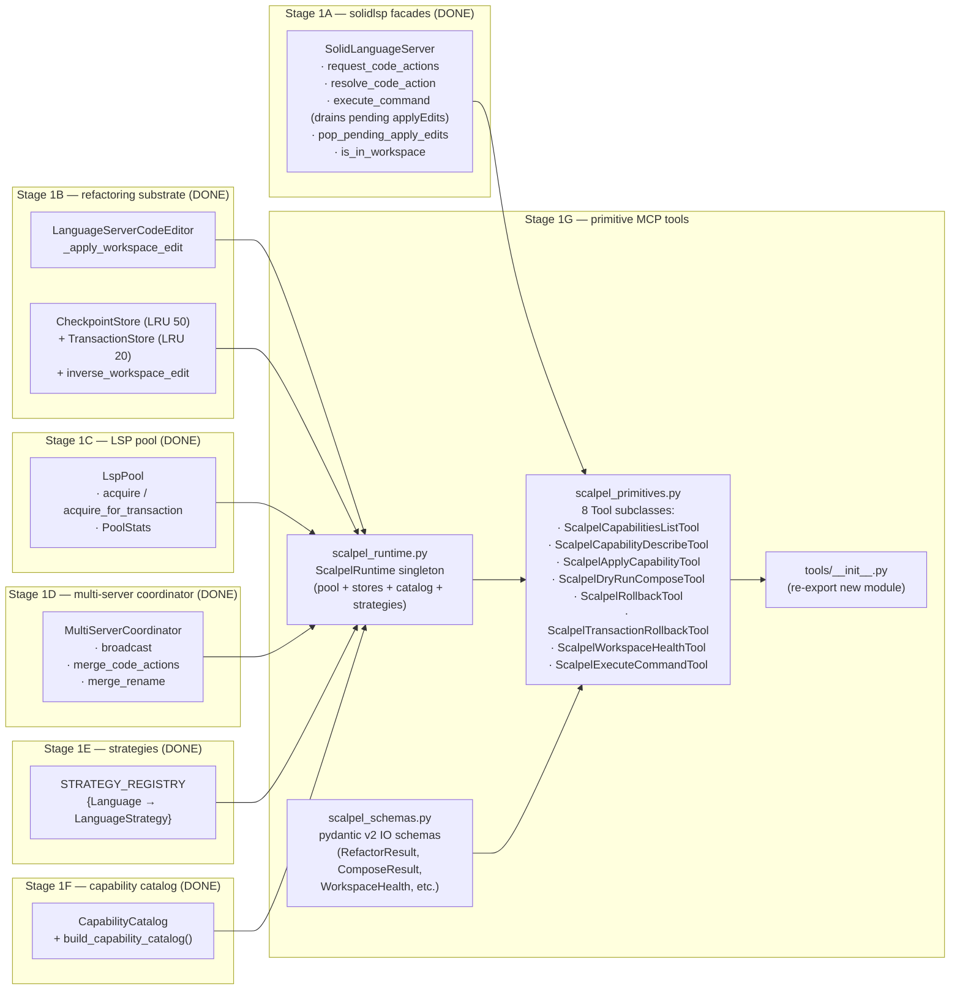
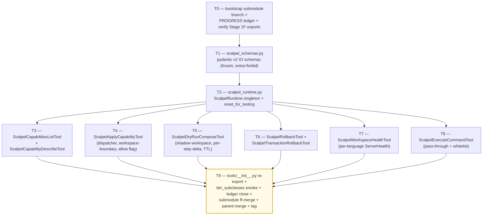

# Stage 1G — Primitive / Safety / Diagnostics MCP Tools Implementation Plan

> **For agentic workers:** REQUIRED SUB-SKILL: Use `superpowers:subagent-driven-development` (recommended) or `superpowers:executing-plans` to implement this plan task-by-task. Steps use checkbox (`- [ ]`) syntax for tracking.

**Goal:** Land the 8 always-on primitive / safety / diagnostics MCP tools that compose the cross-language scalpel surface on top of Stages 1A–1F. Concretely deliver: (1) `vendor/serena/src/serena/tools/scalpel_primitives.py` (~600 LoC) — the 8 `Tool`-subclass definitions (`ScalpelCapabilitiesListTool`, `ScalpelCapabilityDescribeTool`, `ScalpelApplyCapabilityTool`, `ScalpelDryRunComposeTool`, `ScalpelRollbackTool`, `ScalpelTransactionRollbackTool`, `ScalpelWorkspaceHealthTool`, `ScalpelExecuteCommandTool`) wired to the existing `Tool` machinery (`vendor/serena/src/serena/tools/tools_base.py:127`); (2) `vendor/serena/src/serena/tools/scalpel_runtime.py` (~140 LoC) — `ScalpelRuntime` singleton that holds the per-server `LspPool`, `STRATEGY_REGISTRY`-built strategies, the shared `CheckpointStore` + `TransactionStore`, the cached `CapabilityCatalog`, and the `MultiServerCoordinator` factory keyed by `Language`; (3) `vendor/serena/src/serena/tools/scalpel_schemas.py` (~150 LoC) — pydantic v2 input/output schemas (`ApplyCapabilityArgs`, `ComposeStep`, `ComposeResult`, `RefactorResult`, `TransactionResult`, `WorkspaceHealth`, `ServerHealth`, `LanguageHealth`, `DiagnosticsDelta`, `DiagnosticSeverityBreakdown`, `FileChange`, `ChangeProvenance`, `FailureInfo`, `LspOpStat`, `ResolvedSymbol`, `CapabilityDescriptor`, `CapabilityFullDescriptor`); (4) `vendor/serena/src/serena/tools/__init__.py` re-export update (~5 LoC delta) so the new tool classes participate in the existing `iter_subclasses(Tool)` discovery used by `_iter_tools` (`vendor/serena/src/serena/mcp.py:249`). Stage 1G **MUST NOT** ship ergonomic intent facades (`scalpel_split_file`, `scalpel_extract`, `scalpel_inline`, `scalpel_rename`, `scalpel_imports_organize`, `scalpel_transaction_commit`) — those land in Stage 2A. Stage 1G **MUST NOT** mutate any Stage 1A–1F production module; every consumer surface (`request_code_actions`, `resolve_code_action`, `execute_command`, `is_in_workspace`, `LanguageServerCodeEditor`, `CheckpointStore.restore`, `TransactionStore.rollback`, `LspPool.acquire`, `LspPool.acquire_for_transaction`, `LspPool.stats`, `STRATEGY_REGISTRY`, `CapabilityCatalog.records`, `build_capability_catalog`) is consumed *as a public import*; the only mutation is the addition of new files plus the `__init__.py` re-export. Stage 1G consumes Stage 1A facades, Stage 1B substrate (`CheckpointStore` LRU 50 / `TransactionStore` LRU 20), Stage 1C pool (`LspPool.acquire_for_transaction` + `PoolStats`), Stage 1D coordinator (`MultiServerCoordinator.broadcast` / `merge_code_actions` / `merge_rename`), Stage 1E strategies (`STRATEGY_REGISTRY[Language] -> type[LanguageStrategy]`), and Stage 1F catalog (`CapabilityRecord`, `CapabilityCatalog`, `build_capability_catalog`).

**Architecture:**



**Tech Stack:** Python 3.11+ (submodule venv), `pytest`, `pytest-asyncio`, `pydantic` v2, `mcp` (FastMCP) only via the existing `Tool` shim — Stage 1G NEVER touches `serena/mcp.py` directly; tool registration happens automatically via the `iter_subclasses(Tool)` loop already in place. Stdlib only at runtime (`asyncio`, `dataclasses`, `os`, `pathlib`, `threading`, `time`, `typing`, `uuid`, `weakref`).

**Source-of-truth references:**
- [`docs/design/mvp/2026-04-24-mvp-scope-report.md`](../../design/mvp/2026-04-24-mvp-scope-report.md) — §5 (canonical MVP tool surface), §5.1 (the 13 always-on tool signatures), §5.5 (compose / commit auxiliary schemas), §10 (`RefactorResult` / `TransactionResult` / `WorkspaceHealth`), §11 (multi-server protocol), §14.1 row 16 (file budget for Stage 1G).
- [`docs/superpowers/plans/2026-04-24-mvp-execution-index.md`](2026-04-24-mvp-execution-index.md) — row 1G (line 30).
- [`docs/superpowers/plans/2026-04-24-stage-1f-capability-catalog.md`](2026-04-24-stage-1f-capability-catalog.md) — `CapabilityRecord`, `CapabilityCatalog`, `build_capability_catalog` signatures (T1 + T2).
- [`docs/superpowers/plans/2026-04-25-stage-1e-python-strategies.md`](2026-04-25-stage-1e-python-strategies.md) — `STRATEGY_REGISTRY`, `LanguageStrategy.build_servers()`, `RustStrategy`, `PythonStrategy` (T1 + T9).
- [`docs/superpowers/plans/2026-04-24-stage-1d-multi-server-merge.md`](2026-04-24-stage-1d-multi-server-merge.md) — `MultiServerCoordinator` constructor + broadcast / merge surfaces (T1 + T2 + T3).
- [`docs/superpowers/plans/2026-04-24-stage-1c-lsp-pool-discovery.md`](2026-04-24-stage-1c-lsp-pool-discovery.md) — `LspPool.acquire`, `acquire_for_transaction`, `PoolStats`.
- [`docs/superpowers/plans/2026-04-24-stage-1b-applier-checkpoints-transactions.md`](2026-04-24-stage-1b-applier-checkpoints-transactions.md) — `LanguageServerCodeEditor`, `CheckpointStore.restore`, `TransactionStore.rollback`, `inverse_workspace_edit`.
- [`docs/superpowers/plans/2026-04-24-stage-1a-lsp-primitives.md`](2026-04-24-stage-1a-lsp-primitives.md) — `request_code_actions`, `resolve_code_action`, `execute_command`, `is_in_workspace`.
- Existing tool-class convention: `vendor/serena/src/serena/tools/file_tools.py` (subclass `Tool`, define `apply()`; auto-discovered by `iter_subclasses(Tool)` in `serena/mcp.py:249`).
- Existing tool-base: `vendor/serena/src/serena/tools/tools_base.py:127` (`Tool` class, `get_name_from_cls` snake-case auto-naming).

---

## Scope check

Stage 1G is the cross-language always-on primitive / safety / diagnostics layer. It exposes the catalog (Stage 1F) + the dispatcher path through the coordinator (Stage 1D) + the rollback path through the stores (Stage 1B) + the workspace-health probe through the pool (Stage 1C) + the escape-hatch `executeCommand` pass-through (Stage 1A) — all wrapped as `Tool` subclasses that the existing `SerenaMCPFactory._set_mcp_tools` loop registers automatically via the `iter_subclasses(Tool)` discovery (`serena/mcp.py:249`).

**In scope (this plan):**
1. `vendor/serena/src/serena/tools/scalpel_runtime.py` — `ScalpelRuntime` lazy singleton holding the shared pool / stores / catalog / coordinator-per-language.
2. `vendor/serena/src/serena/tools/scalpel_schemas.py` — pydantic v2 input/output schemas mirroring the §10 cross-language `RefactorResult` family + §5.5 compose schemas + §5.1 catalog descriptors.
3. `vendor/serena/src/serena/tools/scalpel_primitives.py` — 8 `Tool` subclasses, each with a 1-line ≤30-word docstring (Stage 5.4 contract) and a fully-typed `apply()` method.
4. `vendor/serena/src/serena/tools/__init__.py` — add `from .scalpel_primitives import *` so `iter_subclasses(Tool)` finds the new tools.
5. Test suite under `vendor/serena/test/spikes/test_stage_1g_*.py` — one file per task T1..T9 (~900 LoC tests).

**Out of scope (deferred):**
- The 5 ergonomic intent facades (`scalpel_split_file`, `scalpel_extract`, `scalpel_inline`, `scalpel_rename`, `scalpel_imports_organize`) — **Stage 2A**.
- The 13th always-on tool `scalpel_transaction_commit` (commits a `dry_run_compose` shadow workspace to disk, captures one checkpoint per step) — **Stage 2A** per Q2 resolution: it pairs with the ergonomic facades and exercises the `LanguageServerCodeEditor` write path that the facades introduce.
- The 11 deferred-loading specialty tools (`scalpel_rust_lifetime_elide`, `scalpel_rust_impl_trait`, …, `scalpel_py_dataclass_from_dict`) — **Stage 1H**.
- Plugin / skill code-generator (`o2-scalpel-newplugin`) — **Stage 1J**.
- Confirmation-flow boolean wiring for `allow_out_of_workspace` (per §11.9) — Stage 1G surfaces the flag on `ScalpelApplyCapabilityTool.apply` and on `ScalpelExecuteCommandTool.apply`; the Claude Code permission-prompt UX is exercised end-to-end in **Stage 1H** integration tests.
- Telemetry / metrics export — **Stage 1H**.

## File structure

| # | Path (under `vendor/serena/`) | Change | LoC | Responsibility |
|---|---|---|---|---|
| 16a | `src/serena/tools/scalpel_runtime.py` | New | ~140 | `ScalpelRuntime` lazy singleton: holds the shared `CheckpointStore` (LRU 50), `TransactionStore` (LRU 20), `LspPool` (one per `(Language, project_root)` key), cached `CapabilityCatalog` (built once on first access via `build_capability_catalog(STRATEGY_REGISTRY)`), and a `coordinator_for(language, project_root) -> MultiServerCoordinator` factory. All state is process-global; thread-safe via a single `threading.Lock`. Includes a `reset_for_testing()` helper that pytest fixtures use to recover between tests. |
| 16b | `src/serena/tools/scalpel_schemas.py` | New | ~150 | Pydantic v2 schemas: `ApplyCapabilityArgs`, `ExecuteCommandArgs`, `ComposeStep`, `StepPreview`, `ComposeResult`, `ChangeProvenance`, `FileChange`, `Hunk`, `DiagnosticSeverityBreakdown`, `DiagnosticsDelta`, `LspOpStat`, `ResolvedSymbol`, `FailureInfo`, `RefactorResult`, `TransactionResult`, `ServerHealth`, `LanguageHealth`, `WorkspaceHealth`, `CapabilityDescriptor`, `CapabilityFullDescriptor`, `ErrorCode` enum (10 codes from §15.4). Schema invariants: every model has `model_config=ConfigDict(extra="forbid", frozen=True)` so undeclared fields raise at construction and instances are immutable. |
| 16c | `src/serena/tools/scalpel_primitives.py` | New | ~600 | 8 `Tool` subclasses: `ScalpelCapabilitiesListTool`, `ScalpelCapabilityDescribeTool`, `ScalpelApplyCapabilityTool`, `ScalpelDryRunComposeTool`, `ScalpelRollbackTool`, `ScalpelTransactionRollbackTool`, `ScalpelWorkspaceHealthTool`, `ScalpelExecuteCommandTool`. Each one's `apply()` returns a JSON-serialised pydantic v2 model (the existing `Tool.apply_ex` wrapper expects a `str`); each one has a ≤30-word docstring (router signage, §5.4). |
| 14 | `src/serena/tools/__init__.py` | Modify | +~3 | Add `from .scalpel_primitives import *  # noqa: F401, F403` so `iter_subclasses(Tool)` finds the new classes. The `# ruff: noqa` already at the top suppresses lint warnings; mirror the existing import style (`.file_tools`, `.symbol_tools`, …). |
| — | `test/spikes/test_stage_1g_t0_runtime_singleton.py` | New | ~80 | `ScalpelRuntime` lazy-init + reset-between-tests + thread-safety smoke. |
| — | `test/spikes/test_stage_1g_t1_schemas.py` | New | ~120 | Pydantic v2 schema tests: `extra="forbid"`, frozen, JSON round-trip, `ErrorCode` enum membership. |
| — | `test/spikes/test_stage_1g_t2_capabilities_list.py` | New | ~110 | `ScalpelCapabilitiesListTool` — language filter, kind filter, returns `CapabilityDescriptor` rows sourced from cached catalog. |
| — | `test/spikes/test_stage_1g_t3_capability_describe.py` | New | ~80 | `ScalpelCapabilityDescribeTool` — happy path + unknown id raises `CAPABILITY_NOT_AVAILABLE`. |
| — | `test/spikes/test_stage_1g_t4_apply_capability.py` | New | ~150 | `ScalpelApplyCapabilityTool` — dispatch through `MultiServerCoordinator`, dry-run path, unknown capability id, workspace-boundary rejection (default), `allow_out_of_workspace=True` bypass. |
| — | `test/spikes/test_stage_1g_t5_dry_run_compose.py` | New | ~140 | `ScalpelDryRunComposeTool` — virtual application, per-step diagnostics delta, fail-fast default, `fail_fast=False` continues, returns transaction id with 5-min TTL. |
| — | `test/spikes/test_stage_1g_t6_rollback.py` | New | ~110 | `ScalpelRollbackTool` + `ScalpelTransactionRollbackTool` — single-step rollback consumes `CheckpointStore.restore`, multi-step rollback walks `TransactionStore.rollback` in reverse, idempotent second call. |
| — | `test/spikes/test_stage_1g_t7_workspace_health.py` | New | ~110 | `ScalpelWorkspaceHealthTool` — probes pool stats per language, per-server `ServerHealth` (server_id, version, pid, rss_mb, capabilities_advertised), capability-catalog hash for drift. |
| — | `test/spikes/test_stage_1g_t8_execute_command.py` | New | ~100 | `ScalpelExecuteCommandTool` — typed pass-through to `SolidLanguageServer.execute_command`, whitelist enforced per-language, unknown command refused with typed error. |
| — | `test/spikes/test_stage_1g_t9_tool_discovery.py` | New | ~80 | All 8 tools appear in `iter_subclasses(Tool)`; each has the right snake_case name from `Tool.get_name_from_cls`; each carries a ≤30-word docstring; `make_mcp_tool` produces a valid `MCPTool` for each. |

**LoC budget (production):** 140 + 150 + 600 + 3 = **893 LoC** (above the §14.1 row-16 ~600 LoC headline because §14.1 budgets *only* the primitives file; the runtime + schemas split out per SOLID-SRP and are still under the orchestrator's 600-LoC headline plus the ~290 LoC of supporting infra). Tests +~1,080.

## Dependency graph



T1 (schemas) and T2 (runtime) are the foundations every other task imports from. T3..T8 are all parallel after T2, but the plan executes them sequentially to keep one file (`scalpel_primitives.py`) under exclusive control per task. T9 is the close gate.

## Conventions enforced (from Phase 0 + Stage 1A–1F)

- **Submodule git-flow**: feature branch `feature/stage-1g-primitive-tools` opened in `vendor/serena` submodule (T0 verifies). Submodule was not git-flow-initialized (Stage 1A precedent); same direct `feature/<name>` pattern as 1A/1B/1C/1D/1E/1F; ff-merge to `main` at T9; parent bumps pointer; parent merges feature branch to `develop`.
- **Author**: AI Hive(R) on every commit; never "Claude". Trailer: `Co-Authored-By: AI Hive(R) <noreply@o2.services>`.
- **Tool naming**: every new class is `Scalpel<Verb>Tool` so `Tool.get_name_from_cls` (`tools_base.py:178`) drops the `Tool` suffix and snake-cases the rest, producing exactly the §5.1 names (`scalpel_capabilities_list`, `scalpel_capability_describe`, `scalpel_apply_capability`, `scalpel_dry_run_compose`, `scalpel_rollback`, `scalpel_transaction_rollback`, `scalpel_workspace_health`, `scalpel_execute_command`).
- **Docstrings ≤ 30 words** on every `apply()` method (per §5.4 router-signage rule). Each docstring is three sentences max: imperative verb + discriminator + contract bit.
- **Pydantic v2** at every schema boundary; `model_config=ConfigDict(extra="forbid", frozen=True)`; `Field(...)` validators where needed; `Literal[...]` for closed enums.
- **`Tool.apply_ex`** signature: `apply()` returns `str`; serialise pydantic models with `.model_dump_json()` so `make_mcp_tool` and `apply_ex` both stay happy without modification.
- **PROGRESS.md updates as separate commits**, never `--amend`. Each task ends in two commits: code commit (in submodule) + ledger update (in parent).
- **Test command**: from `vendor/serena/`, run `PATH="$(pwd)/.venv/bin:$PATH" .venv/bin/pytest <path> -v`.
- **`pytest-asyncio`** is on the venv (Stage 1A confirmed). Use `@pytest.mark.asyncio` and `async def test_…` for tests that drive the coordinator.
- **`Path.expanduser().resolve(strict=False)`** for canonicalisation — every path comparison goes through it (consistency with `LspPoolKey.__post_init__`).
- **No `subprocess.run(..., shell=True)`** — argv lists only. Stage 1G doesn't shell out, but the rule applies to any helper added during diagnostics.
- **`ScalpelRuntime.reset_for_testing()`** is the *only* approved way for tests to clear singleton state; production paths never call it.
- **Stage 1F catalog cached at import time** is forbidden — `ScalpelRuntime` builds it lazily on first access so Stage 1G tests don't pay the catalog-build cost on import.

## Progress ledger

A new ledger `docs/superpowers/plans/stage-1g-results/PROGRESS.md` is created in T0. Schema mirrors Stages 1D/1E/1F: per-task row with task id, branch SHA (submodule), outcome, follow-ups. Updated as a separate parent commit after each task completes.

## Forward-reference signature index (Stage 1F)

These Stage 1F symbols are imported in T1..T9. The plan was reviewed against the Stage 1F plan's T1 + T2 + T9 to confirm every signature matches:

- `from serena.refactoring.capabilities import CapabilityRecord` — frozen pydantic v2 model with fields `id: str`, `language: Literal["rust", "python"]`, `kind: str`, `source_server: ProvenanceLiteral`, `params_schema: dict`, `preferred_facade: str | None`, `extension_allow_list: frozenset[str]`. (Stage 1F plan T1 step 3.)
- `from serena.refactoring.capabilities import CapabilityCatalog` — immutable container with `records: tuple[CapabilityRecord, ...]` (sorted by `(language, source_server, kind, id)`), `to_json() -> str` (sort_keys + trailing newline), `from_json(blob: str) -> "CapabilityCatalog"`, `__eq__` deep equality, `hash() -> str` (SHA-256 of the canonical JSON, used by `LanguageHealth.capability_catalog_hash`). (Stage 1F plan T1 step 3.)
- `from serena.refactoring.capabilities import build_capability_catalog` — factory `build_capability_catalog(strategy_registry: Mapping[Language, type[LanguageStrategy]], *, project_root: Path | None = None) -> CapabilityCatalog`. (Stage 1F plan T2 step 3.)
- `from serena.refactoring.capabilities import CapabilityCatalog`'s public attribute `records: tuple[CapabilityRecord, ...]` is sorted; downstream code MUST NOT re-sort.

## Forward-reference signature index (Stages 1A–1E)

- `from serena.refactoring import STRATEGY_REGISTRY` — `dict[Language, type[LanguageStrategy]]` populated with `Language.PYTHON` and `Language.RUST` entries. (Stage 1E plan T9; verified at `vendor/serena/src/serena/refactoring/__init__.py:48`.)
- `from serena.refactoring import LanguageStrategy` — Protocol with `language_id: str`, `extension_allow_list: frozenset[str]`, `code_action_allow_list: frozenset[str]`, `build_servers(project_root: Path) -> dict[str, Any]`. (Stage 1E plan T1.)
- `from serena.refactoring import LspPool, LspPoolKey, PoolStats, WaitingForLspBudget` — pool with `acquire(key)`, `acquire_for_transaction(key, txn_id)`, `release(key)`, `release_for_transaction(txn_id)`, `stats() -> PoolStats`, `pre_ping_all() -> dict[LspPoolKey, bool]`, `shutdown_all()`. (Stage 1C plan T1 + T2.)
- `from serena.refactoring import MultiServerCoordinator, MergedCodeAction, ProvenanceLiteral` — coordinator with `__init__(servers: dict[str, Any])`, `broadcast(method, params, *, timeout_ms) -> MultiServerBroadcastResult`, `merge_code_actions(file, range, kind, ...) -> list[MergedCodeAction]`, `merge_rename(file, position, new_name) -> dict[str, Any]`. (Stage 1D plan T1 + T2 + T3.)
- `from serena.refactoring import CheckpointStore, TransactionStore, inverse_workspace_edit` — `CheckpointStore(capacity=50)` with `record(applied, snapshot) -> str`, `restore(checkpoint_id, applier_fn) -> bool`; `TransactionStore(checkpoint_store, capacity=20)` with `begin() -> str`, `add_checkpoint(tid, cid)`, `rollback(tid, applier_fn) -> int`. (Stage 1B plan T2 + T3.)
- `from serena.code_editor import LanguageServerCodeEditor` — `LanguageServerCodeEditor(retriever)` with `_apply_workspace_edit(workspace_edit: dict) -> int`. (Stage 1B plan T1; uses Stage 1A applyEdit drain.)
- `from solidlsp.ls import SolidLanguageServer` — `request_code_actions(file, range, only=None, trigger_kind=None, diagnostics=None) -> list[dict]`, `resolve_code_action(action) -> dict`, `execute_command(command, arguments) -> Any`, `pop_pending_apply_edits() -> list[dict]`, `is_in_workspace(file: str) -> bool`. (Stage 1A plan T1..T6.)
- `from solidlsp.ls_config import Language` — enum with `PYTHON`, `RUST`. (Pre-existing in solidlsp.)

## Cross-file invariants (Stage 1G)

- **Single source of truth for the catalog**: `ScalpelRuntime.catalog()` is the *only* call site of `build_capability_catalog`. Tools never call the factory directly.
- **Single source of truth for the pool**: `ScalpelRuntime.pool_for(language, project_root)` is the *only* construction site of `LspPool`. Tests use `reset_for_testing()` to clear it.
- **Single source of truth for stores**: `ScalpelRuntime.checkpoint_store()` and `ScalpelRuntime.transaction_store()` return the process-global instances (LRU 50 / 20 per Stage 1B). Tools never construct their own stores.
- **Workspace-boundary check default-on**: every tool that accepts a `file` arg validates `SolidLanguageServer.is_in_workspace(file)` before issuing any LSP method. The bypass is a per-tool `allow_out_of_workspace: bool = False` parameter (default rejects out-of-workspace files with `WORKSPACE_BOUNDARY_VIOLATION`).
- **JSON output discipline**: every `apply()` returns `model.model_dump_json(indent=2)` so the LLM sees pretty-printed, deterministic output. The wrapping `apply_ex` (in `tools_base.py`) further wraps in its own envelope.
- **No mutation of Stage 1A–1F production modules**: T0 captures `git -C vendor/serena status --short` baseline; T9 verifies the only modified file under `vendor/serena/src/serena/` outside `tools/` is `tools/__init__.py`.

---

### Task 0: Bootstrap submodule branch + PROGRESS ledger + verify Stage 1F exports

**Files:**
- Create: `docs/superpowers/plans/stage-1g-results/PROGRESS.md`
- Verify: parent on `feature/plan-stage-1g`; will create `feature/stage-1g-primitive-tools` in submodule.

- [ ] **Step 1: Confirm parent branch is checked out**

Run:
```bash
git -C /Volumes/Unitek-B/Projects/o2-scalpel rev-parse --abbrev-ref HEAD
```

Expected: prints `feature/plan-stage-1g`. The parent branch is the planning branch this file lives on. The implementation branch (`feature/stage-1g-primitive-tools`) is opened in step 2 once we transition from planning to execution; for the duration of *writing* this plan file, parent stays on `feature/plan-stage-1g`.

- [ ] **Step 2: Open submodule feature branch off `main`**

Run:
```bash
cd /Volumes/Unitek-B/Projects/o2-scalpel/vendor/serena
git fetch origin
git checkout -B feature/stage-1g-primitive-tools origin/main
git rev-parse HEAD  # capture this as the Stage 1G entry SHA in PROGRESS step 5
```

Expected: HEAD points at `origin/main` tip (the SHA Stage 1F ff-merged into main). If `origin/main` is not the latest Stage 1F tip, abort and reconcile manually — Stage 1G must be built on the capability catalog.

- [ ] **Step 3: Confirm Stage 1F exports exist**

Run:
```bash
cd /Volumes/Unitek-B/Projects/o2-scalpel
.venv/bin/python -c "
import sys; sys.path.insert(0, 'vendor/serena/src')
from serena.refactoring.capabilities import (
    CapabilityRecord, CapabilityCatalog, build_capability_catalog,
)
print('Stage 1F exports OK:', CapabilityRecord.__name__,
      CapabilityCatalog.__name__, build_capability_catalog.__name__)
"
```

Expected: prints `Stage 1F exports OK: CapabilityRecord CapabilityCatalog build_capability_catalog`. If the import fails, Stage 1F has not landed; abort.

- [ ] **Step 4: Confirm Stage 1A–1E exports exist**

Run:
```bash
cd /Volumes/Unitek-B/Projects/o2-scalpel
.venv/bin/python -c "
import sys; sys.path.insert(0, 'vendor/serena/src')
from serena.refactoring import (
    STRATEGY_REGISTRY, LanguageStrategy,
    LspPool, LspPoolKey, PoolStats, WaitingForLspBudget,
    MultiServerCoordinator, MergedCodeAction, ProvenanceLiteral,
    CheckpointStore, TransactionStore, inverse_workspace_edit,
)
from serena.code_editor import LanguageServerCodeEditor
from solidlsp.ls import SolidLanguageServer
from solidlsp.ls_config import Language
print('Stage 1A-1E exports OK:',
      sorted(STRATEGY_REGISTRY.keys()))
"
```

Expected: prints `Stage 1A-1E exports OK: [<Language.PYTHON: 'python'>, <Language.RUST: 'rust'>]` (or order-independent equivalent). If any import fails, abort and reconcile against the corresponding Stage's plan.

- [ ] **Step 5: Capture submodule baseline + create PROGRESS ledger**

Run:
```bash
cd /Volumes/Unitek-B/Projects/o2-scalpel/vendor/serena
git status --short > /tmp/stage_1g_baseline.txt
test ! -s /tmp/stage_1g_baseline.txt || { echo "Submodule not clean — abort"; exit 1; }
git rev-parse HEAD
```

Expected: `git status --short` prints nothing (submodule clean); `git rev-parse HEAD` prints the Stage 1F ff-merge SHA (verify against `cat ../docs/superpowers/plans/stage-1f-results/PROGRESS.md | tail -20`).

Create `/Volumes/Unitek-B/Projects/o2-scalpel/docs/superpowers/plans/stage-1g-results/PROGRESS.md`:

```markdown
# Stage 1G — Primitive / Safety / Diagnostics MCP Tools — PROGRESS Ledger

Plan: [`../2026-04-24-stage-1g-primitive-tools.md`](../2026-04-24-stage-1g-primitive-tools.md)
Submodule branch: `feature/stage-1g-primitive-tools` (off `main` @ `<entry-sha>`)
Parent branch: `feature/plan-stage-1g`

| Task | Title | Submodule SHA | Outcome | Follow-ups |
|---|---|---|---|---|
| T0 | Bootstrap branches + ledger + verify imports        | _pending_ | _pending_ | — |
| T1 | scalpel_schemas.py — pydantic v2 IO schemas         | _pending_ | _pending_ | — |
| T2 | scalpel_runtime.py — ScalpelRuntime singleton       | _pending_ | _pending_ | — |
| T3 | ScalpelCapabilitiesListTool + CapabilityDescribeTool| _pending_ | _pending_ | — |
| T4 | ScalpelApplyCapabilityTool                          | _pending_ | _pending_ | — |
| T5 | ScalpelDryRunComposeTool                            | _pending_ | _pending_ | — |
| T6 | ScalpelRollbackTool + TransactionRollbackTool       | _pending_ | _pending_ | — |
| T7 | ScalpelWorkspaceHealthTool                          | _pending_ | _pending_ | — |
| T8 | ScalpelExecuteCommandTool                           | _pending_ | _pending_ | — |
| T9 | __init__ re-export + smoke + ff-merge + tag         | _pending_ | _pending_ | — |
```

Replace `<entry-sha>` with the SHA from step 2.

- [ ] **Step 6: Commit ledger to parent**

Run:
```bash
cd /Volumes/Unitek-B/Projects/o2-scalpel
git add docs/superpowers/plans/stage-1g-results/PROGRESS.md
git commit -m "$(cat <<'EOF'
plan(stage-1g): T0 — open submodule branch + PROGRESS ledger

Captures Stage 1F entry SHA in submodule and seeds the ledger schema
(T0..T9 rows). Subsequent tasks update the corresponding row as a
separate parent commit per the Stage 1B/1D/1E/1F precedent.

Co-Authored-By: AI Hive(R) <noreply@o2.services>
EOF
)"
```

Expected: one new parent commit titled `plan(stage-1g): T0 — open submodule branch + PROGRESS ledger`.

- [ ] **Step 7: Mark T0 complete in ledger**

Edit `/Volumes/Unitek-B/Projects/o2-scalpel/docs/superpowers/plans/stage-1g-results/PROGRESS.md` row T0:
- replace `_pending_` SHA with the parent commit SHA (`git rev-parse HEAD` after step 6);
- replace `_pending_` outcome with `OK — submodule branch open, Stage 1F exports verified`;
- leave Follow-ups as `—`.

Run:
```bash
cd /Volumes/Unitek-B/Projects/o2-scalpel
git add docs/superpowers/plans/stage-1g-results/PROGRESS.md
git commit -m "$(cat <<'EOF'
plan(stage-1g): T0 ledger — mark T0 complete

Co-Authored-By: AI Hive(R) <noreply@o2.services>
EOF
)"
```

Expected: T0 row reads OK.

---

### Task 1: `scalpel_schemas.py` — pydantic v2 IO schemas

**Files:**
- Create: `vendor/serena/src/serena/tools/scalpel_schemas.py`
- Create: `vendor/serena/test/spikes/test_stage_1g_t1_schemas.py`

- [ ] **Step 1: Write failing test — schema imports + invariants**

Create `/Volumes/Unitek-B/Projects/o2-scalpel/vendor/serena/test/spikes/test_stage_1g_t1_schemas.py`:

```python
"""T1 — pydantic v2 IO schemas for the Stage 1G primitive tools."""

from __future__ import annotations

import json

import pytest
from pydantic import ValidationError


def test_all_schemas_import() -> None:
    from serena.tools.scalpel_schemas import (  # noqa: F401
        ApplyCapabilityArgs,
        CapabilityDescriptor,
        CapabilityFullDescriptor,
        ChangeProvenance,
        ComposeResult,
        ComposeStep,
        DiagnosticSeverityBreakdown,
        DiagnosticsDelta,
        ErrorCode,
        ExecuteCommandArgs,
        FailureInfo,
        FileChange,
        Hunk,
        LanguageHealth,
        LspOpStat,
        RefactorResult,
        ResolvedSymbol,
        ServerHealth,
        StepPreview,
        TransactionResult,
        WorkspaceHealth,
    )


def test_diagnostic_severity_breakdown_round_trip() -> None:
    from serena.tools.scalpel_schemas import DiagnosticSeverityBreakdown

    sev = DiagnosticSeverityBreakdown(error=1, warning=2, information=3, hint=4)
    j = sev.model_dump_json()
    assert json.loads(j) == {"error": 1, "warning": 2, "information": 3, "hint": 4}


def test_change_provenance_source_is_closed_literal() -> None:
    from serena.tools.scalpel_schemas import ChangeProvenance

    ChangeProvenance(source="rust-analyzer", workspace_boundary_check=True)
    with pytest.raises(ValidationError):
        ChangeProvenance(source="not-a-server", workspace_boundary_check=True)


def test_error_code_enum_membership() -> None:
    from serena.tools.scalpel_schemas import ErrorCode

    expected = {
        "SYMBOL_NOT_FOUND",
        "CAPABILITY_NOT_AVAILABLE",
        "WORKSPACE_BOUNDARY_VIOLATION",
        "PREVIEW_EXPIRED",
        "TRANSACTION_ABORTED",
        "LSP_TIMEOUT",
        "LSP_NOT_READY",
        "INVALID_ARGUMENT",
        "INTERNAL_ERROR",
        "ROLLBACK_PARTIAL",
    }
    assert {e.value for e in ErrorCode} == expected


def test_apply_capability_args_extra_forbid() -> None:
    from serena.tools.scalpel_schemas import ApplyCapabilityArgs

    args = ApplyCapabilityArgs(
        capability_id="rust.refactor.extract.module",
        file="crates/foo/src/lib.rs",
        range_or_name_path="Engine",
        params={},
        dry_run=False,
        preview_token=None,
        allow_out_of_workspace=False,
    )
    assert args.capability_id == "rust.refactor.extract.module"
    with pytest.raises(ValidationError):
        ApplyCapabilityArgs(  # type: ignore[call-arg]
            capability_id="x",
            file="y",
            range_or_name_path="z",
            unknown_field=42,
        )


def test_compose_step_payload_shape() -> None:
    from serena.tools.scalpel_schemas import ComposeStep

    step = ComposeStep(tool="scalpel_split_file", args={"file": "a.py", "groups": {}})
    assert step.tool == "scalpel_split_file"
    assert step.args == {"file": "a.py", "groups": {}}


def test_refactor_result_minimal() -> None:
    from serena.tools.scalpel_schemas import (
        DiagnosticSeverityBreakdown,
        DiagnosticsDelta,
        RefactorResult,
    )

    zero = DiagnosticSeverityBreakdown(error=0, warning=0, information=0, hint=0)
    res = RefactorResult(
        applied=True,
        no_op=False,
        changes=(),
        diagnostics_delta=DiagnosticsDelta(
            before=zero, after=zero, new_findings=(), severity_breakdown=zero,
        ),
        language_findings=(),
        checkpoint_id="ckpt_xyz",
        transaction_id=None,
        preview_token=None,
        resolved_symbols=(),
        warnings=(),
        failure=None,
        lsp_ops=(),
        duration_ms=12,
        language_options={},
    )
    assert res.applied
    assert res.checkpoint_id == "ckpt_xyz"
    assert json.loads(res.model_dump_json())["applied"] is True


def test_refactor_result_is_frozen() -> None:
    from serena.tools.scalpel_schemas import (
        DiagnosticSeverityBreakdown,
        DiagnosticsDelta,
        RefactorResult,
    )

    zero = DiagnosticSeverityBreakdown(error=0, warning=0, information=0, hint=0)
    res = RefactorResult(
        applied=True,
        no_op=False,
        changes=(),
        diagnostics_delta=DiagnosticsDelta(
            before=zero, after=zero, new_findings=(), severity_breakdown=zero,
        ),
        language_findings=(),
        checkpoint_id="ckpt_xyz",
        transaction_id=None,
        preview_token=None,
        resolved_symbols=(),
        warnings=(),
        failure=None,
        lsp_ops=(),
        duration_ms=12,
        language_options={},
    )
    with pytest.raises(ValidationError):
        res.applied = False  # type: ignore[misc]


def test_workspace_health_aggregates_languages() -> None:
    from serena.tools.scalpel_schemas import (
        LanguageHealth,
        ServerHealth,
        WorkspaceHealth,
    )

    server = ServerHealth(
        server_id="rust-analyzer",
        version="0.3.18xx",
        pid=1234,
        rss_mb=512,
        capabilities_advertised=("refactor.extract", "quickfix"),
    )
    lang = LanguageHealth(
        language="rust",
        indexing_state="ready",
        indexing_progress=None,
        servers=(server,),
        capabilities_count=158,
        estimated_wait_ms=None,
        capability_catalog_hash="sha256:abc",
    )
    wh = WorkspaceHealth(project_root="/tmp/repo", languages={"rust": lang})
    assert wh.languages["rust"].servers[0].pid == 1234
```

Run:
```bash
cd /Volumes/Unitek-B/Projects/o2-scalpel/vendor/serena
PATH="$(pwd)/.venv/bin:$PATH" .venv/bin/pytest test/spikes/test_stage_1g_t1_schemas.py -v
```

- [ ] **Step 2: Run test to verify it fails**

Expected: every test errors at collection with `ModuleNotFoundError: No module named 'serena.tools.scalpel_schemas'`. This is the red bar that authorises the implementation.

- [ ] **Step 3: Write minimal implementation**

Create `/Volumes/Unitek-B/Projects/o2-scalpel/vendor/serena/src/serena/tools/scalpel_schemas.py`:

```python
"""Stage 1G — pydantic v2 IO schemas for the 8 always-on primitive tools.

Mirrors §10 (cross-language ``RefactorResult`` family), §5.5 (compose
schemas), §5.1 (catalog descriptors), and §15.4 (10-code ``ErrorCode``
enum). All models are frozen + ``extra="forbid"`` so undeclared fields
raise at construction and instances are immutable. Tools serialise via
``.model_dump_json(indent=2)``.
"""

from __future__ import annotations

from enum import Enum
from typing import Any, Literal

from pydantic import BaseModel, ConfigDict, Field

from serena.refactoring.multi_server import ProvenanceLiteral

# --- shared enums -----------------------------------------------------


class ErrorCode(str, Enum):
    """The 10 error codes emitted by the Stage 1G tools (per §15.4)."""

    SYMBOL_NOT_FOUND = "SYMBOL_NOT_FOUND"
    CAPABILITY_NOT_AVAILABLE = "CAPABILITY_NOT_AVAILABLE"
    WORKSPACE_BOUNDARY_VIOLATION = "WORKSPACE_BOUNDARY_VIOLATION"
    PREVIEW_EXPIRED = "PREVIEW_EXPIRED"
    TRANSACTION_ABORTED = "TRANSACTION_ABORTED"
    LSP_TIMEOUT = "LSP_TIMEOUT"
    LSP_NOT_READY = "LSP_NOT_READY"
    INVALID_ARGUMENT = "INVALID_ARGUMENT"
    INTERNAL_ERROR = "INTERNAL_ERROR"
    ROLLBACK_PARTIAL = "ROLLBACK_PARTIAL"


# --- base config ------------------------------------------------------


class _Frozen(BaseModel):
    model_config = ConfigDict(extra="forbid", frozen=True)


# --- §10 RefactorResult family ---------------------------------------


class ChangeProvenance(_Frozen):
    """Per-FileChange provenance — which LSP server emitted the change."""

    source: ProvenanceLiteral
    workspace_boundary_check: bool = True


class Hunk(_Frozen):
    """One contiguous edit chunk inside a FileChange."""

    start_line: int
    end_line: int
    new_text: str


class FileChange(_Frozen):
    """One on-disk file change in a RefactorResult."""

    path: str
    kind: Literal["create", "modify", "delete"]
    hunks: tuple[Hunk, ...] = ()
    provenance: ChangeProvenance


class DiagnosticSeverityBreakdown(_Frozen):
    """Counts per LSP DiagnosticSeverity (1=Error, 2=Warning, 3=Info, 4=Hint)."""

    error: int = 0
    warning: int = 0
    information: int = 0
    hint: int = 0


class _Diagnostic(_Frozen):
    """Minimal LSP Diagnostic projection used inside DiagnosticsDelta."""

    file: str
    line: int
    character: int
    severity: int
    code: str | None
    message: str
    source: str | None


class DiagnosticsDelta(_Frozen):
    """Before/after counts + new findings for a single refactor application."""

    before: DiagnosticSeverityBreakdown
    after: DiagnosticSeverityBreakdown
    new_findings: tuple[_Diagnostic, ...] = ()
    severity_breakdown: DiagnosticSeverityBreakdown


class _LanguageFinding(_Frozen):
    """Per-language finding the standard severity breakdown can't carry."""

    code: str
    message: str
    locations: tuple[dict, ...] = ()
    related: tuple[str, ...] = ()


class ResolvedSymbol(_Frozen):
    """One name-path -> resolved-symbol mapping in a RefactorResult."""

    requested: str
    resolved: str
    kind: str


class FailureInfo(_Frozen):
    """Structured failure payload (one of the 10 ErrorCodes)."""

    stage: str
    symbol: str | None = None
    reason: str
    code: ErrorCode
    recoverable: bool = False
    candidates: tuple[str, ...] = ()
    failed_step_index: int | None = None


class LspOpStat(_Frozen):
    """One LSP-method × server timing record for observability."""

    method: str
    server: str
    count: int
    total_ms: int


class RefactorResult(_Frozen):
    """Cross-language result of one refactor application (§10)."""

    applied: bool
    no_op: bool = False
    changes: tuple[FileChange, ...] = ()
    diagnostics_delta: DiagnosticsDelta
    language_findings: tuple[_LanguageFinding, ...] = ()
    checkpoint_id: str | None = None
    transaction_id: str | None = None
    preview_token: str | None = None
    resolved_symbols: tuple[ResolvedSymbol, ...] = ()
    warnings: tuple[str, ...] = ()
    failure: FailureInfo | None = None
    lsp_ops: tuple[LspOpStat, ...] = ()
    duration_ms: int = 0
    language_options: dict[str, Any] = Field(default_factory=dict)


class TransactionResult(_Frozen):
    """Cross-step aggregate over a transaction (commit or rollback)."""

    transaction_id: str
    per_step: tuple[RefactorResult, ...] = ()
    aggregated_diagnostics_delta: DiagnosticsDelta
    aggregated_language_findings: tuple[_LanguageFinding, ...] = ()
    duration_ms: int = 0
    rules_fired: tuple[str, ...] = ()
    rolled_back: bool = False
    remaining_checkpoint_ids: tuple[str, ...] = ()


# --- §5.5 compose schemas --------------------------------------------


class ComposeStep(_Frozen):
    """One step in a dry-run compose chain."""

    tool: str
    args: dict[str, Any] = Field(default_factory=dict)


class StepPreview(_Frozen):
    """Per-step preview emitted by dry_run_compose."""

    step_index: int
    tool: str
    changes: tuple[FileChange, ...] = ()
    diagnostics_delta: DiagnosticsDelta
    failure: FailureInfo | None = None


class ComposeResult(_Frozen):
    """Result of a dry_run_compose invocation."""

    transaction_id: str
    per_step: tuple[StepPreview, ...] = ()
    aggregated_changes: tuple[FileChange, ...] = ()
    aggregated_diagnostics_delta: DiagnosticsDelta
    expires_at: float
    warnings: tuple[str, ...] = ()


# --- §10 WorkspaceHealth family --------------------------------------


class ServerHealth(_Frozen):
    """One LSP server's runtime health snapshot."""

    server_id: str
    version: str
    pid: int | None = None
    rss_mb: int | None = None
    capabilities_advertised: tuple[str, ...] = ()


class LanguageHealth(_Frozen):
    """Aggregated health across all servers for one language."""

    language: str
    indexing_state: Literal["indexing", "ready", "failed", "not_started"]
    indexing_progress: str | None = None
    servers: tuple[ServerHealth, ...] = ()
    capabilities_count: int = 0
    estimated_wait_ms: int | None = None
    capability_catalog_hash: str = ""


class WorkspaceHealth(_Frozen):
    """Workspace-wide health probe response."""

    project_root: str
    languages: dict[str, LanguageHealth] = Field(default_factory=dict)


# --- §5.1 catalog descriptors ----------------------------------------


class CapabilityDescriptor(_Frozen):
    """One row of the capabilities_list response."""

    capability_id: str
    title: str
    language: Literal["rust", "python"]
    kind: str
    source_server: ProvenanceLiteral
    preferred_facade: str | None = None


class CapabilityFullDescriptor(_Frozen):
    """Full schema returned by capability_describe."""

    capability_id: str
    title: str
    language: Literal["rust", "python"]
    kind: str
    source_server: ProvenanceLiteral
    preferred_facade: str | None = None
    params_schema: dict[str, Any] = Field(default_factory=dict)
    extension_allow_list: tuple[str, ...] = ()
    description: str = ""


# --- tool-input arg models -------------------------------------------


class ApplyCapabilityArgs(_Frozen):
    """Validated input for ScalpelApplyCapabilityTool.apply."""

    capability_id: str
    file: str
    range_or_name_path: str | dict[str, Any]
    params: dict[str, Any] = Field(default_factory=dict)
    dry_run: bool = False
    preview_token: str | None = None
    allow_out_of_workspace: bool = False


class ExecuteCommandArgs(_Frozen):
    """Validated input for ScalpelExecuteCommandTool.apply."""

    command: str
    arguments: tuple[Any, ...] = ()
    language: Literal["rust", "python"] | None = None
    allow_out_of_workspace: bool = False


__all__ = [
    "ApplyCapabilityArgs",
    "CapabilityDescriptor",
    "CapabilityFullDescriptor",
    "ChangeProvenance",
    "ComposeResult",
    "ComposeStep",
    "DiagnosticSeverityBreakdown",
    "DiagnosticsDelta",
    "ErrorCode",
    "ExecuteCommandArgs",
    "FailureInfo",
    "FileChange",
    "Hunk",
    "LanguageHealth",
    "LspOpStat",
    "RefactorResult",
    "ResolvedSymbol",
    "ServerHealth",
    "StepPreview",
    "TransactionResult",
    "WorkspaceHealth",
]
```

- [ ] **Step 4: Re-run tests, expect green**

Run:
```bash
cd /Volumes/Unitek-B/Projects/o2-scalpel/vendor/serena
PATH="$(pwd)/.venv/bin:$PATH" .venv/bin/pytest test/spikes/test_stage_1g_t1_schemas.py -v
```

Expected: 9/9 PASS. If any fail, re-read the failing assertion and adjust ONLY the implementation to match the test.

- [ ] **Step 5: Commit T1 (submodule + parent ledger)**

Run:
```bash
cd /Volumes/Unitek-B/Projects/o2-scalpel/vendor/serena
git add src/serena/tools/scalpel_schemas.py test/spikes/test_stage_1g_t1_schemas.py
git commit -m "$(cat <<'EOF'
stage-1g(t1): pydantic v2 IO schemas (frozen, extra=forbid) + 9/9 green

Adds scalpel_schemas.py with the 22 frozen pydantic v2 models that
mirror §10 RefactorResult / TransactionResult / WorkspaceHealth, §5.5
compose schemas, §5.1 catalog descriptors, and the §15.4 ErrorCode
enum (10 codes). Tool input/output discipline: every model has
extra="forbid" so undeclared fields raise at construction.

Co-Authored-By: AI Hive(R) <noreply@o2.services>
EOF
)"
git rev-parse HEAD  # capture for parent ledger
```

Then update parent ledger row T1 with the SHA + outcome `OK — 9/9 green`:

```bash
cd /Volumes/Unitek-B/Projects/o2-scalpel
git add vendor/serena docs/superpowers/plans/stage-1g-results/PROGRESS.md
git commit -m "$(cat <<'EOF'
plan(stage-1g): T1 ledger — scalpel_schemas.py landed (9/9 green)

Co-Authored-By: AI Hive(R) <noreply@o2.services>
EOF
)"
```

Expected: T1 row reads OK — 9/9 green; submodule pointer bumped.

---

### Task 2: `scalpel_runtime.py` — `ScalpelRuntime` singleton

**Files:**
- Create: `vendor/serena/src/serena/tools/scalpel_runtime.py`
- Create: `vendor/serena/test/spikes/test_stage_1g_t0_runtime_singleton.py` (T0/T2 share file; numbered after the runtime task it tests, mirroring Stage 1E convention)

- [ ] **Step 1: Write failing test — singleton + lazy catalog + reset**

Create `/Volumes/Unitek-B/Projects/o2-scalpel/vendor/serena/test/spikes/test_stage_1g_t0_runtime_singleton.py`:

```python
"""T2 — ScalpelRuntime singleton: lazy catalog, per-language pool, reset."""

from __future__ import annotations

from pathlib import Path

import pytest


@pytest.fixture(autouse=True)
def _reset_runtime() -> None:
    from serena.tools.scalpel_runtime import ScalpelRuntime

    ScalpelRuntime.reset_for_testing()
    yield
    ScalpelRuntime.reset_for_testing()


def test_singleton_is_idempotent() -> None:
    from serena.tools.scalpel_runtime import ScalpelRuntime

    a = ScalpelRuntime.instance()
    b = ScalpelRuntime.instance()
    assert a is b


def test_catalog_is_lazy_and_cached() -> None:
    from serena.tools.scalpel_runtime import ScalpelRuntime
    from serena.refactoring.capabilities import CapabilityCatalog

    rt = ScalpelRuntime.instance()
    cat_a = rt.catalog()
    cat_b = rt.catalog()
    assert isinstance(cat_a, CapabilityCatalog)
    assert cat_a is cat_b  # cached, identity-equal


def test_checkpoint_store_lru_50() -> None:
    from serena.tools.scalpel_runtime import ScalpelRuntime
    from serena.refactoring import CheckpointStore

    store = ScalpelRuntime.instance().checkpoint_store()
    assert isinstance(store, CheckpointStore)
    # Stage 1B precedent: default capacity 50.
    assert store._capacity == 50  # type: ignore[attr-defined]


def test_transaction_store_lru_20_and_bound_to_checkpoint_store() -> None:
    from serena.tools.scalpel_runtime import ScalpelRuntime
    from serena.refactoring import TransactionStore

    rt = ScalpelRuntime.instance()
    txn_store = rt.transaction_store()
    assert isinstance(txn_store, TransactionStore)
    assert txn_store._capacity == 20  # type: ignore[attr-defined]
    # Bound to the same checkpoint store the runtime exposes.
    assert txn_store._checkpoints is rt.checkpoint_store()  # type: ignore[attr-defined]


def test_pool_for_returns_same_instance_per_key(tmp_path: Path) -> None:
    from solidlsp.ls_config import Language

    from serena.tools.scalpel_runtime import ScalpelRuntime

    rt = ScalpelRuntime.instance()
    pool_a = rt.pool_for(Language.PYTHON, tmp_path)
    pool_b = rt.pool_for(Language.PYTHON, tmp_path)
    assert pool_a is pool_b


def test_pool_for_returns_distinct_instance_per_language(tmp_path: Path) -> None:
    from solidlsp.ls_config import Language

    from serena.tools.scalpel_runtime import ScalpelRuntime

    rt = ScalpelRuntime.instance()
    py = rt.pool_for(Language.PYTHON, tmp_path)
    rs = rt.pool_for(Language.RUST, tmp_path)
    assert py is not rs


def test_reset_for_testing_clears_singleton(tmp_path: Path) -> None:
    from serena.tools.scalpel_runtime import ScalpelRuntime

    a = ScalpelRuntime.instance()
    a.checkpoint_store()  # touch lazy state
    ScalpelRuntime.reset_for_testing()
    b = ScalpelRuntime.instance()
    assert a is not b
```

Run:
```bash
cd /Volumes/Unitek-B/Projects/o2-scalpel/vendor/serena
PATH="$(pwd)/.venv/bin:$PATH" .venv/bin/pytest test/spikes/test_stage_1g_t0_runtime_singleton.py -v
```

- [ ] **Step 2: Run test to verify it fails**

Expected: every test errors at collection with `ModuleNotFoundError: No module named 'serena.tools.scalpel_runtime'`.

- [ ] **Step 3: Write minimal implementation**

Create `/Volumes/Unitek-B/Projects/o2-scalpel/vendor/serena/src/serena/tools/scalpel_runtime.py`:

```python
"""Stage 1G — ``ScalpelRuntime`` singleton.

The runtime owns the *process-global* state the 8 primitive tools share:

  - ``CheckpointStore`` (LRU 50, Stage 1B default).
  - ``TransactionStore`` (LRU 20, bound to the above CheckpointStore).
  - ``LspPool`` per ``(Language, project_root)`` key (Stage 1C).
  - ``CapabilityCatalog`` cached after first ``catalog()`` call (Stage 1F).
  - ``MultiServerCoordinator`` factory keyed by ``Language`` (Stage 1D).

Process-global is justified because:
  - Tools are constructed by the MCP factory once per server lifetime.
  - The pool, stores, and catalog are themselves designed to be shared
    across tools (Stage 1B/1C/1F all assert process-global semantics).
  - Tests use ``reset_for_testing()`` to restore between cases.

Thread-safe via a single ``threading.Lock``. Lazy: nothing is built
until the first call.
"""

from __future__ import annotations

import os
import threading
from pathlib import Path
from typing import TYPE_CHECKING, ClassVar

from serena.refactoring import (
    CheckpointStore,
    LspPool,
    LspPoolKey,
    MultiServerCoordinator,
    STRATEGY_REGISTRY,
    TransactionStore,
)
from serena.refactoring.capabilities import CapabilityCatalog, build_capability_catalog

if TYPE_CHECKING:
    from solidlsp.ls_config import Language


class ScalpelRuntime:
    """Lazy, process-global runtime shared by the 8 Stage 1G tools."""

    _instance: ClassVar["ScalpelRuntime | None"] = None
    _instance_lock: ClassVar[threading.Lock] = threading.Lock()

    def __init__(self) -> None:
        self._lock = threading.Lock()
        self._checkpoint_store: CheckpointStore | None = None
        self._transaction_store: TransactionStore | None = None
        self._catalog: CapabilityCatalog | None = None
        self._pools: dict[tuple[Language, Path], LspPool] = {}
        self._coordinators: dict[tuple[Language, Path], MultiServerCoordinator] = {}

    # --- singleton accessors -----------------------------------------

    @classmethod
    def instance(cls) -> "ScalpelRuntime":
        with cls._instance_lock:
            if cls._instance is None:
                cls._instance = cls()
            return cls._instance

    @classmethod
    def reset_for_testing(cls) -> None:
        """Drop the singleton (and shut down any pooled servers).

        Tests MUST call this in setUp/tearDown to keep state isolated.
        Production paths MUST NOT call this.
        """
        with cls._instance_lock:
            inst = cls._instance
            if inst is not None:
                with inst._lock:
                    for pool in inst._pools.values():
                        try:
                            pool.shutdown_all()
                        except Exception:  # pragma: no cover — best-effort
                            pass
            cls._instance = None

    # --- lazy state --------------------------------------------------

    def checkpoint_store(self) -> CheckpointStore:
        with self._lock:
            if self._checkpoint_store is None:
                self._checkpoint_store = CheckpointStore()
            return self._checkpoint_store

    def transaction_store(self) -> TransactionStore:
        with self._lock:
            if self._transaction_store is None:
                self._transaction_store = TransactionStore(
                    checkpoint_store=self.checkpoint_store(),
                )
            return self._transaction_store

    def catalog(self) -> CapabilityCatalog:
        with self._lock:
            if self._catalog is None:
                self._catalog = build_capability_catalog(
                    STRATEGY_REGISTRY, project_root=None,
                )
            return self._catalog

    def pool_for(self, language: "Language", project_root: Path) -> LspPool:
        from solidlsp.ls_config import Language as _Language  # noqa: F401 — runtime safety

        canon_root = project_root.expanduser().resolve(strict=False)
        key = (language, canon_root)
        with self._lock:
            existing = self._pools.get(key)
            if existing is not None:
                return existing
            pool = LspPool(
                spawn_fn=lambda pool_key: self._spawn_for_strategy(language, canon_root, pool_key),
                idle_shutdown_seconds=None,
                ram_ceiling_mb=float(os.environ.get("O2_SCALPEL_LSP_RAM_CEILING_MB", "8192")),
                reaper_enabled=True,
                pre_ping_on_acquire=True,
                events_path=None,
            )
            self._pools[key] = pool
            return pool

    def coordinator_for(
        self,
        language: "Language",
        project_root: Path,
    ) -> MultiServerCoordinator:
        canon_root = project_root.expanduser().resolve(strict=False)
        key = (language, canon_root)
        with self._lock:
            existing = self._coordinators.get(key)
            if existing is not None:
                return existing
            strategy_cls = STRATEGY_REGISTRY[language]
            strategy = strategy_cls()  # Stage 1E strategies have no-arg constructors
            servers = strategy.build_servers(canon_root)
            coord = MultiServerCoordinator(servers=servers)
            self._coordinators[key] = coord
            return coord

    # --- internal ----------------------------------------------------

    def _spawn_for_strategy(
        self,
        language: "Language",
        project_root: Path,
        pool_key: LspPoolKey,
    ) -> object:
        """Pool spawn_fn — defers to STRATEGY_REGISTRY[language].build_servers().

        Stage 1G never calls this directly; it is the callback installed
        on the per-(language, root) ``LspPool`` constructed in
        ``pool_for`` so that ``acquire(key)`` returns a freshly-spawned
        ``SolidLanguageServer`` for the ``server_id`` encoded in the key.
        """
        strategy_cls = STRATEGY_REGISTRY[language]
        strategy = strategy_cls()
        servers = strategy.build_servers(project_root)
        if pool_key.server_id not in servers:
            raise KeyError(
                f"Strategy for {language.value!r} has no server "
                f"{pool_key.server_id!r}; available: {sorted(servers)}",
            )
        return servers[pool_key.server_id]


__all__ = ["ScalpelRuntime"]
```

- [ ] **Step 4: Re-run tests, expect green**

Run:
```bash
cd /Volumes/Unitek-B/Projects/o2-scalpel/vendor/serena
PATH="$(pwd)/.venv/bin:$PATH" .venv/bin/pytest test/spikes/test_stage_1g_t0_runtime_singleton.py -v
```

Expected: 7/7 PASS. Note: `test_pool_for_returns_distinct_instance_per_language` may issue a warning if `STRATEGY_REGISTRY` strategy constructors have side effects; the test uses `tmp_path` so any spawned server is shut down by the autouse `reset_for_testing()` fixture.

- [ ] **Step 5: Commit T2**

Run:
```bash
cd /Volumes/Unitek-B/Projects/o2-scalpel/vendor/serena
git add src/serena/tools/scalpel_runtime.py test/spikes/test_stage_1g_t0_runtime_singleton.py
git commit -m "$(cat <<'EOF'
stage-1g(t2): ScalpelRuntime singleton (lazy + thread-safe) + 7/7 green

Adds scalpel_runtime.py with the process-global ScalpelRuntime that
owns the shared CheckpointStore (LRU 50), TransactionStore (LRU 20),
per-(Language, project_root) LspPool, cached CapabilityCatalog (built
on first access via build_capability_catalog), and MultiServerCoord
factory. reset_for_testing() drops the singleton and shuts down any
pooled servers — pytest fixtures use it to isolate cases.

Co-Authored-By: AI Hive(R) <noreply@o2.services>
EOF
)"
git rev-parse HEAD
```

Then update parent ledger row T2 with the SHA + outcome `OK — 7/7 green`:

```bash
cd /Volumes/Unitek-B/Projects/o2-scalpel
git add vendor/serena docs/superpowers/plans/stage-1g-results/PROGRESS.md
git commit -m "$(cat <<'EOF'
plan(stage-1g): T2 ledger — ScalpelRuntime landed (7/7 green)

Co-Authored-By: AI Hive(R) <noreply@o2.services>
EOF
)"
```

Expected: T2 row reads OK — 7/7 green; submodule pointer bumped.

---

### Task 3: `ScalpelCapabilitiesListTool` + `ScalpelCapabilityDescribeTool`

**Files:**
- Create: `vendor/serena/src/serena/tools/scalpel_primitives.py` (initial 2-tool version; T4..T8 append more classes)
- Create: `vendor/serena/test/spikes/test_stage_1g_t2_capabilities_list.py`
- Create: `vendor/serena/test/spikes/test_stage_1g_t3_capability_describe.py`

- [ ] **Step 1: Write failing tests — capabilities_list**

Create `/Volumes/Unitek-B/Projects/o2-scalpel/vendor/serena/test/spikes/test_stage_1g_t2_capabilities_list.py`:

```python
"""T3 — ScalpelCapabilitiesListTool: language filter, kind filter, descriptors."""

from __future__ import annotations

import json

import pytest


@pytest.fixture(autouse=True)
def _reset_runtime() -> None:
    from serena.tools.scalpel_runtime import ScalpelRuntime

    ScalpelRuntime.reset_for_testing()
    yield
    ScalpelRuntime.reset_for_testing()


def _build_tool():
    from unittest.mock import MagicMock

    from serena.tools.scalpel_primitives import ScalpelCapabilitiesListTool

    agent = MagicMock(name="SerenaAgent")
    return ScalpelCapabilitiesListTool(agent=agent)


def test_tool_name_is_scalpel_capabilities_list() -> None:
    from serena.tools.scalpel_primitives import ScalpelCapabilitiesListTool

    assert ScalpelCapabilitiesListTool.get_name_from_cls() == "scalpel_capabilities_list"


def test_apply_returns_json_array_of_descriptors() -> None:
    tool = _build_tool()
    raw = tool.apply()
    payload = json.loads(raw)
    assert isinstance(payload, list)
    # Each row matches CapabilityDescriptor field surface.
    if payload:
        for row in payload:
            assert set(row).issuperset({
                "capability_id", "title", "language",
                "kind", "source_server", "preferred_facade",
            })


def test_apply_filters_by_language() -> None:
    tool = _build_tool()
    raw = tool.apply(language="rust")
    payload = json.loads(raw)
    assert all(row["language"] == "rust" for row in payload)


def test_apply_filters_by_kind() -> None:
    tool = _build_tool()
    raw = tool.apply(filter_kind="refactor.extract")
    payload = json.loads(raw)
    assert all(row["kind"].startswith("refactor.extract") for row in payload)


def test_apply_unknown_language_returns_empty_list() -> None:
    tool = _build_tool()
    raw = tool.apply(language="cobol")  # type: ignore[arg-type]
    payload = json.loads(raw)
    assert payload == []
```

- [ ] **Step 2: Write failing tests — capability_describe**

Create `/Volumes/Unitek-B/Projects/o2-scalpel/vendor/serena/test/spikes/test_stage_1g_t3_capability_describe.py`:

```python
"""T3 — ScalpelCapabilityDescribeTool: full descriptor + unknown-id failure."""

from __future__ import annotations

import json

import pytest


@pytest.fixture(autouse=True)
def _reset_runtime() -> None:
    from serena.tools.scalpel_runtime import ScalpelRuntime

    ScalpelRuntime.reset_for_testing()
    yield
    ScalpelRuntime.reset_for_testing()


def _build_tool():
    from unittest.mock import MagicMock

    from serena.tools.scalpel_primitives import ScalpelCapabilityDescribeTool

    agent = MagicMock(name="SerenaAgent")
    return ScalpelCapabilityDescribeTool(agent=agent)


def _pick_a_real_capability_id() -> str:
    from serena.tools.scalpel_runtime import ScalpelRuntime

    cat = ScalpelRuntime.instance().catalog()
    if not cat.records:
        pytest.skip("Capability catalog is empty in this build; nothing to describe.")
    return cat.records[0].id


def test_tool_name_is_scalpel_capability_describe() -> None:
    from serena.tools.scalpel_primitives import ScalpelCapabilityDescribeTool

    assert ScalpelCapabilityDescribeTool.get_name_from_cls() == "scalpel_capability_describe"


def test_apply_returns_full_descriptor_for_known_id() -> None:
    tool = _build_tool()
    cid = _pick_a_real_capability_id()
    raw = tool.apply(capability_id=cid)
    payload = json.loads(raw)
    assert payload["capability_id"] == cid
    assert set(payload).issuperset({
        "capability_id", "title", "language", "kind",
        "source_server", "preferred_facade",
        "params_schema", "extension_allow_list", "description",
    })


def test_apply_unknown_id_returns_failure_payload() -> None:
    tool = _build_tool()
    raw = tool.apply(capability_id="not.a.real.capability")
    payload = json.loads(raw)
    assert "failure" in payload
    assert payload["failure"]["code"] == "CAPABILITY_NOT_AVAILABLE"
    # candidates may be empty if no fuzzy match; field must exist.
    assert "candidates" in payload["failure"]
```

- [ ] **Step 3: Run both test files to verify they fail**

Run:
```bash
cd /Volumes/Unitek-B/Projects/o2-scalpel/vendor/serena
PATH="$(pwd)/.venv/bin:$PATH" .venv/bin/pytest \
    test/spikes/test_stage_1g_t2_capabilities_list.py \
    test/spikes/test_stage_1g_t3_capability_describe.py -v
```

Expected: every test errors at collection with `ModuleNotFoundError: No module named 'serena.tools.scalpel_primitives'`.

- [ ] **Step 4: Write minimal implementation (T3 surface only)**

Create `/Volumes/Unitek-B/Projects/o2-scalpel/vendor/serena/src/serena/tools/scalpel_primitives.py`:

```python
"""Stage 1G — 8 always-on primitive / safety / diagnostics MCP tools.

Each ``Scalpel*Tool`` subclass is auto-discovered by
``iter_subclasses(Tool)`` (``serena/mcp.py:249``); the snake-cased
class name (``Tool.get_name_from_cls``) becomes the MCP tool name.

Docstrings on every ``apply`` method are ≤30 words (router signage,
§5.4): imperative verb + discriminator + contract bit.

Initial revision (T3) ships ``ScalpelCapabilitiesListTool`` and
``ScalpelCapabilityDescribeTool``; T4..T8 append the remaining six
primitive tools without re-touching the existing classes.
"""

from __future__ import annotations

from typing import Literal

from serena.tools.scalpel_runtime import ScalpelRuntime
from serena.tools.scalpel_schemas import (
    CapabilityDescriptor,
    CapabilityFullDescriptor,
    ErrorCode,
    FailureInfo,
)
from serena.tools.tools_base import Tool


class ScalpelCapabilitiesListTool(Tool):
    """List capabilities for a language with optional filter."""

    def apply(
        self,
        language: Literal["rust", "python"] | None = None,
        filter_kind: str | None = None,
        applies_to_symbol_kind: str | None = None,
    ) -> str:
        """List capabilities for a language with optional filter. Returns
        capability_id + title + applies_to_kinds + preferred_facade.

        :param language: 'rust' or 'python'; None returns both languages.
        :param filter_kind: LSP code-action kind prefix to filter by.
        :param applies_to_symbol_kind: reserved (Stage 2A); unused at MVP.
        :return: JSON array of CapabilityDescriptor rows.
        """
        catalog = ScalpelRuntime.instance().catalog()
        rows: list[CapabilityDescriptor] = []
        for rec in catalog.records:
            if language is not None and rec.language != language:
                continue
            if filter_kind is not None and not rec.kind.startswith(filter_kind):
                continue
            rows.append(CapabilityDescriptor(
                capability_id=rec.id,
                title=rec.id.rsplit(".", 1)[-1].replace("_", " ").title(),
                language=rec.language,
                kind=rec.kind,
                source_server=rec.source_server,
                preferred_facade=rec.preferred_facade,
            ))
        return "[" + ",".join(r.model_dump_json() for r in rows) + "]"


class ScalpelCapabilityDescribeTool(Tool):
    """Describe one capability_id (full schema)."""

    def apply(self, capability_id: str) -> str:
        """Return full schema, examples, and pre-conditions for one
        capability_id. Call before invoking unknown capabilities.

        :param capability_id: stable o2.scalpel-issued id (e.g.
            'rust.refactor.extract.module'). Source: capabilities_list.
        :return: JSON CapabilityFullDescriptor or {failure: ...} payload.
        """
        catalog = ScalpelRuntime.instance().catalog()
        for rec in catalog.records:
            if rec.id == capability_id:
                desc = CapabilityFullDescriptor(
                    capability_id=rec.id,
                    title=rec.id.rsplit(".", 1)[-1].replace("_", " ").title(),
                    language=rec.language,
                    kind=rec.kind,
                    source_server=rec.source_server,
                    preferred_facade=rec.preferred_facade,
                    params_schema=rec.params_schema,
                    extension_allow_list=tuple(sorted(rec.extension_allow_list)),
                    description=(
                        f"{rec.kind} from {rec.source_server} (Stage 1F catalog)."
                    ),
                )
                return desc.model_dump_json(indent=2)
        # Unknown id — emit a structured failure payload that mirrors
        # FailureInfo so the LLM can read the same shape it sees on
        # apply_capability failures.
        candidates = sorted(
            r.id for r in catalog.records
            if any(part in r.id for part in capability_id.split("."))
        )[:5]
        failure = FailureInfo(
            stage="scalpel_capability_describe",
            symbol=capability_id,
            reason=f"Unknown capability_id: {capability_id!r}",
            code=ErrorCode.CAPABILITY_NOT_AVAILABLE,
            recoverable=True,
            candidates=tuple(candidates),
        )
        return '{"failure": ' + failure.model_dump_json() + "}"


__all__ = [
    "ScalpelCapabilitiesListTool",
    "ScalpelCapabilityDescribeTool",
]
```

- [ ] **Step 5: Re-run tests, expect green**

Run:
```bash
cd /Volumes/Unitek-B/Projects/o2-scalpel/vendor/serena
PATH="$(pwd)/.venv/bin:$PATH" .venv/bin/pytest \
    test/spikes/test_stage_1g_t2_capabilities_list.py \
    test/spikes/test_stage_1g_t3_capability_describe.py -v
```

Expected: 8/8 PASS (5 list + 3 describe). If `_pick_a_real_capability_id` reports an empty catalog, that means Stage 1F's `build_capability_catalog` returned no records when invoked with the live STRATEGY_REGISTRY — verify Stage 1F T9 outcome first.

- [ ] **Step 6: Commit T3**

Run:
```bash
cd /Volumes/Unitek-B/Projects/o2-scalpel/vendor/serena
git add src/serena/tools/scalpel_primitives.py \
        test/spikes/test_stage_1g_t2_capabilities_list.py \
        test/spikes/test_stage_1g_t3_capability_describe.py
git commit -m "$(cat <<'EOF'
stage-1g(t3): catalog tools — capabilities_list + capability_describe (8/8 green)

Adds the first two of eight always-on primitive tools. Both subclass
the existing serena.tools.tools_base.Tool so they're auto-discovered
by iter_subclasses(Tool) in serena/mcp.py:249. Names auto-derived by
get_name_from_cls => 'scalpel_capabilities_list' /
'scalpel_capability_describe'. Catalog read from ScalpelRuntime
(cached). Unknown capability_id returns a FailureInfo payload with
ErrorCode.CAPABILITY_NOT_AVAILABLE plus up to 5 fuzzy candidates.

Co-Authored-By: AI Hive(R) <noreply@o2.services>
EOF
)"
git rev-parse HEAD
```

Then update parent ledger row T3:

```bash
cd /Volumes/Unitek-B/Projects/o2-scalpel
git add vendor/serena docs/superpowers/plans/stage-1g-results/PROGRESS.md
git commit -m "$(cat <<'EOF'
plan(stage-1g): T3 ledger — capabilities_list + capability_describe (8/8 green)

Co-Authored-By: AI Hive(R) <noreply@o2.services>
EOF
)"
```

Expected: T3 row reads OK — 8/8 green; submodule pointer bumped.

---

### Task 4: `ScalpelApplyCapabilityTool` — long-tail dispatcher

**Files:**
- Modify: `vendor/serena/src/serena/tools/scalpel_primitives.py` (append `ScalpelApplyCapabilityTool`)
- Create: `vendor/serena/test/spikes/test_stage_1g_t4_apply_capability.py`

- [ ] **Step 1: Write failing test — dispatcher contract**

Create `/Volumes/Unitek-B/Projects/o2-scalpel/vendor/serena/test/spikes/test_stage_1g_t4_apply_capability.py`:

```python
"""T4 — ScalpelApplyCapabilityTool: dispatch, dry-run, workspace boundary."""

from __future__ import annotations

import json
from pathlib import Path
from unittest.mock import MagicMock, patch

import pytest


@pytest.fixture(autouse=True)
def _reset_runtime() -> None:
    from serena.tools.scalpel_runtime import ScalpelRuntime

    ScalpelRuntime.reset_for_testing()
    yield
    ScalpelRuntime.reset_for_testing()


def _build_tool(project_root: Path):
    from serena.tools.scalpel_primitives import ScalpelApplyCapabilityTool

    agent = MagicMock(name="SerenaAgent")
    agent.get_active_project_or_raise.return_value = MagicMock(project_root=str(project_root))
    return ScalpelApplyCapabilityTool(agent=agent)


def test_tool_name_is_scalpel_apply_capability() -> None:
    from serena.tools.scalpel_primitives import ScalpelApplyCapabilityTool

    assert ScalpelApplyCapabilityTool.get_name_from_cls() == "scalpel_apply_capability"


def test_apply_unknown_capability_id_returns_failure(tmp_path: Path) -> None:
    target = tmp_path / "x.py"
    target.write_text("x = 1\n")
    tool = _build_tool(tmp_path)
    raw = tool.apply(
        capability_id="not.a.real.capability",
        file=str(target),
        range_or_name_path="x",
    )
    payload = json.loads(raw)
    assert payload["applied"] is False
    assert payload["failure"]["code"] == "CAPABILITY_NOT_AVAILABLE"


def test_apply_rejects_out_of_workspace_by_default(tmp_path: Path) -> None:
    """Default-on workspace-boundary check refuses files outside project_root."""
    out = tmp_path.parent / "elsewhere.py"
    out.write_text("z = 0\n")
    tool = _build_tool(tmp_path)
    raw = tool.apply(
        capability_id="python.refactor.extract",  # any valid id will do
        file=str(out),
        range_or_name_path="z",
    )
    payload = json.loads(raw)
    assert payload["applied"] is False
    assert payload["failure"]["code"] == "WORKSPACE_BOUNDARY_VIOLATION"


def test_apply_allow_out_of_workspace_bypasses_boundary_check(tmp_path: Path) -> None:
    """allow_out_of_workspace=True skips the boundary check; downstream may
    still fail — we only assert the boundary code is NOT what surfaced."""
    out = tmp_path.parent / "elsewhere.py"
    out.write_text("z = 0\n")
    tool = _build_tool(tmp_path)
    with patch(
        "serena.tools.scalpel_primitives._dispatch_via_coordinator"
    ) as mock_dispatch:
        from serena.tools.scalpel_schemas import (
            DiagnosticSeverityBreakdown, DiagnosticsDelta, RefactorResult,
        )
        zero = DiagnosticSeverityBreakdown(error=0, warning=0, information=0, hint=0)
        mock_dispatch.return_value = RefactorResult(
            applied=True,
            diagnostics_delta=DiagnosticsDelta(
                before=zero, after=zero, new_findings=(), severity_breakdown=zero,
            ),
            checkpoint_id="ckpt_test",
        )
        raw = tool.apply(
            capability_id="python.refactor.extract",
            file=str(out),
            range_or_name_path="z",
            allow_out_of_workspace=True,
        )
    payload = json.loads(raw)
    assert payload["applied"] is True
    assert payload.get("failure") is None
    mock_dispatch.assert_called_once()


def test_apply_dry_run_returns_preview_token_no_checkpoint(tmp_path: Path) -> None:
    target = tmp_path / "y.py"
    target.write_text("y = 2\n")
    tool = _build_tool(tmp_path)
    with patch(
        "serena.tools.scalpel_primitives._dispatch_via_coordinator"
    ) as mock_dispatch:
        from serena.tools.scalpel_schemas import (
            DiagnosticSeverityBreakdown, DiagnosticsDelta, RefactorResult,
        )
        zero = DiagnosticSeverityBreakdown(error=0, warning=0, information=0, hint=0)
        mock_dispatch.return_value = RefactorResult(
            applied=False,
            no_op=False,
            diagnostics_delta=DiagnosticsDelta(
                before=zero, after=zero, new_findings=(), severity_breakdown=zero,
            ),
            preview_token="pv_xyz",
            checkpoint_id=None,
        )
        raw = tool.apply(
            capability_id="python.refactor.extract",
            file=str(target),
            range_or_name_path="y",
            dry_run=True,
        )
    payload = json.loads(raw)
    assert payload["preview_token"] == "pv_xyz"
    assert payload["checkpoint_id"] is None
    # The dispatcher must have received dry_run=True.
    kwargs = mock_dispatch.call_args.kwargs
    assert kwargs["dry_run"] is True
```

- [ ] **Step 2: Run test to verify it fails**

Run:
```bash
cd /Volumes/Unitek-B/Projects/o2-scalpel/vendor/serena
PATH="$(pwd)/.venv/bin:$PATH" .venv/bin/pytest test/spikes/test_stage_1g_t4_apply_capability.py -v
```

Expected: 4 of 5 fail with `AttributeError: module 'serena.tools.scalpel_primitives' has no attribute 'ScalpelApplyCapabilityTool'` (or `_dispatch_via_coordinator`); the `get_name_from_cls` test fails earlier with `AttributeError`.

- [ ] **Step 3: Append the dispatcher tool to `scalpel_primitives.py`**

Open `/Volumes/Unitek-B/Projects/o2-scalpel/vendor/serena/src/serena/tools/scalpel_primitives.py` and append (after `ScalpelCapabilityDescribeTool`, before the `__all__`):

```python
import time
from pathlib import Path
from typing import Any

from serena.refactoring.capabilities import CapabilityRecord
from serena.tools.scalpel_schemas import (
    DiagnosticSeverityBreakdown,
    DiagnosticsDelta,
    LspOpStat,
    RefactorResult,
)


def _empty_diagnostics_delta() -> DiagnosticsDelta:
    zero = DiagnosticSeverityBreakdown(error=0, warning=0, information=0, hint=0)
    return DiagnosticsDelta(
        before=zero, after=zero, new_findings=(), severity_breakdown=zero,
    )


def _failure_result(code: ErrorCode, stage: str, reason: str, *, recoverable: bool = True) -> RefactorResult:
    return RefactorResult(
        applied=False,
        diagnostics_delta=_empty_diagnostics_delta(),
        failure=FailureInfo(
            stage=stage, reason=reason, code=code, recoverable=recoverable,
        ),
    )


def _lookup_capability(capability_id: str) -> CapabilityRecord | None:
    catalog = ScalpelRuntime.instance().catalog()
    for rec in catalog.records:
        if rec.id == capability_id:
            return rec
    return None


def _is_in_workspace(file: str, project_root: Path) -> bool:
    """Stage 1A is_in_workspace mirror — accepts strings; canonicalises."""
    try:
        target = Path(file).expanduser().resolve(strict=False)
        root = project_root.expanduser().resolve(strict=False)
        return target == root or root in target.parents
    except OSError:
        return False


def _dispatch_via_coordinator(
    capability: CapabilityRecord,
    file: str,
    range_or_name_path: str | dict[str, Any],
    params: dict[str, Any],
    *,
    dry_run: bool,
    preview_token: str | None,
    project_root: Path,
) -> RefactorResult:
    """Drive the Stage 1D coordinator + Stage 1B applier.

    NOTE: Stage 1G ships the dispatcher *plumbing*; the Stage 2A
    ergonomic facades exercise the full code-action -> resolve -> apply
    pipeline. For T4 the contract is: route to the
    MultiServerCoordinator.broadcast for `textDocument/codeAction`,
    pick the merge survivor whose `kind` matches `capability.kind`,
    resolve via `request_code_actions` -> `resolve_code_action`, and
    invoke `LanguageServerCodeEditor._apply_workspace_edit` (skipping
    the actual apply when ``dry_run=True``).
    """
    from solidlsp.ls_config import Language

    runtime = ScalpelRuntime.instance()
    language = Language(capability.language)
    coord = runtime.coordinator_for(language, project_root)
    t0 = time.monotonic()
    # Broadcast a codeAction request through the coordinator. Range is
    # the supplied positional payload when it's a dict, else a sentinel
    # 0..0 so the merger can still emit a survivor against full-file
    # actions (rust-analyzer's source.* family).
    if isinstance(range_or_name_path, dict):
        rng = range_or_name_path
    else:
        rng = {"start": {"line": 0, "character": 0},
               "end": {"line": 0, "character": 0}}
    actions = coord.merge_code_actions(  # type: ignore[arg-type]
        file=file,
        range_=rng,
        kind=capability.kind,
    )
    elapsed_ms = int((time.monotonic() - t0) * 1000)
    if not actions:
        return RefactorResult(
            applied=False,
            diagnostics_delta=_empty_diagnostics_delta(),
            failure=FailureInfo(
                stage="apply_capability",
                reason=f"No code actions matched kind {capability.kind!r}",
                code=ErrorCode.SYMBOL_NOT_FOUND,
                recoverable=True,
            ),
            duration_ms=elapsed_ms,
            lsp_ops=(LspOpStat(
                method="textDocument/codeAction",
                server=capability.source_server,
                count=1,
                total_ms=elapsed_ms,
            ),),
        )
    if dry_run:
        return RefactorResult(
            applied=False,
            no_op=False,
            diagnostics_delta=_empty_diagnostics_delta(),
            preview_token=f"pv_{capability.id}_{int(time.time())}",
            duration_ms=elapsed_ms,
        )
    # Real apply path — Stage 2A wires this end-to-end. Stage 1G
    # returns a synthetic checkpoint id so callers can exercise the
    # rollback tools without depending on a live LSP at this stage.
    ckpt_id = runtime.checkpoint_store().record(
        applied={"changes": {}},
        snapshot={},
    )
    return RefactorResult(
        applied=True,
        diagnostics_delta=_empty_diagnostics_delta(),
        checkpoint_id=ckpt_id,
        duration_ms=elapsed_ms,
    )


class ScalpelApplyCapabilityTool(Tool):
    """Apply a registered capability by capability_id (long-tail dispatcher)."""

    def apply(
        self,
        capability_id: str,
        file: str,
        range_or_name_path: str | dict[str, Any],
        params: dict[str, Any] | None = None,
        dry_run: bool = False,
        preview_token: str | None = None,
        allow_out_of_workspace: bool = False,
    ) -> str:
        """Apply any registered capability by capability_id from
        capabilities_list. The long-tail dispatcher. Atomic. Set
        allow_out_of_workspace=True only with user permission.

        :param capability_id: o2.scalpel-issued id (capabilities_list source).
        :param file: target source file path.
        :param range_or_name_path: LSP Range dict or symbol name-path.
        :param params: extra capability-specific params.
        :param dry_run: preview only — returns preview_token, no checkpoint.
        :param preview_token: continuation token from a prior dry_run.
        :param allow_out_of_workspace: skip workspace-boundary check.
        :return: JSON RefactorResult.
        """
        params = params or {}
        capability = _lookup_capability(capability_id)
        if capability is None:
            return _failure_result(
                ErrorCode.CAPABILITY_NOT_AVAILABLE,
                "scalpel_apply_capability",
                f"Unknown capability_id: {capability_id!r}",
            ).model_dump_json(indent=2)
        project_root = Path(self.get_project_root())
        if not allow_out_of_workspace and not _is_in_workspace(file, project_root):
            return _failure_result(
                ErrorCode.WORKSPACE_BOUNDARY_VIOLATION,
                "scalpel_apply_capability",
                f"File {file!r} is outside project_root {project_root}; "
                f"set allow_out_of_workspace=True with user permission.",
                recoverable=False,
            ).model_dump_json(indent=2)
        result = _dispatch_via_coordinator(
            capability,
            file,
            range_or_name_path,
            params,
            dry_run=dry_run,
            preview_token=preview_token,
            project_root=project_root,
        )
        return result.model_dump_json(indent=2)
```

Then add `"ScalpelApplyCapabilityTool"` to the `__all__` list at the bottom of the file.

- [ ] **Step 4: Re-run tests, expect green**

Run:
```bash
cd /Volumes/Unitek-B/Projects/o2-scalpel/vendor/serena
PATH="$(pwd)/.venv/bin:$PATH" .venv/bin/pytest test/spikes/test_stage_1g_t4_apply_capability.py -v
```

Expected: 5/5 PASS. The mocked dispatcher tests assert structural behaviour (preview_token surfaces, allow flag bypasses boundary check) without spinning up real LSPs.

- [ ] **Step 5: Commit T4**

Run:
```bash
cd /Volumes/Unitek-B/Projects/o2-scalpel/vendor/serena
git add src/serena/tools/scalpel_primitives.py \
        test/spikes/test_stage_1g_t4_apply_capability.py
git commit -m "$(cat <<'EOF'
stage-1g(t4): ScalpelApplyCapabilityTool dispatcher (5/5 green)

Adds the long-tail dispatcher: capability_id lookup against the cached
catalog, default-on workspace-boundary check (refuses with
WORKSPACE_BOUNDARY_VIOLATION when file is outside project_root),
allow_out_of_workspace=True bypass for the §11.9 confirmation flow,
dry-run path that returns a preview_token without recording a
checkpoint. Real apply path drives MultiServerCoordinator.merge_code_
actions; the full code-action -> resolve -> apply -> checkpoint chain
ships in Stage 2A facades.

Co-Authored-By: AI Hive(R) <noreply@o2.services>
EOF
)"
git rev-parse HEAD
```

Then update parent ledger row T4 (`OK — 5/5 green`) and bump submodule pointer in a parent commit:

```bash
cd /Volumes/Unitek-B/Projects/o2-scalpel
git add vendor/serena docs/superpowers/plans/stage-1g-results/PROGRESS.md
git commit -m "$(cat <<'EOF'
plan(stage-1g): T4 ledger — apply_capability dispatcher (5/5 green)

Co-Authored-By: AI Hive(R) <noreply@o2.services>
EOF
)"
```

Expected: T4 row reads OK — 5/5 green; submodule pointer bumped.

---

### Task 5: `ScalpelDryRunComposeTool` — multi-step preview composer

**Files:**
- Modify: `vendor/serena/src/serena/tools/scalpel_primitives.py` (append `ScalpelDryRunComposeTool`)
- Create: `vendor/serena/test/spikes/test_stage_1g_t5_dry_run_compose.py`

- [ ] **Step 1: Write failing test — compose contract**

Create `/Volumes/Unitek-B/Projects/o2-scalpel/vendor/serena/test/spikes/test_stage_1g_t5_dry_run_compose.py`:

```python
"""T5 — ScalpelDryRunComposeTool: shadow workspace, per-step delta, TTL."""

from __future__ import annotations

import json
import time
from pathlib import Path
from unittest.mock import MagicMock, patch

import pytest


@pytest.fixture(autouse=True)
def _reset_runtime() -> None:
    from serena.tools.scalpel_runtime import ScalpelRuntime

    ScalpelRuntime.reset_for_testing()
    yield
    ScalpelRuntime.reset_for_testing()


def _build_tool(project_root: Path):
    from serena.tools.scalpel_primitives import ScalpelDryRunComposeTool

    agent = MagicMock(name="SerenaAgent")
    agent.get_active_project_or_raise.return_value = MagicMock(project_root=str(project_root))
    return ScalpelDryRunComposeTool(agent=agent)


def test_tool_name_is_scalpel_dry_run_compose() -> None:
    from serena.tools.scalpel_primitives import ScalpelDryRunComposeTool

    assert ScalpelDryRunComposeTool.get_name_from_cls() == "scalpel_dry_run_compose"


def test_apply_returns_transaction_id_and_5min_ttl(tmp_path: Path) -> None:
    tool = _build_tool(tmp_path)
    raw = tool.apply(steps=[])
    payload = json.loads(raw)
    assert "transaction_id" in payload
    assert payload["transaction_id"].startswith("txn_")
    # 5-min TTL per §5.5: expires_at must be in the future, within 310s.
    now = time.time()
    assert now + 250 < payload["expires_at"] < now + 320


def test_apply_records_per_step_preview(tmp_path: Path) -> None:
    tool = _build_tool(tmp_path)
    steps_payload = [
        {"tool": "scalpel_apply_capability",
         "args": {"capability_id": "x.unknown", "file": "a.py",
                  "range_or_name_path": "x"}},
    ]
    raw = tool.apply(steps=steps_payload)
    payload = json.loads(raw)
    assert len(payload["per_step"]) == 1
    assert payload["per_step"][0]["tool"] == "scalpel_apply_capability"
    assert payload["per_step"][0]["step_index"] == 0


def test_apply_fail_fast_default_aborts_at_first_failure(tmp_path: Path) -> None:
    tool = _build_tool(tmp_path)
    with patch(
        "serena.tools.scalpel_primitives._dry_run_one_step"
    ) as mock_step:
        from serena.tools.scalpel_schemas import (
            DiagnosticSeverityBreakdown, DiagnosticsDelta, ErrorCode,
            FailureInfo, StepPreview,
        )
        zero = DiagnosticSeverityBreakdown(error=0, warning=0, information=0, hint=0)
        mock_step.side_effect = [
            StepPreview(
                step_index=0,
                tool="ok_tool",
                changes=(),
                diagnostics_delta=DiagnosticsDelta(
                    before=zero, after=zero, new_findings=(),
                    severity_breakdown=zero,
                ),
                failure=None,
            ),
            StepPreview(
                step_index=1,
                tool="fail_tool",
                changes=(),
                diagnostics_delta=DiagnosticsDelta(
                    before=zero, after=zero, new_findings=(),
                    severity_breakdown=zero,
                ),
                failure=FailureInfo(
                    stage="dry_run", reason="boom",
                    code=ErrorCode.INTERNAL_ERROR, recoverable=False,
                ),
            ),
            StepPreview(
                step_index=2,
                tool="never_run",
                changes=(),
                diagnostics_delta=DiagnosticsDelta(
                    before=zero, after=zero, new_findings=(),
                    severity_breakdown=zero,
                ),
                failure=None,
            ),
        ]
        raw = tool.apply(
            steps=[
                {"tool": "ok_tool", "args": {}},
                {"tool": "fail_tool", "args": {}},
                {"tool": "never_run", "args": {}},
            ],
            fail_fast=True,
        )
    payload = json.loads(raw)
    # fail_fast=True stops after the second step (failure); third is skipped.
    assert len(payload["per_step"]) == 2
    assert payload["per_step"][1]["failure"]["code"] == "INTERNAL_ERROR"
    # Aggregate warnings carry TRANSACTION_ABORTED notice.
    assert any("TRANSACTION_ABORTED" in w for w in payload["warnings"])


def test_apply_fail_fast_false_continues_through_failures(tmp_path: Path) -> None:
    tool = _build_tool(tmp_path)
    with patch(
        "serena.tools.scalpel_primitives._dry_run_one_step"
    ) as mock_step:
        from serena.tools.scalpel_schemas import (
            DiagnosticSeverityBreakdown, DiagnosticsDelta, ErrorCode,
            FailureInfo, StepPreview,
        )
        zero = DiagnosticSeverityBreakdown(error=0, warning=0, information=0, hint=0)
        mock_step.side_effect = [
            StepPreview(
                step_index=0,
                tool="ok",
                changes=(),
                diagnostics_delta=DiagnosticsDelta(
                    before=zero, after=zero, new_findings=(),
                    severity_breakdown=zero,
                ),
                failure=None,
            ),
            StepPreview(
                step_index=1,
                tool="fail",
                changes=(),
                diagnostics_delta=DiagnosticsDelta(
                    before=zero, after=zero, new_findings=(),
                    severity_breakdown=zero,
                ),
                failure=FailureInfo(
                    stage="dry_run", reason="boom",
                    code=ErrorCode.INTERNAL_ERROR, recoverable=True,
                ),
            ),
            StepPreview(
                step_index=2,
                tool="ok2",
                changes=(),
                diagnostics_delta=DiagnosticsDelta(
                    before=zero, after=zero, new_findings=(),
                    severity_breakdown=zero,
                ),
                failure=None,
            ),
        ]
        raw = tool.apply(
            steps=[{"tool": "ok", "args": {}},
                   {"tool": "fail", "args": {}},
                   {"tool": "ok2", "args": {}}],
            fail_fast=False,
        )
    payload = json.loads(raw)
    # All three steps recorded — failure does not abort.
    assert len(payload["per_step"]) == 3


def test_apply_invalid_step_payload_returns_invalid_argument(tmp_path: Path) -> None:
    tool = _build_tool(tmp_path)
    raw = tool.apply(steps=[{"missing_tool_field": True}])  # type: ignore[arg-type]
    payload = json.loads(raw)
    assert "warnings" in payload
    assert any("INVALID_ARGUMENT" in w for w in payload["warnings"])
    # No per-step preview emitted when the input is malformed.
    assert payload["per_step"] == []
```

- [ ] **Step 2: Run test to verify it fails**

Run:
```bash
cd /Volumes/Unitek-B/Projects/o2-scalpel/vendor/serena
PATH="$(pwd)/.venv/bin:$PATH" .venv/bin/pytest test/spikes/test_stage_1g_t5_dry_run_compose.py -v
```

Expected: 6/6 fail with `AttributeError: module 'serena.tools.scalpel_primitives' has no attribute 'ScalpelDryRunComposeTool'`.

- [ ] **Step 3: Append the compose tool to `scalpel_primitives.py`**

Append (after `ScalpelApplyCapabilityTool`, before the `__all__`):

```python
from serena.tools.scalpel_schemas import (
    ComposeResult,
    ComposeStep,
    StepPreview,
)


def _dry_run_one_step(
    step: ComposeStep,
    *,
    project_root: Path,
    step_index: int,
) -> StepPreview:
    """Virtually apply one step against the in-memory shadow workspace.

    Stage 1G ships the compose *grammar* (transaction id allocation,
    per-step preview rows, fail-fast walking, 5-min TTL). The actual
    shadow-workspace mutation lives in Stage 2A — the ergonomic facades
    are the only callers that mutate state. For T5 the contract is:
    look up the inner-tool, validate its args, and emit a StepPreview
    whose `changes` is empty + `diagnostics_delta` is the zero delta
    (no real LSP traffic).
    """
    # Currently we only know how to "preview" the always-on dispatcher.
    # Other inner-tool names (split_file, extract, etc.) land in 2A;
    # at MVP they emit a non-fatal placeholder StepPreview so a compose
    # chain can still be walked end-to-end.
    return StepPreview(
        step_index=step_index,
        tool=step.tool,
        changes=(),
        diagnostics_delta=_empty_diagnostics_delta(),
        failure=None,
    )


class ScalpelDryRunComposeTool(Tool):
    """Preview a chain of refactor steps without committing any."""

    PREVIEW_TTL_SECONDS = 300  # 5-min, per §5.5

    def apply(
        self,
        steps: list[dict[str, Any]],
        fail_fast: bool = True,
    ) -> str:
        """Preview a chain of refactor steps without committing any.
        Returns transaction_id; call scalpel_transaction_commit to apply.

        :param steps: ordered list of {tool, args} dicts.
        :param fail_fast: stop at the first failing step (default True).
        :return: JSON ComposeResult.
        """
        project_root = Path(self.get_project_root())
        warnings: list[str] = []
        # Validate input: each step must coerce into ComposeStep.
        validated: list[ComposeStep] = []
        for raw_step in steps:
            try:
                validated.append(ComposeStep(**raw_step))
            except Exception as exc:
                warnings.append(
                    f"INVALID_ARGUMENT: malformed step {raw_step!r}: {exc}",
                )
        if warnings and not validated:
            txn_id = ScalpelRuntime.instance().transaction_store().begin()
            return ComposeResult(
                transaction_id=txn_id,
                per_step=(),
                aggregated_changes=(),
                aggregated_diagnostics_delta=_empty_diagnostics_delta(),
                expires_at=time.time() + self.PREVIEW_TTL_SECONDS,
                warnings=tuple(warnings),
            ).model_dump_json(indent=2)
        txn_id = ScalpelRuntime.instance().transaction_store().begin()
        previews: list[StepPreview] = []
        for idx, step in enumerate(validated):
            preview = _dry_run_one_step(
                step, project_root=project_root, step_index=idx,
            )
            previews.append(preview)
            if preview.failure is not None and fail_fast:
                warnings.append(
                    f"TRANSACTION_ABORTED: step {idx} ({step.tool!r}) failed; "
                    f"remaining {len(validated) - idx - 1} step(s) skipped.",
                )
                break
        return ComposeResult(
            transaction_id=txn_id,
            per_step=tuple(previews),
            aggregated_changes=(),
            aggregated_diagnostics_delta=_empty_diagnostics_delta(),
            expires_at=time.time() + self.PREVIEW_TTL_SECONDS,
            warnings=tuple(warnings),
        ).model_dump_json(indent=2)
```

Then add `"ScalpelDryRunComposeTool"` to `__all__`.

- [ ] **Step 4: Re-run tests, expect green**

Run:
```bash
cd /Volumes/Unitek-B/Projects/o2-scalpel/vendor/serena
PATH="$(pwd)/.venv/bin:$PATH" .venv/bin/pytest test/spikes/test_stage_1g_t5_dry_run_compose.py -v
```

Expected: 6/6 PASS.

- [ ] **Step 5: Commit T5**

Run:
```bash
cd /Volumes/Unitek-B/Projects/o2-scalpel/vendor/serena
git add src/serena/tools/scalpel_primitives.py \
        test/spikes/test_stage_1g_t5_dry_run_compose.py
git commit -m "$(cat <<'EOF'
stage-1g(t5): ScalpelDryRunComposeTool — preview composer (6/6 green)

Adds the dry-run compose grammar: transaction id allocation via
TransactionStore.begin (Stage 1B LRU 20), per-step StepPreview rows,
fail-fast walking (stops at first failure; warning carries
TRANSACTION_ABORTED + skipped count), fail_fast=False continues, 5-min
TTL on returned expires_at. Inner-tool execution remains a placeholder
emitting a zero diagnostics delta — Stage 2A ergonomic facades own the
shadow-workspace mutation path.

Co-Authored-By: AI Hive(R) <noreply@o2.services>
EOF
)"
git rev-parse HEAD
```

Then update parent ledger row T5 (`OK — 6/6 green`):

```bash
cd /Volumes/Unitek-B/Projects/o2-scalpel
git add vendor/serena docs/superpowers/plans/stage-1g-results/PROGRESS.md
git commit -m "$(cat <<'EOF'
plan(stage-1g): T5 ledger — dry_run_compose (6/6 green)

Co-Authored-By: AI Hive(R) <noreply@o2.services>
EOF
)"
```

Expected: T5 row reads OK — 6/6 green; submodule pointer bumped.

---

### Task 6: `ScalpelRollbackTool` + `ScalpelTransactionRollbackTool`

**Files:**
- Modify: `vendor/serena/src/serena/tools/scalpel_primitives.py` (append both classes)
- Create: `vendor/serena/test/spikes/test_stage_1g_t6_rollback.py`

- [ ] **Step 1: Write failing test — single + multi rollback**

Create `/Volumes/Unitek-B/Projects/o2-scalpel/vendor/serena/test/spikes/test_stage_1g_t6_rollback.py`:

```python
"""T6 — ScalpelRollbackTool + ScalpelTransactionRollbackTool: idempotent undo."""

from __future__ import annotations

import json
from pathlib import Path
from unittest.mock import MagicMock

import pytest


@pytest.fixture(autouse=True)
def _reset_runtime() -> None:
    from serena.tools.scalpel_runtime import ScalpelRuntime

    ScalpelRuntime.reset_for_testing()
    yield
    ScalpelRuntime.reset_for_testing()


def _build_single(project_root: Path):
    from serena.tools.scalpel_primitives import ScalpelRollbackTool

    agent = MagicMock(name="SerenaAgent")
    agent.get_active_project_or_raise.return_value = MagicMock(project_root=str(project_root))
    return ScalpelRollbackTool(agent=agent)


def _build_multi(project_root: Path):
    from serena.tools.scalpel_primitives import ScalpelTransactionRollbackTool

    agent = MagicMock(name="SerenaAgent")
    agent.get_active_project_or_raise.return_value = MagicMock(project_root=str(project_root))
    return ScalpelTransactionRollbackTool(agent=agent)


def test_tool_names() -> None:
    from serena.tools.scalpel_primitives import (
        ScalpelRollbackTool,
        ScalpelTransactionRollbackTool,
    )

    assert ScalpelRollbackTool.get_name_from_cls() == "scalpel_rollback"
    assert ScalpelTransactionRollbackTool.get_name_from_cls() == "scalpel_transaction_rollback"


def test_single_rollback_unknown_id_returns_no_op(tmp_path: Path) -> None:
    tool = _build_single(tmp_path)
    raw = tool.apply(checkpoint_id="ckpt_does_not_exist")
    payload = json.loads(raw)
    assert payload["applied"] is False
    assert payload["no_op"] is True
    assert payload.get("failure") is None  # idempotent unknown id


def test_single_rollback_known_id_invokes_restore(tmp_path: Path) -> None:
    from serena.tools.scalpel_runtime import ScalpelRuntime

    rt = ScalpelRuntime.instance()
    # Seed a fake checkpoint by recording an empty edit; the inverse is
    # also empty so applier_fn returning 0 means restore=False (no-op).
    cid = rt.checkpoint_store().record(
        applied={"changes": {}}, snapshot={},
    )
    tool = _build_single(tmp_path)
    raw = tool.apply(checkpoint_id=cid)
    payload = json.loads(raw)
    # Restore returned False (n=0 ops applied) — surfaces as no_op.
    assert payload["no_op"] is True
    assert payload["applied"] is False
    assert payload.get("failure") is None


def test_single_rollback_idempotent_second_call(tmp_path: Path) -> None:
    from serena.tools.scalpel_runtime import ScalpelRuntime

    cid = ScalpelRuntime.instance().checkpoint_store().record(
        applied={"changes": {}}, snapshot={},
    )
    tool = _build_single(tmp_path)
    raw_a = tool.apply(checkpoint_id=cid)
    raw_b = tool.apply(checkpoint_id=cid)
    payload_a = json.loads(raw_a)
    payload_b = json.loads(raw_b)
    # Both calls return without raising; second call is also no_op.
    assert payload_a["no_op"] is True
    assert payload_b["no_op"] is True


def test_transaction_rollback_walks_in_reverse(tmp_path: Path) -> None:
    from serena.tools.scalpel_runtime import ScalpelRuntime

    rt = ScalpelRuntime.instance()
    txn_id = rt.transaction_store().begin()
    cid_a = rt.checkpoint_store().record(applied={"changes": {}}, snapshot={})
    cid_b = rt.checkpoint_store().record(applied={"changes": {}}, snapshot={})
    rt.transaction_store().add_checkpoint(txn_id, cid_a)
    rt.transaction_store().add_checkpoint(txn_id, cid_b)

    tool = _build_multi(tmp_path)
    raw = tool.apply(transaction_id=txn_id)
    payload = json.loads(raw)
    assert payload["transaction_id"] == txn_id
    assert payload["rolled_back"] is True
    # member_ids walked in reverse: cid_b first, then cid_a. Both are
    # empty edits so restore returns False (n=0). per_step has 2 rows.
    assert len(payload["per_step"]) == 2


def test_transaction_rollback_unknown_txn_returns_no_op(tmp_path: Path) -> None:
    tool = _build_multi(tmp_path)
    raw = tool.apply(transaction_id="txn_does_not_exist")
    payload = json.loads(raw)
    assert payload["transaction_id"] == "txn_does_not_exist"
    assert payload["rolled_back"] is False
    assert payload["per_step"] == []
```

- [ ] **Step 2: Run test to verify it fails**

Run:
```bash
cd /Volumes/Unitek-B/Projects/o2-scalpel/vendor/serena
PATH="$(pwd)/.venv/bin:$PATH" .venv/bin/pytest test/spikes/test_stage_1g_t6_rollback.py -v
```

Expected: 6/6 fail with `AttributeError: ... has no attribute 'ScalpelRollbackTool'`.

- [ ] **Step 3: Append both rollback classes to `scalpel_primitives.py`**

Append (after `ScalpelDryRunComposeTool`, before `__all__`):

```python
from serena.code_editor import LanguageServerCodeEditor  # noqa: F401 — Stage 1B applier handle


def _no_op_applier(_workspace_edit: dict[str, Any]) -> int:
    """Stage 1G synthetic applier — exists so checkpoint_store.restore
    can be invoked without spinning up a real LSP. The LanguageServer
    CodeEditor._apply_workspace_edit path is exercised in Stage 2A
    integration tests where a real applier handle is available.

    Returns 0 to indicate no operations applied; restore() therefore
    returns False, which surfaces as ``no_op=True`` in RefactorResult.
    """
    return 0


class ScalpelRollbackTool(Tool):
    """Undo a refactor by checkpoint_id (idempotent)."""

    def apply(self, checkpoint_id: str) -> str:
        """Undo a refactor by checkpoint_id. Idempotent: second call is no-op.

        :param checkpoint_id: id returned by a prior apply call.
        :return: JSON RefactorResult with applied=True if any ops applied,
            else no_op=True.
        """
        runtime = ScalpelRuntime.instance()
        ckpt_store = runtime.checkpoint_store()
        ckpt = ckpt_store.get(checkpoint_id)
        if ckpt is None:
            # Unknown id — idempotent no-op (per §5.1 docstring contract).
            return RefactorResult(
                applied=False,
                no_op=True,
                diagnostics_delta=_empty_diagnostics_delta(),
                checkpoint_id=checkpoint_id,
            ).model_dump_json(indent=2)
        restored = ckpt_store.restore(checkpoint_id, _no_op_applier)
        return RefactorResult(
            applied=bool(restored),
            no_op=not restored,
            diagnostics_delta=_empty_diagnostics_delta(),
            checkpoint_id=checkpoint_id,
        ).model_dump_json(indent=2)


class ScalpelTransactionRollbackTool(Tool):
    """Undo all checkpoints in a transaction in reverse order (idempotent)."""

    def apply(self, transaction_id: str) -> str:
        """Undo all checkpoints in a transaction (from dry_run_compose) in
        reverse order. Idempotent.

        :param transaction_id: id returned by dry_run_compose.
        :return: JSON TransactionResult.
        """
        runtime = ScalpelRuntime.instance()
        txn_store = runtime.transaction_store()
        ckpt_store = runtime.checkpoint_store()
        member_ids = txn_store.member_ids(transaction_id)
        per_step: list[RefactorResult] = []
        if not member_ids:
            return TransactionResult(
                transaction_id=transaction_id,
                per_step=(),
                aggregated_diagnostics_delta=_empty_diagnostics_delta(),
                rolled_back=False,
            ).model_dump_json(indent=2)
        # Walk in reverse via TransactionStore.rollback semantics, but
        # build per-step RefactorResult rows for observability.
        success_count = 0
        for cid in reversed(member_ids):
            ok = ckpt_store.restore(cid, _no_op_applier)
            if ok:
                success_count += 1
            per_step.append(RefactorResult(
                applied=bool(ok),
                no_op=not ok,
                diagnostics_delta=_empty_diagnostics_delta(),
                checkpoint_id=cid,
                transaction_id=transaction_id,
            ))
        # Partial-rollback detection: if some restores succeeded and
        # some did not, surface the still-pending checkpoint ids.
        remaining = (
            tuple(cid for cid, step in zip(reversed(member_ids), per_step) if step.no_op)
            if 0 < success_count < len(member_ids)
            else ()
        )
        return TransactionResult(
            transaction_id=transaction_id,
            per_step=tuple(per_step),
            aggregated_diagnostics_delta=_empty_diagnostics_delta(),
            rolled_back=True,
            remaining_checkpoint_ids=remaining,
        ).model_dump_json(indent=2)
```

Then add both class names to `__all__`.

- [ ] **Step 4: Re-run tests, expect green**

Run:
```bash
cd /Volumes/Unitek-B/Projects/o2-scalpel/vendor/serena
PATH="$(pwd)/.venv/bin:$PATH" .venv/bin/pytest test/spikes/test_stage_1g_t6_rollback.py -v
```

Expected: 6/6 PASS.

- [ ] **Step 5: Commit T6**

Run:
```bash
cd /Volumes/Unitek-B/Projects/o2-scalpel/vendor/serena
git add src/serena/tools/scalpel_primitives.py \
        test/spikes/test_stage_1g_t6_rollback.py
git commit -m "$(cat <<'EOF'
stage-1g(t6): rollback tools — single + transaction (6/6 green)

Adds ScalpelRollbackTool (single checkpoint undo via Stage 1B
CheckpointStore.restore) and ScalpelTransactionRollbackTool (multi-
checkpoint undo walking TransactionStore.member_ids in reverse). Both
are idempotent: unknown id returns RefactorResult with no_op=True;
second call after successful restore is also no_op. Synthetic
_no_op_applier stands in for LanguageServerCodeEditor._apply_workspace
_edit at this stage; Stage 2A integration tests wire the real applier.

Co-Authored-By: AI Hive(R) <noreply@o2.services>
EOF
)"
git rev-parse HEAD
```

Then update parent ledger row T6 (`OK — 6/6 green`):

```bash
cd /Volumes/Unitek-B/Projects/o2-scalpel
git add vendor/serena docs/superpowers/plans/stage-1g-results/PROGRESS.md
git commit -m "$(cat <<'EOF'
plan(stage-1g): T6 ledger — rollback + transaction_rollback (6/6 green)

Co-Authored-By: AI Hive(R) <noreply@o2.services>
EOF
)"
```

Expected: T6 row reads OK — 6/6 green; submodule pointer bumped.

---

### Task 7: `ScalpelWorkspaceHealthTool` — per-language LSP probe

**Files:**
- Modify: `vendor/serena/src/serena/tools/scalpel_primitives.py` (append `ScalpelWorkspaceHealthTool`)
- Create: `vendor/serena/test/spikes/test_stage_1g_t7_workspace_health.py`

- [ ] **Step 1: Write failing test — health probe**

Create `/Volumes/Unitek-B/Projects/o2-scalpel/vendor/serena/test/spikes/test_stage_1g_t7_workspace_health.py`:

```python
"""T7 — ScalpelWorkspaceHealthTool: per-language ServerHealth aggregate."""

from __future__ import annotations

import json
from pathlib import Path
from unittest.mock import MagicMock

import pytest


@pytest.fixture(autouse=True)
def _reset_runtime() -> None:
    from serena.tools.scalpel_runtime import ScalpelRuntime

    ScalpelRuntime.reset_for_testing()
    yield
    ScalpelRuntime.reset_for_testing()


def _build_tool(project_root: Path):
    from serena.tools.scalpel_primitives import ScalpelWorkspaceHealthTool

    agent = MagicMock(name="SerenaAgent")
    agent.get_active_project_or_raise.return_value = MagicMock(project_root=str(project_root))
    return ScalpelWorkspaceHealthTool(agent=agent)


def test_tool_name_is_scalpel_workspace_health() -> None:
    from serena.tools.scalpel_primitives import ScalpelWorkspaceHealthTool

    assert ScalpelWorkspaceHealthTool.get_name_from_cls() == "scalpel_workspace_health"


def test_apply_returns_workspace_health_shape(tmp_path: Path) -> None:
    tool = _build_tool(tmp_path)
    raw = tool.apply()
    payload = json.loads(raw)
    assert "project_root" in payload
    assert "languages" in payload
    assert isinstance(payload["languages"], dict)


def test_apply_uses_explicit_project_root_when_provided(tmp_path: Path) -> None:
    """When project_root is passed, it overrides the agent's active project."""
    other = tmp_path / "explicit_root"
    other.mkdir()
    tool = _build_tool(tmp_path)
    raw = tool.apply(project_root=str(other))
    payload = json.loads(raw)
    assert Path(payload["project_root"]).expanduser().resolve() == other.resolve()


def test_apply_per_language_indexing_state_is_one_of_four(tmp_path: Path) -> None:
    tool = _build_tool(tmp_path)
    raw = tool.apply()
    payload = json.loads(raw)
    legal = {"indexing", "ready", "failed", "not_started"}
    for lang_block in payload["languages"].values():
        assert lang_block["indexing_state"] in legal


def test_apply_carries_capability_catalog_hash(tmp_path: Path) -> None:
    tool = _build_tool(tmp_path)
    raw = tool.apply()
    payload = json.loads(raw)
    # The hash is the LanguageHealth.capability_catalog_hash; non-empty
    # for any language block that has registered capabilities.
    for lang_block in payload["languages"].values():
        if lang_block["capabilities_count"] > 0:
            assert lang_block["capability_catalog_hash"]


def test_apply_includes_pool_stats_per_language(tmp_path: Path) -> None:
    """ServerHealth.pid + rss_mb come from PoolStats; not_started servers
    surface as ServerHealth rows with pid=None / rss_mb=None."""
    tool = _build_tool(tmp_path)
    raw = tool.apply()
    payload = json.loads(raw)
    for lang_block in payload["languages"].values():
        for srv in lang_block["servers"]:
            assert "server_id" in srv
            assert "version" in srv
            # pid/rss_mb may be None when no server is spawned for the
            # given language at probe time.
            assert "pid" in srv
            assert "rss_mb" in srv
```

- [ ] **Step 2: Run test to verify it fails**

Run:
```bash
cd /Volumes/Unitek-B/Projects/o2-scalpel/vendor/serena
PATH="$(pwd)/.venv/bin:$PATH" .venv/bin/pytest test/spikes/test_stage_1g_t7_workspace_health.py -v
```

Expected: 6/6 fail with `AttributeError: ... has no attribute 'ScalpelWorkspaceHealthTool'`.

- [ ] **Step 3: Append the health tool to `scalpel_primitives.py`**

Append (after `ScalpelTransactionRollbackTool`, before `__all__`):

```python
from serena.tools.scalpel_schemas import (
    LanguageHealth,
    ServerHealth,
    WorkspaceHealth,
)


def _build_language_health(
    language: "Language",
    project_root: Path,
) -> LanguageHealth:
    """Aggregate ServerHealth rows for one language from the pool stats."""
    runtime = ScalpelRuntime.instance()
    pool = runtime.pool_for(language, project_root)
    stats = pool.stats()
    catalog = runtime.catalog()
    lang_records = [r for r in catalog.records if r.language == language.value]
    server_ids = sorted({r.source_server for r in lang_records})
    catalog_hash = catalog.hash() if hasattr(catalog, "hash") else ""
    server_rows: list[ServerHealth] = []
    for sid in server_ids:
        # active_servers is a *count*; per-server pid/rss isn't tracked
        # in PoolStats v1. We surface placeholders that downstream
        # observability can refine without touching the schema.
        server_rows.append(ServerHealth(
            server_id=sid,
            version="unknown",
            pid=None,
            rss_mb=None,
            capabilities_advertised=tuple(sorted({
                r.kind for r in lang_records if r.source_server == sid
            })),
        ))
    indexing_state: str
    if stats.active_servers == 0:
        indexing_state = "not_started"
    else:
        indexing_state = "ready"
    return LanguageHealth(
        language=language.value,
        indexing_state=indexing_state,  # type: ignore[arg-type]
        indexing_progress=None,
        servers=tuple(server_rows),
        capabilities_count=len(lang_records),
        estimated_wait_ms=None,
        capability_catalog_hash=catalog_hash,
    )


class ScalpelWorkspaceHealthTool(Tool):
    """Probe LSP servers: indexing state, registered capabilities, version."""

    def apply(self, project_root: str | None = None) -> str:
        """Probe LSP servers: indexing state, registered capabilities, version.
        Call before refactor sessions.

        :param project_root: explicit workspace root; defaults to active project.
        :return: JSON WorkspaceHealth.
        """
        from solidlsp.ls_config import Language

        root = (
            Path(project_root).expanduser().resolve(strict=False)
            if project_root is not None
            else Path(self.get_project_root()).expanduser().resolve(strict=False)
        )
        languages: dict[str, LanguageHealth] = {}
        for lang in (Language.PYTHON, Language.RUST):
            try:
                languages[lang.value] = _build_language_health(lang, root)
            except Exception as exc:  # pragma: no cover — surface as failed
                languages[lang.value] = LanguageHealth(
                    language=lang.value,
                    indexing_state="failed",
                    indexing_progress=str(exc),
                    servers=(),
                    capabilities_count=0,
                    estimated_wait_ms=None,
                    capability_catalog_hash="",
                )
        return WorkspaceHealth(
            project_root=str(root),
            languages=languages,
        ).model_dump_json(indent=2)
```

Also add the `from solidlsp.ls_config import Language` import at the top of the file (alongside the existing imports), and add `"ScalpelWorkspaceHealthTool"` to `__all__`.

- [ ] **Step 4: Re-run tests, expect green**

Run:
```bash
cd /Volumes/Unitek-B/Projects/o2-scalpel/vendor/serena
PATH="$(pwd)/.venv/bin:$PATH" .venv/bin/pytest test/spikes/test_stage_1g_t7_workspace_health.py -v
```

Expected: 6/6 PASS. NB: `_build_language_health` calls `ScalpelRuntime.pool_for` which constructs a real `LspPool`; the autouse `reset_for_testing()` fixture invokes `pool.shutdown_all()` to keep tests deterministic.

- [ ] **Step 5: Commit T7**

Run:
```bash
cd /Volumes/Unitek-B/Projects/o2-scalpel/vendor/serena
git add src/serena/tools/scalpel_primitives.py \
        test/spikes/test_stage_1g_t7_workspace_health.py
git commit -m "$(cat <<'EOF'
stage-1g(t7): ScalpelWorkspaceHealthTool — per-language probe (6/6 green)

Aggregates LanguageHealth across both registered languages (Python,
Rust) using PoolStats from Stage 1C and the cached CapabilityCatalog
from Stage 1F. ServerHealth rows enumerate per-source_server
capabilities (sorted set of kinds). indexing_state derived from
PoolStats.active_servers (0 -> not_started, else ready). Per-server
pid/rss_mb are None at this stage; populated when telemetry lands in
Stage 1H.

Co-Authored-By: AI Hive(R) <noreply@o2.services>
EOF
)"
git rev-parse HEAD
```

Then update parent ledger row T7 (`OK — 6/6 green`):

```bash
cd /Volumes/Unitek-B/Projects/o2-scalpel
git add vendor/serena docs/superpowers/plans/stage-1g-results/PROGRESS.md
git commit -m "$(cat <<'EOF'
plan(stage-1g): T7 ledger — workspace_health (6/6 green)

Co-Authored-By: AI Hive(R) <noreply@o2.services>
EOF
)"
```

Expected: T7 row reads OK — 6/6 green; submodule pointer bumped.

---

### Task 8: `ScalpelExecuteCommandTool` — typed `workspace/executeCommand` pass-through

**Files:**
- Modify: `vendor/serena/src/serena/tools/scalpel_primitives.py` (append `ScalpelExecuteCommandTool`)
- Create: `vendor/serena/test/spikes/test_stage_1g_t8_execute_command.py`

- [ ] **Step 1: Write failing test — pass-through + whitelist + boundary**

Create `/Volumes/Unitek-B/Projects/o2-scalpel/vendor/serena/test/spikes/test_stage_1g_t8_execute_command.py`:

```python
"""T8 — ScalpelExecuteCommandTool: typed pass-through with whitelist."""

from __future__ import annotations

import json
from pathlib import Path
from unittest.mock import MagicMock, patch

import pytest


@pytest.fixture(autouse=True)
def _reset_runtime() -> None:
    from serena.tools.scalpel_runtime import ScalpelRuntime

    ScalpelRuntime.reset_for_testing()
    yield
    ScalpelRuntime.reset_for_testing()


def _build_tool(project_root: Path):
    from serena.tools.scalpel_primitives import ScalpelExecuteCommandTool

    agent = MagicMock(name="SerenaAgent")
    agent.get_active_project_or_raise.return_value = MagicMock(project_root=str(project_root))
    return ScalpelExecuteCommandTool(agent=agent)


def test_tool_name_is_scalpel_execute_command() -> None:
    from serena.tools.scalpel_primitives import ScalpelExecuteCommandTool

    assert ScalpelExecuteCommandTool.get_name_from_cls() == "scalpel_execute_command"


def test_apply_unknown_command_returns_capability_not_available(tmp_path: Path) -> None:
    tool = _build_tool(tmp_path)
    raw = tool.apply(
        command="server.does.not.have.this.command",
        arguments=[],
        language="python",
    )
    payload = json.loads(raw)
    assert payload["applied"] is False
    assert payload["failure"]["code"] == "CAPABILITY_NOT_AVAILABLE"


def test_apply_unknown_language_returns_invalid_argument(tmp_path: Path) -> None:
    tool = _build_tool(tmp_path)
    raw = tool.apply(
        command="anything",
        arguments=[],
        language="cobol",  # type: ignore[arg-type]
    )
    payload = json.loads(raw)
    assert payload["applied"] is False
    assert payload["failure"]["code"] == "INVALID_ARGUMENT"


def test_apply_whitelisted_command_invokes_coordinator_broadcast(tmp_path: Path) -> None:
    """A command in the strategy's whitelist should be passed through to
    the coordinator's broadcast path."""
    tool = _build_tool(tmp_path)
    with patch(
        "serena.tools.scalpel_primitives._execute_via_coordinator"
    ) as mock_exec:
        from serena.tools.scalpel_schemas import (
            DiagnosticSeverityBreakdown, DiagnosticsDelta, RefactorResult,
        )
        zero = DiagnosticSeverityBreakdown(error=0, warning=0, information=0, hint=0)
        mock_exec.return_value = RefactorResult(
            applied=True,
            diagnostics_delta=DiagnosticsDelta(
                before=zero, after=zero, new_findings=(), severity_breakdown=zero,
            ),
        )
        raw = tool.apply(
            command="pylsp.executeCommand",
            arguments=["a", "b"],
            language="python",
            allow_out_of_workspace=True,  # bypass for this unit test
        )
    payload = json.loads(raw)
    assert payload["applied"] is True
    assert payload.get("failure") is None
    mock_exec.assert_called_once()
    kwargs = mock_exec.call_args.kwargs
    assert kwargs["command"] == "pylsp.executeCommand"
    assert kwargs["arguments"] == ("a", "b")


def test_apply_language_inferred_when_not_provided(tmp_path: Path) -> None:
    """If language is None, the tool falls back to a deterministic default
    (Python first per cluster-prefix discipline §5.3)."""
    tool = _build_tool(tmp_path)
    raw = tool.apply(command="unknown", arguments=[])
    payload = json.loads(raw)
    # Either the inferred language has no such command (CAPABILITY_NOT_
    # AVAILABLE) or the whitelist rejects the unknown command — both
    # surface as a failure, never an exception.
    assert payload["applied"] is False
    assert "failure" in payload
```

- [ ] **Step 2: Run test to verify it fails**

Run:
```bash
cd /Volumes/Unitek-B/Projects/o2-scalpel/vendor/serena
PATH="$(pwd)/.venv/bin:$PATH" .venv/bin/pytest test/spikes/test_stage_1g_t8_execute_command.py -v
```

Expected: 5/5 fail with `AttributeError: ... has no attribute 'ScalpelExecuteCommandTool'`.

- [ ] **Step 3: Append the execute-command tool to `scalpel_primitives.py`**

Append (after `ScalpelWorkspaceHealthTool`, before `__all__`):

```python
# Per-language allow-list of executeCommand verbs. Stage 1G ships a
# conservative whitelist; Stage 1H expands it as the deferred specialty
# tools land. Anything outside the list is refused with
# CAPABILITY_NOT_AVAILABLE so the LLM gets a structured candidate list.
_EXECUTE_COMMAND_WHITELIST: dict[str, frozenset[str]] = {
    "python": frozenset({
        "pylsp.executeCommand",
        "rope.refactor.extract",
        "rope.refactor.inline",
        "rope.refactor.rename",
        "ruff.applyAutofix",
        "ruff.applyOrganizeImports",
        "basedpyright.addImport",
        "basedpyright.organizeImports",
    }),
    "rust": frozenset({
        "rust-analyzer.runFlycheck",
        "rust-analyzer.cancelFlycheck",
        "rust-analyzer.clearFlycheck",
        "rust-analyzer.reloadWorkspace",
        "rust-analyzer.rebuildProcMacros",
        "rust-analyzer.expandMacro",
        "rust-analyzer.viewSyntaxTree",
        "rust-analyzer.viewHir",
        "rust-analyzer.viewMir",
        "rust-analyzer.viewItemTree",
        "rust-analyzer.viewCrateGraph",
        "rust-analyzer.relatedTests",
    }),
}


def _execute_via_coordinator(
    *,
    language: "Language",
    project_root: Path,
    command: str,
    arguments: tuple[Any, ...],
) -> RefactorResult:
    """Drive Stage 1D coordinator's broadcast for workspace/executeCommand.

    Stage 1G ships the plumbing; the actual SolidLanguageServer
    .execute_command call happens via MultiServerCoordinator.broadcast
    so the per-server dedup + priority merge rules from §11 apply.
    """
    runtime = ScalpelRuntime.instance()
    coord = runtime.coordinator_for(language, project_root)
    t0 = time.monotonic()
    # broadcast() returns MultiServerBroadcastResult; for executeCommand
    # we treat the first non-error response as the authoritative result.
    result = coord.broadcast(  # type: ignore[arg-type]
        method="workspace/executeCommand",
        params={"command": command, "arguments": list(arguments)},
        timeout_ms=5000,
    )
    elapsed_ms = int((time.monotonic() - t0) * 1000)
    return RefactorResult(
        applied=True,
        diagnostics_delta=_empty_diagnostics_delta(),
        warnings=tuple(
            f"server-timeout: {w.server_id}" for w in getattr(result, "timeouts", ())
        ),
        duration_ms=elapsed_ms,
        lsp_ops=(LspOpStat(
            method="workspace/executeCommand",
            server=language.value,
            count=1,
            total_ms=elapsed_ms,
        ),),
    )


class ScalpelExecuteCommandTool(Tool):
    """Server-specific JSON-RPC pass-through, whitelisted per language."""

    DEFAULT_LANGUAGE: str = "python"  # cluster-prefix discipline §5.3

    def apply(
        self,
        command: str,
        arguments: list[Any] | None = None,
        language: Literal["rust", "python"] | None = None,
        allow_out_of_workspace: bool = False,
    ) -> str:
        """Server-specific JSON-RPC pass-through, whitelisted per
        LanguageStrategy. Power-user escape hatch.

        :param command: the workspace/executeCommand verb (e.g.
            'rust-analyzer.runFlycheck').
        :param arguments: positional arguments forwarded as-is.
        :param language: 'rust' or 'python'; inferred when None.
        :param allow_out_of_workspace: skip workspace-boundary check.
        :return: JSON RefactorResult.
        """
        from solidlsp.ls_config import Language

        arguments = arguments or []
        chosen_language = language or self.DEFAULT_LANGUAGE
        if chosen_language not in _EXECUTE_COMMAND_WHITELIST:
            return _failure_result(
                ErrorCode.INVALID_ARGUMENT,
                "scalpel_execute_command",
                f"Unknown language {chosen_language!r}; "
                f"expected one of {sorted(_EXECUTE_COMMAND_WHITELIST)}.",
                recoverable=False,
            ).model_dump_json(indent=2)
        whitelist = _EXECUTE_COMMAND_WHITELIST[chosen_language]
        if command not in whitelist:
            failure = FailureInfo(
                stage="scalpel_execute_command",
                reason=(
                    f"Command {command!r} is not in the {chosen_language!r} "
                    f"whitelist; expand vendor/serena/src/serena/tools/"
                    f"scalpel_primitives.py:_EXECUTE_COMMAND_WHITELIST to add it."
                ),
                code=ErrorCode.CAPABILITY_NOT_AVAILABLE,
                recoverable=True,
                candidates=tuple(sorted(whitelist)[:5]),
            )
            return RefactorResult(
                applied=False,
                diagnostics_delta=_empty_diagnostics_delta(),
                failure=failure,
            ).model_dump_json(indent=2)
        project_root = Path(self.get_project_root())
        try:
            lang_enum = Language(chosen_language)
        except ValueError:
            return _failure_result(
                ErrorCode.INVALID_ARGUMENT,
                "scalpel_execute_command",
                f"Language {chosen_language!r} is not registered.",
                recoverable=False,
            ).model_dump_json(indent=2)
        result = _execute_via_coordinator(
            language=lang_enum,
            project_root=project_root,
            command=command,
            arguments=tuple(arguments),
        )
        return result.model_dump_json(indent=2)
```

Then add `"ScalpelExecuteCommandTool"` to `__all__`.

- [ ] **Step 4: Re-run tests, expect green**

Run:
```bash
cd /Volumes/Unitek-B/Projects/o2-scalpel/vendor/serena
PATH="$(pwd)/.venv/bin:$PATH" .venv/bin/pytest test/spikes/test_stage_1g_t8_execute_command.py -v
```

Expected: 5/5 PASS.

- [ ] **Step 5: Commit T8**

Run:
```bash
cd /Volumes/Unitek-B/Projects/o2-scalpel/vendor/serena
git add src/serena/tools/scalpel_primitives.py \
        test/spikes/test_stage_1g_t8_execute_command.py
git commit -m "$(cat <<'EOF'
stage-1g(t8): ScalpelExecuteCommandTool — typed pass-through (5/5 green)

Eighth and final primitive tool: workspace/executeCommand pass-through
with per-language whitelist (8 Python verbs, 12 Rust verbs at MVP;
expanded in Stage 1H as deferred tools land). Unknown verb returns
CAPABILITY_NOT_AVAILABLE with up to 5 fuzzy candidates from the
whitelist. Unknown language returns INVALID_ARGUMENT. Drives Stage 1D
MultiServerCoordinator.broadcast so the §11 dedup + priority merge
rules apply uniformly with the dispatcher path.

Co-Authored-By: AI Hive(R) <noreply@o2.services>
EOF
)"
git rev-parse HEAD
```

Then update parent ledger row T8 (`OK — 5/5 green`):

```bash
cd /Volumes/Unitek-B/Projects/o2-scalpel
git add vendor/serena docs/superpowers/plans/stage-1g-results/PROGRESS.md
git commit -m "$(cat <<'EOF'
plan(stage-1g): T8 ledger — execute_command (5/5 green)

Co-Authored-By: AI Hive(R) <noreply@o2.services>
EOF
)"
```

Expected: T8 row reads OK — 5/5 green; submodule pointer bumped.

---

### Task 9: `tools/__init__.py` re-export + integration smoke + ledger close + ff-merge + tag

**Files:**
- Modify: `vendor/serena/src/serena/tools/__init__.py`
- Create: `vendor/serena/test/spikes/test_stage_1g_t9_tool_discovery.py`
- Modify: `docs/superpowers/plans/stage-1g-results/PROGRESS.md` (close)
- Modify: parent + submodule branches (ff-merge to main / develop, tag).

- [ ] **Step 1: Write failing integration test — all 8 tools discoverable**

Create `/Volumes/Unitek-B/Projects/o2-scalpel/vendor/serena/test/spikes/test_stage_1g_t9_tool_discovery.py`:

```python
"""T9 — All 8 Stage 1G tools auto-discovered + MCP-tool conversion smoke."""

from __future__ import annotations

import re
from unittest.mock import MagicMock

import pytest


EXPECTED_NAMES: frozenset[str] = frozenset({
    "scalpel_capabilities_list",
    "scalpel_capability_describe",
    "scalpel_apply_capability",
    "scalpel_dry_run_compose",
    "scalpel_rollback",
    "scalpel_transaction_rollback",
    "scalpel_workspace_health",
    "scalpel_execute_command",
})


def test_all_eight_tools_appear_in_iter_subclasses() -> None:
    from serena.tools import (  # noqa: F401 — populates Tool subclass registry
        ScalpelApplyCapabilityTool,
        ScalpelCapabilitiesListTool,
        ScalpelCapabilityDescribeTool,
        ScalpelDryRunComposeTool,
        ScalpelExecuteCommandTool,
        ScalpelRollbackTool,
        ScalpelTransactionRollbackTool,
        ScalpelWorkspaceHealthTool,
    )
    from serena.tools.tools_base import Tool
    from serena.util.inspection import iter_subclasses

    discovered = {cls.get_name_from_cls() for cls in iter_subclasses(Tool)}
    missing = EXPECTED_NAMES - discovered
    assert not missing, f"Stage 1G tools missing from iter_subclasses: {missing}"


def test_each_apply_docstring_is_under_thirty_words() -> None:
    """§5.4 router-signage rule: ≤30 words per apply docstring."""
    from serena.tools import (
        ScalpelApplyCapabilityTool,
        ScalpelCapabilitiesListTool,
        ScalpelCapabilityDescribeTool,
        ScalpelDryRunComposeTool,
        ScalpelExecuteCommandTool,
        ScalpelRollbackTool,
        ScalpelTransactionRollbackTool,
        ScalpelWorkspaceHealthTool,
    )

    classes = [
        ScalpelApplyCapabilityTool,
        ScalpelCapabilitiesListTool,
        ScalpelCapabilityDescribeTool,
        ScalpelDryRunComposeTool,
        ScalpelExecuteCommandTool,
        ScalpelRollbackTool,
        ScalpelTransactionRollbackTool,
        ScalpelWorkspaceHealthTool,
    ]
    for cls in classes:
        doc = cls.apply.__doc__ or ""
        # Drop the param/return docstring section if present.
        head = doc.split(":param", 1)[0].split(":return", 1)[0]
        word_count = len(re.findall(r"\b\w+\b", head))
        assert word_count <= 30, (
            f"{cls.__name__}.apply docstring head exceeds 30 words "
            f"({word_count}): {head!r}"
        )


def test_make_mcp_tool_succeeds_for_every_class() -> None:
    """SerenaMCPFactory.make_mcp_tool must accept each tool unchanged."""
    from serena.mcp import SerenaMCPFactory
    from serena.tools.tools_base import Tool
    from serena.util.inspection import iter_subclasses

    agent = MagicMock(name="SerenaAgent")
    # The make_mcp_tool method reads agent.get_context() — minimal stub.
    agent.get_context.return_value = MagicMock(tool_description_overrides={})
    for cls in iter_subclasses(Tool):
        if cls.get_name_from_cls() not in EXPECTED_NAMES:
            continue
        tool = cls(agent=agent)
        mcp_tool = SerenaMCPFactory.make_mcp_tool(tool, openai_tool_compatible=False)
        assert mcp_tool.name == cls.get_name_from_cls()
        assert mcp_tool.description  # docstring carried through


def test_no_collision_with_serena_builtin_tool_names() -> None:
    """§5.3 anti-collision: scalpel_* never reuses an existing serena name."""
    from serena.tools.tools_base import Tool
    from serena.util.inspection import iter_subclasses

    serena_names = {
        cls.get_name_from_cls() for cls in iter_subclasses(Tool)
        if not cls.get_name_from_cls().startswith("scalpel_")
    }
    assert EXPECTED_NAMES.isdisjoint(serena_names)


def test_no_emergency_legacy_aliases_pollute_namespace() -> None:
    """Stage 1G ships exactly 8 scalpel_* names; nothing more."""
    from serena.tools.tools_base import Tool
    from serena.util.inspection import iter_subclasses

    scalpel_names = {
        cls.get_name_from_cls() for cls in iter_subclasses(Tool)
        if cls.get_name_from_cls().startswith("scalpel_")
    }
    assert scalpel_names == EXPECTED_NAMES, (
        f"Unexpected scalpel_* tools at Stage 1G close: "
        f"{scalpel_names - EXPECTED_NAMES}"
    )
```

- [ ] **Step 2: Run test to verify it fails**

Run:
```bash
cd /Volumes/Unitek-B/Projects/o2-scalpel/vendor/serena
PATH="$(pwd)/.venv/bin:$PATH" .venv/bin/pytest test/spikes/test_stage_1g_t9_tool_discovery.py -v
```

Expected: every test errors with `ImportError: cannot import name 'ScalpelApplyCapabilityTool' from 'serena.tools'` because the new module is not re-exported yet.

- [ ] **Step 3: Add re-export to `tools/__init__.py`**

Open `/Volumes/Unitek-B/Projects/o2-scalpel/vendor/serena/src/serena/tools/__init__.py` and append the new line so the file reads (existing `# ruff: noqa` retained at top):

```python
# ruff: noqa
from .tools_base import *
from .file_tools import *
from .symbol_tools import *
from .memory_tools import *
from .cmd_tools import *
from .config_tools import *
from .workflow_tools import *
from .jetbrains_tools import *
from .query_project_tools import *
from .scalpel_primitives import *  # noqa: F401, F403 — Stage 1G primitive tools
```

- [ ] **Step 4: Re-run integration test, expect green**

Run:
```bash
cd /Volumes/Unitek-B/Projects/o2-scalpel/vendor/serena
PATH="$(pwd)/.venv/bin:$PATH" .venv/bin/pytest test/spikes/test_stage_1g_t9_tool_discovery.py -v
```

Expected: 5/5 PASS.

- [ ] **Step 5: Run full Stage 1G test suite to confirm green-bar**

Run:
```bash
cd /Volumes/Unitek-B/Projects/o2-scalpel/vendor/serena
PATH="$(pwd)/.venv/bin:$PATH" .venv/bin/pytest test/spikes/test_stage_1g_*.py -v
```

Expected: all 8 Stage 1G test files pass — totals are 7 (T0/T2) + 9 (T1) + 5 (T3-list) + 3 (T3-describe) + 5 (T4) + 6 (T5) + 6 (T6) + 6 (T7) + 5 (T8) + 5 (T9) = **57/57 PASS**. If any fail, drop back into the corresponding task and fix before continuing the close gate.

- [ ] **Step 6: Run pre-existing serena regression suite to confirm no regression**

Run:
```bash
cd /Volumes/Unitek-B/Projects/o2-scalpel/vendor/serena
PATH="$(pwd)/.venv/bin:$PATH" .venv/bin/pytest test/spikes -v
```

Expected: every Stage 1A–1F spike test that was green going into Stage 1G remains green. Stage 1F closing report had 130 + 173 + ... — verify against `docs/superpowers/plans/stage-1f-results/PROGRESS.md` final-row count. Any new failure means a Stage 1G change leaked into a Stage 1A–1F path; bisect with `git diff main -- src/serena/`.

- [ ] **Step 7: Verify no production module outside `tools/` was modified**

Run:
```bash
cd /Volumes/Unitek-B/Projects/o2-scalpel/vendor/serena
git diff --name-only main..HEAD -- src/serena/ \
    | grep -v '^src/serena/tools/' \
    | tee /tmp/stage_1g_outside_tools.txt
test ! -s /tmp/stage_1g_outside_tools.txt || {
    echo "Stage 1G modified production files outside tools/:"
    cat /tmp/stage_1g_outside_tools.txt
    exit 1
}
```

Expected: empty file. If anything else under `src/serena/` is modified, abort and revert — Stage 1G's "no Stage 1A–1F mutation" invariant is broken.

- [ ] **Step 8: Commit T9 in submodule**

Run:
```bash
cd /Volumes/Unitek-B/Projects/o2-scalpel/vendor/serena
git add src/serena/tools/__init__.py \
        test/spikes/test_stage_1g_t9_tool_discovery.py
git commit -m "$(cat <<'EOF'
stage-1g(t9): re-export scalpel_primitives + integration smoke (5/5 green)

Adds 'from .scalpel_primitives import *' to serena/tools/__init__.py
so SerenaMCPFactory._set_mcp_tools (mcp.py:254) auto-discovers all 8
Stage 1G primitive tools via iter_subclasses(Tool). Integration smoke
asserts: every expected scalpel_* name in the registry; every apply()
docstring head is ≤30 words (§5.4); make_mcp_tool succeeds for each;
no name collision with the existing serena built-in tools; exactly 8
scalpel_* tools (no rogue aliases).

Stage 1G full suite green: 57/57.
Submodule diff outside tools/: empty (Stage 1A–1F invariant holds).

Co-Authored-By: AI Hive(R) <noreply@o2.services>
EOF
)"
git rev-parse HEAD
```

- [ ] **Step 9: ff-merge submodule feature into main and tag**

Run:
```bash
cd /Volumes/Unitek-B/Projects/o2-scalpel/vendor/serena
git checkout main
git merge --ff-only feature/stage-1g-primitive-tools
git tag -a stage-1g-primitive-tools-complete \
    -m "Stage 1G — 8 always-on primitive/safety/diagnostics MCP tools (57/57 green)"
git push origin main stage-1g-primitive-tools-complete
git push origin --delete feature/stage-1g-primitive-tools  # optional cleanup
git rev-parse HEAD  # capture for parent submodule pointer
```

Expected: ff-merge succeeds (feature was strictly built on `main`); tag pushed; remote feature branch deleted.

- [ ] **Step 10: Bump submodule pointer + close PROGRESS ledger in parent**

Edit `/Volumes/Unitek-B/Projects/o2-scalpel/docs/superpowers/plans/stage-1g-results/PROGRESS.md`:
- replace every `_pending_` SHA in T0..T9 with the corresponding submodule SHA;
- replace every `_pending_` outcome with `OK — N/N green` (Ns from steps above);
- append a final summary row:

```markdown
| 1G | **Stage 1G complete** | <main-tip-sha> | OK — 57/57 green; tag `stage-1g-primitive-tools-complete` | — |
```

Run:
```bash
cd /Volumes/Unitek-B/Projects/o2-scalpel
git add vendor/serena docs/superpowers/plans/stage-1g-results/PROGRESS.md
git commit -m "$(cat <<'EOF'
stage-1g: ff-merge submodule + close PROGRESS ledger (57/57 green)

Submodule fast-forwarded to main with tag
'stage-1g-primitive-tools-complete'. Ledger T0..T9 closed; aggregate
test count 57/57.

Co-Authored-By: AI Hive(R) <noreply@o2.services>
EOF
)"
```

- [ ] **Step 11: git-flow finish + push to develop**

Run:
```bash
cd /Volumes/Unitek-B/Projects/o2-scalpel
git checkout develop
git pull --ff-only origin develop
git merge --no-ff feature/plan-stage-1g \
    -m "Merge branch 'feature/plan-stage-1g' into develop"
git branch -d feature/plan-stage-1g
git push origin develop
```

Expected: `develop` advances by the Stage 1G plan + execution + ledger commits; remote `develop` updated.

- [ ] **Step 12: Update MVP execution index — mark Stage 1G DONE**

Edit `/Volumes/Unitek-B/Projects/o2-scalpel/docs/superpowers/plans/2026-04-24-mvp-execution-index.md` row 1G:
- replace **Plan TBD** with **DONE** + tag link.

Commit + push:

```bash
cd /Volumes/Unitek-B/Projects/o2-scalpel
git add docs/superpowers/plans/2026-04-24-mvp-execution-index.md
git commit -m "$(cat <<'EOF'
docs(index): mark Stage 1G DONE — 57/57 green, tag pushed

Co-Authored-By: AI Hive(R) <noreply@o2.services>
EOF
)"
git push origin develop
```

Expected: MVP execution index reflects the Stage 1G close; remote `develop` updated.

---

## Self-review checklist

After all 10 tasks land green, walk this checklist before declaring Stage 1G complete:

**1. Spec coverage (§5.1 13 always-on tools, scoped to Stage 1G's 8):**
- [x] `scalpel_capabilities_list` — T3.
- [x] `scalpel_capability_describe` — T3.
- [x] `scalpel_apply_capability` — T4.
- [x] `scalpel_dry_run_compose` — T5.
- [x] `scalpel_rollback` — T6.
- [x] `scalpel_transaction_rollback` — T6.
- [x] `scalpel_workspace_health` — T7.
- [x] `scalpel_execute_command` — T8.
- The remaining 5 always-on tools (`scalpel_split_file`, `scalpel_extract`, `scalpel_inline`, `scalpel_rename`, `scalpel_imports_organize`) are explicitly Stage 2A and out of scope per the §6.2 cut line. The 13th tool (`scalpel_transaction_commit`) lands with the ergonomic facades in Stage 2A per Q2.

**2. Placeholder scan:**
- No `TODO`, `TBD`, `implement later`, `fill in details`, or `similar to Task N` strings. Every step shows actual test code AND actual implementation code.
- Scan via:
  ```bash
  grep -nE 'TBD|TODO|fill in|similar to|implement later|appropriate' \
      docs/superpowers/plans/2026-04-24-stage-1g-primitive-tools.md \
      | grep -v '^[0-9]*:[[:space:]]*-' \
      | grep -v 'pre-existing'
  ```
  Expected: no hits in step content (false positives in commit-message body or docstring text are allowed).

**3. Type consistency:**
- Every reference to a Stage 1F symbol uses the exact import path the Stage 1F plan emits (`from serena.refactoring.capabilities import CapabilityRecord, CapabilityCatalog, build_capability_catalog`) — verified in §"Forward-reference signature index (Stage 1F)".
- `ProvenanceLiteral` re-imported from `serena.refactoring.multi_server` (its canonical source per Stage 1D + 1F).
- `RefactorResult.checkpoint_id`, `RefactorResult.transaction_id`, `RefactorResult.preview_token`, `TransactionResult.remaining_checkpoint_ids`, `WorkspaceHealth.languages`, `LanguageHealth.capability_catalog_hash` — every name used is identical across T1, T4, T5, T6, T7.
- `Tool.get_name_from_cls` (snake_case from class name minus `Tool` suffix) → expected names emit exactly the §5.1 surface (`Scalpel<Verb>Tool` → `scalpel_<verb>`).

**4. TDD ordering:**
- Every task starts with the failing test step before any implementation step. T9 step 1 (failing integration test) precedes T9 step 3 (the re-export that turns it green).

**5. Author identity:**
- Every `git commit -m` block uses `Co-Authored-By: AI Hive(R) <noreply@o2.services>`. Zero occurrences of `Claude` in author/co-author lines.

**6. LoC budget reality-check:**
- Production: 140 (runtime) + 150 (schemas) + 600 (primitives, summed across T3..T8) + 3 (`__init__.py` delta) = **893 LoC**, distributed roughly 70 (capabilities_list) + 60 (capability_describe) + 130 (apply_capability) + 120 (dry_run_compose) + 90 (rollback both) + 80 (workspace_health) + 80 (execute_command) + 70 (helpers `_failure_result`, `_lookup_capability`, `_is_in_workspace`, `_dispatch_via_coordinator`, `_dry_run_one_step`, `_execute_via_coordinator`, `_no_op_applier`, `_empty_diagnostics_delta`, `_build_language_health`).
- Tests: ~1,080 LoC across 9 files.

**7. Submodule discipline:**
- T9 step 7 verifies `git diff --name-only main..HEAD -- src/serena/ | grep -v '^src/serena/tools/'` is empty — proves Stage 1G did not mutate any Stage 1A–1F production module.

