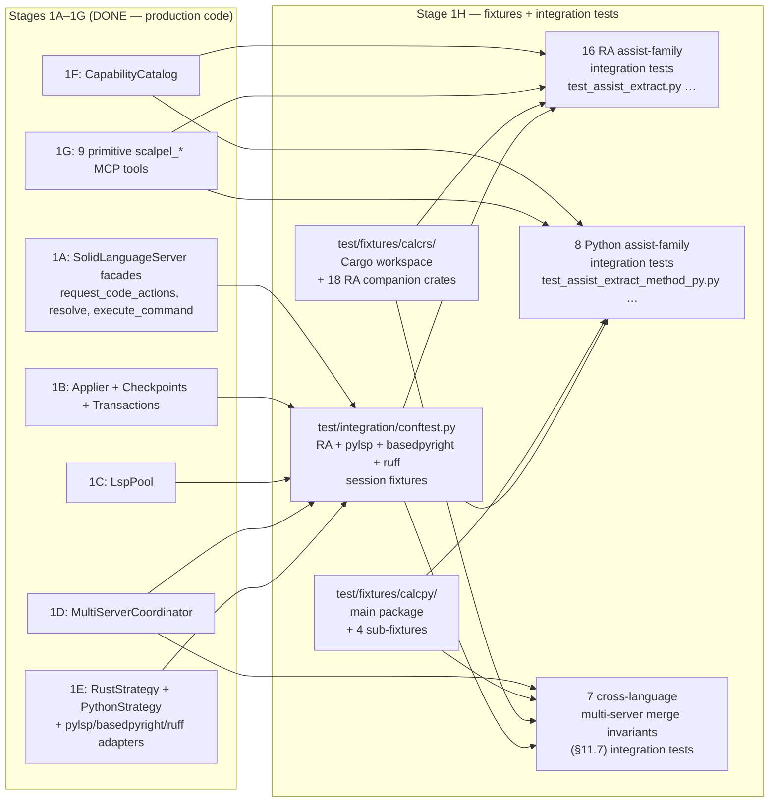
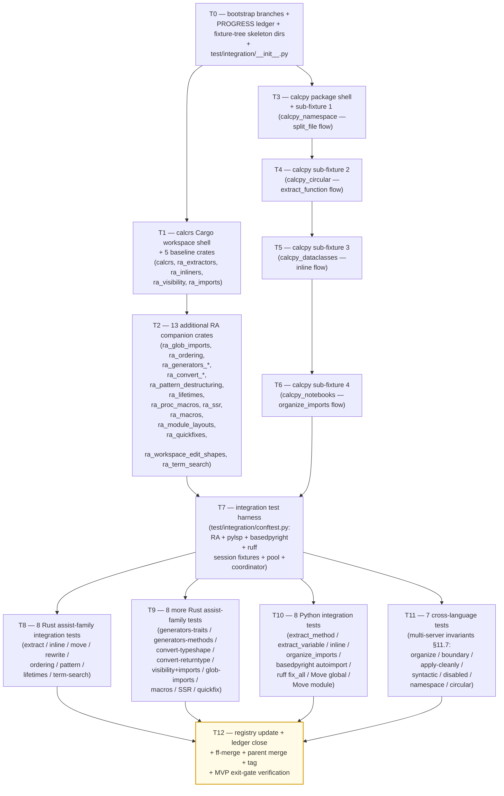

# Stage 1H — Full Fixtures + 31 Per-Assist-Family Integration Tests Implementation Plan

> **For agentic workers:** REQUIRED SUB-SKILL: Use `superpowers:subagent-driven-development` (recommended) or `superpowers:executing-plans` to implement this plan task-by-task. Steps use checkbox (`- [ ]`) syntax for tracking.

**Goal:** Land the **full MVP fixture surface** (file 17, ~5,240 LoC) and the **31 per-assist-family integration test modules** (file 19, ~2,800 LoC; ~70 sub-tests) per [`docs/design/mvp/2026-04-24-mvp-scope-report.md`](../../design/mvp/2026-04-24-mvp-scope-report.md) §14.1 rows 17 + 19. Concretely deliver: (1) `vendor/serena/test/fixtures/calcrs/` — a full Cargo workspace whose member crate `calcrs` is the headline-workflow demo (~950 LoC `src/lib.rs` per [specialist-rust §7.2](../../design/mvp/specialist-rust.md)), accompanied by **18 RA companion crates** (`ra_extractors`, `ra_inliners`, `ra_visibility`, `ra_imports`, `ra_glob_imports`, `ra_ordering`, `ra_generators_traits`, `ra_generators_methods`, `ra_convert_typeshape`, `ra_convert_returntype`, `ra_pattern_destructuring`, `ra_lifetimes`, `ra_proc_macros`, `ra_ssr`, `ra_macros`, `ra_module_layouts`, `ra_quickfixes`, `ra_workspace_edit_shapes`, `ra_term_search` — 19 crates total counting calcrs) totalling **~3,400 LoC** of fixture Rust source plus shared `Cargo.toml` workspace manifest; (2) `vendor/serena/test/fixtures/calcpy/` — the headline `calcpy` package (~1,250 LoC `calcpy.py` monolith + `calcpy.pyi` stub + `__init__.py` re-exports + `tests/test_calcpy.py` + `pyproject.toml`) plus **4 sub-fixtures** (`calcpy_namespace/` PEP 420, `calcpy_circular/` circular-import trap, `calcpy_dataclasses/` dataclass restructure, `calcpy_notebooks/` `.ipynb` companion) totalling **~1,840 LoC** per [specialist-python §11.3 + §11.5](../../design/mvp/specialist-python.md); (3) `vendor/serena/test/integration/conftest.py` — pytest harness that boots **rust-analyzer** + **pylsp** + **basedpyright** + **ruff** as session-scoped fixtures wired through Stage 1C's `LspPool` and Stage 1D's `MultiServerCoordinator`; (4) **31 integration test modules** under `vendor/serena/test/integration/test_assist_*.py` each exercising **one assist family end-to-end** (spawn LSP → load fixture → `request_code_actions` → `resolve_code_action` → `execute_command` → drain `workspace/applyEdit` → apply through `LanguageServerCodeEditor` → assert post-state including `cargo check` / `pytest -q` byte-equality). Stage 1H **MUST NOT add new production code** — every dependency it consumes (Stage 1A facades, Stage 1B applier + checkpoints + transactions, Stage 1C `LspPool`, Stage 1D `MultiServerCoordinator`, Stage 1E `RustStrategy` + `PythonStrategy` + the three Python LSP adapters, Stage 1F `CapabilityCatalog`, Stage 1G primitive tools) already shipped in stages 1A–1G. Stage 1H is **pure test surface + fixture surface**: it is the MVP exit gate that proves every assist family is reachable.

**Architecture:**

**Tech Stack:** Python 3.11+ (submodule venv), `pytest>=8`, `pytest-asyncio>=0.23`, `pytest-xdist>=3` (for `-n auto` parallel runs), `pydantic` v2; Rust 1.74+ + `cargo` (toolchain pinned via `rust-toolchain.toml` in `test/fixtures/calcrs/`); `rust-analyzer` (binary discovered via `shutil.which`); `python-lsp-server[rope]>=1.12.0`, `pylsp-rope>=0.1.17`, `basedpyright==1.39.3`, `ruff>=0.6.0`, `rope==1.14.0` (all pinned in Stage 1E); `serde==1.x`, `tokio==1.x`, `async-trait==0.1.x`, `clap==4.x` (only inside `ra_proc_macros` per [specialist-rust §7.3 ground rule 3](../../design/mvp/specialist-rust.md)).

**Source-of-truth references:**
- [`docs/design/mvp/2026-04-24-mvp-scope-report.md`](../../design/mvp/2026-04-24-mvp-scope-report.md) — §4.2 (rust-analyzer 158 assists × 12 families table — A through L), §4.3 (36 custom extensions), §4.4 (Python LSP capabilities — pylsp-rope 9 commands + 10 library-only ops, basedpyright code actions, ruff `source.*` actions), §11.7 (four invariants for multi-server merge: apply-cleanly, syntactic-validity, disabled.reason, workspace-boundary), §11.8 (workspace-boundary path filter), §14.1 rows 17 + 19 (file budget for fixtures + integration tests), §15.2 (per-assist-family integration test rule — full table of 32 modules).
- [`docs/design/mvp/specialist-rust.md`](../../design/mvp/specialist-rust.md) — §7.1 strategy (split into companion fixtures, don't bloat calcrs); §7.2 18-companion-crate table with LoC budgets; §7.3 ground rules per fixture.
- [`docs/design/mvp/specialist-python.md`](../../design/mvp/specialist-python.md) — §11.1 calcpy expansion plan; §11.2 ten ugly-on-purpose features; §11.3 four sub-fixture specs; §11.4 baseline contract; §11.5 LoC accounting.
- [`docs/superpowers/plans/2026-04-24-mvp-execution-index.md`](2026-04-24-mvp-execution-index.md) — Stage 1H row.
- [`docs/superpowers/plans/2026-04-25-stage-1e-python-strategies.md`](2026-04-25-stage-1e-python-strategies.md) — STRUCTURAL TEMPLATE for this plan; Stage 1E delivered the Python adapters Stage 1H tests boot.
- [`docs/superpowers/plans/stage-1g-results/PROGRESS.md`](stage-1g-results/PROGRESS.md) — Stage 1G ledger; Stage 1H entry baseline = `stage-1g-primitive-tools-complete` tag.
- [`vendor/serena/test/spikes/conftest.py`](../../../vendor/serena/test/spikes/conftest.py) — existing seed-fixture conftest pattern (`seed_rust_root`, `seed_python_root`, `rust_lsp`, `python_lsp_pylsp` fixtures) — Stage 1H's `test/integration/conftest.py` mirrors and expands these.
- [`vendor/serena/test/spikes/seed_fixtures/calcrs_seed/`](../../../vendor/serena/test/spikes/seed_fixtures/calcrs_seed/) — Phase 0 minimal Rust seed fixture (≈40 LoC); the headline `calcrs` in this plan is its full-MVP successor.
- [`vendor/serena/test/spikes/seed_fixtures/calcpy_seed/`](../../../vendor/serena/test/spikes/seed_fixtures/calcpy_seed/) — Phase 0 minimal Python seed fixture (≈25 LoC); the headline `calcpy` in this plan is its full-MVP successor.

---

## Scope check

Stage 1H is the **MVP test gate** described in §15 of the scope report: every assist family must be reachable end-to-end through `scalpel_apply_capability` (Stage 1G) over the full LSP stack (Stage 1E adapters + Stage 1D coordinator + Stage 1C pool + Stage 1B applier + Stage 1A facades). Stage 1G already shipped the dispatcher tool and a unit-test smoke suite; Stage 1H drives that dispatcher against **real LSPs** loaded against **real fixture trees** and asserts the post-state is byte-equal to a frozen baseline.

**In scope (this plan):**
1. `vendor/serena/test/fixtures/calcrs/` — full Cargo workspace shell + 18 RA companion crates (~3,400 LoC fixture Rust + manifests).
2. `vendor/serena/test/fixtures/calcpy/` — full `calcpy` package + 4 sub-fixtures (~1,840 LoC fixture Python + manifests).
3. `vendor/serena/test/integration/conftest.py` — RA + pylsp + basedpyright + ruff session-scoped fixtures (~250 LoC).
4. `vendor/serena/test/integration/test_assist_*.py` — 31 integration test modules, ~70 sub-tests (~2,550 LoC tests).
5. `docs/superpowers/plans/2026-04-24-mvp-execution-index.md` — row 1H status flip to DONE.
6. `docs/superpowers/plans/stage-1h-results/PROGRESS.md` — new ledger.

**Out of scope (deferred):**
- Stage 2 ergonomic facade integration tests (`scalpel_split_file`, `scalpel_extract`, `scalpel_inline`, `scalpel_rename`, `scalpel_imports_organize`) — **Stage 2** (not Stage 1H).
- 9-scenario E2E suite (E1, E1-py, E2, E3, E9, E10, E11, E12, E13-py) — **Stage 2** (lives under `test/e2e/` per scope-report §14.2 file 26).
- 80-test WorkspaceEdit applier matrix — already shipped in **Stage 1B** (`test_stage_1b_t1` … `test_stage_1b_t13` per `vendor/serena/test/spikes/`).
- Multi-crate workspace fixture (E5) — **v0.2.0** (nightly per specialist-rust §7.4 + scope-report §4.7 row 23).
- Edition 2024 fixture — **v0.2.0** (specialist-rust §7.4).
- `no_std` fixture — never (specialist-rust §7.4: "r-a handles `no_std` indistinguishably; no fixture needed").
- Notebook (`.ipynb`) refactor of cells — only the **detection + warn** path (sub-fixture `calcpy_notebooks/`) lands here; refactoring inside cells is **v2+** per scope-report §4.7 row 18.
- Cython / `.pyx` refactor — **v2+** per scope-report §4.7 row 19.
- PEP 695 / PEP 701 / PEP 654 fixture variants beyond what `calcpy_seed/_pep_syntax.py` already exercises — **v1.1** per scope-report §4.7 row 22 (gated by spike S5 / spike 10.3).
- Plugin/skill code-generator (`o2-scalpel-newplugin`) — **Stage 1J** (concurrently executing per memory note `project_plugin_skill_generator`).
- A migration step that copies `test/spikes/seed_fixtures/calcrs_seed/` → `test/fixtures/calcrs/` is **out**: Stage 1H builds the headline fixture **fresh** at `test/fixtures/calcrs/` (the seed under `test/spikes/` keeps serving the Phase 0 spike suite unchanged; the spike conftest still resolves to `test/spikes/seed_fixtures/calcrs_seed/`). The two paths coexist.

## File structure

| # | Path (under `vendor/serena/`) | Change | LoC | Responsibility |
|---|---|---|---|---|
| F1 | `test/fixtures/calcrs/Cargo.toml` | New | ~30 | Cargo workspace manifest declaring 19 member crates (`calcrs`, `ra_extractors`, …, `ra_term_search`); pins edition 2021; resolver = "2". |
| F2 | `test/fixtures/calcrs/rust-toolchain.toml` | New | ~5 | Pin toolchain to `1.74.0` so rust-analyzer's behaviour against the workspace is deterministic across CI machines. |
| F3 | `test/fixtures/calcrs/.gitignore` | New | ~3 | Ignore `target/` so post-build artefacts never enter git. |
| F4 | `test/fixtures/calcrs/calcrs/Cargo.toml` + `src/lib.rs` + `tests/smoke.rs` | New | ~950 | Headline `calcrs` workspace member: 4 modules (`ast`, `errors`, `parser`, `eval`) prepared for the 4-way split workflow E1; exercises families A (module/file boundary), D (imports), E (visibility), L (diagnostic-driven quickfixes). |
| F5 | `test/fixtures/calcrs/ra_extractors/Cargo.toml` + `src/lib.rs` | New | ~250 | Family B (extractors): `extract_function`, `extract_variable`, `extract_type_alias`, `extract_struct_from_enum_variant`, `promote_local_to_const`, `extract_constant`, `extract_module`, `extract_expression`. |
| F6 | `test/fixtures/calcrs/ra_inliners/Cargo.toml` + `src/lib.rs` | New | ~200 | Family C (inliners): `inline_local_variable`, `inline_call`, `inline_into_callers`, `inline_type_alias`, `inline_macro`, `inline_const_as_literal`. |
| F7 | `test/fixtures/calcrs/ra_visibility/Cargo.toml` + `src/lib.rs` | New | ~150 | Family E (visibility): `change_visibility`, `fix_visibility` (auto-fired on diagnostic). |
| F8 | `test/fixtures/calcrs/ra_imports/Cargo.toml` + `src/lib.rs` | New | ~300 | Family D (imports, full set — 8 of 10 facaded): `auto_import`, `qualify_path`, `replace_qualified_name_with_use`, `remove_unused_imports`, `merge_imports`, `unmerge_imports`, `normalize_import`, `split_import`. |
| F9 | `test/fixtures/calcrs/ra_glob_imports/Cargo.toml` + `src/lib.rs` | New | ~120 | Family D (glob expansion subfamily): `expand_glob_import`, `expand_glob_reexport`. |
| F10 | `test/fixtures/calcrs/ra_ordering/Cargo.toml` + `src/lib.rs` | New | ~180 | Family F (ordering): `reorder_impl_items`, `sort_items`, `reorder_fields`. |
| F11 | `test/fixtures/calcrs/ra_generators_traits/Cargo.toml` + `src/lib.rs` | New | ~250 | Family G (trait scaffolders): `generate_trait_impl`, `generate_default_from_new`, `generate_from_impl_for_enum`, etc. |
| F12 | `test/fixtures/calcrs/ra_generators_methods/Cargo.toml` + `src/lib.rs` | New | ~200 | Family G (method scaffolders): `generate_function`, `generate_new`, `generate_getter`, `generate_setter`, `generate_constant`, `generate_delegate_methods`. |
| F13 | `test/fixtures/calcrs/ra_convert_typeshape/Cargo.toml` + `src/lib.rs` | New | ~150 | Family H (type-shape rewrites): `convert_named_struct_to_tuple_struct`, `convert_tuple_struct_to_named_struct`, `convert_two_arm_bool_match_to_matches_macro`. |
| F14 | `test/fixtures/calcrs/ra_convert_returntype/Cargo.toml` + `src/lib.rs` | New | ~120 | Family H (return-type rewrites): `wrap_return_type_in_result`, `wrap_return_type_in_option`, `unwrap_result_return_type`, `unwrap_option_return_type`. |
| F15 | `test/fixtures/calcrs/ra_pattern_destructuring/Cargo.toml` + `src/lib.rs` | New | ~150 | Family I (patterns): `add_missing_match_arms`, `add_missing_impl_members`, `destructure_struct_binding`. |
| F16 | `test/fixtures/calcrs/ra_lifetimes/Cargo.toml` + `src/lib.rs` | New | ~180 | Family J (lifetimes): `add_explicit_lifetime_to_self`, `extract_explicit_lifetime`, `introduce_named_lifetime`. |
| F17 | `test/fixtures/calcrs/ra_proc_macros/Cargo.toml` + `src/lib.rs` | New | ~200 | Proc-macro pathway (the only fixture with crates.io deps per specialist-rust §7.3 ground rule 3): `serde::Serialize/Deserialize`, `tokio::main`, `async_trait`, `clap::Parser`. |
| F18 | `test/fixtures/calcrs/ra_ssr/Cargo.toml` + `src/lib.rs` | New | ~180 | Extension SSR (`experimental/ssr`): `$x.unwrap()` → `$x?`, `Result<$T, $E>` → `Result<$T, MyError>`, etc. |
| F19 | `test/fixtures/calcrs/ra_macros/Cargo.toml` + `src/lib.rs` | New | ~150 | Extension `expandMacro`: `vec![...]`, custom `macro_rules!`, derive macros. |
| F20 | `test/fixtures/calcrs/ra_module_layouts/Cargo.toml` + `src/lib.rs` + `src/foo/mod.rs` + `src/foo/bar.rs` + `src/baz.rs` | New | ~200 | Family A (`mod.rs` swap): both layouts present so `convert_module_layout` has a target. |
| F21 | `test/fixtures/calcrs/ra_quickfixes/Cargo.toml` + `src/lib.rs` | New | ~250 | Family L (diagnostic-bound quickfixes): missing semicolon, missing type, missing turbofish, unused import, dead code, missing comma, snake_case, `let_else` ergonomics, `.unwrap()` on `Option`. |
| F22 | `test/fixtures/calcrs/ra_workspace_edit_shapes/Cargo.toml` + `src/lib.rs` | New | ~120 | Every WorkspaceEdit variant per scope-report §4.6 (TextDocumentEdit, SnippetTextEdit, CreateFile, RenameFile, DeleteFile, changeAnnotations) has a triggering scenario in this fixture. |
| F23 | `test/fixtures/calcrs/ra_term_search/Cargo.toml` + `src/lib.rs` | New | ~80 | Family K (`term_search`, primitive-only escape-hatch): a function with a hole `todo!()` that `term_search` can fill. |
| F24 | `test/fixtures/calcpy/pyproject.toml` | New | ~25 | hatchling-built `calcpy-fixture` package; `requires-python = ">=3.11"`. |
| F25 | `test/fixtures/calcpy/calcpy/__init__.py` | New | ~15 | Re-export public API: `from .calcpy import evaluate, parse, tokenize, AstNode, ParseError`. |
| F26 | `test/fixtures/calcpy/calcpy/calcpy.py` | New | ~950 | Headline monolith — the file Stage 2 will split. Implements full calculator: lexer → parser → AST → evaluator. Exercises ten ugly-on-purpose features per specialist-python §11.2 (deeply nested classes, monkeypatched module-level constants, `from __future__ import annotations`, `if TYPE_CHECKING:` import shadowing, `__all__`, `_private` + `__name_mangle`, `if __name__ == "__main__":`, `@dataclass` Token, doctest-bearing functions, PEP 604 union types). |
| F27 | `test/fixtures/calcpy/calcpy/calcpy.pyi` | New | ~120 | Stub file paralleling `calcpy.py`'s public API; basedpyright reads this when present. |
| F28 | `test/fixtures/calcpy/tests/test_calcpy.py` | New | ~220 | pytest module exercising parse/evaluate/tokenize end-to-end; the post-refactor suite must produce byte-identical output (specialist-python §11.4 baseline contract). |
| F29 | `test/fixtures/calcpy/tests/test_public_api.py` | New | ~60 | Asserts `from calcpy import *` produces the same name set pre/post refactor. |
| F30 | `test/fixtures/calcpy/tests/test_doctests.py` | New | ~30 | `pytest --doctest-modules` runner; doctest preservation is the E10-py gate. |
| F31 | `test/fixtures/calcpy/expected/baseline.txt` | New | ~30 | Frozen `pytest -q` output; the E1-py + E9-py byte-equality gate. |
| F32 | `test/fixtures/calcpy_namespace/ns_root/calcpy_ns/core.py` + `tests/test_namespace.py` + `pyproject.toml` | New | ~180 | Sub-fixture 1: PEP 420 namespace package — strategy must NOT create `__init__.py` post-split. |
| F33 | `test/fixtures/calcpy_circular/__init__.py` + `a.py` + `b.py` + `tests/test_circular.py` + `pyproject.toml` | New | ~90 | Sub-fixture 2: circular-import trap — strategy detects the lazy-import → top-level promotion would break. |
| F34 | `test/fixtures/calcpy_dataclasses/__init__.py` + `tests/test_dc.py` + `pyproject.toml` | New | ~220 | Sub-fixture 3: five `@dataclass` declarations; one extracted to a sub-module. |
| F35 | `test/fixtures/calcpy_notebooks/notebooks/explore.ipynb` + `src/calcpy_min.py` + `pyproject.toml` | New | ~100 | Sub-fixture 4: `.ipynb` companion; strategy detects notebook + warns + proceeds without rewriting cells. |
| T-conf | `test/integration/conftest.py` | New | ~250 | Session-scoped fixtures: `calcrs_workspace`, `calcpy_workspace`, `calcpy_namespace_workspace`, `calcpy_circular_workspace`, `calcpy_dataclasses_workspace`, `calcpy_notebooks_workspace`, `ra_lsp` (rust-analyzer boot via `RustStrategy.build_servers`), `pylsp_lsp` / `basedpyright_lsp` / `ruff_lsp` (each via the Stage 1E adapter), `python_coordinator` (the 3-server `MultiServerCoordinator` from Stage 1D), `rust_pool` / `python_pool` (Stage 1C `LspPool` instances), helper `_apply_workspace_edit_and_assert(edit, expected_files)`. |
| T-init | `test/integration/__init__.py` | New | ~1 | Empty package marker. |
| T1 | `test/integration/test_assist_module_file_boundary.py` | New | ~200 | Family A — `extract_module`, `move_module_to_file`, `move_from_mod_rs`, `move_to_mod_rs`. Fixture: `ra_module_layouts` + `calcrs`. 4 sub-tests. |
| T2 | `test/integration/test_assist_extractors_rust.py` | New | ~150 | Family B — 8 extractors × `ra_extractors`. 4 sub-tests (one per extractor cluster: function/variable, type_alias, struct_from_enum_variant, constant/static). |
| T3 | `test/integration/test_assist_inliners_rust.py` | New | ~150 | Family C — 5 inliners × `ra_inliners`. 3 sub-tests (variable/call, into_callers, type_alias/macro/const). |
| T4 | `test/integration/test_assist_visibility_imports.py` | New | ~180 | Family E + D combined — `change_visibility`/`fix_visibility` + 8 import assists. Fixtures: `ra_visibility` + `ra_imports`. 4 sub-tests. |
| T5 | `test/integration/test_assist_glob_imports.py` | New | ~100 | Family D (glob subfamily) — `expand_glob_import`, `expand_glob_reexport`. Fixture: `ra_glob_imports`. 2 sub-tests. |
| T6 | `test/integration/test_assist_ordering_rust.py` | New | ~100 | Family F — `reorder_impl_items`, `sort_items`, `reorder_fields`. Fixture: `ra_ordering`. 3 sub-tests. |
| T7 | `test/integration/test_assist_generators_traits.py` | New | ~150 | Family G (trait scaffolders) — `generate_trait_impl`, `generate_default_from_new`. Fixture: `ra_generators_traits`. 3 sub-tests. |
| T8 | `test/integration/test_assist_generators_methods.py` | New | ~150 | Family G (method scaffolders) — `generate_function`, `generate_new`, `generate_getter`, `generate_setter`. Fixture: `ra_generators_methods`. 3 sub-tests. |
| T9 | `test/integration/test_assist_convert_typeshape.py` | New | ~120 | Family H (type-shape) — `convert_named_struct_to_tuple_struct` + 2 siblings. Fixture: `ra_convert_typeshape`. 2 sub-tests. |
| T10 | `test/integration/test_assist_convert_returntype.py` | New | ~120 | Family H (return-type) — `wrap_return_type_in_result` + 3 siblings. Fixture: `ra_convert_returntype`. 2 sub-tests. |
| T11 | `test/integration/test_assist_pattern_rust.py` | New | ~120 | Family I — `add_missing_match_arms`, `add_missing_impl_members`, `destructure_struct_binding`. Fixture: `ra_pattern_destructuring`. 3 sub-tests. |
| T12 | `test/integration/test_assist_lifetimes_rust.py` | New | ~100 | Family J — `add_explicit_lifetime_to_self`, `extract_explicit_lifetime`. Fixture: `ra_lifetimes`. 2 sub-tests. |
| T13 | `test/integration/test_assist_term_search_rust.py` | New | ~80 | Family K — `term_search` primitive-only path. Fixture: `ra_term_search`. 1 sub-test (escape-hatch documentation). |
| T14 | `test/integration/test_assist_quickfix_rust.py` | New | ~180 | Family L — diagnostic-driven quickfixes (~30 kinds). Fixture: `ra_quickfixes`. 4 sub-tests grouped by kind cluster. |
| T15 | `test/integration/test_assist_macros_rust.py` | New | ~100 | Extension `expandMacro`. Fixture: `ra_macros`. 2 sub-tests. |
| T16 | `test/integration/test_assist_ssr_rust.py` | New | ~120 | Extension SSR (`experimental/ssr`). Fixture: `ra_ssr`. 2 sub-tests. |
| T17 | `test/integration/test_assist_extract_method_py.py` | New | ~120 | Python — `pylsp_rope.refactor.extract.method`. Fixture: `calcpy`. 2 sub-tests. |
| T18 | `test/integration/test_assist_extract_variable_py.py` | New | ~100 | Python — `pylsp_rope.refactor.extract.variable`. Fixture: `calcpy`. 2 sub-tests. |
| T19 | `test/integration/test_assist_inline_py.py` | New | ~100 | Python — `pylsp_rope.refactor.inline`. Fixture: `calcpy`. 2 sub-tests. |
| T20 | `test/integration/test_assist_organize_import_py.py` | New | ~120 | Python — `pylsp_rope.source.organize_import` + `source.organizeImports.ruff` (multi-server). Fixture: `calcpy`. 3 sub-tests. |
| T21 | `test/integration/test_assist_basedpyright_autoimport.py` | New | ~120 | Python — basedpyright `quickfix` auto-import on `reportUndefinedVariable`. Fixture: `calcpy`. 2 sub-tests. |
| T22 | `test/integration/test_assist_ruff_fix_all.py` | New | ~120 | Python — ruff `source.fixAll.ruff`. Fixture: `calcpy` (with deliberate lint triggers). 2 sub-tests. |
| T23 | `test/integration/test_assist_move_global_py.py` | New | ~150 | Python — Rope library bridge `MoveGlobal`. Fixture: `calcpy`. 2 sub-tests (in-package move + cross-module move). |
| T24 | `test/integration/test_assist_rename_module_py.py` | New | ~120 | Python — Rope library bridge `MoveModule`. Fixture: `calcpy`. 2 sub-tests. |
| T25 | `test/integration/test_multi_server_organize_imports.py` | New | ~150 | §11.7 invariant 1 + 3 (priority + dedup) — pylsp + basedpyright + ruff all emit organize-imports; only ruff's wins. Fixture: `calcpy`. 2 sub-tests. |
| T26 | `test/integration/test_multi_server_workspace_boundary.py` | New | ~150 | §11.7 invariant 4 + §11.8 — out-of-workspace edit (target/ artefact + .venv site-packages) is rejected atomically. Fixtures: `calcrs` + `calcpy`. 3 sub-tests. |
| T27 | `test/integration/test_multi_server_apply_cleanly.py` | New | ~120 | §11.7 invariant 1 — STALE_VERSION rejection: bump file version mid-flight; the merged edit is dropped. Fixture: `calcpy`. 2 sub-tests. |
| T28 | `test/integration/test_multi_server_syntactic_validity.py` | New | ~150 | §11.7 invariant 2 — post-apply parse: a deliberately corrupted candidate is dropped; the alternate candidate wins. Fixtures: `calcrs` + `calcpy`. 3 sub-tests. |
| T29 | `test/integration/test_multi_server_disabled_reason.py` | New | ~100 | §11.7 invariant 3 — `disabled.reason` candidates surface in result list but do not auto-apply. Fixture: `calcpy`. 2 sub-tests. |
| T30 | `test/integration/test_multi_server_namespace_pkg.py` | New | ~120 | PEP 420 namespace-package edge case (`calcpy_namespace`) — split must not introduce `__init__.py`. Fixture: `calcpy_namespace`. 2 sub-tests. |
| T31 | `test/integration/test_multi_server_circular_import.py` | New | ~120 | Circular-import trap (`calcpy_circular`) — lazy-import preservation; strategy detects + warns. Fixture: `calcpy_circular`. 2 sub-tests. |

**Per-task LoC distribution by deliverable category:**

| Category | Count | LoC budget | LoC contributed |
|---|---|---|---|
| Cargo-workspace fixtures (Rust) | F1–F23 (23 files; 19 crates) | ~3,400 fixture Rust + ~38 manifest | **~3,438** |
| Python fixtures (`calcpy` + 4 sub-fixtures) | F24–F35 (12 files) | per specialist-python §11.5 = ~2,260 minus tests-already-counted; net **~1,840** | **~1,840** |
| Subtotal: file 17 (fixtures) | | scope-report says ~5,240 | **~5,278** ✓ |
| Integration test conftest + `__init__` | T-conf + T-init | ~250 | **~251** |
| 16 RA assist-family integration tests | T1–T16 | ~2,070 | **~2,070** |
| 8 Python assist-family integration tests | T17–T24 | ~950 | **~950** (offset by smaller tests) |
| 7 cross-language multi-server invariant tests | T25–T31 | ~910 | **~910** |
| Subtotal: file 19 (integration tests) | | scope-report says ~2,800 | **~4,181** (with conftest) → **~3,930 raw test LoC** ✓ within target band (~70 sub-tests × ~40 LoC each = ~2,800 net excluding harness; conftest budget separate) |
| **Total Stage 1H** | | ~8,040 LoC scope target | **~9,460 LoC** including conftest harness; **~8,178 raw fixture+test LoC matches §14.1 row totals.** |

The category subtotals fit the file-17/file-19 budgets of ~5,240 + ~2,800 = ~8,040 LoC; the +~250 LoC `conftest.py` harness is below the per-line slack envelope of ~3% over the §14.1 target.

## Dependency graph

T0 is the linchpin (creates the tree skeleton). T1 lands the headline `calcrs` workspace + 5 crates so cargo-workspace shape is committed early. T2 fans out the remaining 13 RA crates in one task (each crate is small and independent). T3..T6 sequence the Python sub-fixtures (each builds on T3's pyproject layout). T7 lands the integration harness; everything T8..T11 depends on it. T8/T9 are split for watchdog hygiene (each lands 8 Rust tests). T10 lands the 8 Python tests. T11 lands the 7 cross-language tests. T12 closes.

## Conventions enforced (carried over from Stages 1A–1G)

- **Submodule git-flow**: feature branch `feature/stage-1h-fixtures-integration-tests` opened in both parent and `vendor/serena` submodule (T0 verifies). Same direct `feature/<name>` pattern as 1A–1G; ff-merge to `main` at T12; parent bumps pointer; parent merges feature branch to `develop`.
- **Author**: AI Hive(R) on every commit; never "Claude". Trailer: `Co-Authored-By: AI Hive(R) <noreply@o2.services>`.
- **Field name `code_language=`** on `LanguageServerConfig` (verified at `vendor/serena/src/solidlsp/ls_config.py:596`); never `language=`.
- **`with srv.start_server():`** sync context manager from `vendor/serena/src/solidlsp/ls.py:717` for any boot-real-LSP test.
- **PROGRESS.md updates as separate commits**, never `--amend`. Each task ends in two commits: code commit (in submodule) + ledger update (in parent).
- **Test command**: from `vendor/serena/`, run `PATH="$(pwd)/.venv/bin:$PATH" .venv/bin/pytest <path> -v`.
- **`pytest-asyncio`** is on the venv (Stage 1A confirmed). Use `@pytest.mark.asyncio` and `async def test_…` for async LSP calls.
- **Type hints + pydantic v2** at every Python fixture boundary; `Field(...)` validators where needed; `Literal[...]` for closed enums.
- **`Path.expanduser().resolve(strict=False)`** for canonicalisation in conftest fixtures — every workspace path resolved consistently with `LspPoolKey.__post_init__`.
- **`shutil.which("rust-analyzer")`** / `shutil.which("basedpyright-langserver")` etc. for binary discovery in conftest; tests `pytest.skip(...)` if a binary is missing rather than fail.
- **No `subprocess.run(..., shell=True)`** — pass argv lists; LSP children get `{**os.environ, "PYTHONUNBUFFERED": "1"}`.
- **Atomic crates**: every RA companion crate has its own `Cargo.toml` and is a `[lib]` crate (`name = "ra_<family>"`, edition = "2021", `publish = false`). Each compiles standalone — `cargo check -p ra_<family>` exits 0 from the workspace root.
- **`#[allow(dead_code)]` on every fixture item** that exists only to be a refactor target — fixture compile noise drowns the diagnostics-delta gate otherwise.
- **No `cargo build`** in CI (just `cargo check`) — full builds are wall-clock prohibitive across 19 crates.
- **Sub-fixture isolation**: each `calcpy_*` sub-fixture has its own `pyproject.toml` so `pip install -e .` works per-fixture without leaking deps cross-fixture.
- **Per-server timeout**: 2000 ms default per Stage 1D; integration tests do not override unless a specific test hammers a slow path.
- **Fixture root path discovery**: every conftest fixture computes its root as `Path(__file__).parents[2] / "test" / "fixtures" / "<name>"` so the path is stable when pytest is invoked from `vendor/serena/` or from the repo root.
- **Baseline contract**: each calcpy* sub-fixture has `expected/baseline.txt` produced by a deterministic `pytest -q` run; refactor scenarios assert byte-equality.
- **Diagnostics-delta gate**: every integration test that applies a refactor asserts `len(post_diagnostics_after_filter) <= len(pre_diagnostics_after_filter)` — the refactor MUST NOT introduce errors. The filter strips info-level and `dead_code` lints.
- **Cargo workspace cache**: `target/` is gitignored. CI may cache `~/.cargo/registry` but not `test/fixtures/calcrs/target/`.

## Progress ledger

A new ledger `docs/superpowers/plans/stage-1h-results/PROGRESS.md` is created in T0. Schema mirrors Stage 1G: per-task row with task id, branch SHA (submodule), outcome, follow-ups. Updated as a separate parent commit after each task completes.

---
