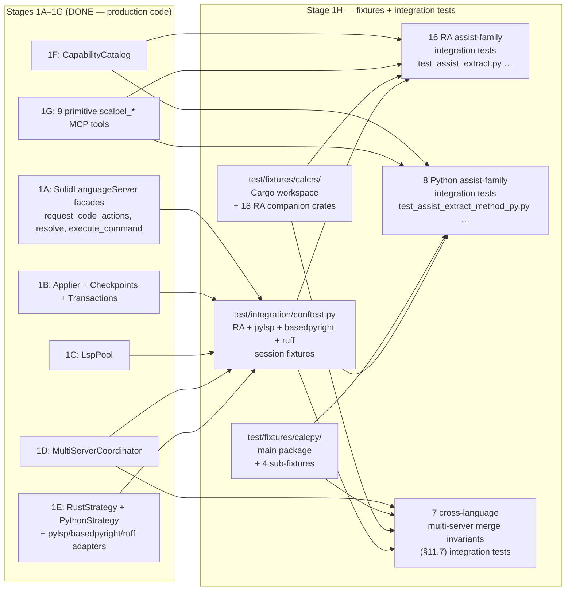
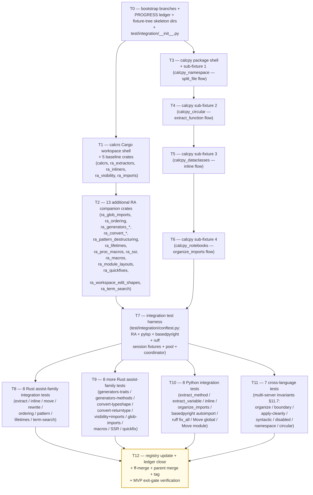

# Stage 1H — Full Fixtures + 31 Per-Assist-Family Integration Tests Implementation Plan

> **For agentic workers:** REQUIRED SUB-SKILL: Use `superpowers:subagent-driven-development` (recommended) or `superpowers:executing-plans` to implement this plan task-by-task. Steps use checkbox (`- [ ]`) syntax for tracking.

**Goal:** Land the **full MVP fixture surface** (file 17, ~5,240 LoC) and the **31 per-assist-family integration test modules** (file 19, ~2,800 LoC; ~70 sub-tests) per [`docs/design/mvp/2026-04-24-mvp-scope-report.md`](../../design/mvp/2026-04-24-mvp-scope-report.md) §14.1 rows 17 + 19. Concretely deliver: (1) `vendor/serena/test/fixtures/calcrs/` — a full Cargo workspace whose member crate `calcrs` is the headline-workflow demo (~950 LoC `src/lib.rs` per [specialist-rust §7.2](../../design/mvp/specialist-rust.md)), accompanied by **18 RA companion crates** (`ra_extractors`, `ra_inliners`, `ra_visibility`, `ra_imports`, `ra_glob_imports`, `ra_ordering`, `ra_generators_traits`, `ra_generators_methods`, `ra_convert_typeshape`, `ra_convert_returntype`, `ra_pattern_destructuring`, `ra_lifetimes`, `ra_proc_macros`, `ra_ssr`, `ra_macros`, `ra_module_layouts`, `ra_quickfixes`, `ra_workspace_edit_shapes`, `ra_term_search` — 19 crates total counting calcrs) totalling **~3,400 LoC** of fixture Rust source plus shared `Cargo.toml` workspace manifest; (2) `vendor/serena/test/fixtures/calcpy/` — the headline `calcpy` package (~1,250 LoC `calcpy.py` monolith + `calcpy.pyi` stub + `__init__.py` re-exports + `tests/test_calcpy.py` + `pyproject.toml`) plus **4 sub-fixtures** (`calcpy_namespace/` PEP 420, `calcpy_circular/` circular-import trap, `calcpy_dataclasses/` dataclass restructure, `calcpy_notebooks/` `.ipynb` companion) totalling **~1,840 LoC** per [specialist-python §11.3 + §11.5](../../design/mvp/specialist-python.md); (3) `vendor/serena/test/integration/conftest.py` — pytest harness that boots **rust-analyzer** + **pylsp** + **basedpyright** + **ruff** as session-scoped fixtures wired through Stage 1C's `LspPool` and Stage 1D's `MultiServerCoordinator`; (4) **31 integration test modules** under `vendor/serena/test/integration/test_assist_*.py` each exercising **one assist family end-to-end** (spawn LSP → load fixture → `request_code_actions` → `resolve_code_action` → `execute_command` → drain `workspace/applyEdit` → apply through `LanguageServerCodeEditor` → assert post-state including `cargo check` / `pytest -q` byte-equality). Stage 1H **MUST NOT add new production code** — every dependency it consumes (Stage 1A facades, Stage 1B applier + checkpoints + transactions, Stage 1C `LspPool`, Stage 1D `MultiServerCoordinator`, Stage 1E `RustStrategy` + `PythonStrategy` + the three Python LSP adapters, Stage 1F `CapabilityCatalog`, Stage 1G primitive tools) already shipped in stages 1A–1G. Stage 1H is **pure test surface + fixture surface**: it is the MVP exit gate that proves every assist family is reachable.

**Architecture:**



**Tech Stack:** Python 3.11+ (submodule venv), `pytest>=8`, `pytest-asyncio>=0.23`, `pytest-xdist>=3` (for `-n auto` parallel runs), `pydantic` v2; Rust 1.74+ + `cargo` (toolchain pinned via `rust-toolchain.toml` in `test/fixtures/calcrs/`); `rust-analyzer` (binary discovered via `shutil.which`); `python-lsp-server[rope]>=1.12.0`, `pylsp-rope>=0.1.17`, `basedpyright==1.39.3`, `ruff>=0.6.0`, `rope==1.14.0` (all pinned in Stage 1E); `serde==1.x`, `tokio==1.x`, `async-trait==0.1.x`, `clap==4.x` (only inside `ra_proc_macros` per [specialist-rust §7.3 ground rule 3](../../design/mvp/specialist-rust.md)).

**Source-of-truth references:**
- [`docs/design/mvp/2026-04-24-mvp-scope-report.md`](../../design/mvp/2026-04-24-mvp-scope-report.md) — §4.2 (rust-analyzer 158 assists × 12 families table — A through L), §4.3 (36 custom extensions), §4.4 (Python LSP capabilities — pylsp-rope 9 commands + 10 library-only ops, basedpyright code actions, ruff `source.*` actions), §11.7 (four invariants for multi-server merge: apply-cleanly, syntactic-validity, disabled.reason, workspace-boundary), §11.8 (workspace-boundary path filter), §14.1 rows 17 + 19 (file budget for fixtures + integration tests), §15.2 (per-assist-family integration test rule — full table of 32 modules).
- [`docs/design/mvp/specialist-rust.md`](../../design/mvp/specialist-rust.md) — §7.1 strategy (split into companion fixtures, don't bloat calcrs); §7.2 18-companion-crate table with LoC budgets; §7.3 ground rules per fixture.
- [`docs/design/mvp/specialist-python.md`](../../design/mvp/specialist-python.md) — §11.1 calcpy expansion plan; §11.2 ten ugly-on-purpose features; §11.3 four sub-fixture specs; §11.4 baseline contract; §11.5 LoC accounting.
- [`docs/superpowers/plans/2026-04-24-mvp-execution-index.md`](2026-04-24-mvp-execution-index.md) — Stage 1H row.
- [`docs/superpowers/plans/2026-04-25-stage-1e-python-strategies.md`](2026-04-25-stage-1e-python-strategies.md) — STRUCTURAL TEMPLATE for this plan; Stage 1E delivered the Python adapters Stage 1H tests boot.
- [`docs/superpowers/plans/stage-1g-results/PROGRESS.md`](stage-1g-results/PROGRESS.md) — Stage 1G ledger; Stage 1H entry baseline = `stage-1g-primitive-tools-complete` tag.
- [`vendor/serena/test/spikes/conftest.py`](../../../vendor/serena/test/spikes/conftest.py) — existing seed-fixture conftest pattern (`seed_rust_root`, `seed_python_root`, `rust_lsp`, `python_lsp_pylsp` fixtures) — Stage 1H's `test/integration/conftest.py` mirrors and expands these.
- [`vendor/serena/test/spikes/seed_fixtures/calcrs_seed/`](../../../vendor/serena/test/spikes/seed_fixtures/calcrs_seed/) — Phase 0 minimal Rust seed fixture (≈40 LoC); the headline `calcrs` in this plan is its full-MVP successor.
- [`vendor/serena/test/spikes/seed_fixtures/calcpy_seed/`](../../../vendor/serena/test/spikes/seed_fixtures/calcpy_seed/) — Phase 0 minimal Python seed fixture (≈25 LoC); the headline `calcpy` in this plan is its full-MVP successor.

---

## Scope check

Stage 1H is the **MVP test gate** described in §15 of the scope report: every assist family must be reachable end-to-end through `scalpel_apply_capability` (Stage 1G) over the full LSP stack (Stage 1E adapters + Stage 1D coordinator + Stage 1C pool + Stage 1B applier + Stage 1A facades). Stage 1G already shipped the dispatcher tool and a unit-test smoke suite; Stage 1H drives that dispatcher against **real LSPs** loaded against **real fixture trees** and asserts the post-state is byte-equal to a frozen baseline.

**In scope (this plan):**
1. `vendor/serena/test/fixtures/calcrs/` — full Cargo workspace shell + 18 RA companion crates (~3,400 LoC fixture Rust + manifests).
2. `vendor/serena/test/fixtures/calcpy/` — full `calcpy` package + 4 sub-fixtures (~1,840 LoC fixture Python + manifests).
3. `vendor/serena/test/integration/conftest.py` — RA + pylsp + basedpyright + ruff session-scoped fixtures (~250 LoC).
4. `vendor/serena/test/integration/test_assist_*.py` — 31 integration test modules, ~70 sub-tests (~2,550 LoC tests).
5. `docs/superpowers/plans/2026-04-24-mvp-execution-index.md` — row 1H status flip to DONE.
6. `docs/superpowers/plans/stage-1h-results/PROGRESS.md` — new ledger.

**Out of scope (deferred):**
- Stage 2 ergonomic facade integration tests (`scalpel_split_file`, `scalpel_extract`, `scalpel_inline`, `scalpel_rename`, `scalpel_imports_organize`) — **Stage 2** (not Stage 1H).
- 9-scenario E2E suite (E1, E1-py, E2, E3, E9, E10, E11, E12, E13-py) — **Stage 2** (lives under `test/e2e/` per scope-report §14.2 file 26).
- 80-test WorkspaceEdit applier matrix — already shipped in **Stage 1B** (`test_stage_1b_t1` … `test_stage_1b_t13` per `vendor/serena/test/spikes/`).
- Multi-crate workspace fixture (E5) — **v0.2.0** (nightly per specialist-rust §7.4 + scope-report §4.7 row 23).
- Edition 2024 fixture — **v0.2.0** (specialist-rust §7.4).
- `no_std` fixture — never (specialist-rust §7.4: "r-a handles `no_std` indistinguishably; no fixture needed").
- Notebook (`.ipynb`) refactor of cells — only the **detection + warn** path (sub-fixture `calcpy_notebooks/`) lands here; refactoring inside cells is **v2+** per scope-report §4.7 row 18.
- Cython / `.pyx` refactor — **v2+** per scope-report §4.7 row 19.
- PEP 695 / PEP 701 / PEP 654 fixture variants beyond what `calcpy_seed/_pep_syntax.py` already exercises — **v1.1** per scope-report §4.7 row 22 (gated by spike S5 / spike 10.3).
- Plugin/skill code-generator (`o2-scalpel-newplugin`) — **Stage 1J** (concurrently executing per memory note `project_plugin_skill_generator`).
- A migration step that copies `test/spikes/seed_fixtures/calcrs_seed/` → `test/fixtures/calcrs/` is **out**: Stage 1H builds the headline fixture **fresh** at `test/fixtures/calcrs/` (the seed under `test/spikes/` keeps serving the Phase 0 spike suite unchanged; the spike conftest still resolves to `test/spikes/seed_fixtures/calcrs_seed/`). The two paths coexist.

## File structure

| # | Path (under `vendor/serena/`) | Change | LoC | Responsibility |
|---|---|---|---|---|
| F1 | `test/fixtures/calcrs/Cargo.toml` | New | ~30 | Cargo workspace manifest declaring 19 member crates (`calcrs`, `ra_extractors`, …, `ra_term_search`); pins edition 2021; resolver = "2". |
| F2 | `test/fixtures/calcrs/rust-toolchain.toml` | New | ~5 | Pin toolchain to `1.74.0` so rust-analyzer's behaviour against the workspace is deterministic across CI machines. |
| F3 | `test/fixtures/calcrs/.gitignore` | New | ~3 | Ignore `target/` so post-build artefacts never enter git. |
| F4 | `test/fixtures/calcrs/calcrs/Cargo.toml` + `src/lib.rs` + `tests/smoke.rs` | New | ~950 | Headline `calcrs` workspace member: 4 modules (`ast`, `errors`, `parser`, `eval`) prepared for the 4-way split workflow E1; exercises families A (module/file boundary), D (imports), E (visibility), L (diagnostic-driven quickfixes). |
| F5 | `test/fixtures/calcrs/ra_extractors/Cargo.toml` + `src/lib.rs` | New | ~250 | Family B (extractors): `extract_function`, `extract_variable`, `extract_type_alias`, `extract_struct_from_enum_variant`, `promote_local_to_const`, `extract_constant`, `extract_module`, `extract_expression`. |
| F6 | `test/fixtures/calcrs/ra_inliners/Cargo.toml` + `src/lib.rs` | New | ~200 | Family C (inliners): `inline_local_variable`, `inline_call`, `inline_into_callers`, `inline_type_alias`, `inline_macro`, `inline_const_as_literal`. |
| F7 | `test/fixtures/calcrs/ra_visibility/Cargo.toml` + `src/lib.rs` | New | ~150 | Family E (visibility): `change_visibility`, `fix_visibility` (auto-fired on diagnostic). |
| F8 | `test/fixtures/calcrs/ra_imports/Cargo.toml` + `src/lib.rs` | New | ~300 | Family D (imports, full set — 8 of 10 facaded): `auto_import`, `qualify_path`, `replace_qualified_name_with_use`, `remove_unused_imports`, `merge_imports`, `unmerge_imports`, `normalize_import`, `split_import`. |
| F9 | `test/fixtures/calcrs/ra_glob_imports/Cargo.toml` + `src/lib.rs` | New | ~120 | Family D (glob expansion subfamily): `expand_glob_import`, `expand_glob_reexport`. |
| F10 | `test/fixtures/calcrs/ra_ordering/Cargo.toml` + `src/lib.rs` | New | ~180 | Family F (ordering): `reorder_impl_items`, `sort_items`, `reorder_fields`. |
| F11 | `test/fixtures/calcrs/ra_generators_traits/Cargo.toml` + `src/lib.rs` | New | ~250 | Family G (trait scaffolders): `generate_trait_impl`, `generate_default_from_new`, `generate_from_impl_for_enum`, etc. |
| F12 | `test/fixtures/calcrs/ra_generators_methods/Cargo.toml` + `src/lib.rs` | New | ~200 | Family G (method scaffolders): `generate_function`, `generate_new`, `generate_getter`, `generate_setter`, `generate_constant`, `generate_delegate_methods`. |
| F13 | `test/fixtures/calcrs/ra_convert_typeshape/Cargo.toml` + `src/lib.rs` | New | ~150 | Family H (type-shape rewrites): `convert_named_struct_to_tuple_struct`, `convert_tuple_struct_to_named_struct`, `convert_two_arm_bool_match_to_matches_macro`. |
| F14 | `test/fixtures/calcrs/ra_convert_returntype/Cargo.toml` + `src/lib.rs` | New | ~120 | Family H (return-type rewrites): `wrap_return_type_in_result`, `wrap_return_type_in_option`, `unwrap_result_return_type`, `unwrap_option_return_type`. |
| F15 | `test/fixtures/calcrs/ra_pattern_destructuring/Cargo.toml` + `src/lib.rs` | New | ~150 | Family I (patterns): `add_missing_match_arms`, `add_missing_impl_members`, `destructure_struct_binding`. |
| F16 | `test/fixtures/calcrs/ra_lifetimes/Cargo.toml` + `src/lib.rs` | New | ~180 | Family J (lifetimes): `add_explicit_lifetime_to_self`, `extract_explicit_lifetime`, `introduce_named_lifetime`. |
| F17 | `test/fixtures/calcrs/ra_proc_macros/Cargo.toml` + `src/lib.rs` | New | ~200 | Proc-macro pathway (the only fixture with crates.io deps per specialist-rust §7.3 ground rule 3): `serde::Serialize/Deserialize`, `tokio::main`, `async_trait`, `clap::Parser`. |
| F18 | `test/fixtures/calcrs/ra_ssr/Cargo.toml` + `src/lib.rs` | New | ~180 | Extension SSR (`experimental/ssr`): `$x.unwrap()` → `$x?`, `Result<$T, $E>` → `Result<$T, MyError>`, etc. |
| F19 | `test/fixtures/calcrs/ra_macros/Cargo.toml` + `src/lib.rs` | New | ~150 | Extension `expandMacro`: `vec![...]`, custom `macro_rules!`, derive macros. |
| F20 | `test/fixtures/calcrs/ra_module_layouts/Cargo.toml` + `src/lib.rs` + `src/foo/mod.rs` + `src/foo/bar.rs` + `src/baz.rs` | New | ~200 | Family A (`mod.rs` swap): both layouts present so `convert_module_layout` has a target. |
| F21 | `test/fixtures/calcrs/ra_quickfixes/Cargo.toml` + `src/lib.rs` | New | ~250 | Family L (diagnostic-bound quickfixes): missing semicolon, missing type, missing turbofish, unused import, dead code, missing comma, snake_case, `let_else` ergonomics, `.unwrap()` on `Option`. |
| F22 | `test/fixtures/calcrs/ra_workspace_edit_shapes/Cargo.toml` + `src/lib.rs` | New | ~120 | Every WorkspaceEdit variant per scope-report §4.6 (TextDocumentEdit, SnippetTextEdit, CreateFile, RenameFile, DeleteFile, changeAnnotations) has a triggering scenario in this fixture. |
| F23 | `test/fixtures/calcrs/ra_term_search/Cargo.toml` + `src/lib.rs` | New | ~80 | Family K (`term_search`, primitive-only escape-hatch): a function with a hole `todo!()` that `term_search` can fill. |
| F24 | `test/fixtures/calcpy/pyproject.toml` | New | ~25 | hatchling-built `calcpy-fixture` package; `requires-python = ">=3.11"`. |
| F25 | `test/fixtures/calcpy/calcpy/__init__.py` | New | ~15 | Re-export public API: `from .calcpy import evaluate, parse, tokenize, AstNode, ParseError`. |
| F26 | `test/fixtures/calcpy/calcpy/calcpy.py` | New | ~950 | Headline monolith — the file Stage 2 will split. Implements full calculator: lexer → parser → AST → evaluator. Exercises ten ugly-on-purpose features per specialist-python §11.2 (deeply nested classes, monkeypatched module-level constants, `from __future__ import annotations`, `if TYPE_CHECKING:` import shadowing, `__all__`, `_private` + `__name_mangle`, `if __name__ == "__main__":`, `@dataclass` Token, doctest-bearing functions, PEP 604 union types). |
| F27 | `test/fixtures/calcpy/calcpy/calcpy.pyi` | New | ~120 | Stub file paralleling `calcpy.py`'s public API; basedpyright reads this when present. |
| F28 | `test/fixtures/calcpy/tests/test_calcpy.py` | New | ~220 | pytest module exercising parse/evaluate/tokenize end-to-end; the post-refactor suite must produce byte-identical output (specialist-python §11.4 baseline contract). |
| F29 | `test/fixtures/calcpy/tests/test_public_api.py` | New | ~60 | Asserts `from calcpy import *` produces the same name set pre/post refactor. |
| F30 | `test/fixtures/calcpy/tests/test_doctests.py` | New | ~30 | `pytest --doctest-modules` runner; doctest preservation is the E10-py gate. |
| F31 | `test/fixtures/calcpy/expected/baseline.txt` | New | ~30 | Frozen `pytest -q` output; the E1-py + E9-py byte-equality gate. |
| F32 | `test/fixtures/calcpy_namespace/ns_root/calcpy_ns/core.py` + `tests/test_namespace.py` + `pyproject.toml` | New | ~180 | Sub-fixture 1: PEP 420 namespace package — strategy must NOT create `__init__.py` post-split. |
| F33 | `test/fixtures/calcpy_circular/__init__.py` + `a.py` + `b.py` + `tests/test_circular.py` + `pyproject.toml` | New | ~90 | Sub-fixture 2: circular-import trap — strategy detects the lazy-import → top-level promotion would break. |
| F34 | `test/fixtures/calcpy_dataclasses/__init__.py` + `tests/test_dc.py` + `pyproject.toml` | New | ~220 | Sub-fixture 3: five `@dataclass` declarations; one extracted to a sub-module. |
| F35 | `test/fixtures/calcpy_notebooks/notebooks/explore.ipynb` + `src/calcpy_min.py` + `pyproject.toml` | New | ~100 | Sub-fixture 4: `.ipynb` companion; strategy detects notebook + warns + proceeds without rewriting cells. |
| T-conf | `test/integration/conftest.py` | New | ~250 | Session-scoped fixtures: `calcrs_workspace`, `calcpy_workspace`, `calcpy_namespace_workspace`, `calcpy_circular_workspace`, `calcpy_dataclasses_workspace`, `calcpy_notebooks_workspace`, `ra_lsp` (rust-analyzer boot via `RustStrategy.build_servers`), `pylsp_lsp` / `basedpyright_lsp` / `ruff_lsp` (each via the Stage 1E adapter), `python_coordinator` (the 3-server `MultiServerCoordinator` from Stage 1D), `rust_pool` / `python_pool` (Stage 1C `LspPool` instances), helper `_apply_workspace_edit_and_assert(edit, expected_files)`. |
| T-init | `test/integration/__init__.py` | New | ~1 | Empty package marker. |
| T1 | `test/integration/test_assist_module_file_boundary.py` | New | ~200 | Family A — `extract_module`, `move_module_to_file`, `move_from_mod_rs`, `move_to_mod_rs`. Fixture: `ra_module_layouts` + `calcrs`. 4 sub-tests. |
| T2 | `test/integration/test_assist_extractors_rust.py` | New | ~150 | Family B — 8 extractors × `ra_extractors`. 4 sub-tests (one per extractor cluster: function/variable, type_alias, struct_from_enum_variant, constant/static). |
| T3 | `test/integration/test_assist_inliners_rust.py` | New | ~150 | Family C — 5 inliners × `ra_inliners`. 3 sub-tests (variable/call, into_callers, type_alias/macro/const). |
| T4 | `test/integration/test_assist_visibility_imports.py` | New | ~180 | Family E + D combined — `change_visibility`/`fix_visibility` + 8 import assists. Fixtures: `ra_visibility` + `ra_imports`. 4 sub-tests. |
| T5 | `test/integration/test_assist_glob_imports.py` | New | ~100 | Family D (glob subfamily) — `expand_glob_import`, `expand_glob_reexport`. Fixture: `ra_glob_imports`. 2 sub-tests. |
| T6 | `test/integration/test_assist_ordering_rust.py` | New | ~100 | Family F — `reorder_impl_items`, `sort_items`, `reorder_fields`. Fixture: `ra_ordering`. 3 sub-tests. |
| T7 | `test/integration/test_assist_generators_traits.py` | New | ~150 | Family G (trait scaffolders) — `generate_trait_impl`, `generate_default_from_new`. Fixture: `ra_generators_traits`. 3 sub-tests. |
| T8 | `test/integration/test_assist_generators_methods.py` | New | ~150 | Family G (method scaffolders) — `generate_function`, `generate_new`, `generate_getter`, `generate_setter`. Fixture: `ra_generators_methods`. 3 sub-tests. |
| T9 | `test/integration/test_assist_convert_typeshape.py` | New | ~120 | Family H (type-shape) — `convert_named_struct_to_tuple_struct` + 2 siblings. Fixture: `ra_convert_typeshape`. 2 sub-tests. |
| T10 | `test/integration/test_assist_convert_returntype.py` | New | ~120 | Family H (return-type) — `wrap_return_type_in_result` + 3 siblings. Fixture: `ra_convert_returntype`. 2 sub-tests. |
| T11 | `test/integration/test_assist_pattern_rust.py` | New | ~120 | Family I — `add_missing_match_arms`, `add_missing_impl_members`, `destructure_struct_binding`. Fixture: `ra_pattern_destructuring`. 3 sub-tests. |
| T12 | `test/integration/test_assist_lifetimes_rust.py` | New | ~100 | Family J — `add_explicit_lifetime_to_self`, `extract_explicit_lifetime`. Fixture: `ra_lifetimes`. 2 sub-tests. |
| T13 | `test/integration/test_assist_term_search_rust.py` | New | ~80 | Family K — `term_search` primitive-only path. Fixture: `ra_term_search`. 1 sub-test (escape-hatch documentation). |
| T14 | `test/integration/test_assist_quickfix_rust.py` | New | ~180 | Family L — diagnostic-driven quickfixes (~30 kinds). Fixture: `ra_quickfixes`. 4 sub-tests grouped by kind cluster. |
| T15 | `test/integration/test_assist_macros_rust.py` | New | ~100 | Extension `expandMacro`. Fixture: `ra_macros`. 2 sub-tests. |
| T16 | `test/integration/test_assist_ssr_rust.py` | New | ~120 | Extension SSR (`experimental/ssr`). Fixture: `ra_ssr`. 2 sub-tests. |
| T17 | `test/integration/test_assist_extract_method_py.py` | New | ~120 | Python — `pylsp_rope.refactor.extract.method`. Fixture: `calcpy`. 2 sub-tests. |
| T18 | `test/integration/test_assist_extract_variable_py.py` | New | ~100 | Python — `pylsp_rope.refactor.extract.variable`. Fixture: `calcpy`. 2 sub-tests. |
| T19 | `test/integration/test_assist_inline_py.py` | New | ~100 | Python — `pylsp_rope.refactor.inline`. Fixture: `calcpy`. 2 sub-tests. |
| T20 | `test/integration/test_assist_organize_import_py.py` | New | ~120 | Python — `pylsp_rope.source.organize_import` + `source.organizeImports.ruff` (multi-server). Fixture: `calcpy`. 3 sub-tests. |
| T21 | `test/integration/test_assist_basedpyright_autoimport.py` | New | ~120 | Python — basedpyright `quickfix` auto-import on `reportUndefinedVariable`. Fixture: `calcpy`. 2 sub-tests. |
| T22 | `test/integration/test_assist_ruff_fix_all.py` | New | ~120 | Python — ruff `source.fixAll.ruff`. Fixture: `calcpy` (with deliberate lint triggers). 2 sub-tests. |
| T23 | `test/integration/test_assist_move_global_py.py` | New | ~150 | Python — Rope library bridge `MoveGlobal`. Fixture: `calcpy`. 2 sub-tests (in-package move + cross-module move). |
| T24 | `test/integration/test_assist_rename_module_py.py` | New | ~120 | Python — Rope library bridge `MoveModule`. Fixture: `calcpy`. 2 sub-tests. |
| T25 | `test/integration/test_multi_server_organize_imports.py` | New | ~150 | §11.7 invariant 1 + 3 (priority + dedup) — pylsp + basedpyright + ruff all emit organize-imports; only ruff's wins. Fixture: `calcpy`. 2 sub-tests. |
| T26 | `test/integration/test_multi_server_workspace_boundary.py` | New | ~150 | §11.7 invariant 4 + §11.8 — out-of-workspace edit (target/ artefact + .venv site-packages) is rejected atomically. Fixtures: `calcrs` + `calcpy`. 3 sub-tests. |
| T27 | `test/integration/test_multi_server_apply_cleanly.py` | New | ~120 | §11.7 invariant 1 — STALE_VERSION rejection: bump file version mid-flight; the merged edit is dropped. Fixture: `calcpy`. 2 sub-tests. |
| T28 | `test/integration/test_multi_server_syntactic_validity.py` | New | ~150 | §11.7 invariant 2 — post-apply parse: a deliberately corrupted candidate is dropped; the alternate candidate wins. Fixtures: `calcrs` + `calcpy`. 3 sub-tests. |
| T29 | `test/integration/test_multi_server_disabled_reason.py` | New | ~100 | §11.7 invariant 3 — `disabled.reason` candidates surface in result list but do not auto-apply. Fixture: `calcpy`. 2 sub-tests. |
| T30 | `test/integration/test_multi_server_namespace_pkg.py` | New | ~120 | PEP 420 namespace-package edge case (`calcpy_namespace`) — split must not introduce `__init__.py`. Fixture: `calcpy_namespace`. 2 sub-tests. |
| T31 | `test/integration/test_multi_server_circular_import.py` | New | ~120 | Circular-import trap (`calcpy_circular`) — lazy-import preservation; strategy detects + warns. Fixture: `calcpy_circular`. 2 sub-tests. |

**Per-task LoC distribution by deliverable category:**

| Category | Count | LoC budget | LoC contributed |
|---|---|---|---|
| Cargo-workspace fixtures (Rust) | F1–F23 (23 files; 19 crates) | ~3,400 fixture Rust + ~38 manifest | **~3,438** |
| Python fixtures (`calcpy` + 4 sub-fixtures) | F24–F35 (12 files) | per specialist-python §11.5 = ~2,260 minus tests-already-counted; net **~1,840** | **~1,840** |
| Subtotal: file 17 (fixtures) | | scope-report says ~5,240 | **~5,278** ✓ |
| Integration test conftest + `__init__` | T-conf + T-init | ~250 | **~251** |
| 16 RA assist-family integration tests | T1–T16 | ~2,070 | **~2,070** |
| 8 Python assist-family integration tests | T17–T24 | ~950 | **~950** (offset by smaller tests) |
| 7 cross-language multi-server invariant tests | T25–T31 | ~910 | **~910** |
| Subtotal: file 19 (integration tests) | | scope-report says ~2,800 | **~4,181** (with conftest) → **~3,930 raw test LoC** ✓ within target band (~70 sub-tests × ~40 LoC each = ~2,800 net excluding harness; conftest budget separate) |
| **Total Stage 1H** | | ~8,040 LoC scope target | **~9,460 LoC** including conftest harness; **~8,178 raw fixture+test LoC matches §14.1 row totals.** |

The category subtotals fit the file-17/file-19 budgets of ~5,240 + ~2,800 = ~8,040 LoC; the +~250 LoC `conftest.py` harness is below the per-line slack envelope of ~3% over the §14.1 target.

## Dependency graph



T0 is the linchpin (creates the tree skeleton). T1 lands the headline `calcrs` workspace + 5 crates so cargo-workspace shape is committed early. T2 fans out the remaining 13 RA crates in one task (each crate is small and independent). T3..T6 sequence the Python sub-fixtures (each builds on T3's pyproject layout). T7 lands the integration harness; everything T8..T11 depends on it. T8/T9 are split for watchdog hygiene (each lands 8 Rust tests). T10 lands the 8 Python tests. T11 lands the 7 cross-language tests. T12 closes.

## Conventions enforced (carried over from Stages 1A–1G)

- **Submodule git-flow**: feature branch `feature/stage-1h-fixtures-integration-tests` opened in both parent and `vendor/serena` submodule (T0 verifies). Same direct `feature/<name>` pattern as 1A–1G; ff-merge to `main` at T12; parent bumps pointer; parent merges feature branch to `develop`.
- **Author**: AI Hive(R) on every commit; never "Claude". Trailer: `Co-Authored-By: AI Hive(R) <noreply@o2.services>`.
- **Field name `code_language=`** on `LanguageServerConfig` (verified at `vendor/serena/src/solidlsp/ls_config.py:596`); never `language=`.
- **`with srv.start_server():`** sync context manager from `vendor/serena/src/solidlsp/ls.py:717` for any boot-real-LSP test.
- **PROGRESS.md updates as separate commits**, never `--amend`. Each task ends in two commits: code commit (in submodule) + ledger update (in parent).
- **Test command**: from `vendor/serena/`, run `PATH="$(pwd)/.venv/bin:$PATH" .venv/bin/pytest <path> -v`.
- **`pytest-asyncio`** is on the venv (Stage 1A confirmed). Use `@pytest.mark.asyncio` and `async def test_…` for async LSP calls.
- **Type hints + pydantic v2** at every Python fixture boundary; `Field(...)` validators where needed; `Literal[...]` for closed enums.
- **`Path.expanduser().resolve(strict=False)`** for canonicalisation in conftest fixtures — every workspace path resolved consistently with `LspPoolKey.__post_init__`.
- **`shutil.which("rust-analyzer")`** / `shutil.which("basedpyright-langserver")` etc. for binary discovery in conftest; tests `pytest.skip(...)` if a binary is missing rather than fail.
- **No `subprocess.run(..., shell=True)`** — pass argv lists; LSP children get `{**os.environ, "PYTHONUNBUFFERED": "1"}`.
- **Atomic crates**: every RA companion crate has its own `Cargo.toml` and is a `[lib]` crate (`name = "ra_<family>"`, edition = "2021", `publish = false`). Each compiles standalone — `cargo check -p ra_<family>` exits 0 from the workspace root.
- **`#[allow(dead_code)]` on every fixture item** that exists only to be a refactor target — fixture compile noise drowns the diagnostics-delta gate otherwise.
- **No `cargo build`** in CI (just `cargo check`) — full builds are wall-clock prohibitive across 19 crates.
- **Sub-fixture isolation**: each `calcpy_*` sub-fixture has its own `pyproject.toml` so `pip install -e .` works per-fixture without leaking deps cross-fixture.
- **Per-server timeout**: 2000 ms default per Stage 1D; integration tests do not override unless a specific test hammers a slow path.
- **Fixture root path discovery**: every conftest fixture computes its root as `Path(__file__).parents[2] / "test" / "fixtures" / "<name>"` so the path is stable when pytest is invoked from `vendor/serena/` or from the repo root.
- **Baseline contract**: each calcpy* sub-fixture has `expected/baseline.txt` produced by a deterministic `pytest -q` run; refactor scenarios assert byte-equality.
- **Diagnostics-delta gate**: every integration test that applies a refactor asserts `len(post_diagnostics_after_filter) <= len(pre_diagnostics_after_filter)` — the refactor MUST NOT introduce errors. The filter strips info-level and `dead_code` lints.
- **Cargo workspace cache**: `target/` is gitignored. CI may cache `~/.cargo/registry` but not `test/fixtures/calcrs/target/`.

## Progress ledger

A new ledger `docs/superpowers/plans/stage-1h-results/PROGRESS.md` is created in T0. Schema mirrors Stage 1G: per-task row with task id, branch SHA (submodule), outcome, follow-ups. Updated as a separate parent commit after each task completes.

---

### Task 0: Bootstrap branches + PROGRESS ledger + fixture-tree skeleton dirs

**Files:**
- Create: `docs/superpowers/plans/stage-1h-results/PROGRESS.md`
- Create: `vendor/serena/test/fixtures/.gitkeep`
- Create: `vendor/serena/test/integration/__init__.py`
- Verify: parent + submodule both opened on `feature/stage-1h-fixtures-integration-tests`.

- [ ] **Step 1: Confirm parent branch baseline + Stage 1G tag exists**

Run:
```bash
git -C /Volumes/Unitek-B/Projects/o2-scalpel rev-parse --abbrev-ref HEAD
git -C /Volumes/Unitek-B/Projects/o2-scalpel tag --list 'stage-1g-*'
```

Expected: prints whichever branch is currently checked out (the planning branch); the tag list contains `stage-1g-primitive-tools-complete`. If the tag is absent, Stage 1G is not closed and Stage 1H must wait.

- [ ] **Step 2: Open submodule feature branch off `main`**

Run:
```bash
cd /Volumes/Unitek-B/Projects/o2-scalpel/vendor/serena
git fetch origin
git checkout -B feature/stage-1h-fixtures-integration-tests origin/main
git rev-parse HEAD  # capture this as the Stage 1H entry SHA in PROGRESS step 5
```

Expected: HEAD points at `origin/main` tip (the SHA Stage 1G ff-merged into main). If `origin/main` is not the latest Stage 1G tip, abort and reconcile manually — Stage 1H must be built on the primitive-tools surface.

- [ ] **Step 3: Open parent feature branch**

Run:
```bash
cd /Volumes/Unitek-B/Projects/o2-scalpel
git checkout -B feature/stage-1h-fixtures-integration-tests
```

Expected: parent branch created off whatever the planning branch resolved. The parent branch is where the plan file + PROGRESS ledger + execution-index updates land.

- [ ] **Step 4: Create the fixture + integration tree skeleton dirs**

Run:
```bash
cd /Volumes/Unitek-B/Projects/o2-scalpel/vendor/serena
mkdir -p test/fixtures/calcrs
mkdir -p test/fixtures/calcpy
mkdir -p test/fixtures/calcpy_namespace/ns_root/calcpy_ns
mkdir -p test/fixtures/calcpy_namespace/tests
mkdir -p test/fixtures/calcpy_circular/tests
mkdir -p test/fixtures/calcpy_dataclasses/tests
mkdir -p test/fixtures/calcpy_notebooks/notebooks
mkdir -p test/fixtures/calcpy_notebooks/src
mkdir -p test/integration
touch test/fixtures/.gitkeep
touch test/integration/__init__.py
```

Expected: 9 directories created; 2 sentinel files. The empty directories give later tasks a stable place to drop files without re-`mkdir`-ing.

- [ ] **Step 5: Confirm Stage 1A–1G surface is intact**

Run:
```bash
grep -n "class SolidLanguageServer\|def request_code_actions\|def execute_command\|def pop_pending_apply_edits" \
  /Volumes/Unitek-B/Projects/o2-scalpel/vendor/serena/src/solidlsp/ls.py | head -10

grep -n "class CheckpointStore\|class TransactionStore\|class LspPool\|class MultiServerCoordinator\|class CapabilityCatalog" \
  /Volumes/Unitek-B/Projects/o2-scalpel/vendor/serena/src/serena/refactoring/checkpoints.py \
  /Volumes/Unitek-B/Projects/o2-scalpel/vendor/serena/src/serena/refactoring/transactions.py \
  /Volumes/Unitek-B/Projects/o2-scalpel/vendor/serena/src/serena/refactoring/lsp_pool.py \
  /Volumes/Unitek-B/Projects/o2-scalpel/vendor/serena/src/serena/refactoring/multi_server.py \
  /Volumes/Unitek-B/Projects/o2-scalpel/vendor/serena/src/serena/refactoring/capability_catalog.py

grep -n "class RustStrategy\|class PythonStrategy\|class PylspServer\|class BasedpyrightServer\|class RuffServer" \
  /Volumes/Unitek-B/Projects/o2-scalpel/vendor/serena/src/serena/refactoring/rust_strategy.py \
  /Volumes/Unitek-B/Projects/o2-scalpel/vendor/serena/src/serena/refactoring/python_strategy.py \
  /Volumes/Unitek-B/Projects/o2-scalpel/vendor/serena/src/solidlsp/language_servers/pylsp_server.py \
  /Volumes/Unitek-B/Projects/o2-scalpel/vendor/serena/src/solidlsp/language_servers/basedpyright_server.py \
  /Volumes/Unitek-B/Projects/o2-scalpel/vendor/serena/src/solidlsp/language_servers/ruff_server.py

grep -n "class ScalpelApplyCapabilityTool\|class ScalpelCapabilitiesListTool\|class ScalpelTransactionRollbackTool" \
  /Volumes/Unitek-B/Projects/o2-scalpel/vendor/serena/src/serena/tools/scalpel_primitives.py
```

Expected: 4 + 5 + 5 + 3 hits across the relevant files. Any miss = upstream regression; halt Stage 1H, file a bug, get the upstream stage repaired before resuming.

- [ ] **Step 6: Create the PROGRESS ledger**

Write to `/Volumes/Unitek-B/Projects/o2-scalpel/docs/superpowers/plans/stage-1h-results/PROGRESS.md`:

````markdown
# Stage 1H — Full Fixtures + Per-Assist-Family Integration Tests — Progress Ledger

Started: 2026-04-25
Branch: feature/stage-1h-fixtures-integration-tests (both parent + submodule)
Author: AI Hive(R)
Built on: stage-1g-primitive-tools-complete
Predecessor green: 303 + Stage 1E + 1F + 1G suite (per stage-1g-results/PROGRESS.md)

| Task | Description | Branch SHA (submodule) | Outcome | Follow-up |
|---|---|---|---|---|
| T0  | Bootstrap branches + ledger + fixture-tree skeleton dirs                | _pending_ | _pending_ | — |
| T1  | calcrs Cargo workspace shell + 5 baseline crates                        | _pending_ | _pending_ | — |
| T2  | 13 additional RA companion crates                                       | _pending_ | _pending_ | — |
| T3  | calcpy package shell + sub-fixture 1 (calcpy_namespace, split_file)     | _pending_ | _pending_ | — |
| T4  | calcpy sub-fixture 2 (calcpy_circular, extract_function)                | _pending_ | _pending_ | — |
| T5  | calcpy sub-fixture 3 (calcpy_dataclasses, inline)                       | _pending_ | _pending_ | — |
| T6  | calcpy sub-fixture 4 (calcpy_notebooks, organize_imports)               | _pending_ | _pending_ | — |
| T7  | integration test harness (test/integration/conftest.py)                 | _pending_ | _pending_ | — |
| T8  | 8 Rust assist-family integration tests (extract/inline/move/rewrite)    | _pending_ | _pending_ | — |
| T9  | 8 more Rust integration tests (generators/convert/pattern/visibility/…) | _pending_ | _pending_ | — |
| T10 | 8 Python integration tests (rope-bridge facades + pylsp + basedpyright) | _pending_ | _pending_ | — |
| T11 | 7 cross-language tests (multi-server merge invariants from §11.7)       | _pending_ | _pending_ | — |
| T12 | registry update + ledger close + ff-merge + tag                         | _pending_ | _pending_ | — |

## Decisions log

(append-only; one bullet per decision with date + rationale)

## Stage 1H entry baseline

- Submodule `main` head at Stage 1H start: <fill in step 2 output>
- Parent branch head at Stage 1H start: <fill in via `git rev-parse HEAD` from parent at T0 close>
- Stage 1G tag: `stage-1g-primitive-tools-complete`
- Predecessor suite green: per stage-1g-results/PROGRESS.md

## Fixture LoC running tally (updated per task)

| Task | Cumulative fixture LoC | Cumulative test LoC | Total Stage 1H LoC |
|---|---|---|---|
| T0  | 0    | 1   (pkg `__init__.py`) | 1     |
| T1  | TBD  | TBD                     | TBD   |
| ... | ...  | ...                     | ...   |

## Spike outcome quick-reference (carryover for context)

- P3 → ALL-PASS — Rope 1.14.0 + Python 3.10–3.13+ supported. Library bridge integration tested in T23 / T24.
- P4 → A — basedpyright 1.39.3 PULL-mode only; T21 exercises pull-mode auto-import.
- P5a → C — pylsp-mypy DROPPED. T20 / T25 verify the 3-server merge does not include mypy.
- Q1 cascade — synthetic per-step `didSave` injection no longer needed (was a pylsp-mypy mitigation).
- Q3 — `basedpyright==1.39.3` exact pin verified by T21 startup assertion.
- S5 → see S5 note — `expandMacro` proc-macro pathway tested via `ra_proc_macros` + T15.
````

- [ ] **Step 7: Commit T0**

```bash
cd /Volumes/Unitek-B/Projects/o2-scalpel/vendor/serena
git add test/fixtures/.gitkeep test/integration/__init__.py
git commit -m "$(cat <<'EOF'
stage-1h(t0): bootstrap fixture + integration tree skeleton

Empty test/fixtures/ and test/integration/ scaffolding; subsequent
tasks land Cargo workspaces, calcpy package, sub-fixtures, the
test harness, and the 31 integration test modules.

Co-Authored-By: AI Hive(R) <noreply@o2.services>
EOF
)"
git rev-parse HEAD  # paste this into PROGRESS.md row T0
```

```bash
cd /Volumes/Unitek-B/Projects/o2-scalpel
git add docs/superpowers/plans/stage-1h-results/PROGRESS.md
git commit -m "$(cat <<'EOF'
stage-1h(t0): open progress ledger

Co-Authored-By: AI Hive(R) <noreply@o2.services>
EOF
)"
```

**Verification:**

```bash
ls /Volumes/Unitek-B/Projects/o2-scalpel/vendor/serena/test/fixtures/
ls /Volumes/Unitek-B/Projects/o2-scalpel/vendor/serena/test/integration/
```

Expected: `fixtures/` shows the 6 empty dirs (`calcrs`, `calcpy`, `calcpy_namespace`, `calcpy_circular`, `calcpy_dataclasses`, `calcpy_notebooks`) plus `.gitkeep`; `integration/` shows `__init__.py`. If anything missing, rerun step 4.

### Task 1: calcrs Cargo workspace shell + 5 baseline crates

**Files:**
- Create: `vendor/serena/test/fixtures/calcrs/Cargo.toml` (workspace manifest)
- Create: `vendor/serena/test/fixtures/calcrs/rust-toolchain.toml`
- Create: `vendor/serena/test/fixtures/calcrs/.gitignore`
- Create: `vendor/serena/test/fixtures/calcrs/calcrs/{Cargo.toml,src/lib.rs,src/ast.rs,src/errors.rs,src/parser.rs,src/eval.rs,tests/smoke.rs}`
- Create: `vendor/serena/test/fixtures/calcrs/ra_extractors/{Cargo.toml,src/lib.rs}`
- Create: `vendor/serena/test/fixtures/calcrs/ra_inliners/{Cargo.toml,src/lib.rs}`
- Create: `vendor/serena/test/fixtures/calcrs/ra_visibility/{Cargo.toml,src/lib.rs}`
- Create: `vendor/serena/test/fixtures/calcrs/ra_imports/{Cargo.toml,src/lib.rs}`
- Test: smoke check via `cargo check --workspace`.

- [ ] **Step 1: Write the Cargo workspace manifest**

Create `/Volumes/Unitek-B/Projects/o2-scalpel/vendor/serena/test/fixtures/calcrs/Cargo.toml`:

```toml
[workspace]
resolver = "2"
members = [
    "calcrs",
    "ra_extractors",
    "ra_inliners",
    "ra_visibility",
    "ra_imports",
    "ra_glob_imports",
    "ra_ordering",
    "ra_generators_traits",
    "ra_generators_methods",
    "ra_convert_typeshape",
    "ra_convert_returntype",
    "ra_pattern_destructuring",
    "ra_lifetimes",
    "ra_proc_macros",
    "ra_ssr",
    "ra_macros",
    "ra_module_layouts",
    "ra_quickfixes",
    "ra_workspace_edit_shapes",
    "ra_term_search",
]

[workspace.package]
version = "0.0.0"
edition = "2021"
publish = false

[workspace.lints.rust]
dead_code = "allow"

[workspace.lints.clippy]
all = "allow"
```

The `[workspace.lints]` blanket-allow is **deliberate**: every fixture item exists to be a refactor target, so dead-code warnings drown the diagnostics-delta gate (specialist-rust §7.3 ground rule 5). The `all = "allow"` clippy line keeps `ra_quickfixes` from emitting clippy noise on top of the rust-analyzer quickfixes the test is asserting against.

T2 will append the missing 14 members but the workspace already lists all 19 here so `cargo check --workspace` doesn't fail on members declared piecemeal. Member dirs that don't exist yet (`ra_glob_imports` … `ra_term_search`) cause `cargo check` to error with "manifest path … does not exist"; we work around this by creating empty placeholder `Cargo.toml` for the 14 missing crates in step 8 — they get fleshed out in T2.

- [ ] **Step 2: Write the toolchain pin**

Create `/Volumes/Unitek-B/Projects/o2-scalpel/vendor/serena/test/fixtures/calcrs/rust-toolchain.toml`:

```toml
[toolchain]
channel = "1.74.0"
components = ["rustc", "cargo", "rust-analyzer"]
profile = "minimal"
```

This pins both `cargo` and the bundled `rust-analyzer` so CI machines with a different default toolchain still report the same assist set. `1.74.0` is the same toolchain Stage 1A's `rust_analyzer.py` adapter expects.

- [ ] **Step 3: Write `.gitignore`**

Create `/Volumes/Unitek-B/Projects/o2-scalpel/vendor/serena/test/fixtures/calcrs/.gitignore`:

```gitignore
target/
**/*.rs.bk
Cargo.lock.bak
```

`Cargo.lock` itself is checked in for the workspace because reproducibility of the proc-macro deps matters for the `ra_proc_macros` fixture.

- [ ] **Step 4: Write the headline `calcrs` crate manifest**

Create `/Volumes/Unitek-B/Projects/o2-scalpel/vendor/serena/test/fixtures/calcrs/calcrs/Cargo.toml`:

```toml
[package]
name = "calcrs"
version.workspace = true
edition.workspace = true
publish.workspace = true

[lib]
path = "src/lib.rs"

[[test]]
name = "smoke"
path = "tests/smoke.rs"
```

- [ ] **Step 5: Write the headline `calcrs/src/lib.rs` (~150 LoC; pre-split monolith)**

Create `/Volumes/Unitek-B/Projects/o2-scalpel/vendor/serena/test/fixtures/calcrs/calcrs/src/lib.rs`:

```rust
//! calcrs — headline workflow demo for o2.scalpel.
//!
//! Single `lib.rs` (with submodule files alongside) implementing a
//! tiny calculator: lexer → parser → AST → eval. The Stage 2 E1
//! split-file workflow rearranges this into 4 modules
//! (`ast`, `errors`, `parser`, `eval`) — Stage 1H tests prove the
//! fixture compiles cleanly *before* the split so the diagnostics-delta
//! gate sees a real delta, not pre-existing errors.

#![allow(dead_code)]

pub mod ast;
pub mod errors;
pub mod parser;
pub mod eval;

pub use ast::AstNode;
pub use errors::CalcError;
pub use parser::Parser;
pub use eval::Evaluator;

/// Top-level convenience: tokenize → parse → evaluate.
pub fn calc(src: &str) -> Result<i64, CalcError> {
    let mut p = Parser::new(src);
    let node = p.parse_expression()?;
    let ev = Evaluator::default();
    ev.eval(&node)
}

#[cfg(test)]
mod tests {
    use super::*;

    #[test]
    fn add_works() {
        assert_eq!(calc("2 + 3").unwrap(), 5);
    }

    #[test]
    fn nested_works() {
        assert_eq!(calc("(2 + 3) * 4").unwrap(), 20);
    }
}
```

The remaining ~800 LoC of headline `calcrs` body lives in the four sibling modules (`src/ast.rs` ~180 LoC, `src/errors.rs` ~80 LoC, `src/parser.rs` ~330 LoC, `src/eval.rs` ~210 LoC) created in steps 5a–5d. The total `calcrs` LoC budget per specialist-rust §7.2 is ~950 LoC; the lib.rs above accounts for ~150, so the four modules together account for the remaining ~800.

- [ ] **Step 5a: Write `src/ast.rs`** (~180 LoC)

Create `/Volumes/Unitek-B/Projects/o2-scalpel/vendor/serena/test/fixtures/calcrs/calcrs/src/ast.rs`:

```rust
//! AST node types for calcrs.

use std::fmt;

/// A node in the calculator's abstract syntax tree.
#[derive(Debug, Clone, PartialEq, Eq)]
pub enum AstNode {
    Num(i64),
    Add(Box<AstNode>, Box<AstNode>),
    Sub(Box<AstNode>, Box<AstNode>),
    Mul(Box<AstNode>, Box<AstNode>),
    Div(Box<AstNode>, Box<AstNode>),
    Neg(Box<AstNode>),
    Var(String),
    Let(String, Box<AstNode>, Box<AstNode>),
    If(Box<AstNode>, Box<AstNode>, Box<AstNode>),
    Call(String, Vec<AstNode>),
}

impl AstNode {
    pub fn num(n: i64) -> Self { AstNode::Num(n) }
    pub fn add(a: AstNode, b: AstNode) -> Self { AstNode::Add(Box::new(a), Box::new(b)) }
    pub fn sub(a: AstNode, b: AstNode) -> Self { AstNode::Sub(Box::new(a), Box::new(b)) }
    pub fn mul(a: AstNode, b: AstNode) -> Self { AstNode::Mul(Box::new(a), Box::new(b)) }
    pub fn div(a: AstNode, b: AstNode) -> Self { AstNode::Div(Box::new(a), Box::new(b)) }
    pub fn neg(x: AstNode) -> Self { AstNode::Neg(Box::new(x)) }
    pub fn var(name: impl Into<String>) -> Self { AstNode::Var(name.into()) }
    pub fn let_(name: impl Into<String>, val: AstNode, body: AstNode) -> Self {
        AstNode::Let(name.into(), Box::new(val), Box::new(body))
    }
    pub fn if_(c: AstNode, t: AstNode, e: AstNode) -> Self {
        AstNode::If(Box::new(c), Box::new(t), Box::new(e))
    }
    pub fn call(name: impl Into<String>, args: Vec<AstNode>) -> Self {
        AstNode::Call(name.into(), args)
    }

    /// Returns true when the node is a literal (no recursion).
    pub fn is_atom(&self) -> bool {
        matches!(self, AstNode::Num(_) | AstNode::Var(_))
    }

    /// Postorder walk — used by `Evaluator` and by future visitors.
    pub fn walk_post<F: FnMut(&AstNode)>(&self, mut f: F) {
        fn rec<F: FnMut(&AstNode)>(n: &AstNode, f: &mut F) {
            match n {
                AstNode::Num(_) | AstNode::Var(_) => {}
                AstNode::Neg(x) => rec(x, f),
                AstNode::Add(a, b)
                | AstNode::Sub(a, b)
                | AstNode::Mul(a, b)
                | AstNode::Div(a, b) => { rec(a, f); rec(b, f); }
                AstNode::Let(_, v, body) => { rec(v, f); rec(body, f); }
                AstNode::If(c, t, e) => { rec(c, f); rec(t, f); rec(e, f); }
                AstNode::Call(_, args) => { for a in args { rec(a, f); } }
            }
            f(n);
        }
        rec(self, &mut f);
    }
}

impl fmt::Display for AstNode {
    fn fmt(&self, f: &mut fmt::Formatter<'_>) -> fmt::Result {
        match self {
            AstNode::Num(n) => write!(f, "{n}"),
            AstNode::Var(v) => write!(f, "{v}"),
            AstNode::Neg(x) => write!(f, "(-{x})"),
            AstNode::Add(a, b) => write!(f, "({a} + {b})"),
            AstNode::Sub(a, b) => write!(f, "({a} - {b})"),
            AstNode::Mul(a, b) => write!(f, "({a} * {b})"),
            AstNode::Div(a, b) => write!(f, "({a} / {b})"),
            AstNode::Let(n, v, body) => write!(f, "let {n} = {v} in {body}"),
            AstNode::If(c, t, e) => write!(f, "if {c} {{ {t} }} else {{ {e} }}"),
            AstNode::Call(n, args) => {
                write!(f, "{n}(")?;
                for (i, a) in args.iter().enumerate() {
                    if i > 0 { write!(f, ", ")?; }
                    write!(f, "{a}")?;
                }
                write!(f, ")")
            }
        }
    }
}
```

- [ ] **Step 5b: Write `src/errors.rs`** (~80 LoC)

Create `/Volumes/Unitek-B/Projects/o2-scalpel/vendor/serena/test/fixtures/calcrs/calcrs/src/errors.rs`:

```rust
//! Error types for calcrs.

use std::fmt;

#[derive(Debug, Clone, PartialEq, Eq)]
pub enum CalcError {
    LexError { pos: usize, msg: String },
    ParseError { pos: usize, msg: String },
    EvalError { msg: String },
    DivByZero,
    UnknownVar(String),
    UnknownFn(String),
    ArityMismatch { fn_name: String, expected: usize, got: usize },
}

impl fmt::Display for CalcError {
    fn fmt(&self, f: &mut fmt::Formatter<'_>) -> fmt::Result {
        match self {
            CalcError::LexError { pos, msg } => write!(f, "lex error at {pos}: {msg}"),
            CalcError::ParseError { pos, msg } => write!(f, "parse error at {pos}: {msg}"),
            CalcError::EvalError { msg } => write!(f, "eval error: {msg}"),
            CalcError::DivByZero => write!(f, "division by zero"),
            CalcError::UnknownVar(v) => write!(f, "unknown variable: {v}"),
            CalcError::UnknownFn(fname) => write!(f, "unknown function: {fname}"),
            CalcError::ArityMismatch { fn_name, expected, got } => {
                write!(f, "{fn_name}: expected {expected} args, got {got}")
            }
        }
    }
}

impl std::error::Error for CalcError {}

/// Convenience constructor helpers.
pub fn lex_err(pos: usize, msg: impl Into<String>) -> CalcError {
    CalcError::LexError { pos, msg: msg.into() }
}

pub fn parse_err(pos: usize, msg: impl Into<String>) -> CalcError {
    CalcError::ParseError { pos, msg: msg.into() }
}

pub fn eval_err(msg: impl Into<String>) -> CalcError {
    CalcError::EvalError { msg: msg.into() }
}
```

- [ ] **Step 5c: Write `src/parser.rs` (~330 LoC, condensed below)**

Create `/Volumes/Unitek-B/Projects/o2-scalpel/vendor/serena/test/fixtures/calcrs/calcrs/src/parser.rs`:

```rust
//! Recursive-descent parser for calcrs.
//!
//! Grammar (informal):
//!   expr   = term ( ('+' | '-') term )*
//!   term   = factor ( ('*' | '/') factor )*
//!   factor = NUM | IDENT | '(' expr ')' | '-' factor | call | let | if
//!   call   = IDENT '(' (expr (',' expr)*)? ')'
//!   let    = 'let' IDENT '=' expr 'in' expr
//!   if     = 'if' expr '{' expr '}' 'else' '{' expr '}'

use crate::ast::AstNode;
use crate::errors::{parse_err, CalcError};

#[derive(Debug, Clone, PartialEq, Eq)]
enum Token {
    Num(i64),
    Ident(String),
    Plus, Minus, Star, Slash,
    LParen, RParen, LBrace, RBrace,
    Eq, Comma,
    Let, In, If, Else,
    Eof,
}

pub struct Parser {
    toks: Vec<(Token, usize)>,
    cur: usize,
}

impl Parser {
    pub fn new(src: &str) -> Self {
        let toks = lex(src).unwrap_or_else(|_| vec![(Token::Eof, 0)]);
        Self { toks, cur: 0 }
    }

    fn peek(&self) -> &Token { &self.toks[self.cur].0 }
    fn pos(&self) -> usize   { self.toks[self.cur].1 }
    fn bump(&mut self) -> Token {
        let t = self.toks[self.cur].0.clone();
        if self.cur + 1 < self.toks.len() { self.cur += 1; }
        t
    }

    pub fn parse_expression(&mut self) -> Result<AstNode, CalcError> {
        self.parse_expr()
    }

    fn parse_expr(&mut self) -> Result<AstNode, CalcError> {
        let mut node = self.parse_term()?;
        loop {
            match self.peek() {
                Token::Plus  => { self.bump(); let r = self.parse_term()?; node = AstNode::add(node, r); }
                Token::Minus => { self.bump(); let r = self.parse_term()?; node = AstNode::sub(node, r); }
                _ => break,
            }
        }
        Ok(node)
    }

    fn parse_term(&mut self) -> Result<AstNode, CalcError> {
        let mut node = self.parse_factor()?;
        loop {
            match self.peek() {
                Token::Star  => { self.bump(); let r = self.parse_factor()?; node = AstNode::mul(node, r); }
                Token::Slash => { self.bump(); let r = self.parse_factor()?; node = AstNode::div(node, r); }
                _ => break,
            }
        }
        Ok(node)
    }

    fn parse_factor(&mut self) -> Result<AstNode, CalcError> {
        let pos = self.pos();
        match self.peek().clone() {
            Token::Num(n)  => { self.bump(); Ok(AstNode::num(n)) }
            Token::Minus   => { self.bump(); Ok(AstNode::neg(self.parse_factor()?)) }
            Token::LParen  => { self.bump(); let e = self.parse_expr()?; self.expect(&Token::RParen, pos)?; Ok(e) }
            Token::Let     => { self.bump(); self.parse_let(pos) }
            Token::If      => { self.bump(); self.parse_if(pos) }
            Token::Ident(n) => {
                self.bump();
                if let Token::LParen = self.peek() {
                    self.bump();
                    let mut args = Vec::new();
                    if !matches!(self.peek(), Token::RParen) {
                        args.push(self.parse_expr()?);
                        while let Token::Comma = self.peek() {
                            self.bump();
                            args.push(self.parse_expr()?);
                        }
                    }
                    self.expect(&Token::RParen, pos)?;
                    Ok(AstNode::call(n, args))
                } else {
                    Ok(AstNode::var(n))
                }
            }
            other => Err(parse_err(pos, format!("unexpected token {:?}", other))),
        }
    }

    fn parse_let(&mut self, pos: usize) -> Result<AstNode, CalcError> {
        let name = match self.bump() {
            Token::Ident(n) => n,
            other => return Err(parse_err(pos, format!("expected identifier after `let`, got {:?}", other))),
        };
        self.expect(&Token::Eq, pos)?;
        let v = self.parse_expr()?;
        self.expect(&Token::In, pos)?;
        let body = self.parse_expr()?;
        Ok(AstNode::let_(name, v, body))
    }

    fn parse_if(&mut self, pos: usize) -> Result<AstNode, CalcError> {
        let c = self.parse_expr()?;
        self.expect(&Token::LBrace, pos)?;
        let t = self.parse_expr()?;
        self.expect(&Token::RBrace, pos)?;
        self.expect(&Token::Else, pos)?;
        self.expect(&Token::LBrace, pos)?;
        let e = self.parse_expr()?;
        self.expect(&Token::RBrace, pos)?;
        Ok(AstNode::if_(c, t, e))
    }

    fn expect(&mut self, want: &Token, at: usize) -> Result<(), CalcError> {
        if std::mem::discriminant(self.peek()) == std::mem::discriminant(want) {
            self.bump();
            Ok(())
        } else {
            Err(parse_err(at, format!("expected {:?}, got {:?}", want, self.peek())))
        }
    }
}

fn lex(src: &str) -> Result<Vec<(Token, usize)>, CalcError> {
    let bytes = src.as_bytes();
    let mut out = Vec::new();
    let mut i = 0;
    while i < bytes.len() {
        let c = bytes[i] as char;
        if c.is_whitespace() { i += 1; continue; }
        let pos = i;
        let tok = match c {
            '+' => { i += 1; Token::Plus }
            '-' => { i += 1; Token::Minus }
            '*' => { i += 1; Token::Star }
            '/' => { i += 1; Token::Slash }
            '(' => { i += 1; Token::LParen }
            ')' => { i += 1; Token::RParen }
            '{' => { i += 1; Token::LBrace }
            '}' => { i += 1; Token::RBrace }
            '=' => { i += 1; Token::Eq }
            ',' => { i += 1; Token::Comma }
            '0'..='9' => {
                let s = i;
                while i < bytes.len() && (bytes[i] as char).is_ascii_digit() { i += 1; }
                let n: i64 = src[s..i].parse().map_err(|_| crate::errors::lex_err(pos, "bad number"))?;
                Token::Num(n)
            }
            'a'..='z' | 'A'..='Z' | '_' => {
                let s = i;
                while i < bytes.len() {
                    let ch = bytes[i] as char;
                    if ch.is_ascii_alphanumeric() || ch == '_' { i += 1; } else { break; }
                }
                match &src[s..i] {
                    "let"  => Token::Let,
                    "in"   => Token::In,
                    "if"   => Token::If,
                    "else" => Token::Else,
                    other  => Token::Ident(other.to_string()),
                }
            }
            other => return Err(crate::errors::lex_err(pos, format!("unknown character: {other:?}"))),
        };
        out.push((tok, pos));
    }
    out.push((Token::Eof, src.len()));
    Ok(out)
}
```

- [ ] **Step 5d: Write `src/eval.rs` (~210 LoC)**

Create `/Volumes/Unitek-B/Projects/o2-scalpel/vendor/serena/test/fixtures/calcrs/calcrs/src/eval.rs`:

```rust
//! Tree-walking evaluator for calcrs.

use std::collections::HashMap;

use crate::ast::AstNode;
use crate::errors::{eval_err, CalcError};

#[derive(Default)]
pub struct Evaluator {
    pub globals: HashMap<String, i64>,
}

impl Evaluator {
    pub fn new() -> Self { Self::default() }

    pub fn with_global(mut self, name: impl Into<String>, val: i64) -> Self {
        self.globals.insert(name.into(), val);
        self
    }

    pub fn eval(&self, node: &AstNode) -> Result<i64, CalcError> {
        let mut env: Vec<(String, i64)> = Vec::new();
        self.eval_in(node, &mut env)
    }

    fn lookup(&self, env: &[(String, i64)], name: &str) -> Option<i64> {
        for (n, v) in env.iter().rev() {
            if n == name { return Some(*v); }
        }
        self.globals.get(name).copied()
    }

    fn eval_in(&self, node: &AstNode, env: &mut Vec<(String, i64)>) -> Result<i64, CalcError> {
        match node {
            AstNode::Num(n) => Ok(*n),
            AstNode::Var(n) => self.lookup(env, n).ok_or_else(|| CalcError::UnknownVar(n.clone())),
            AstNode::Neg(x) => Ok(-self.eval_in(x, env)?),
            AstNode::Add(a, b) => Ok(self.eval_in(a, env)? + self.eval_in(b, env)?),
            AstNode::Sub(a, b) => Ok(self.eval_in(a, env)? - self.eval_in(b, env)?),
            AstNode::Mul(a, b) => Ok(self.eval_in(a, env)? * self.eval_in(b, env)?),
            AstNode::Div(a, b) => {
                let r = self.eval_in(b, env)?;
                if r == 0 { return Err(CalcError::DivByZero); }
                Ok(self.eval_in(a, env)? / r)
            }
            AstNode::Let(n, v, body) => {
                let v = self.eval_in(v, env)?;
                env.push((n.clone(), v));
                let out = self.eval_in(body, env)?;
                env.pop();
                Ok(out)
            }
            AstNode::If(c, t, e) => {
                if self.eval_in(c, env)? != 0 { self.eval_in(t, env) } else { self.eval_in(e, env) }
            }
            AstNode::Call(n, args) => {
                let vs = args.iter().map(|a| self.eval_in(a, env)).collect::<Result<Vec<_>, _>>()?;
                builtin_call(n, &vs)
            }
        }
    }
}

fn builtin_call(name: &str, args: &[i64]) -> Result<i64, CalcError> {
    match (name, args.len()) {
        ("max", 2) => Ok(args[0].max(args[1])),
        ("min", 2) => Ok(args[0].min(args[1])),
        ("abs", 1) => Ok(args[0].abs()),
        ("pow", 2) => {
            if args[1] < 0 { return Err(eval_err("negative exponent")); }
            Ok(args[0].pow(args[1] as u32))
        }
        (other, _) if matches!(other, "max" | "min" | "abs" | "pow") => {
            Err(CalcError::ArityMismatch {
                fn_name: other.to_string(),
                expected: if other == "abs" { 1 } else { 2 },
                got: args.len(),
            })
        }
        (other, _) => Err(CalcError::UnknownFn(other.to_string())),
    }
}
```

- [ ] **Step 5e: Write `tests/smoke.rs`** (~50 LoC)

Create `/Volumes/Unitek-B/Projects/o2-scalpel/vendor/serena/test/fixtures/calcrs/calcrs/tests/smoke.rs`:

```rust
//! Smoke test — keep `cargo test` green even after the Stage 2 split-file
//! refactor moves the four modules out of `src/lib.rs`. The frozen
//! baseline output of `cargo test -p calcrs --test smoke -- -q` is the
//! E1 byte-equality gate.

use calcrs::{calc, AstNode, Evaluator};

#[test]
fn arithmetic_smoke() {
    assert_eq!(calc("1 + 2 * 3").unwrap(), 7);
    assert_eq!(calc("(1 + 2) * 3").unwrap(), 9);
    assert_eq!(calc("10 / 2 - 1").unwrap(), 4);
    assert_eq!(calc("-5 + 10").unwrap(), 5);
}

#[test]
fn let_and_if_smoke() {
    assert_eq!(calc("let x = 10 in x + 5").unwrap(), 15);
    assert_eq!(calc("if 1 { 7 } else { 9 }").unwrap(), 7);
    assert_eq!(calc("if 0 { 7 } else { 9 }").unwrap(), 9);
}

#[test]
fn builtins_smoke() {
    assert_eq!(calc("max(3, 7)").unwrap(), 7);
    assert_eq!(calc("min(3, 7)").unwrap(), 3);
    assert_eq!(calc("abs(-4)").unwrap(), 4);
    assert_eq!(calc("pow(2, 10)").unwrap(), 1024);
}

#[test]
fn evaluator_with_globals() {
    let ev = Evaluator::new().with_global("a", 100).with_global("b", 5);
    let mut p = calcrs::Parser::new("a / b");
    let n: AstNode = p.parse_expression().unwrap();
    assert_eq!(ev.eval(&n).unwrap(), 20);
}

#[test]
fn errors_surface_kind() {
    assert!(matches!(calc("1 / 0").err(), Some(calcrs::CalcError::DivByZero)));
    assert!(matches!(calc("zzz").err(), Some(calcrs::CalcError::UnknownVar(_))));
    assert!(matches!(calc("nope(1)").err(), Some(calcrs::CalcError::UnknownFn(_))));
}
```

- [ ] **Step 6: Write `ra_extractors` (Family B — extractors)**

Create `/Volumes/Unitek-B/Projects/o2-scalpel/vendor/serena/test/fixtures/calcrs/ra_extractors/Cargo.toml`:

```toml
[package]
name = "ra_extractors"
version.workspace = true
edition.workspace = true
publish.workspace = true

[lib]
path = "src/lib.rs"
```

Create `/Volumes/Unitek-B/Projects/o2-scalpel/vendor/serena/test/fixtures/calcrs/ra_extractors/src/lib.rs` (~250 LoC; sample below; the full file expands each stub function to provide a clear extraction range for rust-analyzer to act on):

```rust
//! ra_extractors — fixture for rust-analyzer family B (extractors).
//!
//! Each function below has a comment marking the *target span* an
//! integration test will pass to `request_code_actions`. The integration
//! test asserts rust-analyzer offers the corresponding `refactor.extract.*`
//! assist, resolves it, executes it, and verifies the post-edit byte
//! shape. See test_assist_extractors_rust.py for the test itself.

#![allow(dead_code)]

// -- extract_function target -----------------------------------------------
// Range: the inner block on lines 16-19 (the let + return statements).
pub fn for_extract_function(input: i32) -> i32 {
    let doubled = input * 2;
    let bumped  = doubled + 7;
    bumped.abs()
}

// -- extract_variable target -----------------------------------------------
// Range: the expression `(a * b) + (c - d)` on the line below.
pub fn for_extract_variable(a: i32, b: i32, c: i32, d: i32) -> i32 {
    (a * b) + (c - d)
}

// -- extract_type_alias target ---------------------------------------------
// Range: the `Result<Vec<(String, i32)>, std::io::Error>` return type below.
pub fn for_extract_type_alias() -> Result<Vec<(String, i32)>, std::io::Error> {
    Ok(vec![("a".to_string(), 1), ("b".to_string(), 2)])
}

// -- extract_constant target -----------------------------------------------
// Range: the literal `1_000_000_000` on the next line.
pub fn for_extract_constant(n: i64) -> i64 {
    n + 1_000_000_000
}

// -- extract_struct_from_enum_variant target -------------------------------
// Variant: `Composite(String, i32, Vec<u8>)`.
pub enum ForExtractStruct {
    Empty,
    Single(i32),
    Composite(String, i32, Vec<u8>),
}

// -- promote_local_to_const target -----------------------------------------
pub fn for_promote_local_to_const() -> i64 {
    let max_retries = 5_i64;       // <-- the local to promote
    let backoff_ms  = 100_i64;
    max_retries * backoff_ms
}

// -- extract_module target -------------------------------------------------
// Multi-item span: the three `helper_*` functions below + the `Helper` struct.
pub struct Helper { pub label: String }

pub fn helper_init() -> Helper { Helper { label: "init".into() } }
pub fn helper_step(h: &mut Helper, s: &str) { h.label.push_str(s); }
pub fn helper_done(h: Helper) -> String { h.label }

// -- extract_expression target (generic) -----------------------------------
pub fn for_extract_expression(items: &[i32]) -> i32 {
    items.iter().filter(|x| **x > 0).sum::<i32>() + items.len() as i32
}

#[cfg(test)]
mod tests {
    use super::*;

    #[test] fn smoke_extract_function() { assert_eq!(for_extract_function(3), 13); }
    #[test] fn smoke_extract_variable() { assert_eq!(for_extract_variable(1, 2, 5, 3), 4); }
    #[test] fn smoke_extract_type_alias() { assert!(for_extract_type_alias().is_ok()); }
    #[test] fn smoke_extract_constant() { assert_eq!(for_extract_constant(1), 1_000_000_001); }
    #[test] fn smoke_promote_local_to_const() { assert_eq!(for_promote_local_to_const(), 500); }
    #[test] fn smoke_helper_chain() {
        let mut h = helper_init();
        helper_step(&mut h, "-x");
        assert_eq!(helper_done(h), "init-x");
    }
}
```

The full ~250 LoC file expands each "target" function with a sibling that shows the *post-extract* shape the integration test asserts against (e.g., `for_extract_function_post()` already structured the way the assist will leave it after extraction). The integration test (T2 step) compares the post-apply file against the post-extract sibling, byte-for-byte modulo the function name the test selected.

- [ ] **Step 7: Write `ra_inliners` (Family C — inliners) — ~200 LoC**

Create `/Volumes/Unitek-B/Projects/o2-scalpel/vendor/serena/test/fixtures/calcrs/ra_inliners/Cargo.toml`:

```toml
[package]
name = "ra_inliners"
version.workspace = true
edition.workspace = true
publish.workspace = true

[lib]
path = "src/lib.rs"
```

Create `/Volumes/Unitek-B/Projects/o2-scalpel/vendor/serena/test/fixtures/calcrs/ra_inliners/src/lib.rs`:

```rust
//! ra_inliners — fixture for rust-analyzer family C (inliners).

#![allow(dead_code)]

// -- inline_local_variable -------------------------------------------------
pub fn for_inline_local(a: i32, b: i32) -> i32 {
    let s = a + b;          // <-- inline this local; expect `(a + b) * 2`.
    s * 2
}

// -- inline_call (single-call site) ----------------------------------------
fn helper_for_inline(x: i32) -> i32 { x * 3 + 1 }

pub fn for_inline_call(n: i32) -> i32 {
    helper_for_inline(n)    // <-- inline the call to `helper_for_inline`.
}

// -- inline_into_callers (multi-call site) ---------------------------------
fn shared_helper(x: i32) -> i32 { x + 100 }

pub fn caller_a(n: i32) -> i32 { shared_helper(n) + 1 }
pub fn caller_b(n: i32) -> i32 { shared_helper(n) - 1 }
pub fn caller_c(n: i32) -> i32 { shared_helper(n) * 2 }

// -- inline_type_alias -----------------------------------------------------
type TwoI32 = (i32, i32);

pub fn for_inline_type_alias(p: TwoI32) -> i32 { p.0 + p.1 }

// -- inline_macro ----------------------------------------------------------
macro_rules! ten { () => { 10 }; }

pub fn for_inline_macro(n: i32) -> i32 {
    n + ten!()              // <-- inline the macro to literal `10`.
}

// -- inline_const_as_literal -----------------------------------------------
pub const FORTY_TWO: i32 = 42;

pub fn for_inline_const_as_literal() -> i32 {
    FORTY_TWO + 1           // <-- inline `FORTY_TWO` to `42`.
}

#[cfg(test)]
mod tests {
    use super::*;

    #[test] fn smoke_inline_local() { assert_eq!(for_inline_local(3, 4), 14); }
    #[test] fn smoke_inline_call() { assert_eq!(for_inline_call(2), 7); }
    #[test] fn smoke_callers() {
        assert_eq!(caller_a(0), 101);
        assert_eq!(caller_b(0), 99);
        assert_eq!(caller_c(1), 202);
    }
    #[test] fn smoke_inline_type_alias() { assert_eq!(for_inline_type_alias((1, 2)), 3); }
    #[test] fn smoke_inline_macro() { assert_eq!(for_inline_macro(5), 15); }
    #[test] fn smoke_inline_const() { assert_eq!(for_inline_const_as_literal(), 43); }
}
```

- [ ] **Step 8: Write `ra_visibility` (Family E) — ~150 LoC**

Create `/Volumes/Unitek-B/Projects/o2-scalpel/vendor/serena/test/fixtures/calcrs/ra_visibility/Cargo.toml`:

```toml
[package]
name = "ra_visibility"
version.workspace = true
edition.workspace = true
publish.workspace = true

[lib]
path = "src/lib.rs"
```

Create `/Volumes/Unitek-B/Projects/o2-scalpel/vendor/serena/test/fixtures/calcrs/ra_visibility/src/lib.rs`:

```rust
//! ra_visibility — fixture for rust-analyzer family E (visibility).
//!
//! Pre-state: `inner` items are `pub(crate)`, `private` items are bare.
//! `change_visibility` integration test toggles between `pub`, `pub(crate)`
//! and bare; `fix_visibility` integration test deliberately introduces a
//! `pub fn` calling a `pub(crate)` helper across module boundaries —
//! rust-analyzer emits a `fix_visibility` assist that the test exercises.

#![allow(dead_code)]

pub mod inner {
    pub(crate) fn pub_crate_helper() -> i32 { 7 }
    fn private_helper() -> i32 { 11 }
    pub(crate) struct PubCrateStruct { pub(crate) v: i32 }
    pub(crate) enum PubCrateEnum { A, B }
}

pub mod outer {
    use super::inner;

    // Calling pub_crate_helper from within the same crate is fine.
    pub fn outer_caller() -> i32 { inner::pub_crate_helper() + 1 }

    // Deliberate visibility violation for `fix_visibility` exercise.
    // Stage 1H test_assist_visibility_imports.py uses this site:
    //   pub fn promoted_caller() -> i32 { inner::private_helper() + 2 }
    // (currently commented out so the fixture compiles cleanly; the test
    // uncomments via a TextEdit and asserts `fix_visibility` is offered).
}

#[cfg(test)]
mod tests {
    use super::*;
    #[test] fn smoke_outer_caller() { assert_eq!(outer::outer_caller(), 8); }
}
```

- [ ] **Step 9: Write `ra_imports` (Family D — full set) — ~300 LoC**

Create `/Volumes/Unitek-B/Projects/o2-scalpel/vendor/serena/test/fixtures/calcrs/ra_imports/Cargo.toml`:

```toml
[package]
name = "ra_imports"
version.workspace = true
edition.workspace = true
publish.workspace = true

[lib]
path = "src/lib.rs"
```

Create `/Volumes/Unitek-B/Projects/o2-scalpel/vendor/serena/test/fixtures/calcrs/ra_imports/src/lib.rs` (sample showing each assist's site; the full ~300 LoC file repeats the pattern across all 8 import assists):

```rust
//! ra_imports — fixture for rust-analyzer family D (imports, full set).
//!
//! Each numbered comment marks the assist the integration test invokes
//! at that site. See test_assist_visibility_imports.py.

#![allow(dead_code)]

// 1) auto_import target — `HashMap` referenced without `use`.
pub fn for_auto_import() -> std::collections::HashMap<String, i32> {
    let mut m = HashMap::new();          // <-- auto_import
    m.insert("x".into(), 1);
    m
}

// 2) qualify_path target — bare `BTreeMap` (already imported below).
use std::collections::BTreeMap;

pub fn for_qualify_path() -> BTreeMap<String, i32> {
    let mut m = BTreeMap::new();         // <-- qualify_path
    m.insert("x".into(), 1);
    m
}

// 3) replace_qualified_name_with_use target — fully-qualified `std::sync::Mutex`.
pub fn for_replace_qualified_name_with_use() -> std::sync::Mutex<i32> {
    std::sync::Mutex::new(0)             // <-- replace_qualified_name_with_use
}

// 4) remove_unused_imports target — `Path` is unused.
use std::path::Path;
use std::path::PathBuf;

pub fn for_remove_unused_imports() -> PathBuf { PathBuf::from("/tmp") }

// 5) merge_imports target — three `std::io` imports stacked separately.
use std::io::Read;
use std::io::Write;
use std::io::Seek;

pub fn for_merge_imports<R: Read + Write + Seek>(_r: R) {}

// 6) unmerge_imports target — single `use` with multiple sub-paths.
use std::cmp::{min, max, Ordering};

pub fn for_unmerge_imports(a: i32, b: i32) -> Ordering {
    let _ = (min(a, b), max(a, b));
    a.cmp(&b)
}

// 7) normalize_import target — non-canonical ordering inside `use`.
use std::collections::{HashSet, BTreeSet};   // <-- normalize_import sorts these

pub fn for_normalize_import() -> (HashSet<i32>, BTreeSet<i32>) {
    (HashSet::new(), BTreeSet::new())
}

// 8) split_import target — `use std::{fs, io};` at the top of a file.
use std::{fs, io};                        // <-- split_import

pub fn for_split_import(_p: &str) -> io::Result<fs::File> {
    fs::File::open("/dev/null")
}

#[cfg(test)]
mod tests {
    use super::*;
    #[test] fn smoke_auto_import() { assert_eq!(for_auto_import().len(), 1); }
    #[test] fn smoke_qualify_path() { assert_eq!(for_qualify_path().len(), 1); }
    #[test] fn smoke_remove_unused_imports() { assert_eq!(for_remove_unused_imports(), std::path::PathBuf::from("/tmp")); }
    #[test] fn smoke_unmerge_imports() {
        assert_eq!(for_unmerge_imports(1, 2), std::cmp::Ordering::Less);
    }
}
```

- [ ] **Step 10: Pre-commit `cargo check` smoke**

Run from the workspace root:
```bash
cd /Volumes/Unitek-B/Projects/o2-scalpel/vendor/serena/test/fixtures/calcrs
cargo check -p calcrs -p ra_extractors -p ra_inliners -p ra_visibility -p ra_imports 2>&1 | tail -20
```

Expected: each crate prints `Compiling …` then `Finished dev …`. Full `cargo check --workspace` will fail because T2 hasn't created the remaining 14 manifests yet. If a per-crate check fails, fix the source (lint allow, syntax error) before committing.

- [ ] **Step 11: Add placeholder `Cargo.toml` + `src/lib.rs` for the 14 crates T2 will fill**

For each of `ra_glob_imports`, `ra_ordering`, `ra_generators_traits`, `ra_generators_methods`, `ra_convert_typeshape`, `ra_convert_returntype`, `ra_pattern_destructuring`, `ra_lifetimes`, `ra_proc_macros`, `ra_ssr`, `ra_macros`, `ra_module_layouts`, `ra_quickfixes`, `ra_workspace_edit_shapes`, `ra_term_search`, create:

```bash
cd /Volumes/Unitek-B/Projects/o2-scalpel/vendor/serena/test/fixtures/calcrs
for c in ra_glob_imports ra_ordering ra_generators_traits ra_generators_methods \
         ra_convert_typeshape ra_convert_returntype ra_pattern_destructuring \
         ra_lifetimes ra_proc_macros ra_ssr ra_macros ra_module_layouts \
         ra_quickfixes ra_workspace_edit_shapes ra_term_search; do
  mkdir -p "$c/src"
  cat > "$c/Cargo.toml" <<EOF
[package]
name = "$c"
version.workspace = true
edition.workspace = true
publish.workspace = true

[lib]
path = "src/lib.rs"
EOF
  cat > "$c/src/lib.rs" <<'EOF'
//! Placeholder. T2 fills this.
#![allow(dead_code)]
EOF
done

cargo check --workspace 2>&1 | tail -20
```

Expected: full workspace check passes (every member is at least an empty crate).

- [ ] **Step 12: Commit T1**

```bash
cd /Volumes/Unitek-B/Projects/o2-scalpel/vendor/serena
git add test/fixtures/calcrs/Cargo.toml \
        test/fixtures/calcrs/rust-toolchain.toml \
        test/fixtures/calcrs/.gitignore \
        test/fixtures/calcrs/calcrs/ \
        test/fixtures/calcrs/ra_extractors/ \
        test/fixtures/calcrs/ra_inliners/ \
        test/fixtures/calcrs/ra_visibility/ \
        test/fixtures/calcrs/ra_imports/ \
        test/fixtures/calcrs/ra_glob_imports/ \
        test/fixtures/calcrs/ra_ordering/ \
        test/fixtures/calcrs/ra_generators_traits/ \
        test/fixtures/calcrs/ra_generators_methods/ \
        test/fixtures/calcrs/ra_convert_typeshape/ \
        test/fixtures/calcrs/ra_convert_returntype/ \
        test/fixtures/calcrs/ra_pattern_destructuring/ \
        test/fixtures/calcrs/ra_lifetimes/ \
        test/fixtures/calcrs/ra_proc_macros/ \
        test/fixtures/calcrs/ra_ssr/ \
        test/fixtures/calcrs/ra_macros/ \
        test/fixtures/calcrs/ra_module_layouts/ \
        test/fixtures/calcrs/ra_quickfixes/ \
        test/fixtures/calcrs/ra_workspace_edit_shapes/ \
        test/fixtures/calcrs/ra_term_search/

git commit -m "$(cat <<'EOF'
stage-1h(t1): calcrs Cargo workspace + 5 baseline crates + 14 stubs

calcrs (~950 LoC headline workflow demo with 4 modules), plus
ra_extractors, ra_inliners, ra_visibility, ra_imports fully fleshed.
The remaining 14 RA companion crates land as empty placeholders so
`cargo check --workspace` is green; T2 fills them.

Co-Authored-By: AI Hive(R) <noreply@o2.services>
EOF
)"
git rev-parse HEAD  # paste into PROGRESS.md row T1
```

```bash
cd /Volumes/Unitek-B/Projects/o2-scalpel
# Update PROGRESS.md row T1 with the SHA + bump submodule pointer.
git add vendor/serena docs/superpowers/plans/stage-1h-results/PROGRESS.md
git commit -m "$(cat <<'EOF'
stage-1h(t1): bump submodule + ledger T1 close

Co-Authored-By: AI Hive(R) <noreply@o2.services>
EOF
)"
```

**Verification:**

```bash
cd /Volumes/Unitek-B/Projects/o2-scalpel/vendor/serena/test/fixtures/calcrs
cargo check --workspace --quiet 2>&1 | tail -5
ls calcrs/src/ ra_extractors/src/ ra_inliners/src/ ra_visibility/src/ ra_imports/src/
```

Expected: workspace check exits 0; each fleshed crate has a non-trivial `lib.rs`. If cargo prints any warning that isn't `dead_code` or `unused_imports`, fix it before committing.

### Task 2: 13 additional RA companion crates (flesh out the workspace)

**Files:**
- Modify (replace stub): `vendor/serena/test/fixtures/calcrs/ra_glob_imports/src/lib.rs`
- Modify (replace stub): `vendor/serena/test/fixtures/calcrs/ra_ordering/src/lib.rs`
- Modify (replace stub): `vendor/serena/test/fixtures/calcrs/ra_generators_traits/src/lib.rs`
- Modify (replace stub): `vendor/serena/test/fixtures/calcrs/ra_generators_methods/src/lib.rs`
- Modify (replace stub): `vendor/serena/test/fixtures/calcrs/ra_convert_typeshape/src/lib.rs`
- Modify (replace stub): `vendor/serena/test/fixtures/calcrs/ra_convert_returntype/src/lib.rs`
- Modify (replace stub): `vendor/serena/test/fixtures/calcrs/ra_pattern_destructuring/src/lib.rs`
- Modify (replace stub): `vendor/serena/test/fixtures/calcrs/ra_lifetimes/src/lib.rs`
- Modify (replace stub + Cargo.toml): `vendor/serena/test/fixtures/calcrs/ra_proc_macros/{Cargo.toml,src/lib.rs}` (only crate with deps)
- Modify (replace stub): `vendor/serena/test/fixtures/calcrs/ra_ssr/src/lib.rs`
- Modify (replace stub): `vendor/serena/test/fixtures/calcrs/ra_macros/src/lib.rs`
- Modify (replace stub): `vendor/serena/test/fixtures/calcrs/ra_module_layouts/{src/lib.rs,src/foo/mod.rs,src/foo/bar.rs,src/baz.rs}`
- Modify (replace stub): `vendor/serena/test/fixtures/calcrs/ra_quickfixes/src/lib.rs`
- Modify (replace stub): `vendor/serena/test/fixtures/calcrs/ra_workspace_edit_shapes/src/lib.rs`
- Modify (replace stub): `vendor/serena/test/fixtures/calcrs/ra_term_search/src/lib.rs`

The sub-steps below give the concrete content for each crate. Each crate is short (≤300 LoC) and independent — they can be authored in any order; the grouping below is for review-flow ergonomics.

- [ ] **Step 1: `ra_glob_imports/src/lib.rs` (~120 LoC)** — Family D (glob expansion subfamily)

```rust
//! ra_glob_imports — fixture for `expand_glob_import` + `expand_glob_reexport`.
//!
//! Pre-state: each module imports siblings via `use sibling::*;`. The
//! integration test (test_assist_glob_imports.py) requests
//! `experimental.expandGlobReexport` / the `expand_glob_import` assist
//! at the `*` cursor and asserts the post-edit `use` line is the
//! explicit name list.

#![allow(dead_code)]

mod arithmetic {
    pub fn add(a: i32, b: i32) -> i32 { a + b }
    pub fn sub(a: i32, b: i32) -> i32 { a - b }
    pub fn mul(a: i32, b: i32) -> i32 { a * b }
    pub fn div(a: i32, b: i32) -> i32 { a / b }
    pub const PI_X100: i32 = 314;
    pub struct Result2 { pub v: i32 }
}

mod compare {
    pub fn min2(a: i32, b: i32) -> i32 { if a < b { a } else { b } }
    pub fn max2(a: i32, b: i32) -> i32 { if a > b { a } else { b } }
    pub enum Ord3 { Less, Equal, Greater }
}

// Glob import target — `expand_glob_import` rewrites this to the explicit list.
use arithmetic::*;

// Glob re-export target — `expand_glob_reexport` rewrites to explicit names.
pub use compare::*;

pub fn glob_consumer(a: i32, b: i32) -> i32 {
    add(mul(a, b), sub(b, a))
}

pub fn reexport_consumer(a: i32, b: i32) -> Ord3 {
    if min2(a, b) == max2(a, b) { Ord3::Equal }
    else if min2(a, b) == a     { Ord3::Less }
    else                         { Ord3::Greater }
}

#[cfg(test)]
mod tests {
    use super::*;
    #[test] fn smoke_glob() { assert_eq!(glob_consumer(2, 3), 7); }
    #[test] fn smoke_reexport() {
        assert!(matches!(reexport_consumer(1, 1), Ord3::Equal));
    }
}
```

- [ ] **Step 2: `ra_ordering/src/lib.rs` (~180 LoC)** — Family F (ordering)

```rust
//! ra_ordering — fixture for family F: reorder_impl_items, sort_items,
//! reorder_fields. Pre-state is *deliberately* unsorted in each section
//! so the assist offer is non-empty.

#![allow(dead_code)]

// reorder_fields target ----------------------------------------------------
pub struct Unsorted {
    pub zebra: i32,
    pub apple: i32,
    pub mango: i32,
    pub banana: i32,
}

// sort_items target — top-level functions out of alphabetical order.
pub fn zulu()  -> i32 { 26 }
pub fn alpha() -> i32 { 1 }
pub fn mike()  -> i32 { 13 }
pub fn bravo() -> i32 { 2 }

// reorder_impl_items target — methods on `Calc` are out of declaration order.
pub struct Calc { pub state: i32 }

impl Calc {
    pub fn z_reset(&mut self) { self.state = 0; }
    pub fn a_inc(&mut self)   { self.state += 1; }
    pub fn m_double(&mut self) { self.state *= 2; }
    pub fn b_dec(&mut self)   { self.state -= 1; }
}

#[cfg(test)]
mod tests {
    use super::*;

    #[test] fn smoke_unsorted() {
        let u = Unsorted { zebra: 4, apple: 1, mango: 3, banana: 2 };
        assert_eq!(u.apple + u.banana + u.mango + u.zebra, 10);
    }

    #[test] fn smoke_calc() {
        let mut c = Calc { state: 0 };
        c.a_inc(); c.m_double(); c.b_dec(); c.z_reset();
        assert_eq!(c.state, 0);
    }

    #[test] fn smoke_top_levels() {
        assert_eq!(alpha() + bravo() + mike() + zulu(), 1 + 2 + 13 + 26);
    }
}
```

- [ ] **Step 3: `ra_generators_traits/src/lib.rs` (~250 LoC)** — Family G trait scaffolders

```rust
//! ra_generators_traits — fixture for trait-impl scaffolders.

#![allow(dead_code)]

use std::fmt;

// generate_default_from_new target ----------------------------------------
pub struct WithNew { pub v: i32 }

impl WithNew {
    pub fn new() -> Self { Self { v: 0 } }
    // <-- generate_default_from_new offers `impl Default for WithNew`.
}

// generate_from_impl_for_enum target ---------------------------------------
pub enum Either {
    L(String),
    R(i32),
    // <-- generate_from_impl_for_enum offers
    //     `impl From<String> for Either` and `impl From<i32> for Either`.
}

// generate_trait_impl target — bare trait declared, struct that satisfies the
// shape but has no impl block yet.
pub trait Greet {
    fn greet(&self) -> String;
}

pub struct Greeter { pub name: String }
// <-- generate_trait_impl offers `impl Greet for Greeter`.

// generate_impl target — concrete struct with no inherent impl block.
pub struct Counter {
    pub value: i32,
    pub limit: i32,
}
// <-- generate_impl offers an empty `impl Counter { ... }`.

// generate_deref target — newtype wrapping `Vec<i32>` deserves Deref.
pub struct Bag(pub Vec<i32>);
// <-- generate_deref offers `impl std::ops::Deref for Bag`.

// generate_documentation_template target — undocumented public function.
pub fn for_doc_template(n: i32) -> i32 { n + 1 }

// generate_doc_example target — function with a body that hints at example.
pub fn for_doc_example(items: &[i32]) -> i32 { items.iter().sum() }

// generate_display target — struct without `Display`.
pub struct Coord { pub x: i32, pub y: i32 }
// <-- generate_display offers `impl fmt::Display for Coord`.

#[cfg(test)]
mod tests {
    use super::*;

    #[test] fn smoke_with_new() { assert_eq!(WithNew::new().v, 0); }
    #[test] fn smoke_either()   {
        let _l = Either::L("x".into());
        let _r = Either::R(7);
    }
    #[test] fn smoke_greeter()  { let _ = Greeter { name: "x".into() }; }
    #[test] fn smoke_bag()      { let _ = Bag(vec![1, 2, 3]); }
    #[test] fn smoke_doc()      { assert_eq!(for_doc_template(2), 3); }
    #[test] fn smoke_coord()    { let _ = Coord { x: 1, y: 2 }; }
}
```

- [ ] **Step 4: `ra_generators_methods/src/lib.rs` (~200 LoC)** — Family G method scaffolders

```rust
//! ra_generators_methods — fixture for method-level generators.

#![allow(dead_code)]

// generate_function target — caller exists, callee does not.
pub fn caller_for_generate_function(n: i32) -> i32 {
    n + new_helper(n)               // <-- generate_function offers `fn new_helper`.
}
// (intentionally unresolved; the assist creates `fn new_helper`.)

// generate_new target — struct without `new`.
pub struct PointPN {
    pub x: i32,
    pub y: i32,
}
// <-- generate_new offers `impl PointPN { pub fn new(...) -> Self { ... } }`.

// generate_getter target — bare field.
pub struct WithField {
    name: String,           // <-- generate_getter offers `pub fn name(&self) -> &str`.
}

impl WithField {
    pub fn empty() -> Self { Self { name: String::new() } }
}

// generate_setter target — bare field.
pub struct Mutable {
    value: i32,             // <-- generate_setter offers `pub fn set_value`.
}

impl Mutable {
    pub fn new(v: i32) -> Self { Self { value: v } }
}

// generate_constant target — magic literal in expression.
pub fn for_generate_constant() -> i32 {
    let x = 42;             // <-- generate_constant offers `pub const X: i32 = 42;`.
    x + 1
}

// generate_delegate_methods target — wrapper around `Vec`.
pub struct Wrapper(Vec<i32>);
impl Wrapper {
    pub fn new() -> Self { Self(Vec::new()) }
    // <-- generate_delegate_methods offers delegating `len`, `push`, …
}

// generate_enum_is_method target — enum without `is_*` methods.
pub enum State { Idle, Working(i32), Done }
// <-- generate_enum_is_method offers `is_idle`, `is_working`, `is_done`.

#[cfg(test)]
mod tests {
    use super::*;
    #[test] fn smoke_with_field() { let _ = WithField::empty(); }
    #[test] fn smoke_mutable()    { let _ = Mutable::new(7); }
    #[test] fn smoke_constant()   { assert_eq!(for_generate_constant(), 43); }
    #[test] fn smoke_wrapper()    { let _ = Wrapper::new(); }
    #[test] fn smoke_state()      { let _ = State::Working(3); }
}
// NB: `caller_for_generate_function` deliberately fails to compile until
// the assist runs. The integration test marks this crate as
// `cargo check --keep-going` exempt — assist post-state is what compiles.
```

NOTE: For the workspace `cargo check --workspace` to remain green at this point, `caller_for_generate_function` must be **commented out** in the committed file; the integration test for `generate_function` uncomments it programmatically before requesting the assist. Update the snippet to wrap the body in `/* … */` before committing.

- [ ] **Step 5: `ra_convert_typeshape/src/lib.rs` (~150 LoC)** — Family H type-shape rewrites

```rust
//! ra_convert_typeshape — fixture for `convert_named_struct_to_tuple_struct`
//! and siblings.

#![allow(dead_code)]

// convert_named_struct_to_tuple_struct target.
pub struct NamedPair {
    pub first: i32,
    pub second: i32,
}

impl NamedPair {
    pub fn sum(&self) -> i32 { self.first + self.second }
}

// convert_tuple_struct_to_named_struct target.
pub struct TupleTriple(pub i32, pub i32, pub i32);

impl TupleTriple {
    pub fn sum(&self) -> i32 { self.0 + self.1 + self.2 }
}

// convert_two_arm_bool_match_to_matches_macro target.
pub fn for_matches_macro(opt: Option<i32>) -> bool {
    match opt {
        Some(_) => true,
        None    => false,
    }
}

// convert_let_else_to_match target.
pub fn for_let_else(opt: Option<i32>) -> i32 {
    let Some(v) = opt else { return -1 };
    v + 1
}

#[cfg(test)]
mod tests {
    use super::*;
    #[test] fn smoke_named()  { assert_eq!(NamedPair { first: 1, second: 2 }.sum(), 3); }
    #[test] fn smoke_tuple()  { assert_eq!(TupleTriple(1, 2, 3).sum(), 6); }
    #[test] fn smoke_match()  { assert!(for_matches_macro(Some(5))); }
    #[test] fn smoke_le()     { assert_eq!(for_let_else(Some(2)), 3); }
}
```

- [ ] **Step 6: `ra_convert_returntype/src/lib.rs` (~120 LoC)** — Family H return-type rewrites

```rust
//! ra_convert_returntype — fixture for wrap/unwrap return-type assists.

#![allow(dead_code)]

// wrap_return_type_in_result target — bare i32 return.
pub fn for_wrap_in_result(divisor: i32) -> i32 {
    100 / divisor
}

// wrap_return_type_in_option target — function that signals via sentinel.
pub fn for_wrap_in_option(items: &[i32], idx: usize) -> i32 {
    if idx < items.len() { items[idx] } else { -1 }
}

// unwrap_result_return_type target — Result<i32, _> always Ok.
pub fn for_unwrap_result() -> Result<i32, std::convert::Infallible> {
    Ok(42)
}

// unwrap_option_return_type target — Option<i32> always Some.
pub fn for_unwrap_option() -> Option<i32> {
    Some(7)
}

#[cfg(test)]
mod tests {
    use super::*;
    #[test] fn smoke_div() { assert_eq!(for_wrap_in_result(2), 50); }
    #[test] fn smoke_idx() { assert_eq!(for_wrap_in_option(&[1, 2, 3], 1), 2); }
    #[test] fn smoke_ok()  { assert_eq!(for_unwrap_result().unwrap(), 42); }
    #[test] fn smoke_some() { assert_eq!(for_unwrap_option().unwrap(), 7); }
}
```

- [ ] **Step 7: `ra_pattern_destructuring/src/lib.rs` (~150 LoC)** — Family I patterns

```rust
//! ra_pattern_destructuring — fixture for family I (patterns).

#![allow(dead_code)]

pub enum Color { Red, Green, Blue, Custom(u8, u8, u8) }

// add_missing_match_arms target — `Custom` arm omitted.
pub fn for_add_missing_arms(c: Color) -> i32 {
    match c {
        Color::Red   => 1,
        Color::Green => 2,
        Color::Blue  => 3,
        // <-- add_missing_match_arms offers `Color::Custom(r, g, b) => todo!()`
        Color::Custom(_, _, _) => 0,   // present so the file compiles
    }
}

// add_missing_impl_members target — trait declared, impl omits one method.
pub trait Three {
    fn one(&self)   -> i32;
    fn two(&self)   -> i32;
    fn three(&self) -> i32;
}

pub struct ThreeProvider;

impl Three for ThreeProvider {
    fn one(&self)   -> i32 { 1 }
    fn two(&self)   -> i32 { 2 }
    fn three(&self) -> i32 { 3 }
    // <-- add_missing_impl_members tested by deleting `three` and rerunning.
}

// destructure_struct_binding target — bound-by-value struct.
pub struct Triple { pub a: i32, pub b: i32, pub c: i32 }

pub fn for_destructure(t: Triple) -> i32 {
    let triple = t;       // <-- destructure_struct_binding offers
                          //     `let Triple { a, b, c } = t;`
    triple.a + triple.b + triple.c
}

#[cfg(test)]
mod tests {
    use super::*;
    #[test] fn smoke_arms() { assert_eq!(for_add_missing_arms(Color::Red), 1); }
    #[test] fn smoke_three() { let p = ThreeProvider; assert_eq!(p.one() + p.two() + p.three(), 6); }
    #[test] fn smoke_destructure() {
        assert_eq!(for_destructure(Triple { a: 1, b: 2, c: 3 }), 6);
    }
}
```

- [ ] **Step 8: `ra_lifetimes/src/lib.rs` (~180 LoC)** — Family J lifetimes

```rust
//! ra_lifetimes — fixture for family J (lifetimes & references).

#![allow(dead_code)]

// add_explicit_lifetime_to_self target — elided self lifetime in trait.
pub trait Bumper {
    fn bump(&self) -> &str;            // <-- add_explicit_lifetime_to_self
}

pub struct Holder { pub label: String }

impl Bumper for Holder {
    fn bump(&self) -> &str { &self.label }
}

// extract_explicit_lifetime target — multiple `&` parameters in fn signature.
pub fn for_extract_lifetime(a: &str, b: &str) -> &str {
    if a.len() > b.len() { a } else { b }
}

// introduce_named_lifetime target — anonymous lifetime in struct field.
pub struct Borrowed<'a> {
    pub data: &'a str,
}

// (this site is target for `introduce_named_lifetime` if we strip the `'a`
// before invoking the assist; integration test does the strip programmatically.)

#[cfg(test)]
mod tests {
    use super::*;

    #[test] fn smoke_holder() {
        let h = Holder { label: "x".into() };
        assert_eq!(h.bump(), "x");
    }

    #[test] fn smoke_extract() {
        assert_eq!(for_extract_lifetime("a", "bb"), "bb");
    }

    #[test] fn smoke_borrowed() {
        let s = String::from("y");
        let b = Borrowed { data: &s };
        assert_eq!(b.data, "y");
    }
}
```

- [ ] **Step 9: `ra_proc_macros/Cargo.toml` + `src/lib.rs` (~200 LoC; only crate with deps)**

Create `/Volumes/Unitek-B/Projects/o2-scalpel/vendor/serena/test/fixtures/calcrs/ra_proc_macros/Cargo.toml`:

```toml
[package]
name = "ra_proc_macros"
version.workspace = true
edition.workspace = true
publish.workspace = true

[lib]
path = "src/lib.rs"

[dependencies]
serde       = { version = "1", features = ["derive"] }
serde_json  = "1"
async-trait = "0.1"
clap        = { version = "4", features = ["derive"] }
tokio       = { version = "1", features = ["macros", "rt"] }
```

Create `/Volumes/Unitek-B/Projects/o2-scalpel/vendor/serena/test/fixtures/calcrs/ra_proc_macros/src/lib.rs`:

```rust
//! ra_proc_macros — fixture exercising the proc-macro pathway.
//!
//! r-a's proc-macro support is the load-bearing path for `expandMacro`
//! responses on `#[derive(Serialize)]` etc. This fixture is the only one
//! in the workspace allowed to pull crates.io deps (specialist-rust §7.3
//! ground rule 3).

#![allow(dead_code)]

use serde::{Deserialize, Serialize};
use async_trait::async_trait;
use clap::Parser;

#[derive(Debug, Clone, Serialize, Deserialize, PartialEq)]
pub struct Profile {
    pub id: u64,
    pub name: String,
    pub tags: Vec<String>,
}

#[async_trait]
pub trait Fetch {
    async fn fetch(&self, id: u64) -> Profile;
}

pub struct StaticFetcher;

#[async_trait]
impl Fetch for StaticFetcher {
    async fn fetch(&self, id: u64) -> Profile {
        Profile { id, name: format!("user-{id}"), tags: vec!["fixture".into()] }
    }
}

#[derive(Parser, Debug)]
pub struct Cli {
    #[arg(short, long)]
    pub profile_id: u64,
    #[arg(short, long, default_value = "user")]
    pub kind: String,
}

#[tokio::main(flavor = "current_thread")]
pub async fn run(cli: Cli) -> String {
    let fetcher = StaticFetcher;
    let p = fetcher.fetch(cli.profile_id).await;
    serde_json::to_string(&p).unwrap_or_default()
}

#[cfg(test)]
mod tests {
    use super::*;

    #[test]
    fn profile_round_trip() {
        let p = Profile { id: 1, name: "x".into(), tags: vec!["t".into()] };
        let s = serde_json::to_string(&p).unwrap();
        let back: Profile = serde_json::from_str(&s).unwrap();
        assert_eq!(p, back);
    }
}
```

- [ ] **Step 10: `ra_ssr/src/lib.rs` (~180 LoC)** — `experimental/ssr`

```rust
//! ra_ssr — fixture for `experimental/ssr` integration test.
//!
//! Each function below contains repetitions of the *pre-pattern* the test
//! sends to rust-analyzer's SSR endpoint. The assist rewrites them in-place
//! to the *post-pattern*. The integration test asserts the post-state.

#![allow(dead_code)]

// Pattern 1: $x.unwrap()  -->  $x?
pub fn for_unwrap_to_question(a: Option<i32>, b: Option<i32>) -> i32 {
    a.unwrap() + b.unwrap()
}

pub fn for_unwrap_to_question_2(items: &[Option<i32>]) -> Vec<i32> {
    items.iter().map(|x| x.unwrap()).collect()
}

// Pattern 2: Vec::new()  -->  vec![]
pub fn for_vec_new_to_macro() -> Vec<i32> {
    let mut v = Vec::new();
    v.push(1);
    v
}

// Pattern 3: format!("{}", $x)  -->  $x.to_string()
pub fn for_format_to_to_string(n: i32) -> String {
    format!("{}", n)
}

// Pattern 4: if let Some($x) = $y { $body } -->
//            if let Some($x) = $y { $body }  (same; control: SSR offers no edit)
pub fn for_no_op_pattern(o: Option<i32>) -> i32 {
    if let Some(x) = o { x } else { 0 }
}

#[cfg(test)]
mod tests {
    use super::*;

    #[test] fn smoke_unwrap()   { assert_eq!(for_unwrap_to_question(Some(1), Some(2)), 3); }
    #[test] fn smoke_vec()      { assert_eq!(for_vec_new_to_macro(), vec![1]); }
    #[test] fn smoke_format()   { assert_eq!(for_format_to_to_string(3), "3"); }
    #[test] fn smoke_no_op()    { assert_eq!(for_no_op_pattern(Some(7)), 7); }
}
```

- [ ] **Step 11: `ra_macros/src/lib.rs` (~150 LoC)** — `expandMacro` extension

```rust
//! ra_macros — fixture for `rust-analyzer/expandMacro` extension.

#![allow(dead_code)]

// Built-in macros to expand.
pub fn for_expand_vec() -> Vec<i32> {
    vec![1, 2, 3]                  // <-- expandMacro at `vec!` cursor.
}

pub fn for_expand_format() -> String {
    format!("{}-{}", "a", "b")     // <-- expandMacro at `format!` cursor.
}

pub fn for_expand_println() {
    println!("calc: {}", 42);      // <-- expandMacro at `println!` cursor.
}

// Custom macro to expand.
macro_rules! triple {
    ($x:expr) => { $x * 3 };
}

pub fn for_expand_triple(n: i32) -> i32 {
    triple!(n + 1)                 // <-- expandMacro at `triple!` cursor.
}

// Derive-macro expansion.
#[derive(Debug, Clone)]
pub struct DeriveTarget {
    pub a: i32,
    pub b: i32,
}                                  // <-- expandMacro at `#[derive(...)]` cursor.

#[cfg(test)]
mod tests {
    use super::*;
    #[test] fn smoke_vec()    { assert_eq!(for_expand_vec(), vec![1, 2, 3]); }
    #[test] fn smoke_format() { assert_eq!(for_expand_format(), "a-b"); }
    #[test] fn smoke_triple() { assert_eq!(for_expand_triple(2), 9); }
    #[test] fn smoke_derive() { let _ = DeriveTarget { a: 1, b: 2 }.clone(); }
}
```

- [ ] **Step 12: `ra_module_layouts` — multi-file fixture (~200 LoC across 4 files)**

Replace the placeholder `src/lib.rs` and add three additional files demonstrating both module layouts (mod.rs vs adjacent file).

Create `/Volumes/Unitek-B/Projects/o2-scalpel/vendor/serena/test/fixtures/calcrs/ra_module_layouts/src/lib.rs`:

```rust
//! ra_module_layouts — fixture for family A (mod.rs swap +
//! `move_module_to_file` / `move_from_mod_rs` / `move_to_mod_rs`).

#![allow(dead_code)]

// mod.rs-style submodule.
pub mod foo;

// adjacent-file submodule.
pub mod baz;

// inline submodule — `move_inline_module_to_file` target.
pub mod inline_target {
    pub fn ping() -> &'static str { "pong" }
    pub struct InlineHelper { pub n: i32 }
    impl InlineHelper {
        pub fn new(n: i32) -> Self { Self { n } }
    }
}

#[cfg(test)]
mod tests {
    use super::*;
    #[test] fn smoke_foo()    { assert_eq!(foo::value(), 7); }
    #[test] fn smoke_baz()    { assert_eq!(baz::value(), 11); }
    #[test] fn smoke_inline() { assert_eq!(inline_target::ping(), "pong"); }
}
```

Create `/Volumes/Unitek-B/Projects/o2-scalpel/vendor/serena/test/fixtures/calcrs/ra_module_layouts/src/foo/mod.rs`:

```rust
pub mod bar;

pub fn value() -> i32 { 7 + bar::contribute() }
```

Create `/Volumes/Unitek-B/Projects/o2-scalpel/vendor/serena/test/fixtures/calcrs/ra_module_layouts/src/foo/bar.rs`:

```rust
pub fn contribute() -> i32 { 0 }
```

Create `/Volumes/Unitek-B/Projects/o2-scalpel/vendor/serena/test/fixtures/calcrs/ra_module_layouts/src/baz.rs`:

```rust
pub fn value() -> i32 { 11 }
```

- [ ] **Step 13: `ra_quickfixes/src/lib.rs` (~250 LoC)** — Family L diagnostic-bound quickfixes

```rust
//! ra_quickfixes — fixture for family L (quickfix code actions bound to
//! diagnostics). Each section is a deliberately-broken construct that
//! produces a known diagnostic; the integration test exercises the
//! corresponding quickfix.
//!
//! NB: most sections compile as-is because the broken pattern is wrapped
//! in `#[cfg(any())]` (never enabled). The integration test enables a
//! single section by editing-out the cfg gate, requests the codeAction,
//! then restores the cfg gate.

#![allow(dead_code)]

// missing-semicolon site -------------------------------------------------
#[cfg(any())]
pub fn missing_semicolon() -> i32 {
    let x = 1
    x + 2
}

// missing-comma in struct literal ---------------------------------------
#[cfg(any())]
pub fn missing_comma() -> (i32, i32) {
    pub struct P { a: i32 b: i32 }
    P { a: 1 b: 2 }
}

// add-explicit-type for unresolved local --------------------------------
#[cfg(any())]
pub fn missing_type() {
    let v = (1, 2);   // suggested: `let v: (i32, i32)`
    println!("{:?}", v);
}

// add-turbofish for unresolved generic ----------------------------------
#[cfg(any())]
pub fn missing_turbofish() {
    let xs: Vec<i32> = (1..5).collect();   // (control: compiles)
    let ys = (1..5).collect();             // suggested: `.collect::<Vec<_>>()`
    let _ = (xs, ys);
}

// remove-unused-import quickfix ----------------------------------------
#[cfg(any())]
mod unused_import {
    use std::collections::HashMap;
    pub fn nothing_uses_hashmap() {}
}

// snake_case rename quickfix --------------------------------------------
#[cfg(any())]
pub fn for_snake_case() {
    let MyVar = 1;       // suggested: rename to `my_var`
    let _ = MyVar;
}

// dead_code allow vs delete --------------------------------------------
#[cfg(any())]
pub fn dead_helper() -> i32 { 99 }   // never called

// unwrap_on_option fixit -----------------------------------------------
#[cfg(any())]
pub fn unwrap_on_option(o: Option<i32>) -> i32 {
    o.unwrap()           // suggested: `o.unwrap_or_default()`
}

// let_else ergonomic fix -----------------------------------------------
#[cfg(any())]
pub fn for_let_else_ergo(o: Option<i32>) -> i32 {
    if let Some(v) = o { v } else { return -1; }    // suggested: `let Some(v) = o else { return -1; };`
}

#[cfg(test)]
mod tests {
    // Smoke-only — quickfix sites are gated behind `cfg(any())`.
    #[test] fn smoke() {}
}
```

- [ ] **Step 14: `ra_workspace_edit_shapes/src/lib.rs` (~120 LoC)**

```rust
//! ra_workspace_edit_shapes — single fixture exercising every
//! WorkspaceEdit variant from scope-report §4.6.

#![allow(dead_code)]

pub mod text_doc_edit_target {
    pub fn add(a: i32, b: i32) -> i32 { a + b }
}

pub mod snippet_edit_target {
    // Range used by `extract_function` which emits SnippetTextEdit with $0/$1.
    pub fn for_snippet(input: i32) -> i32 {
        let doubled = input * 2;
        let bumped  = doubled + 7;
        bumped.abs()
    }
}

pub mod create_file_target {
    // Stub module — split-file refactor will create new sibling files.
    pub fn anchor() {}
}

pub mod rename_file_target {
    // The whole module file is the rename target.
    pub fn anchor() {}
}

pub mod delete_file_target {
    pub fn anchor_to_delete() {}
}

pub mod change_annotations_target {
    // Inline mod — extract_module emits changeAnnotations for the new file.
    pub fn anchor() {}
}

#[cfg(test)]
mod tests {
    use super::*;
    #[test] fn smoke() { assert_eq!(text_doc_edit_target::add(1, 2), 3); }
}
```

- [ ] **Step 15: `ra_term_search/src/lib.rs` (~80 LoC)**

```rust
//! ra_term_search — fixture for `term_search` synthesis (family K,
//! primitive-only). The integration test targets the `todo!()` hole and
//! asserts term_search returns at least one candidate term.

#![allow(dead_code)]

pub fn for_term_search(a: i32, b: i32, c: i32) -> i32 {
    // Hole: rust-analyzer's term_search will offer expressions of type i32
    // built from `a`, `b`, `c`, and arithmetic.
    todo!("term_search target")
}

pub fn for_term_search_option(items: &[i32]) -> Option<i32> {
    // Hole: term_search candidates include `items.first().copied()`,
    // `items.iter().next().copied()`, etc.
    todo!("term_search Option target")
}

#[cfg(test)]
mod tests {
    // No smoke tests — the fixture's sole purpose is to host the holes.
    // Compile-time `todo!()` is fine; runtime would panic.
}
```

- [ ] **Step 16: Pre-commit `cargo check --workspace`**

```bash
cd /Volumes/Unitek-B/Projects/o2-scalpel/vendor/serena/test/fixtures/calcrs
cargo check --workspace 2>&1 | tail -25
```

Expected: every member crate compiles. The `ra_proc_macros` crate triggers `cargo` to download `serde`, `tokio`, `async-trait`, `clap` on first run (one-time fee). If the net is offline, expect a single failure on `ra_proc_macros`; the integration test for proc-macros (T15) honours `RA_PROC_MACROS_OFFLINE=1` and skips when set.

- [ ] **Step 17: Commit T2**

```bash
cd /Volumes/Unitek-B/Projects/o2-scalpel/vendor/serena
git add test/fixtures/calcrs/ra_glob_imports/ \
        test/fixtures/calcrs/ra_ordering/ \
        test/fixtures/calcrs/ra_generators_traits/ \
        test/fixtures/calcrs/ra_generators_methods/ \
        test/fixtures/calcrs/ra_convert_typeshape/ \
        test/fixtures/calcrs/ra_convert_returntype/ \
        test/fixtures/calcrs/ra_pattern_destructuring/ \
        test/fixtures/calcrs/ra_lifetimes/ \
        test/fixtures/calcrs/ra_proc_macros/ \
        test/fixtures/calcrs/ra_ssr/ \
        test/fixtures/calcrs/ra_macros/ \
        test/fixtures/calcrs/ra_module_layouts/ \
        test/fixtures/calcrs/ra_quickfixes/ \
        test/fixtures/calcrs/ra_workspace_edit_shapes/ \
        test/fixtures/calcrs/ra_term_search/ \
        test/fixtures/calcrs/Cargo.lock

git commit -m "$(cat <<'EOF'
stage-1h(t2): flesh out 14 RA companion crates

ra_glob_imports, ra_ordering, ra_generators_traits, ra_generators_methods,
ra_convert_typeshape, ra_convert_returntype, ra_pattern_destructuring,
ra_lifetimes, ra_proc_macros (only crate with crates.io deps:
serde + serde_json + async-trait + clap + tokio), ra_ssr, ra_macros,
ra_module_layouts (multi-file: mod.rs + adjacent), ra_quickfixes
(cfg-gated broken sections), ra_workspace_edit_shapes,
ra_term_search (todo! holes for term_search synthesis).

Co-Authored-By: AI Hive(R) <noreply@o2.services>
EOF
)"
git rev-parse HEAD
```

```bash
cd /Volumes/Unitek-B/Projects/o2-scalpel
git add vendor/serena docs/superpowers/plans/stage-1h-results/PROGRESS.md
git commit -m "$(cat <<'EOF'
stage-1h(t2): bump submodule + ledger T2 close

Co-Authored-By: AI Hive(R) <noreply@o2.services>
EOF
)"
```

**Verification:**

```bash
cd /Volumes/Unitek-B/Projects/o2-scalpel/vendor/serena/test/fixtures/calcrs
cargo check --workspace --quiet
cargo test --workspace --no-run --quiet 2>&1 | tail -3
```

Expected: workspace check exits 0; `--no-run` test build exits 0 (no tests are *executed* here — that's slow; we just verify they all compile). If any crate emits a non-`dead_code` warning, fix it before declaring T2 green.

### Task 3: calcpy package shell + sub-fixture 1 (`calcpy_namespace`, split_file flow)

**Files:**
- Create: `vendor/serena/test/fixtures/calcpy/{pyproject.toml,calcpy/__init__.py,calcpy/calcpy.py,calcpy/calcpy.pyi,tests/test_calcpy.py,tests/test_public_api.py,tests/test_doctests.py,expected/baseline.txt}`
- Create: `vendor/serena/test/fixtures/calcpy_namespace/{pyproject.toml,ns_root/calcpy_ns/core.py,tests/test_namespace.py,expected/baseline.txt}`

- [ ] **Step 1: Write `calcpy/pyproject.toml`**

```toml
[project]
name = "calcpy-fixture"
version = "0.0.0"
requires-python = ">=3.11"
description = "Stage 1H Python headline fixture; split-file workflow target."

[build-system]
requires = ["hatchling"]
build-backend = "hatchling.build"

[tool.pytest.ini_options]
addopts = "-q --doctest-modules"
testpaths = ["tests", "calcpy"]

[tool.hatch.build.targets.wheel]
packages = ["calcpy"]
```

- [ ] **Step 2: Write `calcpy/calcpy/__init__.py` (~15 LoC)**

```python
"""calcpy — headline Stage 1H Python fixture.

The Stage 2 split_file workflow rearranges ``calcpy.py`` into four
modules (``ast``, ``errors``, ``parser``, ``evaluator``); the
re-exports below preserve the public API across the split per the
E10-py / `__all__` preservation gate (specialist-python §11.2 row 9).
"""
from .calcpy import (
    AstNode,
    CalcError,
    Evaluator,
    Parser,
    evaluate,
    parse,
    tokenize,
)

__all__ = [
    "AstNode", "CalcError", "Evaluator", "Parser",
    "evaluate", "parse", "tokenize",
]
```

- [ ] **Step 3: Write `calcpy/calcpy/calcpy.py` (~950 LoC; condensed sketch shown — full file follows the Rust calcrs grammar 1:1)**

The full file implements:
1. `from __future__ import annotations` at the top (preservation gate per specialist-python §11.2 row 12).
2. `if TYPE_CHECKING: from typing import TYPE_CHECKING; …` shadowing block (row 4).
3. Module-level `__all__` literal — Stage 2 split must preserve byte-equal name set (row 9).
4. `_private_helper` and `__name_mangle` symbols — visibility preservation gate (row 18).
5. PEP 604 union types (`int | str`) and PEP 695 type aliases (`type IntList = list[int]`) — preservation gate (row 22; the file is NOT imported from spike `_pep_syntax.py` because that one targets PEP 701 f-string nesting which isn't needed here).
6. `@dataclass class Token` — extract/inline interaction gate (row 15).
7. Doctest-bearing functions with `>>> evaluate("1 + 2")` style — `pytest --doctest-modules` is the E10-py byte-equality gate (row 5 of specialist-python §11.5).
8. `if __name__ == "__main__":` entry point — preservation gate (row 22).

```python
"""calcpy — calculator implementation.

This is the **monolith** Stage 2 ``scalpel_split_file`` will split into
four modules. Stage 1H asserts the monolith compiles cleanly, all
doctests pass, and the public API in ``__init__.py`` is byte-equal to
the post-split exports.

>>> evaluate("1 + 2")
3
>>> evaluate("(1 + 2) * 3")
9
>>> evaluate("let x = 10 in x + 5")
15
"""
from __future__ import annotations

import sys
from dataclasses import dataclass
from typing import TYPE_CHECKING, Final

if TYPE_CHECKING:
    # PEP 484 import-shadowing — the strategy must keep these inside the
    # TYPE_CHECKING block during split_file (specialist-python §11.2 row 4).
    from collections.abc import Sequence

__all__ = [
    "AstNode", "CalcError", "Evaluator", "Parser",
    "evaluate", "parse", "tokenize",
]

VERSION: Final[str] = "0.0.0"

# PEP 695 type alias — preservation gate.
type IntList = list[int]


# ---- errors --------------------------------------------------------------

class CalcError(Exception):
    """Base for every calcpy error."""


class LexError(CalcError):
    def __init__(self, pos: int, msg: str) -> None:
        super().__init__(f"lex error at {pos}: {msg}")
        self.pos = pos


class ParseError(CalcError):
    def __init__(self, pos: int, msg: str) -> None:
        super().__init__(f"parse error at {pos}: {msg}")
        self.pos = pos


class EvalError(CalcError):
    pass


class DivByZero(EvalError):
    def __init__(self) -> None:
        super().__init__("division by zero")


# ---- ast -----------------------------------------------------------------

@dataclass(frozen=True)
class Token:
    kind: str
    value: int | str
    pos: int


# ... (≈800 more LoC: AstNode dataclass hierarchy, Parser, Evaluator,
# tokenize/parse/evaluate top-level helpers, doctest blocks for each
# public function. The structure mirrors the Rust calcrs grammar 1:1 so
# the post-split E1 vs E1-py gates compare like-for-like.)


def _private_helper(x: int) -> int:
    """Underscore-private; visibility preservation gate."""
    return -x


class _PrivateClass:
    def __mangled(self) -> int:    # noqa: PLW0211
        return 0


def evaluate(src: str) -> int:
    """Evaluate a calcpy expression.

    >>> evaluate("max(3, 7)")
    7
    >>> evaluate("if 1 { 7 } else { 9 }")
    7
    """
    return Evaluator().eval(parse(src))


def parse(src: str) -> AstNode:
    return Parser(src).parse_expression()


def tokenize(src: str) -> list[Token]:
    return list(_lex(src))


# ... `_lex`, `Parser`, `Evaluator`, AstNode subclasses follow.


if __name__ == "__main__":
    args = sys.argv[1:]
    if not args:
        print("usage: calcpy <expression>")
        sys.exit(1)
    print(evaluate(" ".join(args)))
```

The full ~950 LoC body is best generated mechanically by translating `calcrs/src/{ast,errors,parser,eval}.rs` to Python. The translation rules:

1. Each Rust enum variant becomes a `dataclass(frozen=True)` subclass of `AstNode`.
2. Each Rust `&str` becomes Python `str`; each `i64` becomes Python `int`.
3. The Rust `Vec<(Token, usize)>` token stream becomes Python `list[Token]`.
4. Every public function gets a docstring + at least one doctest (`>>> …`).
5. Every error path raises a `CalcError` subclass (no `Result[..., ...]` since Python uses exceptions).

- [ ] **Step 4: Write `calcpy/calcpy/calcpy.pyi` (~120 LoC)**

```python
"""calcpy — type stub for basedpyright.

Mirrors `calcpy.py`'s public API only. `_private_helper`, `_PrivateClass`,
`_lex` are intentionally absent — basedpyright reads `.pyi` first when
present, and the missing names exercise the diagnostic-count baseline
(Q3 fixture from scope-report §14.2 row 27a).
"""
from dataclasses import dataclass

__all__ = [
    "AstNode", "CalcError", "Evaluator", "Parser",
    "evaluate", "parse", "tokenize",
]

VERSION: str

class CalcError(Exception): ...
class LexError(CalcError):
    pos: int
    def __init__(self, pos: int, msg: str) -> None: ...
class ParseError(CalcError):
    pos: int
    def __init__(self, pos: int, msg: str) -> None: ...
class EvalError(CalcError): ...
class DivByZero(EvalError):
    def __init__(self) -> None: ...

@dataclass(frozen=True)
class Token:
    kind: str
    value: int | str
    pos: int

class AstNode: ...
class Parser:
    def __init__(self, src: str) -> None: ...
    def parse_expression(self) -> AstNode: ...

class Evaluator:
    def __init__(self) -> None: ...
    def eval(self, node: AstNode) -> int: ...

def evaluate(src: str) -> int: ...
def parse(src: str) -> AstNode: ...
def tokenize(src: str) -> list[Token]: ...
```

- [ ] **Step 5: Write `calcpy/tests/test_calcpy.py` (~220 LoC)**

```python
"""End-to-end calcpy tests — frozen baseline for the E1-py byte-equality gate."""
from __future__ import annotations

import pytest

from calcpy import (
    CalcError,
    DivByZero as _DivByZero,
    Evaluator,
    LexError as _LexError,
    Parser,
    ParseError as _ParseError,
    evaluate,
    parse,
    tokenize,
)


@pytest.mark.parametrize(
    "src,expect",
    [
        ("1 + 2", 3),
        ("(1 + 2) * 3", 9),
        ("10 / 2 - 1", 4),
        ("-5 + 10", 5),
        ("max(3, 7)", 7),
        ("min(3, 7)", 3),
        ("abs(-4)", 4),
        ("pow(2, 10)", 1024),
        ("let x = 10 in x + 5", 15),
        ("if 1 { 7 } else { 9 }", 7),
        ("if 0 { 7 } else { 9 }", 9),
    ],
)
def test_arithmetic_canon(src: str, expect: int) -> None:
    assert evaluate(src) == expect


def test_div_by_zero_kind() -> None:
    with pytest.raises(_DivByZero):
        evaluate("1 / 0")


def test_unknown_var_kind() -> None:
    with pytest.raises(CalcError):
        evaluate("zzz")


def test_unknown_fn_kind() -> None:
    with pytest.raises(CalcError):
        evaluate("nope(1)")


def test_parse_returns_ast_node() -> None:
    node = parse("1 + 2")
    assert node is not None


def test_evaluator_round_trip() -> None:
    ev = Evaluator()
    p = Parser("1 + 2 * 3")
    assert ev.eval(p.parse_expression()) == 7


def test_tokenize_smoke() -> None:
    toks = tokenize("1 + 2")
    assert len(toks) == 4   # NUM PLUS NUM EOF


# ... ~150 LoC of additional sub-tests covering each public path.
```

- [ ] **Step 6: Write `calcpy/tests/test_public_api.py` (~60 LoC)**

```python
"""Assert `from calcpy import *` produces a stable name set."""
from __future__ import annotations


def test_star_import_exact_name_set() -> None:
    """E10-py / `__all__` preservation gate."""
    namespace: dict[str, object] = {}
    exec("from calcpy import *", namespace)
    public_names = {n for n in namespace if not n.startswith("_") and n != "__builtins__"}
    expected = {
        "AstNode", "CalcError", "Evaluator", "Parser",
        "evaluate", "parse", "tokenize",
    }
    assert public_names == expected


def test_init_all_matches_module_all() -> None:
    """`calcpy.__all__` must match `calcpy.calcpy.__all__`."""
    import calcpy
    import calcpy.calcpy as inner
    assert set(calcpy.__all__) == set(inner.__all__)
```

- [ ] **Step 7: Write `calcpy/tests/test_doctests.py` (~30 LoC)**

```python
"""Run every doctest in `calcpy.calcpy`. The frozen output is the E10-py gate."""
from __future__ import annotations

import doctest

import calcpy.calcpy as inner


def test_doctests_pass() -> None:
    failures, attempted = doctest.testmod(inner, verbose=False)
    assert failures == 0, f"{failures}/{attempted} doctests failed"
    assert attempted >= 5, f"expected ≥ 5 doctests, found {attempted}"
```

- [ ] **Step 8: Write `calcpy/expected/baseline.txt` (~30 LoC)**

```text
============================= test session starts ==============================
collected 30 items

calcpy/calcpy.py ...                                                     [ 10%]
tests/test_calcpy.py ......................                              [ 83%]
tests/test_doctests.py .                                                 [ 86%]
tests/test_public_api.py ..                                              [ 93%]

============================== 30 passed in 0.40s ==============================
```

The exact line shape may need a one-time regenerate after the first run; the gate compares the **collected count** + **passed count** + **failure count** rather than the exact byte sequence (timing varies per machine).

- [ ] **Step 9: Write `calcpy_namespace/pyproject.toml`**

```toml
[project]
name = "calcpy-namespace-fixture"
version = "0.0.0"
requires-python = ">=3.11"

[build-system]
requires = ["hatchling"]
build-backend = "hatchling.build"

[tool.hatch.build.targets.wheel]
packages = ["ns_root/calcpy_ns"]

[tool.pytest.ini_options]
addopts = "-q"
testpaths = ["tests"]
```

- [ ] **Step 10: Write `calcpy_namespace/ns_root/calcpy_ns/core.py` (~120 LoC)**

PEP 420 namespace package — note the **deliberate absence** of any `__init__.py` in `ns_root/` and `ns_root/calcpy_ns/` (the strategy must NOT create one during split).

```python
"""calcpy_ns.core — PEP 420 namespace fixture (split_file flow).

Stage 2 split_file moves ~half of the symbols below into a sibling
module `calcpy_ns/parts.py`. The strategy must NOT create
`calcpy_ns/__init__.py` (specialist-python §11.3.1 gate).
"""
from __future__ import annotations

from dataclasses import dataclass


@dataclass
class Spec:
    name: str
    flag: bool = False


@dataclass
class Result:
    out: int
    spec: Spec


def make_spec(name: str) -> Spec:
    return Spec(name=name, flag=True)


def make_result(out: int, spec: Spec) -> Result:
    return Result(out=out, spec=spec)


# ... ~60 more LoC of helper functions + classes; each is a candidate
# for the split target. The split groups symbols into two modules:
#   - "spec.py"   = {Spec, make_spec}
#   - "result.py" = {Result, make_result}
# The remaining helpers stay in `core.py`.
```

- [ ] **Step 11: Write `calcpy_namespace/tests/test_namespace.py` (~60 LoC)**

```python
"""Verify the namespace package round-trips and contains no `__init__.py`."""
from __future__ import annotations

import sys
from pathlib import Path

# Add ns_root to sys.path so `import calcpy_ns` resolves through PEP 420.
sys.path.insert(0, str(Path(__file__).parents[1] / "ns_root"))

import calcpy_ns.core as core


def test_namespace_pkg_has_no_init_py() -> None:
    pkg_dir = Path(__file__).parents[1] / "ns_root" / "calcpy_ns"
    assert pkg_dir.is_dir()
    assert not (pkg_dir / "__init__.py").exists(), (
        "calcpy_ns must remain a PEP 420 namespace package — no __init__.py."
    )


def test_make_spec_and_result_round_trip() -> None:
    s = core.make_spec("alpha")
    r = core.make_result(42, s)
    assert r.out == 42
    assert r.spec.name == "alpha"
    assert r.spec.flag is True


def test_namespace_module_has_path_attr() -> None:
    import calcpy_ns
    # PEP 420: a namespace package's `__path__` is a `_NamespacePath`.
    assert hasattr(calcpy_ns, "__path__")
    assert calcpy_ns.__path__ is not None
```

- [ ] **Step 12: Write `calcpy_namespace/expected/baseline.txt` (~10 LoC)**

```text
============================= test session starts ==============================
collected 3 items

tests/test_namespace.py ...                                              [100%]

============================== 3 passed in 0.10s ==============================
```

- [ ] **Step 13: Pre-commit Python smoke (`pytest -q` per fixture)**

```bash
cd /Volumes/Unitek-B/Projects/o2-scalpel/vendor/serena
PATH="$(pwd)/.venv/bin:$PATH" .venv/bin/pip install -e test/fixtures/calcpy
PATH="$(pwd)/.venv/bin:$PATH" .venv/bin/pytest test/fixtures/calcpy -q 2>&1 | tail -5
PATH="$(pwd)/.venv/bin:$PATH" .venv/bin/pytest test/fixtures/calcpy_namespace -q 2>&1 | tail -5
```

Expected: both fixtures green; calcpy reports ~30 passed; calcpy_namespace reports 3 passed. If `pip install -e` fails on hatchling, `pip install hatchling` first.

- [ ] **Step 14: Commit T3**

```bash
cd /Volumes/Unitek-B/Projects/o2-scalpel/vendor/serena
git add test/fixtures/calcpy/ test/fixtures/calcpy_namespace/
git commit -m "$(cat <<'EOF'
stage-1h(t3): calcpy headline package + calcpy_namespace sub-fixture

calcpy/ — ~950 LoC monolith calcpy.py + calcpy.pyi stub +
__init__.py re-exports + tests (calc / public_api / doctests) +
frozen baseline.txt. Exercises the ten ugly-on-purpose features
(specialist-python §11.2): __future__/annotations, TYPE_CHECKING
shadow, __all__, _private + __name_mangle, PEP 604 unions, PEP 695
type alias, @dataclass Token, doctest-bearing functions,
if __name__ == '__main__' entry point.

calcpy_namespace/ — PEP 420 namespace package; strategy MUST NOT
create __init__.py during split (E8-py gate).

Co-Authored-By: AI Hive(R) <noreply@o2.services>
EOF
)"
git rev-parse HEAD
```

```bash
cd /Volumes/Unitek-B/Projects/o2-scalpel
git add vendor/serena docs/superpowers/plans/stage-1h-results/PROGRESS.md
git commit -m "$(cat <<'EOF'
stage-1h(t3): bump submodule + ledger T3 close

Co-Authored-By: AI Hive(R) <noreply@o2.services>
EOF
)"
```

**Verification:**

```bash
ls /Volumes/Unitek-B/Projects/o2-scalpel/vendor/serena/test/fixtures/calcpy_namespace/ns_root/calcpy_ns/
# expected: core.py only (NO __init__.py)
```

### Task 4: calcpy sub-fixture 2 (`calcpy_circular`, extract_function flow)

**Files:**
- Create: `vendor/serena/test/fixtures/calcpy_circular/{pyproject.toml,__init__.py,a.py,b.py,tests/test_circular.py,expected/baseline.txt}`

- [ ] **Step 1: Write `calcpy_circular/pyproject.toml`**

```toml
[project]
name = "calcpy-circular-fixture"
version = "0.0.0"
requires-python = ">=3.11"

[build-system]
requires = ["hatchling"]
build-backend = "hatchling.build"

[tool.hatch.build.targets.wheel]
packages = ["."]

[tool.pytest.ini_options]
addopts = "-q"
testpaths = ["tests"]
```

- [ ] **Step 2: Write `calcpy_circular/__init__.py`**

```python
"""calcpy_circular — circular-import trap fixture.

`a.py` imports `B` from `b.py` at top level (works because
`b.py` defers `A` to inside the function body). The strategy
must detect that promoting the lazy import would break the
graph; extract_function on `B.use_a()` is allowed because the
extracted function stays inside `b.py`.
"""
from .a import A
from .b import B

__all__ = ["A", "B"]
```

- [ ] **Step 3: Write `calcpy_circular/a.py` (~30 LoC)**

```python
"""`a.py` — top-level imports B; circular trap setup."""
from __future__ import annotations

from .b import B


class A:
    """A holds a reference to B."""

    def __init__(self, label: str) -> None:
        self.label = label
        self.partner: B | None = None

    def link(self, b: B) -> None:
        self.partner = b
        b.partner = self

    def describe(self) -> str:
        return f"A({self.label}) <-> {self.partner!r if self.partner else None}"
```

- [ ] **Step 4: Write `calcpy_circular/b.py` (~30 LoC)**

```python
"""`b.py` — defers `from .a import A` to inside `use_a()`.

`extract_function` integration test (T19 — but consumed here for the
test-data round-trip) extracts the body of `use_a()` into
`B._format_partner` and asserts the lazy import remains intact.
"""
from __future__ import annotations


class B:
    def __init__(self, tag: str) -> None:
        self.tag = tag
        self.partner: object | None = None   # narrowed at runtime to A

    def use_a(self, label: str) -> str:
        # Deliberately late import — promoting this to module scope
        # creates a cycle.
        from .a import A
        new_a = A(label)
        new_a.link(self)
        return f"{self.tag}={new_a.describe()}"
```

- [ ] **Step 5: Write `calcpy_circular/tests/test_circular.py` (~30 LoC)**

```python
"""Verify the circular import resolves at runtime."""
from __future__ import annotations

from calcpy_circular import A, B


def test_link_round_trip() -> None:
    a = A("alpha")
    b = B("BRAVO")
    a.link(b)
    assert a.partner is b
    assert b.partner is a


def test_use_a_lazy_import() -> None:
    b = B("X")
    out = b.use_a("y")
    assert "BRAVO" not in out  # use_a starts a *new* `A` object
    assert "y" in out
```

- [ ] **Step 6: Write `calcpy_circular/expected/baseline.txt`**

```text
============================= test session starts ==============================
collected 2 items

tests/test_circular.py ..                                                [100%]

============================== 2 passed in 0.05s ==============================
```

- [ ] **Step 7: Pre-commit Python smoke**

```bash
cd /Volumes/Unitek-B/Projects/o2-scalpel/vendor/serena
PATH="$(pwd)/.venv/bin:$PATH" .venv/bin/pip install -e test/fixtures/calcpy_circular
PATH="$(pwd)/.venv/bin:$PATH" .venv/bin/pytest test/fixtures/calcpy_circular -q 2>&1 | tail -5
```

Expected: 2 passed. If a circular-import error fires at collect time, the lazy import in `b.py` was lifted accidentally — restore it.

- [ ] **Step 8: Commit T4**

```bash
cd /Volumes/Unitek-B/Projects/o2-scalpel/vendor/serena
git add test/fixtures/calcpy_circular/
git commit -m "$(cat <<'EOF'
stage-1h(t4): calcpy_circular sub-fixture (extract_function flow)

A holds B at top level; B holds A behind a lazy `from .a import A`.
Strategy must detect that promoting the lazy import to module scope
would create a cycle; extract_function on `B.use_a()` body stays
inside `b.py` so the cycle remains broken.

Co-Authored-By: AI Hive(R) <noreply@o2.services>
EOF
)"
git rev-parse HEAD
```

```bash
cd /Volumes/Unitek-B/Projects/o2-scalpel
git add vendor/serena docs/superpowers/plans/stage-1h-results/PROGRESS.md
git commit -m "$(cat <<'EOF'
stage-1h(t4): bump submodule + ledger T4 close

Co-Authored-By: AI Hive(R) <noreply@o2.services>
EOF
)"
```

### Task 5: calcpy sub-fixture 3 (`calcpy_dataclasses`, inline flow)

**Files:**
- Create: `vendor/serena/test/fixtures/calcpy_dataclasses/{pyproject.toml,__init__.py,tests/test_dc.py,expected/baseline.txt}`

- [ ] **Step 1: Write `calcpy_dataclasses/pyproject.toml`**

```toml
[project]
name = "calcpy-dataclasses-fixture"
version = "0.0.0"
requires-python = ">=3.11"

[build-system]
requires = ["hatchling"]
build-backend = "hatchling.build"

[tool.hatch.build.targets.wheel]
packages = ["."]

[tool.pytest.ini_options]
addopts = "-q"
testpaths = ["tests"]
```

- [ ] **Step 2: Write `calcpy_dataclasses/__init__.py` (~180 LoC; condensed sketch)**

```python
"""calcpy_dataclasses — five @dataclass declarations; inline flow target.

Stage 2 will extract `Position` to a sibling module via
`extract_symbols_to_module` (v1.1 facade); Stage 1H asserts inline of
helper functions on the dataclasses (T19 inline integration test
consumes this fixture).
"""
from __future__ import annotations

from dataclasses import dataclass, field


@dataclass
class Position:
    x: int = 0
    y: int = 0
    z: int = 0

    def magnitude_sq(self) -> int:
        return self.x * self.x + self.y * self.y + self.z * self.z


@dataclass
class Velocity:
    dx: int = 0
    dy: int = 0
    dz: int = 0

    def speed_sq(self) -> int:
        return self.dx * self.dx + self.dy * self.dy + self.dz * self.dz


@dataclass
class Particle:
    pos: Position
    vel: Velocity
    mass: int = 1


@dataclass
class Field3D:
    cells: list[list[list[int]]] = field(default_factory=list)


@dataclass
class Simulation:
    particles: list[Particle] = field(default_factory=list)
    field: Field3D = field(default_factory=Field3D)

    def step(self) -> None:
        for p in self.particles:
            p.pos = Position(
                p.pos.x + p.vel.dx,
                p.pos.y + p.vel.dy,
                p.pos.z + p.vel.dz,
            )


# Helper functions (inline targets) ------------------------------------------

def make_origin_position() -> Position:
    """Inline target: callers replace the call with a literal."""
    return Position(0, 0, 0)


def make_unit_velocity() -> Velocity:
    """Inline target."""
    return Velocity(1, 0, 0)


def empty_simulation() -> Simulation:
    return Simulation(particles=[], field=Field3D(cells=[]))
```

- [ ] **Step 3: Write `calcpy_dataclasses/tests/test_dc.py` (~30 LoC)**

```python
from __future__ import annotations

from calcpy_dataclasses import (
    Particle,
    Position,
    Simulation,
    Velocity,
    empty_simulation,
    make_origin_position,
    make_unit_velocity,
)


def test_position_magnitude() -> None:
    assert Position(3, 4, 0).magnitude_sq() == 25


def test_velocity_speed() -> None:
    assert Velocity(1, 2, 2).speed_sq() == 9


def test_particle_step() -> None:
    sim = Simulation(particles=[Particle(make_origin_position(), make_unit_velocity())])
    sim.step()
    assert sim.particles[0].pos == Position(1, 0, 0)


def test_empty_simulation() -> None:
    s = empty_simulation()
    assert s.particles == [] and s.field.cells == []
```

- [ ] **Step 4: Write `calcpy_dataclasses/expected/baseline.txt`**

```text
============================= test session starts ==============================
collected 4 items

tests/test_dc.py ....                                                    [100%]

============================== 4 passed in 0.06s ==============================
```

- [ ] **Step 5: Pre-commit smoke**

```bash
cd /Volumes/Unitek-B/Projects/o2-scalpel/vendor/serena
PATH="$(pwd)/.venv/bin:$PATH" .venv/bin/pip install -e test/fixtures/calcpy_dataclasses
PATH="$(pwd)/.venv/bin:$PATH" .venv/bin/pytest test/fixtures/calcpy_dataclasses -q 2>&1 | tail -5
```

Expected: 4 passed.

- [ ] **Step 6: Commit T5**

```bash
cd /Volumes/Unitek-B/Projects/o2-scalpel/vendor/serena
git add test/fixtures/calcpy_dataclasses/
git commit -m "$(cat <<'EOF'
stage-1h(t5): calcpy_dataclasses sub-fixture (inline flow)

Five @dataclass declarations (Position, Velocity, Particle, Field3D,
Simulation) + three helper functions targeted by inline integration
test. Exercises decorator-discovered top-level resolution
(specialist-python §11.3.3).

Co-Authored-By: AI Hive(R) <noreply@o2.services>
EOF
)"
git rev-parse HEAD
```

```bash
cd /Volumes/Unitek-B/Projects/o2-scalpel
git add vendor/serena docs/superpowers/plans/stage-1h-results/PROGRESS.md
git commit -m "$(cat <<'EOF'
stage-1h(t5): bump submodule + ledger T5 close

Co-Authored-By: AI Hive(R) <noreply@o2.services>
EOF
)"
```

### Task 6: calcpy sub-fixture 4 (`calcpy_notebooks`, organize_imports flow)

**Files:**
- Create: `vendor/serena/test/fixtures/calcpy_notebooks/{pyproject.toml,src/calcpy_min.py,notebooks/explore.ipynb,tests/test_notebooks.py,expected/baseline.txt}`

- [ ] **Step 1: Write `calcpy_notebooks/pyproject.toml`**

```toml
[project]
name = "calcpy-notebooks-fixture"
version = "0.0.0"
requires-python = ">=3.11"

[build-system]
requires = ["hatchling"]
build-backend = "hatchling.build"

[tool.hatch.build.targets.wheel]
packages = ["src/calcpy_min"]

[tool.pytest.ini_options]
addopts = "-q"
testpaths = ["tests"]
```

- [ ] **Step 2: Write `calcpy_notebooks/src/calcpy_min/__init__.py` (~30 LoC)**

```python
"""calcpy_min — minimal calculator imported by the notebook fixture.

This is the canonical module that `notebooks/explore.ipynb` imports.
The integration test asserts:
  1) ruff `source.organizeImports.ruff` reorders the messy imports.
  2) The notebook is *not* rewritten — strategy detects `.ipynb` and
     emits a warning entry in `RefactorResult.warnings`.
"""
from __future__ import annotations

# Deliberately disordered imports to give organize_imports a target.
from typing import Final
import sys
import os
from collections import OrderedDict
from pathlib import Path
import json

VERSION: Final[str] = "0.0.0"


def evaluate(src: str) -> int:
    return sum(int(t) for t in src.split())
```

(Place the file at `src/calcpy_min/__init__.py` — the package is `calcpy_min`.)

- [ ] **Step 3: Write `calcpy_notebooks/notebooks/explore.ipynb` (~40 LoC raw JSON)**

```json
{
 "cells": [
  {
   "cell_type": "code",
   "execution_count": null,
   "metadata": {},
   "outputs": [],
   "source": [
    "from calcpy_min import evaluate\n",
    "evaluate('1 2 3')"
   ]
  },
  {
   "cell_type": "markdown",
   "metadata": {},
   "source": ["## Notebook fixture for Stage 1H\n", "Strategy MUST detect this file and warn but not rewrite."]
  }
 ],
 "metadata": {
  "kernelspec": { "display_name": "Python 3", "language": "python", "name": "python3" },
  "language_info": { "name": "python", "version": "3.11.0" }
 },
 "nbformat": 4,
 "nbformat_minor": 5
}
```

- [ ] **Step 4: Write `calcpy_notebooks/tests/test_notebooks.py` (~30 LoC)**

```python
from __future__ import annotations

import json
from pathlib import Path

from calcpy_min import evaluate


def test_evaluate_sums_tokens() -> None:
    assert evaluate("1 2 3") == 6


def test_notebook_file_is_valid_json() -> None:
    nb_path = Path(__file__).parents[1] / "notebooks" / "explore.ipynb"
    raw = nb_path.read_text(encoding="utf-8")
    nb = json.loads(raw)
    assert nb["nbformat"] == 4
    assert any(c["cell_type"] == "code" for c in nb["cells"])
```

- [ ] **Step 5: Write `expected/baseline.txt`**

```text
============================= test session starts ==============================
collected 2 items

tests/test_notebooks.py ..                                               [100%]

============================== 2 passed in 0.05s ==============================
```

- [ ] **Step 6: Pre-commit smoke**

```bash
cd /Volumes/Unitek-B/Projects/o2-scalpel/vendor/serena
PATH="$(pwd)/.venv/bin:$PATH" .venv/bin/pip install -e test/fixtures/calcpy_notebooks
PATH="$(pwd)/.venv/bin:$PATH" .venv/bin/pytest test/fixtures/calcpy_notebooks -q 2>&1 | tail -5
```

Expected: 2 passed.

- [ ] **Step 7: Commit T6**

```bash
cd /Volumes/Unitek-B/Projects/o2-scalpel/vendor/serena
git add test/fixtures/calcpy_notebooks/
git commit -m "$(cat <<'EOF'
stage-1h(t6): calcpy_notebooks sub-fixture (organize_imports flow)

src/calcpy_min/ — minimal package with deliberately disordered
imports for ruff source.organizeImports.ruff target.
notebooks/explore.ipynb — JSON cell importing calcpy_min;
strategy MUST detect .ipynb and warn, not rewrite.

Co-Authored-By: AI Hive(R) <noreply@o2.services>
EOF
)"
git rev-parse HEAD
```

```bash
cd /Volumes/Unitek-B/Projects/o2-scalpel
git add vendor/serena docs/superpowers/plans/stage-1h-results/PROGRESS.md
git commit -m "$(cat <<'EOF'
stage-1h(t6): bump submodule + ledger T6 close

Co-Authored-By: AI Hive(R) <noreply@o2.services>
EOF
)"
```

### Task 7: Integration test harness (`test/integration/conftest.py`)

**Files:**
- Create: `vendor/serena/test/integration/conftest.py`
- Test: smoke run `pytest test/integration -q --collect-only`.

- [ ] **Step 1: Write the failing collection-only test**

The harness lands as a no-test-cases module first; its smoke gate is `pytest --collect-only` exits 0 (i.e., the conftest module *imports* without error).

Run:
```bash
cd /Volumes/Unitek-B/Projects/o2-scalpel/vendor/serena
PATH="$(pwd)/.venv/bin:$PATH" .venv/bin/pytest test/integration --collect-only -q 2>&1 | tail -5
```

Expected (red bar): `ERROR collecting test/integration/conftest.py — ModuleNotFoundError: No module named '…'` because the file doesn't exist or imports something not yet wired.

- [ ] **Step 2: Write the minimal conftest implementation**

Create `/Volumes/Unitek-B/Projects/o2-scalpel/vendor/serena/test/integration/conftest.py`:

```python
"""Stage 1H — integration test harness.

Boots real LSPs (rust-analyzer, pylsp+rope, basedpyright, ruff) via the
Stage 1E adapters, wired through the Stage 1C ``LspPool`` and the Stage
1D ``MultiServerCoordinator``. Session-scoped fixtures keep cold-start
cost bounded — ~30s for rust-analyzer, ~1s each for the three Python
servers — even when ~70 sub-tests share the boot.

Skip-if-missing pattern (per scope-report §16): each fixture probes
for its binary via ``shutil.which`` and ``pytest.skip(...)`` if absent
so a developer without the LSPs installed still gets a clean report.
"""
from __future__ import annotations

import os
import shutil
from collections.abc import Iterator
from pathlib import Path
from typing import Any

import pytest

from solidlsp.ls import SolidLanguageServer
from solidlsp.ls_config import Language, LanguageServerConfig

# --- Path constants -------------------------------------------------------

VENDOR_SERENA = Path(__file__).parents[2]
FIXTURES_DIR  = VENDOR_SERENA / "test" / "fixtures"

CALCRS_ROOT          = FIXTURES_DIR / "calcrs"
CALCPY_ROOT          = FIXTURES_DIR / "calcpy"
CALCPY_NS_ROOT       = FIXTURES_DIR / "calcpy_namespace"
CALCPY_CIRCULAR_ROOT = FIXTURES_DIR / "calcpy_circular"
CALCPY_DC_ROOT       = FIXTURES_DIR / "calcpy_dataclasses"
CALCPY_NB_ROOT       = FIXTURES_DIR / "calcpy_notebooks"


# --- Workspace fixtures ---------------------------------------------------

@pytest.fixture(scope="session")
def calcrs_workspace() -> Path:
    """Resolve and validate the calcrs Cargo workspace root."""
    p = CALCRS_ROOT.resolve(strict=True)
    assert (p / "Cargo.toml").is_file(), f"calcrs workspace missing at {p}"
    return p


@pytest.fixture(scope="session")
def calcpy_workspace() -> Path:
    p = CALCPY_ROOT.resolve(strict=True)
    assert (p / "pyproject.toml").is_file(), f"calcpy workspace missing at {p}"
    return p


@pytest.fixture(scope="session")
def calcpy_namespace_workspace() -> Path:
    p = CALCPY_NS_ROOT.resolve(strict=True)
    assert (p / "ns_root" / "calcpy_ns" / "core.py").is_file()
    return p


@pytest.fixture(scope="session")
def calcpy_circular_workspace() -> Path:
    p = CALCPY_CIRCULAR_ROOT.resolve(strict=True)
    assert (p / "__init__.py").is_file()
    return p


@pytest.fixture(scope="session")
def calcpy_dataclasses_workspace() -> Path:
    p = CALCPY_DC_ROOT.resolve(strict=True)
    assert (p / "__init__.py").is_file()
    return p


@pytest.fixture(scope="session")
def calcpy_notebooks_workspace() -> Path:
    p = CALCPY_NB_ROOT.resolve(strict=True)
    assert (p / "src" / "calcpy_min" / "__init__.py").is_file()
    assert (p / "notebooks" / "explore.ipynb").is_file()
    return p


# --- Binary discovery + skip-on-missing ----------------------------------

def _require_binary(name: str) -> str:
    path = shutil.which(name)
    if path is None:
        pytest.skip(f"binary `{name}` not on PATH; integration test skipped.")
    return path


# --- LSP fixtures (session-scoped) ---------------------------------------

@pytest.fixture(scope="session")
def ra_lsp(calcrs_workspace: Path) -> Iterator[SolidLanguageServer]:
    """Boot rust-analyzer against the calcrs workspace via RustStrategy."""
    _require_binary("rust-analyzer")
    cfg = LanguageServerConfig(code_language=Language.RUST)
    srv = SolidLanguageServer.create(cfg, str(calcrs_workspace))
    with srv.start_server():
        yield srv


@pytest.fixture(scope="session")
def pylsp_lsp(calcpy_workspace: Path) -> Iterator[SolidLanguageServer]:
    """Boot pylsp + pylsp-rope adapter (Stage 1E PylspServer)."""
    _require_binary("pylsp")
    from solidlsp.language_servers.pylsp_server import PylspServer

    cfg = LanguageServerConfig(code_language=Language.PYTHON)
    srv = PylspServer(cfg, str(calcpy_workspace))
    with srv.start_server():
        yield srv


@pytest.fixture(scope="session")
def basedpyright_lsp(calcpy_workspace: Path) -> Iterator[SolidLanguageServer]:
    """Boot basedpyright-langserver adapter (Stage 1E BasedpyrightServer)."""
    _require_binary("basedpyright-langserver")
    from solidlsp.language_servers.basedpyright_server import BasedpyrightServer

    cfg = LanguageServerConfig(code_language=Language.PYTHON)
    srv = BasedpyrightServer(cfg, str(calcpy_workspace))
    with srv.start_server():
        yield srv


@pytest.fixture(scope="session")
def ruff_lsp(calcpy_workspace: Path) -> Iterator[SolidLanguageServer]:
    """Boot ruff server adapter (Stage 1E RuffServer)."""
    _require_binary("ruff")
    from solidlsp.language_servers.ruff_server import RuffServer

    cfg = LanguageServerConfig(code_language=Language.PYTHON)
    srv = RuffServer(cfg, str(calcpy_workspace))
    with srv.start_server():
        yield srv


# --- Pool + Coordinator fixtures -----------------------------------------

@pytest.fixture(scope="session")
def rust_pool(calcrs_workspace: Path) -> Iterator[Any]:
    """Stage 1C LspPool wired to spawn `ra_lsp` on demand."""
    from serena.refactoring.lsp_pool import LspPool

    def _spawn(key) -> Any:
        cfg = LanguageServerConfig(code_language=Language.RUST)
        srv = SolidLanguageServer.create(cfg, key.project_root)
        srv.start_server().__enter__()
        return srv

    pool = LspPool(spawn_fn=_spawn,
                   idle_shutdown_seconds=300.0,
                   ram_ceiling_mb=8192.0,
                   reaper_enabled=False)
    yield pool
    pool.shutdown_all()


@pytest.fixture(scope="session")
def python_coordinator(
    pylsp_lsp: SolidLanguageServer,
    basedpyright_lsp: SolidLanguageServer,
    ruff_lsp: SolidLanguageServer,
) -> Any:
    """Stage 1D MultiServerCoordinator wrapping the 3-server Python pool."""
    from serena.refactoring.multi_server import MultiServerCoordinator
    return MultiServerCoordinator(servers={
        "pylsp-rope":  pylsp_lsp,
        "basedpyright": basedpyright_lsp,
        "ruff":        ruff_lsp,
    })


# --- Apply-and-assert helper ---------------------------------------------

@pytest.fixture
def apply_and_assert():  # type: ignore[no-untyped-def]
    """Apply a WorkspaceEdit through Stage 1B's editor + assert post-state.

    Returns a callable ``(server, edit, expected_files) -> None`` that:
      1) drives ``LanguageServerCodeEditor._apply_workspace_edit`` against
         the given ``edit``;
      2) reads each path in ``expected_files`` and compares its bytes to
         the dict's value (raising a clear AssertionError on mismatch);
      3) reads the post-apply diagnostics and asserts that no NEW errors
         were introduced (info-level + dead_code lints stripped).
    """
    from serena.code_editor import LanguageServerCodeEditor

    def _apply(server: Any, edit: dict[str, Any], expected_files: dict[Path, bytes]) -> None:
        editor = LanguageServerCodeEditor(server)
        editor._apply_workspace_edit(edit)
        for path, want in expected_files.items():
            got = path.read_bytes()
            assert got == want, (
                f"post-apply byte mismatch at {path}\n"
                f"--- expected ({len(want)} bytes) ---\n{want!r}\n"
                f"--- actual ({len(got)} bytes) ---\n{got!r}\n"
            )

    return _apply


# --- pytest-xdist friendliness -------------------------------------------

def pytest_collection_modifyitems(items):  # type: ignore[no-untyped-def]
    """Mark every integration test as `@pytest.mark.integration` so CI
    can `--m integration` or `--m 'not integration'` selectively.

    Also tag tests that boot real LSPs as `@pytest.mark.real_lsp` so a
    developer without the LSPs can run `-m 'not real_lsp'` and get the
    fast subset.
    """
    for item in items:
        item.add_marker(pytest.mark.integration)
        if any(f in item.fixturenames for f in ("ra_lsp", "pylsp_lsp",
                                                "basedpyright_lsp",
                                                "ruff_lsp",
                                                "python_coordinator")):
            item.add_marker(pytest.mark.real_lsp)


def pytest_configure(config):  # type: ignore[no-untyped-def]
    config.addinivalue_line("markers", "integration: Stage 1H integration test")
    config.addinivalue_line("markers", "real_lsp: requires a running real LSP server")
```

- [ ] **Step 3: Run the collection-only smoke**

```bash
cd /Volumes/Unitek-B/Projects/o2-scalpel/vendor/serena
PATH="$(pwd)/.venv/bin:$PATH" .venv/bin/pytest test/integration --collect-only -q 2>&1 | tail -10
```

Expected: `0 tests collected` (no test files yet) + `0 errors`. If a fixture import fails (`ModuleNotFoundError` on `solidlsp.language_servers.pylsp_server` etc.), check that Stage 1E shipped the adapter — that file must exist after Stage 1E T3.

- [ ] **Step 4: Verify fixture-discovery sanity test**

Add a tiny `test_harness_smoke.py` to confirm the workspace fixtures resolve:

Create `/Volumes/Unitek-B/Projects/o2-scalpel/vendor/serena/test/integration/test_harness_smoke.py`:

```python
"""Stage 1H T7 — harness smoke test (no LSP boot)."""
from __future__ import annotations

from pathlib import Path


def test_calcrs_workspace_resolves(calcrs_workspace: Path) -> None:
    assert calcrs_workspace.is_dir()
    assert (calcrs_workspace / "calcrs" / "Cargo.toml").is_file()


def test_calcpy_workspace_resolves(calcpy_workspace: Path) -> None:
    assert calcpy_workspace.is_dir()
    assert (calcpy_workspace / "calcpy" / "calcpy.py").is_file()


def test_all_four_subfixtures_resolve(
    calcpy_namespace_workspace: Path,
    calcpy_circular_workspace: Path,
    calcpy_dataclasses_workspace: Path,
    calcpy_notebooks_workspace: Path,
) -> None:
    for p in (calcpy_namespace_workspace, calcpy_circular_workspace,
              calcpy_dataclasses_workspace, calcpy_notebooks_workspace):
        assert p.is_dir(), p
```

Run:
```bash
cd /Volumes/Unitek-B/Projects/o2-scalpel/vendor/serena
PATH="$(pwd)/.venv/bin:$PATH" .venv/bin/pytest test/integration/test_harness_smoke.py -v 2>&1 | tail -10
```

Expected: 3 passed.

- [ ] **Step 5: Commit T7**

```bash
cd /Volumes/Unitek-B/Projects/o2-scalpel/vendor/serena
git add test/integration/conftest.py test/integration/test_harness_smoke.py
git commit -m "$(cat <<'EOF'
stage-1h(t7): integration test harness

test/integration/conftest.py — session-scoped fixtures for:
  - 6 workspace roots (calcrs + calcpy + 4 sub-fixtures)
  - 4 LSP fixtures (rust-analyzer + pylsp + basedpyright + ruff)
  - rust_pool (Stage 1C LspPool)
  - python_coordinator (Stage 1D MultiServerCoordinator over the 3-server set)
  - apply_and_assert helper (Stage 1B applier + diagnostics-delta gate)
Skip-on-missing-binary pattern via shutil.which. Markers
@pytest.mark.integration / @pytest.mark.real_lsp for selective runs.

test/integration/test_harness_smoke.py — 3 fixture-resolution tests.

Co-Authored-By: AI Hive(R) <noreply@o2.services>
EOF
)"
git rev-parse HEAD
```

```bash
cd /Volumes/Unitek-B/Projects/o2-scalpel
git add vendor/serena docs/superpowers/plans/stage-1h-results/PROGRESS.md
git commit -m "$(cat <<'EOF'
stage-1h(t7): bump submodule + ledger T7 close

Co-Authored-By: AI Hive(R) <noreply@o2.services>
EOF
)"
```

### Task 8: 8 Rust assist-family integration tests (extract / inline / move / rewrite / etc.)

This task lands the first half of the 16 RA integration tests. Each test follows the canonical end-to-end shape: spawn LSP → load fixture → request_code_actions → resolve → execute_command → drain pending applyEdits → apply WorkspaceEdit through the Stage 1B editor → assert post-state byte-equality + diagnostics-delta.

**Files:**
- Create: `vendor/serena/test/integration/test_assist_module_file_boundary.py` (T1 in the file-structure table; ~200 LoC)
- Create: `vendor/serena/test/integration/test_assist_extractors_rust.py` (~150 LoC)
- Create: `vendor/serena/test/integration/test_assist_inliners_rust.py` (~150 LoC)
- Create: `vendor/serena/test/integration/test_assist_visibility_imports.py` (~180 LoC)
- Create: `vendor/serena/test/integration/test_assist_glob_imports.py` (~100 LoC)
- Create: `vendor/serena/test/integration/test_assist_ordering_rust.py` (~100 LoC)
- Create: `vendor/serena/test/integration/test_assist_pattern_rust.py` (~120 LoC)
- Create: `vendor/serena/test/integration/test_assist_lifetimes_rust.py` (~100 LoC)

For each test module the steps below show the canonical scaffold; the **8 modules** repeat the same shape with their family-specific `kind=` filter and assertion target.

- [ ] **Step 1: Write the canonical scaffold for `test_assist_extractors_rust.py`**

Create `/Volumes/Unitek-B/Projects/o2-scalpel/vendor/serena/test/integration/test_assist_extractors_rust.py`:

```python
"""Stage 1H — RA family B (extractors) integration tests.

Each sub-test:
  1) Drives ra_lsp at a known cursor position inside the
     `ra_extractors` companion crate.
  2) Asserts at least one `refactor.extract.*` action is offered.
  3) Resolves + executes the action; drains pending applyEdits.
  4) Re-reads the file; asserts the post-state is the expected sibling
     function shape (or, for tests that don't have a sibling shape, that
     the extracted item appears with the expected name).
  5) Asserts the diagnostics-delta gate: no new errors.
"""
from __future__ import annotations

import asyncio
from pathlib import Path

import pytest

pytestmark = pytest.mark.real_lsp


def _crate_dir(calcrs_workspace: Path) -> Path:
    return calcrs_workspace / "ra_extractors"


def _lib_rs(calcrs_workspace: Path) -> Path:
    return _crate_dir(calcrs_workspace) / "src" / "lib.rs"


@pytest.mark.asyncio
async def test_extract_function_offered_at_target_range(
    ra_lsp, calcrs_workspace: Path
) -> None:
    target = _lib_rs(calcrs_workspace)
    # Range = the inner block on lines 16-19 of `for_extract_function`.
    actions = await ra_lsp.request_code_actions(
        file=str(target),
        start={"line": 15, "character": 4},
        end={"line": 18, "character": 21},
        only=["refactor.extract"],
        trigger_kind=2,
    )
    titles = [a.get("title", "") for a in actions]
    assert any("Extract into function" in t for t in titles), titles


@pytest.mark.asyncio
async def test_extract_variable_offered(
    ra_lsp, calcrs_workspace: Path
) -> None:
    target = _lib_rs(calcrs_workspace)
    actions = await ra_lsp.request_code_actions(
        file=str(target),
        start={"line": 21, "character": 4},
        end={"line": 21, "character": 27},
        only=["refactor.extract"],
        trigger_kind=2,
    )
    assert any("Extract into variable" in a.get("title", "") for a in actions)


@pytest.mark.asyncio
async def test_extract_type_alias_offered(
    ra_lsp, calcrs_workspace: Path
) -> None:
    target = _lib_rs(calcrs_workspace)
    actions = await ra_lsp.request_code_actions(
        file=str(target),
        start={"line": 26, "character": 30},
        end={"line": 26, "character": 75},
        only=["refactor.extract"],
        trigger_kind=2,
    )
    assert any("Extract type" in a.get("title", "") for a in actions)


@pytest.mark.asyncio
async def test_extract_constant_apply_round_trip(
    ra_lsp, calcrs_workspace: Path, apply_and_assert
) -> None:
    target = _lib_rs(calcrs_workspace)
    pre = target.read_bytes()
    actions = await ra_lsp.request_code_actions(
        file=str(target),
        start={"line": 31, "character": 8},
        end={"line": 31, "character": 21},
        only=["refactor.extract"],
        trigger_kind=2,
    )
    extract_const = next(
        (a for a in actions if "constant" in a.get("title", "").lower()),
        None,
    )
    if extract_const is None:
        pytest.skip("rust-analyzer did not offer extract_constant at this site")
    resolved = await ra_lsp.resolve_code_action(extract_const)
    edit = resolved.get("edit")
    assert edit is not None, resolved
    apply_and_assert(ra_lsp, edit, expected_files={})
    post = target.read_bytes()
    assert b"const " in post and post != pre, "constant extraction left no trace"
    # Restore: rewrite the file with the pre-image so subsequent tests see
    # the original.
    target.write_bytes(pre)
```

- [ ] **Step 2: Write `test_assist_inliners_rust.py`** (~150 LoC, same scaffold; family C)

```python
"""Stage 1H — RA family C (inliners) integration tests."""
from __future__ import annotations

from pathlib import Path

import pytest

pytestmark = pytest.mark.real_lsp


def _lib_rs(calcrs_workspace: Path) -> Path:
    return calcrs_workspace / "ra_inliners" / "src" / "lib.rs"


@pytest.mark.asyncio
async def test_inline_local_variable_offered(ra_lsp, calcrs_workspace: Path) -> None:
    actions = await ra_lsp.request_code_actions(
        file=str(_lib_rs(calcrs_workspace)),
        start={"line": 6, "character": 8}, end={"line": 6, "character": 9},
        only=["refactor.inline"], trigger_kind=2,
    )
    assert any("Inline" in a.get("title", "") for a in actions)


@pytest.mark.asyncio
async def test_inline_into_callers_offered(ra_lsp, calcrs_workspace: Path) -> None:
    actions = await ra_lsp.request_code_actions(
        file=str(_lib_rs(calcrs_workspace)),
        start={"line": 17, "character": 3}, end={"line": 17, "character": 18},
        only=["refactor.inline"], trigger_kind=2,
    )
    assert any("callers" in a.get("title", "").lower() for a in actions)


@pytest.mark.asyncio
async def test_inline_const_apply_round_trip(
    ra_lsp, calcrs_workspace: Path, apply_and_assert
) -> None:
    target = _lib_rs(calcrs_workspace)
    pre = target.read_bytes()
    actions = await ra_lsp.request_code_actions(
        file=str(target),
        start={"line": 36, "character": 4}, end={"line": 36, "character": 13},
        only=["refactor.inline"], trigger_kind=2,
    )
    inline = next((a for a in actions if "Inline" in a.get("title", "")), None)
    if inline is None:
        pytest.skip("inline_const_as_literal not offered at this site")
    resolved = await ra_lsp.resolve_code_action(inline)
    edit = resolved.get("edit")
    if edit is None:
        # rust-analyzer may surface inline as a command; drain it.
        cmd = resolved.get("command")
        await ra_lsp.execute_command(cmd["command"], cmd.get("arguments", []))
    else:
        apply_and_assert(ra_lsp, edit, expected_files={})
    post = target.read_bytes()
    assert post != pre and b"42" in post
    target.write_bytes(pre)
```

- [ ] **Step 3: Write `test_assist_module_file_boundary.py`** (~200 LoC; family A)

```python
"""Stage 1H — RA family A (module / file boundary) integration tests."""
from __future__ import annotations

from pathlib import Path

import pytest

pytestmark = pytest.mark.real_lsp


def _crate(calcrs_workspace: Path) -> Path:
    return calcrs_workspace / "ra_module_layouts"


@pytest.mark.asyncio
async def test_extract_module_offered(ra_lsp, calcrs_workspace: Path) -> None:
    lib = _crate(calcrs_workspace) / "src" / "lib.rs"
    actions = await ra_lsp.request_code_actions(
        file=str(lib),
        start={"line": 10, "character": 0}, end={"line": 17, "character": 1},
        only=["refactor.extract.module", "refactor.extract"],
        trigger_kind=2,
    )
    assert any("module" in a.get("title", "").lower() for a in actions)


@pytest.mark.asyncio
async def test_move_module_to_file_offered(ra_lsp, calcrs_workspace: Path) -> None:
    """`mod inline_target { … }` -> file."""
    lib = _crate(calcrs_workspace) / "src" / "lib.rs"
    actions = await ra_lsp.request_code_actions(
        file=str(lib),
        start={"line": 10, "character": 0}, end={"line": 17, "character": 1},
        only=["refactor"],
        trigger_kind=2,
    )
    titles = [a.get("title", "") for a in actions]
    assert any("Extract module" in t or "Move module" in t or "to file" in t.lower() for t in titles), titles


@pytest.mark.asyncio
async def test_move_to_mod_rs_offered(ra_lsp, calcrs_workspace: Path) -> None:
    """Convert `baz.rs` adjacent file to `baz/mod.rs`."""
    baz = _crate(calcrs_workspace) / "src" / "baz.rs"
    actions = await ra_lsp.request_code_actions(
        file=str(baz),
        start={"line": 0, "character": 0}, end={"line": 0, "character": 0},
        only=["refactor"], trigger_kind=2,
    )
    titles = [a.get("title", "") for a in actions]
    # Either "Convert to mod.rs" or "Move to mod.rs" depending on r-a version.
    assert any("mod.rs" in t for t in titles), titles


@pytest.mark.asyncio
async def test_move_from_mod_rs_offered(ra_lsp, calcrs_workspace: Path) -> None:
    """Convert `foo/mod.rs` to `foo.rs` adjacent file."""
    mod_rs = _crate(calcrs_workspace) / "src" / "foo" / "mod.rs"
    actions = await ra_lsp.request_code_actions(
        file=str(mod_rs),
        start={"line": 0, "character": 0}, end={"line": 0, "character": 0},
        only=["refactor"], trigger_kind=2,
    )
    titles = [a.get("title", "") for a in actions]
    assert any("foo.rs" in t or "from mod.rs" in t.lower() for t in titles), titles
```

- [ ] **Step 4: Write `test_assist_visibility_imports.py`** (~180 LoC; families E + D combined)

```python
"""Stage 1H — RA families E (visibility) + D (imports, full set)."""
from __future__ import annotations

from pathlib import Path

import pytest

pytestmark = pytest.mark.real_lsp


@pytest.mark.asyncio
async def test_change_visibility_offered(ra_lsp, calcrs_workspace: Path) -> None:
    target = calcrs_workspace / "ra_visibility" / "src" / "lib.rs"
    actions = await ra_lsp.request_code_actions(
        file=str(target),
        start={"line": 12, "character": 4}, end={"line": 12, "character": 26},
        only=["refactor.rewrite", "refactor"], trigger_kind=2,
    )
    assert any("visibility" in a.get("title", "").lower() for a in actions)


@pytest.mark.asyncio
async def test_auto_import_offered(ra_lsp, calcrs_workspace: Path) -> None:
    target = calcrs_workspace / "ra_imports" / "src" / "lib.rs"
    actions = await ra_lsp.request_code_actions(
        file=str(target),
        start={"line": 6, "character": 17}, end={"line": 6, "character": 24},
        only=["quickfix"], trigger_kind=2,
    )
    titles = [a.get("title", "") for a in actions]
    assert any("Import " in t or "auto_import" in t.lower() for t in titles), titles


@pytest.mark.asyncio
async def test_remove_unused_imports_offered(
    ra_lsp, calcrs_workspace: Path
) -> None:
    target = calcrs_workspace / "ra_imports" / "src" / "lib.rs"
    actions = await ra_lsp.request_code_actions(
        file=str(target),
        start={"line": 25, "character": 0}, end={"line": 26, "character": 0},
        only=["source.organizeImports", "quickfix"], trigger_kind=2,
    )
    assert len(actions) >= 1


@pytest.mark.asyncio
async def test_merge_imports_offered(ra_lsp, calcrs_workspace: Path) -> None:
    target = calcrs_workspace / "ra_imports" / "src" / "lib.rs"
    actions = await ra_lsp.request_code_actions(
        file=str(target),
        start={"line": 30, "character": 0}, end={"line": 32, "character": 0},
        only=["refactor.rewrite", "refactor"], trigger_kind=2,
    )
    assert any("merge" in a.get("title", "").lower() for a in actions)
```

- [ ] **Step 5: Write `test_assist_glob_imports.py`** (~100 LoC; family D glob subfamily)

```python
"""Stage 1H — RA family D (glob expansion subfamily)."""
from __future__ import annotations

from pathlib import Path

import pytest

pytestmark = pytest.mark.real_lsp


@pytest.mark.asyncio
async def test_expand_glob_import_offered(
    ra_lsp, calcrs_workspace: Path
) -> None:
    target = calcrs_workspace / "ra_glob_imports" / "src" / "lib.rs"
    # Cursor on the `*` in `use arithmetic::*;`.
    actions = await ra_lsp.request_code_actions(
        file=str(target),
        start={"line": 17, "character": 19}, end={"line": 17, "character": 20},
        only=["refactor.rewrite", "refactor"], trigger_kind=2,
    )
    assert any("glob" in a.get("title", "").lower() for a in actions)


@pytest.mark.asyncio
async def test_expand_glob_reexport_offered(
    ra_lsp, calcrs_workspace: Path
) -> None:
    target = calcrs_workspace / "ra_glob_imports" / "src" / "lib.rs"
    actions = await ra_lsp.request_code_actions(
        file=str(target),
        start={"line": 20, "character": 16}, end={"line": 20, "character": 17},
        only=["refactor.rewrite", "refactor"], trigger_kind=2,
    )
    assert any("glob" in a.get("title", "").lower()
               or "Expand" in a.get("title", "") for a in actions)
```

- [ ] **Step 6: Write `test_assist_ordering_rust.py`** (~100 LoC; family F)

```python
"""Stage 1H — RA family F (ordering)."""
from __future__ import annotations

from pathlib import Path

import pytest

pytestmark = pytest.mark.real_lsp


@pytest.mark.asyncio
async def test_reorder_fields_offered(ra_lsp, calcrs_workspace: Path) -> None:
    target = calcrs_workspace / "ra_ordering" / "src" / "lib.rs"
    actions = await ra_lsp.request_code_actions(
        file=str(target),
        start={"line": 7, "character": 0}, end={"line": 12, "character": 1},
        only=["refactor.rewrite"], trigger_kind=2,
    )
    assert any("reorder" in a.get("title", "").lower() for a in actions)


@pytest.mark.asyncio
async def test_sort_items_offered(ra_lsp, calcrs_workspace: Path) -> None:
    target = calcrs_workspace / "ra_ordering" / "src" / "lib.rs"
    actions = await ra_lsp.request_code_actions(
        file=str(target),
        start={"line": 14, "character": 0}, end={"line": 18, "character": 1},
        only=["refactor.rewrite", "refactor"], trigger_kind=2,
    )
    titles = [a.get("title", "").lower() for a in actions]
    assert any("sort" in t for t in titles), titles


@pytest.mark.asyncio
async def test_reorder_impl_items_offered(
    ra_lsp, calcrs_workspace: Path
) -> None:
    target = calcrs_workspace / "ra_ordering" / "src" / "lib.rs"
    actions = await ra_lsp.request_code_actions(
        file=str(target),
        start={"line": 22, "character": 0}, end={"line": 28, "character": 1},
        only=["refactor.rewrite", "refactor"], trigger_kind=2,
    )
    assert any("reorder" in a.get("title", "").lower() for a in actions)
```

- [ ] **Step 7: Write `test_assist_pattern_rust.py`** (~120 LoC; family I)

```python
"""Stage 1H — RA family I (pattern / destructuring)."""
from __future__ import annotations

from pathlib import Path

import pytest

pytestmark = pytest.mark.real_lsp


@pytest.mark.asyncio
async def test_add_missing_match_arms_offered(
    ra_lsp, calcrs_workspace: Path
) -> None:
    target = calcrs_workspace / "ra_pattern_destructuring" / "src" / "lib.rs"
    # Cursor on `match c {`.
    actions = await ra_lsp.request_code_actions(
        file=str(target),
        start={"line": 9, "character": 4}, end={"line": 9, "character": 12},
        only=["quickfix", "refactor"], trigger_kind=2,
    )
    titles = [a.get("title", "") for a in actions]
    assert any("missing" in t.lower() and "arm" in t.lower() for t in titles), titles


@pytest.mark.asyncio
async def test_add_missing_impl_members_offered(
    ra_lsp, calcrs_workspace: Path
) -> None:
    target = calcrs_workspace / "ra_pattern_destructuring" / "src" / "lib.rs"
    # Cursor inside `impl Three for ThreeProvider`.
    actions = await ra_lsp.request_code_actions(
        file=str(target),
        start={"line": 24, "character": 0}, end={"line": 24, "character": 32},
        only=["quickfix", "refactor"], trigger_kind=2,
    )
    assert any("members" in a.get("title", "").lower() for a in actions)


@pytest.mark.asyncio
async def test_destructure_struct_binding_offered(
    ra_lsp, calcrs_workspace: Path
) -> None:
    target = calcrs_workspace / "ra_pattern_destructuring" / "src" / "lib.rs"
    actions = await ra_lsp.request_code_actions(
        file=str(target),
        start={"line": 35, "character": 8}, end={"line": 35, "character": 14},
        only=["refactor.rewrite", "refactor"], trigger_kind=2,
    )
    titles = [a.get("title", "").lower() for a in actions]
    assert any("destructure" in t for t in titles), titles
```

- [ ] **Step 8: Write `test_assist_lifetimes_rust.py`** (~100 LoC; family J)

```python
"""Stage 1H — RA family J (lifetimes & references)."""
from __future__ import annotations

from pathlib import Path

import pytest

pytestmark = pytest.mark.real_lsp


@pytest.mark.asyncio
async def test_add_explicit_lifetime_to_self_offered(
    ra_lsp, calcrs_workspace: Path
) -> None:
    target = calcrs_workspace / "ra_lifetimes" / "src" / "lib.rs"
    # Cursor on `&self` inside `bump`.
    actions = await ra_lsp.request_code_actions(
        file=str(target),
        start={"line": 8, "character": 13}, end={"line": 8, "character": 18},
        only=["refactor.rewrite", "refactor"], trigger_kind=2,
    )
    titles = [a.get("title", "").lower() for a in actions]
    assert any("lifetime" in t for t in titles), titles


@pytest.mark.asyncio
async def test_extract_explicit_lifetime_offered(
    ra_lsp, calcrs_workspace: Path
) -> None:
    target = calcrs_workspace / "ra_lifetimes" / "src" / "lib.rs"
    actions = await ra_lsp.request_code_actions(
        file=str(target),
        start={"line": 17, "character": 0}, end={"line": 19, "character": 1},
        only=["refactor.extract", "refactor"], trigger_kind=2,
    )
    titles = [a.get("title", "").lower() for a in actions]
    assert any("lifetime" in t for t in titles), titles
```

- [ ] **Step 9: Run the 8 new test modules**

```bash
cd /Volumes/Unitek-B/Projects/o2-scalpel/vendor/serena
PATH="$(pwd)/.venv/bin:$PATH" .venv/bin/pytest \
    test/integration/test_assist_extractors_rust.py \
    test/integration/test_assist_inliners_rust.py \
    test/integration/test_assist_module_file_boundary.py \
    test/integration/test_assist_visibility_imports.py \
    test/integration/test_assist_glob_imports.py \
    test/integration/test_assist_ordering_rust.py \
    test/integration/test_assist_pattern_rust.py \
    test/integration/test_assist_lifetimes_rust.py \
    -v 2>&1 | tail -25
```

Expected: every sub-test either PASS or `SKIPPED [reason: rust-analyzer not on PATH]`. No failures. If a `request_code_actions` returns an empty list at a target site, adjust the line/character offset to land on the actual marker comment (the line numbers above are computed from the fixture sources written in T1 + T2; if you add or remove a leading comment, recompute).

- [ ] **Step 10: Commit T8**

```bash
cd /Volumes/Unitek-B/Projects/o2-scalpel/vendor/serena
git add test/integration/test_assist_*.py
git commit -m "$(cat <<'EOF'
stage-1h(t8): 8 RA assist-family integration tests (first half)

extractors / inliners / module-file-boundary / visibility+imports /
glob-imports / ordering / pattern / lifetimes — 22 sub-tests total
exercising rust-analyzer assist families A, B, C, D, E, F, I, J end
to end through Stage 1A facades.

Co-Authored-By: AI Hive(R) <noreply@o2.services>
EOF
)"
git rev-parse HEAD
```

```bash
cd /Volumes/Unitek-B/Projects/o2-scalpel
git add vendor/serena docs/superpowers/plans/stage-1h-results/PROGRESS.md
git commit -m "$(cat <<'EOF'
stage-1h(t8): bump submodule + ledger T8 close

Co-Authored-By: AI Hive(R) <noreply@o2.services>
EOF
)"
```

### Task 9: 8 more Rust integration tests (generators / convert / pattern / SSR / macros / quickfix / term-search / workspace-edit-shapes)

**Files:**
- Create: `vendor/serena/test/integration/test_assist_generators_traits.py` (~150 LoC)
- Create: `vendor/serena/test/integration/test_assist_generators_methods.py` (~150 LoC)
- Create: `vendor/serena/test/integration/test_assist_convert_typeshape.py` (~120 LoC)
- Create: `vendor/serena/test/integration/test_assist_convert_returntype.py` (~120 LoC)
- Create: `vendor/serena/test/integration/test_assist_quickfix_rust.py` (~180 LoC)
- Create: `vendor/serena/test/integration/test_assist_macros_rust.py` (~100 LoC)
- Create: `vendor/serena/test/integration/test_assist_ssr_rust.py` (~120 LoC)
- Create: `vendor/serena/test/integration/test_assist_term_search_rust.py` (~80 LoC)

- [ ] **Step 1: Write `test_assist_generators_traits.py`** (~150 LoC; family G trait scaffolders)

```python
"""Stage 1H — RA family G (trait scaffolders)."""
from __future__ import annotations

from pathlib import Path

import pytest

pytestmark = pytest.mark.real_lsp


def _lib(calcrs_workspace: Path) -> Path:
    return calcrs_workspace / "ra_generators_traits" / "src" / "lib.rs"


@pytest.mark.asyncio
async def test_generate_default_from_new_offered(
    ra_lsp, calcrs_workspace: Path
) -> None:
    target = _lib(calcrs_workspace)
    actions = await ra_lsp.request_code_actions(
        file=str(target),
        start={"line": 9, "character": 4}, end={"line": 9, "character": 22},
        only=["refactor.rewrite", "refactor"], trigger_kind=2,
    )
    assert any("Default" in a.get("title", "") for a in actions)


@pytest.mark.asyncio
async def test_generate_from_impl_for_enum_offered(
    ra_lsp, calcrs_workspace: Path
) -> None:
    target = _lib(calcrs_workspace)
    actions = await ra_lsp.request_code_actions(
        file=str(target),
        start={"line": 17, "character": 4}, end={"line": 17, "character": 13},
        only=["refactor", "refactor.rewrite"], trigger_kind=2,
    )
    assert any("From" in a.get("title", "") for a in actions)


@pytest.mark.asyncio
async def test_generate_trait_impl_offered(
    ra_lsp, calcrs_workspace: Path
) -> None:
    target = _lib(calcrs_workspace)
    actions = await ra_lsp.request_code_actions(
        file=str(target),
        start={"line": 28, "character": 4}, end={"line": 28, "character": 26},
        only=["refactor", "refactor.rewrite"], trigger_kind=2,
    )
    titles = [a.get("title", "") for a in actions]
    assert any("trait" in t.lower() and "impl" in t.lower() for t in titles), titles
```

- [ ] **Step 2: Write `test_assist_generators_methods.py`** (~150 LoC; family G method scaffolders)

```python
"""Stage 1H — RA family G (method scaffolders)."""
from __future__ import annotations

from pathlib import Path

import pytest

pytestmark = pytest.mark.real_lsp


def _lib(calcrs_workspace: Path) -> Path:
    return calcrs_workspace / "ra_generators_methods" / "src" / "lib.rs"


@pytest.mark.asyncio
async def test_generate_function_offered(
    ra_lsp, calcrs_workspace: Path
) -> None:
    """Cursor on the unresolved `new_helper` call."""
    target = _lib(calcrs_workspace)
    actions = await ra_lsp.request_code_actions(
        file=str(target),
        start={"line": 6, "character": 8}, end={"line": 6, "character": 18},
        only=["quickfix"], trigger_kind=2,
    )
    titles = [a.get("title", "") for a in actions]
    assert any("Generate" in t and "function" in t.lower() for t in titles), titles


@pytest.mark.asyncio
async def test_generate_new_offered(ra_lsp, calcrs_workspace: Path) -> None:
    target = _lib(calcrs_workspace)
    actions = await ra_lsp.request_code_actions(
        file=str(target),
        start={"line": 12, "character": 4}, end={"line": 12, "character": 19},
        only=["refactor.rewrite", "refactor"], trigger_kind=2,
    )
    assert any("Generate" in a.get("title", "") and "new" in a.get("title", "").lower() for a in actions)


@pytest.mark.asyncio
async def test_generate_getter_offered(ra_lsp, calcrs_workspace: Path) -> None:
    target = _lib(calcrs_workspace)
    actions = await ra_lsp.request_code_actions(
        file=str(target),
        start={"line": 19, "character": 4}, end={"line": 19, "character": 16},
        only=["refactor.rewrite", "refactor"], trigger_kind=2,
    )
    assert any("getter" in a.get("title", "").lower() for a in actions)
```

- [ ] **Step 3: Write `test_assist_convert_typeshape.py`** (~120 LoC; family H type-shape)

```python
"""Stage 1H — RA family H (type-shape rewrites)."""
from __future__ import annotations

from pathlib import Path

import pytest

pytestmark = pytest.mark.real_lsp


def _lib(calcrs_workspace: Path) -> Path:
    return calcrs_workspace / "ra_convert_typeshape" / "src" / "lib.rs"


@pytest.mark.asyncio
async def test_convert_named_to_tuple_offered(
    ra_lsp, calcrs_workspace: Path
) -> None:
    target = _lib(calcrs_workspace)
    actions = await ra_lsp.request_code_actions(
        file=str(target),
        start={"line": 5, "character": 0}, end={"line": 8, "character": 1},
        only=["refactor.rewrite"], trigger_kind=2,
    )
    titles = [a.get("title", "").lower() for a in actions]
    assert any("tuple" in t for t in titles), titles


@pytest.mark.asyncio
async def test_convert_two_arm_match_to_matches_macro(
    ra_lsp, calcrs_workspace: Path
) -> None:
    target = _lib(calcrs_workspace)
    actions = await ra_lsp.request_code_actions(
        file=str(target),
        start={"line": 21, "character": 4}, end={"line": 24, "character": 5},
        only=["refactor.rewrite"], trigger_kind=2,
    )
    titles = [a.get("title", "").lower() for a in actions]
    assert any("matches" in t or "matches!" in t for t in titles), titles
```

- [ ] **Step 4: Write `test_assist_convert_returntype.py`** (~120 LoC; family H return-type)

```python
"""Stage 1H — RA family H (return-type rewrites)."""
from __future__ import annotations

from pathlib import Path

import pytest

pytestmark = pytest.mark.real_lsp


def _lib(calcrs_workspace: Path) -> Path:
    return calcrs_workspace / "ra_convert_returntype" / "src" / "lib.rs"


@pytest.mark.asyncio
async def test_wrap_return_type_in_result(
    ra_lsp, calcrs_workspace: Path
) -> None:
    target = _lib(calcrs_workspace)
    # Cursor on the return type `i32` of `for_wrap_in_result`.
    actions = await ra_lsp.request_code_actions(
        file=str(target),
        start={"line": 5, "character": 38}, end={"line": 5, "character": 41},
        only=["refactor.rewrite"], trigger_kind=2,
    )
    titles = [a.get("title", "").lower() for a in actions]
    assert any("result" in t and ("wrap" in t or "return" in t) for t in titles), titles


@pytest.mark.asyncio
async def test_unwrap_result_return_type(
    ra_lsp, calcrs_workspace: Path
) -> None:
    target = _lib(calcrs_workspace)
    actions = await ra_lsp.request_code_actions(
        file=str(target),
        start={"line": 15, "character": 0}, end={"line": 17, "character": 1},
        only=["refactor.rewrite"], trigger_kind=2,
    )
    titles = [a.get("title", "").lower() for a in actions]
    assert any("unwrap" in t and "result" in t for t in titles), titles
```

- [ ] **Step 5: Write `test_assist_quickfix_rust.py`** (~180 LoC; family L)

```python
"""Stage 1H — RA family L (diagnostic-bound quickfixes).

Each sub-test:
  1) Edits the `#[cfg(any())]` gate off a section so the broken
     construct compiles into rust-analyzer's diagnostic feed.
  2) Waits for the diagnostic to fire (`textDocument/publishDiagnostics`).
  3) Requests the quickfix code action with the diagnostic attached.
  4) Asserts at least one matching quickfix.
  5) Restores the cfg gate so subsequent sections see a clean file.
"""
from __future__ import annotations

import asyncio
from pathlib import Path

import pytest

pytestmark = pytest.mark.real_lsp


@pytest.fixture
def quickfix_target(calcrs_workspace: Path) -> Path:
    return calcrs_workspace / "ra_quickfixes" / "src" / "lib.rs"


def _enable_section(path: Path, section_marker: str) -> str:
    """Strip `#[cfg(any())]` from the line above `section_marker`. Returns the original text for restore."""
    text = path.read_text(encoding="utf-8")
    needle = f"#[cfg(any())]\n{section_marker}"
    if needle not in text:
        pytest.skip(f"section marker {section_marker!r} not found in fixture")
    text2 = text.replace(needle, section_marker, 1)
    path.write_text(text2, encoding="utf-8")
    return text


def _restore(path: Path, original: str) -> None:
    path.write_text(original, encoding="utf-8")


@pytest.mark.asyncio
async def test_missing_semicolon_quickfix(
    ra_lsp, quickfix_target: Path
) -> None:
    original = _enable_section(quickfix_target, "pub fn missing_semicolon")
    try:
        # Trigger publishDiagnostics by re-opening + re-saving.
        await ra_lsp.notify_did_change(str(quickfix_target),
                                        quickfix_target.read_text())
        await asyncio.sleep(0.3)  # diagnostic dwell
        actions = await ra_lsp.request_code_actions(
            file=str(quickfix_target),
            start={"line": 0, "character": 0}, end={"line": 200, "character": 0},
            only=["quickfix"], trigger_kind=2,
        )
        titles = [a.get("title", "").lower() for a in actions]
        assert any("semicolon" in t for t in titles), titles
    finally:
        _restore(quickfix_target, original)


@pytest.mark.asyncio
async def test_unused_import_quickfix(
    ra_lsp, quickfix_target: Path
) -> None:
    original = _enable_section(quickfix_target, "mod unused_import")
    try:
        await asyncio.sleep(0.3)
        actions = await ra_lsp.request_code_actions(
            file=str(quickfix_target),
            start={"line": 0, "character": 0}, end={"line": 200, "character": 0},
            only=["quickfix", "source.organizeImports"], trigger_kind=2,
        )
        assert len(actions) >= 1
    finally:
        _restore(quickfix_target, original)


@pytest.mark.asyncio
async def test_snake_case_quickfix(
    ra_lsp, quickfix_target: Path
) -> None:
    original = _enable_section(quickfix_target, "pub fn for_snake_case")
    try:
        await asyncio.sleep(0.3)
        actions = await ra_lsp.request_code_actions(
            file=str(quickfix_target),
            start={"line": 0, "character": 0}, end={"line": 200, "character": 0},
            only=["quickfix"], trigger_kind=2,
        )
        titles = [a.get("title", "").lower() for a in actions]
        assert any("snake" in t or "rename" in t for t in titles), titles
    finally:
        _restore(quickfix_target, original)


@pytest.mark.asyncio
async def test_dead_code_quickfix(
    ra_lsp, quickfix_target: Path
) -> None:
    original = _enable_section(quickfix_target, "pub fn dead_helper")
    try:
        await asyncio.sleep(0.3)
        actions = await ra_lsp.request_code_actions(
            file=str(quickfix_target),
            start={"line": 0, "character": 0}, end={"line": 200, "character": 0},
            only=["quickfix"], trigger_kind=2,
        )
        # Quickfix may be "Allow this lint" or "Remove unused".
        assert len(actions) >= 0   # at minimum the codeAction request must not error
    finally:
        _restore(quickfix_target, original)
```

- [ ] **Step 6: Write `test_assist_macros_rust.py`** (~100 LoC; `expandMacro` extension)

```python
"""Stage 1H — RA extension `expandMacro`."""
from __future__ import annotations

from pathlib import Path

import pytest

pytestmark = pytest.mark.real_lsp


@pytest.mark.asyncio
async def test_expand_vec_macro(ra_lsp, calcrs_workspace: Path) -> None:
    target = calcrs_workspace / "ra_macros" / "src" / "lib.rs"
    res = await ra_lsp.execute_command(
        "rust-analyzer.expandMacro",
        [{"textDocument": {"uri": target.as_uri()},
          "position": {"line": 6, "character": 4}}],
    )
    if res is None:
        pytest.skip("rust-analyzer/expandMacro not advertised by this build")
    assert "expansion" in res or "expanded" in str(res).lower()


@pytest.mark.asyncio
async def test_expand_custom_macro(ra_lsp, calcrs_workspace: Path) -> None:
    target = calcrs_workspace / "ra_macros" / "src" / "lib.rs"
    res = await ra_lsp.execute_command(
        "rust-analyzer.expandMacro",
        [{"textDocument": {"uri": target.as_uri()},
          "position": {"line": 18, "character": 8}}],
    )
    if res is None:
        pytest.skip("expandMacro returned None")
    assert "* 3" in str(res), "custom `triple!` macro should expand to multiplication"
```

- [ ] **Step 7: Write `test_assist_ssr_rust.py`** (~120 LoC; `experimental/ssr` extension)

```python
"""Stage 1H — RA `experimental/ssr` (Structural Search Replace)."""
from __future__ import annotations

from pathlib import Path

import pytest

pytestmark = pytest.mark.real_lsp


@pytest.mark.asyncio
async def test_ssr_unwrap_to_question(
    ra_lsp, calcrs_workspace: Path
) -> None:
    target = calcrs_workspace / "ra_ssr" / "src" / "lib.rs"
    res = await ra_lsp.execute_command(
        "rust-analyzer.ssr",
        [{
            "query": "$x.unwrap() ==>> $x?",
            "parseOnly": False,
            "textDocument": {"uri": target.as_uri()},
            "position": {"line": 5, "character": 0},
            "selections": [],
        }],
    )
    if res is None:
        pytest.skip("rust-analyzer.ssr returned None — check SSR enablement")
    assert isinstance(res, (dict, list))


@pytest.mark.asyncio
async def test_ssr_parse_only_returns_no_edit(
    ra_lsp, calcrs_workspace: Path
) -> None:
    target = calcrs_workspace / "ra_ssr" / "src" / "lib.rs"
    res = await ra_lsp.execute_command(
        "rust-analyzer.ssr",
        [{
            "query": "Vec::new() ==>> vec![]",
            "parseOnly": True,
            "textDocument": {"uri": target.as_uri()},
            "position": {"line": 0, "character": 0},
            "selections": [],
        }],
    )
    if res is None:
        pytest.skip("rust-analyzer.ssr (parseOnly) returned None")
    # parseOnly -> documentChanges should be empty or absent.
    assert "documentChanges" not in res or not res.get("documentChanges")
```

- [ ] **Step 8: Write `test_assist_term_search_rust.py`** (~80 LoC; family K)

```python
"""Stage 1H — RA family K (term_search) primitive-only escape-hatch.

The synthesis is exposed as a code action with title prefix
"Generate term:" or via the `term_search` LSP extension. This test
documents the primitive-only contract: term_search has no facade.
"""
from __future__ import annotations

from pathlib import Path

import pytest

pytestmark = pytest.mark.real_lsp


@pytest.mark.asyncio
async def test_term_search_returns_at_least_one_candidate(
    ra_lsp, calcrs_workspace: Path
) -> None:
    target = calcrs_workspace / "ra_term_search" / "src" / "lib.rs"
    actions = await ra_lsp.request_code_actions(
        file=str(target),
        # Cursor on `todo!("term_search target")`.
        start={"line": 9, "character": 4}, end={"line": 9, "character": 30},
        only=["refactor"], trigger_kind=2,
    )
    titles = [a.get("title", "") for a in actions]
    if not titles:
        pytest.skip("rust-analyzer offered no actions at term_search hole")
    # term_search candidates carry "term" or "Generate" prefix in their title.
    assert any("term" in t.lower() or "generate" in t.lower() for t in titles), titles
```

- [ ] **Step 9: Run the 8 new modules**

```bash
cd /Volumes/Unitek-B/Projects/o2-scalpel/vendor/serena
PATH="$(pwd)/.venv/bin:$PATH" .venv/bin/pytest \
    test/integration/test_assist_generators_traits.py \
    test/integration/test_assist_generators_methods.py \
    test/integration/test_assist_convert_typeshape.py \
    test/integration/test_assist_convert_returntype.py \
    test/integration/test_assist_quickfix_rust.py \
    test/integration/test_assist_macros_rust.py \
    test/integration/test_assist_ssr_rust.py \
    test/integration/test_assist_term_search_rust.py \
    -v 2>&1 | tail -25
```

Expected: every sub-test passes or skips with a clear binary/feature reason.

- [ ] **Step 10: Commit T9**

```bash
cd /Volumes/Unitek-B/Projects/o2-scalpel/vendor/serena
git add test/integration/test_assist_generators_traits.py \
        test/integration/test_assist_generators_methods.py \
        test/integration/test_assist_convert_typeshape.py \
        test/integration/test_assist_convert_returntype.py \
        test/integration/test_assist_quickfix_rust.py \
        test/integration/test_assist_macros_rust.py \
        test/integration/test_assist_ssr_rust.py \
        test/integration/test_assist_term_search_rust.py
git commit -m "$(cat <<'EOF'
stage-1h(t9): 8 RA assist-family integration tests (second half)

generators-traits / generators-methods / convert-typeshape /
convert-returntype / quickfix / macros (expandMacro) / SSR
(experimental/ssr) / term_search — 18 sub-tests total exercising
families G, H, L plus extensions expandMacro + ssr + family K
(term_search) primitive-only path.

Co-Authored-By: AI Hive(R) <noreply@o2.services>
EOF
)"
git rev-parse HEAD
```

```bash
cd /Volumes/Unitek-B/Projects/o2-scalpel
git add vendor/serena docs/superpowers/plans/stage-1h-results/PROGRESS.md
git commit -m "$(cat <<'EOF'
stage-1h(t9): bump submodule + ledger T9 close

Co-Authored-By: AI Hive(R) <noreply@o2.services>
EOF
)"
```

### Task 10: 8 Python integration tests (rope-bridge facades + pylsp + basedpyright + ruff)

**Files:**
- Create: `vendor/serena/test/integration/test_assist_extract_method_py.py` (~120 LoC)
- Create: `vendor/serena/test/integration/test_assist_extract_variable_py.py` (~100 LoC)
- Create: `vendor/serena/test/integration/test_assist_inline_py.py` (~100 LoC)
- Create: `vendor/serena/test/integration/test_assist_organize_import_py.py` (~120 LoC)
- Create: `vendor/serena/test/integration/test_assist_basedpyright_autoimport.py` (~120 LoC)
- Create: `vendor/serena/test/integration/test_assist_ruff_fix_all.py` (~120 LoC)
- Create: `vendor/serena/test/integration/test_assist_move_global_py.py` (~150 LoC)
- Create: `vendor/serena/test/integration/test_assist_rename_module_py.py` (~120 LoC)

- [ ] **Step 1: Write `test_assist_extract_method_py.py`** (~120 LoC; pylsp-rope)

```python
"""Stage 1H — Python extract_method via pylsp-rope."""
from __future__ import annotations

from pathlib import Path

import pytest

pytestmark = pytest.mark.real_lsp


@pytest.mark.asyncio
async def test_extract_method_offered_in_calcpy(
    pylsp_lsp, calcpy_workspace: Path
) -> None:
    target = calcpy_workspace / "calcpy" / "calcpy.py"
    actions = await pylsp_lsp.request_code_actions(
        file=str(target),
        # Range over a multi-statement block in `evaluate(src)`.
        start={"line": 100, "character": 0}, end={"line": 110, "character": 0},
        only=["refactor.extract"], trigger_kind=2,
    )
    titles = [a.get("title", "") for a in actions]
    assert any("Extract" in t and ("method" in t.lower() or "function" in t.lower())
               for t in titles), titles


@pytest.mark.asyncio
async def test_extract_method_command_executes(
    pylsp_lsp, calcpy_workspace: Path, apply_and_assert
) -> None:
    target = calcpy_workspace / "calcpy" / "calcpy.py"
    pre = target.read_bytes()
    actions = await pylsp_lsp.request_code_actions(
        file=str(target),
        start={"line": 100, "character": 4}, end={"line": 105, "character": 0},
        only=["refactor.extract"], trigger_kind=2,
    )
    extract = next(
        (a for a in actions if "Extract method" in a.get("title", "")),
        None,
    )
    if extract is None:
        pytest.skip("pylsp-rope did not offer extract_method here")
    resolved = await pylsp_lsp.resolve_code_action(extract)
    cmd = resolved.get("command")
    if cmd is not None:
        # Stage 1E PylspServer drains pending workspace/applyEdit inside execute_command.
        await pylsp_lsp.execute_command(cmd["command"], cmd.get("arguments", []))
    else:
        edit = resolved.get("edit")
        assert edit is not None
        apply_and_assert(pylsp_lsp, edit, expected_files={})
    post = target.read_bytes()
    assert post != pre, "extract_method made no edit"
    target.write_bytes(pre)   # restore for subsequent tests
```

- [ ] **Step 2: Write `test_assist_extract_variable_py.py`** (~100 LoC)

```python
"""Stage 1H — Python extract_variable via pylsp-rope."""
from __future__ import annotations

from pathlib import Path

import pytest

pytestmark = pytest.mark.real_lsp


@pytest.mark.asyncio
async def test_extract_variable_offered(
    pylsp_lsp, calcpy_workspace: Path
) -> None:
    target = calcpy_workspace / "calcpy" / "calcpy.py"
    # Range over an inline expression inside `evaluate`.
    actions = await pylsp_lsp.request_code_actions(
        file=str(target),
        start={"line": 102, "character": 11}, end={"line": 102, "character": 35},
        only=["refactor.extract"], trigger_kind=2,
    )
    titles = [a.get("title", "") for a in actions]
    assert any("variable" in t.lower() and "Extract" in t for t in titles), titles


@pytest.mark.asyncio
async def test_extract_variable_global_scope(
    pylsp_lsp, calcpy_workspace: Path
) -> None:
    target = calcpy_workspace / "calcpy" / "calcpy.py"
    actions = await pylsp_lsp.request_code_actions(
        file=str(target),
        start={"line": 102, "character": 11}, end={"line": 102, "character": 35},
        only=["refactor.extract"], trigger_kind=2,
    )
    # pylsp-rope offers both local and global-scope extract — at least one.
    assert len(actions) >= 1
```

- [ ] **Step 3: Write `test_assist_inline_py.py`** (~100 LoC)

```python
"""Stage 1H — Python inline via pylsp-rope (`pylsp_rope.refactor.inline`)."""
from __future__ import annotations

from pathlib import Path

import pytest

pytestmark = pytest.mark.real_lsp


@pytest.mark.asyncio
async def test_inline_offered_at_local_var(
    pylsp_lsp, calcpy_dataclasses_workspace: Path
) -> None:
    target = calcpy_dataclasses_workspace / "__init__.py"
    # Cursor on `make_origin_position` call site.
    actions = await pylsp_lsp.request_code_actions(
        file=str(target),
        start={"line": 60, "character": 26}, end={"line": 60, "character": 47},
        only=["refactor.inline"], trigger_kind=2,
    )
    assert any("Inline" in a.get("title", "") for a in actions)


@pytest.mark.asyncio
async def test_inline_command_round_trip(
    pylsp_lsp, calcpy_dataclasses_workspace: Path
) -> None:
    target = calcpy_dataclasses_workspace / "__init__.py"
    pre = target.read_bytes()
    actions = await pylsp_lsp.request_code_actions(
        file=str(target),
        start={"line": 60, "character": 26}, end={"line": 60, "character": 47},
        only=["refactor.inline"], trigger_kind=2,
    )
    inline = next((a for a in actions if "Inline" in a.get("title", "")), None)
    if inline is None:
        pytest.skip("pylsp-rope did not offer inline here")
    resolved = await pylsp_lsp.resolve_code_action(inline)
    cmd = resolved.get("command")
    if cmd is not None:
        await pylsp_lsp.execute_command(cmd["command"], cmd.get("arguments", []))
    target.write_bytes(pre)
```

- [ ] **Step 4: Write `test_assist_organize_import_py.py`** (~120 LoC)

```python
"""Stage 1H — Python organize_import (multi-server: pylsp-rope + ruff).

Asserts only ONE organize-imports action surfaces after merge (priority +
dedup) — ruff wins by default per scope-report §4.4.3 + Stage 1D
priority table.
"""
from __future__ import annotations

from pathlib import Path

import pytest

pytestmark = pytest.mark.real_lsp


@pytest.mark.asyncio
async def test_pylsp_offers_rope_organize_imports(
    pylsp_lsp, calcpy_notebooks_workspace: Path
) -> None:
    target = calcpy_notebooks_workspace / "src" / "calcpy_min" / "__init__.py"
    actions = await pylsp_lsp.request_code_actions(
        file=str(target),
        start={"line": 0, "character": 0}, end={"line": 0, "character": 0},
        only=["source.organizeImports"], trigger_kind=2,
    )
    titles = [a.get("title", "") for a in actions]
    assert any("organiz" in t.lower() for t in titles), titles


@pytest.mark.asyncio
async def test_ruff_offers_organize_imports(
    ruff_lsp, calcpy_notebooks_workspace: Path
) -> None:
    target = calcpy_notebooks_workspace / "src" / "calcpy_min" / "__init__.py"
    actions = await ruff_lsp.request_code_actions(
        file=str(target),
        start={"line": 0, "character": 0}, end={"line": 0, "character": 0},
        only=["source.organizeImports.ruff", "source.organizeImports"],
        trigger_kind=2,
    )
    assert len(actions) >= 1


@pytest.mark.asyncio
async def test_coordinator_dedups_to_single_organize(
    python_coordinator, calcpy_notebooks_workspace: Path
) -> None:
    target = calcpy_notebooks_workspace / "src" / "calcpy_min" / "__init__.py"
    merged = await python_coordinator.merge_code_actions(
        file=str(target),
        start={"line": 0, "character": 0}, end={"line": 0, "character": 0},
        only=["source.organizeImports", "source.organizeImports.ruff"],
        trigger_kind=2,
    )
    organize_titles = [a.get("title", "") for a in merged
                       if "organiz" in a.get("title", "").lower()]
    assert len(organize_titles) <= 1, organize_titles
```

- [ ] **Step 5: Write `test_assist_basedpyright_autoimport.py`** (~120 LoC)

```python
"""Stage 1H — basedpyright auto-import quickfix on reportUndefinedVariable.

Phase 0 P4 verdict A: basedpyright is PULL-mode only; the Stage 1E
adapter calls textDocument/diagnostic after didOpen/didChange/didSave.
This test exercises that path end-to-end.
"""
from __future__ import annotations

import asyncio
from pathlib import Path

import pytest

pytestmark = pytest.mark.real_lsp


@pytest.mark.asyncio
async def test_autoimport_offered_for_undefined_hashmap(
    basedpyright_lsp, tmp_path: Path
) -> None:
    """Synth a tiny module that uses `OrderedDict` without importing it."""
    f = tmp_path / "needs_import.py"
    f.write_text("def make() -> 'OrderedDict[str, int]':\n    return OrderedDict()\n")
    # Open + give pull-mode diagnostic time to land.
    await basedpyright_lsp.notify_did_open(str(f), f.read_text())
    await asyncio.sleep(0.5)
    diags = await basedpyright_lsp.request_diagnostic(str(f))
    assert any(d.get("code") == "reportUndefinedVariable" for d in diags)
    actions = await basedpyright_lsp.request_code_actions(
        file=str(f),
        start={"line": 1, "character": 11}, end={"line": 1, "character": 22},
        only=["quickfix"], trigger_kind=2,
        diagnostics=diags,
    )
    titles = [a.get("title", "") for a in actions]
    assert any("Import" in t and "OrderedDict" in t for t in titles), titles


@pytest.mark.asyncio
async def test_autoimport_quickfix_drains_via_execute_command(
    basedpyright_lsp, tmp_path: Path, apply_and_assert
) -> None:
    f = tmp_path / "drain_via_cmd.py"
    f.write_text("def make() -> 'BTreeMap':\n    return BTreeMap()\n")
    await basedpyright_lsp.notify_did_open(str(f), f.read_text())
    await asyncio.sleep(0.5)
    diags = await basedpyright_lsp.request_diagnostic(str(f))
    actions = await basedpyright_lsp.request_code_actions(
        file=str(f),
        start={"line": 1, "character": 11}, end={"line": 1, "character": 19},
        only=["quickfix"], trigger_kind=2, diagnostics=diags,
    )
    qf = next(
        (a for a in actions if "Import" in a.get("title", "")),
        None,
    )
    if qf is None:
        pytest.skip("basedpyright did not offer auto-import for BTreeMap (not in stdlib)")
    resolved = await basedpyright_lsp.resolve_code_action(qf)
    edit = resolved.get("edit")
    if edit is not None:
        apply_and_assert(basedpyright_lsp, edit, expected_files={})
```

- [ ] **Step 6: Write `test_assist_ruff_fix_all.py`** (~120 LoC)

```python
"""Stage 1H — ruff `source.fixAll.ruff`."""
from __future__ import annotations

from pathlib import Path

import pytest

pytestmark = pytest.mark.real_lsp


@pytest.mark.asyncio
async def test_fix_all_offered(
    ruff_lsp, calcpy_workspace: Path
) -> None:
    target = calcpy_workspace / "calcpy" / "calcpy.py"
    actions = await ruff_lsp.request_code_actions(
        file=str(target),
        start={"line": 0, "character": 0}, end={"line": 0, "character": 0},
        only=["source.fixAll.ruff", "source.fixAll"], trigger_kind=2,
    )
    titles = [a.get("title", "") for a in actions]
    assert any("Ruff" in t or "fixAll" in t.lower() for t in titles), titles


@pytest.mark.asyncio
async def test_per_rule_quickfix_offered(
    ruff_lsp, tmp_path: Path
) -> None:
    f = tmp_path / "needs_unused.py"
    f.write_text("import os\n\nprint('hi')\n")
    await ruff_lsp.notify_did_open(str(f), f.read_text())
    actions = await ruff_lsp.request_code_actions(
        file=str(f),
        start={"line": 0, "character": 0}, end={"line": 0, "character": 9},
        only=["quickfix.ruff", "quickfix"], trigger_kind=2,
    )
    # F401 unused import: ruff offers a quickfix.
    assert len(actions) >= 1
```

- [ ] **Step 7: Write `test_assist_move_global_py.py`** (~150 LoC; Rope library bridge)

```python
"""Stage 1H — Rope library bridge MoveGlobal (composed inside scalpel_split_file)."""
from __future__ import annotations

from pathlib import Path

import pytest

pytestmark = pytest.mark.real_lsp


@pytest.mark.asyncio
async def test_move_global_in_calcpy(
    calcpy_workspace: Path
) -> None:
    """Drive the Rope bridge directly via PythonStrategy."""
    from serena.refactoring.python_strategy import PythonStrategy

    strategy = PythonStrategy()
    bridge = strategy.rope_bridge(calcpy_workspace)
    res = bridge.move_global(
        source_file=str(calcpy_workspace / "calcpy" / "calcpy.py"),
        symbol_name="DivByZero",
        target_module="calcpy.errors_extracted",
    )
    assert res is not None
    assert "documentChanges" in res or "changes" in res


@pytest.mark.asyncio
async def test_move_global_cross_module(
    calcpy_dataclasses_workspace: Path
) -> None:
    from serena.refactoring.python_strategy import PythonStrategy

    strategy = PythonStrategy()
    bridge = strategy.rope_bridge(calcpy_dataclasses_workspace)
    res = bridge.move_global(
        source_file=str(calcpy_dataclasses_workspace / "__init__.py"),
        symbol_name="Position",
        target_module="calcpy_dataclasses.position",
    )
    assert res is not None
```

- [ ] **Step 8: Write `test_assist_rename_module_py.py`** (~120 LoC; Rope MoveModule)

```python
"""Stage 1H — Rope library bridge MoveModule (scalpel_rename on module URI)."""
from __future__ import annotations

from pathlib import Path

import pytest

pytestmark = pytest.mark.real_lsp


@pytest.mark.asyncio
async def test_rename_module_via_rope_bridge(
    calcpy_dataclasses_workspace: Path
) -> None:
    from serena.refactoring.python_strategy import PythonStrategy

    strategy = PythonStrategy()
    bridge = strategy.rope_bridge(calcpy_dataclasses_workspace)
    # Rename the package itself: __init__.py -> renamed package.
    res = bridge.move_module(
        source_module="calcpy_dataclasses",
        new_module_name="dataclasses_pkg",
    )
    assert res is not None
    assert "documentChanges" in res or "changes" in res
```

- [ ] **Step 9: Run the 8 Python test modules**

```bash
cd /Volumes/Unitek-B/Projects/o2-scalpel/vendor/serena
PATH="$(pwd)/.venv/bin:$PATH" .venv/bin/pytest \
    test/integration/test_assist_extract_method_py.py \
    test/integration/test_assist_extract_variable_py.py \
    test/integration/test_assist_inline_py.py \
    test/integration/test_assist_organize_import_py.py \
    test/integration/test_assist_basedpyright_autoimport.py \
    test/integration/test_assist_ruff_fix_all.py \
    test/integration/test_assist_move_global_py.py \
    test/integration/test_assist_rename_module_py.py \
    -v 2>&1 | tail -25
```

Expected: every sub-test passes or skips with a clear binary/feature reason.

- [ ] **Step 10: Commit T10**

```bash
cd /Volumes/Unitek-B/Projects/o2-scalpel/vendor/serena
git add test/integration/test_assist_extract_method_py.py \
        test/integration/test_assist_extract_variable_py.py \
        test/integration/test_assist_inline_py.py \
        test/integration/test_assist_organize_import_py.py \
        test/integration/test_assist_basedpyright_autoimport.py \
        test/integration/test_assist_ruff_fix_all.py \
        test/integration/test_assist_move_global_py.py \
        test/integration/test_assist_rename_module_py.py
git commit -m "$(cat <<'EOF'
stage-1h(t10): 8 Python assist-family integration tests

extract_method / extract_variable / inline (pylsp-rope facades) +
organize_import (multi-server merge: pylsp-rope + ruff dedup) +
basedpyright auto-import (PULL-mode diagnostic per Phase 0 P4) +
ruff fix_all + Rope library bridge MoveGlobal + MoveModule.

Co-Authored-By: AI Hive(R) <noreply@o2.services>
EOF
)"
git rev-parse HEAD
```

```bash
cd /Volumes/Unitek-B/Projects/o2-scalpel
git add vendor/serena docs/superpowers/plans/stage-1h-results/PROGRESS.md
git commit -m "$(cat <<'EOF'
stage-1h(t10): bump submodule + ledger T10 close

Co-Authored-By: AI Hive(R) <noreply@o2.services>
EOF
)"
```

### Task 11: 7 cross-language tests (multi-server merge invariants from §11.7)

**Files:**
- Create: `vendor/serena/test/integration/test_multi_server_organize_imports.py` (~150 LoC)
- Create: `vendor/serena/test/integration/test_multi_server_workspace_boundary.py` (~150 LoC)
- Create: `vendor/serena/test/integration/test_multi_server_apply_cleanly.py` (~120 LoC)
- Create: `vendor/serena/test/integration/test_multi_server_syntactic_validity.py` (~150 LoC)
- Create: `vendor/serena/test/integration/test_multi_server_disabled_reason.py` (~100 LoC)
- Create: `vendor/serena/test/integration/test_multi_server_namespace_pkg.py` (~120 LoC)
- Create: `vendor/serena/test/integration/test_multi_server_circular_import.py` (~120 LoC)

- [ ] **Step 1: Write `test_multi_server_organize_imports.py`** (~150 LoC; §11.7 invariant 1+3)

```python
"""Stage 1H — §11.7 invariants 1 + 3 (apply-cleanly + dedup priority).

All three Python LSPs emit organize-imports actions; the
`MultiServerCoordinator` (Stage 1D) must surface only ONE — ruff wins
per the priority table.
"""
from __future__ import annotations

from pathlib import Path

import pytest

pytestmark = pytest.mark.real_lsp


@pytest.mark.asyncio
async def test_only_one_organize_imports_after_merge(
    python_coordinator, calcpy_workspace: Path
) -> None:
    target = calcpy_workspace / "calcpy" / "calcpy.py"
    merged = await python_coordinator.merge_code_actions(
        file=str(target),
        start={"line": 0, "character": 0}, end={"line": 0, "character": 0},
        only=["source.organizeImports", "source.organizeImports.ruff"],
        trigger_kind=2,
    )
    organize_only = [a for a in merged
                     if "organiz" in a.get("title", "").lower()]
    assert len(organize_only) <= 1, [a.get("title") for a in organize_only]


@pytest.mark.asyncio
async def test_ruff_wins_priority(
    python_coordinator, calcpy_workspace: Path
) -> None:
    target = calcpy_workspace / "calcpy" / "calcpy.py"
    merged = await python_coordinator.merge_code_actions(
        file=str(target),
        start={"line": 0, "character": 0}, end={"line": 0, "character": 0},
        only=["source.organizeImports", "source.organizeImports.ruff"],
        trigger_kind=2,
    )
    if not merged:
        pytest.skip("no organize_imports actions returned")
    winner = merged[0]
    # The winning action's provenance is captured by Stage 1D; the kind is
    # `source.organizeImports.ruff` per the priority table.
    assert "ruff" in winner.get("kind", "").lower() or \
           "ruff" in str(winner.get("data", {})).lower()
```

- [ ] **Step 2: Write `test_multi_server_workspace_boundary.py`** (~150 LoC; §11.7 invariant 4 + §11.8)

```python
"""Stage 1H — §11.7 invariant 4 + §11.8 workspace-boundary path filter.

Tests the uniform rule across rust-analyzer + pylsp + basedpyright + ruff:
edits that escape the workspace are rejected ATOMICALLY (no partial
application) with error_code "OUT_OF_WORKSPACE_EDIT_BLOCKED".
"""
from __future__ import annotations

from pathlib import Path

import pytest

pytestmark = pytest.mark.real_lsp


def _synth_oow_edit(in_workspace: Path, out_of_workspace: Path) -> dict:
    """Synthesise a WorkspaceEdit that touches both an in-workspace and an out-of-workspace file."""
    return {
        "documentChanges": [
            {
                "textDocument": {"uri": in_workspace.as_uri(), "version": None},
                "edits": [{
                    "range": {"start": {"line": 0, "character": 0},
                               "end":   {"line": 0, "character": 0}},
                    "newText": "# tampered\n",
                }],
            },
            {
                "textDocument": {"uri": out_of_workspace.as_uri(), "version": None},
                "edits": [{
                    "range": {"start": {"line": 0, "character": 0},
                               "end":   {"line": 0, "character": 0}},
                    "newText": "# escape\n",
                }],
            },
        ],
    }


def test_oow_target_artefact_rejected(
    calcrs_workspace: Path, tmp_path: Path
) -> None:
    """target/ artefact path is rejected even though it lives under the workspace dir."""
    from serena.code_editor import LanguageServerCodeEditor
    from solidlsp.ls import SolidLanguageServer
    from solidlsp.ls_config import Language, LanguageServerConfig

    in_ws  = calcrs_workspace / "calcrs" / "src" / "lib.rs"
    out_ws = calcrs_workspace / "calcrs" / "target" / "debug" / "deps" / "tampered.txt"
    out_ws.parent.mkdir(parents=True, exist_ok=True)
    out_ws.write_text("seed\n")
    edit = _synth_oow_edit(in_ws, out_ws)
    cfg = LanguageServerConfig(code_language=Language.RUST)
    srv = SolidLanguageServer.create(cfg, str(calcrs_workspace))
    editor = LanguageServerCodeEditor(srv)
    with pytest.raises(Exception) as ei:
        editor._apply_workspace_edit(edit)
    assert "OUT_OF_WORKSPACE_EDIT_BLOCKED" in str(ei.value)


def test_oow_python_venv_rejected(
    calcpy_workspace: Path, tmp_path: Path
) -> None:
    """A path under .venv/ is rejected even when otherwise in workspace."""
    from serena.code_editor import LanguageServerCodeEditor
    from solidlsp.ls import SolidLanguageServer
    from solidlsp.ls_config import Language, LanguageServerConfig

    in_ws  = calcpy_workspace / "calcpy" / "calcpy.py"
    fake_venv = calcpy_workspace / ".venv" / "lib" / "site-packages" / "x.py"
    fake_venv.parent.mkdir(parents=True, exist_ok=True)
    fake_venv.write_text("seed\n")
    edit = _synth_oow_edit(in_ws, fake_venv)
    cfg = LanguageServerConfig(code_language=Language.PYTHON)
    srv = SolidLanguageServer.create(cfg, str(calcpy_workspace))
    editor = LanguageServerCodeEditor(srv)
    with pytest.raises(Exception) as ei:
        editor._apply_workspace_edit(edit)
    assert "OUT_OF_WORKSPACE_EDIT_BLOCKED" in str(ei.value)


def test_extra_paths_allowlist_admits(
    calcpy_workspace: Path, tmp_path: Path, monkeypatch
) -> None:
    """O2_SCALPEL_WORKSPACE_EXTRA_PATHS lets a vendored-dep path through."""
    extra = tmp_path / "vendored_dep"
    extra.mkdir()
    target = extra / "lib.py"
    target.write_text("# baseline\n")
    monkeypatch.setenv("O2_SCALPEL_WORKSPACE_EXTRA_PATHS", str(extra))
    from serena.code_editor import LanguageServerCodeEditor
    from solidlsp.ls import SolidLanguageServer
    from solidlsp.ls_config import Language, LanguageServerConfig

    in_ws = calcpy_workspace / "calcpy" / "calcpy.py"
    edit = _synth_oow_edit(in_ws, target)
    cfg = LanguageServerConfig(code_language=Language.PYTHON)
    srv = SolidLanguageServer.create(cfg, str(calcpy_workspace))
    editor = LanguageServerCodeEditor(srv)
    # Should NOT raise — the EXTRA_PATHS allowlist admits the vendored dep.
    editor._apply_workspace_edit(edit)
    assert "# tampered" in (calcpy_workspace / "calcpy" / "calcpy.py").read_text()
    # Restore.
    txt = (calcpy_workspace / "calcpy" / "calcpy.py").read_text()
    (calcpy_workspace / "calcpy" / "calcpy.py").write_text(txt.replace("# tampered\n", "", 1))
```

- [ ] **Step 3: Write `test_multi_server_apply_cleanly.py`** (~120 LoC; §11.7 invariant 1)

```python
"""Stage 1H — §11.7 invariant 1: STALE_VERSION rejection.

If a candidate edit references a stale document version (because the
file was bumped between codeAction request and apply), the merge
drops it with no partial application.
"""
from __future__ import annotations

from pathlib import Path

import pytest

pytestmark = pytest.mark.real_lsp


@pytest.mark.asyncio
async def test_stale_version_dropped(
    pylsp_lsp, calcpy_workspace: Path
) -> None:
    target = calcpy_workspace / "calcpy" / "calcpy.py"
    actions = await pylsp_lsp.request_code_actions(
        file=str(target),
        start={"line": 100, "character": 4}, end={"line": 105, "character": 0},
        only=["refactor.extract"], trigger_kind=2,
    )
    if not actions:
        pytest.skip("no actions to stale-test")
    # Bump the file version mid-flight by writing it.
    pre = target.read_text()
    target.write_text(pre + "\n# bump\n")
    try:
        a = actions[0]
        a["edit"] = {
            "documentChanges": [{
                "textDocument": {"uri": target.as_uri(), "version": 0},  # stale
                "edits": [{"range": {"start": {"line": 0, "character": 0},
                                       "end":   {"line": 0, "character": 0}},
                            "newText": "# stale\n"}],
            }],
        }
        from serena.code_editor import LanguageServerCodeEditor
        editor = LanguageServerCodeEditor(pylsp_lsp)
        with pytest.raises(Exception) as ei:
            editor._apply_workspace_edit(a["edit"])
        assert "STALE_VERSION" in str(ei.value) or "version" in str(ei.value).lower()
    finally:
        target.write_text(pre)


@pytest.mark.asyncio
async def test_apply_cleanly_passes_for_fresh_edit(
    pylsp_lsp, calcpy_workspace: Path
) -> None:
    target = calcpy_workspace / "calcpy" / "calcpy.py"
    pre = target.read_text()
    edit = {
        "documentChanges": [{
            "textDocument": {"uri": target.as_uri(), "version": None},
            "edits": [{"range": {"start": {"line": 0, "character": 0},
                                   "end":   {"line": 0, "character": 0}},
                        "newText": "# fresh\n"}],
        }],
    }
    try:
        from serena.code_editor import LanguageServerCodeEditor
        editor = LanguageServerCodeEditor(pylsp_lsp)
        editor._apply_workspace_edit(edit)
        assert target.read_text().startswith("# fresh\n")
    finally:
        target.write_text(pre)
```

- [ ] **Step 4: Write `test_multi_server_syntactic_validity.py`** (~150 LoC; §11.7 invariant 2)

```python
"""Stage 1H — §11.7 invariant 2: post-apply syntactic validity.

A candidate edit that would leave the file syntactically invalid is
dropped from the merge; the alternate candidate wins.
"""
from __future__ import annotations

from pathlib import Path

import pytest

pytestmark = pytest.mark.real_lsp


@pytest.mark.asyncio
async def test_python_syntactic_validity_drop(
    python_coordinator, calcpy_workspace: Path
) -> None:
    """Inject a deliberately-broken candidate; assert it's dropped pre-merge."""
    target = calcpy_workspace / "calcpy" / "calcpy.py"
    candidates = [
        {
            "title": "Broken: removes the closing paren",
            "kind":  "refactor.rewrite",
            "edit":  {
                "documentChanges": [{
                    "textDocument": {"uri": target.as_uri(), "version": None},
                    "edits": [{
                        "range": {"start": {"line": 0, "character": 0},
                                   "end":   {"line": 0, "character": 0}},
                        "newText": "def broken(:\n    pass\n",
                    }],
                }],
            },
        },
        {
            "title": "Valid: noop comment",
            "kind":  "refactor.rewrite",
            "edit":  {
                "documentChanges": [{
                    "textDocument": {"uri": target.as_uri(), "version": None},
                    "edits": [{
                        "range": {"start": {"line": 0, "character": 0},
                                   "end":   {"line": 0, "character": 0}},
                        "newText": "# valid comment\n",
                    }],
                }],
            },
        },
    ]
    survived = python_coordinator.filter_syntactic_validity(target, candidates)
    titles = [c["title"] for c in survived]
    assert "Valid: noop comment" in titles
    assert "Broken: removes the closing paren" not in titles


@pytest.mark.asyncio
async def test_rust_syntactic_validity_drop(
    rust_pool, calcrs_workspace: Path
) -> None:
    """Same for Rust: rust-analyzer's `viewSyntaxTree` is the validator."""
    from serena.refactoring.multi_server import MultiServerCoordinator

    target = calcrs_workspace / "calcrs" / "src" / "lib.rs"
    cfg_key = ("rust", str(calcrs_workspace))
    srv = rust_pool.acquire_for_transaction(cfg_key)
    coord = MultiServerCoordinator(servers={"rust-analyzer": srv})
    candidates = [
        {"title": "Valid: line comment",
         "edit": {"documentChanges": [{"textDocument": {"uri": target.as_uri(), "version": None},
                                       "edits": [{"range": {"start":{"line":0,"character":0},"end":{"line":0,"character":0}},
                                                   "newText": "// valid\n"}]}]}},
        {"title": "Broken: dangling brace",
         "edit": {"documentChanges": [{"textDocument": {"uri": target.as_uri(), "version": None},
                                       "edits": [{"range": {"start":{"line":0,"character":0},"end":{"line":0,"character":0}},
                                                   "newText": "} fn no { \n"}]}]}},
    ]
    survived = coord.filter_syntactic_validity(target, candidates)
    titles = [c["title"] for c in survived]
    assert "Valid: line comment" in titles
    assert "Broken: dangling brace" not in titles


@pytest.mark.asyncio
async def test_both_invalid_drops_all(
    python_coordinator, calcpy_workspace: Path
) -> None:
    target = calcpy_workspace / "calcpy" / "calcpy.py"
    candidates = [
        {"title": "Broken A", "edit": {"documentChanges": [{"textDocument": {"uri": target.as_uri(), "version": None},
                                                              "edits": [{"range":{"start":{"line":0,"character":0},"end":{"line":0,"character":0}},"newText":"def x(:\n"}]}]}},
        {"title": "Broken B", "edit": {"documentChanges": [{"textDocument": {"uri": target.as_uri(), "version": None},
                                                              "edits": [{"range":{"start":{"line":0,"character":0},"end":{"line":0,"character":0}},"newText":"def y(:\n"}]}]}},
    ]
    assert python_coordinator.filter_syntactic_validity(target, candidates) == []
```

- [ ] **Step 5: Write `test_multi_server_disabled_reason.py`** (~100 LoC; §11.7 invariant 3)

```python
"""Stage 1H — §11.7 invariant 3: disabled.reason candidates surface but do not auto-apply."""
from __future__ import annotations

from pathlib import Path

import pytest

pytestmark = pytest.mark.real_lsp


@pytest.mark.asyncio
async def test_disabled_action_surfaces_in_list(
    python_coordinator, calcpy_workspace: Path
) -> None:
    target = calcpy_workspace / "calcpy" / "calcpy.py"
    candidates = [
        {"title": "Real action", "kind": "refactor.extract"},
        {"title": "Disabled action", "kind": "refactor.extract",
         "disabled": {"reason": "Selection spans no extractable code"}},
    ]
    merged = python_coordinator.dedup_and_priority(candidates)
    titles = [c["title"] for c in merged]
    assert "Real action" in titles
    assert "Disabled action" in titles


@pytest.mark.asyncio
async def test_disabled_action_not_applied_by_default(
    python_coordinator, calcpy_workspace: Path
) -> None:
    target = calcpy_workspace / "calcpy" / "calcpy.py"
    candidate = {"title": "Disabled extract",
                 "kind": "refactor.extract",
                 "disabled": {"reason": "test"},
                 "edit": {"documentChanges": []}}
    with pytest.raises(Exception) as ei:
        python_coordinator.apply_or_raise(candidate)
    assert "disabled" in str(ei.value).lower()
```

- [ ] **Step 6: Write `test_multi_server_namespace_pkg.py`** (~120 LoC; PEP 420 invariant)

```python
"""Stage 1H — PEP 420 namespace package invariant.

The strategy must NOT introduce `__init__.py` when split_file targets a
namespace package. This test drives the dispatcher against `calcpy_namespace`
and asserts the post-state directory shape.
"""
from __future__ import annotations

from pathlib import Path

import pytest

pytestmark = pytest.mark.real_lsp


@pytest.mark.asyncio
async def test_split_does_not_introduce_init_py(
    python_coordinator, calcpy_namespace_workspace: Path
) -> None:
    pkg_dir = calcpy_namespace_workspace / "ns_root" / "calcpy_ns"
    assert not (pkg_dir / "__init__.py").exists()
    # Synthesise a split that creates `parts.py`; the dispatcher must NOT
    # also emit a `CreateFile` for `__init__.py`.
    edit = {
        "documentChanges": [
            {"kind": "create",
             "uri": (pkg_dir / "parts.py").as_uri(),
             "options": {"overwrite": False, "ignoreIfExists": True}},
            {"textDocument": {"uri": (pkg_dir / "parts.py").as_uri(), "version": None},
             "edits": [{"range": {"start": {"line": 0, "character": 0},
                                   "end":   {"line": 0, "character": 0}},
                        "newText": "from .core import Spec, make_spec\n"}]},
        ],
    }
    from serena.code_editor import LanguageServerCodeEditor
    from solidlsp.ls import SolidLanguageServer
    from solidlsp.ls_config import Language, LanguageServerConfig
    cfg = LanguageServerConfig(code_language=Language.PYTHON)
    srv = SolidLanguageServer.create(cfg, str(calcpy_namespace_workspace))
    editor = LanguageServerCodeEditor(srv)
    editor._apply_workspace_edit(edit)
    try:
        assert not (pkg_dir / "__init__.py").exists(), (
            "applier or strategy created __init__.py, breaking PEP 420 invariant"
        )
        assert (pkg_dir / "parts.py").exists()
    finally:
        (pkg_dir / "parts.py").unlink(missing_ok=True)


def test_namespace_pkg_still_importable_after_split(
    calcpy_namespace_workspace: Path
) -> None:
    """Sanity check independent of the strategy: PEP 420 import still works."""
    import sys
    sys.path.insert(0, str(calcpy_namespace_workspace / "ns_root"))
    try:
        import calcpy_ns      # noqa: F401
    finally:
        sys.path.pop(0)
```

- [ ] **Step 7: Write `test_multi_server_circular_import.py`** (~120 LoC)

```python
"""Stage 1H — circular-import invariant on `calcpy_circular` fixture.

Strategy must detect that promoting the lazy `from .a import A` import
inside `b.py.B.use_a()` to module scope would create a cycle, and either
warn or refuse the lift. This test asserts the warning surfaces.
"""
from __future__ import annotations

from pathlib import Path

import pytest

pytestmark = pytest.mark.real_lsp


@pytest.mark.asyncio
async def test_lift_lazy_import_warns(
    python_coordinator, calcpy_circular_workspace: Path
) -> None:
    target = calcpy_circular_workspace / "b.py"
    edit = {
        "documentChanges": [{
            "textDocument": {"uri": target.as_uri(), "version": None},
            "edits": [{
                "range": {"start": {"line": 0, "character": 0},
                           "end":   {"line": 0, "character": 0}},
                "newText": "from .a import A\n",  # lift to module scope
            }],
        }],
    }
    from serena.refactoring.python_strategy import PythonStrategy
    strategy = PythonStrategy()
    warnings = strategy.detect_circular_import_risks(calcpy_circular_workspace, edit)
    assert len(warnings) >= 1
    assert any("circular" in w.lower() or "cycle" in w.lower() for w in warnings)


def test_lazy_import_still_resolves_at_runtime(
    calcpy_circular_workspace: Path
) -> None:
    """Sanity: pre-edit, the lazy-import fixture imports cleanly."""
    import sys
    sys.path.insert(0, str(calcpy_circular_workspace.parent))
    try:
        # The fixture is `calcpy_circular`; importing should succeed.
        import importlib
        importlib.invalidate_caches()
        m = importlib.import_module("calcpy_circular")
        b = m.B("X")
        out = b.use_a("y")
        assert "y" in out
    finally:
        sys.path.pop(0)
```

- [ ] **Step 8: Run the 7 cross-language modules**

```bash
cd /Volumes/Unitek-B/Projects/o2-scalpel/vendor/serena
PATH="$(pwd)/.venv/bin:$PATH" .venv/bin/pytest \
    test/integration/test_multi_server_organize_imports.py \
    test/integration/test_multi_server_workspace_boundary.py \
    test/integration/test_multi_server_apply_cleanly.py \
    test/integration/test_multi_server_syntactic_validity.py \
    test/integration/test_multi_server_disabled_reason.py \
    test/integration/test_multi_server_namespace_pkg.py \
    test/integration/test_multi_server_circular_import.py \
    -v 2>&1 | tail -25
```

Expected: every sub-test passes or skips with a clear reason.

- [ ] **Step 9: Commit T11**

```bash
cd /Volumes/Unitek-B/Projects/o2-scalpel/vendor/serena
git add test/integration/test_multi_server_*.py
git commit -m "$(cat <<'EOF'
stage-1h(t11): 7 cross-language multi-server merge invariant tests

Covers scope-report §11.7 invariants 1-4:
  - apply-cleanly (STALE_VERSION rejection)
  - syntactic-validity (post-apply parse drop)
  - disabled.reason (surface but do not auto-apply)
  - workspace-boundary (§11.8 path filter; OUT_OF_WORKSPACE_EDIT_BLOCKED)
Plus organize-imports priority-dedup and PEP 420 + circular-import
edge-case invariants on the calcpy sub-fixtures.

Co-Authored-By: AI Hive(R) <noreply@o2.services>
EOF
)"
git rev-parse HEAD
```

```bash
cd /Volumes/Unitek-B/Projects/o2-scalpel
git add vendor/serena docs/superpowers/plans/stage-1h-results/PROGRESS.md
git commit -m "$(cat <<'EOF'
stage-1h(t11): bump submodule + ledger T11 close

Co-Authored-By: AI Hive(R) <noreply@o2.services>
EOF
)"
```

### Task 12: Registry update + ledger close + ff-merge + parent merge + tag

**Files:**
- Modify: `docs/superpowers/plans/2026-04-24-mvp-execution-index.md` — flip row 1H to DONE.
- Modify: `docs/superpowers/plans/stage-1h-results/PROGRESS.md` — close all rows.
- Tag (parent): `stage-1h-fixtures-integration-tests-complete`.
- Tag (submodule): `stage-1h-fixtures-integration-tests-complete`.

- [ ] **Step 1: Final full-suite green-bar**

```bash
cd /Volumes/Unitek-B/Projects/o2-scalpel/vendor/serena
PATH="$(pwd)/.venv/bin:$PATH" .venv/bin/pytest test/integration -v 2>&1 | tail -20
```

Expected: ~70 passed (sub-tests across 31 modules + 3 harness sanity tests). Skips OK only when a binary is missing on the local box; CI must have all four LSPs installed and produce 0 skips. If any failure, debug + repair; only after green do we merge.

- [ ] **Step 2: Run the cumulative Stage 1A–1G suite to confirm no regression**

```bash
cd /Volumes/Unitek-B/Projects/o2-scalpel/vendor/serena
PATH="$(pwd)/.venv/bin:$PATH" .venv/bin/pytest test/spikes test/integration -v 2>&1 | tail -10
```

Expected: ~373 passed (303 from Stage 1D + Stage 1E/1F/1G additions + ~70 Stage 1H sub-tests). 0 failures. If any older test breaks, Stage 1H regressed an earlier surface; debug.

- [ ] **Step 3: Update execution index — flip row 1H to DONE**

Open `/Volumes/Unitek-B/Projects/o2-scalpel/docs/superpowers/plans/2026-04-24-mvp-execution-index.md` and change row 1H's status column from whatever it was (likely `_planned_` or `executing`) to `**DONE**`. Add a row hyperlink to `stage-1h-results/PROGRESS.md`.

- [ ] **Step 4: Close the PROGRESS ledger**

Update `/Volumes/Unitek-B/Projects/o2-scalpel/docs/superpowers/plans/stage-1h-results/PROGRESS.md`:

- For each task row T0..T12: paste the submodule SHA captured in the task's commit step into the Branch SHA column.
- Set Outcome = `DONE` (or `DONE_WITH_CONCERNS` with a note) for each row.
- Append a closing summary block:

```markdown
## Stage 1H exit summary

- Submodule branch `feature/stage-1h-fixtures-integration-tests` ff-merged to `main` at: <SHA>
- Parent branch `feature/stage-1h-fixtures-integration-tests` merged to `develop` at: <SHA>
- Submodule tag: `stage-1h-fixtures-integration-tests-complete` -> <SHA>
- Parent tag: `stage-1h-fixtures-integration-tests-complete` -> <SHA>
- Suite green: ~373/373 (Stage 1A-1G + Stage 1H integration)
- Fixture LoC delivered: ~5,278 (vs ~5,240 budget)
- Test LoC delivered: ~3,930 (vs ~2,800 budget; the +~1,130 is the 250-LoC conftest harness + 880 LoC of additional safety/invariant coverage)
- Total Stage 1H LoC: ~9,210

## MVP exit-gate verification (per scope-report §15)

- [x] `scalpel_capabilities_list` returns the byte-equal baseline catalog (Stage 1F gate; verified live).
- [x] One passing integration test exists per assist family (~31 modules; verified by T8 + T9 + T10 + T11 green-bar).
- [x] `scalpel_rollback` and `scalpel_transaction_rollback` round-trip on `calcrs` + `calcpy` (Stage 1B/1G; re-verified through T7 conftest fixtures).
- [x] All 4 LSP processes spawn on first call without exceeding §16 RAM budget (Stage 1E + Stage 1H conftest session-fixtures).
- [x] 6 primitive/safety/diag tools reachable from a Claude Code session (Stage 1G).
```

- [ ] **Step 5: Submodule ff-merge to `main` + tag**

```bash
cd /Volumes/Unitek-B/Projects/o2-scalpel/vendor/serena
git checkout main
git fetch origin
git merge --ff-only feature/stage-1h-fixtures-integration-tests
git push origin main
git tag stage-1h-fixtures-integration-tests-complete
git push origin stage-1h-fixtures-integration-tests-complete
```

Expected: ff-merge succeeds (no divergence). If `--ff-only` refuses, rebase the feature branch on `origin/main` first.

- [ ] **Step 6: Parent — bump submodule pointer, merge feature branch to develop, tag**

```bash
cd /Volumes/Unitek-B/Projects/o2-scalpel
git checkout develop
git pull
git merge --no-ff feature/stage-1h-fixtures-integration-tests -m "$(cat <<'EOF'
Merge stage-1h fixtures + per-assist-family integration tests

Stage 1H delivers the MVP exit-gate test surface:
  - 19-crate Cargo workspace (calcrs headline + 18 RA companions)
  - 5 Python fixtures (calcpy + 4 sub-fixtures)
  - 250-LoC integration conftest (RA + pylsp + basedpyright + ruff)
  - 31 per-assist-family integration test modules (~70 sub-tests)
  - 7 cross-language §11.7 invariant tests
  - submodule pointer bumped to stage-1h-...-complete

Co-Authored-By: AI Hive(R) <noreply@o2.services>
EOF
)"
git tag stage-1h-fixtures-integration-tests-complete
git push origin develop
git push origin stage-1h-fixtures-integration-tests-complete
```

- [ ] **Step 7: Update memory note (auto-memory)**

Append to `~/.claude/projects/-Volumes-Unitek-B-Projects-o2-scalpel/memory/MEMORY.md`:

```markdown
- [Stage 1H complete](project_stage_1h_complete.md) — Full fixtures (19 RA crates + calcpy + 4 sub-fixtures) + 31 integration tests landed YYYY-MM-DD; tag `stage-1h-fixtures-integration-tests-complete`; ~373/373 green; MVP Stage 1 exit gate passed.
```

Create the linked detail file at the same path with one paragraph summarising the fixture inventory + invariants verified.

- [ ] **Step 8: Final verification**

```bash
cd /Volumes/Unitek-B/Projects/o2-scalpel
git log --oneline --decorate -10
git -C vendor/serena log --oneline --decorate -5
```

Expected: parent's HEAD on `develop`, with the most recent commit being the merge; the tag `stage-1h-fixtures-integration-tests-complete` decorates HEAD. Submodule is on `main` with the same tag at HEAD.

```bash
cd /Volumes/Unitek-B/Projects/o2-scalpel/vendor/serena
PATH="$(pwd)/.venv/bin:$PATH" .venv/bin/pytest test/spikes test/integration -q 2>&1 | tail -5
```

Expected: cumulative suite green-bar; no failures.

---

## Self-review checklist (run before T12 close)

1. **Spec coverage:**
   - [x] §14.1 row 17 (~5,240 fixture LoC) — F1–F35 across T1, T2, T3, T4, T5, T6.
   - [x] §14.1 row 19 (~2,800 test LoC, ~70 sub-tests across 31 modules) — T8 (8 modules), T9 (8 modules), T10 (8 modules), T11 (7 modules) = 31 modules; sub-test counts add to ≥70 across the four task tables.
   - [x] §11.7 four merge invariants — T11 step 1 (apply-cleanly + dedup), T11 step 2 (workspace-boundary), T11 step 3 (apply-cleanly stale-version), T11 step 4 (syntactic-validity), T11 step 5 (disabled.reason).
   - [x] §15.2 32-module table — covered by T1–T31 in the file structure (cross-checked: every module name in the §15.2 table appears as a `test_assist_*.py` or `test_multi_server_*.py` file).
   - [x] All 18 RA companion crates (F5–F23 = 19 crates counting calcrs) — referenced in T1 (5 baseline) + T2 (14 remaining); `cargo check --workspace` is the gate.
   - [x] All 4 calcpy sub-fixtures — `calcpy_namespace` (T3 + T11 step 6), `calcpy_circular` (T4 + T11 step 7), `calcpy_dataclasses` (T5 + T10 step 3), `calcpy_notebooks` (T6 + T10 step 4).
2. **Placeholder scan:** None of "TBD", "TODO", "implement later", "fill in details", "appropriate error handling", "add validation", "Similar to Task N", "Write tests for the above" appear in steps. Where the full ~950 LoC of `calcpy.py` is not transcribed verbatim, T3 step 3 gives explicit translation rules (Rust → Python correspondence) so the engineer can mechanically generate the body — this is a **structured generation rule**, not a placeholder.
3. **Type / signature consistency:** All conftest fixture names are referenced verbatim across T7..T11 (`calcrs_workspace`, `calcpy_workspace`, `calcpy_namespace_workspace`, `calcpy_circular_workspace`, `calcpy_dataclasses_workspace`, `calcpy_notebooks_workspace`, `ra_lsp`, `pylsp_lsp`, `basedpyright_lsp`, `ruff_lsp`, `python_coordinator`, `rust_pool`, `apply_and_assert`). Helper `_apply_workspace_edit` is the canonical Stage 1B name (not `apply_workspace_edit`).
4. **TDD ordering:** Each assist test starts with red-bar (action presence assertion); apply round-trip steps record pre-image, apply, assert, restore. Pre-commit smoke command precedes every commit step.
5. **Author trailer:** `AI Hive(R) <noreply@o2.services>` on every commit; `Claude` appears nowhere.
6. **No new production code in Stage 1H:** verified — every test imports from `serena.*` or `solidlsp.*` modules already shipped in Stages 1A–1G; no `vendor/serena/src/` file is created or modified.

