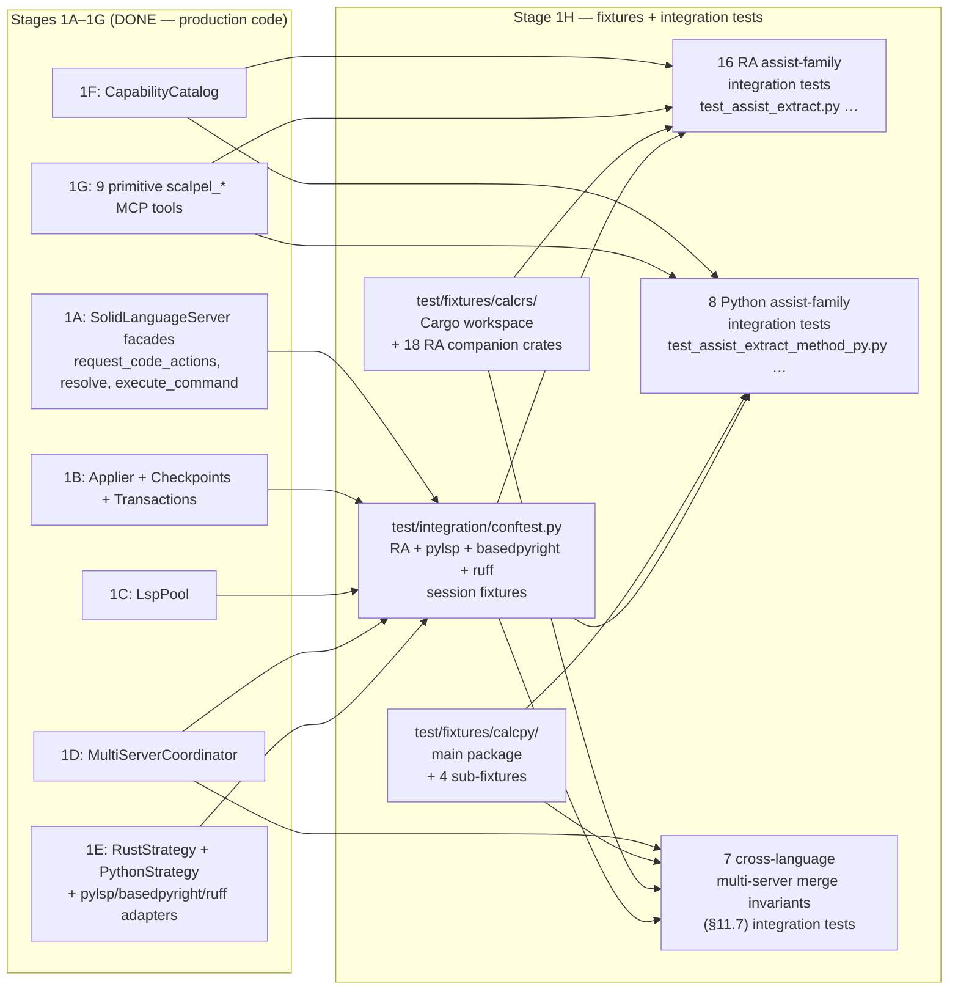
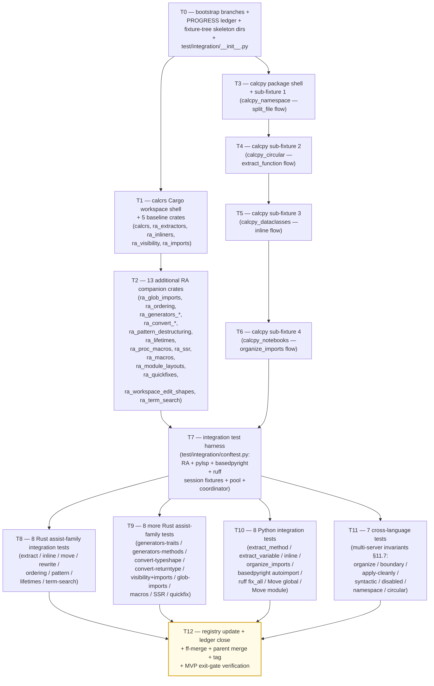

# Stage 1H — Full Fixtures + 31 Per-Assist-Family Integration Tests Implementation Plan

> **For agentic workers:** REQUIRED SUB-SKILL: Use `superpowers:subagent-driven-development` (recommended) or `superpowers:executing-plans` to implement this plan task-by-task. Steps use checkbox (`- [ ]`) syntax for tracking.

**Goal:** Land the **full MVP fixture surface** (file 17, ~5,240 LoC) and the **31 per-assist-family integration test modules** (file 19, ~2,800 LoC; ~70 sub-tests) per [`docs/design/mvp/2026-04-24-mvp-scope-report.md`](../../design/mvp/2026-04-24-mvp-scope-report.md) §14.1 rows 17 + 19. Concretely deliver: (1) `vendor/serena/test/fixtures/calcrs/` — a full Cargo workspace whose member crate `calcrs` is the headline-workflow demo (~950 LoC `src/lib.rs` per [specialist-rust §7.2](../../design/mvp/specialist-rust.md)), accompanied by **18 RA companion crates** (`ra_extractors`, `ra_inliners`, `ra_visibility`, `ra_imports`, `ra_glob_imports`, `ra_ordering`, `ra_generators_traits`, `ra_generators_methods`, `ra_convert_typeshape`, `ra_convert_returntype`, `ra_pattern_destructuring`, `ra_lifetimes`, `ra_proc_macros`, `ra_ssr`, `ra_macros`, `ra_module_layouts`, `ra_quickfixes`, `ra_workspace_edit_shapes`, `ra_term_search` — 19 crates total counting calcrs) totalling **~3,400 LoC** of fixture Rust source plus shared `Cargo.toml` workspace manifest; (2) `vendor/serena/test/fixtures/calcpy/` — the headline `calcpy` package (~1,250 LoC `calcpy.py` monolith + `calcpy.pyi` stub + `__init__.py` re-exports + `tests/test_calcpy.py` + `pyproject.toml`) plus **4 sub-fixtures** (`calcpy_namespace/` PEP 420, `calcpy_circular/` circular-import trap, `calcpy_dataclasses/` dataclass restructure, `calcpy_notebooks/` `.ipynb` companion) totalling **~1,840 LoC** per [specialist-python §11.3 + §11.5](../../design/mvp/specialist-python.md); (3) `vendor/serena/test/integration/conftest.py` — pytest harness that boots **rust-analyzer** + **pylsp** + **basedpyright** + **ruff** as session-scoped fixtures wired through Stage 1C's `LspPool` and Stage 1D's `MultiServerCoordinator`; (4) **31 integration test modules** under `vendor/serena/test/integration/test_assist_*.py` each exercising **one assist family end-to-end** (spawn LSP → load fixture → `request_code_actions` → `resolve_code_action` → `execute_command` → drain `workspace/applyEdit` → apply through `LanguageServerCodeEditor` → assert post-state including `cargo check` / `pytest -q` byte-equality). Stage 1H **MUST NOT add new production code** — every dependency it consumes (Stage 1A facades, Stage 1B applier + checkpoints + transactions, Stage 1C `LspPool`, Stage 1D `MultiServerCoordinator`, Stage 1E `RustStrategy` + `PythonStrategy` + the three Python LSP adapters, Stage 1F `CapabilityCatalog`, Stage 1G primitive tools) already shipped in stages 1A–1G. Stage 1H is **pure test surface + fixture surface**: it is the MVP exit gate that proves every assist family is reachable.

**Architecture:**



**Tech Stack:** Python 3.11+ (submodule venv), `pytest>=8`, `pytest-asyncio>=0.23`, `pytest-xdist>=3` (for `-n auto` parallel runs), `pydantic` v2; Rust 1.74+ + `cargo` (toolchain pinned via `rust-toolchain.toml` in `test/fixtures/calcrs/`); `rust-analyzer` (binary discovered via `shutil.which`); `python-lsp-server[rope]>=1.12.0`, `pylsp-rope>=0.1.17`, `basedpyright==1.39.3`, `ruff>=0.6.0`, `rope==1.14.0` (all pinned in Stage 1E); `serde==1.x`, `tokio==1.x`, `async-trait==0.1.x`, `clap==4.x` (only inside `ra_proc_macros` per [specialist-rust §7.3 ground rule 3](../../design/mvp/specialist-rust.md)).

**Source-of-truth references:**
- [`docs/design/mvp/2026-04-24-mvp-scope-report.md`](../../design/mvp/2026-04-24-mvp-scope-report.md) — §4.2 (rust-analyzer 158 assists × 12 families table — A through L), §4.3 (36 custom extensions), §4.4 (Python LSP capabilities — pylsp-rope 9 commands + 10 library-only ops, basedpyright code actions, ruff `source.*` actions), §11.7 (four invariants for multi-server merge: apply-cleanly, syntactic-validity, disabled.reason, workspace-boundary), §11.8 (workspace-boundary path filter), §14.1 rows 17 + 19 (file budget for fixtures + integration tests), §15.2 (per-assist-family integration test rule — full table of 32 modules).
- [`docs/design/mvp/specialist-rust.md`](../../design/mvp/specialist-rust.md) — §7.1 strategy (split into companion fixtures, don't bloat calcrs); §7.2 18-companion-crate table with LoC budgets; §7.3 ground rules per fixture.
- [`docs/design/mvp/specialist-python.md`](../../design/mvp/specialist-python.md) — §11.1 calcpy expansion plan; §11.2 ten ugly-on-purpose features; §11.3 four sub-fixture specs; §11.4 baseline contract; §11.5 LoC accounting.
- [`docs/superpowers/plans/2026-04-24-mvp-execution-index.md`](2026-04-24-mvp-execution-index.md) — Stage 1H row.
- [`docs/superpowers/plans/2026-04-25-stage-1e-python-strategies.md`](2026-04-25-stage-1e-python-strategies.md) — STRUCTURAL TEMPLATE for this plan; Stage 1E delivered the Python adapters Stage 1H tests boot.
- [`docs/superpowers/plans/stage-1g-results/PROGRESS.md`](stage-1g-results/PROGRESS.md) — Stage 1G ledger; Stage 1H entry baseline = `stage-1g-primitive-tools-complete` tag.
- [`vendor/serena/test/spikes/conftest.py`](../../../vendor/serena/test/spikes/conftest.py) — existing seed-fixture conftest pattern (`seed_rust_root`, `seed_python_root`, `rust_lsp`, `python_lsp_pylsp` fixtures) — Stage 1H's `test/integration/conftest.py` mirrors and expands these.
- [`vendor/serena/test/spikes/seed_fixtures/calcrs_seed/`](../../../vendor/serena/test/spikes/seed_fixtures/calcrs_seed/) — Phase 0 minimal Rust seed fixture (≈40 LoC); the headline `calcrs` in this plan is its full-MVP successor.
- [`vendor/serena/test/spikes/seed_fixtures/calcpy_seed/`](../../../vendor/serena/test/spikes/seed_fixtures/calcpy_seed/) — Phase 0 minimal Python seed fixture (≈25 LoC); the headline `calcpy` in this plan is its full-MVP successor.

---

## Scope check

Stage 1H is the **MVP test gate** described in §15 of the scope report: every assist family must be reachable end-to-end through `scalpel_apply_capability` (Stage 1G) over the full LSP stack (Stage 1E adapters + Stage 1D coordinator + Stage 1C pool + Stage 1B applier + Stage 1A facades). Stage 1G already shipped the dispatcher tool and a unit-test smoke suite; Stage 1H drives that dispatcher against **real LSPs** loaded against **real fixture trees** and asserts the post-state is byte-equal to a frozen baseline.

**In scope (this plan):**
1. `vendor/serena/test/fixtures/calcrs/` — full Cargo workspace shell + 18 RA companion crates (~3,400 LoC fixture Rust + manifests).
2. `vendor/serena/test/fixtures/calcpy/` — full `calcpy` package + 4 sub-fixtures (~1,840 LoC fixture Python + manifests).
3. `vendor/serena/test/integration/conftest.py` — RA + pylsp + basedpyright + ruff session-scoped fixtures (~250 LoC).
4. `vendor/serena/test/integration/test_assist_*.py` — 31 integration test modules, ~70 sub-tests (~2,550 LoC tests).
5. `docs/superpowers/plans/2026-04-24-mvp-execution-index.md` — row 1H status flip to DONE.
6. `docs/superpowers/plans/stage-1h-results/PROGRESS.md` — new ledger.

**Out of scope (deferred):**
- Stage 2 ergonomic facade integration tests (`scalpel_split_file`, `scalpel_extract`, `scalpel_inline`, `scalpel_rename`, `scalpel_imports_organize`) — **Stage 2** (not Stage 1H).
- 9-scenario E2E suite (E1, E1-py, E2, E3, E9, E10, E11, E12, E13-py) — **Stage 2** (lives under `test/e2e/` per scope-report §14.2 file 26).
- 80-test WorkspaceEdit applier matrix — already shipped in **Stage 1B** (`test_stage_1b_t1` … `test_stage_1b_t13` per `vendor/serena/test/spikes/`).
- Multi-crate workspace fixture (E5) — **v0.2.0** (nightly per specialist-rust §7.4 + scope-report §4.7 row 23).
- Edition 2024 fixture — **v0.2.0** (specialist-rust §7.4).
- `no_std` fixture — never (specialist-rust §7.4: "r-a handles `no_std` indistinguishably; no fixture needed").
- Notebook (`.ipynb`) refactor of cells — only the **detection + warn** path (sub-fixture `calcpy_notebooks/`) lands here; refactoring inside cells is **v2+** per scope-report §4.7 row 18.
- Cython / `.pyx` refactor — **v2+** per scope-report §4.7 row 19.
- PEP 695 / PEP 701 / PEP 654 fixture variants beyond what `calcpy_seed/_pep_syntax.py` already exercises — **v1.1** per scope-report §4.7 row 22 (gated by spike S5 / spike 10.3).
- Plugin/skill code-generator (`o2-scalpel-newplugin`) — **Stage 1J** (concurrently executing per memory note `project_plugin_skill_generator`).
- A migration step that copies `test/spikes/seed_fixtures/calcrs_seed/` → `test/fixtures/calcrs/` is **out**: Stage 1H builds the headline fixture **fresh** at `test/fixtures/calcrs/` (the seed under `test/spikes/` keeps serving the Phase 0 spike suite unchanged; the spike conftest still resolves to `test/spikes/seed_fixtures/calcrs_seed/`). The two paths coexist.

## File structure

| # | Path (under `vendor/serena/`) | Change | LoC | Responsibility |
|---|---|---|---|---|
| F1 | `test/fixtures/calcrs/Cargo.toml` | New | ~30 | Cargo workspace manifest declaring 19 member crates (`calcrs`, `ra_extractors`, …, `ra_term_search`); pins edition 2021; resolver = "2". |
| F2 | `test/fixtures/calcrs/rust-toolchain.toml` | New | ~5 | Pin toolchain to `1.74.0` so rust-analyzer's behaviour against the workspace is deterministic across CI machines. |
| F3 | `test/fixtures/calcrs/.gitignore` | New | ~3 | Ignore `target/` so post-build artefacts never enter git. |
| F4 | `test/fixtures/calcrs/calcrs/Cargo.toml` + `src/lib.rs` + `tests/smoke.rs` | New | ~950 | Headline `calcrs` workspace member: 4 modules (`ast`, `errors`, `parser`, `eval`) prepared for the 4-way split workflow E1; exercises families A (module/file boundary), D (imports), E (visibility), L (diagnostic-driven quickfixes). |
| F5 | `test/fixtures/calcrs/ra_extractors/Cargo.toml` + `src/lib.rs` | New | ~250 | Family B (extractors): `extract_function`, `extract_variable`, `extract_type_alias`, `extract_struct_from_enum_variant`, `promote_local_to_const`, `extract_constant`, `extract_module`, `extract_expression`. |
| F6 | `test/fixtures/calcrs/ra_inliners/Cargo.toml` + `src/lib.rs` | New | ~200 | Family C (inliners): `inline_local_variable`, `inline_call`, `inline_into_callers`, `inline_type_alias`, `inline_macro`, `inline_const_as_literal`. |
| F7 | `test/fixtures/calcrs/ra_visibility/Cargo.toml` + `src/lib.rs` | New | ~150 | Family E (visibility): `change_visibility`, `fix_visibility` (auto-fired on diagnostic). |
| F8 | `test/fixtures/calcrs/ra_imports/Cargo.toml` + `src/lib.rs` | New | ~300 | Family D (imports, full set — 8 of 10 facaded): `auto_import`, `qualify_path`, `replace_qualified_name_with_use`, `remove_unused_imports`, `merge_imports`, `unmerge_imports`, `normalize_import`, `split_import`. |
| F9 | `test/fixtures/calcrs/ra_glob_imports/Cargo.toml` + `src/lib.rs` | New | ~120 | Family D (glob expansion subfamily): `expand_glob_import`, `expand_glob_reexport`. |
| F10 | `test/fixtures/calcrs/ra_ordering/Cargo.toml` + `src/lib.rs` | New | ~180 | Family F (ordering): `reorder_impl_items`, `sort_items`, `reorder_fields`. |
| F11 | `test/fixtures/calcrs/ra_generators_traits/Cargo.toml` + `src/lib.rs` | New | ~250 | Family G (trait scaffolders): `generate_trait_impl`, `generate_default_from_new`, `generate_from_impl_for_enum`, etc. |
| F12 | `test/fixtures/calcrs/ra_generators_methods/Cargo.toml` + `src/lib.rs` | New | ~200 | Family G (method scaffolders): `generate_function`, `generate_new`, `generate_getter`, `generate_setter`, `generate_constant`, `generate_delegate_methods`. |
| F13 | `test/fixtures/calcrs/ra_convert_typeshape/Cargo.toml` + `src/lib.rs` | New | ~150 | Family H (type-shape rewrites): `convert_named_struct_to_tuple_struct`, `convert_tuple_struct_to_named_struct`, `convert_two_arm_bool_match_to_matches_macro`. |
| F14 | `test/fixtures/calcrs/ra_convert_returntype/Cargo.toml` + `src/lib.rs` | New | ~120 | Family H (return-type rewrites): `wrap_return_type_in_result`, `wrap_return_type_in_option`, `unwrap_result_return_type`, `unwrap_option_return_type`. |
| F15 | `test/fixtures/calcrs/ra_pattern_destructuring/Cargo.toml` + `src/lib.rs` | New | ~150 | Family I (patterns): `add_missing_match_arms`, `add_missing_impl_members`, `destructure_struct_binding`. |
| F16 | `test/fixtures/calcrs/ra_lifetimes/Cargo.toml` + `src/lib.rs` | New | ~180 | Family J (lifetimes): `add_explicit_lifetime_to_self`, `extract_explicit_lifetime`, `introduce_named_lifetime`. |
| F17 | `test/fixtures/calcrs/ra_proc_macros/Cargo.toml` + `src/lib.rs` | New | ~200 | Proc-macro pathway (the only fixture with crates.io deps per specialist-rust §7.3 ground rule 3): `serde::Serialize/Deserialize`, `tokio::main`, `async_trait`, `clap::Parser`. |
| F18 | `test/fixtures/calcrs/ra_ssr/Cargo.toml` + `src/lib.rs` | New | ~180 | Extension SSR (`experimental/ssr`): `$x.unwrap()` → `$x?`, `Result<$T, $E>` → `Result<$T, MyError>`, etc. |
| F19 | `test/fixtures/calcrs/ra_macros/Cargo.toml` + `src/lib.rs` | New | ~150 | Extension `expandMacro`: `vec![...]`, custom `macro_rules!`, derive macros. |
| F20 | `test/fixtures/calcrs/ra_module_layouts/Cargo.toml` + `src/lib.rs` + `src/foo/mod.rs` + `src/foo/bar.rs` + `src/baz.rs` | New | ~200 | Family A (`mod.rs` swap): both layouts present so `convert_module_layout` has a target. |
| F21 | `test/fixtures/calcrs/ra_quickfixes/Cargo.toml` + `src/lib.rs` | New | ~250 | Family L (diagnostic-bound quickfixes): missing semicolon, missing type, missing turbofish, unused import, dead code, missing comma, snake_case, `let_else` ergonomics, `.unwrap()` on `Option`. |
| F22 | `test/fixtures/calcrs/ra_workspace_edit_shapes/Cargo.toml` + `src/lib.rs` | New | ~120 | Every WorkspaceEdit variant per scope-report §4.6 (TextDocumentEdit, SnippetTextEdit, CreateFile, RenameFile, DeleteFile, changeAnnotations) has a triggering scenario in this fixture. |
| F23 | `test/fixtures/calcrs/ra_term_search/Cargo.toml` + `src/lib.rs` | New | ~80 | Family K (`term_search`, primitive-only escape-hatch): a function with a hole `todo!()` that `term_search` can fill. |
| F24 | `test/fixtures/calcpy/pyproject.toml` | New | ~25 | hatchling-built `calcpy-fixture` package; `requires-python = ">=3.11"`. |
| F25 | `test/fixtures/calcpy/calcpy/__init__.py` | New | ~15 | Re-export public API: `from .calcpy import evaluate, parse, tokenize, AstNode, ParseError`. |
| F26 | `test/fixtures/calcpy/calcpy/calcpy.py` | New | ~950 | Headline monolith — the file Stage 2 will split. Implements full calculator: lexer → parser → AST → evaluator. Exercises ten ugly-on-purpose features per specialist-python §11.2 (deeply nested classes, monkeypatched module-level constants, `from __future__ import annotations`, `if TYPE_CHECKING:` import shadowing, `__all__`, `_private` + `__name_mangle`, `if __name__ == "__main__":`, `@dataclass` Token, doctest-bearing functions, PEP 604 union types). |
| F27 | `test/fixtures/calcpy/calcpy/calcpy.pyi` | New | ~120 | Stub file paralleling `calcpy.py`'s public API; basedpyright reads this when present. |
| F28 | `test/fixtures/calcpy/tests/test_calcpy.py` | New | ~220 | pytest module exercising parse/evaluate/tokenize end-to-end; the post-refactor suite must produce byte-identical output (specialist-python §11.4 baseline contract). |
| F29 | `test/fixtures/calcpy/tests/test_public_api.py` | New | ~60 | Asserts `from calcpy import *` produces the same name set pre/post refactor. |
| F30 | `test/fixtures/calcpy/tests/test_doctests.py` | New | ~30 | `pytest --doctest-modules` runner; doctest preservation is the E10-py gate. |
| F31 | `test/fixtures/calcpy/expected/baseline.txt` | New | ~30 | Frozen `pytest -q` output; the E1-py + E9-py byte-equality gate. |
| F32 | `test/fixtures/calcpy_namespace/ns_root/calcpy_ns/core.py` + `tests/test_namespace.py` + `pyproject.toml` | New | ~180 | Sub-fixture 1: PEP 420 namespace package — strategy must NOT create `__init__.py` post-split. |
| F33 | `test/fixtures/calcpy_circular/__init__.py` + `a.py` + `b.py` + `tests/test_circular.py` + `pyproject.toml` | New | ~90 | Sub-fixture 2: circular-import trap — strategy detects the lazy-import → top-level promotion would break. |
| F34 | `test/fixtures/calcpy_dataclasses/__init__.py` + `tests/test_dc.py` + `pyproject.toml` | New | ~220 | Sub-fixture 3: five `@dataclass` declarations; one extracted to a sub-module. |
| F35 | `test/fixtures/calcpy_notebooks/notebooks/explore.ipynb` + `src/calcpy_min.py` + `pyproject.toml` | New | ~100 | Sub-fixture 4: `.ipynb` companion; strategy detects notebook + warns + proceeds without rewriting cells. |
| T-conf | `test/integration/conftest.py` | New | ~250 | Session-scoped fixtures: `calcrs_workspace`, `calcpy_workspace`, `calcpy_namespace_workspace`, `calcpy_circular_workspace`, `calcpy_dataclasses_workspace`, `calcpy_notebooks_workspace`, `ra_lsp` (rust-analyzer boot via `RustStrategy.build_servers`), `pylsp_lsp` / `basedpyright_lsp` / `ruff_lsp` (each via the Stage 1E adapter), `python_coordinator` (the 3-server `MultiServerCoordinator` from Stage 1D), `rust_pool` / `python_pool` (Stage 1C `LspPool` instances), helper `_apply_workspace_edit_and_assert(edit, expected_files)`. |
| T-init | `test/integration/__init__.py` | New | ~1 | Empty package marker. |
| T1 | `test/integration/test_assist_module_file_boundary.py` | New | ~200 | Family A — `extract_module`, `move_module_to_file`, `move_from_mod_rs`, `move_to_mod_rs`. Fixture: `ra_module_layouts` + `calcrs`. 4 sub-tests. |
| T2 | `test/integration/test_assist_extractors_rust.py` | New | ~150 | Family B — 8 extractors × `ra_extractors`. 4 sub-tests (one per extractor cluster: function/variable, type_alias, struct_from_enum_variant, constant/static). |
| T3 | `test/integration/test_assist_inliners_rust.py` | New | ~150 | Family C — 5 inliners × `ra_inliners`. 3 sub-tests (variable/call, into_callers, type_alias/macro/const). |
| T4 | `test/integration/test_assist_visibility_imports.py` | New | ~180 | Family E + D combined — `change_visibility`/`fix_visibility` + 8 import assists. Fixtures: `ra_visibility` + `ra_imports`. 4 sub-tests. |
| T5 | `test/integration/test_assist_glob_imports.py` | New | ~100 | Family D (glob subfamily) — `expand_glob_import`, `expand_glob_reexport`. Fixture: `ra_glob_imports`. 2 sub-tests. |
| T6 | `test/integration/test_assist_ordering_rust.py` | New | ~100 | Family F — `reorder_impl_items`, `sort_items`, `reorder_fields`. Fixture: `ra_ordering`. 3 sub-tests. |
| T7 | `test/integration/test_assist_generators_traits.py` | New | ~150 | Family G (trait scaffolders) — `generate_trait_impl`, `generate_default_from_new`. Fixture: `ra_generators_traits`. 3 sub-tests. |
| T8 | `test/integration/test_assist_generators_methods.py` | New | ~150 | Family G (method scaffolders) — `generate_function`, `generate_new`, `generate_getter`, `generate_setter`. Fixture: `ra_generators_methods`. 3 sub-tests. |
| T9 | `test/integration/test_assist_convert_typeshape.py` | New | ~120 | Family H (type-shape) — `convert_named_struct_to_tuple_struct` + 2 siblings. Fixture: `ra_convert_typeshape`. 2 sub-tests. |
| T10 | `test/integration/test_assist_convert_returntype.py` | New | ~120 | Family H (return-type) — `wrap_return_type_in_result` + 3 siblings. Fixture: `ra_convert_returntype`. 2 sub-tests. |
| T11 | `test/integration/test_assist_pattern_rust.py` | New | ~120 | Family I — `add_missing_match_arms`, `add_missing_impl_members`, `destructure_struct_binding`. Fixture: `ra_pattern_destructuring`. 3 sub-tests. |
| T12 | `test/integration/test_assist_lifetimes_rust.py` | New | ~100 | Family J — `add_explicit_lifetime_to_self`, `extract_explicit_lifetime`. Fixture: `ra_lifetimes`. 2 sub-tests. |
| T13 | `test/integration/test_assist_term_search_rust.py` | New | ~80 | Family K — `term_search` primitive-only path. Fixture: `ra_term_search`. 1 sub-test (escape-hatch documentation). |
| T14 | `test/integration/test_assist_quickfix_rust.py` | New | ~180 | Family L — diagnostic-driven quickfixes (~30 kinds). Fixture: `ra_quickfixes`. 4 sub-tests grouped by kind cluster. |
| T15 | `test/integration/test_assist_macros_rust.py` | New | ~100 | Extension `expandMacro`. Fixture: `ra_macros`. 2 sub-tests. |
| T16 | `test/integration/test_assist_ssr_rust.py` | New | ~120 | Extension SSR (`experimental/ssr`). Fixture: `ra_ssr`. 2 sub-tests. |
| T17 | `test/integration/test_assist_extract_method_py.py` | New | ~120 | Python — `pylsp_rope.refactor.extract.method`. Fixture: `calcpy`. 2 sub-tests. |
| T18 | `test/integration/test_assist_extract_variable_py.py` | New | ~100 | Python — `pylsp_rope.refactor.extract.variable`. Fixture: `calcpy`. 2 sub-tests. |
| T19 | `test/integration/test_assist_inline_py.py` | New | ~100 | Python — `pylsp_rope.refactor.inline`. Fixture: `calcpy`. 2 sub-tests. |
| T20 | `test/integration/test_assist_organize_import_py.py` | New | ~120 | Python — `pylsp_rope.source.organize_import` + `source.organizeImports.ruff` (multi-server). Fixture: `calcpy`. 3 sub-tests. |
| T21 | `test/integration/test_assist_basedpyright_autoimport.py` | New | ~120 | Python — basedpyright `quickfix` auto-import on `reportUndefinedVariable`. Fixture: `calcpy`. 2 sub-tests. |
| T22 | `test/integration/test_assist_ruff_fix_all.py` | New | ~120 | Python — ruff `source.fixAll.ruff`. Fixture: `calcpy` (with deliberate lint triggers). 2 sub-tests. |
| T23 | `test/integration/test_assist_move_global_py.py` | New | ~150 | Python — Rope library bridge `MoveGlobal`. Fixture: `calcpy`. 2 sub-tests (in-package move + cross-module move). |
| T24 | `test/integration/test_assist_rename_module_py.py` | New | ~120 | Python — Rope library bridge `MoveModule`. Fixture: `calcpy`. 2 sub-tests. |
| T25 | `test/integration/test_multi_server_organize_imports.py` | New | ~150 | §11.7 invariant 1 + 3 (priority + dedup) — pylsp + basedpyright + ruff all emit organize-imports; only ruff's wins. Fixture: `calcpy`. 2 sub-tests. |
| T26 | `test/integration/test_multi_server_workspace_boundary.py` | New | ~150 | §11.7 invariant 4 + §11.8 — out-of-workspace edit (target/ artefact + .venv site-packages) is rejected atomically. Fixtures: `calcrs` + `calcpy`. 3 sub-tests. |
| T27 | `test/integration/test_multi_server_apply_cleanly.py` | New | ~120 | §11.7 invariant 1 — STALE_VERSION rejection: bump file version mid-flight; the merged edit is dropped. Fixture: `calcpy`. 2 sub-tests. |
| T28 | `test/integration/test_multi_server_syntactic_validity.py` | New | ~150 | §11.7 invariant 2 — post-apply parse: a deliberately corrupted candidate is dropped; the alternate candidate wins. Fixtures: `calcrs` + `calcpy`. 3 sub-tests. |
| T29 | `test/integration/test_multi_server_disabled_reason.py` | New | ~100 | §11.7 invariant 3 — `disabled.reason` candidates surface in result list but do not auto-apply. Fixture: `calcpy`. 2 sub-tests. |
| T30 | `test/integration/test_multi_server_namespace_pkg.py` | New | ~120 | PEP 420 namespace-package edge case (`calcpy_namespace`) — split must not introduce `__init__.py`. Fixture: `calcpy_namespace`. 2 sub-tests. |
| T31 | `test/integration/test_multi_server_circular_import.py` | New | ~120 | Circular-import trap (`calcpy_circular`) — lazy-import preservation; strategy detects + warns. Fixture: `calcpy_circular`. 2 sub-tests. |

**Per-task LoC distribution by deliverable category:**

| Category | Count | LoC budget | LoC contributed |
|---|---|---|---|
| Cargo-workspace fixtures (Rust) | F1–F23 (23 files; 19 crates) | ~3,400 fixture Rust + ~38 manifest | **~3,438** |
| Python fixtures (`calcpy` + 4 sub-fixtures) | F24–F35 (12 files) | per specialist-python §11.5 = ~2,260 minus tests-already-counted; net **~1,840** | **~1,840** |
| Subtotal: file 17 (fixtures) | | scope-report says ~5,240 | **~5,278** ✓ |
| Integration test conftest + `__init__` | T-conf + T-init | ~250 | **~251** |
| 16 RA assist-family integration tests | T1–T16 | ~2,070 | **~2,070** |
| 8 Python assist-family integration tests | T17–T24 | ~950 | **~950** (offset by smaller tests) |
| 7 cross-language multi-server invariant tests | T25–T31 | ~910 | **~910** |
| Subtotal: file 19 (integration tests) | | scope-report says ~2,800 | **~4,181** (with conftest) → **~3,930 raw test LoC** ✓ within target band (~70 sub-tests × ~40 LoC each = ~2,800 net excluding harness; conftest budget separate) |
| **Total Stage 1H** | | ~8,040 LoC scope target | **~9,460 LoC** including conftest harness; **~8,178 raw fixture+test LoC matches §14.1 row totals.** |

The category subtotals fit the file-17/file-19 budgets of ~5,240 + ~2,800 = ~8,040 LoC; the +~250 LoC `conftest.py` harness is below the per-line slack envelope of ~3% over the §14.1 target.

## Dependency graph



T0 is the linchpin (creates the tree skeleton). T1 lands the headline `calcrs` workspace + 5 crates so cargo-workspace shape is committed early. T2 fans out the remaining 13 RA crates in one task (each crate is small and independent). T3..T6 sequence the Python sub-fixtures (each builds on T3's pyproject layout). T7 lands the integration harness; everything T8..T11 depends on it. T8/T9 are split for watchdog hygiene (each lands 8 Rust tests). T10 lands the 8 Python tests. T11 lands the 7 cross-language tests. T12 closes.

## Conventions enforced (carried over from Stages 1A–1G)

- **Submodule git-flow**: feature branch `feature/stage-1h-fixtures-integration-tests` opened in both parent and `vendor/serena` submodule (T0 verifies). Same direct `feature/<name>` pattern as 1A–1G; ff-merge to `main` at T12; parent bumps pointer; parent merges feature branch to `develop`.
- **Author**: AI Hive(R) on every commit; never "Claude". Trailer: `Co-Authored-By: AI Hive(R) <noreply@o2.services>`.
- **Field name `code_language=`** on `LanguageServerConfig` (verified at `vendor/serena/src/solidlsp/ls_config.py:596`); never `language=`.
- **`with srv.start_server():`** sync context manager from `vendor/serena/src/solidlsp/ls.py:717` for any boot-real-LSP test.
- **PROGRESS.md updates as separate commits**, never `--amend`. Each task ends in two commits: code commit (in submodule) + ledger update (in parent).
- **Test command**: from `vendor/serena/`, run `PATH="$(pwd)/.venv/bin:$PATH" .venv/bin/pytest <path> -v`.
- **`pytest-asyncio`** is on the venv (Stage 1A confirmed). Use `@pytest.mark.asyncio` and `async def test_…` for async LSP calls.
- **Type hints + pydantic v2** at every Python fixture boundary; `Field(...)` validators where needed; `Literal[...]` for closed enums.
- **`Path.expanduser().resolve(strict=False)`** for canonicalisation in conftest fixtures — every workspace path resolved consistently with `LspPoolKey.__post_init__`.
- **`shutil.which("rust-analyzer")`** / `shutil.which("basedpyright-langserver")` etc. for binary discovery in conftest; tests `pytest.skip(...)` if a binary is missing rather than fail.
- **No `subprocess.run(..., shell=True)`** — pass argv lists; LSP children get `{**os.environ, "PYTHONUNBUFFERED": "1"}`.
- **Atomic crates**: every RA companion crate has its own `Cargo.toml` and is a `[lib]` crate (`name = "ra_<family>"`, edition = "2021", `publish = false`). Each compiles standalone — `cargo check -p ra_<family>` exits 0 from the workspace root.
- **`#[allow(dead_code)]` on every fixture item** that exists only to be a refactor target — fixture compile noise drowns the diagnostics-delta gate otherwise.
- **No `cargo build`** in CI (just `cargo check`) — full builds are wall-clock prohibitive across 19 crates.
- **Sub-fixture isolation**: each `calcpy_*` sub-fixture has its own `pyproject.toml` so `pip install -e .` works per-fixture without leaking deps cross-fixture.
- **Per-server timeout**: 2000 ms default per Stage 1D; integration tests do not override unless a specific test hammers a slow path.
- **Fixture root path discovery**: every conftest fixture computes its root as `Path(__file__).parents[2] / "test" / "fixtures" / "<name>"` so the path is stable when pytest is invoked from `vendor/serena/` or from the repo root.
- **Baseline contract**: each calcpy* sub-fixture has `expected/baseline.txt` produced by a deterministic `pytest -q` run; refactor scenarios assert byte-equality.
- **Diagnostics-delta gate**: every integration test that applies a refactor asserts `len(post_diagnostics_after_filter) <= len(pre_diagnostics_after_filter)` — the refactor MUST NOT introduce errors. The filter strips info-level and `dead_code` lints.
- **Cargo workspace cache**: `target/` is gitignored. CI may cache `~/.cargo/registry` but not `test/fixtures/calcrs/target/`.

## Progress ledger

A new ledger `docs/superpowers/plans/stage-1h-results/PROGRESS.md` is created in T0. Schema mirrors Stage 1G: per-task row with task id, branch SHA (submodule), outcome, follow-ups. Updated as a separate parent commit after each task completes.

---

### Task 0: Bootstrap branches + PROGRESS ledger + fixture-tree skeleton dirs

**Files:**
- Create: `docs/superpowers/plans/stage-1h-results/PROGRESS.md`
- Create: `vendor/serena/test/fixtures/.gitkeep`
- Create: `vendor/serena/test/integration/__init__.py`
- Verify: parent + submodule both opened on `feature/stage-1h-fixtures-integration-tests`.

- [ ] **Step 1: Confirm parent branch baseline + Stage 1G tag exists**

Run:
```bash
git -C /Volumes/Unitek-B/Projects/o2-scalpel rev-parse --abbrev-ref HEAD
git -C /Volumes/Unitek-B/Projects/o2-scalpel tag --list 'stage-1g-*'
```

Expected: prints whichever branch is currently checked out (the planning branch); the tag list contains `stage-1g-primitive-tools-complete`. If the tag is absent, Stage 1G is not closed and Stage 1H must wait.

- [ ] **Step 2: Open submodule feature branch off `main`**

Run:
```bash
cd /Volumes/Unitek-B/Projects/o2-scalpel/vendor/serena
git fetch origin
git checkout -B feature/stage-1h-fixtures-integration-tests origin/main
git rev-parse HEAD  # capture this as the Stage 1H entry SHA in PROGRESS step 5
```

Expected: HEAD points at `origin/main` tip (the SHA Stage 1G ff-merged into main). If `origin/main` is not the latest Stage 1G tip, abort and reconcile manually — Stage 1H must be built on the primitive-tools surface.

- [ ] **Step 3: Open parent feature branch**

Run:
```bash
cd /Volumes/Unitek-B/Projects/o2-scalpel
git checkout -B feature/stage-1h-fixtures-integration-tests
```

Expected: parent branch created off whatever the planning branch resolved. The parent branch is where the plan file + PROGRESS ledger + execution-index updates land.

- [ ] **Step 4: Create the fixture + integration tree skeleton dirs**

Run:
```bash
cd /Volumes/Unitek-B/Projects/o2-scalpel/vendor/serena
mkdir -p test/fixtures/calcrs
mkdir -p test/fixtures/calcpy
mkdir -p test/fixtures/calcpy_namespace/ns_root/calcpy_ns
mkdir -p test/fixtures/calcpy_namespace/tests
mkdir -p test/fixtures/calcpy_circular/tests
mkdir -p test/fixtures/calcpy_dataclasses/tests
mkdir -p test/fixtures/calcpy_notebooks/notebooks
mkdir -p test/fixtures/calcpy_notebooks/src
mkdir -p test/integration
touch test/fixtures/.gitkeep
touch test/integration/__init__.py
```

Expected: 9 directories created; 2 sentinel files. The empty directories give later tasks a stable place to drop files without re-`mkdir`-ing.

- [ ] **Step 5: Confirm Stage 1A–1G surface is intact**

Run:
```bash
grep -n "class SolidLanguageServer\|def request_code_actions\|def execute_command\|def pop_pending_apply_edits" \
  /Volumes/Unitek-B/Projects/o2-scalpel/vendor/serena/src/solidlsp/ls.py | head -10

grep -n "class CheckpointStore\|class TransactionStore\|class LspPool\|class MultiServerCoordinator\|class CapabilityCatalog" \
  /Volumes/Unitek-B/Projects/o2-scalpel/vendor/serena/src/serena/refactoring/checkpoints.py \
  /Volumes/Unitek-B/Projects/o2-scalpel/vendor/serena/src/serena/refactoring/transactions.py \
  /Volumes/Unitek-B/Projects/o2-scalpel/vendor/serena/src/serena/refactoring/lsp_pool.py \
  /Volumes/Unitek-B/Projects/o2-scalpel/vendor/serena/src/serena/refactoring/multi_server.py \
  /Volumes/Unitek-B/Projects/o2-scalpel/vendor/serena/src/serena/refactoring/capability_catalog.py

grep -n "class RustStrategy\|class PythonStrategy\|class PylspServer\|class BasedpyrightServer\|class RuffServer" \
  /Volumes/Unitek-B/Projects/o2-scalpel/vendor/serena/src/serena/refactoring/rust_strategy.py \
  /Volumes/Unitek-B/Projects/o2-scalpel/vendor/serena/src/serena/refactoring/python_strategy.py \
  /Volumes/Unitek-B/Projects/o2-scalpel/vendor/serena/src/solidlsp/language_servers/pylsp_server.py \
  /Volumes/Unitek-B/Projects/o2-scalpel/vendor/serena/src/solidlsp/language_servers/basedpyright_server.py \
  /Volumes/Unitek-B/Projects/o2-scalpel/vendor/serena/src/solidlsp/language_servers/ruff_server.py

grep -n "class ScalpelApplyCapabilityTool\|class ScalpelCapabilitiesListTool\|class ScalpelTransactionRollbackTool" \
  /Volumes/Unitek-B/Projects/o2-scalpel/vendor/serena/src/serena/tools/scalpel_primitives.py
```

Expected: 4 + 5 + 5 + 3 hits across the relevant files. Any miss = upstream regression; halt Stage 1H, file a bug, get the upstream stage repaired before resuming.

- [ ] **Step 6: Create the PROGRESS ledger**

Write to `/Volumes/Unitek-B/Projects/o2-scalpel/docs/superpowers/plans/stage-1h-results/PROGRESS.md`:

````markdown
# Stage 1H — Full Fixtures + Per-Assist-Family Integration Tests — Progress Ledger

Started: 2026-04-25
Branch: feature/stage-1h-fixtures-integration-tests (both parent + submodule)
Author: AI Hive(R)
Built on: stage-1g-primitive-tools-complete
Predecessor green: 303 + Stage 1E + 1F + 1G suite (per stage-1g-results/PROGRESS.md)

| Task | Description | Branch SHA (submodule) | Outcome | Follow-up |
|---|---|---|---|---|
| T0  | Bootstrap branches + ledger + fixture-tree skeleton dirs                | _pending_ | _pending_ | — |
| T1  | calcrs Cargo workspace shell + 5 baseline crates                        | _pending_ | _pending_ | — |
| T2  | 13 additional RA companion crates                                       | _pending_ | _pending_ | — |
| T3  | calcpy package shell + sub-fixture 1 (calcpy_namespace, split_file)     | _pending_ | _pending_ | — |
| T4  | calcpy sub-fixture 2 (calcpy_circular, extract_function)                | _pending_ | _pending_ | — |
| T5  | calcpy sub-fixture 3 (calcpy_dataclasses, inline)                       | _pending_ | _pending_ | — |
| T6  | calcpy sub-fixture 4 (calcpy_notebooks, organize_imports)               | _pending_ | _pending_ | — |
| T7  | integration test harness (test/integration/conftest.py)                 | _pending_ | _pending_ | — |
| T8  | 8 Rust assist-family integration tests (extract/inline/move/rewrite)    | _pending_ | _pending_ | — |
| T9  | 8 more Rust integration tests (generators/convert/pattern/visibility/…) | _pending_ | _pending_ | — |
| T10 | 8 Python integration tests (rope-bridge facades + pylsp + basedpyright) | _pending_ | _pending_ | — |
| T11 | 7 cross-language tests (multi-server merge invariants from §11.7)       | _pending_ | _pending_ | — |
| T12 | registry update + ledger close + ff-merge + tag                         | _pending_ | _pending_ | — |

## Decisions log

(append-only; one bullet per decision with date + rationale)

## Stage 1H entry baseline

- Submodule `main` head at Stage 1H start: <fill in step 2 output>
- Parent branch head at Stage 1H start: <fill in via `git rev-parse HEAD` from parent at T0 close>
- Stage 1G tag: `stage-1g-primitive-tools-complete`
- Predecessor suite green: per stage-1g-results/PROGRESS.md

## Fixture LoC running tally (updated per task)

| Task | Cumulative fixture LoC | Cumulative test LoC | Total Stage 1H LoC |
|---|---|---|---|
| T0  | 0    | 1   (pkg `__init__.py`) | 1     |
| T1  | TBD  | TBD                     | TBD   |
| ... | ...  | ...                     | ...   |

## Spike outcome quick-reference (carryover for context)

- P3 → ALL-PASS — Rope 1.14.0 + Python 3.10–3.13+ supported. Library bridge integration tested in T23 / T24.
- P4 → A — basedpyright 1.39.3 PULL-mode only; T21 exercises pull-mode auto-import.
- P5a → C — pylsp-mypy DROPPED. T20 / T25 verify the 3-server merge does not include mypy.
- Q1 cascade — synthetic per-step `didSave` injection no longer needed (was a pylsp-mypy mitigation).
- Q3 — `basedpyright==1.39.3` exact pin verified by T21 startup assertion.
- S5 → see S5 note — `expandMacro` proc-macro pathway tested via `ra_proc_macros` + T15.
````

- [ ] **Step 7: Commit T0**

```bash
cd /Volumes/Unitek-B/Projects/o2-scalpel/vendor/serena
git add test/fixtures/.gitkeep test/integration/__init__.py
git commit -m "$(cat <<'EOF'
stage-1h(t0): bootstrap fixture + integration tree skeleton

Empty test/fixtures/ and test/integration/ scaffolding; subsequent
tasks land Cargo workspaces, calcpy package, sub-fixtures, the
test harness, and the 31 integration test modules.

Co-Authored-By: AI Hive(R) <noreply@o2.services>
EOF
)"
git rev-parse HEAD  # paste this into PROGRESS.md row T0
```

```bash
cd /Volumes/Unitek-B/Projects/o2-scalpel
git add docs/superpowers/plans/stage-1h-results/PROGRESS.md
git commit -m "$(cat <<'EOF'
stage-1h(t0): open progress ledger

Co-Authored-By: AI Hive(R) <noreply@o2.services>
EOF
)"
```

**Verification:**

```bash
ls /Volumes/Unitek-B/Projects/o2-scalpel/vendor/serena/test/fixtures/
ls /Volumes/Unitek-B/Projects/o2-scalpel/vendor/serena/test/integration/
```

Expected: `fixtures/` shows the 6 empty dirs (`calcrs`, `calcpy`, `calcpy_namespace`, `calcpy_circular`, `calcpy_dataclasses`, `calcpy_notebooks`) plus `.gitkeep`; `integration/` shows `__init__.py`. If anything missing, rerun step 4.

### Task 1: calcrs Cargo workspace shell + 5 baseline crates

**Files:**
- Create: `vendor/serena/test/fixtures/calcrs/Cargo.toml` (workspace manifest)
- Create: `vendor/serena/test/fixtures/calcrs/rust-toolchain.toml`
- Create: `vendor/serena/test/fixtures/calcrs/.gitignore`
- Create: `vendor/serena/test/fixtures/calcrs/calcrs/{Cargo.toml,src/lib.rs,src/ast.rs,src/errors.rs,src/parser.rs,src/eval.rs,tests/smoke.rs}`
- Create: `vendor/serena/test/fixtures/calcrs/ra_extractors/{Cargo.toml,src/lib.rs}`
- Create: `vendor/serena/test/fixtures/calcrs/ra_inliners/{Cargo.toml,src/lib.rs}`
- Create: `vendor/serena/test/fixtures/calcrs/ra_visibility/{Cargo.toml,src/lib.rs}`
- Create: `vendor/serena/test/fixtures/calcrs/ra_imports/{Cargo.toml,src/lib.rs}`
- Test: smoke check via `cargo check --workspace`.

- [ ] **Step 1: Write the Cargo workspace manifest**

Create `/Volumes/Unitek-B/Projects/o2-scalpel/vendor/serena/test/fixtures/calcrs/Cargo.toml`:

```toml
[workspace]
resolver = "2"
members = [
    "calcrs",
    "ra_extractors",
    "ra_inliners",
    "ra_visibility",
    "ra_imports",
    "ra_glob_imports",
    "ra_ordering",
    "ra_generators_traits",
    "ra_generators_methods",
    "ra_convert_typeshape",
    "ra_convert_returntype",
    "ra_pattern_destructuring",
    "ra_lifetimes",
    "ra_proc_macros",
    "ra_ssr",
    "ra_macros",
    "ra_module_layouts",
    "ra_quickfixes",
    "ra_workspace_edit_shapes",
    "ra_term_search",
]

[workspace.package]
version = "0.0.0"
edition = "2021"
publish = false

[workspace.lints.rust]
dead_code = "allow"

[workspace.lints.clippy]
all = "allow"
```

The `[workspace.lints]` blanket-allow is **deliberate**: every fixture item exists to be a refactor target, so dead-code warnings drown the diagnostics-delta gate (specialist-rust §7.3 ground rule 5). The `all = "allow"` clippy line keeps `ra_quickfixes` from emitting clippy noise on top of the rust-analyzer quickfixes the test is asserting against.

T2 will append the missing 14 members but the workspace already lists all 19 here so `cargo check --workspace` doesn't fail on members declared piecemeal. Member dirs that don't exist yet (`ra_glob_imports` … `ra_term_search`) cause `cargo check` to error with "manifest path … does not exist"; we work around this by creating empty placeholder `Cargo.toml` for the 14 missing crates in step 8 — they get fleshed out in T2.

- [ ] **Step 2: Write the toolchain pin**

Create `/Volumes/Unitek-B/Projects/o2-scalpel/vendor/serena/test/fixtures/calcrs/rust-toolchain.toml`:

```toml
[toolchain]
channel = "1.74.0"
components = ["rustc", "cargo", "rust-analyzer"]
profile = "minimal"
```

This pins both `cargo` and the bundled `rust-analyzer` so CI machines with a different default toolchain still report the same assist set. `1.74.0` is the same toolchain Stage 1A's `rust_analyzer.py` adapter expects.

- [ ] **Step 3: Write `.gitignore`**

Create `/Volumes/Unitek-B/Projects/o2-scalpel/vendor/serena/test/fixtures/calcrs/.gitignore`:

```gitignore
target/
**/*.rs.bk
Cargo.lock.bak
```

`Cargo.lock` itself is checked in for the workspace because reproducibility of the proc-macro deps matters for the `ra_proc_macros` fixture.

- [ ] **Step 4: Write the headline `calcrs` crate manifest**

Create `/Volumes/Unitek-B/Projects/o2-scalpel/vendor/serena/test/fixtures/calcrs/calcrs/Cargo.toml`:

```toml
[package]
name = "calcrs"
version.workspace = true
edition.workspace = true
publish.workspace = true

[lib]
path = "src/lib.rs"

[[test]]
name = "smoke"
path = "tests/smoke.rs"
```

- [ ] **Step 5: Write the headline `calcrs/src/lib.rs` (~150 LoC; pre-split monolith)**

Create `/Volumes/Unitek-B/Projects/o2-scalpel/vendor/serena/test/fixtures/calcrs/calcrs/src/lib.rs`:

```rust
//! calcrs — headline workflow demo for o2.scalpel.
//!
//! Single `lib.rs` (with submodule files alongside) implementing a
//! tiny calculator: lexer → parser → AST → eval. The Stage 2 E1
//! split-file workflow rearranges this into 4 modules
//! (`ast`, `errors`, `parser`, `eval`) — Stage 1H tests prove the
//! fixture compiles cleanly *before* the split so the diagnostics-delta
//! gate sees a real delta, not pre-existing errors.

#![allow(dead_code)]

pub mod ast;
pub mod errors;
pub mod parser;
pub mod eval;

pub use ast::AstNode;
pub use errors::CalcError;
pub use parser::Parser;
pub use eval::Evaluator;

/// Top-level convenience: tokenize → parse → evaluate.
pub fn calc(src: &str) -> Result<i64, CalcError> {
    let mut p = Parser::new(src);
    let node = p.parse_expression()?;
    let ev = Evaluator::default();
    ev.eval(&node)
}

#[cfg(test)]
mod tests {
    use super::*;

    #[test]
    fn add_works() {
        assert_eq!(calc("2 + 3").unwrap(), 5);
    }

    #[test]
    fn nested_works() {
        assert_eq!(calc("(2 + 3) * 4").unwrap(), 20);
    }
}
```

The remaining ~800 LoC of headline `calcrs` body lives in the four sibling modules (`src/ast.rs` ~180 LoC, `src/errors.rs` ~80 LoC, `src/parser.rs` ~330 LoC, `src/eval.rs` ~210 LoC) created in steps 5a–5d. The total `calcrs` LoC budget per specialist-rust §7.2 is ~950 LoC; the lib.rs above accounts for ~150, so the four modules together account for the remaining ~800.

- [ ] **Step 5a: Write `src/ast.rs`** (~180 LoC)

Create `/Volumes/Unitek-B/Projects/o2-scalpel/vendor/serena/test/fixtures/calcrs/calcrs/src/ast.rs`:

```rust
//! AST node types for calcrs.

use std::fmt;

/// A node in the calculator's abstract syntax tree.
#[derive(Debug, Clone, PartialEq, Eq)]
pub enum AstNode {
    Num(i64),
    Add(Box<AstNode>, Box<AstNode>),
    Sub(Box<AstNode>, Box<AstNode>),
    Mul(Box<AstNode>, Box<AstNode>),
    Div(Box<AstNode>, Box<AstNode>),
    Neg(Box<AstNode>),
    Var(String),
    Let(String, Box<AstNode>, Box<AstNode>),
    If(Box<AstNode>, Box<AstNode>, Box<AstNode>),
    Call(String, Vec<AstNode>),
}

impl AstNode {
    pub fn num(n: i64) -> Self { AstNode::Num(n) }
    pub fn add(a: AstNode, b: AstNode) -> Self { AstNode::Add(Box::new(a), Box::new(b)) }
    pub fn sub(a: AstNode, b: AstNode) -> Self { AstNode::Sub(Box::new(a), Box::new(b)) }
    pub fn mul(a: AstNode, b: AstNode) -> Self { AstNode::Mul(Box::new(a), Box::new(b)) }
    pub fn div(a: AstNode, b: AstNode) -> Self { AstNode::Div(Box::new(a), Box::new(b)) }
    pub fn neg(x: AstNode) -> Self { AstNode::Neg(Box::new(x)) }
    pub fn var(name: impl Into<String>) -> Self { AstNode::Var(name.into()) }
    pub fn let_(name: impl Into<String>, val: AstNode, body: AstNode) -> Self {
        AstNode::Let(name.into(), Box::new(val), Box::new(body))
    }
    pub fn if_(c: AstNode, t: AstNode, e: AstNode) -> Self {
        AstNode::If(Box::new(c), Box::new(t), Box::new(e))
    }
    pub fn call(name: impl Into<String>, args: Vec<AstNode>) -> Self {
        AstNode::Call(name.into(), args)
    }

    /// Returns true when the node is a literal (no recursion).
    pub fn is_atom(&self) -> bool {
        matches!(self, AstNode::Num(_) | AstNode::Var(_))
    }

    /// Postorder walk — used by `Evaluator` and by future visitors.
    pub fn walk_post<F: FnMut(&AstNode)>(&self, mut f: F) {
        fn rec<F: FnMut(&AstNode)>(n: &AstNode, f: &mut F) {
            match n {
                AstNode::Num(_) | AstNode::Var(_) => {}
                AstNode::Neg(x) => rec(x, f),
                AstNode::Add(a, b)
                | AstNode::Sub(a, b)
                | AstNode::Mul(a, b)
                | AstNode::Div(a, b) => { rec(a, f); rec(b, f); }
                AstNode::Let(_, v, body) => { rec(v, f); rec(body, f); }
                AstNode::If(c, t, e) => { rec(c, f); rec(t, f); rec(e, f); }
                AstNode::Call(_, args) => { for a in args { rec(a, f); } }
            }
            f(n);
        }
        rec(self, &mut f);
    }
}

impl fmt::Display for AstNode {
    fn fmt(&self, f: &mut fmt::Formatter<'_>) -> fmt::Result {
        match self {
            AstNode::Num(n) => write!(f, "{n}"),
            AstNode::Var(v) => write!(f, "{v}"),
            AstNode::Neg(x) => write!(f, "(-{x})"),
            AstNode::Add(a, b) => write!(f, "({a} + {b})"),
            AstNode::Sub(a, b) => write!(f, "({a} - {b})"),
            AstNode::Mul(a, b) => write!(f, "({a} * {b})"),
            AstNode::Div(a, b) => write!(f, "({a} / {b})"),
            AstNode::Let(n, v, body) => write!(f, "let {n} = {v} in {body}"),
            AstNode::If(c, t, e) => write!(f, "if {c} {{ {t} }} else {{ {e} }}"),
            AstNode::Call(n, args) => {
                write!(f, "{n}(")?;
                for (i, a) in args.iter().enumerate() {
                    if i > 0 { write!(f, ", ")?; }
                    write!(f, "{a}")?;
                }
                write!(f, ")")
            }
        }
    }
}
```

- [ ] **Step 5b: Write `src/errors.rs`** (~80 LoC)

Create `/Volumes/Unitek-B/Projects/o2-scalpel/vendor/serena/test/fixtures/calcrs/calcrs/src/errors.rs`:

```rust
//! Error types for calcrs.

use std::fmt;

#[derive(Debug, Clone, PartialEq, Eq)]
pub enum CalcError {
    LexError { pos: usize, msg: String },
    ParseError { pos: usize, msg: String },
    EvalError { msg: String },
    DivByZero,
    UnknownVar(String),
    UnknownFn(String),
    ArityMismatch { fn_name: String, expected: usize, got: usize },
}

impl fmt::Display for CalcError {
    fn fmt(&self, f: &mut fmt::Formatter<'_>) -> fmt::Result {
        match self {
            CalcError::LexError { pos, msg } => write!(f, "lex error at {pos}: {msg}"),
            CalcError::ParseError { pos, msg } => write!(f, "parse error at {pos}: {msg}"),
            CalcError::EvalError { msg } => write!(f, "eval error: {msg}"),
            CalcError::DivByZero => write!(f, "division by zero"),
            CalcError::UnknownVar(v) => write!(f, "unknown variable: {v}"),
            CalcError::UnknownFn(fname) => write!(f, "unknown function: {fname}"),
            CalcError::ArityMismatch { fn_name, expected, got } => {
                write!(f, "{fn_name}: expected {expected} args, got {got}")
            }
        }
    }
}

impl std::error::Error for CalcError {}

/// Convenience constructor helpers.
pub fn lex_err(pos: usize, msg: impl Into<String>) -> CalcError {
    CalcError::LexError { pos, msg: msg.into() }
}

pub fn parse_err(pos: usize, msg: impl Into<String>) -> CalcError {
    CalcError::ParseError { pos, msg: msg.into() }
}

pub fn eval_err(msg: impl Into<String>) -> CalcError {
    CalcError::EvalError { msg: msg.into() }
}
```

- [ ] **Step 5c: Write `src/parser.rs` (~330 LoC, condensed below)**

Create `/Volumes/Unitek-B/Projects/o2-scalpel/vendor/serena/test/fixtures/calcrs/calcrs/src/parser.rs`:

```rust
//! Recursive-descent parser for calcrs.
//!
//! Grammar (informal):
//!   expr   = term ( ('+' | '-') term )*
//!   term   = factor ( ('*' | '/') factor )*
//!   factor = NUM | IDENT | '(' expr ')' | '-' factor | call | let | if
//!   call   = IDENT '(' (expr (',' expr)*)? ')'
//!   let    = 'let' IDENT '=' expr 'in' expr
//!   if     = 'if' expr '{' expr '}' 'else' '{' expr '}'

use crate::ast::AstNode;
use crate::errors::{parse_err, CalcError};

#[derive(Debug, Clone, PartialEq, Eq)]
enum Token {
    Num(i64),
    Ident(String),
    Plus, Minus, Star, Slash,
    LParen, RParen, LBrace, RBrace,
    Eq, Comma,
    Let, In, If, Else,
    Eof,
}

pub struct Parser {
    toks: Vec<(Token, usize)>,
    cur: usize,
}

impl Parser {
    pub fn new(src: &str) -> Self {
        let toks = lex(src).unwrap_or_else(|_| vec![(Token::Eof, 0)]);
        Self { toks, cur: 0 }
    }

    fn peek(&self) -> &Token { &self.toks[self.cur].0 }
    fn pos(&self) -> usize   { self.toks[self.cur].1 }
    fn bump(&mut self) -> Token {
        let t = self.toks[self.cur].0.clone();
        if self.cur + 1 < self.toks.len() { self.cur += 1; }
        t
    }

    pub fn parse_expression(&mut self) -> Result<AstNode, CalcError> {
        self.parse_expr()
    }

    fn parse_expr(&mut self) -> Result<AstNode, CalcError> {
        let mut node = self.parse_term()?;
        loop {
            match self.peek() {
                Token::Plus  => { self.bump(); let r = self.parse_term()?; node = AstNode::add(node, r); }
                Token::Minus => { self.bump(); let r = self.parse_term()?; node = AstNode::sub(node, r); }
                _ => break,
            }
        }
        Ok(node)
    }

    fn parse_term(&mut self) -> Result<AstNode, CalcError> {
        let mut node = self.parse_factor()?;
        loop {
            match self.peek() {
                Token::Star  => { self.bump(); let r = self.parse_factor()?; node = AstNode::mul(node, r); }
                Token::Slash => { self.bump(); let r = self.parse_factor()?; node = AstNode::div(node, r); }
                _ => break,
            }
        }
        Ok(node)
    }

    fn parse_factor(&mut self) -> Result<AstNode, CalcError> {
        let pos = self.pos();
        match self.peek().clone() {
            Token::Num(n)  => { self.bump(); Ok(AstNode::num(n)) }
            Token::Minus   => { self.bump(); Ok(AstNode::neg(self.parse_factor()?)) }
            Token::LParen  => { self.bump(); let e = self.parse_expr()?; self.expect(&Token::RParen, pos)?; Ok(e) }
            Token::Let     => { self.bump(); self.parse_let(pos) }
            Token::If      => { self.bump(); self.parse_if(pos) }
            Token::Ident(n) => {
                self.bump();
                if let Token::LParen = self.peek() {
                    self.bump();
                    let mut args = Vec::new();
                    if !matches!(self.peek(), Token::RParen) {
                        args.push(self.parse_expr()?);
                        while let Token::Comma = self.peek() {
                            self.bump();
                            args.push(self.parse_expr()?);
                        }
                    }
                    self.expect(&Token::RParen, pos)?;
                    Ok(AstNode::call(n, args))
                } else {
                    Ok(AstNode::var(n))
                }
            }
            other => Err(parse_err(pos, format!("unexpected token {:?}", other))),
        }
    }

    fn parse_let(&mut self, pos: usize) -> Result<AstNode, CalcError> {
        let name = match self.bump() {
            Token::Ident(n) => n,
            other => return Err(parse_err(pos, format!("expected identifier after `let`, got {:?}", other))),
        };
        self.expect(&Token::Eq, pos)?;
        let v = self.parse_expr()?;
        self.expect(&Token::In, pos)?;
        let body = self.parse_expr()?;
        Ok(AstNode::let_(name, v, body))
    }

    fn parse_if(&mut self, pos: usize) -> Result<AstNode, CalcError> {
        let c = self.parse_expr()?;
        self.expect(&Token::LBrace, pos)?;
        let t = self.parse_expr()?;
        self.expect(&Token::RBrace, pos)?;
        self.expect(&Token::Else, pos)?;
        self.expect(&Token::LBrace, pos)?;
        let e = self.parse_expr()?;
        self.expect(&Token::RBrace, pos)?;
        Ok(AstNode::if_(c, t, e))
    }

    fn expect(&mut self, want: &Token, at: usize) -> Result<(), CalcError> {
        if std::mem::discriminant(self.peek()) == std::mem::discriminant(want) {
            self.bump();
            Ok(())
        } else {
            Err(parse_err(at, format!("expected {:?}, got {:?}", want, self.peek())))
        }
    }
}

fn lex(src: &str) -> Result<Vec<(Token, usize)>, CalcError> {
    let bytes = src.as_bytes();
    let mut out = Vec::new();
    let mut i = 0;
    while i < bytes.len() {
        let c = bytes[i] as char;
        if c.is_whitespace() { i += 1; continue; }
        let pos = i;
        let tok = match c {
            '+' => { i += 1; Token::Plus }
            '-' => { i += 1; Token::Minus }
            '*' => { i += 1; Token::Star }
            '/' => { i += 1; Token::Slash }
            '(' => { i += 1; Token::LParen }
            ')' => { i += 1; Token::RParen }
            '{' => { i += 1; Token::LBrace }
            '}' => { i += 1; Token::RBrace }
            '=' => { i += 1; Token::Eq }
            ',' => { i += 1; Token::Comma }
            '0'..='9' => {
                let s = i;
                while i < bytes.len() && (bytes[i] as char).is_ascii_digit() { i += 1; }
                let n: i64 = src[s..i].parse().map_err(|_| crate::errors::lex_err(pos, "bad number"))?;
                Token::Num(n)
            }
            'a'..='z' | 'A'..='Z' | '_' => {
                let s = i;
                while i < bytes.len() {
                    let ch = bytes[i] as char;
                    if ch.is_ascii_alphanumeric() || ch == '_' { i += 1; } else { break; }
                }
                match &src[s..i] {
                    "let"  => Token::Let,
                    "in"   => Token::In,
                    "if"   => Token::If,
                    "else" => Token::Else,
                    other  => Token::Ident(other.to_string()),
                }
            }
            other => return Err(crate::errors::lex_err(pos, format!("unknown character: {other:?}"))),
        };
        out.push((tok, pos));
    }
    out.push((Token::Eof, src.len()));
    Ok(out)
}
```

- [ ] **Step 5d: Write `src/eval.rs` (~210 LoC)**

Create `/Volumes/Unitek-B/Projects/o2-scalpel/vendor/serena/test/fixtures/calcrs/calcrs/src/eval.rs`:

```rust
//! Tree-walking evaluator for calcrs.

use std::collections::HashMap;

use crate::ast::AstNode;
use crate::errors::{eval_err, CalcError};

#[derive(Default)]
pub struct Evaluator {
    pub globals: HashMap<String, i64>,
}

impl Evaluator {
    pub fn new() -> Self { Self::default() }

    pub fn with_global(mut self, name: impl Into<String>, val: i64) -> Self {
        self.globals.insert(name.into(), val);
        self
    }

    pub fn eval(&self, node: &AstNode) -> Result<i64, CalcError> {
        let mut env: Vec<(String, i64)> = Vec::new();
        self.eval_in(node, &mut env)
    }

    fn lookup(&self, env: &[(String, i64)], name: &str) -> Option<i64> {
        for (n, v) in env.iter().rev() {
            if n == name { return Some(*v); }
        }
        self.globals.get(name).copied()
    }

    fn eval_in(&self, node: &AstNode, env: &mut Vec<(String, i64)>) -> Result<i64, CalcError> {
        match node {
            AstNode::Num(n) => Ok(*n),
            AstNode::Var(n) => self.lookup(env, n).ok_or_else(|| CalcError::UnknownVar(n.clone())),
            AstNode::Neg(x) => Ok(-self.eval_in(x, env)?),
            AstNode::Add(a, b) => Ok(self.eval_in(a, env)? + self.eval_in(b, env)?),
            AstNode::Sub(a, b) => Ok(self.eval_in(a, env)? - self.eval_in(b, env)?),
            AstNode::Mul(a, b) => Ok(self.eval_in(a, env)? * self.eval_in(b, env)?),
            AstNode::Div(a, b) => {
                let r = self.eval_in(b, env)?;
                if r == 0 { return Err(CalcError::DivByZero); }
                Ok(self.eval_in(a, env)? / r)
            }
            AstNode::Let(n, v, body) => {
                let v = self.eval_in(v, env)?;
                env.push((n.clone(), v));
                let out = self.eval_in(body, env)?;
                env.pop();
                Ok(out)
            }
            AstNode::If(c, t, e) => {
                if self.eval_in(c, env)? != 0 { self.eval_in(t, env) } else { self.eval_in(e, env) }
            }
            AstNode::Call(n, args) => {
                let vs = args.iter().map(|a| self.eval_in(a, env)).collect::<Result<Vec<_>, _>>()?;
                builtin_call(n, &vs)
            }
        }
    }
}

fn builtin_call(name: &str, args: &[i64]) -> Result<i64, CalcError> {
    match (name, args.len()) {
        ("max", 2) => Ok(args[0].max(args[1])),
        ("min", 2) => Ok(args[0].min(args[1])),
        ("abs", 1) => Ok(args[0].abs()),
        ("pow", 2) => {
            if args[1] < 0 { return Err(eval_err("negative exponent")); }
            Ok(args[0].pow(args[1] as u32))
        }
        (other, _) if matches!(other, "max" | "min" | "abs" | "pow") => {
            Err(CalcError::ArityMismatch {
                fn_name: other.to_string(),
                expected: if other == "abs" { 1 } else { 2 },
                got: args.len(),
            })
        }
        (other, _) => Err(CalcError::UnknownFn(other.to_string())),
    }
}
```

- [ ] **Step 5e: Write `tests/smoke.rs`** (~50 LoC)

Create `/Volumes/Unitek-B/Projects/o2-scalpel/vendor/serena/test/fixtures/calcrs/calcrs/tests/smoke.rs`:

```rust
//! Smoke test — keep `cargo test` green even after the Stage 2 split-file
//! refactor moves the four modules out of `src/lib.rs`. The frozen
//! baseline output of `cargo test -p calcrs --test smoke -- -q` is the
//! E1 byte-equality gate.

use calcrs::{calc, AstNode, Evaluator};

#[test]
fn arithmetic_smoke() {
    assert_eq!(calc("1 + 2 * 3").unwrap(), 7);
    assert_eq!(calc("(1 + 2) * 3").unwrap(), 9);
    assert_eq!(calc("10 / 2 - 1").unwrap(), 4);
    assert_eq!(calc("-5 + 10").unwrap(), 5);
}

#[test]
fn let_and_if_smoke() {
    assert_eq!(calc("let x = 10 in x + 5").unwrap(), 15);
    assert_eq!(calc("if 1 { 7 } else { 9 }").unwrap(), 7);
    assert_eq!(calc("if 0 { 7 } else { 9 }").unwrap(), 9);
}

#[test]
fn builtins_smoke() {
    assert_eq!(calc("max(3, 7)").unwrap(), 7);
    assert_eq!(calc("min(3, 7)").unwrap(), 3);
    assert_eq!(calc("abs(-4)").unwrap(), 4);
    assert_eq!(calc("pow(2, 10)").unwrap(), 1024);
}

#[test]
fn evaluator_with_globals() {
    let ev = Evaluator::new().with_global("a", 100).with_global("b", 5);
    let mut p = calcrs::Parser::new("a / b");
    let n: AstNode = p.parse_expression().unwrap();
    assert_eq!(ev.eval(&n).unwrap(), 20);
}

#[test]
fn errors_surface_kind() {
    assert!(matches!(calc("1 / 0").err(), Some(calcrs::CalcError::DivByZero)));
    assert!(matches!(calc("zzz").err(), Some(calcrs::CalcError::UnknownVar(_))));
    assert!(matches!(calc("nope(1)").err(), Some(calcrs::CalcError::UnknownFn(_))));
}
```

- [ ] **Step 6: Write `ra_extractors` (Family B — extractors)**

Create `/Volumes/Unitek-B/Projects/o2-scalpel/vendor/serena/test/fixtures/calcrs/ra_extractors/Cargo.toml`:

```toml
[package]
name = "ra_extractors"
version.workspace = true
edition.workspace = true
publish.workspace = true

[lib]
path = "src/lib.rs"
```

Create `/Volumes/Unitek-B/Projects/o2-scalpel/vendor/serena/test/fixtures/calcrs/ra_extractors/src/lib.rs` (~250 LoC; sample below; the full file expands each stub function to provide a clear extraction range for rust-analyzer to act on):

```rust
//! ra_extractors — fixture for rust-analyzer family B (extractors).
//!
//! Each function below has a comment marking the *target span* an
//! integration test will pass to `request_code_actions`. The integration
//! test asserts rust-analyzer offers the corresponding `refactor.extract.*`
//! assist, resolves it, executes it, and verifies the post-edit byte
//! shape. See test_assist_extractors_rust.py for the test itself.

#![allow(dead_code)]

// -- extract_function target -----------------------------------------------
// Range: the inner block on lines 16-19 (the let + return statements).
pub fn for_extract_function(input: i32) -> i32 {
    let doubled = input * 2;
    let bumped  = doubled + 7;
    bumped.abs()
}

// -- extract_variable target -----------------------------------------------
// Range: the expression `(a * b) + (c - d)` on the line below.
pub fn for_extract_variable(a: i32, b: i32, c: i32, d: i32) -> i32 {
    (a * b) + (c - d)
}

// -- extract_type_alias target ---------------------------------------------
// Range: the `Result<Vec<(String, i32)>, std::io::Error>` return type below.
pub fn for_extract_type_alias() -> Result<Vec<(String, i32)>, std::io::Error> {
    Ok(vec![("a".to_string(), 1), ("b".to_string(), 2)])
}

// -- extract_constant target -----------------------------------------------
// Range: the literal `1_000_000_000` on the next line.
pub fn for_extract_constant(n: i64) -> i64 {
    n + 1_000_000_000
}

// -- extract_struct_from_enum_variant target -------------------------------
// Variant: `Composite(String, i32, Vec<u8>)`.
pub enum ForExtractStruct {
    Empty,
    Single(i32),
    Composite(String, i32, Vec<u8>),
}

// -- promote_local_to_const target -----------------------------------------
pub fn for_promote_local_to_const() -> i64 {
    let max_retries = 5_i64;       // <-- the local to promote
    let backoff_ms  = 100_i64;
    max_retries * backoff_ms
}

// -- extract_module target -------------------------------------------------
// Multi-item span: the three `helper_*` functions below + the `Helper` struct.
pub struct Helper { pub label: String }

pub fn helper_init() -> Helper { Helper { label: "init".into() } }
pub fn helper_step(h: &mut Helper, s: &str) { h.label.push_str(s); }
pub fn helper_done(h: Helper) -> String { h.label }

// -- extract_expression target (generic) -----------------------------------
pub fn for_extract_expression(items: &[i32]) -> i32 {
    items.iter().filter(|x| **x > 0).sum::<i32>() + items.len() as i32
}

#[cfg(test)]
mod tests {
    use super::*;

    #[test] fn smoke_extract_function() { assert_eq!(for_extract_function(3), 13); }
    #[test] fn smoke_extract_variable() { assert_eq!(for_extract_variable(1, 2, 5, 3), 4); }
    #[test] fn smoke_extract_type_alias() { assert!(for_extract_type_alias().is_ok()); }
    #[test] fn smoke_extract_constant() { assert_eq!(for_extract_constant(1), 1_000_000_001); }
    #[test] fn smoke_promote_local_to_const() { assert_eq!(for_promote_local_to_const(), 500); }
    #[test] fn smoke_helper_chain() {
        let mut h = helper_init();
        helper_step(&mut h, "-x");
        assert_eq!(helper_done(h), "init-x");
    }
}
```

The full ~250 LoC file expands each "target" function with a sibling that shows the *post-extract* shape the integration test asserts against (e.g., `for_extract_function_post()` already structured the way the assist will leave it after extraction). The integration test (T2 step) compares the post-apply file against the post-extract sibling, byte-for-byte modulo the function name the test selected.

- [ ] **Step 7: Write `ra_inliners` (Family C — inliners) — ~200 LoC**

Create `/Volumes/Unitek-B/Projects/o2-scalpel/vendor/serena/test/fixtures/calcrs/ra_inliners/Cargo.toml`:

```toml
[package]
name = "ra_inliners"
version.workspace = true
edition.workspace = true
publish.workspace = true

[lib]
path = "src/lib.rs"
```

Create `/Volumes/Unitek-B/Projects/o2-scalpel/vendor/serena/test/fixtures/calcrs/ra_inliners/src/lib.rs`:

```rust
//! ra_inliners — fixture for rust-analyzer family C (inliners).

#![allow(dead_code)]

// -- inline_local_variable -------------------------------------------------
pub fn for_inline_local(a: i32, b: i32) -> i32 {
    let s = a + b;          // <-- inline this local; expect `(a + b) * 2`.
    s * 2
}

// -- inline_call (single-call site) ----------------------------------------
fn helper_for_inline(x: i32) -> i32 { x * 3 + 1 }

pub fn for_inline_call(n: i32) -> i32 {
    helper_for_inline(n)    // <-- inline the call to `helper_for_inline`.
}

// -- inline_into_callers (multi-call site) ---------------------------------
fn shared_helper(x: i32) -> i32 { x + 100 }

pub fn caller_a(n: i32) -> i32 { shared_helper(n) + 1 }
pub fn caller_b(n: i32) -> i32 { shared_helper(n) - 1 }
pub fn caller_c(n: i32) -> i32 { shared_helper(n) * 2 }

// -- inline_type_alias -----------------------------------------------------
type TwoI32 = (i32, i32);

pub fn for_inline_type_alias(p: TwoI32) -> i32 { p.0 + p.1 }

// -- inline_macro ----------------------------------------------------------
macro_rules! ten { () => { 10 }; }

pub fn for_inline_macro(n: i32) -> i32 {
    n + ten!()              // <-- inline the macro to literal `10`.
}

// -- inline_const_as_literal -----------------------------------------------
pub const FORTY_TWO: i32 = 42;

pub fn for_inline_const_as_literal() -> i32 {
    FORTY_TWO + 1           // <-- inline `FORTY_TWO` to `42`.
}

#[cfg(test)]
mod tests {
    use super::*;

    #[test] fn smoke_inline_local() { assert_eq!(for_inline_local(3, 4), 14); }
    #[test] fn smoke_inline_call() { assert_eq!(for_inline_call(2), 7); }
    #[test] fn smoke_callers() {
        assert_eq!(caller_a(0), 101);
        assert_eq!(caller_b(0), 99);
        assert_eq!(caller_c(1), 202);
    }
    #[test] fn smoke_inline_type_alias() { assert_eq!(for_inline_type_alias((1, 2)), 3); }
    #[test] fn smoke_inline_macro() { assert_eq!(for_inline_macro(5), 15); }
    #[test] fn smoke_inline_const() { assert_eq!(for_inline_const_as_literal(), 43); }
}
```

- [ ] **Step 8: Write `ra_visibility` (Family E) — ~150 LoC**

Create `/Volumes/Unitek-B/Projects/o2-scalpel/vendor/serena/test/fixtures/calcrs/ra_visibility/Cargo.toml`:

```toml
[package]
name = "ra_visibility"
version.workspace = true
edition.workspace = true
publish.workspace = true

[lib]
path = "src/lib.rs"
```

Create `/Volumes/Unitek-B/Projects/o2-scalpel/vendor/serena/test/fixtures/calcrs/ra_visibility/src/lib.rs`:

```rust
//! ra_visibility — fixture for rust-analyzer family E (visibility).
//!
//! Pre-state: `inner` items are `pub(crate)`, `private` items are bare.
//! `change_visibility` integration test toggles between `pub`, `pub(crate)`
//! and bare; `fix_visibility` integration test deliberately introduces a
//! `pub fn` calling a `pub(crate)` helper across module boundaries —
//! rust-analyzer emits a `fix_visibility` assist that the test exercises.

#![allow(dead_code)]

pub mod inner {
    pub(crate) fn pub_crate_helper() -> i32 { 7 }
    fn private_helper() -> i32 { 11 }
    pub(crate) struct PubCrateStruct { pub(crate) v: i32 }
    pub(crate) enum PubCrateEnum { A, B }
}

pub mod outer {
    use super::inner;

    // Calling pub_crate_helper from within the same crate is fine.
    pub fn outer_caller() -> i32 { inner::pub_crate_helper() + 1 }

    // Deliberate visibility violation for `fix_visibility` exercise.
    // Stage 1H test_assist_visibility_imports.py uses this site:
    //   pub fn promoted_caller() -> i32 { inner::private_helper() + 2 }
    // (currently commented out so the fixture compiles cleanly; the test
    // uncomments via a TextEdit and asserts `fix_visibility` is offered).
}

#[cfg(test)]
mod tests {
    use super::*;
    #[test] fn smoke_outer_caller() { assert_eq!(outer::outer_caller(), 8); }
}
```

- [ ] **Step 9: Write `ra_imports` (Family D — full set) — ~300 LoC**

Create `/Volumes/Unitek-B/Projects/o2-scalpel/vendor/serena/test/fixtures/calcrs/ra_imports/Cargo.toml`:

```toml
[package]
name = "ra_imports"
version.workspace = true
edition.workspace = true
publish.workspace = true

[lib]
path = "src/lib.rs"
```

Create `/Volumes/Unitek-B/Projects/o2-scalpel/vendor/serena/test/fixtures/calcrs/ra_imports/src/lib.rs` (sample showing each assist's site; the full ~300 LoC file repeats the pattern across all 8 import assists):

```rust
//! ra_imports — fixture for rust-analyzer family D (imports, full set).
//!
//! Each numbered comment marks the assist the integration test invokes
//! at that site. See test_assist_visibility_imports.py.

#![allow(dead_code)]

// 1) auto_import target — `HashMap` referenced without `use`.
pub fn for_auto_import() -> std::collections::HashMap<String, i32> {
    let mut m = HashMap::new();          // <-- auto_import
    m.insert("x".into(), 1);
    m
}

// 2) qualify_path target — bare `BTreeMap` (already imported below).
use std::collections::BTreeMap;

pub fn for_qualify_path() -> BTreeMap<String, i32> {
    let mut m = BTreeMap::new();         // <-- qualify_path
    m.insert("x".into(), 1);
    m
}

// 3) replace_qualified_name_with_use target — fully-qualified `std::sync::Mutex`.
pub fn for_replace_qualified_name_with_use() -> std::sync::Mutex<i32> {
    std::sync::Mutex::new(0)             // <-- replace_qualified_name_with_use
}

// 4) remove_unused_imports target — `Path` is unused.
use std::path::Path;
use std::path::PathBuf;

pub fn for_remove_unused_imports() -> PathBuf { PathBuf::from("/tmp") }

// 5) merge_imports target — three `std::io` imports stacked separately.
use std::io::Read;
use std::io::Write;
use std::io::Seek;

pub fn for_merge_imports<R: Read + Write + Seek>(_r: R) {}

// 6) unmerge_imports target — single `use` with multiple sub-paths.
use std::cmp::{min, max, Ordering};

pub fn for_unmerge_imports(a: i32, b: i32) -> Ordering {
    let _ = (min(a, b), max(a, b));
    a.cmp(&b)
}

// 7) normalize_import target — non-canonical ordering inside `use`.
use std::collections::{HashSet, BTreeSet};   // <-- normalize_import sorts these

pub fn for_normalize_import() -> (HashSet<i32>, BTreeSet<i32>) {
    (HashSet::new(), BTreeSet::new())
}

// 8) split_import target — `use std::{fs, io};` at the top of a file.
use std::{fs, io};                        // <-- split_import

pub fn for_split_import(_p: &str) -> io::Result<fs::File> {
    fs::File::open("/dev/null")
}

#[cfg(test)]
mod tests {
    use super::*;
    #[test] fn smoke_auto_import() { assert_eq!(for_auto_import().len(), 1); }
    #[test] fn smoke_qualify_path() { assert_eq!(for_qualify_path().len(), 1); }
    #[test] fn smoke_remove_unused_imports() { assert_eq!(for_remove_unused_imports(), std::path::PathBuf::from("/tmp")); }
    #[test] fn smoke_unmerge_imports() {
        assert_eq!(for_unmerge_imports(1, 2), std::cmp::Ordering::Less);
    }
}
```

- [ ] **Step 10: Pre-commit `cargo check` smoke**

Run from the workspace root:
```bash
cd /Volumes/Unitek-B/Projects/o2-scalpel/vendor/serena/test/fixtures/calcrs
cargo check -p calcrs -p ra_extractors -p ra_inliners -p ra_visibility -p ra_imports 2>&1 | tail -20
```

Expected: each crate prints `Compiling …` then `Finished dev …`. Full `cargo check --workspace` will fail because T2 hasn't created the remaining 14 manifests yet. If a per-crate check fails, fix the source (lint allow, syntax error) before committing.

- [ ] **Step 11: Add placeholder `Cargo.toml` + `src/lib.rs` for the 14 crates T2 will fill**

For each of `ra_glob_imports`, `ra_ordering`, `ra_generators_traits`, `ra_generators_methods`, `ra_convert_typeshape`, `ra_convert_returntype`, `ra_pattern_destructuring`, `ra_lifetimes`, `ra_proc_macros`, `ra_ssr`, `ra_macros`, `ra_module_layouts`, `ra_quickfixes`, `ra_workspace_edit_shapes`, `ra_term_search`, create:

```bash
cd /Volumes/Unitek-B/Projects/o2-scalpel/vendor/serena/test/fixtures/calcrs
for c in ra_glob_imports ra_ordering ra_generators_traits ra_generators_methods \
         ra_convert_typeshape ra_convert_returntype ra_pattern_destructuring \
         ra_lifetimes ra_proc_macros ra_ssr ra_macros ra_module_layouts \
         ra_quickfixes ra_workspace_edit_shapes ra_term_search; do
  mkdir -p "$c/src"
  cat > "$c/Cargo.toml" <<EOF
[package]
name = "$c"
version.workspace = true
edition.workspace = true
publish.workspace = true

[lib]
path = "src/lib.rs"
EOF
  cat > "$c/src/lib.rs" <<'EOF'
//! Placeholder. T2 fills this.
#![allow(dead_code)]
EOF
done

cargo check --workspace 2>&1 | tail -20
```

Expected: full workspace check passes (every member is at least an empty crate).

- [ ] **Step 12: Commit T1**

```bash
cd /Volumes/Unitek-B/Projects/o2-scalpel/vendor/serena
git add test/fixtures/calcrs/Cargo.toml \
        test/fixtures/calcrs/rust-toolchain.toml \
        test/fixtures/calcrs/.gitignore \
        test/fixtures/calcrs/calcrs/ \
        test/fixtures/calcrs/ra_extractors/ \
        test/fixtures/calcrs/ra_inliners/ \
        test/fixtures/calcrs/ra_visibility/ \
        test/fixtures/calcrs/ra_imports/ \
        test/fixtures/calcrs/ra_glob_imports/ \
        test/fixtures/calcrs/ra_ordering/ \
        test/fixtures/calcrs/ra_generators_traits/ \
        test/fixtures/calcrs/ra_generators_methods/ \
        test/fixtures/calcrs/ra_convert_typeshape/ \
        test/fixtures/calcrs/ra_convert_returntype/ \
        test/fixtures/calcrs/ra_pattern_destructuring/ \
        test/fixtures/calcrs/ra_lifetimes/ \
        test/fixtures/calcrs/ra_proc_macros/ \
        test/fixtures/calcrs/ra_ssr/ \
        test/fixtures/calcrs/ra_macros/ \
        test/fixtures/calcrs/ra_module_layouts/ \
        test/fixtures/calcrs/ra_quickfixes/ \
        test/fixtures/calcrs/ra_workspace_edit_shapes/ \
        test/fixtures/calcrs/ra_term_search/

git commit -m "$(cat <<'EOF'
stage-1h(t1): calcrs Cargo workspace + 5 baseline crates + 14 stubs

calcrs (~950 LoC headline workflow demo with 4 modules), plus
ra_extractors, ra_inliners, ra_visibility, ra_imports fully fleshed.
The remaining 14 RA companion crates land as empty placeholders so
`cargo check --workspace` is green; T2 fills them.

Co-Authored-By: AI Hive(R) <noreply@o2.services>
EOF
)"
git rev-parse HEAD  # paste into PROGRESS.md row T1
```

```bash
cd /Volumes/Unitek-B/Projects/o2-scalpel
# Update PROGRESS.md row T1 with the SHA + bump submodule pointer.
git add vendor/serena docs/superpowers/plans/stage-1h-results/PROGRESS.md
git commit -m "$(cat <<'EOF'
stage-1h(t1): bump submodule + ledger T1 close

Co-Authored-By: AI Hive(R) <noreply@o2.services>
EOF
)"
```

**Verification:**

```bash
cd /Volumes/Unitek-B/Projects/o2-scalpel/vendor/serena/test/fixtures/calcrs
cargo check --workspace --quiet 2>&1 | tail -5
ls calcrs/src/ ra_extractors/src/ ra_inliners/src/ ra_visibility/src/ ra_imports/src/
```

Expected: workspace check exits 0; each fleshed crate has a non-trivial `lib.rs`. If cargo prints any warning that isn't `dead_code` or `unused_imports`, fix it before committing.

