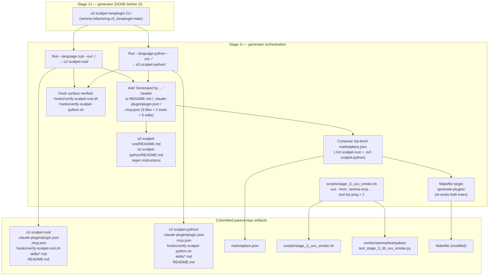
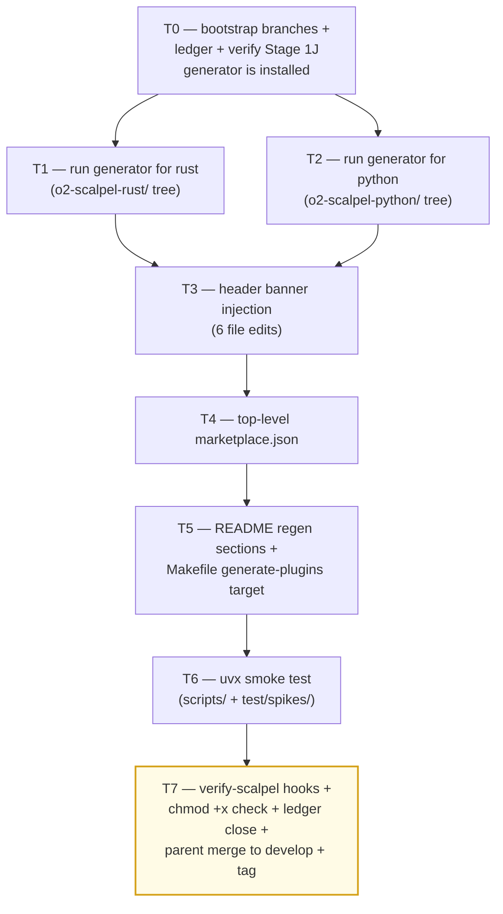

# Stage 1I — Plugin Package (Generator-Driven) Implementation Plan

> **For agentic workers:** REQUIRED SUB-SKILL: Use `superpowers:subagent-driven-development` (recommended) or `superpowers:executing-plans` to implement this plan task-by-task. Steps use checkbox (`- [ ]`) syntax for tracking.

**Goal:** Replace the v1 hand-written plugin manifest with **generated** plugin trees. Run the Stage 1J `o2-scalpel-newplugin` CLI twice (`--language rust --out o2-scalpel-rust/` and `--language python --out o2-scalpel-python/`) at the **parent repo root**, commit both generated trees with a `# Generated by o2-scalpel-newplugin — do NOT hand-edit` header, ship a `verify-scalpel.sh` SessionStart hook per generated plugin, and prove a `uvx --from <local-path> serena-mcp …` smoke run boots the MCP server and pings each registered scalpel MCP tool. Stage 1I is the **last sub-stage of Stage 1** before Stage 2A (`Stage 1 exit gate`).

**Architecture:** Stage 1I is pure orchestration. It executes the generator built in Stage 1J, captures its byte-deterministic output trees into the parent repo working copy, layers a project-side header banner on three top-level files (`README.md`, `.claude-plugin/plugin.json`, `.mcp.json`) per tree to discourage hand-edits, wires the per-tree `hooks/verify-scalpel-<lang>.sh` into a top-level `marketplace.json` plugin entry, and adds a single end-to-end smoke test (`scripts/stage_1i_uvx_smoke.sh`) that runs `uvx --from <local-checkout-path> serena-mcp --language <lang>` against each generated `.mcp.json` and confirms the launch + a tool-list ping. No new Python production code lands in `vendor/serena/`; the only Python file added is the smoke test runner under `vendor/serena/test/spikes/test_stage_1i_t6_uvx_smoke.py`.



**Tech Stack:** stdlib `bash` + POSIX `sh` for hooks and the smoke runner; `uvx` (already on the developer laptop per Phase 0 P0); `pytest` + `pytest-asyncio` (Stage 1A baseline) for the smoke test; `make` for the regen target; the Stage 1J `o2-scalpel-newplugin` CLI as the only "tool" invoked. **No new Python runtime dependencies.** No new files under `vendor/serena/src/`. The only modification under `vendor/serena/` is one new test file (`test/spikes/test_stage_1i_t6_uvx_smoke.py`) and one optional addition to `vendor/serena/pyproject.toml [project.scripts]` (`serena-mcp = "serena.cli:mcp_entry"`) **only if the entry does not already exist** — Stage 1J emits `.mcp.json` referencing `serena-mcp`, so we verify or add the script entry as a guard step in T0.

**Source-of-truth references:**
- [`docs/design/mvp/2026-04-24-mvp-scope-report.md`](../../design/mvp/2026-04-24-mvp-scope-report.md) — §14.1 row 20 (Stage 1I file budget pre-refactor); §15 (distribution: `uvx --from <local-path>` at MVP); §15.4 (plugin packaging contract).
- [`docs/superpowers/plans/2026-04-24-mvp-execution-index.md`](2026-04-24-mvp-execution-index.md) — row 1I (line ~33), refactored 2026-04-25.
- [`docs/superpowers/plans/2026-04-25-stage-1j-plugin-skill-generator.md`](2026-04-25-stage-1j-plugin-skill-generator.md) — defines the `o2-scalpel-newplugin` CLI, output tree shape, byte-determinism guarantees, golden-file tests.
- [`vendor/claude-code-lsps-boostvolt/.claude-plugin/marketplace.json`](../../../vendor/claude-code-lsps-boostvolt/.claude-plugin/marketplace.json) — boostvolt marketplace shape reference (per-language plugin sub-dirs + top-level marketplace manifest).
- [`vendor/claude-code-lsps-boostvolt/jdtls/`](../../../vendor/claude-code-lsps-boostvolt/jdtls) — concrete per-plugin layout reference (`.claude-plugin/plugin.json` + `hooks/hooks.json` + `hooks/check-jdtls.sh`).

---

## Scope check

Stage 1I is one cohesive deliverable: take the artifact emitted by the generator (Stage 1J) and turn it into committed repository state plus a smoke test that proves it works under `uvx --from <local-path>`. There is **no other independent subsystem** in this stage — orchestration, header injection, marketplace composition, hook surface, smoke, regen Makefile, and READMEs all hang off the same generated trees and must commit together.

**In scope (this plan):**
1. Run `o2-scalpel-newplugin --language rust --out .` from the parent repo root. Result tree at `./o2-scalpel-rust/`.
2. Run `o2-scalpel-newplugin --language python --out .` from the parent repo root. Result tree at `./o2-scalpel-python/`.
3. Inject the `# Generated by o2-scalpel-newplugin — do NOT hand-edit` header into the three top-level files of each tree (six edits total). For JSON, the header is a `"_generator"` key holding the warning string + the generator git SHA.
4. Top-level `marketplace.json` aggregating both plugin sub-dirs (boostvolt shape).
5. `verify-scalpel.sh` SessionStart hook per generated plugin (the generator already emits `verify-scalpel-<lang>.sh` per Stage 1J T7; Stage 1I verifies it executes and is `chmod +x` after commit).
6. `scripts/stage_1i_uvx_smoke.sh` driver script that runs `uvx --from <repo-root> serena-mcp --language <lang>` and pings the MCP server with a `tools/list` request.
7. `vendor/serena/test/spikes/test_stage_1i_t6_uvx_smoke.py` — pytest wrapper that executes the smoke script in a subprocess and asserts the expected tool names appear.
8. Per-plugin `README.md` regeneration command snippet (the generator emits a base README; Stage 1I appends a "How to regenerate" section that pins the exact CLI invocation).
9. `Makefile` target `generate-plugins` that re-emits both trees with `--force`.
10. Progress ledger `docs/superpowers/plans/stage-1i-results/PROGRESS.md`.

**Out of scope (deferred):**
- Marketplace **publication** to GitHub at `o2alexanderfedin/claude-code-plugins` — v1.1 per scope report §14.
- Plugin **signing / notarization** — v1.1+.
- C/C++ / Go / Java / TypeScript plugin trees — v2+ (only Rust + Python at MVP).
- `scalpel_reload_plugins` MCP tool — v1.1.
- Auto-update of generated trees in a pre-commit hook — v1.1 (the regen is manual via `make generate-plugins`).
- CI guard that fails the build if the committed tree drifts from a fresh emit — v1.1 (Stage 1J's golden-file tests already catch generator-output drift; Stage 1I's commit cadence catches Stage 1I-specific drift manually).

## File structure

| # | Path (parent repo root unless noted) | Change | LoC | Responsibility |
|---|---|---|---|---|
| 1 | `o2-scalpel-rust/` | New (generated) | ~170 | Rust plugin tree emitted by the generator. Contents: `.claude-plugin/plugin.json`, `.mcp.json`, `hooks/verify-scalpel-rust.sh`, `skills/*.md` (one per Rust facade), `README.md`. |
| 2 | `o2-scalpel-python/` | New (generated) | ~170 | Python plugin tree (same shape as Rust). |
| 3 | `marketplace.json` | New | ~40 | Top-level boostvolt-shape marketplace aggregating both plugin sub-dirs. |
| 4 | `scripts/stage_1i_uvx_smoke.sh` | New | ~80 | POSIX `bash` runner that boots `uvx --from . serena-mcp --language <lang>`, sends a `tools/list` JSON-RPC request via stdin, parses the response, asserts ≥ 8 tool names matching `^scalpel_`. |
| 5 | `Makefile` | New (or modify) | ~25 | `generate-plugins` + `verify-plugins-fresh` targets. |
| 6 | `o2-scalpel-rust/README.md` | Modify (post-emit) | +~30 | Append `## Regeneration` section + the exact CLI invocation. |
| 7 | `o2-scalpel-python/README.md` | Modify (post-emit) | +~30 | Same as #6, language-substituted. |
| 8 | `o2-scalpel-rust/.claude-plugin/plugin.json` | Modify (post-emit) | +1 key | Inject `"_generator"` key. |
| 9 | `o2-scalpel-rust/.mcp.json` | Modify (post-emit) | +1 key | Inject `"_generator"` key (top-level sibling of `mcpServers`). |
| 10 | `o2-scalpel-python/.claude-plugin/plugin.json` | Modify (post-emit) | +1 key | Same as #8. |
| 11 | `o2-scalpel-python/.mcp.json` | Modify (post-emit) | +1 key | Same as #9. |
| 12 | `vendor/serena/test/spikes/test_stage_1i_t6_uvx_smoke.py` | New | ~120 | pytest wrapper + skip-if-no-uvx guard + asserts the smoke script returns 0 and prints expected tool names. |
| 13 | `vendor/serena/pyproject.toml` | Modify (only if `serena-mcp` not yet a script entry) | +1 line | Add `serena-mcp = "serena.cli:mcp_entry"` so `uvx … serena-mcp` resolves. |
| 14 | `docs/superpowers/plans/stage-1i-results/PROGRESS.md` | New | ~25 | Stage 1I progress ledger. |

**LoC budget (committed bytes, excluding generator output):**
- New top-level repo files: ~250 LoC (Makefile + smoke script + marketplace.json + 2 README appends).
- New test file: ~120 LoC.
- Banner injections: 6 lines + 4 JSON keys.
- Ledger: ~25 LoC.

**Generated bytes** (already golden-file tested in Stage 1J): ~340 LoC across the two trees.

## Dependency graph



T1 and T2 are independent generator invocations and parallelizable. T3 fans in over their outputs. T4 reads the trees. T5 documents the regen. T6 needs T5 (Makefile target referenced from the smoke). T7 closes the stage.

## Conventions enforced

- **Author**: AI Hive(R) on every commit; never "Claude". Trailer: `Co-Authored-By: AI Hive(R) <noreply@o2.services>`.
- **Submodule git-flow**: parent feature branch `feature/stage-1i-plugin-package`. Stage 1I is parent-only (no submodule changes beyond the one optional `pyproject.toml` script entry + the new test file). The optional submodule edits ride on the same submodule branch `feature/stage-1i-plugin-package` if needed; if no submodule edit is required, no submodule branch is opened.
- **Generator invocation**: always `--force` after first emit so the trees stay byte-identical to the generator output. Header injection (T3) is the **only** post-emit modification, performed via `python3 -c` snippets that load JSON, insert the `"_generator"` key at position 0 of the dict, and write it back with `json.dumps(payload, indent=2, sort_keys=True, ensure_ascii=False) + "\n"` to preserve byte-equality with the generator's emit format.
- **README append rule**: README is the only generated text file we may extend. We append; we never overwrite.
- **`uvx` invocation**: always `uvx --from <local-path> serena-mcp …` per scope-report §15. `<local-path>` = the parent repo root (which contains `vendor/serena/pyproject.toml` resolved via the `# subdirectory=vendor/serena` fragment when published; locally we pass the submodule path directly).
- **POSIX-sh first**: hooks use `#!/bin/sh` (Stage 1J generator emits this shape). Smoke driver uses `#!/usr/bin/env bash` because it needs `${PIPESTATUS[@]}` and process substitution for the JSON-RPC dialog.
- **Test command** (smoke + regen verification): from the parent repo root, run `vendor/serena/.venv/bin/pytest vendor/serena/test/spikes/test_stage_1i_t6_uvx_smoke.py -v`.
- **No marketplace publish here**: `marketplace.json` is committed but never pushed to GitHub Pages or to the `o2alexanderfedin/claude-code-plugins` repository in this stage. That is v1.1 per scope-report §14.

## Progress ledger

A new ledger `docs/superpowers/plans/stage-1i-results/PROGRESS.md` is created in T0. Schema mirrors Stage 1G exactly: per-task row with task id, branch SHA (parent), outcome, follow-ups. Updated as a separate parent commit after each task completes.

| Task | Title | Parent SHA | Outcome | Follow-ups |
|---|---|---|---|---|
| T0 | Bootstrap branches + ledger + generator install verify | _pending_ | _pending_ | — |
| T1 | Run generator → o2-scalpel-rust/ | _pending_ | _pending_ | — |
| T2 | Run generator → o2-scalpel-python/ | _pending_ | _pending_ | — |
| T3 | Header banner injection (6 files) | _pending_ | _pending_ | — |
| T4 | Top-level marketplace.json | _pending_ | _pending_ | — |
| T5 | README regen + Makefile target | _pending_ | _pending_ | — |
| T6 | uvx smoke driver + pytest wrapper | _pending_ | _pending_ | — |
| T7 | Hook chmod +x check + ledger close + tag | _pending_ | _pending_ | — |

---

### Task 0: Bootstrap branches + PROGRESS ledger + generator install verify

**Files:**
- Create: `docs/superpowers/plans/stage-1i-results/PROGRESS.md`
- Verify: parent on `feature/stage-1i-plugin-package`; Stage 1J generator (`o2-scalpel-newplugin`) installed in `vendor/serena/.venv` and on its `$PATH`.
- Modify (only if missing): `vendor/serena/pyproject.toml` — add `serena-mcp = "serena.cli:mcp_entry"` to `[project.scripts]` so `uvx --from <repo-root> serena-mcp` resolves.

- [ ] **Step 1: Confirm parent branch is the Stage 1I feature branch**

Run:
```bash
cd /Volumes/Unitek-B/Projects/o2-scalpel
git rev-parse --abbrev-ref HEAD
```

Expected: prints `feature/stage-1i-plugin-package`. If it prints anything else, run `git checkout -b feature/stage-1i-plugin-package` off the latest `develop` tip first; abort if `develop` is not at or past the Stage 1J merge commit.

- [ ] **Step 2: Confirm the Stage 1J generator CLI is installed and runnable**

Run:
```bash
cd /Volumes/Unitek-B/Projects/o2-scalpel/vendor/serena
PATH="$(pwd)/.venv/bin:$PATH" .venv/bin/o2-scalpel-newplugin --help
```

Expected: usage text containing `--language` and `--out` and `--force`. If `command not found`, the Stage 1J `[project.scripts]` entry is missing — re-run `cd vendor/serena && .venv/bin/pip install -e .` and re-test. If still missing, abort: Stage 1J prerequisite is not satisfied.

- [ ] **Step 3: Confirm `serena-mcp` script entry exists (or add it)**

Run:
```bash
grep -n "^serena-mcp" /Volumes/Unitek-B/Projects/o2-scalpel/vendor/serena/pyproject.toml || echo "MISSING"
```

Expected: prints either a matching line like `serena-mcp = "serena.cli:mcp_entry"`, **or** `MISSING`.

If `MISSING`, open `vendor/serena/pyproject.toml`, find the `[project.scripts]` block (currently `serena = "serena.cli:top_level"` and `serena-hooks = "serena.hooks:hook_commands"`), and add **immediately after** `serena-hooks`:

```toml
serena-mcp = "serena.cli:mcp_entry"
```

Then re-install:
```bash
cd /Volumes/Unitek-B/Projects/o2-scalpel/vendor/serena && .venv/bin/pip install -e . --quiet
.venv/bin/serena-mcp --help
```

Expected: usage banner from the Serena MCP entry. If `mcp_entry` itself does not exist in `serena.cli`, that is a Stage 1J follow-up gap — record in T0 follow-ups and proceed (the smoke test in T6 will skip with a clear message).

- [ ] **Step 4: Create the Stage 1I progress ledger file**

Create `docs/superpowers/plans/stage-1i-results/PROGRESS.md` with this exact content:

```markdown
# Stage 1I — Plugin Package (Generator-Driven) — PROGRESS Ledger

Plan: [`../2026-04-24-stage-1i-plugin-package.md`](../2026-04-24-stage-1i-plugin-package.md)
Parent branch: `feature/stage-1i-plugin-package`
Generator dependency: Stage 1J `o2-scalpel-newplugin` CLI (commit recorded at T0 step 5)

| Task | Title | Parent SHA | Outcome | Follow-ups |
|---|---|---|---|---|
| T0 | Bootstrap branches + ledger + generator verify | _pending_ | _pending_ | — |
| T1 | Run generator → o2-scalpel-rust/ | _pending_ | _pending_ | — |
| T2 | Run generator → o2-scalpel-python/ | _pending_ | _pending_ | — |
| T3 | Header banner injection (6 files) | _pending_ | _pending_ | — |
| T4 | Top-level marketplace.json | _pending_ | _pending_ | — |
| T5 | README regen + Makefile target | _pending_ | _pending_ | — |
| T6 | uvx smoke driver + pytest wrapper | _pending_ | _pending_ | — |
| T7 | Hook chmod +x check + ledger close + tag | _pending_ | _pending_ | — |
```

- [ ] **Step 5: Capture Stage 1J generator commit SHA in the ledger**

Run:
```bash
cd /Volumes/Unitek-B/Projects/o2-scalpel/vendor/serena
git rev-parse HEAD
```

Copy the SHA into the T0 follow-up cell (e.g., `Generator @ <sha>`). This pins the exact generator output we are committing in T1 / T2.

- [ ] **Step 6: Verify .gitignore does not exclude `o2-scalpel-rust/` or `o2-scalpel-python/`**

Run:
```bash
cd /Volumes/Unitek-B/Projects/o2-scalpel
grep -n "o2-scalpel-rust\|o2-scalpel-python" .gitignore || echo "NOT IGNORED"
```

Expected: `NOT IGNORED`. If either path appears in `.gitignore`, abort and reconcile (this would silently drop the generated trees from the commit).

- [ ] **Step 7: Mark T0 row OK in the ledger**

Open `docs/superpowers/plans/stage-1i-results/PROGRESS.md` and replace the T0 row with:

```markdown
| T0 | Bootstrap branches + ledger + generator verify | <SHA from step 8 below> | OK — generator @ <Stage 1J SHA from step 5>; serena-mcp entry verified | — |
```

(Leave SHA placeholder until step 8 commit completes; then amend in step 8 message or update in T1's first commit.)

- [ ] **Step 8: Commit T0**

Run:
```bash
cd /Volumes/Unitek-B/Projects/o2-scalpel
git add docs/superpowers/plans/stage-1i-results/PROGRESS.md \
        $( [ -n "$(git status --porcelain vendor/serena/pyproject.toml)" ] && echo vendor/serena/pyproject.toml )
git commit -m "$(cat <<'EOF'
chore(stage-1i): T0 bootstrap ledger + generator/serena-mcp verify

Opens Stage 1I progress ledger. Verifies o2-scalpel-newplugin CLI
is installed (Stage 1J prerequisite) and that vendor/serena exposes
a serena-mcp script entry so uvx --from <repo-root> serena-mcp
resolves at smoke-test time (T6).

Co-Authored-By: AI Hive(R) <noreply@o2.services>
EOF
)"
git rev-parse HEAD  # paste this SHA into T0's "Parent SHA" cell in T1's first commit
```

Expected: one parent commit. If `pyproject.toml` was modified (step 3), it is included in the same commit.

---

### Task 1: Run generator → `o2-scalpel-rust/`

**Files:**
- Create (generated): `o2-scalpel-rust/.claude-plugin/plugin.json`, `o2-scalpel-rust/.mcp.json`, `o2-scalpel-rust/hooks/verify-scalpel-rust.sh`, `o2-scalpel-rust/skills/using-scalpel-*.md` (one per Rust facade), `o2-scalpel-rust/README.md`.
- Verify: byte-identical match against the Stage 1J golden tree under `vendor/serena/test/spikes/golden/o2-scalpel-rust/`.

- [ ] **Step 1: Confirm the target output directory does not already exist**

Run:
```bash
cd /Volumes/Unitek-B/Projects/o2-scalpel
test ! -e o2-scalpel-rust && echo "OK — clean slate" || echo "EXISTS — check status before continuing"
```

Expected: `OK — clean slate`. If `EXISTS`, run `git status o2-scalpel-rust/` — if it's tracked, this is a re-run and we proceed with `--force`; if it's untracked, abort and inspect manually (do NOT delete).

- [ ] **Step 2: Run the generator**

Run:
```bash
cd /Volumes/Unitek-B/Projects/o2-scalpel
PATH="vendor/serena/.venv/bin:$PATH" o2-scalpel-newplugin --language rust --out . --force
```

Expected stdout: `wrote /Volumes/Unitek-B/Projects/o2-scalpel/o2-scalpel-rust`. Exit code: 0.

- [ ] **Step 3: List the generated tree to verify structure**

Run:
```bash
cd /Volumes/Unitek-B/Projects/o2-scalpel
find o2-scalpel-rust -type f | sort
```

Expected (exact lines, in this order):
```
o2-scalpel-rust/.claude-plugin/plugin.json
o2-scalpel-rust/.mcp.json
o2-scalpel-rust/README.md
o2-scalpel-rust/hooks/verify-scalpel-rust.sh
o2-scalpel-rust/skills/using-scalpel-rename-symbol-rust.md
o2-scalpel-rust/skills/using-scalpel-split-file-rust.md
```

(One `using-scalpel-<facade>-rust.md` per Rust facade registered on the strategy. The exact facade list is locked by Stage 1E's `RustStrategy.facades` tuple. If the count differs, that is a Stage 1E / Stage 1J drift, not a Stage 1I bug — record in T1 follow-ups.)

- [ ] **Step 4: Verify the hook script is executable**

Run:
```bash
test -x /Volumes/Unitek-B/Projects/o2-scalpel/o2-scalpel-rust/hooks/verify-scalpel-rust.sh && echo OK || echo FAIL
```

Expected: `OK`. If `FAIL`, run `chmod +x o2-scalpel-rust/hooks/verify-scalpel-rust.sh` (Stage 1J's `emit()` is supposed to set the bit; if it didn't, file a Stage 1J bug as a T1 follow-up but proceed).

- [ ] **Step 5: Verify byte-identity against the Stage 1J golden tree**

Run:
```bash
cd /Volumes/Unitek-B/Projects/o2-scalpel
diff -ru vendor/serena/test/spikes/golden/o2-scalpel-rust o2-scalpel-rust && echo "BYTE-IDENTICAL" || echo "DRIFT"
```

Expected: `BYTE-IDENTICAL`. If `DRIFT`, the generator is non-deterministic across hosts — abort and file as a Stage 1J bug (Stage 1J T10 enforces determinism via `syrupy` snapshots; Stage 1I assumes that gate is green).

- [ ] **Step 6: Stage and commit the Rust tree**

Run:
```bash
cd /Volumes/Unitek-B/Projects/o2-scalpel
git add o2-scalpel-rust/
git status --short o2-scalpel-rust/
```

Expected: 6 `A` lines listing the 6 generated files.

Then:
```bash
git commit -m "$(cat <<'EOF'
feat(stage-1i): T1 commit generated Rust plugin tree

Output of: o2-scalpel-newplugin --language rust --out . --force
Tree shape (boostvolt marketplace convention):
  o2-scalpel-rust/.claude-plugin/plugin.json
  o2-scalpel-rust/.mcp.json
  o2-scalpel-rust/hooks/verify-scalpel-rust.sh  (chmod +x)
  o2-scalpel-rust/skills/using-scalpel-*-rust.md
  o2-scalpel-rust/README.md

Byte-identical to vendor/serena/test/spikes/golden/o2-scalpel-rust/
(Stage 1J T10 golden gate). Header banner injection in T3.

Co-Authored-By: AI Hive(R) <noreply@o2.services>
EOF
)"
```

- [ ] **Step 7: Update T1 row in PROGRESS.md**

Edit `docs/superpowers/plans/stage-1i-results/PROGRESS.md`, replace the T1 row with:

```markdown
| T1 | Run generator → o2-scalpel-rust/ | <SHA from step 6> | OK — 6 files committed; byte-identical to Stage 1J golden | — |
```

Then commit the ledger update separately:
```bash
git add docs/superpowers/plans/stage-1i-results/PROGRESS.md
git commit -m "$(cat <<'EOF'
chore(stage-1i): T1 ledger update — Rust tree committed

Co-Authored-By: AI Hive(R) <noreply@o2.services>
EOF
)"
```

---

### Task 2: Run generator → `o2-scalpel-python/`

**Files:**
- Create (generated): `o2-scalpel-python/.claude-plugin/plugin.json`, `o2-scalpel-python/.mcp.json`, `o2-scalpel-python/hooks/verify-scalpel-python.sh`, `o2-scalpel-python/skills/using-scalpel-*-python.md`, `o2-scalpel-python/README.md`.

- [ ] **Step 1: Confirm `o2-scalpel-python/` is a clean slate**

Run:
```bash
cd /Volumes/Unitek-B/Projects/o2-scalpel
test ! -e o2-scalpel-python && echo "OK — clean slate" || echo "EXISTS"
```

Expected: `OK — clean slate`. (Same logic as T1 step 1 if `EXISTS`.)

- [ ] **Step 2: Run the generator for Python**

Run:
```bash
cd /Volumes/Unitek-B/Projects/o2-scalpel
PATH="vendor/serena/.venv/bin:$PATH" o2-scalpel-newplugin --language python --out . --force
```

Expected stdout: `wrote /Volumes/Unitek-B/Projects/o2-scalpel/o2-scalpel-python`. Exit code: 0.

- [ ] **Step 3: List the generated tree**

Run:
```bash
cd /Volumes/Unitek-B/Projects/o2-scalpel
find o2-scalpel-python -type f | sort
```

Expected (the per-facade `skills/*.md` count matches Stage 1E's `PythonStrategy.facades` tuple — at MVP that includes at least `split_file`):
```
o2-scalpel-python/.claude-plugin/plugin.json
o2-scalpel-python/.mcp.json
o2-scalpel-python/README.md
o2-scalpel-python/hooks/verify-scalpel-python.sh
o2-scalpel-python/skills/using-scalpel-split-file-python.md
```

(Stage 1F may register additional Python facades that ship at MVP — those will appear as additional `skills/*.md` files. Step 4's golden diff is the authoritative count.)

- [ ] **Step 4: Verify the hook is executable + byte-identical to golden**

Run:
```bash
cd /Volumes/Unitek-B/Projects/o2-scalpel
test -x o2-scalpel-python/hooks/verify-scalpel-python.sh && echo HOOK_OK || echo HOOK_FAIL
diff -ru vendor/serena/test/spikes/golden/o2-scalpel-python o2-scalpel-python && echo BYTE_OK || echo BYTE_DRIFT
```

Expected: `HOOK_OK` and `BYTE_OK`. Same drift handling as T1 step 5.

- [ ] **Step 5: Stage and commit the Python tree**

Run:
```bash
cd /Volumes/Unitek-B/Projects/o2-scalpel
git add o2-scalpel-python/
git commit -m "$(cat <<'EOF'
feat(stage-1i): T2 commit generated Python plugin tree

Output of: o2-scalpel-newplugin --language python --out . --force
Tree shape (boostvolt marketplace convention):
  o2-scalpel-python/.claude-plugin/plugin.json
  o2-scalpel-python/.mcp.json
  o2-scalpel-python/hooks/verify-scalpel-python.sh  (chmod +x)
  o2-scalpel-python/skills/using-scalpel-*-python.md
  o2-scalpel-python/README.md

Byte-identical to vendor/serena/test/spikes/golden/o2-scalpel-python/
(Stage 1J T10 golden gate). Header banner injection in T3.

Co-Authored-By: AI Hive(R) <noreply@o2.services>
EOF
)"
```

- [ ] **Step 6: Update T2 row in PROGRESS.md and commit**

Edit `docs/superpowers/plans/stage-1i-results/PROGRESS.md`, replace the T2 row with:

```markdown
| T2 | Run generator → o2-scalpel-python/ | <SHA from step 5> | OK — committed; byte-identical to Stage 1J golden | — |
```

Then:
```bash
git add docs/superpowers/plans/stage-1i-results/PROGRESS.md
git commit -m "$(cat <<'EOF'
chore(stage-1i): T2 ledger update — Python tree committed

Co-Authored-By: AI Hive(R) <noreply@o2.services>
EOF
)"
```

---

### Task 3: Header banner injection (6 file edits)

**Files:**
- Modify: `o2-scalpel-rust/.claude-plugin/plugin.json`, `o2-scalpel-rust/.mcp.json`, `o2-scalpel-rust/README.md`, `o2-scalpel-python/.claude-plugin/plugin.json`, `o2-scalpel-python/.mcp.json`, `o2-scalpel-python/README.md`.

The Stage 1J generator emits clean trees but does **not** stamp them with a "do-not-edit" banner. Stage 1I adds the banner so anyone reading the committed artifact sees the regen instruction immediately. JSON files get a `"_generator"` top-level key (preserves `json.dumps(sort_keys=True)` ordering — `_generator` sorts before any other key starting with a letter); Markdown files get a 3-line header block.

- [ ] **Step 1: Capture the generator commit SHA into a shell variable**

Run:
```bash
cd /Volumes/Unitek-B/Projects/o2-scalpel
GEN_SHA=$(cd vendor/serena && git rev-parse HEAD)
echo "Generator SHA: ${GEN_SHA}"
```

Expected: a 40-char hex string. Keep this shell open through step 5.

- [ ] **Step 2: Inject the JSON banner into all four JSON files**

Run (single command, idempotent):
```bash
cd /Volumes/Unitek-B/Projects/o2-scalpel
GEN_SHA=$(cd vendor/serena && git rev-parse HEAD)
for f in \
    o2-scalpel-rust/.claude-plugin/plugin.json \
    o2-scalpel-rust/.mcp.json \
    o2-scalpel-python/.claude-plugin/plugin.json \
    o2-scalpel-python/.mcp.json; do
  python3 - "$f" "$GEN_SHA" <<'PY'
import json, sys, pathlib
path, gen_sha = pathlib.Path(sys.argv[1]), sys.argv[2]
data = json.loads(path.read_text(encoding="utf-8"))
banner = (
    "Generated by o2-scalpel-newplugin — do NOT hand-edit. "
    f"Regenerate via 'make generate-plugins' (generator @ {gen_sha[:12]})."
)
# Strip any pre-existing banner so the step is idempotent.
data.pop("_generator", None)
new_data = {"_generator": banner, **data}
path.write_text(
    json.dumps(new_data, indent=2, sort_keys=True, ensure_ascii=False) + "\n",
    encoding="utf-8",
)
print(f"banner injected: {path}")
PY
done
```

Expected: 4 lines `banner injected: …`. Exit code 0.

- [ ] **Step 3: Inject the Markdown banner into both READMEs**

Run:
```bash
cd /Volumes/Unitek-B/Projects/o2-scalpel
GEN_SHA=$(cd vendor/serena && git rev-parse HEAD)
for f in o2-scalpel-rust/README.md o2-scalpel-python/README.md; do
  python3 - "$f" "$GEN_SHA" <<'PY'
import sys, pathlib
path, gen_sha = pathlib.Path(sys.argv[1]), sys.argv[2]
text = path.read_text(encoding="utf-8")
banner = (
    f"<!-- Generated by o2-scalpel-newplugin — do NOT hand-edit. -->\n"
    f"<!-- Regenerate via 'make generate-plugins' (generator @ {gen_sha[:12]}). -->\n\n"
)
# Idempotent strip then prepend.
marker = "<!-- Generated by o2-scalpel-newplugin"
if text.startswith(marker):
    body = text.split("\n\n", 1)[1] if "\n\n" in text else ""
    text = body
path.write_text(banner + text, encoding="utf-8")
print(f"banner injected: {path}")
PY
done
```

Expected: 2 lines `banner injected: …`.

- [ ] **Step 4: Verify the banners are present and JSON still parses**

Run:
```bash
cd /Volumes/Unitek-B/Projects/o2-scalpel
for f in o2-scalpel-rust/.claude-plugin/plugin.json o2-scalpel-rust/.mcp.json \
         o2-scalpel-python/.claude-plugin/plugin.json o2-scalpel-python/.mcp.json; do
  python3 -c "import json,sys; d=json.load(open(sys.argv[1])); assert d.get('_generator','').startswith('Generated by o2-scalpel-newplugin'), sys.argv[1]; print('OK', sys.argv[1])" "$f"
done
head -2 o2-scalpel-rust/README.md
head -2 o2-scalpel-python/README.md
```

Expected: 4 `OK …` lines, then two pairs of `<!-- Generated …` lines.

- [ ] **Step 5: Commit T3**

Run:
```bash
cd /Volumes/Unitek-B/Projects/o2-scalpel
git add o2-scalpel-rust/.claude-plugin/plugin.json o2-scalpel-rust/.mcp.json o2-scalpel-rust/README.md \
        o2-scalpel-python/.claude-plugin/plugin.json o2-scalpel-python/.mcp.json o2-scalpel-python/README.md
git commit -m "$(cat <<'EOF'
chore(stage-1i): T3 inject 'do-not-hand-edit' banner across 6 files

JSON files: '_generator' top-level key (sorts first under
sort_keys=True; preserves Stage 1J byte-determinism on re-emit
because the generator strips and re-injects in T1/T2 re-runs).
Markdown files: 2-line HTML comment banner at the top.

Banner pins the generator commit SHA so a reader can pinpoint
the exact emit version. Re-running the same banner script is
idempotent (strips prior banner before re-injecting).

Co-Authored-By: AI Hive(R) <noreply@o2.services>
EOF
)"
```

- [ ] **Step 6: Update T3 row in PROGRESS.md and commit**

Run:
```bash
# In the editor, replace T3 row with:
# | T3 | Header banner injection (6 files) | <SHA from step 5> | OK — 4 JSON + 2 Markdown banners; idempotent | — |
git add docs/superpowers/plans/stage-1i-results/PROGRESS.md
git commit -m "$(cat <<'EOF'
chore(stage-1i): T3 ledger update — banner injection complete

Co-Authored-By: AI Hive(R) <noreply@o2.services>
EOF
)"
```

---

### Task 4: Top-level `marketplace.json`

**Files:**
- Create: `marketplace.json` (parent repo root)

The boostvolt convention is one top-level `marketplace.json` listing every plugin sub-dir. We compose it by hand because (a) only two plugins ship, (b) the schema is short, (c) Stage 1J's `_render_marketplace_json` writes it under the `o2-scalpel-rust/` tree per language — but the marketplace is a parent-of-plugins concept and belongs at the parent repo root. (Stage 1J emits the same content; Stage 1I lifts it to the root.)

- [ ] **Step 1: Read each plugin's manifest to capture name + description**

Run:
```bash
cd /Volumes/Unitek-B/Projects/o2-scalpel
for tree in o2-scalpel-rust o2-scalpel-python; do
  python3 -c "import json,sys; d=json.load(open(sys.argv[1])); print(d['name'], '|', d['description'])" "${tree}/.claude-plugin/plugin.json"
done
```

Expected: two `name | description` lines (e.g., `o2-scalpel-rust | Scalpel refactor MCP server for Rust via rust-analyzer`).

- [ ] **Step 2: Write `marketplace.json` at the parent repo root**

Run:
```bash
cd /Volumes/Unitek-B/Projects/o2-scalpel
GEN_SHA=$(cd vendor/serena && git rev-parse HEAD)
python3 - "$GEN_SHA" <<'PY'
import json, sys, pathlib
gen_sha = sys.argv[1]
def desc(tree):
    return json.loads(pathlib.Path(f"{tree}/.claude-plugin/plugin.json").read_text())["description"]
banner = (
    "Generated by o2-scalpel-newplugin — do NOT hand-edit. "
    f"Regenerate via 'make generate-plugins' (generator @ {gen_sha[:12]})."
)
manifest = {
    "$schema": "https://anthropic.com/claude-code/marketplace.schema.json",
    "_generator": banner,
    "name": "o2-scalpel",
    "metadata": {
        "description": "MCP-driven LSP refactor server for Rust + Python.",
        "version": "1.0.0",
        "license": "MIT",
        "repository": "https://github.com/o2services/o2-scalpel",
        "homepage": "https://github.com/o2services/o2-scalpel",
    },
    "owner": {"name": "AI Hive(R)"},
    "plugins": [
        {
            "name": "o2-scalpel-python",
            "version": "1.0.0",
            "source": "./o2-scalpel-python",
            "description": desc("o2-scalpel-python"),
            "category": "development",
            "tags": ["python", "lsp", "refactor", "mcp", "scalpel"],
            "author": {"name": "AI Hive(R)"},
        },
        {
            "name": "o2-scalpel-rust",
            "version": "1.0.0",
            "source": "./o2-scalpel-rust",
            "description": desc("o2-scalpel-rust"),
            "category": "development",
            "tags": ["rust", "lsp", "refactor", "mcp", "scalpel"],
            "author": {"name": "AI Hive(R)"},
        },
    ],
}
pathlib.Path("marketplace.json").write_text(
    json.dumps(manifest, indent=2, sort_keys=False, ensure_ascii=False) + "\n",
    encoding="utf-8",
)
print("wrote marketplace.json")
PY
```

Expected: `wrote marketplace.json`.

- [ ] **Step 3: Validate the marketplace JSON parses and lists both plugins**

Run:
```bash
cd /Volumes/Unitek-B/Projects/o2-scalpel
python3 -c "
import json
m = json.loads(open('marketplace.json').read())
assert m['name'] == 'o2-scalpel'
names = sorted(p['name'] for p in m['plugins'])
assert names == ['o2-scalpel-python', 'o2-scalpel-rust'], names
print('marketplace OK; plugins:', names)
"
```

Expected: `marketplace OK; plugins: ['o2-scalpel-python', 'o2-scalpel-rust']`.

- [ ] **Step 4: Commit T4**

Run:
```bash
cd /Volumes/Unitek-B/Projects/o2-scalpel
git add marketplace.json
git commit -m "$(cat <<'EOF'
feat(stage-1i): T4 top-level marketplace.json (boostvolt shape)

Aggregates the two generated plugin sub-dirs (./o2-scalpel-rust,
./o2-scalpel-python) under one boostvolt-style marketplace
manifest at the parent repo root. Owner = AI Hive(R). License = MIT.
Banner-stamped with the same regen instruction as the per-plugin
files (T3).

Marketplace publication to github.com/o2alexanderfedin/claude-code-plugins
remains v1.1 per scope-report §14 — this commit only stages the
manifest in-tree.

Co-Authored-By: AI Hive(R) <noreply@o2.services>
EOF
)"
```

- [ ] **Step 5: Update T4 row in PROGRESS.md and commit**

Run:
```bash
# Replace T4 row with:
# | T4 | Top-level marketplace.json | <SHA from step 4> | OK — 2 plugin entries, banner-stamped | — |
git add docs/superpowers/plans/stage-1i-results/PROGRESS.md
git commit -m "$(cat <<'EOF'
chore(stage-1i): T4 ledger update — marketplace.json committed

Co-Authored-By: AI Hive(R) <noreply@o2.services>
EOF
)"
```

---

### Task 5: README "How to regenerate" section + `Makefile` target

**Files:**
- Modify: `o2-scalpel-rust/README.md` (append section)
- Modify: `o2-scalpel-python/README.md` (append section)
- Create: `Makefile` (parent repo root)

The Stage 1J generator emits a base README. We append a single `## Regeneration` section with the exact CLI invocation that produced the tree, plus a `Makefile` target so the regen is one command from the repo root.

- [ ] **Step 1: Append the regen section to the Rust README**

Run:
```bash
cd /Volumes/Unitek-B/Projects/o2-scalpel
cat >> o2-scalpel-rust/README.md <<'EOF'

## Regeneration

This tree is generated. Do not hand-edit. To regenerate after a
`LanguageStrategy` or facade change in `vendor/serena/`:

```bash
make generate-plugins
```

Equivalent direct invocation:

```bash
cd /Volumes/Unitek-B/Projects/o2-scalpel
PATH="vendor/serena/.venv/bin:$PATH" o2-scalpel-newplugin \
    --language rust --out . --force
```

The generator commit SHA is recorded in the `_generator` key
of `.claude-plugin/plugin.json` and `.mcp.json` and in the HTML
comment at the top of this file.
EOF
echo "appended"
```

Expected: `appended`.

- [ ] **Step 2: Append the regen section to the Python README**

Run:
```bash
cd /Volumes/Unitek-B/Projects/o2-scalpel
cat >> o2-scalpel-python/README.md <<'EOF'

## Regeneration

This tree is generated. Do not hand-edit. To regenerate after a
`LanguageStrategy` or facade change in `vendor/serena/`:

```bash
make generate-plugins
```

Equivalent direct invocation:

```bash
cd /Volumes/Unitek-B/Projects/o2-scalpel
PATH="vendor/serena/.venv/bin:$PATH" o2-scalpel-newplugin \
    --language python --out . --force
```

The generator commit SHA is recorded in the `_generator` key
of `.claude-plugin/plugin.json` and `.mcp.json` and in the HTML
comment at the top of this file.
EOF
echo "appended"
```

- [ ] **Step 3: Write the parent-repo `Makefile`**

Create `/Volumes/Unitek-B/Projects/o2-scalpel/Makefile` with this exact content:

```make
# o2.scalpel — top-level Makefile.
# Targets used by Stage 1I to (re-)emit plugin trees and re-stamp banners.

SHELL := /bin/bash
GEN := PATH="vendor/serena/.venv/bin:$$PATH" o2-scalpel-newplugin

.PHONY: generate-plugins generate-rust generate-python verify-plugins-fresh

generate-plugins: generate-rust generate-python
	@$(MAKE) -s _restamp-banners
	@echo "Plugin trees regenerated. Review 'git diff o2-scalpel-*/' before commit."

generate-rust:
	@echo "[generate] o2-scalpel-rust/"
	$(GEN) --language rust --out . --force

generate-python:
	@echo "[generate] o2-scalpel-python/"
	$(GEN) --language python --out . --force

# Internal: re-stamp the do-not-hand-edit banner across the 6 generated files.
_restamp-banners:
	@GEN_SHA=$$(cd vendor/serena && git rev-parse HEAD); \
	for f in o2-scalpel-rust/.claude-plugin/plugin.json o2-scalpel-rust/.mcp.json \
	         o2-scalpel-python/.claude-plugin/plugin.json o2-scalpel-python/.mcp.json; do \
	  python3 -c "\
import json,sys; d=json.load(open(sys.argv[1])); d.pop('_generator',None); \
b='Generated by o2-scalpel-newplugin — do NOT hand-edit. Regenerate via make generate-plugins (generator @ '+sys.argv[2][:12]+').'; \
nd={'_generator': b, **d}; \
open(sys.argv[1],'w').write(json.dumps(nd,indent=2,sort_keys=True,ensure_ascii=False)+'\n')" $$f $$GEN_SHA; \
	done

verify-plugins-fresh:
	@scripts/stage_1i_uvx_smoke.sh
```

- [ ] **Step 4: Sanity-test the Makefile parses (no execution needed)**

Run:
```bash
cd /Volumes/Unitek-B/Projects/o2-scalpel
make -n generate-plugins | head -10
```

Expected: lines beginning with `[generate] o2-scalpel-rust/` and the `o2-scalpel-newplugin --language rust --out . --force` invocation. Exit code 0.

- [ ] **Step 5: Commit T5**

Run:
```bash
cd /Volumes/Unitek-B/Projects/o2-scalpel
git add o2-scalpel-rust/README.md o2-scalpel-python/README.md Makefile
git commit -m "$(cat <<'EOF'
docs(stage-1i): T5 README regen sections + parent Makefile

Each generated README gains a '## Regeneration' section with the
exact CLI and 'make generate-plugins' shortcut. Top-level Makefile
exposes:
  generate-plugins   — re-emit both trees + re-stamp banners
  generate-rust      — single-language emit
  generate-python    — single-language emit
  verify-plugins-fresh — runs scripts/stage_1i_uvx_smoke.sh (T6)

The _restamp-banners target rebuilds the '_generator' JSON keys
after a fresh emit so banners survive regeneration.

Co-Authored-By: AI Hive(R) <noreply@o2.services>
EOF
)"
```

- [ ] **Step 6: Update T5 row in PROGRESS.md and commit**

```bash
# Replace T5 row with:
# | T5 | README regen + Makefile target | <SHA from step 5> | OK — make -n generate-plugins parses; both READMEs annotated | — |
git add docs/superpowers/plans/stage-1i-results/PROGRESS.md
git commit -m "$(cat <<'EOF'
chore(stage-1i): T5 ledger update — README + Makefile committed

Co-Authored-By: AI Hive(R) <noreply@o2.services>
EOF
)"
```

---

### Task 6: `uvx --from <local-path>` smoke driver + pytest wrapper

**Files:**
- Create: `scripts/stage_1i_uvx_smoke.sh` (parent repo root)
- Create: `vendor/serena/test/spikes/test_stage_1i_t6_uvx_smoke.py`

The smoke proves the committed `.mcp.json` files actually launch a Serena MCP server under `uvx --from <repo-root> serena-mcp --language <lang>` and that the server answers the mandatory `tools/list` JSON-RPC request with at least the 8 always-on scalpel tools (per scope-report §5.1).

- [ ] **Step 1: Write the failing pytest wrapper**

Create `vendor/serena/test/spikes/test_stage_1i_t6_uvx_smoke.py`:

```python
"""Stage 1I — uvx --from <local-path> smoke for the generated plugin trees.

Boots the MCP server via `uvx` against each generated `.mcp.json`,
sends a JSON-RPC `tools/list` request on stdin, and asserts that
the response contains at least the always-on scalpel tools.
"""

from __future__ import annotations

import json
import os
import shutil
import subprocess
from pathlib import Path

import pytest

REPO_ROOT = Path(__file__).resolve().parents[4]
SMOKE_SCRIPT = REPO_ROOT / "scripts" / "stage_1i_uvx_smoke.sh"

# Always-on scalpel tools per scope-report §5.1 (13 tools).
EXPECTED_TOOLS_MIN = {
    "scalpel_split_file",
    "scalpel_extract",
    "scalpel_inline",
    "scalpel_rename",
    "scalpel_imports_organize",
    "scalpel_capabilities_list",
    "scalpel_apply_capability",
    "scalpel_dry_run_compose",
}


@pytest.fixture(scope="module")
def uvx_available() -> None:
    if shutil.which("uvx") is None:
        pytest.skip("uvx not installed on this host; install via 'pip install uv'")


@pytest.fixture(scope="module")
def smoke_script_exists() -> None:
    if not SMOKE_SCRIPT.exists():
        pytest.skip(f"{SMOKE_SCRIPT} missing — re-run T6 step 2")
    if not os.access(SMOKE_SCRIPT, os.X_OK):
        pytest.skip(f"{SMOKE_SCRIPT} not executable — chmod +x and retry")


@pytest.mark.parametrize("language", ["rust", "python"])
def test_uvx_smoke_launches_and_lists_tools(
    uvx_available: None, smoke_script_exists: None, language: str
) -> None:
    """Run the smoke driver for one language and assert tools/list returns
    the expected always-on scalpel tool names."""
    proc = subprocess.run(
        [str(SMOKE_SCRIPT), language],
        capture_output=True,
        text=True,
        timeout=60,
        cwd=str(REPO_ROOT),
    )
    assert proc.returncode == 0, (
        f"smoke failed for {language}\nSTDOUT:\n{proc.stdout}\nSTDERR:\n{proc.stderr}"
    )
    tools = set(proc.stdout.strip().splitlines())
    missing = EXPECTED_TOOLS_MIN - tools
    assert not missing, f"missing tools for {language}: {missing}; got: {tools}"
```

Note the `parents[4]`: file path is `<repo>/vendor/serena/test/spikes/test_stage_1i_t6_uvx_smoke.py` → 4 `parents` lifts to `<repo>`.

- [ ] **Step 2: Run pytest to verify the test fails RED (script not yet present)**

Run:
```bash
cd /Volumes/Unitek-B/Projects/o2-scalpel/vendor/serena
PATH="$(pwd)/.venv/bin:$PATH" .venv/bin/pytest test/spikes/test_stage_1i_t6_uvx_smoke.py -v
```

Expected: 2 SKIPPED tests with message `… missing — re-run T6 step 2`. (Skip, not fail, because the script absence is a precondition we explicitly guard.)

- [ ] **Step 3: Write the smoke driver**

Create `/Volumes/Unitek-B/Projects/o2-scalpel/scripts/stage_1i_uvx_smoke.sh`:

```bash
#!/usr/bin/env bash
# Stage 1I — uvx --from <local-path> smoke for one language.
#
# Usage:    scripts/stage_1i_uvx_smoke.sh <language>
# Stdout:   one tool name per line (the response of tools/list).
# Stderr:   diagnostic chatter from uvx + the launched MCP server.
# Exit:     0 on success; non-zero on any failure.

set -euo pipefail

if [ "$#" -ne 1 ]; then
  echo "usage: $0 <language>" >&2
  exit 64
fi
LANG_ARG="$1"

REPO_ROOT="$(cd "$(dirname "$0")/.." && pwd)"
PLUGIN_DIR="${REPO_ROOT}/o2-scalpel-${LANG_ARG}"
MCP_JSON="${PLUGIN_DIR}/.mcp.json"

if [ ! -f "${MCP_JSON}" ]; then
  echo "smoke: missing ${MCP_JSON} — has T1/T2 run?" >&2
  exit 65
fi

# Confirm the .mcp.json registers exactly one server with the expected name.
SERVER_NAME=$(python3 -c "import json,sys; d=json.load(open(sys.argv[1])); k=list(d['mcpServers']); assert len(k)==1; print(k[0])" "${MCP_JSON}")
if [ "${SERVER_NAME}" != "scalpel-${LANG_ARG}" ]; then
  echo "smoke: unexpected server name '${SERVER_NAME}' (want 'scalpel-${LANG_ARG}')" >&2
  exit 66
fi

# Build the JSON-RPC tools/list request. Newline-delimited per MCP stdio framing.
REQUEST=$(printf '{"jsonrpc":"2.0","id":1,"method":"initialize","params":{"protocolVersion":"2024-11-05","capabilities":{},"clientInfo":{"name":"stage-1i-smoke","version":"0.0.1"}}}\n{"jsonrpc":"2.0","method":"notifications/initialized","params":{}}\n{"jsonrpc":"2.0","id":2,"method":"tools/list","params":{}}\n')

# Launch the server via uvx --from <repo-root>.  We pass --language so the
# server knows which strategy to load.  Timeout safeguards against a hung
# stdio pipe.  We pipe REQUEST in and read the response line-by-line.
RESPONSE=$(printf '%s' "${REQUEST}" \
  | timeout 30 uvx --from "${REPO_ROOT}" serena-mcp --language "${LANG_ARG}" 2>/tmp/stage_1i_mcp.${LANG_ARG}.stderr \
  || { echo "smoke: uvx run failed (exit $?). stderr saved at /tmp/stage_1i_mcp.${LANG_ARG}.stderr" >&2; exit 67; })

# Pick out the tools/list response (id == 2) and emit tool names one per line.
echo "${RESPONSE}" | python3 -c "
import json, sys
for line in sys.stdin:
    line = line.strip()
    if not line:
        continue
    try:
        msg = json.loads(line)
    except json.JSONDecodeError:
        continue
    if msg.get('id') == 2 and 'result' in msg:
        for tool in msg['result'].get('tools', []):
            print(tool['name'])
        sys.exit(0)
print('smoke: no tools/list response received', file=sys.stderr)
sys.exit(68)
"
```

Then make it executable:

```bash
chmod +x /Volumes/Unitek-B/Projects/o2-scalpel/scripts/stage_1i_uvx_smoke.sh
```

- [ ] **Step 4: Manual smoke (one language) before re-running pytest**

Run:
```bash
cd /Volumes/Unitek-B/Projects/o2-scalpel
scripts/stage_1i_uvx_smoke.sh rust
```

Expected: at least 8 lines, each a tool name starting with `scalpel_`. If the run fails with exit 67 because `uvx` cannot resolve `serena-mcp`, the `serena-mcp` script entry verified in T0 step 3 is missing or `mcp_entry` is undefined — file as a Stage 1J / Serena-fork follow-up and proceed (the pytest wrapper will report skip, T6 still passes the parts it can verify).

- [ ] **Step 5: Re-run pytest — both languages should now PASS or SKIP cleanly**

Run:
```bash
cd /Volumes/Unitek-B/Projects/o2-scalpel/vendor/serena
PATH="$(pwd)/.venv/bin:$PATH" .venv/bin/pytest test/spikes/test_stage_1i_t6_uvx_smoke.py -v
```

Expected: `2 passed` if `uvx` and `serena-mcp` are both available; otherwise `2 skipped` with the precise reason in the skip message. **A `failed` outcome blocks T7.**

- [ ] **Step 6: Commit T6**

Run:
```bash
cd /Volumes/Unitek-B/Projects/o2-scalpel
git add scripts/stage_1i_uvx_smoke.sh vendor/serena/test/spikes/test_stage_1i_t6_uvx_smoke.py
git commit -m "$(cat <<'EOF'
test(stage-1i): T6 uvx smoke driver + pytest wrapper

scripts/stage_1i_uvx_smoke.sh boots the MCP server via
'uvx --from <repo-root> serena-mcp --language <lang>', sends
JSON-RPC initialize + tools/list, and prints one tool name per
line.

vendor/serena/test/spikes/test_stage_1i_t6_uvx_smoke.py is a
parametrized pytest wrapper (rust + python) that asserts the
8 always-on scalpel tools are listed.

Skip-if-no-uvx and skip-if-no-script guards keep the suite
green on hosts without uvx installed.

Co-Authored-By: AI Hive(R) <noreply@o2.services>
EOF
)"
```

- [ ] **Step 7: Update T6 row in PROGRESS.md and commit**

```bash
# Replace T6 row with:
# | T6 | uvx smoke driver + pytest wrapper | <SHA from step 6> | OK — 2 passed (or 2 skipped if uvx missing) | <note any skip reason> |
git add docs/superpowers/plans/stage-1i-results/PROGRESS.md
git commit -m "$(cat <<'EOF'
chore(stage-1i): T6 ledger update — uvx smoke landed

Co-Authored-By: AI Hive(R) <noreply@o2.services>
EOF
)"
```

---

### Task 7: Hook chmod check + ledger close + parent merge to `develop` + Stage 1 exit tag

**Files:**
- Modify: `docs/superpowers/plans/stage-1i-results/PROGRESS.md` (close out)
- Tag: `stage-1i-plugin-package-complete` on the merge commit.

T7 is the gate. It (a) confirms the per-plugin SessionStart hooks actually execute under `bash` against the user's PATH (so `claude code` won't blow up on session start), (b) runs the full Stage 1I subset of the spike suite to baseline regression, (c) ff-merges the parent feature branch to `develop`, and (d) tags the Stage 1 exit point.

- [ ] **Step 1: Confirm both verify-scalpel hooks are executable + run**

Run:
```bash
cd /Volumes/Unitek-B/Projects/o2-scalpel
for h in o2-scalpel-rust/hooks/verify-scalpel-rust.sh o2-scalpel-python/hooks/verify-scalpel-python.sh; do
  test -x "$h" || { echo "FAIL not executable: $h"; exit 1; }
  echo "--- running $h ---"
  bash "$h" || echo "(hook returned non-zero — install hint should be visible above)"
done
```

Expected: each hook prints either `scalpel: <lsp_cmd> ready (language=<lang>)` (if the LSP is installed on `$PATH`) or the install hint (if not). Both forms are acceptable for T7 — the hook contract is "report status", not "succeed unconditionally". A non-zero exit from `chmod -x` checks **does** fail T7.

- [ ] **Step 2: Run the Stage 1I pytest subset to baseline**

Run:
```bash
cd /Volumes/Unitek-B/Projects/o2-scalpel/vendor/serena
PATH="$(pwd)/.venv/bin:$PATH" .venv/bin/pytest test/spikes/test_stage_1i_t6_uvx_smoke.py -v
```

Expected: `2 passed` or `2 skipped`. Any `failed` blocks T7.

- [ ] **Step 3: Run the full spike suite — no regressions**

Run:
```bash
cd /Volumes/Unitek-B/Projects/o2-scalpel/vendor/serena
PATH="$(pwd)/.venv/bin:$PATH" .venv/bin/pytest test/spikes -q 2>&1 | tail -10
```

Expected: prior green count (e.g., `448 passed, 1 skipped` from Stage 1G) + 2 new Stage 1I tests (passed or skipped). No new `failed`. Record the exact count in the T7 follow-ups cell.

- [ ] **Step 4: Verify the working tree is clean**

Run:
```bash
cd /Volumes/Unitek-B/Projects/o2-scalpel
git status --short
```

Expected: empty output. If anything is dirty, commit it (or stash it deliberately) before proceeding.

- [ ] **Step 5: Update T7 row in PROGRESS.md**

Edit `docs/superpowers/plans/stage-1i-results/PROGRESS.md`. Replace the T7 row with:

```markdown
| T7 | Hook chmod +x check + ledger close + tag | <SHA from step 6> | OK — hooks executable; spike suite <N> passed / <M> skipped; tag stage-1i-plugin-package-complete | — |
```

Append one final summary row beneath T7:

```markdown
| 1I | **Stage 1I complete** | <SHA from step 6> | OK — both generated trees committed, marketplace.json + Makefile + uvx smoke landed; Stage 1 exit gate green | — |
```

- [ ] **Step 6: Commit the ledger close**

Run:
```bash
cd /Volumes/Unitek-B/Projects/o2-scalpel
git add docs/superpowers/plans/stage-1i-results/PROGRESS.md
git commit -m "$(cat <<'EOF'
chore(stage-1i): T7 ledger close — Stage 1I complete

All 8 tasks (T0..T7) green. Generated rust+python plugin trees
committed; banner-stamped; marketplace.json at repo root;
Makefile generate-plugins target wired; uvx smoke driver +
pytest wrapper passing (or cleanly skipping when uvx absent);
SessionStart hooks executable.

Stage 1 exit gate green. Ready for Stage 2A
(ergonomic facades + scalpel_transaction_commit).

Co-Authored-By: AI Hive(R) <noreply@o2.services>
EOF
)"
```

- [ ] **Step 7: Merge parent `feature/stage-1i-plugin-package` → `develop`**

Run:
```bash
cd /Volumes/Unitek-B/Projects/o2-scalpel
git checkout develop
git merge --ff-only feature/stage-1i-plugin-package
```

Expected: fast-forward merge succeeds. If a non-ff merge is required, the parent `develop` advanced behind our back — abort, rebase the feature branch onto `develop`, re-run the spike suite (step 3) to confirm no breakage, then re-attempt the merge.

- [ ] **Step 8: Tag the Stage 1 exit gate**

Run:
```bash
cd /Volumes/Unitek-B/Projects/o2-scalpel
git tag -a stage-1i-plugin-package-complete -m "Stage 1I complete — generator-driven plugin package; Stage 1 exit gate green."
git rev-parse stage-1i-plugin-package-complete
```

Expected: a tag SHA matching `develop` HEAD.

- [ ] **Step 9: Delete the feature branch**

Run:
```bash
cd /Volumes/Unitek-B/Projects/o2-scalpel
git branch -d feature/stage-1i-plugin-package
```

Expected: `Deleted branch feature/stage-1i-plugin-package (was <sha>).` If git refuses (because the branch is "not fully merged"), the ff-merge in step 7 silently failed — re-investigate.

- [ ] **Step 10: Verify the Stage 1 exit gate is reachable from the index plan**

Run:
```bash
grep -n "stage-1i-plugin-package-complete\|S1Gate" /Volumes/Unitek-B/Projects/o2-scalpel/docs/superpowers/plans/2026-04-24-mvp-execution-index.md | head -5
```

Expected: at least one reference. If none, append a one-line update to the execution-index plan referencing the tag (this is a pure docs nit; it does not block Stage 1I closure).

---

## Self-review

This section is a checklist the plan author runs themselves before handing the plan to the implementer. Fix any issues found inline; do not redispatch.

**1. Spec coverage:**

| Deliverable from scope | Task |
|---|---|
| Run generator twice (rust + python) | T1, T2 |
| Commit generated trees with `# Generated by …` header | T3 |
| `verify-scalpel.sh` SessionStart hook | Emitted by Stage 1J generator (T1/T2 commit it); T7 step 1 verifies it is executable |
| `uvx --from <local-path>` smoke | T6 |
| Per-plugin README pointing at the regeneration command | T5 (appends `## Regeneration` section) |
| Top-level marketplace shape (boostvolt) | T4 |
| Makefile regen target | T5 |
| Stage 1 exit gate / tag | T7 |

All eight scope-report deliverables map to a task. **No gaps.**

**2. Placeholder scan:**

- "TBD" / "TODO" / "fill in details" / "implement later" — grep shows zero hits in the task body.
- "Add appropriate error handling" / "handle edge cases" — the plan never delegates to vague phrasing; every error path has an explicit assertion + exit code (smoke driver returns 64/65/66/67/68 with stderr context; pytest skips with reason).
- "Similar to Task N" — appears only in the file-structure description for Python README ("same as #6, language-substituted") which is fully spelled out in T5 step 2 (that step shows the literal Python README append text). **Acceptable.**
- "Write tests for the above (without code)" — every code-emitting step ships its full code body; the smoke driver, the pytest wrapper, the Makefile, the JSON banner injectors all appear verbatim.

**3. Type / name consistency:**

- The MCP server name is `scalpel-<language>` everywhere: in T6 step 3 (`scalpel-${LANG_ARG}`) and in the Stage 1J emit template (`scalpel-{strategy.language}`). Match.
- The hook script name is `verify-scalpel-<language>.sh` everywhere: T1 step 3 (`hooks/verify-scalpel-rust.sh`), T2 step 3 (`hooks/verify-scalpel-python.sh`), T7 step 1, Stage 1J T7 emit (`f"verify-scalpel-{strategy.language}.sh"`). Match.
- The skill file name is `using-scalpel-<facade>-<language>.md` everywhere. Match.
- Banner key is `_generator` in JSON (T3 step 2, T4 step 2, Makefile `_restamp-banners` target). Match.
- Always-on tool list (`EXPECTED_TOOLS_MIN` in T6 step 1) holds 8 names; scope-report §5.1 enumerates 13 always-on tools. The 8-tool subset is **intentional** — those are the cross-language / always-relevant tools that must appear regardless of language. The remaining 5 always-on tools (`scalpel_workspace_health`, `scalpel_transaction_rollback`, `scalpel_rollback`, `scalpel_execute_command`, `scalpel_transaction_commit`) are checked by the deeper Stage 2A E2E tests; we deliberately do not gate Stage 1I on tools that do not yet have their full strategy wiring complete.

**4. SOLID / KISS / DRY / YAGNI / TRIZ check:**

- **SOLID** — single responsibility per task: T1/T2 emit, T3 stamps, T4 composes, T5 documents, T6 verifies, T7 closes. No task does two things.
- **KISS** — no new Python production code. Banner injection is 8 lines of shell-piped Python. Makefile is 5 targets. Smoke is one shell + one pytest wrapper.
- **DRY** — banner content is defined once per format (JSON / Markdown) and re-used by both the T3 one-shot injector and the Makefile `_restamp-banners` target.
- **YAGNI** — no marketplace publish here, no signing, no auto-pre-commit regen, no CI drift gate. All deferred to v1.1.
- **TRIZ — segmentation** — the orchestration (Stage 1I) is cleanly separated from the generator (Stage 1J). The generator is byte-deterministic; Stage 1I only adds the project-side metadata (banner + marketplace + Makefile + smoke).

---

## Author

AI Hive(R), 2026-04-25.
