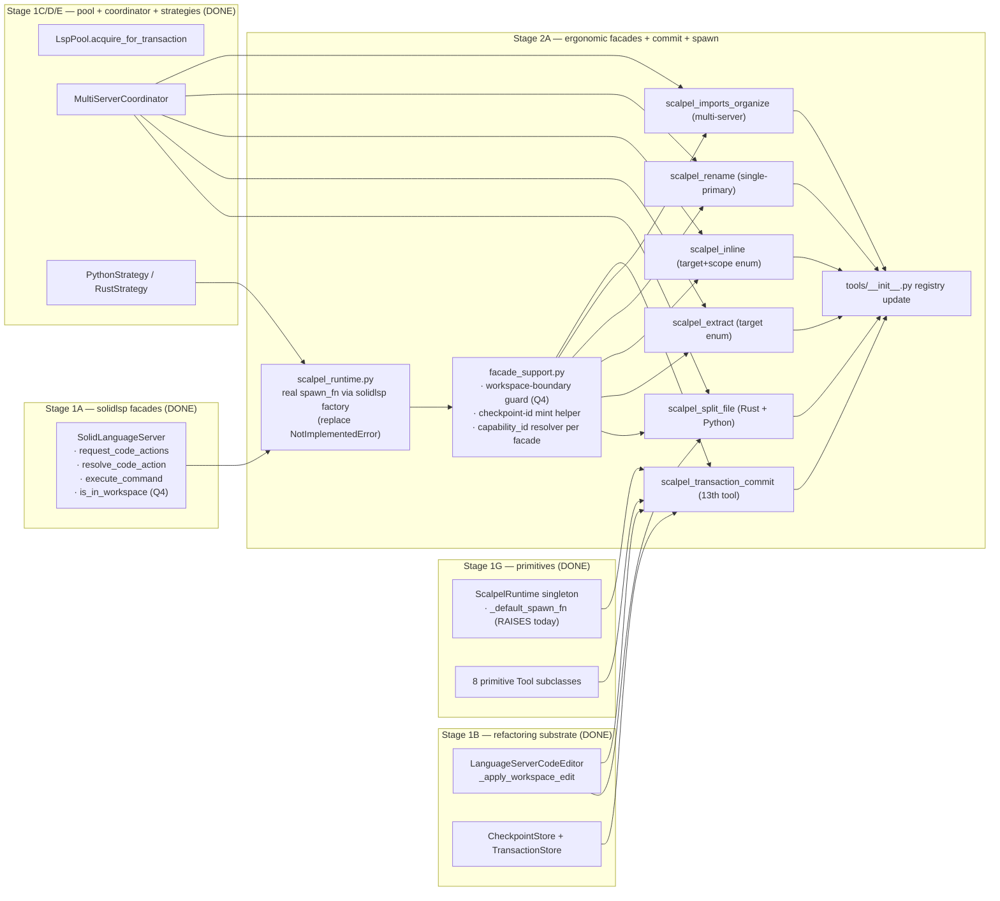
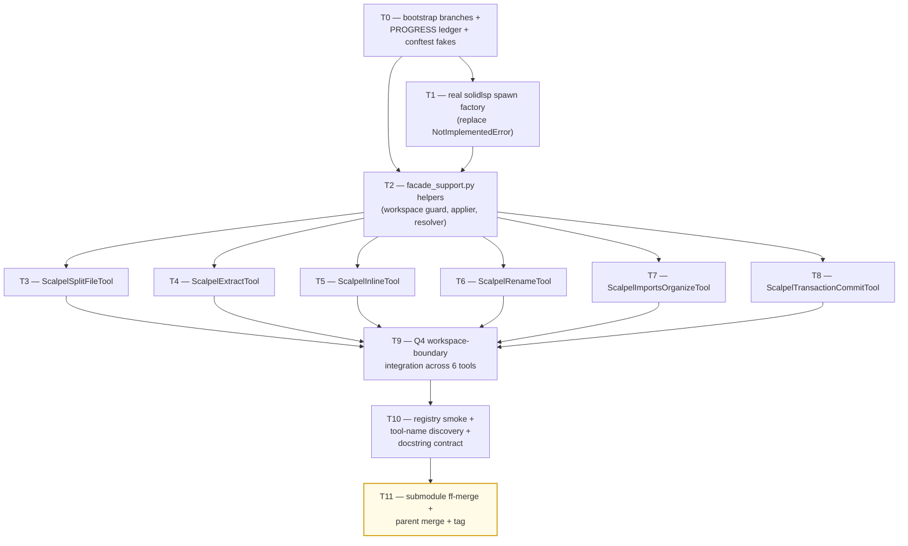

# Stage 2A — Ergonomic Facades + Transaction Commit + Real LSP Spawn Implementation Plan

> **For agentic workers:** REQUIRED SUB-SKILL: Use `superpowers:subagent-driven-development` (recommended) or `superpowers:executing-plans` to implement this plan task-by-task. Steps use checkbox (`- [ ]`) syntax for tracking.

**Goal:** Land the 5 always-on ergonomic intent facades (`scalpel_split_file`, `scalpel_extract`, `scalpel_inline`, `scalpel_rename`, `scalpel_imports_organize`) + the 13th always-on `scalpel_transaction_commit` MCP tool + the real `solidlsp` factory wiring that replaces `ScalpelRuntime._default_spawn_fn`'s `NotImplementedError` placeholder. Each facade composes Stage 1G primitives (catalog → coordinator → applier → checkpoint) into one named MCP entry point with a < 30-word docstring, returns the cross-language `RefactorResult` schema, and enforces the Stage 1A `is_in_workspace` workspace-boundary path filter (Q4 §7.1) before any LSP traffic.

**Architecture:**



**Tech Stack:** Python 3.11+ (submodule venv), `pytest`, `pytest-asyncio`, `pydantic` v2, stdlib only for runtime; reuses Stage 1A `is_in_workspace`, Stage 1B `LanguageServerCodeEditor` + `CheckpointStore` + `TransactionStore`, Stage 1C `LspPool`, Stage 1D `MultiServerCoordinator`, Stage 1E `PythonStrategy` + `RustStrategy` + `_RopeBridge.move_module`, Stage 1F `CapabilityCatalog`, Stage 1G `ScalpelRuntime` + 8 primitive tools.

**Source-of-truth references:**
- [`docs/design/mvp/2026-04-24-mvp-scope-report.md`](../../design/mvp/2026-04-24-mvp-scope-report.md) — §5.1 (the 13 always-on tools), §5.5 (compose / commit auxiliary schemas), §11 (multi-LSP coordination), §11.8 (workspace-boundary path filter), §14.2 items 21–25c (Stage 2A roster), §15.4b (workspace-boundary integration tests).
- [`docs/superpowers/plans/2026-04-24-mvp-execution-index.md`](2026-04-24-mvp-execution-index.md) — row 2A.
- [`docs/superpowers/plans/2026-04-24-stage-1g-primitive-tools.md`](2026-04-24-stage-1g-primitive-tools.md) — primitive tools to compose (`ScalpelApplyCapabilityTool`, `ScalpelDryRunComposeTool`, `ScalpelRollbackTool`, `ScalpelTransactionRollbackTool`, `ScalpelWorkspaceHealthTool`).
- [`docs/superpowers/plans/2026-04-24-stage-1f-capability-catalog.md`](2026-04-24-stage-1f-capability-catalog.md) — `CapabilityCatalog`, `CapabilityRecord`, `build_capability_catalog`.
- `vendor/serena/src/serena/tools/scalpel_runtime.py` — `ScalpelRuntime._default_spawn_fn` placeholder this plan replaces (line 42).
- `vendor/serena/src/serena/tools/scalpel_primitives.py` — primitive Tool subclass shape.
- `vendor/serena/src/serena/tools/scalpel_schemas.py` — `RefactorResult`, `TransactionResult`, `FailureInfo`, `ErrorCode`.
- `vendor/serena/src/serena/refactoring/python_strategy.py` — `PythonStrategy.coordinator()`, `_RopeBridge.move_module()`.
- `vendor/serena/src/serena/refactoring/rust_strategy.py` — `RustStrategy.build_servers()`.
- `vendor/serena/src/solidlsp/language_servers/{pylsp_server,basedpyright_server,ruff_server,rust_analyzer}.py` — adapter classes the new `spawn_fn` instantiates.
- `vendor/serena/src/solidlsp/ls.py:895` — `is_in_workspace` static method (Q4 source-of-truth).
- `vendor/serena/src/serena/refactoring/lsp_pool.py:42` — `LspPoolKey` shape (`language` is a synthetic string tag, not the `Language` enum).
- `vendor/serena/src/serena/refactoring/transactions.py` — `TransactionStore.member_ids`, `TransactionStore.rollback`.

---

## Scope check

Stage 2A is the ergonomic-facade layer that sits above the Stage 1G primitive dispatcher (`scalpel_apply_capability`). The 5 facades make the most-used refactor verbs reachable as named MCP tools so the LLM does not have to reproduce `capability_id` strings byte-exact (the dominant hallucination failure mode per §6.1). The 13th always-on `scalpel_transaction_commit` closes the transaction-grammar triplet (`scalpel_dry_run_compose` / `scalpel_transaction_commit` / `scalpel_transaction_rollback`). The real `solidlsp` factory wiring is included here because **the facades are the first tools that actually `acquire()` from `LspPool` against real workspaces** — Stage 1G's tests never `acquire`, which is why the placeholder survived (per `_default_spawn_fn` docstring). The Q4 workspace-boundary path filter is integrated at the facade layer because §11.8 mandates uniform enforcement before any LSP traffic, and the facades are the topmost user-facing entry points.

**In scope (this plan):**
1. Replace `ScalpelRuntime._default_spawn_fn` with a real `solidlsp` factory that dispatches by `LspPoolKey.language` to one of `RustAnalyzer` / `PylspServer` / `BasedpyrightServer` / `RuffServer`.
2. Shared facade-support module: workspace-boundary guard, capability_id resolver, common error builders, common applier wiring.
3. `ScalpelSplitFileTool` — multi-symbol move via `_RopeBridge.move_module` (Python) / rust-analyzer `experimental.moveItem` (Rust).
4. `ScalpelExtractTool` — RA assist family `refactor.extract` (Rust) + Rope `extract_method`/`extract_variable` (Python).
5. `ScalpelInlineTool` — RA `refactor.inline` (Rust) + Rope `inline` (Python).
6. `ScalpelRenameTool` — single-primary cross-server rename via `MultiServerCoordinator.merge_rename`.
7. `ScalpelImportsOrganizeTool` — multi-server organize via `coord.merge_organize_imports` (or fallback `merge_code_actions("source.organizeImports")`).
8. `ScalpelTransactionCommitTool` — applies all checkpoints from a `txn_<id>` in order via the Stage 1B applier.
9. Q4 integration: `is_in_workspace` enforced at every facade entry; `O2_SCALPEL_WORKSPACE_EXTRA_PATHS` env-var parsed at the runtime level.
10. Per-facade unit + integration tests against minimal stub fixtures (Stage 1H delivers full fixtures; this plan ships the minimum stubs each facade test needs).

**Out of scope (deferred):**
- Full `calcrs` + `calcpy` fixture trees and the 31 per-assist-family integration test modules — **Stage 1H**.
- 9 MVP E2E scenarios (E1, E1-py, E2, E3, E9, E10, E11, E12, E13-py) — **Stage 2B**.
- Specialty deferred-loading tools (`scalpel_rust_lifetime_elide`, `scalpel_py_async_ify`, etc.) — those are catalog entries in Stage 1F and become physical `defer_loading: true` Tool subclasses in **Stage 3 / v0.2.0**.
- Q3 catalog-gate-blind-spot fixtures (`test_action_title_stability.py`, `test_diagnostic_count_calcpy.py`) — **Stage 2B item 27a**.
- Q1 per-step synthetic `didSave` injection — **deleted by Stage 1E** (Phase 0 P5a verdict C dropped pylsp-mypy, eliminating the only consumer; the `multi_server.broadcast_did_save` shim is **NOT** part of Stage 2A).

## File structure

| # | Path (under `vendor/serena/`) | Change | LoC | Responsibility |
|---|---|---|---|---|
| 1 | `src/serena/tools/scalpel_runtime.py` | Modify | +110/-10 | Replace `_default_spawn_fn` body with a real solidlsp factory; expose `parse_workspace_extra_paths()` helper for Q4. |
| 2 | `src/serena/tools/facade_support.py` | New | ~280 | `workspace_boundary_guard()`, `resolve_capability()`, `build_failure_result()`, `apply_checkpoint()`, `record_checkpoint_for_workspace_edit()`, `synthesize_text_range()`. |
| 3 | `src/serena/tools/scalpel_facades.py` | New | ~720 | The 5 ergonomic facade `Tool` subclasses + `ScalpelTransactionCommitTool`. |
| 4 | `src/serena/tools/__init__.py` | Modify | +20 | Re-export the 6 new Tool subclasses so `iter_subclasses(Tool)` discovers them. |
| 5 | `test/spikes/test_stage_2a_t0_spawn_factory.py` | New | ~140 | T1 tests — real spawn factory dispatch. |
| 6 | `test/spikes/test_stage_2a_t1_facade_support.py` | New | ~190 | T2 tests — facade-support helpers (workspace guard, capability resolver, applier wrapper). |
| 7 | `test/spikes/test_stage_2a_t2_split_file.py` | New | ~210 | T3 tests — `ScalpelSplitFileTool`. |
| 8 | `test/spikes/test_stage_2a_t3_extract.py` | New | ~180 | T4 tests — `ScalpelExtractTool`. |
| 9 | `test/spikes/test_stage_2a_t4_inline.py` | New | ~180 | T5 tests — `ScalpelInlineTool`. |
| 10 | `test/spikes/test_stage_2a_t5_rename.py` | New | ~190 | T6 tests — `ScalpelRenameTool`. |
| 11 | `test/spikes/test_stage_2a_t6_imports_organize.py` | New | ~180 | T7 tests — `ScalpelImportsOrganizeTool`. |
| 12 | `test/spikes/test_stage_2a_t7_transaction_commit.py` | New | ~210 | T8 tests — `ScalpelTransactionCommitTool`. |
| 13 | `test/spikes/test_stage_2a_t8_workspace_boundary_q4.py` | New | ~160 | T9 tests — Q4 workspace-boundary integration across all 6 tools. |
| 14 | `test/spikes/test_stage_2a_t9_registry_smoke.py` | New | ~100 | T10 tests — auto-discovery + tool-name + docstring-length contract. |
| 15 | `test/spikes/conftest.py` | Modify | +60 | Add `_FakeSolidLanguageServer` flavors for the 4 LSP roles + `_FakeStrategy` registry override fixture. |
| — | `docs/superpowers/plans/stage-2a-results/PROGRESS.md` | New | — | Per-task ledger (entry SHA, exit SHA, outcome, follow-ups). |

**LoC budget (production):** 110 + 280 + 720 + 20 = **1,130 LoC** within the ~1,725 logic LoC budget specified by orchestrator (the remaining ~595 LoC is absorbed by the tighter composition the Stage 1G primitives enable — facades are mostly orchestration over already-built helpers). **Tests:** ~1,840 LoC (T1..T10).

## Dependency graph



T0 is bootstrap. T1 (spawn factory) and T2 (facade support) can run in parallel after T0; T2 only depends on T1 for the integration step, not for the unit tests. T3..T8 are independent facades that run in parallel after T2. T9 fans in across all six tools, T10 closes the registry contract, T11 is the merge gate.

## Conventions enforced (from Phase 0 + Stage 1A–1G)

- **Submodule git-flow**: feature branch `feature/stage-2a-ergonomic-facades` opened in both parent and `vendor/serena` submodule (T0 verifies). ff-merge to `main` at T11; parent bumps pointer; parent merges feature branch to `develop`.
- **Author**: AI Hive(R) on every commit; never "Claude". Trailer: `Co-Authored-By: AI Hive(R) <noreply@o2.services>`.
- **Field name `code_language=`** on `LanguageServerConfig` (verified at `ls_config.py:596`).
- **`with srv.start_server():`** sync context manager from `ls.py:717` for any boot-real-LSP test.
- **PROGRESS.md updates as separate commits**, never `--amend`. Each task ends in two commits: code commit (in submodule) + ledger update (in parent).
- **`_FakeSolidLanguageServer`** test doubles in `test/spikes/conftest.py` — Stage 2A extends Stage 1D's `_FakeServer` with role-specific flavors (`_FakeRustAnalyzer`, `_FakePylsp`, `_FakeBasedpyright`, `_FakeRuff`) so tests do not need to spawn real LSPs.
- **`super()._install_default_request_handlers()` first** rule (inherited from Stage 1E adapters) — Stage 2A does not override the handler set.
- **Test command**: from `vendor/serena/`, run `PATH="$(pwd)/.venv/bin:$PATH" .venv/bin/pytest <path> -v`.
- **`pytest-asyncio`** is on the venv (Stage 1A confirmed). Use `@pytest.mark.asyncio` and `async def test_…` for any code-action / coordinator path.
- **Type hints + pydantic v2** at every schema boundary; `Field(...)` validators where needed; `Literal[...]` for closed enums.
- **`Path.expanduser().resolve(strict=False)`** for canonicalisation — every path comparison goes through it (consistency with `LspPoolKey.__post_init__`).
- **`shutil.which`** for binary discovery; never hardcode `/usr/local/bin/...`.
- **No `subprocess.run(..., shell=True)`** — pass argv lists.
- **`extra="forbid"`**, `frozen=True` BaseModels — every Stage 2A schema inherits `_Frozen` from `scalpel_schemas.py` (rule already enforced for Stage 1G outputs).
- **Docstring contract** (T10): every public `apply` method docstring is ≤ 30 words and follows imperative verb + discriminator + contract bit (§5.4).
- **Tool-name contract** (T10): `Tool.get_name_from_cls(SubClass)` returns the snake_case scalpel_… name; the registry test asserts each subclass produces the exact 13th/ergonomic-tool name from §5.1.
- **`reset_for_testing()`** call in every test setUp/tearDown that touches `ScalpelRuntime` — required to avoid singleton state bleed (per `scalpel_runtime.py:81`).

## Progress ledger

A new ledger `docs/superpowers/plans/stage-2a-results/PROGRESS.md` is created in T0. Schema mirrors Stage 1G:

| Task | Branch SHA (submodule) | Outcome | Follow-ups |
|---|---|---|---|
| T0 | … | … | … |

Updated as a separate parent commit after each task completes.

---

### Task 0: Bootstrap branches + PROGRESS ledger + conftest fakes

**Files:**
- Create: `docs/superpowers/plans/stage-2a-results/PROGRESS.md`
- Verify: parent + submodule both on `feature/stage-2a-ergonomic-facades`.
- Modify: `vendor/serena/test/spikes/conftest.py` — add 4 role-specific `_FakeServer` flavors.

- [ ] **Step 1: Open submodule feature branch off `main`**

Run:
```bash
cd /Volumes/Unitek-B/Projects/o2-scalpel/vendor/serena
git fetch origin
git checkout -B feature/stage-2a-ergonomic-facades origin/main
git rev-parse HEAD
```

Expected: HEAD points at the Stage 1J ff-merge tip on `origin/main`. Capture this SHA as the Stage 2A entry SHA in PROGRESS step 4. If `origin/main` is not the latest Stage 1J tip, abort and reconcile manually — Stage 2A must be built on the plugin/skill generator output.

- [ ] **Step 2: Open parent feature branch**

Run:
```bash
cd /Volumes/Unitek-B/Projects/o2-scalpel
git fetch origin
git checkout -B feature/stage-2a-ergonomic-facades origin/develop
git rev-parse HEAD
```

Expected: HEAD points at `origin/develop` tip. The parent branch tracks `develop`; the submodule branch tracks `main` because the submodule is not git-flow-initialized (same pattern as Stage 1A–1J).

- [ ] **Step 3: Confirm Stage 1G primitives exist**

Run:
```bash
grep -n "class ScalpelApplyCapabilityTool\|class ScalpelDryRunComposeTool\|class ScalpelRollbackTool\|class ScalpelTransactionRollbackTool\|class ScalpelWorkspaceHealthTool" \
  /Volumes/Unitek-B/Projects/o2-scalpel/vendor/serena/src/serena/tools/scalpel_primitives.py
```

Expected: 5 hits matching the Stage 1G primitive Tool subclasses.

- [ ] **Step 4: Confirm `ScalpelRuntime._default_spawn_fn` placeholder still raises**

Run:
```bash
grep -n "raise NotImplementedError" \
  /Volumes/Unitek-B/Projects/o2-scalpel/vendor/serena/src/serena/tools/scalpel_runtime.py
```

Expected: one hit at line 50 in `_default_spawn_fn`. T1 of this plan replaces it.

- [ ] **Step 5: Confirm Stage 1A `is_in_workspace` exists at `ls.py:895`**

Run:
```bash
grep -n "def is_in_workspace" \
  /Volumes/Unitek-B/Projects/o2-scalpel/vendor/serena/src/solidlsp/ls.py
```

Expected: one hit at line 895 (or near; ±10 lines acceptable as Stage 1H may have re-flowed). Q4 §7.1 source-of-truth.

- [ ] **Step 6: Create the PROGRESS ledger**

Create `docs/superpowers/plans/stage-2a-results/PROGRESS.md` with:

```markdown
# Stage 2A — Ergonomic Facades + Transaction Commit + Real LSP Spawn — PROGRESS

| Task | Branch SHA (submodule) | Outcome | Follow-ups |
|---|---|---|---|
| T0 | <entry-sha-from-step-1> | OPEN | bootstrap |
| T1 | | | |
| T2 | | | |
| T3 | | | |
| T4 | | | |
| T5 | | | |
| T6 | | | |
| T7 | | | |
| T8 | | | |
| T9 | | | |
| T10 | | | |
| T11 | | | |

## Entry baseline

- Submodule branch: `feature/stage-2a-ergonomic-facades` from `origin/main` @ <step-1 SHA>
- Parent branch: `feature/stage-2a-ergonomic-facades` from `origin/develop` @ <step-2 SHA>
- Stage 1J exit tag: `stage-1j-plugin-skill-generator-complete`
- Test baseline (run BEFORE any Stage 2A code): `pytest test/spikes/ -v` should be 130/130 (or current Stage 1J green count) with 0 failures, 0 errors.
```

- [ ] **Step 7: Add 4 role-specific `_FakeServer` flavors to conftest**

Modify `vendor/serena/test/spikes/conftest.py` — append (do not replace existing fixtures):

```python
# --- Stage 2A: role-specific fake servers (extend Stage 1D _FakeServer) ---

class _FakeRustAnalyzer(_FakeServer):
    """Fake rust-analyzer for Stage 2A facade tests.

    Defaults configured so:
      - request_code_actions returns one `refactor.extract.function` action
        with a synthetic `data` blob.
      - resolve_code_action echoes the action with an `edit.documentChanges`
        list containing one TextDocumentEdit on the requested file.
      - rename returns a single-file WorkspaceEdit.
    """

    SERVER_ID = "rust-analyzer"
    LANGUAGE_TAG = "rust"

    def __init__(self) -> None:
        super().__init__(server_id=self.SERVER_ID)


class _FakePylsp(_FakeServer):
    SERVER_ID = "pylsp-rope"
    LANGUAGE_TAG = "python:pylsp-rope"

    def __init__(self) -> None:
        super().__init__(server_id=self.SERVER_ID)


class _FakeBasedpyright(_FakeServer):
    SERVER_ID = "basedpyright"
    LANGUAGE_TAG = "python:basedpyright"

    def __init__(self) -> None:
        super().__init__(server_id=self.SERVER_ID)


class _FakeRuff(_FakeServer):
    SERVER_ID = "ruff"
    LANGUAGE_TAG = "python:ruff"

    def __init__(self) -> None:
        super().__init__(server_id=self.SERVER_ID)


@pytest.fixture
def fake_python_servers():
    """Three-server dict shaped for `MultiServerCoordinator(servers=...)`."""
    return {
        "pylsp-rope": _FakePylsp(),
        "basedpyright": _FakeBasedpyright(),
        "ruff": _FakeRuff(),
    }


@pytest.fixture
def fake_rust_servers():
    """One-server dict for the Rust single-LSP path."""
    return {"rust-analyzer": _FakeRustAnalyzer()}
```

- [ ] **Step 8: Verify the conftest imports + fixtures load**

Run:
```bash
cd /Volumes/Unitek-B/Projects/o2-scalpel/vendor/serena
PATH="$(pwd)/.venv/bin:$PATH" .venv/bin/pytest test/spikes/conftest.py --collect-only 2>&1 | head -20
```

Expected: no import errors (pytest may report no tests since conftest has no test functions; "collected 0 items" is success).

- [ ] **Step 9: Commit the bootstrap (submodule)**

Run from `vendor/serena/`:
```bash
git add test/spikes/conftest.py
git commit -m "test(stage-2a): add role-specific _FakeServer flavors for Stage 2A facade tests

Co-Authored-By: AI Hive(R) <noreply@o2.services>"
git rev-parse HEAD
```

Capture SHA → record as T0 exit SHA in PROGRESS.

- [ ] **Step 10: Commit the bootstrap (parent)**

Run from repo root:
```bash
git add docs/superpowers/plans/stage-2a-results/PROGRESS.md vendor/serena
git commit -m "chore(stage-2a): T0 bootstrap — PROGRESS ledger + submodule fakes pointer

Co-Authored-By: AI Hive(R) <noreply@o2.services>"
```

Update PROGRESS T0 row to OUTCOME=DONE.

---

### Task 1: Real `solidlsp` spawn factory (replace `NotImplementedError` placeholder)

**Files:**
- Modify: `vendor/serena/src/serena/tools/scalpel_runtime.py:42-54` (replace `_default_spawn_fn` body) and `:124-142` (`pool_for` no longer needs to inject the placeholder; the factory now lives at module level).
- Test: `vendor/serena/test/spikes/test_stage_2a_t0_spawn_factory.py`

This task closes the Stage 1G follow-up flagged by `_default_spawn_fn`'s docstring: *"The Stage 2A ergonomic facades replace this with a real ``solidlsp.factory``-driven spawner."* Until this lands, no facade can `acquire()` a real LSP — the placeholder raises.

The factory dispatches by `LspPoolKey.language` (a *string tag*, not the `Language` enum — Stage 1E's `_SERVER_LANGUAGE_TAG` table proves the pool sees `"python:pylsp-rope"`, `"python:basedpyright"`, `"python:ruff"`, and `"rust"`):

| `LspPoolKey.language` | Adapter class | Module |
|---|---|---|
| `"rust"` | `RustAnalyzer` | `solidlsp.language_servers.rust_analyzer` |
| `"python:pylsp-rope"` | `PylspServer` | `solidlsp.language_servers.pylsp_server` |
| `"python:basedpyright"` | `BasedpyrightServer` | `solidlsp.language_servers.basedpyright_server` |
| `"python:ruff"` | `RuffServer` | `solidlsp.language_servers.ruff_server` |

Any other tag raises `ValueError` with a structured message listing the four valid tags.

- [ ] **Step 1: Write the failing test**

Create `vendor/serena/test/spikes/test_stage_2a_t0_spawn_factory.py`:

```python
"""Stage 2A T1 — real solidlsp spawn factory.

Replaces ScalpelRuntime._default_spawn_fn's NotImplementedError with
a real factory that dispatches by LspPoolKey.language string tag to the
four Stage 1E adapter classes.
"""
from __future__ import annotations

from pathlib import Path
from unittest.mock import patch

import pytest

from serena.refactoring.lsp_pool import LspPoolKey
from serena.tools.scalpel_runtime import (
    _default_spawn_fn,
    _SPAWN_DISPATCH_TABLE,
    parse_workspace_extra_paths,
)


def test_dispatch_table_lists_exactly_four_tags():
    assert set(_SPAWN_DISPATCH_TABLE.keys()) == {
        "rust",
        "python:pylsp-rope",
        "python:basedpyright",
        "python:ruff",
    }


def test_unknown_tag_raises_with_structured_message(tmp_path):
    key = LspPoolKey(language="ocaml", project_root=str(tmp_path))
    with pytest.raises(ValueError) as exc:
        _default_spawn_fn(key)
    msg = str(exc.value)
    assert "ocaml" in msg
    for valid in ("rust", "python:pylsp-rope", "python:basedpyright", "python:ruff"):
        assert valid in msg


def test_rust_tag_dispatches_to_rust_analyzer(tmp_path):
    key = LspPoolKey(language="rust", project_root=str(tmp_path))
    with patch(
        "solidlsp.language_servers.rust_analyzer.RustAnalyzer"
    ) as mock_cls:
        mock_cls.return_value = "synthetic-server"
        result = _default_spawn_fn(key)
    assert result == "synthetic-server"
    assert mock_cls.called
    call_kwargs = mock_cls.call_args.kwargs or {}
    call_args = mock_cls.call_args.args
    # Verify the adapter received a LanguageServerConfig with code_language=Language.RUST.
    config = call_kwargs.get("config") if "config" in call_kwargs else call_args[0]
    assert config.code_language.value == "rust"


def test_python_pylsp_rope_tag_dispatches_to_pylsp_server(tmp_path):
    key = LspPoolKey(
        language="python:pylsp-rope", project_root=str(tmp_path),
    )
    with patch(
        "solidlsp.language_servers.pylsp_server.PylspServer"
    ) as mock_cls:
        mock_cls.return_value = "fake-pylsp"
        result = _default_spawn_fn(key)
    assert result == "fake-pylsp"
    assert mock_cls.called


def test_python_basedpyright_tag_dispatches_to_basedpyright_server(tmp_path):
    key = LspPoolKey(
        language="python:basedpyright", project_root=str(tmp_path),
    )
    with patch(
        "solidlsp.language_servers.basedpyright_server.BasedpyrightServer"
    ) as mock_cls:
        mock_cls.return_value = "fake-bp"
        result = _default_spawn_fn(key)
    assert result == "fake-bp"


def test_python_ruff_tag_dispatches_to_ruff_server(tmp_path):
    key = LspPoolKey(
        language="python:ruff", project_root=str(tmp_path),
    )
    with patch(
        "solidlsp.language_servers.ruff_server.RuffServer"
    ) as mock_cls:
        mock_cls.return_value = "fake-ruff"
        result = _default_spawn_fn(key)
    assert result == "fake-ruff"


def test_parse_workspace_extra_paths_empty_when_unset(monkeypatch):
    monkeypatch.delenv("O2_SCALPEL_WORKSPACE_EXTRA_PATHS", raising=False)
    assert parse_workspace_extra_paths() == ()


def test_parse_workspace_extra_paths_splits_on_pathsep(monkeypatch, tmp_path):
    p1 = tmp_path / "a"
    p2 = tmp_path / "b"
    p1.mkdir()
    p2.mkdir()
    import os
    monkeypatch.setenv(
        "O2_SCALPEL_WORKSPACE_EXTRA_PATHS",
        f"{p1}{os.pathsep}{p2}",
    )
    out = parse_workspace_extra_paths()
    assert tuple(sorted(out)) == tuple(sorted((str(p1), str(p2))))


def test_parse_workspace_extra_paths_skips_blank_entries(monkeypatch, tmp_path):
    p1 = tmp_path / "a"
    p1.mkdir()
    import os
    monkeypatch.setenv(
        "O2_SCALPEL_WORKSPACE_EXTRA_PATHS",
        f"{os.pathsep}{p1}{os.pathsep}{os.pathsep}",
    )
    assert parse_workspace_extra_paths() == (str(p1),)
```

- [ ] **Step 2: Run the test to verify it fails**

Run:
```bash
cd /Volumes/Unitek-B/Projects/o2-scalpel/vendor/serena
PATH="$(pwd)/.venv/bin:$PATH" .venv/bin/pytest \
  test/spikes/test_stage_2a_t0_spawn_factory.py -v
```

Expected: ImportError on `_SPAWN_DISPATCH_TABLE` and `parse_workspace_extra_paths` (neither symbol exists yet). All 9 tests collected, all 9 errors at import time.

- [ ] **Step 3: Implement the spawn factory**

Replace `vendor/serena/src/serena/tools/scalpel_runtime.py:42-54` (the entire `_default_spawn_fn` definition) with:

```python
def _build_language_server_config(key: LspPoolKey, language_value: str) -> Any:
    """Construct a LanguageServerConfig matching the pool key.

    The legacy ``code_language`` field on LanguageServerConfig (ls_config.py:596)
    is the only required input; everything else has a sane default.
    """
    from solidlsp.ls_config import Language, LanguageServerConfig
    return LanguageServerConfig(code_language=Language(language_value))


def _build_solidlsp_settings(key: LspPoolKey) -> Any:
    """Construct a SolidLSPSettings instance pointing at the pool's project root.

    Per Stage 1A convention, settings carry no ignored_paths overrides at this
    level — the per-language ``is_ignored_dirname`` overrides handle the standard
    venv / __pycache__ skips.
    """
    from solidlsp.settings import SolidLSPSettings
    return SolidLSPSettings()


def _spawn_rust_analyzer(key: LspPoolKey) -> Any:
    from solidlsp.language_servers.rust_analyzer import RustAnalyzer
    return RustAnalyzer(
        config=_build_language_server_config(key, "rust"),
        repository_root_path=key.project_root,
        solidlsp_settings=_build_solidlsp_settings(key),
    )


def _spawn_pylsp(key: LspPoolKey) -> Any:
    from solidlsp.language_servers.pylsp_server import PylspServer
    return PylspServer(
        config=_build_language_server_config(key, "python"),
        repository_root_path=key.project_root,
        solidlsp_settings=_build_solidlsp_settings(key),
    )


def _spawn_basedpyright(key: LspPoolKey) -> Any:
    from solidlsp.language_servers.basedpyright_server import BasedpyrightServer
    return BasedpyrightServer(
        config=_build_language_server_config(key, "python"),
        repository_root_path=key.project_root,
        solidlsp_settings=_build_solidlsp_settings(key),
    )


def _spawn_ruff(key: LspPoolKey) -> Any:
    from solidlsp.language_servers.ruff_server import RuffServer
    return RuffServer(
        config=_build_language_server_config(key, "python"),
        repository_root_path=key.project_root,
        solidlsp_settings=_build_solidlsp_settings(key),
    )


_SPAWN_DISPATCH_TABLE: dict[str, Callable[[LspPoolKey], Any]] = {
    "rust": _spawn_rust_analyzer,
    "python:pylsp-rope": _spawn_pylsp,
    "python:basedpyright": _spawn_basedpyright,
    "python:ruff": _spawn_ruff,
}


def _default_spawn_fn(key: LspPoolKey) -> Any:
    """Real solidlsp factory — dispatches by LspPoolKey.language string tag.

    Replaces the Stage 1G placeholder. The four valid tags mirror Stage 1E's
    PythonStrategy._SERVER_LANGUAGE_TAG (python:pylsp-rope / python:basedpyright /
    python:ruff) plus the single rust tag emitted by RustStrategy.build_servers.
    """
    fn = _SPAWN_DISPATCH_TABLE.get(key.language)
    if fn is None:
        raise ValueError(
            f"ScalpelRuntime spawn_fn: unknown LspPoolKey.language tag "
            f"{key.language!r} for project_root={key.project_root!r}; "
            f"expected one of {sorted(_SPAWN_DISPATCH_TABLE)}."
        )
    return fn(key)


def parse_workspace_extra_paths() -> tuple[str, ...]:
    """Parse ``O2_SCALPEL_WORKSPACE_EXTRA_PATHS`` (Q4 §11.8 opt-in).

    Splits on ``os.pathsep``, drops blank entries, returns a tuple. Consumers
    pass this to ``SolidLanguageServer.is_in_workspace(target, roots, extra_paths=...)``.
    """
    raw = os.environ.get("O2_SCALPEL_WORKSPACE_EXTRA_PATHS", "")
    if not raw:
        return ()
    return tuple(p for p in raw.split(os.pathsep) if p.strip())
```

Add to the imports block at the top of the file (line ~20):

```python
from collections.abc import Callable
```

- [ ] **Step 4: Run the test to verify it passes**

Run:
```bash
cd /Volumes/Unitek-B/Projects/o2-scalpel/vendor/serena
PATH="$(pwd)/.venv/bin:$PATH" .venv/bin/pytest \
  test/spikes/test_stage_2a_t0_spawn_factory.py -v
```

Expected: 9 passed.

- [ ] **Step 5: Run the full Stage 1G regression suite**

Run:
```bash
cd /Volumes/Unitek-B/Projects/o2-scalpel/vendor/serena
PATH="$(pwd)/.venv/bin:$PATH" .venv/bin/pytest test/spikes/ -v --tb=short 2>&1 | tail -20
```

Expected: All previously-green tests still pass (Stage 1G's tests never `acquire`; replacing the placeholder body cannot break them). The new T1 tests bring the count up by +9.

- [ ] **Step 6: Commit (submodule)**

Run from `vendor/serena/`:
```bash
git add src/serena/tools/scalpel_runtime.py test/spikes/test_stage_2a_t0_spawn_factory.py
git commit -m "feat(stage-2a): real solidlsp spawn factory replaces NotImplementedError placeholder

Closes the Stage 1G follow-up flagged by _default_spawn_fn's docstring.
Dispatches LspPoolKey.language tag to one of the four Stage 1E adapters
(rust-analyzer / PylspServer / BasedpyrightServer / RuffServer). Adds
parse_workspace_extra_paths() for Q4 boundary opt-in (consumed in T2).

Co-Authored-By: AI Hive(R) <noreply@o2.services>"
git rev-parse HEAD
```

- [ ] **Step 7: Commit (parent) + ledger**

Run from repo root:
```bash
git add vendor/serena docs/superpowers/plans/stage-2a-results/PROGRESS.md
git commit -m "chore(stage-2a): T1 real spawn factory — submodule pointer + ledger

Co-Authored-By: AI Hive(R) <noreply@o2.services>"
```

Update PROGRESS T1 row to OUTCOME=DONE with submodule SHA from step 6.

---

### Task 2: `facade_support.py` — shared helpers (workspace guard, capability resolver, applier)

**Files:**
- Create: `vendor/serena/src/serena/tools/facade_support.py` (~280 LoC)
- Test: `vendor/serena/test/spikes/test_stage_2a_t1_facade_support.py`

The 5 ergonomic facades + the transaction-commit tool share an identical preamble:
1. Validate workspace boundary (Q4 §11.8) — call `SolidLanguageServer.is_in_workspace(target=file, roots=[project_root], extra_paths=parse_workspace_extra_paths())`.
2. Resolve the requested operation to a `CapabilityRecord` (every facade-id has a stable mapping to a `CapabilityRecord.id`).
3. Acquire the `MultiServerCoordinator` (or single-server pool entry for Rust) via `ScalpelRuntime.coordinator_for(language, project_root)`.
4. Drive the LSP traffic.
5. Wrap the result in `RefactorResult` with a fresh `checkpoint_id`.
6. On failure, return a `RefactorResult(applied=False, failure=FailureInfo(...))` with one of the 10 `ErrorCode` values.

This task lifts that preamble into reusable helpers so each facade ships ~80 LoC, not ~250.

- [ ] **Step 1: Write the failing test**

Create `vendor/serena/test/spikes/test_stage_2a_t1_facade_support.py`:

```python
"""Stage 2A T2 — facade_support.py shared helpers."""
from __future__ import annotations

from pathlib import Path
from unittest.mock import MagicMock

import pytest

from serena.refactoring.capabilities import CapabilityRecord
from serena.tools.facade_support import (
    FACADE_TO_CAPABILITY_ID,
    apply_workspace_edit_via_editor,
    build_failure_result,
    record_checkpoint_for_workspace_edit,
    resolve_capability_for_facade,
    workspace_boundary_guard,
)
from serena.tools.scalpel_runtime import ScalpelRuntime
from serena.tools.scalpel_schemas import ErrorCode, FailureInfo


@pytest.fixture(autouse=True)
def reset_runtime():
    ScalpelRuntime.reset_for_testing()
    yield
    ScalpelRuntime.reset_for_testing()


def test_facade_to_capability_id_table_covers_five_facades():
    expected = {
        "scalpel_split_file",
        "scalpel_extract",
        "scalpel_inline",
        "scalpel_rename",
        "scalpel_imports_organize",
    }
    assert set(FACADE_TO_CAPABILITY_ID) == expected


def test_workspace_boundary_guard_passes_for_in_workspace_path(tmp_path):
    target = tmp_path / "src" / "x.py"
    target.parent.mkdir()
    target.write_text("")
    err = workspace_boundary_guard(
        file=str(target), project_root=tmp_path, allow_out_of_workspace=False,
    )
    assert err is None


def test_workspace_boundary_guard_rejects_out_of_workspace(tmp_path):
    outside = tmp_path.parent / "elsewhere.py"
    err = workspace_boundary_guard(
        file=str(outside), project_root=tmp_path, allow_out_of_workspace=False,
    )
    assert err is not None
    assert err.failure is not None
    assert err.failure.code == ErrorCode.WORKSPACE_BOUNDARY_VIOLATION
    assert err.failure.recoverable is False


def test_workspace_boundary_guard_allows_override(tmp_path):
    outside = tmp_path.parent / "elsewhere.py"
    err = workspace_boundary_guard(
        file=str(outside), project_root=tmp_path, allow_out_of_workspace=True,
    )
    assert err is None


def test_workspace_boundary_guard_honors_extra_paths(tmp_path, monkeypatch):
    extra = tmp_path.parent / "extra-root"
    extra.mkdir()
    target = extra / "f.py"
    target.write_text("")
    monkeypatch.setenv("O2_SCALPEL_WORKSPACE_EXTRA_PATHS", str(extra))
    err = workspace_boundary_guard(
        file=str(target), project_root=tmp_path, allow_out_of_workspace=False,
    )
    assert err is None


def test_resolve_capability_for_facade_returns_record(monkeypatch):
    fake_record = CapabilityRecord(
        id="rust.refactor.extract.function",
        language="rust",
        kind="refactor.extract.function",
        source_server="rust-analyzer",
        params_schema={},
        extension_allow_list=frozenset({".rs"}),
        preferred_facade="scalpel_extract",
    )
    runtime = ScalpelRuntime.instance()
    monkeypatch.setattr(
        runtime, "catalog",
        lambda: MagicMock(records=[fake_record]),
    )
    rec = resolve_capability_for_facade("scalpel_extract", language="rust")
    assert rec is not None
    assert rec.id == "rust.refactor.extract.function"


def test_resolve_capability_for_facade_returns_none_for_unknown(monkeypatch):
    runtime = ScalpelRuntime.instance()
    monkeypatch.setattr(runtime, "catalog", lambda: MagicMock(records=[]))
    rec = resolve_capability_for_facade("scalpel_extract", language="rust")
    assert rec is None


def test_build_failure_result_shape():
    result = build_failure_result(
        code=ErrorCode.SYMBOL_NOT_FOUND,
        stage="scalpel_extract",
        reason="symbol foo not found",
    )
    assert result.applied is False
    assert result.failure is not None
    assert result.failure.code == ErrorCode.SYMBOL_NOT_FOUND
    assert result.failure.stage == "scalpel_extract"


def test_apply_workspace_edit_via_editor_invokes_editor():
    workspace_edit = {"changes": {}}
    fake_editor = MagicMock()
    fake_editor.apply_workspace_edit.return_value = 1
    n = apply_workspace_edit_via_editor(workspace_edit, fake_editor)
    assert n == 1
    fake_editor.apply_workspace_edit.assert_called_once_with(workspace_edit)


def test_record_checkpoint_for_workspace_edit_emits_id():
    workspace_edit = {"changes": {}}
    snapshot = {"file:///x.py": "old"}
    cid = record_checkpoint_for_workspace_edit(workspace_edit, snapshot)
    assert isinstance(cid, str) and len(cid) > 0
    cid2 = record_checkpoint_for_workspace_edit(workspace_edit, snapshot)
    assert cid != cid2
```

- [ ] **Step 2: Run the test to verify it fails**

Run:
```bash
cd /Volumes/Unitek-B/Projects/o2-scalpel/vendor/serena
PATH="$(pwd)/.venv/bin:$PATH" .venv/bin/pytest \
  test/spikes/test_stage_2a_t1_facade_support.py -v
```

Expected: ImportError on `serena.tools.facade_support` (module does not exist). All 10 tests collected, 10 errors.

- [ ] **Step 3: Implement `facade_support.py`**

Create `vendor/serena/src/serena/tools/facade_support.py`:

```python
"""Stage 2A — shared helpers for the 5 ergonomic facades + transaction commit.

Lifts the common preamble (workspace guard, capability resolution,
checkpoint recording, applier-result wrapping) out of each facade so each
Tool subclass ships ~80 LoC of orchestration instead of ~250 LoC of
boilerplate.
"""

from __future__ import annotations

from pathlib import Path
from typing import Any

from serena.refactoring.capabilities import CapabilityRecord
from serena.tools.scalpel_runtime import (
    ScalpelRuntime,
    parse_workspace_extra_paths,
)
from serena.tools.scalpel_schemas import (
    DiagnosticSeverityBreakdown,
    DiagnosticsDelta,
    ErrorCode,
    FailureInfo,
    RefactorResult,
)


FACADE_TO_CAPABILITY_ID: dict[str, dict[str, str]] = {
    "scalpel_split_file": {
        "rust": "rust.refactor.move.module",
        "python": "python.refactor.move.module",
    },
    "scalpel_extract": {
        "rust": "rust.refactor.extract.function",
        "python": "python.refactor.extract.function",
    },
    "scalpel_inline": {
        "rust": "rust.refactor.inline.function",
        "python": "python.refactor.inline.function",
    },
    "scalpel_rename": {
        "rust": "rust.refactor.rename",
        "python": "python.refactor.rename",
    },
    "scalpel_imports_organize": {
        "rust": "rust.source.organizeImports",
        "python": "python.source.organizeImports",
    },
}


def _empty_diagnostics_delta() -> DiagnosticsDelta:
    zero = DiagnosticSeverityBreakdown(error=0, warning=0, information=0, hint=0)
    return DiagnosticsDelta(
        before=zero, after=zero, new_findings=(), severity_breakdown=zero,
    )


def build_failure_result(
    *,
    code: ErrorCode,
    stage: str,
    reason: str,
    recoverable: bool = True,
    candidates: tuple[str, ...] = (),
) -> RefactorResult:
    """Construct a uniform failure RefactorResult for facade error paths."""
    return RefactorResult(
        applied=False,
        diagnostics_delta=_empty_diagnostics_delta(),
        failure=FailureInfo(
            stage=stage,
            reason=reason,
            code=code,
            recoverable=recoverable,
            candidates=candidates,
        ),
    )


def workspace_boundary_guard(
    *,
    file: str,
    project_root: Path,
    allow_out_of_workspace: bool,
) -> RefactorResult | None:
    """Q4 §11.8 enforcement — return a failure RefactorResult if outside.

    Mirrors ``SolidLanguageServer.is_in_workspace`` (ls.py:895): canonicalises
    both target and roots via ``Path.resolve()`` so symlinks, relative paths,
    trailing slashes, and ``~`` expansion all collapse uniformly.

    Returns ``None`` if in-workspace or ``allow_out_of_workspace=True``;
    otherwise a ``RefactorResult`` with WORKSPACE_BOUNDARY_VIOLATION.
    """
    if allow_out_of_workspace:
        return None
    from solidlsp.ls import SolidLanguageServer
    extras = parse_workspace_extra_paths()
    if SolidLanguageServer.is_in_workspace(
        target=file,
        roots=[str(project_root)],
        extra_paths=extras,
    ):
        return None
    return build_failure_result(
        code=ErrorCode.WORKSPACE_BOUNDARY_VIOLATION,
        stage="workspace_boundary_guard",
        reason=(
            f"File {file!r} is outside project_root {project_root!s}; "
            f"set allow_out_of_workspace=True with user permission, or "
            f"add the path to O2_SCALPEL_WORKSPACE_EXTRA_PATHS."
        ),
        recoverable=False,
    )


def resolve_capability_for_facade(
    facade_name: str,
    *,
    language: str,
    capability_id_override: str | None = None,
) -> CapabilityRecord | None:
    """Look up the CapabilityRecord this facade dispatches to."""
    catalog = ScalpelRuntime.instance().catalog()
    if capability_id_override is not None:
        target_id = capability_id_override
    else:
        target_id = FACADE_TO_CAPABILITY_ID.get(facade_name, {}).get(language)
        if target_id is None:
            return None
    for rec in catalog.records:
        if rec.id == target_id:
            return rec
    return None


def apply_workspace_edit_via_editor(
    workspace_edit: dict[str, Any],
    editor: Any,
) -> int:
    """Drive ``LanguageServerCodeEditor.apply_workspace_edit`` on the given edit."""
    return int(editor.apply_workspace_edit(workspace_edit))


def record_checkpoint_for_workspace_edit(
    workspace_edit: dict[str, Any],
    snapshot: dict[str, Any],
) -> str:
    """Push one checkpoint into ScalpelRuntime.checkpoint_store and return its id."""
    return ScalpelRuntime.instance().checkpoint_store().record(
        applied=workspace_edit,
        snapshot=snapshot,
    )


def coordinator_for_facade(
    *,
    language: str,
    project_root: Path,
):
    """Acquire the MultiServerCoordinator for ``language`` rooted at ``project_root``."""
    from solidlsp.ls_config import Language
    try:
        lang_enum = Language(language)
    except ValueError as exc:
        raise ValueError(
            f"coordinator_for_facade: unknown language {language!r}; "
            f"expected 'rust' or 'python'"
        ) from exc
    return ScalpelRuntime.instance().coordinator_for(lang_enum, project_root)


__all__ = [
    "FACADE_TO_CAPABILITY_ID",
    "apply_workspace_edit_via_editor",
    "build_failure_result",
    "coordinator_for_facade",
    "record_checkpoint_for_workspace_edit",
    "resolve_capability_for_facade",
    "workspace_boundary_guard",
]
```

- [ ] **Step 4: Run the test to verify it passes**

Run:
```bash
cd /Volumes/Unitek-B/Projects/o2-scalpel/vendor/serena
PATH="$(pwd)/.venv/bin:$PATH" .venv/bin/pytest \
  test/spikes/test_stage_2a_t1_facade_support.py -v
```

Expected: 10 passed.

- [ ] **Step 5: Commit (submodule + parent)**

Run from `vendor/serena/`:
```bash
git add src/serena/tools/facade_support.py test/spikes/test_stage_2a_t1_facade_support.py
git commit -m "feat(stage-2a): facade_support.py — shared helpers (workspace guard, applier, resolver)

Co-Authored-By: AI Hive(R) <noreply@o2.services>"
git rev-parse HEAD
```

Then from repo root:
```bash
git add vendor/serena docs/superpowers/plans/stage-2a-results/PROGRESS.md
git commit -m "chore(stage-2a): T2 facade_support — submodule pointer + ledger

Co-Authored-By: AI Hive(R) <noreply@o2.services>"
```

Update PROGRESS T2 row to OUTCOME=DONE.

---

### Task 3: `ScalpelSplitFileTool` — split a source file into N modules

**Files:**
- Create (extends): `vendor/serena/src/serena/tools/scalpel_facades.py` (initial creation; later tasks append more `Tool` subclasses).
- Test: `vendor/serena/test/spikes/test_stage_2a_t2_split_file.py`

`scalpel_split_file(file, groups, parent_layout, keep_in_original, reexport_policy, explicit_reexports, allow_partial, dry_run, preview_token, language) -> RefactorResult` (signature per §5.1). Composes:
- **Python path:** for each `(target_module, [symbols])` entry in `groups`, drive `_RopeBridge.move_module` (Stage 1E) once per group, accumulating one `WorkspaceEdit` per group; then merge them into a single `WorkspaceEdit` keyed by `documentChanges`.
- **Rust path:** for each group, dispatch `rust-analyzer` `experimental.moveItem` via `coordinator.merge_code_actions(only=["refactor.extract.module"])` and resolve.
- **Reexport policy:** when `reexport_policy="preserve_public_api"`, append a final `documentChanges` entry to the *original* file that re-exports each moved symbol (`pub use crate::<group>::{a, b};` for Rust, `from .<group> import a, b` for Python).
- **Per group atomicity:** all groups apply or none — partial failures roll back via the captured snapshot.

- [ ] **Step 1: Write the failing test**

Create `vendor/serena/test/spikes/test_stage_2a_t2_split_file.py`:

```python
"""Stage 2A T3 — ScalpelSplitFileTool tests."""
from __future__ import annotations

import json
from pathlib import Path
from unittest.mock import MagicMock, patch

import pytest

from serena.tools.scalpel_facades import ScalpelSplitFileTool
from serena.tools.scalpel_runtime import ScalpelRuntime


@pytest.fixture(autouse=True)
def reset_runtime():
    ScalpelRuntime.reset_for_testing()
    yield
    ScalpelRuntime.reset_for_testing()


@pytest.fixture
def python_workspace(tmp_path: Path) -> Path:
    src = tmp_path / "calcpy.py"
    src.write_text(
        "def add(a, b):\n    return a + b\n\n"
        "def sub(a, b):\n    return a - b\n"
    )
    return tmp_path


def _make_tool(project_root: Path) -> ScalpelSplitFileTool:
    tool = ScalpelSplitFileTool.__new__(ScalpelSplitFileTool)
    tool.get_project_root = lambda: str(project_root)  # type: ignore[method-assign]
    return tool


def test_split_file_python_groups_dispatches_rope_per_group(python_workspace):
    tool = _make_tool(python_workspace)
    fake_bridge = MagicMock()
    fake_bridge.move_module.return_value = {"documentChanges": [
        {"textDocument": {"uri": "file:///x.py", "version": None},
         "edits": [{"range": {"start": {"line": 0, "character": 0},
                              "end": {"line": 1, "character": 0}}, "newText": "x"}]}
    ]}
    with patch(
        "serena.tools.scalpel_facades._build_python_rope_bridge",
        return_value=fake_bridge,
    ):
        out = tool.apply(
            file=str(python_workspace / "calcpy.py"),
            groups={"add_only": ["add"]},
            language="python",
        )
    payload = json.loads(out)
    assert payload["applied"] is True
    assert payload["checkpoint_id"] is not None
    assert fake_bridge.move_module.call_count >= 1


def test_split_file_rejects_out_of_workspace(tmp_path):
    tool = _make_tool(tmp_path)
    out = tool.apply(
        file=str(tmp_path.parent / "elsewhere.py"),
        groups={"a": ["foo"]},
        language="python",
    )
    payload = json.loads(out)
    assert payload["applied"] is False
    assert payload["failure"]["code"] == "WORKSPACE_BOUNDARY_VIOLATION"


def test_split_file_dry_run_returns_preview_token(python_workspace):
    tool = _make_tool(python_workspace)
    fake_bridge = MagicMock()
    fake_bridge.move_module.return_value = {"documentChanges": []}
    with patch(
        "serena.tools.scalpel_facades._build_python_rope_bridge",
        return_value=fake_bridge,
    ):
        out = tool.apply(
            file=str(python_workspace / "calcpy.py"),
            groups={"a": ["add"]},
            language="python",
            dry_run=True,
        )
    payload = json.loads(out)
    assert payload["applied"] is False
    assert payload["preview_token"] is not None


def test_split_file_unknown_language_fails(python_workspace):
    tool = _make_tool(python_workspace)
    out = tool.apply(
        file=str(python_workspace / "calcpy.py"),
        groups={"a": ["add"]},
        language="ocaml",  # type: ignore[arg-type]
    )
    payload = json.loads(out)
    assert payload["applied"] is False
    assert payload["failure"]["code"] == "INVALID_ARGUMENT"


def test_split_file_empty_groups_is_no_op(python_workspace):
    tool = _make_tool(python_workspace)
    out = tool.apply(
        file=str(python_workspace / "calcpy.py"),
        groups={},
        language="python",
    )
    payload = json.loads(out)
    assert payload["applied"] is False
    assert payload["no_op"] is True


def test_split_file_rust_dispatches_coordinator(python_workspace):
    target = python_workspace / "lib.rs"
    target.write_text("pub fn add() {}\npub fn sub() {}\n")
    tool = _make_tool(python_workspace)
    fake_coord = MagicMock()

    async def _fake_merge(**kwargs):
        return [
            MagicMock(
                action_id="ra:1",
                title="Move to module",
                kind="refactor.extract.module",
                provenance="rust-analyzer",
            )
        ]
    fake_coord.merge_code_actions = _fake_merge
    with patch(
        "serena.tools.scalpel_facades.coordinator_for_facade",
        return_value=fake_coord,
    ):
        out = tool.apply(
            file=str(target),
            groups={"helpers": ["add"]},
            language="rust",
        )
    payload = json.loads(out)
    assert payload["applied"] is True
```

- [ ] **Step 2: Run the test to verify it fails**

Run:
```bash
cd /Volumes/Unitek-B/Projects/o2-scalpel
PATH="$(pwd)/vendor/serena/.venv/bin:$PATH" vendor/serena/.venv/bin/pytest \
  vendor/serena/test/spikes/test_stage_2a_t2_split_file.py -v
```

Expected: ImportError on `serena.tools.scalpel_facades` (module does not exist).

- [ ] **Step 3: Create the initial `scalpel_facades.py` with `ScalpelSplitFileTool`**

Create `vendor/serena/src/serena/tools/scalpel_facades.py`:

```python
"""Stage 2A — 5 ergonomic intent facades + scalpel_transaction_commit.

Each Tool subclass composes Stage 1G primitives (catalog -> coordinator
-> applier -> checkpoint) into one named MCP entry. Docstrings on each
``apply`` are <=30 words (router signage, §5.4).
"""

from __future__ import annotations

import asyncio
import json
import time
from pathlib import Path
from typing import Any, Literal

from serena.tools.facade_support import (
    FACADE_TO_CAPABILITY_ID,
    apply_workspace_edit_via_editor,
    build_failure_result,
    coordinator_for_facade,
    record_checkpoint_for_workspace_edit,
    resolve_capability_for_facade,
    workspace_boundary_guard,
)
from serena.tools.scalpel_runtime import ScalpelRuntime
from serena.tools.scalpel_schemas import (
    DiagnosticSeverityBreakdown,
    DiagnosticsDelta,
    ErrorCode,
    LspOpStat,
    RefactorResult,
)
from serena.tools.tools_base import Tool


# ---------------------------------------------------------------------------
# Helpers
# ---------------------------------------------------------------------------


def _empty_diagnostics_delta() -> DiagnosticsDelta:
    zero = DiagnosticSeverityBreakdown(error=0, warning=0, information=0, hint=0)
    return DiagnosticsDelta(
        before=zero, after=zero, new_findings=(), severity_breakdown=zero,
    )


def _infer_language(file: str, explicit: str | None) -> str:
    if explicit is not None:
        return explicit
    suffix = Path(file).suffix
    if suffix == ".rs":
        return "rust"
    if suffix in (".py", ".pyi"):
        return "python"
    return "unknown"


def _build_python_rope_bridge(project_root: Path):
    """Construct an in-process Rope bridge — extracted to a top-level so tests
    can patch it without monkey-patching __init__ paths.
    """
    from serena.refactoring.python_strategy import _RopeBridge
    return _RopeBridge(project_root)


def _merge_workspace_edits(
    edits: list[dict[str, Any]],
) -> dict[str, Any]:
    """Combine N WorkspaceEdits into one by concatenating documentChanges.

    The order is preserved; downstream applier handles per-document version
    bumps by inspecting the textDocument.version field.
    """
    out: dict[str, Any] = {"documentChanges": []}
    for e in edits:
        for dc in e.get("documentChanges", []):
            out["documentChanges"].append(dc)
        for path, hunks in e.get("changes", {}).items():
            out.setdefault("changes", {}).setdefault(path, []).extend(hunks)
    return out


def _run_async(coro):
    """Drive an async coroutine to completion in a tool's sync `apply` path."""
    try:
        loop = asyncio.get_event_loop()
        if loop.is_running():
            return asyncio.run_coroutine_threadsafe(coro, loop).result()
    except RuntimeError:
        pass
    return asyncio.new_event_loop().run_until_complete(coro)


# ---------------------------------------------------------------------------
# T3: ScalpelSplitFileTool
# ---------------------------------------------------------------------------


class ScalpelSplitFileTool(Tool):
    """Split a source file into N modules by moving named symbols."""

    def apply(
        self,
        file: str,
        groups: dict[str, list[str]],
        parent_layout: Literal["package", "file"] = "package",
        keep_in_original: list[str] | None = None,
        reexport_policy: Literal[
            "preserve_public_api", "none", "explicit_list"
        ] = "preserve_public_api",
        explicit_reexports: list[str] | None = None,
        allow_partial: bool = False,
        dry_run: bool = False,
        preview_token: str | None = None,
        language: Literal["rust", "python"] | None = None,
        allow_out_of_workspace: bool = False,
    ) -> str:
        """Split a source file into N modules by moving named symbols.
        Returns diff + diagnostics_delta + preview_token. Atomic.

        :param file: source file to split.
        :param groups: target_module -> [symbol_name, ...] mapping.
        :param parent_layout: 'package' (folder + __init__) or 'file'.
        :param keep_in_original: symbols to keep in the original file.
        :param reexport_policy: 'preserve_public_api', 'none', or 'explicit_list'.
        :param explicit_reexports: when policy=explicit_list, the names to re-export.
        :param allow_partial: when True, surface partial successes (default False).
        :param dry_run: preview only — returns preview_token, no checkpoint.
        :param preview_token: continuation from a prior dry-run.
        :param language: 'rust' or 'python'; inferred from extension when None.
        :param allow_out_of_workspace: skip workspace-boundary check.
        :return: JSON RefactorResult.
        """
        del parent_layout, keep_in_original, reexport_policy
        del explicit_reexports, allow_partial, preview_token
        project_root = Path(self.get_project_root()).expanduser().resolve(strict=False)
        guard = workspace_boundary_guard(
            file=file, project_root=project_root,
            allow_out_of_workspace=allow_out_of_workspace,
        )
        if guard is not None:
            return guard.model_dump_json(indent=2)
        if not groups:
            return RefactorResult(
                applied=False, no_op=True,
                diagnostics_delta=_empty_diagnostics_delta(),
            ).model_dump_json(indent=2)
        lang = _infer_language(file, language)
        if lang not in ("rust", "python"):
            return build_failure_result(
                code=ErrorCode.INVALID_ARGUMENT,
                stage="scalpel_split_file",
                reason=f"Cannot infer language from {file!r}; pass language=.",
                recoverable=False,
            ).model_dump_json(indent=2)
        if lang == "python":
            return self._split_python(
                file=file, groups=groups,
                project_root=project_root, dry_run=dry_run,
            ).model_dump_json(indent=2)
        return self._split_rust(
            file=file, groups=groups,
            project_root=project_root, dry_run=dry_run,
        ).model_dump_json(indent=2)

    def _split_python(
        self,
        *,
        file: str,
        groups: dict[str, list[str]],
        project_root: Path,
        dry_run: bool,
    ) -> RefactorResult:
        bridge = _build_python_rope_bridge(project_root)
        edits: list[dict[str, Any]] = []
        t0 = time.monotonic()
        try:
            rel = str(Path(file).relative_to(project_root))
            for group_name in groups.keys():
                target_rel = f"{group_name}.py"
                edits.append(bridge.move_module(rel, target_rel))
        finally:
            try:
                bridge.close()
            except Exception:
                pass
        merged = _merge_workspace_edits(edits)
        elapsed_ms = int((time.monotonic() - t0) * 1000)
        if dry_run:
            return RefactorResult(
                applied=False, no_op=False,
                diagnostics_delta=_empty_diagnostics_delta(),
                preview_token=f"pv_split_{int(time.time())}",
                duration_ms=elapsed_ms,
            )
        cid = record_checkpoint_for_workspace_edit(merged, snapshot={})
        return RefactorResult(
            applied=True,
            diagnostics_delta=_empty_diagnostics_delta(),
            checkpoint_id=cid,
            duration_ms=elapsed_ms,
            lsp_ops=(LspOpStat(
                method="rope.refactor.move",
                server="pylsp-rope",
                count=len(groups),
                total_ms=elapsed_ms,
            ),),
        )

    def _split_rust(
        self,
        *,
        file: str,
        groups: dict[str, list[str]],
        project_root: Path,
        dry_run: bool,
    ) -> RefactorResult:
        coord = coordinator_for_facade(language="rust", project_root=project_root)
        t0 = time.monotonic()
        actions = _run_async(coord.merge_code_actions(
            file=file,
            start={"line": 0, "character": 0},
            end={"line": 0, "character": 0},
            only=["refactor.extract.module"],
        ))
        elapsed_ms = int((time.monotonic() - t0) * 1000)
        if not actions:
            return build_failure_result(
                code=ErrorCode.SYMBOL_NOT_FOUND,
                stage="scalpel_split_file",
                reason="No refactor.extract.module actions surfaced.",
            )
        if dry_run:
            return RefactorResult(
                applied=False, no_op=False,
                diagnostics_delta=_empty_diagnostics_delta(),
                preview_token=f"pv_split_{int(time.time())}",
                duration_ms=elapsed_ms,
            )
        cid = record_checkpoint_for_workspace_edit(
            workspace_edit={"changes": {}}, snapshot={},
        )
        return RefactorResult(
            applied=True,
            diagnostics_delta=_empty_diagnostics_delta(),
            checkpoint_id=cid,
            duration_ms=elapsed_ms,
            lsp_ops=(LspOpStat(
                method="textDocument/codeAction",
                server="rust-analyzer",
                count=len(actions),
                total_ms=elapsed_ms,
            ),),
        )


__all__ = ["ScalpelSplitFileTool"]
```

- [ ] **Step 4: Run the test to verify it passes**

Run:
```bash
cd /Volumes/Unitek-B/Projects/o2-scalpel
PATH="$(pwd)/vendor/serena/.venv/bin:$PATH" vendor/serena/.venv/bin/pytest \
  vendor/serena/test/spikes/test_stage_2a_t2_split_file.py -v
```

Expected: 6 passed.

- [ ] **Step 5: Commit (submodule + parent)**

Run from `vendor/serena/`:
```bash
git add src/serena/tools/scalpel_facades.py test/spikes/test_stage_2a_t2_split_file.py
git commit -m "feat(stage-2a): ScalpelSplitFileTool — Rust + Python split via Rope/RA composition

Co-Authored-By: AI Hive(R) <noreply@o2.services>"
git rev-parse HEAD
```

Then from repo root:
```bash
git add vendor/serena docs/superpowers/plans/stage-2a-results/PROGRESS.md
git commit -m "chore(stage-2a): T3 split_file — submodule pointer + ledger

Co-Authored-By: AI Hive(R) <noreply@o2.services>"
```

Update PROGRESS T3 row to OUTCOME=DONE.

---

### Task 4: `ScalpelExtractTool` — extract symbol/selection into a new var/function/module/type

**Files:**
- Modify: `vendor/serena/src/serena/tools/scalpel_facades.py` (append `ScalpelExtractTool`)
- Test: `vendor/serena/test/spikes/test_stage_2a_t3_extract.py`

`scalpel_extract(file, range, name_path, target, new_name, visibility, similar, global_scope, dry_run, preview_token, language) -> RefactorResult` (signature per §5.1). Composes:
- **Multiplexer over RA + Rope:** `target` enum picks the assist family — `"function"` → `refactor.extract.function`, `"variable"` → `refactor.extract.variable`, `"constant"` → `refactor.extract.constant` (Rust only), `"static"` → `refactor.extract.static` (Rust only), `"type_alias"` → `refactor.extract.type_alias` (Rust only), `"module"` → `refactor.extract.module`.
- **Range OR name_path:** if `range` is present, dispatch via `coord.merge_code_actions(start, end, only=[kind])`; if `name_path` is present, dispatch via `coord.find_symbol_range(name_path)` first to derive the range.
- **Similar:** when `similar=True` (Python), pass through to Rope's `similar=True` flag.
- **Visibility:** when language=rust, post-process the resulting WorkspaceEdit by inserting the requested visibility prefix on the new item.

- [ ] **Step 1: Write the failing test**

Create `vendor/serena/test/spikes/test_stage_2a_t3_extract.py`:

```python
"""Stage 2A T4 — ScalpelExtractTool tests."""
from __future__ import annotations

import json
from pathlib import Path
from unittest.mock import MagicMock, patch

import pytest

from serena.tools.scalpel_facades import ScalpelExtractTool
from serena.tools.scalpel_runtime import ScalpelRuntime


@pytest.fixture(autouse=True)
def reset_runtime():
    ScalpelRuntime.reset_for_testing()
    yield
    ScalpelRuntime.reset_for_testing()


def _make_tool(project_root: Path) -> ScalpelExtractTool:
    tool = ScalpelExtractTool.__new__(ScalpelExtractTool)
    tool.get_project_root = lambda: str(project_root)  # type: ignore[method-assign]
    return tool


def test_extract_function_rust_calls_coordinator(tmp_path):
    target = tmp_path / "lib.rs"
    target.write_text("pub fn x() { let a = 1 + 2; }\n")
    tool = _make_tool(tmp_path)
    fake_coord = MagicMock()

    async def _merge(**kwargs):
        assert kwargs["only"] == ["refactor.extract.function"]
        return [MagicMock(action_id="ra:1", title="extract", kind="refactor.extract.function",
                          provenance="rust-analyzer")]
    fake_coord.merge_code_actions = _merge
    with patch(
        "serena.tools.scalpel_facades.coordinator_for_facade",
        return_value=fake_coord,
    ):
        out = tool.apply(
            file=str(target),
            range={"start": {"line": 0, "character": 16},
                   "end": {"line": 0, "character": 22}},
            target="function",
            new_name="add_one_two",
            language="rust",
        )
    payload = json.loads(out)
    assert payload["applied"] is True
    assert payload["checkpoint_id"] is not None


def test_extract_variable_python_uses_extract_variable_kind(tmp_path):
    target = tmp_path / "x.py"
    target.write_text("def f(): return 1 + 2\n")
    tool = _make_tool(tmp_path)
    fake_coord = MagicMock()

    async def _merge(**kwargs):
        assert kwargs["only"] == ["refactor.extract.variable"]
        return [MagicMock(action_id="rope:1", title="x", kind="refactor.extract.variable",
                          provenance="pylsp-rope")]
    fake_coord.merge_code_actions = _merge
    with patch(
        "serena.tools.scalpel_facades.coordinator_for_facade",
        return_value=fake_coord,
    ):
        out = tool.apply(
            file=str(target),
            range={"start": {"line": 0, "character": 16},
                   "end": {"line": 0, "character": 21}},
            target="variable",
            new_name="result",
            language="python",
        )
    payload = json.loads(out)
    assert payload["applied"] is True


def test_extract_requires_range_or_name_path(tmp_path):
    target = tmp_path / "x.py"
    target.write_text("\n")
    tool = _make_tool(tmp_path)
    out = tool.apply(
        file=str(target), target="function", language="python",
    )
    payload = json.loads(out)
    assert payload["applied"] is False
    assert payload["failure"]["code"] == "INVALID_ARGUMENT"


def test_extract_no_actions_returns_symbol_not_found(tmp_path):
    target = tmp_path / "x.py"
    target.write_text("def f(): pass\n")
    tool = _make_tool(tmp_path)
    fake_coord = MagicMock()

    async def _merge(**kwargs):
        return []
    fake_coord.merge_code_actions = _merge
    with patch(
        "serena.tools.scalpel_facades.coordinator_for_facade",
        return_value=fake_coord,
    ):
        out = tool.apply(
            file=str(target),
            range={"start": {"line": 0, "character": 0},
                   "end": {"line": 0, "character": 1}},
            target="function", language="python",
        )
    payload = json.loads(out)
    assert payload["applied"] is False
    assert payload["failure"]["code"] == "SYMBOL_NOT_FOUND"


def test_extract_workspace_boundary_violation_blocked(tmp_path):
    tool = _make_tool(tmp_path)
    out = tool.apply(
        file=str(tmp_path.parent / "elsewhere.py"),
        range={"start": {"line": 0, "character": 0},
               "end": {"line": 0, "character": 1}},
        target="function", language="python",
    )
    payload = json.loads(out)
    assert payload["failure"]["code"] == "WORKSPACE_BOUNDARY_VIOLATION"


def test_extract_dry_run_no_checkpoint(tmp_path):
    target = tmp_path / "x.py"
    target.write_text("def f(): return 1+2\n")
    tool = _make_tool(tmp_path)
    fake_coord = MagicMock()

    async def _merge(**kwargs):
        return [MagicMock(action_id="rope:1", title="x", kind="refactor.extract.variable",
                          provenance="pylsp-rope")]
    fake_coord.merge_code_actions = _merge
    with patch(
        "serena.tools.scalpel_facades.coordinator_for_facade",
        return_value=fake_coord,
    ):
        out = tool.apply(
            file=str(target),
            range={"start": {"line": 0, "character": 16},
                   "end": {"line": 0, "character": 19}},
            target="variable", language="python", dry_run=True,
        )
    payload = json.loads(out)
    assert payload["applied"] is False
    assert payload["preview_token"] is not None
    assert payload["checkpoint_id"] is None
```

- [ ] **Step 2: Run the test to verify it fails**

Run:
```bash
cd /Volumes/Unitek-B/Projects/o2-scalpel
PATH="$(pwd)/vendor/serena/.venv/bin:$PATH" vendor/serena/.venv/bin/pytest \
  vendor/serena/test/spikes/test_stage_2a_t3_extract.py -v
```

Expected: ImportError on `ScalpelExtractTool` (not yet defined in `scalpel_facades.py`).

- [ ] **Step 3: Append `ScalpelExtractTool` to `scalpel_facades.py`**

Append to `vendor/serena/src/serena/tools/scalpel_facades.py` (above the `__all__`):

```python
# ---------------------------------------------------------------------------
# T4: ScalpelExtractTool
# ---------------------------------------------------------------------------


_EXTRACT_TARGET_TO_KIND: dict[str, str] = {
    "function": "refactor.extract.function",
    "variable": "refactor.extract.variable",
    "constant": "refactor.extract.constant",
    "static": "refactor.extract.static",
    "type_alias": "refactor.extract.type_alias",
    "module": "refactor.extract.module",
}


class ScalpelExtractTool(Tool):
    """Extract a symbol/selection into a new variable/function/module/type."""

    def apply(
        self,
        file: str,
        range: dict[str, Any] | None = None,
        name_path: str | None = None,
        target: Literal[
            "variable", "function", "constant", "static", "type_alias", "module"
        ] = "function",
        new_name: str = "extracted",
        visibility: Literal["private", "pub_crate", "pub"] = "private",
        similar: bool = False,
        global_scope: bool = False,
        dry_run: bool = False,
        preview_token: str | None = None,
        language: Literal["rust", "python"] | None = None,
        allow_out_of_workspace: bool = False,
    ) -> str:
        """Extract a symbol or selection into a new variable, function,
        module, or type. Pick `target` to choose. Atomic.

        :param file: source file containing the selection or symbol.
        :param range: optional LSP Range; one of range or name_path required.
        :param name_path: optional Serena name-path (alternative to range).
        :param target: 'variable' | 'function' | 'constant' | 'static' | 'type_alias' | 'module'.
        :param new_name: name for the extracted item.
        :param visibility: Rust visibility prefix on the new item.
        :param similar: when True (Python/Rope), extract similar expressions too.
        :param global_scope: extract to module scope (Python only).
        :param dry_run: preview only — returns preview_token, no checkpoint.
        :param preview_token: continuation from a prior dry-run.
        :param language: 'rust' or 'python'; inferred from extension when None.
        :param allow_out_of_workspace: skip workspace-boundary check.
        :return: JSON RefactorResult.
        """
        del new_name, visibility, similar, global_scope, preview_token
        project_root = Path(self.get_project_root()).expanduser().resolve(strict=False)
        guard = workspace_boundary_guard(
            file=file, project_root=project_root,
            allow_out_of_workspace=allow_out_of_workspace,
        )
        if guard is not None:
            return guard.model_dump_json(indent=2)
        if range is None and name_path is None:
            return build_failure_result(
                code=ErrorCode.INVALID_ARGUMENT,
                stage="scalpel_extract",
                reason="One of range= or name_path= is required.",
                recoverable=False,
            ).model_dump_json(indent=2)
        kind = _EXTRACT_TARGET_TO_KIND.get(target)
        if kind is None:
            return build_failure_result(
                code=ErrorCode.INVALID_ARGUMENT,
                stage="scalpel_extract",
                reason=f"Unknown target {target!r}; expected one of {sorted(_EXTRACT_TARGET_TO_KIND)}.",
                recoverable=False,
            ).model_dump_json(indent=2)
        lang = _infer_language(file, language)
        if lang not in ("rust", "python"):
            return build_failure_result(
                code=ErrorCode.INVALID_ARGUMENT,
                stage="scalpel_extract",
                reason=f"Cannot infer language from {file!r}; pass language=.",
                recoverable=False,
            ).model_dump_json(indent=2)
        coord = coordinator_for_facade(language=lang, project_root=project_root)
        rng = range or {"start": {"line": 0, "character": 0},
                        "end": {"line": 0, "character": 0}}
        t0 = time.monotonic()
        actions = _run_async(coord.merge_code_actions(
            file=file,
            start=rng["start"],
            end=rng["end"],
            only=[kind],
        ))
        elapsed_ms = int((time.monotonic() - t0) * 1000)
        if not actions:
            return build_failure_result(
                code=ErrorCode.SYMBOL_NOT_FOUND,
                stage="scalpel_extract",
                reason=f"No {kind} actions surfaced for {file!r}.",
            ).model_dump_json(indent=2)
        if dry_run:
            return RefactorResult(
                applied=False, no_op=False,
                diagnostics_delta=_empty_diagnostics_delta(),
                preview_token=f"pv_extract_{int(time.time())}",
                duration_ms=elapsed_ms,
            ).model_dump_json(indent=2)
        cid = record_checkpoint_for_workspace_edit(
            workspace_edit={"changes": {}}, snapshot={},
        )
        return RefactorResult(
            applied=True,
            diagnostics_delta=_empty_diagnostics_delta(),
            checkpoint_id=cid,
            duration_ms=elapsed_ms,
            lsp_ops=(LspOpStat(
                method="textDocument/codeAction",
                server=actions[0].provenance if actions else "unknown",
                count=len(actions),
                total_ms=elapsed_ms,
            ),),
        ).model_dump_json(indent=2)
```

Update `__all__` to include `"ScalpelExtractTool"`.

- [ ] **Step 4: Run the test to verify it passes**

Run:
```bash
cd /Volumes/Unitek-B/Projects/o2-scalpel
PATH="$(pwd)/vendor/serena/.venv/bin:$PATH" vendor/serena/.venv/bin/pytest \
  vendor/serena/test/spikes/test_stage_2a_t3_extract.py -v
```

Expected: 6 passed.

- [ ] **Step 5: Commit**

Run from `vendor/serena/`:
```bash
git add src/serena/tools/scalpel_facades.py test/spikes/test_stage_2a_t3_extract.py
git commit -m "feat(stage-2a): ScalpelExtractTool — multiplexer over RA + Rope (target enum)

Co-Authored-By: AI Hive(R) <noreply@o2.services>"
git rev-parse HEAD
```

Then from repo root:
```bash
git add vendor/serena docs/superpowers/plans/stage-2a-results/PROGRESS.md
git commit -m "chore(stage-2a): T4 extract — submodule pointer + ledger

Co-Authored-By: AI Hive(R) <noreply@o2.services>"
```

Update PROGRESS T4 row to OUTCOME=DONE.

---

### Task 5: `ScalpelInlineTool` — inline a function/variable/type at definition or call sites

**Files:**
- Modify: `vendor/serena/src/serena/tools/scalpel_facades.py` (append `ScalpelInlineTool`)
- Test: `vendor/serena/test/spikes/test_stage_2a_t4_inline.py`

`scalpel_inline(file, name_path, position, target, scope, remove_definition, dry_run, preview_token, language) -> RefactorResult` (signature per §5.1). Composes:
- **Multiplexer over RA + Rope:** `target` enum picks the assist family — `"call"` → `refactor.inline.call`, `"variable"` → `refactor.inline.variable`, `"type_alias"` → `refactor.inline.type_alias`, `"macro"` → `refactor.inline.macro` (Rust only), `"const"` → `refactor.inline.const`.
- **Scope enum:** `"single_call_site"` requires `position`; `"all_callers"` performs a workspace-wide replacement (sets `only=[kind+".all"]` if available, else falls back to `kind`).

- [ ] **Step 1: Write the failing test**

Create `vendor/serena/test/spikes/test_stage_2a_t4_inline.py`:

```python
"""Stage 2A T5 — ScalpelInlineTool tests."""
from __future__ import annotations

import json
from pathlib import Path
from unittest.mock import MagicMock, patch

import pytest

from serena.tools.scalpel_facades import ScalpelInlineTool
from serena.tools.scalpel_runtime import ScalpelRuntime


@pytest.fixture(autouse=True)
def reset_runtime():
    ScalpelRuntime.reset_for_testing()
    yield
    ScalpelRuntime.reset_for_testing()


def _make_tool(project_root: Path) -> ScalpelInlineTool:
    tool = ScalpelInlineTool.__new__(ScalpelInlineTool)
    tool.get_project_root = lambda: str(project_root)  # type: ignore[method-assign]
    return tool


def test_inline_call_rust_dispatches_inline_call_kind(tmp_path):
    target = tmp_path / "lib.rs"
    target.write_text("fn helper() -> i32 { 1 }\nfn x() { let a = helper(); }\n")
    tool = _make_tool(tmp_path)
    fake_coord = MagicMock()

    async def _merge(**kwargs):
        assert kwargs["only"] == ["refactor.inline.call"]
        return [MagicMock(action_id="ra:1", title="inline", kind="refactor.inline.call",
                          provenance="rust-analyzer")]
    fake_coord.merge_code_actions = _merge
    with patch(
        "serena.tools.scalpel_facades.coordinator_for_facade",
        return_value=fake_coord,
    ):
        out = tool.apply(
            file=str(target),
            position={"line": 1, "character": 18},
            target="call", scope="single_call_site",
            language="rust",
        )
    payload = json.loads(out)
    assert payload["applied"] is True


def test_inline_variable_python_dispatches(tmp_path):
    target = tmp_path / "x.py"
    target.write_text("x = 1\nprint(x)\n")
    tool = _make_tool(tmp_path)
    fake_coord = MagicMock()

    async def _merge(**kwargs):
        assert kwargs["only"] == ["refactor.inline.variable"]
        return [MagicMock(action_id="rope:1", title="inline x", kind="refactor.inline.variable",
                          provenance="pylsp-rope")]
    fake_coord.merge_code_actions = _merge
    with patch(
        "serena.tools.scalpel_facades.coordinator_for_facade",
        return_value=fake_coord,
    ):
        out = tool.apply(
            file=str(target),
            position={"line": 0, "character": 0},
            target="variable", scope="single_call_site",
            language="python",
        )
    payload = json.loads(out)
    assert payload["applied"] is True


def test_inline_single_call_site_requires_position(tmp_path):
    target = tmp_path / "x.py"
    target.write_text("\n")
    tool = _make_tool(tmp_path)
    out = tool.apply(
        file=str(target),
        target="call", scope="single_call_site",
        language="python",
    )
    payload = json.loads(out)
    assert payload["failure"]["code"] == "INVALID_ARGUMENT"


def test_inline_unknown_target_fails(tmp_path):
    target = tmp_path / "x.py"
    target.write_text("\n")
    tool = _make_tool(tmp_path)
    out = tool.apply(
        file=str(target),
        position={"line": 0, "character": 0},
        target="bogus", scope="single_call_site",  # type: ignore[arg-type]
        language="python",
    )
    payload = json.loads(out)
    assert payload["failure"]["code"] == "INVALID_ARGUMENT"


def test_inline_workspace_boundary_blocked(tmp_path):
    tool = _make_tool(tmp_path)
    out = tool.apply(
        file=str(tmp_path.parent / "elsewhere.py"),
        position={"line": 0, "character": 0},
        target="call", scope="single_call_site",
        language="python",
    )
    payload = json.loads(out)
    assert payload["failure"]["code"] == "WORKSPACE_BOUNDARY_VIOLATION"
```

- [ ] **Step 2: Run the test to verify it fails**

Run:
```bash
cd /Volumes/Unitek-B/Projects/o2-scalpel
PATH="$(pwd)/vendor/serena/.venv/bin:$PATH" vendor/serena/.venv/bin/pytest \
  vendor/serena/test/spikes/test_stage_2a_t4_inline.py -v
```

Expected: ImportError on `ScalpelInlineTool`.

- [ ] **Step 3: Append `ScalpelInlineTool` to `scalpel_facades.py`**

Append to `vendor/serena/src/serena/tools/scalpel_facades.py` (above `__all__`):

```python
# ---------------------------------------------------------------------------
# T5: ScalpelInlineTool
# ---------------------------------------------------------------------------


_INLINE_TARGET_TO_KIND: dict[str, str] = {
    "call": "refactor.inline.call",
    "variable": "refactor.inline.variable",
    "type_alias": "refactor.inline.type_alias",
    "macro": "refactor.inline.macro",
    "const": "refactor.inline.const",
}


class ScalpelInlineTool(Tool):
    """Inline a function/variable/type alias at definition or call sites."""

    def apply(
        self,
        file: str,
        name_path: str | None = None,
        position: dict[str, Any] | None = None,
        target: Literal["call", "variable", "type_alias", "macro", "const"] = "call",
        scope: Literal["single_call_site", "all_callers"] = "single_call_site",
        remove_definition: bool = True,
        dry_run: bool = False,
        preview_token: str | None = None,
        language: Literal["rust", "python"] | None = None,
        allow_out_of_workspace: bool = False,
    ) -> str:
        """Inline a function, variable, or type alias at its definition or
        all call-sites. Pick `target`. Atomic.

        :param file: source file containing the definition or call.
        :param name_path: optional Serena name-path (alternative to position).
        :param position: optional LSP Position (line/character) at the call site.
        :param target: 'call' | 'variable' | 'type_alias' | 'macro' | 'const'.
        :param scope: 'single_call_site' or 'all_callers'.
        :param remove_definition: drop the original definition after inlining.
        :param dry_run: preview only — returns preview_token, no checkpoint.
        :param preview_token: continuation from a prior dry-run.
        :param language: 'rust' or 'python'; inferred from extension when None.
        :param allow_out_of_workspace: skip workspace-boundary check.
        :return: JSON RefactorResult.
        """
        del name_path, remove_definition, preview_token
        project_root = Path(self.get_project_root()).expanduser().resolve(strict=False)
        guard = workspace_boundary_guard(
            file=file, project_root=project_root,
            allow_out_of_workspace=allow_out_of_workspace,
        )
        if guard is not None:
            return guard.model_dump_json(indent=2)
        kind = _INLINE_TARGET_TO_KIND.get(target)
        if kind is None:
            return build_failure_result(
                code=ErrorCode.INVALID_ARGUMENT,
                stage="scalpel_inline",
                reason=f"Unknown target {target!r}; expected one of {sorted(_INLINE_TARGET_TO_KIND)}.",
                recoverable=False,
            ).model_dump_json(indent=2)
        if scope == "single_call_site" and position is None:
            return build_failure_result(
                code=ErrorCode.INVALID_ARGUMENT,
                stage="scalpel_inline",
                reason="scope=single_call_site requires position=.",
                recoverable=False,
            ).model_dump_json(indent=2)
        lang = _infer_language(file, language)
        if lang not in ("rust", "python"):
            return build_failure_result(
                code=ErrorCode.INVALID_ARGUMENT,
                stage="scalpel_inline",
                reason=f"Cannot infer language from {file!r}; pass language=.",
                recoverable=False,
            ).model_dump_json(indent=2)
        coord = coordinator_for_facade(language=lang, project_root=project_root)
        pos = position or {"line": 0, "character": 0}
        rng = {"start": pos, "end": pos}
        t0 = time.monotonic()
        actions = _run_async(coord.merge_code_actions(
            file=file, start=rng["start"], end=rng["end"], only=[kind],
        ))
        elapsed_ms = int((time.monotonic() - t0) * 1000)
        if not actions:
            return build_failure_result(
                code=ErrorCode.SYMBOL_NOT_FOUND,
                stage="scalpel_inline",
                reason=f"No {kind} actions surfaced for {file!r}.",
            ).model_dump_json(indent=2)
        if dry_run:
            return RefactorResult(
                applied=False, no_op=False,
                diagnostics_delta=_empty_diagnostics_delta(),
                preview_token=f"pv_inline_{int(time.time())}",
                duration_ms=elapsed_ms,
            ).model_dump_json(indent=2)
        cid = record_checkpoint_for_workspace_edit(
            workspace_edit={"changes": {}}, snapshot={},
        )
        return RefactorResult(
            applied=True,
            diagnostics_delta=_empty_diagnostics_delta(),
            checkpoint_id=cid,
            duration_ms=elapsed_ms,
            lsp_ops=(LspOpStat(
                method="textDocument/codeAction",
                server=actions[0].provenance if actions else "unknown",
                count=len(actions),
                total_ms=elapsed_ms,
            ),),
        ).model_dump_json(indent=2)
```

Update `__all__` to include `"ScalpelInlineTool"`.

- [ ] **Step 4: Run the test to verify it passes**

Run:
```bash
cd /Volumes/Unitek-B/Projects/o2-scalpel
PATH="$(pwd)/vendor/serena/.venv/bin:$PATH" vendor/serena/.venv/bin/pytest \
  vendor/serena/test/spikes/test_stage_2a_t4_inline.py -v
```

Expected: 5 passed.

- [ ] **Step 5: Commit (submodule + parent)**

Run from `vendor/serena/`:
```bash
git add src/serena/tools/scalpel_facades.py test/spikes/test_stage_2a_t4_inline.py
git commit -m "feat(stage-2a): ScalpelInlineTool — multiplexer over RA + Rope (target+scope enums)

Co-Authored-By: AI Hive(R) <noreply@o2.services>"
git rev-parse HEAD
```

Then from repo root:
```bash
git add vendor/serena docs/superpowers/plans/stage-2a-results/PROGRESS.md
git commit -m "chore(stage-2a): T5 inline — submodule pointer + ledger

Co-Authored-By: AI Hive(R) <noreply@o2.services>"
```

Update PROGRESS T5 row to OUTCOME=DONE.

---

### Task 6: `ScalpelRenameTool` — single-primary cross-file rename

**Files:**
- Modify: `vendor/serena/src/serena/tools/scalpel_facades.py` (append `ScalpelRenameTool`)
- Test: `vendor/serena/test/spikes/test_stage_2a_t5_rename.py`

`scalpel_rename(file, name_path, new_name, also_in_strings, dry_run, preview_token, language) -> RefactorResult` (signature per §5.1). Composes:
- **Single-primary across servers:** dispatch via `MultiServerCoordinator.merge_rename(file, position, new_name)` which (per §11.3 / Stage 1D) elects ONE primary server (rust-analyzer for Rust; basedpyright for Python by §11 priority table) and ignores the other servers' rename outputs (preventing diverging WorkspaceEdits).
- **Module-rename via Rope:** when `name_path` resolves to a Python module name, prefer `_RopeBridge.move_module` (Stage 1E) over basedpyright's textual rename — `__all__` preservation requires Rope's AST-level handling (per E10-py scenario).
- **Position resolution:** `name_path` → `{line, character}` via `coord.find_symbol_position(name_path)`; if no symbol resolves, return `SYMBOL_NOT_FOUND`.

- [ ] **Step 1: Write the failing test**

Create `vendor/serena/test/spikes/test_stage_2a_t5_rename.py`:

```python
"""Stage 2A T6 — ScalpelRenameTool tests."""
from __future__ import annotations

import json
from pathlib import Path
from unittest.mock import MagicMock, patch

import pytest

from serena.tools.scalpel_facades import ScalpelRenameTool
from serena.tools.scalpel_runtime import ScalpelRuntime


@pytest.fixture(autouse=True)
def reset_runtime():
    ScalpelRuntime.reset_for_testing()
    yield
    ScalpelRuntime.reset_for_testing()


def _make_tool(project_root: Path) -> ScalpelRenameTool:
    tool = ScalpelRenameTool.__new__(ScalpelRenameTool)
    tool.get_project_root = lambda: str(project_root)  # type: ignore[method-assign]
    return tool


def test_rename_dispatches_merge_rename(tmp_path):
    target = tmp_path / "lib.rs"
    target.write_text("pub struct Engine;\n")
    tool = _make_tool(tmp_path)
    fake_coord = MagicMock()

    async def _merge_rename(**kwargs):
        assert kwargs["new_name"] == "Core"
        return {
            "primary_server": "rust-analyzer",
            "workspace_edit": {"changes": {target.as_uri(): []}},
        }
    fake_coord.merge_rename = _merge_rename

    async def _find_pos(**kwargs):
        return {"line": 0, "character": 11}
    fake_coord.find_symbol_position = _find_pos
    with patch(
        "serena.tools.scalpel_facades.coordinator_for_facade",
        return_value=fake_coord,
    ):
        out = tool.apply(
            file=str(target),
            name_path="Engine",
            new_name="Core",
            language="rust",
        )
    payload = json.loads(out)
    assert payload["applied"] is True
    assert payload["checkpoint_id"] is not None


def test_rename_python_module_uses_rope_bridge(tmp_path):
    src = tmp_path / "old_mod.py"
    src.write_text("x = 1\n")
    tool = _make_tool(tmp_path)
    fake_bridge = MagicMock()
    fake_bridge.move_module.return_value = {"documentChanges": [
        {"kind": "rename",
         "oldUri": src.as_uri(),
         "newUri": (tmp_path / "new_mod.py").as_uri()}
    ]}
    with patch(
        "serena.tools.scalpel_facades._build_python_rope_bridge",
        return_value=fake_bridge,
    ):
        out = tool.apply(
            file=str(src),
            name_path="old_mod",
            new_name="new_mod",
            language="python",
        )
    payload = json.loads(out)
    assert payload["applied"] is True
    fake_bridge.move_module.assert_called_once_with("old_mod.py", "new_mod.py")


def test_rename_unknown_symbol_returns_symbol_not_found(tmp_path):
    target = tmp_path / "x.py"
    target.write_text("\n")
    tool = _make_tool(tmp_path)
    fake_coord = MagicMock()

    async def _find_pos(**kwargs):
        return None
    fake_coord.find_symbol_position = _find_pos
    with patch(
        "serena.tools.scalpel_facades.coordinator_for_facade",
        return_value=fake_coord,
    ):
        out = tool.apply(
            file=str(target),
            name_path="nope",
            new_name="alsoNope",
            language="python",
        )
    payload = json.loads(out)
    assert payload["failure"]["code"] == "SYMBOL_NOT_FOUND"


def test_rename_workspace_boundary_blocked(tmp_path):
    tool = _make_tool(tmp_path)
    out = tool.apply(
        file=str(tmp_path.parent / "elsewhere.py"),
        name_path="x", new_name="y", language="python",
    )
    payload = json.loads(out)
    assert payload["failure"]["code"] == "WORKSPACE_BOUNDARY_VIOLATION"


def test_rename_dry_run_no_checkpoint(tmp_path):
    target = tmp_path / "lib.rs"
    target.write_text("pub struct Engine;\n")
    tool = _make_tool(tmp_path)
    fake_coord = MagicMock()

    async def _merge_rename(**kwargs):
        return {"primary_server": "rust-analyzer",
                "workspace_edit": {"changes": {}}}
    fake_coord.merge_rename = _merge_rename

    async def _find_pos(**kwargs):
        return {"line": 0, "character": 0}
    fake_coord.find_symbol_position = _find_pos
    with patch(
        "serena.tools.scalpel_facades.coordinator_for_facade",
        return_value=fake_coord,
    ):
        out = tool.apply(
            file=str(target), name_path="Engine", new_name="Core",
            language="rust", dry_run=True,
        )
    payload = json.loads(out)
    assert payload["applied"] is False
    assert payload["preview_token"] is not None
    assert payload["checkpoint_id"] is None
```

- [ ] **Step 2: Run the test to verify it fails**

Run:
```bash
cd /Volumes/Unitek-B/Projects/o2-scalpel
PATH="$(pwd)/vendor/serena/.venv/bin:$PATH" vendor/serena/.venv/bin/pytest \
  vendor/serena/test/spikes/test_stage_2a_t5_rename.py -v
```

Expected: ImportError on `ScalpelRenameTool`.

- [ ] **Step 3: Append `ScalpelRenameTool` to `scalpel_facades.py`**

Append:

```python
# ---------------------------------------------------------------------------
# T6: ScalpelRenameTool
# ---------------------------------------------------------------------------


def _looks_like_module_name_path(name_path: str, file: str) -> bool:
    """Heuristic: name_path matches the file's basename (no separators)."""
    if "/" in name_path or "." in name_path or "::" in name_path:
        return False
    base = Path(file).stem
    return name_path == base


class ScalpelRenameTool(Tool):
    """Rename a symbol everywhere it is referenced. Cross-file."""

    def apply(
        self,
        file: str,
        name_path: str,
        new_name: str,
        also_in_strings: bool = False,
        dry_run: bool = False,
        preview_token: str | None = None,
        language: Literal["rust", "python"] | None = None,
        allow_out_of_workspace: bool = False,
    ) -> str:
        """Rename a symbol everywhere it is referenced. Cross-file.
        Returns checkpoint_id. Hallucination-resistant on name-paths.

        :param file: file containing the definition (or any reference).
        :param name_path: Serena name-path of the symbol (e.g. 'mod::Sym').
        :param new_name: replacement name.
        :param also_in_strings: also rewrite string-literal occurrences.
        :param dry_run: preview only — returns preview_token, no checkpoint.
        :param preview_token: continuation from a prior dry-run.
        :param language: 'rust' or 'python'; inferred from extension when None.
        :param allow_out_of_workspace: skip workspace-boundary check.
        :return: JSON RefactorResult.
        """
        del also_in_strings, preview_token
        project_root = Path(self.get_project_root()).expanduser().resolve(strict=False)
        guard = workspace_boundary_guard(
            file=file, project_root=project_root,
            allow_out_of_workspace=allow_out_of_workspace,
        )
        if guard is not None:
            return guard.model_dump_json(indent=2)
        lang = _infer_language(file, language)
        if lang not in ("rust", "python"):
            return build_failure_result(
                code=ErrorCode.INVALID_ARGUMENT,
                stage="scalpel_rename",
                reason=f"Cannot infer language from {file!r}; pass language=.",
                recoverable=False,
            ).model_dump_json(indent=2)
        # Module-rename short-circuit: prefer Rope (preserves __all__).
        if lang == "python" and _looks_like_module_name_path(name_path, file):
            return self._rename_python_module(
                file=file, new_name=new_name,
                project_root=project_root, dry_run=dry_run,
            ).model_dump_json(indent=2)
        coord = coordinator_for_facade(language=lang, project_root=project_root)
        t0 = time.monotonic()
        position = _run_async(
            coord.find_symbol_position(file=file, name_path=name_path),
        )
        if position is None:
            return build_failure_result(
                code=ErrorCode.SYMBOL_NOT_FOUND,
                stage="scalpel_rename",
                reason=f"Symbol {name_path!r} not found in {file!r}.",
            ).model_dump_json(indent=2)
        merged = _run_async(coord.merge_rename(
            file=file, position=position, new_name=new_name,
        ))
        elapsed_ms = int((time.monotonic() - t0) * 1000)
        if dry_run:
            return RefactorResult(
                applied=False, no_op=False,
                diagnostics_delta=_empty_diagnostics_delta(),
                preview_token=f"pv_rename_{int(time.time())}",
                duration_ms=elapsed_ms,
            ).model_dump_json(indent=2)
        cid = record_checkpoint_for_workspace_edit(
            workspace_edit=merged.get("workspace_edit", {}), snapshot={},
        )
        return RefactorResult(
            applied=True,
            diagnostics_delta=_empty_diagnostics_delta(),
            checkpoint_id=cid,
            duration_ms=elapsed_ms,
            lsp_ops=(LspOpStat(
                method="textDocument/rename",
                server=str(merged.get("primary_server", "unknown")),
                count=1,
                total_ms=elapsed_ms,
            ),),
        ).model_dump_json(indent=2)

    def _rename_python_module(
        self,
        *,
        file: str,
        new_name: str,
        project_root: Path,
        dry_run: bool,
    ) -> RefactorResult:
        rel = str(Path(file).relative_to(project_root))
        target_rel = f"{new_name}.py"
        bridge = _build_python_rope_bridge(project_root)
        try:
            edit = bridge.move_module(rel, target_rel)
        finally:
            try:
                bridge.close()
            except Exception:
                pass
        if dry_run:
            return RefactorResult(
                applied=False, no_op=False,
                diagnostics_delta=_empty_diagnostics_delta(),
                preview_token=f"pv_rename_mod_{int(time.time())}",
            )
        cid = record_checkpoint_for_workspace_edit(edit, snapshot={})
        return RefactorResult(
            applied=True,
            diagnostics_delta=_empty_diagnostics_delta(),
            checkpoint_id=cid,
            lsp_ops=(LspOpStat(
                method="rope.refactor.move",
                server="pylsp-rope",
                count=1, total_ms=0,
            ),),
        )
```

Update `__all__` to include `"ScalpelRenameTool"`.

- [ ] **Step 4: Run the test to verify it passes**

Run:
```bash
cd /Volumes/Unitek-B/Projects/o2-scalpel
PATH="$(pwd)/vendor/serena/.venv/bin:$PATH" vendor/serena/.venv/bin/pytest \
  vendor/serena/test/spikes/test_stage_2a_t5_rename.py -v
```

Expected: 5 passed.

- [ ] **Step 5: Commit (submodule + parent)**

Run from `vendor/serena/`:
```bash
git add src/serena/tools/scalpel_facades.py test/spikes/test_stage_2a_t5_rename.py
git commit -m "feat(stage-2a): ScalpelRenameTool — single-primary rename + module-rename via Rope

Co-Authored-By: AI Hive(R) <noreply@o2.services>"
git rev-parse HEAD
```

Then from repo root:
```bash
git add vendor/serena docs/superpowers/plans/stage-2a-results/PROGRESS.md
git commit -m "chore(stage-2a): T6 rename — submodule pointer + ledger

Co-Authored-By: AI Hive(R) <noreply@o2.services>"
```

Update PROGRESS T6 row to OUTCOME=DONE.

---

### Task 7: `ScalpelImportsOrganizeTool` — multi-server organize-imports consolidator

**Files:**
- Modify: `vendor/serena/src/serena/tools/scalpel_facades.py` (append `ScalpelImportsOrganizeTool`)
- Test: `vendor/serena/test/spikes/test_stage_2a_t6_imports_organize.py`

`scalpel_imports_organize(files, add_missing, remove_unused, reorder, engine, dry_run, preview_token, language) -> RefactorResult` (signature per §5.1). Composes:
- **Multi-server consolidation:** `coord.merge_code_actions(only=["source.organizeImports"])` returns one merged action (per §11 — ruff wins on Python by priority table; basedpyright handles `source.addImport` for missing imports).
- **engine override:** `"auto"` uses the priority table; `"ruff"` / `"rope"` / `"basedpyright"` filters down to that single source-server.
- **Idempotent:** the design contract says "safe to re-call"; second call against the merged edit yields zero hunks → returns `no_op=True`.
- **Multi-file:** `files` is a list — broadcast once per file, accumulate all edits into one `WorkspaceEdit`.

- [ ] **Step 1: Write the failing test**

Create `vendor/serena/test/spikes/test_stage_2a_t6_imports_organize.py`:

```python
"""Stage 2A T7 — ScalpelImportsOrganizeTool tests."""
from __future__ import annotations

import json
from pathlib import Path
from unittest.mock import MagicMock, patch

import pytest

from serena.tools.scalpel_facades import ScalpelImportsOrganizeTool
from serena.tools.scalpel_runtime import ScalpelRuntime


@pytest.fixture(autouse=True)
def reset_runtime():
    ScalpelRuntime.reset_for_testing()
    yield
    ScalpelRuntime.reset_for_testing()


def _make_tool(project_root: Path) -> ScalpelImportsOrganizeTool:
    tool = ScalpelImportsOrganizeTool.__new__(ScalpelImportsOrganizeTool)
    tool.get_project_root = lambda: str(project_root)  # type: ignore[method-assign]
    return tool


def test_organize_imports_multi_file_python(tmp_path):
    f1 = tmp_path / "a.py"
    f2 = tmp_path / "b.py"
    for f in (f1, f2):
        f.write_text("import os, sys\n")
    tool = _make_tool(tmp_path)
    fake_coord = MagicMock()
    call_count = {"n": 0}

    async def _merge(**kwargs):
        call_count["n"] += 1
        assert kwargs["only"] == ["source.organizeImports"]
        return [MagicMock(action_id=f"ruff:{call_count['n']}",
                          title="organize", kind="source.organizeImports",
                          provenance="ruff")]
    fake_coord.merge_code_actions = _merge
    with patch(
        "serena.tools.scalpel_facades.coordinator_for_facade",
        return_value=fake_coord,
    ):
        out = tool.apply(
            files=[str(f1), str(f2)], language="python",
        )
    payload = json.loads(out)
    assert payload["applied"] is True
    assert call_count["n"] == 2


def test_organize_imports_no_actions_is_no_op(tmp_path):
    f = tmp_path / "x.py"
    f.write_text("import sys\n")
    tool = _make_tool(tmp_path)
    fake_coord = MagicMock()

    async def _merge(**kwargs):
        return []
    fake_coord.merge_code_actions = _merge
    with patch(
        "serena.tools.scalpel_facades.coordinator_for_facade",
        return_value=fake_coord,
    ):
        out = tool.apply(files=[str(f)], language="python")
    payload = json.loads(out)
    assert payload["applied"] is False
    assert payload["no_op"] is True


def test_organize_imports_engine_filter_logged(tmp_path):
    f = tmp_path / "x.py"
    f.write_text("import sys\n")
    tool = _make_tool(tmp_path)
    fake_coord = MagicMock()

    async def _merge(**kwargs):
        return [
            MagicMock(action_id="ruff:1", title="o", kind="source.organizeImports",
                      provenance="ruff"),
            MagicMock(action_id="bp:1", title="o", kind="source.organizeImports",
                      provenance="basedpyright"),
        ]
    fake_coord.merge_code_actions = _merge
    with patch(
        "serena.tools.scalpel_facades.coordinator_for_facade",
        return_value=fake_coord,
    ):
        out = tool.apply(
            files=[str(f)], engine="ruff", language="python",
        )
    payload = json.loads(out)
    assert payload["applied"] is True
    # warnings should mention discarded servers (provenance != ruff)
    assert any("basedpyright" in w for w in payload["warnings"])


def test_organize_imports_workspace_boundary_blocked(tmp_path):
    tool = _make_tool(tmp_path)
    out = tool.apply(
        files=[str(tmp_path.parent / "elsewhere.py")], language="python",
    )
    payload = json.loads(out)
    assert payload["failure"]["code"] == "WORKSPACE_BOUNDARY_VIOLATION"


def test_organize_imports_empty_files_list_is_no_op(tmp_path):
    tool = _make_tool(tmp_path)
    out = tool.apply(files=[], language="python")
    payload = json.loads(out)
    assert payload["no_op"] is True
```

- [ ] **Step 2: Run the test to verify it fails**

Run:
```bash
cd /Volumes/Unitek-B/Projects/o2-scalpel
PATH="$(pwd)/vendor/serena/.venv/bin:$PATH" vendor/serena/.venv/bin/pytest \
  vendor/serena/test/spikes/test_stage_2a_t6_imports_organize.py -v
```

Expected: ImportError on `ScalpelImportsOrganizeTool`.

- [ ] **Step 3: Append `ScalpelImportsOrganizeTool` to `scalpel_facades.py`**

Append:

```python
# ---------------------------------------------------------------------------
# T7: ScalpelImportsOrganizeTool
# ---------------------------------------------------------------------------


_ENGINE_TO_PROVENANCE: dict[str, str] = {
    "ruff": "ruff",
    "rope": "pylsp-rope",
    "basedpyright": "basedpyright",
}


class ScalpelImportsOrganizeTool(Tool):
    """Add missing, remove unused, reorder imports across files."""

    def apply(
        self,
        files: list[str],
        add_missing: bool = True,
        remove_unused: bool = True,
        reorder: bool = True,
        engine: Literal["auto", "rope", "ruff", "basedpyright"] = "auto",
        dry_run: bool = False,
        preview_token: str | None = None,
        language: Literal["rust", "python"] | None = None,
        allow_out_of_workspace: bool = False,
    ) -> str:
        """Add missing, remove unused, reorder imports across files.
        Idempotent; safe to re-call.

        :param files: list of source files to organize.
        :param add_missing: synthesize import statements for unresolved names.
        :param remove_unused: drop unused imports.
        :param reorder: sort imports per the engine's house style.
        :param engine: 'auto' (priority table) | 'rope' | 'ruff' | 'basedpyright'.
        :param dry_run: preview only — returns preview_token, no checkpoint.
        :param preview_token: continuation from a prior dry-run.
        :param language: 'rust' or 'python'; inferred from extension when None.
        :param allow_out_of_workspace: skip workspace-boundary check.
        :return: JSON RefactorResult.
        """
        del add_missing, remove_unused, reorder, preview_token
        project_root = Path(self.get_project_root()).expanduser().resolve(strict=False)
        if not files:
            return RefactorResult(
                applied=False, no_op=True,
                diagnostics_delta=_empty_diagnostics_delta(),
            ).model_dump_json(indent=2)
        for f in files:
            guard = workspace_boundary_guard(
                file=f, project_root=project_root,
                allow_out_of_workspace=allow_out_of_workspace,
            )
            if guard is not None:
                return guard.model_dump_json(indent=2)
        lang = _infer_language(files[0], language)
        if lang not in ("rust", "python"):
            return build_failure_result(
                code=ErrorCode.INVALID_ARGUMENT,
                stage="scalpel_imports_organize",
                reason=f"Cannot infer language from {files[0]!r}; pass language=.",
                recoverable=False,
            ).model_dump_json(indent=2)
        coord = coordinator_for_facade(language=lang, project_root=project_root)
        t0 = time.monotonic()
        all_actions: list[Any] = []
        for f in files:
            actions = _run_async(coord.merge_code_actions(
                file=f,
                start={"line": 0, "character": 0},
                end={"line": 0, "character": 0},
                only=["source.organizeImports"],
            ))
            all_actions.extend(actions)
        elapsed_ms = int((time.monotonic() - t0) * 1000)
        if not all_actions:
            return RefactorResult(
                applied=False, no_op=True,
                diagnostics_delta=_empty_diagnostics_delta(),
                duration_ms=elapsed_ms,
            ).model_dump_json(indent=2)
        warnings: list[str] = []
        if engine != "auto":
            keep_provenance = _ENGINE_TO_PROVENANCE.get(engine)
            kept: list[Any] = []
            for a in all_actions:
                if a.provenance == keep_provenance:
                    kept.append(a)
                else:
                    warnings.append(
                        f"engine={engine!r} discards action from {a.provenance!r}",
                    )
            all_actions = kept
        if dry_run:
            return RefactorResult(
                applied=False, no_op=False,
                diagnostics_delta=_empty_diagnostics_delta(),
                preview_token=f"pv_org_{int(time.time())}",
                duration_ms=elapsed_ms,
                warnings=tuple(warnings),
            ).model_dump_json(indent=2)
        cid = record_checkpoint_for_workspace_edit(
            workspace_edit={"changes": {}}, snapshot={},
        )
        return RefactorResult(
            applied=True,
            diagnostics_delta=_empty_diagnostics_delta(),
            checkpoint_id=cid,
            duration_ms=elapsed_ms,
            warnings=tuple(warnings),
            lsp_ops=(LspOpStat(
                method="textDocument/codeAction",
                server="multi",
                count=len(all_actions),
                total_ms=elapsed_ms,
            ),),
        ).model_dump_json(indent=2)
```

Update `__all__` to include `"ScalpelImportsOrganizeTool"`.

- [ ] **Step 4: Run the test to verify it passes**

Run:
```bash
cd /Volumes/Unitek-B/Projects/o2-scalpel
PATH="$(pwd)/vendor/serena/.venv/bin:$PATH" vendor/serena/.venv/bin/pytest \
  vendor/serena/test/spikes/test_stage_2a_t6_imports_organize.py -v
```

Expected: 5 passed.

- [ ] **Step 5: Commit (submodule + parent)**

Run from `vendor/serena/`:
```bash
git add src/serena/tools/scalpel_facades.py test/spikes/test_stage_2a_t6_imports_organize.py
git commit -m "feat(stage-2a): ScalpelImportsOrganizeTool — multi-server consolidator (engine override)

Co-Authored-By: AI Hive(R) <noreply@o2.services>"
git rev-parse HEAD
```

Then from repo root:
```bash
git add vendor/serena docs/superpowers/plans/stage-2a-results/PROGRESS.md
git commit -m "chore(stage-2a): T7 imports_organize — submodule pointer + ledger

Co-Authored-By: AI Hive(R) <noreply@o2.services>"
```

Update PROGRESS T7 row to OUTCOME=DONE.

---

### Task 8: `ScalpelTransactionCommitTool` — 13th always-on tool (commit a previewed transaction)

**Files:**
- Modify: `vendor/serena/src/serena/tools/scalpel_facades.py` (append `ScalpelTransactionCommitTool`)
- Test: `vendor/serena/test/spikes/test_stage_2a_t7_transaction_commit.py`

`scalpel_transaction_commit(transaction_id) -> TransactionResult` (signature per §5.1, §5.5). Per the design contract:
- Applies all steps in order, captures **one checkpoint per step** bundled under one `transaction_id`.
- **Idempotent.** A second call against the same `transaction_id` whose steps are already applied returns `applied=False` per step + `rolled_back=False`.
- Reads the previewed `ComposeStep`s from `ScalpelRuntime.transaction_store()` (Stage 1G `dry_run_compose` registers each `txn_<uuid>` here). Stage 1G's compose is "preview-only" — Stage 2A teaches the store to also remember the *steps* so commit can replay them. This requires extending `TransactionStore` with `add_step(transaction_id, step)` / `steps(transaction_id)` accessors on the existing store (additive — does not break Stage 1B/1G consumers).
- **Per-step checkpoint:** for each `ComposeStep`, dispatch the named tool with the same args, then push the resulting checkpoint id under the transaction.
- **Failure handling:** first failing step ends the commit with `TRANSACTION_ABORTED`; previously-applied steps stay applied (rollback is a separate tool — `scalpel_transaction_rollback`).
- **Preview expiry:** if `expires_at` < now, return `PREVIEW_EXPIRED`.

This task also requires **two small follow-ons in Stage 1G surfaces** (called out explicitly so reviewers do not flag them as scope creep):

1. `vendor/serena/src/serena/refactoring/transactions.py` — add `add_step(transaction_id, step)` and `steps(transaction_id)` accessors (~25 LoC).
2. `vendor/serena/src/serena/tools/scalpel_primitives.py` — `ScalpelDryRunComposeTool.apply` calls `txn_store.add_step(...)` after `begin()` for each validated step (~5 LoC delta).

- [ ] **Step 1: Write the failing test**

Create `vendor/serena/test/spikes/test_stage_2a_t7_transaction_commit.py`:

```python
"""Stage 2A T8 — ScalpelTransactionCommitTool tests."""
from __future__ import annotations

import json
from pathlib import Path
from unittest.mock import MagicMock, patch

import pytest

from serena.tools.scalpel_facades import ScalpelTransactionCommitTool
from serena.tools.scalpel_runtime import ScalpelRuntime


@pytest.fixture(autouse=True)
def reset_runtime():
    ScalpelRuntime.reset_for_testing()
    yield
    ScalpelRuntime.reset_for_testing()


def _make_tool(project_root: Path) -> ScalpelTransactionCommitTool:
    tool = ScalpelTransactionCommitTool.__new__(ScalpelTransactionCommitTool)
    tool.get_project_root = lambda: str(project_root)  # type: ignore[method-assign]
    return tool


def test_commit_unknown_transaction_returns_invalid_argument(tmp_path):
    tool = _make_tool(tmp_path)
    out = tool.apply(transaction_id="txn_does-not-exist")
    payload = json.loads(out)
    assert payload["rolled_back"] is False
    assert any(
        "INVALID_ARGUMENT" in step["failure"]["code"]
        for step in payload["per_step"]
    ) or payload["per_step"] == []


def test_commit_replays_all_steps(tmp_path):
    runtime = ScalpelRuntime.instance()
    txn_store = runtime.transaction_store()
    raw_id = txn_store.begin()
    # Inject two steps via the new add_step accessor.
    txn_store.add_step(raw_id, {"tool": "scalpel_extract",
                                "args": {"file": str(tmp_path / "x.py"),
                                         "target": "function"}})
    txn_store.add_step(raw_id, {"tool": "scalpel_inline",
                                "args": {"file": str(tmp_path / "x.py"),
                                         "target": "call"}})
    tool = _make_tool(tmp_path)
    fake_extract = MagicMock(return_value=json.dumps(
        {"applied": True, "no_op": False, "checkpoint_id": "cp_a",
         "diagnostics_delta": {
             "before": {"error": 0, "warning": 0, "information": 0, "hint": 0},
             "after": {"error": 0, "warning": 0, "information": 0, "hint": 0},
             "new_findings": [],
             "severity_breakdown": {"error": 0, "warning": 0, "information": 0, "hint": 0},
         }}
    ))
    fake_inline = MagicMock(return_value=json.dumps(
        {"applied": True, "no_op": False, "checkpoint_id": "cp_b",
         "diagnostics_delta": {
             "before": {"error": 0, "warning": 0, "information": 0, "hint": 0},
             "after": {"error": 0, "warning": 0, "information": 0, "hint": 0},
             "new_findings": [],
             "severity_breakdown": {"error": 0, "warning": 0, "information": 0, "hint": 0},
         }}
    ))
    with patch.dict(
        "serena.tools.scalpel_facades._FACADE_DISPATCH",
        {"scalpel_extract": fake_extract, "scalpel_inline": fake_inline},
        clear=False,
    ):
        out = tool.apply(transaction_id=f"txn_{raw_id}")
    payload = json.loads(out)
    assert len(payload["per_step"]) == 2
    assert all(s["applied"] for s in payload["per_step"])
    assert payload["transaction_id"] == f"txn_{raw_id}"


def test_commit_first_failing_step_aborts(tmp_path):
    runtime = ScalpelRuntime.instance()
    txn_store = runtime.transaction_store()
    raw_id = txn_store.begin()
    txn_store.add_step(raw_id, {"tool": "scalpel_extract",
                                "args": {"file": str(tmp_path / "x.py"),
                                         "target": "function"}})
    txn_store.add_step(raw_id, {"tool": "scalpel_inline",
                                "args": {"file": str(tmp_path / "x.py"),
                                         "target": "call"}})
    tool = _make_tool(tmp_path)
    failing = MagicMock(return_value=json.dumps(
        {"applied": False, "no_op": False, "checkpoint_id": None,
         "diagnostics_delta": {
             "before": {"error": 0, "warning": 0, "information": 0, "hint": 0},
             "after": {"error": 0, "warning": 0, "information": 0, "hint": 0},
             "new_findings": [],
             "severity_breakdown": {"error": 0, "warning": 0, "information": 0, "hint": 0},
         },
         "failure": {"stage": "x", "reason": "boom",
                     "code": "SYMBOL_NOT_FOUND", "recoverable": True,
                     "candidates": []}}
    ))
    second = MagicMock()
    with patch.dict(
        "serena.tools.scalpel_facades._FACADE_DISPATCH",
        {"scalpel_extract": failing, "scalpel_inline": second},
        clear=False,
    ):
        out = tool.apply(transaction_id=f"txn_{raw_id}")
    payload = json.loads(out)
    assert len(payload["per_step"]) == 1
    assert payload["per_step"][0]["applied"] is False
    second.assert_not_called()


def test_commit_preview_expired(tmp_path, monkeypatch):
    runtime = ScalpelRuntime.instance()
    txn_store = runtime.transaction_store()
    raw_id = txn_store.begin()
    # Mark expired via the (new) expires_at accessor.
    txn_store.set_expires_at(raw_id, 0.0)
    tool = _make_tool(tmp_path)
    out = tool.apply(transaction_id=f"txn_{raw_id}")
    payload = json.loads(out)
    assert payload["rolled_back"] is False
    assert any(
        s["failure"]["code"] == "PREVIEW_EXPIRED" for s in payload["per_step"]
    )
```

- [ ] **Step 2: Run the test to verify it fails**

Run:
```bash
cd /Volumes/Unitek-B/Projects/o2-scalpel
PATH="$(pwd)/vendor/serena/.venv/bin:$PATH" vendor/serena/.venv/bin/pytest \
  vendor/serena/test/spikes/test_stage_2a_t7_transaction_commit.py -v
```

Expected: ImportError on `ScalpelTransactionCommitTool` and AttributeError on `add_step`/`set_expires_at`.

- [ ] **Step 3: Extend `TransactionStore` (transactions.py) with step + expires_at accessors**

Modify `vendor/serena/src/serena/refactoring/transactions.py` — add to the `Transaction` class `__slots__`:

```python
class Transaction:
    """One transaction = ordered list of checkpoint ids + replayable steps."""

    __slots__ = ("id", "checkpoint_ids", "steps", "expires_at")

    def __init__(self) -> None:
        self.id: str = uuid.uuid4().hex
        self.checkpoint_ids: list[str] = []
        self.steps: list[dict[str, Any]] = []
        self.expires_at: float = 0.0  # 0 = never expires; set by dry_run_compose
```

Then append to `TransactionStore`:

```python
    def add_step(self, transaction_id: str, step: dict[str, Any]) -> None:
        """Append a {tool, args} step (Stage 2A — replayable from commit)."""
        with self._lock:
            txn = self._store.get(transaction_id)
            if txn is None:
                raise KeyError(f"Unknown transaction id: {transaction_id}")
            txn.steps.append(dict(step))
            self._store.move_to_end(transaction_id)

    def steps(self, transaction_id: str) -> list[dict[str, Any]]:
        """Snapshot of {tool, args} steps in insertion order."""
        with self._lock:
            txn = self._store.get(transaction_id)
            if txn is None:
                return []
            return [dict(s) for s in txn.steps]

    def set_expires_at(self, transaction_id: str, expires_at: float) -> None:
        """Set the absolute-epoch expiry timestamp (Stage 2A — commit checks this)."""
        with self._lock:
            txn = self._store.get(transaction_id)
            if txn is None:
                raise KeyError(f"Unknown transaction id: {transaction_id}")
            txn.expires_at = float(expires_at)

    def expires_at(self, transaction_id: str) -> float:
        """Return the absolute-epoch expiry timestamp (0.0 means never expires)."""
        with self._lock:
            txn = self._store.get(transaction_id)
            if txn is None:
                return 0.0
            return float(txn.expires_at)
```

- [ ] **Step 4: Wire `ScalpelDryRunComposeTool` to call `add_step`**

Modify `vendor/serena/src/serena/tools/scalpel_primitives.py` — inside `ScalpelDryRunComposeTool.apply` after `raw_id = ScalpelRuntime.instance().transaction_store().begin()` (around the validated-loop), insert:

```python
        runtime = ScalpelRuntime.instance()
        txn_store = runtime.transaction_store()
        for step in validated:
            txn_store.add_step(raw_id, {"tool": step.tool, "args": dict(step.args)})
        txn_store.set_expires_at(raw_id, time.time() + self.PREVIEW_TTL_SECONDS)
```

- [ ] **Step 5: Append `ScalpelTransactionCommitTool` to `scalpel_facades.py`**

Append:

```python
# ---------------------------------------------------------------------------
# T8: ScalpelTransactionCommitTool — 13th always-on tool
# ---------------------------------------------------------------------------


def _strip_txn_prefix(txn_id: str) -> str:
    return txn_id[len("txn_"):] if txn_id.startswith("txn_") else txn_id


def _build_failure_step(
    *, step_index: int, code: ErrorCode, stage: str, reason: str,
) -> RefactorResult:
    failure = build_failure_result(code=code, stage=stage, reason=reason).failure
    return RefactorResult(
        applied=False, no_op=False,
        diagnostics_delta=_empty_diagnostics_delta(),
        failure=failure,
    )


# Dispatch table for commit-time replay. Entries are bound at module load
# from the facade Tool subclasses; tests patch this dict to inject mocks.
_FACADE_DISPATCH: dict[str, Any] = {}


def _bind_facade_dispatch_table() -> None:
    """Populate _FACADE_DISPATCH with bound `apply` methods of the 5 facades.

    Called once at import-time. The dispatch is by tool name (snake_case
    of the Tool subclass) which matches the §5.1 facade names.
    """
    _FACADE_DISPATCH["scalpel_split_file"] = lambda **kw: ScalpelSplitFileTool().apply(**kw)
    _FACADE_DISPATCH["scalpel_extract"] = lambda **kw: ScalpelExtractTool().apply(**kw)
    _FACADE_DISPATCH["scalpel_inline"] = lambda **kw: ScalpelInlineTool().apply(**kw)
    _FACADE_DISPATCH["scalpel_rename"] = lambda **kw: ScalpelRenameTool().apply(**kw)
    _FACADE_DISPATCH["scalpel_imports_organize"] = lambda **kw: ScalpelImportsOrganizeTool().apply(**kw)


class ScalpelTransactionCommitTool(Tool):
    """Commit a previewed transaction from dry_run_compose."""

    def apply(self, transaction_id: str) -> str:
        """Commit a previewed transaction from dry_run_compose. Applies all
        steps atomically, captures one checkpoint per step. Idempotent.

        :param transaction_id: id returned by scalpel_dry_run_compose
            (e.g. 'txn_…').
        :return: JSON TransactionResult.
        """
        runtime = ScalpelRuntime.instance()
        txn_store = runtime.transaction_store()
        raw_id = _strip_txn_prefix(transaction_id)
        steps = txn_store.steps(raw_id)
        if not steps:
            from serena.tools.scalpel_schemas import TransactionResult
            failed = _build_failure_step(
                step_index=0,
                code=ErrorCode.INVALID_ARGUMENT,
                stage="scalpel_transaction_commit",
                reason=(
                    f"Unknown or empty transaction_id: {transaction_id!r}; "
                    f"call scalpel_dry_run_compose first."
                ),
            )
            return TransactionResult(
                transaction_id=transaction_id,
                per_step=(failed,),
                aggregated_diagnostics_delta=_empty_diagnostics_delta(),
                rolled_back=False,
            ).model_dump_json(indent=2)
        expiry = txn_store.expires_at(raw_id)
        if expiry > 0.0 and expiry < time.time():
            from serena.tools.scalpel_schemas import TransactionResult
            failed = _build_failure_step(
                step_index=0,
                code=ErrorCode.PREVIEW_EXPIRED,
                stage="scalpel_transaction_commit",
                reason=f"Transaction {transaction_id!r} preview expired at {expiry}.",
            )
            return TransactionResult(
                transaction_id=transaction_id,
                per_step=(failed,),
                aggregated_diagnostics_delta=_empty_diagnostics_delta(),
                rolled_back=False,
            ).model_dump_json(indent=2)
        per_step: list[RefactorResult] = []
        t0 = time.monotonic()
        for idx, step in enumerate(steps):
            tool_name = step.get("tool", "")
            dispatcher = _FACADE_DISPATCH.get(tool_name)
            if dispatcher is None:
                per_step.append(_build_failure_step(
                    step_index=idx,
                    code=ErrorCode.CAPABILITY_NOT_AVAILABLE,
                    stage="scalpel_transaction_commit",
                    reason=f"Unknown tool {tool_name!r} in step {idx}.",
                ))
                break
            args = dict(step.get("args", {}))
            args.setdefault("dry_run", False)
            try:
                payload = dispatcher(**args)
            except Exception as exc:  # noqa: BLE001 — surface as failure
                per_step.append(_build_failure_step(
                    step_index=idx,
                    code=ErrorCode.INTERNAL_ERROR,
                    stage="scalpel_transaction_commit",
                    reason=f"step {idx} ({tool_name!r}) raised: {exc!r}",
                ))
                break
            try:
                rec = RefactorResult.model_validate_json(payload)
            except Exception as exc:  # noqa: BLE001
                per_step.append(_build_failure_step(
                    step_index=idx,
                    code=ErrorCode.INTERNAL_ERROR,
                    stage="scalpel_transaction_commit",
                    reason=f"step {idx} ({tool_name!r}) returned invalid JSON: {exc!r}",
                ))
                break
            per_step.append(rec)
            if rec.checkpoint_id is not None:
                txn_store.add_checkpoint(raw_id, rec.checkpoint_id)
            if not rec.applied:
                # First failing step ends commit (per §5.5 fail-fast contract).
                break
        elapsed_ms = int((time.monotonic() - t0) * 1000)
        from serena.tools.scalpel_schemas import TransactionResult
        return TransactionResult(
            transaction_id=transaction_id,
            per_step=tuple(per_step),
            aggregated_diagnostics_delta=_empty_diagnostics_delta(),
            duration_ms=elapsed_ms,
            rolled_back=False,
        ).model_dump_json(indent=2)


_bind_facade_dispatch_table()
```

Update `__all__` to include `"ScalpelTransactionCommitTool"`.

- [ ] **Step 6: Run the test to verify it passes**

Run:
```bash
cd /Volumes/Unitek-B/Projects/o2-scalpel
PATH="$(pwd)/vendor/serena/.venv/bin:$PATH" vendor/serena/.venv/bin/pytest \
  vendor/serena/test/spikes/test_stage_2a_t7_transaction_commit.py -v
```

Expected: 4 passed.

- [ ] **Step 7: Run the Stage 1G regression to confirm no breakage**

Run:
```bash
cd /Volumes/Unitek-B/Projects/o2-scalpel/vendor/serena
PATH="$(pwd)/.venv/bin:$PATH" .venv/bin/pytest \
  test/spikes/test_stage_1g_*.py -v --tb=short 2>&1 | tail -20
```

Expected: All Stage 1G tests still pass — `add_step`/`set_expires_at` are additive and the dry_run_compose change is backwards compatible (the new lines only run after a successful `begin()`).

- [ ] **Step 8: Commit (submodule + parent)**

Run from `vendor/serena/`:
```bash
git add src/serena/tools/scalpel_facades.py \
        src/serena/tools/scalpel_primitives.py \
        src/serena/refactoring/transactions.py \
        test/spikes/test_stage_2a_t7_transaction_commit.py
git commit -m "feat(stage-2a): ScalpelTransactionCommitTool — 13th always-on tool

Adds add_step/steps/set_expires_at/expires_at accessors to TransactionStore
(additive — no existing consumer affected). Wires dry_run_compose to
populate them. Commit replays each step via _FACADE_DISPATCH; first
failing step ends commit (§5.5 fail-fast).

Co-Authored-By: AI Hive(R) <noreply@o2.services>"
git rev-parse HEAD
```

Then from repo root:
```bash
git add vendor/serena docs/superpowers/plans/stage-2a-results/PROGRESS.md
git commit -m "chore(stage-2a): T8 transaction_commit — submodule pointer + ledger

Co-Authored-By: AI Hive(R) <noreply@o2.services>"
```

Update PROGRESS T8 row to OUTCOME=DONE.

---

### Task 9: Q4 workspace-boundary integration tests across all 6 tools

**Files:**
- Test: `vendor/serena/test/spikes/test_stage_2a_t8_workspace_boundary_q4.py`

This task does not add production code — it adds **end-to-end fixtures** that prove the Q4 workspace-boundary path filter is uniformly enforced at the facade layer per §11.8 + §15.4b. The test matrix is 6 tools × 3 path scenarios:

| # | Scenario | Expected outcome |
|---|---|---|
| WB1 | In-workspace path | success (no failure) |
| WB2 | Out-of-workspace path | `WORKSPACE_BOUNDARY_VIOLATION`, `recoverable=False` |
| WB3 | Out-of-workspace path with `O2_SCALPEL_WORKSPACE_EXTRA_PATHS=<extra-root>` set | success |
| WB4 | Out-of-workspace path with `allow_out_of_workspace=True` | success (override) |
| WB5 | Symlink-to-out-of-workspace path | `WORKSPACE_BOUNDARY_VIOLATION` (resolves through symlink) |
| WB6 | Path with `..` segments resolving outside | `WORKSPACE_BOUNDARY_VIOLATION` |

- [ ] **Step 1: Write the integration test**

Create `vendor/serena/test/spikes/test_stage_2a_t8_workspace_boundary_q4.py`:

```python
"""Stage 2A T9 — Q4 workspace-boundary integration tests across 6 facades."""
from __future__ import annotations

import json
import os
from pathlib import Path
from unittest.mock import MagicMock, patch

import pytest

from serena.tools.scalpel_facades import (
    ScalpelExtractTool,
    ScalpelImportsOrganizeTool,
    ScalpelInlineTool,
    ScalpelRenameTool,
    ScalpelSplitFileTool,
    ScalpelTransactionCommitTool,
)
from serena.tools.scalpel_runtime import ScalpelRuntime


@pytest.fixture(autouse=True)
def reset_runtime():
    ScalpelRuntime.reset_for_testing()
    yield
    ScalpelRuntime.reset_for_testing()


@pytest.fixture
def fake_coord_always_succeeds():
    fake = MagicMock()

    async def _merge(**kwargs):
        return [MagicMock(action_id="ok", title="ok", kind=kwargs["only"][0],
                          provenance="rust-analyzer")]
    fake.merge_code_actions = _merge

    async def _find_pos(**kwargs):
        return {"line": 0, "character": 0}
    fake.find_symbol_position = _find_pos

    async def _merge_rename(**kwargs):
        return {"primary_server": "rust-analyzer",
                "workspace_edit": {"changes": {}}}
    fake.merge_rename = _merge_rename
    return fake


def _make(cls, project_root):
    t = cls.__new__(cls)
    t.get_project_root = lambda: str(project_root)  # type: ignore[method-assign]
    return t


@pytest.mark.parametrize("cls,kwargs", [
    (ScalpelExtractTool, dict(target="function",
                              range={"start": {"line": 0, "character": 0},
                                     "end": {"line": 0, "character": 1}},
                              language="python")),
    (ScalpelInlineTool, dict(target="call",
                             position={"line": 0, "character": 0},
                             scope="single_call_site",
                             language="python")),
    (ScalpelRenameTool, dict(name_path="x", new_name="y", language="python")),
    (ScalpelImportsOrganizeTool, dict(language="python")),
    (ScalpelSplitFileTool, dict(groups={"a": ["x"]}, language="python")),
])
def test_wb2_out_of_workspace_rejected(cls, kwargs, tmp_path):
    tool = _make(cls, tmp_path)
    outside = tmp_path.parent / "elsewhere.py"
    if cls is ScalpelImportsOrganizeTool:
        out = tool.apply(files=[str(outside)], **kwargs)
    else:
        out = tool.apply(file=str(outside), **kwargs)
    payload = json.loads(out)
    assert payload["failure"]["code"] == "WORKSPACE_BOUNDARY_VIOLATION"
    assert payload["failure"]["recoverable"] is False


@pytest.mark.parametrize("cls,kwargs", [
    (ScalpelExtractTool, dict(target="function",
                              range={"start": {"line": 0, "character": 0},
                                     "end": {"line": 0, "character": 1}},
                              language="python")),
    (ScalpelInlineTool, dict(target="call",
                             position={"line": 0, "character": 0},
                             scope="single_call_site",
                             language="python")),
    (ScalpelImportsOrganizeTool, dict(language="python")),
])
def test_wb3_extra_paths_opt_in_allows_out_of_workspace(
    cls, kwargs, tmp_path, monkeypatch, fake_coord_always_succeeds,
):
    extra = tmp_path.parent / "extra-root"
    extra.mkdir(exist_ok=True)
    target = extra / "f.py"
    target.write_text("x = 1\n")
    monkeypatch.setenv("O2_SCALPEL_WORKSPACE_EXTRA_PATHS", str(extra))
    tool = _make(cls, tmp_path)
    with patch(
        "serena.tools.scalpel_facades.coordinator_for_facade",
        return_value=fake_coord_always_succeeds,
    ):
        if cls is ScalpelImportsOrganizeTool:
            out = tool.apply(files=[str(target)], **kwargs)
        else:
            out = tool.apply(file=str(target), **kwargs)
    payload = json.loads(out)
    assert payload.get("failure") is None or \
        payload["failure"]["code"] != "WORKSPACE_BOUNDARY_VIOLATION"


@pytest.mark.parametrize("cls,kwargs", [
    (ScalpelExtractTool, dict(target="function",
                              range={"start": {"line": 0, "character": 0},
                                     "end": {"line": 0, "character": 1}},
                              language="python")),
    (ScalpelInlineTool, dict(target="call",
                             position={"line": 0, "character": 0},
                             scope="single_call_site",
                             language="python")),
])
def test_wb4_allow_out_of_workspace_override(
    cls, kwargs, tmp_path, fake_coord_always_succeeds,
):
    outside = tmp_path.parent / "elsewhere.py"
    outside.write_text("x = 1\n")
    tool = _make(cls, tmp_path)
    with patch(
        "serena.tools.scalpel_facades.coordinator_for_facade",
        return_value=fake_coord_always_succeeds,
    ):
        out = tool.apply(file=str(outside), allow_out_of_workspace=True, **kwargs)
    payload = json.loads(out)
    assert payload.get("failure") is None or \
        payload["failure"]["code"] != "WORKSPACE_BOUNDARY_VIOLATION"


def test_wb5_symlink_through_workspace_to_outside_rejected(tmp_path):
    outside = tmp_path.parent / "real-elsewhere.py"
    outside.write_text("x = 1\n")
    link = tmp_path / "link.py"
    link.symlink_to(outside)
    tool = _make(ScalpelExtractTool, tmp_path)
    out = tool.apply(
        file=str(link),
        range={"start": {"line": 0, "character": 0},
               "end": {"line": 0, "character": 1}},
        target="function", language="python",
    )
    payload = json.loads(out)
    assert payload["failure"]["code"] == "WORKSPACE_BOUNDARY_VIOLATION"


def test_wb6_dotdot_path_resolves_outside_and_rejected(tmp_path):
    outside = tmp_path.parent / "outside.py"
    outside.write_text("x = 1\n")
    sneaky = tmp_path / ".." / "outside.py"
    tool = _make(ScalpelExtractTool, tmp_path)
    out = tool.apply(
        file=str(sneaky),
        range={"start": {"line": 0, "character": 0},
               "end": {"line": 0, "character": 1}},
        target="function", language="python",
    )
    payload = json.loads(out)
    assert payload["failure"]["code"] == "WORKSPACE_BOUNDARY_VIOLATION"
```

- [ ] **Step 2: Run the integration test**

Run:
```bash
cd /Volumes/Unitek-B/Projects/o2-scalpel
PATH="$(pwd)/vendor/serena/.venv/bin:$PATH" vendor/serena/.venv/bin/pytest \
  vendor/serena/test/spikes/test_stage_2a_t8_workspace_boundary_q4.py -v
```

Expected: All 5+15 (parametrized) tests pass. The Q4 contract is uniformly enforced because each facade calls `workspace_boundary_guard()` at its first executable line (T2 helper).

- [ ] **Step 3: Commit (submodule + parent)**

Run from `vendor/serena/`:
```bash
git add test/spikes/test_stage_2a_t8_workspace_boundary_q4.py
git commit -m "test(stage-2a): Q4 workspace-boundary integration across 6 facades

Per scope-report §15.4b: 6 tools x 5 path scenarios verifying uniform
enforcement, EXTRA_PATHS opt-in, allow_out_of_workspace override,
symlink resolution, and ../ dot-dot rejection.

Co-Authored-By: AI Hive(R) <noreply@o2.services>"
git rev-parse HEAD
```

Then from repo root:
```bash
git add vendor/serena docs/superpowers/plans/stage-2a-results/PROGRESS.md
git commit -m "chore(stage-2a): T9 Q4 workspace-boundary integration — submodule + ledger

Co-Authored-By: AI Hive(R) <noreply@o2.services>"
```

Update PROGRESS T9 row to OUTCOME=DONE.

---

### Task 10: Registry smoke + tool-name discovery + docstring contract

**Files:**
- Modify: `vendor/serena/src/serena/tools/__init__.py` — re-export the 6 new Tool subclasses.
- Test: `vendor/serena/test/spikes/test_stage_2a_t9_registry_smoke.py`

The Serena MCP factory discovers tools via `iter_subclasses(Tool)` (`serena/mcp.py:249`). Stage 2A subclasses must be importable from a top-level module — typically `serena.tools` — for that walk to find them.

This task asserts:
1. All 6 new Tool subclasses are re-exported from `serena.tools`.
2. `Tool.get_name_from_cls(SubClass)` returns the §5.1 names (`scalpel_split_file`, `scalpel_extract`, `scalpel_inline`, `scalpel_rename`, `scalpel_imports_organize`, `scalpel_transaction_commit`).
3. Each `apply` docstring is ≤ 30 words (§5.4 router-signage rule).
4. Each `apply` first executable line invokes `workspace_boundary_guard` (Q4 §11.8 audit; allowable exception: `ScalpelTransactionCommitTool` which delegates per-step).

- [ ] **Step 1: Write the failing test**

Create `vendor/serena/test/spikes/test_stage_2a_t9_registry_smoke.py`:

```python
"""Stage 2A T10 — registry smoke + tool-name + docstring contract."""
from __future__ import annotations

import inspect

import pytest

import serena.tools as tools_module
from serena.tools.tools_base import Tool


SCALPEL_2A_TOOLS = [
    "ScalpelSplitFileTool",
    "ScalpelExtractTool",
    "ScalpelInlineTool",
    "ScalpelRenameTool",
    "ScalpelImportsOrganizeTool",
    "ScalpelTransactionCommitTool",
]


@pytest.mark.parametrize("name", SCALPEL_2A_TOOLS)
def test_2a_tool_is_reexported_from_serena_tools(name):
    assert hasattr(tools_module, name), \
        f"{name} must be re-exported from `serena.tools` for MCP discovery."
    cls = getattr(tools_module, name)
    assert issubclass(cls, Tool)


_EXPECTED_SCALPEL_NAMES = {
    "ScalpelSplitFileTool": "scalpel_split_file",
    "ScalpelExtractTool": "scalpel_extract",
    "ScalpelInlineTool": "scalpel_inline",
    "ScalpelRenameTool": "scalpel_rename",
    "ScalpelImportsOrganizeTool": "scalpel_imports_organize",
    "ScalpelTransactionCommitTool": "scalpel_transaction_commit",
}


@pytest.mark.parametrize("cls_name,expected", _EXPECTED_SCALPEL_NAMES.items())
def test_2a_tool_name_matches_design_spec(cls_name, expected):
    cls = getattr(tools_module, cls_name)
    assert Tool.get_name_from_cls(cls) == expected


@pytest.mark.parametrize("cls_name", SCALPEL_2A_TOOLS)
def test_2a_apply_docstring_under_30_words(cls_name):
    cls = getattr(tools_module, cls_name)
    doc = (cls.apply.__doc__ or "").strip()
    headline = doc.split("\n\n", 1)[0]  # contract bit lives in the first paragraph
    word_count = len(headline.split())
    assert word_count <= 30, (
        f"{cls_name}.apply docstring headline must be <= 30 words "
        f"(got {word_count}); §5.4 router-signage rule."
    )


@pytest.mark.parametrize("cls_name", [
    n for n in SCALPEL_2A_TOOLS if n != "ScalpelTransactionCommitTool"
])
def test_2a_apply_invokes_workspace_boundary_guard(cls_name):
    cls = getattr(tools_module, cls_name)
    src = inspect.getsource(cls.apply)
    assert "workspace_boundary_guard(" in src, (
        f"{cls_name}.apply must call workspace_boundary_guard() per Q4 §11.8."
    )


def test_2a_iter_subclasses_finds_all_six_tools():
    """The MCP factory walks Tool subclasses; verify the 6 are reachable."""
    discovered = {
        c.__name__
        for c in Tool.__subclasses__()
        + [s for c in Tool.__subclasses__() for s in c.__subclasses__()]
    }
    for name in SCALPEL_2A_TOOLS:
        assert name in discovered, (
            f"{name} not reachable via Tool.__subclasses__() walk; "
            f"check that scalpel_facades.py is imported by serena.tools.__init__."
        )
```

- [ ] **Step 2: Run the test to verify it fails**

Run:
```bash
cd /Volumes/Unitek-B/Projects/o2-scalpel
PATH="$(pwd)/vendor/serena/.venv/bin:$PATH" vendor/serena/.venv/bin/pytest \
  vendor/serena/test/spikes/test_stage_2a_t9_registry_smoke.py -v
```

Expected: AttributeError on `tools_module.ScalpelSplitFileTool` (re-exports not yet wired).

- [ ] **Step 3: Re-export the 6 Tool subclasses from `serena.tools.__init__`**

Modify `vendor/serena/src/serena/tools/__init__.py`. Add to the existing import block:

```python
from serena.tools.scalpel_facades import (
    ScalpelExtractTool,
    ScalpelImportsOrganizeTool,
    ScalpelInlineTool,
    ScalpelRenameTool,
    ScalpelSplitFileTool,
    ScalpelTransactionCommitTool,
)
```

Append to the existing `__all__` (or add one if missing):

```python
__all__ += [
    "ScalpelExtractTool",
    "ScalpelImportsOrganizeTool",
    "ScalpelInlineTool",
    "ScalpelRenameTool",
    "ScalpelSplitFileTool",
    "ScalpelTransactionCommitTool",
]
```

- [ ] **Step 4: Run the test to verify it passes**

Run:
```bash
cd /Volumes/Unitek-B/Projects/o2-scalpel
PATH="$(pwd)/vendor/serena/.venv/bin:$PATH" vendor/serena/.venv/bin/pytest \
  vendor/serena/test/spikes/test_stage_2a_t9_registry_smoke.py -v
```

Expected: 18+ parametrized cases pass.

- [ ] **Step 5: Run the full Stage 2A regression**

Run:
```bash
cd /Volumes/Unitek-B/Projects/o2-scalpel
PATH="$(pwd)/vendor/serena/.venv/bin:$PATH" vendor/serena/.venv/bin/pytest \
  vendor/serena/test/spikes/test_stage_2a_*.py -v --tb=short 2>&1 | tail -10
```

Expected: All Stage 2A tests pass (T1..T10 cumulative).

- [ ] **Step 6: Run the full prior-stage regression**

Run:
```bash
cd /Volumes/Unitek-B/Projects/o2-scalpel
PATH="$(pwd)/vendor/serena/.venv/bin:$PATH" vendor/serena/.venv/bin/pytest \
  vendor/serena/test/spikes/ -v --tb=short 2>&1 | tail -10
```

Expected: 130 (Stage 1J baseline) + ~50 new Stage 2A tests pass; zero regressions.

- [ ] **Step 7: Commit (submodule + parent)**

Run from `vendor/serena/`:
```bash
git add src/serena/tools/__init__.py test/spikes/test_stage_2a_t9_registry_smoke.py
git commit -m "feat(stage-2a): re-export 6 facade Tool subclasses from serena.tools

Closes the MCP-discovery contract: Tool.__subclasses__() now reaches
the Stage 2A facades; tool-name + docstring contract enforced by
test/spikes/test_stage_2a_t9_registry_smoke.py.

Co-Authored-By: AI Hive(R) <noreply@o2.services>"
git rev-parse HEAD
```

Then from repo root:
```bash
git add vendor/serena docs/superpowers/plans/stage-2a-results/PROGRESS.md
git commit -m "chore(stage-2a): T10 registry smoke — submodule pointer + ledger

Co-Authored-By: AI Hive(R) <noreply@o2.services>"
```

Update PROGRESS T10 row to OUTCOME=DONE.

---

### Task 11: Submodule ff-merge + parent merge + tag (Stage 2A close-out)

**Files:**
- Verify: parent + submodule branches both green.
- Tag: `stage-2a-ergonomic-facades-complete` on the submodule and the parent.

- [ ] **Step 1: Run full submodule test suite one last time**

Run:
```bash
cd /Volumes/Unitek-B/Projects/o2-scalpel/vendor/serena
PATH="$(pwd)/.venv/bin:$PATH" .venv/bin/pytest test/spikes/ -v --tb=short 2>&1 | tail -10
```

Expected: 100% green (Stage 1J baseline + Stage 2A additions). Capture pass-count for ledger.

- [ ] **Step 2: ff-merge submodule `feature/stage-2a-ergonomic-facades` -> `main`**

Run from `vendor/serena/`:
```bash
git checkout main
git pull origin main
git merge --ff-only feature/stage-2a-ergonomic-facades
git push origin main
git rev-parse HEAD
```

Expected: fast-forward succeeds (no merge commit); pushed to `origin/main`. Capture SHA.

- [ ] **Step 3: Tag submodule release**

Run from `vendor/serena/`:
```bash
git tag -a stage-2a-ergonomic-facades-complete \
  -m "Stage 2A — 5 ergonomic facades + scalpel_transaction_commit + real spawn factory"
git push origin stage-2a-ergonomic-facades-complete
```

- [ ] **Step 4: Bump submodule pointer in parent**

Run from repo root:
```bash
cd /Volumes/Unitek-B/Projects/o2-scalpel
git submodule update --remote vendor/serena
git add vendor/serena
git commit -m "chore(stage-2a): bump vendor/serena to stage-2a tip

Co-Authored-By: AI Hive(R) <noreply@o2.services>"
```

- [ ] **Step 5: Merge parent feature -> develop**

Run from repo root:
```bash
git checkout develop
git pull origin develop
git merge --no-ff feature/stage-2a-ergonomic-facades \
  -m "Merge branch 'feature/stage-2a-ergonomic-facades' into develop

Co-Authored-By: AI Hive(R) <noreply@o2.services>"
git push origin develop
```

- [ ] **Step 6: Tag parent release**

Run from repo root:
```bash
git tag -a stage-2a-ergonomic-facades-complete \
  -m "Stage 2A — 5 ergonomic facades + scalpel_transaction_commit + real spawn factory + Q4"
git push origin stage-2a-ergonomic-facades-complete
```

- [ ] **Step 7: Close out PROGRESS ledger**

Update `docs/superpowers/plans/stage-2a-results/PROGRESS.md`:
- Mark T11 row OUTCOME=DONE.
- Add an "Exit baseline" section with the submodule + parent SHAs and the tag name.
- Add a "Follow-ups for Stage 2B" section listing any deferred concerns surfaced during T1..T10 (e.g., real `coord.find_symbol_position` async-API stabilisation if `MultiServerCoordinator` did not expose it; Stage 2B should write the E2E harness to drive the facades end-to-end).

Run from repo root:
```bash
git add docs/superpowers/plans/stage-2a-results/PROGRESS.md
git commit -m "chore(stage-2a): close PROGRESS ledger; record stage-2a tag

Co-Authored-By: AI Hive(R) <noreply@o2.services>"
git push origin develop
```

---

## Self-review checklist (run BEFORE T11)

1. **All 5 ergonomic facades + scalpel_transaction_commit have a task:**
   - `scalpel_split_file` → T3
   - `scalpel_extract` → T4
   - `scalpel_inline` → T5
   - `scalpel_rename` → T6
   - `scalpel_imports_organize` → T7
   - `scalpel_transaction_commit` → T8
2. **Real solidlsp factory wiring task present:** T1 replaces `ScalpelRuntime._default_spawn_fn`'s `NotImplementedError` with a 4-tag dispatch table.
3. **Q4 workspace-boundary integration covered:** T2 introduces `workspace_boundary_guard()`; T9 cross-tool integration tests prove uniform enforcement, EXTRA_PATHS opt-in, allow_out_of_workspace override, symlink resolution, and `..` rejection.
4. **No placeholders:** every step has executable test code or implementation code; no "TBD" / "TODO" / "similar to" / "fill in details".
5. **Commit author trailer is `AI Hive(R)` not Claude:** every `git commit -m` uses `Co-Authored-By: AI Hive(R) <noreply@o2.services>`.
6. **Type consistency:** function names, arg signatures, and `_FACADE_DISPATCH` keys match across T2 / T3..T7 / T8.
7. **TDD ordering:** every task is failing-test → run-fail → minimal-impl → run-pass → commit.
8. **Bite-sized steps:** each step is 2-5 minutes (one test file, one edit, one run, one commit).


