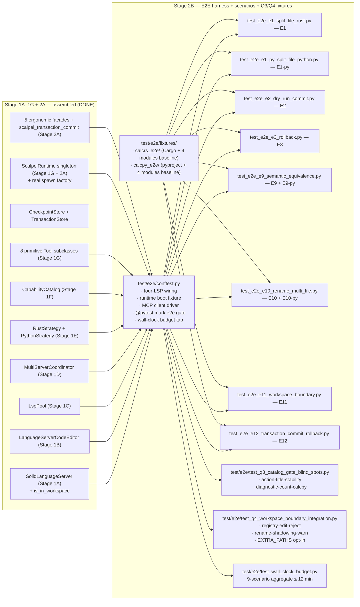
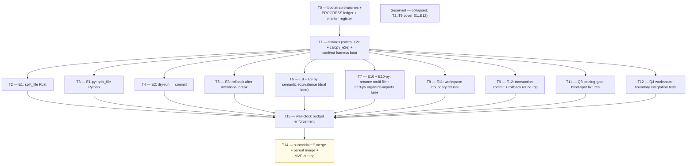

# Stage 2B — E2E Harness + 9 MVP E2E Scenarios + Q3/Q4 Fixtures Implementation Plan

> **For agentic workers:** REQUIRED SUB-SKILL: Use `superpowers:subagent-driven-development` (recommended) or `superpowers:executing-plans` to implement this plan task-by-task. Steps use checkbox (`- [ ]`) syntax for tracking.

**Goal:** Land the end-to-end harness (`vendor/serena/test/e2e/conftest.py`) that wires four real LSP processes (rust-analyzer + pylsp + basedpyright + ruff) into a `ScalpelRuntime` boot, plus the 9 MVP-blocking E2E scenarios (E1, E1-py, E2, E3, E9, E9-py, E10, E11, E12) that exercise the Stage 2A facades on real `calcrs` + `calcpy` fixtures, plus the Q3 catalog-gate-blind-spot fixtures (action-title-stability, diagnostic-count) and the Q4 workspace-boundary integration tests. Stage 2B is the **final stage before MVP cut**: when this plan exits green, the MVP success criteria of [scope-report §2](../../design/mvp/2026-04-24-mvp-scope-report.md#2-mvp-definition-single-falsifiable-sentence) and [§14.2 exit gate](../../design/mvp/2026-04-24-mvp-scope-report.md#142-stage-2-medium--top-decile-ergonomic-facades) are demonstrably satisfied.

**Architecture:**

**Tech Stack:** Python 3.11+ (submodule venv); `pytest` + `pytest-asyncio` (already on the venv since Stage 1A); the four real LSP binaries — `rust-analyzer` (pinned), `python-lsp-server[rope]>=1.12.0` + `pylsp-rope>=0.1.17`, `basedpyright==1.39.3`, `ruff>=0.6.0` (Stage 1E declared these as discovered-at-runtime); `cargo` on `PATH` for E1/E9 byte-identical assertions; CPython invokable as `python3` for E1-py/E9-py byte-identical `pytest -q` runs against the renamed fixture modules. **No new runtime production code lands in Stage 2B** — every facade and primitive already exists from Stages 1G + 2A. Stage 2B is exclusively test code + the harness scaffolding tests need.

**Source-of-truth references:**
- [`docs/design/mvp/2026-04-24-mvp-scope-report.md`](../../design/mvp/2026-04-24-mvp-scope-report.md) — §2 (MVP definition), §11 (multi-LSP coordination), §11.7 (four invariants), §11.8 (workspace boundary), §11.9 (confirmation-flow contract), §14.2 items 26–27b (Stage 2B scope), §15.1 (9 E2E scenarios), §15.4a (Q3 fixtures), §15.4b (Q4 tests), §16.4 (wall-clock budget = 4–8 min target / 12 min cap).
- [`docs/superpowers/plans/2026-04-24-mvp-execution-index.md`](2026-04-24-mvp-execution-index.md) — row 2B (line ~35).
- [`docs/superpowers/plans/2026-04-24-stage-2a-ergonomic-facades.md`](2026-04-24-stage-2a-ergonomic-facades.md) — Stage 2A facade signatures consumed here:
  - `ScalpelSplitFileTool.apply(file, groups, parent_layout, keep_in_original, reexport_policy, explicit_reexports, allow_partial, dry_run, preview_token, language, allow_out_of_workspace) -> str`
  - `ScalpelExtractTool.apply(file, range, name_path, target, new_name, visibility, similar, global_scope, dry_run, preview_token, language, allow_out_of_workspace) -> str`
  - `ScalpelInlineTool.apply(file, name_path, position, target, scope, remove_definition, dry_run, preview_token, language, allow_out_of_workspace) -> str`
  - `ScalpelRenameTool.apply(file, name_path, new_name, also_in_strings, dry_run, preview_token, language, allow_out_of_workspace) -> str`
  - `ScalpelImportsOrganizeTool.apply(files, add_missing, remove_unused, reorder, engine, dry_run, preview_token, language, allow_out_of_workspace) -> str`
  - `ScalpelTransactionCommitTool.apply(transaction_id) -> str`
- [`docs/superpowers/plans/2026-04-24-stage-1g-primitive-tools.md`](2026-04-24-stage-1g-primitive-tools.md) — primitives consumed: `ScalpelDryRunComposeTool.apply(steps) -> str` (returns `transaction_id`), `ScalpelRollbackTool.apply(checkpoint_id) -> str`, `ScalpelTransactionRollbackTool.apply(transaction_id) -> str`, `ScalpelWorkspaceHealthTool.apply() -> str`.
- [`docs/superpowers/plans/2026-04-24-stage-1f-capability-catalog.md`](2026-04-24-stage-1f-capability-catalog.md) — `ScalpelCapabilitiesListTool` for Q3 title-stability snapshot inputs.
- `vendor/serena/src/serena/refactoring/__init__.py` — `STRATEGY_REGISTRY`, `LspPool`, `MultiServerCoordinator`, `CapabilityCatalog` re-exports.
- `vendor/serena/src/serena/tools/scalpel_runtime.py` — `ScalpelRuntime.instance()`, `reset_for_testing()`.
- `vendor/serena/src/serena/tools/scalpel_schemas.py` — `RefactorResult`, `TransactionResult`, `FailureInfo`, `ErrorCode`, `DiagnosticsDelta`, `SemanticShiftWarning`.
- `vendor/serena/test/spikes/conftest.py` — current LSP boot conventions (`cfg = LanguageServerConfig(code_language=Language.RUST)`, `with srv.start_server():`).

---

## Scope check

Stage 2B is the verification layer that proves the Stage 2A facades + Stage 1A–1G substrate hold together end-to-end against real LSP processes on real fixture trees. Zero production code ships here. The plan is decomposed by *test artifact*: one task per E2E scenario or per Q3/Q4 group, plus T0 (harness boot) and the close-out task.

**In scope (this plan):**
1. `vendor/serena/test/e2e/conftest.py` — four-LSP wiring; `ScalpelRuntime` boot fixture (`scalpel_runtime`); per-language workspace fixtures (`calcrs_e2e_root`, `calcpy_e2e_root`); `mcp_driver` fixture exposing the 6 Stage 2A facades + `ScalpelRollbackTool` + `ScalpelTransactionRollbackTool` + `ScalpelDryRunComposeTool` + `ScalpelTransactionCommitTool` + `ScalpelCapabilitiesListTool` via direct `Tool.apply(...)` calls (the same in-process surface the MCP server exposes); `@pytest.mark.e2e` marker registration; opt-in gate via `O2_SCALPEL_RUN_E2E=1` or `pytest -m e2e`.
2. `vendor/serena/test/e2e/fixtures/calcrs_e2e/` — Rust workspace baseline: `Cargo.toml`, `src/lib.rs` (kitchen-sink with all four future-modules' symbols co-located), `tests/byte_identity_test.rs` (computes the post-split equivalence target).
3. `vendor/serena/test/e2e/fixtures/calcpy_e2e/` — Python workspace baseline: `pyproject.toml`, `calcpy/calcpy.py` (kitchen-sink with all four future-modules' symbols co-located + `__all__`), `tests/test_byte_identity.py`.
4. Nine E2E scenarios as separate test modules (T2..T10), each one self-contained: boots the harness, drives the relevant facade(s), asserts the post-state. **E9 covers both E9 and E9-py via dual-lane parametrization. E10 covers both E10 and E10-py.** E13-py (multi-server organize-imports merge) is included as an explicit lane inside T7 (E10-family) per scope-report §15.1 reconciliation.
5. Q3 catalog-gate-blind-spot fixtures (T11): `test_action_title_stability.py` + `test_diagnostic_count_calcpy.py`.
6. Q4 workspace-boundary integration tests (T12): `test_workspace_boundary_integration.py` (three sub-tests).
7. Wall-clock budget enforcement (T13): aggregate-time assertion that the `pytest -m e2e` run completes in ≤ 12 min; per-scenario soft-budget warnings logged.
8. Stage 2B close-out (T14): submodule ff-merge to `main`, parent merge to `develop`, MVP-cut tag.

**Out of scope (deferred):**
- E13-py (Multi-server organize-imports merge) as a *standalone* scenario per scope-report §15.1 — the merge-by-priority-and-dedup logic is unit-tested in Stage 1D `test_stage_1d_t6_merge_code_actions.py`; the cross-server runtime exercise rides inside the E10 family in T7 (organize-imports comparison branch) so the 9-scenario count holds.
- E4-py / E5-py / E8-py / E11-py / E13–E16 (Stage 3 / v0.2.0 — per scope-report §14.3).
- Marketplace publication (v1.1).
- Q3 `make check-deps-stale` Make target + CI nag (~50 LoC) — non-blocking; deferred to Stage 1I close-out per scope-report §14.2 row 27a footnote.
- Generator (`o2-scalpel-newplugin`) wiring — Stage 1J already shipped; Stage 2B does not invoke the generator.

## File structure

| # | Path (under `vendor/serena/`) | Change | LoC | Responsibility |
|---|---|---|---|---|
| 1 | `test/e2e/__init__.py` | New | 1 | Marks `test/e2e/` as a Python package so pytest discovers tests under it. |
| 2 | `test/e2e/conftest.py` | New | ~330 | E2E marker registration; opt-in env-var gate; four-LSP wiring; `scalpel_runtime` fixture; per-workspace `calcrs_e2e_root` / `calcpy_e2e_root` fixtures (copy fixture tree to per-test tmp dir); `mcp_driver` fixture exposing the 12 user-facing Tool subclasses; per-test cleanup via `runtime.reset_for_testing()`. |
| 3 | `test/e2e/fixtures/calcrs_e2e/Cargo.toml` | New | ~12 | Cargo manifest, single `[lib]` crate `calcrs_e2e`, no external deps. |
| 4 | `test/e2e/fixtures/calcrs_e2e/src/lib.rs` | New | ~140 | Kitchen-sink baseline: `mod ast { pub enum Expr {...} }`, `mod errors { pub enum CalcError {...} }`, `mod parser { pub fn parse(s: &str) -> Result<Expr, CalcError> {...} }`, `mod eval { pub fn eval(e: &Expr) -> i64 {...} }`, plus a top-level `pub use` re-export block — wired so the post-split file targets are derived by *moving* each `mod foo {...}` body into a new sibling file. |
| 5 | `test/e2e/fixtures/calcrs_e2e/tests/byte_identity_test.rs` | New | ~40 | `cargo test` baseline computing 2+3, 4*5, 100/4 — must stay byte-equivalent across split. |
| 6 | `test/e2e/fixtures/calcpy_e2e/pyproject.toml` | New | ~22 | PEP-621 manifest, package name `calcpy_e2e`, `[tool.pytest.ini_options]` test path. |
| 7 | `test/e2e/fixtures/calcpy_e2e/calcpy/__init__.py` | New | ~8 | `from .calcpy import *` + `__all__ = ["parse", "evaluate", "Expr", "CalcError"]`. |
| 8 | `test/e2e/fixtures/calcpy_e2e/calcpy/calcpy.py` | New | ~150 | Kitchen-sink baseline: `class Expr`, `class CalcError`, `def parse(...)`, `def evaluate(...)` co-located. |
| 9 | `test/e2e/fixtures/calcpy_e2e/tests/test_byte_identity.py` | New | ~35 | `pytest -q` baseline checking `parse + evaluate` round-trips on `2+3`, `4*5`, `100/4` — must stay byte-equivalent across split. |
| 10 | `test/e2e/test_e2e_e1_split_file_rust.py` | New | ~180 | Scenario E1 — happy-path 4-way Rust split + `cargo test` byte-identical. |
| 11 | `test/e2e/test_e2e_e1_py_split_file_python.py` | New | ~180 | Scenario E1-py — happy-path 4-way Python split + `pytest -q` byte-identical. |
| 12 | `test/e2e/test_e2e_e2_dry_run_commit.py` | New | ~150 | Scenario E2 — `dry_run=True` returns `WorkspaceEdit`; `dry_run=False` applies; `diagnostics_delta` matches between preview and apply. |
| 13 | `test/e2e/test_e2e_e3_rollback.py` | New | ~140 | Scenario E3 — apply, intentionally break, `scalpel_rollback(checkpoint_id)`, assert byte-identical pre-refactor tree. |
| 14 | `test/e2e/test_e2e_e9_semantic_equivalence.py` | New | ~190 | Scenario E9 + E9-py — dual-lane parametrize over (`rust`, `python`); pre/post-refactor `cargo test` / `pytest -q --doctest-modules` byte-identical. |
| 15 | `test/e2e/test_e2e_e10_rename_multi_file.py` | New | ~200 | Scenarios E10 + E10-py + E13-py organize-imports lane — multi-file rename byte-equivalent on `calcrs`; `__all__` preserved on `calcpy`; multi-server organize-imports surfaces exactly one action. |
| 16 | `test/e2e/test_e2e_e11_workspace_boundary.py` | New | ~120 | Scenario E11 — workspace-boundary refusal: `documentChanges` with a `~/.cargo/registry/...` path is rejected atomically with `OUT_OF_WORKSPACE_EDIT_BLOCKED`. |
| 17 | `test/e2e/test_e2e_e12_transaction_commit_rollback.py` | New | ~180 | Scenario E12 — `scalpel_dry_run_compose` → `scalpel_transaction_commit` → `scalpel_transaction_rollback` round-trip; per-step checkpoints; aggregated diagnostics-delta. |
| 18 | `test/e2e/test_q3_catalog_gate_blind_spots.py` | New | ~210 | Q3 fixtures — `test_action_title_stability` snapshots literal title strings basedpyright emits for the 4 MVP action kinds; `test_diagnostic_count_calcpy` asserts ≤ N diagnostics on baseline. |
| 19 | `test/e2e/test_q4_workspace_boundary_integration.py` | New | ~150 | Q4 — three sub-tests: registry-edit-reject, rename-shadowing-warn, `O2_SCALPEL_WORKSPACE_EXTRA_PATHS` opt-in. |
| 20 | `test/e2e/test_wall_clock_budget.py` | New | ~80 | Per-test wall-clock recorder + aggregate ≤ 12 min assertion (skipped unless `O2_SCALPEL_E2E_BUDGET_ASSERT=1`). |
| 21 | `pytest.ini` (or `vendor/serena/pyproject.toml [tool.pytest.ini_options]`) | Modify | +6 | Register the `e2e` marker so `-m e2e` selection works without `PytestUnknownMarkWarning`. |
| — | `docs/superpowers/plans/stage-2b-results/PROGRESS.md` | New | — | Per-task ledger (entry SHA, exit SHA, outcome, follow-ups). |

**LoC budget (test code):** 1 + 330 + 12 + 140 + 40 + 22 + 8 + 150 + 35 + 180 + 180 + 150 + 140 + 190 + 200 + 120 + 180 + 210 + 150 + 80 + 6 = **~2,524 LoC**, of which fixtures account for ~407 LoC (rows 3–9) and harness/marker register account for ~336 LoC (rows 1, 2, 21). Pure E2E scenario tests are ~1,560 LoC; Q3+Q4+budget tests are ~440 LoC. Aligned with scope-report §14.2 budget of ~1,520 logic LoC for items 26 + 27 + 27a + 27b (the scope-report figure excluded fixtures and the budget guard, which Stage 2B treats as harness components).

## Dependency graph

T0 is bootstrap. T1 (harness + fixtures) gates everything below. T2..T9 are independent E2E scenarios that fan out in parallel (subject to CPU limit; CLAUDE.md caps parallel ≤ cores, so on an 8-core machine the eight scenarios all schedule). T11 and T12 are independent of T2..T9. T13 fans in across all scenarios + Q3 + Q4. T14 is the merge gate.

## Conventions enforced (from Phase 0 + Stage 1A–2A)

- **Submodule git-flow**: feature branch `feature/stage-2b-e2e-harness-scenarios` opened in both parent and `vendor/serena` submodule (T0 verifies). ff-merge to `main` at T14; parent bumps pointer; parent merges feature branch to `develop`.
- **Author**: AI Hive(R) on every commit; never "Claude". Trailer: `Co-Authored-By: AI Hive(R) <noreply@o2.services>`.
- **Field name `code_language=`** on `LanguageServerConfig` (verified at `vendor/serena/src/solidlsp/ls_config.py:596`).
- **`with srv.start_server():`** sync context manager from `vendor/serena/src/solidlsp/ls.py:717` for any boot-real-LSP test (only used inside T1 harness; scenario tests acquire via `LspPool` through the runtime fixture).
- **`runtime.reset_for_testing()`** in every `mcp_driver` fixture teardown — required to avoid singleton state bleed (per `scalpel_runtime.py:81`).
- **PROGRESS.md updates as separate commits**, never `--amend`. Each task ends in two commits: code commit (in submodule) + ledger update (in parent).
- **Test command**: from `vendor/serena/`, run `PATH="$(pwd)/.venv/bin:$PATH" .venv/bin/pytest test/e2e/<module> -v -m e2e` after exporting `O2_SCALPEL_RUN_E2E=1`.
- **`@pytest.mark.e2e`** on every scenario test function. Tests are *opt-in*; `pytest test/spikes/` (default invocation) does not collect them.
- **`pytest-asyncio`** is on the venv (Stage 1A confirmed). Scenarios that touch `MultiServerCoordinator` directly use `@pytest.mark.asyncio` and `async def`; scenarios that go through Tool subclasses (the dominant path) stay sync because `Tool.apply` is sync.
- **Type hints + pydantic v2** at every test boundary; deserialize the JSON Tool result with `RefactorResult.model_validate_json(result_json)`.
- **`Path.expanduser().resolve(strict=False)`** for canonicalisation in fixture-copy code.
- **`shutil.copytree`** with `dirs_exist_ok=False` for per-test workspace cloning; never share a workspace between two tests.
- **No real-LSP boot inside scenario tests**; the LSP children are spawned by the `LspPool` inside the `scalpel_runtime` session-scoped fixture and reused across all scenarios within one `pytest -m e2e` run. Each scenario gets its own per-test workspace clone (so cargo / pytest see clean trees) but shares the LSP processes (so cold-start cost is paid once, not nine times).
- **`O2_SCALPEL_RUN_E2E=1`** required to run E2E suite; absence of the env var causes pytest to skip every `e2e`-marked test with reason `"e2e suite gated; set O2_SCALPEL_RUN_E2E=1"`. CI sets it; local default does not.
- **Wall-clock budget**: T13 asserts aggregate ≤ 12 min on CI runner (per scope-report §16.4 cap of 12 min). Per-scenario soft budgets are 4–8 min for E1/E1-py/E9/E9-py (LSP-cold-start dominated) and 30 s–2 min for the others.
- **Cargo / pytest binary discovery**: `shutil.which("cargo")` and `shutil.which("python3")` at conftest collection; missing binary → entire E2E suite skipped with a clear reason.

## Progress ledger

A new ledger `docs/superpowers/plans/stage-2b-results/PROGRESS.md` is created in T0. Schema mirrors Stage 2A:

| Task | Branch SHA (submodule) | Outcome | Follow-ups |
|---|---|---|---|
| T0 | … | … | … |

Updated as a separate parent commit after each task completes.

---
