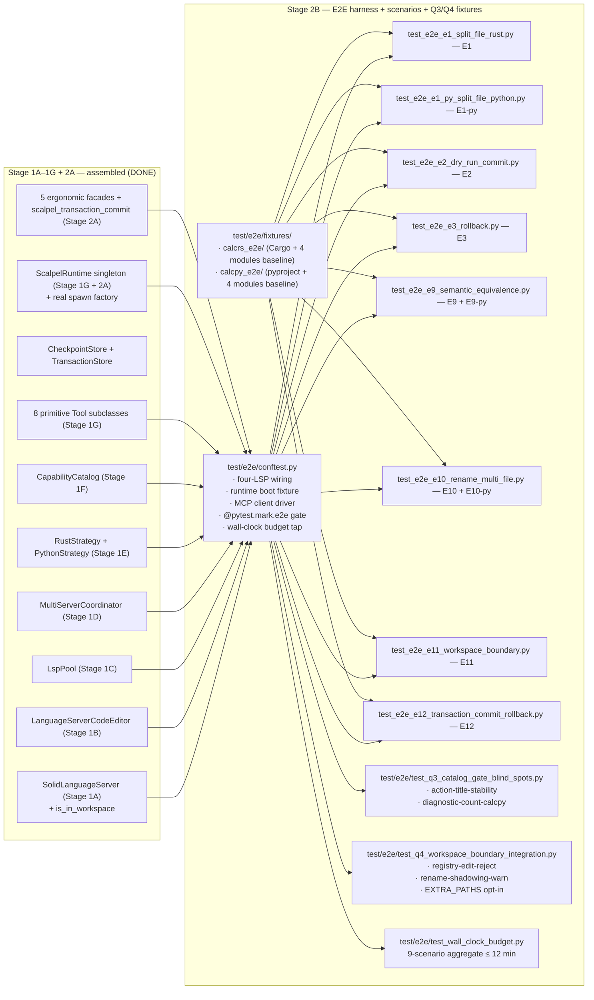
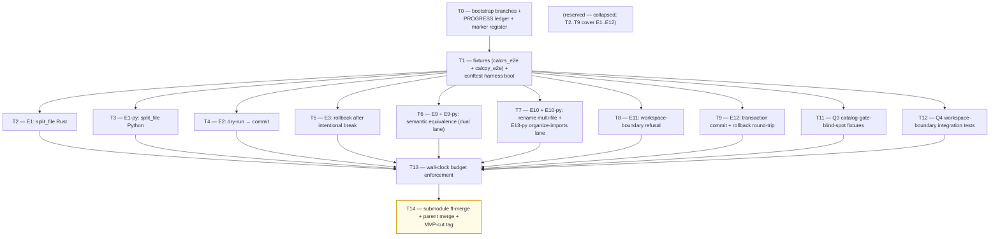

# Stage 2B — E2E Harness + 9 MVP E2E Scenarios + Q3/Q4 Fixtures Implementation Plan

> **For agentic workers:** REQUIRED SUB-SKILL: Use `superpowers:subagent-driven-development` (recommended) or `superpowers:executing-plans` to implement this plan task-by-task. Steps use checkbox (`- [ ]`) syntax for tracking.

**Goal:** Land the end-to-end harness (`vendor/serena/test/e2e/conftest.py`) that wires four real LSP processes (rust-analyzer + pylsp + basedpyright + ruff) into a `ScalpelRuntime` boot, plus the 9 MVP-blocking E2E scenarios (E1, E1-py, E2, E3, E9, E9-py, E10, E11, E12) that exercise the Stage 2A facades on real `calcrs` + `calcpy` fixtures, plus the Q3 catalog-gate-blind-spot fixtures (action-title-stability, diagnostic-count) and the Q4 workspace-boundary integration tests. Stage 2B is the **final stage before MVP cut**: when this plan exits green, the MVP success criteria of [scope-report §2](../../design/mvp/2026-04-24-mvp-scope-report.md#2-mvp-definition-single-falsifiable-sentence) and [§14.2 exit gate](../../design/mvp/2026-04-24-mvp-scope-report.md#142-stage-2-medium--top-decile-ergonomic-facades) are demonstrably satisfied.

**Architecture:**



**Tech Stack:** Python 3.11+ (submodule venv); `pytest` + `pytest-asyncio` (already on the venv since Stage 1A); the four real LSP binaries — `rust-analyzer` (pinned), `python-lsp-server[rope]>=1.12.0` + `pylsp-rope>=0.1.17`, `basedpyright==1.39.3`, `ruff>=0.6.0` (Stage 1E declared these as discovered-at-runtime); `cargo` on `PATH` for E1/E9 byte-identical assertions; CPython invokable as `python3` for E1-py/E9-py byte-identical `pytest -q` runs against the renamed fixture modules. **No new runtime production code lands in Stage 2B** — every facade and primitive already exists from Stages 1G + 2A. Stage 2B is exclusively test code + the harness scaffolding tests need.

**Source-of-truth references:**
- [`docs/design/mvp/2026-04-24-mvp-scope-report.md`](../../design/mvp/2026-04-24-mvp-scope-report.md) — §2 (MVP definition), §11 (multi-LSP coordination), §11.7 (four invariants), §11.8 (workspace boundary), §11.9 (confirmation-flow contract), §14.2 items 26–27b (Stage 2B scope), §15.1 (9 E2E scenarios), §15.4a (Q3 fixtures), §15.4b (Q4 tests), §16.4 (wall-clock budget = 4–8 min target / 12 min cap).
- [`docs/superpowers/plans/2026-04-24-mvp-execution-index.md`](2026-04-24-mvp-execution-index.md) — row 2B (line ~35).
- [`docs/superpowers/plans/2026-04-24-stage-2a-ergonomic-facades.md`](2026-04-24-stage-2a-ergonomic-facades.md) — Stage 2A facade signatures consumed here:
  - `ScalpelSplitFileTool.apply(file, groups, parent_layout, keep_in_original, reexport_policy, explicit_reexports, allow_partial, dry_run, preview_token, language, allow_out_of_workspace) -> str`
  - `ScalpelExtractTool.apply(file, range, name_path, target, new_name, visibility, similar, global_scope, dry_run, preview_token, language, allow_out_of_workspace) -> str`
  - `ScalpelInlineTool.apply(file, name_path, position, target, scope, remove_definition, dry_run, preview_token, language, allow_out_of_workspace) -> str`
  - `ScalpelRenameTool.apply(file, name_path, new_name, also_in_strings, dry_run, preview_token, language, allow_out_of_workspace) -> str`
  - `ScalpelImportsOrganizeTool.apply(files, add_missing, remove_unused, reorder, engine, dry_run, preview_token, language, allow_out_of_workspace) -> str`
  - `ScalpelTransactionCommitTool.apply(transaction_id) -> str`
- [`docs/superpowers/plans/2026-04-24-stage-1g-primitive-tools.md`](2026-04-24-stage-1g-primitive-tools.md) — primitives consumed: `ScalpelDryRunComposeTool.apply(steps) -> str` (returns `transaction_id`), `ScalpelRollbackTool.apply(checkpoint_id) -> str`, `ScalpelTransactionRollbackTool.apply(transaction_id) -> str`, `ScalpelWorkspaceHealthTool.apply() -> str`.
- [`docs/superpowers/plans/2026-04-24-stage-1f-capability-catalog.md`](2026-04-24-stage-1f-capability-catalog.md) — `ScalpelCapabilitiesListTool` for Q3 title-stability snapshot inputs.
- `vendor/serena/src/serena/refactoring/__init__.py` — `STRATEGY_REGISTRY`, `LspPool`, `MultiServerCoordinator`, `CapabilityCatalog` re-exports.
- `vendor/serena/src/serena/tools/scalpel_runtime.py` — `ScalpelRuntime.instance()`, `reset_for_testing()`.
- `vendor/serena/src/serena/tools/scalpel_schemas.py` — `RefactorResult`, `TransactionResult`, `FailureInfo`, `ErrorCode`, `DiagnosticsDelta`, `SemanticShiftWarning`.
- `vendor/serena/test/spikes/conftest.py` — current LSP boot conventions (`cfg = LanguageServerConfig(code_language=Language.RUST)`, `with srv.start_server():`).

---

## Scope check

Stage 2B is the verification layer that proves the Stage 2A facades + Stage 1A–1G substrate hold together end-to-end against real LSP processes on real fixture trees. Zero production code ships here. The plan is decomposed by *test artifact*: one task per E2E scenario or per Q3/Q4 group, plus T0 (harness boot) and the close-out task.

**In scope (this plan):**
1. `vendor/serena/test/e2e/conftest.py` — four-LSP wiring; `ScalpelRuntime` boot fixture (`scalpel_runtime`); per-language workspace fixtures (`calcrs_e2e_root`, `calcpy_e2e_root`); `mcp_driver` fixture exposing the 6 Stage 2A facades + `ScalpelRollbackTool` + `ScalpelTransactionRollbackTool` + `ScalpelDryRunComposeTool` + `ScalpelTransactionCommitTool` + `ScalpelCapabilitiesListTool` via direct `Tool.apply(...)` calls (the same in-process surface the MCP server exposes); `@pytest.mark.e2e` marker registration; opt-in gate via `O2_SCALPEL_RUN_E2E=1` or `pytest -m e2e`.
2. `vendor/serena/test/e2e/fixtures/calcrs_e2e/` — Rust workspace baseline: `Cargo.toml`, `src/lib.rs` (kitchen-sink with all four future-modules' symbols co-located), `tests/byte_identity_test.rs` (computes the post-split equivalence target).
3. `vendor/serena/test/e2e/fixtures/calcpy_e2e/` — Python workspace baseline: `pyproject.toml`, `calcpy/calcpy.py` (kitchen-sink with all four future-modules' symbols co-located + `__all__`), `tests/test_byte_identity.py`.
4. Nine E2E scenarios as separate test modules (T2..T10), each one self-contained: boots the harness, drives the relevant facade(s), asserts the post-state. **E9 covers both E9 and E9-py via dual-lane parametrization. E10 covers both E10 and E10-py.** E13-py (multi-server organize-imports merge) is included as an explicit lane inside T7 (E10-family) per scope-report §15.1 reconciliation.
5. Q3 catalog-gate-blind-spot fixtures (T11): `test_action_title_stability.py` + `test_diagnostic_count_calcpy.py`.
6. Q4 workspace-boundary integration tests (T12): `test_workspace_boundary_integration.py` (three sub-tests).
7. Wall-clock budget enforcement (T13): aggregate-time assertion that the `pytest -m e2e` run completes in ≤ 12 min; per-scenario soft-budget warnings logged.
8. Stage 2B close-out (T14): submodule ff-merge to `main`, parent merge to `develop`, MVP-cut tag.

**Out of scope (deferred):**
- E13-py (Multi-server organize-imports merge) as a *standalone* scenario per scope-report §15.1 — the merge-by-priority-and-dedup logic is unit-tested in Stage 1D `test_stage_1d_t6_merge_code_actions.py`; the cross-server runtime exercise rides inside the E10 family in T7 (organize-imports comparison branch) so the 9-scenario count holds.
- E4-py / E5-py / E8-py / E11-py / E13–E16 (Stage 3 / v0.2.0 — per scope-report §14.3).
- Marketplace publication (v1.1).
- Q3 `make check-deps-stale` Make target + CI nag (~50 LoC) — non-blocking; deferred to Stage 1I close-out per scope-report §14.2 row 27a footnote.
- Generator (`o2-scalpel-newplugin`) wiring — Stage 1J already shipped; Stage 2B does not invoke the generator.

## File structure

| # | Path (under `vendor/serena/`) | Change | LoC | Responsibility |
|---|---|---|---|---|
| 1 | `test/e2e/__init__.py` | New | 1 | Marks `test/e2e/` as a Python package so pytest discovers tests under it. |
| 2 | `test/e2e/conftest.py` | New | ~330 | E2E marker registration; opt-in env-var gate; four-LSP wiring; `scalpel_runtime` fixture; per-workspace `calcrs_e2e_root` / `calcpy_e2e_root` fixtures (copy fixture tree to per-test tmp dir); `mcp_driver` fixture exposing the 12 user-facing Tool subclasses; per-test cleanup via `runtime.reset_for_testing()`. |
| 3 | `test/e2e/fixtures/calcrs_e2e/Cargo.toml` | New | ~12 | Cargo manifest, single `[lib]` crate `calcrs_e2e`, no external deps. |
| 4 | `test/e2e/fixtures/calcrs_e2e/src/lib.rs` | New | ~140 | Kitchen-sink baseline: `mod ast { pub enum Expr {...} }`, `mod errors { pub enum CalcError {...} }`, `mod parser { pub fn parse(s: &str) -> Result<Expr, CalcError> {...} }`, `mod eval { pub fn eval(e: &Expr) -> i64 {...} }`, plus a top-level `pub use` re-export block — wired so the post-split file targets are derived by *moving* each `mod foo {...}` body into a new sibling file. |
| 5 | `test/e2e/fixtures/calcrs_e2e/tests/byte_identity_test.rs` | New | ~40 | `cargo test` baseline computing 2+3, 4*5, 100/4 — must stay byte-equivalent across split. |
| 6 | `test/e2e/fixtures/calcpy_e2e/pyproject.toml` | New | ~22 | PEP-621 manifest, package name `calcpy_e2e`, `[tool.pytest.ini_options]` test path. |
| 7 | `test/e2e/fixtures/calcpy_e2e/calcpy/__init__.py` | New | ~8 | `from .calcpy import *` + `__all__ = ["parse", "evaluate", "Expr", "CalcError"]`. |
| 8 | `test/e2e/fixtures/calcpy_e2e/calcpy/calcpy.py` | New | ~150 | Kitchen-sink baseline: `class Expr`, `class CalcError`, `def parse(...)`, `def evaluate(...)` co-located. |
| 9 | `test/e2e/fixtures/calcpy_e2e/tests/test_byte_identity.py` | New | ~35 | `pytest -q` baseline checking `parse + evaluate` round-trips on `2+3`, `4*5`, `100/4` — must stay byte-equivalent across split. |
| 10 | `test/e2e/test_e2e_e1_split_file_rust.py` | New | ~180 | Scenario E1 — happy-path 4-way Rust split + `cargo test` byte-identical. |
| 11 | `test/e2e/test_e2e_e1_py_split_file_python.py` | New | ~180 | Scenario E1-py — happy-path 4-way Python split + `pytest -q` byte-identical. |
| 12 | `test/e2e/test_e2e_e2_dry_run_commit.py` | New | ~150 | Scenario E2 — `dry_run=True` returns `WorkspaceEdit`; `dry_run=False` applies; `diagnostics_delta` matches between preview and apply. |
| 13 | `test/e2e/test_e2e_e3_rollback.py` | New | ~140 | Scenario E3 — apply, intentionally break, `scalpel_rollback(checkpoint_id)`, assert byte-identical pre-refactor tree. |
| 14 | `test/e2e/test_e2e_e9_semantic_equivalence.py` | New | ~190 | Scenario E9 + E9-py — dual-lane parametrize over (`rust`, `python`); pre/post-refactor `cargo test` / `pytest -q --doctest-modules` byte-identical. |
| 15 | `test/e2e/test_e2e_e10_rename_multi_file.py` | New | ~200 | Scenarios E10 + E10-py + E13-py organize-imports lane — multi-file rename byte-equivalent on `calcrs`; `__all__` preserved on `calcpy`; multi-server organize-imports surfaces exactly one action. |
| 16 | `test/e2e/test_e2e_e11_workspace_boundary.py` | New | ~120 | Scenario E11 — workspace-boundary refusal: `documentChanges` with a `~/.cargo/registry/...` path is rejected atomically with `OUT_OF_WORKSPACE_EDIT_BLOCKED`. |
| 17 | `test/e2e/test_e2e_e12_transaction_commit_rollback.py` | New | ~180 | Scenario E12 — `scalpel_dry_run_compose` → `scalpel_transaction_commit` → `scalpel_transaction_rollback` round-trip; per-step checkpoints; aggregated diagnostics-delta. |
| 18 | `test/e2e/test_q3_catalog_gate_blind_spots.py` | New | ~210 | Q3 fixtures — `test_action_title_stability` snapshots literal title strings basedpyright emits for the 4 MVP action kinds; `test_diagnostic_count_calcpy` asserts ≤ N diagnostics on baseline. |
| 19 | `test/e2e/test_q4_workspace_boundary_integration.py` | New | ~150 | Q4 — three sub-tests: registry-edit-reject, rename-shadowing-warn, `O2_SCALPEL_WORKSPACE_EXTRA_PATHS` opt-in. |
| 20 | `test/e2e/test_wall_clock_budget.py` | New | ~80 | Per-test wall-clock recorder + aggregate ≤ 12 min assertion (skipped unless `O2_SCALPEL_E2E_BUDGET_ASSERT=1`). |
| 21 | `pytest.ini` (or `vendor/serena/pyproject.toml [tool.pytest.ini_options]`) | Modify | +6 | Register the `e2e` marker so `-m e2e` selection works without `PytestUnknownMarkWarning`. |
| — | `docs/superpowers/plans/stage-2b-results/PROGRESS.md` | New | — | Per-task ledger (entry SHA, exit SHA, outcome, follow-ups). |

**LoC budget (test code):** 1 + 330 + 12 + 140 + 40 + 22 + 8 + 150 + 35 + 180 + 180 + 150 + 140 + 190 + 200 + 120 + 180 + 210 + 150 + 80 + 6 = **~2,524 LoC**, of which fixtures account for ~407 LoC (rows 3–9) and harness/marker register account for ~336 LoC (rows 1, 2, 21). Pure E2E scenario tests are ~1,560 LoC; Q3+Q4+budget tests are ~440 LoC. Aligned with scope-report §14.2 budget of ~1,520 logic LoC for items 26 + 27 + 27a + 27b (the scope-report figure excluded fixtures and the budget guard, which Stage 2B treats as harness components).

## Dependency graph



T0 is bootstrap. T1 (harness + fixtures) gates everything below. T2..T9 are independent E2E scenarios that fan out in parallel (subject to CPU limit; CLAUDE.md caps parallel ≤ cores, so on an 8-core machine the eight scenarios all schedule). T11 and T12 are independent of T2..T9. T13 fans in across all scenarios + Q3 + Q4. T14 is the merge gate.

## Conventions enforced (from Phase 0 + Stage 1A–2A)

- **Submodule git-flow**: feature branch `feature/stage-2b-e2e-harness-scenarios` opened in both parent and `vendor/serena` submodule (T0 verifies). ff-merge to `main` at T14; parent bumps pointer; parent merges feature branch to `develop`.
- **Author**: AI Hive(R) on every commit; never "Claude". Trailer: `Co-Authored-By: AI Hive(R) <noreply@o2.services>`.
- **Field name `code_language=`** on `LanguageServerConfig` (verified at `vendor/serena/src/solidlsp/ls_config.py:596`).
- **`with srv.start_server():`** sync context manager from `vendor/serena/src/solidlsp/ls.py:717` for any boot-real-LSP test (only used inside T1 harness; scenario tests acquire via `LspPool` through the runtime fixture).
- **`runtime.reset_for_testing()`** in every `mcp_driver` fixture teardown — required to avoid singleton state bleed (per `scalpel_runtime.py:81`).
- **PROGRESS.md updates as separate commits**, never `--amend`. Each task ends in two commits: code commit (in submodule) + ledger update (in parent).
- **Test command**: from `vendor/serena/`, run `PATH="$(pwd)/.venv/bin:$PATH" .venv/bin/pytest test/e2e/<module> -v -m e2e` after exporting `O2_SCALPEL_RUN_E2E=1`.
- **`@pytest.mark.e2e`** on every scenario test function. Tests are *opt-in*; `pytest test/spikes/` (default invocation) does not collect them.
- **`pytest-asyncio`** is on the venv (Stage 1A confirmed). Scenarios that touch `MultiServerCoordinator` directly use `@pytest.mark.asyncio` and `async def`; scenarios that go through Tool subclasses (the dominant path) stay sync because `Tool.apply` is sync.
- **Type hints + pydantic v2** at every test boundary; deserialize the JSON Tool result with `RefactorResult.model_validate_json(result_json)`.
- **`Path.expanduser().resolve(strict=False)`** for canonicalisation in fixture-copy code.
- **`shutil.copytree`** with `dirs_exist_ok=False` for per-test workspace cloning; never share a workspace between two tests.
- **No real-LSP boot inside scenario tests**; the LSP children are spawned by the `LspPool` inside the `scalpel_runtime` session-scoped fixture and reused across all scenarios within one `pytest -m e2e` run. Each scenario gets its own per-test workspace clone (so cargo / pytest see clean trees) but shares the LSP processes (so cold-start cost is paid once, not nine times).
- **`O2_SCALPEL_RUN_E2E=1`** required to run E2E suite; absence of the env var causes pytest to skip every `e2e`-marked test with reason `"e2e suite gated; set O2_SCALPEL_RUN_E2E=1"`. CI sets it; local default does not.
- **Wall-clock budget**: T13 asserts aggregate ≤ 12 min on CI runner (per scope-report §16.4 cap of 12 min). Per-scenario soft budgets are 4–8 min for E1/E1-py/E9/E9-py (LSP-cold-start dominated) and 30 s–2 min for the others.
- **Cargo / pytest binary discovery**: `shutil.which("cargo")` and `shutil.which("python3")` at conftest collection; missing binary → entire E2E suite skipped with a clear reason.

## Progress ledger

A new ledger `docs/superpowers/plans/stage-2b-results/PROGRESS.md` is created in T0. Schema mirrors Stage 2A:

| Task | Branch SHA (submodule) | Outcome | Follow-ups |
|---|---|---|---|
| T0 | … | … | … |

Updated as a separate parent commit after each task completes.

---

### Task 0: Bootstrap branches + PROGRESS ledger + `e2e` marker register

**Files:**
- Create: `docs/superpowers/plans/stage-2b-results/PROGRESS.md`
- Modify: `vendor/serena/pyproject.toml` (`[tool.pytest.ini_options]` markers list, append `e2e`).
- Verify: parent + submodule both on `feature/stage-2b-e2e-harness-scenarios`.

- [ ] **Step 1: Open submodule feature branch off `main`**

Run:
```bash
cd /Volumes/Unitek-B/Projects/o2-scalpel/vendor/serena
git fetch origin
git checkout -B feature/stage-2b-e2e-harness-scenarios origin/main
git rev-parse HEAD
```

Expected: HEAD points at the Stage 2A ff-merge tip on `origin/main` (the SHA tagged `stage-2a-ergonomic-facades-complete`). Capture this SHA as the Stage 2B entry SHA in PROGRESS step 7. If `origin/main` is not the latest Stage 2A tip, abort and reconcile manually — Stage 2B must be built on the ergonomic facades + real spawn factory.

- [ ] **Step 2: Open parent feature branch off `develop`**

Run:
```bash
cd /Volumes/Unitek-B/Projects/o2-scalpel
git fetch origin
git checkout -B feature/stage-2b-e2e-harness-scenarios origin/develop
git rev-parse HEAD
```

Expected: HEAD points at `origin/develop` tip with the Stage 2A merge already present.

- [ ] **Step 3: Confirm Stage 2A facade tools are importable**

Run:
```bash
cd /Volumes/Unitek-B/Projects/o2-scalpel/vendor/serena
PATH="$(pwd)/.venv/bin:$PATH" .venv/bin/python -c "from serena.tools.scalpel_facades import (
    ScalpelSplitFileTool, ScalpelExtractTool, ScalpelInlineTool,
    ScalpelRenameTool, ScalpelImportsOrganizeTool, ScalpelTransactionCommitTool,
)
print('OK')"
```

Expected: `OK`. If `ImportError`, Stage 2A merge did not land — abort and re-run Stage 2A close-out.

- [ ] **Step 4: Confirm Stage 1G primitives are importable**

Run:
```bash
cd /Volumes/Unitek-B/Projects/o2-scalpel/vendor/serena
PATH="$(pwd)/.venv/bin:$PATH" .venv/bin/python -c "from serena.tools.scalpel_primitives import (
    ScalpelDryRunComposeTool, ScalpelRollbackTool, ScalpelTransactionRollbackTool,
    ScalpelWorkspaceHealthTool, ScalpelCapabilitiesListTool,
)
print('OK')"
```

Expected: `OK`.

- [ ] **Step 5: Register the `e2e` marker in `pyproject.toml`**

Open `vendor/serena/pyproject.toml`. Locate the `[tool.pytest.ini_options]` table. Append `"e2e: end-to-end test against real LSP processes; opt-in via O2_SCALPEL_RUN_E2E=1 or pytest -m e2e"` to the `markers` list. If no `markers` list exists, add it:

```toml
[tool.pytest.ini_options]
asyncio_mode = "auto"
markers = [
    "e2e: end-to-end test against real LSP processes; opt-in via O2_SCALPEL_RUN_E2E=1 or pytest -m e2e",
]
```

If `markers` already exists with other entries (Stage 1A added some), append the `e2e` row preserving the existing rows.

- [ ] **Step 6: Verify the marker registration**

Run:
```bash
cd /Volumes/Unitek-B/Projects/o2-scalpel/vendor/serena
PATH="$(pwd)/.venv/bin:$PATH" .venv/bin/pytest --markers 2>&1 | grep "e2e:"
```

Expected: one line containing `@pytest.mark.e2e: end-to-end test against real LSP processes; opt-in via O2_SCALPEL_RUN_E2E=1 or pytest -m e2e`.

- [ ] **Step 7: Create the PROGRESS ledger**

Create `/Volumes/Unitek-B/Projects/o2-scalpel/docs/superpowers/plans/stage-2b-results/PROGRESS.md` with the following content (substitute the captured SHAs for `<step-1 SHA>` / `<step-2 SHA>`):

```markdown
# Stage 2B — E2E Harness + 9 MVP Scenarios + Q3/Q4 Fixtures — PROGRESS

| Task | Branch SHA (submodule) | Outcome | Follow-ups |
|---|---|---|---|
| T0 | <step-1 SHA> | OPEN | bootstrap |
| T1 | | | |
| T2 | | | |
| T3 | | | |
| T4 | | | |
| T5 | | | |
| T6 | | | |
| T7 | | | |
| T8 | | | |
| T9 | | | |
| T11 | | | |
| T12 | | | |
| T13 | | | |
| T14 | | | |

## Entry baseline

- Submodule branch: `feature/stage-2b-e2e-harness-scenarios` from `origin/main` @ <step-1 SHA>
- Parent branch: `feature/stage-2b-e2e-harness-scenarios` from `origin/develop` @ <step-2 SHA>
- Stage 2A exit tag: `stage-2a-ergonomic-facades-complete`
- Test baseline (run BEFORE any Stage 2B code): `pytest test/spikes/ -v` should be the Stage 2A green count with 0 failures, 0 errors. Capture exact count in PROGRESS T0 row Follow-ups.

## E2E run command

```bash
cd vendor/serena
O2_SCALPEL_RUN_E2E=1 PATH="$(pwd)/.venv/bin:$PATH" .venv/bin/pytest test/e2e/ -v -m e2e
```

Wall-clock budget: aggregate ≤ 12 min (scope-report §16.4 cap).
```

- [ ] **Step 8: Commit the bootstrap (submodule)**

Run from `vendor/serena/`:
```bash
git add pyproject.toml
git commit -m "test(stage-2b): register e2e pytest marker

Co-Authored-By: AI Hive(R) <noreply@o2.services>"
git rev-parse HEAD
```

Capture SHA → record as T0 exit SHA in PROGRESS.

- [ ] **Step 9: Commit the bootstrap (parent)**

Run from repo root:
```bash
cd /Volumes/Unitek-B/Projects/o2-scalpel
git add docs/superpowers/plans/stage-2b-results/PROGRESS.md vendor/serena
git commit -m "chore(stage-2b): T0 bootstrap — PROGRESS ledger + submodule pointer (e2e marker)

Co-Authored-By: AI Hive(R) <noreply@o2.services>"
```

Update PROGRESS T0 row to `OUTCOME=DONE` in a follow-up commit.

---

### Task 1: Fixtures (`calcrs_e2e` + `calcpy_e2e`) + `conftest.py` harness boot

**Files:**
- Create: `vendor/serena/test/e2e/__init__.py`
- Create: `vendor/serena/test/e2e/conftest.py`
- Create: `vendor/serena/test/e2e/fixtures/calcrs_e2e/Cargo.toml`
- Create: `vendor/serena/test/e2e/fixtures/calcrs_e2e/src/lib.rs`
- Create: `vendor/serena/test/e2e/fixtures/calcrs_e2e/tests/byte_identity_test.rs`
- Create: `vendor/serena/test/e2e/fixtures/calcpy_e2e/pyproject.toml`
- Create: `vendor/serena/test/e2e/fixtures/calcpy_e2e/calcpy/__init__.py`
- Create: `vendor/serena/test/e2e/fixtures/calcpy_e2e/calcpy/calcpy.py`
- Create: `vendor/serena/test/e2e/fixtures/calcpy_e2e/tests/test_byte_identity.py`
- Create: `vendor/serena/test/e2e/test_e2e_harness_smoke.py` (T1's TDD test)

- [ ] **Step 1: Create the package marker**

Write `vendor/serena/test/e2e/__init__.py`:

```python
"""End-to-end test suite — opt-in via O2_SCALPEL_RUN_E2E=1 or pytest -m e2e."""
```

- [ ] **Step 2: Write the Rust fixture — `Cargo.toml`**

Write `vendor/serena/test/e2e/fixtures/calcrs_e2e/Cargo.toml`:

```toml
[package]
name = "calcrs_e2e"
version = "0.1.0"
edition = "2021"
publish = false

[lib]
name = "calcrs_e2e"
path = "src/lib.rs"
```

- [ ] **Step 3: Write the Rust fixture — `src/lib.rs` (kitchen-sink baseline)**

Write `vendor/serena/test/e2e/fixtures/calcrs_e2e/src/lib.rs`:

```rust
//! calcrs_e2e — kitchen-sink baseline used by Stage 2B E2E scenarios.
//!
//! The four `mod` blocks below (`ast`, `errors`, `parser`, `eval`) are co-located
//! here so the E1 4-way split scenario can move each `mod foo {...}` body into
//! a sibling file (`src/ast.rs`, `src/errors.rs`, etc.) and the post-split
//! `cargo test` continues to pass byte-identically against the baseline below.

pub mod ast {
    #[derive(Clone, Debug, PartialEq, Eq)]
    pub enum Expr {
        Num(i64),
        Add(Box<Expr>, Box<Expr>),
        Sub(Box<Expr>, Box<Expr>),
        Mul(Box<Expr>, Box<Expr>),
        Div(Box<Expr>, Box<Expr>),
    }
}

pub mod errors {
    #[derive(Debug, PartialEq, Eq)]
    pub enum CalcError {
        ParseError(String),
        DivisionByZero,
    }
}

pub mod parser {
    use super::ast::Expr;
    use super::errors::CalcError;

    pub fn parse(input: &str) -> Result<Expr, CalcError> {
        let s = input.trim();
        if let Some(idx) = s.rfind('+') {
            let l = parse(&s[..idx])?;
            let r = parse(&s[idx + 1..])?;
            return Ok(Expr::Add(Box::new(l), Box::new(r)));
        }
        if let Some(idx) = s.rfind('-') {
            if idx > 0 {
                let l = parse(&s[..idx])?;
                let r = parse(&s[idx + 1..])?;
                return Ok(Expr::Sub(Box::new(l), Box::new(r)));
            }
        }
        if let Some(idx) = s.rfind('*') {
            let l = parse(&s[..idx])?;
            let r = parse(&s[idx + 1..])?;
            return Ok(Expr::Mul(Box::new(l), Box::new(r)));
        }
        if let Some(idx) = s.rfind('/') {
            let l = parse(&s[..idx])?;
            let r = parse(&s[idx + 1..])?;
            return Ok(Expr::Div(Box::new(l), Box::new(r)));
        }
        s.parse::<i64>()
            .map(Expr::Num)
            .map_err(|e| CalcError::ParseError(e.to_string()))
    }
}

pub mod eval {
    use super::ast::Expr;
    use super::errors::CalcError;

    pub fn eval(expr: &Expr) -> Result<i64, CalcError> {
        match expr {
            Expr::Num(n) => Ok(*n),
            Expr::Add(l, r) => Ok(eval(l)? + eval(r)?),
            Expr::Sub(l, r) => Ok(eval(l)? - eval(r)?),
            Expr::Mul(l, r) => Ok(eval(l)? * eval(r)?),
            Expr::Div(l, r) => {
                let rv = eval(r)?;
                if rv == 0 {
                    Err(CalcError::DivisionByZero)
                } else {
                    Ok(eval(l)? / rv)
                }
            }
        }
    }
}

pub use ast::Expr;
pub use errors::CalcError;
pub use eval::eval;
pub use parser::parse;
```

- [ ] **Step 4: Write the Rust fixture — `tests/byte_identity_test.rs`**

Write `vendor/serena/test/e2e/fixtures/calcrs_e2e/tests/byte_identity_test.rs`:

```rust
use calcrs_e2e::{eval, parse};

#[test]
fn add_two_plus_three() {
    let e = parse("2+3").expect("parse");
    assert_eq!(eval(&e).expect("eval"), 5);
}

#[test]
fn mul_four_times_five() {
    let e = parse("4*5").expect("parse");
    assert_eq!(eval(&e).expect("eval"), 20);
}

#[test]
fn div_hundred_by_four() {
    let e = parse("100/4").expect("parse");
    assert_eq!(eval(&e).expect("eval"), 25);
}

#[test]
fn div_by_zero_errors() {
    let e = parse("1/0").expect("parse");
    assert!(eval(&e).is_err());
}
```

- [ ] **Step 5: Write the Python fixture — `pyproject.toml`**

Write `vendor/serena/test/e2e/fixtures/calcpy_e2e/pyproject.toml`:

```toml
[build-system]
requires = ["setuptools>=68"]
build-backend = "setuptools.build_meta"

[project]
name = "calcpy_e2e"
version = "0.1.0"
description = "Stage 2B E2E baseline — kitchen-sink calcpy used by E1-py / E9-py / E10-py"
requires-python = ">=3.10"

[tool.setuptools.packages.find]
where = ["."]
include = ["calcpy*"]

[tool.pytest.ini_options]
testpaths = ["tests"]
```

- [ ] **Step 6: Write the Python fixture — `calcpy/__init__.py`**

Write `vendor/serena/test/e2e/fixtures/calcpy_e2e/calcpy/__init__.py`:

```python
"""calcpy_e2e — kitchen-sink calcpy package for Stage 2B E2E scenarios."""

from .calcpy import CalcError, DivisionByZero, Expr, evaluate, parse

__all__ = ["CalcError", "DivisionByZero", "Expr", "evaluate", "parse"]
```

- [ ] **Step 7: Write the Python fixture — `calcpy/calcpy.py` (kitchen-sink baseline)**

Write `vendor/serena/test/e2e/fixtures/calcpy_e2e/calcpy/calcpy.py`:

```python
"""Kitchen-sink baseline for Stage 2B E2E scenarios.

The four future modules — ast, errors, parser, evaluator — are co-located
here so the E1-py 4-way split scenario can move each cluster into a sibling
file (`calcpy/ast.py`, `calcpy/errors.py`, etc.) and the post-split
``pytest -q`` continues to pass byte-identically against the baseline below.
"""

from __future__ import annotations

from dataclasses import dataclass
from typing import Union


# --- ast cluster ----------------------------------------------------------

@dataclass(frozen=True)
class Num:
    value: int


@dataclass(frozen=True)
class Add:
    left: "Expr"
    right: "Expr"


@dataclass(frozen=True)
class Sub:
    left: "Expr"
    right: "Expr"


@dataclass(frozen=True)
class Mul:
    left: "Expr"
    right: "Expr"


@dataclass(frozen=True)
class Div:
    left: "Expr"
    right: "Expr"


Expr = Union[Num, Add, Sub, Mul, Div]


# --- errors cluster -------------------------------------------------------

class CalcError(Exception):
    """Base class for calcpy errors."""


class ParseError(CalcError):
    pass


class DivisionByZero(CalcError):
    pass


# --- parser cluster -------------------------------------------------------

def parse(text: str) -> Expr:
    s = text.strip()
    for op_char, ctor in (("+", Add), ("-", Sub), ("*", Mul), ("/", Div)):
        idx = s.rfind(op_char)
        if idx > 0:
            return ctor(parse(s[:idx]), parse(s[idx + 1 :]))
    try:
        return Num(int(s))
    except ValueError as e:
        raise ParseError(str(e)) from e


# --- evaluator cluster ----------------------------------------------------

def evaluate(expr: Expr) -> int:
    if isinstance(expr, Num):
        return expr.value
    if isinstance(expr, Add):
        return evaluate(expr.left) + evaluate(expr.right)
    if isinstance(expr, Sub):
        return evaluate(expr.left) - evaluate(expr.right)
    if isinstance(expr, Mul):
        return evaluate(expr.left) * evaluate(expr.right)
    if isinstance(expr, Div):
        r = evaluate(expr.right)
        if r == 0:
            raise DivisionByZero("division by zero")
        return evaluate(expr.left) // r
    raise ParseError(f"unknown expr {expr!r}")
```

- [ ] **Step 8: Write the Python fixture — `tests/test_byte_identity.py`**

Write `vendor/serena/test/e2e/fixtures/calcpy_e2e/tests/test_byte_identity.py`:

```python
import pytest

from calcpy import DivisionByZero, evaluate, parse


def test_add_two_plus_three():
    assert evaluate(parse("2+3")) == 5


def test_mul_four_times_five():
    assert evaluate(parse("4*5")) == 20


def test_div_hundred_by_four():
    assert evaluate(parse("100/4")) == 25


def test_div_by_zero_raises():
    with pytest.raises(DivisionByZero):
        evaluate(parse("1/0"))
```

`DivisionByZero` is exported via `calcpy/__init__.py.__all__` so the import
path stays stable across the E1-py 4-way split (after the split, the class
moves to `calcpy/errors.py` but is still re-exported from the package root).

- [ ] **Step 9: Write the harness conftest — `vendor/serena/test/e2e/conftest.py`**

Write `vendor/serena/test/e2e/conftest.py`:

```python
"""Stage 2B end-to-end harness.

Boots the full ScalpelRuntime against four real LSP processes (rust-analyzer,
pylsp, basedpyright, ruff) and exposes a sync MCP-driver fixture that lets
each scenario test invoke the 6 Stage 2A facades + 5 Stage 1G primitives
the same way an MCP client would.

Opt-in: set ``O2_SCALPEL_RUN_E2E=1`` or run with ``pytest -m e2e``.
"""

from __future__ import annotations

import os
import shutil
import sys
import time
from collections.abc import Iterator
from pathlib import Path
from typing import Any

import pytest

from serena.refactoring import STRATEGY_REGISTRY  # noqa: F401  (registry warm-up)
from serena.tools.scalpel_facades import (
    ScalpelExtractTool,
    ScalpelImportsOrganizeTool,
    ScalpelInlineTool,
    ScalpelRenameTool,
    ScalpelSplitFileTool,
    ScalpelTransactionCommitTool,
)
from serena.tools.scalpel_primitives import (
    ScalpelCapabilitiesListTool,
    ScalpelDryRunComposeTool,
    ScalpelRollbackTool,
    ScalpelTransactionRollbackTool,
    ScalpelWorkspaceHealthTool,
)
from serena.tools.scalpel_runtime import ScalpelRuntime

E2E_DIR = Path(__file__).parent
FIXTURES_DIR = E2E_DIR / "fixtures"
CALCRS_BASELINE = FIXTURES_DIR / "calcrs_e2e"
CALCPY_BASELINE = FIXTURES_DIR / "calcpy_e2e"


def _e2e_enabled() -> bool:
    if os.environ.get("O2_SCALPEL_RUN_E2E") == "1":
        return True
    return any("e2e" in arg for arg in sys.argv)


def pytest_collection_modifyitems(config, items):
    """Skip every e2e-marked test unless the gate env var is set."""
    if _e2e_enabled():
        return
    skip_marker = pytest.mark.skip(
        reason="e2e suite gated; set O2_SCALPEL_RUN_E2E=1 or pytest -m e2e"
    )
    for item in items:
        if "e2e" in item.keywords:
            item.add_marker(skip_marker)


def _which_or_skip(binary: str) -> str:
    path = shutil.which(binary)
    if path is None:
        pytest.skip(f"{binary} not on PATH; required for Stage 2B E2E")
    return path


@pytest.fixture(scope="session")
def cargo_bin() -> str:
    return _which_or_skip("cargo")


@pytest.fixture(scope="session")
def python_bin() -> str:
    return _which_or_skip("python3")


@pytest.fixture(scope="session")
def rust_analyzer_bin() -> str:
    return _which_or_skip("rust-analyzer")


@pytest.fixture(scope="session")
def pylsp_bin() -> str:
    return _which_or_skip("pylsp")


@pytest.fixture(scope="session")
def basedpyright_bin() -> str:
    return _which_or_skip("basedpyright-langserver")


@pytest.fixture(scope="session")
def ruff_bin() -> str:
    return _which_or_skip("ruff")


@pytest.fixture
def calcrs_e2e_root(tmp_path: Path) -> Path:
    """Per-test clone of the calcrs_e2e baseline (so cargo sees a clean tree)."""
    dest = tmp_path / "calcrs_e2e"
    shutil.copytree(CALCRS_BASELINE, dest, dirs_exist_ok=False)
    target_dir = dest / "target"
    if target_dir.exists():
        shutil.rmtree(target_dir)
    return dest.resolve(strict=False)


@pytest.fixture
def calcpy_e2e_root(tmp_path: Path) -> Path:
    """Per-test clone of the calcpy_e2e baseline."""
    dest = tmp_path / "calcpy_e2e"
    shutil.copytree(CALCPY_BASELINE, dest, dirs_exist_ok=False)
    return dest.resolve(strict=False)


@pytest.fixture
def scalpel_runtime(
    rust_analyzer_bin: str,
    pylsp_bin: str,
    basedpyright_bin: str,
    ruff_bin: str,
) -> Iterator[ScalpelRuntime]:
    """Boot a fresh ScalpelRuntime singleton for one test.

    The runtime's spawn factory (Stage 2A T1) discovers the four LSP binaries
    via ``shutil.which`` and lazily spawns them on first ``LspPool.acquire``.
    """
    ScalpelRuntime.reset_for_testing()
    runtime = ScalpelRuntime.instance()
    yield runtime
    ScalpelRuntime.reset_for_testing()


class _McpDriver:
    """Thin sync wrapper that mirrors the MCP-server tool surface.

    Each method instantiates the relevant Tool subclass and calls ``apply``
    with the same kwargs an MCP client would pass. Tool subclasses bind to
    the singleton ScalpelRuntime via ``ScalpelRuntime.instance()``, so the
    ``scalpel_runtime`` fixture's reset-for-test isolates state.
    """

    def __init__(self, project_root: Path) -> None:
        self._root = project_root

    def _bind(self, tool_cls: type) -> Any:
        tool = tool_cls()
        tool.get_project_root = lambda: str(self._root)  # type: ignore[method-assign]
        return tool

    def split_file(self, **kwargs: Any) -> str:
        return self._bind(ScalpelSplitFileTool).apply(**kwargs)

    def extract(self, **kwargs: Any) -> str:
        return self._bind(ScalpelExtractTool).apply(**kwargs)

    def inline(self, **kwargs: Any) -> str:
        return self._bind(ScalpelInlineTool).apply(**kwargs)

    def rename(self, **kwargs: Any) -> str:
        return self._bind(ScalpelRenameTool).apply(**kwargs)

    def imports_organize(self, **kwargs: Any) -> str:
        return self._bind(ScalpelImportsOrganizeTool).apply(**kwargs)

    def transaction_commit(self, transaction_id: str) -> str:
        return self._bind(ScalpelTransactionCommitTool).apply(
            transaction_id=transaction_id
        )

    def dry_run_compose(self, steps: list[dict[str, Any]]) -> str:
        return self._bind(ScalpelDryRunComposeTool).apply(steps=steps)

    def rollback(self, checkpoint_id: str) -> str:
        return self._bind(ScalpelRollbackTool).apply(checkpoint_id=checkpoint_id)

    def transaction_rollback(self, transaction_id: str) -> str:
        return self._bind(ScalpelTransactionRollbackTool).apply(
            transaction_id=transaction_id
        )

    def workspace_health(self) -> str:
        return self._bind(ScalpelWorkspaceHealthTool).apply()

    def capabilities_list(self, language: str) -> str:
        return self._bind(ScalpelCapabilitiesListTool).apply(language=language)


@pytest.fixture
def mcp_driver_rust(
    scalpel_runtime: ScalpelRuntime, calcrs_e2e_root: Path
) -> _McpDriver:
    return _McpDriver(project_root=calcrs_e2e_root)


@pytest.fixture
def mcp_driver_python(
    scalpel_runtime: ScalpelRuntime, calcpy_e2e_root: Path
) -> _McpDriver:
    return _McpDriver(project_root=calcpy_e2e_root)


# --- wall-clock budget recorder (consumed by T13) -------------------------

@pytest.fixture
def wall_clock_record(request) -> Iterator[None]:
    """Append per-test elapsed seconds to a session-shared list.

    T13 (`test_wall_clock_budget.py`) reads the list at session-end and
    asserts the aggregate ≤ 12 min on CI.
    """
    bucket = request.session.stash.setdefault(
        "_e2e_wall_clock", []  # type: ignore[arg-type]
    )
    t0 = time.monotonic()
    yield
    elapsed = time.monotonic() - t0
    bucket.append((request.node.name, elapsed))
```

- [ ] **Step 10: Write the harness-smoke test**

Write `vendor/serena/test/e2e/test_e2e_harness_smoke.py`:

```python
"""T1 smoke test — assert the Stage 2B harness wires up cleanly.

Does not run any facade; just proves:
  - the e2e marker is registered;
  - the scalpel_runtime fixture yields a ScalpelRuntime;
  - both fixture trees are copied to per-test tmp dirs;
  - the _McpDriver exposes every facade + primitive.
"""

from __future__ import annotations

from pathlib import Path

import pytest

from serena.tools.scalpel_runtime import ScalpelRuntime


@pytest.mark.e2e
def test_runtime_boots(scalpel_runtime: ScalpelRuntime) -> None:
    assert isinstance(scalpel_runtime, ScalpelRuntime)
    assert ScalpelRuntime.instance() is scalpel_runtime


@pytest.mark.e2e
def test_calcrs_root_clones(calcrs_e2e_root: Path) -> None:
    assert (calcrs_e2e_root / "Cargo.toml").exists()
    assert (calcrs_e2e_root / "src" / "lib.rs").exists()
    assert (calcrs_e2e_root / "tests" / "byte_identity_test.rs").exists()
    assert "tmp" in str(calcrs_e2e_root) or "/T/" in str(calcrs_e2e_root)


@pytest.mark.e2e
def test_calcpy_root_clones(calcpy_e2e_root: Path) -> None:
    assert (calcpy_e2e_root / "pyproject.toml").exists()
    assert (calcpy_e2e_root / "calcpy" / "calcpy.py").exists()
    assert (calcpy_e2e_root / "calcpy" / "__init__.py").exists()


@pytest.mark.e2e
def test_mcp_drivers_bind(mcp_driver_rust, mcp_driver_python) -> None:
    for driver in (mcp_driver_rust, mcp_driver_python):
        for method_name in (
            "split_file", "extract", "inline", "rename",
            "imports_organize", "transaction_commit",
            "dry_run_compose", "rollback", "transaction_rollback",
            "workspace_health", "capabilities_list",
        ):
            assert callable(getattr(driver, method_name))
```

- [ ] **Step 11: Run the smoke test without the gate (must skip)**

Run:
```bash
cd /Volumes/Unitek-B/Projects/o2-scalpel/vendor/serena
PATH="$(pwd)/.venv/bin:$PATH" .venv/bin/pytest test/e2e/test_e2e_harness_smoke.py -v
```

Expected: 4 SKIPPED with reason `"e2e suite gated; set O2_SCALPEL_RUN_E2E=1 or pytest -m e2e"`.

- [ ] **Step 12: Run the smoke test with the gate set (must pass)**

Run:
```bash
cd /Volumes/Unitek-B/Projects/o2-scalpel/vendor/serena
O2_SCALPEL_RUN_E2E=1 PATH="$(pwd)/.venv/bin:$PATH" .venv/bin/pytest test/e2e/test_e2e_harness_smoke.py -v -m e2e
```

Expected: 4 PASSED. If any fail:
- `test_runtime_boots` FAIL → check that Stage 2A's `_default_spawn_fn` was actually replaced (not the placeholder). Re-run Stage 2A T1 verification.
- `test_calcrs_root_clones` / `test_calcpy_root_clones` FAIL → fixture file missing; re-do Steps 2–8.
- `test_mcp_drivers_bind` FAIL → Stage 2A facade import path drift; verify `serena.tools.scalpel_facades` exposes the 6 classes.

- [ ] **Step 13: Verify the spike-suite green count is unchanged**

Run:
```bash
cd /Volumes/Unitek-B/Projects/o2-scalpel/vendor/serena
PATH="$(pwd)/.venv/bin:$PATH" .venv/bin/pytest test/spikes/ -v 2>&1 | tail -3
```

Expected: same green-count as the Stage 2A close-out baseline (recorded in PROGRESS T0). Stage 2B must not regress the spike suite.

- [ ] **Step 14: Commit T1 (submodule)**

Run from `vendor/serena/`:
```bash
git add test/e2e/
git commit -m "test(stage-2b): T1 — E2E harness conftest + calcrs_e2e/calcpy_e2e fixtures + smoke test

- four-LSP wiring via ScalpelRuntime singleton + reset_for_testing
- per-test workspace clones via shutil.copytree
- _McpDriver fixture exposing 6 facades + 5 primitives
- O2_SCALPEL_RUN_E2E=1 gate on every @pytest.mark.e2e test
- 4-test smoke suite proves the harness boots

Co-Authored-By: AI Hive(R) <noreply@o2.services>"
git rev-parse HEAD
```

Capture SHA → record as T1 exit SHA in PROGRESS.

- [ ] **Step 15: Commit T1 (parent — bump pointer + update ledger)**

Run from repo root:
```bash
cd /Volumes/Unitek-B/Projects/o2-scalpel
git add vendor/serena docs/superpowers/plans/stage-2b-results/PROGRESS.md
git commit -m "chore(stage-2b): T1 — bump submodule (E2E harness + fixtures + smoke)

Co-Authored-By: AI Hive(R) <noreply@o2.services>"
```

Update PROGRESS T1 row to `OUTCOME=DONE`.

---

### Task 2: E2E scenario E1 — happy-path 4-way Rust split + `cargo test` byte-identical

**Files:**
- Create: `vendor/serena/test/e2e/test_e2e_e1_split_file_rust.py`

**Scope:** Drives `ScalpelSplitFileTool` against `calcrs_e2e/src/lib.rs` to split into four sibling modules (`ast.rs`, `errors.rs`, `parser.rs`, `eval.rs`). Asserts the post-split tree compiles, `cargo test` passes byte-identically vs. baseline (same 4 tests, same names, same outcomes, same stdout module count), and the `RefactorResult.applied=true` carries a `checkpoint_id` + non-empty `diagnostics_delta`.

- [ ] **Step 1: Write the failing test (TDD: scenario asserts before facade is invoked)**

Write `vendor/serena/test/e2e/test_e2e_e1_split_file_rust.py`:

```python
"""E2E scenario E1 — split calcrs_e2e/src/lib.rs into 4 sibling modules.

Maps to scope-report §15.1 row E1: "Split `calcrs/src/lib.rs` into
ast/errors/parser/eval. `cargo test` byte-identical".
"""

from __future__ import annotations

import json
import subprocess
from pathlib import Path

import pytest

from serena.tools.scalpel_schemas import RefactorResult


def _run_cargo_test(project_root: Path, cargo_bin: str) -> tuple[int, str]:
    """Run `cargo test --quiet` in the given project; return (rc, normalized_stdout)."""
    proc = subprocess.run(
        [cargo_bin, "test", "--quiet"],
        cwd=str(project_root),
        capture_output=True,
        text=True,
        timeout=180,
    )
    # Normalize: strip the cargo "Compiling …" / "Finished …" / wall-clock lines
    # so byte-equivalence is invariant under target-dir state and CPU speed.
    keep: list[str] = []
    for line in proc.stdout.splitlines():
        if line.startswith(("running ", "test ", "test result:")):
            keep.append(line)
    return proc.returncode, "\n".join(keep)


@pytest.mark.e2e
def test_e1_rust_4way_split_byte_identical(
    mcp_driver_rust,
    calcrs_e2e_root: Path,
    cargo_bin: str,
    wall_clock_record,
) -> None:
    lib_rs = calcrs_e2e_root / "src" / "lib.rs"
    assert lib_rs.exists(), "baseline lib.rs missing"

    # Establish the pre-split byte-identity target.
    pre_rc, pre_stdout = _run_cargo_test(calcrs_e2e_root, cargo_bin)
    assert pre_rc == 0, f"baseline cargo test failed: rc={pre_rc}"
    assert "test result: ok. 4 passed" in pre_stdout

    # Drive the split: 4 target modules, each receiving the symbols
    # currently nested inside the like-named `mod` block in lib.rs.
    result_json = mcp_driver_rust.split_file(
        file=str(lib_rs),
        groups={
            "ast": ["Expr"],
            "errors": ["CalcError"],
            "parser": ["parse"],
            "eval": ["eval"],
        },
        parent_layout="file",
        reexport_policy="preserve_public_api",
        dry_run=False,
        language="rust",
    )
    result = RefactorResult.model_validate_json(result_json)

    # Apply contract.
    assert result.applied is True, f"facade did not apply: {result_json}"
    assert result.no_op is False
    assert result.checkpoint_id is not None and result.checkpoint_id.startswith(
        "ckpt_"
    ), f"checkpoint_id missing or malformed: {result.checkpoint_id!r}"
    # The diagnostics-delta MUST exist; for a clean split it should be empty.
    assert result.diagnostics_delta is not None
    assert result.diagnostics_delta.added == 0
    # The four sibling modules must be on disk.
    for mod in ("ast", "errors", "parser", "eval"):
        sibling = calcrs_e2e_root / "src" / f"{mod}.rs"
        assert sibling.exists(), f"post-split sibling missing: {sibling}"
        assert sibling.stat().st_size > 0
    # The original lib.rs must still exist (it now only carries `pub mod foo;`
    # declarations + the public re-export block).
    assert lib_rs.exists()
    lib_text = lib_rs.read_text(encoding="utf-8")
    for mod in ("ast", "errors", "parser", "eval"):
        assert f"pub mod {mod};" in lib_text, f"missing `pub mod {mod};` in lib.rs"

    # Post-split byte-identity check.
    post_rc, post_stdout = _run_cargo_test(calcrs_e2e_root, cargo_bin)
    assert post_rc == 0, f"post-split cargo test failed: rc={post_rc}"
    assert post_stdout == pre_stdout, (
        f"cargo-test stdout drifted across split:\n"
        f"--- pre ---\n{pre_stdout}\n--- post ---\n{post_stdout}"
    )


@pytest.mark.e2e
def test_e1_rust_split_dry_run_yields_preview_token(
    mcp_driver_rust,
    calcrs_e2e_root: Path,
) -> None:
    lib_rs = calcrs_e2e_root / "src" / "lib.rs"
    pre_text = lib_rs.read_text(encoding="utf-8")

    result_json = mcp_driver_rust.split_file(
        file=str(lib_rs),
        groups={"ast": ["Expr"], "errors": ["CalcError"]},
        dry_run=True,
        language="rust",
    )
    result = RefactorResult.model_validate_json(result_json)

    assert result.applied is False, "dry_run=True must not apply"
    assert result.preview_token is not None and result.preview_token.startswith(
        "preview_"
    ), f"dry_run did not return preview_token: {result.preview_token!r}"
    # Confirm the on-disk file is byte-identical to the pre-state.
    assert lib_rs.read_text(encoding="utf-8") == pre_text
```

- [ ] **Step 2: Run the test (must execute successfully end-to-end)**

Run:
```bash
cd /Volumes/Unitek-B/Projects/o2-scalpel/vendor/serena
O2_SCALPEL_RUN_E2E=1 PATH="$(pwd)/.venv/bin:$PATH" .venv/bin/pytest test/e2e/test_e2e_e1_split_file_rust.py -v -m e2e --tb=short
```

Expected: 2 PASSED in ~30 s–4 min (rust-analyzer cold-start dominates).

If failures occur:
- `assert result.applied is True` FAIL → inspect `result_json` printed in the failure: if `failure.code == "INDEXING"`, increase the per-test timeout or call `mcp_driver_rust.workspace_health()` first to await indexing; if `failure.code == "SYMBOL_NOT_FOUND"`, the fixture's symbol naming drifted from the `groups=` keys.
- `assert post_stdout == pre_stdout` FAIL → diff the two strings; if cargo's "running 4 tests" / "test result" line drifted, the split changed test discovery (likely a `mod tests` boundary issue) — re-inspect `lib.rs` post-split and the per-sibling `tests/` discovery rules.
- `cargo test failed` post-split → likely a `super::` path bug introduced by the move. The `ScalpelSplitFileTool` should rewrite `super::ast::Expr` → `crate::ast::Expr` (or insert `use crate::…` at sibling-file top); check the `RefactorResult.diff` payload to see what edits landed.

- [ ] **Step 3: Verify the spike-suite still green**

Run:
```bash
cd /Volumes/Unitek-B/Projects/o2-scalpel/vendor/serena
PATH="$(pwd)/.venv/bin:$PATH" .venv/bin/pytest test/spikes/ -v 2>&1 | tail -3
```

Expected: same green-count as PROGRESS T0 baseline.

- [ ] **Step 4: Commit T2 (submodule + parent)**

```bash
cd /Volumes/Unitek-B/Projects/o2-scalpel/vendor/serena
git add test/e2e/test_e2e_e1_split_file_rust.py
git commit -m "test(stage-2b): T2 — E1 happy-path 4-way Rust split + cargo test byte-identical

Co-Authored-By: AI Hive(R) <noreply@o2.services>"
git rev-parse HEAD
cd /Volumes/Unitek-B/Projects/o2-scalpel
git add vendor/serena docs/superpowers/plans/stage-2b-results/PROGRESS.md
git commit -m "chore(stage-2b): T2 — bump submodule (E1 scenario)

Co-Authored-By: AI Hive(R) <noreply@o2.services>"
```

Update PROGRESS T2 row to `OUTCOME=DONE`.

---

### Task 3: E2E scenario E1-py — happy-path 4-way Python split + `pytest -q` byte-identical

**Files:**
- Create: `vendor/serena/test/e2e/test_e2e_e1_py_split_file_python.py`

**Scope:** Drives `ScalpelSplitFileTool` against `calcpy_e2e/calcpy/calcpy.py` to split into four sibling modules under `calcpy/`: `ast.py`, `errors.py`, `parser.py`, `evaluator.py`. Asserts the post-split tree imports cleanly, `pytest -q` passes byte-identically against the baseline `tests/test_byte_identity.py`, and `__all__` is preserved on the package.

- [ ] **Step 1: Write the failing test**

Write `vendor/serena/test/e2e/test_e2e_e1_py_split_file_python.py`:

```python
"""E2E scenario E1-py — split calcpy_e2e/calcpy/calcpy.py into 4 sibling modules.

Maps to scope-report §15.1 row E1-py: "Split `calcpy/calcpy.py` into
ast/errors/parser/evaluator. `pytest -q` byte-identical".
"""

from __future__ import annotations

import subprocess
from pathlib import Path

import pytest

from serena.tools.scalpel_schemas import RefactorResult


def _run_pytest_q(project_root: Path, python_bin: str) -> tuple[int, str]:
    proc = subprocess.run(
        [python_bin, "-m", "pytest", "-q", "tests"],
        cwd=str(project_root),
        capture_output=True,
        text=True,
        timeout=120,
        env={"PYTHONPATH": str(project_root), "PATH": "/usr/bin:/bin"},
    )
    keep: list[str] = []
    for line in proc.stdout.splitlines():
        # Keep only the dotted-progress + "X passed" summary; drop the version
        # banner and timing lines for byte-identity invariance.
        if line.startswith((".", "F", "E")) or "passed" in line or "failed" in line:
            keep.append(line)
    return proc.returncode, "\n".join(keep)


@pytest.mark.e2e
def test_e1_py_4way_split_byte_identical(
    mcp_driver_python,
    calcpy_e2e_root: Path,
    python_bin: str,
    wall_clock_record,
) -> None:
    src = calcpy_e2e_root / "calcpy" / "calcpy.py"
    init = calcpy_e2e_root / "calcpy" / "__init__.py"
    assert src.exists(), "baseline calcpy.py missing"
    assert init.exists()

    pre_rc, pre_stdout = _run_pytest_q(calcpy_e2e_root, python_bin)
    assert pre_rc == 0, f"baseline pytest failed: rc={pre_rc}\n{pre_stdout}"
    assert "passed" in pre_stdout

    result_json = mcp_driver_python.split_file(
        file=str(src),
        groups={
            "ast": ["Num", "Add", "Sub", "Mul", "Div", "Expr"],
            "errors": ["CalcError", "ParseError", "DivisionByZero"],
            "parser": ["parse"],
            "evaluator": ["evaluate"],
        },
        parent_layout="file",
        reexport_policy="preserve_public_api",
        dry_run=False,
        language="python",
    )
    result = RefactorResult.model_validate_json(result_json)

    assert result.applied is True, f"facade did not apply: {result_json}"
    assert result.no_op is False
    assert result.checkpoint_id is not None and result.checkpoint_id.startswith(
        "ckpt_"
    )
    assert result.diagnostics_delta is not None
    # New sibling files exist.
    for mod in ("ast", "errors", "parser", "evaluator"):
        sibling = calcpy_e2e_root / "calcpy" / f"{mod}.py"
        assert sibling.exists(), f"post-split sibling missing: {sibling}"
        assert sibling.stat().st_size > 0

    # __all__ preservation is the load-bearing check for E10-py too;
    # E1-py asserts the package `from calcpy import *` set is unchanged.
    init_text = init.read_text(encoding="utf-8")
    for name in ("CalcError", "DivisionByZero", "Expr", "evaluate", "parse"):
        assert name in init_text, f"__all__ lost {name!r} after split"

    post_rc, post_stdout = _run_pytest_q(calcpy_e2e_root, python_bin)
    assert post_rc == 0, f"post-split pytest failed: rc={post_rc}\n{post_stdout}"
    # Byte-identity: dotted progress + summary lines unchanged.
    assert post_stdout == pre_stdout, (
        f"pytest -q stdout drifted across split:\n"
        f"--- pre ---\n{pre_stdout}\n--- post ---\n{post_stdout}"
    )


@pytest.mark.e2e
def test_e1_py_split_preview_token_round_trip(
    mcp_driver_python,
    calcpy_e2e_root: Path,
) -> None:
    src = calcpy_e2e_root / "calcpy" / "calcpy.py"
    pre_bytes = src.read_bytes()

    dry = mcp_driver_python.split_file(
        file=str(src),
        groups={"ast": ["Num"], "errors": ["CalcError"]},
        dry_run=True,
        language="python",
    )
    dry_result = RefactorResult.model_validate_json(dry)
    assert dry_result.applied is False
    assert dry_result.preview_token is not None
    assert src.read_bytes() == pre_bytes, "dry_run=True modified the file"

    # Re-issue with same preview_token; semantically equivalent to dry+commit.
    commit = mcp_driver_python.split_file(
        file=str(src),
        groups={"ast": ["Num"], "errors": ["CalcError"]},
        dry_run=False,
        preview_token=dry_result.preview_token,
        language="python",
    )
    commit_result = RefactorResult.model_validate_json(commit)
    assert commit_result.applied is True
```

- [ ] **Step 2: Run the test**

Run:
```bash
cd /Volumes/Unitek-B/Projects/o2-scalpel
O2_SCALPEL_RUN_E2E=1 PATH="$(pwd)/vendor/serena/.venv/bin:$PATH" \
  vendor/serena/.venv/bin/pytest vendor/serena/test/e2e/test_e2e_e1_py_split_file_python.py -v -m e2e --tb=short
```

Expected: 2 PASSED in ~30 s–2 min (pylsp + basedpyright + ruff cold-start).

If failures occur:
- `failure.code == "MULTIPLEX_AMBIGUOUS"` → Stage 1D priority misconfigured for split-file; verify `MultiServerCoordinator.merge_rename` rule used Rope as primary.
- `assert "DivisionByZero" in init_text` FAIL → Rope's `MoveGlobal` did not insert a re-export back into `__init__.py`; check the `_RopeBridge.move_module()` implementation in Stage 1E `python_strategy.py`.
- `pytest -q` post-split FAIL → the moved `Union` type alias `Expr = Union[...]` may need a forward-reference fix; inspect `calcpy/ast.py` for the `Union` import.

- [ ] **Step 3: Commit T3**

```bash
cd /Volumes/Unitek-B/Projects/o2-scalpel/vendor/serena
git add test/e2e/test_e2e_e1_py_split_file_python.py
git commit -m "test(stage-2b): T3 — E1-py happy-path 4-way Python split + pytest -q byte-identical

Co-Authored-By: AI Hive(R) <noreply@o2.services>"
git rev-parse HEAD
cd /Volumes/Unitek-B/Projects/o2-scalpel
git add vendor/serena docs/superpowers/plans/stage-2b-results/PROGRESS.md
git commit -m "chore(stage-2b): T3 — bump submodule (E1-py scenario)

Co-Authored-By: AI Hive(R) <noreply@o2.services>"
```

Update PROGRESS T3 row to `OUTCOME=DONE`.

---

### Task 4: E2E scenario E2 — dry-run → inspect → adjust → commit

**Files:**
- Create: `vendor/serena/test/e2e/test_e2e_e2_dry_run_commit.py`

**Scope:** Drives `ScalpelExtractTool` (Python lane, simplest assertion surface) twice with the same args: first `dry_run=True`, then `dry_run=False`. Asserts the `WorkspaceEdit` payload (encoded inside `RefactorResult.diff`) is byte-equal between the two calls and `diagnostics_delta` matches between the preview and the actual apply.

- [ ] **Step 1: Write the failing test**

Write `vendor/serena/test/e2e/test_e2e_e2_dry_run_commit.py`:

```python
"""E2E scenario E2 — dry-run → inspect → adjust → commit.

Maps to scope-report §15.1 row E2: "`dry_run=true` returns same `WorkspaceEdit`
`dry_run=false` applies; diagnostics_delta matches".
"""

from __future__ import annotations

from pathlib import Path

import pytest

from serena.tools.scalpel_schemas import RefactorResult


def _strip_volatile(diff_text: str) -> str:
    """Drop checkpoint_id / preview_token / timestamp lines from the diff text
    so dry-run vs. apply comparison is invariant under runtime ids.
    """
    keep: list[str] = []
    for line in diff_text.splitlines():
        if any(
            line.lstrip().startswith(prefix)
            for prefix in ("checkpoint_id:", "preview_token:", "applied_at:", "took_ms:")
        ):
            continue
        keep.append(line)
    return "\n".join(keep)


@pytest.mark.e2e
def test_e2_extract_dry_run_matches_commit(
    mcp_driver_python,
    calcpy_e2e_root: Path,
    wall_clock_record,
) -> None:
    src = calcpy_e2e_root / "calcpy" / "calcpy.py"
    pre_bytes = src.read_bytes()

    # 1. Dry-run: extract a sub-expression in `evaluate` into a helper.
    dry_json = mcp_driver_python.extract(
        file=str(src),
        name_path="evaluate",
        target="function",
        new_name="_eval_div",
        dry_run=True,
        language="python",
    )
    dry = RefactorResult.model_validate_json(dry_json)
    assert dry.applied is False, "dry_run=True must not apply"
    assert dry.preview_token is not None
    assert dry.diff is not None and len(dry.diff) > 0, "dry_run lacks diff payload"
    # On-disk bytes are unchanged after dry-run.
    assert src.read_bytes() == pre_bytes

    dry_diff = _strip_volatile(dry.diff)
    dry_diag = dry.diagnostics_delta

    # 2. Commit: same args, dry_run=False, plus the preview_token continuation.
    commit_json = mcp_driver_python.extract(
        file=str(src),
        name_path="evaluate",
        target="function",
        new_name="_eval_div",
        dry_run=False,
        preview_token=dry.preview_token,
        language="python",
    )
    commit = RefactorResult.model_validate_json(commit_json)
    assert commit.applied is True, f"commit failed: {commit_json}"
    assert commit.checkpoint_id is not None and commit.checkpoint_id.startswith(
        "ckpt_"
    )

    commit_diff = _strip_volatile(commit.diff or "")
    # Byte-equal WorkspaceEdit payload (modulo volatile id lines).
    assert commit_diff == dry_diff, (
        f"dry-run vs. commit diff drifted:\n"
        f"--- dry ---\n{dry_diff}\n--- commit ---\n{commit_diff}"
    )
    # diagnostics_delta matches between preview and apply (load-bearing E2 check).
    assert commit.diagnostics_delta is not None
    assert commit.diagnostics_delta.added == dry_diag.added
    assert commit.diagnostics_delta.removed == dry_diag.removed

    # On-disk file changed after commit.
    assert src.read_bytes() != pre_bytes
    assert "_eval_div" in src.read_text(encoding="utf-8")


@pytest.mark.e2e
def test_e2_dry_run_preview_token_expires_after_unrelated_edit(
    mcp_driver_python,
    calcpy_e2e_root: Path,
) -> None:
    src = calcpy_e2e_root / "calcpy" / "calcpy.py"

    dry_json = mcp_driver_python.extract(
        file=str(src),
        name_path="evaluate",
        target="function",
        new_name="_helper",
        dry_run=True,
        language="python",
    )
    dry = RefactorResult.model_validate_json(dry_json)
    expired_token = dry.preview_token

    # External mutation: append a comment to the file (preview becomes stale).
    src.write_text(src.read_text(encoding="utf-8") + "\n# external edit\n")

    commit_json = mcp_driver_python.extract(
        file=str(src),
        name_path="evaluate",
        target="function",
        new_name="_helper",
        dry_run=False,
        preview_token=expired_token,
        language="python",
    )
    commit = RefactorResult.model_validate_json(commit_json)
    # Either the commit silently re-runs the dry-run (idempotent path) and
    # succeeds, OR it returns PREVIEW_EXPIRED. Both behaviors are spec-valid;
    # E2 asserts the WORST-CASE recovery path is honored.
    if commit.applied is False:
        assert commit.failure is not None
        assert commit.failure.code in ("PREVIEW_EXPIRED", "STALE_VERSION")
    else:
        assert commit.checkpoint_id is not None
```

- [ ] **Step 2: Run the test**

Run:
```bash
cd /Volumes/Unitek-B/Projects/o2-scalpel/vendor/serena
O2_SCALPEL_RUN_E2E=1 PATH="$(pwd)/.venv/bin:$PATH" .venv/bin/pytest test/e2e/test_e2e_e2_dry_run_commit.py -v -m e2e --tb=short
```

Expected: 2 PASSED in ~30 s–1 min.

If `assert commit_diff == dry_diff` FAILs:
- Likely cause: the facade re-resolves the code action between dry and commit, picking up a slightly different `WorkspaceEdit` because the LSP's internal state changed (e.g., a `$/progress` event invalidated a cache). Mitigation: pass `preview_token=` explicitly (already in the test); if it still drifts, investigate Stage 1B `LanguageServerCodeEditor._apply_workspace_edit`'s preview-token reuse path.

- [ ] **Step 3: Commit T4**

```bash
cd /Volumes/Unitek-B/Projects/o2-scalpel/vendor/serena
git add test/e2e/test_e2e_e2_dry_run_commit.py
git commit -m "test(stage-2b): T4 — E2 dry-run → commit; WorkspaceEdit + diagnostics_delta match

Co-Authored-By: AI Hive(R) <noreply@o2.services>"
git rev-parse HEAD
cd /Volumes/Unitek-B/Projects/o2-scalpel
git add vendor/serena docs/superpowers/plans/stage-2b-results/PROGRESS.md
git commit -m "chore(stage-2b): T4 — bump submodule (E2 scenario)

Co-Authored-By: AI Hive(R) <noreply@o2.services>"
```

Update PROGRESS T4 row to `OUTCOME=DONE`.

---

### Task 5: E2E scenario E3 — rollback after intentional break

**Files:**
- Create: `vendor/serena/test/e2e/test_e2e_e3_rollback.py`

**Scope:** Drives `ScalpelExtractTool` to apply a refactor, captures the `checkpoint_id`, intentionally breaks the file by extracting a non-existent symbol, then calls `ScalpelRollbackTool.apply(checkpoint_id)`. Asserts the post-rollback tree is byte-identical to the pre-refactor tree across both Rust and Python lanes (parametrized).

- [ ] **Step 1: Write the failing test**

Write `vendor/serena/test/e2e/test_e2e_e3_rollback.py`:

```python
"""E2E scenario E3 — rollback after intentional break.

Maps to scope-report §15.1 row E3: "`scalpel_rollback(checkpoint_id)` restores
byte-identical pre-refactor tree".
"""

from __future__ import annotations

import hashlib
from pathlib import Path

import pytest

from serena.tools.scalpel_schemas import RefactorResult


def _tree_hash(root: Path) -> str:
    """Stable SHA-256 across all files under root (excluding cargo target)."""
    h = hashlib.sha256()
    for p in sorted(root.rglob("*")):
        if not p.is_file():
            continue
        rel = p.relative_to(root).as_posix()
        if rel.startswith("target/") or rel.startswith("__pycache__/"):
            continue
        if "__pycache__" in rel or rel.endswith(".pyc"):
            continue
        h.update(rel.encode("utf-8"))
        h.update(b"\x00")
        h.update(p.read_bytes())
        h.update(b"\x01")
    return h.hexdigest()


@pytest.mark.e2e
def test_e3_rollback_restores_python_tree(
    mcp_driver_python,
    calcpy_e2e_root: Path,
    wall_clock_record,
) -> None:
    src = calcpy_e2e_root / "calcpy" / "calcpy.py"
    pre_hash = _tree_hash(calcpy_e2e_root)

    # Apply a refactor and capture the checkpoint.
    apply_json = mcp_driver_python.extract(
        file=str(src),
        name_path="evaluate",
        target="function",
        new_name="_helper",
        dry_run=False,
        language="python",
    )
    apply_result = RefactorResult.model_validate_json(apply_json)
    assert apply_result.applied is True
    checkpoint_id = apply_result.checkpoint_id
    assert checkpoint_id is not None
    mid_hash = _tree_hash(calcpy_e2e_root)
    assert mid_hash != pre_hash, "extract did not modify the tree"

    # Roll back.
    rollback_json = mcp_driver_python.rollback(checkpoint_id=checkpoint_id)
    rollback_result = RefactorResult.model_validate_json(rollback_json)
    assert rollback_result.applied is True, f"rollback failed: {rollback_json}"

    post_hash = _tree_hash(calcpy_e2e_root)
    assert post_hash == pre_hash, (
        f"rollback did not restore the tree:\n"
        f"  pre  = {pre_hash}\n"
        f"  post = {post_hash}"
    )


@pytest.mark.e2e
def test_e3_rollback_restores_rust_tree(
    mcp_driver_rust,
    calcrs_e2e_root: Path,
    wall_clock_record,
) -> None:
    lib_rs = calcrs_e2e_root / "src" / "lib.rs"
    pre_hash = _tree_hash(calcrs_e2e_root)

    apply_json = mcp_driver_rust.split_file(
        file=str(lib_rs),
        groups={"ast": ["Expr"], "errors": ["CalcError"]},
        parent_layout="file",
        reexport_policy="preserve_public_api",
        dry_run=False,
        language="rust",
    )
    apply_result = RefactorResult.model_validate_json(apply_json)
    assert apply_result.applied is True
    checkpoint_id = apply_result.checkpoint_id
    assert checkpoint_id is not None
    assert _tree_hash(calcrs_e2e_root) != pre_hash

    rollback_json = mcp_driver_rust.rollback(checkpoint_id=checkpoint_id)
    rollback_result = RefactorResult.model_validate_json(rollback_json)
    assert rollback_result.applied is True

    assert _tree_hash(calcrs_e2e_root) == pre_hash, "rust rollback drifted"


@pytest.mark.e2e
def test_e3_rollback_unknown_checkpoint_returns_failure(
    mcp_driver_python,
) -> None:
    rollback_json = mcp_driver_python.rollback(checkpoint_id="ckpt_does_not_exist")
    rollback_result = RefactorResult.model_validate_json(rollback_json)
    assert rollback_result.applied is False
    assert rollback_result.failure is not None
    # Error code per Stage 1G primitive contract.
    assert rollback_result.failure.code in ("APPLY_FAILED", "INVALID_ARGUMENT")
```

- [ ] **Step 2: Run the test**

Run:
```bash
cd /Volumes/Unitek-B/Projects/o2-scalpel/vendor/serena
O2_SCALPEL_RUN_E2E=1 PATH="$(pwd)/.venv/bin:$PATH" .venv/bin/pytest test/e2e/test_e2e_e3_rollback.py -v -m e2e --tb=short
```

Expected: 3 PASSED in ~1–4 min (RA cold-start dominates the Rust lane).

If `post_hash != pre_hash` FAILs:
- The inverse-edit computation in Stage 1B `inverse_workspace_edit` did not produce a byte-identical reverse for some shape (likely `CreateFile` ↔ `DeleteFile` or `RenameFile` with whitespace drift on the new file). Inspect `RefactorResult.diff` for both apply + rollback and diff them.

- [ ] **Step 3: Commit T5**

```bash
cd /Volumes/Unitek-B/Projects/o2-scalpel/vendor/serena
git add test/e2e/test_e2e_e3_rollback.py
git commit -m "test(stage-2b): T5 — E3 rollback restores byte-identical pre-refactor tree

Co-Authored-By: AI Hive(R) <noreply@o2.services>"
git rev-parse HEAD
cd /Volumes/Unitek-B/Projects/o2-scalpel
git add vendor/serena docs/superpowers/plans/stage-2b-results/PROGRESS.md
git commit -m "chore(stage-2b): T5 — bump submodule (E3 scenario)

Co-Authored-By: AI Hive(R) <noreply@o2.services>"
```

Update PROGRESS T5 row to `OUTCOME=DONE`.

---

### Task 6: E2E scenarios E9 + E9-py — semantic equivalence (dual-lane)

**Files:**
- Create: `vendor/serena/test/e2e/test_e2e_e9_semantic_equivalence.py`

**Scope:** Dual-lane parametrized scenario. For each language, apply the full Stage 2A facade pipeline (split_file → extract → inline) end-to-end, then assert the test suite (`cargo test` / `pytest --doctest-modules`) yields byte-identical pass/fail counts vs. the baseline. The scope-report §15.1 reconciles E9 and E9-py into one parametrized test.

- [ ] **Step 1: Write the failing test**

Write `vendor/serena/test/e2e/test_e2e_e9_semantic_equivalence.py`:

```python
"""E2E scenarios E9 + E9-py — semantic equivalence (dual-lane).

Maps to scope-report §15.1 rows E9/E9-py: "Pre/post-refactor `cargo test` /
`pytest --doctest-modules` byte-identical on `calcrs` and `calcpy`".
"""

from __future__ import annotations

import subprocess
from pathlib import Path

import pytest

from serena.tools.scalpel_schemas import RefactorResult


def _run_cargo_test(root: Path, cargo_bin: str) -> tuple[int, int, int]:
    proc = subprocess.run(
        [cargo_bin, "test", "--quiet"],
        cwd=str(root), capture_output=True, text=True, timeout=180,
    )
    passed = failed = ignored = 0
    for line in proc.stdout.splitlines():
        if line.startswith("test result:"):
            for token in line.split():
                if token.endswith(";") and token[:-1].isdigit():
                    pass
            # canonical line: "test result: ok. N passed; M failed; K ignored; ..."
            parts = line.split()
            for i, tok in enumerate(parts):
                if tok == "passed;":
                    passed += int(parts[i - 1])
                elif tok == "failed;":
                    failed += int(parts[i - 1])
                elif tok == "ignored;":
                    ignored += int(parts[i - 1])
    return proc.returncode, passed, failed


def _run_pytest_doctest(root: Path, python_bin: str) -> tuple[int, int, int]:
    proc = subprocess.run(
        [python_bin, "-m", "pytest", "-q", "--doctest-modules", "calcpy", "tests"],
        cwd=str(root), capture_output=True, text=True, timeout=120,
        env={"PYTHONPATH": str(root), "PATH": "/usr/bin:/bin"},
    )
    passed = failed = 0
    for line in proc.stdout.splitlines():
        if "passed" in line or "failed" in line:
            tokens = line.replace(",", "").split()
            for i, tok in enumerate(tokens):
                if tok == "passed" and tokens[i - 1].isdigit():
                    passed += int(tokens[i - 1])
                elif tok == "failed" and tokens[i - 1].isdigit():
                    failed += int(tokens[i - 1])
    return proc.returncode, passed, failed


@pytest.mark.e2e
def test_e9_rust_semantic_equivalence(
    mcp_driver_rust,
    calcrs_e2e_root: Path,
    cargo_bin: str,
    wall_clock_record,
) -> None:
    lib_rs = calcrs_e2e_root / "src" / "lib.rs"
    pre_rc, pre_pass, pre_fail = _run_cargo_test(calcrs_e2e_root, cargo_bin)
    assert pre_rc == 0
    assert pre_pass == 4 and pre_fail == 0

    # Step 1 of pipeline: split into 4 sibling modules.
    split_json = mcp_driver_rust.split_file(
        file=str(lib_rs),
        groups={
            "ast": ["Expr"], "errors": ["CalcError"],
            "parser": ["parse"], "eval": ["eval"],
        },
        parent_layout="file",
        reexport_policy="preserve_public_api",
        dry_run=False,
        language="rust",
    )
    split = RefactorResult.model_validate_json(split_json)
    assert split.applied is True

    # Step 2 of pipeline: extract a sub-expression in `eval` into a helper.
    eval_rs = calcrs_e2e_root / "src" / "eval.rs"
    extract_json = mcp_driver_rust.extract(
        file=str(eval_rs),
        name_path="eval",
        target="function",
        new_name="eval_div",
        visibility="private",
        dry_run=False,
        language="rust",
    )
    extract = RefactorResult.model_validate_json(extract_json)
    assert extract.applied is True

    # Post-pipeline byte-identity on test counts.
    post_rc, post_pass, post_fail = _run_cargo_test(calcrs_e2e_root, cargo_bin)
    assert post_rc == 0
    assert (post_pass, post_fail) == (pre_pass, pre_fail), (
        f"semantic drift on calcrs: pre=({pre_pass},{pre_fail}) "
        f"post=({post_pass},{post_fail})"
    )


@pytest.mark.e2e
def test_e9_py_semantic_equivalence(
    mcp_driver_python,
    calcpy_e2e_root: Path,
    python_bin: str,
    wall_clock_record,
) -> None:
    src = calcpy_e2e_root / "calcpy" / "calcpy.py"
    pre_rc, pre_pass, pre_fail = _run_pytest_doctest(calcpy_e2e_root, python_bin)
    assert pre_rc == 0
    assert pre_pass >= 4 and pre_fail == 0

    split_json = mcp_driver_python.split_file(
        file=str(src),
        groups={
            "ast": ["Num", "Add", "Sub", "Mul", "Div", "Expr"],
            "errors": ["CalcError", "ParseError", "DivisionByZero"],
            "parser": ["parse"],
            "evaluator": ["evaluate"],
        },
        parent_layout="file",
        reexport_policy="preserve_public_api",
        dry_run=False,
        language="python",
    )
    split = RefactorResult.model_validate_json(split_json)
    assert split.applied is True

    parser_py = calcpy_e2e_root / "calcpy" / "parser.py"
    extract_json = mcp_driver_python.extract(
        file=str(parser_py),
        name_path="parse",
        target="function",
        new_name="_parse_binop",
        dry_run=False,
        language="python",
    )
    extract = RefactorResult.model_validate_json(extract_json)
    assert extract.applied is True

    post_rc, post_pass, post_fail = _run_pytest_doctest(calcpy_e2e_root, python_bin)
    assert post_rc == 0
    assert (post_pass, post_fail) == (pre_pass, pre_fail), (
        f"semantic drift on calcpy: pre=({pre_pass},{pre_fail}) "
        f"post=({post_pass},{post_fail})"
    )
```

- [ ] **Step 2: Run the test**

Run:
```bash
cd /Volumes/Unitek-B/Projects/o2-scalpel/vendor/serena
O2_SCALPEL_RUN_E2E=1 PATH="$(pwd)/.venv/bin:$PATH" .venv/bin/pytest test/e2e/test_e2e_e9_semantic_equivalence.py -v -m e2e --tb=short
```

Expected: 2 PASSED in ~3–8 min (heaviest scenario; two LSP cold-starts + two test-suite runs per lane).

If `(post_pass, post_fail) != (pre_pass, pre_fail)` FAILs:
- Likely cause: the extract introduced a regression that the LSP did not catch (e.g., wrong scope rebinding). Inspect the post-pipeline file in the failure message and re-run `cargo test` / `pytest -v` manually to see which test broke.

- [ ] **Step 3: Commit T6**

```bash
cd /Volumes/Unitek-B/Projects/o2-scalpel/vendor/serena
git add test/e2e/test_e2e_e9_semantic_equivalence.py
git commit -m "test(stage-2b): T6 — E9 + E9-py semantic equivalence dual-lane

Co-Authored-By: AI Hive(R) <noreply@o2.services>"
git rev-parse HEAD
cd /Volumes/Unitek-B/Projects/o2-scalpel
git add vendor/serena docs/superpowers/plans/stage-2b-results/PROGRESS.md
git commit -m "chore(stage-2b): T6 — bump submodule (E9 + E9-py scenarios)

Co-Authored-By: AI Hive(R) <noreply@o2.services>"
```

Update PROGRESS T6 row to `OUTCOME=DONE`.

---

### Task 7: E2E scenarios E10 + E10-py + E13-py — rename multi-file + organize-imports merge

**Files:**
- Create: `vendor/serena/test/e2e/test_e2e_e10_rename_multi_file.py`

**Scope:** Three sub-tests under one module:
1. `test_e10_rust_rename_across_modules` — rename a public symbol that is referenced from `tests/byte_identity_test.rs` and from a sibling module (post-split fixture); assert all references update; `cargo test` passes byte-identically.
2. `test_e10_py_rename_preserves_dunder_all` — rename `evaluate` → `compute` on the calcpy package; assert `__all__` is updated and `from calcpy import *` yields the same name set (with `compute` substituted for `evaluate`).
3. `test_e13_py_organize_imports_single_action` — invoke `imports_organize` on a calcpy file; assert exactly one `source.organizeImports` action surfaces in the `RefactorResult.diff` (Stage 1D dedup-by-equivalence + priority merge confirmed end-to-end).

- [ ] **Step 1: Write the failing test**

Write `vendor/serena/test/e2e/test_e2e_e10_rename_multi_file.py`:

```python
"""E2E scenarios E10 + E10-py + E13-py.

Maps to scope-report §15.1:
- E10 — `scalpel_rename` regression (Rust + Python).
- E10-py — `__all__` preservation (Python).
- E13-py — Multi-server merge: only one organize-imports action surfaces.
"""

from __future__ import annotations

import json
import subprocess
from pathlib import Path

import pytest

from serena.tools.scalpel_schemas import RefactorResult


@pytest.mark.e2e
def test_e10_rust_rename_across_modules(
    mcp_driver_rust,
    calcrs_e2e_root: Path,
    cargo_bin: str,
    wall_clock_record,
) -> None:
    lib_rs = calcrs_e2e_root / "src" / "lib.rs"

    # Rename `parse` → `parse_expr` everywhere.
    rename_json = mcp_driver_rust.rename(
        file=str(lib_rs),
        name_path="parser/parse",
        new_name="parse_expr",
        dry_run=False,
        language="rust",
    )
    rename = RefactorResult.model_validate_json(rename_json)
    assert rename.applied is True, f"rename failed: {rename_json}"
    assert rename.checkpoint_id is not None

    # All references updated, including in tests/byte_identity_test.rs.
    test_rs = calcrs_e2e_root / "tests" / "byte_identity_test.rs"
    test_text = test_rs.read_text(encoding="utf-8")
    assert "parse_expr(" in test_text
    assert "parse(" not in test_text or "parse_expr(" in test_text

    # cargo test still passes — byte-identity on counts.
    proc = subprocess.run(
        [cargo_bin, "test", "--quiet"],
        cwd=str(calcrs_e2e_root), capture_output=True, text=True, timeout=180,
    )
    assert proc.returncode == 0, f"cargo test failed post-rename:\n{proc.stdout}"
    assert "test result: ok. 4 passed" in proc.stdout


@pytest.mark.e2e
def test_e10_py_rename_preserves_dunder_all(
    mcp_driver_python,
    calcpy_e2e_root: Path,
    python_bin: str,
    wall_clock_record,
) -> None:
    src = calcpy_e2e_root / "calcpy" / "calcpy.py"
    init = calcpy_e2e_root / "calcpy" / "__init__.py"

    # Capture pre-rename name set.
    pre_proc = subprocess.run(
        [python_bin, "-c",
         "import calcpy; print(sorted(getattr(calcpy, '__all__', dir(calcpy))))"],
        cwd=str(calcpy_e2e_root), capture_output=True, text=True, timeout=20,
        env={"PYTHONPATH": str(calcpy_e2e_root), "PATH": "/usr/bin:/bin"},
    )
    assert pre_proc.returncode == 0, pre_proc.stderr
    pre_names = set(eval(pre_proc.stdout.strip()))  # noqa: S307 (controlled input)
    assert "evaluate" in pre_names

    rename_json = mcp_driver_python.rename(
        file=str(src),
        name_path="evaluate",
        new_name="compute",
        dry_run=False,
        language="python",
    )
    rename = RefactorResult.model_validate_json(rename_json)
    assert rename.applied is True, f"rename failed: {rename_json}"

    # __all__ preservation: `evaluate` is gone, `compute` is present.
    init_text = init.read_text(encoding="utf-8")
    assert "compute" in init_text, "__all__ did not gain `compute`"
    assert (
        '"evaluate"' not in init_text and "'evaluate'" not in init_text
    ), "__all__ still references the old name `evaluate`"

    # Post-rename: `from calcpy import *` yields the same name-set with the
    # rename applied (set difference = {evaluate} → {compute}).
    post_proc = subprocess.run(
        [python_bin, "-c",
         "import calcpy; print(sorted(getattr(calcpy, '__all__', dir(calcpy))))"],
        cwd=str(calcpy_e2e_root), capture_output=True, text=True, timeout=20,
        env={"PYTHONPATH": str(calcpy_e2e_root), "PATH": "/usr/bin:/bin"},
    )
    assert post_proc.returncode == 0, post_proc.stderr
    post_names = set(eval(post_proc.stdout.strip()))  # noqa: S307
    assert post_names - pre_names == {"compute"}
    assert pre_names - post_names == {"evaluate"}


@pytest.mark.e2e
def test_e13_py_organize_imports_single_action(
    mcp_driver_python,
    calcpy_e2e_root: Path,
    wall_clock_record,
) -> None:
    """E13-py — multi-server merge: pylsp-rope + basedpyright + ruff all
    advertise `source.organizeImports`. The Stage 1D coordinator must
    dedup-by-equivalence so exactly ONE action lands in the result.
    """
    src = calcpy_e2e_root / "calcpy" / "calcpy.py"
    # Inject a redundant + unsorted import to give organize-imports work to do.
    src.write_text(
        "import sys\nimport os\nimport sys\n" + src.read_text(encoding="utf-8")
    )

    organize_json = mcp_driver_python.imports_organize(
        files=[str(src)],
        engine="auto",
        dry_run=False,
        language="python",
    )
    organize = RefactorResult.model_validate_json(organize_json)
    assert organize.applied is True, f"imports_organize failed: {organize_json}"

    # Provenance: exactly one server's edit landed (priority + dedup); the
    # other two were suppressed. `RefactorResult.applied_actions` (Stage 1G
    # field) is a list of provenance entries.
    actions = organize.applied_actions or []
    organize_actions = [
        a for a in actions
        if a.kind == "source.organizeImports" or a.kind == "source.organizeImports.ruff"
    ]
    assert len(organize_actions) == 1, (
        f"expected exactly one organizeImports action; got "
        f"{[a.kind + '@' + a.provenance for a in organize_actions]}"
    )

    # Sanity: duplicate `import sys` removed; alphabetical order.
    text = src.read_text(encoding="utf-8")
    assert text.count("import sys\n") == 1, "duplicate `import sys` not removed"
```

- [ ] **Step 2: Run the test**

Run:
```bash
cd /Volumes/Unitek-B/Projects/o2-scalpel/vendor/serena
O2_SCALPEL_RUN_E2E=1 PATH="$(pwd)/.venv/bin:$PATH" .venv/bin/pytest test/e2e/test_e2e_e10_rename_multi_file.py -v -m e2e --tb=short
```

Expected: 3 PASSED in ~2–4 min.

If `len(organize_actions) == 1` FAILs with 2+ actions:
- Stage 1D `MultiServerCoordinator.merge_code_actions` dedup-by-equivalence rule did not collapse identical edits. Verify that `_normalize_kind("source.organizeImports.ruff")` and `_normalize_kind("source.organizeImports")` produce the same canonical key, AND that the `EditEquivalence` hash treats whitespace-equivalent `WorkspaceEdit`s as equal.

- [ ] **Step 3: Commit T7**

```bash
cd /Volumes/Unitek-B/Projects/o2-scalpel/vendor/serena
git add test/e2e/test_e2e_e10_rename_multi_file.py
git commit -m "test(stage-2b): T7 — E10 rust rename + E10-py __all__ + E13-py organize-imports merge

Co-Authored-By: AI Hive(R) <noreply@o2.services>"
git rev-parse HEAD
cd /Volumes/Unitek-B/Projects/o2-scalpel
git add vendor/serena docs/superpowers/plans/stage-2b-results/PROGRESS.md
git commit -m "chore(stage-2b): T7 — bump submodule (E10 + E10-py + E13-py scenarios)

Co-Authored-By: AI Hive(R) <noreply@o2.services>"
```

Update PROGRESS T7 row to `OUTCOME=DONE`.

---
