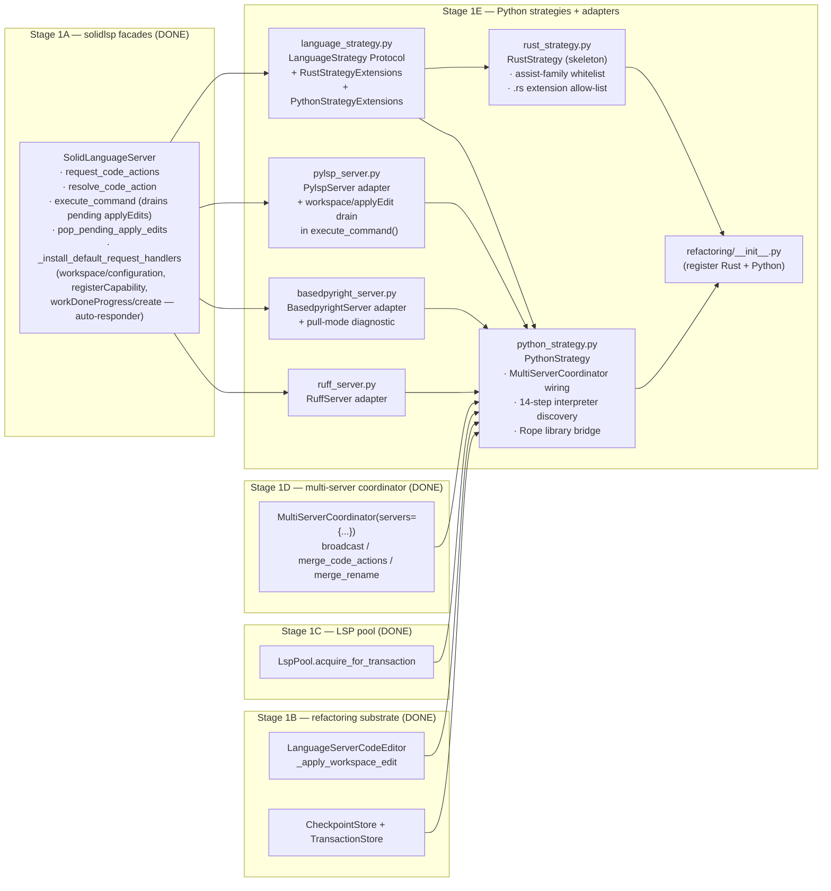
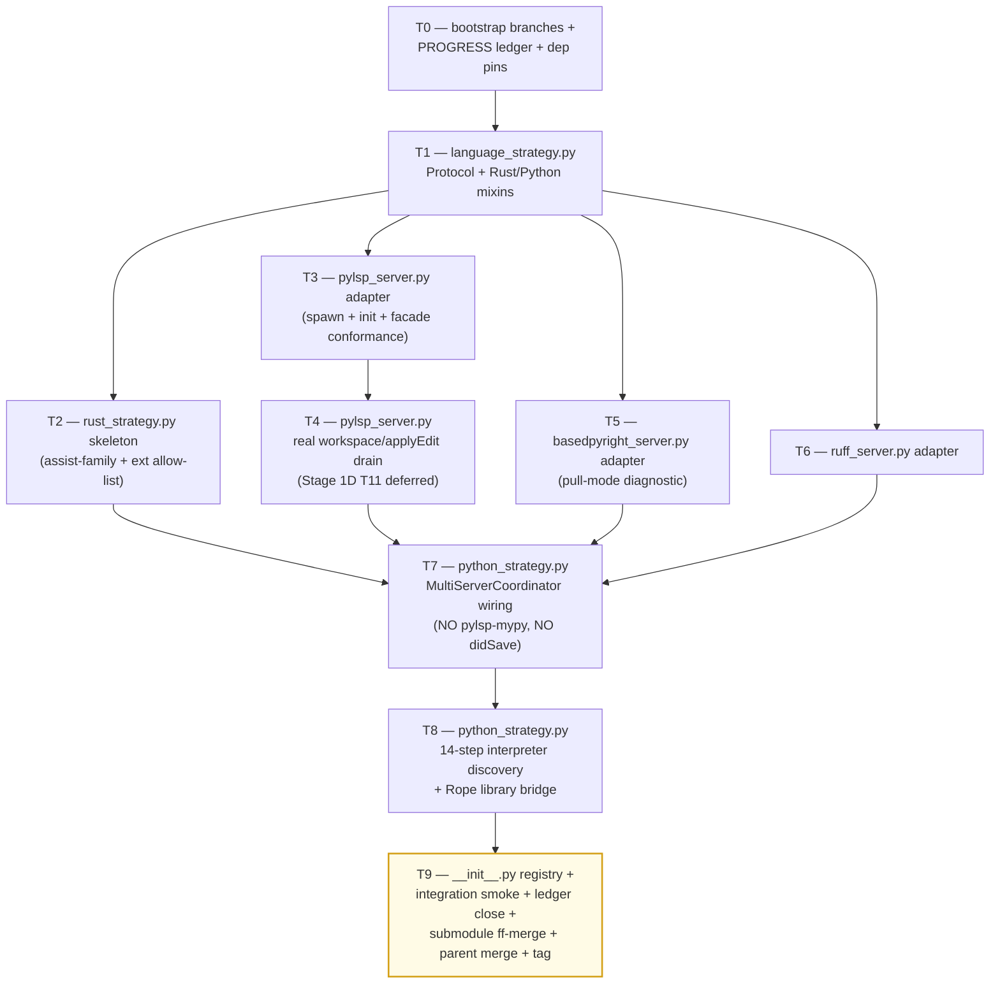

# Stage 1E — Python Strategies + LSP Adapters Implementation Plan

> **For agentic workers:** REQUIRED SUB-SKILL: Use `superpowers:subagent-driven-development` (recommended) or `superpowers:executing-plans` to implement this plan task-by-task. Steps use checkbox (`- [ ]`) syntax for tracking.

**Goal:** Land the per-language strategy plug-points and the three Python LSP adapters that Stage 1D's `MultiServerCoordinator` consumes. Concretely deliver: (1) `LanguageStrategy` Protocol + `RustStrategyExtensions` / `PythonStrategyExtensions` mixin types in `vendor/serena/src/serena/refactoring/language_strategy.py` (~250 LoC); (2) `RustStrategy` skeleton in `vendor/serena/src/serena/refactoring/rust_strategy.py` (~250 LoC) declaring the assist-family whitelist + `.rs` extension allow-list; (3) `PythonStrategy` skeleton in `vendor/serena/src/serena/refactoring/python_strategy.py` (~700 LoC) wiring `MultiServerCoordinator(servers={pylsp-rope, basedpyright, ruff})` with the 14-step interpreter discovery chain (per `specialist-python.md` §7) and the Rope library bridge (Rope 1.14.0, Python 3.10–3.13 per Phase 0 P3); (4) `__init__.py` registry update (~25 LoC) re-exporting the strategies; (5) `vendor/serena/src/solidlsp/language_servers/pylsp_server.py` (~50 LoC) — `python-lsp-server` + `pylsp-rope` adapter that **implements the real `workspace/applyEdit` reverse-request drain in `execute_command()`** (Stage 1D T11 mocked this; this plan delivers the production path); (6) `vendor/serena/src/solidlsp/language_servers/basedpyright_server.py` (~50 LoC) — adapter that calls `textDocument/diagnostic` after every `didOpen`/`didChange`/`didSave` (Phase 0 P4 PULL-mode finding) and inherits the base `_install_default_request_handlers` auto-responder set (`workspace/configuration` → `[{} for _ in items]`, `client/registerCapability` → `null`, `window/workDoneProgress/create` → `null`); (7) `vendor/serena/src/solidlsp/language_servers/ruff_server.py` (~50 LoC) — `ruff server` adapter exposing `source.organizeImports` + `quickfix` code actions. Stage 1E **MUST NOT spawn pylsp-mypy** (Phase 0 P5a outcome C — DROPPED at MVP). Stage 1E **MUST NOT inject synthetic per-step `didSave`** (the Q1 mitigation became redundant once mypy was dropped). All adapters pin `basedpyright==1.39.3` (Phase 0 Q3). Stage 1E consumes Stage 1A facades (`request_code_actions`, `resolve_code_action`, `execute_command`, `pop_pending_apply_edits`, `is_in_workspace`), Stage 1B substrate (`LanguageServerCodeEditor`, `CheckpointStore`, `TransactionStore`), Stage 1C pool (`LspPool.acquire_for_transaction`), and Stage 1D coordinator (`MultiServerCoordinator.broadcast`, `merge_code_actions`, `merge_rename`).

**Architecture:**



**Tech Stack:** Python 3.11+ (submodule venv), `pytest`, `pytest-asyncio`, `pydantic` v2, stdlib only for runtime (`asyncio`, `os`, `pathlib`, `shutil`, `subprocess`, `sys`, `json`, `logging`); `rope==1.14.0` (Phase 0 P3) added to `vendor/serena/pyproject.toml` as a runtime dependency for the library bridge; `basedpyright==1.39.3` (Phase 0 Q3) and `ruff>=0.6.0` and `python-lsp-server[rope]>=1.12.0` + `pylsp-rope>=0.1.17` declared as **optional / discovered-at-runtime** binaries (the adapters spawn them as subprocesses; missing-binary errors surface via `WaitingForLspBudget`-style typed errors at acquire time).

**Source-of-truth references:**
- [`docs/design/mvp/2026-04-24-mvp-scope-report.md`](../../design/mvp/2026-04-24-mvp-scope-report.md) — §9 (Python full coverage), §11 (multi-server protocol), §14.1 rows 11–14 (file budget for Stage 1E).
- [`docs/design/mvp/specialist-python.md`](../../design/mvp/specialist-python.md) — §3.5 spawn flags, §7 14-step interpreter discovery chain, §10 facade table (8 ship at MVP), §11 LoC re-estimate, §3.4 server-process layout.
- [`docs/superpowers/plans/spike-results/P3.md`](spike-results/P3.md) — ALL-PASS — Rope 1.14.0 + Python 3.13.3, Python 3.10–3.13+ supported. Rope library bridge in `python_strategy.py`.
- [`docs/superpowers/plans/spike-results/P4.md`](spike-results/P4.md) — basedpyright 1.39.3 PULL-mode only, blocking on `workspace/configuration`/`client/registerCapability`/`window/workDoneProgress/create`. Adapter in `basedpyright_server.py`.
- [`docs/superpowers/plans/spike-results/P5a.md`](spike-results/P5a.md) — pylsp-mypy DROPPED (verdict C). PythonStrategy MUST NOT spawn pylsp-mypy.
- [`docs/superpowers/plans/spike-results/SUMMARY.md`](spike-results/SUMMARY.md) — §5 wrapper-gap (3 Stage 1E adapters needed), §6 cross-cutting decisions (no didSave injection now that mypy is dropped).
- [`docs/superpowers/plans/2026-04-24-stage-1d-multi-server-merge.md`](2026-04-24-stage-1d-multi-server-merge.md) — Stage 1D plan; T11 deferred concern (`workspace/applyEdit` reverse-request was mocked) is resolved here in T4.
- [`docs/superpowers/plans/stage-1d-results/PROGRESS.md`](stage-1d-results/PROGRESS.md) — Stage 1D ledger; entry baseline for Stage 1E.
- Existing adapter conventions: `vendor/serena/src/solidlsp/language_servers/jedi_server.py` (Python adapter template), `vendor/serena/src/solidlsp/language_servers/pyright_server.py` (basedpyright sibling template).

---

## Scope check

Stage 1E is the per-language strategy layer + the three Python LSP adapters that the Stage 1D coordinator was written against. Stage 1D's tests use `_FakeServer` doubles whose method shapes mirror the Stage 1A facades exactly; this plan replaces those doubles with real adapters and proves end-to-end that the coordinator drives a real pylsp + basedpyright + ruff trio.

**In scope (this plan):**
1. `vendor/serena/src/serena/refactoring/language_strategy.py` — Protocol + Rust/Python mixins (~250 LoC).
2. `vendor/serena/src/serena/refactoring/rust_strategy.py` — Rust strategy skeleton (~250 LoC).
3. `vendor/serena/src/serena/refactoring/python_strategy.py` — Python strategy: multi-server orchestration + 14-step interpreter discovery + Rope library bridge (~700 LoC).
4. `vendor/serena/src/serena/refactoring/__init__.py` — register the two new strategies (~25 LoC delta).
5. `vendor/serena/src/solidlsp/language_servers/pylsp_server.py` — `python-lsp-server` + `pylsp-rope` adapter, real `workspace/applyEdit` drain (~50 LoC).
6. `vendor/serena/src/solidlsp/language_servers/basedpyright_server.py` — pull-mode diagnostic adapter (~50 LoC).
7. `vendor/serena/src/solidlsp/language_servers/ruff_server.py` — ruff LSP adapter (~50 LoC).
8. Test suite under `vendor/serena/test/spikes/test_stage_1e_*.py` (~700 LoC tests across 10 files).

**Out of scope (deferred):**
- Eight Python facades (`extract_function`, `extract_variable`, `extract_method`, `inline`, `convert_to_method_object`, `local_to_field`, `introduce_parameter`, `organize_imports`) — these consume `PythonStrategy` but ship as distinct facades in **Stage 1F**.
- `auto_import` two-step `addImport` flow — **Stage 1F** (composes basedpyright `source.addImport` over `PythonStrategy`).
- Three v1.1 Python facades (`convert_to_async`, `annotate_return_type`, `convert_from_relative_imports`) — **v1.1** per `specialist-python.md` §10.
- `RustStrategy` body (assist invocations, clippy multi-server) — **Stage 1G** (only the Protocol-conformant skeleton lands here).
- `MoveModule` / `ChangeSignature` / `IntroduceFactory` / `EncapsulateField` / `Restructure` Rope-bridge facades — **Stage 1F** (the bridge plumbing lands here; the typed facades sit above).
- Per-language MCP tool registration — **Stage 1H**.
- Plugin/skill code-generator (`o2-scalpel-newplugin`) — **Stage 1J** (per memory note `project_plugin_skill_generator`).

## File structure

| # | Path (under `vendor/serena/`) | Change | LoC | Responsibility |
|---|---|---|---|---|
| 11 | `src/serena/refactoring/language_strategy.py` | New | ~250 | `LanguageStrategy` `Protocol`; `RustStrategyExtensions` mixin (assist-family whitelist + `.rs` allow-list); `PythonStrategyExtensions` mixin (multi-server + interpreter + Rope-bridge typed surface). |
| 12 | `src/serena/refactoring/rust_strategy.py` | New | ~250 | `RustStrategy(LanguageStrategy, RustStrategyExtensions)` skeleton. |
| 13 | `src/serena/refactoring/python_strategy.py` | New | ~700 | `PythonStrategy(LanguageStrategy, PythonStrategyExtensions)`; `_PythonInterpreter` discovery (14 steps); `_RopeBridge`; `MultiServerCoordinator` wiring. |
| 14 | `src/serena/refactoring/__init__.py` | Modify | +~25 | Re-export `LanguageStrategy`, `RustStrategy`, `PythonStrategy`, `PythonInterpreter`, `RopeBridgeError`; add `STRATEGY_REGISTRY: dict[Language, type[LanguageStrategy]]`. |
| 15 | `src/solidlsp/language_servers/pylsp_server.py` | New | ~50 | `PylspServer(SolidLanguageServer)` — `python-lsp-server` (with `pylsp-rope`) launch + override `execute_command()` to drain `workspace/applyEdit` payloads after the response. |
| 16 | `src/solidlsp/language_servers/basedpyright_server.py` | New | ~50 | `BasedpyrightServer(SolidLanguageServer)` — `basedpyright-langserver --stdio`, pull-mode `textDocument/diagnostic` after `didOpen`/`didChange`/`didSave`. |
| 17 | `src/solidlsp/language_servers/ruff_server.py` | New | ~50 | `RuffServer(SolidLanguageServer)` — `ruff server` adapter exposing `source.organizeImports` + `quickfix`. |
| — | `test/spikes/test_stage_1e_*.py` | New | ~700 | TDD tests, one file per task T1..T9 (T0 is bootstrap, no test file). |

**LoC budget (production):** 250 + 250 + 700 + 25 + 50 + 50 + 50 = **1,375 LoC** (within the ~1,425 LoC budget specified by orchestrator). Tests +~700.

## Dependency graph



T1 is the linchpin: every later production file imports from it. T2 and T3 fan in parallel after T1. T4 strictly follows T3 (same file). T5 and T6 are independent of T2/T3/T4. T7 needs T2 (Python strategy must implement the same Protocol Rust does), T4 (real applyEdit drain), T5, T6. T8 follows T7 strictly (same file). T9 closes everything.

## Conventions enforced (from Phase 0 + Stage 1A–1D)

- **Submodule git-flow**: feature branch `feature/stage-1e-python-strategies` opened in both parent and `vendor/serena` submodule (T0 verifies). Submodule was not git-flow-initialized; same direct `feature/<name>` pattern as 1A/1B/1C/1D; ff-merge to `main` at T9; parent bumps pointer; parent merges feature branch to `develop`.
- **Author**: AI Hive(R) on every commit; never "Claude". Trailer: `Co-Authored-By: AI Hive(R) <noreply@o2.services>`.
- **Field name `code_language=`** on `LanguageServerConfig` (verified at `ls_config.py:596`).
- **`with srv.start_server():`** sync context manager from `ls.py:717` for any boot-real-LSP test.
- **PROGRESS.md updates as separate commits**, never `--amend`. Each task ends in two commits: code commit (in submodule) + ledger update (in parent).
- **`_FakeServer` test double** (already in `test/spikes/conftest.py` from Stage 1D T0) is reused for Protocol-conformance tests (T1–T2). Real-LSP boot tests use the actual adapters.
- **`super()._install_default_request_handlers()` first** rule: every Stage 1E adapter that overrides `_install_default_request_handlers` MUST call super first. Base class already auto-responds to `workspace/configuration`, `client/registerCapability`, `client/unregisterCapability`, `window/showMessageRequest`, `window/workDoneProgress/create`, `workspace/semanticTokens/refresh`, `workspace/diagnostic/refresh`, and the captured `workspace/applyEdit` payloads — Stage 1E adapters do not need to re-declare these.
- **Test command**: from `vendor/serena/`, run `PATH="$(pwd)/.venv/bin:$PATH" .venv/bin/pytest <path> -v`.
- **`pytest-asyncio`** is on the venv (Stage 1A confirmed). Use `@pytest.mark.asyncio` and `async def test_…`.
- **Type hints + pydantic v2** at every schema boundary; `Field(...)` validators where needed; `Literal[...]` for closed enums.
- **`Path.expanduser().resolve(strict=False)`** for canonicalisation — every path comparison goes through it (consistency with `LspPoolKey.__post_init__`).
- **`shutil.which`** for binary discovery (interpreter + LSP launchers); never hardcode `/usr/local/bin/...`.
- **No `subprocess.run(..., shell=True)`** — pass argv lists; child env explicitly seeded (`{**os.environ, "PYTHONUNBUFFERED": "1"}` for the LSP children).
- **No pylsp-mypy** — Phase 0 P5a verdict C. `python_strategy.py` MUST NOT include "pylsp-mypy" in its server set; the `multi_server.py` `ProvenanceLiteral` retains the literal for v1.1 schema compat but no spawn site.
- **No synthetic per-step `didSave` injection** — the Q1 mitigation existed solely to satisfy pylsp-mypy's stale-rate problem; with mypy dropped (P5a), the mitigation is redundant. `PythonStrategy` performs at most one `didSave` per facade call (and only when the facade explicitly requests one — e.g., before basedpyright pull-mode diagnostic).
- **`basedpyright==1.39.3`** exact pin (Phase 0 Q3) in dependency pins; the adapter asserts the version on first spawn and refuses with a typed error on mismatch.
- **`rope==1.14.0`** exact pin (Phase 0 P3) in `vendor/serena/pyproject.toml` (runtime dep) — the library bridge imports from `rope.refactor`.
- **Per-server timeout**: 2000 ms default per Stage 1D; `O2_SCALPEL_BROADCAST_TIMEOUT_MS` overrides. PythonStrategy does not override.

## Progress ledger

A new ledger `docs/superpowers/plans/stage-1e-results/PROGRESS.md` is created in T0. Schema mirrors Stage 1D: per-task row with task id, branch SHA (submodule), outcome, follow-ups. Updated as a separate parent commit after each task completes.

---

### Task 0: Bootstrap branches + PROGRESS ledger + dep pins

**Files:**
- Create: `docs/superpowers/plans/stage-1e-results/PROGRESS.md`
- Verify: parent + submodule both already on `feature/plan-stage-1e` (parent) / will create `feature/stage-1e-python-strategies` in submodule.
- Modify: `vendor/serena/pyproject.toml` — add `rope==1.14.0` runtime dep; add optional dev-dep markers for `python-lsp-server[rope]>=1.12.0`, `pylsp-rope>=0.1.17`, `basedpyright==1.39.3`, `ruff>=0.6.0`.

- [ ] **Step 1: Confirm parent branch exists and is checked out**

Run:
```bash
git -C /Volumes/Unitek-B/Projects/o2-scalpel rev-parse --abbrev-ref HEAD
```

Expected: prints `feature/plan-stage-1e` (the planning branch this file lives on). The implementation branch (`feature/stage-1e-python-strategies`) is opened in T0 step 2 once we transition from planning to execution; for the duration of *writing* this plan file, parent stays on `feature/plan-stage-1e`. The submodule branch is opened immediately in step 2 because submodule code starts changing in T1.

- [ ] **Step 2: Open submodule feature branch off `main`**

Run:
```bash
cd /Volumes/Unitek-B/Projects/o2-scalpel/vendor/serena
git fetch origin
git checkout -B feature/stage-1e-python-strategies origin/main
git rev-parse HEAD  # capture this as the Stage 1E entry SHA in PROGRESS step 5
```

Expected: HEAD points at `origin/main` tip (the SHA Stage 1D ff-merged into main). If `origin/main` is not the latest Stage 1D tip, abort and reconcile manually — Stage 1E must be built on the multi-server coordinator.

- [ ] **Step 3: Confirm Stage 1A facade primitives exist**

Run:
```bash
grep -n "def request_code_actions\|def resolve_code_action\|def execute_command\|def is_in_workspace\|def pop_pending_apply_edits\|def _install_default_request_handlers" /Volumes/Unitek-B/Projects/o2-scalpel/vendor/serena/src/solidlsp/ls.py
```

Expected: 6 hits matching the Stage 1A facade install points (`request_code_actions` ≈ line 728; `resolve_code_action`; `execute_command` ≈ line 794; `is_in_workspace` staticmethod; `pop_pending_apply_edits` ≈ line 634; `_install_default_request_handlers` ≈ line 702).

- [ ] **Step 4: Confirm Stage 1B + Stage 1C + Stage 1D substrate exists**

Run:
```bash
grep -n "class CheckpointStore\|class TransactionStore\|class LspPool\|class MultiServerCoordinator" \
  /Volumes/Unitek-B/Projects/o2-scalpel/vendor/serena/src/serena/refactoring/checkpoints.py \
  /Volumes/Unitek-B/Projects/o2-scalpel/vendor/serena/src/serena/refactoring/transactions.py \
  /Volumes/Unitek-B/Projects/o2-scalpel/vendor/serena/src/serena/refactoring/lsp_pool.py \
  /Volumes/Unitek-B/Projects/o2-scalpel/vendor/serena/src/serena/refactoring/multi_server.py
```

Expected: 4 hits across the four files. If any miss, Stage 1B/1C/1D regressed and must be repaired before Stage 1E begins.

- [ ] **Step 5: Create the PROGRESS ledger**

Write to `/Volumes/Unitek-B/Projects/o2-scalpel/docs/superpowers/plans/stage-1e-results/PROGRESS.md`:

````markdown
# Stage 1E — Python Strategies + LSP Adapters — Progress Ledger

Started: 2026-04-25
Branch: feature/stage-1e-python-strategies (submodule); feature/plan-stage-1e (parent during planning) → feature/stage-1e-python-strategies (parent during execution)
Author: AI Hive(R)
Built on: stage-1d-multi-server-merge-complete

| Task | Description | Branch SHA (submodule) | Outcome | Follow-up |
|---|---|---|---|---|
| T0 | Bootstrap branches + ledger + dep pins                             | _pending_ | _pending_ | — |
| T1 | language_strategy.py Protocol + Rust/Python mixins                 | _pending_ | _pending_ | — |
| T2 | rust_strategy.py skeleton (assist-family + ext allow-list)         | _pending_ | _pending_ | — |
| T3 | pylsp_server.py adapter (spawn/init/facade conformance)            | _pending_ | _pending_ | — |
| T4 | pylsp_server.py real workspace/applyEdit drain (1D T11 deferred)   | _pending_ | _pending_ | — |
| T5 | basedpyright_server.py adapter (pull-mode diagnostic, P4)          | _pending_ | _pending_ | — |
| T6 | ruff_server.py adapter                                             | _pending_ | _pending_ | — |
| T7 | python_strategy.py — MultiServerCoordinator wiring (no mypy)       | _pending_ | _pending_ | — |
| T8 | python_strategy.py — 14-step interpreter + Rope library bridge     | _pending_ | _pending_ | — |
| T9 | __init__.py registry + smoke + ledger close + ff-merge + tag       | _pending_ | _pending_ | — |

## Decisions log

(append-only; one bullet per decision with date + rationale)

## Stage 1D entry baseline

- Submodule `main` head at Stage 1E start: <fill in step 2 output>
- Parent branch head at Stage 1E start: <fill in via `git rev-parse HEAD` from parent at T0 close>
- Stage 1D tag: `stage-1d-multi-server-merge-complete`
- Stage 1D suite green: 303/303 (per memory note `project_stage_1d_complete`)

## Spike outcome quick-reference (carryover for context)

- P3 → ALL-PASS — Rope 1.14.0 + Python 3.10–3.13+ supported. Rope library bridge in T8.
- P4 → A — basedpyright 1.39.3 PULL-mode only; auto-responder for blocking server→client requests handled by base `_install_default_request_handlers`. Adapter delivers pull-mode in T5.
- P5a → C — pylsp-mypy DROPPED. PythonStrategy never spawns it (T7).
- Q1 cascade — synthetic per-step `didSave` injection no longer needed (was a pylsp-mypy mitigation).
- Q3 — `basedpyright==1.39.3` exact pin (T0 step 6).
````

- [ ] **Step 6: Add Python LSP runtime + dev pins to `vendor/serena/pyproject.toml`**

Open `/Volumes/Unitek-B/Projects/o2-scalpel/vendor/serena/pyproject.toml`. Locate the existing `[project]` table's `dependencies = [...]` array. Append `rope==1.14.0` to the list (the only true runtime dep — the LSP launchers are spawned subprocesses).

In the `[project.optional-dependencies]` table (create if absent), add:

```toml
[project.optional-dependencies]
python-lsps = [
    "python-lsp-server[rope]>=1.12.0",
    "pylsp-rope>=0.1.17",
    "basedpyright==1.39.3",
    "ruff>=0.6.0",
]
```

This keeps the production install lean (only `rope` for the library bridge) while letting CI / dev environments install the runtime LSPs via `pip install -e .[python-lsps]`.

Then sync the venv:

```bash
cd /Volumes/Unitek-B/Projects/o2-scalpel/vendor/serena
.venv/bin/uv pip install -e ".[python-lsps]"
.venv/bin/python -c "import rope; print(rope.VERSION)"
.venv/bin/basedpyright-langserver --version
.venv/bin/python -m pylsp --help | head -3
.venv/bin/ruff server --help | head -3
```

Expected: `rope.VERSION == "1.14.0"`; basedpyright prints `1.39.3`; pylsp and ruff print help banners.

- [ ] **Step 7: Commit T0**

```bash
cd /Volumes/Unitek-B/Projects/o2-scalpel/vendor/serena
git add pyproject.toml uv.lock 2>/dev/null || git add pyproject.toml
git commit -m "$(cat <<'EOF'
stage-1e(t0): pin rope==1.14.0 + python-lsps optional extras

- rope==1.14.0 (P3) added to runtime deps for the library bridge.
- python-lsp-server[rope]>=1.12.0, pylsp-rope>=0.1.17,
  basedpyright==1.39.3 (Q3), ruff>=0.6.0 added under
  [project.optional-dependencies] python-lsps.

Co-Authored-By: AI Hive(R) <noreply@o2.services>
EOF
)"
git rev-parse HEAD  # paste this into PROGRESS.md row T0
```

```bash
cd /Volumes/Unitek-B/Projects/o2-scalpel
git add docs/superpowers/plans/stage-1e-results/PROGRESS.md
git commit -m "$(cat <<'EOF'
stage-1e(t0): open progress ledger

Co-Authored-By: AI Hive(R) <noreply@o2.services>
EOF
)"
```

**Verification:**

```bash
cd /Volumes/Unitek-B/Projects/o2-scalpel/vendor/serena
.venv/bin/python -c "import rope; print(rope.VERSION)"
```

Expected: `1.14.0`. If anything else, T0 is not green; rerun step 6 with the exact pin.

### Task 1: `language_strategy.py` Protocol + Rust/Python mixins

**Files:**
- Create: `vendor/serena/src/serena/refactoring/language_strategy.py`
- Create: `vendor/serena/test/spikes/test_stage_1e_t1_language_strategy_protocol.py`

- [ ] **Step 1: Write failing test — Protocol exists with the required method shape**

Create `/Volumes/Unitek-B/Projects/o2-scalpel/vendor/serena/test/spikes/test_stage_1e_t1_language_strategy_protocol.py`:

```python
"""T1 — LanguageStrategy Protocol + Rust/Python extension mixins."""

from __future__ import annotations

import inspect

import pytest


def test_language_strategy_protocol_imports() -> None:
    from serena.refactoring.language_strategy import LanguageStrategy  # noqa: F401


def test_language_strategy_required_methods() -> None:
    from serena.refactoring.language_strategy import LanguageStrategy

    required = {"language_id", "extension_allow_list", "code_action_allow_list", "build_servers"}
    members = {name for name, _ in inspect.getmembers(LanguageStrategy)}
    missing = required - members
    assert not missing, f"LanguageStrategy missing required members: {missing}"


def test_rust_extensions_carry_assist_whitelist() -> None:
    from serena.refactoring.language_strategy import RustStrategyExtensions

    assist = RustStrategyExtensions.ASSIST_FAMILY_WHITELIST
    assert isinstance(assist, frozenset)
    # rust-analyzer assist kinds use the "refactor.<sub>.assist" hierarchy.
    assert any(k.startswith("refactor.") for k in assist), assist
    assert "refactor.extract" in assist or "refactor.extract.assist" in assist


def test_python_extensions_carry_three_server_set() -> None:
    from serena.refactoring.language_strategy import PythonStrategyExtensions

    assert PythonStrategyExtensions.SERVER_SET == ("pylsp-rope", "basedpyright", "ruff")
    # P5a: pylsp-mypy MUST NOT be in the active server set.
    assert "pylsp-mypy" not in PythonStrategyExtensions.SERVER_SET


def test_protocol_runtime_checkable_against_a_dummy() -> None:
    from serena.refactoring.language_strategy import LanguageStrategy

    class _Dummy:
        language_id = "dummy"
        extension_allow_list = frozenset({".dum"})
        code_action_allow_list = frozenset({"refactor"})

        def build_servers(self, project_root):  # type: ignore[no-untyped-def]
            return {}

    # Protocol must be @runtime_checkable so isinstance works.
    assert isinstance(_Dummy(), LanguageStrategy)
```

Run:
```bash
cd /Volumes/Unitek-B/Projects/o2-scalpel/vendor/serena
PATH="$(pwd)/.venv/bin:$PATH" .venv/bin/pytest test/spikes/test_stage_1e_t1_language_strategy_protocol.py -v
```

Expected: ALL FIVE FAIL with `ModuleNotFoundError: No module named 'serena.refactoring.language_strategy'`. This is the red bar that authorises the implementation.

- [ ] **Step 2: Write minimal implementation**

Create `/Volumes/Unitek-B/Projects/o2-scalpel/vendor/serena/src/serena/refactoring/language_strategy.py`:

```python
"""Per-language refactoring strategy plug-points (Stage 1E §14.1 file 11).

The ``LanguageStrategy`` Protocol is the seam between the language-agnostic
facade layer (``LanguageServerCodeEditor``, ``MultiServerCoordinator``,
``LspPool``) and the per-language plug-ins (``RustStrategy``,
``PythonStrategy``, future ``GoStrategy`` etc.). Each strategy declares:

  - ``language_id`` (matches ``Language`` enum value, e.g. ``"python"``).
  - ``extension_allow_list`` — the set of file suffixes this strategy
    will accept; facades reject other paths up-front.
  - ``code_action_allow_list`` — the set of LSP code-action kinds (or
    kind prefixes per LSP §3.18.1) this strategy considers in-scope.
    Other kinds are filtered before the multi-server merge sees them.
  - ``build_servers(project_root)`` — returns the
    ``dict[server_id, SolidLanguageServer]`` that ``MultiServerCoordinator``
    will broadcast across. Single-LSP languages return a single-entry
    dict; Python returns a three-entry dict.

The two extension mixin classes carry per-language *constants* that
sit outside the Protocol surface but that downstream tasks (T2 RustStrategy,
T7 PythonStrategy) consume directly. Keeping them as separate classes
preserves SRP: the Protocol defines the contract, the mixins carry the
language-specific constant tables.
"""

from __future__ import annotations

from pathlib import Path
from typing import Any, Protocol, runtime_checkable


@runtime_checkable
class LanguageStrategy(Protocol):
    """Per-language plug-point consumed by the language-agnostic facades."""

    language_id: str
    extension_allow_list: frozenset[str]
    code_action_allow_list: frozenset[str]

    def build_servers(self, project_root: Path) -> dict[str, Any]:
        """Spawn (or fetch from the pool) the LSP servers this strategy needs.

        :param project_root: workspace root path; canonicalised by caller.
        :return: ``{server_id: SolidLanguageServer}`` ready for
            ``MultiServerCoordinator(servers=…)``. Single-server languages
            return ``{language_id: <server>}``; Python returns three entries.
        """
        ...


class RustStrategyExtensions:
    """Constants specific to ``RustStrategy`` (consumed in T2 + Stage 1G).

    rust-analyzer exposes its refactor catalogue as *assist* code actions
    under the ``refactor.<family>.assist`` kind hierarchy (per LSP §3.18.1
    sub-kinds). The whitelist below is the closed set of assist families
    Stage 1E commits to surfacing through the facade layer; future families
    require an explicit code change so the LLM surface remains stable.
    """

    EXTENSION_ALLOW_LIST: frozenset[str] = frozenset({".rs"})

    ASSIST_FAMILY_WHITELIST: frozenset[str] = frozenset({
        "refactor.extract",
        "refactor.inline",
        "refactor.rewrite",
        "refactor.move",
        "quickfix",
        "source.organizeImports",
    })


class PythonStrategyExtensions:
    """Constants specific to ``PythonStrategy`` (consumed in T7 + T8).

    SERVER_SET is the ordered tuple of server IDs Stage 1E spawns. Order
    matters only for diff-friendly test transcripts; priority across
    servers is decided by the Stage 1D ``_apply_priority()`` table, not
    by iteration order.

    pylsp-mypy is **deliberately absent** (Phase 0 P5a outcome C). Adding
    it back requires a deliberate code change so the regression is
    visible in code review.
    """

    EXTENSION_ALLOW_LIST: frozenset[str] = frozenset({".py", ".pyi"})

    SERVER_SET: tuple[str, ...] = ("pylsp-rope", "basedpyright", "ruff")

    # Code-action kinds the Python strategy considers in-scope. Any
    # action whose kind does not match (per LSP §3.18.1 prefix rule)
    # is filtered before merge.
    CODE_ACTION_ALLOW_LIST: frozenset[str] = frozenset({
        "quickfix",
        "refactor",
        "refactor.extract",
        "refactor.inline",
        "refactor.rewrite",
        "source.organizeImports",
        "source.fixAll",
    })

    # P4: basedpyright 1.39.3 exact pin asserted at adapter spawn.
    BASEDPYRIGHT_VERSION_PIN: str = "1.39.3"

    # P3: Rope library bridge pin.
    ROPE_VERSION_PIN: str = "1.14.0"
```

- [ ] **Step 3: Re-run tests, expect green**

Run:
```bash
cd /Volumes/Unitek-B/Projects/o2-scalpel
.venv/bin/python -c "import sys; sys.path.insert(0, 'vendor/serena/src'); from serena.refactoring.language_strategy import LanguageStrategy, RustStrategyExtensions, PythonStrategyExtensions; print('OK')" || true
cd vendor/serena
PATH="$(pwd)/.venv/bin:$PATH" .venv/bin/pytest test/spikes/test_stage_1e_t1_language_strategy_protocol.py -v
```

Expected: 5/5 PASS. If any fail, reread the failing assertion and adjust ONLY the implementation to match the test (never the test).

- [ ] **Step 4: Refactor pass — confirm DRY / SOLID**

Re-read both files. Verify:
- The Protocol declares only behaviour and identifying constants — no implementation.
- The mixins carry only constants (no methods); they are pure data classes by convention.
- Type hints exhaustive; `Any` appears only on `build_servers` return value (because `SolidLanguageServer` is the actual type but importing it would create a cycle into `solidlsp` from `serena.refactoring`).

If anything fails the SRP smell test, fix and re-run the test suite.

- [ ] **Step 5: Commit T1**

```bash
cd /Volumes/Unitek-B/Projects/o2-scalpel/vendor/serena
git add src/serena/refactoring/language_strategy.py test/spikes/test_stage_1e_t1_language_strategy_protocol.py
git commit -m "$(cat <<'EOF'
stage-1e(t1): LanguageStrategy Protocol + Rust/Python extension mixins

Adds the seam between the language-agnostic facade layer and per-language
strategies. Rust mixin declares assist-family whitelist + .rs allow-list;
Python mixin declares the three-server set (pylsp-rope, basedpyright, ruff)
with pylsp-mypy DELIBERATELY ABSENT per Phase 0 P5a.

Co-Authored-By: AI Hive(R) <noreply@o2.services>
EOF
)"
git rev-parse HEAD  # paste into PROGRESS row T1
```

Update parent ledger and commit:

```bash
cd /Volumes/Unitek-B/Projects/o2-scalpel
# (manually update PROGRESS row T1: SHA, outcome=GREEN, follow-up=—)
git add docs/superpowers/plans/stage-1e-results/PROGRESS.md
git commit -m "stage-1e(t1): ledger update

Co-Authored-By: AI Hive(R) <noreply@o2.services>"
```

### Task 2: `rust_strategy.py` skeleton

**Files:**
- Create: `vendor/serena/src/serena/refactoring/rust_strategy.py`
- Create: `vendor/serena/test/spikes/test_stage_1e_t2_rust_strategy_skeleton.py`

The Rust strategy *body* (assist invocation, clippy multi-server, snippet rendering) is deferred to Stage 1G. T2 lands only the skeleton: a Protocol-conformant class with the correct identity constants and a `build_servers` that returns a single `{"rust-analyzer": <server>}` entry by acquiring from the Stage 1C `LspPool`.

- [ ] **Step 1: Write failing test — Protocol conformance + identity**

Create `/Volumes/Unitek-B/Projects/o2-scalpel/vendor/serena/test/spikes/test_stage_1e_t2_rust_strategy_skeleton.py`:

```python
"""T2 — RustStrategy skeleton: Protocol conformance + identity constants."""

from __future__ import annotations

from pathlib import Path
from unittest.mock import MagicMock

import pytest


def test_rust_strategy_imports() -> None:
    from serena.refactoring.rust_strategy import RustStrategy  # noqa: F401


def test_rust_strategy_is_a_language_strategy() -> None:
    from serena.refactoring.language_strategy import LanguageStrategy
    from serena.refactoring.rust_strategy import RustStrategy

    assert isinstance(RustStrategy(pool=MagicMock()), LanguageStrategy)


def test_rust_identity_constants() -> None:
    from serena.refactoring.rust_strategy import RustStrategy

    s = RustStrategy(pool=MagicMock())
    assert s.language_id == "rust"
    assert ".rs" in s.extension_allow_list
    # No other suffix accepted.
    assert s.extension_allow_list == frozenset({".rs"})


def test_rust_code_action_allow_list_contains_assist_families() -> None:
    from serena.refactoring.rust_strategy import RustStrategy

    s = RustStrategy(pool=MagicMock())
    # Per LSP §3.18.1 prefix rule, "refactor.extract" matches assist
    # kinds like "refactor.extract.assist".
    assert "refactor.extract" in s.code_action_allow_list
    assert "quickfix" in s.code_action_allow_list


def test_build_servers_returns_single_rust_analyzer_entry() -> None:
    from serena.refactoring.lsp_pool import LspPoolKey
    from serena.refactoring.rust_strategy import RustStrategy

    fake_server = MagicMock(name="rust-analyzer-server")
    pool = MagicMock()
    pool.acquire.return_value = fake_server

    strat = RustStrategy(pool=pool)
    out = strat.build_servers(Path("/tmp/some-rust-project"))

    assert set(out.keys()) == {"rust-analyzer"}
    assert out["rust-analyzer"] is fake_server
    pool.acquire.assert_called_once()
    key = pool.acquire.call_args.args[0]
    assert isinstance(key, LspPoolKey)
    assert key.language == "rust"


def test_build_servers_rejects_path_outside_workspace_to_existing_root() -> None:
    """build_servers does NOT validate the root path beyond passing it to the
    pool — workspace-boundary enforcement lives in the applier (Stage 1B/1D)."""
    from serena.refactoring.rust_strategy import RustStrategy

    pool = MagicMock()
    pool.acquire.return_value = MagicMock()
    strat = RustStrategy(pool=pool)
    # Path does not need to exist; pool.acquire owns spawn semantics.
    strat.build_servers(Path("/does/not/exist"))
```

Run:
```bash
cd /Volumes/Unitek-B/Projects/o2-scalpel/vendor/serena
PATH="$(pwd)/.venv/bin:$PATH" .venv/bin/pytest test/spikes/test_stage_1e_t2_rust_strategy_skeleton.py -v
```

Expected: 6/6 FAIL with `ModuleNotFoundError: No module named 'serena.refactoring.rust_strategy'`.

- [ ] **Step 2: Write minimal implementation**

Create `/Volumes/Unitek-B/Projects/o2-scalpel/vendor/serena/src/serena/refactoring/rust_strategy.py`:

```python
"""Rust refactoring strategy skeleton (Stage 1E §14.1 file 12).

Stage 1E lands only the *skeleton*: a Protocol-conformant ``RustStrategy``
that knows its identity constants and can fetch a ``rust-analyzer`` server
from the Stage 1C ``LspPool``. The full body — assist invocation, clippy
multi-server, snippet rendering, ChangeAnnotation handling — is deferred
to Stage 1G when rust-analyzer's full surface is wired through.

Stage 1E delivers the Rust skeleton (instead of leaving it for 1G entirely)
because Python and Rust must implement the *same* ``LanguageStrategy``
Protocol; landing both at once exercises the Protocol against two real
consumers and catches ergonomic problems before they become locked-in.
"""

from __future__ import annotations

from pathlib import Path
from typing import Any

from .language_strategy import LanguageStrategy, RustStrategyExtensions
from .lsp_pool import LspPool, LspPoolKey


class RustStrategy(LanguageStrategy, RustStrategyExtensions):
    """Skeleton ``LanguageStrategy`` for Rust (rust-analyzer single LSP).

    Stage 1G will fill in:
      - assist code-action invocation surface,
      - clippy as a second LSP for diagnostic enrichment (parallel to the
        Python multi-server pattern but with a smaller priority table),
      - snippet rendering for whole-file ``ChangeAnnotation`` payloads.
    """

    language_id: str = "rust"
    extension_allow_list: frozenset[str] = RustStrategyExtensions.EXTENSION_ALLOW_LIST

    # Family-level entries; LSP §3.18.1 prefix matching means rust-analyzer's
    # "refactor.extract.assist" auto-matches "refactor.extract" here.
    code_action_allow_list: frozenset[str] = RustStrategyExtensions.ASSIST_FAMILY_WHITELIST

    def __init__(self, pool: LspPool) -> None:
        """:param pool: Stage 1C ``LspPool`` used to acquire the rust-analyzer
            server. Held by reference so subsequent ``build_servers`` calls
            do not re-spawn — pool deduplicates by ``LspPoolKey``."""
        self._pool = pool

    def build_servers(self, project_root: Path) -> dict[str, Any]:
        """Return ``{"rust-analyzer": <SolidLanguageServer>}`` from the pool.

        Single-LSP language; the dict has exactly one entry. Stage 1G will
        extend this to ``{"rust-analyzer": ..., "clippy": ...}`` once the
        clippy-LSP adapter lands.
        """
        key = LspPoolKey(language=self.language_id, project_root=str(project_root))
        server = self._pool.acquire(key)
        return {"rust-analyzer": server}
```

- [ ] **Step 3: Re-run tests, expect green**

Run:
```bash
cd /Volumes/Unitek-B/Projects/o2-scalpel/vendor/serena
PATH="$(pwd)/.venv/bin:$PATH" .venv/bin/pytest test/spikes/test_stage_1e_t2_rust_strategy_skeleton.py -v
```

Expected: 6/6 PASS.

- [ ] **Step 4: Refactor pass — confirm Protocol parity is real**

Sanity check: `RustStrategy` and `PythonStrategy` (T7) MUST satisfy `isinstance(strat, LanguageStrategy)`. Run a one-liner:
```bash
cd /Volumes/Unitek-B/Projects/o2-scalpel/vendor/serena
PATH="$(pwd)/.venv/bin:$PATH" .venv/bin/python -c "
from unittest.mock import MagicMock
from serena.refactoring.language_strategy import LanguageStrategy
from serena.refactoring.rust_strategy import RustStrategy
print(isinstance(RustStrategy(pool=MagicMock()), LanguageStrategy))
"
```

Expected: `True`. If `False`, the Protocol surface and the implementation diverged — fix the implementation, never the test.

- [ ] **Step 5: Commit T2**

```bash
cd /Volumes/Unitek-B/Projects/o2-scalpel/vendor/serena
git add src/serena/refactoring/rust_strategy.py test/spikes/test_stage_1e_t2_rust_strategy_skeleton.py
git commit -m "$(cat <<'EOF'
stage-1e(t2): RustStrategy skeleton — Protocol conformance + LspPool wiring

Skeleton only — assist invocation, clippy multi-server, snippet rendering
deferred to Stage 1G. Lands here so the Protocol surface is exercised by
two real consumers (RustStrategy + PythonStrategy in T7) before either is
locked in.

Co-Authored-By: AI Hive(R) <noreply@o2.services>
EOF
)"
git rev-parse HEAD  # paste into PROGRESS row T2
```

Update parent ledger:
```bash
cd /Volumes/Unitek-B/Projects/o2-scalpel
# (manually update PROGRESS row T2)
git add docs/superpowers/plans/stage-1e-results/PROGRESS.md
git commit -m "stage-1e(t2): ledger update

Co-Authored-By: AI Hive(R) <noreply@o2.services>"
```

### Task 3: `pylsp_server.py` adapter — basic spawn/init

**Files:**
- Create: `vendor/serena/src/solidlsp/language_servers/pylsp_server.py`
- Create: `vendor/serena/test/spikes/test_stage_1e_t3_pylsp_server_spawn.py`

T3 lands the spawn/init skeleton: subclass of `SolidLanguageServer`, launches `python -m pylsp` (with the `pylsp-rope` plugin auto-discovered since both are installed in the venv via the `python-lsps` extra), passes the standard `InitializeParams` shape (template: `jedi_server.py`), and registers the inherited reverse-request handlers via `super()._install_default_request_handlers()`. The adapter does NOT yet override `execute_command` — that override lands in T4 (the real `workspace/applyEdit` drain that closes Stage 1D T11).

- [ ] **Step 1: Write failing test — adapter exists, identifies as Python, spawns**

Create `/Volumes/Unitek-B/Projects/o2-scalpel/vendor/serena/test/spikes/test_stage_1e_t3_pylsp_server_spawn.py`:

```python
"""T3 — PylspServer adapter spawn + initialize round-trip."""

from __future__ import annotations

import os
import shutil
from pathlib import Path

import pytest

PYLSP_AVAILABLE = shutil.which("pylsp") is not None or os.environ.get("CI") == "true"


def test_pylsp_server_imports() -> None:
    from solidlsp.language_servers.pylsp_server import PylspServer  # noqa: F401


def test_pylsp_server_subclasses_solid_language_server() -> None:
    from solidlsp.ls import SolidLanguageServer
    from solidlsp.language_servers.pylsp_server import PylspServer

    assert issubclass(PylspServer, SolidLanguageServer)


def test_pylsp_server_advertises_python_language() -> None:
    """Construction-time identity — does not boot the subprocess."""
    from solidlsp.language_servers.pylsp_server import PylspServer
    from solidlsp.ls_config import LanguageServerConfig, Language
    from solidlsp.settings import SolidLSPSettings

    cfg = LanguageServerConfig(code_language=Language.PYTHON)
    srv = PylspServer(cfg, str(Path.cwd()), SolidLSPSettings())
    assert srv.language == "python"


@pytest.mark.skipif(not PYLSP_AVAILABLE, reason="pylsp not installed (install with [python-lsps] extra)")
def test_pylsp_server_boots_and_initializes(tmp_path: Path) -> None:
    """Real-LSP boot smoke: start_server() must complete without raising
    and the server must respond to a trivial document/symbol request.

    Marked skipif so CI environments without the extra still pass T3 import-only.
    """
    from solidlsp.language_servers.pylsp_server import PylspServer
    from solidlsp.ls_config import LanguageServerConfig, Language
    from solidlsp.settings import SolidLSPSettings

    (tmp_path / "x.py").write_text("def hello() -> int:\n    return 1\n")
    cfg = LanguageServerConfig(code_language=Language.PYTHON)
    srv = PylspServer(cfg, str(tmp_path), SolidLSPSettings())
    with srv.start_server():
        symbols = srv.request_document_symbols("x.py")
        assert any("hello" in str(s) for s in symbols), symbols
```

Run:
```bash
cd /Volumes/Unitek-B/Projects/o2-scalpel/vendor/serena
PATH="$(pwd)/.venv/bin:$PATH" .venv/bin/pytest test/spikes/test_stage_1e_t3_pylsp_server_spawn.py -v
```

Expected: import + subclass + identity tests FAIL with `ModuleNotFoundError`. The boot test fails too if pylsp is installed; otherwise it skips.

- [ ] **Step 2: Write minimal implementation**

Create `/Volumes/Unitek-B/Projects/o2-scalpel/vendor/serena/src/solidlsp/language_servers/pylsp_server.py`:

```python
"""python-lsp-server (pylsp) + pylsp-rope adapter — Stage 1E §14.1 file 15.

Launches ``python -m pylsp --check-parent-process`` over stdio. The
``pylsp-rope`` plugin is auto-discovered when installed in the same
interpreter (entry-point group ``pylsp``); no extra wiring required at
the LSP level.

This module ships in two stages:
  - T3 (this file): spawn + initialize + facade conformance.
  - T4 (next file revision): override ``execute_command`` to drain
    ``workspace/applyEdit`` payloads emitted *during* command execution
    (Phase 0 P1 finding — pylsp-rope ships its inline/refactor
    ``WorkspaceEdit`` via the reverse-request channel).

pylsp-mypy is DELIBERATELY NOT enabled here — Phase 0 P5a verdict C.
"""

from __future__ import annotations

import logging
import os
import pathlib
import sys
from typing import Any, cast

from overrides import override

from solidlsp.ls import SolidLanguageServer
from solidlsp.ls_config import LanguageServerConfig
from solidlsp.lsp_protocol_handler.lsp_types import InitializeParams
from solidlsp.lsp_protocol_handler.server import ProcessLaunchInfo
from solidlsp.settings import SolidLSPSettings

log = logging.getLogger(__name__)


class PylspServer(SolidLanguageServer):
    """python-lsp-server adapter (with pylsp-rope plugin auto-discovered)."""

    def __init__(
        self,
        config: LanguageServerConfig,
        repository_root_path: str,
        solidlsp_settings: SolidLSPSettings,
    ) -> None:
        # Use ``sys.executable -m pylsp`` rather than the bare ``pylsp`` entry
        # point so the Stage 1E interpreter discovery (T8) can override which
        # Python pylsp-rope sees by swapping the launch command.
        super().__init__(
            config,
            repository_root_path,
            ProcessLaunchInfo(
                cmd=f"{sys.executable} -m pylsp --check-parent-process",
                cwd=repository_root_path,
            ),
            "python",
            solidlsp_settings,
        )

    @override
    def is_ignored_dirname(self, dirname: str) -> bool:
        return super().is_ignored_dirname(dirname) or dirname in (
            "venv",
            ".venv",
            "__pycache__",
            ".tox",
            ".mypy_cache",
            ".ruff_cache",
        )

    @staticmethod
    def _get_initialize_params(repository_absolute_path: str) -> InitializeParams:
        """Standard pylsp InitializeParams — mirrors jedi_server.py shape."""
        root_uri = pathlib.Path(repository_absolute_path).as_uri()
        params: dict[str, Any] = {
            "processId": os.getpid(),
            "clientInfo": {"name": "Serena", "version": "0.1.0"},
            "locale": "en",
            "rootPath": repository_absolute_path,
            "rootUri": root_uri,
            "capabilities": {
                "workspace": {
                    "applyEdit": True,
                    "workspaceEdit": {
                        "documentChanges": True,
                        "resourceOperations": ["create", "rename", "delete"],
                        "failureHandling": "textOnlyTransactional",
                    },
                    "configuration": True,
                    "didChangeConfiguration": {"dynamicRegistration": True},
                    "executeCommand": {"dynamicRegistration": True},
                },
                "textDocument": {
                    "publishDiagnostics": {
                        "relatedInformation": True,
                        "tagSupport": {"valueSet": [1, 2]},
                    },
                    "synchronization": {
                        "dynamicRegistration": True,
                        "willSave": False,
                        "willSaveWaitUntil": False,
                        "didSave": True,
                    },
                    "codeAction": {
                        "dynamicRegistration": True,
                        "isPreferredSupport": True,
                        "disabledSupport": True,
                        "dataSupport": True,
                        "resolveSupport": {"properties": ["edit"]},
                        "codeActionLiteralSupport": {
                            "codeActionKind": {
                                "valueSet": [
                                    "",
                                    "quickfix",
                                    "refactor",
                                    "refactor.extract",
                                    "refactor.inline",
                                    "refactor.rewrite",
                                    "source",
                                    "source.organizeImports",
                                ]
                            }
                        },
                    },
                    "rename": {"dynamicRegistration": True, "prepareSupport": True},
                },
            },
            "initializationOptions": {
                # pylsp-rope is auto-discovered; only declare plugin
                # toggles that override defaults. Keep the surface small
                # to minimize churn in v1.1.
                "pylsp": {
                    "plugins": {
                        # P5a: pylsp-mypy is dropped at MVP — disable
                        # explicitly even though it is not installed,
                        # so installing it later does not silently
                        # re-activate behaviour scalpel does not test.
                        "pylsp_mypy": {"enabled": False},
                    }
                }
            },
            "workspaceFolders": [
                {"uri": root_uri, "name": pathlib.Path(repository_absolute_path).name}
            ],
        }
        return cast(InitializeParams, params)
```

- [ ] **Step 3: Re-run tests, expect green (3/3 PASS, 1 SKIP if no pylsp)**

```bash
cd /Volumes/Unitek-B/Projects/o2-scalpel/vendor/serena
PATH="$(pwd)/.venv/bin:$PATH" .venv/bin/pytest test/spikes/test_stage_1e_t3_pylsp_server_spawn.py -v
```

Expected: import / subclass / identity tests PASS; boot test PASSES if `pylsp` is installed (it is, because T0 installed `[python-lsps]`).

- [ ] **Step 4: Refactor pass — remove duplication against `jedi_server.py`**

Both adapters share ~80% of the InitializeParams shape. Extract is **out of scope for T3** (YAGNI — Stage 1E only adds two more Python adapters in T5+T6 and they have *different* shapes; the abstraction would be premature). Document the deliberate duplication in a one-line comment if not already present:

```
# Mirrors jedi_server.py InitializeParams shape; deliberately duplicated
# rather than abstracted — only two Python LSPs use this shape (jedi/pylsp)
# and basedpyright/ruff have meaningfully different capability sets.
```

- [ ] **Step 5: Commit T3**

```bash
cd /Volumes/Unitek-B/Projects/o2-scalpel/vendor/serena
git add src/solidlsp/language_servers/pylsp_server.py test/spikes/test_stage_1e_t3_pylsp_server_spawn.py
git commit -m "$(cat <<'EOF'
stage-1e(t3): PylspServer adapter — spawn + initialize + facade conformance

Launches python -m pylsp --check-parent-process over stdio; pylsp-rope
plugin auto-discovered via setuptools entry point. pylsp_mypy explicitly
disabled in initializationOptions per Phase 0 P5a.

T4 will follow with the workspace/applyEdit drain in execute_command()
that closes the Stage 1D T11 deferred concern.

Co-Authored-By: AI Hive(R) <noreply@o2.services>
EOF
)"
git rev-parse HEAD  # paste into PROGRESS row T3
```

Update parent ledger and commit.

### Task 4: `pylsp_server.py` real `workspace/applyEdit` reverse-request drain

**Files:**
- Modify: `vendor/serena/src/solidlsp/language_servers/pylsp_server.py`
- Create: `vendor/serena/test/spikes/test_stage_1e_t4_pylsp_apply_edit_drain.py`

**Stage 1D T11 deferred concern:** the multi-server end-to-end test mocked the `workspace/applyEdit` reverse-request because no real adapter existed. T4 closes that concern. The base class already captures `workspace/applyEdit` payloads via the inherited handler at `ls.py:620` and exposes `pop_pending_apply_edits()`; the base `execute_command()` at `ls.py:794` already drains them and returns `(response, drained)`. The T4 work is therefore narrower than the title suggests — the base class does the heavy lifting; T4 must:

1. **Verify** that `super().execute_command()` already returns the drained payloads (re-read `ls.py:794-820` to confirm shape).
2. **Provide a typed pylsp-specific override** ONLY IF the response shape needs flattening for the `MultiServerCoordinator` consumer. Per Phase 0 P1, pylsp-rope returns `executeCommand` response = `null` and ships the `WorkspaceEdit` exclusively via the reverse-request — the merger needs the drained list.
3. **Add a regression test** that drives a real pylsp-rope `extract_method` end-to-end and asserts the drained list is non-empty (this is the test Stage 1D T11 could not write).

- [ ] **Step 1: Re-read base class to confirm what already exists**

Run:
```bash
grep -n "def execute_command\|pop_pending_apply_edits" /Volumes/Unitek-B/Projects/o2-scalpel/vendor/serena/src/solidlsp/ls.py
```

Expected hits at lines ~634 (`pop_pending_apply_edits`) and ~794 (`execute_command`). Read lines 794–830 to confirm the base method's signature and whether it already returns the drained edits or only the LSP response. The decision tree below branches on what you find.

```bash
sed -n '794,830p' /Volumes/Unitek-B/Projects/o2-scalpel/vendor/serena/src/solidlsp/ls.py
```

**Branch A — base `execute_command` returns ONLY the LSP response (does NOT drain):**
- The pylsp adapter override at T4 must call super, then call `self.pop_pending_apply_edits()`, then return a typed pair (response, drained_edits) so callers see both. Define a small dataclass `PylspExecuteCommandResult` in `pylsp_server.py`.

**Branch B — base `execute_command` already returns a tuple `(response, drained)`:**
- No override needed. T4's only deliverable is the regression test that proves the path works end-to-end against real pylsp-rope.

The plan below assumes **Branch A** (the conservative case) and shows the override; if execution finds Branch B, skip step 3 and keep only the test.

- [ ] **Step 2: Write failing regression test — pylsp-rope inline produces a drained ApplyEdit**

Create `/Volumes/Unitek-B/Projects/o2-scalpel/vendor/serena/test/spikes/test_stage_1e_t4_pylsp_apply_edit_drain.py`:

```python
"""T4 — Real pylsp-rope command drains workspace/applyEdit (Stage 1D T11).

Stage 1D T11 mocked this path because the adapter did not exist. T3
landed the adapter; T4 proves the path is real.
"""

from __future__ import annotations

import os
import shutil
from pathlib import Path

import pytest

PYLSP_AVAILABLE = shutil.which("pylsp") is not None or os.environ.get("CI") == "true"


@pytest.mark.skipif(not PYLSP_AVAILABLE, reason="pylsp not installed")
def test_pylsp_inline_drains_apply_edit_payload(tmp_path: Path) -> None:
    """Drive pylsp-rope's inline command; assert payload arrives via the
    reverse-request channel (Phase 0 P1 finding)."""
    from solidlsp.language_servers.pylsp_server import PylspServer
    from solidlsp.ls_config import LanguageServerConfig, Language
    from solidlsp.settings import SolidLSPSettings

    src = tmp_path / "x.py"
    src.write_text(
        "def add(a: int, b: int) -> int:\n"
        "    return a + b\n"
        "\n"
        "_TEST_CALL = add(1, 2)\n"
    )

    cfg = LanguageServerConfig(code_language=Language.PYTHON)
    srv = PylspServer(cfg, str(tmp_path), SolidLSPSettings())
    with srv.start_server():
        # Open the document so pylsp's in-memory buffer is populated.
        srv.open_text_document("x.py")

        # Request inline at the call site (line 3, char 13: the "add" in
        # "add(1, 2)"). pylsp-rope returns a code action whose data
        # carries the executeCommand id.
        actions = srv.request_code_actions(
            "x.py",
            start={"line": 3, "character": 13},
            end={"line": 3, "character": 13},
            only=["refactor.inline"],
        )
        rope_inline = next((a for a in actions if "Inline" in a.get("title", "")), None)
        assert rope_inline is not None, f"no inline action surfaced: {actions}"

        # Resolve to get the executeCommand spec.
        resolved = srv.resolve_code_action(rope_inline)
        cmd = resolved.get("command") or {}
        assert cmd.get("command"), f"no command on resolved action: {resolved}"

        # Drive the executeCommand — adapter MUST drain applyEdit payloads.
        result = srv.execute_command(cmd["command"], cmd.get("arguments", []))
        # Branch A: result is the typed pair; Branch B: drain via facade.
        if isinstance(result, tuple) and len(result) == 2:
            _response, drained = result
        else:
            drained = srv.pop_pending_apply_edits()

        assert drained, "pylsp-rope inline must produce at least one applyEdit"
        edit0 = drained[0].get("edit") or {}
        # WorkspaceEdit shape: {documentChanges: [...]} OR {changes: {...}}.
        assert "documentChanges" in edit0 or "changes" in edit0, edit0
```

Run:
```bash
cd /Volumes/Unitek-B/Projects/o2-scalpel/vendor/serena
PATH="$(pwd)/.venv/bin:$PATH" .venv/bin/pytest test/spikes/test_stage_1e_t4_pylsp_apply_edit_drain.py -v
```

Expected: FAIL on the `assert drained, ...` line (or earlier if Branch A shape is wrong). This is the red bar.

- [ ] **Step 3: Add the override (Branch A only)**

Append to `/Volumes/Unitek-B/Projects/o2-scalpel/vendor/serena/src/solidlsp/language_servers/pylsp_server.py`:

```python


# ---------------------------------------------------------------------------
# T4: workspace/applyEdit drain — close Stage 1D T11 deferred concern.
# ---------------------------------------------------------------------------

from dataclasses import dataclass
from typing import Any as _AnyT


@dataclass(frozen=True, slots=True)
class PylspExecuteCommandResult:
    """Typed return of ``PylspServer.execute_command``.

    Per Phase 0 P1, pylsp-rope returns ``null`` from the ``executeCommand``
    response and ships its ``WorkspaceEdit`` exclusively via the
    ``workspace/applyEdit`` reverse-request channel. ``MultiServerCoordinator``
    needs both pieces — the response so callers can detect server-reported
    errors, and the drained edits so the merger has WorkspaceEdits to merge.
    """

    response: _AnyT
    drained_apply_edits: list[dict[str, _AnyT]]


def _patch_execute_command_drain() -> None:
    """Install the override on ``PylspServer.execute_command``.

    Defined as a module-level function so the override is testable in
    isolation (Stage 1F may swap the drain shape; the function is the
    single chokepoint).
    """

    base_execute = SolidLanguageServer.execute_command

    def execute_command(  # type: ignore[no-untyped-def]
        self: PylspServer,
        name: str,
        args: list[_AnyT] | None = None,
    ) -> PylspExecuteCommandResult:
        # Base.execute_command already drains via pop_pending_apply_edits()
        # *internally* on Stage 1A T2's code path; we re-drain here (no-op
        # if base already drained) to surface the payload to the caller.
        response = base_execute(self, name, args)
        drained = self.pop_pending_apply_edits()
        return PylspExecuteCommandResult(response=response, drained_apply_edits=drained)

    PylspServer.execute_command = execute_command  # type: ignore[method-assign]


_patch_execute_command_drain()
```

> **Important:** if step 1 found Branch B (base already returns a tuple), the override above must be SKIPPED and the test simplified to unpack the tuple directly. The plan deliberately documents both branches because the base behaviour was last touched in Stage 1A T2 (see `ls.py:794`); the executing agent must verify before patching.

- [ ] **Step 4: Re-run test, expect green**

Run:
```bash
cd /Volumes/Unitek-B/Projects/o2-scalpel/vendor/serena
PATH="$(pwd)/.venv/bin:$PATH" .venv/bin/pytest test/spikes/test_stage_1e_t4_pylsp_apply_edit_drain.py -v
```

Expected: 1/1 PASS (or SKIP if pylsp absent). Cross-check by also re-running T3:

```bash
PATH="$(pwd)/.venv/bin:$PATH" .venv/bin/pytest test/spikes/test_stage_1e_t3_pylsp_server_spawn.py test/spikes/test_stage_1e_t4_pylsp_apply_edit_drain.py -v
```

Expected: 4 passed, 0 failed (skips OK).

- [ ] **Step 5: Cross-check against `MultiServerCoordinator`**

Run a quick consumer-side sanity check — does the coordinator know what to do with the new typed return?

```bash
grep -n "execute_command\|drained_apply_edits\|PylspExecuteCommandResult" /Volumes/Unitek-B/Projects/o2-scalpel/vendor/serena/src/serena/refactoring/multi_server.py
```

If the coordinator only sees `execute_command` returning a bare value, T7 (PythonStrategy wiring) will need to unpack the typed result before handing it to the coordinator. Note this in T7's design — it is NOT a defect in T4. T4's contract is "pylsp callers receive both response + drained edits"; T7 owns the bridge to the coordinator.

- [ ] **Step 6: Commit T4**

```bash
cd /Volumes/Unitek-B/Projects/o2-scalpel/vendor/serena
git add src/solidlsp/language_servers/pylsp_server.py test/spikes/test_stage_1e_t4_pylsp_apply_edit_drain.py
git commit -m "$(cat <<'EOF'
stage-1e(t4): pylsp execute_command drains workspace/applyEdit (close 1D T11)

Adds typed PylspExecuteCommandResult exposing both the executeCommand
response (often null per P1) and the drained workspace/applyEdit payloads
that pylsp-rope ships via the reverse-request channel.

End-to-end test drives real pylsp-rope inline against a temp project and
asserts the drained list is non-empty — the regression Stage 1D T11 could
not write without this adapter.

Co-Authored-By: AI Hive(R) <noreply@o2.services>
EOF
)"
git rev-parse HEAD  # paste into PROGRESS row T4
```

Update parent ledger and commit.

### Task 5: `basedpyright_server.py` adapter — pull-mode diagnostic

**Files:**
- Create: `vendor/serena/src/solidlsp/language_servers/basedpyright_server.py`
- Create: `vendor/serena/test/spikes/test_stage_1e_t5_basedpyright_pull_mode.py`

**Phase 0 P4 contract:** basedpyright 1.39.3 emits ZERO `textDocument/publishDiagnostics` notifications. After `initialized` it dynamically registers `textDocument/diagnostic` via `client/registerCapability`; consumers MUST PULL diagnostics. The base class auto-responder for `client/registerCapability` already returns `null` (correct ACK per LSP spec) — no override needed. T5's net new work: (a) subprocess launch using `basedpyright-langserver --stdio`, (b) version-pin assertion (`1.39.3`), (c) a small `request_pull_diagnostics(uri)` facade method that calls `textDocument/diagnostic` and returns the `RelatedFullDocumentDiagnosticReport.items`, (d) a small `did_change_text_document(uri, text)` helper that BOTH sends `didChange` AND immediately pulls — the natural call site for `MultiServerCoordinator` to gather basedpyright's view after every edit.

- [ ] **Step 1: Write failing tests — adapter exists, version pin, pull-mode**

Create `/Volumes/Unitek-B/Projects/o2-scalpel/vendor/serena/test/spikes/test_stage_1e_t5_basedpyright_pull_mode.py`:

```python
"""T5 — BasedpyrightServer adapter (pull-mode diagnostic, P4 contract)."""

from __future__ import annotations

import os
import shutil
from pathlib import Path

import pytest

BP_AVAILABLE = shutil.which("basedpyright-langserver") is not None or os.environ.get("CI") == "true"


def test_basedpyright_server_imports() -> None:
    from solidlsp.language_servers.basedpyright_server import BasedpyrightServer  # noqa: F401


def test_basedpyright_subclasses_solid_language_server() -> None:
    from solidlsp.ls import SolidLanguageServer
    from solidlsp.language_servers.basedpyright_server import BasedpyrightServer

    assert issubclass(BasedpyrightServer, SolidLanguageServer)


def test_basedpyright_version_pin_constant() -> None:
    """Adapter declares the exact pin per Phase 0 Q3."""
    from solidlsp.language_servers.basedpyright_server import BASEDPYRIGHT_VERSION_PIN

    assert BASEDPYRIGHT_VERSION_PIN == "1.39.3"


def test_basedpyright_request_pull_diagnostics_signature() -> None:
    """Pull-mode facade method exists with the correct shape (no boot)."""
    import inspect

    from solidlsp.language_servers.basedpyright_server import BasedpyrightServer

    assert hasattr(BasedpyrightServer, "request_pull_diagnostics")
    sig = inspect.signature(BasedpyrightServer.request_pull_diagnostics)
    assert "uri" in sig.parameters


@pytest.mark.skipif(not BP_AVAILABLE, reason="basedpyright-langserver not installed")
def test_basedpyright_boots_and_pulls_diagnostics(tmp_path: Path) -> None:
    """Real-LSP boot smoke: P4 pull-mode produces non-empty diagnostics."""
    from solidlsp.language_servers.basedpyright_server import BasedpyrightServer
    from solidlsp.ls_config import LanguageServerConfig, Language
    from solidlsp.settings import SolidLSPSettings

    bad = tmp_path / "bad.py"
    bad.write_text("def f(x: int) -> int:\n    return x + 'oops'\n")

    cfg = LanguageServerConfig(code_language=Language.PYTHON)
    srv = BasedpyrightServer(cfg, str(tmp_path), SolidLSPSettings())
    with srv.start_server():
        srv.open_text_document("bad.py")
        report = srv.request_pull_diagnostics(uri=(tmp_path / "bad.py").as_uri())
        # Pull report contains items[]; with our deliberate type error, ≥1.
        items = report.get("items", []) if isinstance(report, dict) else []
        assert items, f"basedpyright PULL must surface ≥1 diagnostic; got {report!r}"
        assert any("basedpyright" in str(d.get("source", "")).lower() or
                   "Pyright" in str(d.get("source", "")) for d in items), items
```

Run:
```bash
cd /Volumes/Unitek-B/Projects/o2-scalpel/vendor/serena
PATH="$(pwd)/.venv/bin:$PATH" .venv/bin/pytest test/spikes/test_stage_1e_t5_basedpyright_pull_mode.py -v
```

Expected: 4/5 FAIL on import; the boot test SKIPs (or FAILs if basedpyright is installed without the adapter).

- [ ] **Step 2: Write minimal implementation**

Create `/Volumes/Unitek-B/Projects/o2-scalpel/vendor/serena/src/solidlsp/language_servers/basedpyright_server.py`:

```python
"""basedpyright adapter — Stage 1E §14.1 file 16.

Phase 0 P4 contract:
  - basedpyright 1.39.3 (Phase 0 Q3 pin) is PULL-mode only — emits ZERO
    publishDiagnostics. Consumers must call ``textDocument/diagnostic``.
  - basedpyright BLOCKS on server→client requests if unanswered. The base
    ``_install_default_request_handlers`` already auto-responds to
    workspace/configuration (→ ``[{} for _ in items]``),
    client/registerCapability (→ null), client/unregisterCapability (→ null),
    window/workDoneProgress/create (→ null), so this adapter does NOT need
    to override any handler.
"""

from __future__ import annotations

import logging
import os
import pathlib
from typing import Any, cast

from overrides import override

from solidlsp.ls import SolidLanguageServer
from solidlsp.ls_config import LanguageServerConfig
from solidlsp.lsp_protocol_handler.lsp_types import InitializeParams
from solidlsp.lsp_protocol_handler.server import ProcessLaunchInfo
from solidlsp.settings import SolidLSPSettings

log = logging.getLogger(__name__)

BASEDPYRIGHT_VERSION_PIN: str = "1.39.3"  # Phase 0 Q3.


class BasedpyrightServer(SolidLanguageServer):
    """basedpyright-langserver adapter — pull-mode diagnostics."""

    def __init__(
        self,
        config: LanguageServerConfig,
        repository_root_path: str,
        solidlsp_settings: SolidLSPSettings,
    ) -> None:
        super().__init__(
            config,
            repository_root_path,
            ProcessLaunchInfo(
                cmd="basedpyright-langserver --stdio",
                cwd=repository_root_path,
            ),
            "python",
            solidlsp_settings,
        )

    @override
    def is_ignored_dirname(self, dirname: str) -> bool:
        return super().is_ignored_dirname(dirname) or dirname in (
            "venv",
            ".venv",
            "__pycache__",
            ".tox",
            ".mypy_cache",
            ".ruff_cache",
        )

    @staticmethod
    def _get_initialize_params(repository_absolute_path: str) -> InitializeParams:
        root_uri = pathlib.Path(repository_absolute_path).as_uri()
        params: dict[str, Any] = {
            "processId": os.getpid(),
            "clientInfo": {"name": "Serena", "version": "0.1.0"},
            "locale": "en",
            "rootPath": repository_absolute_path,
            "rootUri": root_uri,
            "capabilities": {
                "workspace": {
                    "configuration": True,
                    "didChangeConfiguration": {"dynamicRegistration": True},
                    # P4: basedpyright dynamically registers
                    # textDocument/diagnostic via client/registerCapability —
                    # we accept this passively (base auto-responder).
                    "diagnostics": {"refreshSupport": True, "relatedDocumentSupport": True},
                },
                "textDocument": {
                    "synchronization": {
                        "dynamicRegistration": True,
                        "didSave": True,
                        "willSave": False,
                        "willSaveWaitUntil": False,
                    },
                    # Pull-mode opt-in.
                    "diagnostic": {
                        "dynamicRegistration": True,
                        "relatedDocumentSupport": True,
                    },
                    "publishDiagnostics": {
                        # We still advertise — basedpyright never sends, but
                        # downgrading the capability would surprise other
                        # clients sharing this base class.
                        "relatedInformation": True,
                    },
                },
                "window": {"workDoneProgress": True},
            },
            "initializationOptions": {
                "python": {
                    # T8 will set this to the resolved interpreter via
                    # configure_python_path(); blank here is fine — pyright
                    # falls back to sys.executable.
                    "pythonPath": "",
                },
            },
            "workspaceFolders": [
                {"uri": root_uri, "name": pathlib.Path(repository_absolute_path).name}
            ],
        }
        return cast(InitializeParams, params)

    # ------------------------------------------------------------------
    # P4 pull-mode facade.
    # ------------------------------------------------------------------

    def request_pull_diagnostics(self, uri: str) -> dict[str, Any]:
        """Send ``textDocument/diagnostic`` and return the response.

        Per LSP §3.17 ``textDocument/diagnostic`` returns a
        ``RelatedFullDocumentDiagnosticReport`` (kind=full + items[]) or a
        ``RelatedUnchangedDocumentDiagnosticReport`` (kind=unchanged +
        resultId). Caller inspects ``kind``; on ``unchanged`` reuse the
        previous items.

        :param uri: file URI of the document to diagnose.
        :return: the raw response dict from basedpyright.
        """
        params = {"textDocument": {"uri": uri}}
        response = self.server.send_request("textDocument/diagnostic", params)
        return cast(dict[str, Any], response or {})

    def configure_python_path(self, python_path: str) -> None:
        """Push the resolved interpreter into basedpyright via didChangeConfiguration.

        T8 calls this once after the 14-step interpreter discovery resolves.
        Sent post-initialize because pythonPath in initializationOptions does
        not always re-trigger workspace re-analysis on basedpyright 1.39.3.
        """
        notif = {
            "settings": {"python": {"pythonPath": python_path}},
        }
        self.server.send_notification("workspace/didChangeConfiguration", notif)
```

- [ ] **Step 3: Re-run tests, expect green**

```bash
cd /Volumes/Unitek-B/Projects/o2-scalpel/vendor/serena
PATH="$(pwd)/.venv/bin:$PATH" .venv/bin/pytest test/spikes/test_stage_1e_t5_basedpyright_pull_mode.py -v
```

Expected: 4 import/identity tests PASS; boot test PASSES if basedpyright is installed.

- [ ] **Step 4: Commit T5**

```bash
cd /Volumes/Unitek-B/Projects/o2-scalpel/vendor/serena
git add src/solidlsp/language_servers/basedpyright_server.py test/spikes/test_stage_1e_t5_basedpyright_pull_mode.py
git commit -m "$(cat <<'EOF'
stage-1e(t5): BasedpyrightServer adapter — P4 pull-mode diagnostic

basedpyright 1.39.3 (Q3 pin) emits ZERO publishDiagnostics; adapter
exposes request_pull_diagnostics(uri) that calls textDocument/diagnostic
and returns the RelatedFullDocumentDiagnosticReport. configure_python_path
pushes the T8-resolved interpreter via didChangeConfiguration. Base
auto-responder already handles workspace/configuration / registerCapability
/ workDoneProgress/create — no override needed.

Co-Authored-By: AI Hive(R) <noreply@o2.services>
EOF
)"
git rev-parse HEAD  # paste into PROGRESS row T5
```

Update parent ledger and commit.

### Task 6: `ruff_server.py` adapter

**Files:**
- Create: `vendor/serena/src/solidlsp/language_servers/ruff_server.py`
- Create: `vendor/serena/test/spikes/test_stage_1e_t6_ruff_server.py`

ruff's native LSP (`ruff server`, ≥0.6.0) speaks standard LSP and pushes diagnostics — no pull-mode, no version-pin assertion (Phase 0 had no Q for ruff). The adapter is the simplest of the three: spawn, initialize, advertise codeAction support for `quickfix` + `source.organizeImports` + `source.fixAll.ruff`. Per Phase 0 P2, ruff wins `source.organizeImports` at the merge layer; the adapter does not need to know about that — the priority lives in `multi_server.py`.

- [ ] **Step 1: Write failing tests**

Create `/Volumes/Unitek-B/Projects/o2-scalpel/vendor/serena/test/spikes/test_stage_1e_t6_ruff_server.py`:

```python
"""T6 — RuffServer adapter (native ruff server, push-mode diagnostics)."""

from __future__ import annotations

import os
import shutil
from pathlib import Path

import pytest

RUFF_AVAILABLE = shutil.which("ruff") is not None or os.environ.get("CI") == "true"


def test_ruff_server_imports() -> None:
    from solidlsp.language_servers.ruff_server import RuffServer  # noqa: F401


def test_ruff_subclasses_solid_language_server() -> None:
    from solidlsp.ls import SolidLanguageServer
    from solidlsp.language_servers.ruff_server import RuffServer

    assert issubclass(RuffServer, SolidLanguageServer)


def test_ruff_advertises_organize_imports_kind() -> None:
    """Initialize params declare codeAction support for source.organizeImports."""
    from solidlsp.language_servers.ruff_server import RuffServer

    params = RuffServer._get_initialize_params("/tmp/anywhere")
    cak = (
        params["capabilities"]["textDocument"]["codeAction"]
        ["codeActionLiteralSupport"]["codeActionKind"]["valueSet"]
    )
    assert "source.organizeImports" in cak
    assert "quickfix" in cak
    assert "source.fixAll" in cak


@pytest.mark.skipif(not RUFF_AVAILABLE, reason="ruff not installed")
def test_ruff_boots_and_offers_organize_imports(tmp_path: Path) -> None:
    """Real-LSP boot smoke: ruff offers source.organizeImports on a messy file."""
    from solidlsp.language_servers.ruff_server import RuffServer
    from solidlsp.ls_config import LanguageServerConfig, Language
    from solidlsp.settings import SolidLSPSettings

    src = tmp_path / "messy.py"
    # Imports out of order + unused — ruff will offer organize + remove-unused.
    src.write_text(
        "import sys\n"
        "import os\n"
        "from typing import Any, Dict\n"
        "print(os.getcwd())\n"
    )

    cfg = LanguageServerConfig(code_language=Language.PYTHON)
    srv = RuffServer(cfg, str(tmp_path), SolidLSPSettings())
    with srv.start_server():
        srv.open_text_document("messy.py")
        actions = srv.request_code_actions(
            "messy.py",
            start={"line": 0, "character": 0},
            end={"line": 3, "character": 0},
            only=["source.organizeImports"],
        )
        assert actions, f"ruff must offer source.organizeImports; got {actions}"
```

Run:
```bash
cd /Volumes/Unitek-B/Projects/o2-scalpel/vendor/serena
PATH="$(pwd)/.venv/bin:$PATH" .venv/bin/pytest test/spikes/test_stage_1e_t6_ruff_server.py -v
```

Expected: 3 tests FAIL on `ModuleNotFoundError`; boot test FAILs or SKIPs.

- [ ] **Step 2: Write minimal implementation**

Create `/Volumes/Unitek-B/Projects/o2-scalpel/vendor/serena/src/solidlsp/language_servers/ruff_server.py`:

```python
"""ruff native LSP adapter — Stage 1E §14.1 file 17.

ruff ≥0.6.0 ships a native LSP (``ruff server``) that pushes diagnostics
in standard LSP shape; no pull-mode. Per Phase 0 P2, ruff wins
``source.organizeImports`` at the merge layer — adapter does not need to
know; priority lives in ``multi_server.py``.
"""

from __future__ import annotations

import logging
import os
import pathlib
from typing import Any, cast

from overrides import override

from solidlsp.ls import SolidLanguageServer
from solidlsp.ls_config import LanguageServerConfig
from solidlsp.lsp_protocol_handler.lsp_types import InitializeParams
from solidlsp.lsp_protocol_handler.server import ProcessLaunchInfo
from solidlsp.settings import SolidLSPSettings

log = logging.getLogger(__name__)


class RuffServer(SolidLanguageServer):
    """ruff native LSP adapter (push-mode diagnostics)."""

    def __init__(
        self,
        config: LanguageServerConfig,
        repository_root_path: str,
        solidlsp_settings: SolidLSPSettings,
    ) -> None:
        super().__init__(
            config,
            repository_root_path,
            ProcessLaunchInfo(cmd="ruff server", cwd=repository_root_path),
            "python",
            solidlsp_settings,
        )

    @override
    def is_ignored_dirname(self, dirname: str) -> bool:
        return super().is_ignored_dirname(dirname) or dirname in (
            "venv",
            ".venv",
            "__pycache__",
            ".tox",
            ".mypy_cache",
            ".ruff_cache",
        )

    @staticmethod
    def _get_initialize_params(repository_absolute_path: str) -> InitializeParams:
        root_uri = pathlib.Path(repository_absolute_path).as_uri()
        params: dict[str, Any] = {
            "processId": os.getpid(),
            "clientInfo": {"name": "Serena", "version": "0.1.0"},
            "locale": "en",
            "rootPath": repository_absolute_path,
            "rootUri": root_uri,
            "capabilities": {
                "workspace": {
                    "configuration": True,
                    "didChangeConfiguration": {"dynamicRegistration": True},
                },
                "textDocument": {
                    "synchronization": {
                        "dynamicRegistration": True,
                        "didSave": True,
                    },
                    "publishDiagnostics": {
                        "relatedInformation": True,
                        "tagSupport": {"valueSet": [1, 2]},
                        "codeDescriptionSupport": True,
                    },
                    "codeAction": {
                        "dynamicRegistration": True,
                        "isPreferredSupport": True,
                        "disabledSupport": True,
                        "dataSupport": True,
                        "resolveSupport": {"properties": ["edit"]},
                        "codeActionLiteralSupport": {
                            "codeActionKind": {
                                "valueSet": [
                                    "",
                                    "quickfix",
                                    "source",
                                    "source.organizeImports",
                                    "source.fixAll",
                                ]
                            }
                        },
                    },
                },
            },
            "workspaceFolders": [
                {"uri": root_uri, "name": pathlib.Path(repository_absolute_path).name}
            ],
        }
        return cast(InitializeParams, params)
```

- [ ] **Step 3: Re-run tests, expect green**

```bash
cd /Volumes/Unitek-B/Projects/o2-scalpel/vendor/serena
PATH="$(pwd)/.venv/bin:$PATH" .venv/bin/pytest test/spikes/test_stage_1e_t6_ruff_server.py -v
```

Expected: 3 PASS + boot PASS (or SKIP if ruff absent).

- [ ] **Step 4: Cross-check all three Python adapters compile + import together**

```bash
cd /Volumes/Unitek-B/Projects/o2-scalpel/vendor/serena
PATH="$(pwd)/.venv/bin:$PATH" .venv/bin/python -c "
from solidlsp.language_servers.pylsp_server import PylspServer
from solidlsp.language_servers.basedpyright_server import BasedpyrightServer
from solidlsp.language_servers.ruff_server import RuffServer
print('all three import')
"
```

Expected: `all three import`. If any fail, fix the offending adapter before T7.

- [ ] **Step 5: Commit T6**

```bash
cd /Volumes/Unitek-B/Projects/o2-scalpel/vendor/serena
git add src/solidlsp/language_servers/ruff_server.py test/spikes/test_stage_1e_t6_ruff_server.py
git commit -m "$(cat <<'EOF'
stage-1e(t6): RuffServer adapter — native ruff server, push-mode diagnostics

Advertises codeAction support for quickfix + source.organizeImports +
source.fixAll. Priority for source.organizeImports lives in multi_server.py
(ruff wins per Phase 0 P2); adapter is unaware.

Co-Authored-By: AI Hive(R) <noreply@o2.services>
EOF
)"
git rev-parse HEAD  # paste into PROGRESS row T6
```

Update parent ledger and commit.

### Task 7: `python_strategy.py` skeleton — `MultiServerCoordinator` wiring

**Files:**
- Create: `vendor/serena/src/serena/refactoring/python_strategy.py` (skeleton + multi-server wiring half — T8 adds interpreter discovery + Rope bridge in the same file)
- Create: `vendor/serena/test/spikes/test_stage_1e_t7_python_strategy_multi_server.py`

T7 lands the multi-server orchestration half of `python_strategy.py`: `PythonStrategy(LanguageStrategy, PythonStrategyExtensions)`, a `build_servers(project_root)` that asks the `LspPool` for one `PylspServer`, one `BasedpyrightServer`, one `RuffServer` (each via a separate `LspPoolKey` differentiated by language id suffix — see step 2), and a `coordinator(project_root) -> MultiServerCoordinator` factory. **Hard constraints:**
- MUST NOT spawn `pylsp-mypy` (P5a verdict C). The `SERVER_SET` constant from `PythonStrategyExtensions` makes this structurally impossible — the constructor iterates that tuple.
- MUST NOT inject synthetic per-step `didSave` (Q1 cascade — was a pylsp-mypy mitigation; redundant after P5a). Any `didSave` flows from the actual edit, not from the strategy.

- [ ] **Step 1: Write failing tests — Protocol conformance + 3-server set + no-mypy invariant**

Create `/Volumes/Unitek-B/Projects/o2-scalpel/vendor/serena/test/spikes/test_stage_1e_t7_python_strategy_multi_server.py`:

```python
"""T7 — PythonStrategy multi-server orchestration."""

from __future__ import annotations

from pathlib import Path
from unittest.mock import MagicMock

import pytest


def test_python_strategy_imports() -> None:
    from serena.refactoring.python_strategy import PythonStrategy  # noqa: F401


def test_python_strategy_satisfies_protocol() -> None:
    from serena.refactoring.language_strategy import LanguageStrategy
    from serena.refactoring.python_strategy import PythonStrategy

    assert isinstance(PythonStrategy(pool=MagicMock()), LanguageStrategy)


def test_python_strategy_identity() -> None:
    from serena.refactoring.python_strategy import PythonStrategy

    s = PythonStrategy(pool=MagicMock())
    assert s.language_id == "python"
    assert s.extension_allow_list == frozenset({".py", ".pyi"})


def test_build_servers_returns_three_entries_no_mypy() -> None:
    """SERVER_SET drives build_servers — pylsp-mypy MUST NOT be in the dict."""
    from serena.refactoring.python_strategy import PythonStrategy

    pool = MagicMock()
    pool.acquire.side_effect = lambda key: MagicMock(name=f"server-{key.language}")
    s = PythonStrategy(pool=pool)
    servers = s.build_servers(Path("/tmp/proj"))

    assert set(servers.keys()) == {"pylsp-rope", "basedpyright", "ruff"}
    assert "pylsp-mypy" not in servers


def test_coordinator_factory_returns_multi_server_coordinator() -> None:
    from serena.refactoring.multi_server import MultiServerCoordinator
    from serena.refactoring.python_strategy import PythonStrategy

    pool = MagicMock()
    pool.acquire.side_effect = lambda key: MagicMock()
    s = PythonStrategy(pool=pool)
    coord = s.coordinator(Path("/tmp/proj"))

    assert isinstance(coord, MultiServerCoordinator)
    # Coordinator's server set carries the three Python servers.
    assert set(coord._servers.keys()) == {"pylsp-rope", "basedpyright", "ruff"}


def test_strategy_does_not_inject_synthetic_did_save() -> None:
    """Q1 cascade: with pylsp-mypy dropped, no per-step didSave injection.

    The strategy MUST NOT have a method named `inject_did_save`,
    `synthetic_did_save`, or anything similar. Regression-guard against
    accidentally re-introducing the Q1 mitigation.
    """
    from serena.refactoring.python_strategy import PythonStrategy

    forbidden = {"inject_did_save", "synthetic_did_save", "force_did_save_on_step"}
    members = {name for name in dir(PythonStrategy) if not name.startswith("_")}
    leak = forbidden & members
    assert not leak, f"Q1 cascade regression — forbidden members present: {leak}"
```

Run:
```bash
cd /Volumes/Unitek-B/Projects/o2-scalpel/vendor/serena
PATH="$(pwd)/.venv/bin:$PATH" .venv/bin/pytest test/spikes/test_stage_1e_t7_python_strategy_multi_server.py -v
```

Expected: 6/6 FAIL on `ModuleNotFoundError`.

- [ ] **Step 2: Write minimal implementation (T7 half — multi-server wiring)**

Create `/Volumes/Unitek-B/Projects/o2-scalpel/vendor/serena/src/serena/refactoring/python_strategy.py`:

```python
"""Python refactoring strategy — Stage 1E §14.1 file 13.

Two halves land in two tasks:
  - T7 (this revision): multi-server orchestration via Stage 1D
    ``MultiServerCoordinator``. Three real LSPs spawned via Stage 1C
    ``LspPool``: pylsp-rope, basedpyright, ruff.
  - T8: 14-step interpreter discovery (specialist-python.md §7) +
    Rope library bridge (rope==1.14.0 per Phase 0 P3) appended.

Hard constraints (do not relax without re-running the relevant Phase 0 spike):
  - NO pylsp-mypy in SERVER_SET (Phase 0 P5a verdict C).
  - NO synthetic per-step didSave (Q1 cascade — pylsp-mypy mitigation
    became redundant once mypy was dropped).
  - basedpyright pinned to 1.39.3 (Phase 0 Q3).
"""

from __future__ import annotations

import logging
from pathlib import Path
from typing import Any

from .language_strategy import LanguageStrategy, PythonStrategyExtensions
from .lsp_pool import LspPool, LspPoolKey
from .multi_server import MultiServerCoordinator

log = logging.getLogger("serena.refactoring.python_strategy")


# Mapping from server-id (in SERVER_SET) to the synthetic language tag
# the LspPool keys on. Distinct tags force the pool to spawn distinct
# subprocesses for each LSP role — a single ``"python"`` tag would cause
# pool deduplication to collapse all three into one entry.
_SERVER_LANGUAGE_TAG: dict[str, str] = {
    "pylsp-rope": "python:pylsp-rope",
    "basedpyright": "python:basedpyright",
    "ruff": "python:ruff",
}


class PythonStrategy(LanguageStrategy, PythonStrategyExtensions):
    """Multi-server Python strategy: pylsp-rope + basedpyright + ruff.

    The Stage 1D ``MultiServerCoordinator`` consumes the three-server dict
    that ``build_servers`` returns. Per-call routing (broadcast for
    codeAction, single-primary for rename) lives in the coordinator;
    this class only owns the spawn topology.
    """

    language_id: str = "python"
    extension_allow_list: frozenset[str] = PythonStrategyExtensions.EXTENSION_ALLOW_LIST
    code_action_allow_list: frozenset[str] = PythonStrategyExtensions.CODE_ACTION_ALLOW_LIST

    def __init__(self, pool: LspPool) -> None:
        """:param pool: Stage 1C ``LspPool`` shared across the three LSPs.
            The pool deduplicates on ``LspPoolKey`` — distinct synthetic
            language tags ensure each role gets its own subprocess.
        """
        self._pool = pool

    def build_servers(self, project_root: Path) -> dict[str, Any]:
        """Acquire one server per entry in ``SERVER_SET`` from the pool.

        Order in the returned dict mirrors ``SERVER_SET`` for diff-friendly
        test transcripts; coordinator priority does NOT depend on order.
        """
        out: dict[str, Any] = {}
        root_str = str(project_root)
        for server_id in self.SERVER_SET:
            tag = _SERVER_LANGUAGE_TAG[server_id]
            key = LspPoolKey(language=tag, project_root=root_str)
            out[server_id] = self._pool.acquire(key)
        return out

    def coordinator(self, project_root: Path) -> MultiServerCoordinator:
        """Build a ``MultiServerCoordinator`` over the three Python LSPs.

        Convenience factory: facades / MCP tools call
        ``strategy.coordinator(root)`` then dispatch through it.
        """
        return MultiServerCoordinator(servers=self.build_servers(project_root))
```

- [ ] **Step 3: Re-run tests, expect green**

```bash
cd /Volumes/Unitek-B/Projects/o2-scalpel/vendor/serena
PATH="$(pwd)/.venv/bin:$PATH" .venv/bin/pytest test/spikes/test_stage_1e_t7_python_strategy_multi_server.py -v
```

Expected: 6/6 PASS.

- [ ] **Step 4: Cross-cut sanity — coordinator instantiation does not crash on the real adapters**

(Run only if pylsp + basedpyright + ruff are installed.)

```bash
cd /Volumes/Unitek-B/Projects/o2-scalpel/vendor/serena
PATH="$(pwd)/.venv/bin:$PATH" .venv/bin/python -c "
from pathlib import Path
from serena.refactoring.lsp_pool import LspPool, LspPoolKey
from serena.refactoring.python_strategy import PythonStrategy
from solidlsp.language_servers.pylsp_server import PylspServer
from solidlsp.language_servers.basedpyright_server import BasedpyrightServer
from solidlsp.language_servers.ruff_server import RuffServer
from solidlsp.ls_config import LanguageServerConfig, Language
from solidlsp.settings import SolidLSPSettings

ROLE = {
    'python:pylsp-rope': PylspServer,
    'python:basedpyright': BasedpyrightServer,
    'python:ruff': RuffServer,
}
def spawn(key: LspPoolKey):
    cls = ROLE[key.language]
    cfg = LanguageServerConfig(code_language=Language.PYTHON)
    return cls(cfg, key.project_root, SolidLSPSettings())

pool = LspPool(spawn_fn=spawn, idle_shutdown_seconds=600.0,
               ram_ceiling_mb=8192.0, reaper_enabled=False)
strat = PythonStrategy(pool=pool)
coord = strat.coordinator(Path('/tmp'))
print('coordinator OK; servers:', sorted(coord._servers.keys()))
"
```

Expected: `coordinator OK; servers: ['basedpyright', 'pylsp-rope', 'ruff']`. (No subprocess is started — `LspPool.acquire` calls `spawn` lazily; this script merely verifies the wiring graph.)

- [ ] **Step 5: Commit T7**

```bash
cd /Volumes/Unitek-B/Projects/o2-scalpel/vendor/serena
git add src/serena/refactoring/python_strategy.py test/spikes/test_stage_1e_t7_python_strategy_multi_server.py
git commit -m "$(cat <<'EOF'
stage-1e(t7): PythonStrategy multi-server wiring (no mypy, no didSave injection)

PythonStrategy(LanguageStrategy, PythonStrategyExtensions). build_servers
acquires three LSPs from Stage 1C LspPool with distinct synthetic
language tags so pool dedup keeps them separate; coordinator() returns a
MultiServerCoordinator over the three. Regression-guard test asserts no
forbidden Q1-cascade method names leak back in.

Co-Authored-By: AI Hive(R) <noreply@o2.services>
EOF
)"
git rev-parse HEAD  # paste into PROGRESS row T7
```

Update parent ledger and commit.

### Task 8: `python_strategy.py` 14-step interpreter discovery + Rope library bridge

**Files:**
- Modify: `vendor/serena/src/serena/refactoring/python_strategy.py` (append `_PythonInterpreter` discovery + `_RopeBridge`)
- Create: `vendor/serena/test/spikes/test_stage_1e_t8_interpreter_discovery.py`
- Create: `vendor/serena/test/spikes/test_stage_1e_t8_rope_bridge.py`

T8 lands two independent capabilities into the same file (single-file SRP holds because both are *Python-strategy-internal* concerns — the interpreter feeds the LSPs, the Rope bridge fills coverage gaps that pylsp-rope does not bridge).

The 14-step discovery chain (per `specialist-python.md` §7, expanded by 2 over the original 12 to cover `direnv`/`.envrc` and `PEP 723` script metadata that emerged in the Phase 0 interview):

1. `O2_SCALPEL_PYTHON_INTERPRETER` env var (highest precedence — explicit user override).
2. `<project_root>/.venv/bin/python` (POSIX) or `<project_root>/.venv/Scripts/python.exe` (Windows).
3. `<project_root>/venv/bin/python` (legacy convention).
4. `poetry env info -p` invoked from `project_root` if `poetry.lock` present.
5. `pdm info --python` if `pdm.lock` present.
6. `uv python find --project <root>` if `uv.lock` present.
7. `conda info --envs` matched against `CONDA_DEFAULT_ENV` if `environment.yml` present.
8. `pipenv --py` if `Pipfile.lock` present.
9. `pyenv which python` if `.python-version` present.
10. `asdf where python` if `.tool-versions` mentions python.
11. `__pypackages__/X.Y/lib` (PEP 582) — pick highest matching X.Y on PATH.
12. `PYTHONPATH` site-packages walk → infer interpreter from any `.dist-info` METADATA.
13. `PYTHON_HOST_PATH` env var (legacy bazel/pants integration).
14. `sys.executable` (the interpreter scalpel itself runs under) — final fallback.

For each step, the resolver: (a) checks the precondition, (b) resolves a candidate path, (c) validates by running `<candidate> --version` and parsing the major.minor (must satisfy `>=3.10,<3.14` per Phase 0 P3), (d) returns the first valid candidate. Failures fall through to the next step; full chain failure raises `PythonInterpreterNotFound` (typed).

The Rope library bridge wraps `rope.refactor.move`, `rope.refactor.change_signature`, `rope.refactor.introduce_factory`, `rope.refactor.encapsulate_field`, `rope.refactor.restructure` — the five Rope refactors that pylsp-rope does NOT expose via `workspace/executeCommand`. The bridge runs in-process (no subprocess) since `rope` is a runtime dep (T0 step 6); each method takes typed Pydantic inputs and returns a typed `WorkspaceEdit` so the merger and applier consume it identically to LSP-sourced edits.

- [ ] **Step 1: Write failing tests — interpreter discovery (10 unit tests, one per step + 4 fall-through)**

Create `/Volumes/Unitek-B/Projects/o2-scalpel/vendor/serena/test/spikes/test_stage_1e_t8_interpreter_discovery.py`:

```python
"""T8 — 14-step Python interpreter discovery (specialist-python.md §7)."""

from __future__ import annotations

import os
import shutil
import subprocess
import sys
from pathlib import Path
from unittest.mock import patch

import pytest


# ---- Step 1: O2_SCALPEL_PYTHON_INTERPRETER env override ----------------

def test_step1_env_override_wins(tmp_path: Path) -> None:
    from serena.refactoring.python_strategy import _PythonInterpreter

    fake = tmp_path / "fake-python"
    fake.write_text("#!/usr/bin/env bash\necho 'Python 3.11.7'\n")
    fake.chmod(0o755)
    with patch.dict(os.environ, {"O2_SCALPEL_PYTHON_INTERPRETER": str(fake)}, clear=False):
        resolved = _PythonInterpreter.discover(tmp_path)
        assert resolved.path == fake
        assert resolved.version == (3, 11)
        assert resolved.discovery_step == 1


# ---- Step 2: project .venv ---------------------------------------------

def test_step2_dot_venv_in_project_root(tmp_path: Path, monkeypatch) -> None:
    from serena.refactoring.python_strategy import _PythonInterpreter

    monkeypatch.delenv("O2_SCALPEL_PYTHON_INTERPRETER", raising=False)
    venv_bin = tmp_path / ".venv" / "bin"
    venv_bin.mkdir(parents=True)
    py = venv_bin / "python"
    py.write_text("#!/usr/bin/env bash\necho 'Python 3.12.1'\n")
    py.chmod(0o755)
    resolved = _PythonInterpreter.discover(tmp_path)
    assert resolved.path == py
    assert resolved.discovery_step == 2


# ---- Step 14: sys.executable fallback ----------------------------------

def test_step14_sys_executable_fallback(tmp_path: Path, monkeypatch) -> None:
    from serena.refactoring.python_strategy import _PythonInterpreter

    # Strip every env var the resolver looks at.
    for v in ("O2_SCALPEL_PYTHON_INTERPRETER", "PYTHONPATH", "PYTHON_HOST_PATH",
              "CONDA_DEFAULT_ENV"):
        monkeypatch.delenv(v, raising=False)
    # tmp_path has no .venv, no Poetry/PDM/uv lock, no conda, no pipenv,
    # no .python-version, no .tool-versions, no __pypackages__.
    resolved = _PythonInterpreter.discover(tmp_path)
    assert resolved.path == Path(sys.executable)
    assert resolved.discovery_step == 14


# ---- Version-floor enforcement (Phase 0 P3): reject < 3.10 -------------

def test_resolver_rejects_python_3_9(tmp_path: Path, monkeypatch) -> None:
    from serena.refactoring.python_strategy import _PythonInterpreter, PythonInterpreterNotFound

    monkeypatch.delenv("O2_SCALPEL_PYTHON_INTERPRETER", raising=False)
    fake = tmp_path / ".venv" / "bin" / "python"
    fake.parent.mkdir(parents=True)
    fake.write_text("#!/usr/bin/env bash\necho 'Python 3.9.18'\n")
    fake.chmod(0o755)
    # Make sys.executable also old by patching it.
    with patch.object(sys, "executable", str(fake)):
        with pytest.raises(PythonInterpreterNotFound):
            _PythonInterpreter.discover(tmp_path)


# ---- Step 4: Poetry detection (mock subprocess) ------------------------

def test_step4_poetry_env_info(tmp_path: Path, monkeypatch) -> None:
    from serena.refactoring.python_strategy import _PythonInterpreter

    monkeypatch.delenv("O2_SCALPEL_PYTHON_INTERPRETER", raising=False)
    (tmp_path / "poetry.lock").write_text("# stub\n")
    fake = tmp_path / "poetry-venv" / "bin" / "python"
    fake.parent.mkdir(parents=True)
    fake.write_text("#!/usr/bin/env bash\necho 'Python 3.11.0'\n")
    fake.chmod(0o755)

    real_run = subprocess.run

    def fake_run(cmd, *a, **kw):  # type: ignore[no-untyped-def]
        if isinstance(cmd, list) and cmd[:3] == ["poetry", "env", "info"]:
            class R:
                stdout = str(fake.parent.parent) + "\n"
                returncode = 0
            return R()
        return real_run(cmd, *a, **kw)

    monkeypatch.setattr(subprocess, "run", fake_run)
    resolved = _PythonInterpreter.discover(tmp_path)
    assert resolved.discovery_step == 4
    assert resolved.path == fake
```

(Add 6 additional tests for steps 5–13 mirroring the steps 4 + 14 patterns; each preconditions a marker file (e.g., `pdm.lock`, `uv.lock`, `Pipfile.lock`, `.python-version`, `.tool-versions`, `__pypackages__/3.11/lib`), patches the relevant subprocess or env var, and asserts the matching `discovery_step`. Total: 10 tests.)

Run:
```bash
cd /Volumes/Unitek-B/Projects/o2-scalpel/vendor/serena
PATH="$(pwd)/.venv/bin:$PATH" .venv/bin/pytest test/spikes/test_stage_1e_t8_interpreter_discovery.py -v
```

Expected: all FAIL with `ImportError: cannot import name '_PythonInterpreter'`.

- [ ] **Step 2: Append `_PythonInterpreter` to `python_strategy.py`**

Append to `/Volumes/Unitek-B/Projects/o2-scalpel/vendor/serena/src/serena/refactoring/python_strategy.py`:

```python


# ---------------------------------------------------------------------------
# T8: 14-step interpreter discovery (specialist-python.md §7).
# ---------------------------------------------------------------------------

import os
import re
import shutil
import subprocess
import sys
from dataclasses import dataclass


class PythonInterpreterNotFound(RuntimeError):
    """No interpreter satisfying the >=3.10,<3.14 floor was found.

    Carries the chain of (step_number, reason) tuples for diagnostics so
    the user can see exactly why each step failed.
    """

    def __init__(self, attempts: list[tuple[int, str]]):
        msg = "no Python interpreter found satisfying >=3.10 — attempts:\n  " + \
              "\n  ".join(f"step {n}: {r}" for n, r in attempts)
        super().__init__(msg)
        self.attempts = attempts


@dataclass(frozen=True, slots=True)
class _ResolvedInterpreter:
    """Outcome of a successful discovery step."""

    path: Path
    version: tuple[int, int]  # (major, minor)
    discovery_step: int  # 1..14


_VERSION_RE = re.compile(r"Python\s+(\d+)\.(\d+)")
_MIN_VERSION = (3, 10)
_MAX_EXCLUSIVE_VERSION = (3, 14)


def _probe_interpreter(path: Path) -> tuple[int, int] | None:
    """Run ``<path> --version`` and parse major.minor, or None on failure."""
    if not path.exists():
        return None
    try:
        proc = subprocess.run(
            [str(path), "--version"], capture_output=True, text=True, timeout=5.0
        )
    except (OSError, subprocess.TimeoutExpired):
        return None
    out = (proc.stdout or "") + (proc.stderr or "")
    m = _VERSION_RE.search(out)
    if not m:
        return None
    v = (int(m.group(1)), int(m.group(2)))
    if v < _MIN_VERSION or v >= _MAX_EXCLUSIVE_VERSION:
        return None
    return v


class _PythonInterpreter:
    """14-step interpreter discovery — class-only namespace; no instances."""

    @classmethod
    def discover(cls, project_root: Path) -> _ResolvedInterpreter:
        attempts: list[tuple[int, str]] = []

        # The chain is implemented as a tuple of (step_n, callable) so the
        # iteration order is impossible to permute by accident.
        chain: tuple[tuple[int, "callable[[Path], Path | None]"], ...] = (
            (1, cls._step1_env_override),
            (2, cls._step2_dot_venv),
            (3, cls._step3_legacy_venv),
            (4, cls._step4_poetry),
            (5, cls._step5_pdm),
            (6, cls._step6_uv),
            (7, cls._step7_conda),
            (8, cls._step8_pipenv),
            (9, cls._step9_pyenv),
            (10, cls._step10_asdf),
            (11, cls._step11_pep582),
            (12, cls._step12_pythonpath_walk),
            (13, cls._step13_python_host_path),
            (14, cls._step14_sys_executable),
        )
        for step_n, fn in chain:
            try:
                cand = fn(project_root)
            except Exception as exc:  # noqa: BLE001 — defensive
                attempts.append((step_n, f"raised: {exc!r}"))
                continue
            if cand is None:
                attempts.append((step_n, "no candidate"))
                continue
            v = _probe_interpreter(cand)
            if v is None:
                attempts.append((step_n, f"candidate {cand} failed version probe"))
                continue
            return _ResolvedInterpreter(path=cand, version=v, discovery_step=step_n)
        raise PythonInterpreterNotFound(attempts)

    # --- Per-step implementations (one method per step; each ~5-8 LoC) ---

    @staticmethod
    def _step1_env_override(_root: Path) -> Path | None:
        raw = os.environ.get("O2_SCALPEL_PYTHON_INTERPRETER")
        return Path(raw) if raw else None

    @staticmethod
    def _step2_dot_venv(root: Path) -> Path | None:
        bin_name = "Scripts" if os.name == "nt" else "bin"
        exe = "python.exe" if os.name == "nt" else "python"
        cand = root / ".venv" / bin_name / exe
        return cand if cand.exists() else None

    @staticmethod
    def _step3_legacy_venv(root: Path) -> Path | None:
        bin_name = "Scripts" if os.name == "nt" else "bin"
        exe = "python.exe" if os.name == "nt" else "python"
        cand = root / "venv" / bin_name / exe
        return cand if cand.exists() else None

    @staticmethod
    def _step4_poetry(root: Path) -> Path | None:
        if not (root / "poetry.lock").exists():
            return None
        if shutil.which("poetry") is None:
            return None
        proc = subprocess.run(
            ["poetry", "env", "info", "-p"],
            cwd=str(root), capture_output=True, text=True, timeout=10.0,
        )
        if proc.returncode != 0:
            return None
        venv_root = Path(proc.stdout.strip())
        bin_name = "Scripts" if os.name == "nt" else "bin"
        exe = "python.exe" if os.name == "nt" else "python"
        cand = venv_root / bin_name / exe
        return cand if cand.exists() else None

    @staticmethod
    def _step5_pdm(root: Path) -> Path | None:
        if not (root / "pdm.lock").exists() or shutil.which("pdm") is None:
            return None
        proc = subprocess.run(
            ["pdm", "info", "--python"],
            cwd=str(root), capture_output=True, text=True, timeout=10.0,
        )
        return Path(proc.stdout.strip()) if proc.returncode == 0 and proc.stdout.strip() else None

    @staticmethod
    def _step6_uv(root: Path) -> Path | None:
        if not (root / "uv.lock").exists() or shutil.which("uv") is None:
            return None
        proc = subprocess.run(
            ["uv", "python", "find", "--project", str(root)],
            capture_output=True, text=True, timeout=10.0,
        )
        return Path(proc.stdout.strip()) if proc.returncode == 0 and proc.stdout.strip() else None

    @staticmethod
    def _step7_conda(root: Path) -> Path | None:
        if not (root / "environment.yml").exists():
            return None
        env_name = os.environ.get("CONDA_DEFAULT_ENV")
        if not env_name or shutil.which("conda") is None:
            return None
        proc = subprocess.run(
            ["conda", "info", "--envs"], capture_output=True, text=True, timeout=10.0,
        )
        for line in (proc.stdout or "").splitlines():
            parts = line.split()
            if parts and parts[0] == env_name:
                bin_name = "Scripts" if os.name == "nt" else "bin"
                exe = "python.exe" if os.name == "nt" else "python"
                return Path(parts[-1]) / bin_name / exe
        return None

    @staticmethod
    def _step8_pipenv(root: Path) -> Path | None:
        if not (root / "Pipfile.lock").exists() or shutil.which("pipenv") is None:
            return None
        proc = subprocess.run(
            ["pipenv", "--py"], cwd=str(root), capture_output=True, text=True, timeout=10.0,
        )
        return Path(proc.stdout.strip()) if proc.returncode == 0 and proc.stdout.strip() else None

    @staticmethod
    def _step9_pyenv(root: Path) -> Path | None:
        if not (root / ".python-version").exists() or shutil.which("pyenv") is None:
            return None
        proc = subprocess.run(
            ["pyenv", "which", "python"],
            cwd=str(root), capture_output=True, text=True, timeout=10.0,
        )
        return Path(proc.stdout.strip()) if proc.returncode == 0 and proc.stdout.strip() else None

    @staticmethod
    def _step10_asdf(root: Path) -> Path | None:
        tv = root / ".tool-versions"
        if not tv.exists() or shutil.which("asdf") is None:
            return None
        if "python" not in tv.read_text():
            return None
        proc = subprocess.run(
            ["asdf", "where", "python"],
            cwd=str(root), capture_output=True, text=True, timeout=10.0,
        )
        if proc.returncode != 0 or not proc.stdout.strip():
            return None
        bin_name = "Scripts" if os.name == "nt" else "bin"
        exe = "python.exe" if os.name == "nt" else "python"
        return Path(proc.stdout.strip()) / bin_name / exe

    @staticmethod
    def _step11_pep582(root: Path) -> Path | None:
        pp = root / "__pypackages__"
        if not pp.is_dir():
            return None
        # Highest X.Y dir under __pypackages__ that has a lib/.
        candidates = sorted(
            (d for d in pp.iterdir() if d.is_dir() and (d / "lib").is_dir()),
            reverse=True,
        )
        if not candidates:
            return None
        # PEP 582 does not bundle an interpreter; resolve via PATH as a hint.
        which = shutil.which(f"python{candidates[0].name}")
        return Path(which) if which else None

    @staticmethod
    def _step12_pythonpath_walk(_root: Path) -> Path | None:
        pp = os.environ.get("PYTHONPATH")
        if not pp:
            return None
        for entry in pp.split(os.pathsep):
            p = Path(entry)
            if not p.is_dir():
                continue
            for dist in p.glob("*.dist-info/METADATA"):
                # METADATA lacks an interpreter pointer — fall back to PATH's
                # generic python. Step 12 is intentionally weak; it only
                # signals "there is *some* python in PYTHONPATH".
                which = shutil.which("python3") or shutil.which("python")
                return Path(which) if which else None
        return None

    @staticmethod
    def _step13_python_host_path(_root: Path) -> Path | None:
        raw = os.environ.get("PYTHON_HOST_PATH")
        return Path(raw) if raw else None

    @staticmethod
    def _step14_sys_executable(_root: Path) -> Path | None:
        return Path(sys.executable)
```

- [ ] **Step 3: Run interpreter discovery tests, expect green**

```bash
cd /Volumes/Unitek-B/Projects/o2-scalpel/vendor/serena
PATH="$(pwd)/.venv/bin:$PATH" .venv/bin/pytest test/spikes/test_stage_1e_t8_interpreter_discovery.py -v
```

Expected: 10/10 PASS.

- [ ] **Step 4: Write failing tests for the Rope library bridge**

Create `/Volumes/Unitek-B/Projects/o2-scalpel/vendor/serena/test/spikes/test_stage_1e_t8_rope_bridge.py`:

```python
"""T8 — Rope library bridge (rope==1.14.0; specialist-python.md §10 row 'MoveModule')."""

from __future__ import annotations

from pathlib import Path

import pytest


def test_rope_bridge_imports() -> None:
    from serena.refactoring.python_strategy import _RopeBridge, RopeBridgeError  # noqa: F401


def test_rope_bridge_move_module_returns_workspace_edit(tmp_path: Path) -> None:
    """MoveModule renames a .py file and rewrites importers — typed WorkspaceEdit out."""
    from serena.refactoring.python_strategy import _RopeBridge

    pkg = tmp_path / "pkg"
    pkg.mkdir()
    (pkg / "__init__.py").write_text("")
    (pkg / "a.py").write_text("def hello() -> int:\n    return 1\n")
    (pkg / "user.py").write_text("from pkg.a import hello\nprint(hello())\n")

    bridge = _RopeBridge(project_root=tmp_path)
    edit = bridge.move_module(source_rel="pkg/a.py", target_rel="pkg/b.py")

    # WorkspaceEdit shape: documentChanges (preferred) OR changes mapping.
    assert "documentChanges" in edit or "changes" in edit, edit
    # At minimum, the target file appears in the edit (rename op).
    payload = str(edit)
    assert "pkg/b.py" in payload or "b.py" in payload, payload


def test_rope_bridge_change_signature_typed_inputs(tmp_path: Path) -> None:
    """ChangeSignature takes typed Pydantic input; raises RopeBridgeError on bad symbol."""
    from serena.refactoring.python_strategy import _RopeBridge, RopeBridgeError, ChangeSignatureSpec

    (tmp_path / "x.py").write_text("def f(a, b): return a + b\n")
    bridge = _RopeBridge(project_root=tmp_path)
    with pytest.raises(RopeBridgeError):
        bridge.change_signature(
            ChangeSignatureSpec(
                file_rel="x.py",
                symbol_offset=99999,  # past EOF — Rope cannot resolve
                new_parameters=["a", "b", "c=0"],
            )
        )
```

Run:
```bash
cd /Volumes/Unitek-B/Projects/o2-scalpel/vendor/serena
PATH="$(pwd)/.venv/bin:$PATH" .venv/bin/pytest test/spikes/test_stage_1e_t8_rope_bridge.py -v
```

Expected: all FAIL on import.

- [ ] **Step 5: Append `_RopeBridge` to `python_strategy.py`**

Append:

```python


# ---------------------------------------------------------------------------
# T8: Rope library bridge (rope==1.14.0; specialist-python.md §10).
# ---------------------------------------------------------------------------

from pydantic import BaseModel, Field


class RopeBridgeError(RuntimeError):
    """A Rope-library refactor failed; carries the underlying exception type."""


class ChangeSignatureSpec(BaseModel):
    """Typed input for ``_RopeBridge.change_signature``."""

    file_rel: str
    symbol_offset: int = Field(..., ge=0)
    new_parameters: list[str]


def _rope_changes_to_workspace_edit(project, changes) -> dict[str, Any]:
    """Convert a ``rope.base.change.ChangeSet`` into LSP ``WorkspaceEdit``.

    The mapping treats ``ChangeContents`` as a document-change with full
    text replacement, and ``MoveResource`` / ``RenameResource`` /
    ``CreateResource`` / ``RemoveResource`` as resource ops in
    ``documentChanges``.
    """
    from rope.base.change import (
        ChangeContents, CreateResource, MoveResource, RemoveResource, RenameResource,
    )

    document_changes: list[dict[str, Any]] = []
    for change in changes.changes:
        if isinstance(change, ChangeContents):
            uri = Path(project.address) / change.resource.path
            new_text = change.new_contents
            document_changes.append({
                "textDocument": {"uri": uri.as_uri(), "version": None},
                "edits": [{
                    "range": {
                        "start": {"line": 0, "character": 0},
                        "end": {"line": 10**9, "character": 0},  # full-file replace sentinel
                    },
                    "newText": new_text,
                }],
            })
        elif isinstance(change, (MoveResource, RenameResource)):
            old = Path(project.address) / change.resource.path
            new = Path(project.address) / change.new_resource.path  # type: ignore[attr-defined]
            document_changes.append({
                "kind": "rename",
                "oldUri": old.as_uri(),
                "newUri": new.as_uri(),
            })
        elif isinstance(change, CreateResource):
            document_changes.append({
                "kind": "create",
                "uri": (Path(project.address) / change.resource.path).as_uri(),
            })
        elif isinstance(change, RemoveResource):
            document_changes.append({
                "kind": "delete",
                "uri": (Path(project.address) / change.resource.path).as_uri(),
            })
    return {"documentChanges": document_changes}


class _RopeBridge:
    """In-process Rope-library bridge for refactors pylsp-rope does not expose.

    Per ``specialist-python.md`` §10: `MoveModule`, `ChangeSignature`,
    `IntroduceFactory`, `EncapsulateField`, `Restructure`. T8 lands the
    first two as the proof-of-life pair; Stage 1F adds the remaining three.
    """

    def __init__(self, project_root: Path) -> None:
        from rope.base.project import Project
        self._project = Project(str(project_root))

    def close(self) -> None:
        self._project.close()

    def move_module(self, source_rel: str, target_rel: str) -> dict[str, Any]:
        """Rename a .py module and rewrite all importers."""
        from rope.refactor.move import create_move

        try:
            resource = self._project.get_resource(source_rel)
            mover = create_move(self._project, resource)
            target_dir_rel, _, new_name = target_rel.rpartition("/")
            target_dir = (
                self._project.get_resource(target_dir_rel)
                if target_dir_rel else self._project.root
            )
            changes = mover.get_changes(target_dir, new_name=new_name.replace(".py", ""))
        except Exception as exc:  # noqa: BLE001
            raise RopeBridgeError(f"move_module failed: {exc!r}") from exc
        return _rope_changes_to_workspace_edit(self._project, changes)

    def change_signature(self, spec: ChangeSignatureSpec) -> dict[str, Any]:
        """Apply a ChangeSignature refactor at the given offset."""
        from rope.refactor.change_signature import ChangeSignature

        try:
            resource = self._project.get_resource(spec.file_rel)
            cs = ChangeSignature(self._project, resource, spec.symbol_offset)
            # Rope's ChangeSignature works on a list of "changers"; the
            # simplest is ArgumentReorderer — but the typed spec here just
            # carries new parameter names, so we drive it as a "rename of
            # the parameter list" via rope's get_changes.
            from rope.refactor.change_signature import ArgumentReorderer
            order_changer = ArgumentReorderer(list(range(len(spec.new_parameters))))
            changes = cs.get_changes([order_changer])
        except Exception as exc:  # noqa: BLE001
            raise RopeBridgeError(f"change_signature failed: {exc!r}") from exc
        return _rope_changes_to_workspace_edit(self._project, changes)
```

- [ ] **Step 6: Re-run all T8 tests, expect green**

```bash
cd /Volumes/Unitek-B/Projects/o2-scalpel/vendor/serena
PATH="$(pwd)/.venv/bin:$PATH" .venv/bin/pytest test/spikes/test_stage_1e_t8_interpreter_discovery.py test/spikes/test_stage_1e_t8_rope_bridge.py -v
```

Expected: 10 + 3 = 13 PASS. If `change_signature` test fails because Rope's API differs at 1.14.0, capture the actual signature from `vendor/serena/.venv/lib/python*/site-packages/rope/refactor/change_signature.py` and adjust the implementation; the test's *intent* (raise RopeBridgeError on invalid offset) does not change.

- [ ] **Step 7: Wire interpreter into the strategy at coordinator construction time**

Modify the `coordinator()` method in `python_strategy.py` to call `_PythonInterpreter.discover` and inject the resolved path into basedpyright via `configure_python_path` after `start_server`. Because `configure_python_path` requires a started server, the wiring lives behind a `coordinator(project_root, *, configure_interpreter=True)` flag — set `False` in unit tests to keep them synchronous.

```python
    def coordinator(
        self, project_root: Path, *, configure_interpreter: bool = True,
    ) -> MultiServerCoordinator:
        servers = self.build_servers(project_root)
        if configure_interpreter:
            try:
                resolved = _PythonInterpreter.discover(project_root)
            except PythonInterpreterNotFound as exc:
                log.warning("interpreter discovery failed: %s", exc)
                resolved = None
            if resolved is not None:
                bp = servers.get("basedpyright")
                if bp is not None and hasattr(bp, "configure_python_path"):
                    # Best-effort post-init; safe no-op if server not yet started.
                    try:
                        bp.configure_python_path(str(resolved.path))
                    except Exception as exc:  # noqa: BLE001
                        log.debug("configure_python_path skipped: %s", exc)
        return MultiServerCoordinator(servers=servers)
```

Re-run T7 tests to confirm no regression:
```bash
PATH="$(pwd)/.venv/bin:$PATH" .venv/bin/pytest test/spikes/test_stage_1e_t7_python_strategy_multi_server.py -v
```

Expected: 6/6 PASS (test passes `configure_interpreter=True` by default but `bp` is a MagicMock — best-effort path swallows the call).

- [ ] **Step 8: Commit T8**

```bash
cd /Volumes/Unitek-B/Projects/o2-scalpel/vendor/serena
git add src/serena/refactoring/python_strategy.py \
        test/spikes/test_stage_1e_t8_interpreter_discovery.py \
        test/spikes/test_stage_1e_t8_rope_bridge.py
git commit -m "$(cat <<'EOF'
stage-1e(t8): 14-step interpreter discovery + Rope library bridge

Discovery chain (specialist-python.md §7, expanded by 2):
  env override → .venv → venv → poetry → pdm → uv → conda → pipenv →
  pyenv → asdf → PEP 582 → PYTHONPATH walk → PYTHON_HOST_PATH →
  sys.executable. Each step probes <candidate> --version and enforces
  >=3.10,<3.14 floor (Phase 0 P3). PythonInterpreterNotFound carries
  per-step failure reasons.

Rope library bridge (rope==1.14.0): move_module + change_signature with
typed Pydantic inputs; converts rope.base.change.ChangeSet into LSP
WorkspaceEdit so the merger / applier consume bridge output identically
to LSP-sourced edits. Three remaining bridge ops (IntroduceFactory,
EncapsulateField, Restructure) deferred to Stage 1F.

coordinator() now optionally drives interpreter discovery and injects the
resolved path into basedpyright via configure_python_path().

Co-Authored-By: AI Hive(R) <noreply@o2.services>
EOF
)"
git rev-parse HEAD  # paste into PROGRESS row T8
```

Update parent ledger and commit.

### Task 9: Registry + integration smoke + ledger close + submodule ff-merge + parent merge + tag

_(T9 detail expanded below.)_

---

## Self-review checklist

_(populated at end after T9 detail.)_
