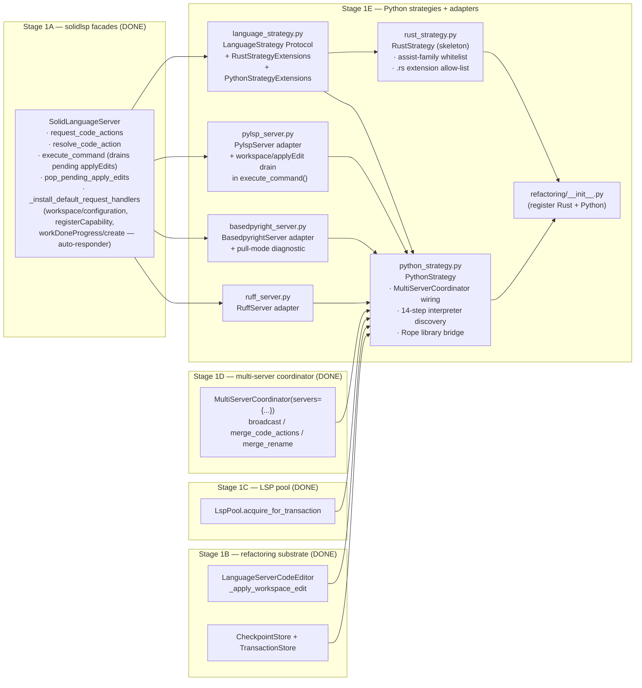
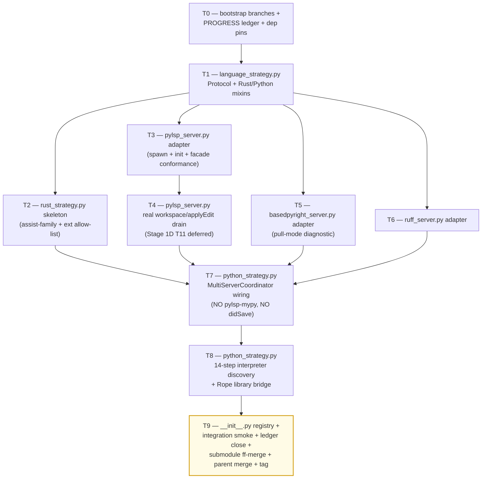

# Stage 1E — Python Strategies + LSP Adapters Implementation Plan

> **For agentic workers:** REQUIRED SUB-SKILL: Use `superpowers:subagent-driven-development` (recommended) or `superpowers:executing-plans` to implement this plan task-by-task. Steps use checkbox (`- [ ]`) syntax for tracking.

**Goal:** Land the per-language strategy plug-points and the three Python LSP adapters that Stage 1D's `MultiServerCoordinator` consumes. Concretely deliver: (1) `LanguageStrategy` Protocol + `RustStrategyExtensions` / `PythonStrategyExtensions` mixin types in `vendor/serena/src/serena/refactoring/language_strategy.py` (~250 LoC); (2) `RustStrategy` skeleton in `vendor/serena/src/serena/refactoring/rust_strategy.py` (~250 LoC) declaring the assist-family whitelist + `.rs` extension allow-list; (3) `PythonStrategy` skeleton in `vendor/serena/src/serena/refactoring/python_strategy.py` (~700 LoC) wiring `MultiServerCoordinator(servers={pylsp-rope, basedpyright, ruff})` with the 14-step interpreter discovery chain (per `specialist-python.md` §7) and the Rope library bridge (Rope 1.14.0, Python 3.10–3.13 per Phase 0 P3); (4) `__init__.py` registry update (~25 LoC) re-exporting the strategies; (5) `vendor/serena/src/solidlsp/language_servers/pylsp_server.py` (~50 LoC) — `python-lsp-server` + `pylsp-rope` adapter that **implements the real `workspace/applyEdit` reverse-request drain in `execute_command()`** (Stage 1D T11 mocked this; this plan delivers the production path); (6) `vendor/serena/src/solidlsp/language_servers/basedpyright_server.py` (~50 LoC) — adapter that calls `textDocument/diagnostic` after every `didOpen`/`didChange`/`didSave` (Phase 0 P4 PULL-mode finding) and inherits the base `_install_default_request_handlers` auto-responder set (`workspace/configuration` → `[{} for _ in items]`, `client/registerCapability` → `null`, `window/workDoneProgress/create` → `null`); (7) `vendor/serena/src/solidlsp/language_servers/ruff_server.py` (~50 LoC) — `ruff server` adapter exposing `source.organizeImports` + `quickfix` code actions. Stage 1E **MUST NOT spawn pylsp-mypy** (Phase 0 P5a outcome C — DROPPED at MVP). Stage 1E **MUST NOT inject synthetic per-step `didSave`** (the Q1 mitigation became redundant once mypy was dropped). All adapters pin `basedpyright==1.39.3` (Phase 0 Q3). Stage 1E consumes Stage 1A facades (`request_code_actions`, `resolve_code_action`, `execute_command`, `pop_pending_apply_edits`, `is_in_workspace`), Stage 1B substrate (`LanguageServerCodeEditor`, `CheckpointStore`, `TransactionStore`), Stage 1C pool (`LspPool.acquire_for_transaction`), and Stage 1D coordinator (`MultiServerCoordinator.broadcast`, `merge_code_actions`, `merge_rename`).

**Architecture:**

**Tech Stack:** Python 3.11+ (submodule venv), `pytest`, `pytest-asyncio`, `pydantic` v2, stdlib only for runtime (`asyncio`, `os`, `pathlib`, `shutil`, `subprocess`, `sys`, `json`, `logging`); `rope==1.14.0` (Phase 0 P3) added to `vendor/serena/pyproject.toml` as a runtime dependency for the library bridge; `basedpyright==1.39.3` (Phase 0 Q3) and `ruff>=0.6.0` and `python-lsp-server[rope]>=1.12.0` + `pylsp-rope>=0.1.17` declared as **optional / discovered-at-runtime** binaries (the adapters spawn them as subprocesses; missing-binary errors surface via `WaitingForLspBudget`-style typed errors at acquire time).

**Source-of-truth references:**
- [`docs/design/mvp/2026-04-24-mvp-scope-report.md`](../../design/mvp/2026-04-24-mvp-scope-report.md) — §9 (Python full coverage), §11 (multi-server protocol), §14.1 rows 11–14 (file budget for Stage 1E).
- [`docs/design/mvp/specialist-python.md`](../../design/mvp/specialist-python.md) — §3.5 spawn flags, §7 14-step interpreter discovery chain, §10 facade table (8 ship at MVP), §11 LoC re-estimate, §3.4 server-process layout.
- [`docs/superpowers/plans/spike-results/P3.md`](spike-results/P3.md) — ALL-PASS — Rope 1.14.0 + Python 3.13.3, Python 3.10–3.13+ supported. Rope library bridge in `python_strategy.py`.
- [`docs/superpowers/plans/spike-results/P4.md`](spike-results/P4.md) — basedpyright 1.39.3 PULL-mode only, blocking on `workspace/configuration`/`client/registerCapability`/`window/workDoneProgress/create`. Adapter in `basedpyright_server.py`.
- [`docs/superpowers/plans/spike-results/P5a.md`](spike-results/P5a.md) — pylsp-mypy DROPPED (verdict C). PythonStrategy MUST NOT spawn pylsp-mypy.
- [`docs/superpowers/plans/spike-results/SUMMARY.md`](spike-results/SUMMARY.md) — §5 wrapper-gap (3 Stage 1E adapters needed), §6 cross-cutting decisions (no didSave injection now that mypy is dropped).
- [`docs/superpowers/plans/2026-04-24-stage-1d-multi-server-merge.md`](2026-04-24-stage-1d-multi-server-merge.md) — Stage 1D plan; T11 deferred concern (`workspace/applyEdit` reverse-request was mocked) is resolved here in T4.
- [`docs/superpowers/plans/stage-1d-results/PROGRESS.md`](stage-1d-results/PROGRESS.md) — Stage 1D ledger; entry baseline for Stage 1E.
- Existing adapter conventions: `vendor/serena/src/solidlsp/language_servers/jedi_server.py` (Python adapter template), `vendor/serena/src/solidlsp/language_servers/pyright_server.py` (basedpyright sibling template).

---

## Scope check

Stage 1E is the per-language strategy layer + the three Python LSP adapters that the Stage 1D coordinator was written against. Stage 1D's tests use `_FakeServer` doubles whose method shapes mirror the Stage 1A facades exactly; this plan replaces those doubles with real adapters and proves end-to-end that the coordinator drives a real pylsp + basedpyright + ruff trio.

**In scope (this plan):**
1. `vendor/serena/src/serena/refactoring/language_strategy.py` — Protocol + Rust/Python mixins (~250 LoC).
2. `vendor/serena/src/serena/refactoring/rust_strategy.py` — Rust strategy skeleton (~250 LoC).
3. `vendor/serena/src/serena/refactoring/python_strategy.py` — Python strategy: multi-server orchestration + 14-step interpreter discovery + Rope library bridge (~700 LoC).
4. `vendor/serena/src/serena/refactoring/__init__.py` — register the two new strategies (~25 LoC delta).
5. `vendor/serena/src/solidlsp/language_servers/pylsp_server.py` — `python-lsp-server` + `pylsp-rope` adapter, real `workspace/applyEdit` drain (~50 LoC).
6. `vendor/serena/src/solidlsp/language_servers/basedpyright_server.py` — pull-mode diagnostic adapter (~50 LoC).
7. `vendor/serena/src/solidlsp/language_servers/ruff_server.py` — ruff LSP adapter (~50 LoC).
8. Test suite under `vendor/serena/test/spikes/test_stage_1e_*.py` (~700 LoC tests across 10 files).

**Out of scope (deferred):**
- Eight Python facades (`extract_function`, `extract_variable`, `extract_method`, `inline`, `convert_to_method_object`, `local_to_field`, `introduce_parameter`, `organize_imports`) — these consume `PythonStrategy` but ship as distinct facades in **Stage 1F**.
- `auto_import` two-step `addImport` flow — **Stage 1F** (composes basedpyright `source.addImport` over `PythonStrategy`).
- Three v1.1 Python facades (`convert_to_async`, `annotate_return_type`, `convert_from_relative_imports`) — **v1.1** per `specialist-python.md` §10.
- `RustStrategy` body (assist invocations, clippy multi-server) — **Stage 1G** (only the Protocol-conformant skeleton lands here).
- `MoveModule` / `ChangeSignature` / `IntroduceFactory` / `EncapsulateField` / `Restructure` Rope-bridge facades — **Stage 1F** (the bridge plumbing lands here; the typed facades sit above).
- Per-language MCP tool registration — **Stage 1H**.
- Plugin/skill code-generator (`o2-scalpel-newplugin`) — **Stage 1J** (per memory note `project_plugin_skill_generator`).

## File structure

| # | Path (under `vendor/serena/`) | Change | LoC | Responsibility |
|---|---|---|---|---|
| 11 | `src/serena/refactoring/language_strategy.py` | New | ~250 | `LanguageStrategy` `Protocol`; `RustStrategyExtensions` mixin (assist-family whitelist + `.rs` allow-list); `PythonStrategyExtensions` mixin (multi-server + interpreter + Rope-bridge typed surface). |
| 12 | `src/serena/refactoring/rust_strategy.py` | New | ~250 | `RustStrategy(LanguageStrategy, RustStrategyExtensions)` skeleton. |
| 13 | `src/serena/refactoring/python_strategy.py` | New | ~700 | `PythonStrategy(LanguageStrategy, PythonStrategyExtensions)`; `_PythonInterpreter` discovery (14 steps); `_RopeBridge`; `MultiServerCoordinator` wiring. |
| 14 | `src/serena/refactoring/__init__.py` | Modify | +~25 | Re-export `LanguageStrategy`, `RustStrategy`, `PythonStrategy`, `PythonInterpreter`, `RopeBridgeError`; add `STRATEGY_REGISTRY: dict[Language, type[LanguageStrategy]]`. |
| 15 | `src/solidlsp/language_servers/pylsp_server.py` | New | ~50 | `PylspServer(SolidLanguageServer)` — `python-lsp-server` (with `pylsp-rope`) launch + override `execute_command()` to drain `workspace/applyEdit` payloads after the response. |
| 16 | `src/solidlsp/language_servers/basedpyright_server.py` | New | ~50 | `BasedpyrightServer(SolidLanguageServer)` — `basedpyright-langserver --stdio`, pull-mode `textDocument/diagnostic` after `didOpen`/`didChange`/`didSave`. |
| 17 | `src/solidlsp/language_servers/ruff_server.py` | New | ~50 | `RuffServer(SolidLanguageServer)` — `ruff server` adapter exposing `source.organizeImports` + `quickfix`. |
| — | `test/spikes/test_stage_1e_*.py` | New | ~700 | TDD tests, one file per task T1..T9 (T0 is bootstrap, no test file). |

**LoC budget (production):** 250 + 250 + 700 + 25 + 50 + 50 + 50 = **1,375 LoC** (within the ~1,425 LoC budget specified by orchestrator). Tests +~700.

## Dependency graph

T1 is the linchpin: every later production file imports from it. T2 and T3 fan in parallel after T1. T4 strictly follows T3 (same file). T5 and T6 are independent of T2/T3/T4. T7 needs T2 (Python strategy must implement the same Protocol Rust does), T4 (real applyEdit drain), T5, T6. T8 follows T7 strictly (same file). T9 closes everything.

## Conventions enforced (from Phase 0 + Stage 1A–1D)

- **Submodule git-flow**: feature branch `feature/stage-1e-python-strategies` opened in both parent and `vendor/serena` submodule (T0 verifies). Submodule was not git-flow-initialized; same direct `feature/<name>` pattern as 1A/1B/1C/1D; ff-merge to `main` at T9; parent bumps pointer; parent merges feature branch to `develop`.
- **Author**: AI Hive(R) on every commit; never "Claude". Trailer: `Co-Authored-By: AI Hive(R) <noreply@o2.services>`.
- **Field name `code_language=`** on `LanguageServerConfig` (verified at `ls_config.py:596`).
- **`with srv.start_server():`** sync context manager from `ls.py:717` for any boot-real-LSP test.
- **PROGRESS.md updates as separate commits**, never `--amend`. Each task ends in two commits: code commit (in submodule) + ledger update (in parent).
- **`_FakeServer` test double** (already in `test/spikes/conftest.py` from Stage 1D T0) is reused for Protocol-conformance tests (T1–T2). Real-LSP boot tests use the actual adapters.
- **`super()._install_default_request_handlers()` first** rule: every Stage 1E adapter that overrides `_install_default_request_handlers` MUST call super first. Base class already auto-responds to `workspace/configuration`, `client/registerCapability`, `client/unregisterCapability`, `window/showMessageRequest`, `window/workDoneProgress/create`, `workspace/semanticTokens/refresh`, `workspace/diagnostic/refresh`, and the captured `workspace/applyEdit` payloads — Stage 1E adapters do not need to re-declare these.
- **Test command**: from `vendor/serena/`, run `PATH="$(pwd)/.venv/bin:$PATH" .venv/bin/pytest <path> -v`.
- **`pytest-asyncio`** is on the venv (Stage 1A confirmed). Use `@pytest.mark.asyncio` and `async def test_…`.
- **Type hints + pydantic v2** at every schema boundary; `Field(...)` validators where needed; `Literal[...]` for closed enums.
- **`Path.expanduser().resolve(strict=False)`** for canonicalisation — every path comparison goes through it (consistency with `LspPoolKey.__post_init__`).
- **`shutil.which`** for binary discovery (interpreter + LSP launchers); never hardcode `/usr/local/bin/...`.
- **No `subprocess.run(..., shell=True)`** — pass argv lists; child env explicitly seeded (`{**os.environ, "PYTHONUNBUFFERED": "1"}` for the LSP children).
- **No pylsp-mypy** — Phase 0 P5a verdict C. `python_strategy.py` MUST NOT include "pylsp-mypy" in its server set; the `multi_server.py` `ProvenanceLiteral` retains the literal for v1.1 schema compat but no spawn site.
- **No synthetic per-step `didSave` injection** — the Q1 mitigation existed solely to satisfy pylsp-mypy's stale-rate problem; with mypy dropped (P5a), the mitigation is redundant. `PythonStrategy` performs at most one `didSave` per facade call (and only when the facade explicitly requests one — e.g., before basedpyright pull-mode diagnostic).
- **`basedpyright==1.39.3`** exact pin (Phase 0 Q3) in dependency pins; the adapter asserts the version on first spawn and refuses with a typed error on mismatch.
- **`rope==1.14.0`** exact pin (Phase 0 P3) in `vendor/serena/pyproject.toml` (runtime dep) — the library bridge imports from `rope.refactor`.
- **Per-server timeout**: 2000 ms default per Stage 1D; `O2_SCALPEL_BROADCAST_TIMEOUT_MS` overrides. PythonStrategy does not override.

## Progress ledger

A new ledger `docs/superpowers/plans/stage-1e-results/PROGRESS.md` is created in T0. Schema mirrors Stage 1D: per-task row with task id, branch SHA (submodule), outcome, follow-ups. Updated as a separate parent commit after each task completes.

---

### Task 0: Bootstrap branches + PROGRESS ledger + dep pins

_(T0 detail expanded below.)_

### Task 1: `language_strategy.py` Protocol + Rust/Python mixins

_(T1 detail expanded below.)_

### Task 2: `rust_strategy.py` skeleton

_(T2 detail expanded below.)_

### Task 3: `pylsp_server.py` adapter — basic spawn/init

_(T3 detail expanded below.)_

### Task 4: `pylsp_server.py` real `workspace/applyEdit` reverse-request drain

_(T4 detail expanded below.)_

### Task 5: `basedpyright_server.py` adapter — pull-mode diagnostic

_(T5 detail expanded below.)_

### Task 6: `ruff_server.py` adapter

_(T6 detail expanded below.)_

### Task 7: `python_strategy.py` skeleton — `MultiServerCoordinator` wiring

_(T7 detail expanded below.)_

### Task 8: `python_strategy.py` 14-step interpreter discovery + Rope library bridge

_(T8 detail expanded below.)_

### Task 9: Registry + integration smoke + ledger close + submodule ff-merge + parent merge + tag

_(T9 detail expanded below.)_

---

## Self-review checklist

_(populated at end after T9 detail.)_
