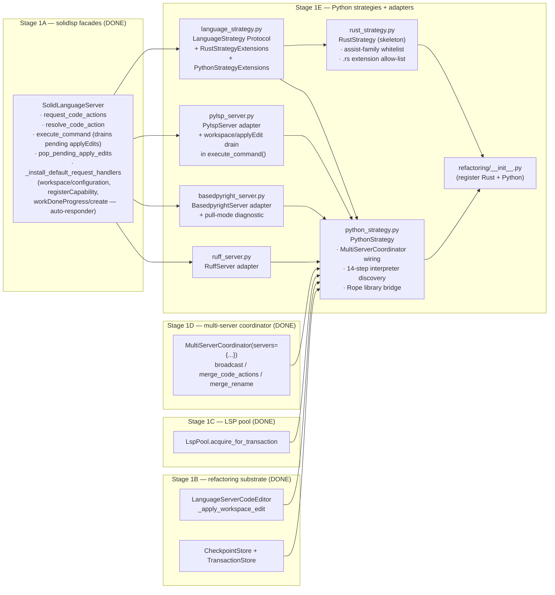
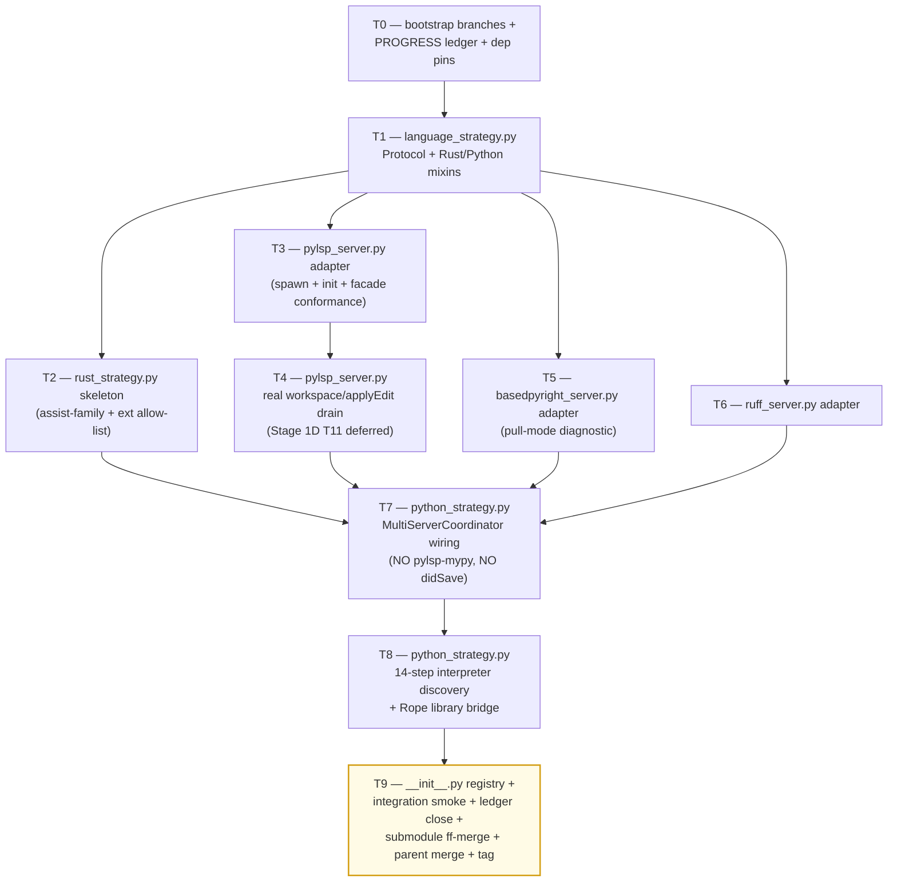

# Stage 1E — Python Strategies + LSP Adapters Implementation Plan

> **For agentic workers:** REQUIRED SUB-SKILL: Use `superpowers:subagent-driven-development` (recommended) or `superpowers:executing-plans` to implement this plan task-by-task. Steps use checkbox (`- [ ]`) syntax for tracking.

**Goal:** Land the per-language strategy plug-points and the three Python LSP adapters that Stage 1D's `MultiServerCoordinator` consumes. Concretely deliver: (1) `LanguageStrategy` Protocol + `RustStrategyExtensions` / `PythonStrategyExtensions` mixin types in `vendor/serena/src/serena/refactoring/language_strategy.py` (~250 LoC); (2) `RustStrategy` skeleton in `vendor/serena/src/serena/refactoring/rust_strategy.py` (~250 LoC) declaring the assist-family whitelist + `.rs` extension allow-list; (3) `PythonStrategy` skeleton in `vendor/serena/src/serena/refactoring/python_strategy.py` (~700 LoC) wiring `MultiServerCoordinator(servers={pylsp-rope, basedpyright, ruff})` with the 14-step interpreter discovery chain (per `specialist-python.md` §7) and the Rope library bridge (Rope 1.14.0, Python 3.10–3.13 per Phase 0 P3); (4) `__init__.py` registry update (~25 LoC) re-exporting the strategies; (5) `vendor/serena/src/solidlsp/language_servers/pylsp_server.py` (~50 LoC) — `python-lsp-server` + `pylsp-rope` adapter that **implements the real `workspace/applyEdit` reverse-request drain in `execute_command()`** (Stage 1D T11 mocked this; this plan delivers the production path); (6) `vendor/serena/src/solidlsp/language_servers/basedpyright_server.py` (~50 LoC) — adapter that calls `textDocument/diagnostic` after every `didOpen`/`didChange`/`didSave` (Phase 0 P4 PULL-mode finding) and inherits the base `_install_default_request_handlers` auto-responder set (`workspace/configuration` → `[{} for _ in items]`, `client/registerCapability` → `null`, `window/workDoneProgress/create` → `null`); (7) `vendor/serena/src/solidlsp/language_servers/ruff_server.py` (~50 LoC) — `ruff server` adapter exposing `source.organizeImports` + `quickfix` code actions. Stage 1E **MUST NOT spawn pylsp-mypy** (Phase 0 P5a outcome C — DROPPED at MVP). Stage 1E **MUST NOT inject synthetic per-step `didSave`** (the Q1 mitigation became redundant once mypy was dropped). All adapters pin `basedpyright==1.39.3` (Phase 0 Q3). Stage 1E consumes Stage 1A facades (`request_code_actions`, `resolve_code_action`, `execute_command`, `pop_pending_apply_edits`, `is_in_workspace`), Stage 1B substrate (`LanguageServerCodeEditor`, `CheckpointStore`, `TransactionStore`), Stage 1C pool (`LspPool.acquire_for_transaction`), and Stage 1D coordinator (`MultiServerCoordinator.broadcast`, `merge_code_actions`, `merge_rename`).

**Architecture:**



**Tech Stack:** Python 3.11+ (submodule venv), `pytest`, `pytest-asyncio`, `pydantic` v2, stdlib only for runtime (`asyncio`, `os`, `pathlib`, `shutil`, `subprocess`, `sys`, `json`, `logging`); `rope==1.14.0` (Phase 0 P3) added to `vendor/serena/pyproject.toml` as a runtime dependency for the library bridge; `basedpyright==1.39.3` (Phase 0 Q3) and `ruff>=0.6.0` and `python-lsp-server[rope]>=1.12.0` + `pylsp-rope>=0.1.17` declared as **optional / discovered-at-runtime** binaries (the adapters spawn them as subprocesses; missing-binary errors surface via `WaitingForLspBudget`-style typed errors at acquire time).

**Source-of-truth references:**
- [`docs/design/mvp/2026-04-24-mvp-scope-report.md`](../../design/mvp/2026-04-24-mvp-scope-report.md) — §9 (Python full coverage), §11 (multi-server protocol), §14.1 rows 11–14 (file budget for Stage 1E).
- [`docs/design/mvp/specialist-python.md`](../../design/mvp/specialist-python.md) — §3.5 spawn flags, §7 14-step interpreter discovery chain, §10 facade table (8 ship at MVP), §11 LoC re-estimate, §3.4 server-process layout.
- [`docs/superpowers/plans/spike-results/P3.md`](spike-results/P3.md) — ALL-PASS — Rope 1.14.0 + Python 3.13.3, Python 3.10–3.13+ supported. Rope library bridge in `python_strategy.py`.
- [`docs/superpowers/plans/spike-results/P4.md`](spike-results/P4.md) — basedpyright 1.39.3 PULL-mode only, blocking on `workspace/configuration`/`client/registerCapability`/`window/workDoneProgress/create`. Adapter in `basedpyright_server.py`.
- [`docs/superpowers/plans/spike-results/P5a.md`](spike-results/P5a.md) — pylsp-mypy DROPPED (verdict C). PythonStrategy MUST NOT spawn pylsp-mypy.
- [`docs/superpowers/plans/spike-results/SUMMARY.md`](spike-results/SUMMARY.md) — §5 wrapper-gap (3 Stage 1E adapters needed), §6 cross-cutting decisions (no didSave injection now that mypy is dropped).
- [`docs/superpowers/plans/2026-04-24-stage-1d-multi-server-merge.md`](2026-04-24-stage-1d-multi-server-merge.md) — Stage 1D plan; T11 deferred concern (`workspace/applyEdit` reverse-request was mocked) is resolved here in T4.
- [`docs/superpowers/plans/stage-1d-results/PROGRESS.md`](stage-1d-results/PROGRESS.md) — Stage 1D ledger; entry baseline for Stage 1E.
- Existing adapter conventions: `vendor/serena/src/solidlsp/language_servers/jedi_server.py` (Python adapter template), `vendor/serena/src/solidlsp/language_servers/pyright_server.py` (basedpyright sibling template).

---

## Scope check

Stage 1E is the per-language strategy layer + the three Python LSP adapters that the Stage 1D coordinator was written against. Stage 1D's tests use `_FakeServer` doubles whose method shapes mirror the Stage 1A facades exactly; this plan replaces those doubles with real adapters and proves end-to-end that the coordinator drives a real pylsp + basedpyright + ruff trio.

**In scope (this plan):**
1. `vendor/serena/src/serena/refactoring/language_strategy.py` — Protocol + Rust/Python mixins (~250 LoC).
2. `vendor/serena/src/serena/refactoring/rust_strategy.py` — Rust strategy skeleton (~250 LoC).
3. `vendor/serena/src/serena/refactoring/python_strategy.py` — Python strategy: multi-server orchestration + 14-step interpreter discovery + Rope library bridge (~700 LoC).
4. `vendor/serena/src/serena/refactoring/__init__.py` — register the two new strategies (~25 LoC delta).
5. `vendor/serena/src/solidlsp/language_servers/pylsp_server.py` — `python-lsp-server` + `pylsp-rope` adapter, real `workspace/applyEdit` drain (~50 LoC).
6. `vendor/serena/src/solidlsp/language_servers/basedpyright_server.py` — pull-mode diagnostic adapter (~50 LoC).
7. `vendor/serena/src/solidlsp/language_servers/ruff_server.py` — ruff LSP adapter (~50 LoC).
8. Test suite under `vendor/serena/test/spikes/test_stage_1e_*.py` (~700 LoC tests across 10 files).

**Out of scope (deferred):**
- Eight Python facades (`extract_function`, `extract_variable`, `extract_method`, `inline`, `convert_to_method_object`, `local_to_field`, `introduce_parameter`, `organize_imports`) — these consume `PythonStrategy` but ship as distinct facades in **Stage 1F**.
- `auto_import` two-step `addImport` flow — **Stage 1F** (composes basedpyright `source.addImport` over `PythonStrategy`).
- Three v1.1 Python facades (`convert_to_async`, `annotate_return_type`, `convert_from_relative_imports`) — **v1.1** per `specialist-python.md` §10.
- `RustStrategy` body (assist invocations, clippy multi-server) — **Stage 1G** (only the Protocol-conformant skeleton lands here).
- `MoveModule` / `ChangeSignature` / `IntroduceFactory` / `EncapsulateField` / `Restructure` Rope-bridge facades — **Stage 1F** (the bridge plumbing lands here; the typed facades sit above).
- Per-language MCP tool registration — **Stage 1H**.
- Plugin/skill code-generator (`o2-scalpel-newplugin`) — **Stage 1J** (per memory note `project_plugin_skill_generator`).

## File structure

| # | Path (under `vendor/serena/`) | Change | LoC | Responsibility |
|---|---|---|---|---|
| 11 | `src/serena/refactoring/language_strategy.py` | New | ~250 | `LanguageStrategy` `Protocol`; `RustStrategyExtensions` mixin (assist-family whitelist + `.rs` allow-list); `PythonStrategyExtensions` mixin (multi-server + interpreter + Rope-bridge typed surface). |
| 12 | `src/serena/refactoring/rust_strategy.py` | New | ~250 | `RustStrategy(LanguageStrategy, RustStrategyExtensions)` skeleton. |
| 13 | `src/serena/refactoring/python_strategy.py` | New | ~700 | `PythonStrategy(LanguageStrategy, PythonStrategyExtensions)`; `_PythonInterpreter` discovery (14 steps); `_RopeBridge`; `MultiServerCoordinator` wiring. |
| 14 | `src/serena/refactoring/__init__.py` | Modify | +~25 | Re-export `LanguageStrategy`, `RustStrategy`, `PythonStrategy`, `PythonInterpreter`, `RopeBridgeError`; add `STRATEGY_REGISTRY: dict[Language, type[LanguageStrategy]]`. |
| 15 | `src/solidlsp/language_servers/pylsp_server.py` | New | ~50 | `PylspServer(SolidLanguageServer)` — `python-lsp-server` (with `pylsp-rope`) launch + override `execute_command()` to drain `workspace/applyEdit` payloads after the response. |
| 16 | `src/solidlsp/language_servers/basedpyright_server.py` | New | ~50 | `BasedpyrightServer(SolidLanguageServer)` — `basedpyright-langserver --stdio`, pull-mode `textDocument/diagnostic` after `didOpen`/`didChange`/`didSave`. |
| 17 | `src/solidlsp/language_servers/ruff_server.py` | New | ~50 | `RuffServer(SolidLanguageServer)` — `ruff server` adapter exposing `source.organizeImports` + `quickfix`. |
| — | `test/spikes/test_stage_1e_*.py` | New | ~700 | TDD tests, one file per task T1..T9 (T0 is bootstrap, no test file). |

**LoC budget (production):** 250 + 250 + 700 + 25 + 50 + 50 + 50 = **1,375 LoC** (within the ~1,425 LoC budget specified by orchestrator). Tests +~700.

## Dependency graph



T1 is the linchpin: every later production file imports from it. T2 and T3 fan in parallel after T1. T4 strictly follows T3 (same file). T5 and T6 are independent of T2/T3/T4. T7 needs T2 (Python strategy must implement the same Protocol Rust does), T4 (real applyEdit drain), T5, T6. T8 follows T7 strictly (same file). T9 closes everything.

## Conventions enforced (from Phase 0 + Stage 1A–1D)

- **Submodule git-flow**: feature branch `feature/stage-1e-python-strategies` opened in both parent and `vendor/serena` submodule (T0 verifies). Submodule was not git-flow-initialized; same direct `feature/<name>` pattern as 1A/1B/1C/1D; ff-merge to `main` at T9; parent bumps pointer; parent merges feature branch to `develop`.
- **Author**: AI Hive(R) on every commit; never "Claude". Trailer: `Co-Authored-By: AI Hive(R) <noreply@o2.services>`.
- **Field name `code_language=`** on `LanguageServerConfig` (verified at `ls_config.py:596`).
- **`with srv.start_server():`** sync context manager from `ls.py:717` for any boot-real-LSP test.
- **PROGRESS.md updates as separate commits**, never `--amend`. Each task ends in two commits: code commit (in submodule) + ledger update (in parent).
- **`_FakeServer` test double** (already in `test/spikes/conftest.py` from Stage 1D T0) is reused for Protocol-conformance tests (T1–T2). Real-LSP boot tests use the actual adapters.
- **`super()._install_default_request_handlers()` first** rule: every Stage 1E adapter that overrides `_install_default_request_handlers` MUST call super first. Base class already auto-responds to `workspace/configuration`, `client/registerCapability`, `client/unregisterCapability`, `window/showMessageRequest`, `window/workDoneProgress/create`, `workspace/semanticTokens/refresh`, `workspace/diagnostic/refresh`, and the captured `workspace/applyEdit` payloads — Stage 1E adapters do not need to re-declare these.
- **Test command**: from `vendor/serena/`, run `PATH="$(pwd)/.venv/bin:$PATH" .venv/bin/pytest <path> -v`.
- **`pytest-asyncio`** is on the venv (Stage 1A confirmed). Use `@pytest.mark.asyncio` and `async def test_…`.
- **Type hints + pydantic v2** at every schema boundary; `Field(...)` validators where needed; `Literal[...]` for closed enums.
- **`Path.expanduser().resolve(strict=False)`** for canonicalisation — every path comparison goes through it (consistency with `LspPoolKey.__post_init__`).
- **`shutil.which`** for binary discovery (interpreter + LSP launchers); never hardcode `/usr/local/bin/...`.
- **No `subprocess.run(..., shell=True)`** — pass argv lists; child env explicitly seeded (`{**os.environ, "PYTHONUNBUFFERED": "1"}` for the LSP children).
- **No pylsp-mypy** — Phase 0 P5a verdict C. `python_strategy.py` MUST NOT include "pylsp-mypy" in its server set; the `multi_server.py` `ProvenanceLiteral` retains the literal for v1.1 schema compat but no spawn site.
- **No synthetic per-step `didSave` injection** — the Q1 mitigation existed solely to satisfy pylsp-mypy's stale-rate problem; with mypy dropped (P5a), the mitigation is redundant. `PythonStrategy` performs at most one `didSave` per facade call (and only when the facade explicitly requests one — e.g., before basedpyright pull-mode diagnostic).
- **`basedpyright==1.39.3`** exact pin (Phase 0 Q3) in dependency pins; the adapter asserts the version on first spawn and refuses with a typed error on mismatch.
- **`rope==1.14.0`** exact pin (Phase 0 P3) in `vendor/serena/pyproject.toml` (runtime dep) — the library bridge imports from `rope.refactor`.
- **Per-server timeout**: 2000 ms default per Stage 1D; `O2_SCALPEL_BROADCAST_TIMEOUT_MS` overrides. PythonStrategy does not override.

## Progress ledger

A new ledger `docs/superpowers/plans/stage-1e-results/PROGRESS.md` is created in T0. Schema mirrors Stage 1D: per-task row with task id, branch SHA (submodule), outcome, follow-ups. Updated as a separate parent commit after each task completes.

---

### Task 0: Bootstrap branches + PROGRESS ledger + dep pins

**Files:**
- Create: `docs/superpowers/plans/stage-1e-results/PROGRESS.md`
- Verify: parent + submodule both already on `feature/plan-stage-1e` (parent) / will create `feature/stage-1e-python-strategies` in submodule.
- Modify: `vendor/serena/pyproject.toml` — add `rope==1.14.0` runtime dep; add optional dev-dep markers for `python-lsp-server[rope]>=1.12.0`, `pylsp-rope>=0.1.17`, `basedpyright==1.39.3`, `ruff>=0.6.0`.

- [ ] **Step 1: Confirm parent branch exists and is checked out**

Run:
```bash
git -C /Volumes/Unitek-B/Projects/o2-scalpel rev-parse --abbrev-ref HEAD
```

Expected: prints `feature/plan-stage-1e` (the planning branch this file lives on). The implementation branch (`feature/stage-1e-python-strategies`) is opened in T0 step 2 once we transition from planning to execution; for the duration of *writing* this plan file, parent stays on `feature/plan-stage-1e`. The submodule branch is opened immediately in step 2 because submodule code starts changing in T1.

- [ ] **Step 2: Open submodule feature branch off `main`**

Run:
```bash
cd /Volumes/Unitek-B/Projects/o2-scalpel/vendor/serena
git fetch origin
git checkout -B feature/stage-1e-python-strategies origin/main
git rev-parse HEAD  # capture this as the Stage 1E entry SHA in PROGRESS step 5
```

Expected: HEAD points at `origin/main` tip (the SHA Stage 1D ff-merged into main). If `origin/main` is not the latest Stage 1D tip, abort and reconcile manually — Stage 1E must be built on the multi-server coordinator.

- [ ] **Step 3: Confirm Stage 1A facade primitives exist**

Run:
```bash
grep -n "def request_code_actions\|def resolve_code_action\|def execute_command\|def is_in_workspace\|def pop_pending_apply_edits\|def _install_default_request_handlers" /Volumes/Unitek-B/Projects/o2-scalpel/vendor/serena/src/solidlsp/ls.py
```

Expected: 6 hits matching the Stage 1A facade install points (`request_code_actions` ≈ line 728; `resolve_code_action`; `execute_command` ≈ line 794; `is_in_workspace` staticmethod; `pop_pending_apply_edits` ≈ line 634; `_install_default_request_handlers` ≈ line 702).

- [ ] **Step 4: Confirm Stage 1B + Stage 1C + Stage 1D substrate exists**

Run:
```bash
grep -n "class CheckpointStore\|class TransactionStore\|class LspPool\|class MultiServerCoordinator" \
  /Volumes/Unitek-B/Projects/o2-scalpel/vendor/serena/src/serena/refactoring/checkpoints.py \
  /Volumes/Unitek-B/Projects/o2-scalpel/vendor/serena/src/serena/refactoring/transactions.py \
  /Volumes/Unitek-B/Projects/o2-scalpel/vendor/serena/src/serena/refactoring/lsp_pool.py \
  /Volumes/Unitek-B/Projects/o2-scalpel/vendor/serena/src/serena/refactoring/multi_server.py
```

Expected: 4 hits across the four files. If any miss, Stage 1B/1C/1D regressed and must be repaired before Stage 1E begins.

- [ ] **Step 5: Create the PROGRESS ledger**

Write to `/Volumes/Unitek-B/Projects/o2-scalpel/docs/superpowers/plans/stage-1e-results/PROGRESS.md`:

````markdown
# Stage 1E — Python Strategies + LSP Adapters — Progress Ledger

Started: 2026-04-25
Branch: feature/stage-1e-python-strategies (submodule); feature/plan-stage-1e (parent during planning) → feature/stage-1e-python-strategies (parent during execution)
Author: AI Hive(R)
Built on: stage-1d-multi-server-merge-complete

| Task | Description | Branch SHA (submodule) | Outcome | Follow-up |
|---|---|---|---|---|
| T0 | Bootstrap branches + ledger + dep pins                             | _pending_ | _pending_ | — |
| T1 | language_strategy.py Protocol + Rust/Python mixins                 | _pending_ | _pending_ | — |
| T2 | rust_strategy.py skeleton (assist-family + ext allow-list)         | _pending_ | _pending_ | — |
| T3 | pylsp_server.py adapter (spawn/init/facade conformance)            | _pending_ | _pending_ | — |
| T4 | pylsp_server.py real workspace/applyEdit drain (1D T11 deferred)   | _pending_ | _pending_ | — |
| T5 | basedpyright_server.py adapter (pull-mode diagnostic, P4)          | _pending_ | _pending_ | — |
| T6 | ruff_server.py adapter                                             | _pending_ | _pending_ | — |
| T7 | python_strategy.py — MultiServerCoordinator wiring (no mypy)       | _pending_ | _pending_ | — |
| T8 | python_strategy.py — 14-step interpreter + Rope library bridge     | _pending_ | _pending_ | — |
| T9 | __init__.py registry + smoke + ledger close + ff-merge + tag       | _pending_ | _pending_ | — |

## Decisions log

(append-only; one bullet per decision with date + rationale)

## Stage 1D entry baseline

- Submodule `main` head at Stage 1E start: <fill in step 2 output>
- Parent branch head at Stage 1E start: <fill in via `git rev-parse HEAD` from parent at T0 close>
- Stage 1D tag: `stage-1d-multi-server-merge-complete`
- Stage 1D suite green: 303/303 (per memory note `project_stage_1d_complete`)

## Spike outcome quick-reference (carryover for context)

- P3 → ALL-PASS — Rope 1.14.0 + Python 3.10–3.13+ supported. Rope library bridge in T8.
- P4 → A — basedpyright 1.39.3 PULL-mode only; auto-responder for blocking server→client requests handled by base `_install_default_request_handlers`. Adapter delivers pull-mode in T5.
- P5a → C — pylsp-mypy DROPPED. PythonStrategy never spawns it (T7).
- Q1 cascade — synthetic per-step `didSave` injection no longer needed (was a pylsp-mypy mitigation).
- Q3 — `basedpyright==1.39.3` exact pin (T0 step 6).
````

- [ ] **Step 6: Add Python LSP runtime + dev pins to `vendor/serena/pyproject.toml`**

Open `/Volumes/Unitek-B/Projects/o2-scalpel/vendor/serena/pyproject.toml`. Locate the existing `[project]` table's `dependencies = [...]` array. Append `rope==1.14.0` to the list (the only true runtime dep — the LSP launchers are spawned subprocesses).

In the `[project.optional-dependencies]` table (create if absent), add:

```toml
[project.optional-dependencies]
python-lsps = [
    "python-lsp-server[rope]>=1.12.0",
    "pylsp-rope>=0.1.17",
    "basedpyright==1.39.3",
    "ruff>=0.6.0",
]
```

This keeps the production install lean (only `rope` for the library bridge) while letting CI / dev environments install the runtime LSPs via `pip install -e .[python-lsps]`.

Then sync the venv:

```bash
cd /Volumes/Unitek-B/Projects/o2-scalpel/vendor/serena
.venv/bin/uv pip install -e ".[python-lsps]"
.venv/bin/python -c "import rope; print(rope.VERSION)"
.venv/bin/basedpyright-langserver --version
.venv/bin/python -m pylsp --help | head -3
.venv/bin/ruff server --help | head -3
```

Expected: `rope.VERSION == "1.14.0"`; basedpyright prints `1.39.3`; pylsp and ruff print help banners.

- [ ] **Step 7: Commit T0**

```bash
cd /Volumes/Unitek-B/Projects/o2-scalpel/vendor/serena
git add pyproject.toml uv.lock 2>/dev/null || git add pyproject.toml
git commit -m "$(cat <<'EOF'
stage-1e(t0): pin rope==1.14.0 + python-lsps optional extras

- rope==1.14.0 (P3) added to runtime deps for the library bridge.
- python-lsp-server[rope]>=1.12.0, pylsp-rope>=0.1.17,
  basedpyright==1.39.3 (Q3), ruff>=0.6.0 added under
  [project.optional-dependencies] python-lsps.

Co-Authored-By: AI Hive(R) <noreply@o2.services>
EOF
)"
git rev-parse HEAD  # paste this into PROGRESS.md row T0
```

```bash
cd /Volumes/Unitek-B/Projects/o2-scalpel
git add docs/superpowers/plans/stage-1e-results/PROGRESS.md
git commit -m "$(cat <<'EOF'
stage-1e(t0): open progress ledger

Co-Authored-By: AI Hive(R) <noreply@o2.services>
EOF
)"
```

**Verification:**

```bash
cd /Volumes/Unitek-B/Projects/o2-scalpel/vendor/serena
.venv/bin/python -c "import rope; print(rope.VERSION)"
```

Expected: `1.14.0`. If anything else, T0 is not green; rerun step 6 with the exact pin.

### Task 1: `language_strategy.py` Protocol + Rust/Python mixins

**Files:**
- Create: `vendor/serena/src/serena/refactoring/language_strategy.py`
- Create: `vendor/serena/test/spikes/test_stage_1e_t1_language_strategy_protocol.py`

- [ ] **Step 1: Write failing test — Protocol exists with the required method shape**

Create `/Volumes/Unitek-B/Projects/o2-scalpel/vendor/serena/test/spikes/test_stage_1e_t1_language_strategy_protocol.py`:

```python
"""T1 — LanguageStrategy Protocol + Rust/Python extension mixins."""

from __future__ import annotations

import inspect

import pytest


def test_language_strategy_protocol_imports() -> None:
    from serena.refactoring.language_strategy import LanguageStrategy  # noqa: F401


def test_language_strategy_required_methods() -> None:
    from serena.refactoring.language_strategy import LanguageStrategy

    required = {"language_id", "extension_allow_list", "code_action_allow_list", "build_servers"}
    members = {name for name, _ in inspect.getmembers(LanguageStrategy)}
    missing = required - members
    assert not missing, f"LanguageStrategy missing required members: {missing}"


def test_rust_extensions_carry_assist_whitelist() -> None:
    from serena.refactoring.language_strategy import RustStrategyExtensions

    assist = RustStrategyExtensions.ASSIST_FAMILY_WHITELIST
    assert isinstance(assist, frozenset)
    # rust-analyzer assist kinds use the "refactor.<sub>.assist" hierarchy.
    assert any(k.startswith("refactor.") for k in assist), assist
    assert "refactor.extract" in assist or "refactor.extract.assist" in assist


def test_python_extensions_carry_three_server_set() -> None:
    from serena.refactoring.language_strategy import PythonStrategyExtensions

    assert PythonStrategyExtensions.SERVER_SET == ("pylsp-rope", "basedpyright", "ruff")
    # P5a: pylsp-mypy MUST NOT be in the active server set.
    assert "pylsp-mypy" not in PythonStrategyExtensions.SERVER_SET


def test_protocol_runtime_checkable_against_a_dummy() -> None:
    from serena.refactoring.language_strategy import LanguageStrategy

    class _Dummy:
        language_id = "dummy"
        extension_allow_list = frozenset({".dum"})
        code_action_allow_list = frozenset({"refactor"})

        def build_servers(self, project_root):  # type: ignore[no-untyped-def]
            return {}

    # Protocol must be @runtime_checkable so isinstance works.
    assert isinstance(_Dummy(), LanguageStrategy)
```

Run:
```bash
cd /Volumes/Unitek-B/Projects/o2-scalpel/vendor/serena
PATH="$(pwd)/.venv/bin:$PATH" .venv/bin/pytest test/spikes/test_stage_1e_t1_language_strategy_protocol.py -v
```

Expected: ALL FIVE FAIL with `ModuleNotFoundError: No module named 'serena.refactoring.language_strategy'`. This is the red bar that authorises the implementation.

- [ ] **Step 2: Write minimal implementation**

Create `/Volumes/Unitek-B/Projects/o2-scalpel/vendor/serena/src/serena/refactoring/language_strategy.py`:

```python
"""Per-language refactoring strategy plug-points (Stage 1E §14.1 file 11).

The ``LanguageStrategy`` Protocol is the seam between the language-agnostic
facade layer (``LanguageServerCodeEditor``, ``MultiServerCoordinator``,
``LspPool``) and the per-language plug-ins (``RustStrategy``,
``PythonStrategy``, future ``GoStrategy`` etc.). Each strategy declares:

  - ``language_id`` (matches ``Language`` enum value, e.g. ``"python"``).
  - ``extension_allow_list`` — the set of file suffixes this strategy
    will accept; facades reject other paths up-front.
  - ``code_action_allow_list`` — the set of LSP code-action kinds (or
    kind prefixes per LSP §3.18.1) this strategy considers in-scope.
    Other kinds are filtered before the multi-server merge sees them.
  - ``build_servers(project_root)`` — returns the
    ``dict[server_id, SolidLanguageServer]`` that ``MultiServerCoordinator``
    will broadcast across. Single-LSP languages return a single-entry
    dict; Python returns a three-entry dict.

The two extension mixin classes carry per-language *constants* that
sit outside the Protocol surface but that downstream tasks (T2 RustStrategy,
T7 PythonStrategy) consume directly. Keeping them as separate classes
preserves SRP: the Protocol defines the contract, the mixins carry the
language-specific constant tables.
"""

from __future__ import annotations

from pathlib import Path
from typing import Any, Protocol, runtime_checkable


@runtime_checkable
class LanguageStrategy(Protocol):
    """Per-language plug-point consumed by the language-agnostic facades."""

    language_id: str
    extension_allow_list: frozenset[str]
    code_action_allow_list: frozenset[str]

    def build_servers(self, project_root: Path) -> dict[str, Any]:
        """Spawn (or fetch from the pool) the LSP servers this strategy needs.

        :param project_root: workspace root path; canonicalised by caller.
        :return: ``{server_id: SolidLanguageServer}`` ready for
            ``MultiServerCoordinator(servers=…)``. Single-server languages
            return ``{language_id: <server>}``; Python returns three entries.
        """
        ...


class RustStrategyExtensions:
    """Constants specific to ``RustStrategy`` (consumed in T2 + Stage 1G).

    rust-analyzer exposes its refactor catalogue as *assist* code actions
    under the ``refactor.<family>.assist`` kind hierarchy (per LSP §3.18.1
    sub-kinds). The whitelist below is the closed set of assist families
    Stage 1E commits to surfacing through the facade layer; future families
    require an explicit code change so the LLM surface remains stable.
    """

    EXTENSION_ALLOW_LIST: frozenset[str] = frozenset({".rs"})

    ASSIST_FAMILY_WHITELIST: frozenset[str] = frozenset({
        "refactor.extract",
        "refactor.inline",
        "refactor.rewrite",
        "refactor.move",
        "quickfix",
        "source.organizeImports",
    })


class PythonStrategyExtensions:
    """Constants specific to ``PythonStrategy`` (consumed in T7 + T8).

    SERVER_SET is the ordered tuple of server IDs Stage 1E spawns. Order
    matters only for diff-friendly test transcripts; priority across
    servers is decided by the Stage 1D ``_apply_priority()`` table, not
    by iteration order.

    pylsp-mypy is **deliberately absent** (Phase 0 P5a outcome C). Adding
    it back requires a deliberate code change so the regression is
    visible in code review.
    """

    EXTENSION_ALLOW_LIST: frozenset[str] = frozenset({".py", ".pyi"})

    SERVER_SET: tuple[str, ...] = ("pylsp-rope", "basedpyright", "ruff")

    # Code-action kinds the Python strategy considers in-scope. Any
    # action whose kind does not match (per LSP §3.18.1 prefix rule)
    # is filtered before merge.
    CODE_ACTION_ALLOW_LIST: frozenset[str] = frozenset({
        "quickfix",
        "refactor",
        "refactor.extract",
        "refactor.inline",
        "refactor.rewrite",
        "source.organizeImports",
        "source.fixAll",
    })

    # P4: basedpyright 1.39.3 exact pin asserted at adapter spawn.
    BASEDPYRIGHT_VERSION_PIN: str = "1.39.3"

    # P3: Rope library bridge pin.
    ROPE_VERSION_PIN: str = "1.14.0"
```

- [ ] **Step 3: Re-run tests, expect green**

Run:
```bash
cd /Volumes/Unitek-B/Projects/o2-scalpel
.venv/bin/python -c "import sys; sys.path.insert(0, 'vendor/serena/src'); from serena.refactoring.language_strategy import LanguageStrategy, RustStrategyExtensions, PythonStrategyExtensions; print('OK')" || true
cd vendor/serena
PATH="$(pwd)/.venv/bin:$PATH" .venv/bin/pytest test/spikes/test_stage_1e_t1_language_strategy_protocol.py -v
```

Expected: 5/5 PASS. If any fail, reread the failing assertion and adjust ONLY the implementation to match the test (never the test).

- [ ] **Step 4: Refactor pass — confirm DRY / SOLID**

Re-read both files. Verify:
- The Protocol declares only behaviour and identifying constants — no implementation.
- The mixins carry only constants (no methods); they are pure data classes by convention.
- Type hints exhaustive; `Any` appears only on `build_servers` return value (because `SolidLanguageServer` is the actual type but importing it would create a cycle into `solidlsp` from `serena.refactoring`).

If anything fails the SRP smell test, fix and re-run the test suite.

- [ ] **Step 5: Commit T1**

```bash
cd /Volumes/Unitek-B/Projects/o2-scalpel/vendor/serena
git add src/serena/refactoring/language_strategy.py test/spikes/test_stage_1e_t1_language_strategy_protocol.py
git commit -m "$(cat <<'EOF'
stage-1e(t1): LanguageStrategy Protocol + Rust/Python extension mixins

Adds the seam between the language-agnostic facade layer and per-language
strategies. Rust mixin declares assist-family whitelist + .rs allow-list;
Python mixin declares the three-server set (pylsp-rope, basedpyright, ruff)
with pylsp-mypy DELIBERATELY ABSENT per Phase 0 P5a.

Co-Authored-By: AI Hive(R) <noreply@o2.services>
EOF
)"
git rev-parse HEAD  # paste into PROGRESS row T1
```

Update parent ledger and commit:

```bash
cd /Volumes/Unitek-B/Projects/o2-scalpel
# (manually update PROGRESS row T1: SHA, outcome=GREEN, follow-up=—)
git add docs/superpowers/plans/stage-1e-results/PROGRESS.md
git commit -m "stage-1e(t1): ledger update

Co-Authored-By: AI Hive(R) <noreply@o2.services>"
```

### Task 2: `rust_strategy.py` skeleton

**Files:**
- Create: `vendor/serena/src/serena/refactoring/rust_strategy.py`
- Create: `vendor/serena/test/spikes/test_stage_1e_t2_rust_strategy_skeleton.py`

The Rust strategy *body* (assist invocation, clippy multi-server, snippet rendering) is deferred to Stage 1G. T2 lands only the skeleton: a Protocol-conformant class with the correct identity constants and a `build_servers` that returns a single `{"rust-analyzer": <server>}` entry by acquiring from the Stage 1C `LspPool`.

- [ ] **Step 1: Write failing test — Protocol conformance + identity**

Create `/Volumes/Unitek-B/Projects/o2-scalpel/vendor/serena/test/spikes/test_stage_1e_t2_rust_strategy_skeleton.py`:

```python
"""T2 — RustStrategy skeleton: Protocol conformance + identity constants."""

from __future__ import annotations

from pathlib import Path
from unittest.mock import MagicMock

import pytest


def test_rust_strategy_imports() -> None:
    from serena.refactoring.rust_strategy import RustStrategy  # noqa: F401


def test_rust_strategy_is_a_language_strategy() -> None:
    from serena.refactoring.language_strategy import LanguageStrategy
    from serena.refactoring.rust_strategy import RustStrategy

    assert isinstance(RustStrategy(pool=MagicMock()), LanguageStrategy)


def test_rust_identity_constants() -> None:
    from serena.refactoring.rust_strategy import RustStrategy

    s = RustStrategy(pool=MagicMock())
    assert s.language_id == "rust"
    assert ".rs" in s.extension_allow_list
    # No other suffix accepted.
    assert s.extension_allow_list == frozenset({".rs"})


def test_rust_code_action_allow_list_contains_assist_families() -> None:
    from serena.refactoring.rust_strategy import RustStrategy

    s = RustStrategy(pool=MagicMock())
    # Per LSP §3.18.1 prefix rule, "refactor.extract" matches assist
    # kinds like "refactor.extract.assist".
    assert "refactor.extract" in s.code_action_allow_list
    assert "quickfix" in s.code_action_allow_list


def test_build_servers_returns_single_rust_analyzer_entry() -> None:
    from serena.refactoring.lsp_pool import LspPoolKey
    from serena.refactoring.rust_strategy import RustStrategy

    fake_server = MagicMock(name="rust-analyzer-server")
    pool = MagicMock()
    pool.acquire.return_value = fake_server

    strat = RustStrategy(pool=pool)
    out = strat.build_servers(Path("/tmp/some-rust-project"))

    assert set(out.keys()) == {"rust-analyzer"}
    assert out["rust-analyzer"] is fake_server
    pool.acquire.assert_called_once()
    key = pool.acquire.call_args.args[0]
    assert isinstance(key, LspPoolKey)
    assert key.language == "rust"


def test_build_servers_rejects_path_outside_workspace_to_existing_root() -> None:
    """build_servers does NOT validate the root path beyond passing it to the
    pool — workspace-boundary enforcement lives in the applier (Stage 1B/1D)."""
    from serena.refactoring.rust_strategy import RustStrategy

    pool = MagicMock()
    pool.acquire.return_value = MagicMock()
    strat = RustStrategy(pool=pool)
    # Path does not need to exist; pool.acquire owns spawn semantics.
    strat.build_servers(Path("/does/not/exist"))
```

Run:
```bash
cd /Volumes/Unitek-B/Projects/o2-scalpel/vendor/serena
PATH="$(pwd)/.venv/bin:$PATH" .venv/bin/pytest test/spikes/test_stage_1e_t2_rust_strategy_skeleton.py -v
```

Expected: 6/6 FAIL with `ModuleNotFoundError: No module named 'serena.refactoring.rust_strategy'`.

- [ ] **Step 2: Write minimal implementation**

Create `/Volumes/Unitek-B/Projects/o2-scalpel/vendor/serena/src/serena/refactoring/rust_strategy.py`:

```python
"""Rust refactoring strategy skeleton (Stage 1E §14.1 file 12).

Stage 1E lands only the *skeleton*: a Protocol-conformant ``RustStrategy``
that knows its identity constants and can fetch a ``rust-analyzer`` server
from the Stage 1C ``LspPool``. The full body — assist invocation, clippy
multi-server, snippet rendering, ChangeAnnotation handling — is deferred
to Stage 1G when rust-analyzer's full surface is wired through.

Stage 1E delivers the Rust skeleton (instead of leaving it for 1G entirely)
because Python and Rust must implement the *same* ``LanguageStrategy``
Protocol; landing both at once exercises the Protocol against two real
consumers and catches ergonomic problems before they become locked-in.
"""

from __future__ import annotations

from pathlib import Path
from typing import Any

from .language_strategy import LanguageStrategy, RustStrategyExtensions
from .lsp_pool import LspPool, LspPoolKey


class RustStrategy(LanguageStrategy, RustStrategyExtensions):
    """Skeleton ``LanguageStrategy`` for Rust (rust-analyzer single LSP).

    Stage 1G will fill in:
      - assist code-action invocation surface,
      - clippy as a second LSP for diagnostic enrichment (parallel to the
        Python multi-server pattern but with a smaller priority table),
      - snippet rendering for whole-file ``ChangeAnnotation`` payloads.
    """

    language_id: str = "rust"
    extension_allow_list: frozenset[str] = RustStrategyExtensions.EXTENSION_ALLOW_LIST

    # Family-level entries; LSP §3.18.1 prefix matching means rust-analyzer's
    # "refactor.extract.assist" auto-matches "refactor.extract" here.
    code_action_allow_list: frozenset[str] = RustStrategyExtensions.ASSIST_FAMILY_WHITELIST

    def __init__(self, pool: LspPool) -> None:
        """:param pool: Stage 1C ``LspPool`` used to acquire the rust-analyzer
            server. Held by reference so subsequent ``build_servers`` calls
            do not re-spawn — pool deduplicates by ``LspPoolKey``."""
        self._pool = pool

    def build_servers(self, project_root: Path) -> dict[str, Any]:
        """Return ``{"rust-analyzer": <SolidLanguageServer>}`` from the pool.

        Single-LSP language; the dict has exactly one entry. Stage 1G will
        extend this to ``{"rust-analyzer": ..., "clippy": ...}`` once the
        clippy-LSP adapter lands.
        """
        key = LspPoolKey(language=self.language_id, project_root=str(project_root))
        server = self._pool.acquire(key)
        return {"rust-analyzer": server}
```

- [ ] **Step 3: Re-run tests, expect green**

Run:
```bash
cd /Volumes/Unitek-B/Projects/o2-scalpel/vendor/serena
PATH="$(pwd)/.venv/bin:$PATH" .venv/bin/pytest test/spikes/test_stage_1e_t2_rust_strategy_skeleton.py -v
```

Expected: 6/6 PASS.

- [ ] **Step 4: Refactor pass — confirm Protocol parity is real**

Sanity check: `RustStrategy` and `PythonStrategy` (T7) MUST satisfy `isinstance(strat, LanguageStrategy)`. Run a one-liner:
```bash
cd /Volumes/Unitek-B/Projects/o2-scalpel/vendor/serena
PATH="$(pwd)/.venv/bin:$PATH" .venv/bin/python -c "
from unittest.mock import MagicMock
from serena.refactoring.language_strategy import LanguageStrategy
from serena.refactoring.rust_strategy import RustStrategy
print(isinstance(RustStrategy(pool=MagicMock()), LanguageStrategy))
"
```

Expected: `True`. If `False`, the Protocol surface and the implementation diverged — fix the implementation, never the test.

- [ ] **Step 5: Commit T2**

```bash
cd /Volumes/Unitek-B/Projects/o2-scalpel/vendor/serena
git add src/serena/refactoring/rust_strategy.py test/spikes/test_stage_1e_t2_rust_strategy_skeleton.py
git commit -m "$(cat <<'EOF'
stage-1e(t2): RustStrategy skeleton — Protocol conformance + LspPool wiring

Skeleton only — assist invocation, clippy multi-server, snippet rendering
deferred to Stage 1G. Lands here so the Protocol surface is exercised by
two real consumers (RustStrategy + PythonStrategy in T7) before either is
locked in.

Co-Authored-By: AI Hive(R) <noreply@o2.services>
EOF
)"
git rev-parse HEAD  # paste into PROGRESS row T2
```

Update parent ledger:
```bash
cd /Volumes/Unitek-B/Projects/o2-scalpel
# (manually update PROGRESS row T2)
git add docs/superpowers/plans/stage-1e-results/PROGRESS.md
git commit -m "stage-1e(t2): ledger update

Co-Authored-By: AI Hive(R) <noreply@o2.services>"
```

### Task 3: `pylsp_server.py` adapter — basic spawn/init

_(T3 detail expanded below.)_

### Task 4: `pylsp_server.py` real `workspace/applyEdit` reverse-request drain

_(T4 detail expanded below.)_

### Task 5: `basedpyright_server.py` adapter — pull-mode diagnostic

_(T5 detail expanded below.)_

### Task 6: `ruff_server.py` adapter

_(T6 detail expanded below.)_

### Task 7: `python_strategy.py` skeleton — `MultiServerCoordinator` wiring

_(T7 detail expanded below.)_

### Task 8: `python_strategy.py` 14-step interpreter discovery + Rope library bridge

_(T8 detail expanded below.)_

### Task 9: Registry + integration smoke + ledger close + submodule ff-merge + parent merge + tag

_(T9 detail expanded below.)_

---

## Self-review checklist

_(populated at end after T9 detail.)_
