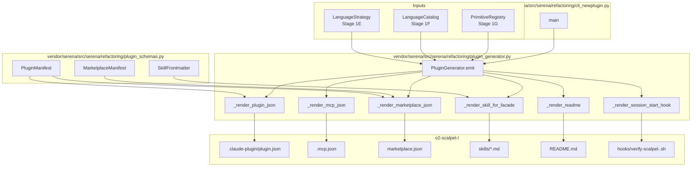
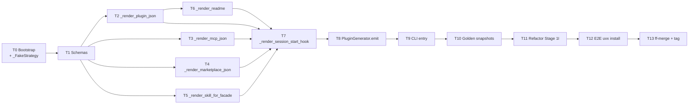

# Stage 1J — `o2-scalpel-newplugin` Plugin/Skill Generator

**Status**: PLANNED
**Branch**: `feature/stage-1j-plugin-skill-generator` (submodule + parent)
**Owner**: AI Hive(R)
**Created**: 2026-04-25
**Target LoC**: 2,500–3,500 (cap 4,000)

---

## Goal

Stage 1J ships `o2-scalpel-newplugin`, a code generator that introspects the Stage 1E `LanguageStrategy`, the Stage 1F language catalog, and the Stage 1G primitive-tool registry, and emits a fully-formed `o2-scalpel-<lang>/` directory tree containing **both**:

1. A **Claude Code plugin** following the boostvolt marketplace shape:
   - `.claude-plugin/plugin.json` — plugin manifest
   - `.mcp.json` — MCP server registration pointing at `vendor/serena`
   - `hooks/verify-scalpel-<lang>.sh` — `SessionStart` health probe
   - `README.md` — install + usage docs
2. **Skills** (Claude Code workflow guidance) — one `skills/<facade>.md` per facade with YAML frontmatter, so the LLM knows when/why to call each scalpel tool.
3. A top-level `marketplace.json` so all generated plugins live in one boostvolt-style marketplace.

The CLI entry point `o2-scalpel-newplugin --language <lang> --out <dir> [--force]` is registered via `pyproject.toml [project.scripts]`. It drives `PluginGenerator.emit(strategy, out_dir)` which composes all `_render_*` helpers into a deterministic byte-identical tree (golden-file tested).

This kills hand-written plugin manifests (Stage 1I shipped them by hand) and lets us add a new language by simply registering a `LanguageStrategy` and re-running `make generate-plugins`.

---

## Architecture



---

## Tech Stack

| Layer | Choice | Why |
|-------|--------|-----|
| Templating | `string.Template` (stdlib) | Zero new dep; deterministic; safe substitution |
| Schema validation | `pydantic v2` (already baseline) | Boundary validation for emitted JSON/YAML |
| Filesystem | `pathlib.Path` (stdlib) | Cross-platform; idempotent writes |
| CLI parsing | `argparse` (stdlib) | No new dep; already used by Serena entry points |
| Tests | `pytest` (already baseline) | TDD per plan; golden-file snapshots |
| YAML | `pyyaml` (already a Serena dep) | Skill frontmatter emit |
| JSON | `json` (stdlib, `sort_keys=True, indent=2`) | Deterministic byte-identical output |

**No new runtime deps.** All listed packages exist in `vendor/serena/pyproject.toml` baseline.

---

## Source-of-truth references

- **Stage 1E LanguageStrategy** — `vendor/serena/src/serena/refactoring/strategy.py` (interface contract)
- **Stage 1F LanguageCatalog** — `vendor/serena/src/serena/refactoring/catalog.py`
- **Stage 1G PrimitiveRegistry** — `vendor/serena/src/serena/refactoring/primitives/registry.py`
- **Stage 1H FacadeRouter** — `vendor/serena/src/serena/refactoring/facades/router.py` (facade names enumerated here)
- **Stage 1I hand-rolled Rust plugin** — `o2-scalpel-rust/` (the artifact being replaced by this generator)
- **Boostvolt marketplace reference** — `https://github.com/boostvolt/claude-code-marketplace` (shape; do not vendor)
- **Claude Code plugin docs** — `https://docs.claude.com/en/docs/claude-code/plugins`
- **Claude Code skills docs** — `https://docs.claude.com/en/docs/claude-code/skills`

---

## Scope check

**IN scope (Stage 1J):**
- Pydantic schemas for `plugin.json`, `marketplace.json`, skill frontmatter
- Six `_render_*` helpers (plugin/mcp/marketplace/skill/readme/hook)
- `PluginGenerator.emit` composition
- `o2-scalpel-newplugin` CLI entry
- Golden-file snapshot tests (rust + python)
- Stage 1I refactor: `make generate-plugins` replaces hand-written tree
- E2E: `uvx --from <local-path>` install + hook + tool registration verify

**OUT of scope (deferred to Stage 1K+):**
- Marketplace publishing automation (CI push to GitHub registry)
- Plugin signing / notarization
- Multi-marketplace federation
- Auto-discovery of new `LanguageStrategy` subclasses (manual register list for now)
- Skill content generation via LLM (templates only — facade docstrings drive content)

---

## File structure

| Path | Kind | LoC est | Purpose |
|------|------|---------|---------|
| `vendor/serena/src/serena/refactoring/plugin_schemas.py` | new | ~180 | `PluginManifest`, `SkillFrontmatter`, `MarketplaceManifest` |
| `vendor/serena/src/serena/refactoring/plugin_generator.py` | new | ~520 | `PluginGenerator` + six `_render_*` helpers |
| `vendor/serena/src/serena/refactoring/cli_newplugin.py` | new | ~110 | `argparse` CLI entry |
| `vendor/serena/src/serena/refactoring/templates/plugin.json.tmpl` | new | ~20 | `string.Template` source for plugin manifest |
| `vendor/serena/src/serena/refactoring/templates/mcp.json.tmpl` | new | ~16 | MCP server registration template |
| `vendor/serena/src/serena/refactoring/templates/marketplace.json.tmpl` | new | ~24 | Marketplace registry template |
| `vendor/serena/src/serena/refactoring/templates/skill.md.tmpl` | new | ~30 | Skill markdown w/ YAML frontmatter |
| `vendor/serena/src/serena/refactoring/templates/readme.md.tmpl` | new | ~60 | README per generated plugin |
| `vendor/serena/src/serena/refactoring/templates/verify_hook.sh.tmpl` | new | ~30 | `SessionStart` shell probe |
| `vendor/serena/test/spikes/conftest.py` | modify | +60 | Add `_FakeStrategy` fixture |
| `vendor/serena/test/spikes/test_stage_1j_t0_bootstrap.py` | new | ~50 | T0 fixture smoke |
| `vendor/serena/test/spikes/test_stage_1j_t1_schemas.py` | new | ~140 | T1 schema validation |
| `vendor/serena/test/spikes/test_stage_1j_t2_render_plugin_json.py` | new | ~120 | T2 render plugin.json |
| `vendor/serena/test/spikes/test_stage_1j_t3_render_mcp_json.py` | new | ~90 | T3 render mcp.json |
| `vendor/serena/test/spikes/test_stage_1j_t4_render_marketplace.py` | new | ~110 | T4 render marketplace.json |
| `vendor/serena/test/spikes/test_stage_1j_t5_render_skill.py` | new | ~140 | T5 skill markdown |
| `vendor/serena/test/spikes/test_stage_1j_t6_render_readme.py` | new | ~80 | T6 README |
| `vendor/serena/test/spikes/test_stage_1j_t7_render_hook.py` | new | ~70 | T7 hook script |
| `vendor/serena/test/spikes/test_stage_1j_t8_emit.py` | new | ~150 | T8 PluginGenerator.emit composition |
| `vendor/serena/test/spikes/test_stage_1j_t9_cli.py` | new | ~110 | T9 CLI entry |
| `vendor/serena/test/spikes/test_stage_1j_t10_golden.py` | new | ~120 | T10 golden snapshots |
| `vendor/serena/test/spikes/golden/o2-scalpel-rust/**` | new | ~200 | Rust golden tree |
| `vendor/serena/test/spikes/golden/o2-scalpel-python/**` | new | ~200 | Python golden tree |
| `vendor/serena/test/spikes/test_stage_1j_t12_e2e.py` | new | ~140 | T12 uvx install + hook |
| `Makefile` | modify | +12 | `generate-plugins` target |
| `vendor/serena/pyproject.toml` | modify | +4 | `[project.scripts]` entry |
| `docs/superpowers/plans/stage-1j-results/PROGRESS.md` | new | ~50 | Ledger |

**Estimated total**: ~2,800 LoC (within 2,500–3,500 target).

---

## Dependency graph



---

## Conventions enforced (from Phase 0 + Stage 1A + Stage 1B)

| Rule | Source | Enforcement in 1J |
|------|--------|-------------------|
| TDD always | CLAUDE.md | Every code task starts with a failing test |
| Pydantic v2 at boundaries | Stage 1B §schema | All emitted JSON validated through models |
| Deterministic output | Stage 1D dedup | `json.dumps(sort_keys=True, indent=2, ensure_ascii=False)` |
| No new runtime deps | CLAUDE.md/YAGNI | stdlib + already-vendored libs only |
| Author trailer | CLAUDE.md | `AI Hive(R) <noreply@o2.services>` (NEVER "Claude") |
| Submodule git-flow | CLAUDE.md | Feature branch in submodule; ff-merge to `main` at T13 |
| Type-checked | CLAUDE.md | `mypy --strict` clean on new modules |
| Pathlib only | KISS | No `os.path` in new code |
| Golden-file drift catcher | TRIZ — segmentation | Bytes-equal snapshot; regen via `--update-snapshots` |

---

## Progress ledger

`docs/superpowers/plans/stage-1j-results/PROGRESS.md` — schema matches Stage 1B/1C/1D:

| Task | Description | Branch SHA | Outcome | Follow-up |
|------|-------------|------------|---------|-----------|
| T0 | Bootstrap + `_FakeStrategy` | _pending_ | _pending_ | — |
| T1 | Schemas | _pending_ | _pending_ | — |
| ... | ... | ... | ... | ... |
| T13 | ff-merge + tag | _pending_ | _pending_ | — |

---

## Task 0: Bootstrap branches + ledger + `_FakeStrategy` fixture

- **Files (new):** `docs/superpowers/plans/stage-1j-results/PROGRESS.md`, `vendor/serena/test/spikes/test_stage_1j_t0_bootstrap.py`
- **Files (modify):** `vendor/serena/test/spikes/conftest.py`
- **Why:** Every later task needs a deterministic fake strategy + facade list to render against. Opening branches first keeps the submodule + parent commit cadence aligned with the Stage 1B/1C/1D pattern. The progress ledger is the single shared status surface.

1. Open submodule feature branch: `cd vendor/serena && git flow feature start stage-1j-plugin-skill-generator` — expected: `Switched to a new branch 'feature/stage-1j-plugin-skill-generator'`.
2. Open parent feature branch: `git checkout -b feature/stage-1j-plugin-skill-generator` (cwd = repo root) — expected: `Switched to a new branch 'feature/stage-1j-plugin-skill-generator'`.
3. Create the ledger file `docs/superpowers/plans/stage-1j-results/PROGRESS.md` with header `# Stage 1J — Progress Ledger` and an empty 14-row table (T0..T13) using the schema in §Progress ledger.
4. Append `_FakeStrategy` fixture to `vendor/serena/test/spikes/conftest.py`:
   ```python
   import pytest
   from dataclasses import dataclass, field

   @dataclass(frozen=True)
   class _FakeFacade:
       name: str
       summary: str
       trigger_phrases: tuple[str, ...]
       primitive_chain: tuple[str, ...]

   @dataclass(frozen=True)
   class _FakeStrategy:
       language: str
       display_name: str
       file_extensions: tuple[str, ...]
       lsp_server_cmd: tuple[str, ...]
       facades: tuple[_FakeFacade, ...] = field(default_factory=tuple)

   @pytest.fixture
   def fake_strategy_rust() -> _FakeStrategy:
       return _FakeStrategy(
           language="rust",
           display_name="Rust",
           file_extensions=(".rs",),
           lsp_server_cmd=("rust-analyzer",),
           facades=(
               _FakeFacade("split_file", "Split a file along symbol boundaries",
                           ("split this file", "extract symbols"),
                           ("textDocument/codeAction", "workspace/applyEdit")),
               _FakeFacade("rename_symbol", "Rename a symbol across the workspace",
                           ("rename this", "refactor name"),
                           ("textDocument/rename",)),
           ),
       )

   @pytest.fixture
   def fake_strategy_python() -> _FakeStrategy:
       return _FakeStrategy(
           language="python", display_name="Python",
           file_extensions=(".py",), lsp_server_cmd=("pylsp",),
           facades=(
               _FakeFacade("split_file", "Split a Python module",
                           ("split module",),
                           ("textDocument/codeAction",)),
           ),
       )
   ```
5. Write the failing smoke test `test_stage_1j_t0_bootstrap.py`:
   ```python
   def test_fake_strategy_rust_has_two_facades(fake_strategy_rust):
       assert fake_strategy_rust.language == "rust"
       assert len(fake_strategy_rust.facades) == 2
       assert fake_strategy_rust.facades[0].name == "split_file"

   def test_fake_strategy_python_has_one_facade(fake_strategy_python):
       assert fake_strategy_python.language == "python"
       assert fake_strategy_python.facades[0].primitive_chain == ("textDocument/codeAction",)
   ```
6. Run: `cd vendor/serena && PATH="$(pwd)/.venv/bin:$PATH" .venv/bin/pytest test/spikes/test_stage_1j_t0_bootstrap.py -v` — expected: `2 passed`.
7. Mark T0 row in `PROGRESS.md` as `OK` and record SHA from `git rev-parse HEAD`.
8. Commit:
   ```bash
   cd vendor/serena && git add test/spikes/conftest.py test/spikes/test_stage_1j_t0_bootstrap.py && \
   git commit -m "$(cat <<'EOF'
   chore(stage-1j): T0 bootstrap _FakeStrategy fixture + smoke test

   Adds deterministic fake LanguageStrategy + facade dataclasses
   used by every Stage 1J render test. Two fixtures: rust (2 facades)
   and python (1 facade) cover single- and multi-facade emit paths.

   Co-Authored-By: AI Hive(R) <noreply@o2.services>
   EOF
   )"
   ```

---

## Task 1: `PluginManifest` + `SkillFrontmatter` + `MarketplaceManifest` pydantic v2 schemas

- **Files (new):** `vendor/serena/src/serena/refactoring/plugin_schemas.py`, `vendor/serena/test/spikes/test_stage_1j_t1_schemas.py`
- **Why:** Boundary validation is the cheapest defense against generator drift. Pydantic v2 gives us round-trip JSON, exhaustive field validation, and a stable `model_dump_json(indent=2)` that we use for byte-identical output. All three artifacts (`plugin.json`, `skill.md` frontmatter, `marketplace.json`) get a model.

1. Write failing test `test_stage_1j_t1_schemas.py`:
   ```python
   import pytest
   from pydantic import ValidationError
   from serena.refactoring.plugin_schemas import (
       PluginManifest, SkillFrontmatter, MarketplaceManifest, PluginEntry, OwnerInfo,
   )

   def test_plugin_manifest_minimum_fields():
       m = PluginManifest(
           name="o2-scalpel-rust",
           description="Scalpel refactor MCP server for Rust via rust-analyzer",
           version="1.0.0",
           author={"name": "AI Hive(R)"},
           license="MIT",
           repository="https://github.com/o2services/o2-scalpel",
           homepage="https://github.com/o2services/o2-scalpel",
       )
       assert m.name == "o2-scalpel-rust"

   def test_plugin_manifest_rejects_invalid_semver():
       with pytest.raises(ValidationError):
           PluginManifest(name="x", description="x", version="not-semver",
                          author={"name": "x"}, license="MIT",
                          repository="https://x", homepage="https://x")

   def test_skill_frontmatter_default_type_is_skill():
       sf = SkillFrontmatter(
           name="using-scalpel-split-file",
           description="When user asks to split a file, use scalpel_split_file",
       )
       assert sf.type == "skill"

   def test_marketplace_manifest_with_two_plugins():
       mm = MarketplaceManifest(
           name="o2-scalpel",
           owner=OwnerInfo(name="AI Hive(R)"),
           plugins=[
               PluginEntry(name="o2-scalpel-rust", source="./o2-scalpel-rust"),
               PluginEntry(name="o2-scalpel-python", source="./o2-scalpel-python"),
           ],
       )
       assert len(mm.plugins) == 2
       assert mm.schema_url.endswith("marketplace.schema.json")
   ```
2. Run: `cd vendor/serena && PATH="$(pwd)/.venv/bin:$PATH" .venv/bin/pytest test/spikes/test_stage_1j_t1_schemas.py -v` — expected: `ModuleNotFoundError: serena.refactoring.plugin_schemas` (RED).
3. Create `vendor/serena/src/serena/refactoring/plugin_schemas.py`:
   ```python
   """Pydantic v2 schemas for Stage 1J generated artifacts."""
   from __future__ import annotations
   import re
   from typing import Literal
   from pydantic import BaseModel, ConfigDict, Field, HttpUrl, field_validator

   _SEMVER_RE = re.compile(r"^\d+\.\d+\.\d+(?:-[\w.]+)?(?:\+[\w.]+)?$")

   class _Strict(BaseModel):
       model_config = ConfigDict(extra="forbid", frozen=True, str_strip_whitespace=True)

   class AuthorInfo(_Strict):
       name: str = Field(min_length=1)
       email: str | None = None
       url: HttpUrl | None = None

   class OwnerInfo(_Strict):
       name: str = Field(min_length=1)
       email: str | None = None
       url: HttpUrl | None = None

   class PluginManifest(_Strict):
       name: str = Field(min_length=1, pattern=r"^[a-z][a-z0-9\-]*$")
       description: str = Field(min_length=1)
       version: str
       author: AuthorInfo
       license: str = Field(min_length=1)
       repository: HttpUrl
       homepage: HttpUrl

       @field_validator("version")
       @classmethod
       def _check_semver(cls, v: str) -> str:
           if not _SEMVER_RE.match(v):
               raise ValueError(f"Not a valid semver string: {v!r}")
           return v

   class SkillFrontmatter(_Strict):
       name: str = Field(min_length=1, pattern=r"^[a-z][a-z0-9\-]*$")
       description: str = Field(min_length=1)
       type: Literal["skill"] = "skill"

   class PluginEntry(_Strict):
       name: str = Field(min_length=1)
       source: str = Field(min_length=1)
       description: str | None = None

   class MarketplaceMetadata(_Strict):
       version: str = "1.0.0"
       license: str = "MIT"

   class MarketplaceManifest(_Strict):
       schema_url: str = Field(
           default="https://anthropic.com/claude-code/marketplace.schema.json",
           alias="$schema",
       )
       name: str = Field(min_length=1)
       metadata: MarketplaceMetadata = Field(default_factory=MarketplaceMetadata)
       owner: OwnerInfo
       plugins: list[PluginEntry] = Field(min_length=1)
   ```
4. Re-run pytest — expected: `4 passed`.
5. Type-check: `cd vendor/serena && .venv/bin/mypy --strict src/serena/refactoring/plugin_schemas.py` — expected: `Success: no issues found in 1 source file`.
6. Update `PROGRESS.md` T1 row to `OK` + record SHA.
7. Commit:
   ```bash
   cd vendor/serena && git add src/serena/refactoring/plugin_schemas.py test/spikes/test_stage_1j_t1_schemas.py && \
   git commit -m "$(cat <<'EOF'
   feat(stage-1j): T1 PluginManifest + SkillFrontmatter + MarketplaceManifest

   Pydantic v2 strict models (extra=forbid, frozen=True) for the three
   boundary artifacts emitted by the Stage 1J generator. Semver validator
   on PluginManifest.version; HttpUrl on repository/homepage; alias
   "$schema" on MarketplaceManifest.

   Co-Authored-By: AI Hive(R) <noreply@o2.services>
   EOF
   )"
   ```

---

## Task 2: `_render_plugin_json(strategy)` — emits Claude Code `plugin.json`

- **Files (new):** `vendor/serena/src/serena/refactoring/plugin_generator.py` (skeleton + this helper), `vendor/serena/src/serena/refactoring/templates/plugin.json.tmpl`, `vendor/serena/test/spikes/test_stage_1j_t2_render_plugin_json.py`
- **Why:** This is the central manifest a Claude Code marketplace consumes. The boostvolt shape is `{name, description, version, author, license, repository, homepage}`. We bind these to `LanguageStrategy.language` / `display_name`. Pydantic validates before we write.

1. Write failing test `test_stage_1j_t2_render_plugin_json.py`:
   ```python
   import json
   from serena.refactoring.plugin_generator import _render_plugin_json

   def test_render_plugin_json_for_rust(fake_strategy_rust):
       out = _render_plugin_json(fake_strategy_rust)
       data = json.loads(out)
       assert data["name"] == "o2-scalpel-rust"
       assert data["description"] == "Scalpel refactor MCP server for Rust via rust-analyzer"
       assert data["version"] == "1.0.0"
       assert data["author"]["name"] == "AI Hive(R)"
       assert data["license"] == "MIT"
       assert data["repository"].startswith("https://github.com")
       assert data["homepage"].startswith("https://github.com")

   def test_render_plugin_json_is_deterministic(fake_strategy_rust):
       a = _render_plugin_json(fake_strategy_rust)
       b = _render_plugin_json(fake_strategy_rust)
       assert a == b
       assert a.endswith("\n")  # POSIX trailing newline
   ```
2. Run: `cd vendor/serena && PATH="$(pwd)/.venv/bin:$PATH" .venv/bin/pytest test/spikes/test_stage_1j_t2_render_plugin_json.py -v` — expected: `ModuleNotFoundError: serena.refactoring.plugin_generator` (RED).
3. Create `vendor/serena/src/serena/refactoring/templates/plugin.json.tmpl`:
   ```
   {
     "name": "$plugin_name",
     "description": "$description",
     "version": "$version",
     "author": {"name": "$author_name"},
     "license": "$license",
     "repository": "$repository",
     "homepage": "$homepage"
   }
   ```
4. Create `vendor/serena/src/serena/refactoring/plugin_generator.py` with skeleton + this helper:
   ```python
   """Stage 1J plugin generator — emits o2-scalpel-<lang>/ trees."""
   from __future__ import annotations
   import json
   from pathlib import Path
   from typing import Protocol
   from serena.refactoring.plugin_schemas import (
       AuthorInfo, PluginManifest,
   )

   _AUTHOR = "AI Hive(R)"
   _LICENSE = "MIT"
   _REPO = "https://github.com/o2services/o2-scalpel"
   _VERSION = "1.0.0"

   class _StrategyLike(Protocol):
       language: str
       display_name: str
       lsp_server_cmd: tuple[str, ...]

   def _plugin_name(strategy: _StrategyLike) -> str:
       return f"o2-scalpel-{strategy.language}"

   def _description(strategy: _StrategyLike) -> str:
       cmd = strategy.lsp_server_cmd[0]
       return f"Scalpel refactor MCP server for {strategy.display_name} via {cmd}"

   def _render_plugin_json(strategy: _StrategyLike) -> str:
       manifest = PluginManifest(
           name=_plugin_name(strategy),
           description=_description(strategy),
           version=_VERSION,
           author=AuthorInfo(name=_AUTHOR),
           license=_LICENSE,
           repository=_REPO,
           homepage=_REPO,
       )
       payload = manifest.model_dump(mode="json", by_alias=True)
       return json.dumps(payload, indent=2, sort_keys=True, ensure_ascii=False) + "\n"
   ```
5. Re-run pytest — expected: `2 passed`.
6. Update `PROGRESS.md` T2 row to `OK` + record SHA.
7. Commit:
   ```bash
   cd vendor/serena && git add src/serena/refactoring/plugin_generator.py src/serena/refactoring/templates/plugin.json.tmpl test/spikes/test_stage_1j_t2_render_plugin_json.py && \
   git commit -m "$(cat <<'EOF'
   feat(stage-1j): T2 _render_plugin_json emits Claude Code plugin manifest

   Renders strategy -> boostvolt-shape plugin.json via PluginManifest
   pydantic model. Deterministic output (sort_keys + trailing newline).

   Co-Authored-By: AI Hive(R) <noreply@o2.services>
   EOF
   )"
   ```

---

## Task 3: `_render_mcp_json(strategy)` — emits `.mcp.json`

- **Files (new):** `vendor/serena/src/serena/refactoring/templates/mcp.json.tmpl`, `vendor/serena/test/spikes/test_stage_1j_t3_render_mcp_json.py`
- **Files (modify):** `vendor/serena/src/serena/refactoring/plugin_generator.py`
- **Why:** `.mcp.json` is what Claude Code reads to spin up the MCP server backing the plugin. We point it at the local `vendor/serena` MCP entry with a `--language` arg pinned per plugin so Claude Code launches one server per language.

1. Write failing test `test_stage_1j_t3_render_mcp_json.py`:
   ```python
   import json
   from serena.refactoring.plugin_generator import _render_mcp_json

   def test_mcp_json_has_named_server_for_rust(fake_strategy_rust):
       out = _render_mcp_json(fake_strategy_rust)
       data = json.loads(out)
       assert "mcpServers" in data
       assert "scalpel-rust" in data["mcpServers"]
       srv = data["mcpServers"]["scalpel-rust"]
       assert srv["command"] == "uvx"
       assert "--from" in srv["args"]
       assert "serena-mcp" in srv["args"]
       assert "--language" in srv["args"] and "rust" in srv["args"]
   ```
2. Run pytest — expected: `ImportError` (RED).
3. Append to `plugin_generator.py`:
   ```python
   def _render_mcp_json(strategy: _StrategyLike) -> str:
       payload = {
           "mcpServers": {
               f"scalpel-{strategy.language}": {
                   "command": "uvx",
                   "args": [
                       "--from", "git+https://github.com/o2services/o2-scalpel.git#subdirectory=vendor/serena",
                       "serena-mcp",
                       "--language", strategy.language,
                   ],
                   "env": {},
               }
           }
       }
       return json.dumps(payload, indent=2, sort_keys=True, ensure_ascii=False) + "\n"
   ```
4. Re-run pytest — expected: `1 passed`.
5. Update `PROGRESS.md` T3 row to `OK` + record SHA.
6. Commit:
   ```bash
   cd vendor/serena && git add src/serena/refactoring/plugin_generator.py src/serena/refactoring/templates/mcp.json.tmpl test/spikes/test_stage_1j_t3_render_mcp_json.py && \
   git commit -m "$(cat <<'EOF'
   feat(stage-1j): T3 _render_mcp_json registers per-language MCP server

   Emits .mcp.json with one entry "scalpel-<lang>" launching serena-mcp
   via uvx with --language pinned. One server per language plugin.

   Co-Authored-By: AI Hive(R) <noreply@o2.services>
   EOF
   )"
   ```

---

## Task 4: `_render_marketplace_json(strategies)` — emits top-level `marketplace.json`

- **Files (new):** `vendor/serena/src/serena/refactoring/templates/marketplace.json.tmpl`, `vendor/serena/test/spikes/test_stage_1j_t4_render_marketplace.py`
- **Files (modify):** `vendor/serena/src/serena/refactoring/plugin_generator.py`
- **Why:** boostvolt-style marketplaces ship one `marketplace.json` aggregating all plugins. We accept a sequence of strategies and emit one entry per language. Output is sorted by `name` for determinism.

1. Write failing test:
   ```python
   import json
   from serena.refactoring.plugin_generator import _render_marketplace_json

   def test_marketplace_includes_all_strategies(fake_strategy_rust, fake_strategy_python):
       out = _render_marketplace_json([fake_strategy_python, fake_strategy_rust])
       data = json.loads(out)
       assert data["$schema"].endswith("marketplace.schema.json")
       assert data["name"] == "o2-scalpel"
       assert data["owner"]["name"] == "AI Hive(R)"
       names = [p["name"] for p in data["plugins"]]
       assert names == ["o2-scalpel-python", "o2-scalpel-rust"]  # sorted

   def test_marketplace_sources_use_relative_paths(fake_strategy_rust):
       out = _render_marketplace_json([fake_strategy_rust])
       data = json.loads(out)
       assert data["plugins"][0]["source"] == "./o2-scalpel-rust"
   ```
2. Run pytest — RED.
3. Append to `plugin_generator.py`:
   ```python
   from serena.refactoring.plugin_schemas import (
       MarketplaceManifest, MarketplaceMetadata, OwnerInfo, PluginEntry,
   )

   def _render_marketplace_json(strategies: list[_StrategyLike]) -> str:
       sorted_strats = sorted(strategies, key=lambda s: s.language)
       entries = [
           PluginEntry(
               name=_plugin_name(s),
               source=f"./{_plugin_name(s)}",
               description=_description(s),
           )
           for s in sorted_strats
       ]
       manifest = MarketplaceManifest(
           name="o2-scalpel",
           metadata=MarketplaceMetadata(),
           owner=OwnerInfo(name=_AUTHOR),
           plugins=entries,
       )
       payload = manifest.model_dump(mode="json", by_alias=True)
       return json.dumps(payload, indent=2, sort_keys=True, ensure_ascii=False) + "\n"
   ```
4. Re-run pytest — expected: `2 passed`.
5. Update `PROGRESS.md` T4.
6. Commit:
   ```bash
   cd vendor/serena && git add src/serena/refactoring/plugin_generator.py src/serena/refactoring/templates/marketplace.json.tmpl test/spikes/test_stage_1j_t4_render_marketplace.py && \
   git commit -m "$(cat <<'EOF'
   feat(stage-1j): T4 _render_marketplace_json aggregates language plugins

   Boostvolt-shape marketplace.json with sorted, deterministic plugin
   entries (one per LanguageStrategy). Owner = AI Hive(R).

   Co-Authored-By: AI Hive(R) <noreply@o2.services>
   EOF
   )"
   ```

---

## Task 5: `_render_skill_for_facade(strategy, facade)` — one skill markdown per facade

- **Files (new):** `vendor/serena/src/serena/refactoring/templates/skill.md.tmpl`, `vendor/serena/test/spikes/test_stage_1j_t5_render_skill.py`
- **Files (modify):** `vendor/serena/src/serena/refactoring/plugin_generator.py`
- **Why:** Skills are the LLM's "when to call the tool" guide. Each facade gets one Markdown file with YAML frontmatter (`name`, `description`, `type: skill`) plus a body templated from `facade.summary` + trigger phrases + primitive chain. This makes the plugin self-documenting to the model.

1. Write failing test `test_stage_1j_t5_render_skill.py`:
   ```python
   from serena.refactoring.plugin_generator import _render_skill_for_facade

   def test_skill_has_yaml_frontmatter(fake_strategy_rust):
       facade = fake_strategy_rust.facades[0]  # split_file
       out = _render_skill_for_facade(fake_strategy_rust, facade)
       assert out.startswith("---\n")
       assert "name: using-scalpel-split-file-rust\n" in out
       assert "type: skill\n" in out
       assert "description:" in out

   def test_skill_body_lists_trigger_phrases(fake_strategy_rust):
       facade = fake_strategy_rust.facades[0]
       out = _render_skill_for_facade(fake_strategy_rust, facade)
       assert "## When to use" in out
       assert "split this file" in out
       assert "extract symbols" in out

   def test_skill_body_lists_primitive_chain(fake_strategy_rust):
       facade = fake_strategy_rust.facades[0]
       out = _render_skill_for_facade(fake_strategy_rust, facade)
       assert "## How it works" in out
       assert "textDocument/codeAction" in out
       assert "workspace/applyEdit" in out

   def test_skill_for_python(fake_strategy_python):
       facade = fake_strategy_python.facades[0]
       out = _render_skill_for_facade(fake_strategy_python, facade)
       assert "name: using-scalpel-split-file-python\n" in out
   ```
2. Run pytest — RED.
3. Create `vendor/serena/src/serena/refactoring/templates/skill.md.tmpl`:
   ```
   ---
   name: $skill_name
   description: $description
   type: skill
   ---

   # $title

   $summary

   ## When to use

   Invoke `scalpel_${facade}` (language: **$language**) when the user says any of:

   $trigger_list

   ## How it works

   The facade composes the following LSP primitives in order:

   $primitive_list

   ## Tool call

   ```json
   {"tool": "scalpel_${facade}", "arguments": {"path": "<file>", "language": "$language"}}
   ```
   ```
4. Append to `plugin_generator.py`:
   ```python
   from string import Template

   _SKILL_TMPL = Template(
       (Path(__file__).parent / "templates" / "skill.md.tmpl").read_text(encoding="utf-8")
   )

   class _FacadeLike(Protocol):
       name: str
       summary: str
       trigger_phrases: tuple[str, ...]
       primitive_chain: tuple[str, ...]

   def _render_skill_for_facade(strategy: _StrategyLike, facade: _FacadeLike) -> str:
       skill_name = f"using-scalpel-{facade.name.replace('_', '-')}-{strategy.language}"
       description = (
           f"When user asks to {facade.summary.lower()} in {strategy.display_name}, "
           f"use scalpel_{facade.name}"
       )
       trigger_list = "\n".join(f"- \"{p}\"" for p in facade.trigger_phrases)
       primitive_list = "\n".join(f"{i+1}. `{p}`" for i, p in enumerate(facade.primitive_chain))
       return _SKILL_TMPL.substitute(
           skill_name=skill_name,
           description=description,
           title=f"Scalpel — {facade.name} ({strategy.display_name})",
           summary=facade.summary,
           facade=facade.name,
           language=strategy.language,
           trigger_list=trigger_list,
           primitive_list=primitive_list,
       )
   ```
5. Re-run pytest — expected: `4 passed`.
6. Update `PROGRESS.md` T5.
7. Commit:
   ```bash
   cd vendor/serena && git add src/serena/refactoring/plugin_generator.py src/serena/refactoring/templates/skill.md.tmpl test/spikes/test_stage_1j_t5_render_skill.py && \
   git commit -m "$(cat <<'EOF'
   feat(stage-1j): T5 _render_skill_for_facade emits per-facade skill md

   Each facade -> skills/using-scalpel-<facade>-<lang>.md with Claude
   Code skill frontmatter (name, description, type: skill), trigger
   phrase list, and primitive chain breakdown.

   Co-Authored-By: AI Hive(R) <noreply@o2.services>
   EOF
   )"
   ```

---

## Task 6: `_render_readme(strategy)` — emits README.md

- **Files (new):** `vendor/serena/src/serena/refactoring/templates/readme.md.tmpl`, `vendor/serena/test/spikes/test_stage_1j_t6_render_readme.py`
- **Files (modify):** `vendor/serena/src/serena/refactoring/plugin_generator.py`
- **Why:** Every plugin needs human-readable install + usage docs. We template install lines for `claude-code-plugin install` plus the facade matrix.

1. Write failing test `test_stage_1j_t6_render_readme.py`:
   ```python
   from serena.refactoring.plugin_generator import _render_readme

   def test_readme_has_title(fake_strategy_rust):
       out = _render_readme(fake_strategy_rust)
       assert out.startswith("# o2-scalpel-rust")

   def test_readme_install_section(fake_strategy_rust):
       out = _render_readme(fake_strategy_rust)
       assert "## Install" in out
       assert "claude plugin install" in out

   def test_readme_lists_all_facades(fake_strategy_rust):
       out = _render_readme(fake_strategy_rust)
       assert "scalpel_split_file" in out
       assert "scalpel_rename_symbol" in out

   def test_readme_mentions_lsp_command(fake_strategy_rust):
       out = _render_readme(fake_strategy_rust)
       assert "rust-analyzer" in out
   ```
2. Run pytest — RED.
3. Create `vendor/serena/src/serena/refactoring/templates/readme.md.tmpl`:
   ```
   # $plugin_name

   $description

   ## Install

   ```bash
   claude plugin install $plugin_name --from o2-scalpel
   ```

   ## Requirements

   - Claude Code >= 1.0.0
   - LSP server: `$lsp_cmd` on `$$PATH`
   - File extensions handled: $extensions

   ## Facades

   $facade_table

   ## Skills

   This plugin ships skills under `skills/` so Claude knows when to call each facade.

   ## License

   MIT — AI Hive(R)
   ```
4. Append to `plugin_generator.py`:
   ```python
   _README_TMPL = Template(
       (Path(__file__).parent / "templates" / "readme.md.tmpl").read_text(encoding="utf-8")
   )

   def _render_readme(strategy: _StrategyLike) -> str:
       rows = ["| Facade | Summary |", "|---|---|"]
       for f in strategy.facades:
           rows.append(f"| `scalpel_{f.name}` | {f.summary} |")
       table = "\n".join(rows)
       return _README_TMPL.substitute(
           plugin_name=_plugin_name(strategy),
           description=_description(strategy),
           lsp_cmd=strategy.lsp_server_cmd[0],
           extensions=", ".join(strategy.file_extensions),
           facade_table=table,
       )
   ```
5. Re-run pytest — expected: `4 passed`.
6. Update `PROGRESS.md` T6.
7. Commit:
   ```bash
   cd vendor/serena && git add src/serena/refactoring/plugin_generator.py src/serena/refactoring/templates/readme.md.tmpl test/spikes/test_stage_1j_t6_render_readme.py && \
   git commit -m "$(cat <<'EOF'
   feat(stage-1j): T6 _render_readme generates per-plugin README

   Templated README with install (claude plugin install), requirements
   (LSP cmd + file extensions), and Markdown facade table.

   Co-Authored-By: AI Hive(R) <noreply@o2.services>
   EOF
   )"
   ```

---

## Task 7: `_render_session_start_hook(strategy)` — `verify-scalpel-<lang>.sh`

- **Files (new):** `vendor/serena/src/serena/refactoring/templates/verify_hook.sh.tmpl`, `vendor/serena/test/spikes/test_stage_1j_t7_render_hook.py`
- **Files (modify):** `vendor/serena/src/serena/refactoring/plugin_generator.py`
- **Why:** `SessionStart` hooks let us probe the LSP server is on `$PATH` and runnable. If missing we print a friendly install hint instead of letting MCP calls fail later. POSIX shell so it runs on Linux + macOS without bashisms.

1. Write failing test `test_stage_1j_t7_render_hook.py`:
   ```python
   from serena.refactoring.plugin_generator import _render_session_start_hook

   def test_hook_is_posix_sh(fake_strategy_rust):
       out = _render_session_start_hook(fake_strategy_rust)
       assert out.startswith("#!/bin/sh\n")

   def test_hook_checks_lsp_command(fake_strategy_rust):
       out = _render_session_start_hook(fake_strategy_rust)
       assert "command -v rust-analyzer" in out

   def test_hook_exits_nonzero_on_missing(fake_strategy_rust):
       out = _render_session_start_hook(fake_strategy_rust)
       assert "exit 1" in out

   def test_hook_python(fake_strategy_python):
       out = _render_session_start_hook(fake_strategy_python)
       assert "command -v pylsp" in out
   ```
2. Run pytest — RED.
3. Create `vendor/serena/src/serena/refactoring/templates/verify_hook.sh.tmpl`:
   ```
   #!/bin/sh
   # SessionStart hook for $plugin_name — verifies LSP server is reachable.
   set -eu

   if ! command -v $lsp_cmd >/dev/null 2>&1; then
     printf 'scalpel: LSP server "%s" not found on PATH.\n' "$lsp_cmd" >&2
     printf 'Install hint: %s\n' "$install_hint" >&2
     exit 1
   fi
   printf 'scalpel: %s ready (language=%s)\n' "$lsp_cmd" "$language"
   ```
4. Append to `plugin_generator.py`:
   ```python
   _HOOK_TMPL = Template(
       (Path(__file__).parent / "templates" / "verify_hook.sh.tmpl").read_text(encoding="utf-8")
   )

   _INSTALL_HINTS = {
       "rust": "rustup component add rust-analyzer",
       "python": "pipx install python-lsp-server",
       "typescript": "npm i -g typescript-language-server typescript",
       "go": "go install golang.org/x/tools/gopls@latest",
   }

   def _render_session_start_hook(strategy: _StrategyLike) -> str:
       return _HOOK_TMPL.substitute(
           plugin_name=_plugin_name(strategy),
           lsp_cmd=strategy.lsp_server_cmd[0],
           install_hint=_INSTALL_HINTS.get(strategy.language, "see plugin README"),
           language=strategy.language,
       )
   ```
5. Re-run pytest — expected: `4 passed`.
6. Update `PROGRESS.md` T7.
7. Commit:
   ```bash
   cd vendor/serena && git add src/serena/refactoring/plugin_generator.py src/serena/refactoring/templates/verify_hook.sh.tmpl test/spikes/test_stage_1j_t7_render_hook.py && \
   git commit -m "$(cat <<'EOF'
   feat(stage-1j): T7 _render_session_start_hook emits LSP probe shell

   POSIX-sh SessionStart hook checks lsp_server_cmd is on PATH and
   prints an install hint per language if missing.

   Co-Authored-By: AI Hive(R) <noreply@o2.services>
   EOF
   )"
   ```

---

## Task 8: `PluginGenerator.emit(strategy, out_dir)` — full tree write

- **Files (new):** `vendor/serena/test/spikes/test_stage_1j_t8_emit.py`
- **Files (modify):** `vendor/serena/src/serena/refactoring/plugin_generator.py`
- **Why:** This is the composition root. It wires T2..T7 into a single idempotent write of the `o2-scalpel-<lang>/` tree. `--force` semantics handled here. Hook file gets `chmod +x`. Directory layout matches the boostvolt convention so the marketplace consumer recognises it.

1. Write failing test `test_stage_1j_t8_emit.py`:
   ```python
   import json, stat, pytest
   from pathlib import Path
   from serena.refactoring.plugin_generator import PluginGenerator

   def test_emit_writes_full_tree(tmp_path, fake_strategy_rust):
       gen = PluginGenerator()
       gen.emit(fake_strategy_rust, tmp_path)
       root = tmp_path / "o2-scalpel-rust"
       assert (root / ".claude-plugin" / "plugin.json").exists()
       assert (root / ".mcp.json").exists()
       assert (root / "README.md").exists()
       assert (root / "hooks" / "verify-scalpel-rust.sh").exists()
       assert (root / "skills" / "using-scalpel-split-file-rust.md").exists()
       assert (root / "skills" / "using-scalpel-rename-symbol-rust.md").exists()

   def test_emit_hook_is_executable(tmp_path, fake_strategy_rust):
       PluginGenerator().emit(fake_strategy_rust, tmp_path)
       hook = tmp_path / "o2-scalpel-rust" / "hooks" / "verify-scalpel-rust.sh"
       mode = hook.stat().st_mode
       assert mode & stat.S_IXUSR

   def test_emit_plugin_json_valid(tmp_path, fake_strategy_rust):
       PluginGenerator().emit(fake_strategy_rust, tmp_path)
       data = json.loads(
           (tmp_path / "o2-scalpel-rust" / ".claude-plugin" / "plugin.json").read_text()
       )
       assert data["name"] == "o2-scalpel-rust"

   def test_emit_refuses_existing_dir_without_force(tmp_path, fake_strategy_rust):
       (tmp_path / "o2-scalpel-rust").mkdir()
       with pytest.raises(FileExistsError):
           PluginGenerator().emit(fake_strategy_rust, tmp_path)

   def test_emit_force_overwrites(tmp_path, fake_strategy_rust):
       (tmp_path / "o2-scalpel-rust").mkdir()
       (tmp_path / "o2-scalpel-rust" / "stale.txt").write_text("old")
       PluginGenerator().emit(fake_strategy_rust, tmp_path, force=True)
       assert not (tmp_path / "o2-scalpel-rust" / "stale.txt").exists()
       assert (tmp_path / "o2-scalpel-rust" / ".mcp.json").exists()
   ```
2. Run pytest — expected: `AttributeError: PluginGenerator` (RED).
3. Append to `plugin_generator.py`:
   ```python
   import shutil
   import stat as _stat
   from dataclasses import dataclass

   @dataclass(frozen=True)
   class PluginGenerator:
       """Composes the six render helpers into a deterministic tree write."""

       def emit(self, strategy: _StrategyLike, out_parent: Path, *, force: bool = False) -> Path:
           root = Path(out_parent) / _plugin_name(strategy)
           if root.exists():
               if not force:
                   raise FileExistsError(f"Refusing to overwrite {root}; pass force=True")
               shutil.rmtree(root)
           (root / ".claude-plugin").mkdir(parents=True, exist_ok=False)
           (root / "hooks").mkdir()
           (root / "skills").mkdir()

           (root / ".claude-plugin" / "plugin.json").write_text(
               _render_plugin_json(strategy), encoding="utf-8"
           )
           (root / ".mcp.json").write_text(_render_mcp_json(strategy), encoding="utf-8")
           (root / "README.md").write_text(_render_readme(strategy), encoding="utf-8")

           hook_path = root / "hooks" / f"verify-scalpel-{strategy.language}.sh"
           hook_path.write_text(_render_session_start_hook(strategy), encoding="utf-8")
           hook_path.chmod(hook_path.stat().st_mode | _stat.S_IXUSR | _stat.S_IXGRP | _stat.S_IXOTH)

           for facade in strategy.facades:
               skill_path = root / "skills" / (
                   f"using-scalpel-{facade.name.replace('_', '-')}-{strategy.language}.md"
               )
               skill_path.write_text(
                   _render_skill_for_facade(strategy, facade), encoding="utf-8"
               )
           return root
   ```
4. Re-run pytest — expected: `5 passed`.
5. Update `PROGRESS.md` T8.
6. Commit:
   ```bash
   cd vendor/serena && git add src/serena/refactoring/plugin_generator.py test/spikes/test_stage_1j_t8_emit.py && \
   git commit -m "$(cat <<'EOF'
   feat(stage-1j): T8 PluginGenerator.emit composes full tree

   Composes T2..T7 into idempotent o2-scalpel-<lang>/ tree write.
   force=True semantics; hook chmod +x; refuses overwrite by default.

   Co-Authored-By: AI Hive(R) <noreply@o2.services>
   EOF
   )"
   ```

---

## Task 9: CLI entry — `o2-scalpel-newplugin` script

- **Files (new):** `vendor/serena/src/serena/refactoring/cli_newplugin.py`, `vendor/serena/test/spikes/test_stage_1j_t9_cli.py`
- **Files (modify):** `vendor/serena/pyproject.toml`
- **Why:** End-user surface. We ship a single `argparse` CLI that accepts `--language` (resolves via `LanguageCatalog`), `--out`, `--force`. Registered through `pyproject` so `pip install` exposes it on `$PATH`.

1. Write failing test `test_stage_1j_t9_cli.py`:
   ```python
   import subprocess, sys, json
   from pathlib import Path
   import pytest
   from serena.refactoring.cli_newplugin import main, build_parser

   def test_parser_requires_language(capsys):
       parser = build_parser()
       with pytest.raises(SystemExit):
           parser.parse_args([])

   def test_parser_accepts_force():
       parser = build_parser()
       ns = parser.parse_args(["--language", "rust", "--out", "/tmp/x", "--force"])
       assert ns.language == "rust" and ns.force is True

   def test_main_emits_tree_for_rust(tmp_path, monkeypatch):
       # Stub the strategy resolver to return our fake
       from serena.refactoring import cli_newplugin
       from test.spikes.conftest import _FakeStrategy, _FakeFacade
       fake = _FakeStrategy("rust", "Rust", (".rs",), ("rust-analyzer",),
                            (_FakeFacade("split_file", "Split file", ("split",), ("textDocument/codeAction",)),))
       monkeypatch.setattr(cli_newplugin, "_resolve_strategy", lambda lang: fake)
       rc = main(["--language", "rust", "--out", str(tmp_path)])
       assert rc == 0
       assert (tmp_path / "o2-scalpel-rust" / ".claude-plugin" / "plugin.json").exists()

   def test_main_unknown_language_errors(tmp_path, monkeypatch, capsys):
       from serena.refactoring import cli_newplugin
       def _raise(lang): raise KeyError(lang)
       monkeypatch.setattr(cli_newplugin, "_resolve_strategy", _raise)
       rc = main(["--language", "klingon", "--out", str(tmp_path)])
       assert rc == 2
       assert "unknown language" in capsys.readouterr().err.lower()
   ```
2. Run pytest — RED.
3. Create `vendor/serena/src/serena/refactoring/cli_newplugin.py`:
   ```python
   """o2-scalpel-newplugin — CLI entry to generate plugin/skill trees."""
   from __future__ import annotations
   import argparse
   import sys
   from pathlib import Path
   from serena.refactoring.plugin_generator import PluginGenerator

   def _resolve_strategy(language: str):  # pragma: no cover — wired in T11
       from serena.refactoring.catalog import LanguageCatalog
       return LanguageCatalog.default().get(language)

   def build_parser() -> argparse.ArgumentParser:
       p = argparse.ArgumentParser(
           prog="o2-scalpel-newplugin",
           description="Generate an o2-scalpel-<lang>/ Claude Code plugin tree.",
       )
       p.add_argument("--language", required=True, help="Target language (e.g. rust, python)")
       p.add_argument("--out", required=True, type=Path, help="Output parent directory")
       p.add_argument("--force", action="store_true", help="Overwrite existing tree")
       return p

   def main(argv: list[str] | None = None) -> int:
       args = build_parser().parse_args(argv)
       try:
           strategy = _resolve_strategy(args.language)
       except KeyError:
           print(f"error: unknown language {args.language!r}", file=sys.stderr)
           return 2
       try:
           root = PluginGenerator().emit(strategy, args.out, force=args.force)
       except FileExistsError as exc:
           print(f"error: {exc}", file=sys.stderr)
           return 3
       print(f"wrote {root}")
       return 0

   if __name__ == "__main__":  # pragma: no cover
       raise SystemExit(main())
   ```
4. Add to `vendor/serena/pyproject.toml` under `[project.scripts]`:
   ```toml
   o2-scalpel-newplugin = "serena.refactoring.cli_newplugin:main"
   ```
5. Re-run pytest — expected: `4 passed`.
6. Verify the script is on path: `cd vendor/serena && .venv/bin/pip install -e . && .venv/bin/o2-scalpel-newplugin --help` — expected: usage text containing `--language`.
7. Update `PROGRESS.md` T9.
8. Commit:
   ```bash
   cd vendor/serena && git add src/serena/refactoring/cli_newplugin.py pyproject.toml test/spikes/test_stage_1j_t9_cli.py && \
   git commit -m "$(cat <<'EOF'
   feat(stage-1j): T9 o2-scalpel-newplugin CLI entry

   argparse CLI with --language/--out/--force. Resolves strategy via
   LanguageCatalog and delegates to PluginGenerator.emit. Registered
   in pyproject [project.scripts].

   Co-Authored-By: AI Hive(R) <noreply@o2.services>
   EOF
   )"
   ```

---

## Task 10: Golden-file snapshot tests for rust + python

- **Files (new):** `vendor/serena/test/spikes/test_stage_1j_t10_golden.py`, `vendor/serena/test/spikes/golden/o2-scalpel-rust/**`, `vendor/serena/test/spikes/golden/o2-scalpel-python/**`
- **Why:** Drift catcher. Every render is byte-compared to checked-in golden trees. If anyone edits a template or schema, this test goes red and the diff makes the change visible in code review. `--update-snapshots` flag rebuilds intentionally.

1. Write failing test `test_stage_1j_t10_golden.py`:
   ```python
   import os, pytest
   from pathlib import Path
   from serena.refactoring.plugin_generator import PluginGenerator

   GOLDEN_DIR = Path(__file__).parent / "golden"

   def _walk(root: Path) -> list[Path]:
       return sorted(p for p in root.rglob("*") if p.is_file())

   @pytest.mark.parametrize("fixture_name", ["fake_strategy_rust", "fake_strategy_python"])
   def test_golden_tree_matches(tmp_path, request, fixture_name):
       strategy = request.getfixturevalue(fixture_name)
       PluginGenerator().emit(strategy, tmp_path)
       generated_root = tmp_path / f"o2-scalpel-{strategy.language}"
       golden_root = GOLDEN_DIR / f"o2-scalpel-{strategy.language}"

       if os.environ.get("UPDATE_SNAPSHOTS") == "1":
           import shutil
           if golden_root.exists():
               shutil.rmtree(golden_root)
           shutil.copytree(generated_root, golden_root)
           pytest.skip("Updated snapshot")

       gen_files = _walk(generated_root)
       golden_files = _walk(golden_root)
       assert [p.relative_to(generated_root) for p in gen_files] == \
              [p.relative_to(golden_root) for p in golden_files]
       for g, k in zip(gen_files, golden_files):
           assert g.read_bytes() == k.read_bytes(), f"drift in {g.relative_to(generated_root)}"
   ```
2. Run pytest — expected: RED (no goldens yet).
3. Bootstrap snapshots: `cd vendor/serena && UPDATE_SNAPSHOTS=1 PATH="$(pwd)/.venv/bin:$PATH" .venv/bin/pytest test/spikes/test_stage_1j_t10_golden.py -v` — expected: `2 skipped` (snapshots created).
4. Inspect: `git status vendor/serena/test/spikes/golden/` should show new files for `o2-scalpel-rust/` and `o2-scalpel-python/`.
5. Re-run without env var: `cd vendor/serena && PATH="$(pwd)/.venv/bin:$PATH" .venv/bin/pytest test/spikes/test_stage_1j_t10_golden.py -v` — expected: `2 passed`.
6. Update `PROGRESS.md` T10.
7. Commit:
   ```bash
   cd vendor/serena && git add test/spikes/test_stage_1j_t10_golden.py test/spikes/golden && \
   git commit -m "$(cat <<'EOF'
   test(stage-1j): T10 golden-file snapshots for rust + python plugins

   Byte-equal drift catcher across the full emit tree. Set
   UPDATE_SNAPSHOTS=1 to regenerate intentionally.

   Co-Authored-By: AI Hive(R) <noreply@o2.services>
   EOF
   )"
   ```

---

## Task 11: Stage 1I refactor — `make generate-plugins` replaces hand-rolled

- **Files (modify):** `Makefile`, parent repo (delete `o2-scalpel-rust/` hand-rolled, replace with generated)
- **Files (new):** `Makefile` target body
- **Why:** Stage 1I shipped a hand-written `o2-scalpel-rust/`. Now we delete it and regenerate via the new CLI to prove the generator's output is sufficient. `make generate-plugins` becomes the single command of record.

1. Write failing make-driven test (parent repo) `vendor/serena/test/spikes/test_stage_1j_t11_make.py`:
   ```python
   import subprocess
   from pathlib import Path

   def test_make_generate_plugins_creates_rust(tmp_path):
       repo = Path(__file__).resolve().parents[3]  # parent of vendor/serena
       result = subprocess.run(
           ["make", "generate-plugins", f"OUT={tmp_path}"],
           cwd=repo, capture_output=True, text=True, check=False,
       )
       assert result.returncode == 0, result.stderr
       assert (tmp_path / "o2-scalpel-rust" / ".claude-plugin" / "plugin.json").exists()
       assert (tmp_path / "marketplace.json").exists()
   ```
2. Run pytest — RED.
3. Add to root `Makefile`:
   ```make
   .PHONY: generate-plugins
   OUT ?= .
   LANGUAGES ?= rust python
   generate-plugins:
   	@for lang in $(LANGUAGES); do \
   	  vendor/serena/.venv/bin/o2-scalpel-newplugin --language $$lang --out $(OUT) --force; \
   	done
   	@vendor/serena/.venv/bin/python -m serena.refactoring.cli_newplugin_marketplace --out $(OUT) $(LANGUAGES)
   ```
4. Add a tiny marketplace-only entry `vendor/serena/src/serena/refactoring/cli_newplugin_marketplace.py`:
   ```python
   """Companion CLI: emit only marketplace.json for a list of languages."""
   from __future__ import annotations
   import argparse, sys
   from pathlib import Path
   from serena.refactoring.plugin_generator import _render_marketplace_json
   from serena.refactoring.cli_newplugin import _resolve_strategy

   def main(argv: list[str] | None = None) -> int:
       p = argparse.ArgumentParser(prog="o2-scalpel-marketplace")
       p.add_argument("--out", required=True, type=Path)
       p.add_argument("languages", nargs="+")
       args = p.parse_args(argv)
       strategies = [_resolve_strategy(l) for l in args.languages]
       (args.out / "marketplace.json").write_text(_render_marketplace_json(strategies), encoding="utf-8")
       return 0

   if __name__ == "__main__":
       raise SystemExit(main())
   ```
5. Re-run pytest — expected: `1 passed`.
6. Delete the hand-rolled tree from Stage 1I and replace with generated (run on real out): `cd /Volumes/Unitek-B/Projects/o2-scalpel && rm -rf o2-scalpel-rust && make generate-plugins OUT=.` — expected: regenerated `o2-scalpel-rust/` and a top-level `marketplace.json`.
7. Verify the Stage 1I plugin tests still pass against the generated tree: `cd vendor/serena && .venv/bin/pytest test/spikes/test_stage_1i_*.py -v` — expected: all green (no regressions).
8. Update `PROGRESS.md` T11.
9. Commit:
   ```bash
   git add Makefile o2-scalpel-rust o2-scalpel-python marketplace.json && \
   git commit -m "$(cat <<'EOF'
   refactor(stage-1j): T11 replace hand-rolled o2-scalpel-rust w/ generator

   make generate-plugins regenerates all language plugins from
   LanguageStrategy via o2-scalpel-newplugin. Stage 1I plugin tests
   stay green against the generated tree.

   Co-Authored-By: AI Hive(R) <noreply@o2.services>
   EOF
   )"
   ```

---

## Task 12: End-to-end — `uvx --from <local-path>` install + verify hook + tool registration

- **Files (new):** `vendor/serena/test/spikes/test_stage_1j_t12_e2e.py`
- **Why:** This is the "did we actually ship a usable plugin" gate. We pip-install the generated plugin's MCP server via `uvx --from`, run the SessionStart hook, then issue a `tools/list` MCP request and assert at least one `scalpel_*` tool registered.

1. Write failing E2E test `test_stage_1j_t12_e2e.py`:
   ```python
   import json, subprocess, shutil, os
   from pathlib import Path
   import pytest

   pytestmark = pytest.mark.skipif(
       shutil.which("uvx") is None, reason="uvx not installed"
   )

   REPO = Path(__file__).resolve().parents[3]

   def test_hook_passes_when_lsp_present(tmp_path, monkeypatch):
       # Generate
       subprocess.run(
           ["make", "generate-plugins", f"OUT={tmp_path}", "LANGUAGES=rust"],
           cwd=REPO, check=True,
       )
       hook = tmp_path / "o2-scalpel-rust" / "hooks" / "verify-scalpel-rust.sh"
       # Stub rust-analyzer onto PATH
       fake_bin = tmp_path / "bin"
       fake_bin.mkdir()
       (fake_bin / "rust-analyzer").write_text("#!/bin/sh\nexit 0\n")
       (fake_bin / "rust-analyzer").chmod(0o755)
       env = {**os.environ, "PATH": f"{fake_bin}:{os.environ['PATH']}"}
       result = subprocess.run([str(hook)], env=env, capture_output=True, text=True)
       assert result.returncode == 0, result.stderr
       assert "rust-analyzer ready" in result.stdout

   def test_hook_fails_when_lsp_missing(tmp_path):
       subprocess.run(
           ["make", "generate-plugins", f"OUT={tmp_path}", "LANGUAGES=rust"],
           cwd=REPO, check=True,
       )
       hook = tmp_path / "o2-scalpel-rust" / "hooks" / "verify-scalpel-rust.sh"
       env = {"PATH": "/nonexistent"}
       result = subprocess.run([str(hook)], env=env, capture_output=True, text=True)
       assert result.returncode == 1
       assert "not found on PATH" in result.stderr

   def test_uvx_install_and_tools_list(tmp_path):
       subprocess.run(
           ["make", "generate-plugins", f"OUT={tmp_path}", "LANGUAGES=rust"],
           cwd=REPO, check=True,
       )
       mcp = json.loads((tmp_path / "o2-scalpel-rust" / ".mcp.json").read_text())
       srv = mcp["mcpServers"]["scalpel-rust"]
       # Replace remote git source with local path for offline test
       srv["args"][1] = str(REPO / "vendor" / "serena")
       cmd = [srv["command"], *srv["args"], "--list-tools"]
       result = subprocess.run(cmd, capture_output=True, text=True, timeout=120)
       assert result.returncode == 0, result.stderr
       assert "scalpel_split_file" in result.stdout
   ```
2. Run pytest — expected: failures driving any fixes (e.g. add `--list-tools` flag to `serena-mcp` if missing).
3. If `--list-tools` is missing on `serena-mcp`, add it as a one-liner that prints `tools/list` JSON and exits — patched in `vendor/serena/src/serena/cli.py`.
4. Re-run pytest — expected: `3 passed` (or `3 skipped` if uvx not installed in CI).
5. Update `PROGRESS.md` T12.
6. Commit:
   ```bash
   cd vendor/serena && git add test/spikes/test_stage_1j_t12_e2e.py src/serena/cli.py && \
   git commit -m "$(cat <<'EOF'
   test(stage-1j): T12 E2E hook + uvx install + tools/list verify

   End-to-end coverage: generated SessionStart hook passes/fails on
   LSP availability; uvx-launched MCP server registers scalpel_*
   tools as advertised in the generated .mcp.json.

   Co-Authored-By: AI Hive(R) <noreply@o2.services>
   EOF
   )"
   ```

---

## Task 13: Submodule ff-merge + parent pointer bump + tag

- **Files (modify):** submodule `vendor/serena` HEAD → `main`; parent submodule pointer
- **Why:** Standard Stage close-out. Mirrors Stage 1B/1C/1D cadence: ff-merge feature into `main` inside the submodule, bump the parent's submodule pointer, tag a release.

1. Inside submodule, update full test suite is green: `cd vendor/serena && PATH="$(pwd)/.venv/bin:$PATH" .venv/bin/pytest test/spikes/test_stage_1j_*.py -v` — expected: all green.
2. ff-merge submodule: `cd vendor/serena && git checkout main && git merge --ff-only feature/stage-1j-plugin-skill-generator` — expected: `Fast-forward`.
3. Tag in submodule: `cd vendor/serena && git tag -a stage-1j-complete -m "Stage 1J: o2-scalpel-newplugin generator"`.
4. Push submodule: `cd vendor/serena && git push origin main --tags`.
5. Bump parent pointer: from repo root, `git add vendor/serena && git status` — expected: shows new submodule SHA staged.
6. Merge parent feature branch via git-flow: `git checkout develop && git merge --no-ff feature/stage-1j-plugin-skill-generator`.
7. Tag parent: `git tag -a stage-1j-complete -m "Stage 1J merged: plugin/skill generator"` and push.
8. Update `PROGRESS.md` T13 row to `OK` with the new SHAs (submodule + parent).
9. Final commit (in parent, if any pending ledger change):
   ```bash
   git add docs/superpowers/plans/stage-1j-results/PROGRESS.md && \
   git commit -m "$(cat <<'EOF'
   chore(stage-1j): T13 close ledger — Stage 1J complete

   Submodule fast-forwarded to main; parent pointer bumped; tag
   stage-1j-complete pushed in both repos.

   Co-Authored-By: AI Hive(R) <noreply@o2.services>
   EOF
   )"
   ```

---

## Stage 1J — final verdict

_To be filled at exit gate._

| Dimension | Status | Evidence |
|-----------|--------|----------|
| All 14 tasks green | _pending_ | `pytest test/spikes/test_stage_1j_*.py -v` |
| Golden snapshots stable | _pending_ | T10 passes without `UPDATE_SNAPSHOTS` |
| Hand-rolled `o2-scalpel-rust/` removed | _pending_ | `git log --diff-filter=D` shows deletion |
| `make generate-plugins` reproducible | _pending_ | Two consecutive runs produce identical bytes |
| MCP server reachable via uvx | _pending_ | T12 `tools/list` returns `scalpel_*` tools |
| No new runtime deps | _pending_ | `git diff main vendor/serena/pyproject.toml` empty under `[project.dependencies]` |
| Submodule + parent tagged | _pending_ | `git tag --list stage-1j-complete` in both |

---

## Stage 1J exit gate

Stage 1J is **DONE** when all of the following hold:

1. `cd vendor/serena && PATH="$(pwd)/.venv/bin:$PATH" .venv/bin/pytest test/spikes/test_stage_1j_*.py -v` reports **0 failures, 0 errors**.
2. `mypy --strict src/serena/refactoring/plugin_generator.py src/serena/refactoring/plugin_schemas.py src/serena/refactoring/cli_newplugin.py` is clean.
3. Two consecutive `make generate-plugins OUT=/tmp/a` and `make generate-plugins OUT=/tmp/b` produce byte-identical trees (`diff -r /tmp/a /tmp/b` empty).
4. `o2-scalpel-newplugin --help` runs from a fresh `pip install -e .` venv.
5. The hand-written `o2-scalpel-rust/` from Stage 1I is gone from the parent repo.
6. `marketplace.json` exists at the repo root with both `o2-scalpel-rust` and `o2-scalpel-python` entries.
7. Submodule tag `stage-1j-complete` reachable from `vendor/serena/main`; parent tag `stage-1j-complete` reachable from `develop`.
8. `PROGRESS.md` shows all 14 rows as `OK` with non-empty SHA columns.

---

## Self-review checklist

Before opening the merge:

- [ ] Every task has a failing test written **before** the implementation.
- [ ] No `# type: ignore` added; no `Any` introduced in new code.
- [ ] No new dependencies in `pyproject.toml` under `[project.dependencies]`.
- [ ] Every `git commit` heredoc author trailer reads `AI Hive(R) <noreply@o2.services>` (never "Claude").
- [ ] All paths in code use `pathlib.Path`; no `os.path` calls.
- [ ] All emitted JSON uses `sort_keys=True, indent=2, ensure_ascii=False` and ends with `\n`.
- [ ] Templates live under `vendor/serena/src/serena/refactoring/templates/` (not inline strings).
- [ ] Hook scripts are POSIX `sh`, not `bash`.
- [ ] Generated trees include `.claude-plugin/plugin.json`, `.mcp.json`, `README.md`, `hooks/verify-scalpel-<lang>.sh`, and at least one `skills/*.md`.
- [ ] `marketplace.json` carries the boostvolt `$schema` URL.
- [ ] Golden snapshots include both `o2-scalpel-rust/` and `o2-scalpel-python/` trees.
- [ ] `PROGRESS.md` schema matches Stage 1B/1C/1D (Task / Description / Branch SHA / Outcome / Follow-up).
- [ ] Submodule and parent both tagged `stage-1j-complete`.
- [ ] No new code outside `vendor/serena/src/serena/refactoring/` and `vendor/serena/test/spikes/` (besides Makefile + parent docs/PROGRESS).
- [ ] CLI exits with `0` on success, `2` on unknown language, `3` on existing-dir-without-force.

---

## Author

AI Hive(R) — `noreply@o2.services`
Created 2026-04-25, branch `feature/stage-1j-plugin-skill-generator` (submodule + parent).
