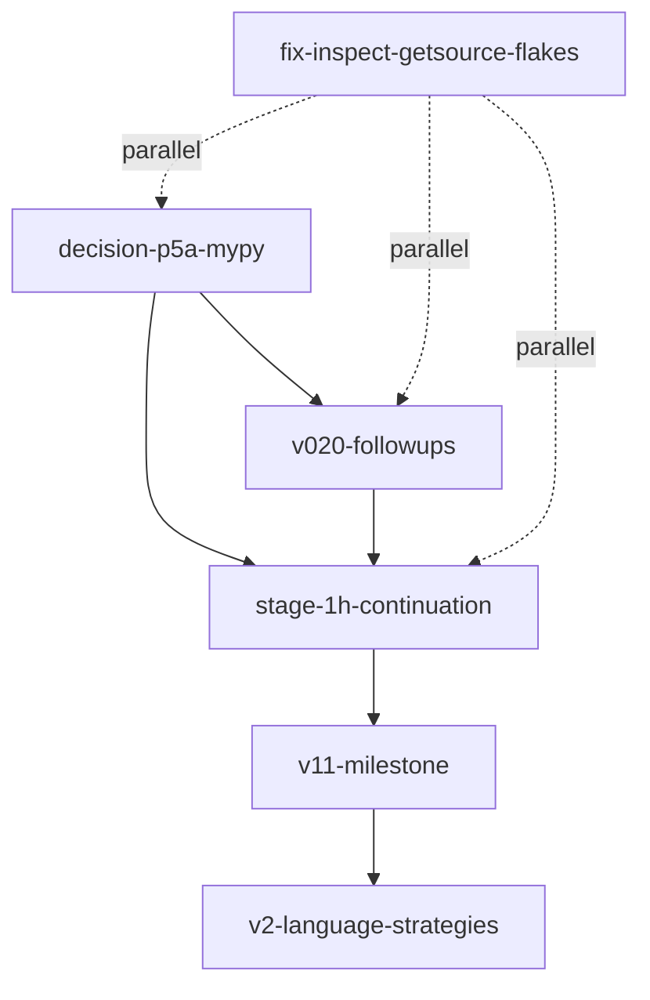

# Post-v0.3.0 Portfolio — Execution Plan Index

> **For agentic workers:** REQUIRED SUB-SKILL: Use [`superpowers:subagent-driven-development`](https://github.com/anthropics/claude-plugins-official) (recommended) or [`superpowers:executing-plans`](https://github.com/anthropics/claude-plugins-official) to implement each sub-plan task-by-task. Each leaf uses checkbox (`- [ ]`) syntax for tracking and follows the [`superpowers:writing-plans`](https://github.com/anthropics/claude-plugins-official) skill template.

**Goal:** Drive o2-scalpel from v0.3.0 (functionally complete) through v1.1 (marketplace + persistent checkpoints + first-class Python facades) and into v2+ (multi-language strategies).

**Architecture:** Six independent workstreams (2 single-doc, 4 multi-leaf trees) chained by the cross-stream dependency graph below. Each stream is independently executable; cross-stream blockers are stated in per-tree READMEs and surfaced in the Mermaid graph. Two streams are atomic decisions/fixes; four are TREE plans with 5–8 leaves each.

**Tech Stack:** Python 3.11+, `pydantic` v2, `pytest` + `pytest-asyncio`, `multilspy`, `rust-analyzer`, `pylsp` + `basedpyright` + `ruff`, future LSPs (`vtsls`, `gopls`, `clangd`, `jdtls`).

---

## Source of truth

This INDEX summarizes the workstreams; it does **not** restate scope. The authoritative spec is [`../gap-analysis/WHAT-REMAINS.md`](../gap-analysis/WHAT-REMAINS.md). The supporting investigation lives in [`../gap-analysis/`](../gap-analysis/) (`A-plans.md`, `B-design.md`, `C-code.md`, `D-debt.md` + coordinator + pair synthesis).

---

## Workstream catalog

| # | Stream | Shape | Spec citation | Size | Depends-on |
|---|---|---|---|---|---|
| 1 | [`decision-p5a-mypy`](./2026-04-26-decision-p5a-mypy.md) | SINGLE-DOC | [WHAT-REMAINS §1](../gap-analysis/WHAT-REMAINS.md#1-decisions-to-reconcile-highest-priority--small-but-blocking) | S | — |
| 2 | [`fix-inspect-getsource-flakes`](./2026-04-26-fix-inspect-getsource-flakes.md) | SINGLE-DOC | [WHAT-REMAINS §2 sub-section](../gap-analysis/WHAT-REMAINS.md#the-6-inspectgetsourceclsapply-flakes) | S | — |
| 3 | [`v020-followups`](./2026-04-26-v020-followups/README.md) | TREE-of-5 | [WHAT-REMAINS §4](../gap-analysis/WHAT-REMAINS.md#4-v020-follow-ups-next-up-planned) | M | `decision-p5a-mypy` |
| 4 | [`stage-1h-continuation`](./2026-04-26-stage-1h-continuation/README.md) | TREE-of-6 | [WHAT-REMAINS §3](../gap-analysis/WHAT-REMAINS.md#3-honest-mvp-gaps-deferred-from-mvp-cut-scoped-by-plan) | L (~8,650 LoC) | `decision-p5a-mypy`, `v020-followups` |
| 5 | [`v11-milestone`](./2026-04-26-v11-milestone/README.md) | TREE-of-8 | [WHAT-REMAINS §5](../gap-analysis/WHAT-REMAINS.md#5-v11--marketplace) | L | `stage-1h-continuation` |
| 6 | [`v2-language-strategies`](./2026-04-26-v2-language-strategies/README.md) | TREE-of-5 | [WHAT-REMAINS §6](../gap-analysis/WHAT-REMAINS.md#6-v2-language-strategies) | L (per-language) | `v11-milestone` |

**Total artifacts:** 1 INDEX + 2 single-doc + 4 README + 24 leaves = **31 files**. Sub-plan-leaf count: **24** (calcpy monolith canonicalized in `stage-1h-continuation/06`; not duplicated under `v020-followups`).

## Cross-stream dependency graph

Streams 1 and 2 are atomic and parallelizable. Stream 3 follows Stream 1. Stream 4 follows Streams 1+3 (per-tree README §Cross-stream dependencies enumerates the leaf-04 `basedpyright` precondition). Stream 5 follows Stream 4 per [WHAT-REMAINS §Recommended-sequencing item 5](../gap-analysis/WHAT-REMAINS.md#recommended-sequencing). Stream 6 follows Stream 5 per item 6.

## How to execute

1. Read [`../gap-analysis/WHAT-REMAINS.md`](../gap-analysis/WHAT-REMAINS.md) §Recommended-sequencing for the rationale behind the order above.
2. Pick the next un-blocked stream. For TREE streams, open the per-tree `README.md` to see leaf order + intra-tree Mermaid graph.
3. Execute each leaf via [`superpowers:subagent-driven-development`](https://github.com/anthropics/claude-plugins-official) (current session) or [`superpowers:executing-plans`](https://github.com/anthropics/claude-plugins-official) (separate session with review checkpoints). Both consume the leaf's bite-sized TDD steps directly.
4. Tag a release after each significant stream completes (per project `CLAUDE.md` Releases rule).

## Skill pointers

Cross-cutting concerns are referenced via skill pointer, never repeated inline in leaves:

- [`superpowers:writing-plans`](https://github.com/anthropics/claude-plugins-official) — bite-sized 2–5 minute steps; full TDD cycle per task.
- [`superpowers:test-driven-development`](https://github.com/anthropics/claude-plugins-official) — failing test → implement → passing test → commit.
- [`superpowers:executing-plans`](https://github.com/anthropics/claude-plugins-official) and [`superpowers:subagent-driven-development`](https://github.com/anthropics/claude-plugins-official) — execution audiences.
- Project [`CLAUDE.md`](../../CLAUDE.md) — SOLID/KISS/DRY/YAGNI/TRIZ; type-safety with full hints + pydantic at boundaries; sizing in S/M/L or LoC; author `AI Hive(R)`; no emoji; Mermaid not ASCII; reference evidence by `file:section`.

## Out of scope by design

Items the gap-analysis explicitly declines to plan; see [WHAT-REMAINS §Out of scope by design](../gap-analysis/WHAT-REMAINS.md#out-of-scope-by-design-for-completeness) for the full enumerated list (e.g., `experimental/onEnter`, filesystem watcher on plugin cache, native IDE integrations, Test Explorer family, `viewHir` / `viewMir` / etc.).

---

*Author: AI Hive(R)*
