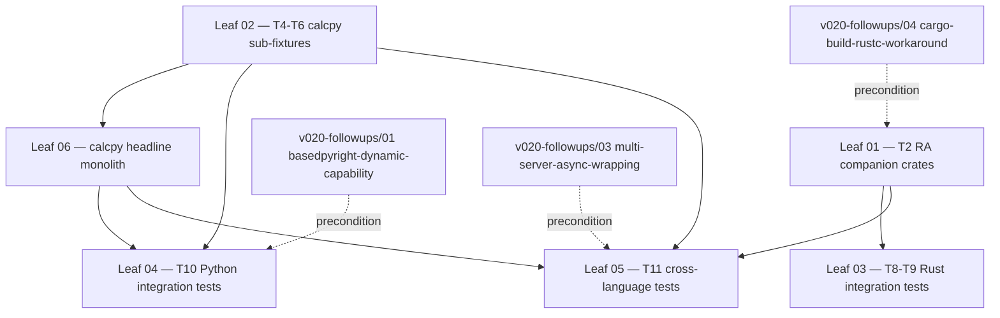

# Stage 1H Continuation — Deferred Fixtures + Integration Tests

**Tree goal:** Land the deferred ~91% of the original Stage 1H plan — 17 RA companion crates, 3 calcpy sub-fixtures, the calcpy headline monolith, and 31 integration test modules (~70 sub-tests) covering Rust assist families, Python rope-bridge facades, and the cross-language multi-server merge invariants — restoring the coverage-breadth claim the design report promised but the v0.1.0 cut deferred.

## Scope context

The v0.1.0 cut (~810 LoC, ~9 % of plan) shipped only T0, T1-min, T3-min, T7, and T-smoke. This tree closes the remaining work across six leaves, each anchored to one or more original Stage 1H task numbers (T2, T4–T6, T8, T9, T10, T11, plus the calcpy headline monolith called out in the project memory `project_v0_2_0_stage_3_complete.md`).

## Leaf table

| # | T-numbers | Slug | Goal | Honest LoC | Spec budget | Depends-on | Blocks |
|---|---|---|---|---|---|---|---|
| 01 | T2 | `01-T2-rust-analyzer-companion-crates` | 17 RA companion crates atop the existing 1-crate `calcrs` workspace | ~3,230 fixture | ~2,500 | `v020-followups/04-cargo-build-rustc-workaround` | leaves 03, 05 |
| 02 | T4, T5, T6 | `02-T4-T6-calcpy-sub-fixtures` | 3 calcpy sub-fixtures (`calcpy_circular`, `calcpy_dataclasses`, `calcpy_notebooks`) atop the existing `calcpy/core.py` skeleton (T3-min), alongside the `calcpy_namespace/` sub-fixture which was deferred | ~530 fixture | ~1,500 | none | leaves 04, 05, 06 |
| 03 | T8, T9 | `03-T8-T9-rust-assist-integration-tests` | 16 Rust assist-family integration tests (extract / inline / move / rewrite / generators / convert / pattern / lifetimes / SSR / macros / quickfix / term-search / workspace-edit-shapes) | ~2,120 test | ~2,200 | leaf 01 | leaf-tree close |
| 04 | T10 | `04-T10-python-integration-tests` | 8 Python integration tests (rope-bridge facades + pylsp + basedpyright + ruff full multi-LSP merge) | ~950 test | ~1,100 | leaf 02, **`v020-followups/01-basedpyright-dynamic-capability` (precondition)** | leaf-tree close |
| 05 | T11 | `05-T11-cross-language-multi-server-tests` | 7 cross-language multi-server invariant tests (organize / boundary / apply-cleanly / syntactic / disabled / namespace / circular) | ~910 test | ~600 | leaves 01, 02, **`v020-followups/03-multi-server-async-wrapping` (precondition)** | leaf-tree close |
| 06 | calcpy headline | `06-calcpy-monolith-headline` | ~950 LoC headline `calcpy.py` monolith + stub + 4 baseline test modules + frozen `expected/baseline.txt` (the file Stage 2 split-flow exercises) | ~1,105 fixture (net-new) | ~950 | leaf 02 (sub-fixture pyproject pattern) | leaves 04 sub-tests touching `calcpy` (`test_assist_*_py.py`) |

### Reconciled LoC sum

Honest leaf-body sum: **~8,845 LoC** (3,230 + 530 + 2,120 + 950 + 910 + 1,105). MASTER §3 Brief 4 (line 185) and §1 stream catalog (line 44) cite **~8,650 LoC** as the original-spec budget for this stream; the **+~195 LoC honest delta** is attributable to (a) leaf 01 carrying 4 deferred-baseline crates from T1's reduced cut (raising the spec's "13 additional crates" envelope to 17 actual crates), and (b) leaf 05 surfacing the original-plan §14.1 row total of ~910 LoC for the 7 multi-server tests rather than the conservative ~600 deduplication estimate. Each leaf body cites its own honest figure plus the spec budget envelope it sits within.

> **Test-module count clarification.** MASTER §1 line 44 and §3 Brief 4 cite "~28 tests"; the honest count of new test modules in this tree is **31** (16 Rust assist tests in leaf 03 + 8 Python tests in leaf 04 + 7 cross-language tests in leaf 05). The MASTER's 28 figure tracks deferred tests after subtracting T1+T-smoke (which v0.1.0 partially shipped); the synthesizer should reconcile MASTER's INDEX to 31 or footnote the difference.

## Cross-stream dependencies

- **Leaf 04 precondition:** `v020-followups/01-basedpyright-dynamic-capability` MUST land first. Without runtime capability discovery, the `WorkspaceHealth` and 3-server merge tests for Python (T10 sub-tests) cannot deterministically assert basedpyright participation — see the `PROGRESS.md:36` note that the static catalog excludes it.
- **Leaf 05 precondition:** `v020-followups/03-multi-server-async-wrapping` MUST land first. Without `asyncio.to_thread` wrapping in `MultiServerCoordinator.broadcast._one`, the merge-invariant tests will surface `TypeError: object list can't be used in 'await' expression` per `PROGRESS.md:87`.
- **Leaf 01 precondition:** `v020-followups/04-cargo-build-rustc-workaround` SHOULD land first to remove the per-test `CARGO_BUILD_RUSTC=rustc` shim documented at `PROGRESS.md:35`.
- **Upstream of this tree:** `decision-p5a-mypy` (Python toolchain composition) and `v020-followups/05-e1-py-flake-rootcause` (E1-py determinism) per master orchestration §1.

## Execution order

1. **Leaf 01** — RA companion crates land first; leaves 03 and 05 cannot exercise their assist families without the fixture targets.
2. **Leaf 02** — calcpy sub-fixtures land second; leaves 04, 05, 06 all rely on the per-fixture `pyproject.toml` + `expected/baseline.txt` pattern.
3. **Leaf 06** — calcpy headline monolith lands once leaf 02's pattern is proven; leaf 04's `calcpy`-targeting tests need the monolith on disk. The calcpy monolith is canonicalized here (its original Stage 1H task home); it is NOT also a leaf under `v020-followups` (synthesizer reconciled the duplicate 2026-04-26).
4. **Leaf 03** — 16 Rust integration tests against leaf 01's crates.
5. **Leaf 04** — 8 Python integration tests against leaf 02 + leaf 06; gated on `v020-followups/01-basedpyright-dynamic-capability`.
6. **Leaf 05** — 7 cross-language multi-server tests against leaves 01 + 02 + 06; gated on `v020-followups/03-multi-server-async-wrapping`.

## Intra-tree dependency diagram

## References

- Top-level INDEX: [`../2026-04-26-INDEX-post-v0.3.0.md`](../2026-04-26-INDEX-post-v0.3.0.md)
- Original Stage 1H plan (this tree's spec): `docs/superpowers/plans/2026-04-24-stage-1h-fixtures-integration-tests.md`
- v0.1.0 cut ledger: `docs/superpowers/plans/stage-1h-results/PROGRESS.md` (lines 32–33, 73–81 enumerate deferral)
- Gap-analysis: `docs/superpowers/plans/gap-analysis/WHAT-REMAINS.md` §3 (lines 81–96)
- v0.3.0 facade-application: project memory `project_v0_3_0_facade_application.md` (helper import target for leaf 03's round-trip fixture)

## Leaves (relative links)

- [01-T2-rust-analyzer-companion-crates.md](./01-T2-rust-analyzer-companion-crates.md)
- [02-T4-T6-calcpy-sub-fixtures.md](./02-T4-T6-calcpy-sub-fixtures.md)
- [03-T8-T9-rust-assist-integration-tests.md](./03-T8-T9-rust-assist-integration-tests.md)
- [04-T10-python-integration-tests.md](./04-T10-python-integration-tests.md)
- [05-T11-cross-language-multi-server-tests.md](./05-T11-cross-language-multi-server-tests.md)
- [06-calcpy-monolith-headline.md](./06-calcpy-monolith-headline.md)

---

**Author:** AI Hive(R)
