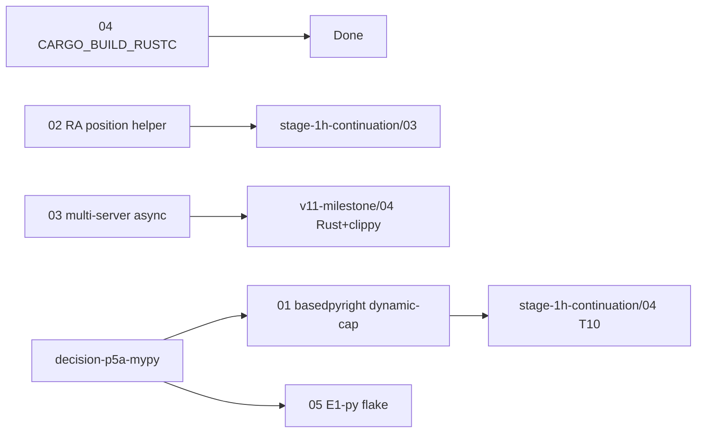

# v0.2.0 Follow-ups — TREE Plan

**Goal.** Close the 5 named-and-scoped v0.2.0 backlog items from `stage-1h-results/PROGRESS.md:83-89` plus project-memory carry-overs, so v0.3.0+ can claim full Python multi-server determinism, edge-case Rust position correctness, parallel multi-LSP merge, clean-host CI, and deterministic E1-py. The headline calcpy monolith — originally listed under both v0.2.0 follow-ups and Stage 1H — is canonicalized in [`stage-1h-continuation/06-calcpy-monolith-headline.md`](../2026-04-26-stage-1h-continuation/06-calcpy-monolith-headline.md) (its original Stage 1H task home); it is NOT a leaf here.

## Leaf table

| # | Slug | Goal | Size | Depends-on | Blocks |
|---|------|------|------|------------|--------|
| 1 | [01-basedpyright-dynamic-capability.md](./01-basedpyright-dynamic-capability.md) | Augment workspace_health catalog from runtime `client/registerCapability` events so basedpyright's diagnostic-only registration is counted (or explicitly documented as hidden). | M | decision-p5a-mypy | stage-1h-continuation/04-T10-python-integration-tests; "full Python multi-server determinism" claim |
| 2 | [02-rust-analyzer-position-validation.md](./02-rust-analyzer-position-validation.md) | Ship `compute_file_range(path) -> (start, end)` helper used by 16 deferred Rust tests; validate against rust-analyzer's out-of-range rejection at the adapter site. | M | none | stage-1h-continuation/03-T8-T9-rust-assist-integration-tests; "edge-case correctness" claim |
| 3 | [03-multi-server-async-wrapping.md](./03-multi-server-async-wrapping.md) | Prove `MultiServerCoordinator.broadcast` parallelises real Stage 1E adapters via `_AsyncAdapter` (or fix the gap); add an integration test that previously raised `TypeError: object list can't be used in 'await' expression`. | M | none | "Rust+clippy multi-server" v1.1 claim (any second-language coordinator path) |
| 4 | [04-cargo-build-rustc-workaround.md](./04-cargo-build-rustc-workaround.md) | Move the `CARGO_BUILD_RUSTC=rustc` workaround out of conftest module-load into a documented developer-host-only env shim; keep CI clean. | S | none | "clean Rust-host build environment" claim |
| 5 | [05-e1-py-flake-rootcause.md](./05-e1-py-flake-rootcause.md) | Root-cause and fix the E1-py flake observed at Stage 2B (gap #8); turn `pytest.skip` into a deterministic pass when split applies. | S | decision-p5a-mypy | E2E gate determinism for E1-py / E9-py / E10-py |

## Execution order

1. **Leaf 04** — `CARGO_BUILD_RUSTC` env shim (small, parallel-safe, zero-coupling).
2. **Leaf 02** — `compute_file_range` helper (touches conftest only).
3. **Leaf 01** — basedpyright dynamic capability (precondition for `stage-1h-continuation/04-T10-...`).
4. **Leaf 03** — multi-server async wrapping (precondition for any v1.1 Rust+clippy multi-server claim).
5. **Leaf 05** — E1-py flake root-cause (depends on `decision-p5a-mypy` ratification; uses the existing `vendor/serena/test/fixtures/calcpy/core.py` reproducer — does NOT depend on the calcpy monolith).

Leaves 04 and 02 are independent and may run in parallel. Leaf 01 unblocks Stage 1H T10 (Python integration tests). Leaf 03 unblocks v1.1 Rust+clippy.

## Intra-tree dependency diagram

## Cross-references

- Top-level index: [`../2026-04-26-INDEX-post-v0.3.0.md`](../2026-04-26-INDEX-post-v0.3.0.md)
- Source gap analysis: `docs/gap-analysis/WHAT-REMAINS.md` §4 (lines 98-107)
- Evidence: `docs/superpowers/plans/stage-1h-results/PROGRESS.md` §Concerns/follow-ups (lines 83-89)
- Project memory: `project_v0_2_0_critical_path.md`, `project_v0_2_0_stage_3_complete.md`

---

**Author:** AI Hive(R)
