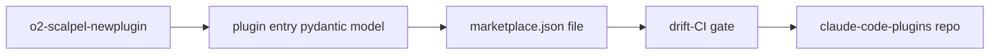

# 01 — Marketplace Publication: Multi-Plugin Repo Publish Surface

## Goal

Define and ship the **publish surface** for the multi-plugin repository at `o2alexanderfedin/claude-code-plugins` (Q11 resolution). This leaf does NOT pick a distribution channel (channel is operational concern; deferred). It produces: (a) `marketplace.json` schema validated by pydantic, (b) one canonical `marketplace.json` checked into the repo, (c) drift-CI gate that fails if the file disagrees with what the engine emits, (d) `o2-scalpel-newplugin` integration that registers each generated plugin in `marketplace.json`.

**Size:** Medium (~250 LoC + ~120 LoC tests).
**Audience:** Agentic AI via `superpowers:subagent-driven-development` or `superpowers:executing-plans`.
**Evidence:** `B-design.md` §4 row Q11; `WHAT-REMAINS.md` §5 line 113; `open-questions-resolution.md` §Q11; existing generator `docs/superpowers/plans/2026-04-25-stage-1j-plugin-skill-generator.md`.

## Architecture decision



Reuses the existing capability-catalog drift-CI pattern (`B-design.md` §1.6). Single source of truth: pydantic model. JSON is generated, never hand-edited.

## File structure

| Path | Action | Purpose |
|---|---|---|
| `vendor/serena/src/serena/marketplace/__init__.py` | NEW | Package marker. |
| `vendor/serena/src/serena/marketplace/schema.py` | NEW | Pydantic `MarketplaceManifest` + `PluginEntry`. |
| `vendor/serena/src/serena/marketplace/build.py` | NEW | `build_manifest()` walks `plugins/` and emits manifest. |
| `vendor/serena/test/serena/marketplace/test_schema.py` | NEW | Schema validation tests. |
| `vendor/serena/test/serena/marketplace/test_build.py` | NEW | Build-from-fixtures tests. |
| `vendor/serena/test/serena/marketplace/test_drift_ci.py` | NEW | Drift gate (analogous to `test_stage_1f_t5_catalog_drift.py`). |
| `marketplace.json` | NEW | Generated manifest checked in (acts as golden). |
| `vendor/serena/src/serena/cli/o2_scalpel_newplugin.py` | EDIT | After generation, append entry to `marketplace.json`. |

## Tasks

### Task 1 — Define `PluginEntry` pydantic model

**Step 1.1 — Failing test.** Create `test/serena/marketplace/test_schema.py`:

```python
import pytest
from pydantic import ValidationError
from serena.marketplace.schema import PluginEntry

def test_plugin_entry_requires_id_name_language_path() -> None:
    e = PluginEntry(id="rust-analyzer", name="o2-scalpel Rust", language="rust",
                    path="plugins/rust-analyzer", version="0.1.0",
                    install_hint="rustup component add rust-analyzer")
    assert e.id == "rust-analyzer"

def test_plugin_entry_rejects_unknown_field() -> None:
    with pytest.raises(ValidationError):
        PluginEntry(id="x", name="x", language="x", path="x",
                    version="0.1.0", unknown_field="boom")  # type: ignore[call-arg]
```

Run: `pytest vendor/serena/test/serena/marketplace/test_schema.py` → fails (module missing).

**Step 1.2 — Implement.** Create `src/serena/marketplace/schema.py`:

```python
from __future__ import annotations
from pydantic import BaseModel, ConfigDict, Field

class PluginEntry(BaseModel):
    model_config = ConfigDict(extra="forbid", frozen=True)
    id: str = Field(min_length=1)
    name: str = Field(min_length=1)
    language: str = Field(min_length=1)
    path: str = Field(min_length=1, description="Repo-relative path to the plugin tree.")
    version: str = Field(pattern=r"^\d+\.\d+\.\d+(-[A-Za-z0-9.]+)?$")
    install_hint: str = Field(default="")

class MarketplaceManifest(BaseModel):
    model_config = ConfigDict(extra="forbid", frozen=True)
    schema_version: int = 1
    plugins: tuple[PluginEntry, ...]
```

**Step 1.3 — Run passing.** Re-run pytest from 1.1; both tests green.

**Step 1.4 — Commit.** `git add ... && git commit -m "feat(marketplace): pydantic PluginEntry + MarketplaceManifest"`.

### Task 2 — Implement `build_manifest`

**Step 2.1 — Failing test.** Create `test/serena/marketplace/test_build.py`:

```python
from pathlib import Path
import json
from serena.marketplace.build import build_manifest

def test_build_manifest_walks_plugin_tree(tmp_path: Path) -> None:
    pdir = tmp_path / "plugins" / "demo-rust"
    pdir.mkdir(parents=True)
    (pdir / ".claude-plugin").mkdir()
    (pdir / ".claude-plugin" / "plugin.json").write_text(
        json.dumps({"id": "demo-rust", "name": "Demo Rust",
                    "language": "rust", "version": "0.1.0",
                    "install_hint": "rustup component add rust-analyzer"})
    )
    m = build_manifest(tmp_path)
    assert len(m.plugins) == 1
    assert m.plugins[0].id == "demo-rust"
```

Run → fails.

**Step 2.2 — Implement** `src/serena/marketplace/build.py`:

```python
from __future__ import annotations
import json
from pathlib import Path
from .schema import MarketplaceManifest, PluginEntry

def build_manifest(repo_root: Path) -> MarketplaceManifest:
    plugins_dir = repo_root / "plugins"
    entries: list[PluginEntry] = []
    if plugins_dir.is_dir():
        for sub in sorted(plugins_dir.iterdir()):
            meta = sub / ".claude-plugin" / "plugin.json"
            if not meta.is_file():
                continue
            data = json.loads(meta.read_text())
            entries.append(PluginEntry(
                id=data["id"], name=data["name"], language=data["language"],
                path=f"plugins/{sub.name}", version=data["version"],
                install_hint=data.get("install_hint", ""),
            ))
    return MarketplaceManifest(plugins=tuple(entries))
```

**Step 2.3 — Run passing + commit.** `pytest …test_build.py` → green; commit.

### Task 3 — Drift-CI gate

**Step 3.1 — Failing test.** Create `test/serena/marketplace/test_drift_ci.py`:

```python
from pathlib import Path
import json
from serena.marketplace.build import build_manifest

def test_marketplace_json_matches_runtime_build(repo_root: Path) -> None:
    on_disk = json.loads((repo_root / "marketplace.json").read_text())
    runtime = build_manifest(repo_root).model_dump()
    assert on_disk == runtime, (
        "marketplace.json drifted from generator output. "
        "Re-run: python -m serena.marketplace.build --write"
    )
```

Add `repo_root` fixture in `conftest.py` (or local) returning the project root.

Run → fails (no `marketplace.json`).

**Step 3.2 — Generate the canonical file.** Add `__main__.py` block to `build.py`:

```python
if __name__ == "__main__":
    import argparse, sys
    p = argparse.ArgumentParser()
    p.add_argument("--write", action="store_true")
    p.add_argument("--root", type=Path, default=Path.cwd())
    args = p.parse_args()
    m = build_manifest(args.root)
    out = args.root / "marketplace.json"
    payload = json.dumps(m.model_dump(), indent=2, sort_keys=True) + "\n"
    if args.write:
        out.write_text(payload)
    else:
        sys.stdout.write(payload)
```

Run `python -m serena.marketplace.build --write --root .` to commit baseline.

**Step 3.3 — Run passing + commit.** Drift-CI green; commit `marketplace.json` + test.

### Task 4 — Wire `o2-scalpel-newplugin` to update manifest

**Step 4.1 — Failing test.** Add to `test/serena/cli/test_o2_scalpel_newplugin.py`:

```python
def test_newplugin_appends_to_marketplace_json(tmp_path, run_newplugin):
    run_newplugin(["--language", "kotlin", "--out", str(tmp_path / "plugins" / "kotlin"),
                   "--repo-root", str(tmp_path)])
    import json
    m = json.loads((tmp_path / "marketplace.json").read_text())
    ids = [p["id"] for p in m["plugins"]]
    assert "kotlin" in ids
```

Run → fails.

**Step 4.2 — Implement.** In `o2_scalpel_newplugin.py`, after writing plugin tree, call `build_manifest(repo_root)` then write `marketplace.json` via the same code path as Task 3.

The CLI's `--repo-root` flag MUST point at the published-plugins repo root for drift-CI to remain green; the regenerated `marketplace.json` is part of the same commit as the new plugin (per critic S2 — drift-CI signal degrades silently otherwise). Surface this in the CLI's `--help` output and in the function docstring.

**Step 4.3 — Run passing + commit.**

## Self-review checklist

- [ ] Pydantic models reject unknown fields (`extra="forbid"`).
- [ ] `marketplace.json` is generated, never hand-edited; drift-CI guards this.
- [ ] No distribution-channel logic in this leaf (deferred, per brief).
- [ ] All four Tasks have full TDD cycle: failing test → implement → passing test → commit.
- [ ] `o2-scalpel-newplugin --help` documents `--repo-root` and the same-commit rule.
- [ ] Author footer present.
- [ ] No emoji; Mermaid (not ASCII) used for the flow diagram.

*Author: AI Hive(R)*
