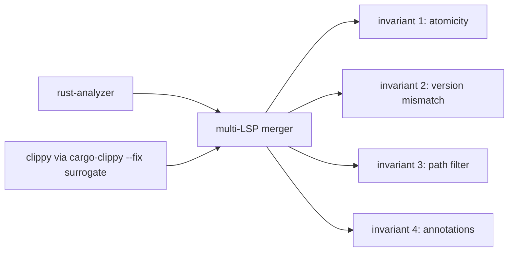

# 04 — Rust + clippy Multi-Server Scenario

## Goal

Extend the existing Python multi-LSP merge (basedpyright + pylsp + ruff) to a second-language scenario: Rust + clippy. Demonstrates that all four merge invariants from `B-design.md` §1.4 (= design report §11.7) hold language-agnostically when composing rust-analyzer with clippy-driven diagnostic quickfixes.

**Size:** Medium (~200 LoC code + ~350 LoC tests + ~3 fixture crates).
**Evidence:** `WHAT-REMAINS.md` §5 line 116; `B-design.md` §1.4 (four invariants); existing Python multi-LSP merge tests as the analog.

## The four invariants (referenced, not redefined)

Per `B-design.md` §1.4: (1) atomicity with rollback, (2) version-mismatch rejects whole edit, (3) path-filter workspace boundary, (4) change-annotation warning surface. Each must be exercised by at least one Rust+clippy test below.



## File structure

| Path | Action | Purpose |
|---|---|---|
| `vendor/serena/src/serena/strategies/rust/clippy_adapter.py` | NEW | Adapter exposing clippy-fixable diagnostics as a virtual LSP source. |
| `vendor/serena/src/serena/strategies/rust/strategy.py` | EDIT | Register clippy-adapter in multi-LSP composition. |
| `vendor/serena/test/integration/rust/test_multi_server_invariants.py` | NEW | Four invariant tests (one per invariant). |
| `vendor/serena/test/fixtures/rust/clippy_a/` | NEW | Crate fixture exercising rustfmt-style clippy lint with `--fix`. |
| `vendor/serena/test/fixtures/rust/clippy_collision/` | NEW | Crate fixture where rust-analyzer assist + clippy fix touch same span. |
| `vendor/serena/test/fixtures/rust/clippy_out_of_workspace/` | NEW | Crate referencing path outside `workspaceFolders` — see Task 4 note re witness vs driver. |
| `vendor/serena/test/fixtures/rust/clippy_out_of_workspace/.scalpel-target` | NEW | Plain-text out-of-workspace path string read by the test (S4). |

## Tasks

### Task 1 — `ClippyAdapter` virtual LSP source

**Step 1.1 — Failing test.**

```python
from pathlib import Path
from serena.strategies.rust.clippy_adapter import ClippyAdapter

def test_clippy_adapter_emits_textedits_for_known_lint(tmp_path: Path) -> None:
    crate = _seed_crate(tmp_path, src='fn f() { let _x: Vec<u8> = Vec::<u8>::new(); }')
    adapter = ClippyAdapter(workspace=crate)
    edits = adapter.diagnostics_as_workspace_edit()
    # `useless_vec`-style suggestion should round-trip into TextEdit form.
    assert edits.changes is not None
    assert any("Vec" not in v[0]["newText"] for v in edits.changes.values())
```

Run → fails.

**Step 1.2 — Implement.** `clippy_adapter.py`:

```python
from __future__ import annotations
import json, subprocess
from pathlib import Path
from pydantic import BaseModel

class ClippyAdapter:
    def __init__(self, workspace: Path) -> None:
        self._ws = workspace

    def diagnostics_as_workspace_edit(self) -> "WorkspaceEdit":
        proc = subprocess.run(
            ["cargo", "clippy", "--message-format=json", "--fix",
             "--allow-no-vcs", "--allow-dirty"],
            cwd=self._ws, capture_output=True, text=True, check=False,
        )
        return _clippy_json_to_workspace_edit(proc.stdout, self._ws)
```

`_clippy_json_to_workspace_edit` parses cargo-clippy JSON suggestion structures and synthesizes `WorkspaceEdit` with `versioned: True`, `documentChanges` keyed by `file://` URIs.

**Step 1.3 — Run passing + commit.**

### Task 2 — Invariant 1 (atomicity)

**Step 2.1 — Failing test.** `test_multi_server_invariants.py::test_atomicity_rolls_back_when_clippy_fix_invalid`:

```python
def test_atomicity_rolls_back_when_clippy_fix_invalid(rust_workspace_factory):
    ws = rust_workspace_factory("clippy_collision")
    edits_ra = ws.run_assist("introduce_named_lifetime")  # valid
    edits_clippy = ws.simulate_clippy_with_invalid_range()  # malformed
    with pytest.raises(MergeError):
        ws.applier.apply_merged([edits_ra, edits_clippy])
    # files unchanged
    assert ws.read("src/lib.rs") == ws.original("src/lib.rs")
```

Run → fails.

**Step 2.2 — Implement.** Verify the merger correctly snapshots-and-rolls-back on the second source's malformed edit. The mechanism already exists for Python multi-LSP; this test confirms it triggers identically when one source is `ClippyAdapter`.

**Step 2.3 — Run passing + commit.**

### Task 3 — Invariant 2 (version mismatch)

**Step 3.1 — Failing test.**

```python
def test_version_mismatch_rejects_whole_clippy_edit(rust_workspace_factory):
    ws = rust_workspace_factory("clippy_a")
    edit = ws.compute_clippy_edit_pinned_to(version=5)
    ws.bump_version("src/lib.rs", to=6)
    with pytest.raises(VersionMismatch):
        ws.applier.apply_merged([edit])
    assert ws.read("src/lib.rs") == ws.snapshot_at_version(6)
```

**Step 3.2 — Implement / verify.** Multi-LSP merger already enforces stale-version check per file; this test covers the Rust path.

**Step 3.3 — Run passing + commit.**

### Task 4 — Invariant 3 (path-filter workspace boundary)

The fixture `clippy_out_of_workspace/` is a **driver, not just a witness** (per critic S4): the test reads the offending path from a `.scalpel-target` file inside the fixture, so the fixture itself defines the violating target. This keeps fixture purpose explicit for future readers — no programmatic `/etc/passwd` literal in the test body.

**Step 4.1 — Failing test.**

```python
def test_path_filter_rejects_clippy_fix_outside_workspace(rust_workspace_factory):
    ws = rust_workspace_factory("clippy_out_of_workspace")
    target = (ws.root / ".scalpel-target").read_text().strip()
    edit = ws.compute_clippy_edit_targeting(target)
    with pytest.raises(EditOutOfWorkspace) as ei:
        ws.applier.apply_merged([edit])
    assert ei.value.error_code == "EDIT_OUT_OF_WORKSPACE"
```

Fixture seed (`clippy_out_of_workspace/.scalpel-target`):

```
/etc/passwd
```

(Path is a deterministic out-of-workspace literal that the path filter must reject; choice is symbolic, not exercised by an actual clippy invocation.)

**Step 4.2 — Implement / verify.** Path filter already lives in applier. This test confirms it engages for Rust+clippy paths.

**Step 4.3 — Run passing + commit.**

### Task 5 — Invariant 4 (change-annotation warning surface)

**Step 5.1 — Failing test.**

```python
def test_clippy_annotation_warnings_surface_in_dryrun(rust_workspace_factory):
    ws = rust_workspace_factory("clippy_a")
    report = ws.applier.dry_run([ws.compute_clippy_edit_with_annotations()])
    assert report.annotations
    assert any(a.label == "clippy::useless_vec" for a in report.annotations)
    assert any(a.needs_confirmation for a in report.annotations)
```

**Step 5.2 — Implement.** `ClippyAdapter` must round-trip clippy lint name into `WorkspaceEdit.changeAnnotations` with `needsConfirmation=true` for any lint flagged as semantic-changing (configurable allowlist). Default allowlist is empty (all annotations marked needs-confirmation), narrowed via `RustStrategy` config.

**Step 5.3 — Run passing + commit.**

### Task 6 — Wire into `RustStrategy.execute_command_whitelist`

**Step 6.1 — Failing test.** Verify clippy-fix is reachable via `scalpel_apply_capability` only when the strategy whitelist permits it.

**Step 6.2 — Implement.** Edit `strategy.py` to include `cargo.clippy.applyFix` in the whitelist guarded by feature flag `O2_SCALPEL_CLIPPY_MULTI_SERVER`.

**Step 6.3 — Run passing + commit.**

## Self-review checklist

- [ ] All four invariants from `B-design.md` §1.4 covered by at least one passing test each.
- [ ] No new merger code paths — leaf reuses the language-agnostic applier.
- [ ] Fixture crates committed under `test/fixtures/rust/clippy_*` with minimal `Cargo.toml`.
- [ ] `clippy_out_of_workspace/.scalpel-target` carries the rejected path so fixture is a driver (S4).
- [ ] Feature flag default OFF (clippy-fix is a sharp tool; opt-in).
- [ ] No emoji; Mermaid only.

*Author: AI Hive(R)*
