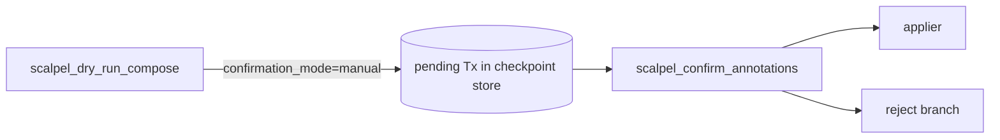

# 06 — `scalpel_confirm_annotations` (Per-Annotation Manual Review)

## Goal

Implement the opt-in per-annotation manual-review workflow per `docs/design/mvp/open-questions/q4-changeannotations-auto-accept.md` §6.3. Activates when the LLM passes `confirmation_mode="manual"` to `scalpel_dry_run_compose`. Adds a new MCP tool `scalpel_confirm_annotations(transaction_id, accept=[...])` that selectively commits annotation groups before the transaction applies.

**Size:** Small (~150 LoC + ~150 LoC tests).
**Evidence:** `WHAT-REMAINS.md` §5 line 118; q4 doc §6.3 line 211 ("D may earn a place in v1.1 as an optional override when the LLM passes `confirmation_mode='manual'`") — note (per critic R2): the surrounding lines 207–210 *reject* option D at MVP; only line 211 carries the v1.1 endorsement. Cite the line, not the paragraph. Existing `ScalpelDryRunComposeTool` at `vendor/serena/src/serena/tools/scalpel_primitives.py:322`.

**Intra-tree dependency:** Leaf 02 (persistent disk checkpoints) — pending transaction state must survive across the dialogue.

## Architecture decision



State machine: `dry_run` puts the transaction (with pending annotation groups) into `CheckpointStore` (durable per leaf 02). `scalpel_confirm_annotations` resolves it, reapplies under filter, and removes from store. Rejection path (no `accept`) marks the transaction abandoned.

## File structure

| Path | Action | Purpose |
|---|---|---|
| `vendor/serena/src/serena/tools/scalpel_primitives.py` | EDIT | New `ScalpelConfirmAnnotationsTool`. |
| `vendor/serena/src/serena/tools/scalpel_primitives.py` | EDIT | Extend `ScalpelDryRunComposeTool` to accept `confirmation_mode` and emit annotation groups. |
| `vendor/serena/src/serena/refactoring/pending_tx.py` | NEW | Pydantic `PendingTransaction` + serialization to checkpoint. |
| `vendor/serena/test/serena/tools/test_scalpel_confirm_annotations.py` | NEW | Tool-level tests. |
| `vendor/serena/test/serena/refactoring/test_pending_tx.py` | NEW | Pending-tx schema tests. |

## Tasks

### Task 1 — `PendingTransaction` schema

**Step 1.1 — Failing test.**

```python
from serena.refactoring.pending_tx import PendingTransaction, AnnotationGroup

def test_pending_tx_with_two_annotation_groups():
    tx = PendingTransaction(
        id="tx-1",
        groups=(
            AnnotationGroup(label="rename", needs_confirmation=False, edit_ids=("e1",)),
            AnnotationGroup(label="extract", needs_confirmation=True, edit_ids=("e2","e3")),
        ),
    )
    assert tx.requires_confirmation()
```

Run → fails.

**Step 1.2 — Implement** `pending_tx.py`:

```python
from __future__ import annotations
from pydantic import BaseModel, ConfigDict

class AnnotationGroup(BaseModel):
    model_config = ConfigDict(extra="forbid", frozen=True)
    label: str
    needs_confirmation: bool
    edit_ids: tuple[str, ...]

class PendingTransaction(BaseModel):
    model_config = ConfigDict(extra="forbid", frozen=True)
    id: str
    groups: tuple[AnnotationGroup, ...]

    def requires_confirmation(self) -> bool:
        return any(g.needs_confirmation for g in self.groups)
```

**Step 1.3 — Run passing + commit.**

### Task 2 — Extend `ScalpelDryRunComposeTool` with `confirmation_mode`

**Step 2.1 — Failing test.**

```python
def test_dry_run_compose_manual_mode_persists_pending_tx(harness):
    out = harness.invoke("scalpel_dry_run_compose",
                         {"...minimal...": "...",
                          "confirmation_mode": "manual"})
    assert out["awaiting_confirmation"] is True
    assert out["transaction_id"]
    assert harness.checkpoint_store.has_pending(out["transaction_id"])
```

Run → fails.

**Step 2.2 — Edit** `ScalpelDryRunComposeTool.apply` to accept `confirmation_mode: Literal["auto", "manual"] = "auto"`. When `"manual"`, derive groups from `WorkspaceEdit.changeAnnotations`, store `PendingTransaction` in the durable checkpoint store (leaf 02), and short-circuit application.

**Step 2.3 — Run passing + commit.**

### Task 3 — `ScalpelConfirmAnnotationsTool`

**Step 3.1 — Failing test.**

```python
def test_confirm_applies_only_accepted_groups(harness):
    out_dry = harness.invoke("scalpel_dry_run_compose",
                             {"...": "...", "confirmation_mode": "manual"})
    tx_id = out_dry["transaction_id"]
    # accept only the rename group
    out = harness.invoke("scalpel_confirm_annotations",
                         {"transaction_id": tx_id, "accept": ["rename"]})
    assert out["applied_groups"] == ["rename"]
    assert out["rejected_groups"] == ["extract"]

def test_confirm_rejects_unknown_transaction_id(harness):
    out = harness.invoke("scalpel_confirm_annotations",
                         {"transaction_id": "ghost", "accept": []})
    assert out["error_code"] == "UNKNOWN_TRANSACTION"
```

Run → fails.

**Step 3.2 — Implement.** Add to `scalpel_primitives.py`:

```python
class ScalpelConfirmAnnotationsTool(Tool):
    """Apply only the accepted annotation groups of a manual-mode pending transaction.

    See docs/design/mvp/open-questions/q4-changeannotations-auto-accept.md §6.3 line 211.
    """

    def apply(self, transaction_id: str, accept: list[str]) -> dict[str, object]:
        pending = self._pending_store.get(transaction_id)
        if pending is None:
            return {"error_code": "UNKNOWN_TRANSACTION",
                    "transaction_id": transaction_id}
        accept_set = set(accept)
        applied = [g for g in pending.groups if g.label in accept_set]
        rejected = [g for g in pending.groups if g.label not in accept_set]
        result = self._applier.apply_groups(applied)
        self._pending_store.discard(transaction_id)
        return {"transaction_id": transaction_id,
                "applied_groups": [g.label for g in applied],
                "rejected_groups": [g.label for g in rejected],
                "applied": result.summary}
```

**Step 3.3 — Run passing + commit.**

### Task 4 — Documentation cross-reference

**Step 4.1 — Failing test.** Lint test that the tool docstring contains a `q4-changeannotations-auto-accept.md §6.3 line 211` reference (cheap drift gate; cite the line, not the paragraph — R2).

**Step 4.2 — Implement.** Already added in step 3.2.

**Step 4.3 — Run passing + commit.**

## Self-review checklist

- [ ] Default behavior unchanged (`confirmation_mode="auto"` is default).
- [ ] Pending transaction persists across process restart (relies on leaf 02).
- [ ] Unknown / expired transaction returns structured error_code, not exception.
- [ ] Only accepted groups apply; rejected groups have zero side effects.
- [ ] Reference to q4 §6.3 line 211 surfaced in tool docstring (governance — R2 tightened cite).
- [ ] No emoji; Mermaid only.

*Author: AI Hive(R)*
