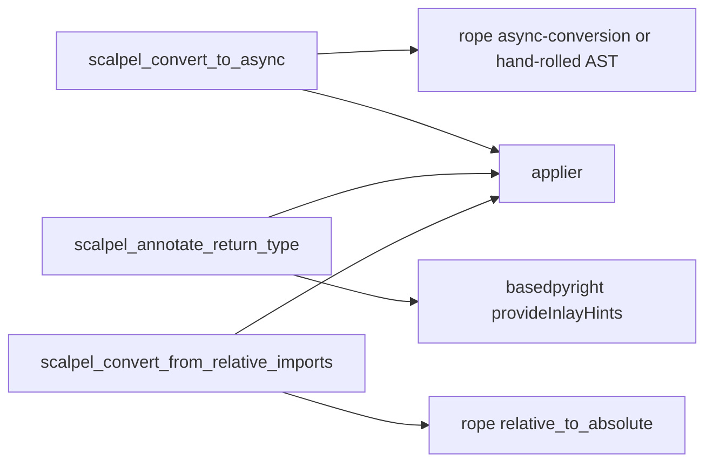

# 07 — Three Python Facades

## Goal

Ship three new Python ergonomic facades, each as its own dispatch site with its own facade test. Per project memory `project_v0_2_0_stage_3_complete.md`, these were named for v1.1 in the v0.2.0 Stage 3 wrap-up.

The three facades:
1. `convert_to_async` — convert sync function `def f(...)` into `async def f(...)`, propagating `await` calls and `asyncio.run` shims at call sites.
2. `annotate_return_type` — infer and annotate function return type via basedpyright `provideInlayHints`.
3. `convert_from_relative_imports` — switch `from .x import y` → `from pkg.x import y` using rope `relative_to_absolute`.

**Size:** Medium (~3 × ~120 LoC = ~360 LoC + ~3 × ~150 LoC = ~450 LoC tests).
**Evidence:** `WHAT-REMAINS.md` §5 line 119; project memory v0.2.0 Stage 3 named-facades; existing facade pattern at `vendor/serena/src/serena/tools/scalpel_facades.py:181` (`ScalpelSplitFileTool` as model).

## Architecture decision

Each facade is a separate `Tool` subclass at its own dispatch site (not a switch in one tool). Reuses the existing applier + multi-LSP merge — facades only assemble the right LSP request bundle and route through `WorkspaceEdit`.



## File structure

| Path | Action | Purpose |
|---|---|---|
| `vendor/serena/src/serena/tools/scalpel_facades.py` | EDIT | Add three new `Tool` subclasses. |
| `vendor/serena/src/serena/strategies/python/async_conversion.py` | NEW | Helper for facade 1. |
| `vendor/serena/src/serena/strategies/python/return_type_infer.py` | NEW | Helper for facade 2. |
| `vendor/serena/src/serena/strategies/python/imports_relative.py` | NEW | Helper for facade 3. |
| `vendor/serena/test/serena/tools/test_facade_convert_to_async.py` | NEW | Facade-1 tests. |
| `vendor/serena/test/serena/tools/test_facade_annotate_return_type.py` | NEW | Facade-2 tests. |
| `vendor/serena/test/serena/tools/test_facade_convert_from_relative_imports.py` | NEW | Facade-3 tests. |

## Tasks

### Task 1 — Facade `convert_to_async`

**Step 1.1 — Failing test.** `test_facade_convert_to_async.py`:

```python
from textwrap import dedent

def test_convert_to_async_marks_def_async_and_propagates_await(py_workspace):
    py_workspace.write("a.py", dedent("""
        def fetch(x):
            return read(x)

        def caller():
            return fetch(1)
    """))
    out = py_workspace.invoke("scalpel_convert_to_async",
                              {"file": "a.py", "symbol": "fetch"})
    assert out["status"] == "applied"
    src = py_workspace.read("a.py")
    assert "async def fetch" in src
    assert "await fetch(1)" in src
```

Run → fails.

**Step 1.2 — Implement helper** `async_conversion.py` and tool `ScalpelConvertToAsyncTool`. Helper rewrites the target def + edits all call sites within the workspace (driven by basedpyright `references`), inserts `await` for each call site whose enclosing function is also async-converted (recursive close-over) and otherwise wraps in `asyncio.run(...)` (caller responsibility flag in result).

**Step 1.3 — Run passing + commit.**

**Step 1.4 — Edge-case test (decorator preservation).**

```python
def test_convert_to_async_preserves_decorators(py_workspace):
    py_workspace.write("b.py", "@dec\ndef fetch(): pass\n")
    py_workspace.invoke("scalpel_convert_to_async", {"file": "b.py", "symbol": "fetch"})
    assert py_workspace.read("b.py").startswith("@dec\nasync def fetch")
```

Run, implement, commit.

### Task 2 — Facade `annotate_return_type`

**Step 2.1 — Failing test.**

```python
def test_annotate_return_type_inserts_inferred_type(py_workspace):
    py_workspace.write("a.py", "def two():\n    return 2\n")
    out = py_workspace.invoke("scalpel_annotate_return_type",
                              {"file": "a.py", "symbol": "two"})
    assert out["status"] == "applied"
    assert "def two() -> int:" in py_workspace.read("a.py")
```

Run → fails.

**Step 2.2 — Implement.** `return_type_infer.py` queries basedpyright `provideInlayHints` for the function's signature, derives the return-type hint, then synthesizes a single `TextEdit` inserting `-> <Type>` before the colon. Falls back to no-op with `"status": "skipped", "reason": "no_inferable_type"` when basedpyright reports `unknown`.

**Step 2.3 — Run passing + commit.**

**Step 2.4 — Edge-case test (already annotated).**

```python
def test_annotate_return_type_skips_already_annotated(py_workspace):
    py_workspace.write("a.py", "def two() -> int:\n    return 2\n")
    out = py_workspace.invoke("scalpel_annotate_return_type",
                              {"file": "a.py", "symbol": "two"})
    assert out["status"] == "skipped"
    assert out["reason"] == "already_annotated"
```

Run, implement, commit.

### Task 3 — Facade `convert_from_relative_imports`

**Step 3.1 — Failing test.**

```python
def test_convert_from_relative_imports_uses_rope_relative_to_absolute(py_pkg_workspace):
    py_pkg_workspace.write("pkg/__init__.py", "")
    py_pkg_workspace.write("pkg/x.py", "VAL = 1\n")
    py_pkg_workspace.write("pkg/y.py", "from .x import VAL\n")
    out = py_pkg_workspace.invoke("scalpel_convert_from_relative_imports",
                                  {"file": "pkg/y.py"})
    assert out["status"] == "applied"
    assert py_pkg_workspace.read("pkg/y.py") == "from pkg.x import VAL\n"
```

Run → fails.

**Step 3.2 — Implement.** `imports_relative.py` invokes the rope `relative_to_absolute` library function, reroutes the resulting changes through the language-agnostic applier as a `WorkspaceEdit` (per existing Rope-bridge in Stage 1E).

**Step 3.3 — Run passing + commit.**

**Step 3.4 — Edge-case test 1 (parent-relative `from ..x import y`).**

```python
def test_convert_from_relative_imports_resolves_parent_relative(py_pkg_workspace):
    py_pkg_workspace.write("pkg/sub/__init__.py", "")
    py_pkg_workspace.write("pkg/x.py", "VAL = 2\n")
    py_pkg_workspace.write("pkg/sub/y.py", "from ..x import VAL\n")
    py_pkg_workspace.invoke("scalpel_convert_from_relative_imports",
                            {"file": "pkg/sub/y.py"})
    assert py_pkg_workspace.read("pkg/sub/y.py") == "from pkg.x import VAL\n"
```

Run, implement, commit.

**Step 3.5 — Edge-case test 2 (module-import form `from . import x`).**

Per critic R3: facades 1 and 2 each have two edge-case-distinct paths exercised
(facade 1: decorator + recursive close-over; facade 2: insertion + skip-on-annotated).
Facade 3 needs a second edge case to match. The module-import form
(`from . import x` — sibling-module rebind) hits a different rope code path
than `from .x import y` (the body bound name is the *module*, not a symbol
imported from it), so this is genuinely a distinct branch — not a near-duplicate.

```python
def test_convert_from_relative_imports_handles_module_import_form(py_pkg_workspace):
    """`from . import x` is the module-import form (binds `x` as a module
    object), distinct from `from .x import y` (which binds `y` as a symbol).
    Rope's `relative_to_absolute` traverses a different AST shape; this test
    fixes the second branch.
    """
    py_pkg_workspace.write("pkg/__init__.py", "")
    py_pkg_workspace.write("pkg/x.py", "VAL = 3\n")
    py_pkg_workspace.write("pkg/y.py", "from . import x\n\nUSE = x.VAL\n")
    out = py_pkg_workspace.invoke("scalpel_convert_from_relative_imports",
                                  {"file": "pkg/y.py"})
    assert out["status"] == "applied"
    assert py_pkg_workspace.read("pkg/y.py") == "from pkg import x\n\nUSE = x.VAL\n"
```

Run, implement, commit.

### Task 4 — Capability catalog drift re-baseline

**Step 4.1 — Failing test.** Existing `test_stage_1f_t5_catalog_drift.py` will now fail (three new tools registered) until baseline is re-recorded.

**Step 4.2 — Re-baseline.** Run `pytest --update-catalog-baseline` (existing flag, per `B-design.md` §1.6). Commit the new baseline.

**Step 4.3 — Run passing + commit.**

## Self-review checklist

- [ ] Three independent dispatch sites — three `Tool` subclasses, three test files.
- [ ] Each facade has at least one happy-path test plus **at least two edge-case tests** (R3 — facade 3 now matches facades 1 and 2 in edge-case rigour: parent-relative AND module-import-form).
- [ ] All three reuse the existing applier — no new merger code paths.
- [ ] Catalog drift CI re-baselined deliberately, in its own commit.
- [ ] No emoji; Mermaid only.

*Author: AI Hive(R)*
