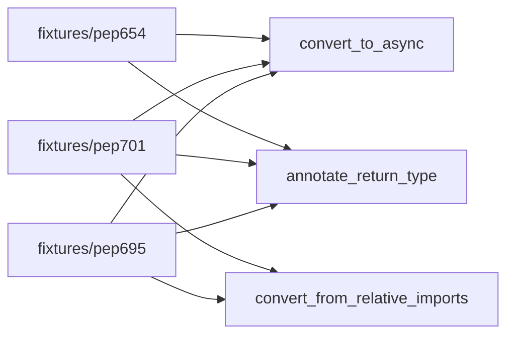

# 08 — PEP 695 / 701 / 654 Fixture Variants

## Goal

Add Python fixture variants exercising the three modern grammar features called out in scope-report §4.7 row 22:
- **PEP 695** — type-alias statement and generic syntax (`type X = ...`, `class C[T]:`).
- **PEP 701** — formalized f-string grammar (nested quotes, multi-line expressions, comments inside braces).
- **PEP 654** — exception groups (`except*`, `ExceptionGroup`).

Each fixture is exercised by the three Python facades from leaf 07. Confirms that newer grammar does not break the dispatch path through pylsp / basedpyright / rope.

**Size:** Small (~220 LoC fixtures + ~180 LoC tests).
**Evidence:** `WHAT-REMAINS.md` §5 line 120 ("PEP 695/701/654 fixture variants — scope-report §4.7 row 22"); leaf 07 (this leaf depends on its facades existing).

**Intra-tree dependency:** Leaf 07 must land first.

## Architecture decision

Fixtures live alongside `calcpy/` (the existing Python fixture root). Three sub-fixtures, each minimal and grammar-focused. Tests are parametrized over (fixture × facade) where the combination is meaningful.



Per critic S6: PEP 695 and PEP 701 fixtures DO pair with `convert_from_relative_imports` (F3) — the Mermaid above now shows those edges explicitly. Only PEP 654 omits F3 (caption below explains why).

(PEP 654 doesn't pair with `convert_from_relative_imports` — exception-group semantics are orthogonal to import paths. The PEP 654 fixture has no relative imports to convert, so the (PEP654, F3) cell of the matrix is structurally empty.)

## File structure

| Path | Action | Purpose |
|---|---|---|
| `vendor/serena/test/fixtures/python/pep695/` | NEW | `type X = ...` + `class C[T]:` exemplars. |
| `vendor/serena/test/fixtures/python/pep701/` | NEW | nested-quote f-strings, multi-line expressions. |
| `vendor/serena/test/fixtures/python/pep654/` | NEW | `try/except*` + `ExceptionGroup` exemplars. |
| `vendor/serena/test/integration/python/test_pep_grammar_fixtures.py` | NEW | Parametrized facade-on-fixture tests. |

Path note (per critic R4): the test file lives under `vendor/serena/test/integration/python/...`
to match the `vendor/serena/test/integration/rust/...` convention established by leaf 04.
This keeps integration tests grouped under `test/integration/<language>/`. The earlier draft
(`test/serena/integration/...`) split the convention; v2 unifies it.

## Tasks

### Task 1 — PEP 695 fixture + tests

**Step 1.1 — Write fixture.** `fixtures/python/pep695/__init__.py`:

```python
type Vec2 = tuple[float, float]

class Box[T]:
    def __init__(self, value: T) -> None:
        self.value = value

def two() -> int:
    return 2

def fetch(b: Box[int]) -> int:
    return b.value
```

**Step 1.2 — Failing test.** `test/integration/python/test_pep_grammar_fixtures.py`:

```python
import pytest

@pytest.mark.parametrize("symbol,expected", [
    ("two", "def two() -> int:"),
    ("fetch", "def fetch(b: Box[int]) -> int:"),
])
def test_annotate_return_type_handles_pep695(pep695_workspace, symbol, expected):
    out = pep695_workspace.invoke(
        "scalpel_annotate_return_type",
        {"file": "__init__.py", "symbol": symbol},
    )
    # already annotated: status==skipped, but parser must not have errored
    assert out["status"] in ("applied", "skipped")
    assert out.get("error_code") is None
```

Run → fails (fixture doesn't exist or basedpyright errors).

**Step 1.3 — Pin python interpreter.** Confirm `pyproject.toml` test-config requires Python ≥ 3.12 for these tests (skip-on-older).

**Step 1.4 — Run passing + commit.**

### Task 2 — PEP 701 fixture + tests

**Step 2.1 — Write fixture.** `fixtures/python/pep701/__init__.py`:

```python
def label(name: str, count: int) -> str:
    return f"name='{name}' count={count!r} note={f"inner-{name}"}"

def multiline(items: list[int]) -> str:
    return f"""sum = {
        sum(items)  # nested expression with comment
    }"""

def fetch(x):
    return label(name=str(x), count=x)
```

**Step 2.2 — Failing test.**

```python
def test_convert_to_async_handles_pep701_fstrings(pep701_workspace):
    out = pep701_workspace.invoke("scalpel_convert_to_async",
                                  {"file": "__init__.py", "symbol": "fetch"})
    assert out["status"] == "applied"
    src = pep701_workspace.read("__init__.py")
    assert "async def fetch" in src

def test_annotate_return_type_handles_pep701_nested_quotes(pep701_workspace):
    out = pep701_workspace.invoke("scalpel_annotate_return_type",
                                  {"file": "__init__.py", "symbol": "label"})
    assert out["status"] in ("applied", "skipped")
    assert out.get("error_code") is None
```

Run → fails.

**Step 2.3 — Run passing + commit.** Implementation should already work — fixture is the new artifact.

### Task 3 — PEP 654 fixture + tests

**Step 3.1 — Write fixture.** `fixtures/python/pep654/__init__.py`:

```python
def safe_run(work):
    try:
        work()
    except* ValueError as eg:
        raise ExceptionGroup("validation", list(eg.exceptions))
    except* (KeyError, IndexError) as eg:
        raise ExceptionGroup("lookup", list(eg.exceptions))

def caller():
    return safe_run(lambda: None)
```

**Step 3.2 — Failing test.**

```python
def test_convert_to_async_handles_pep654_except_star(pep654_workspace):
    out = pep654_workspace.invoke("scalpel_convert_to_async",
                                  {"file": "__init__.py", "symbol": "safe_run"})
    assert out["status"] == "applied"
    src = pep654_workspace.read("__init__.py")
    assert "async def safe_run" in src
    assert "except*" in src  # must not have rewritten exception-group syntax

def test_annotate_return_type_handles_pep654(pep654_workspace):
    out = pep654_workspace.invoke("scalpel_annotate_return_type",
                                  {"file": "__init__.py", "symbol": "safe_run"})
    assert out.get("error_code") is None
```

Run → fails.

**Step 3.3 — Run passing + commit.**

### Task 4 — Cross-grammar smoke

**Step 4.1 — Failing test.** Single integration test that loads all three fixtures into one workspace and calls one facade per fixture in sequence; asserts the catalog/applier never reports a parser-level error.

```python
def test_all_three_pep_fixtures_coexist(combined_pep_workspace):
    for fx, sym in [("pep695", "two"), ("pep701", "fetch"), ("pep654", "safe_run")]:
        out = combined_pep_workspace.invoke(
            "scalpel_annotate_return_type" if sym == "two" else "scalpel_convert_to_async",
            {"file": f"{fx}/__init__.py", "symbol": sym},
        )
        assert out.get("error_code") is None
```

**Step 4.2 — Implement / run.** Should pass once Tasks 1–3 are green.

**Step 4.3 — Commit.**

## Self-review checklist

- [ ] Three minimal fixtures, one per PEP, each ≤ 25 LoC.
- [ ] Tests parametrized over meaningful (fixture × facade) pairs only.
- [ ] Test path lives under `vendor/serena/test/integration/python/` per leaf 04 convention (R4).
- [ ] Mermaid diagram includes PEP695→F3 and PEP701→F3 edges explicitly (S6); PEP654→F3 explicitly absent.
- [ ] Test config skips on Python < 3.12 (PEP 695 / 701 / 654 are all 3.11+/3.12+).
- [ ] No fixture exercises any facade not in leaf 07 — leaf scoped tightly.
- [ ] Cross-grammar smoke confirms no interaction surprises.
- [ ] No emoji; Mermaid only.

*Author: AI Hive(R)*
