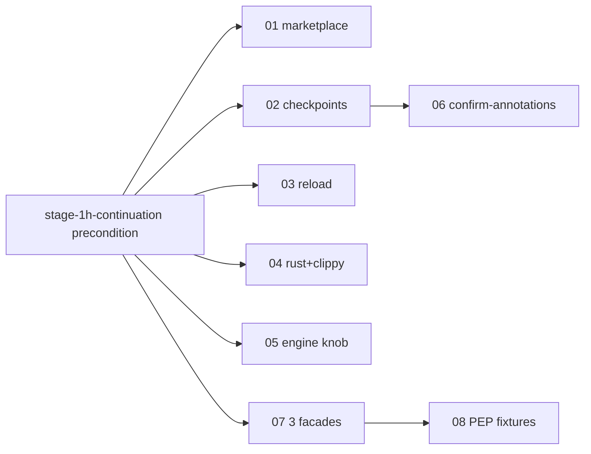

# v1.1 Milestone — Tree Plan

**Goal:** Land the cohesive v1.1 milestone: marketplace publish surface, persistent disk checkpoints, plugin reload tool, Rust+clippy multi-LSP scenario, runtime engine knob, per-annotation manual-review workflow, three Python facades, and PEP 695/701/654 fixture variants.

**Cross-stream precondition (top-of-tree, blocking):** `stage-1h-continuation` MUST land before any leaf in this tree begins execution. Source: `docs/gap-analysis/WHAT-REMAINS.md` §Recommended-sequencing item 5 ("Wait until Stage 1H lands so the v1.1 work has full coverage breadth underneath it"). This precondition is intentionally non-negotiable — v1.1 widens MCP surface, which without Stage 1H breadth would silently degrade green-CI signal.

**Source brief:** `/tmp/plan-orchestration/MASTER.md` §3 Brief 5; gap-analysis `WHAT-REMAINS.md` §5 (lines 109–120); design `B-design.md` §4 (Q10/Q11); design report `q4-changeannotations-auto-accept.md` §6.3.

**Top-level INDEX:** [`../2026-04-26-INDEX-post-v0.3.0.md`](../2026-04-26-INDEX-post-v0.3.0.md) (synthesized in Phase 5; see MASTER §6.2).

## Leaf table

The "Depends-on (cross-stream)" column is `(all)` — every leaf inherits the `stage-1h-continuation` precondition stated in the prose above; the column is retained as a per-leaf reminder so executors of any single leaf cannot miss the gate. (Per critic S1: noise acknowledged; column kept for single-leaf-pickup scenarios.)

| # | Slug | Goal | Size | Depends-on (intra) | Depends-on (cross-stream) |
|---|---|---|---|---|---|
| 01 | [marketplace-publication](./01-marketplace-publication.md) | Define publish surface for multi-plugin repo at `o2alexanderfedin/claude-code-plugins`; Q11 layout. | M | — | (all) `stage-1h-continuation` |
| 02 | [persistent-disk-checkpoints](./02-persistent-disk-checkpoints.md) | Replace LRU-only `CheckpointStore` with durable disk-backed pydantic store. | M | — | (all) `stage-1h-continuation` |
| 03 | [scalpel-reload-plugins](./03-scalpel-reload-plugins.md) | Ship one new MCP tool `scalpel_reload_plugins` (Q10 named, MVP unimplemented). | S | — | (all) `stage-1h-continuation` |
| 04 | [rust-clippy-multi-server](./04-rust-clippy-multi-server.md) | Extend Python multi-LSP merge invariants to Rust + clippy second-language scenario. | M | — | (all) `stage-1h-continuation` |
| 05 | [engine-config-knob](./05-engine-config-knob.md) | Runtime engine selection knob (project-memory v0.2.0 critical-path). | S | — | (all) `stage-1h-continuation` |
| 06 | [scalpel-confirm-annotations](./06-scalpel-confirm-annotations.md) | Per-annotation manual-review workflow per q4 §6.3 (`confirmation_mode="manual"`). | S | 02 | (all) `stage-1h-continuation` |
| 07 | [three-python-facades](./07-three-python-facades.md) | Three Python dispatch sites: `convert_to_async`, `annotate_return_type`, `convert_from_relative_imports`. | M | — | (all) `stage-1h-continuation` |
| 08 | [pep-695-701-654-fixtures](./08-pep-695-701-654-fixtures.md) | Fixture variants for PEP 695 (type alias), 701 (f-string), 654 (exception groups). | S | 07 | (all) `stage-1h-continuation` |

## Execution order

Strict cross-stream gate — `stage-1h-continuation` must be merged before starting any leaf below.

1. **01 marketplace-publication** — defines publish surface that downstream leaves register against.
2. **02 persistent-disk-checkpoints** — schema lands first; leaf 06 reuses the persistence boundary.
3. **03 scalpel-reload-plugins** — independent; can run parallel to 02.
4. **04 rust-clippy-multi-server** — independent of 01–03; requires Stage 1H breadth.
5. **05 engine-config-knob** — independent; small.
6. **06 scalpel-confirm-annotations** — depends on 02 (transaction state needs durable backing).
7. **07 three-python-facades** — three independent dispatch sites; runs parallel internally.
8. **08 pep-695-701-654-fixtures** — depends on 07 (facades exercise the fixtures).

## Intra-tree dependency diagram

## Skill pointers (referenced, never repeated inline per leaf)

- `superpowers:writing-plans` — bite-sized 2–5 minute steps; full TDD cycle per task.
- `superpowers:test-driven-development` — failing test → implement → passing test → commit.
- `superpowers:executing-plans` and `superpowers:subagent-driven-development` — execution audiences.
- Project `CLAUDE.md` — SOLID/KISS/DRY/YAGNI/TRIZ; type-safety with full hints + pydantic at boundaries; sizing in S/M/L or LoC; author `AI Hive(R)`; no emoji; Mermaid not ASCII; reference evidence by `file:section`, never quote.

*Author: AI Hive(R)*
