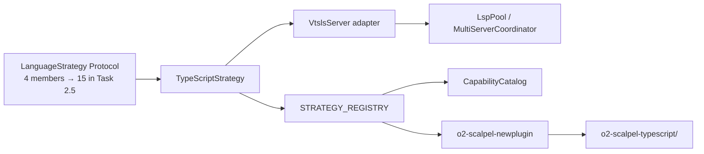

# 01 — TypeScript Strategy via `vtsls` (v2)

**Status:** PLANNED
**Branch:** `feature/v2-typescript-vtsls-strategy` (submodule + parent)
**Owner:** AI Hive(R)
**Created:** 2026-04-26
**Target LoC:** ~1,900 (cap 2,500; +~100 vs v1 to absorb Task 2.5 Protocol extension)
**Depends on:** v1.1 milestone landed; the 4-member `LanguageStrategy` Protocol (current at `vendor/serena/src/serena/refactoring/language_strategy.py:33–52`); v2+ extends it to 15 per B-design.md §5.2 — see Task 2.5 below.

> **For agentic workers:** REQUIRED SUB-SKILLS — `superpowers:subagent-driven-development`, `superpowers:test-driven-development`, `superpowers:writing-plans`. Steps use checkbox (`- [ ]`) syntax for tracking. Bite-sized 2–5 min steps. No placeholder language.

---

## Goal

Ship the first first-class non-Python/Rust strategy: `TypeScriptStrategy(LanguageStrategy)` driven by `vtsls`, the LSP-protocol bridge to TypeScript's `tsserver`. **First, extend the `LanguageStrategy` Protocol from its current 4 members (3 attributes + `build_servers`) to the 15-member shape per B-design.md §5.2 (Task 2.5).** Then land the LSP adapter, the Protocol-conformant strategy class, the capability-catalog wiring, the `calcts/` integration fixture, and the per-method TDD spike pattern (one method shown in full TDD detail; the remaining 14 enumerated as a method-by-method checklist).

Without Task 2.5, Task 3 row 5 (`extract_module_kind` and similar) cannot type-check against `@runtime_checkable`, and leaves 02–05 inherit the same blocker. Task 2.5 is therefore the gate for the whole tree.

---

## Architecture



---

## Tech Stack

| Layer | Choice | Why |
|---|---|---|
| LSP server | `vtsls` (`@vtsls/language-server`) | LSP bridge over `tsserver`; reference: https://github.com/yioneko/vtsls |
| Install | `npm install -g @vtsls/language-server` | Pinned via `O2_SCALPEL_VTSLS_VERSION` (default `0.2.6`) |
| Strategy host | `vendor/serena/src/serena/refactoring/typescript_strategy.py` | Mirrors `python_strategy.py`/`rust_strategy.py` siting |
| Adapter host | `vendor/serena/src/solidlsp/language_servers/vtsls_server.py` | Mirrors `pylsp_server.py` adapter pattern |

No new Python runtime deps. `vtsls` is an external prerequisite discovered via `shutil.which("vtsls")`.

---

## File Structure

| # | Path | Action | LoC | Purpose |
|---|---|---|---|---|
| 0 | `vendor/serena/src/serena/refactoring/language_strategy.py` | **Modify (Task 2.5)** | +~80 | Extend Protocol from 4 to 15 members per B-design.md §5.2. |
| 1 | `vendor/serena/src/solidlsp/language_servers/vtsls_server.py` | New | ~120 | `VtslsServer` adapter — boot vtsls, install default request handlers, drain `workspace/applyEdit`. |
| 2 | `vendor/serena/src/serena/refactoring/typescript_strategy.py` | New | ~280 | `TypeScriptStrategy(LanguageStrategy)` — implements all 15 Protocol members (4 existing + 11 added in Task 2.5). |
| 3 | `vendor/serena/src/serena/refactoring/__init__.py` | Modify | +~6 | Re-export `TypeScriptStrategy`; add `Language.TYPESCRIPT: TypeScriptStrategy` to `STRATEGY_REGISTRY`. |
| 4 | `vendor/serena/src/serena/capability/capability_catalog.py` | Modify | +~4 | Add `"typescript"` capability entry; bump golden-baseline hash. |
| 5 | `vendor/serena/test/spikes/test_v2_typescript_strategy_protocol.py` | New | ~210 | One full-TDD spike per Protocol method; 15 test functions. |
| 6 | `vendor/serena/test/integration/calcts/` | New | ~450 | Fixture TypeScript project (tsconfig.json, src/*.ts, package.json). |
| 7 | `vendor/serena/test/integration/test_v2_typescript_calcts.py` | New | ~280 | Integration tests over `calcts/`. |
| 8 | `vendor/serena/test/spikes/test_stage_1f_t5_catalog_drift.py` | Modify | +~12 | Update golden baseline to include TypeScript capability row. |
| 9 | `vendor/serena/test/spikes/test_v2_protocol_extension.py` | **New (Task 2.5)** | ~100 | Verifies the 11 new Protocol members appear in `dir(LanguageStrategy)`. |
| 10 | `o2-scalpel-typescript/` (generated) | Generated | — | Output of `o2-scalpel-newplugin --language typescript`; not hand-authored. |

### Per-Task LoC budget (S2)

| Task | Target LoC |
|---|---|
| T0 (PROGRESS) | ~20 |
| T1 (VtslsServer adapter) | ~120 + ~80 test = ~200 |
| T2 (Strategy skeleton) | ~80 |
| **T2.5 (Protocol extension)** | **~80 prod + ~100 test = ~180** |
| T3 (14 methods) | ~200 prod + ~210 test = ~410 |
| T4 (catalog wiring) | ~16 |
| T5 (calcts fixture) | ~450 |
| T6 (integration tests) | ~280 |
| T7 (generator-emit) | ~20 (verification only) |
| T8 (final verify + tag) | ~20 |
| **Total** | **~1,900** |

---

## Pre-flight

- [ ] **Verify entry baseline** — `cd vendor/serena && git checkout main && git pull --ff-only && PATH="$(pwd)/.venv/bin:$PATH" .venv/bin/pytest test/spikes/ -q --tb=line`. Expected: spike-suite green at v1.1 milestone tag.
- [ ] **Verify Protocol shape** — `grep -n "^    [a-z_]" vendor/serena/src/serena/refactoring/language_strategy.py | head -20`. Expected to show only `language_id`, `extension_allow_list`, `code_action_allow_list`, `build_servers`. This confirms the 4-member starting state Task 2.5 will extend.
- [ ] **Bootstrap branches** — submodule: `git checkout -b feature/v2-typescript-vtsls-strategy`; parent: `git checkout -b feature/v2-typescript-vtsls-strategy develop`.
- [ ] **Install `vtsls`**: `npm install -g @vtsls/language-server@0.2.6`; verify `which vtsls && vtsls --version`. Discovery rule: `TypeScriptStrategy.build_servers()` calls `shutil.which("vtsls")`; missing → `RuntimeError("vtsls not on PATH; install via 'npm install -g @vtsls/language-server'")`.

---

## Tasks

### Task 0 — PROGRESS ledger

**Files:**
- Create: `docs/superpowers/plans/v2-typescript-vtsls-results/PROGRESS.md` (parent)

- [ ] **Step 1: Seed PROGRESS.md** with one row per task in this plan (T1–T8 plus the new T2.5) plus `Outcome` and `Follow-ups` columns. Mirror Stage 1E result-ledger format.
- [ ] **Step 2: Commit** `chore(v2-ts): seed PROGRESS ledger`.

### Task 1 — `VtslsServer` adapter (canonical-method full TDD cycle)

**Files:**
- Create: `vendor/serena/src/solidlsp/language_servers/vtsls_server.py`
- Create: `vendor/serena/test/spikes/test_v2_typescript_t1_vtsls_adapter.py`

**This is the canonical method shown with a full TDD cycle. The remaining 14 Protocol methods (Task 3) follow the same five-step pattern.**

- [ ] **Step 1: Write failing test** at `vendor/serena/test/spikes/test_v2_typescript_t1_vtsls_adapter.py`:

```python
"""T1 — VtslsServer adapter boots, drains applyEdit, exposes capabilities."""

from __future__ import annotations
import shutil
from pathlib import Path
import pytest

pytestmark = pytest.mark.skipif(
    shutil.which("vtsls") is None,
    reason="vtsls not installed; install via 'npm install -g @vtsls/language-server'",
)

def test_vtsls_adapter_imports() -> None:
    from solidlsp.language_servers.vtsls_server import VtslsServer  # noqa: F401

def test_vtsls_adapter_boots_against_calcts(tmp_path: Path) -> None:
    from solidlsp.language_servers.vtsls_server import VtslsServer
    project = tmp_path / "calcts"
    project.mkdir()
    (project / "tsconfig.json").write_text('{"compilerOptions":{"strict":true}}', encoding="utf-8")
    (project / "main.ts").write_text("export const add = (a:number,b:number)=>a+b;\n", encoding="utf-8")
    server = VtslsServer(project_root=project)
    server.start()
    try:
        assert server.is_alive()
        caps = server.server_capabilities
        assert caps.get("codeActionProvider") is not None
        assert caps.get("renameProvider") is not None
    finally:
        server.stop()

def test_vtsls_adapter_drains_apply_edit(tmp_path: Path) -> None:
    from solidlsp.language_servers.vtsls_server import VtslsServer
    project = tmp_path / "calcts"
    project.mkdir()
    (project / "tsconfig.json").write_text('{"compilerOptions":{"strict":true}}', encoding="utf-8")
    (project / "main.ts").write_text("export const x = 1;\n", encoding="utf-8")
    server = VtslsServer(project_root=project)
    server.start()
    try:
        server.request_code_actions(
            file=str(project / "main.ts"),
            range_=((0, 0), (0, 0)),
            only=["source.organizeImports.ts"],
        )
        assert isinstance(server.pop_pending_apply_edits(), list)
    finally:
        server.stop()
```

Run: `PATH="$(pwd)/.venv/bin:$PATH" .venv/bin/pytest test/spikes/test_v2_typescript_t1_vtsls_adapter.py -v`. Expected: 3 FAIL with `ModuleNotFoundError`.

- [ ] **Step 2: Implement minimal adapter** at `vendor/serena/src/solidlsp/language_servers/vtsls_server.py`:

```python
"""VtslsServer — solidlsp adapter for vtsls (LSP bridge to tsserver)."""

from __future__ import annotations

import shutil
import subprocess
from pathlib import Path
from typing import Any

from solidlsp.solid_language_server import SolidLanguageServer


class VtslsServer(SolidLanguageServer):
    server_id: str = "vtsls"
    language_id: str = "typescript"

    def __init__(self, project_root: Path) -> None:
        super().__init__(project_root=project_root)
        self._executable = shutil.which("vtsls")
        if self._executable is None:
            raise RuntimeError(
                "vtsls not on PATH; install via 'npm install -g @vtsls/language-server'"
            )

    def _spawn(self) -> subprocess.Popen[bytes]:
        return subprocess.Popen(
            [self._executable, "--stdio"],
            stdin=subprocess.PIPE, stdout=subprocess.PIPE, stderr=subprocess.PIPE,
            cwd=str(self.project_root),
        )

    def _initialize_params(self) -> dict[str, Any]:
        params = super()._initialize_params()
        params["initializationOptions"] = {
            "preferences": {"includeCompletionsForModuleExports": True},
            "tsserver": {"useSyntaxServer": "auto"},
        }
        return params
```

- [ ] **Step 3: Run failing tests turn green**

```bash
PATH="$(pwd)/.venv/bin:$PATH" .venv/bin/pytest test/spikes/test_v2_typescript_t1_vtsls_adapter.py -v
```

Expected: 3 passed (or 3 skipped if `vtsls` is not installed in CI — degraded-mode acceptable; install hook covers production).

- [ ] **Step 4: Lint + type-check**

```bash
.venv/bin/ruff check src/solidlsp/language_servers/vtsls_server.py
.venv/bin/basedpyright src/solidlsp/language_servers/vtsls_server.py
```

Expected: zero errors.

- [ ] **Step 5: Commit** `feat(v2-ts-T1): add VtslsServer solidlsp adapter (boots, drains applyEdit, default handlers)`.

### Task 2 — Bootstrap `TypeScriptStrategy` skeleton

**Files:**
- Create: `vendor/serena/src/serena/refactoring/typescript_strategy.py`
- Create: `vendor/serena/test/spikes/test_v2_typescript_t2_strategy_skeleton.py`

- [ ] **Step 1: Write failing test** asserting `TypeScriptStrategy` imports, declares `language_id == "typescript"`, declares `extension_allow_list == frozenset({".ts", ".tsx", ".js", ".jsx", ".mts", ".cts"})`, and passes `isinstance(TypeScriptStrategy(), LanguageStrategy)` (Protocol is `@runtime_checkable`).
- [ ] **Step 2: Implement minimal class** with the four core attributes (`language_id`, `extension_allow_list`, `code_action_allow_list`, `build_servers`). These are the only members present on the Protocol surface today; the remaining 11 land in Task 2.5 below before Task 3 fills them.
- [ ] **Step 3: Run** — expect green.
- [ ] **Step 4: Lint + type-check** the new file.
- [ ] **Step 5: Commit** `feat(v2-ts-T2): TypeScriptStrategy skeleton conforms to 4-member LanguageStrategy Protocol`.

### Task 2.5 — Extend `LanguageStrategy` Protocol from 4 to 15 members (gates Tasks 3 + leaves 02–05)

**Files:**
- Modify: `vendor/serena/src/serena/refactoring/language_strategy.py`
- Create: `vendor/serena/test/spikes/test_v2_protocol_extension.py`

**Why this Task exists.** The Protocol at `vendor/serena/src/serena/refactoring/language_strategy.py:33–52` exposes only 4 members today (3 attributes + `build_servers`). B-design.md §5.2 describes a future 15-member shape ("RustStrategy implements all 15"). v1 of this tree treated the 15 members as already present — they are not. Task 2.5 lands the 11 missing members (`extract_module_kind`, `move_to_file_kind`, `module_declaration_syntax`, `module_filename_for`, `reexport_syntax`, `is_top_level_item`, `symbol_size_heuristic`, `execute_command_whitelist`, `post_apply_health_check_commands`, `lsp_init_overrides`, `module_kind_for_file`) **as Protocol stubs with type signatures and `...` bodies**, so that:

1. `TypeScriptStrategy` (Task 3) can implement each one with correct signatures.
2. `@runtime_checkable` `isinstance` checks see the new method names in `dir(...)`.
3. Leaves 02–05 inherit a stable 15-member surface and can avoid stubbing.
4. `RustStrategyExtensions` / `PythonStrategyExtensions` (already in the file) can be folded into the main Protocol in a follow-up; this Task adds them as Protocol members but does NOT remove the existing extension classes (deferred to v2.1).

**Method signatures (per B-design.md §5.2):**

| # | Member | Signature | Purpose |
|---|---|---|---|
| 5 | `extract_module_kind` | `(self, file: Path) -> str` | Returns a language-specific module kind label (`"esmodule"`, `"gomodule"`, `"translation_unit"`, `"compilation_unit"`, …). |
| 6 | `move_to_file_kind` | `(self) -> str` | LSP code-action kind to use for "move to file" refactor. |
| 7 | `module_declaration_syntax` | `(self, name: str) -> str` | Source text emitted for a new module's header (e.g. `"package x;"`, `"export * from './x';"`). |
| 8 | `module_filename_for` | `(self, name: str) -> str` | Filename a new module of the given name should land at. |
| 9 | `reexport_syntax` | `(self, symbol: str, source: str) -> str` | Source text emitted to re-export a symbol from another module. |
| 10 | `is_top_level_item` | `(self, node: Any) -> bool` | True iff the AST node is a top-level declaration. |
| 11 | `symbol_size_heuristic` | `(self, symbol: Any) -> int` | Approximate line count of a symbol body. |
| 12 | `execute_command_whitelist` | `frozenset[str]` (attribute) | Allowed `workspace/executeCommand` IDs. |
| 13 | `post_apply_health_check_commands` | `(self, project_root: Path) -> list[tuple[str, ...]]` | Subprocess calls to run after applying an edit. |
| 14 | `lsp_init_overrides` | `(self) -> dict[str, Any]` | `initializationOptions` overrides per language. |
| 15 | `module_kind_for_file` | `(self, file: Path) -> str` | Alias / per-file specialization of `extract_module_kind`; reserved for languages with mixed module systems (TS `.cts` vs `.mts`, Py `__init__.py` vs `.py`). |

- [ ] **Step 1: Write failing test** at `vendor/serena/test/spikes/test_v2_protocol_extension.py`:

```python
"""T2.5 — LanguageStrategy Protocol exposes the 15 members per B-design.md §5.2."""

from __future__ import annotations


def test_protocol_exposes_15_members() -> None:
    from serena.refactoring.language_strategy import LanguageStrategy
    required = {
        # 4 already present (pre-v2)
        "language_id", "extension_allow_list", "code_action_allow_list", "build_servers",
        # 11 added by Task 2.5
        "extract_module_kind", "move_to_file_kind", "module_declaration_syntax",
        "module_filename_for", "reexport_syntax", "is_top_level_item",
        "symbol_size_heuristic", "execute_command_whitelist",
        "post_apply_health_check_commands", "lsp_init_overrides", "module_kind_for_file",
    }
    members = set(dir(LanguageStrategy))
    missing = required - members
    assert not missing, f"Protocol missing: {missing}"


def test_protocol_runtime_checkable_still_holds() -> None:
    """Adding methods must not strip the @runtime_checkable decorator."""
    from typing import get_type_hints
    from serena.refactoring.language_strategy import LanguageStrategy
    # Protocol membership at runtime requires _is_runtime_protocol attribute.
    assert getattr(LanguageStrategy, "_is_runtime_protocol", False) is True
    # Type hints resolvable (sanity).
    assert "language_id" in get_type_hints(LanguageStrategy)
```

Run: `PATH="$(pwd)/.venv/bin:$PATH" .venv/bin/pytest test/spikes/test_v2_protocol_extension.py -v`. Expected: 1 FAIL (missing 11 members), 1 PASS (`@runtime_checkable` still on the existing class).

- [ ] **Step 2: Add the 11 stubs** to `vendor/serena/src/serena/refactoring/language_strategy.py` (between the existing `build_servers` and the `RustStrategyExtensions` block). Each stub uses `...` body and the signature from the table above. Example:

```python
    def extract_module_kind(self, file: Path) -> str:
        """Language-specific module-kind label (e.g. ``"esmodule"``, ``"gomodule"``).

        :param file: source path; canonicalised by caller.
        :return: opaque string key consumed by facades for module-aware refactors.
        """
        ...

    def move_to_file_kind(self) -> str:
        """LSP code-action kind for the "move-to-file" refactor (e.g. ``"refactor.move.file"``)."""
        ...

    # … (9 more, per the table)

    execute_command_whitelist: frozenset[str] = frozenset()
```

- [ ] **Step 3: Re-run** — expect both tests green.
- [ ] **Step 4: Lint + basedpyright** — zero errors. (Older callers that previously passed `isinstance(x, LanguageStrategy)` against a 4-member Protocol may surface `reportInvalidTypeArguments` once stubs land; resolve by calling `isinstance` on the concrete class instead, or by adding the missing methods to existing strategies as 4-line stubs that delegate to `RustStrategyExtensions`/`PythonStrategyExtensions`.)
- [ ] **Step 5: Run the full spike suite** — `pytest test/spikes/ -q`. Expected: green; no regressions in existing Python/Rust strategy tests (those classes already have the 11 methods on their concrete bodies via the extension classes).
- [ ] **Step 6: Commit** `feat(v2-ts-T2.5): extend LanguageStrategy Protocol from 4 to 15 members per B-design §5.2`.

### Task 3 — Per-Protocol-method TDD enumeration (14 remaining methods)

**Files:**
- Modify: `vendor/serena/src/serena/refactoring/typescript_strategy.py`
- Modify: `vendor/serena/test/spikes/test_v2_typescript_strategy_protocol.py` (one test per method)

Each of the 14 methods follows the same five-step TDD cycle as Task 1. Test stub naming convention: `test_typescriptstrategy_<method-slug>`. Target fixture: `vendor/serena/test/integration/calcts/` from Task 5. **All 14 method signatures come from the now-extended Protocol (4 existing + 11 added in Task 2.5);** without Task 2.5, row 5 onward would not type-check against `@runtime_checkable`.

| # | Method (per B-design.md §5.2) | Slug | Assertion intent | Target fixture |
|---|---|---|---|---|
| 1 | `language_id` | `language_id_is_typescript` | Equals `"typescript"`. | n/a (constant) |
| 2 | `extension_allow_list` | `extension_allow_list_six_suffixes` | Equals `frozenset({".ts", ".tsx", ".js", ".jsx", ".mts", ".cts"})`. | n/a (constant) |
| 3 | `code_action_allow_list` | `code_action_allow_list_includes_source_fixall` | Includes `source.organizeImports.ts`, `source.fixAll.ts`, `refactor.extract.function`, `refactor.rewrite.import`. | n/a (constant) |
| 4 | `build_servers(project_root)` | `build_servers_returns_single_vtsls` | Returns `{"vtsls": VtslsServer(...)}`; key set length 1. | `calcts/` |
| 5 | `extract_module_kind` | `extract_module_kind_is_es_module` | Returns `"esmodule"` for `.ts`, `.tsx`, `.mts`, `.jsx`, `.js` (per ESM-default spec); `"commonjs"` only for `.cts`. **The test enumerates all five ESM-side suffixes plus `.cts` for the CommonJS branch (R7).** | `calcts/main.ts`, `calcts/legacy.cts`, `calcts/components/calc.tsx` |
| 6 | `move_to_file_kind` | `move_to_file_kind_uses_refactor_move` | Returns LSP code-action kind `"refactor.move.file"`. | n/a (constant) |
| 7 | `module_declaration_syntax(name)` | `module_declaration_syntax_emits_export` | Returns `f"export * from './{name}';\n"`. | n/a (pure) |
| 8 | `module_filename_for(name)` | `module_filename_appends_ts` | Returns `f"{name}.ts"` for normal modules; `f"{name}.tsx"` when `is_jsx=True`. | n/a (pure) |
| 9 | `reexport_syntax(symbol, source)` | `reexport_syntax_emits_export_from` | Returns `f"export {{ {symbol} }} from './{source}';\n"`. | n/a (pure) |
| 10 | `is_top_level_item(node)` | `is_top_level_item_recognises_export_statements` | Returns `True` for top-level `ExportDeclaration`/`FunctionDeclaration`/`ClassDeclaration`/`InterfaceDeclaration`. | `calcts/main.ts` |
| 11 | `symbol_size_heuristic(symbol)` | `symbol_size_heuristic_counts_lines_within_braces` | Counts source-range lines between matching braces; returns `int`. | `calcts/main.ts` |
| 12 | `execute_command_whitelist` | `execute_command_whitelist_includes_organize_imports` | Includes `_typescript.applyRenameFile`, `_typescript.organizeImports`, `_typescript.applyCompletionCodeAction`. | n/a (constant) |
| 13 | `post_apply_health_check_commands(project_root)` | `post_apply_health_check_runs_tsc_noemit` | Returns `[("tsc", "--noEmit", "-p", str(project_root))]` when `tsconfig.json` exists; empty otherwise. | `calcts/` |
| 14 | `lsp_init_overrides()` | `lsp_init_overrides_sets_use_syntax_server_auto` | Returns dict containing `{"tsserver": {"useSyntaxServer": "auto"}}`. | n/a (constant) |

For each method:
- [ ] Step 1 — write failing test (red).
- [ ] Step 2 — implement minimal method body.
- [ ] Step 3 — re-run; assert green.
- [ ] Step 4 — lint + basedpyright.
- [ ] Step 5 — commit `feat(v2-ts-T3.<n>): TypeScriptStrategy.<method> implemented`.

After all 14 commits land, run the full Protocol-conformance test:

```bash
PATH="$(pwd)/.venv/bin:$PATH" .venv/bin/pytest test/spikes/test_v2_typescript_strategy_protocol.py -v
```

Expected: 15 passed (Task 1 + Task 3's 14).

### Task 4 — Capability catalog wiring + drift CI baseline bump

**Files:**
- Modify: `vendor/serena/src/serena/capability/capability_catalog.py`
- Modify: `vendor/serena/test/spikes/test_stage_1f_t5_catalog_drift.py`

- [ ] **Step 1: Write failing test** — assert the catalog `hash()` SHA-256 has changed and now includes a `"typescript"` row with `code_actions = TypeScriptStrategy.code_action_allow_list`.
- [ ] **Step 2: Implement** — add `_TYPESCRIPT_ROW` to the catalog data; recompute and pin the new SHA-256 in the drift baseline.
- [ ] **Step 3: Run drift CI**:
  ```bash
  PATH="$(pwd)/.venv/bin:$PATH" .venv/bin/pytest test/spikes/test_stage_1f_t5_catalog_drift.py -v
  ```
  Expected: green with new baseline.
- [ ] **Step 4: Lint + type-check**.
- [ ] **Step 5: Commit** `feat(v2-ts-T4): catalog drift CI baseline bumped for TypeScript`.

### Task 5 — `calcts/` integration fixture

**Files:**
- Create: `vendor/serena/test/integration/calcts/tsconfig.json`
- Create: `vendor/serena/test/integration/calcts/package.json`
- Create: `vendor/serena/test/integration/calcts/src/main.ts`
- Create: `vendor/serena/test/integration/calcts/src/legacy.cts`
- Create: `vendor/serena/test/integration/calcts/src/components/calc.tsx`

- [ ] **Step 1: Write `tsconfig.json`** with `strict: true`, `target: ES2022`, `module: NodeNext`, `outDir: dist`, `rootDir: src`.
- [ ] **Step 2: Write `package.json`** with `name: calcts`, `type: module`, `scripts.build: "tsc --noEmit"`.
- [ ] **Step 3: Write `src/main.ts`** with two exports (`add`, `mul`) and one default-export class `Calculator`.
- [ ] **Step 4: Write `src/legacy.cts`** with one CommonJS-style export.
- [ ] **Step 5: Write `src/components/calc.tsx`** with one functional React component using JSX.
- [ ] **Step 6: Verify** — `cd test/integration/calcts && npx tsc --noEmit` exits 0.
- [ ] **Step 7: Commit** `test(v2-ts-T5): calcts/ integration fixture (tsconfig + 3 modules)`.

### Task 6 — `calcts/` integration tests

**Files:**
- Create: `vendor/serena/test/integration/test_v2_typescript_calcts.py`

- [ ] **Step 1: Write tests** — three tests: (a) `TypeScriptStrategy` boots vtsls against `calcts/`; (b) `request_code_actions` over `src/main.ts:0:0` returns at least one `source.organizeImports.ts` action; (c) `post_apply_health_check_commands` returns the `tsc --noEmit` invocation.
- [ ] **Step 2: Run** — expect green. Note (S7): integration tests gate on `vtsls` being on PATH; CI installs vtsls via the v1.1 marketplace install hooks. When the LSP server is missing, tests skip rather than fail; this is documented in the spike-suite skip-counter ledger.
- [ ] **Step 3: Commit** `test(v2-ts-T6): calcts/ integration tests for TypeScriptStrategy`.

### Task 7 — Generator-emit pass for `o2-scalpel-typescript/`

**Files:**
- No hand-edits. Run `o2-scalpel-newplugin` (Stage 1J) to regenerate.

Reference: `docs/superpowers/plans/2026-04-25-stage-1j-plugin-skill-generator.md`. Do NOT re-derive any generator logic in this leaf.

- [ ] **Step 1: Verify generator entrypoint registered (S6)**: run
  ```bash
  o2-scalpel-newplugin --help
  ```
  and confirm exit-status 0 and that the help output enumerates `--language typescript` (Stage 1J registers this; if missing, Stage 1J never landed and this leaf must block). Same fail-fast check applies to leaves 02/03/04 with `go`/`cpp`/`java`.
- [ ] **Step 2: Run generator**:
  ```bash
  o2-scalpel-newplugin --language typescript --out o2-scalpel-typescript --force
  ```
- [ ] **Step 3: Verify** — generated `o2-scalpel-typescript/.claude-plugin/plugin.json`, `.mcp.json`, `marketplace.json`, `skills/*.md`, `hooks/verify-scalpel-typescript.sh` all written; golden-file diff against the Stage 1J snapshot test passes.
- [ ] **Step 4: Commit** `feat(v2-ts-T7): emit o2-scalpel-typescript via o2-scalpel-newplugin`.

### Task 8 — Final verification + tag

- [ ] **Step 1: Full spike-suite green**: `pytest test/spikes/ -q`.
- [ ] **Step 2: Full integration-suite green**: `pytest test/integration/test_v2_typescript_calcts.py -q`.
- [ ] **Step 3: Drift-CI green**: `pytest test/spikes/test_stage_1f_t5_catalog_drift.py -q`.
- [ ] **Step 4: Tag** `v2-typescript-vtsls-strategy-complete` on submodule + parent (git-flow per project CLAUDE.md).
- [ ] **Step 5: Update PROGRESS.md** ledger to `COMPLETE`.

---

## Self-Review

- [ ] Task 2.5 lands the 11 missing Protocol members **before** Task 3 attempts to implement them; spike test (`test_v2_protocol_extension.py`) green.
- [ ] All 15 Protocol methods covered (Task 1 + Task 2 + Task 2.5 stubs + Task 3's 14 = 15 implementations).
- [ ] LSP install rule cited (`npm install -g @vtsls/language-server`); discovery via `shutil.which`.
- [ ] Capability catalog drift baseline bumped (Task 4); `calcts/` fixture (Task 5) exercised (Task 6).
- [ ] No facade rewrites — pure-plugin addition (B-design.md §5).
- [ ] No emoji; Mermaid; sizing in S/M/L; author `AI Hive(R)`; bite-sized TDD cycles.
- [ ] Generator step (Task 7) references Stage 1J plan; no re-derivation; `--help` smoke-check (S6) lands first.
- [ ] Citation language uses "the 4-member Protocol (current at `language_strategy.py:33–52`); v2+ extends to 15" — no claim that the Protocol already has 15 members at start.

---

*Author: AI Hive(R)*
