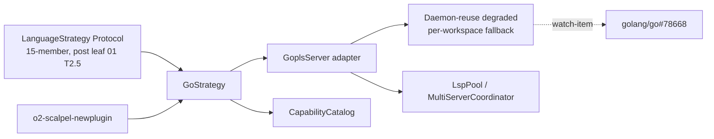

# 02 — Go Strategy via `gopls` (v2)

**Status:** PLANNED
**Branch:** `feature/v2-go-gopls-strategy` (submodule + parent)
**Owner:** AI Hive(R)
**Created:** 2026-04-26
**Target LoC:** ~1,700 (cap 2,500)
**Depends on:** Leaf 01 (TypeScript / vtsls) landed — including **leaf 01 Task 2.5 (`LanguageStrategy` Protocol extended from 4 to 15 members)** which this leaf consumes; the Strategy template from leaf 01 Task 1 is reused verbatim.

> **For agentic workers:** REQUIRED SUB-SKILLS — `superpowers:subagent-driven-development`, `superpowers:test-driven-development`. Steps use checkbox (`- [ ]`) syntax. Bite-sized 2–5 min steps. No placeholders.

---

## Goal

Ship `GoStrategy(LanguageStrategy)` driven by `gopls`. Land the LSP adapter, the Protocol-conformant strategy class (against the 4-member Protocol extended to 15 in leaf 01 Task 2.5), the capability-catalog wiring, the `calcgo/` integration fixture, and **the gopls daemon-reuse degradation path** until upstream `golang/go#78668` ships shared-daemon semantics. The degraded mode is exercised by an explicit Task in this plan.

**Reference for canonical TDD shape:** `01-typescript-vtsls-strategy.md` Task 1 — every per-method TDD cycle in this leaf follows the same five-step write-test → run-fail → implement → run-pass → commit pattern.

**Protocol provenance:** the 4-member Protocol (current at `vendor/serena/src/serena/refactoring/language_strategy.py:33–52`); v2+ extends to 15 per B-design.md §5.2 — see leaf 01 Task 2.5. Leaf 02 consumes the extended Protocol.

---

## Architecture



---

## Tech Stack

| Layer | Choice | Why |
|---|---|---|
| LSP server | `gopls` (`golang.org/x/tools/gopls`) | Canonical Go LSP; reference: https://pkg.go.dev/golang.org/x/tools/gopls |
| Install | `go install golang.org/x/tools/gopls@latest` | Standard Go tool distribution; pinned via `O2_SCALPEL_GOPLS_VERSION` |
| Daemon-reuse mode | Forced **OFF** until `golang/go#78668` closes | Watch-item; per-workspace path is degraded but correct |

---

## File Structure

| # | Path | Action | LoC | Purpose |
|---|---|---|---|---|
| 1 | `vendor/serena/src/solidlsp/language_servers/gopls_server.py` | New | ~140 | `GoplsServer` adapter; explicit per-workspace mode (no `-remote=auto`); exposes a `pid()` accessor. |
| 2 | `vendor/serena/src/serena/refactoring/go_strategy.py` | New | ~260 | `GoStrategy(LanguageStrategy)` — implements all 15 Protocol members (Protocol shape from leaf 01 T2.5). |
| 3 | `vendor/serena/src/serena/refactoring/__init__.py` | Modify | +~6 | Re-export `GoStrategy`; `STRATEGY_REGISTRY[Language.GO] = GoStrategy`. |
| 4 | `vendor/serena/src/serena/capability/capability_catalog.py` | Modify | +~4 | Add `"go"` capability entry; bump golden-baseline hash. |
| 5 | `vendor/serena/test/spikes/test_v2_go_strategy_protocol.py` | New | ~210 | One TDD cycle per Protocol method; 15 test functions. |
| 6 | `vendor/serena/test/spikes/test_v2_go_t9_daemon_reuse_degraded_mode.py` | New | ~90 | Degraded-mode test (Task 9). |
| 7 | `vendor/serena/test/integration/calcgo/` | New | ~380 | Fixture Go module (`go.mod`, `main.go`, `calc/calc.go`). |
| 8 | `vendor/serena/test/integration/test_v2_go_calcgo.py` | New | ~260 | Integration tests over `calcgo/`. |
| 9 | `vendor/serena/test/spikes/test_stage_1f_t5_catalog_drift.py` | Modify | +~12 | Update golden baseline. |

### Per-Task LoC budget (S2)

| Task | Target LoC |
|---|---|
| T0 | ~20 |
| T1 (gopls adapter) | ~140 prod + ~80 test = ~220 |
| T2 (skeleton) | ~70 |
| T3 (14 methods) | ~190 prod + ~210 test = ~400 |
| T4 (catalog) | ~16 |
| T5 (calcgo fixture) | ~380 |
| T6 (integration) | ~260 |
| T7 (generator-emit) | ~20 |
| T8 (verify + tag) | ~20 |
| T9 (degraded-mode) | ~90 + ~10 doc = ~100 |
| Test/baseline drift | ~12 |
| **Total** | **~1,720** |

---

## Pre-flight

- [ ] **Verify entry baseline** — submodule + parent at leaf 01 tag (`v2-typescript-vtsls-strategy-complete`); spike-suite green; `test_v2_protocol_extension.py` from leaf 01 Task 2.5 still green (Protocol has 15 members).
- [ ] **Bootstrap branches** — submodule + parent on `feature/v2-go-gopls-strategy`.
- [ ] **Install `gopls`**: `go install golang.org/x/tools/gopls@latest`; verify `which gopls && gopls version`. Pin via `O2_SCALPEL_GOPLS_VERSION` (default tracked at `v0.16.x`). Discovery rule: `GoStrategy.build_servers()` calls `shutil.which("gopls")`; missing → `RuntimeError("gopls not on PATH; install via 'go install golang.org/x/tools/gopls@latest'")`.

---

## Tasks

### Task 0 — PROGRESS ledger

- [ ] Create `docs/superpowers/plans/v2-go-gopls-results/PROGRESS.md` mirroring leaf 01's ledger format. Commit `chore(v2-go): seed PROGRESS ledger`.

### Task 1 — `GoplsServer` adapter (canonical-method full TDD cycle)

**Files:**
- Create: `vendor/serena/src/solidlsp/language_servers/gopls_server.py`
- Create: `vendor/serena/test/spikes/test_v2_go_t1_gopls_adapter.py`

This Task is the canonical full-TDD demonstration for this leaf (mirrors leaf 01 Task 1).

- [ ] **Step 1: Write failing test** at `vendor/serena/test/spikes/test_v2_go_t1_gopls_adapter.py`:

```python
"""T1 — GoplsServer adapter boots in per-workspace mode (no daemon reuse)."""

from __future__ import annotations
import shutil
from pathlib import Path
import pytest

pytestmark = pytest.mark.skipif(shutil.which("gopls") is None, reason="gopls not installed")

def test_gopls_adapter_imports() -> None:
    from solidlsp.language_servers.gopls_server import GoplsServer  # noqa: F401

def test_gopls_adapter_boots_per_workspace(tmp_path: Path) -> None:
    from solidlsp.language_servers.gopls_server import GoplsServer
    project = tmp_path / "calcgo"
    project.mkdir()
    (project / "go.mod").write_text("module calcgo\n\ngo 1.22\n", encoding="utf-8")
    (project / "main.go").write_text("package main\n\nfunc main() {}\n", encoding="utf-8")
    server = GoplsServer(project_root=project)
    assert server._daemon_reuse_enabled is False, (
        "gopls daemon reuse must remain OFF until golang/go#78668 closes"
    )
    server.start()
    try:
        assert server.is_alive()
        assert server.server_capabilities.get("renameProvider") is not None
    finally:
        server.stop()
```

- [ ] **Step 2: Implement** `GoplsServer` at `vendor/serena/src/solidlsp/language_servers/gopls_server.py`:

```python
"""GoplsServer — solidlsp adapter for gopls.

Daemon-reuse forced OFF until golang/go#78668 closes (degraded mode).
When upstream lands, flip ``_daemon_reuse_enabled`` and add ``-remote=auto``.
"""

from __future__ import annotations
import shutil
import subprocess
from pathlib import Path
from typing import Any
from solidlsp.solid_language_server import SolidLanguageServer


class GoplsServer(SolidLanguageServer):
    server_id: str = "gopls"
    language_id: str = "go"
    # Watch-item: golang/go#78668. Flip to True only after upstream closes.
    _daemon_reuse_enabled: bool = False

    def __init__(self, project_root: Path) -> None:
        super().__init__(project_root=project_root)
        self._executable = shutil.which("gopls")
        if self._executable is None:
            raise RuntimeError(
                "gopls not on PATH; install via 'go install golang.org/x/tools/gopls@latest'"
            )

    def _argv(self) -> list[str]:
        argv = [self._executable, "serve"]
        if self._daemon_reuse_enabled:
            argv.append("-remote=auto")
        return argv

    def _spawn(self) -> subprocess.Popen[bytes]:
        return subprocess.Popen(
            self._argv(),
            stdin=subprocess.PIPE, stdout=subprocess.PIPE, stderr=subprocess.PIPE,
            cwd=str(self.project_root),
        )

    def pid(self) -> int | None:
        """Public accessor for the underlying subprocess PID.

        Used by Task 9 degraded-mode tests to assert two workspaces get
        distinct OS processes; avoids reaching into ``self._process`` in
        callers (project diagnostic discipline: zero pyright private-use hits).
        """
        proc = getattr(self, "_process", None)
        return proc.pid if proc is not None else None

    def _initialize_params(self) -> dict[str, Any]:
        params = super()._initialize_params()
        params["initializationOptions"] = {
            "usePlaceholders": False,
            "completeUnimported": True,
            "staticcheck": True,
        }
        return params
```

- [ ] **Step 3: Run tests** — expect green (skip if `gopls` not installed).
- [ ] **Step 4: Lint + basedpyright** zero errors.
- [ ] **Step 5: Commit** `feat(v2-go-T1): GoplsServer adapter (per-workspace; daemon reuse gated on golang/go#78668; pid() accessor)`.

### Task 2 — Bootstrap `GoStrategy` skeleton

Per leaf 01 Task 2 pattern. Test asserts: `language_id == "go"`, `extension_allow_list == frozenset({".go"})`, `code_action_allow_list` includes `source.organizeImports`, `source.fixAll`, `refactor.extract`, `refactor.inline`, `refactor.rewrite`. Implement minimal class. **Protocol shape consumed: 4 surface members today + 11 added in leaf 01 Task 2.5 = 15 (`@runtime_checkable`).** Commit `feat(v2-go-T2): GoStrategy skeleton conforms to 15-member LanguageStrategy Protocol (post leaf 01 T2.5)`.

### Task 3 — Per-Protocol-method TDD enumeration (14 remaining methods)

Each method follows the leaf-01 five-step TDD cycle. Test stub naming: `test_gostrategy_<slug>`. Target fixture: `calcgo/` from Task 5. **All 14 methods reference signatures from the 15-member Protocol landed in leaf 01 Task 2.5.**

| # | Method | Slug | Assertion intent | Target fixture |
|---|---|---|---|---|
| 1 | `language_id` | `language_id_is_go` | Equals `"go"`. | n/a |
| 2 | `extension_allow_list` | `extension_allow_list_only_go` | Equals `frozenset({".go"})`. | n/a |
| 3 | `code_action_allow_list` | `code_action_allow_list_includes_organize_imports` | Includes `source.organizeImports`, `source.fixAll`, `refactor.extract`, `refactor.inline`. | n/a |
| 4 | `build_servers(project_root)` | `build_servers_returns_single_gopls_per_workspace` | Returns `{"gopls": GoplsServer(...)}`; per-workspace (not shared daemon). | `calcgo/` |
| 5 | `extract_module_kind` | `extract_module_kind_is_go_module` | Returns `"gomodule"` when `go.mod` is present in any ancestor. | `calcgo/go.mod` |
| 6 | `move_to_file_kind` | `move_to_file_kind_uses_refactor_extract` | Returns LSP code-action kind `"refactor.extract.toNewFile"` (gopls extension). | n/a |
| 7 | `module_declaration_syntax(name)` | `module_declaration_syntax_emits_package_clause` | Returns `f"package {name}\n"`. | n/a |
| 8 | `module_filename_for(name)` | `module_filename_lowercases_and_appends_go` | Returns `f"{name.lower()}.go"`. | n/a |
| 9 | `reexport_syntax(symbol, source)` | `reexport_syntax_emits_var_alias` | Returns `f"var {symbol} = {source}.{symbol}\n"`. | n/a |
| 10 | `is_top_level_item(node)` | `is_top_level_item_recognises_package_decls` | Returns `True` for top-level `FuncDecl`, `TypeSpec`, `ValueSpec`, `ImportSpec`. | `calcgo/calc/calc.go` |
| 11 | `symbol_size_heuristic(symbol)` | `symbol_size_heuristic_counts_brace_block_lines` | Counts source-range lines between matching `{`/`}`. | `calcgo/calc/calc.go` |
| 12 | `execute_command_whitelist` | `execute_command_whitelist_includes_gopls_commands` | Includes `gopls.add_import`, `gopls.apply_fix`, `gopls.gc_details`, `gopls.regenerate_cgo`, `gopls.tidy`. | n/a |
| 13 | `post_apply_health_check_commands(project_root)` | `post_apply_health_check_runs_go_build` | Returns `[("go", "build", "./..."), ("go", "vet", "./...")]` when `go.mod` is present. | `calcgo/` |
| 14 | `lsp_init_overrides()` | `lsp_init_overrides_disables_placeholders` | Returns dict with `usePlaceholders=False`, `completeUnimported=True`, `staticcheck=True`. | n/a |

For each row: Step 1 write failing test → Step 2 implement → Step 3 run pass → Step 4 lint+basedpyright → Step 5 commit `feat(v2-go-T3.<n>): GoStrategy.<method> implemented`.

After all 14 commits land:
```bash
PATH="$(pwd)/.venv/bin:$PATH" .venv/bin/pytest test/spikes/test_v2_go_strategy_protocol.py -v
```
Expected: 15 passed.

### Task 4 — Capability catalog wiring + drift CI baseline bump

Per leaf 01 Task 4 pattern. Add `"go"` row to `capability_catalog.py`; bump SHA-256 baseline; run drift CI. Commit `feat(v2-go-T4): catalog drift CI baseline bumped for Go`.

### Task 5 — `calcgo/` integration fixture

**Files:**
- Create: `vendor/serena/test/integration/calcgo/go.mod`
- Create: `vendor/serena/test/integration/calcgo/main.go`
- Create: `vendor/serena/test/integration/calcgo/calc/calc.go`
- Create: `vendor/serena/test/integration/calcgo/calc/calc_test.go`

- [ ] **Step 1: Write `go.mod`** — `module calcgo`, `go 1.22`.
- [ ] **Step 2: Write `main.go`** — `package main` with `func main()` calling `calc.Add(2, 3)`.
- [ ] **Step 3: Write `calc/calc.go`** — exports `Add(a, b int) int`, `Mul(a, b int) int`, type `Calculator struct`.
- [ ] **Step 4: Write `calc/calc_test.go`** — minimal table test for `Add` to give gopls something to lint.
- [ ] **Step 5: Verify** — `cd test/integration/calcgo && go build ./... && go vet ./...` exits 0.
- [ ] **Step 6: Commit** `test(v2-go-T5): calcgo/ integration fixture (go.mod + 2 packages)`.

### Task 6 — `calcgo/` integration tests

**Files:**
- Create: `vendor/serena/test/integration/test_v2_go_calcgo.py`

- [ ] Three tests: (a) `GoStrategy` boots gopls against `calcgo/`; (b) `request_code_actions` over `main.go:0:0` returns at least one `source.organizeImports` action; (c) `post_apply_health_check_commands` returns the `go build`/`go vet` invocations.
- [ ] Run, expect green (S7: skips when `gopls` not on PATH; CI installs via v1.1 install hook); commit `test(v2-go-T6): calcgo/ integration tests for GoStrategy`.

### Task 7 — Generator-emit pass for `o2-scalpel-go/`

Per leaf 01 Task 7. **First (S6):** verify `o2-scalpel-newplugin --help` exits 0 and lists `--language go`; if missing, Stage 1J never registered Go and this leaf must block. Then run `o2-scalpel-newplugin --language go --out o2-scalpel-go --force`. Reference Stage 1J plan; do not re-derive. Commit `feat(v2-go-T7): emit o2-scalpel-go via o2-scalpel-newplugin`.

### Task 8 — Final spike + integration green; tag

Per leaf 01 Task 8. Tag `v2-go-gopls-strategy-complete` on submodule + parent.

### Task 9 — Daemon-reuse degraded-mode test (watch-item)

**Files:**
- Create: `vendor/serena/test/spikes/test_v2_go_t9_daemon_reuse_degraded_mode.py`

This Task is **mandatory** per the WHAT-REMAINS.md §6 watch-item: "gopls daemon reuse (golang/go#78668) — Go strategy degrades to per-workspace path until upstream closes." The test pins the degraded mode so a future inadvertent flip surfaces immediately.

- [ ] **Step 1: Write failing test** at `vendor/serena/test/spikes/test_v2_go_t9_daemon_reuse_degraded_mode.py`:

```python
"""T9 — gopls daemon-reuse stays OFF until golang/go#78668 closes."""

from __future__ import annotations
import shutil
from pathlib import Path
import pytest

pytestmark = pytest.mark.skipif(shutil.which("gopls") is None, reason="gopls not installed")


def test_daemon_reuse_disabled_by_default() -> None:
    """Per WHAT-REMAINS.md §6 watch-item: degraded mode pinned until #78668."""
    from solidlsp.language_servers.gopls_server import GoplsServer
    assert GoplsServer._daemon_reuse_enabled is False, (
        "GoplsServer._daemon_reuse_enabled flipped to True without confirming "
        "golang/go#78668 has closed."
    )


def test_argv_excludes_remote_auto(tmp_path: Path) -> None:
    """Per-workspace mode: `-remote=auto` must NOT appear in argv."""
    from solidlsp.language_servers.gopls_server import GoplsServer
    project = tmp_path / "calcgo"
    project.mkdir()
    (project / "go.mod").write_text("module calcgo\n\ngo 1.22\n", encoding="utf-8")
    server = GoplsServer(project_root=project)
    argv = server._argv()
    assert "-remote=auto" not in argv, argv
    assert argv[0].endswith("gopls")
    assert "serve" in argv


def test_two_workspaces_get_separate_processes(tmp_path: Path) -> None:
    """Per-workspace mode → two instances → distinct PIDs.

    Uses public ``GoplsServer.pid()`` accessor (R8) — avoids private-attribute
    access and the resulting ``reportPrivateUsage`` pyright hint.
    """
    from solidlsp.language_servers.gopls_server import GoplsServer
    p1, p2 = tmp_path / "ws1", tmp_path / "ws2"
    for p in (p1, p2):
        p.mkdir()
        (p / "go.mod").write_text("module ws\n\ngo 1.22\n", encoding="utf-8")
    s1, s2 = GoplsServer(project_root=p1), GoplsServer(project_root=p2)
    s1.start(); s2.start()
    try:
        pid1, pid2 = s1.pid(), s2.pid()
        assert pid1 is not None and pid2 is not None
        assert pid1 != pid2
    finally:
        s1.stop(); s2.stop()


def test_watch_item_documented_in_module_docstring() -> None:
    """Module docstring must cite golang/go#78668."""
    from solidlsp.language_servers import gopls_server
    assert gopls_server.__doc__ is not None
    assert "78668" in gopls_server.__doc__
```

Run: `PATH="$(pwd)/.venv/bin:$PATH" .venv/bin/pytest test/spikes/test_v2_go_t9_daemon_reuse_degraded_mode.py -v`.

- [ ] **Step 2: Verify** — all four tests green (Task 1's adapter already pins the degraded mode and docstring; Task 1 also adds the `pid()` public accessor used by `test_two_workspaces_get_separate_processes`).
- [ ] **Step 3: Commit** `test(v2-go-T9): pin gopls daemon-reuse degraded mode (golang/go#78668; uses pid() accessor)`.
- [ ] **Step 4: Update PROGRESS.md** ledger — add Follow-up row "When `golang/go#78668` closes: flip `_daemon_reuse_enabled` to True, add `-remote=auto` to argv, update test_v2_go_t9 accordingly".

---

## Self-Review

- [ ] All 15 Protocol methods covered (Task 1 + Task 2 + Task 3's 14 = 15) against the Protocol shape landed in leaf 01 Task 2.5.
- [ ] LSP install rule cited (`go install golang.org/x/tools/gopls@latest`).
- [ ] Capability catalog drift baseline bumped (Task 4).
- [ ] `calcgo/` fixture created (Task 5) and exercised (Task 6).
- [ ] **Daemon-reuse degraded-mode test landed (Task 9)** with four assertions: class flag pinned, argv excludes `-remote=auto`, two workspaces get separate PIDs (via `pid()` public accessor — R8 resolution), watch-item documented in module docstring.
- [ ] No facade rewrites — pure-plugin addition.
- [ ] No emoji; Mermaid; sizing in S/M/L; author `AI Hive(R)`.
- [ ] Each TDD cycle bite-sized.
- [ ] Generator step (Task 7) references Stage 1J plan, no re-derivation; `--help` smoke-check (S6) lands first.
- [ ] Citation language uses "the 4-member Protocol (current at `language_strategy.py:33–52`); v2+ extends to 15 per B-design.md §5.2 — see leaf 01 Task 2.5".

---

*Author: AI Hive(R)*
