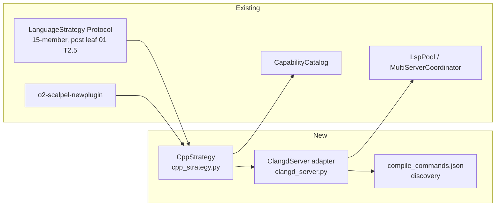

# 03 — C/C++ Strategy via `clangd` (v2)

**Status:** PLANNED
**Branch:** `feature/v2-c-cpp-clangd-strategy` (submodule + parent)
**Owner:** AI Hive(R)
**Created:** 2026-04-26
**Target LoC:** ~1,800 (cap 2,500)
**Depends on:** Leaf 02 (Go / gopls) landed — and through leaf 02, **leaf 01 Task 2.5 (`LanguageStrategy` Protocol extended from 4 to 15 members)**.

> **For agentic workers:** REQUIRED SUB-SKILLS — `superpowers:subagent-driven-development`, `superpowers:test-driven-development`. Steps use checkbox (`- [ ]`) syntax. Bite-sized 2–5 min steps. No placeholders.

---

## Goal

Ship `CppStrategy(LanguageStrategy)` driven by `clangd`. Land the LSP adapter, the Protocol-conformant strategy class (against the 4-member Protocol extended to 15 in leaf 01 Task 2.5), the capability-catalog wiring, the `calccpp/` integration fixture, and the `compile_commands.json`-driven discovery that clangd needs to do anything useful.

**Reference for canonical TDD shape:** `01-typescript-vtsls-strategy.md` Task 1 — every per-method TDD cycle in this leaf follows the same five-step write-test → run-fail → implement → run-pass → commit pattern.

**Protocol provenance:** the 4-member Protocol (current at `vendor/serena/src/serena/refactoring/language_strategy.py:33–52`); v2+ extends to 15 per B-design.md §5.2 — see leaf 01 Task 2.5. Leaf 03 consumes the extended Protocol.

---

## Architecture



---

## Tech Stack

| Layer | Choice | Why |
|---|---|---|
| LSP server | `clangd` (LLVM project) | Canonical C/C++ LSP; supports rename, code actions, and the `clangd.applyTweak` extension. Reference: https://clangd.llvm.org/ |
| Install path | macOS: `brew install llvm` (clangd ships with llvm); Linux: `apt-get install clangd-18`; Windows: download from LLVM releases | Cross-platform with platform-pinned discovery |
| Discovery | `shutil.which("clangd")` then `clangd --version` for >=15.0; **also asserted by spike test (S3)** | Older clangd lacks `textDocument/rename` reliability; CI must catch a stale image even without a real adapter run |
| Build-database | `compile_commands.json` at workspace root or `build/` | clangd reads this to know `-I`, `-D`, etc. — without it, every operation is best-effort |

---

## File Structure

| # | Path | Action | LoC | Purpose |
|---|---|---|---|---|
| 1 | `vendor/serena/src/solidlsp/language_servers/clangd_server.py` | New | ~150 | `ClangdServer` adapter; finds and validates `compile_commands.json`. |
| 2 | `vendor/serena/src/serena/refactoring/cpp_strategy.py` | New | ~290 | `CppStrategy(LanguageStrategy)` — implements all 15 Protocol members (Protocol shape from leaf 01 T2.5). |
| 3 | `vendor/serena/src/serena/refactoring/__init__.py` | Modify | +~6 | Re-export `CppStrategy`; `STRATEGY_REGISTRY[Language.CPP] = CppStrategy`. |
| 4 | `vendor/serena/src/serena/capability/capability_catalog.py` | Modify | +~4 | Add `"cpp"` capability entry; bump golden-baseline hash. |
| 5 | `vendor/serena/test/spikes/test_v2_cpp_strategy_protocol.py` | New | ~220 | One TDD cycle per Protocol method; 15 test functions. |
| 6 | `vendor/serena/test/integration/calccpp/` | New | ~420 | Fixture C++ project (CMakeLists.txt, src/*.cpp, build/compile_commands.json). |
| 7 | `vendor/serena/test/integration/test_v2_cpp_calccpp.py` | New | ~280 | Integration tests over `calccpp/`. |
| 8 | `vendor/serena/test/spikes/test_stage_1f_t5_catalog_drift.py` | Modify | +~12 | Update golden baseline. |
| 9 | `vendor/serena/test/spikes/test_v2_cpp_clangd_version_gate.py` | New (S3) | ~40 | Spike-level assert that `clangd --version >=15.0`; runs in CI even without fixture. |

### Per-Task LoC budget (S2)

| Task | Target LoC |
|---|---|
| T0 | ~20 |
| T1 (clangd adapter) | ~150 prod + ~80 test = ~230 |
| T2 (skeleton) | ~70 |
| T3 (14 methods) | ~220 prod + ~220 test = ~440 |
| T4 (catalog) | ~16 |
| T5 (calccpp fixture) | ~420 |
| T6 (integration) | ~280 |
| T7 (generator-emit) | ~20 |
| T8 (verify + tag) | ~20 |
| Version-gate spike (S3) | ~40 |
| Test/baseline drift | ~12 |
| **Total** | **~1,820** |

---

## Pre-flight

- [ ] **Verify entry baseline** — leaf 02 tag reachable; spike-suite green; Protocol test from leaf 01 Task 2.5 still green (15 members).
- [ ] **Bootstrap branches** — submodule + parent on `feature/v2-c-cpp-clangd-strategy`.
- [ ] **Install `clangd`**:

```bash
# macOS
brew install llvm
which clangd && clangd --version
# expect >=15.0
```

Pin via `O2_SCALPEL_CLANGD_MIN_VERSION` (default `15.0`). Discovery rule: `CppStrategy.build_servers()` calls `shutil.which("clangd")`; missing → `RuntimeError("clangd not on PATH; install via 'brew install llvm' (macOS), 'apt-get install clangd-18' (Linux), or LLVM releases (Windows)")`. If found but `--version` < 15.0, raise `RuntimeError("clangd >=15.0 required; rename reliability degrades on older versions")`. **The same version assertion is exercised by the spike test (`test_v2_cpp_clangd_version_gate.py`, file 9) so a stale CI image surfaces independently of any adapter run (S3).**

---

## Tasks

### Task 0 — PROGRESS ledger

- [ ] Create `docs/superpowers/plans/v2-c-cpp-clangd-results/PROGRESS.md` mirroring leaf 01 ledger format. Commit `chore(v2-cpp): seed PROGRESS ledger`.

### Task 1 — `ClangdServer` adapter (canonical-method full TDD cycle)

**Files:**
- Create: `vendor/serena/src/solidlsp/language_servers/clangd_server.py`
- Create: `vendor/serena/test/spikes/test_v2_cpp_t1_clangd_adapter.py`

This Task is the canonical full-TDD demonstration for this leaf (mirrors leaf 01 Task 1).

- [ ] **Step 1: Write failing test**

```python
"""T1 — ClangdServer adapter boots, validates compile_commands.json, exposes capabilities."""

from __future__ import annotations

import json
import shutil
from pathlib import Path

import pytest

pytestmark = pytest.mark.skipif(
    shutil.which("clangd") is None,
    reason="clangd not installed",
)


def test_clangd_adapter_imports() -> None:
    from solidlsp.language_servers.clangd_server import ClangdServer  # noqa: F401


def test_clangd_adapter_rejects_missing_compile_commands(tmp_path: Path) -> None:
    from solidlsp.language_servers.clangd_server import ClangdServer

    project = tmp_path / "no_cdb"
    project.mkdir()
    (project / "main.cpp").write_text("int main(){return 0;}\n", encoding="utf-8")

    with pytest.raises(RuntimeError, match="compile_commands.json"):
        ClangdServer(project_root=project)


def test_clangd_adapter_boots_with_compile_commands(tmp_path: Path) -> None:
    from solidlsp.language_servers.clangd_server import ClangdServer

    project = tmp_path / "calccpp"
    project.mkdir()
    (project / "main.cpp").write_text("int main(){return 0;}\n", encoding="utf-8")
    cdb = [
        {
            "directory": str(project),
            "command": "clang++ -std=c++20 -c main.cpp",
            "file": "main.cpp",
        }
    ]
    (project / "compile_commands.json").write_text(json.dumps(cdb), encoding="utf-8")

    server = ClangdServer(project_root=project)
    server.start()
    try:
        assert server.is_alive()
        assert server.server_capabilities.get("renameProvider") is not None
        assert server.server_capabilities.get("codeActionProvider") is not None
    finally:
        server.stop()
```

- [ ] **Step 2: Implement** `ClangdServer`:

```python
"""ClangdServer — solidlsp adapter for clangd (LLVM C/C++ Language Server).

Requires a ``compile_commands.json`` at the workspace root or under ``build/``.
Without it, clangd falls back to heuristic mode and rename/code-action quality
collapses; we fail fast in ``__init__`` to surface the missing CDB up-front.
"""

from __future__ import annotations

import shutil
import subprocess
from pathlib import Path
from typing import Any

from solidlsp.solid_language_server import SolidLanguageServer


class ClangdServer(SolidLanguageServer):
    """LSP adapter for clangd."""

    server_id: str = "clangd"
    language_id: str = "cpp"

    def __init__(self, project_root: Path) -> None:
        super().__init__(project_root=project_root)
        self._executable = shutil.which("clangd")
        if self._executable is None:
            raise RuntimeError(
                "clangd not on PATH; install via 'brew install llvm' (macOS), "
                "'apt-get install clangd-18' (Linux), or LLVM releases (Windows)"
            )
        self._cdb_path = self._locate_compile_commands(project_root)
        if self._cdb_path is None:
            raise RuntimeError(
                f"compile_commands.json not found in {project_root} or {project_root}/build; "
                "generate via 'cmake -B build -DCMAKE_EXPORT_COMPILE_COMMANDS=ON' or 'bear -- make'."
            )

    @staticmethod
    def _locate_compile_commands(project_root: Path) -> Path | None:
        for candidate in (project_root / "compile_commands.json", project_root / "build" / "compile_commands.json"):
            if candidate.is_file():
                return candidate
        return None

    def _spawn(self) -> subprocess.Popen[bytes]:
        return subprocess.Popen(
            [
                self._executable,
                f"--compile-commands-dir={self._cdb_path.parent}",
                "--background-index",
                "--clang-tidy",
                "--header-insertion=iwyu",
            ],
            stdin=subprocess.PIPE,
            stdout=subprocess.PIPE,
            stderr=subprocess.PIPE,
            cwd=str(self.project_root),
        )

    def _initialize_params(self) -> dict[str, Any]:
        params = super()._initialize_params()
        params["initializationOptions"] = {"fallbackFlags": ["-std=c++20"]}
        return params
```

- [ ] **Step 3: Run tests** — expect 3 passed (or skipped if clangd absent).
- [ ] **Step 4: Lint + basedpyright** zero errors.
- [ ] **Step 5: Commit** `feat(v2-cpp-T1): ClangdServer solidlsp adapter (CDB-validated)`.

### Task 1b — `clangd` version-gate spike (S3)

**Files:**
- Create: `vendor/serena/test/spikes/test_v2_cpp_clangd_version_gate.py`

A separate spike that runs even without a fixture, so a stale CI image surfaces in the spike suite — not only when an integration test happens to spin up `ClangdServer`.

- [ ] **Step 1: Write the spike**:

```python
"""Version-gate spike — fails fast in CI when clangd <15.0 is on PATH."""
from __future__ import annotations
import re
import shutil
import subprocess
import pytest

pytestmark = pytest.mark.skipif(shutil.which("clangd") is None, reason="clangd not installed")

def test_clangd_at_least_15_0() -> None:
    out = subprocess.run(["clangd", "--version"], capture_output=True, text=True, check=True)
    text = out.stdout + out.stderr
    m = re.search(r"clangd version\s+(\d+)\.(\d+)", text)
    assert m is not None, f"unparseable clangd --version output: {text!r}"
    major, minor = int(m.group(1)), int(m.group(2))
    assert (major, minor) >= (15, 0), f"clangd {major}.{minor} <15.0 — rename reliability degrades"
```

- [ ] **Step 2: Run** — expect green on a properly-provisioned CI image.
- [ ] **Step 3: Commit** `test(v2-cpp-T1b): version-gate spike asserts clangd >=15.0 (S3)`.

### Task 2 — Bootstrap `CppStrategy` skeleton

Per leaf 01 Task 2 pattern. Test asserts: `language_id == "cpp"`, `extension_allow_list == frozenset({".c", ".h", ".cpp", ".cc", ".cxx", ".hpp", ".hxx", ".hh", ".inl", ".ipp"})`, `code_action_allow_list` includes `quickfix`, `refactor.extract`, `refactor.inline`, `refactor.rewrite`. Implement minimal class. **Protocol shape consumed: 4 surface members today + 11 added in leaf 01 Task 2.5 = 15.** Commit `feat(v2-cpp-T2): CppStrategy skeleton conforms to 15-member LanguageStrategy Protocol`.

### Task 3 — Per-Protocol-method TDD enumeration (14 remaining methods)

Each method follows the leaf-01 five-step TDD cycle. Test stub naming: `test_cppstrategy_<slug>`. Target fixture: `calccpp/` from Task 5. **All 14 methods reference signatures from the 15-member Protocol landed in leaf 01 Task 2.5.**

| # | Method | Slug | Assertion intent | Target fixture |
|---|---|---|---|---|
| 1 | `language_id` | `language_id_is_cpp` | Equals `"cpp"`. | n/a |
| 2 | `extension_allow_list` | `extension_allow_list_includes_c_and_cpp_suffixes` | Equals the 10-element frozenset above. | n/a |
| 3 | `code_action_allow_list` | `code_action_allow_list_includes_quickfix_and_refactor` | Includes `quickfix`, `refactor.extract`, `refactor.inline`, `refactor.rewrite`. | n/a |
| 4 | `build_servers(project_root)` | `build_servers_returns_single_clangd` | Returns `{"clangd": ClangdServer(...)}`; raises if no CDB. | `calccpp/` |
| 5 | `extract_module_kind` | `extract_module_kind_is_translation_unit` | Returns `"translation_unit"` for `.cpp`/`.cc`/`.c`; `"header"` for `.h`/`.hpp`. | `calccpp/src/calc.cpp`, `calccpp/include/calc.hpp` |
| 6 | `move_to_file_kind` | `move_to_file_kind_uses_clangd_apply_tweak` | Returns LSP code-action kind `"refactor.extract.MoveFunctionToHeader"`. | n/a |
| 7 | `module_declaration_syntax(name)` | `module_declaration_syntax_emits_namespace` | Returns `f"namespace {name} {{\n\n}} // namespace {name}\n"`. | n/a |
| 8 | `module_filename_for(name)` | `module_filename_paired_header_and_source` | Returns `(f"{name}.hpp", f"{name}.cpp")`. | n/a |
| 9 | `reexport_syntax(symbol, source)` | `reexport_syntax_emits_using_declaration` | Returns `f"using {source}::{symbol};\n"`. | n/a |
| 10 | `is_top_level_item(node)` | `is_top_level_item_recognises_namespace_scope` | Returns `True` for `FunctionDecl`, `CXXRecordDecl`, `NamespaceDecl`, `VarDecl` at namespace scope. | `calccpp/src/calc.cpp` |
| 11 | `symbol_size_heuristic(symbol)` | `symbol_size_heuristic_counts_brace_block_lines` | Counts source-range lines between matching `{`/`}`; ignores comment-only lines. | `calccpp/src/calc.cpp` |
| 12 | `execute_command_whitelist` | `execute_command_whitelist_includes_clangd_applytweak` | Includes `clangd.applyTweak`, `clangd.applyFix`, `clangd.switchSourceHeader`. | n/a |
| 13 | `post_apply_health_check_commands(project_root)` | `post_apply_health_check_runs_cmake_build` | Returns `[("cmake", "--build", str(project_root / "build"))]` when `build/CMakeCache.txt` exists. | `calccpp/build/` |
| 14 | `lsp_init_overrides()` | `lsp_init_overrides_sets_fallback_flags_cxx20` | Returns dict containing `{"fallbackFlags": ["-std=c++20"]}`. | n/a |

Per-method cycle: red → impl → green → lint → commit `feat(v2-cpp-T3.<n>): CppStrategy.<method> implemented`.

After all 14 commits land:
```bash
PATH="$(pwd)/.venv/bin:$PATH" .venv/bin/pytest test/spikes/test_v2_cpp_strategy_protocol.py -v
```
Expected: 15 passed.

### Task 4 — Capability catalog wiring + drift CI baseline bump

Per leaf 01 Task 4. Add `"cpp"` row; bump SHA-256; run drift CI. Commit `feat(v2-cpp-T4): catalog drift CI baseline bumped for C/C++`.

### Task 5 — `calccpp/` integration fixture

**Files:**
- Create: `vendor/serena/test/integration/calccpp/CMakeLists.txt`
- Create: `vendor/serena/test/integration/calccpp/include/calc.hpp`
- Create: `vendor/serena/test/integration/calccpp/src/calc.cpp`
- Create: `vendor/serena/test/integration/calccpp/src/main.cpp`
- Create (generated): `vendor/serena/test/integration/calccpp/build/compile_commands.json`

- [ ] **Step 1: Write `CMakeLists.txt`** — `cmake_minimum_required(VERSION 3.20)`, `project(calccpp CXX)`, `set(CMAKE_CXX_STANDARD 20)`, `set(CMAKE_EXPORT_COMPILE_COMMANDS ON)`, two targets (`calc` static library, `calc_main` executable).
- [ ] **Step 2: Write `include/calc.hpp`** — namespace `calc`, declares `int add(int, int);`, `int mul(int, int);`, class `Calculator`.
- [ ] **Step 3: Write `src/calc.cpp`** — implements the three.
- [ ] **Step 4: Write `src/main.cpp`** — `int main()` calls `calc::add(2, 3)`, prints, returns 0.
- [ ] **Step 5: Generate CDB**:
  ```bash
  cd test/integration/calccpp && cmake -B build -DCMAKE_EXPORT_COMPILE_COMMANDS=ON && cmake --build build
  ```
  Verify `build/compile_commands.json` exists.
- [ ] **Step 6: Commit** `test(v2-cpp-T5): calccpp/ integration fixture (CMake + CDB + 4 sources)`.

### Task 6 — `calccpp/` integration tests

**Files:**
- Create: `vendor/serena/test/integration/test_v2_cpp_calccpp.py`

- [ ] Three tests: (a) `CppStrategy` boots clangd against `calccpp/` (CDB found under `build/`); (b) `request_code_actions` over `src/calc.cpp:0:0` returns at least one `refactor` action; (c) `post_apply_health_check_commands` returns the `cmake --build build` invocation.
- [ ] Run, expect green (S7: skips when clangd not on PATH; CI installs via v1.1 install hook); commit `test(v2-cpp-T6): calccpp/ integration tests for CppStrategy`.

### Task 7 — Generator-emit pass for `o2-scalpel-cpp/`

Per leaf 01 Task 7. **First (S6):** verify `o2-scalpel-newplugin --help` exits 0 and lists `--language cpp`; if missing, Stage 1J never registered C/C++ and this leaf must block. Then run `o2-scalpel-newplugin --language cpp --out o2-scalpel-cpp --force`. Reference Stage 1J plan; do NOT re-derive generator logic. Commit `feat(v2-cpp-T7): emit o2-scalpel-cpp via o2-scalpel-newplugin`.

### Task 8 — Final spike + integration green; tag

Per leaf 01 Task 8. Tag `v2-c-cpp-clangd-strategy-complete` on submodule + parent.

---

## Self-Review

- [ ] All 15 Protocol methods covered (Task 1 + Task 2 + Task 3's 14 = 15) against the Protocol shape landed in leaf 01 Task 2.5.
- [ ] LSP install rule cited per-platform (`brew install llvm` / `apt-get install clangd-18` / LLVM releases).
- [ ] CDB discovery rule documented (workspace root or `build/`); fail-fast on missing CDB.
- [ ] `clangd >=15.0` version gate enforced **both** in adapter constructor and as a stand-alone spike (S3) so CI catches a stale image without a real adapter run.
- [ ] Capability catalog drift baseline bumped (Task 4).
- [ ] `calccpp/` fixture created (Task 5) and exercised (Task 6).
- [ ] No facade rewrites — pure-plugin addition.
- [ ] No emoji; Mermaid; sizing in S/M/L; author `AI Hive(R)`.
- [ ] Each TDD cycle bite-sized.
- [ ] Generator step references Stage 1J plan, no re-derivation; `--help` smoke-check (S6) lands first.
- [ ] Citation language uses "the 4-member Protocol (current at `language_strategy.py:33–52`); v2+ extends to 15 per B-design.md §5.2 — see leaf 01 Task 2.5".

---

*Author: AI Hive(R)*
