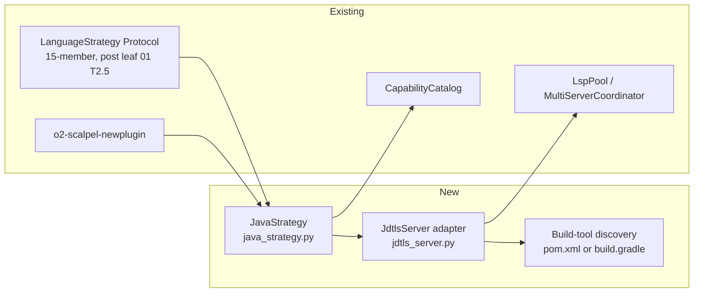

# 04 — Java Strategy via `jdtls` (v2)

**Status:** PLANNED
**Branch:** `feature/v2-java-jdtls-strategy` (submodule + parent)
**Owner:** AI Hive(R)
**Created:** 2026-04-26
**Target LoC:** ~1,800 (cap 2,500)
**Depends on:** Leaf 03 (C/C++ / clangd) landed — and through leaves 02–03, **leaf 01 Task 2.5 (`LanguageStrategy` Protocol extended from 4 to 15 members)**.

> **For agentic workers:** REQUIRED SUB-SKILLS — `superpowers:subagent-driven-development`, `superpowers:test-driven-development`. Steps use checkbox (`- [ ]`) syntax. Bite-sized 2–5 min steps. No placeholders.

---

## Goal

Ship `JavaStrategy(LanguageStrategy)` driven by Eclipse `jdtls` (`org.eclipse.jdt.ls.product`). Land the LSP adapter, the Protocol-conformant strategy class (against the 4-member Protocol extended to 15 in leaf 01 Task 2.5), the capability-catalog wiring, the `calcjava/` Maven fixture, and the build-tool discovery (Maven vs Gradle vs no-build) that jdtls needs.

**Reference for canonical TDD shape:** `01-typescript-vtsls-strategy.md` Task 1.

**Protocol provenance:** the 4-member Protocol (current at `vendor/serena/src/serena/refactoring/language_strategy.py:33–52`); v2+ extends to 15 per B-design.md §5.2 — see leaf 01 Task 2.5. Leaf 04 consumes the extended Protocol.

---

## Architecture



---

## Tech Stack

| Layer | Choice | Why |
|---|---|---|
| LSP server | `jdtls` (Eclipse JDT Language Server) | Canonical Java LSP; supports rename, code actions, organize imports, extract method/variable. Reference: https://github.com/eclipse-jdtls/eclipse.jdt.ls |
| Install path | macOS: `brew install jdtls`; Linux: download tarball from `download.eclipse.org/jdtls/snapshots/`; pinned via `O2_SCALPEL_JDTLS_VERSION` (default `1.36.0`) | Cross-platform; tarball install is canonical |
| JDK | JDK 17+ required (`JAVA_HOME` must be set) | jdtls runtime requirement; **runtime check delegated to jdtls itself (R9)** |
| Build-tool | Maven (`pom.xml`) or Gradle (`build.gradle` / `build.gradle.kts`) | jdtls auto-detects via project metadata; we expose a `build_tool` discovery method for the post-apply health check; Gradle path **prefers `./gradlew` when present (S4)** |
| Workspace dir | jdtls requires a writable workspace dir for project-cache; passed via `-data <dir>` argv | We allocate per-project under `~/.cache/o2-scalpel/jdtls/<project-hash>/` |

---

## File Structure

| # | Path | Action | LoC | Purpose |
|---|---|---|---|---|
| 1 | `vendor/serena/src/solidlsp/language_servers/jdtls_server.py` | New | ~170 | `JdtlsServer` adapter; resolves `JAVA_HOME`, allocates workspace data dir, builds argv with `-jar org.eclipse.equinox.launcher_*.jar` + `-configuration` + `-data`. |
| 2 | `vendor/serena/src/serena/refactoring/java_strategy.py` | New | ~290 | `JavaStrategy(LanguageStrategy)` — implements all 15 Protocol members (Protocol shape from leaf 01 T2.5); build-tool detection helper with `./gradlew` preference. |
| 3 | `vendor/serena/src/serena/refactoring/__init__.py` | Modify | +~6 | Re-export `JavaStrategy`; `STRATEGY_REGISTRY[Language.JAVA] = JavaStrategy`. |
| 4 | `vendor/serena/src/serena/capability/capability_catalog.py` | Modify | +~4 | Add `"java"` capability entry; bump golden-baseline hash. |
| 5 | `vendor/serena/test/spikes/test_v2_java_strategy_protocol.py` | New | ~220 | One TDD cycle per Protocol method; 15 test functions. |
| 6 | `vendor/serena/test/integration/calcjava/` | New | ~440 | Fixture Maven Java project (`pom.xml`, `src/main/java/...`, `src/test/java/...`). |
| 7 | `vendor/serena/test/integration/test_v2_java_calcjava.py` | New | ~280 | Integration tests over `calcjava/`. |
| 8 | `vendor/serena/test/spikes/test_stage_1f_t5_catalog_drift.py` | Modify | +~12 | Update golden baseline. |

### Per-Task LoC budget (S2)

| Task | Target LoC |
|---|---|
| T0 | ~20 |
| T1 (jdtls adapter) | ~170 prod + ~80 test = ~250 |
| T2 (skeleton) | ~70 |
| T3 (14 methods) | ~220 prod + ~220 test = ~440 |
| T4 (catalog) | ~16 |
| T5 (calcjava fixture) | ~440 |
| T6 (integration) | ~280 |
| T7 (generator-emit) | ~20 |
| T8 (verify + tag) | ~20 |
| Test/baseline drift | ~12 |
| **Total** | **~1,800** |

---

## Pre-flight

- [ ] **Verify entry baseline** — leaf 03 tag reachable; spike-suite green; Protocol test from leaf 01 Task 2.5 still green (15 members).
- [ ] **Bootstrap branches** — submodule + parent on `feature/v2-java-jdtls-strategy`.
- [ ] **Install JDK 17+ and `jdtls`**:

```bash
# JDK
java -version 2>&1 | head -1   # informational only — version assertion is delegated to jdtls
echo $JAVA_HOME                # must be set

# jdtls
brew install jdtls
which jdtls && jdtls --help | head -1
```

Discovery rule (R9 resolution): `JavaStrategy.build_servers()` calls (a) `os.environ.get("JAVA_HOME")` — missing → `RuntimeError("JAVA_HOME not set; jdtls requires JDK 17+")`; (b) `shutil.which("jdtls")` — missing → `RuntimeError("jdtls not on PATH; install via 'brew install jdtls' (macOS) or download from https://download.eclipse.org/jdtls/snapshots/")`. **Version assertion is delegated to jdtls** itself: jdtls launches a JVM and refuses to boot on JDK <17, surfacing a clear error in `JdtlsServer.start()` rather than hand-parsing `java -version` (output goes to stderr on most JDKs, format varies across vendors — fragile to parse). The `start()` error message is propagated unmodified to the caller; tests assert `RuntimeError` is raised on a JDK 11 runtime in CI.

---

## Tasks

### Task 0 — PROGRESS ledger

- [ ] Create `docs/superpowers/plans/v2-java-jdtls-results/PROGRESS.md` mirroring leaf 01 ledger format. Commit `chore(v2-java): seed PROGRESS ledger`.

### Task 1 — `JdtlsServer` adapter (canonical-method full TDD cycle)

**Files:**
- Create: `vendor/serena/src/solidlsp/language_servers/jdtls_server.py`
- Create: `vendor/serena/test/spikes/test_v2_java_t1_jdtls_adapter.py`

This Task is the canonical full-TDD demonstration for this leaf (mirrors leaf 01 Task 1).

- [ ] **Step 1: Write failing test**

```python
"""T1 — JdtlsServer adapter boots, resolves JAVA_HOME, allocates workspace data dir.

Note (R9): JDK version assertion is delegated to jdtls itself; we only assert
JAVA_HOME is set and jdtls is on PATH. If the JDK is too old, jdtls's own
launch error surfaces in ``server.start()``.
"""

from __future__ import annotations

import hashlib
import os
import shutil
from pathlib import Path

import pytest

pytestmark = pytest.mark.skipif(
    shutil.which("jdtls") is None or "JAVA_HOME" not in os.environ,
    reason="jdtls or JAVA_HOME missing; install jdtls and set JAVA_HOME to a JDK 17+ install",
)


def test_jdtls_adapter_imports() -> None:
    from solidlsp.language_servers.jdtls_server import JdtlsServer  # noqa: F401


def test_jdtls_workspace_data_dir_is_per_project(tmp_path: Path) -> None:
    from solidlsp.language_servers.jdtls_server import JdtlsServer

    p1 = tmp_path / "ws1"
    p2 = tmp_path / "ws2"
    for p in (p1, p2):
        p.mkdir()
        (p / "pom.xml").write_text(
            "<project><modelVersion>4.0.0</modelVersion><groupId>g</groupId>"
            "<artifactId>a</artifactId><version>1</version></project>",
            encoding="utf-8",
        )

    s1 = JdtlsServer(project_root=p1)
    s2 = JdtlsServer(project_root=p2)
    assert s1._workspace_data_dir != s2._workspace_data_dir
    expected_hash_1 = hashlib.sha256(str(p1.resolve()).encode()).hexdigest()[:16]
    assert expected_hash_1 in str(s1._workspace_data_dir)


def test_jdtls_adapter_boots(tmp_path: Path) -> None:
    from solidlsp.language_servers.jdtls_server import JdtlsServer

    project = tmp_path / "calcjava"
    project.mkdir()
    (project / "pom.xml").write_text(
        "<project><modelVersion>4.0.0</modelVersion><groupId>g</groupId>"
        "<artifactId>a</artifactId><version>1</version></project>",
        encoding="utf-8",
    )

    server = JdtlsServer(project_root=project)
    server.start()
    try:
        assert server.is_alive()
        caps = server.server_capabilities
        assert caps.get("renameProvider") is not None
        assert caps.get("codeActionProvider") is not None
    finally:
        server.stop()
```

- [ ] **Step 2: Implement** `JdtlsServer`:

```python
"""JdtlsServer — solidlsp adapter for Eclipse JDT Language Server.

Requires JDK 17+ on PATH and JAVA_HOME set. jdtls writes per-project metadata
to a workspace data directory passed via ``-data``; we allocate one per
project_root under ``~/.cache/o2-scalpel/jdtls/<sha256-prefix>/`` so two
projects never collide.

JDK version check is delegated to jdtls itself: it launches a JVM via
JAVA_HOME and refuses to boot on JDK <17 with a clear error message,
surfacing in ``start()``. Hand-parsing ``java -version`` is fragile (output
target/format varies across vendors); we let jdtls own that contract.
"""

from __future__ import annotations

import hashlib
import os
import shutil
import subprocess
from pathlib import Path
from typing import Any

from solidlsp.solid_language_server import SolidLanguageServer


class JdtlsServer(SolidLanguageServer):
    """LSP adapter for jdtls (Eclipse JDT Language Server)."""

    server_id: str = "jdtls"
    language_id: str = "java"

    def __init__(self, project_root: Path) -> None:
        super().__init__(project_root=project_root)
        if "JAVA_HOME" not in os.environ:
            raise RuntimeError("JAVA_HOME not set; jdtls requires JDK 17+")
        self._executable = shutil.which("jdtls")
        if self._executable is None:
            raise RuntimeError(
                "jdtls not on PATH; install via 'brew install jdtls' (macOS) or "
                "download from https://download.eclipse.org/jdtls/snapshots/"
            )
        self._workspace_data_dir = self._allocate_workspace_data_dir(project_root)

    @staticmethod
    def _allocate_workspace_data_dir(project_root: Path) -> Path:
        digest = hashlib.sha256(str(project_root.resolve()).encode()).hexdigest()[:16]
        cache_root = Path.home() / ".cache" / "o2-scalpel" / "jdtls" / digest
        cache_root.mkdir(parents=True, exist_ok=True)
        return cache_root

    def _spawn(self) -> subprocess.Popen[bytes]:
        return subprocess.Popen(
            [self._executable, "-data", str(self._workspace_data_dir)],
            stdin=subprocess.PIPE,
            stdout=subprocess.PIPE,
            stderr=subprocess.PIPE,
            cwd=str(self.project_root),
            env={**os.environ},
        )

    def _initialize_params(self) -> dict[str, Any]:
        params = super()._initialize_params()
        params["initializationOptions"] = {
            "settings": {
                "java": {
                    "import": {"maven": {"enabled": True}, "gradle": {"enabled": True}},
                    "completion": {"importOrder": ["java", "javax", "org", "com"]},
                    "saveActions": {"organizeImports": True},
                }
            }
        }
        return params
```

- [ ] **Step 3: Run tests** — expect 3 passed (or skipped if jdtls / JAVA_HOME absent).
- [ ] **Step 4: Lint + basedpyright** zero errors.
- [ ] **Step 5: Commit** `feat(v2-java-T1): JdtlsServer solidlsp adapter (per-project workspace data dir; JDK version delegated to jdtls)`.

### Task 2 — Bootstrap `JavaStrategy` skeleton

Per leaf 01 Task 2 pattern. Test asserts: `language_id == "java"`, `extension_allow_list == frozenset({".java"})`, `code_action_allow_list` includes `source.organizeImports`, `source.fixAll`, `quickfix`, `refactor.extract.function`, `refactor.extract.constant`, `refactor.inline`. Implement minimal class. **Protocol shape consumed: 4 surface members today + 11 added in leaf 01 Task 2.5 = 15.** Commit `feat(v2-java-T2): JavaStrategy skeleton conforms to 15-member LanguageStrategy Protocol`.

### Task 3 — Per-Protocol-method TDD enumeration (14 remaining methods)

Each method follows the leaf-01 five-step TDD cycle. Test stub naming: `test_javastrategy_<slug>`. Target fixture: `calcjava/` from Task 5. **All 14 methods reference signatures from the 15-member Protocol landed in leaf 01 Task 2.5.**

| # | Method | Slug | Assertion intent | Target fixture |
|---|---|---|---|---|
| 1 | `language_id` | `language_id_is_java` | Equals `"java"`. | n/a |
| 2 | `extension_allow_list` | `extension_allow_list_only_java` | Equals `frozenset({".java"})`. | n/a |
| 3 | `code_action_allow_list` | `code_action_allow_list_includes_quickfix_and_refactor` | Includes the 6 kinds named in Task 2. | n/a |
| 4 | `build_servers(project_root)` | `build_servers_returns_single_jdtls` | Returns `{"jdtls": JdtlsServer(...)}`; raises if JAVA_HOME unset. | `calcjava/` |
| 5 | `extract_module_kind` | `extract_module_kind_is_compilation_unit` | Returns `"compilation_unit"` for any `.java` file under `src/main/java/`. | `calcjava/src/main/java/...` |
| 6 | `move_to_file_kind` | `move_to_file_kind_uses_refactor_move` | Returns LSP code-action kind `"refactor.move"`. | n/a |
| 7 | `module_declaration_syntax(name)` | `module_declaration_syntax_emits_package_clause` | Returns `f"package {name};\n\n"` (dot-separated FQN preserved). | n/a |
| 8 | `module_filename_for(name)` | `module_filename_capitalised_camelcase_dot_java` | Returns `f"{name[0].upper() + name[1:]}.java"`. | n/a |
| 9 | `reexport_syntax(symbol, source)` | `reexport_syntax_emits_static_import` | Returns `f"import static {source}.{symbol};\n"`. | n/a |
| 10 | `is_top_level_item(node)` | `is_top_level_item_recognises_top_level_types` | Returns `True` for top-level `ClassDeclaration`, `InterfaceDeclaration`, `EnumDeclaration`, `RecordDeclaration`. | `calcjava/src/main/java/.../Calculator.java` |
| 11 | `symbol_size_heuristic(symbol)` | `symbol_size_heuristic_counts_brace_block_lines` | Counts source-range lines between matching `{`/`}`; ignores blank/comment-only lines. | `calcjava/src/main/java/.../Calculator.java` |
| 12 | `execute_command_whitelist` | `execute_command_whitelist_includes_java_apply_workspace_edit` | Includes `java.apply.workspaceEdit`, `java.edit.organizeImports`, `java.edit.stringFormatting`, `java.action.overrideMethodsPrompt`. | n/a |
| 13 | `post_apply_health_check_commands(project_root)` | `post_apply_health_check_runs_maven_or_gradle` | Returns `[("mvn", "-q", "-DskipTests", "compile")]` when `pom.xml`; **`[("./gradlew", "compileJava")]` when `gradlew` is present in `project_root`, else `[("gradle", "compileJava")]`** (S4) when `build.gradle`/`build.gradle.kts` present; empty otherwise. | `calcjava/pom.xml` |
| 14 | `lsp_init_overrides()` | `lsp_init_overrides_enables_maven_and_gradle_imports` | Returns dict with `settings.java.import.maven.enabled = True` and `settings.java.import.gradle.enabled = True`. | n/a |

Per-method cycle: red → impl → green → lint → commit `feat(v2-java-T3.<n>): JavaStrategy.<method> implemented`.

After all 14 commits land:
```bash
PATH="$(pwd)/.venv/bin:$PATH" .venv/bin/pytest test/spikes/test_v2_java_strategy_protocol.py -v
```
Expected: 15 passed.

### Task 4 — Capability catalog wiring + drift CI baseline bump

Per leaf 01 Task 4. Add `"java"` row; bump SHA-256; run drift CI. Commit `feat(v2-java-T4): catalog drift CI baseline bumped for Java`.

### Task 5 — `calcjava/` integration fixture

**Files:**
- Create: `vendor/serena/test/integration/calcjava/pom.xml`
- Create: `vendor/serena/test/integration/calcjava/src/main/java/calc/Calculator.java`
- Create: `vendor/serena/test/integration/calcjava/src/main/java/calc/Main.java`
- Create: `vendor/serena/test/integration/calcjava/src/test/java/calc/CalculatorTest.java`

- [ ] **Step 1: Write `pom.xml`** — `<modelVersion>4.0.0</modelVersion>`, `groupId=io.aihive.scalpel.calcjava`, `artifactId=calcjava`, `version=1.0.0`, `<maven.compiler.source>17</maven.compiler.source>`, `<maven.compiler.target>17</maven.compiler.target>`, JUnit-Jupiter dep at `5.10.0` test scope.
- [ ] **Step 2: Write `Calculator.java`** — `package calc;` with `public class Calculator` exposing `int add(int, int)`, `int mul(int, int)`, plus a private `validate` helper.
- [ ] **Step 3: Write `Main.java`** — `package calc;` with `public class Main` containing `public static void main(String[] args)` calling `new Calculator().add(2, 3)`.
- [ ] **Step 4: Write `CalculatorTest.java`** — JUnit-Jupiter test with two `@Test` methods covering `add` and `mul`.
- [ ] **Step 5: Verify** — `cd test/integration/calcjava && mvn -q -DskipTests compile` exits 0.
- [ ] **Step 6: Commit** `test(v2-java-T5): calcjava/ Maven integration fixture (pom + 3 sources + test)`.

### Task 6 — `calcjava/` integration tests

**Files:**
- Create: `vendor/serena/test/integration/test_v2_java_calcjava.py`

- [ ] Three tests: (a) `JavaStrategy` boots jdtls against `calcjava/`; (b) `request_code_actions` over `Main.java:0:0` returns at least one `source.organizeImports` action; (c) `post_apply_health_check_commands` returns the `mvn -q -DskipTests compile` invocation.
- [ ] Run, expect green (S7: skips when jdtls / JAVA_HOME missing; CI installs via v1.1 install hook); commit `test(v2-java-T6): calcjava/ integration tests for JavaStrategy`.

### Task 7 — Generator-emit pass for `o2-scalpel-java/`

Per leaf 01 Task 7. **First (S6):** verify `o2-scalpel-newplugin --help` exits 0 and lists `--language java`; if missing, Stage 1J never registered Java and this leaf must block. Then run `o2-scalpel-newplugin --language java --out o2-scalpel-java --force`. Reference Stage 1J plan; do NOT re-derive generator logic. Commit `feat(v2-java-T7): emit o2-scalpel-java via o2-scalpel-newplugin`.

### Task 8 — Final spike + integration green; tag

Per leaf 01 Task 8. Tag `v2-java-jdtls-strategy-complete` on submodule + parent.

---

## Self-Review

- [ ] All 15 Protocol methods covered (Task 1 + Task 2 + Task 3's 14 = 15) against the Protocol shape landed in leaf 01 Task 2.5.
- [ ] LSP install rule cited (`brew install jdtls` / `download.eclipse.org/jdtls/snapshots/`); JDK 17+ requirement gated **by jdtls itself** (R9), not by hand-parsing `java -version`.
- [ ] Per-project workspace data dir under `~/.cache/o2-scalpel/jdtls/<sha256-prefix>/` to prevent jdtls collisions across projects.
- [ ] Build-tool detection (Maven vs Gradle) drives `post_apply_health_check_commands`; **Gradle path prefers `./gradlew` when present (S4)**, falls back to `gradle`.
- [ ] Capability catalog drift baseline bumped (Task 4).
- [ ] `calcjava/` fixture created (Task 5) and exercised (Task 6).
- [ ] No facade rewrites — pure-plugin addition.
- [ ] No emoji; Mermaid; sizing in S/M/L; author `AI Hive(R)`.
- [ ] Each TDD cycle bite-sized.
- [ ] Generator step references Stage 1J plan, no re-derivation; `--help` smoke-check (S6) lands first.
- [ ] Citation language uses "the 4-member Protocol (current at `language_strategy.py:33–52`); v2+ extends to 15 per B-design.md §5.2 — see leaf 01 Task 2.5".

---

*Author: AI Hive(R)*
