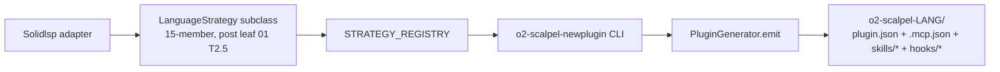

# 05 — Long-Tail Generator Flow (Kotlin / Ada / Svelte / Vue) — v2

**Status:** PLANNED
**Branch:** `feature/v2-longtail-generator-flow` (parent only — no submodule changes)
**Owner:** AI Hive(R)
**Created:** 2026-04-26
**Target LoC:** ~600 (cap 1,000)
**Depends on:** Leaf 04 (Java / jdtls) landed — and through leaves 02–04, **leaf 01 Task 2.5 (`LanguageStrategy` Protocol extended from 4 to 15 members)**. `GenericStrategy` only works after the Protocol grows; that is the gate for this leaf.

> **For agentic workers:** REQUIRED SUB-SKILLS — `superpowers:subagent-driven-development`, `superpowers:test-driven-development`. Steps use checkbox (`- [ ]`) syntax. Bite-sized 2–5 min steps. No placeholders.

---

## Goal

Generalise the per-language strategy flow over the existing `o2-scalpel-newplugin` generator (Stage 1J) so that any long-tail language — Kotlin, Ada, Svelte, Vue, etc. — can land via **registration + generator-emit only**, with no hand-authored plugin manifests, no re-derived generator logic, and no facade rewrites.

**This leaf does NOT re-derive any generator** — it consumes `o2-scalpel-newplugin` per the existing invocation contract.

**Reference for canonical TDD shape:** `01-typescript-vtsls-strategy.md` Task 1.

**Protocol provenance (R6):** the 4-member Protocol (current at `vendor/serena/src/serena/refactoring/language_strategy.py:33–52`); v2+ extends to 15 per B-design.md §5.2 — see leaf 01 Task 2.5. `GenericStrategy` (Task 1 below) fills 15 Protocol methods from a catalog row, and **only works after the Protocol grows from 4 to 15 in leaf 01 Task 2.5**. First-class TS/Go/C/C++/Java (leaves 01–04) use bespoke strategies; long-tail uses `GenericStrategy`.

---

## Architecture



**Single source of truth for generator behaviour:** `docs/superpowers/plans/2026-04-25-stage-1j-plugin-skill-generator.md`. This leaf references that plan; it does not duplicate it.

---

## Invocation contract (from Stage 1J)

| Aspect | Contract |
|---|---|
| CLI | `o2-scalpel-newplugin --language <lang> --out <dir> [--force]` |
| Inputs | `LanguageStrategy` (Stage 1E) + `LanguageCatalog` (Stage 1F) + `PrimitiveRegistry` (Stage 1G) |
| Output tree | `.claude-plugin/plugin.json`, `.mcp.json`, `marketplace.json`, `skills/<facade>.md`, `README.md`, `hooks/verify-scalpel-<lang>.sh` |
| Determinism | Byte-identical golden-file output |
| Registration | `Language.<NAME>` enum + `STRATEGY_REGISTRY[Language.<NAME>] = <Strategy>` |

Long-tail languages do NOT need a bespoke `LanguageStrategy` subclass — they ship with a `GenericStrategy` adapter that fills the 15 Protocol methods from the catalog row. **`GenericStrategy` is only viable once leaf 01 Task 2.5 has grown the Protocol to its 15-member shape; without that, the catalog row would have no slots to bind to.** First-class TS/Go/C/C++/Java (leaves 01–04) use bespoke strategies; long-tail uses `GenericStrategy`.

---

## File Structure

| # | Path | Action | LoC | Purpose |
|---|---|---|---|---|
| 1 | `vendor/serena/src/serena/refactoring/generic_strategy.py` | New | ~140 | `GenericStrategy(LanguageStrategy)` — fills 15 Protocol methods from a catalog row (Protocol shape from leaf 01 T2.5). |
| 2 | `vendor/serena/src/serena/refactoring/__init__.py` | Modify | +~10 | Re-export `GenericStrategy`; add `LONG_TAIL_LANGUAGES`. |
| 3 | `vendor/serena/src/serena/capability/capability_catalog.py` | Modify | +~24 | Add 4 long-tail rows (kotlin/ada/svelte/vue); bump SHA-256 baseline. |
| 4 | `vendor/serena/test/spikes/test_v2_longtail_generic_strategy.py` | New | ~120 | Round-trip all 15 Protocol members from catalog row. |
| 5 | `vendor/serena/test/spikes/test_v2_longtail_generator_emit.py` | New | ~110 | Runs `o2-scalpel-newplugin` per language; asserts emitted tree matches Stage 1J golden-file pattern. |
| 6 | `vendor/serena/test/spikes/test_stage_1f_t5_catalog_drift.py` | Modify | +~12 | Update golden baseline. |

---

## Pre-flight

- [ ] **Verify entry baseline** — leaf 04 tag reachable; spike-suite green; `o2-scalpel-newplugin --help` works (Stage 1J shipped); Protocol test from leaf 01 Task 2.5 still green (15 members).
- [ ] **Bootstrap branch** — submodule + parent on `feature/v2-longtail-generator-flow`.

---

## Tasks

### Task 0 — PROGRESS ledger

- [ ] Create `docs/superpowers/plans/v2-longtail-generator-results/PROGRESS.md`; commit `chore(v2-longtail): seed PROGRESS ledger`.

### Task 1 — `GenericStrategy` (canonical TDD cycle)

**Files:** Create `vendor/serena/src/serena/refactoring/generic_strategy.py` + `vendor/serena/test/spikes/test_v2_longtail_generic_strategy.py`. This Task is the canonical full-TDD demonstration for this leaf (mirrors leaf 01 Task 1).

**Depends on Protocol extension landed in leaf 01 Task 2.5** — without it, the 15-member assertion below cannot pass.

- [ ] **Step 1: Write failing test** at `vendor/serena/test/spikes/test_v2_longtail_generic_strategy.py`:

```python
"""T1 — GenericStrategy fills 15 LanguageStrategy Protocol members from a catalog row.

Depends on leaf 01 Task 2.5: the LanguageStrategy Protocol must already
expose all 15 members for the dir(...) assertion below to pass.
"""

from __future__ import annotations


def test_generic_strategy_imports() -> None:
    from serena.refactoring.generic_strategy import GenericStrategy  # noqa: F401


def test_generic_strategy_satisfies_protocol_for_kotlin() -> None:
    from serena.refactoring.language_strategy import LanguageStrategy
    from serena.refactoring.generic_strategy import GenericStrategy
    row = {
        "language": "kotlin",
        "lsp_server": "kotlin-language-server",
        "extensions": [".kt", ".kts"],
        "code_actions": ["source.organizeImports", "quickfix", "refactor.extract"],
        "execute_command_whitelist": [],
        "post_apply_commands": [["./gradlew", "compileKotlin"]],
    }
    strat = GenericStrategy(row)
    assert isinstance(strat, LanguageStrategy)
    assert strat.language_id == "kotlin"
    assert strat.extension_allow_list == frozenset({".kt", ".kts"})
    assert "refactor.extract" in strat.code_action_allow_list
    assert strat.module_filename_for("Foo") == "Foo.kt"


def test_generic_strategy_implements_all_15_members() -> None:
    """All 15 names must appear on GenericStrategy. Protocol shape is the
    one extended in leaf 01 Task 2.5 (4 + 11 = 15)."""
    from serena.refactoring.generic_strategy import GenericStrategy
    required = {
        "language_id", "extension_allow_list", "code_action_allow_list",
        "build_servers", "extract_module_kind", "move_to_file_kind",
        "module_declaration_syntax", "module_filename_for", "reexport_syntax",
        "is_top_level_item", "symbol_size_heuristic", "execute_command_whitelist",
        "post_apply_health_check_commands", "lsp_init_overrides", "module_kind_for_file",
    }
    assert required.issubset(set(dir(GenericStrategy)))
```

- [ ] **Step 2: Implement** `GenericStrategy` reading 14 attribute/method values from a catalog row; Protocol membership flows from `@runtime_checkable`. Default `module_filename_for` returns `f"{name}{primary_extension}"`; `module_declaration_syntax` defaults to empty string for languages without module headers; `module_kind_for_file` delegates to `extract_module_kind` unless the catalog row supplies a per-suffix override.
- [ ] **Step 3: Run + lint + basedpyright** zero errors; expect 3 passed.
- [ ] **Step 4: Commit** `feat(v2-longtail-T1): GenericStrategy fills LanguageStrategy from catalog row (consumes leaf 01 T2.5 Protocol shape)`.

### Task 2 — Long-tail catalog rows

**Files:** Modify `vendor/serena/src/serena/capability/capability_catalog.py`.

- [ ] **Step 1: Write failing drift-CI test** asserting the catalog has rows for `kotlin`, `ada`, `svelte`, `vue` with LSP servers `kotlin-language-server`, `als`, `svelteserver`, **`vue-language-server` (Volar v2; fallback `vls`)** respectively (S5).
- [ ] **Step 2: Implement** — add the four rows per the table below.

| Language | LSP server (preferred → fallback) | Extensions | Code actions | Post-apply |
|---|---|---|---|---|
| Kotlin | `kotlin-language-server` | `.kt`, `.kts` | `source.organizeImports`, `quickfix`, `refactor.extract` | `./gradlew compileKotlin` |
| Ada | `als` | `.adb`, `.ads` | `quickfix`, `refactor.extract` | `gprbuild -P default.gpr` |
| Svelte | `svelteserver` | `.svelte` | `source.organizeImports`, `quickfix`, `source.fixAll` | `npx svelte-check` |
| Vue | **`vue-language-server` (Volar v2; from `@vue/language-server`)** → fallback `vls` | `.vue` | `source.organizeImports`, `quickfix`, `source.fixAll` | `npx vue-tsc --noEmit` |

S5 note: `vue-language-server` (Volar v2) is the modern LSP for Vue 3 and Vue 2.7+; `vls` is the legacy server retained as a fallback for older toolchains. Discovery order: `shutil.which("vue-language-server")` first, then `shutil.which("vls")`; first hit wins. The catalog row carries both names so the generator emits a `verify-scalpel-vue.sh` hook that probes both.

- [ ] **Step 3: Run drift CI** — bump SHA-256; expect green.
- [ ] **Step 4: Lint + basedpyright**.
- [ ] **Step 5: Commit** `feat(v2-longtail-T2): catalog rows + drift baseline for kotlin/ada/svelte/vue (vue prefers Volar v2)`.

### Task 3 — Generator-emit verification (consume Stage 1J)

This Task **only invokes** `o2-scalpel-newplugin`. No generator logic is added. Reference: `docs/superpowers/plans/2026-04-25-stage-1j-plugin-skill-generator.md`.

- [ ] **Step 1: Write parametrised test** at `vendor/serena/test/spikes/test_v2_longtail_generator_emit.py`:

```python
"""T3 — o2-scalpel-newplugin emits long-tail plugin trees per Stage 1J contract."""

from __future__ import annotations
import subprocess
from pathlib import Path
import pytest


@pytest.mark.parametrize("lang", ["kotlin", "ada", "svelte", "vue"])
def test_o2_scalpel_newplugin_emits_long_tail_tree(lang: str, tmp_path: Path) -> None:
    out = tmp_path / f"o2-scalpel-{lang}"
    result = subprocess.run(
        ["o2-scalpel-newplugin", "--language", lang, "--out", str(out), "--force"],
        capture_output=True, text=True, check=False,
    )
    assert result.returncode == 0, result.stderr
    for relpath in (
        ".claude-plugin/plugin.json", ".mcp.json", "marketplace.json",
        "README.md", f"hooks/verify-scalpel-{lang}.sh",
    ):
        f = out / relpath
        assert f.is_file() and f.stat().st_size > 0, f"missing {relpath} for {lang}"
    skills_dir = out / "skills"
    assert skills_dir.is_dir() and any(skills_dir.glob("*.md")), f"no skills for {lang}"
```

- [ ] **Step 2: Run** — expect 4 parametrised cases pass.
- [ ] **Step 3: Commit** `test(v2-longtail-T3): generator-emit verification for kotlin/ada/svelte/vue`.

### Task 4 — Final spike green; tag

- [ ] Full spike-suite green (`pytest test/spikes/ -q`); drift CI green; tag `v2-longtail-generator-flow-complete` on submodule + parent (git-flow); update PROGRESS.md to `COMPLETE`.

---

## Self-Review

- [ ] `GenericStrategy` implements all 15 Protocol members from a `LanguageCatalog` row (Task 1) — Protocol shape consumed is the 15-member one landed in leaf 01 Task 2.5; without that prerequisite, this leaf cannot ship.
- [ ] 4 long-tail catalog rows added: Kotlin / Ada / Svelte / Vue (Task 2); drift baseline bumped; **Vue row prefers Volar v2 (`vue-language-server`) with `vls` fallback (S5)**.
- [ ] Generator-emit verified for each long-tail language **without re-deriving generator logic** (Task 3) — Stage 1J plan referenced explicitly.
- [ ] No new generator code; no facade rewrites.
- [ ] No emoji; Mermaid; sizing in S/M/L; author `AI Hive(R)`; bite-sized TDD cycles.
- [ ] Citation language uses "the 4-member Protocol (current at `language_strategy.py:33–52`); v2+ extends to 15 per B-design.md §5.2 — see leaf 01 Task 2.5".

---

*Author: AI Hive(R)*
