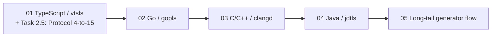

# v2+ Language Strategies — TREE Plan (v2)

**Status:** PLANNED
**Owner:** AI Hive(R)
**Created:** 2026-04-26
**Revision:** v2 (applies critic edits R1–R10 + S1/S2/S4/S5/S8 from `/tmp/plan-orchestration/reviews/v2-language-strategies.md`)
**Source of truth:** `docs/gap-analysis/WHAT-REMAINS.md` §6 (lines 122–126)
**Design reference:** `docs/gap-analysis/B-design.md` §5.2 (the future ~15-method `LanguageStrategy` Protocol shape) and §5.3 (additional language strategies named)

---

## Tree goal

Land four first-class `LanguageStrategy` implementations (TypeScript, Go, C/C++, Java) plus the long-tail generator-driven flow (Kotlin / Ada / Svelte / Vue …) — each as a pure plugin addition over the existing `LanguageStrategy` Protocol (4 surface members today at `vendor/serena/src/serena/refactoring/language_strategy.py:33–52`, slated to grow to the ~15-method shape per B-design.md §5.2). The v1 of this tree elided the Protocol-extension work; v2 surfaces it as **leaf 01 Task 2.5** ("Extend `LanguageStrategy` Protocol with the 11 additional members from B§5.2"), which lands the new Protocol members **before** any first-class strategy attempts to implement them. Leaves 02–05 consume that extended Protocol; the order matters.

The tree ships zero rewrites to the language-agnostic facades (B-design.md §5: "additional languages pure plugin additions, no facade rewrites needed").

Each first-class leaf delivers (a) the LSP server install/discovery rule, (b) a Strategy class subclassing the Protocol, (c) the capability-catalog drift-CI baseline, (d) a per-language fixture, and (e) a per-method TDD cycle. The long-tail leaf consumes `o2-scalpel-newplugin` (Stage 1J) without re-deriving any generator logic.

---

## Leaf table

| # | Slug | Language | Server | Goal | Size | Target LoC | Depends-on |
|---|---|---|---|---|---|---|---|
| 01 | [01-typescript-vtsls-strategy](./01-typescript-vtsls-strategy.md) | TypeScript / TSX / JS / JSX | `vtsls` | Protocol extension (Task 2.5) + first-class `TypeScriptStrategy` over vtsls | L | ~1,900 | v1.1 milestone |
| 02 | [02-go-gopls-strategy](./02-go-gopls-strategy.md) | Go | `gopls` | First-class `GoStrategy` over gopls (degraded daemon-reuse path until `golang/go#78668`) | L | ~1,700 | 01 |
| 03 | [03-c-cpp-clangd-strategy](./03-c-cpp-clangd-strategy.md) | C / C++ | `clangd` | First-class `CppStrategy` over clangd | L | ~1,800 | 02 |
| 04 | [04-java-jdtls-strategy](./04-java-jdtls-strategy.md) | Java | `jdtls` | First-class `JavaStrategy` over jdtls | L | ~1,800 | 03 |
| 05 | [05-longtail-generator-flow](./05-longtail-generator-flow.md) | Kotlin / Ada / Svelte / Vue / … | varies | Generator-driven long-tail via `o2-scalpel-newplugin` | M | ~600 | 04 |

Sizing legend: S (≤200 LoC), M (200–800 LoC), L (800–2,500 LoC).

---

## Execution order

1. `01-typescript-vtsls-strategy.md` — highest user demand; **also lands the Protocol extension (Task 2.5) on which leaves 02–05 depend**; sets the per-language Strategy template.
2. `02-go-gopls-strategy.md` — second-highest demand; introduces the daemon-reuse degraded mode.
3. `03-c-cpp-clangd-strategy.md` — adds `compile_commands.json`-driven discovery.
4. `04-java-jdtls-strategy.md` — adds Maven/Gradle build-tool discovery.
5. `05-longtail-generator-flow.md` — generalises the per-language flow over `o2-scalpel-newplugin`.

The order matches `WHAT-REMAINS.md` §Recommended-sequencing item 6 ("TS/Go first … each new strategy follows the existing `LanguageStrategy` Protocol"; in v2 the Protocol grows from 4 to 15 members in leaf 01 Task 2.5 before any first-class strategy implements it).

---

## Intra-tree dependency diagram

Linear chain: each first-class leaf reuses the Strategy template from its predecessor; the long-tail leaf consumes the same template via `o2-scalpel-newplugin`. Leaf 01 Task 2.5 is the gating step for the entire chain.

---

## Cross-stream dependencies

- **Upstream precondition (hard):** v1.1 milestone (`/tmp/plan-orchestration/v1/v11-milestone/`) must land first per `WHAT-REMAINS.md` §Recommended-sequencing item 5 — v1.1 ships persistent checkpoints, marketplace publication, plugin-reload tool, and the Rust+clippy multi-server scenario; v2+ first-class strategies build on top.
- **Protocol-extension precondition (hard):** Leaf 01 Task 2.5 grows the `LanguageStrategy` Protocol from 4 to 15 members. Leaves 02/03/04 cannot type-check their `extract_module_kind`/`move_to_file_kind`/etc. assertions against the `@runtime_checkable` Protocol until Task 2.5 lands.
- **Generator dependency (existing):** `o2-scalpel-newplugin` from Stage 1J (`docs/superpowers/plans/2026-04-25-stage-1j-plugin-skill-generator.md`). Each first-class leaf re-runs the generator after registering its strategy in `STRATEGY_REGISTRY`; the long-tail leaf consumes the generator without registering any new bespoke strategy.
- **Watch item (Go):** `golang/go#78668` (gopls daemon reuse). Until upstream closes, leaf 02 ships the degraded per-workspace path; leaf 02 includes a degraded-mode test as a Task.
- **Watch item (TS/JS):** Anthropic native LSP-write integration (B-design.md §3) — informational; non-blocking. Per WHAT-REMAINS Cross-cutting risks #2: if upstream lands native LSP-write, leaf consumption is unchanged (skills/plugins still emit the same MCP surface) but our middleware role thins; downgrade trigger only, not a re-plan trigger.

---

## Reference back

Top-level orchestration index: `/tmp/plan-orchestration/MASTER.md` §3 Brief 6.
Final synthesizer destination: `docs/superpowers/plans/2026-04-26-v2-language-strategies/`.

---

*Author: AI Hive(R)*
