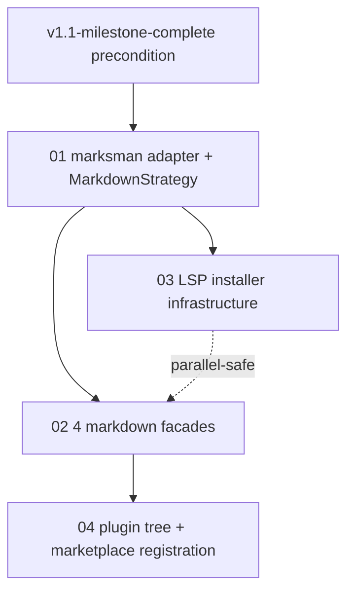

# v1.1.1 — Markdown LSP Support + LSP Installer Infrastructure

**Goal:** Add markdown as a first-class language strategy via marksman LSP, AND ship an LSP installer infrastructure (with marksman as the first proving-ground installer).

**Cross-stream precondition:** v1.1 milestone (`v1.1-milestone-complete`) MUST land before any leaf in this tree. Source: `docs/gap-analysis/WHAT-REMAINS.md`. v1.1.1 extends the v1.1 marketplace + plugin generator surface to a third language (markdown) and adds installer infrastructure that v1.2 will back-port to existing LSPs.

**User intent (project memory):**
- `project_strategic_end_goal.md` — Claude CLI uses LSPs at full extent for search/navigate/edit on code AND markdown.
- `project_lsp_installer_requirement.md` — o2-scalpel must install + update LSP servers itself; `_require_binary` skip pattern is for tests only.

## Leaf table

| # | Slug | Goal | Size | Depends-on (intra) |
|---|------|------|------|--------------------|
| 01 | [01-marksman-adapter-strategy.md](./01-marksman-adapter-strategy.md) | `MarksmanLanguageServer` adapter + `MarkdownStrategy` registered in `STRATEGY_REGISTRY` + `Language.MARKDOWN` enum + cli_newplugin metadata. | M | — |
| 02 | [02-markdown-facades.md](./02-markdown-facades.md) | 4 markdown facades: `scalpel_rename_heading`, `scalpel_split_doc`, `scalpel_extract_section`, `scalpel_organize_links`. | M | 01 |
| 03 | [03-lsp-installer.md](./03-lsp-installer.md) | `serena/installer/` package + `MarksmanInstaller` + `scalpel_install_lsp_servers` MCP tool (dry_run default + allow_install gate). | M | 01 |
| 04 | [04-plugin-tree-generation.md](./04-plugin-tree-generation.md) | Run `o2-scalpel-newplugin --language markdown` to emit `o2-scalpel-markdown/` at parent root + verify auto-registration in `marketplace.surface.json` + `marketplace.json`. | S | 01, 02 |

## Execution order

1. **Leaf 01** — adapter + strategy + Language enum + cli_newplugin metadata (foundation).
2. **Leaf 02** — 4 facades on top of the strategy.
3. **Leaf 03** — installer infrastructure + MCP tool (parallel-safe with 02 once 01 lands).
4. **Leaf 04** — plugin tree generation + marketplace registration (consumes 01+02).

## Intra-tree dependency diagram

## Architecture decisions

- **Language enum**: add `Language.MARKDOWN = "markdown"` to `vendor/serena/src/solidlsp/ls_config.py`. File-extension matcher `*.md`, `*.markdown`.
- **MarksmanLanguageServer** at `vendor/serena/src/solidlsp/language_servers/marksman_server.py` — mirrors `PylspServer` pattern; spawns `marksman server` over stdio. `server_id: ClassVar[str] = "marksman"`.
- **MarkdownStrategy** at `vendor/serena/src/serena/refactoring/markdown_strategy.py` — implements `LanguageStrategy` Protocol; single LSP (no multi-server merge for markdown — marksman is canonical).
- **STRATEGY_REGISTRY** extended in `vendor/serena/src/serena/refactoring/__init__.py:48-51`.
- **4 facades** in `vendor/serena/src/serena/tools/scalpel_facades.py` — each a separate `Tool` subclass (per Stage 2A pattern, NOT a switch statement).
- **Installer protocol** at `vendor/serena/src/serena/installer/installer.py` — `LspInstaller` ABC with `detect_installed`, `latest_available`, `install`, `update` methods. Per-LSP subclasses live in same package.
- **MarksmanInstaller** detects via `shutil.which("marksman") + marksman --version`; installs via `brew install marksman` (macOS) / `snap install marksman` (Linux fallback) / GitHub release binary (third-fallback). Updates by re-running install.
- **scalpel_install_lsp_servers** MCP tool: `apply(languages: list[str], dry_run: bool = True, allow_install: bool = False, allow_update: bool = False) -> dict`. Default `dry_run=True` + `allow_install=False` is safe-by-default per CLAUDE.md "executing actions with care".

## Cross-references

- v1.1 milestone (just landed): `docs/superpowers/plans/2026-04-26-v11-milestone/README.md`
- Strategic end goal memory: `project_strategic_end_goal.md`
- Installer requirement memory: `project_lsp_installer_requirement.md`
- Stage 1J generator (will emit markdown plugin tree): `docs/superpowers/plans/2026-04-25-stage-1j-plugin-skill-generator.md`

## Existing patterns to reuse

- **Adapter pattern**: `vendor/serena/src/solidlsp/language_servers/pylsp_server.py:41` (PylspServer is the closest analog — single Python LSP over stdio).
- **Strategy pattern**: `vendor/serena/src/serena/refactoring/python_strategy.py:68` and `rust_strategy.py:24` — both implement `LanguageStrategy`.
- **Facade pattern**: `vendor/serena/src/serena/tools/scalpel_facades.py` — 25 existing facades all follow `class ScalpelXxxTool(Tool): def apply(self, ...) -> dict[str, object]: ...`.
- **MCP tool registration**: `iter_subclasses(Tool)` per Leaf 03 of v1.1; class name → snake_case via `Tool.get_name_from_cls`.
- **Newplugin generator metadata**: `vendor/serena/src/serena/refactoring/cli_newplugin.py:_LANGUAGE_METADATA` table — add `markdown` row.

## Test environment

- marksman IS installed locally at `/opt/homebrew/bin/marksman` (version 2026-02-08). Integration tests can boot it.
- For hosts without marksman: tests use `_require_binary` skip pattern (existing convention for LSP-host gaps).
- Installer tests use temp `PATH` manipulation + dry-run mode to avoid actual `brew install` calls in CI.

---

**Author:** AI Hive(R)
