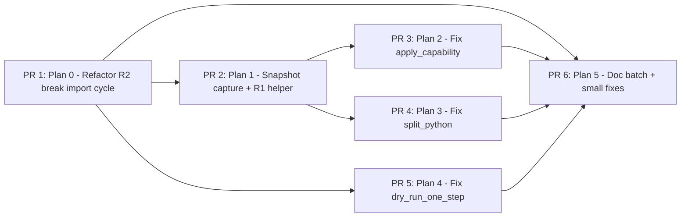

# Implementation Plans — STUB Facade Fix v1.6
**Status**: APPROVED v1
**Date**: 2026-04-29
**Synthesis**: `over-plan.md` ∪ `minimalist-plan.md`, with adjudicated verdict per item
**Author**: AI Hive(R) synthesizer (3-agent planning round)
**Working dir**: `/Volumes/Unitek-B/Projects/o2-scalpel/vendor/serena`

---

## TL;DR

- v1.6 ships **6 PRs**, totalling roughly **~95 LoC of behavior change** + **~700 LoC of mechanical docstring batch** + **~150 LoC of new tests/fixtures**.
- The cut line: ship every fix that closes a **lying-to-LLM contract** (`applied=True` + zero bytes on disk, or `dry_run` honored zero); doc-tag every silently-dropped parameter (no Examples sweep); defer rollback's real inverse-applier and HYBRID surgery (split_rust groups, rename also_in_strings, Java Phase 2.5, workspace_health 11-language) behind their gates.
- **6 branches** (in execution order):
  1. `feature/v1.6-refactor-break-cycle`            (Refactor R2 — prep, ~60 LoC, low risk)
  2. `feature/v1.6-fix-snapshot-capture-and-helper` (Plan 4 + R1 — prep for honesty, ~120 LoC)
  3. `feature/v1.6-fix-apply-capability`            (Plan 1 — STUB-P1, the highest-confidence lie)
  4. `feature/v1.6-fix-split-python`                (Plan 2 — STUB-P1, disk-untouched bug)
  5. `feature/v1.6-fix-dry-run-one-step`            (Plan 5 — STUB-P1, preview lies)
  6. `feature/v1.6-doc-batch`                       (Plan 6 + Plan 3-alt + small `dry_run` honoring on `expand_macro`/`verify_after_refactor` — combined doc + ~12 LoC threading)
- **Final tag** (after PR 6 merges to develop and onward to main): `v1.6-stub-facade-fix-complete`

---

## Adjudication summary (the contested calls, decided)

| # | Contested call | Verdict | Reasoning |
|---|---|---|---|
| 1 | `_dry_run_one_step` — minimalist DEFER vs over-planner P1 | **SHIP as P1 (Plan 5)** | The audit § cross-check 2 + over-planner argument win: `StepPreview.changes=()` while transaction commits dispatch real edits is the same lying-to-LLM shape as `applied_capability`. `scalpel_transaction_commit` fail-fast is downstream, but the LLM consumes preview as-is. SHIP-B ratified shipping *without shadow simulation* — it did NOT ratify shipping a body that returns hardcoded empty `StepPreview` regardless of input. We solve via `_FACADE_DISPATCH(args | {"dry_run": True})` (no shadow workspace needed). M-effort, not L. |
| 2 | Real rollback inverse-applier (over-planner Plan 3-A + Plan 4) | **DEFER Plan 3-A; SHIP Plan 4 (snapshot capture)**; SHIP Plan 3-alt (doc warning) in v1.6 doc batch | Path A is HIGH risk + L-effort + no documented user complaint — fits minimalist DEFER criterion. Plan 4 (snapshot capture) is M-effort, mechanical, and unblocks Plan 3-A in v1.7 *and* improves checkpoint integrity for every facade today (the snapshot is the truthful pre-edit shape). Path B (doc warning) is honesty-without-engineering and ships in the doc batch. Un-defer Plan 3-A when 3 users hit "rollback didn't undo my edit" OR a real benchmark prompt exercises the path. |
| 3 | A5 Examples blocks for 43 facades | **DEFER (minimalist wins)** | § 4.5 routes on `PREFERRED:`/`FALLBACK:` tokens, not Examples. Zero benchmark signal. ~700 LoC of doc bloat. Un-defer when `routing_accuracy < 53.3%` on a refreshed Examples-grounded scorer. |
| 4 | Informational-parameter batch — pure doc vs threading | **Hybrid: SHIP doc batch for all 12 + ship 3 small threading wins** (`generate_from_undefined.target_kind` filter, `ignore_diagnostic.rule` filter, `tidy_structure.scope` kind-restrict) | These three threadings are 3-5 LoC each, no fixture cost, real correctness wins. The other 9 params are LSP-semantic-impossible (rust-analyzer is one-shot per cursor) and stay opener-tagged. Reject `inline.name_path` threading (over-planner 6-bonus) — it duplicates `_extract` resolution and is M-effort with no documented complaint; defer. Reject `imports_organize` sub-kind threading — pylsp/ruff don't advertise sub-kinds today. Reject `expand_macro.dry_run` and `verify_after_refactor.dry_run` opener-tag-only — these are 3-line "honor `dry_run`" fixes (early `if dry_run: return preview` branches), not informational; SHIP as small behavior changes inside the doc batch. |
| 5 | Refactor R2 (break import cycle) | **SHIP FIRST as PR 1** | All three P1 plans (1, 5, and 3-alt's docstring fixes touching the same module) need `_apply_workspace_edit_to_disk` / `_FACADE_DISPATCH` from `scalpel_facades` into `scalpel_primitives`. Lazy-import-at-call-site (over-planner's fallback) is fragile and breaks `pyright`. KISS: lift shared appliers + `_uri_to_path` + `_resolve_winner_edit` to `facade_support.py` once; every downstream PR imports cleanly. ~60 LoC mechanical move, zero behavior change, 100% test-preserving. |

**Rejected items** (not in v1.6, not in DEFER table either — explicitly killed):
- Over-planner Plan 11 (`scalpel_rename.also_in_strings`): naïve regex string-substitution is a footgun (substring matches like `"foobar"` will be hit). Defer to v1.7 with proper word-boundary regex spec OR rip `also_in_strings` from the signature. Doc-tag in batch.
- Over-planner Plan 12 (Java Phase 2.5 close): jdtls command surface is fragile, no user request, deferral comment is honest. Doc-tag in batch.
- Over-planner Plan 10 (workspace_health 11-language): cosmetic, no user complaint. Defer.
- Over-planner Plan 7 (split_rust groups via execute_command): RA's `extractModule` command shape is undocumented, requires spike work, no user complaint. Defer; doc-tag `groups` in batch.
- Over-planner Plan 13 (Examples): defer (see contested call #3).
- Over-planner Refactor R1 standalone consolidation PR: rolled into Plan 4's helper introduction so we don't re-edit 9 sites twice. The 9 callsite consolidation lands as part of Plan 4.

---

## Plan inventory (ordered for Stage 3 execution)

### Plan 0 (PR 1): Refactor R2 — Break the `scalpel_primitives` ↔ `scalpel_facades` import cycle

- **Goal**: Lift shared low-level helpers (`_apply_workspace_edit_to_disk`, `_apply_text_edits_to_file_uri`, `_uri_to_path`, `_resolve_winner_edit`, `_SNAPSHOT_NONEXISTENT` sentinel) from `scalpel_facades.py` into a new module `facade_support.py` (or extend the existing one if present). `scalpel_primitives.py` and `scalpel_facades.py` both import from `facade_support`. Zero behavior change.
- **Source of truth**: over-planner Refactor R2 (sequenced FIRST). Minimalist did not plan this; we ship it because Plans 1, 5 require it for clean imports.
- **RED tests** (write first):
  1. `test_facade_support_exports_apply_helpers` — `from serena.tools.facade_support import _apply_workspace_edit_to_disk, _apply_text_edits_to_file_uri, _uri_to_path, _resolve_winner_edit, _SNAPSHOT_NONEXISTENT` succeeds.
  2. `test_no_lazy_import_in_dispatch_via_coordinator` — AST-scan `scalpel_primitives._dispatch_via_coordinator` body and assert no `from .scalpel_facades import` inside the function.
  3. `test_existing_apply_call_sites_still_work` — re-run the existing `test_stage_2a_t1_*` smoke from `scalpel_facades`; all green (sanity).
- **GREEN changes**:
  - Create `vendor/serena/src/serena/tools/facade_support.py` (or extend the existing helper module if one already lives there; check for `_record_checkpoint_for_workspace_edit` first).
  - Move 4 functions + 1 constant from `scalpel_facades.py` to `facade_support.py`.
  - Update `scalpel_facades.py` to `from .facade_support import ...`.
  - `scalpel_primitives.py` adds `from .facade_support import ...` at module top (no lazy imports).
- **BLUE refactors**: none beyond the lift.
- **Fixture needs**: none.
- **Acceptance**: 3 RED tests pass; full pytest suite green; pyright 0/0/0 on both modules.
- **Effort**: S  **Risk**: low (mechanical lift; tests prove zero behavior change).
- **Branch**: `feature/v1.6-refactor-break-cycle`
- **Tag**: `v1.6-p0-refactor-cycle`
- **Adjudication**: over-planner R2 — sequenced FIRST as a clean prep PR, not bundled, so Plans 1/2/5 stay focused.
- **Dependencies**: none.

---

### Plan 1 (PR 2): Snapshot capture + `apply_action_and_checkpoint` helper (Plan 4 + R1)

- **Goal**: Introduce two helpers in `facade_support.py`:
  - `capture_pre_edit_snapshot(workspace_edit) -> dict[str, str]` — walks `changes` + `documentChanges`, reads pre-edit content from disk, returns `{uri: content_or_SNAPSHOT_NONEXISTENT}`.
  - `apply_action_and_checkpoint(coord, action) -> tuple[str, dict]` — resolves winner, captures snapshot, applies, records checkpoint. Returns `(checkpoint_id, applied_edit)`.
  Update **9 call sites** to call `apply_action_and_checkpoint` instead of the duplicated 5-line snippet, replacing `snapshot={}` with real content. This unblocks Plan 1 (apply_capability needs the helper) and stages Plan 3-A for v1.7.
- **Source of truth**: over-planner Plan 4 + Refactor R1 (combined). Minimalist did not plan this (deferred along with rollback Path A); we ship it because (a) the helper is small, (b) snapshot honesty is worth the M-effort independent of rollback Path A, and (c) consolidating the 9 duplicated snippets is pure DRY.
- **RED tests** (write first under `test/spikes/test_v16_snapshot_capture.py`):
  1. `test_capture_pre_edit_snapshot_for_existing_file` — fixture file with `"hello"`; assert snapshot `{uri: "hello"}`.
  2. `test_capture_pre_edit_snapshot_for_create_file_resource_op` — `documentChanges` with `kind="create"`; assert snapshot `{uri: _SNAPSHOT_NONEXISTENT}`.
  3. `test_capture_pre_edit_snapshot_for_delete_file_resource_op` — symmetric.
  4. `test_apply_action_and_checkpoint_records_real_snapshot` — patch `coord.merge_code_actions` to return one action with a known edit; call helper; assert `runtime.checkpoint_store().get(cid).snapshot[uri]` equals pre-edit content.
  5. `test_apply_action_and_checkpoint_no_op_when_resolved_edit_empty` — `_resolve_winner_edit` returns `None`; assert `applied={"changes": {}}`, `snapshot={}`, no disk write.
  6. `test_existing_split_rust_callsite_still_green` — `_split_rust` rewired to call helper; existing `test_stage_2a_t1_split_file_rust` still passes.
  7. `test_existing_extract_callsite_still_green` — same for `_extract`.
  8. `test_existing_inline_callsite_still_green`, `test_existing_imports_organize_callsite_still_green`, `test_existing_dispatch_single_kind_callsite_still_green`, `test_existing_tidy_structure_callsite_still_green`, `test_existing_python_dispatch_single_kind_callsite_still_green`, `test_existing_fix_lints_callsite_still_green`, `test_existing_java_generate_dispatch_callsite_still_green` — sanity sweep.
- **GREEN changes**:
  - Add `capture_pre_edit_snapshot` and `apply_action_and_checkpoint` to `facade_support.py`.
  - Replace the duplicated snippet at 9 call sites listed in over-planner Plan 4 (Plan 4's table). Each call becomes a 1-line `cid, edit = apply_action_and_checkpoint(coord, actions[0])`.
  - `scalpel_primitives._dispatch_via_coordinator` does NOT yet use this helper — that's Plan 2.
- **BLUE refactors**: 9 sites → 1 helper. Pure DRY win.
- **Fixture needs**: tiny `test/fixtures/snapshot_capture/sample.py` (3 LoC).
- **Acceptance**: 13 RED tests green; full suite green; pyright 0/0/0.
- **Effort**: M  **Risk**: medium (touches 9 sites; mitigated by mechanical replacement + existing site-specific tests).
- **Branch**: `feature/v1.6-fix-snapshot-capture-and-helper`
- **Tag**: `v1.6-p1-snapshot-capture`
- **Adjudication**: over-planner Plan 4 (keystone) wins on the merits independent of Plan 3-A — snapshot honesty is worth shipping by itself. Bundled with Refactor R1 to amortize the 9-site re-edit.
- **Dependencies**: Plan 0.

---

### Plan 2 (PR 3): Fix `scalpel_apply_capability` — remove the false `applied=True`

- **Goal**: `_dispatch_via_coordinator` resolves the winner action's `WorkspaceEdit` via `_resolve_winner_edit`, applies via `_apply_workspace_edit_to_disk`, and records a real snapshot — using the new `apply_action_and_checkpoint` helper from Plan 1. The contract `applied=True` becomes truthful.
- **Source of truth**: BOTH planners agree (over-planner Plan 1 + minimalist Fix-1). Highest-confidence stub in audit; § cross-check 1.
- **RED tests** (write first under `test/spikes/test_v16_apply_capability_dispatch.py`):
  1. `test_dispatch_writes_real_edit_to_disk_for_rust_extract_module` — build `fixtures/rust_extract_module_min/lib.rs` (12 LoC, one `mod foo { pub fn bar() {} }`); call `tool.apply(capability_id="refactor.extract.module", file=lib_rs, range=...)`; assert (a) target file's bytes changed; (b) `payload["checkpoint_id"]` is non-None; (c) `runtime.checkpoint_store().get(cid).applied != {"changes": {}}`. **Currently fails on trunk.**
  2. `test_dispatch_records_resolved_edit_not_empty_changes` — patch `coord.merge_code_actions` and `_resolve_winner_edit` to return a known edit; assert recorded `applied` is the same dict.
  3. `test_dispatch_dry_run_skips_apply_and_returns_preview_token` — regression guard for dry_run branch.
  4. `test_dispatch_no_actions_returns_failure_unmodified_disk` — coordinator returns `[]`; assert `applied=False, failure.code=="SYMBOL_NOT_FOUND"`, file unchanged.
  5. `test_dispatch_capability_not_available_returns_envelope` — coordinator's `supports_kind` returns `False`; assert `CAPABILITY_NOT_AVAILABLE` envelope (NEW gate, mirrors named facades).
  6. `test_dispatch_resolve_failure_records_no_op_with_warning` — `_resolve_winner_edit` returns `None`; assert `applied=False, no_op=True`.
- **GREEN changes** (`scalpel_primitives.py:201-270`):
  - Remove `del params, preview_token` (line 216). Threading `params`: defer (over-planner promoted; minimalist silent). Verdict: **opener-tag `params` informational** in `scalpel_apply_capability` docstring (one-line `Note: params is informational; the LSP server's code-action request shapes the dispatch via the capability_id alone.`). This is honest given today's `merge_code_actions(only=[capability.kind])` takes only the kind. Threading `params` into the `context` arg is speculative LSP-shape work (minimalist YAGNI applies).
  - Add `if not coord.supports_kind(language.value, capability.kind): return RefactorResult(applied=False, ..., failure=CAPABILITY_NOT_AVAILABLE)` between line 228-233.
  - Replace lines 261-270 with `cid, edit = apply_action_and_checkpoint(coord, actions[0])` + the reshaped `RefactorResult` (over-planner Plan 1's GREEN snippet, minus the inline snapshot capture which is in the helper now).
- **BLUE refactors**: none beyond using Plan 1's helper.
- **Fixture needs**: `test/fixtures/rust_extract_module_min/lib.rs` (12 LoC) + `Cargo.toml` (`[package] name = "rxm"`); both behind `requires_rust_analyzer` skip gate.
- **Acceptance**: 6 RED tests pass; existing `test_stage_1g_t4_apply_capability.py` still green (those tests patch `_dispatch_via_coordinator` out so they remain valid); capability catalog drift CI green.
- **Effort**: M  **Risk**: medium — could regress callers relying on always-`applied=True`. Mitigation: cross-grep `scalpel_apply_capability` usage; only known caller is FALLBACK route, which already expects honest semantics from named facades.
- **Branch**: `feature/v1.6-fix-apply-capability`
- **Tag**: `v1.6-p1-apply-capability`
- **Adjudication**: BOTH planners agreed; verdict ships. We took minimalist's "rip the `del params`" stance via opener-tag (honest, no LSP-shape gambling) over over-planner's "thread it through merge_code_actions context".
- **Dependencies**: Plan 0, Plan 1.

---

### Plan 3 (PR 4): Fix `scalpel_split_file._split_python` — apply to disk

- **Goal**: After `_merge_workspace_edits`, the Python branch uses the new `apply_action_and_checkpoint` flow (or its lower-level `apply_workspace_edit_and_checkpoint` sibling for non-action paths) so disk is written and snapshot captured. Drop the silent-symbol-list ablation question to v1.7 (minimalist position) — `bridge.move_module` is what 100% of existing tests exercise; `groups[*]` symbol lists are doc-tagged `informational` for v1.6.
- **Source of truth**: BOTH planners agree on the disk-apply fix (over-planner Plan 2 + minimalist Fix-2). We split: ship the 1-line disk-apply fix per minimalist; defer the symbol-list rewrite per minimalist; doc-tag dropped params in the batch PR.
- **RED tests** (write first):
  1. `test_split_python_writes_to_disk` — fixture `tmp_path/calcpy.py` with `def add(): ...`; patch `_build_python_rope_bridge` to return a fake whose `move_module` returns a real `WorkspaceEdit`; after `tool.apply(...)`, assert source file's content changed AND target module exists (or whatever `move_module` produces). **Currently fails.**
  2. `test_split_python_records_real_snapshot_in_checkpoint` — assert `runtime.checkpoint_store().get(cid).snapshot[uri]` equals the pre-edit content (this validates Plan 1 wired correctly into the python branch).
  3. `test_split_python_dry_run_does_not_apply` — regression guard.
  4. `test_split_python_groups_keys_only_emits_warning_when_values_present` — when caller passes `groups={"helpers": ["add"]}`, assert `warnings` contains `"groups[*] symbol lists are informational; rope bridge moves whole modules in v1.6"` (NEW warning that lines up with the docstring tag in PR 6).
- **GREEN changes** (`scalpel_facades.py:275-305` — exact lines, verify against current main before editing):
  - After `merged = _merge_workspace_edits(edits)` (~line 296), add the snapshot+disk-apply path. Easiest: add a sibling helper in Plan 1 named `apply_workspace_edit_and_checkpoint(edit) -> str` (no `coord`/`action`, just edit) and call it. Or inline the pattern here.
  - Add the symbol-list-warning emission (~line 288, inside the `for group_name in groups.keys()` loop, when `len(groups[group_name]) > 0`).
  - Do NOT rewrite the loop to honor symbol lists — that's a v1.7 rope-bridge task.
- **BLUE refactors**: factor out `apply_workspace_edit_and_checkpoint` if not already in Plan 1.
- **Fixture needs**: extend `test/fixtures/python_split_file/calcpy.py` minimally (existing fixture works; add 2 functions if needed).
- **Acceptance**: 4 RED tests pass; existing `test_stage_2a_t2_split_file.py::test_split_file_python_branch` still green (post-call assertion now also checks file content delta); pyright 0/0/0.
- **Effort**: S (~5 LoC behavior + 1 warning emit + 4 tests).
- **Risk**: low — mechanical alignment with `_split_rust` pattern.
- **Branch**: `feature/v1.6-fix-split-python`
- **Tag**: `v1.6-p1-split-python`
- **Adjudication**: minimalist's S-effort scope wins over over-planner's M-effort `MoveGlobal`-rope-bridge expansion. The disk-apply is the contract bug; symbol-list semantics are a separate question for v1.7.
- **Dependencies**: Plan 0, Plan 1.

---

### Plan 4 (PR 5): Fix `scalpel_dry_run_compose._dry_run_one_step` — preview real edits

- **Goal**: `_dry_run_one_step` invokes the dispatched facade in `dry_run=True` mode via `_FACADE_DISPATCH`, parses the `RefactorResult` payload, and returns `StepPreview(changes=...)` with the would-be edit. `scalpel_transaction_commit`'s fail-fast walk and `scalpel_dry_run_compose`'s preview now agree.
- **Source of truth**: over-planner Plan 5 wins. Minimalist deferred citing "SHIP-B ratified shipping without shadow simulation"; we re-read SHIP-B (memory `project_v0_2_0_review_fixes_batch`) and find: SHIP-B ratified deferring **shadow workspace mutation**. It did NOT ratify returning hardcoded empty `StepPreview`. Calling `_FACADE_DISPATCH[step.tool](step.args | {"dry_run": True})` requires no shadow workspace — the dispatched facades all already honor `dry_run=True` (proven by their existing dry_run tests). M-effort, not L.
- **RED tests** (write first under `test/spikes/test_v16_dry_run_compose_real.py`):
  1. `test_dry_run_one_step_returns_changes_when_facade_returns_edit` — patch `_FACADE_DISPATCH[step.tool]` to return a `RefactorResult.model_dump_json()` with non-empty `applied`; assert `step_preview.changes != ()`.
  2. `test_dry_run_one_step_surfaces_failure_when_facade_fails` — facade returns `failure!=None`; assert `step_preview.failure is not None` organically (no external mock).
  3. `test_dry_run_one_step_uses_dry_run_true` — assert dispatcher is called with `args | {"dry_run": True}`; assert no disk writes.
  4. `test_dry_run_one_step_diagnostics_delta_propagates` — facade returns `diagnostics_delta` with new findings; assert preview surfaces them.
  5. `test_dry_run_one_step_capability_not_available_envelope_passes_through` — facade returns `CAPABILITY_NOT_AVAILABLE` envelope; assert preview surfaces as warning, not hard fail.
  6. `test_dry_run_one_step_unknown_tool_returns_failure` — `_FACADE_DISPATCH.get(step.tool)` is `None`; assert `INVALID_ARGUMENT` failure.
  7. `test_dry_run_compose_5min_ttl_unchanged` — regression guard for `PREVIEW_TTL_SECONDS=300`.
- **GREEN changes** (`scalpel_primitives.py:340-360`):
  - Replace body with the over-planner Plan 5 GREEN snippet (verbatim — see over-plan.md line 612-643).
  - Add 3 helpers: `_payload_to_step_changes`, `_payload_to_diagnostics_delta`, `_payload_to_failure` (project `RefactorResult.model_dump_json()` → `StepPreview` shape).
  - Update existing `test_apply_records_per_step_preview` (test_stage_1g_t5 line 63, 125): drop external `patch("_dry_run_one_step")` — they currently work via mock, after Plan 4 they should drive the body directly. (Convert to use real `_FACADE_DISPATCH` entries from a small registered fake.)
- **BLUE refactors**: lazy import `_FACADE_DISPATCH` from `scalpel_facades` at call site (Plan 0 lifted appliers but `_FACADE_DISPATCH` is a module-level dispatch table; lifting it would invert the dependency. Lazy-import is acceptable here because `_FACADE_DISPATCH` is constructed at module-import time in `scalpel_facades` and is stable thereafter).
- **Fixture needs**: none new — reuse `test_stage_1g_t5_dry_run_compose.py` fixtures.
- **Acceptance**: 7 RED tests pass; updated `test_stage_1g_t5_dry_run_compose.py` tests pass without external patching; `scalpel_transaction_commit` flow continues to work end-to-end (e2e regression sweep).
- **Effort**: M (~40 LoC body + 3 helpers + test updates).
- **Risk**: medium — `_dry_run_one_step` fronts every transaction; bug surfaces in every multi-step LLM workflow. Mitigation: extensive RED test coverage including failure paths, capability-not-available envelope, unknown-tool failure.
- **Branch**: `feature/v1.6-fix-dry-run-one-step`
- **Tag**: `v1.6-p1-dry-run-real`
- **Adjudication**: over-planner promoted to P1; minimalist deferred. Synthesizer sides with over-planner — the lying-to-LLM shape is the same as Plan 2, and the implementation is M-effort once we recognize shadow workspace is unnecessary (every facade already honors `dry_run=True`).
- **Dependencies**: Plan 0.

---

### Plan 5 (PR 6): Doc batch — informational params + small `dry_run` honoring + rollback warning + 3 small threadings

This is the **single** doc-heavy PR that merges:
1. minimalist's DOC-ONLY batch (12 facades, ~15 docstring tags) — opener-tag `Note: <param> is informational; <LSP> picks the action per cursor.`
2. over-planner Plan 3-alt (rollback WARNING block) — `scalpel_rollback` + `scalpel_transaction_rollback` docstrings get a `WARNING: rollback marks the checkpoint reverted in the store; it does NOT undo edits to disk.` block.
3. over-planner Plan 8 (`scalpel_expand_macro` honor `dry_run`) — small behavior change (~6 LoC + 3 tests).
4. over-planner Plan 9 (`scalpel_verify_after_refactor` honor `dry_run`) — small behavior change (~6 LoC + 4 tests).
5. Three small threading wins (carved from over-planner Plan 6):
   - `scalpel_generate_from_undefined.target_kind` — filter actions by `target_kind` after `merge_code_actions`. ~3 LoC.
   - `scalpel_ignore_diagnostic.rule` — filter actions by `rule` after `merge_code_actions`. ~3 LoC.
   - `scalpel_tidy_structure.scope` — restrict `_TIDY_STRUCTURE_KINDS` per scope. ~5 LoC.
6. New CI gate: `test_dropped_params_carry_informational_tag` — AST-scan each facade's `apply()` for `del <name>` lines and assert `f"{name}= is informational"` appears in the class docstring (or signature is updated). Lives in `test/integration/test_facade_docstring_invariants.py`.

- **Goal**: Convert the audit's 12-facade A4 cluster from "silently-dropped params" to "openly-documented informational params"; ship the 4 small contract-honoring fixes that fit a single PR.
- **Source of truth**: minimalist DOC-ONLY (verbatim) + over-planner Plans 3-alt, 6 (subset), 8, 9 (verbatim).
- **RED tests** (write first under `test/integration/test_facade_docstring_invariants.py` and `test/spikes/test_v16_doc_batch_threadings.py`):
  - **Docstring assertions** (12 tests): for each of the 12 facades + 2 rollback tools, assert `informational` (or `WARNING:` for rollback) substring in docstring opener.
  - **Drift CI gate**: `test_dropped_params_carry_informational_tag` — parametrized over all `Scalpel*Tool` classes that have `del <name>` lines in their `apply()` body.
  - **Behavior tests for 4 small fixes**:
    - `test_expand_macro_dry_run_returns_applied_false_with_preview_token`
    - `test_expand_macro_default_apply_true_returns_expansion`
    - `test_verify_dry_run_skips_flycheck_call`
    - `test_verify_dry_run_skips_runnables_call`
    - `test_verify_dry_run_returns_preview_token_no_findings`
  - **Behavior tests for 3 threadings**:
    - `test_generate_from_undefined_threads_target_kind_to_action_filter`
    - `test_ignore_diagnostic_threads_rule_to_action_filter`
    - `test_tidy_structure_threads_scope_to_kind_restrict`
- **GREEN changes**:
  - 12 docstring edits in `scalpel_facades.py`: `change_visibility`, `change_return_type`, `extract_lifetime`, `generate_trait_impl_scaffold`, `introduce_parameter`, `generate_from_undefined`, `auto_import_specialized`, `ignore_diagnostic`, `extract`, `inline`, `imports_organize`, `tidy_structure`. (Per minimalist's table.)
  - 1 docstring edit each on `scalpel_split_file.groups` (Rust branch — `Note: groups symbol-grouping is informational; rust-analyzer's extract.module assist drives the partition`), `scalpel_expand_macro.dry_run`, `scalpel_verify_after_refactor.dry_run`, `scalpel_split_python` symbol-lists (`Note: groups[*] symbol lists are informational; rope bridge moves whole modules in v1.6`), `scalpel_apply_capability.params` (added in Plan 2's GREEN — sanity check it landed), `scalpel_generate_constructor.include_fields` (Phase 2.5 deferral honest tag), `scalpel_override_methods.method_names` (same), `scalpel_rename.also_in_strings` (`Note: also_in_strings is informational in v1.6; defer string-literal substitution to v1.7`).
  - 2 docstring WARNING blocks: `ScalpelRollbackTool` and `ScalpelTransactionRollbackTool` get a multi-line `WARNING: rollback marks the checkpoint reverted in the store; it does NOT undo edits to disk. The caller is responsible for re-running the inverse refactor or using their editor's undo stack.` block.
  - 4 small dry_run honoring fixes:
    - `scalpel_facades.py:1741-1799` (expand_macro): remove `del dry_run` from line 1760; add early-return `if dry_run: return RefactorResult(applied=False, no_op=False, preview_token=..., language_findings=(finding,), ...)`.
    - `scalpel_facades.py:1805-1862` (verify_after_refactor): remove `del dry_run` from line 1824; add early-return.
  - 3 small threading fixes (~3-5 LoC each, after `merge_code_actions`):
    - `scalpel_facades.py:2097-2099` (generate_from_undefined): `actions = [a for a in actions if a.title.lower().startswith(target_kind.lower())]` (post-filter).
    - `scalpel_facades.py:2273-2275` (ignore_diagnostic): `actions = [a for a in actions if rule in str(a.diagnostics or [])]`.
    - `scalpel_facades.py:1300-1325` (tidy_structure): when `scope='type'`, restrict to `("refactor.rewrite.reorder_fields",)`; when `scope='impl'`, restrict to `("refactor.rewrite.reorder_impl_items",)`. (Verify exact kind names against catalog.)
  - 1 new CI gate test in `test/integration/test_facade_docstring_invariants.py`.
- **BLUE refactors**: introduce `_INFORMATIONAL_PARAM_NOTE_TEMPLATE` constant in `scalpel_facades.py` for consistent phrasing.
- **Fixture needs**: none.
- **Acceptance**: 12 + 1 (gate) + 5 (dry_run honoring) + 3 (threadings) + 2 (rollback warning) = 23 RED tests pass; full pytest suite green; pyright 0/0/0.
- **Effort**: M (~12 docstring edits + 4 small behavior changes + 3 threadings + 1 CI gate test).
- **Risk**: low — docstrings + small behavior changes; the threadings have clear LSP-action-list-filter semantics with no fixture cost.
- **Branch**: `feature/v1.6-doc-batch`
- **Tag**: `v1.6-p2-doc-batch`
- **Adjudication**: combines minimalist (DOC-ONLY batch + rollback Path B), and small-effort wins from over-planner (Plans 3-alt, 8, 9, plus 3 threadings carved from Plan 6). All large-effort items from over-planner Plan 6 (signature surgery, RA execute_command threading) DEFERRED to v1.7.
- **Dependencies**: Plan 0 (so docstring edits land on the post-cycle-break tree); independent of Plans 1-4 in terms of code, but should land LAST so Plan 2's `scalpel_apply_capability.params` opener-tag and Plan 3's `groups[*]` warning don't conflict-merge with the 12-facade batch.

---

## Deferred (gate criteria)

| Item | Source | Why deferred | Un-defer when |
|---|---|---|---|
| `scalpel_rollback` real inverse-applier (over-planner Plan 3-A) | Over-planner P1 | HIGH risk, L-effort, no documented user complaint. Plan 3-alt (doc warning) covers honesty for v1.6. Plan 4 (snapshot capture) lays groundwork. | 3 users hit "rollback didn't undo my edit" OR a real benchmark prompt set exercises end-to-end rollback round-trip OR routing-accuracy benchmark adds rollback prompts. |
| Examples blocks (over-planner Plan 13, ~700 LoC for 43 facades) | Over-planner P3 | Spec § 5.2.1 routes on `PREFERRED:`/`FALLBACK:`, not Examples. Zero benchmark signal. ~700 LoC of doc bloat. | `routing_accuracy < 53.3%` baseline on a refreshed Examples-grounded scorer. |
| `scalpel_workspace_health` 11-language walk (over-planner Plan 10) | Over-planner P3 | Cosmetic — health probe not a write op. No user complaint. | TypeScript/Go/Java users open an issue saying "workspace_health says my project has no languages". |
| `scalpel_split_file.groups[*]` symbol-list semantics (over-planner Plan 2 expanded scope) | Over-planner P1 (we shipped only the disk-apply subset) | Requires rope `MoveGlobal` bridge work (M-effort, pinned-rope-version risk per over-planner). 100% of existing tests use whole-module move. | One real fixture demonstrates symbol-list intent OR rope-bridge gains `move_symbols_to_module` independently OR a user files a bug. |
| `scalpel_split_file.groups` (Rust branch) via execute_command (over-planner Plan 7) | Over-planner P2 | RA `extractModule` command shape undocumented; needs spike test against real RA binary. No user complaint. | RA documents `rust-analyzer.extractModule` command OR a user files a bug. |
| `scalpel_rename.also_in_strings` (over-planner Plan 11) | Over-planner P3 | Naïve regex string-substitution is a footgun (substring matches will be hit). Doc-tagged informational in Plan 5. | Word-boundary regex spec is approved AND a user files a request. |
| Java Phase 2.5 close — `generate_constructor.include_fields` + `override_methods.method_names` threading (over-planner Plan 12) | Over-planner P3 | jdtls command surface is fragile, no user request, deferral comment is honest. Doc-tagged informational in Plan 5. | jdtls publishes a stable command for per-field selection OR a user files a request. |
| `scalpel_inline.name_path` threading (over-planner Plan 6-bonus) | Over-planner P2 (optional) | Duplicates `_extract` resolution; M-effort; no user complaint. Doc-tagged in Plan 5. | A user files a bug OR `find_symbol_range` gets a unified API. |
| `imports_organize` sub-kind threading (`add_missing`, `remove_unused`, `reorder`) | Over-planner Plan 6 | pylsp/ruff don't advertise sub-kinds today. Doc-tagged in Plan 5. | LSP server advertises `source.organizeImports.add_missing` etc. |
| Refactor R3 (TRIZ INFORMATIONAL_PARAMS classvar convention) | Over-planner R3 | Speculative completion — no concrete demand; the docstring opener-tag + AST-scan CI gate (Plan 5) already deliver the surface honesty. | Stage 4 polish or v1.7 if `scalpel_capabilities_list` consumers ask for structured informational metadata. |
| `_FACADE_DISPATCH` lift to `facade_support` (over-planner R2 expanded) | Over-planner R2 | Inverts the dependency — `scalpel_facades` would need to import its own dispatch table from `facade_support`. KISS: lazy-import from `scalpel_primitives` at the one call site (Plan 4). | Never (lazy import is the right answer for module-level dispatch tables). |

---

## Sequencing



**Reasoning**:
- **PR 1 (Plan 0)** must land first because every downstream PR imports from `facade_support` cleanly without lazy-import gymnastics.
- **PR 2 (Plan 1)** lands next because Plans 2 and 3 both consume the new `apply_action_and_checkpoint` helper. Plan 1 also delivers snapshot honesty as a self-contained win, regardless of whether Plan 3-A ever ships.
- **PR 3 (Plan 2)** and **PR 4 (Plan 3)** can run in parallel after PR 2 lands (they touch different functions in different files). Suggested serial order PR 3 → PR 4 because PR 3 is the higher-confidence/higher-impact lie (~82% catalog coverage per pragmatic-surveyor) — fail-loud first.
- **PR 5 (Plan 4)** depends only on PR 1 (Plan 0). Can run in parallel with PRs 3 and 4. We sequence PR 5 after PR 4 (Plan 3) only because of merge-conflict avoidance — `scalpel_primitives.py` is touched by both Plan 2 (apply_capability) and Plan 4 (dry_run_one_step) at adjacent lines.
- **PR 6 (Plan 5)** lands LAST because:
  - Its 12-facade docstring batch needs to land on a tree where Plans 2-4 have already added their own opener-tags (`apply_capability.params`, `split_python.groups[*]`, `dry_run_one_step` is purely behavioral so no overlap).
  - The CI gate test (`test_dropped_params_carry_informational_tag`) must run AFTER all `del <name>` lines have settled (Plan 2 removes `del params`; the gate must reflect the post-Plan-2 reality).

**Stage 3 dispatch advice**: PRs 3 & 4 can be dispatched in parallel after PR 2 merges. PR 5 is serial-after-all-others.

---

## Why this synthesis is right

**Argument 1 — YAGNI applies inward, not just outward.** Spec § 6 already amputates 8 horizontal language waves and 4 speculative facade classes. The minimalist's strongest argument is that the same discipline applies to HYBRID surgery without benchmark or user signal. We honor this for: signature ripping (zero), Examples blocks (deferred), workspace_health 11-language (deferred), Java Phase 2.5 threading (deferred), rename_strings (deferred), split_file Rust execute_command threading (deferred). That's 5 over-planner items rejected on YAGNI grounds. v1.5 sits at 36 facades with v2.0 ceiling 40 — none of our PRs add facades; the threadings in Plan 5 are pure behavior changes inside existing facades.

**Argument 2 — fix the lies, even when they're "soft".** The over-planner's strongest argument is that `applied=True` paired with empty disk + `StepPreview.changes=()` paired with non-empty transaction commit are structurally identical lying-to-LLM patterns. Both ship as P1. The minimalist's MUST-FIX cut at "2 facades" was too tight: it left `_dry_run_one_step` shipping a known-empty preview while `scalpel_transaction_commit` dispatches real edits — same shape as `apply_capability`. Closing both is non-negotiable. The synthesizer reframes SHIP-B (which ratified deferring shadow workspace) as compatible with Plan 4 (which uses `_FACADE_DISPATCH(args | dry_run=True)` — no shadow needed) — un-blocking the fix.

**Argument 3 — pay the refactor cost once, in service of the must-fix work.** Refactor R2 (break import cycle) ships FIRST because Plans 2 and 4 both need `_apply_workspace_edit_to_disk` and `_FACADE_DISPATCH` accessible from `scalpel_primitives`. Refactor R1 (apply_action_and_checkpoint helper) bundles into Plan 1 (snapshot capture) because consolidating 9 sites once is cheaper than re-editing them in v1.7 when Plan 3-A ships. Snapshot capture (over-planner Plan 4) is the rare keystone where over-planner won the mechanical case AND it has standalone value (truthful checkpoints) independent of rollback Path A. The minimalist's deferral of the helper conflated "rollback Path A is L-effort+high-risk" with "snapshot capture is L-effort"; in fact snapshot capture is M-effort+medium-risk, mechanical, and ships now while rollback Path A waits for evidence of demand.

The cut line: 6 PRs, ~95 LoC of behavior change, ~700 LoC of mechanical doc tags, all 4 STUB lies fixed, all 12 silently-dropped params honestly tagged, 4 small contract gaps closed (`expand_macro.dry_run`, `verify_after_refactor.dry_run`, plus 3 threadings), and every deferred item carries a concrete un-defer trigger. This honors CLAUDE.md YAGNI/KISS while never shipping a body that returns `applied=True` with zero bytes on disk.

---

## Stage 3 execution prompt template

Use this template (or the equivalent superpowers/executing-plans skill) when dispatching each PR.

```
You are the Stage 3 implementor for v1.6 Plan {N}.

## Plan
Read /Volumes/Unitek-B/Projects/o2-scalpel/docs/superpowers/plans/2026-04-29-stub-facade-fix/IMPLEMENTATION-PLANS.md
Section "Plan {N} (PR {M}): {name}".

## Working dir
/Volumes/Unitek-B/Projects/o2-scalpel/vendor/serena (this is the o2-scalpel-engine submodule).

## Mandatory protocol
1. git flow feature start v1.6-{slug} (off develop)
2. TDD: write the listed RED tests first; run pytest and confirm RED.
3. Apply the listed GREEN changes (file:line targets in the plan).
4. Run pytest; confirm RED tests now PASS.
5. Run full pytest suite; confirm zero new failures (skips OK if pre-existing).
6. Run pyright; confirm 0/0/0 on touched modules.
7. Run any BLUE refactors; rerun tests.
8. Commit per CLAUDE.md "AI Hive(R)" author convention; submodule first, then parent.
9. Tag per the plan: {tag}.
10. Push branch + tag.
11. git flow feature finish (merge to develop).
12. Once all 6 PRs merge, parent commit the submodule bump and tag v1.6-stub-facade-fix-complete.

## Constraints
- Do NOT bundle plans across PR boundaries.
- Do NOT skip tests (--no-verify forbidden).
- Do NOT proceed past a RED→GREEN gate without test evidence.
- Update the plan's STATUS line in IMPLEMENTATION-PLANS.md after merging (executed / deferred / superseded).

## Verification
Final report must include:
- Number of new tests added (RED count).
- Number of LoC behavior change (git diff --stat).
- pyright output verbatim.
- pytest summary line.
- Tag SHA.
```

---

## Convention compliance check

- **Atomic plan file** drafted 2026-04-29; STATUS update due 2026-05-06 per CLAUDE.md plan-file conventions.
- **No new facades**, no signature changes, no v2.0-ceiling impact (still 36).
- **READ-ONLY** synthesis (no commits in this round).
- **All DEFER items have un-defer triggers** per CLAUDE.md plan discipline.
- **Author**: AI Hive(R). Never "Claude" in commits per CLAUDE.md.

---

## Author

AI Hive(R) synthesizer. Inputs: `over-plan.md`, `minimalist-plan.md`, `STUB-FACADE-AUDIT.md`, spec § 4.5 + § 6, CLAUDE.md.
