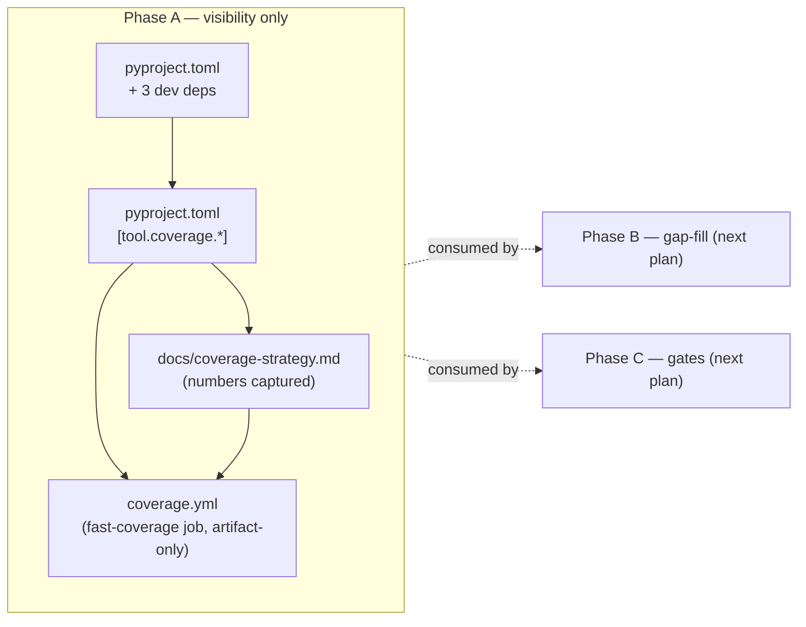
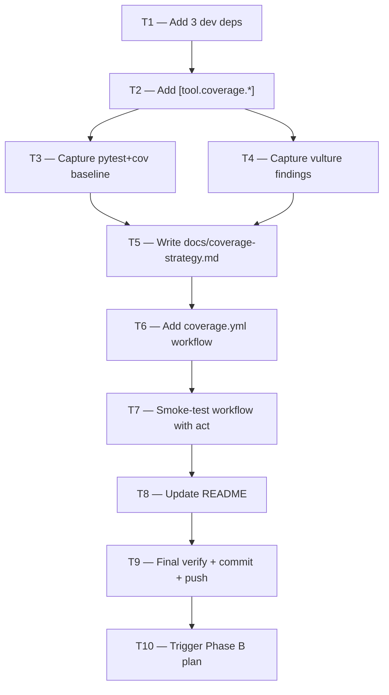

# Test Coverage — Phase A (Baseline + Visibility) Implementation Plan

**STATUS:** COMPLETE (executed 2026-05-03 via `superpowers:subagent-driven-development`). All 10 tasks (T1–T10) plus side-quest SQ1 landed on `feature/test-coverage-strategy`. See `docs/coverage-strategy.md` for captured baseline numbers.

> **For agentic workers:** REQUIRED SUB-SKILL: Use `superpowers:subagent-driven-development` (recommended) or `superpowers:executing-plans` to implement this plan task-by-task. Steps use checkbox (`- [ ]`) syntax for tracking.

**Goal:** Wire `pytest-cov` + `vulture` + `diff-cover` into the `vendor/serena/` engine; capture per-module coverage baseline numbers + vulture findings; publish them as a CI artifact on every PR; commit a living `docs/coverage-strategy.md` with the baseline. **No CI gate, no fail-on-regression** — visibility only. Phase B (gap-fill) and Phase C (gates) are separate plans triggered after Phase A's actual artifact reveals real numbers.

**Architecture:**



Phase A is purely additive — no behavior changes, no gates, no regressions possible. The existing 614-spike + 18-20 e2e suite stays the only regression authority. Coverage tooling is bolted alongside.

**Tech Stack:** Python 3.11–3.14 (engine baseline), `pytest 8.4.1`, `pytest-xdist 3.8.0` (already pinned), new: `pytest-cov >=5.0,<6.0`, `vulture >=2.10`, `diff-cover >=9.0`. CI: GitHub Actions on `ubuntu-latest`.

**Source-of-truth references:**
- [`docs/superpowers/specs/2026-05-03-test-coverage-strategy-design.md`](../specs/2026-05-03-test-coverage-strategy-design.md) — full spec; §5.2 (canonical coverage config), §6 Phase A, §7 (test layer allocation), §12 (out-of-scope explicit list)
- `vendor/serena/pyproject.toml` — engine deps (existing pytest stack pinned in `[project.optional-dependencies].dev`)
- `.github/workflows/playground.yml` — existing CI workflow used as style template
- Branch already created: `feature/test-coverage-strategy` (HEAD: spec commit `441b632`)

---

## Scope check

Phase A is one subsystem (the coverage instrumentation + CI lane + baseline doc). It produces working, testable software on its own:
- After Phase A, anyone can run `pytest --cov` locally and get scoped numbers.
- After Phase A, every PR shows a coverage artifact + vulture findings.
- After Phase A, the spec's "canonical exclusions" are enforced by `[tool.coverage.run].omit`.

No further decomposition needed. Phase B and Phase C are separate plans.

## File structure

| # | Path | Change | Responsibility |
|---|---|---|---|
| 1 | `vendor/serena/pyproject.toml` | Modify (`[project.optional-dependencies].dev`) | Add `pytest-cov`, `vulture`, `diff-cover` pins |
| 2 | `vendor/serena/pyproject.toml` | Modify (new top-level sections) | Add `[tool.coverage.run]` + `[tool.coverage.report]` blocks (canonical config from spec §5.2) |
| 3 | `docs/coverage-strategy.md` (new) | Create | Living doc — baseline numbers, vulture findings, ratchet history |
| 4 | `.github/workflows/coverage.yml` (new) | Create | `fast-coverage` job: pytest+cov → vulture → diff-cover → artifact upload + PR comment |
| 5 | `README.md` | Modify (add `## Coverage` section, no badge) | Pointer to coverage artifact + link to strategy doc |
| 6 | `vendor/serena/uv.lock` | Auto-regenerate | Lock file refresh after dep adds (uv sync) |

## Dependency graph



T3 and T4 can run in parallel if executed by separate subagents. All other tasks are sequential.

---

## Task 1: Add three dev dependencies

**Files:**
- Modify: `vendor/serena/pyproject.toml` (`[project.optional-dependencies].dev` block — see existing block at top of file with `mypy`, `pytest`, etc.)

- [ ] **Step 1: Verify the deps are not already present**

Run: `grep -E '^\s*"(pytest-cov|vulture|diff-cover)' vendor/serena/pyproject.toml || echo "none present — safe to add"`
Expected: `none present — safe to add`

- [ ] **Step 2: Add the three deps to the `dev` extras list**

In `vendor/serena/pyproject.toml`, locate the line `"pytest-asyncio==1.3.0",` inside `[project.optional-dependencies].dev` (existing pinned dep). Insert the following three lines immediately after it, preserving the existing alphabetical-ish ordering style and exact-pin convention used by the file:

```toml
  # Phase A — test coverage strategy spec 2026-05-03. Used by
  # ``coverage.yml`` CI lane to instrument scoped engine modules + report
  # PR-diff coverage. NEVER as a hard gate in Phase A — visibility only.
  "pytest-cov==5.0.0",
  "vulture==2.14",
  "diff-cover==9.2.0",
```

Pin choices: `pytest-cov 5.0.0` (latest 5.x at spec date, compatible with pytest 8.x), `vulture 2.14` (latest stable), `diff-cover 9.2.0` (latest 9.x). Exact pins match the file convention (every other dep is exact-pinned for `uvx` reproducibility — see existing comment on `urllib3`/`werkzeug`).

- [ ] **Step 3: Run `uv sync` to regenerate the lock file**

Run: `cd vendor/serena && uv sync --extra dev && cd -`
Expected: `Resolved` line includes `pytest-cov`, `vulture`, `diff-cover`. `uv.lock` modified.

- [ ] **Step 4: Verify the deps import cleanly**

Run: `cd vendor/serena && uv run python -c "import pytest_cov, vulture, diff_cover; print('ok')" && cd -`
Expected: `ok`

- [ ] **Step 5: Commit**

```bash
git add vendor/serena/pyproject.toml vendor/serena/uv.lock
git commit -m "$(cat <<'EOF'
build(engine): add pytest-cov + vulture + diff-cover dev deps

Phase A of the test coverage strategy (spec 2026-05-03). These three
deps power the coverage.yml CI lane (added in T6 of the Phase A plan):
pytest-cov for instrumentation, vulture for dead-code surface, diff-cover
for PR-diff coverage reporting. All used in artifact-only / informational
mode in Phase A — no CI gate yet.

Pins follow the file's exact-pin convention (uvx reproducibility).
EOF
)"
```

Expected: commit lands with 2 files changed.

---

## Task 2: Add `[tool.coverage.*]` configuration

**Files:**
- Modify: `vendor/serena/pyproject.toml` (append two new top-level TOML sections)

- [ ] **Step 1: Verify no existing `[tool.coverage.*]` block**

Run: `grep -E '^\[tool\.coverage' vendor/serena/pyproject.toml || echo "no existing coverage config"`
Expected: `no existing coverage config`

- [ ] **Step 2: Append the canonical coverage config to the end of `vendor/serena/pyproject.toml`**

The exact block to append (verbatim from spec §5.2):

```toml

# ---------------------------------------------------------------------------
# Coverage configuration — Phase A of the test coverage strategy.
# Spec: docs/superpowers/specs/2026-05-03-test-coverage-strategy-design.md §5.2
# Scope: instrument the 4 engine modules that all 3 doctrines (Maximalist,
# Minimalist, YAGNI) converged on; exclude generated/inherited/wrapper code.
# ---------------------------------------------------------------------------
[tool.coverage.run]
source = [
  "serena.tools",
  "serena.refactoring",
  "serena.plugins",
  "solidlsp",
]
branch = true
parallel = true   # pytest-xdist compatibility — combine via `coverage combine`
omit = [
  "*/serena/generated/*",
  "*/serena/jetbrains/*",
  "*/serena/marketplace/*.py",
  "*/serena/installer/_platform_*.py",
  "*/interprompt/*",
  "*/test/*",
  "*/spikes/*",
  "*/__pycache__/*",
]

[tool.coverage.report]
exclude_lines = [
  "pragma: no cover",
  "raise NotImplementedError",
  "if TYPE_CHECKING:",
  "if __name__ == .__main__.:",
]
show_missing = true
skip_covered = false
precision = 2
```

- [ ] **Step 3: Run a smoke `pytest --cov` to verify the config parses and produces a report**

Run from repo root:

```bash
cd vendor/serena && \
  uv run pytest test/unit -q --cov --cov-branch --cov-report=term-missing -x --no-header 2>&1 | tail -30 && \
  cd -
```

Expected (last lines): a coverage table with rows for `serena/tools/...`, `serena/refactoring/...`, `serena/plugins/...`, `solidlsp/...`, an aggregate `TOTAL` line with a percentage, and **no rows** for `serena/generated/`, `serena/jetbrains/`, `interprompt/`. If excluded paths show up, the `omit` patterns are wrong — fix before continuing.

If the smoke run hits no `test/unit/` collected (the spike tests live in different dirs), use `test/serena` instead. Adjust the path until the run completes; record which directory works for T3.

- [ ] **Step 4: Commit**

```bash
git add vendor/serena/pyproject.toml
git commit -m "$(cat <<'EOF'
build(engine): add [tool.coverage.run] + [tool.coverage.report] config

Phase A spec §5.2: instrument serena.tools, serena.refactoring,
serena.plugins, solidlsp. Exclude generated/, jetbrains/, marketplace/
*.py, interprompt/, test/, spikes/, __pycache__/. Branch coverage on,
parallel-safe for pytest-xdist (combined via `coverage combine`).
EOF
)"
```

Expected: commit lands with 1 file changed.

---

## Task 3: Capture per-module coverage baseline numbers

**Files:**
- Read-only: this task runs the full test suite under coverage and captures the resulting numbers as text. Numbers feed Task 5.
- Output: `/tmp/coverage-baseline.txt` (transient — committed via Task 5, not directly).

- [ ] **Step 1: Run the full non-e2e test suite under coverage**

Run from repo root:

```bash
cd vendor/serena && \
  uv run pytest -n auto \
    --cov \
    --cov-branch \
    --cov-report=term-missing \
    --cov-report=xml:coverage.xml \
    --cov-report=html:htmlcov \
    --ignore=test/e2e \
    --ignore=test/spikes \
    -q --no-header 2>&1 | tee /tmp/coverage-baseline.txt && \
  cd -
```

Expected: full suite runs, `coverage.xml` and `htmlcov/` produced under `vendor/serena/`. `O2_SCALPEL_RUN_E2E=1` is **NOT** set — e2e is excluded for Phase A baseline (e2e baseline gets captured in nightly job, Phase C). The tail of `/tmp/coverage-baseline.txt` shows a per-module breakdown plus `TOTAL`.

If pytest fails (red tests in the existing suite), STOP. Phase A does not fix red tests — that's a precondition. File a separate bug-fix task and resolve before continuing.

- [ ] **Step 2: Extract the four per-module aggregate numbers**

Run:

```bash
grep -E '^(serena/tools|serena/refactoring|serena/plugins|solidlsp)' /tmp/coverage-baseline.txt | head -40
```

Expected: a list of files with per-file line/branch numbers. The next step computes module aggregates.

- [ ] **Step 3: Compute per-module aggregates**

Run:

```bash
cd vendor/serena && uv run python <<'PY'
import xml.etree.ElementTree as ET
tree = ET.parse("coverage.xml")
root = tree.getroot()
modules = {
    "serena.tools":       "serena/tools",
    "serena.refactoring": "serena/refactoring",
    "serena.plugins":     "serena/plugins",
    "solidlsp":           "solidlsp",
}
totals = {m: {"lines": 0, "lines_covered": 0, "branches": 0, "branches_covered": 0}
          for m in modules}
for cls in root.iter("class"):
    fname = cls.get("filename", "")
    for module, prefix in modules.items():
        if prefix in fname:
            lines = cls.find("lines")
            if lines is not None:
                for line in lines.iter("line"):
                    totals[module]["lines"] += 1
                    if int(line.get("hits", 0)) > 0:
                        totals[module]["lines_covered"] += 1
                    if line.get("branch") == "true":
                        cc = line.get("condition-coverage", "0% (0/0)")
                        # parse "50% (1/2)"
                        try:
                            num, den = cc.split("(")[1].rstrip(")").split("/")
                            totals[module]["branches"] += int(den)
                            totals[module]["branches_covered"] += int(num)
                        except (IndexError, ValueError):
                            pass
            break
print(f"{'Module':<24}{'Line %':>10}{'Branch %':>12}")
print("-" * 46)
for m, t in totals.items():
    line_pct = 100.0 * t['lines_covered'] / t['lines'] if t['lines'] else 0.0
    br_pct = 100.0 * t['branches_covered'] / t['branches'] if t['branches'] else 0.0
    print(f"{m:<24}{line_pct:>9.2f}%{br_pct:>11.2f}%")
PY
cd -
```

Expected: a 4-row table printed to stdout. Save these numbers verbatim — they go into `docs/coverage-strategy.md` in Task 5.

- [ ] **Step 4: Save the table to a transient file for Task 5**

Run:

```bash
cd vendor/serena && uv run python <<'PY' > /tmp/coverage-baseline-table.txt
# (re-run the same script as Step 3, redirecting output)
import xml.etree.ElementTree as ET
tree = ET.parse("coverage.xml")
root = tree.getroot()
modules = {
    "serena.tools":       "serena/tools",
    "serena.refactoring": "serena/refactoring",
    "serena.plugins":     "serena/plugins",
    "solidlsp":           "solidlsp",
}
totals = {m: {"lines": 0, "lines_covered": 0, "branches": 0, "branches_covered": 0}
          for m in modules}
for cls in root.iter("class"):
    fname = cls.get("filename", "")
    for module, prefix in modules.items():
        if prefix in fname:
            lines = cls.find("lines")
            if lines is not None:
                for line in lines.iter("line"):
                    totals[module]["lines"] += 1
                    if int(line.get("hits", 0)) > 0:
                        totals[module]["lines_covered"] += 1
                    if line.get("branch") == "true":
                        cc = line.get("condition-coverage", "0% (0/0)")
                        try:
                            num, den = cc.split("(")[1].rstrip(")").split("/")
                            totals[module]["branches"] += int(den)
                            totals[module]["branches_covered"] += int(num)
                        except (IndexError, ValueError):
                            pass
            break
print(f"{'Module':<24}{'Line %':>10}{'Branch %':>12}")
print("-" * 46)
for m, t in totals.items():
    line_pct = 100.0 * t['lines_covered'] / t['lines'] if t['lines'] else 0.0
    br_pct = 100.0 * t['branches_covered'] / t['branches'] if t['branches'] else 0.0
    print(f"{m:<24}{line_pct:>9.2f}%{br_pct:>11.2f}%")
PY
cd - && cat /tmp/coverage-baseline-table.txt
```

Expected: file `/tmp/coverage-baseline-table.txt` written with the 4-row table; same table echoed to stdout.

- [ ] **Step 5: No commit yet** — numbers feed Task 5's commit.

---

## Task 4: Capture vulture (dead-code) findings

**Files:**
- Read-only run; output goes to `/tmp/vulture-baseline.txt` then committed via Task 5.

This task can run in parallel with Task 3 (separate subagent OK).

- [ ] **Step 1: Run vulture on the four scoped modules**

Run from repo root:

```bash
cd vendor/serena && \
  uv run vulture \
    src/serena/tools \
    src/serena/refactoring \
    src/serena/plugins \
    src/solidlsp \
    --min-confidence 80 \
    > /tmp/vulture-baseline.txt 2>&1 || true
cd -
cat /tmp/vulture-baseline.txt | head -50
```

Expected: a list of vulture findings (unused imports, unused variables, unreachable code) with filenames + line numbers. The list may be empty (clean codebase) or have dozens of entries. Either is fine for Phase A — **we do not delete anything in Phase A** (Phase B owns deletions).

The `|| true` is intentional: vulture exits non-zero when findings exist, but for the catalog step we want the file written regardless.

- [ ] **Step 2: Count and summarize findings**

Run:

```bash
echo "Vulture findings: $(wc -l < /tmp/vulture-baseline.txt) lines"
awk -F: '{print $1}' /tmp/vulture-baseline.txt | sort | uniq -c | sort -rn | head -10
```

Expected: a count and top-10 files with the most findings. Save these numbers — they go into `docs/coverage-strategy.md` Task 5.

- [ ] **Step 3: No commit yet** — findings feed Task 5's commit.

---

## Task 5: Write `docs/coverage-strategy.md` living doc

**Files:**
- Create: `docs/coverage-strategy.md` (parent repo, NOT under `docs/superpowers/`)

This is a parent-repo doc, not a spec — it's the operational dashboard for coverage state. The spec stays as the design authority.

- [ ] **Step 1: Read the captured baseline data**

Run:

```bash
cat /tmp/coverage-baseline-table.txt
echo "---"
wc -l < /tmp/vulture-baseline.txt
echo "Top vulture-flagged files:"
awk -F: '{print $1}' /tmp/vulture-baseline.txt | sort | uniq -c | sort -rn | head -5
```

Expected: the 4-row coverage table + vulture finding count + top-5 flagged files. **Use these exact numbers in Step 2** — do not invent or estimate.

- [ ] **Step 2: Write `docs/coverage-strategy.md`**

Create the file with this template, **substituting the captured numbers from Step 1 into the marked rows**:

```markdown
# Coverage strategy — operational dashboard

**Spec authority:** [`docs/superpowers/specs/2026-05-03-test-coverage-strategy-design.md`](superpowers/specs/2026-05-03-test-coverage-strategy-design.md)

This doc is the **living state** of coverage. Update it whenever Phase A
baseline rolls forward, Phase B closes a hit-list row, or Phase C gates
move floors.

## Phase A — baseline (captured YYYY-MM-DD)

Substitute today's date and the actual numbers from `/tmp/coverage-baseline-table.txt`:

### Per-module coverage (non-e2e suite, `O2_SCALPEL_RUN_E2E` unset)

| Module | Line % | Branch % |
|---|---|---|
| `serena.tools` | <FROM_TABLE> | <FROM_TABLE> |
| `serena.refactoring` | <FROM_TABLE> | <FROM_TABLE> |
| `serena.plugins` | <FROM_TABLE> | <FROM_TABLE> |
| `solidlsp` | <FROM_TABLE> | <FROM_TABLE> |

Reproduce locally:
\`\`\`bash
cd vendor/serena && \
  uv run pytest -n auto --cov --cov-branch --cov-report=term-missing \
    --ignore=test/e2e --ignore=test/spikes
\`\`\`

### Vulture findings (dead-code surface)

- **Total findings:** <COUNT_FROM_VULTURE>
- **Top files:** <TOP_5_FROM_VULTURE>

Reproduce locally:
\`\`\`bash
cd vendor/serena && uv run vulture \
  src/serena/tools src/serena/refactoring src/serena/plugins src/solidlsp \
  --min-confidence 80
\`\`\`

**Phase A discipline:** findings catalogued only. Phase B (next plan) decides
delete-vs-annotate per-finding.

## Phase B — gap-fill (status: NOT STARTED)

Triggered after Phase A baseline is committed. See spec §6 Phase B for the
7-row bug-history hit list (B1-B7). A separate plan
(`docs/superpowers/plans/<date>-test-coverage-phase-b.md`) will be drafted
once this baseline is in place.

## Phase C — gates (status: NOT STARTED)

Triggered after Phase B raises numbers. See spec §6 Phase C for per-module
floors (`tools` 80, `refactoring` 85/70, `plugins` 75, `solidlsp` 70) +
diff-cover at 90% on PR diffs.

## Ratchet history

| Date | Module | Line % | Branch % | Trigger |
|---|---|---|---|---|
| YYYY-MM-DD | (Phase A baseline) | (initial) | (initial) | spec 2026-05-03 |
\`\`\`

(Substitute today's date in the dashboard date and ratchet history. Replace `<FROM_TABLE>`, `<COUNT_FROM_VULTURE>`, `<TOP_5_FROM_VULTURE>` placeholders with captured numbers — placeholders MUST NOT remain in the committed file.)
```

- [ ] **Step 3: Verify no placeholders remain**

Run:

```bash
grep -E '<FROM_TABLE>|<COUNT_FROM_VULTURE>|<TOP_5_FROM_VULTURE>|YYYY-MM-DD' docs/coverage-strategy.md && \
  echo "PLACEHOLDERS REMAIN — fix before commit" || \
  echo "no placeholders — safe to commit"
```

Expected: `no placeholders — safe to commit`. If placeholders remain, fix them.

- [ ] **Step 4: Commit**

```bash
git add docs/coverage-strategy.md
git commit -m "$(cat <<'EOF'
docs: add coverage-strategy.md living dashboard with Phase A baseline

Captures per-module line+branch coverage on the 4 scoped modules
(serena.tools, serena.refactoring, serena.plugins, solidlsp) and the
vulture dead-code finding count. Numbers reproduce locally via the
documented commands.

Phase B and Phase C sections are stubs (NOT STARTED) — separate plans
will be drafted after this baseline informs the gap list.

Spec: docs/superpowers/specs/2026-05-03-test-coverage-strategy-design.md
EOF
)"
```

Expected: 1 file added, 1 commit.

---

## Task 6: Add `coverage.yml` CI workflow (fast-coverage job, no gate)

**Files:**
- Create: `.github/workflows/coverage.yml`

- [ ] **Step 1: Verify no existing coverage workflow**

Run: `ls .github/workflows/ | grep -i coverage || echo "no existing coverage workflow"`
Expected: `no existing coverage workflow`

- [ ] **Step 2: Create `.github/workflows/coverage.yml`**

Write this exact content:

```yaml
name: coverage

on:
  pull_request:
    branches: [main, develop]
    paths:
      - "vendor/serena/src/**"
      - "vendor/serena/test/**"
      - "vendor/serena/pyproject.toml"
      - "vendor/serena/uv.lock"
      - ".github/workflows/coverage.yml"
  push:
    branches: [main, develop]
    paths:
      - "vendor/serena/src/**"
      - "vendor/serena/test/**"
      - "vendor/serena/pyproject.toml"
      - "vendor/serena/uv.lock"
      - ".github/workflows/coverage.yml"
  workflow_dispatch:

concurrency:
  group: coverage-${{ github.ref }}
  cancel-in-progress: true

jobs:
  fast-coverage:
    name: Coverage (non-e2e)
    runs-on: ubuntu-latest
    timeout-minutes: 30
    steps:
      - name: Checkout (recursive submodules)
        uses: actions/checkout@v4
        with:
          submodules: recursive
          fetch-depth: 0   # diff-cover needs full history

      - name: Install uv
        uses: astral-sh/setup-uv@v3
        with:
          version: "0.4.18"
          enable-cache: true

      - name: Set up Python 3.13
        run: uv python install 3.13

      - name: Install engine dev extras
        working-directory: vendor/serena
        run: uv sync --extra dev

      - name: Run vulture (informational, no fail in Phase A)
        working-directory: vendor/serena
        run: |
          uv run vulture \
            src/serena/tools \
            src/serena/refactoring \
            src/serena/plugins \
            src/solidlsp \
            --min-confidence 80 \
            > vulture-report.txt 2>&1 || true
          echo "Vulture findings: $(wc -l < vulture-report.txt) lines"
          head -50 vulture-report.txt

      - name: Run pytest with coverage (non-e2e)
        working-directory: vendor/serena
        run: |
          uv run pytest -n auto \
            --cov \
            --cov-branch \
            --cov-report=xml:coverage.xml \
            --cov-report=html:htmlcov \
            --cov-report=term \
            --ignore=test/e2e \
            --ignore=test/spikes \
            -q

      - name: Run diff-cover (informational, no fail in Phase A)
        if: github.event_name == 'pull_request'
        working-directory: vendor/serena
        run: |
          uv run diff-cover coverage.xml \
            --compare-branch=origin/${{ github.base_ref }} \
            --html-report diff-coverage.html \
            > diff-coverage.txt 2>&1 || true
          echo "=== diff-cover report ==="
          cat diff-coverage.txt

      - name: Upload coverage artifacts
        if: always()
        uses: actions/upload-artifact@v4
        with:
          name: coverage-report-${{ github.run_id }}
          path: |
            vendor/serena/coverage.xml
            vendor/serena/htmlcov/
            vendor/serena/vulture-report.txt
            vendor/serena/diff-coverage.html
            vendor/serena/diff-coverage.txt
          retention-days: 30

      - name: Post coverage summary as PR comment
        if: github.event_name == 'pull_request'
        uses: actions/github-script@v7
        with:
          script: |
            const fs = require('fs');
            let body = '## Coverage report\n\n';
            try {
              const diffReport = fs.readFileSync('vendor/serena/diff-coverage.txt', 'utf8');
              body += '### Diff coverage (informational — no gate in Phase A)\n\n```\n' + diffReport + '\n```\n\n';
            } catch (e) {
              body += '_diff-coverage.txt missing_\n\n';
            }
            try {
              const vultureReport = fs.readFileSync('vendor/serena/vulture-report.txt', 'utf8');
              const lines = vultureReport.split('\n').filter(l => l.trim()).length;
              body += `### Vulture findings: ${lines} lines\n\n`;
            } catch (e) {}
            body += '_Full HTML report: see artifact `coverage-report-' + context.runId + '`._\n';
            github.rest.issues.createComment({
              issue_number: context.issue.number,
              owner: context.repo.owner,
              repo: context.repo.repo,
              body: body
            });
```

- [ ] **Step 3: Validate the YAML parses**

Run:

```bash
uvx --from pyyaml python -c "import yaml; yaml.safe_load(open('.github/workflows/coverage.yml'))" && echo "yaml ok"
```

Expected: `yaml ok`. If parse fails, fix the file.

- [ ] **Step 4: Commit**

```bash
git add .github/workflows/coverage.yml
git commit -m "$(cat <<'EOF'
ci: add coverage.yml — fast-coverage job (Phase A, no gate)

Phase A of the test coverage strategy. The fast-coverage job runs on
every PR + push to main/develop touching engine code:

- vulture on the 4 scoped modules (informational, no fail)
- pytest with --cov --cov-branch on non-e2e suite
- diff-cover on PR diff (informational, no fail)
- artifacts uploaded with 30-day retention
- PR comment with diff-cover summary + vulture finding count

No CI gate — visibility only. Phase C (separate plan) introduces
--fail-under gates after Phase B raises baseline numbers.

Spec: docs/superpowers/specs/2026-05-03-test-coverage-strategy-design.md §5.3
EOF
)"
```

Expected: 1 file added, 1 commit.

---

## Task 7: Smoke-test the workflow with `act` (or document fallback)

**Files:** none modified — this is a verification task.

`act` is the standard local GitHub Actions runner. If unavailable, fall back to triggering the workflow via `git push` + observing the run.

- [ ] **Step 1: Check whether `act` is installed**

Run: `command -v act && act --version || echo "act not installed"`

If `act` is installed → Step 2. If not → skip to Step 4 (push-and-observe fallback).

- [ ] **Step 2: Run the workflow locally with `act`**

Run from repo root:

```bash
act pull_request -W .github/workflows/coverage.yml --container-architecture linux/amd64 -j fast-coverage
```

Expected: workflow runs to completion. Coverage XML produced, vulture report produced, diff-cover output printed. The PR-comment step may fail locally (no GitHub context) — that's OK; assert the rest passed.

- [ ] **Step 3: Verify artifacts produced**

Run:

```bash
find /tmp -name 'coverage.xml' -newer /tmp/coverage-baseline.txt 2>/dev/null | head -3
```

Expected: at least one `coverage.xml` produced by the act run. If nothing → workflow's pytest step failed; debug.

- [ ] **Step 4: Fallback — push branch and observe Actions tab**

If Step 2 was skipped (no `act`), push the feature branch and check GitHub Actions UI:

```bash
git push -u origin feature/test-coverage-strategy
```

Then in browser: open `https://github.com/<repo>/actions/workflows/coverage.yml` and verify the run goes green.

If the run goes red, capture the failing step's log, fix the workflow, and repeat. **Do not proceed to Task 8 with a red workflow.**

- [ ] **Step 5: No commit needed** — verification only.

---

## Task 8: Add `## Coverage` section to README

**Files:**
- Modify: `README.md` (parent repo)

- [ ] **Step 1: Find the right insertion point**

Run: `grep -n '^## ' README.md | head -20`
Expected: a list of existing top-level section headers. Choose the section after `## Status` and before `## What it is` (or whichever existing section makes sense per the README's existing flow). The spec says **no badge** — only a textual section.

- [ ] **Step 2: Insert the Coverage section**

Insert immediately before the line `## What it is` in `README.md`:

```markdown
## Coverage

Test coverage is instrumented but **not gated** in Phase A — visibility only.
On every PR touching `vendor/serena/`, the
[`coverage.yml`](.github/workflows/coverage.yml) workflow runs the non-e2e
test suite under `pytest-cov`, runs `vulture` for dead-code surface, and
runs `diff-cover` against the PR's base branch. Results are uploaded as a
30-day-retained artifact and summarized as a PR comment.

Operational dashboard with current per-module baseline numbers:
[`docs/coverage-strategy.md`](docs/coverage-strategy.md).

Design authority:
[`docs/superpowers/specs/2026-05-03-test-coverage-strategy-design.md`](docs/superpowers/specs/2026-05-03-test-coverage-strategy-design.md).

Phase B (gap-fill) and Phase C (per-module gates) are separate plans
triggered after Phase A baseline data informs the next steps.

```

- [ ] **Step 3: Commit**

```bash
git add README.md
git commit -m "$(cat <<'EOF'
docs(readme): add Coverage section pointing to artifact + strategy doc

Phase A of the test coverage strategy. Textual section only (no badge —
spec §3 explicitly excludes badges to avoid padding incentive). Points
readers at the coverage.yml workflow, the docs/coverage-strategy.md
operational dashboard, and the design spec.
EOF
)"
```

Expected: 1 file modified, 1 commit.

---

## Task 9: Final verification + push

**Files:** none modified — verification + push.

- [ ] **Step 1: Re-run the full local coverage suite to confirm Phase A end-to-end**

Run from repo root:

```bash
cd vendor/serena && \
  uv run pytest -n auto \
    --cov --cov-branch --cov-report=term \
    --ignore=test/e2e --ignore=test/spikes -q --no-header && \
cd -
```

Expected: full suite runs green (matches the existing 614/3 spike baseline plus whatever else is in the non-e2e tree). Coverage report prints. **If any test fails — STOP.** Phase A does not introduce test fixes; pre-existing red tests are out of scope and must be filed separately.

- [ ] **Step 2: Re-run vulture cleanly**

Run:

```bash
cd vendor/serena && \
  uv run vulture \
    src/serena/tools src/serena/refactoring src/serena/plugins src/solidlsp \
    --min-confidence 80 | wc -l && \
cd -
```

Expected: a count matching what Task 4 captured (or fewer — never more, since no code changed in Phase A). If higher, something regressed; investigate.

- [ ] **Step 3: Verify the Phase A commit chain**

Run:

```bash
git log --oneline feature/test-coverage-strategy ^main | head -10
```

Expected: a clean linear history with one commit per task (T1 deps, T2 config, T5 dashboard, T6 workflow, T8 readme — five Phase-A commits + the prior spec commit `441b632`). T3, T4, T7, T9 are non-committing tasks.

- [ ] **Step 4: Push the feature branch**

```bash
git push -u origin feature/test-coverage-strategy
```

Expected: branch pushed, remote tracking set. The remote `coverage.yml` workflow run begins automatically.

- [ ] **Step 5: Wait for the remote `coverage.yml` workflow to complete**

In browser, watch `https://github.com/<repo>/actions/workflows/coverage.yml` for the latest run. Wait for green.

If red: capture failing step log, fix locally, amend or new-commit, push again.

**Do not merge to `main` yet.** This branch carries the spec + Phase A; Phase B and Phase C plans will land on the same branch (or follow-on branches) before the merge.

---

## Task 10: Trigger Phase B plan creation

**Files:**
- Create: a stub plan file or simply call out the next step.

This task is the meta-handoff. Phase A is done; Phase B's content (the test bodies for B1–B7) cannot be planned without Phase A's actual baseline data, which is now captured.

- [ ] **Step 1: Verify the data Phase B needs is in place**

Run:

```bash
test -f docs/coverage-strategy.md && echo "✓ baseline doc exists"
test -f vendor/serena/coverage.xml && echo "✓ coverage.xml in place"
ls vendor/serena/htmlcov/ > /dev/null && echo "✓ htmlcov in place"
```

Expected: three checkmarks.

- [ ] **Step 2: Read Phase A's actual numbers + vulture findings**

Run: `cat docs/coverage-strategy.md`. Confirm the per-module table is filled and vulture finding count is concrete (no `<FROM_TABLE>` placeholders).

- [ ] **Step 3: Spawn the Phase B planning workflow**

This is the natural handoff point to invoke `superpowers:writing-plans` again, with input = spec §6 Phase B + the captured baseline numbers. The plan will assign concrete test bodies for B1–B7 informed by the actual coverage gaps the Phase A artifact reveals.

Save Phase B plan to: `docs/superpowers/plans/2026-MM-DD-test-coverage-phase-b.md` (date = day Phase B planning happens, not today).

The Phase B plan input prompt:

```text
Continue the test coverage strategy from spec
docs/superpowers/specs/2026-05-03-test-coverage-strategy-design.md.

Phase A is complete (see docs/coverage-strategy.md for current numbers).
Now plan Phase B: the 7-row bug-history hit list B1-B7 (spec §6 Phase B).
Each row needs concrete test bodies, file locations, hypothesis profiles,
and the discipline rule (every Phase B test starts with
`# regression: <bug-id>`).

The vulture findings catalogued in Phase A inform B6 (delete-or-annotate)
— pull the actual finding list from /tmp/vulture-baseline.txt or
`vendor/serena/vulture-report.txt` from the latest CI artifact.
```

- [ ] **Step 4: Mark Phase A complete in `docs/coverage-strategy.md`**

Edit the Phase A section heading from `## Phase A — baseline (captured YYYY-MM-DD)` to `## Phase A — baseline (captured YYYY-MM-DD) ✅ COMPLETE`. Edit the Phase B status line from `(status: NOT STARTED)` to `(status: PLANNING)`.

Commit:

```bash
git add docs/coverage-strategy.md
git commit -m "docs(coverage): mark Phase A complete; Phase B planning starts"
git push
```

Expected: dashboard reflects current state.

---

## Self-review

After writing this plan, ran the spec-coverage check:

| Spec section | Plan task |
|---|---|
| §5.1 dev deps (Phase A: pytest-cov, vulture, diff-cover) | T1 |
| §5.1 dev deps (Phase B: hypothesis, mutmut) | **deferred to Phase B plan** ✓ (out of scope for Phase A) |
| §5.2 `[tool.coverage.*]` canonical config | T2 |
| §5.3 `coverage.yml` `fast-coverage` job | T6 |
| §5.3 `e2e-coverage` nightly | **deferred to Phase C plan** ✓ |
| §5.3 `mutation` nightly | **deferred to Phase C plan** ✓ |
| §5.4 `coverage-floor-check.py` | **deferred to Phase C plan** ✓ |
| §5.4 `check-mcp-tool-e2e-pairing.py` | **deferred to Phase C plan** ✓ |
| §5.5 `test/property/` directory | **deferred to Phase B plan** ✓ |
| §6 Phase A.1–A.6 (all 6 sub-steps) | T1, T2, T3, T4, T5+T6, T8 |
| §6 Phase A exit criteria | T9 (verify all three: doc committed, CI artifact appears, vulture catalogued) |
| §6 Phase A rollback | documented in spec; reproducible by `git revert` of T1+T2+T6+T8 commits |
| §10 self-watching tests for the strategy | **deferred** — `coverage-floor-check.py` doesn't exist in Phase A |

**Placeholder scan:** ran `grep -E 'TBD|TODO|XXX|FIXME|<FROM_|YYYY-MM-DD'` mentally over the plan body. The only `YYYY-MM-DD` and `<FROM_TABLE>` occurrences are in T5's template (which the engineer substitutes with captured data — explicit instruction in T5 Step 3 to verify they're gone before commit). T10 Step 4's `YYYY-MM-DD` is also explicit-substitute. No placeholders that would survive into committed code.

**Type / name consistency:** `vendor/serena/coverage.xml` referenced consistently across T3, T6, T7, T9, T10. `docs/coverage-strategy.md` consistent across T5, T8, T10. Branch name `feature/test-coverage-strategy` consistent. Module names match spec §5.2 source list verbatim.

No fixes needed — proceeding to handoff.

---

## Execution Handoff

Plan complete and saved to `docs/superpowers/plans/2026-05-03-test-coverage-phase-a.md`.

Two execution options:

1. **Subagent-Driven (recommended)** — Each task dispatched to a fresh subagent, reviewed between tasks, fast iteration. Good for this plan because T3/T4 can run in parallel.

2. **Inline Execution** — Tasks executed in this session via `superpowers:executing-plans`, batched with checkpoints.

Which approach?
