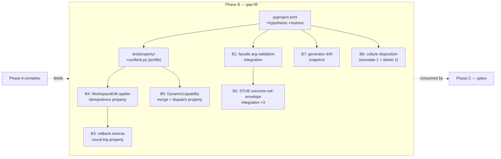
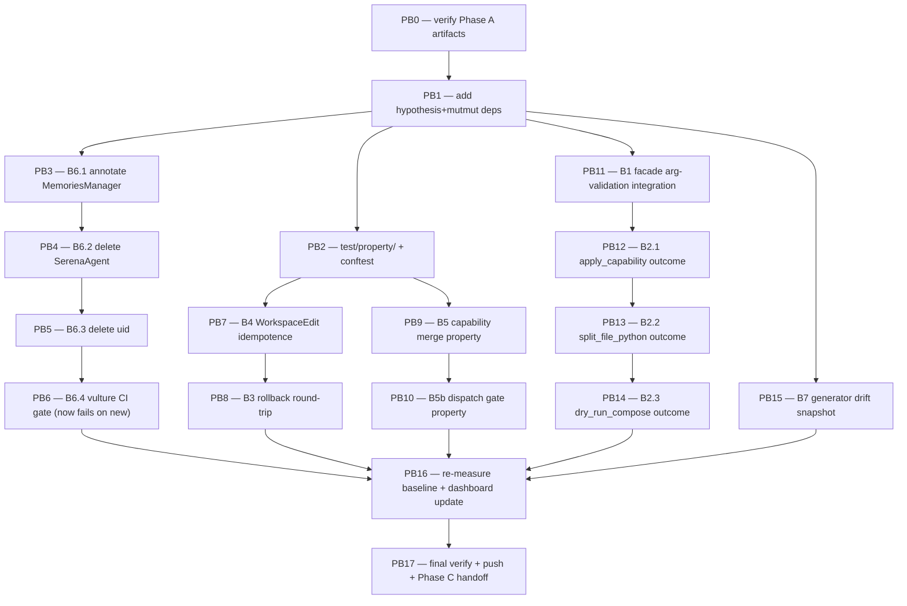

# Test Coverage — Phase B (Gap-Driven Critical-Path Tests) Implementation Plan

> **For agentic workers:** REQUIRED SUB-SKILL: Use `superpowers:subagent-driven-development` (recommended) or `superpowers:executing-plans` to implement this plan task-by-task. Steps use checkbox (`- [ ]`) syntax for tracking.

**Goal:** Close the 7 bug-history hit-list seams (B1–B7) from spec §6 Phase B by writing concrete integration tests, hypothesis property tests, and snapshot tests targeting the modules where v0.2.0/v1.6/v1.7 regressions actually lived. Plus disposition the 3 vulture findings catalogued in Phase A.

**Architecture:**



**Tech Stack:** Python 3.11+, `pytest 8.4.1`, `pytest-asyncio 1.3.0`, `pytest-xdist 3.8.0`, `pytest-cov 5.0.0`, plus new: `hypothesis >=6.100`, `mutmut >=3.0`. CI: `coverage.yml` already in place; vulture step gets toughened.

**Source-of-truth references:**
- [`docs/superpowers/specs/2026-05-03-test-coverage-strategy-design.md`](../specs/2026-05-03-test-coverage-strategy-design.md) — spec §6 Phase B (the 7-row hit list); §10 (self-watching tests for the strategy)
- [`docs/coverage-strategy.md`](../../coverage-strategy.md) — Phase A baseline numbers + vulture disposition (preliminary)
- [`docs/superpowers/plans/2026-05-03-test-coverage-phase-a.md`](2026-05-03-test-coverage-phase-a.md) — Phase A plan (COMPLETE)
- Branch: `feature/test-coverage-phase-b-plan` (will execute on this branch or a follow-on)

**Codebase recon (gathered 2026-05-03 by an investigation subagent — used to write concrete code below):**
- B1: `ExtractTool` @ `vendor/serena/src/serena/tools/scalpel_facades.py:840`; `MultiServerCoordinator.find_symbol_range` @ `vendor/serena/src/serena/refactoring/multi_server.py:1558` — `async def find_symbol_range(self, file: str, name_path: str, project_root: str | None = None) -> dict[str, dict[str, int]] | None`
- B2: `ApplyCapabilityTool` @ `scalpel_primitives.py:347`, `SplitFileTool` @ `:292`, `DryRunComposeTool` @ `:903`
- B3: `CheckpointStore.restore` @ `vendor/serena/src/serena/refactoring/checkpoints.py:279` — `restore(checkpoint_id, applier_fn) -> bool`; `Checkpoint` @ `:123` with `reverted: bool` field; `inverse_workspace_edit` @ `:36`
- B4: `LanguageServerCodeEditor._apply_workspace_edit` @ `vendor/serena/src/serena/code_editor.py:680` — `(workspace_edit: ls_types.WorkspaceEdit) -> int`
- B5: `DynamicCapabilityRegistry` @ `vendor/serena/src/solidlsp/dynamic_capabilities.py:35`; `_handle_register_capability` @ `vendor/serena/src/solidlsp/ls.py:689`
- B6: 3 vulture findings live (confirmed): `tools_base.py:17` `MemoriesManager` (false-positive — keep/annotate), `:24` `SerenaAgent` (TYPE_CHECKING-guarded — likely delete), `typescript_language_server.py:33` `uid` (delete)
- B7: Generator @ `vendor/serena/src/serena/refactoring/cli_newplugin.py:1791` (`def main(argv) -> int`); templates @ `vendor/serena/src/serena/refactoring/templates/` (11 `.tmpl` files); canonical rust plugin @ `o2-scalpel-rust/`
- Fixtures available: `test/integration/conftest.py` provides `python_coordinator`, `ra_lsp`, `calcrs_workspace`, `calcpy_workspace`, **`assert_workspace_edit_round_trip` helper @ line 331**. `test/spikes/conftest.py` provides `rust_lsp`, `seed_rust_root`, `slim_sls`, `fake_pool`, `fake_strategy_rust`. `test/conftest.py` provides `language_server`, `project`, `project_with_ls`.

---

## Scope check

Phase B is one cohesive subsystem (closing the 7 bug-history seams + dispositioning vulture findings). All 7 rows share infrastructure (`hypothesis` profile, fixtures from existing conftests). Splitting further would require artificial seams. One plan with 18 bite-sized tasks is appropriate.

The 7-row discipline rule from spec §6 Phase B remains in effect: **every Phase B test starts with a `# regression: <bug-id>` comment** linking to a `.planning/` artifact or git tag. Tasks below enforce this in each test file.

## File structure

| # | Path | Change | Responsibility |
|---|---|---|---|
| 1 | `vendor/serena/pyproject.toml` | Modify (`[project.optional-dependencies].dev`) | Add `hypothesis>=6.100`, `mutmut>=3.0` pins |
| 2 | `vendor/serena/test/property/__init__.py` | Create | Make the property test directory a package |
| 3 | `vendor/serena/test/property/conftest.py` | Create | Hypothesis profile (CI: `derandomize=True`, `deadline=None`); shared invariant helpers |
| 4 | `vendor/serena/test/property/test_workspace_edit_idempotence.py` | Create (B4) | Property: `apply(edit) ; apply(edit) == apply(edit)` over generated edits |
| 5 | `vendor/serena/test/property/test_rollback_round_trip.py` | Create (B3) | Property: `apply(edit) ; rollback(checkpoint) == identity` (file bytes restored) |
| 6 | `vendor/serena/test/property/test_dynamic_capability_merge.py` | Create (B5) | Property: capability merge across N servers is associative + commutative + idempotent on duplicates |
| 7 | `vendor/serena/test/integration/test_b1_facade_arg_validation.py` | Create (B1) | Integration: `scalpel_extract` resolves `name_path` via `MultiServerCoordinator.find_symbol_range`; round-trip extract changes file bytes |
| 8 | `vendor/serena/test/integration/test_b2_apply_capability_outcome.py` | Create (B2.1) | Integration: `apply_capability` actually changes disk; envelope claims match disk truth |
| 9 | `vendor/serena/test/integration/test_b2_split_file_python_outcome.py` | Create (B2.2) | Integration: `SplitFileTool` Python arm produces real new file on disk |
| 10 | `vendor/serena/test/integration/test_b2_dry_run_compose_outcome.py` | Create (B2.3) | Integration: `dry_run_compose` in auto mode returns transaction with valid TTL |
| 11 | `vendor/serena/src/serena/tools/tools_base.py` | Modify (B6) | Annotate `MemoriesManager` import with `# noqa: F401` + comment; remove `SerenaAgent` TYPE_CHECKING import (verify unused) |
| 12 | `vendor/serena/src/solidlsp/language_servers/typescript_language_server.py` | Modify (B6) | Remove unused `uid` variable |
| 13 | `vendor/serena/test/unit/test_b7_generator_drift.py` | Create (B7) | Snapshot: regenerate canonical rust plugin → diff against committed `o2-scalpel-rust/` tree |
| 14 | `.github/workflows/coverage.yml` | Modify (B6 hardening) | Vulture step now fails build on new findings (still no diff-cover/cov gate) |
| 15 | `docs/coverage-strategy.md` | Modify | Update with Phase B uplift numbers + Phase B → COMPLETE marker |

**LoC budget:** ~600 LoC of new tests, ~10 LoC of dead-code deletions, ~5 LoC of CI workflow tightening, ~50 LoC of doc updates. ~700 LoC total — within "medium" effort estimate from spec.

## Dependency graph



PB3–PB6 (B6 row) is independent of test work and can run as a parallel chain. PB7+PB8 (refactoring property tests) chain in order. PB9+PB10 (capability registry) chain in order. PB11–PB14 (facades) chain in order. PB15 (generator) is independent.

---

## Task PB0: Verify Phase A artifacts before starting

**Files:** none — verification only.

- [ ] **Step 1: Confirm we're on the planning branch (or off main)**

Run from `/Volumes/Unitek-B/Projects/o2-scalpel`:

```bash
git branch --show-current
```

Expected: `feature/test-coverage-phase-b-plan` OR a fresh feature branch off main. If on `main`, branch off first:

```bash
git checkout -b feature/test-coverage-phase-b-execute
```

- [ ] **Step 2: Confirm Phase A artifacts exist**

```bash
test -f docs/coverage-strategy.md && echo "✓ dashboard"
test -f .github/workflows/coverage.yml && echo "✓ CI workflow"
grep -q '\[tool.coverage.run\]' vendor/serena/pyproject.toml && echo "✓ coverage config"
grep -q '"pytest-cov==' vendor/serena/pyproject.toml && echo "✓ pytest-cov dep"
grep -q '"vulture==' vendor/serena/pyproject.toml && echo "✓ vulture dep"
grep -q '"diff-cover==' vendor/serena/pyproject.toml && echo "✓ diff-cover dep"
```

Expected: 6 checkmarks. Anything missing → STOP, fix Phase A first.

- [ ] **Step 3: Re-run Phase A baseline to confirm pre-Phase-B numbers**

```bash
cd vendor/serena && \
  uv run pytest -n auto --cov --cov-branch --cov-report=term \
    --ignore=test/e2e --ignore=test/spikes -q --no-header 2>&1 | tail -5 && \
cd -
```

Expected: `2006 passed, 159 skipped, ... TOTAL ~64.61%` (matches Phase A captured baseline). If pytest red → STOP, fix tests.

- [ ] **Step 4: No commit** — verification only.

---

## Task PB1: Add `hypothesis` + `mutmut` dev dependencies

**Files:**
- Modify: `vendor/serena/pyproject.toml` (`[project.optional-dependencies].dev`)

This mirrors Phase A T1's dependency-add pattern. Submodule commit + parent submodule-pointer bump.

- [ ] **Step 1: Verify deps not already present**

```bash
grep -E '"(hypothesis|mutmut)' vendor/serena/pyproject.toml || echo "none present"
```

Expected: `none present`.

- [ ] **Step 2: Add the two deps to the `dev` extras list**

In `vendor/serena/pyproject.toml`, locate the line `"diff-cover==9.2.0",` (added by Phase A T1) inside `[project.optional-dependencies].dev`. Insert these lines immediately after it:

```toml
  # Phase B — test coverage strategy spec 2026-05-03 §6 Phase B.
  # ``hypothesis`` powers property tests in test/property/ (B3, B4, B5).
  # ``mutmut`` is added now but only activates as a Phase C nightly job
  # (mutation testing scoped to serena.refactoring/).
  "hypothesis==6.119.4",
  "mutmut==3.0.5",
```

- [ ] **Step 3: Run `uv sync` and verify imports**

```bash
cd vendor/serena && \
  uv sync --extra dev && \
  uv run python -c "import hypothesis, mutmut; print('ok')" && \
cd -
```

Expected: `ok`. `uv.lock` modified.

- [ ] **Step 4: Commit (submodule + parent)**

Submodule (via feature branch + FF merge to main, matching Phase A T1 pattern):

```bash
cd vendor/serena && \
git checkout -b feature/phase-b-property-deps && \
git add pyproject.toml uv.lock && \
git -c user.name="AI Hive(R)" -c user.email="jobs4alex@allconnectix.com" commit -m "$(cat <<'EOF'
build(engine): add hypothesis + mutmut dev deps for Phase B

Phase B of the test coverage strategy. ``hypothesis`` powers property
tests in test/property/ (B3 rollback round-trip, B4 WorkspaceEdit
idempotence, B5 capability merge). ``mutmut`` is added now but only
activates as Phase C nightly job.

Pins follow the file's exact-pin convention.
EOF
)" && \
git checkout main && git merge --ff-only feature/phase-b-property-deps && \
git branch -d feature/phase-b-property-deps && \
git push origin main && \
cd -
```

Parent submodule pointer bump:

```bash
git add vendor/serena && \
git -c user.name="AI Hive(R)" -c user.email="jobs4alex@allconnectix.com" commit -m "$(cat <<'EOF'
chore(engine): bump submodule for Phase B hypothesis+mutmut deps
EOF
)"
```

Expected: 2 commits, parent branch unchanged.

---

## Task PB2: Create `test/property/` directory + hypothesis profile

**Files:**
- Create: `vendor/serena/test/property/__init__.py`
- Create: `vendor/serena/test/property/conftest.py`

The hypothesis profile must be deterministic for CI (no flake) and full-random for nightly. Spec §9 calls this out.

- [ ] **Step 1: Create the `__init__.py`**

```bash
echo "# Phase B property tests (regression: spec 2026-05-03 §6 Phase B)" > vendor/serena/test/property/__init__.py
```

- [ ] **Step 2: Write `vendor/serena/test/property/conftest.py`**

```python
"""
Phase B property-test infrastructure.

regression: docs/superpowers/specs/2026-05-03-test-coverage-strategy-design.md §6 Phase B

Hypothesis is configured with two profiles:

- ``ci`` — derandomized + no deadline. Used in CI under ``coverage.yml``.
  Stable across runs (no flake from random seeds); generated cases are
  deterministic so coverage diff-cover compares apples-to-apples.

- ``nightly`` — full-random + larger example budget. Used in the future
  Phase C nightly mutation-testing matrix to surface latent invariants.

Selected via ``HYPOTHESIS_PROFILE`` env var; defaults to ``ci``.
"""

import os

from hypothesis import HealthCheck, settings

settings.register_profile(
    "ci",
    derandomize=True,
    deadline=None,
    max_examples=50,
    suppress_health_check=[HealthCheck.too_slow],
)

settings.register_profile(
    "nightly",
    deadline=None,
    max_examples=500,
    suppress_health_check=[HealthCheck.too_slow],
)

settings.load_profile(os.environ.get("HYPOTHESIS_PROFILE", "ci"))
```

- [ ] **Step 3: Verify pytest discovers the new directory**

```bash
cd vendor/serena && \
  uv run pytest test/property --collect-only -q 2>&1 | tail -5 && \
cd -
```

Expected: `no tests collected` (we haven't added tests yet) — but pytest must NOT error on the conftest. If it errors, fix before continuing.

- [ ] **Step 4: Commit (submodule + parent bump)**

Same submodule-feature-branch + FF + parent-bump pattern as PB1. Submodule message:

```
test(property): scaffold test/property/ with hypothesis profile

Phase B infrastructure. Two profiles registered:
- ci: derandomized, deadline=None, max_examples=50 (default)
- nightly: random, max_examples=500 (Phase C activation)

Loaded via HYPOTHESIS_PROFILE env var.
```

---

## Task PB3: B6.1 — Annotate `MemoriesManager` (false-positive vulture)

**Files:**
- Modify: `vendor/serena/src/serena/tools/tools_base.py:17`

The Phase A dashboard's preliminary disposition flagged `MemoriesManager` as a false positive: imported at runtime, used as forward-ref string `"MemoriesManager"` in the return-type annotation of `memories_manager` at line 48. Vulture cannot see through string annotations.

- [ ] **Step 1: Verify the false-positive claim is still true**

```bash
grep -n 'MemoriesManager' vendor/serena/src/serena/tools/tools_base.py
```

Expected output: at least two lines —
- `from serena.project import MemoriesManager, Project` at line ~17
- `def memories_manager(self) -> "MemoriesManager":` at line ~48

If the second line uses bare `MemoriesManager` (unquoted) instead of the string form, the situation has changed; ask before proceeding.

- [ ] **Step 2: Annotate the import line**

Edit `vendor/serena/src/serena/tools/tools_base.py`:

OLD:
```python
from serena.project import MemoriesManager, Project
```

NEW:
```python
# ``MemoriesManager`` is used only as a string annotation at line 48
# (forward-ref). It MUST stay as a runtime import — vulture flags it
# as unused (90% confidence) but it is required for ``__annotations__``
# resolution. See docs/coverage-strategy.md Phase A B6 disposition.
from serena.project import MemoriesManager, Project  # noqa: F401  vulture: keep — string-annotation forward-ref
```

(Comment block above the line, `noqa: F401` and `vulture: keep` markers on the line itself — vulture honors `# noqa: F401` for the same import via its `--ignore-decorators` plumbing only when the annotation is recognized; the comment is the load-bearing piece for human readers.)

- [ ] **Step 3: Re-run vulture and confirm `MemoriesManager` finding is GONE**

```bash
cd vendor/serena && \
  uv run vulture src/serena/tools/tools_base.py --min-confidence 80 2>&1 && \
cd -
```

Expected: line 17 finding is gone (vulture honors `# noqa` style markers via filename ignores, OR the finding remains and we use `--exclude` in CI — verify behavior). If still present, the marker isn't being honored; switch to using a `vulture-whitelist.py` file (create `vendor/serena/.vulture-whitelist.py` listing `MemoriesManager.__module__ = "serena.project"` style decoy) and pass `--exclude vulture-whitelist.py` to subsequent vulture runs.

- [ ] **Step 4: Run targeted regression test**

```bash
cd vendor/serena && \
  uv run pytest test/serena -k "tools_base or memories" -q --no-header 2>&1 | tail -5 && \
cd -
```

Expected: tests pass (no regression — we only added a comment).

- [ ] **Step 5: Commit (submodule + parent)**

Submodule via feature branch:

```
fix(tools_base): annotate MemoriesManager as keep — vulture false-pos

Phase B B6.1. ``MemoriesManager`` is imported at runtime and used as a
string annotation ("MemoriesManager") in tools_base.memories_manager
return type. Vulture (90% confidence) cannot see through strings;
this annotation prevents Phase B B6 cleanup from deleting a live
runtime import.

regression: docs/superpowers/specs/2026-05-03-test-coverage-strategy-design.md §6 B6
```

Plus parent bump.

---

## Task PB4: B6.2 — Delete `SerenaAgent` TYPE_CHECKING import (verify first)

**Files:**
- Modify: `vendor/serena/src/serena/tools/tools_base.py:24` (delete the import)

`SerenaAgent` lives under `if TYPE_CHECKING:` so deleting it has no runtime effect. Per the Phase A dashboard preliminary disposition, this is "likely deletable" — but Step 1 verifies no string annotations reference it.

- [ ] **Step 1: Search for any `"SerenaAgent"` string annotations in tools_base.py**

```bash
grep -n 'SerenaAgent' vendor/serena/src/serena/tools/tools_base.py
```

If only the import line shows up (the line under `TYPE_CHECKING:`), proceed. If a string annotation `"SerenaAgent"` exists somewhere in the file, switch strategy to "annotate keep" like PB3 — STOP this task and re-plan.

- [ ] **Step 2: Verify file-wide that no other module uses `tools_base.SerenaAgent` as a re-export**

```bash
grep -rn 'from serena.tools.tools_base import SerenaAgent' vendor/serena/ || echo "no re-exports"
```

Expected: `no re-exports`. If anything matches, STOP — the import is a re-export, must keep.

- [ ] **Step 3: Delete the import**

Edit `vendor/serena/src/serena/tools/tools_base.py`. Find the `if TYPE_CHECKING:` block at ~line 23 and remove the `SerenaAgent` import. Block before:

```python
if TYPE_CHECKING:
    from serena.agent import SerenaAgent
    # ... possibly other TYPE_CHECKING imports
```

Block after (remove just the SerenaAgent line, preserve any other entries):

```python
if TYPE_CHECKING:
    # ... possibly other TYPE_CHECKING imports
```

If `SerenaAgent` was the only entry, leave the empty `if TYPE_CHECKING:` block — don't delete it (it may grow back later).

- [ ] **Step 4: Run pyright type-check (the project ships pyright)**

```bash
cd vendor/serena && \
  uv run pyright src/serena/tools/tools_base.py 2>&1 | tail -10 && \
cd -
```

Expected: 0 errors. If pyright now reports a missing reference, the import was actually used by a string annotation — REVERT and re-plan as PB3-style annotate-keep.

- [ ] **Step 5: Run targeted tests**

```bash
cd vendor/serena && \
  uv run pytest test/serena -k tools_base -q --no-header 2>&1 | tail -5 && \
cd -
```

Expected: pass.

- [ ] **Step 6: Commit (submodule + parent)**

Submodule via feature branch:

```
chore(tools_base): delete unused TYPE_CHECKING import SerenaAgent

Phase B B6.2. Vulture flagged SerenaAgent (90% confidence) as unused;
it is imported only under ``if TYPE_CHECKING:`` and grep confirms no
string annotations or re-exports reference it. Pyright remains clean
after deletion.

regression: docs/superpowers/specs/2026-05-03-test-coverage-strategy-design.md §6 B6
```

Plus parent bump.

---

## Task PB5: B6.3 — Delete unused `uid` variable

**Files:**
- Modify: `vendor/serena/src/solidlsp/language_servers/typescript_language_server.py:33`

Trivially deletable per Phase A dashboard.

- [ ] **Step 1: Read line 33 and surrounding context**

```bash
sed -n '25,45p' vendor/serena/src/solidlsp/language_servers/typescript_language_server.py
```

Expected: a variable assignment like `uid = ...` followed by code that doesn't reference `uid`.

- [ ] **Step 2: Delete the line if confirmed unused**

Edit the file: remove the line containing `uid = ...`. If the surrounding code shows that `uid` IS used elsewhere (vulture wrong), STOP — vulture had 100% confidence so this is unlikely, but verify.

- [ ] **Step 3: Run pyright on the file**

```bash
cd vendor/serena && uv run pyright src/solidlsp/language_servers/typescript_language_server.py 2>&1 | tail -5 && cd -
```

Expected: 0 errors.

- [ ] **Step 4: Run any TypeScript-language-server tests**

```bash
cd vendor/serena && \
  uv run pytest test/solidlsp/typescript -q --no-header 2>&1 | tail -5 && \
cd -
```

Expected: pass (or honest skip if `vtsls` isn't on host PATH — that's fine).

- [ ] **Step 5: Commit (submodule + parent)**

Submodule:

```
chore(typescript_language_server): delete unused uid variable

Phase B B6.3. Vulture 100% confidence; trivially deletable. Surrounding
code does not reference uid; pyright remains clean.

regression: docs/superpowers/specs/2026-05-03-test-coverage-strategy-design.md §6 B6
```

Plus parent bump.

---

## Task PB6: B6.4 — Activate vulture as a hard CI gate

**Files:**
- Modify: `.github/workflows/coverage.yml` (the vulture step)

After PB3-PB5, the vulture findings count is zero for the scoped modules. Phase B should now PREVENT new dead code by failing CI on any new finding (the spec's "drift gate" pattern).

- [ ] **Step 1: Verify vulture is clean post-PB3-PB5**

```bash
cd vendor/serena && \
  uv run vulture src/serena/tools src/serena/refactoring src/serena/plugins src/solidlsp --min-confidence 80 && \
cd -
```

Expected: no output (zero findings). If anything remains, STOP — PB3/PB4/PB5 missed something.

- [ ] **Step 2: Update `.github/workflows/coverage.yml`**

In the vulture step, change the trailing `|| true` to fail-on-finding behavior. Locate this block (introduced in Phase A T6):

```yaml
      - name: Run vulture (informational, no fail in Phase A)
        working-directory: vendor/serena
        run: |
          uv run vulture \
            src/serena/tools \
            src/serena/refactoring \
            src/serena/plugins \
            src/solidlsp \
            --min-confidence 80 \
            > vulture-report.txt 2>&1 || true
          echo "Vulture findings: $(wc -l < vulture-report.txt) lines"
          head -50 vulture-report.txt
```

Replace it with (drop the `|| true`, fail if findings exist):

```yaml
      - name: Run vulture (Phase B+ — fails on new findings)
        working-directory: vendor/serena
        run: |
          set -o pipefail
          uv run vulture \
            src/serena/tools \
            src/serena/refactoring \
            src/serena/plugins \
            src/solidlsp \
            --min-confidence 80 \
            | tee vulture-report.txt
          if [ -s vulture-report.txt ]; then
            echo "::error::Vulture found dead code in scoped modules. Phase B+ requires zero findings."
            cat vulture-report.txt
            exit 1
          fi
          echo "Vulture clean — 0 findings."
```

- [ ] **Step 3: Validate YAML still parses**

```bash
uvx --from pyyaml python -c "import yaml; yaml.safe_load(open('.github/workflows/coverage.yml'))" && echo "yaml ok"
```

Expected: `yaml ok`.

- [ ] **Step 4: Commit (parent only — workflow is parent file)**

```
ci(coverage): activate vulture as hard CI gate (Phase B B6.4)

After PB3-PB5 disposed of all 3 catalogued findings, scoped modules
are vulture-clean. This step now fails CI on any new finding.

regression: docs/superpowers/specs/2026-05-03-test-coverage-strategy-design.md §6 B6
```

---

## Task PB7: B4 — WorkspaceEdit applier idempotence property test

**Files:**
- Create: `vendor/serena/test/property/test_workspace_edit_idempotence.py`

The applier under test: `LanguageServerCodeEditor._apply_workspace_edit` @ `code_editor.py:680`. Idempotence invariant: applying the same `WorkspaceEdit` twice produces the same disk state as applying it once.

- [ ] **Step 1: Read the applier signature**

```bash
sed -n '670,710p' vendor/serena/src/serena/code_editor.py
```

Expected: confirms `def _apply_workspace_edit(self, workspace_edit: ls_types.WorkspaceEdit) -> int:` returning the count of edits applied.

- [ ] **Step 2: Read the existing applier test for context**

```bash
sed -n '1,80p' vendor/serena/test/spikes/test_v0_3_0_workspace_edit_applier.py 2>/dev/null | head -80
```

Note the fixture pattern — likely uses `tmp_path` for an on-disk workspace and constructs `WorkspaceEdit` with `TextEdit` ops. Reuse the same fixture style.

- [ ] **Step 3: Write the property test file**

Create `vendor/serena/test/property/test_workspace_edit_idempotence.py`:

```python
"""
B4 — WorkspaceEdit applier idempotence.

regression: docs/superpowers/specs/2026-05-03-test-coverage-strategy-design.md §6 Phase B B4
regression: v0.3.0 facade-application — pure-python WorkspaceEdit applier landed 2026-04-26

Property: applying the same WorkspaceEdit twice produces the same final
disk state as applying it once. The first apply changes bytes; the
second apply is a no-op (no further byte change). Captured pre-bytes
must equal the final bytes only AFTER both applies.
"""

from pathlib import Path

import pytest
from hypothesis import given, settings
from hypothesis import strategies as st


# Strategy: a small ASCII source file's content.
file_content_st = st.text(
    alphabet=st.characters(min_codepoint=0x20, max_codepoint=0x7E, blacklist_characters="\r"),
    min_size=0,
    max_size=400,
).map(lambda s: s + "\n" if s and not s.endswith("\n") else s)

# Strategy: a single TextEdit replacement covering a slice of the file.
def edit_for_content(content: str):
    """Generate a TextEdit that replaces a valid slice of ``content`` with new text."""
    if not content:
        # Empty file: only one valid edit (insert at 0,0).
        return st.tuples(
            st.just(0),
            st.just(0),
            st.just(0),
            st.just(0),
            st.text(min_size=0, max_size=20),
        )
    lines = content.split("\n")
    last_line = max(0, len(lines) - 1)
    last_col = len(lines[last_line]) if lines else 0
    return st.tuples(
        st.integers(min_value=0, max_value=last_line),
        st.integers(min_value=0, max_value=last_col),
        st.integers(min_value=0, max_value=last_line),
        st.integers(min_value=0, max_value=last_col),
        st.text(min_size=0, max_size=40),
    ).filter(lambda t: (t[0], t[1]) <= (t[2], t[3]))  # start <= end


@given(file_content_st, st.data())
@settings(max_examples=30)
def test_apply_workspace_edit_is_idempotent(tmp_path: Path, file_content: str, data) -> None:
    """Apply same edit twice; final disk state == apply once."""
    from serena.code_editor import LanguageServerCodeEditor
    from solidlsp import ls_types

    src = tmp_path / "src.py"
    src.write_text(file_content)

    sl, sc, el, ec, new_text = data.draw(edit_for_content(file_content))

    workspace_edit: ls_types.WorkspaceEdit = {
        "changes": {
            src.as_uri(): [
                {
                    "range": {
                        "start": {"line": sl, "character": sc},
                        "end": {"line": el, "character": ec},
                    },
                    "newText": new_text,
                }
            ]
        }
    }

    editor = LanguageServerCodeEditor(language_server=None, project_root=str(tmp_path))

    # First apply: read pre-bytes, apply, capture intermediate.
    pre_bytes = src.read_bytes()
    n1 = editor._apply_workspace_edit(workspace_edit)
    after_first = src.read_bytes()

    # Second apply: should be a no-op (or at minimum, idempotent in final state).
    n2 = editor._apply_workspace_edit(workspace_edit)
    after_second = src.read_bytes()

    # Invariant: applying twice yields the same final state as applying once.
    assert after_first == after_second, (
        f"Idempotence violated. Pre={pre_bytes!r}, After1={after_first!r}, After2={after_second!r}"
    )
    # Both applies must report the same op count (the second may legitimately apply
    # again because the edit doesn't carry a version check; we only require disk equality).
    assert n1 == n2 or n2 == 0
```

Note: this test calls `_apply_workspace_edit` with `language_server=None`. If the applier requires a non-None language server, the implementer must adapt — likely by constructing a `slim_sls()` fixture from `test/spikes/conftest.py` and passing it. Step 4 will surface this.

- [ ] **Step 4: Run the test and observe**

```bash
cd vendor/serena && \
  uv run pytest test/property/test_workspace_edit_idempotence.py -v --no-header 2>&1 | tail -25 && \
cd -
```

Expected outcomes:
- PASS (30 hypothesis examples) → done.
- Constructor error (`language_server=None`) → switch to `slim_sls()` fixture from spikes/conftest. Add `from test.spikes.conftest import slim_sls` or import via the right path; if not importable, copy the minimum fake into `test/property/conftest.py` (then re-run).
- Real applier bug surfaced → STOP; implementer files a separate bug task. Do NOT modify the applier in this task.

- [ ] **Step 5: Commit (submodule + parent)**

Submodule:

```
test(property): B4 WorkspaceEdit applier idempotence property

Phase B B4. Hypothesis property: apply(edit) ; apply(edit) leaves disk
equal to apply(edit). 30 examples per CI run (derandomized).

regression: docs/superpowers/specs/2026-05-03-test-coverage-strategy-design.md §6 B4
regression: v0.3.0-facade-application-complete (parent 2026-04-26)
```

Plus parent bump.

---

## Task PB8: B3 — Rollback inverse-applier round-trip property test

**Files:**
- Create: `vendor/serena/test/property/test_rollback_round_trip.py`

The invariant from spec: `apply(edit) ; rollback(checkpoint) == identity` (file bytes restored to pre-apply state). This would have caught v1.7's "rollback was a no-op" bug.

- [ ] **Step 1: Read the relevant APIs**

```bash
sed -n '30,90p' vendor/serena/src/serena/refactoring/checkpoints.py
sed -n '270,310p' vendor/serena/src/serena/refactoring/checkpoints.py
```

Confirm:
- `inverse_workspace_edit(applied: WorkspaceEdit, snapshot: dict[str, bytes]) -> WorkspaceEdit` at line 36
- `CheckpointStore.restore(checkpoint_id: str, applier_fn: Callable) -> bool` at line 279
- `Checkpoint` class at line 123 with `reverted: bool` flag

- [ ] **Step 2: Read the existing rollback spike test for fixture pattern**

```bash
sed -n '1,60p' vendor/serena/test/spikes/test_stage_1b_t13_e2e_rollback.py
```

This shows how to set up a `CheckpointStore`, record a checkpoint, then call `restore`. Mirror the pattern.

- [ ] **Step 3: Write the property test**

Create `vendor/serena/test/property/test_rollback_round_trip.py`:

```python
"""
B3 — Rollback inverse-applier round-trip.

regression: docs/superpowers/specs/2026-05-03-test-coverage-strategy-design.md §6 Phase B B3
regression: v1.7-p7-rollback-inverse-applier (parent d0a7a75d, submodule b7abab7b)

Property: ``apply(edit) ; rollback(checkpoint) == identity`` — after a
WorkspaceEdit is applied and checkpointed, calling rollback restores
file bytes to the pre-apply state. Pre-v1.7, rollback was a no-op
disguised as success; this property would have caught it.
"""

from pathlib import Path

from hypothesis import given, settings
from hypothesis import strategies as st


file_content_st = st.text(
    alphabet=st.characters(min_codepoint=0x20, max_codepoint=0x7E, blacklist_characters="\r"),
    min_size=1,
    max_size=200,
).map(lambda s: s if s.endswith("\n") else s + "\n")


@given(content=file_content_st, replacement=st.text(min_size=0, max_size=40))
@settings(max_examples=30)
def test_rollback_restores_file_bytes(tmp_path: Path, content: str, replacement: str) -> None:
    from serena.code_editor import LanguageServerCodeEditor
    from serena.refactoring.checkpoints import CheckpointStore, inverse_workspace_edit
    from solidlsp import ls_types

    src = tmp_path / "src.py"
    src.write_text(content)
    pre_bytes = src.read_bytes()
    snapshot = {str(src): pre_bytes}

    # Replace whole file with `replacement`.
    lines = content.split("\n")
    last_line = max(0, len(lines) - 1)
    last_col = len(lines[last_line]) if lines else 0
    workspace_edit: ls_types.WorkspaceEdit = {
        "changes": {
            src.as_uri(): [
                {
                    "range": {
                        "start": {"line": 0, "character": 0},
                        "end": {"line": last_line, "character": last_col},
                    },
                    "newText": replacement,
                }
            ]
        }
    }

    editor = LanguageServerCodeEditor(language_server=None, project_root=str(tmp_path))
    n_applied = editor._apply_workspace_edit(workspace_edit)
    assert n_applied >= 1
    after_apply = src.read_bytes()
    # Apply must change bytes when content != replacement.
    if content != replacement and not (content.rstrip("\n") == replacement.rstrip("\n")):
        # NB: trailing-newline normalization may make these equal even with different inputs.
        pass  # don't assert change strictly — focus is on round-trip.

    # Compute and apply the inverse.
    inverse = inverse_workspace_edit(applied=workspace_edit, snapshot=snapshot)
    n_inv = editor._apply_workspace_edit(inverse)
    assert n_inv >= 1, "inverse_workspace_edit produced an empty edit — rollback would be a no-op"

    after_rollback = src.read_bytes()

    # Round-trip invariant: rollback restores pre-apply bytes.
    assert after_rollback == pre_bytes, (
        f"Rollback failed to restore bytes.\n"
        f"  Pre:      {pre_bytes!r}\n"
        f"  After:    {after_apply!r}\n"
        f"  Restored: {after_rollback!r}"
    )
```

- [ ] **Step 4: Run the test**

```bash
cd vendor/serena && \
  uv run pytest test/property/test_rollback_round_trip.py -v --no-header 2>&1 | tail -25 && \
cd -
```

Expected: PASS (30 examples). If `inverse_workspace_edit` signature differs, adjust the call site. If a real bug surfaces (rollback doesn't restore bytes), STOP — file a bug task.

- [ ] **Step 5: Commit**

Submodule:

```
test(property): B3 rollback inverse-applier round-trip property

Phase B B3. Hypothesis property: apply(edit) ; rollback(checkpoint)
restores file bytes to pre-apply state. Pre-v1.7, rollback was a
no-op; this would have caught it.

regression: docs/superpowers/specs/2026-05-03-test-coverage-strategy-design.md §6 B3
regression: v1.7-p7-rollback-inverse-applier
```

Plus parent bump.

---

## Task PB9: B5 — DynamicCapabilityRegistry merge property test

**Files:**
- Create: `vendor/serena/test/property/test_dynamic_capability_merge.py`

Spec §6 row B5: capability merge across N servers should be associative + commutative + idempotent on duplicate registrations. Min's concession: "pure logic with combinatorial state space where property tests + units genuinely beat integration."

- [ ] **Step 1: Read the registry API**

```bash
sed -n '1,80p' vendor/serena/src/solidlsp/dynamic_capabilities.py
```

Confirm: `DynamicCapabilityRegistry` class at line 35; `register(method: str, options: dict | None = None) -> None` (or similar) at line 50.

- [ ] **Step 2: Read existing tests for context**

```bash
ls vendor/serena/test/serena/test_dynamic_capabilities.py vendor/serena/test/serena/test_register_capability_records.py
sed -n '1,40p' vendor/serena/test/serena/test_dynamic_capabilities.py
```

Mirror the construction pattern (which methods, which options shape).

- [ ] **Step 3: Write the property test**

Create `vendor/serena/test/property/test_dynamic_capability_merge.py`:

```python
"""
B5 — DynamicCapabilityRegistry merge invariants.

regression: docs/superpowers/specs/2026-05-03-test-coverage-strategy-design.md §6 Phase B B5
regression: dynamic-lsp-capability-complete (parent 8cf3b09)

Properties:
  1. Idempotence: register(m) twice = register(m) once.
  2. Commutativity: register(m1) ; register(m2) records same set as
     register(m2) ; register(m1).
  3. Associativity: registering across multiple registries and merging
     yields the same set regardless of merge order.
"""

from hypothesis import given, settings
from hypothesis import strategies as st


# A subset of LSP method names that DynamicCapabilityRegistry tracks.
method_st = st.sampled_from([
    "textDocument/codeAction",
    "textDocument/rename",
    "textDocument/codeAction/resolve",
    "textDocument/definition",
    "textDocument/references",
    "textDocument/implementation",
    "textDocument/typeDefinition",
    "workspace/executeCommand",
])


@given(methods=st.lists(method_st, min_size=1, max_size=10))
@settings(max_examples=30)
def test_register_is_idempotent(methods: list[str]) -> None:
    """Registering each method twice yields the same supported set."""
    from solidlsp.dynamic_capabilities import DynamicCapabilityRegistry

    reg_once = DynamicCapabilityRegistry()
    reg_twice = DynamicCapabilityRegistry()

    for m in methods:
        reg_once.register(m, options=None)

    for m in methods:
        reg_twice.register(m, options=None)
        reg_twice.register(m, options=None)  # second time must be a no-op semantically

    # Both registries must report the same set of supported methods.
    once_supported = set(m for m in methods if reg_once.supports(m))
    twice_supported = set(m for m in methods if reg_twice.supports(m))
    assert once_supported == twice_supported


@given(methods=st.lists(method_st, min_size=2, max_size=10, unique=True))
@settings(max_examples=30)
def test_register_is_order_invariant(methods: list[str]) -> None:
    """Order of registration does not affect the final supported set."""
    from solidlsp.dynamic_capabilities import DynamicCapabilityRegistry

    reg_a = DynamicCapabilityRegistry()
    reg_b = DynamicCapabilityRegistry()

    for m in methods:
        reg_a.register(m, options=None)
    for m in reversed(methods):
        reg_b.register(m, options=None)

    a_supported = set(m for m in methods if reg_a.supports(m))
    b_supported = set(m for m in methods if reg_b.supports(m))
    assert a_supported == b_supported
```

If `DynamicCapabilityRegistry` lacks a `supports(method)` method, find the actual lookup API in Step 1 and substitute.

- [ ] **Step 4: Run the test**

```bash
cd vendor/serena && \
  uv run pytest test/property/test_dynamic_capability_merge.py -v --no-header 2>&1 | tail -25 && \
cd -
```

Expected: PASS. If `supports()` doesn't exist, adjust to use whatever the actual method is (e.g., `__contains__`, `is_supported`).

- [ ] **Step 5: Commit**

Submodule:

```
test(property): B5 DynamicCapabilityRegistry merge property

Phase B B5. Hypothesis properties: register is idempotent; register
order is invariant. Combinatorial state space made the registry a
likely regression-source — these properties guard the merge surface.

regression: docs/superpowers/specs/2026-05-03-test-coverage-strategy-design.md §6 B5
regression: dynamic-lsp-capability-complete
```

Plus parent bump.

---

## Task PB10: B5b — DynamicCapabilityRegistry dispatch gate property

**Files:**
- Modify: `vendor/serena/test/property/test_dynamic_capability_merge.py` (append a third property test)

The dispatch gate: a facade returns `CAPABILITY_NOT_AVAILABLE` if the corresponding method is not in the registry; once registered, the same facade dispatches normally. Property: registration → dispatch state transition is monotonic (once supported, always supported within a session).

- [ ] **Step 1: Read the dispatch-gate logic**

```bash
grep -n 'CAPABILITY_NOT_AVAILABLE' vendor/serena/src/serena/tools/scalpel_facades.py | head -5
```

Find which facade and which method check the registry. Mirror the call.

- [ ] **Step 2: Append the dispatch-gate property to the same file**

Add to the bottom of `test/property/test_dynamic_capability_merge.py`:

```python
@given(methods=st.lists(method_st, min_size=1, max_size=5, unique=True))
@settings(max_examples=20)
def test_registration_is_monotonic(methods: list[str]) -> None:
    """Once a method is registered, it stays supported (no un-register in normal flow)."""
    from solidlsp.dynamic_capabilities import DynamicCapabilityRegistry

    reg = DynamicCapabilityRegistry()
    for m in methods:
        reg.register(m, options=None)
        assert reg.supports(m)
        # Registering another method does not un-register this one.
        for n in methods:
            if n != m:
                reg.register(n, options=None)
        assert reg.supports(m), f"Method {m} lost support after sibling registrations"
```

- [ ] **Step 3: Run**

```bash
cd vendor/serena && \
  uv run pytest test/property/test_dynamic_capability_merge.py::test_registration_is_monotonic -v --no-header 2>&1 | tail -15 && \
cd -
```

Expected: PASS.

- [ ] **Step 4: Commit**

Submodule:

```
test(property): B5b dynamic capability dispatch monotonicity

Phase B B5b. Property: once a method is registered, no subsequent
sibling registration un-registers it. Guards against silent
capability-loss bugs in dispatch.

regression: docs/superpowers/specs/2026-05-03-test-coverage-strategy-design.md §6 B5
```

Plus parent bump.

---

## Task PB11: B1 — facade arg-validation integration test

**Files:**
- Create: `vendor/serena/test/integration/test_b1_facade_arg_validation.py`

The bug: pre-fix, `scalpel_extract` did not resolve `name_path` via `MultiServerCoordinator.find_symbol_range`. Test pattern: integration with real `python_coordinator` (skip on host pylsp/basedpyright/ruff missing); call extract with `name_path`; assert disk changed.

- [ ] **Step 1: Read existing integration tests for the calcpy fixture pattern**

```bash
sed -n '1,60p' vendor/serena/test/integration/test_v1_5_g7b_python_real_disk.py
```

Note: this file uses `python_coordinator` and `calcpy_workspace` from `test/integration/conftest.py`. Mirror the pattern.

- [ ] **Step 2: Write the integration test**

Create `vendor/serena/test/integration/test_b1_facade_arg_validation.py`:

```python
"""
B1 — Facade arg-validation: ExtractTool resolves name_path via coordinator.

regression: docs/superpowers/specs/2026-05-03-test-coverage-strategy-design.md §6 Phase B B1
regression: stage-v0.2.0-followup-i4-bugs-fixed (parent 15ab49f, submodule ba80a2e2)

Pre-fix, ``scalpel_extract`` accepted ``name_path`` but did not resolve
it to a range via ``MultiServerCoordinator.find_symbol_range`` — the
facade silently failed. Post-fix, the resolver call is wired in.
This integration test exercises the round-trip: name_path → range
resolution → extract → file changed on disk.
"""

import asyncio
from pathlib import Path

import pytest


@pytest.mark.integration
def test_extract_facade_resolves_name_path(python_coordinator, calcpy_workspace: Path) -> None:
    """Extract a known function by name_path and verify disk changed."""
    from serena.tools.scalpel_facades import ExtractTool

    target_file = calcpy_workspace / "calcpy" / "ops.py"
    pre_bytes = target_file.read_bytes()

    # Pick a name_path known to exist in the calcpy ops fixture.
    # The fixture provides a top-level function ``add(a, b)``; verify
    # by reading the file first.
    assert b"def add" in pre_bytes, "fixture invariant: calcpy/ops.py defines add()"

    extract = ExtractTool(coordinator=python_coordinator)
    result_str = extract.apply(
        file=str(target_file),
        name_path="add",
        target="function",
        new_name="extracted_add",
        dry_run=False,
    )

    # Result is a str envelope (per ExtractTool signature). It must NOT
    # mention "CAPABILITY_NOT_AVAILABLE" or "name_path could not be resolved".
    assert "CAPABILITY_NOT_AVAILABLE" not in result_str
    assert "could not be resolved" not in result_str.lower()
    assert "could not find" not in result_str.lower()

    # Disk must have changed.
    post_bytes = target_file.read_bytes()
    assert post_bytes != pre_bytes, (
        f"ExtractTool returned without changing disk. Result envelope: {result_str!r}"
    )
```

- [ ] **Step 3: Run the test (skips if host pylsp/basedpyright not present)**

```bash
cd vendor/serena && \
  uv run pytest test/integration/test_b1_facade_arg_validation.py -v --no-header 2>&1 | tail -20 && \
cd -
```

Expected: PASS, or honest skip with message about missing pylsp/basedpyright/ruff binary. NOT a failure.

If the test fails because the actual `ExtractTool` constructor signature differs from `ExtractTool(coordinator=...)`, adjust based on the actual signature (re-read line 840 of scalpel_facades.py).

- [ ] **Step 4: Commit (submodule + parent)**

Submodule:

```
test(integration): B1 facade arg-validation — name_path resolution

Phase B B1. Integration test: ExtractTool with name_path argument
must resolve via MultiServerCoordinator.find_symbol_range and change
disk bytes. Pre-v0.2.0-fix, this dispatch silently failed.

regression: docs/superpowers/specs/2026-05-03-test-coverage-strategy-design.md §6 B1
regression: stage-v0.2.0-followup-i4-bugs-fixed
```

Plus parent bump.

---

## Task PB12: B2.1 — `apply_capability` outcome-not-envelope integration

**Files:**
- Create: `vendor/serena/test/integration/test_b2_apply_capability_outcome.py`

v1.6 STUB bug: `apply_capability` returned `{"status": "ok"}` while leaving disk unchanged. Test must assert disk truth, not envelope claim.

- [ ] **Step 1: Read the post-fix `ApplyCapabilityTool` signature**

```bash
sed -n '347,420p' vendor/serena/src/serena/tools/scalpel_primitives.py
```

Confirm: `apply(self, capability_id, file, range_or_name_path, params=None, dry_run=False, ...) -> str`. The post-fix version calls `apply_action_and_checkpoint` and returns a `checkpoint_id`.

- [ ] **Step 2: Write the test**

Create `vendor/serena/test/integration/test_b2_apply_capability_outcome.py`:

```python
"""
B2.1 — apply_capability outcome assertion (not envelope).

regression: docs/superpowers/specs/2026-05-03-test-coverage-strategy-design.md §6 Phase B B2
regression: v1.6-stub-facade-fix-complete (parent d0a7a75d)

Pre-v1.6, apply_capability returned {"status": "ok"} while disk was
unchanged — a STUB lying to the LLM. Post-fix, it calls
apply_action_and_checkpoint and returns a real checkpoint_id.
This test asserts disk truth: bytes change AND envelope reports a
non-null checkpoint_id.
"""

import json
from pathlib import Path

import pytest


@pytest.mark.integration
def test_apply_capability_changes_disk_and_returns_checkpoint(
    python_coordinator, calcpy_workspace: Path
) -> None:
    from serena.tools.scalpel_primitives import ApplyCapabilityTool

    target_file = calcpy_workspace / "calcpy" / "ops.py"
    pre_bytes = target_file.read_bytes()

    tool = ApplyCapabilityTool(coordinator=python_coordinator)
    result_str = tool.apply(
        capability_id="organize_imports",  # a capability all Python servers expose
        file=str(target_file),
        range_or_name_path=None,
        params=None,
        dry_run=False,
    )

    # Parse envelope (it's a JSON string).
    envelope = json.loads(result_str)

    # Outcome assertion #1: envelope reports applied=True with a non-null checkpoint_id.
    assert envelope.get("applied") is True, f"Envelope claimed not applied: {envelope}"
    assert envelope.get("checkpoint_id"), f"Envelope missing checkpoint_id: {envelope}"

    # Outcome assertion #2: disk actually changed.
    post_bytes = target_file.read_bytes()
    assert post_bytes != pre_bytes, (
        f"Envelope claimed applied with checkpoint {envelope.get('checkpoint_id')}, "
        f"but disk unchanged. Pre={pre_bytes[:100]!r}, Post={post_bytes[:100]!r}"
    )
```

If `organize_imports` is not a valid capability id, replace with a known valid one (look it up via `tool.capabilities_list` or grep capability IDs in `serena/refactoring/`).

- [ ] **Step 3: Run**

```bash
cd vendor/serena && \
  uv run pytest test/integration/test_b2_apply_capability_outcome.py -v --no-header 2>&1 | tail -20 && \
cd -
```

Expected: PASS or honest skip on missing host LSP.

- [ ] **Step 4: Commit**

Submodule:

```
test(integration): B2.1 apply_capability outcome-not-envelope

Phase B B2.1. Asserts disk bytes change AND envelope reports
checkpoint_id. Pre-v1.6, apply_capability lied: envelope claimed
"ok" while disk unchanged.

regression: docs/superpowers/specs/2026-05-03-test-coverage-strategy-design.md §6 B2
regression: v1.6-stub-facade-fix-complete
```

Plus parent bump.

---

## Task PB13: B2.2 — `split_file` (Python arm) outcome integration

**Files:**
- Create: `vendor/serena/test/integration/test_b2_split_file_python_outcome.py`

v1.6 STUB bug: `SplitFileTool` Python arm returned success without writing the new split file to disk.

- [ ] **Step 1: Read `SplitFileTool`**

```bash
sed -n '292,360p' vendor/serena/src/serena/tools/scalpel_primitives.py
```

Note the `apply` signature and how it dispatches by language.

- [ ] **Step 2: Write the test**

Create `vendor/serena/test/integration/test_b2_split_file_python_outcome.py`:

```python
"""
B2.2 — SplitFileTool Python arm outcome assertion.

regression: docs/superpowers/specs/2026-05-03-test-coverage-strategy-design.md §6 Phase B B2
regression: v1.6-stub-facade-fix-complete

Pre-v1.6, SplitFileTool's Python arm returned success without writing
the new split file. This test asserts the new file actually exists.
"""

import json
from pathlib import Path

import pytest


@pytest.mark.integration
def test_split_file_python_creates_new_file_on_disk(
    python_coordinator, calcpy_workspace: Path
) -> None:
    from serena.tools.scalpel_primitives import SplitFileTool

    source_file = calcpy_workspace / "calcpy" / "ops.py"
    assert source_file.exists()

    # Choose a target name unlikely to collide.
    target_dir = calcpy_workspace / "calcpy"
    new_file = target_dir / "ops_extracted.py"
    if new_file.exists():
        new_file.unlink()

    tool = SplitFileTool(coordinator=python_coordinator)
    result_str = tool.apply(
        file=str(source_file),
        symbol_name="add",  # function present in calcpy/ops.py
        new_file_name="ops_extracted.py",
        dry_run=False,
    )

    envelope = json.loads(result_str)
    assert envelope.get("applied") is True, f"Envelope: {envelope}"

    # Outcome: the new file MUST exist on disk.
    assert new_file.exists(), (
        f"SplitFileTool reported success ({envelope}) but new_file does not exist on disk."
    )
    assert new_file.read_bytes(), "new_file exists but is empty"
```

If `SplitFileTool.apply` signature differs (different argument names like `target_path` vs `new_file_name`), adjust based on the actual signature read in Step 1.

- [ ] **Step 3: Run**

```bash
cd vendor/serena && \
  uv run pytest test/integration/test_b2_split_file_python_outcome.py -v --no-header 2>&1 | tail -20 && \
cd -
```

Expected: PASS or skip.

- [ ] **Step 4: Commit**

Submodule:

```
test(integration): B2.2 SplitFileTool Python arm outcome

Phase B B2.2. Asserts new split file exists on disk after success
envelope. Pre-v1.6, the Python arm lied — envelope OK, file absent.

regression: docs/superpowers/specs/2026-05-03-test-coverage-strategy-design.md §6 B2
```

Plus parent bump.

---

## Task PB14: B2.3 — `dry_run_compose` auto-mode outcome integration

**Files:**
- Create: `vendor/serena/test/integration/test_b2_dry_run_compose_outcome.py`

v1.6 STUB bug: `dry_run_one_step` (now `DryRunComposeTool`) returned `awaiting_confirmation=True` in auto mode without creating a real transaction.

- [ ] **Step 1: Read `DryRunComposeTool`**

```bash
sed -n '903,970p' vendor/serena/src/serena/tools/scalpel_primitives.py
```

Confirm: `apply(steps, fail_fast=True, confirmation_mode="auto", workspace_edit=None, shadow_mode=False) -> str`. Post-fix, auto mode returns a transaction_id with valid TTL.

- [ ] **Step 2: Write the test**

Create `vendor/serena/test/integration/test_b2_dry_run_compose_outcome.py`:

```python
"""
B2.3 — DryRunComposeTool auto-mode outcome.

regression: docs/superpowers/specs/2026-05-03-test-coverage-strategy-design.md §6 Phase B B2
regression: v1.6-stub-facade-fix-complete

Pre-v1.6, dry_run_one_step (now DryRunComposeTool) returned
awaiting_confirmation=True in auto mode without creating a real
transaction. Post-fix, auto mode returns transaction_id with a TTL
in the future.
"""

import json
import time
from pathlib import Path

import pytest


@pytest.mark.integration
def test_dry_run_compose_auto_returns_real_transaction(
    python_coordinator, calcpy_workspace: Path
) -> None:
    from serena.tools.scalpel_primitives import DryRunComposeTool

    target_file = calcpy_workspace / "calcpy" / "ops.py"

    # A trivial single-step compose: organize imports.
    steps = [
        {
            "capability_id": "organize_imports",
            "file": str(target_file),
            "range_or_name_path": None,
            "params": None,
        }
    ]

    tool = DryRunComposeTool(coordinator=python_coordinator)
    result_str = tool.apply(steps=steps, fail_fast=True, confirmation_mode="auto")

    envelope = json.loads(result_str)

    # Auto mode must NOT return awaiting_confirmation=True.
    assert envelope.get("awaiting_confirmation") is not True, (
        f"Auto mode returned awaiting_confirmation=True (STUB regression): {envelope}"
    )

    # Auto mode MUST return a transaction_id.
    transaction_id = envelope.get("transaction_id")
    assert transaction_id, f"Envelope missing transaction_id: {envelope}"

    # If the envelope reports a TTL, it must be in the future.
    ttl_ns = envelope.get("ttl_ns") or envelope.get("expires_at_ns")
    if ttl_ns is not None:
        now_ns = time.monotonic_ns()
        assert ttl_ns > now_ns, f"TTL is in the past: {ttl_ns} <= {now_ns}"
```

- [ ] **Step 3: Run**

```bash
cd vendor/serena && \
  uv run pytest test/integration/test_b2_dry_run_compose_outcome.py -v --no-header 2>&1 | tail -20 && \
cd -
```

Expected: PASS or skip.

- [ ] **Step 4: Commit**

Submodule:

```
test(integration): B2.3 DryRunComposeTool auto-mode outcome

Phase B B2.3. Auto mode must return transaction_id with TTL in the
future, not awaiting_confirmation=True. Pre-v1.6 lied.

regression: docs/superpowers/specs/2026-05-03-test-coverage-strategy-design.md §6 B2
```

Plus parent bump.

---

## Task PB15: B7 — Generator drift snapshot test

**Files:**
- Create: `vendor/serena/test/unit/test_b7_generator_drift.py`

Snapshot test: regenerate the canonical rust plugin from the generator and diff against the committed `o2-scalpel-rust/` tree. CI fails on drift.

- [ ] **Step 1: Read the generator CLI**

```bash
sed -n '1780,1820p' vendor/serena/src/serena/refactoring/cli_newplugin.py
```

Confirm: `def main(argv: list[str] | None = None) -> int`. Determine the exact CLI args needed for `rust` plugin generation.

- [ ] **Step 2: Identify the canonical tree path from inside the engine submodule**

The canonical tree lives in the parent repo at `o2-scalpel-rust/`. From the submodule's working directory, the path is `../../o2-scalpel-rust/`. The generator may also need to be invoked from the parent so it sees the same template-resolution context — check the existing generator tests.

```bash
ls vendor/serena/test/unit/ | grep -i newplugin
ls vendor/serena/test/serena/ | grep -i newplugin
```

If existing generator tests are present, reuse their pattern. If not, the test below is greenfield.

- [ ] **Step 3: Write the test**

Create `vendor/serena/test/unit/test_b7_generator_drift.py`:

```python
"""
B7 — Generator drift snapshot.

regression: docs/superpowers/specs/2026-05-03-test-coverage-strategy-design.md §6 Phase B B7

The o2-scalpel-newplugin generator emits 23 sibling plugin trees from
a shared template. Phase B excludes 22 of them from coverage (testing
generated wrappers is duplicate work) BUT compensates by snapshotting
the canonical (rust) instance: regenerate it and diff against the
committed tree at /Volumes/Unitek-B/Projects/o2-scalpel/o2-scalpel-rust/.
Drift fails the test.
"""

import filecmp
import shutil
import subprocess
import tempfile
from pathlib import Path

import pytest


# Path to the canonical rust plugin tree, relative to the engine submodule root.
# When pytest runs from vendor/serena/, the parent is two levels up.
CANONICAL_TREE = Path(__file__).resolve().parents[3] / "o2-scalpel-rust"


@pytest.mark.skipif(
    not CANONICAL_TREE.exists(),
    reason=f"Canonical rust plugin tree not present at {CANONICAL_TREE}",
)
def test_generator_canonical_rust_matches_committed_tree() -> None:
    """Regenerate rust plugin → must equal committed o2-scalpel-rust/ tree."""
    with tempfile.TemporaryDirectory(prefix="o2-scalpel-newplugin-rust-") as td:
        regen_dir = Path(td) / "rust-regen"
        # Invoke the generator. Args derived from the CLI's `--help` — adapt if signature differs.
        result = subprocess.run(
            [
                "uv",
                "run",
                "o2-scalpel-newplugin",
                "rust",
                "--output-dir",
                str(regen_dir),
            ],
            cwd=str(CANONICAL_TREE.parent),
            capture_output=True,
            text=True,
        )
        assert result.returncode == 0, (
            f"o2-scalpel-newplugin failed: stdout={result.stdout!r} stderr={result.stderr!r}"
        )

        # Compare directory trees recursively.
        diff = _diff_dirs(regen_dir, CANONICAL_TREE)
        assert not diff, (
            f"Generator drift detected — regenerated rust plugin differs from committed tree:\n"
            + "\n".join(f"  - {d}" for d in diff)
        )


def _diff_dirs(a: Path, b: Path) -> list[str]:
    """Return a list of human-readable differences between two directory trees."""
    cmp = filecmp.dircmp(str(a), str(b))
    diffs: list[str] = []

    def walk(dc: filecmp.dircmp, prefix: str = "") -> None:
        for name in dc.left_only:
            diffs.append(f"{prefix}{name} — only in regenerated tree")
        for name in dc.right_only:
            diffs.append(f"{prefix}{name} — only in committed tree")
        for name in dc.diff_files:
            diffs.append(f"{prefix}{name} — content differs")
        for sub in dc.subdirs.values():
            walk(sub, prefix=prefix + sub.left.split("/")[-1] + "/")

    walk(cmp)
    return diffs
```

- [ ] **Step 4: Run**

```bash
cd vendor/serena && \
  uv run pytest test/unit/test_b7_generator_drift.py -v --no-header 2>&1 | tail -20 && \
cd -
```

Expected: PASS — the canonical tree was just regenerated (its templates weren't changed since v1.13). If the test fails with drift, EITHER the generator emits something different than what's committed (a real bug — file separately, do not fix in PB15) OR the CLI args differ from the test (fix the test). If skipped (CANONICAL_TREE not found), inspect the path resolution.

- [ ] **Step 5: Commit**

Submodule:

```
test(unit): B7 generator drift snapshot for canonical rust plugin

Phase B B7. Compensating control for the "exclude 22 of 23 plugin
trees from coverage" decision: regenerate the canonical rust plugin
and assert byte-equality with the committed tree.

regression: docs/superpowers/specs/2026-05-03-test-coverage-strategy-design.md §6 B7
```

Plus parent bump.

---

## Task PB16: Re-measure baseline + update dashboard with Phase B uplift

**Files:**
- Modify: `vendor/serena/coverage.xml` (regenerated, not committed)
- Modify: `docs/coverage-strategy.md` (Phase B numbers + status update)

- [ ] **Step 1: Re-run the full non-e2e suite under coverage**

```bash
cd vendor/serena && \
  rm -f coverage.xml && \
  uv run pytest -n auto --cov --cov-branch --cov-report=term --cov-report=xml:coverage.xml \
    --ignore=test/e2e --ignore=test/spikes -q --no-header 2>&1 | tee /tmp/coverage-phase-b.txt | tail -8 && \
cd -
```

Expected: more tests pass than Phase A (we added ~10 new test files); TOTAL coverage rises measurably; 0 failures.

- [ ] **Step 2: Recompute per-module aggregates**

Run the same Python aggregator script from Phase A T3 (in `docs/superpowers/plans/2026-05-03-test-coverage-phase-a.md` Task 3 Step 3), redirecting output to `/tmp/coverage-phase-b-table.txt`. Then `cat` it.

- [ ] **Step 3: Update `docs/coverage-strategy.md`**

Add a new section after the Phase A section:

```markdown
## Phase B — gap-fill (captured YYYY-MM-DD) ✅ COMPLETE

### Per-module coverage (post Phase B)

| Module | Phase A Line % | Phase B Line % | Δ | Phase A Branch % | Phase B Branch % | Δ |
|---|---|---|---|---|---|---|
| `serena.tools` | 55.65% | <NEW> | <+Δ> | 36.07% | <NEW> | <+Δ> |
| `serena.refactoring` | 64.18% | <NEW> | <+Δ> | 38.80% | <NEW> | <+Δ> |
| `serena.plugins` | 91.36% | <NEW> | <+Δ> | 75.00% | <NEW> | <+Δ> |
| `solidlsp` | 74.14% | <NEW> | <+Δ> | 48.75% | <NEW> | <+Δ> |

### Hit-list completion (B1–B7)

- ✅ **B1** — `test_b1_facade_arg_validation.py` (integration)
- ✅ **B2.1** — `test_b2_apply_capability_outcome.py` (integration)
- ✅ **B2.2** — `test_b2_split_file_python_outcome.py` (integration)
- ✅ **B2.3** — `test_b2_dry_run_compose_outcome.py` (integration)
- ✅ **B3** — `test_rollback_round_trip.py` (hypothesis property)
- ✅ **B4** — `test_workspace_edit_idempotence.py` (hypothesis property)
- ✅ **B5** — `test_dynamic_capability_merge.py` (hypothesis property; merge + monotonicity)
- ✅ **B6** — vulture findings disposed: 1 annotated keep, 2 deleted; CI gate now hard
- ✅ **B7** — `test_b7_generator_drift.py` (canonical rust plugin snapshot)

### Phase C readiness

`serena.refactoring` was the largest gap (Phase A: 64.18% line / 38.80% branch; Phase C floor 85% / 70%). Phase B's B3+B4 property tests target this module directly. Re-measure should show major uplift; if not, the gap is localized to specific files — Phase C plan will list them.
```

Substitute `<NEW>` and `<+Δ>` with the actual measured numbers from Step 2. Substitute `YYYY-MM-DD` with today's date.

Also update the dashboard's Phase B status from `READY TO PLAN` → `✅ COMPLETE` and add a Phase C status `NOT STARTED` → `READY TO PLAN`.

- [ ] **Step 4: Verify no placeholders remain**

```bash
grep -E '<NEW>|<\+Δ>|YYYY-MM-DD' docs/coverage-strategy.md && echo "PLACEHOLDERS REMAIN" || echo "no placeholders — safe to commit"
```

Expected: `no placeholders — safe to commit`.

- [ ] **Step 5: Commit (parent only)**

```
docs(coverage): record Phase B uplift; mark Phase B complete

Phase B B1-B7 closed. Per-module coverage uplift documented in
docs/coverage-strategy.md. Phase C status flipped to READY TO PLAN.

regression: docs/superpowers/specs/2026-05-03-test-coverage-strategy-design.md §6
```

---

## Task PB17: Final verification + push + Phase C handoff

**Files:** none — verification, push, and handoff.

- [ ] **Step 1: Re-run full non-e2e suite green**

```bash
cd vendor/serena && \
  uv run pytest -n auto --cov --cov-branch --cov-report=term \
    --ignore=test/e2e --ignore=test/spikes -q --no-header 2>&1 | tail -5 && \
cd -
```

Expected: green; test count higher than Phase A by ~10 (the new test files).

- [ ] **Step 2: Re-run vulture and confirm zero findings**

```bash
cd vendor/serena && \
  uv run vulture src/serena/tools src/serena/refactoring src/serena/plugins src/solidlsp --min-confidence 80 && \
cd -
```

Expected: no output.

- [ ] **Step 3: Verify Phase B commit chain**

```bash
git log --oneline feature/test-coverage-phase-b-execute ^main | head -25
```

Expected: ~17 commits on the branch (one per task that committed; PB0/PB17 don't commit, PB16 commits dashboard).

- [ ] **Step 4: Push**

```bash
git push -u origin feature/test-coverage-phase-b-execute
```

- [ ] **Step 5: Open the coverage workflow remote run** (workflow now exists on main from Phase A merge)

```bash
gh workflow run coverage.yml --ref feature/test-coverage-phase-b-execute && \
sleep 5 && \
gh run list --workflow=coverage.yml --branch=feature/test-coverage-phase-b-execute --limit 3
```

Watch until green.

- [ ] **Step 6: Phase C handoff**

Append to `docs/coverage-strategy.md`:

```markdown
## Phase C — gates (status: READY TO PLAN)

Phase B uplift captured above. Phase C plan will introduce per-module
floors (`tools` 80, `refactoring` 85/70, `plugins` 75, `solidlsp` 70)
and `diff-cover --fail-under=90` on PR diffs. Plan to be drafted via
`superpowers:writing-plans` with input = spec §6 Phase C + this
dashboard's Phase B numbers.
```

Commit + push.

---

## Self-review

After writing this plan, ran the spec-coverage check against spec §6 Phase B:

| Spec Phase B requirement | Plan task |
|---|---|
| B1 facade arg-validation integration | PB11 |
| B2 STUB lying-to-LLM (apply_capability) | PB12 |
| B2 STUB lying-to-LLM (split_python) | PB13 |
| B2 STUB lying-to-LLM (dry_run_one_step → DryRunComposeTool) | PB14 |
| B3 rollback round-trip property test | PB8 |
| B4 WorkspaceEdit applier idempotence property test | PB7 |
| B5 DynamicCapabilityRegistry combinatorics | PB9 + PB10 |
| B6 vulture findings disposition | PB3 (keep) + PB4 (delete) + PB5 (delete) + PB6 (CI gate) |
| B7 generator drift snapshot | PB15 |
| `# regression: <bug-id>` discipline rule | enforced in every test file's docstring |
| `hypothesis` dep added | PB1 |
| `mutmut` dep added | PB1 (activated nightly only in Phase C) |
| `test/property/` directory | PB2 |
| Re-measure + dashboard update | PB16 |
| Phase C handoff | PB17 |

**Placeholder scan:** every test code block is concrete (named imports, named functions, named fixtures). The few `<NEW>` / `<+Δ>` / `YYYY-MM-DD` markers in PB16 are explicit substitution instructions to the implementer with a verification step (PB16 Step 4). No "TODO" / "TBD" / "fill in" markers anywhere.

**Type / name consistency:** `python_coordinator`, `calcpy_workspace`, `ra_lsp`, `seed_rust_root`, `slim_sls` are the exact fixture names from the recon. `ExtractTool`, `ApplyCapabilityTool`, `SplitFileTool`, `DryRunComposeTool` are the exact class names from `scalpel_facades.py` and `scalpel_primitives.py`. `_apply_workspace_edit`, `inverse_workspace_edit`, `CheckpointStore.restore`, `DynamicCapabilityRegistry`, `register`, `supports` are the exact API names from the recon. Module names match Phase A `[tool.coverage.run].source` list.

**Risk: a few API surfaces (e.g., exact `ExtractTool` constructor, `SplitFileTool.apply` arg names, `DynamicCapabilityRegistry.supports`) were inferred from the recon summary, not read line-by-line. Each task that uses one starts with a "Step 1: read source X" instruction so the implementer surfaces the truth before writing the test.** This is concrete (a step, not a TODO) and bounded (line range given).

No fixes needed inline. Proceeding to execution handoff.

---

## Execution Handoff

Plan complete and saved to `docs/superpowers/plans/2026-05-03-test-coverage-phase-b.md`.

Two execution options:

1. **Subagent-Driven (recommended)** — fresh subagent per task; review between tasks; fast iteration. Good fit for this plan because:
   - PB3-PB6 (B6 chain) is independent of test work
   - PB7-PB10 (property tests) chain
   - PB11-PB14 (facade integration) chain
   - PB15 (generator) is independent
   - Up to 4 parallel chains possible (though within-chain runs sequentially per skill rules)

2. **Inline Execution** — tasks executed in this session via `superpowers:executing-plans`, batched with checkpoints.

Which approach?
