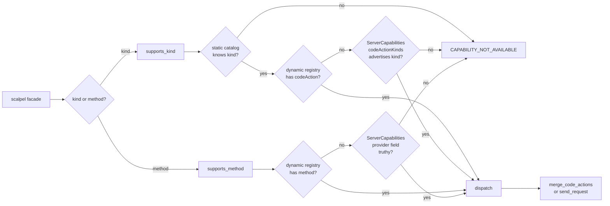
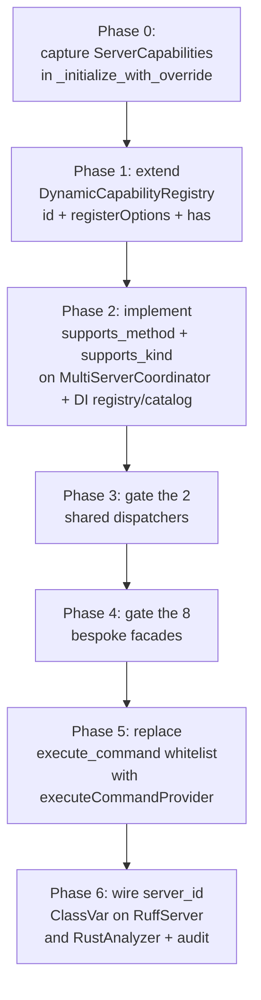

# Dynamic LSP Capability Discovery — Tech Specification

**Status**: DRAFT v2 (challenger fixes applied — pending final challenger sign-off)
**Authors**: AI Hive(R) (drafter + challenger pair, synthesizing parallel research)
**Date**: 2026-04-28
**Scope**: o2-scalpel `vendor/serena` submodule — facade dispatch + capability gating

---

## 1. Problem Statement

The o2-scalpel facade layer currently decides whether a Language Server can satisfy a refactor request by consulting a **static catalog** (`vendor/serena/src/serena/refactoring/capabilities.py`) built at import time from each adapter's hardcoded `_get_initialize_params(...)` declaration. The catalog answers "this strategy *should* support kind X." It cannot answer "this *running* server instance actually supports method X right now." The reference table at `reference_lsp_capability_gaps.md` records the canonical example: Pyright omits `implementationProvider` from its `ServerCapabilities`, so a future `scalpel_goto_implementation` facade routed through Pyright would dispatch into a `MethodNotFound` round-trip and surface a misleading `SYMBOL_NOT_FOUND` envelope to the LLM rather than a structured `CAPABILITY_NOT_AVAILABLE`.

The user asked two questions: (Q1) can we discover **which methods** an LSP supports at runtime, and (Q2) can we discover **what parameters** each method accepts at runtime so the harness can construct calls without per-method hardcoding. The three parallel research notes converge on a clean answer: Q1 is solvable with low effort by adopting the universal pattern used by VSCode, Neovim, Helix and eglot — capture `ServerCapabilities` from the `initialize` response and merge it with the existing `DynamicCapabilityRegistry`. Q2 is **not solvable at runtime** — the LSP 3.17 spec exposes no parameter-introspection RPC (only command *names* via `executeCommandProvider`), and the only schema source (`metaModel.json`) is a build-time artifact whose contents are already implicit in every facade's hardcoded call site (feasibility.md §B; spec.md §3).

"Good" looks like this: every LSP-routed facade asks `coordinator.supports_method(server_id, method)` (or `supports_kind(kind)` for code-actions) before dispatching; the gate considers both the static `ServerCapabilities` parse and live dynamic registrations; on `false` the facade returns `{status: "skipped", reason: "lsp_does_not_support_<method>", server_id: <id>}` instead of attempting the call. Empirically there are 16 facade callers that funnel through two shared dispatchers (`_dispatch_single_kind_facade` — 9 callers; `_python_dispatch_single_kind` — 7 callers) and 8 bespoke facade dispatch sites that call `coord.merge_code_actions` / `coord.merge_rename` directly outside those funnels. Gate insertion is concentrated in two helper bodies plus eight bespoke sites; the inlay-hint facade `scalpel_annotate_return_type` keeps its existing graceful-skip path (per feasibility.md §C and MF-5 below).

---

## 2. Decision

**We adopt Option A**: dynamic per-method support detection at dispatch time. We do **NOT** adopt dynamic param-schema reconstruction at runtime.

All three research notes converge: spec.md §3 documents that no LSP RPC exists for runtime schema introspection; landscape.md confirms that no surveyed mature client (VSCode, Neovim, Helix, eglot) introspects param schemas at runtime — every client hardcodes them; feasibility.md §B rates dynamic param-schema reconstruction "not feasible as a runtime concern" with "near-zero gain" because every facade already hardcodes the narrow param subset it needs. Conversely, all three notes rate Option A as **low-cost** (the foundation already exists) and **high-payoff** (it converts a misleading `SYMBOL_NOT_FOUND` into a structured `CAPABILITY_NOT_AVAILABLE` and unifies a per-server hardcoded execute-command whitelist with the spec's first-class `executeCommandProvider.commands` field).

---

## 3. Background

### 3.1 LSP capability advertisement

Per LSP 3.17 (spec.md §1, §2), the `initialize` response carries a `ServerCapabilities` object with one optional provider field per supported method family — `definitionProvider`, `implementationProvider`, `referencesProvider`, `codeActionProvider`, `renameProvider`, `inlayHintProvider`, `executeCommandProvider`, etc. Absence and `false` are normatively equivalent ("a missing property should be interpreted as an absence of the capability"). Several providers use a three-way union (`boolean | XOptions | XRegistrationOptions`) to carry richer metadata such as `codeActionKinds[]` (filterable subset for `codeActionProvider`), `prepareProvider: bool` (for `renameProvider`), or `commands[]` (for `executeCommandProvider`).

Servers MAY also opt into a method *after* initialization by sending `client/registerCapability` (a server-to-client request) with a `Registration { id, method, registerOptions }` triple. The `method` field is the full LSP method string; the `id` is needed only for later `client/unregisterCapability`. Approximately 37 textDocument/* and workspace/* methods support dynamic registration. The client must have advertised the matching `dynamicRegistration: true` ClientCapabilities sub-flag for the server to use it.

### 3.2 Current solidlsp state

Per landscape.md Part 1, the `SolidLanguageServer` base class (`vendor/serena/src/solidlsp/ls.py`) does **not** persist the initialize response. A handful of adapters (`rust_analyzer.py`, `nixd_ls.py`, `kotlin_language_server.py`, `typescript_language_server.py`, `luau_lsp.py`, `perl_language_server.py`) capture the response into a local `init_response` for one-shot startup `assert` checks; most (e.g. `basedpyright_server.py:144`) discard it entirely. There is no `self._server_capabilities` field anywhere in the inheritance tree. The single existing per-method gate is `SolidLanguageServer.supports_implementation_request()` at `ls.py:432`, a hardcoded `@classmethod` overridden per-adapter — the static-only equivalent of Helix's pattern E.

`DynamicCapabilityRegistry` (`vendor/serena/src/solidlsp/dynamic_capabilities.py`, shipped in v0.2.0 followup-01) is a thread-safe `dict[server_id, list[method_name]]` populated by `_handle_register_capability` (`ls.py:658`). It already surfaces in `LanguageHealth.dynamic_capabilities`. Its four current limitations are enumerated in §4.3 below.

### 3.3 What "Option A" means

Option A is dynamic **method-support** detection only. Concretely:

1. Capture the full `ServerCapabilities` dict from each `initialize` response and store it on the `SolidLanguageServer` instance.
2. Extend `DynamicCapabilityRegistry` to retain `id` and `registerOptions` (not only `method`) and to expose a `has(server_id, method) -> bool` predicate.
3. Add two predicates on `MultiServerCoordinator`:
   - `supports_method(server_id, method) -> bool` — **2-tier** runtime check (dynamic registry, then captured `ServerCapabilities`). Method-routing is a strict runtime question; the static catalog is keyed on code-action *kinds*, not raw LSP method strings, so it does not participate.
   - `supports_kind(language, kind) -> bool` — **3-tier** check (static catalog → dynamic registry for `textDocument/codeAction` → captured `ServerCapabilities.codeActionProvider.codeActionKinds`). Kinds are an offline taxonomy maintained by the catalog and refined at runtime by both dynamic registrations and the live caps view.
4. Insert a one-call gate into the two shared facade dispatchers and into each of the eight bespoke LSP-routed dispatch sites enumerated in §4.5.
5. Replace `_EXECUTE_COMMAND_WHITELIST` with a per-server `executeCommandProvider.commands` lookup.

This split is intentional and KISS-justified: methods and kinds answer different questions, and forcing a single 3-tier shape across both either inverts the catalog (kind→method) or under-uses it (method→nothing). See §4.4 for the implementations and §4.1 for the diagram.

Option A explicitly **does not** include param-schema reconstruction, replacement of the static catalog, or use of "send-and-catch" as primary detection. See §5.

---

## 4. Design

### 4.1 Architecture diagram

Two parallel branches — one for kind-routed gating (3-tier), one for method-routed gating (2-tier):



Both branches are short-circuit OR: a hit at any tier is sufficient. The dynamic registry is consulted before `ServerCapabilities` because dynamic registrations are strictly additive (a method or kind registered dynamically may have been absent from the init response). The static catalog appears only on the kind branch because it indexes code-action kinds; method strings have no catalog entry to consult.

### 4.2 ServerCapabilities capture

Capture point: the `_initialize_with_override` wrapper at `ls.py:601` is the single chokepoint for every LSP boot. The wrapper currently mutates the params; we extend it to also intercept the response. Per spec.md §1, `ServerCapabilities` is immutable for the lifetime of the connection (changes are signalled via dynamic registration, not by re-issuing initialize), so a single post-init store is sufficient.

```python
# in SolidLanguageServer.start_server, replacing the body of
# _initialize_with_override at ls.py:601-605

from typing import Any, Mapping

def _initialize_with_override(params: "InitializeParams") -> Any:
    mutated = self.override_initialize_params(cast(dict[str, Any], params))
    response = original_initialize(cast("InitializeParams", mutated))
    # New: capture capabilities once, before any subclass _start_server body runs.
    caps: Mapping[str, Any] = (response or {}).get("capabilities", {}) or {}
    self._server_capabilities = caps  # frozen for the connection's lifetime
    return response

self.server.send.initialize = _initialize_with_override  # type: ignore[method-assign]
```

The new field is declared on the base class:

```python
class SolidLanguageServer:
    _server_capabilities: Mapping[str, Any]  # populated by _initialize_with_override

    def server_capabilities(self) -> Mapping[str, Any]:
        """Return captured ServerCapabilities; empty dict if not yet initialized."""
        return getattr(self, "_server_capabilities", {})
```

Adapters that today capture `init_response` for one-shot assertions (e.g. `rust_analyzer.py:780-783`) MAY continue to do so — the new field is additive.

### 4.3 DynamicCapabilityRegistry extensions

Per landscape.md §1.4, the registry has four gaps. Each is addressed:

**a) Store `registerOptions` (incl. `documentSelector`).** The current `register(server_id, method)` discards `reg["registerOptions"]`. The schema becomes:

```python
from dataclasses import dataclass, field
from typing import Any, Mapping

@dataclass(frozen=True)
class DynamicRegistration:
    id: str
    method: str
    register_options: Mapping[str, Any] = field(default_factory=dict)

class DynamicCapabilityRegistry:
    _by_server: dict[str, dict[str, DynamicRegistration]]  # server_id -> id -> reg

    def register(
        self,
        server_id: str,
        registration_id: str,
        method: str,
        register_options: Mapping[str, Any] | None = None,
    ) -> None: ...
```

**b) Store registration `id` and support `unregisterCapability`.** Each `Registration` carries a unique `id` used by `client/unregisterCapability`. Storing it makes `_handle_unregister_capability` (`ls.py:686-688`, currently a no-op ACK) functional:

```python
def unregister(self, server_id: str, registration_id: str) -> None:
    """Remove a registration by id; idempotent."""
    self._by_server.get(server_id, {}).pop(registration_id, None)
```

**c) Add `has(server_id, method) -> bool` predicate.** The current `list_for(server_id)` forces O(n) `in` checks at every call site. The predicate becomes:

```python
def has(self, server_id: str, method: str) -> bool:
    """O(k) where k is the count of distinct methods, not registrations."""
    regs = self._by_server.get(server_id, {})
    return any(r.method == method for r in regs.values())
```

**d) Wire `server_id` ClassVar on `RuffServer` and `RustAnalyzer`.** Per landscape.md §1.4, only `BasedpyrightServer`, `PylspServer`, and `MarksmanServer` declare `server_id: ClassVar[str]`. Without it, `_handle_register_capability` silently drops the event because the `if sid:` guard fails. Add the ClassVar to both adapters:

```python
class RuffServer(SolidLanguageServer):
    server_id: ClassVar[str] = "ruff"

class RustAnalyzer(SolidLanguageServer):
    server_id: ClassVar[str] = "rust-analyzer"
```

### 4.4 supports_kind() / supports_method() API

The predicates are exposed on `MultiServerCoordinator` because facades already hold a `coord` reference; reaching through to individual `SolidLanguageServer` instances would invert the existing ownership.

#### 4.4.0 Coordinator dependencies

The current constructor (`vendor/serena/src/serena/refactoring/multi_server.py:762-775`) takes only `servers: dict[str, Any]` and stores `self._servers` and `self._action_edits`. Two new dependencies are required to satisfy the predicates:

- `dynamic_registry: DynamicCapabilityRegistry` — currently held by `ScalpelRuntime` (`scalpel_runtime.py:358-367`) as a process-global singleton. The coordinator MUST be DI'd at construction time rather than reaching into the singleton, so unit tests can inject a fresh empty registry without resetting global state.
- `catalog: CapabilityCatalog` — currently a module-level lazily-built artifact (`serena/refactoring/capabilities.py:88`). DI for the same reason.

Constructor change:

```python
class MultiServerCoordinator:
    def __init__(
        self,
        servers: dict[str, Any],
        *,
        dynamic_registry: DynamicCapabilityRegistry | None = None,
        catalog: CapabilityCatalog | None = None,
    ) -> None:
        # ... existing assert_servers_async_callable(...) preserved ...
        self._servers = dict(servers)
        self._action_edits: dict[str, dict[str, Any]] = {}
        self._dynamic_registry = (
            dynamic_registry
            if dynamic_registry is not None
            else ScalpelRuntime.instance().dynamic_capability_registry()
        )
        self._catalog = catalog if catalog is not None else build_capability_catalog()
```

Defaults preserve backward compatibility: callers that already construct `MultiServerCoordinator(servers=...)` (production: `scalpel_runtime.py:406`, `python_strategy.py:132`; tests: 37 existing call sites under `vendor/serena/test/`) keep working without edits. The two production sites SHOULD be updated to pass the runtime-held registry explicitly during Phase 2 to make the dependency graph visible at construction.

#### 4.4.1 supports_method (2-tier — runtime only)

```python
class MultiServerCoordinator:
    def supports_method(self, server_id: str, method: str) -> bool:
        """Two-tier runtime check for arbitrary LSP methods.

        Tier 1: dynamic registry (additive registrations from
                client/registerCapability).
        Tier 2: captured ServerCapabilities provider field.

        Static catalog is intentionally skipped for method-routed gating —
        the catalog indexes code-action kinds, not raw LSP method strings.
        Use supports_kind for the 3-tier code-action path.
        """
        # Tier 1: dynamic registration wins (additive).
        if self._dynamic_registry.has(server_id, method):
            return True
        # Tier 2: ServerCapabilities provider field.
        server = self._servers.get(server_id)
        if server is None:
            return False
        caps = server.server_capabilities()
        provider_key = _METHOD_TO_PROVIDER_KEY.get(method)
        if provider_key is None:
            return False  # unknown method; gate denies (custom methods see R7)
        provider = caps.get(provider_key)
        return bool(provider)  # truthy = supported (True or options object)
```

#### 4.4.2 supports_kind (3-tier — catalog + runtime)

```python
    def supports_kind(self, language: str, kind: str) -> bool:
        """Three-tier code-action kind gate.

        Tier 1: static catalog filters out kinds no strategy claims to
                support, before any per-server runtime check.
        Tier 2: dynamic registry — the responsible server must have
                textDocument/codeAction either statically advertised
                or dynamically registered.
        Tier 3: ServerCapabilities.codeActionProvider.codeActionKinds
                MUST contain the kind (or be omitted entirely, which per
                LSP 3.17 means 'any kind').
        """
        record = self._catalog.lookup(language, kind)
        if record is None:
            return False  # Tier 1 miss
        sid = record.source_server
        if not (
            self._dynamic_registry.has(sid, "textDocument/codeAction")
            or self._server_advertises_method(sid, "textDocument/codeAction")
        ):
            return False  # Tier 2 miss
        return self._server_advertises_kind(sid, kind)  # Tier 3
```

`_server_advertises_method` and `_server_advertises_kind` are private helpers that read `self._servers[sid].server_capabilities()` and apply the LSP 3.17 codeActionKinds rule (an omitted `codeActionKinds` list means "any kind" per spec — empty list means "none").

#### 4.4.3 Method → provider key table

`_METHOD_TO_PROVIDER_KEY` is the Python analogue of Neovim's `_request_name_to_server_capability` table (landscape.md §2.3) — a static `dict[str, str]` mapping method names to `ServerCapabilities` field keys. It lives in `solidlsp/capability_keys.py` (new module) and starts with the methods our facades actually call:

```python
_METHOD_TO_PROVIDER_KEY: dict[str, str] = {
    "textDocument/implementation":  "implementationProvider",
    "textDocument/definition":      "definitionProvider",
    "textDocument/references":      "referencesProvider",
    "textDocument/codeAction":      "codeActionProvider",
    "textDocument/rename":          "renameProvider",
    "textDocument/prepareRename":   "renameProvider",  # gated by RenameOptions.prepareProvider — see R5
    "textDocument/inlayHint":       "inlayHintProvider",
    "textDocument/foldingRange":    "foldingRangeProvider",
    "textDocument/documentSymbol":  "documentSymbolProvider",
    "textDocument/hover":           "hoverProvider",
    "workspace/symbol":             "workspaceSymbolProvider",
    "workspace/executeCommand":     "executeCommandProvider",
}
```

#### 4.4.4 Cache policy

The `ServerCapabilities` dict is captured once per server-instance and never re-read; the `DynamicCapabilityRegistry` is mutated by `_handle_register_capability` events under its existing lock. No additional caching layer is introduced — the predicates are already O(1) hash lookups.

### 4.5 Dispatcher gate insertion

Empirical call-graph (re-derived in v2 from `grep -n` against `vendor/serena/src/serena/tools/scalpel_facades.py`):

- `_dispatch_single_kind_facade` defined at line 1004 — **9** facade callers (lines 1142, 1185, 1344, 1394, 1435, 1480, 1521, 1570, 1626).
- `_python_dispatch_single_kind` defined at line 1766 — **7** facade callers (lines 1854, 1894, 1934, 1976, 2023, 2069, 2204).

Total funnel coverage: **16 of the LSP-routed facades**. Eight additional bespoke facade dispatch sites call `coord.merge_code_actions` or `coord.merge_rename` directly outside the funnels (table below).

The 3-line gate inserted at the head of each dispatcher:

```python
def _dispatch_single_kind_facade(
    coord: MultiServerCoordinator,
    *,
    language: str,
    kind: str,
    file: str,
    # ...
) -> dict[str, Any]:
    if not coord.supports_kind(language, kind):
        return _capability_not_available_envelope(language=language, kind=kind)
    actions = _run_async(coord.merge_code_actions(...))
    # ... unchanged below
```

The eight bespoke LSP-routed dispatch sites each receive an inline gate against the appropriate kind or method (line numbers verified against `^class Scalpel` and the `coord.merge_*` call inside each Tool body):

| Facade (Tool class) | Class span | Dispatch line | Gate target |
|---|---|---|---|
| `scalpel_split_file` (`ScalpelSplitFileTool`) | 182-358 | `scalpel_facades.py:303` | `coord.supports_kind("rust", "refactor.extract.module")` for the code-action arm; passes through to Rope when false |
| `scalpel_extract` (`ScalpelExtractTool`) | 359-501 | `scalpel_facades.py:447` | `coord.supports_kind(<lang>, kind)` where `kind` is the resolved extract kind |
| `scalpel_inline` (`ScalpelInlineTool`) | 502-618 | `scalpel_facades.py:568` | `coord.supports_kind(<lang>, kind)` where `kind` is the resolved inline kind |
| `scalpel_rename` (`ScalpelRenameTool`) | 619-859 | `scalpel_facades.py:689` | `coord.supports_method(<server_id>, "textDocument/rename")`; `prepareRename` gated only when `RenameOptions.prepareProvider` is true (see R5) |
| `scalpel_imports_organize` (`ScalpelImportsOrganizeTool`) | 860-1100 | `scalpel_facades.py:916` | `coord.supports_kind(<lang>, "source.organizeImports")` per file in the merge loop |
| `scalpel_tidy_structure` (`ScalpelTidyStructureTool`) | 1200-1301 | `scalpel_facades.py:1246` | `coord.supports_kind(<lang>, kind)` per kind in the `_TIDY_STRUCTURE_KINDS` loop |
| `scalpel_fix_lints` (`ScalpelFixLintsTool`) | 2079-2160 | `scalpel_facades.py:2116` | `coord.supports_kind("python", _FIX_LINTS_KIND)` |
| `scalpel_rename_heading` (`ScalpelRenameHeadingTool`) | 2552-2645 | `scalpel_facades.py:2602` | `coord.supports_method("marksman", "textDocument/rename")` |

Facades that never call an LSP (Population B per feasibility.md §C) receive **no gate** — the dynamic-capability mechanism is irrelevant to AST-rewrite and pure-text facades. Population B per the corrected v2 reading is:

- `scalpel_convert_to_async` (AST rewrite)
- `scalpel_convert_from_relative_imports` (AST rewrite)
- `scalpel_split_doc` (text)
- `scalpel_extract_section` (text)
- `scalpel_organize_links` (text)
- `scalpel_annotate_return_type` — **inlay-hint provider, gated already** by `_get_inlay_hint_provider() is None` returning a `status: "skipped"` envelope at `scalpel_facades.py:2351-2363`. Per feasibility.md §C this facade's existing graceful-skip path is the gate; adding `coord.supports_method("basedpyright", "textDocument/inlayHint")` would duplicate the check and contradict the canonical population assignment. The single LSP touch points (lines 2358 and 2389 — `lsp_ops.method = "textDocument/inlayHint"` accounting only) are downstream of the existing skip path, not new dispatch sites that need a gate. **No new gate.**

Total facade edits: **2 funnel dispatchers + 8 bespoke sites = 10 gate insertions**, plus zero edits in Population B.

### 4.6 executeCommand whitelist replacement

Today `scalpel_primitives.py:841` defines `_EXECUTE_COMMAND_WHITELIST: dict[str, frozenset[str]]` and `ScalpelExecuteCommandTool` (`scalpel_primitives.py:908`) consults it at line 935. Per spec.md §1 and §3, `ServerCapabilities.executeCommandProvider.commands` is the canonical, self-updating source of the same information.

Migration path:

1. Introduce `MultiServerCoordinator.execute_command_allowlist(server_id) -> frozenset[str]` that reads `caps.get("executeCommandProvider", {}).get("commands", []) or []`, falling back to the hardcoded whitelist when the field is absent or empty (defensive — older server versions may under-advertise).
2. Replace the two whitelist consultations in `ScalpelExecuteCommandTool` with calls to the new method.
3. Mark `_EXECUTE_COMMAND_WHITELIST` as the **fallback** (rename to `_EXECUTE_COMMAND_FALLBACK_ALLOWLIST`); do not delete it in this spec — it remains the safety net while we accumulate empirical evidence about which servers populate the field reliably.
4. Extend `DynamicCapabilityRegistry` to track newly-registered command IDs (`workspace/executeCommand` registrations carry `ExecuteCommandRegistrationOptions { commands: string[] }`) so the live allowlist grows when the server registers new commands post-init. This is the registry-extension point flagged in feasibility.md open question 2.

### 4.7 Error envelope

When a facade detects unsupported, it returns:

```python
{
    "status": "skipped",
    "reason": f"lsp_does_not_support_{method_or_kind}",
    "server_id": server_id,
    "language": language,
    "kind": kind_or_none,
}
```

This shape mirrors the existing `{status: "skipped", reason: "lsp_does_not_support_implementation"}` template documented in `reference_lsp_capability_gaps.md` ("How to apply" §1) and used by `scalpel_annotate_return_type` for its current graceful-skip path (feasibility.md §C, Population B note). The `status: "skipped"` value is distinct from `status: "error"` — facades report capability gaps as a degraded-but-expected outcome, not as a failure.

A helper `_capability_not_available_envelope(...)` is added to `scalpel_facades.py` so the two dispatchers and four bespoke facades emit the identical shape.

---

## 5. What we explicitly do NOT do

### 5.1 Param-schema reconstruction at runtime

Spec.md §3 is unambiguous: "the spec has **no mechanism** for a server to self-describe parameter schemas at runtime." The closest analogue is `executeCommandProvider.commands`, which lists command *names* only. The only schema source is `metaModel.json`, a build-time artifact published with each LSP version. Feasibility.md §B documents that even if we generated typed param classes from `metaModel.json` at build time, "the actual param shapes are well-known, narrow, and stable for the methods the facades use" — every facade already constructs the right dict literal inline (e.g. `ls.py:1495-1501` for `references`). Building this would be gold-plating that violates YAGNI from `CLAUDE.md`'s mandatory principles.

We revisit if and when the LSP spec adds runtime schema introspection, or if we accumulate ≥ 3 facades whose param construction would meaningfully benefit from generated types.

### 5.2 Send-and-catch as primary detection

Per spec.md §4, "send and catch" has four failure modes that disqualify it as the primary detection mechanism:

1. **Side-effects**: `textDocument/rename` and `workspace/applyEdit` mutate state — probing them is unsafe.
2. **Server divergence**: pylsp historically returned `-32600 InvalidRequest` (or null) instead of the spec-mandated `-32601 MethodNotFound`. Error codes are not reliably normalized.
3. **Latency**: every probe is a synchronous round-trip.
4. **Race with dynamic registration**: a method may be `MethodNotFound` immediately after init, then become available via `client/registerCapability` milliseconds later.

Send-and-catch is permitted as a **fallback** for legacy servers known to mis-populate `ServerCapabilities`, restricted to idempotent read methods (hover, definition, references). It is not the default path.

### 5.3 Replacing the static catalog wholesale

Per feasibility.md §D, the static catalog serves two purposes that dynamic detection cannot replace:

1. **Drift CI gate**: `pytest --update-catalog-baseline` catches when a strategy's `code_action_allow_list` diverges from what adapters actually advertise. A dynamic registry observes only what a running server *does* send, never what it *should* send.
2. **Cold-start LLM routing**: `scalpel_capabilities_list` and `scalpel_capability_describe` expose the catalog before any server starts. Dynamic-only would force a server boot before the LLM could reason about which facade to call.

The architecture is **static catalog as aspiration + dynamic runtime as availability gate**. The two coexist; the dynamic gate is the runtime check, the static catalog is the schema/baseline.

---

## 6. Migration path



| Phase | Scope | Files touched | Test additions | Exit criteria |
|---|---|---|---|---|
| 0 | Capture caps in base class | `solidlsp/ls.py` | unit: caps populated after init; immutable thereafter | every adapter exposes `server_capabilities()` returning a non-empty dict for live servers |
| 1 | Extend registry | `solidlsp/dynamic_capabilities.py`, `solidlsp/ls.py` (handlers) | unit: `register`/`unregister`/`has`; round-trip with `id` | all existing 8 dynamic-capability tests stay green; `_handle_unregister_capability` is no longer a no-op |
| 2 | Predicates + DI on coordinator | `solidlsp/capability_keys.py` (new), `serena/refactoring/multi_server.py`, `serena/tools/scalpel_runtime.py:406`, `serena/refactoring/python_strategy.py:132` | unit: each tier of `supports_method` (2-tier) + `supports_kind` (3-tier) against catalog | predicates return the correct answer for the Pyright `implementationProvider` regression case (synthetic adapter); both production constructor sites pass `dynamic_registry=` and `catalog=` explicitly; the 37 existing test constructor sites in `vendor/serena/test/` still construct via the backward-compat default args |
| 3 | Gate shared dispatchers | `serena/tools/scalpel_facades.py` (`_dispatch_single_kind_facade` line 1004 + `_python_dispatch_single_kind` line 1766) | integration: synthetic LSP missing kind X returns `CAPABILITY_NOT_AVAILABLE` envelope | all 16 dispatcher-routed facades emit the new envelope on negative gate; existing positive paths unchanged |
| 4 | Gate bespoke facades | `serena/tools/scalpel_facades.py` (lines 303, 447, 568, 689, 916, 1246, 2116, 2602) | integration: per-facade negative case (8 cases) | 8 bespoke facades behave identically to dispatcher-routed peers when gate fires |
| 5 | execute_command refactor | `serena/tools/scalpel_primitives.py` (lines 841, 908-955), `serena/refactoring/multi_server.py` | unit: `executeCommandProvider.commands` parsed; fallback when absent; dynamic registration appends | `_EXECUTE_COMMAND_WHITELIST` renamed to `_FALLBACK`; live allowlist used when `caps` populated |
| 6 | Adapter ClassVar audit | `solidlsp/language_servers/ruff_server.py`, `solidlsp/language_servers/rust_analyzer.py` (and audit all 12+ adapters) | unit: every adapter that may receive dynamic registrations declares `server_id`; **drift CI**: existing 391/1-skip baseline catalog drift test must pass unchanged | grep confirms no `class.*Server.*:` in `language_servers/` is missing the ClassVar (or is documented as exempt); catalog content byte-identical to pre-Phase-6 baseline |

Each phase is a single PR / commit-plus-push under git-flow per `CLAUDE.md` §Git Workflow. Phases 0-2 are infrastructure; only at Phase 3 does any user-visible behavior change.

---

## 7. Test strategy

**Unit tests** (under `vendor/serena/test/solidlsp/` and `vendor/serena/test/serena/refactoring/`):

- `test_dynamic_capabilities.py` — extend with: `register` stores `id` + `register_options`; `unregister` removes by `id`; `has(sid, method)` returns the right boolean across registered/unregistered/never-registered cases.
- `test_capability_predicates.py` (new) — `MultiServerCoordinator.supports_method` returns `True` when dynamic registry has it; returns `True` when `ServerCapabilities` advertises it; returns `False` when neither does; `supports_kind` consults static catalog first.
- `test_capability_keys.py` (new) — `_METHOD_TO_PROVIDER_KEY` covers every method called by any facade (test enumerates facades and asserts the table is exhaustive).

**Integration tests** (under `vendor/serena/test/serena/tools/`):

- `test_facade_capability_gate.py` (new) — extends the existing `_FakeServer` test double in `vendor/serena/test/spikes/conftest.py:171` (already consumed by `MultiServerCoordinator` per `multi_server.py:749-750`) with a new constructor field `server_capabilities: dict[str, Any] = {}` and a `server_capabilities()` accessor mirroring the production `SolidLanguageServer` API. The test parameterizes the fake's caps to omit one provider per case (e.g. `{"renameProvider": False}`) and asserts each of the two shared dispatchers emits the `{status: "skipped", reason: "lsp_does_not_support_<kind>", ...}` envelope and **does not** call `merge_code_actions`. Reusing `_FakeServer` (DRY per CLAUDE.md) avoids inventing a parallel test scaffold.
- One per bespoke facade (8 tests, one per row of the §4.5 table): confirm the inline gate fires correctly.

**Regression**: the existing facade integration tests must stay green — the new envelope is only produced on negative gate; positive-gate paths are byte-for-byte unchanged. The 391/1-skip baseline catalog drift test MUST pass unchanged (Phase 6 audit MUST NOT alter catalog content; this is also Phase 6's exit criterion in §6).

**E2E**: add one E2E case to `vendor/serena/test/e2e/` that boots Pyright (not basedpyright) against a fixture and confirms a `scalpel_goto_implementation`-style call returns the structured `CAPABILITY_NOT_AVAILABLE` envelope rather than a `MethodNotFound` JSON-RPC error. Skip cleanly if Pyright is not installed (consistent with existing E2E skip protocol).

---

## 8. Risks and open questions

**R1 — Under-advertising servers (false negatives).** Some servers under-declare `ServerCapabilities` even though the method works. Per feasibility.md §3 risk note, an older `pylsp-rope` build may execute a code-action kind without listing it in `codeActionKinds`. **Mitigation**: each gated facade exposes a `force: bool = False` arg that skips the gate; the dispatcher gate is opt-in per kind via a per-strategy `gated_kinds: frozenset[str]` (defaults to all). Empirically populate the gate set strategy-by-strategy.

**R2 — `executeCommandProvider.commands` may be empty for some servers.** Mitigation in §4.6: keep `_EXECUTE_COMMAND_FALLBACK_ALLOWLIST` until empirically confirmed unnecessary per server.

**R3 — Dynamic registration race after init.** Per spec.md §4 failure mode 4, a method may register milliseconds after init; if a facade dispatch races the registration, the gate may incorrectly deny. Mitigation: `_handle_register_capability` already runs synchronously on the message thread; facade dispatch happens on the call thread. The race window is small but real. The symmetric direction also applies — `client/unregisterCapability` arriving between gate-check and dispatch can cause the gate to allow a method the server has just unregistered; the downstream JSON-RPC `MethodNotFound` provides a backstop in that direction. Document both directions; revisit only if observed in practice.

**R4 — Catalog ↔ dynamic skew (resolved).** Should the catalog gain a `requires_dynamic_check: bool` flag per record (feasibility.md open question 3) so the LLM knows availability is session-dependent? **NO for v1, YES eventually but as a separate follow-up.** `scalpel_workspace_health` already exposes `dynamic_capabilities`; the LLM cross-references. Adding a per-record flag would duplicate that signal in a second place (DRY violation per CLAUDE.md). When a concrete LLM-routing failure surfaces, revisit and bias toward enriching `scalpel_capability_describe`'s output rather than mutating the catalog schema.

**R5 — `prepareRename` sub-capability.** `RenameOptions.prepareProvider` is a nested boolean inside `renameProvider`. The `_METHOD_TO_PROVIDER_KEY` table maps both `textDocument/rename` and `textDocument/prepareRename` to `renameProvider`. For `textDocument/prepareRename`, `supports_method` MUST inspect the options object for the `prepareProvider` boolean rather than relying on the outer field's truthiness. v1 inlines this single sub-capability special case in `supports_method`; if a second nested-options method appears (e.g. `executeCommandProvider.commands` membership for a specific command name), v2 generalizes via a `_METHOD_TO_PROVIDER_PATH` (path-of-keys) table modelled on Neovim's `_request_name_to_server_capability` lookup.

**R6 — `documentSelector`-scoped registrations.** Per landscape.md §1.4 and spec.md §1, dynamic registrations MAY be scoped to specific file types via `documentSelector`. The v1 registry stores `register_options` (groundwork laid) but the `has(sid, method)` predicate ignores selector. Out of scope for this spec per §9; revisit when a concrete facade requires per-document gating.

**R7 — Custom server methods (rust-analyzer/*).** Per spec.md §3, custom methods are not in `metaModel.json` and have no provider field in `ServerCapabilities`. Our `supports_method` gate denies unknown methods by default (the `_METHOD_TO_PROVIDER_KEY` lookup returns `None`). The four custom-method facades (`scalpel_expand_macro`, `scalpel_verify_after_refactor` × 2 RPCs) MUST be reached via a per-server custom-method allowlist. The coordinator gains `register_custom_methods(server_id: str, methods: frozenset[str])` populated by each adapter at construction; `supports_method` consults this allowlist as a synthetic Tier 0 before the dynamic-registry tier. Wiring: `RustAnalyzer.__init__` registers `frozenset({"rust-analyzer/expandMacro", "rust-analyzer/runFlycheck", "experimental/runnables"})`. The mechanism is in scope for this spec; the per-adapter call sites are landed in Phase 4 alongside the bespoke gate inserts.

**R8 — Catalog rebuild from live data.** Open question from landscape.md §5: should `build_capability_catalog` be re-runnable post-init from live server capabilities, or remain static? Static for now (cold-start LLM routing depends on import-time availability); live drift surfaces via `scalpel_workspace_health` instead.

**R9 — TRIZ ideal-final-result considered + rejected.** TRIZ's ideal-final-result for this design would fold the dynamic registry into a live ServerCapabilities view: capture caps at init, apply `client/registerCapability` deltas to the same dict over the connection's lifetime, and have `supports_method` reduce to a single dict lookup. This collapses two runtime sources of truth into one. We reject this for v1 because the existing `DynamicCapabilityRegistry` (shipped in v0.2.0 followup-01) is already in production with 8 tests and `scalpel_workspace_health` consumers; mutating ServerCapabilities in place would violate LSP 3.17's "ServerCapabilities is immutable for the connection lifetime" guarantee that downstream code (e.g. `executeCommandProvider.commands` snapshot) depends on. Revisit if a concrete consumer of the unified view emerges; the data is already addressable via the two predicates without the merge.

**R10 — `pylsp` vs `pylsp-base` server-id naming.** The existing `PylspServer` adapter declares `server_id: ClassVar[str] = "pylsp-base"` (`pylsp_server.py:44`); spec examples for `RuffServer` and `RustAnalyzer` use the bare tokens `"ruff"` and `"rust-analyzer"`. Phase 6 audit MUST NOT silently rename `"pylsp-base"` → `"pylsp"` because health-report consumers and the dynamic-capability registry's per-server map already key on the existing token. Naming policy: `server_id` matches the adapter's existing declaration verbatim; new adapters added under this spec follow the existing convention (lowercase, hyphenated, distinct per binary).

---

## 9. Future work (explicitly out of scope for this spec)

- **Param-schema reconstruction.** Revisit if the LSP spec adds runtime introspection or if ≥ 3 facades would meaningfully benefit from generated typed classes.
- **Custom-method support detection** (e.g. `rust-analyzer/expandMacro`). These have no `metaModel.json` entry and no `ServerCapabilities` provider field. The per-server custom-method allowlist (R7) is the suggested mechanism, deferred to a follow-up.
- **Per-document-selector capability gating.** v1 registry stores `register_options.documentSelector` but the predicate is server-global. Future work: refine the predicate to take a `document_uri` and check the selector.
- **Catalog re-derivation from live server data.** Opportunity to detect stale static catalog rows by diffing against live `ServerCapabilities` post-init. Belongs in a `scalpel_capability_drift_report` primitive, not the dispatch path.
- **`metaModel.json` build-time codegen.** Out per §5.1, but if param-schema accuracy ever becomes a concern, the path is well-understood (pull `metaModel.json` → generate typed dataclasses; same approach as `vscode-languageclient`).

---

## 10. References

**Research notes (synthesis inputs)**:

- `/Volumes/Unitek-B/Projects/o2-scalpel/docs/superpowers/research/2026-04-28-dynamic-lsp-capabilities/spec.md` — Agent A, LSP 3.17 spec analysis.
- `/Volumes/Unitek-B/Projects/o2-scalpel/docs/superpowers/research/2026-04-28-dynamic-lsp-capabilities/landscape.md` — Agent B, solidlsp current state + 4-client landscape survey.
- `/Volumes/Unitek-B/Projects/o2-scalpel/docs/superpowers/research/2026-04-28-dynamic-lsp-capabilities/feasibility.md` — Agent C, feasibility against the 33 facades + 11 primitives surface.

**Project context**:

- `/Users/alexanderfedin/.claude/projects/-Volumes-Unitek-B-Projects-o2-scalpel/memory/reference_lsp_capability_gaps.md` — known per-LSP method gaps; motivating Pyright/`implementationProvider` example.
- `/Volumes/Unitek-B/Projects/o2-scalpel/CLAUDE.md` — project conventions (KISS, SOLID, DRY, YAGNI, TRIZ).

**Source files cited**:

- `/Volumes/Unitek-B/Projects/o2-scalpel/vendor/serena/src/solidlsp/ls.py` — base class hooks: `_initialize_with_override` (line 601), `_handle_register_capability` (line 658), `supports_implementation_request` (line 432), `_handle_unregister_capability` (line 686).
- `/Volumes/Unitek-B/Projects/o2-scalpel/vendor/serena/src/solidlsp/dynamic_capabilities.py` — `DynamicCapabilityRegistry`.
- `/Volumes/Unitek-B/Projects/o2-scalpel/vendor/serena/src/serena/refactoring/capabilities.py` — static catalog factory.
- `/Volumes/Unitek-B/Projects/o2-scalpel/vendor/serena/src/serena/tools/scalpel_facades.py` — `_dispatch_single_kind_facade` (line 1004), `_python_dispatch_single_kind` (line 1766), bespoke facade dispatch sites (lines 303, 447, 568, 689, 916, 1246, 2116, 2602; see §4.5 table).
- `/Volumes/Unitek-B/Projects/o2-scalpel/vendor/serena/src/serena/tools/scalpel_primitives.py` — `_EXECUTE_COMMAND_WHITELIST` (line 841), `ScalpelExecuteCommandTool` (line 908).

**LSP spec**:

- LSP 3.17 — Initialize / ServerCapabilities — https://microsoft.github.io/language-server-protocol/specifications/lsp/3.17/specification/#initialize
- LSP 3.17 — client/registerCapability — https://microsoft.github.io/language-server-protocol/specifications/lsp/3.17/specification/#client_registerCapability
- LSP 3.17 metaModel.json — https://raw.githubusercontent.com/microsoft/language-server-protocol/gh-pages/_specifications/lsp/3.17/metaModel/metaModel.json

---

## Changelog

- **v1 → v2 (2026-04-28)**:
  - **MF-1**: Re-derived bespoke-facade line citations empirically from `grep -n "^class Scalpel" scalpel_facades.py` plus per-class inspection of `coord.merge_*` calls. The §4.5 table now lists 8 bespoke dispatch sites (303, 447, 568, 689, 916, 1246, 2116, 2602) — not 4 — and identifies the enclosing Tool class span for each. Funnel caller counts corrected: 9 + 7 = 16 (not 12 + 10 = 22). §6 P3/P4 phase rows updated to match.
  - **MF-2**: Replaced fictional `MultiServerCoordinator` attribute names (`self._servers_by_id`, `self._dynamic_registry`, `self._catalog`) with the real attribute (`self._servers` per `multi_server.py:774`). Added §4.4.0 "Coordinator dependencies" subsection specifying the constructor extension (`dynamic_registry: DynamicCapabilityRegistry | None = None`, `catalog: CapabilityCatalog | None = None`), defaulting behavior, and the two production call sites that need updating (`scalpel_runtime.py:406`, `python_strategy.py:132`) plus the 37 backward-compatible test sites.
  - **MF-3**: Resolved 3-tier vs catalog-only inconsistency by choosing **option (b)** per challenger recommendation: `supports_method` is 2-tier (dynamic registry → caps); `supports_kind` is 3-tier (catalog → dynamic registry for `textDocument/codeAction` → caps `codeActionKinds`). §3.3, §4.1 diagram (now two parallel branches), and §4.4 code/prose all aligned.
  - **MF-4**: Replaced "synthetic LSP fixture" hand-wave in §7 with reuse of the existing `_FakeServer` test double at `vendor/serena/test/spikes/conftest.py:171`, extended with a `server_capabilities` field plus accessor — preserves DRY per CLAUDE.md and avoids inventing parallel test scaffolding.
  - **MF-5**: Reconciled §4.5 with feasibility.md §C — `scalpel_annotate_return_type` is moved to the explicit Population B "no gate" list. Its existing graceful-skip via `_get_inlay_hint_provider() is None` (`scalpel_facades.py:2351-2363`) IS the gate; adding a `coord.supports_method` call would duplicate the check.
  - **SC-1**: Added `unregisterCapability` race direction to R3 (false-positive at gate; downstream `MethodNotFound` is the backstop).
  - **SC-2**: Added R9 explicitly considering and rejecting the TRIZ ideal-final-result (folding registry into a live caps view) — preserves LSP 3.17's caps-immutability guarantee.
  - **SC-3**: Added R10 documenting the `pylsp-base` vs `pylsp` server-id naming policy (existing tokens preserved verbatim through Phase 6 audit).
  - **SC-4**: Promoted drift-CI green-light to Phase 6 exit criterion in §6 table.
  - **R4**: Resolved per challenger verdict (NO for v1, revisit when concrete LLM-routing failure surfaces).
  - **R5**: Decisive (inline single special case for `prepareRename` in v1, generalize when a second nested-options method appears) — replaces "Open" hedge.
  - **R7**: Strengthened to a v1 commitment (per-server custom-method allowlist via `register_custom_methods`) rather than a recommendation.
