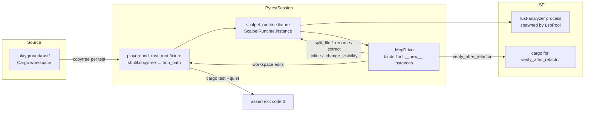
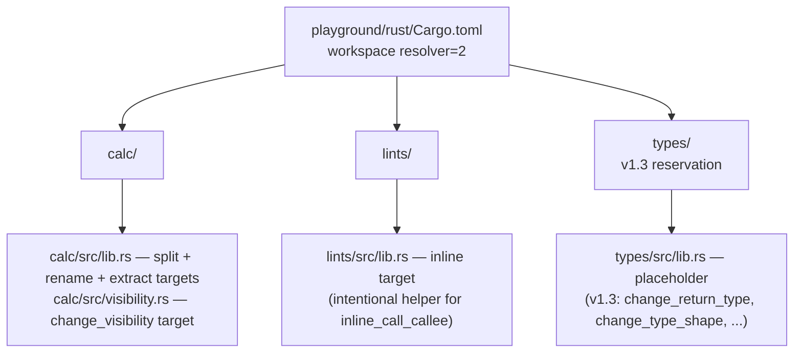
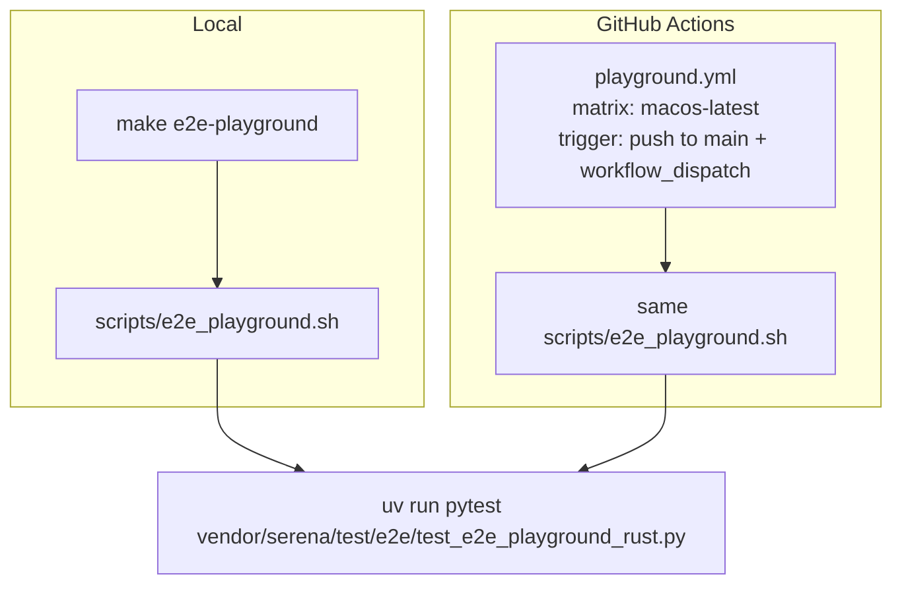
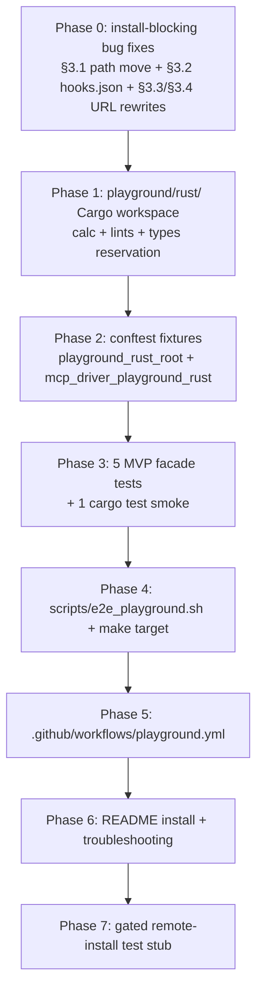

# Rust Plugin E2E Playground — Tech Specification

**Status**: DRAFT v1 (drafter pass — pending challenger review)
**Authors**: AI Hive(R) (drafter + challenger pair, synthesizing parallel research)
**Date**: 2026-04-28
**Version target**: v1.2.2

---

## 1. Problem Statement

Today, every form of "install verification" in this repository exercises a **local filesystem path**, never the published GitHub install path that real users follow. `scripts/stage_1i_uvx_smoke.sh` uses `uvx --from "${REPO_ROOT}/vendor/serena"`; the entire Stage 2B/3 E2E suite imports tool classes directly via `Tool.__new__()` and never loads `.mcp.json`; the parent repo has zero CI ([patterns.md §1, §4, §7](../research/2026-04-28-rust-plugin-e2e-playground/patterns.md)). The only "is this installable?" signal we have is the next user opening an issue.

A direct read of the on-disk plugin tree against the documented Claude Code install flow ([install-mechanics.md §1–§5](../research/2026-04-28-rust-plugin-e2e-playground/install-mechanics.md)) confirms that the "happy path" `claude /plugin marketplace add o2alexanderfedin/o2-scalpel` followed by `/plugin install o2-scalpel-rust@o2-scalpel` will fail today against the published repo for at least four independent reasons (§3 below). None of these failures are visible to any existing test, Makefile target, or CI workflow.

This specification defines a **Rust plugin E2E playground**: a fixture workspace plus a programmatic E2E test that boots the real `ScalpelRuntime` against real LSP processes, exercises five MVP Rust facades against a non-trivial Cargo workspace, and runs in both `make e2e-playground` (developer loop) and a new GitHub Actions workflow (regression net). The spec is scoped to v1.2.2 — a non-breaking patch on top of the v1.2 installer milestone — and explicitly defers PyPI publication, Linux/Windows matrix, and the remaining seven Rust facades to v1.3.

---

## 2. Decision Summary

| Axis | Decision | Source |
|---|---|---|
| Hosting | Subdirectory `playground/rust/` in the parent repo | [playground-design.md §1](../research/2026-04-28-rust-plugin-e2e-playground/playground-design.md) — score 4/5 vs all alternatives; reuses submodule + CI for free |
| Driver | Replicate `_McpDriver` + `ScalpelRuntime` from `vendor/serena/test/e2e/conftest.py` | [playground-design.md §3, TL;DR](../research/2026-04-28-rust-plugin-e2e-playground/playground-design.md); no Claude CLI auth, no MCP stdio layer, deterministic |
| CI surface | Shared `scripts/e2e_playground.sh` invoked from both `make e2e-playground` and `.github/workflows/playground.yml` | [playground-design.md §4](../research/2026-04-28-rust-plugin-e2e-playground/playground-design.md) — single source of test logic |
| Reset policy | Per-test `shutil.copytree` into pytest `tmp_path` (target/ stripped) | [playground-design.md §5](../research/2026-04-28-rust-plugin-e2e-playground/playground-design.md); matches the existing `calcrs_e2e_root` pattern at `vendor/serena/test/e2e/conftest.py:129–137` |
| MVP scope (v1.2.2) | Five facades: `scalpel_split_file`, `scalpel_rename`, `scalpel_extract`, `scalpel_inline`, `scalpel_change_visibility` | [playground-design.md §2](../research/2026-04-28-rust-plugin-e2e-playground/playground-design.md); remaining seven Rust facades deferred to v1.3 |
| Remote-install gate | New env var `O2_SCALPEL_TEST_REMOTE_INSTALL=1`, off by default until PyPI publication ships in v1.3 | [playground-design.md §3 step 2, §7](../research/2026-04-28-rust-plugin-e2e-playground/playground-design.md) |
| CI matrix | `macos-latest` only at v1.2.2; `ubuntu-latest` deferred to v1.3 | [playground-design.md §4](../research/2026-04-28-rust-plugin-e2e-playground/playground-design.md) — minimizes rustup complexity |
| Suggested release tag | `v1.2.2-playground-rust-complete` | [playground-design.md §7](../research/2026-04-28-rust-plugin-e2e-playground/playground-design.md) |

---

## 3. Pre-existing install-blocking bugs to fix BEFORE the playground works

The four bugs below were identified by Agents A and B and **independently verified** by direct file reads during this drafter pass. Each is reproduced here with the verified evidence and the prescribed fix.

### 3.1 `marketplace.json` lives at the wrong path (BLOCKER)

**Verified state** (drafter Read): the catalog file lives at `/Volumes/Unitek-B/Projects/o2-scalpel/marketplace.json`. The directory `/Volumes/Unitek-B/Projects/o2-scalpel/.claude-plugin/` does not exist.

**Required path** ([install-mechanics.md §2](../research/2026-04-28-rust-plugin-e2e-playground/install-mechanics.md)): `<repo-root>/.claude-plugin/marketplace.json`. The first command of the install flow — `/plugin marketplace add o2alexanderfedin/o2-scalpel` — will fail with `File not found: .claude-plugin/marketplace.json` (failure F1 in install-mechanics §4).

**Fix**: move (`git mv`) `marketplace.json` → `.claude-plugin/marketplace.json`. Update `scripts/_restamp-banners` (and any generator emitter — see [patterns.md §3](../research/2026-04-28-rust-plugin-e2e-playground/patterns.md)) so future regeneration writes to the new path. Update the `make generate-plugins` workflow accordingly. Do **not** keep a copy at the old root location — duplicate sources of truth will drift and violate the project DRY principle (`CLAUDE.md`).

### 3.2 `hooks/hooks.json` is missing (BLOCKER for hook execution)

**Verified state** (drafter Read of `o2-scalpel-rust/hooks/`): only `verify-scalpel-rust.sh` exists; no `hooks.json` is present.

**Effect** ([install-mechanics.md §5](../research/2026-04-28-rust-plugin-e2e-playground/install-mechanics.md), failure F4): without `hooks/hooks.json`, Claude Code never discovers or runs `verify-scalpel-rust.sh`. The shell script silently never fires.

**Secondary defect**: `verify-scalpel-rust.sh:8` exits with code `1` on missing `rust-analyzer`. Per [install-mechanics.md §5](../research/2026-04-28-rust-plugin-e2e-playground/install-mechanics.md), exit code `2` is required for a blocking SessionStart error. Today, even if `hooks.json` were present, a missing LSP would surface as a non-blocking warning rather than a hard block.

**Fix**:
1. Emit `o2-scalpel-rust/hooks/hooks.json` from the `o2-scalpel-newplugin` generator with the canonical SessionStart binding shown in [install-mechanics.md §5](../research/2026-04-28-rust-plugin-e2e-playground/install-mechanics.md):
   ```json
   { "hooks": { "SessionStart": [ { "hooks": [
     { "type": "command",
       "command": "${CLAUDE_PLUGIN_ROOT}/hooks/verify-scalpel-rust.sh" }
   ] } ] } }
   ```
2. Change `verify-scalpel-rust.sh:8` from `exit 1` to `exit 2`.
3. Apply both changes for python and markdown plugins to keep generator output uniform.

### 3.3 `.mcp.json` exists but points to a non-existent repo (BLOCKER for MCP tools)

**Reconciliation of agent disagreement**: Agent A reported `.mcp.json` exists with `git+https://github.com/o2services/o2-scalpel.git#subdirectory=vendor/serena`; Agent B reported "no `.mcp.json` present". Drafter verification confirms **Agent A is correct on existence and content**. The file is at `/Volumes/Unitek-B/Projects/o2-scalpel/o2-scalpel-rust/.mcp.json` and contains:

```json
{
  "mcpServers": { "scalpel-rust": {
    "command": "uvx",
    "args": [ "--from",
      "git+https://github.com/o2services/o2-scalpel.git#subdirectory=vendor/serena",
      "serena-mcp", "--language", "rust" ],
    "env": {}
  } }
}
```

Agent B's downstream concern is nonetheless valid: Agent B inferred "no `.mcp.json`" from the absence of submodule fetching during plugin install. Both observations fold into the same root issue:

- The `git+https://...` URL targets `o2services/o2-scalpel` which **does not exist** (see §3.4).
- The `#subdirectory=vendor/serena` fragment requires the submodule to be present in the cloned tree. Per [install-mechanics.md §4 F8](../research/2026-04-28-rust-plugin-e2e-playground/install-mechanics.md), `git+URL` installs do **not** recurse submodules, so even after the URL owner is fixed (§3.4) the install will still fail with `no module named serena`.

**Fix**: this is a two-phase repair.
- **Short term (v1.2.2, what this spec ships)**: rewrite the URL to the correct owner (`o2alexanderfedin/o2-scalpel`) AND publish the engine as a release-tag-pinned `git+URL` that points directly at the engine repository (`o2alexanderfedin/o2-scalpel-engine`, per [Serena fork rename memory](../../../../.claude/projects/-Volumes-Unitek-B-Projects-o2-scalpel/memory/project_serena_fork_renamed.md)) instead of `vendor/serena` inside the parent repo. This avoids the submodule recursion gap entirely.
- **Long term (v1.3)**: publish to PyPI; rewrite `.mcp.json` to `uvx --from o2-scalpel-engine` (no `git+`). The remote-install E2E test (§4.5) graduates from gated to default-on at that point.

### 3.4 GitHub owner mismatch across files (BLOCKER, root cause of §3.3)

**Verified state** (drafter Bash):

```
$ git -C /Volumes/Unitek-B/Projects/o2-scalpel remote -v
origin  https://github.com/o2alexanderfedin/o2-scalpel.git (fetch)
origin  https://github.com/o2alexanderfedin/o2-scalpel.git (push)
```

The actual remote is `o2alexanderfedin/o2-scalpel`. Three files reference the wrong owner `o2services`:

| File | Field | Current | Required |
|---|---|---|---|
| `marketplace.json` | `metadata.repository`, `metadata.homepage` | `https://github.com/o2services/o2-scalpel` | `https://github.com/o2alexanderfedin/o2-scalpel` |
| `o2-scalpel-rust/.claude-plugin/plugin.json` | `homepage`, `repository` | `https://github.com/o2services/o2-scalpel` | same |
| `o2-scalpel-rust/.mcp.json` | `mcpServers.scalpel-rust.args[1]` | `git+https://github.com/o2services/o2-scalpel.git#subdirectory=vendor/serena` | per §3.3 long term; interim: `o2alexanderfedin` owner + the engine repo |

**Fix**: `git grep -l "o2services/o2-scalpel"` and rewrite all hits in a single commit. Update the `o2-scalpel-newplugin` generator templates so regeneration does not re-introduce the wrong owner (verify by running `make generate-plugins` post-fix and confirming a clean `git diff`).

---

## 4. Design

### 4.1 Architecture



### 4.2 Playground content

The playground SHALL live at `/Volumes/Unitek-B/Projects/o2-scalpel/playground/rust/` and SHALL be a Cargo workspace pinned to `resolver = "2"`, `rust-version = "1.74"`, with `Cargo.lock` committed (no `cargo update` shall run during E2E execution — [playground-design.md §2](../research/2026-04-28-rust-plugin-e2e-playground/playground-design.md)).

For v1.2.2 the workspace SHALL contain three crates. Only `calc/` and `lints/` carry executable test bodies for v1.2.2; `types/` is a structural placeholder reserved for v1.3 facade coverage:



Per-facade fixture targets (subset of [playground-design.md §2](../research/2026-04-28-rust-plugin-e2e-playground/playground-design.md), restricted to v1.2.2 MVP):

| Facade | Fixture target |
|---|---|
| `scalpel_split_file` | `calc/src/lib.rs` — split inline modules `ast`/`parser`/`eval` into siblings |
| `scalpel_rename` | `calc/src/lib.rs` — rename `eval` → `evaluate` across the workspace |
| `scalpel_extract` | `calc/src/lib.rs` — extract arithmetic branch into helper |
| `scalpel_inline` | `lints/src/lib.rs` — inline a single-call helper |
| `scalpel_change_visibility` | `calc/src/visibility.rs` — promote `pub(super)` → `pub` |

The `target/` directory is `.gitignore`-d AND explicitly stripped by the per-test fixture (§4.3) — load-bearing per [playground-design.md §5](../research/2026-04-28-rust-plugin-e2e-playground/playground-design.md): stale incremental build data from a previous path causes non-deterministic rust-analyzer code-action results.

### 4.3 E2E test driver

The E2E test SHALL live at `/Volumes/Unitek-B/Projects/o2-scalpel/vendor/serena/test/e2e/test_e2e_playground_rust.py`. It SHALL:

1. Reuse `scalpel_runtime` (session-scoped) and `_McpDriver` from `vendor/serena/test/e2e/conftest.py:148–212`, exactly as the existing 16 E2E modules do.
2. Add one new function-scoped fixture `playground_rust_root(tmp_path)` modelled on `calcrs_e2e_root` (`conftest.py:129–137`) with `target/` stripped post-copy.
3. Add one new fixture `mcp_driver_playground_rust(scalpel_runtime, playground_rust_root) -> _McpDriver` that mirrors `mcp_driver_rust` (`conftest.py:281–286`) — the only delta is the project-root binding.
4. Use the `pytest.skip` discipline already in place (`_which_or_skip` for `cargo` and `rust-analyzer` — `conftest.py:91–96, 100–111`) so the test no-ops cleanly on hosts without the LSP.

The fixture additions SHALL go in `vendor/serena/test/e2e/conftest.py` (single conftest) — no new conftest file. Fixture path constant added at the top of conftest:

```python
PLAYGROUND_RUST_BASELINE = Path("/Volumes/Unitek-B/Projects/o2-scalpel/playground/rust")
```

Note: this absolute path will be replaced with `Path(__file__).resolve().parents[3] / "playground" / "rust"` (i.e., walk up from `vendor/serena/test/e2e/conftest.py` to the parent repo root) — keeping the conftest portable across developer checkouts.

### 4.4 Per-facade test outline

Each test follows the same five-step shape (clone → invoke → assert applied → assert workspace edit → optional `cargo test`):

```python
def test_playground_rust_split(mcp_driver_playground_rust, playground_rust_root):
    drv = mcp_driver_playground_rust
    response = drv.split_file(
        relative_path="calc/src/lib.rs",
        targets=[{"name_path": "ast"}, {"name_path": "parser"}, {"name_path": "eval"}],
    )
    payload = json.loads(response)
    assert payload["applied"] is True
    assert payload["checkpoint_id"]
    assert (playground_rust_root / "calc" / "src" / "ast.rs").exists()
    assert (playground_rust_root / "calc" / "src" / "parser.rs").exists()
    assert (playground_rust_root / "calc" / "src" / "eval.rs").exists()


def test_playground_rust_rename(mcp_driver_playground_rust, playground_rust_root):
    drv = mcp_driver_playground_rust
    payload = json.loads(drv.rename(
        relative_path="calc/src/lib.rs",
        name_path="eval",
        new_name="evaluate",
    ))
    assert payload["applied"] is True


def test_playground_rust_extract(...): ...
def test_playground_rust_inline(...): ...
def test_playground_rust_change_visibility(...): ...
```

A sixth test SHALL run `cargo test --quiet` in `playground_rust_root` after the split test as a smoke that the post-refactor workspace still compiles ([playground-design.md §3 step 6](../research/2026-04-28-rust-plugin-e2e-playground/playground-design.md)). It reuses `_run_cargo_test` from `test_e2e_e1_split_file_rust.py`.

### 4.5 Remote-install test (gated)

A separate test `test_playground_rust_remote_install` SHALL be added behind the env-var gate `O2_SCALPEL_TEST_REMOTE_INSTALL=1`. It SHALL:

1. Resolve the engine repo URL (`https://github.com/o2alexanderfedin/o2-scalpel-engine`) and a pinned tag (the most recent submodule SHA mapped to its tag).
2. Run `subprocess.run(["uvx", "--from", f"git+{ENGINE_URL}@{TAG}", "serena-mcp", "--help"], check=True, timeout=120)`.
3. Assert exit code 0 and that the help output contains `--language`.
4. **Not** boot a full `ScalpelRuntime` over the remotely installed engine — that is a v1.3 milestone (PyPI publication makes the install reliably reproducible).

Off by default at v1.2.2 because the install path is still racing against the submodule-recursion gap in §3.3 long-term. Enabled-by-default in v1.3 once PyPI publication ships.

### 4.6 CI workflow



`scripts/e2e_playground.sh` (single source of test logic):

```sh
#!/usr/bin/env bash
set -euo pipefail
REPO_ROOT="$(git rev-parse --show-toplevel)"
cd "${REPO_ROOT}/vendor/serena"
export O2_SCALPEL_RUN_E2E=1
exec uv run pytest test/e2e/test_e2e_playground_rust.py -q -m e2e "$@"
```

`Makefile` addition:

```make
.PHONY: e2e-playground
e2e-playground:
	scripts/e2e_playground.sh
```

`.github/workflows/playground.yml` skeleton:

```yaml
name: playground
on:
  push: { branches: [main] }
  workflow_dispatch:
jobs:
  rust:
    runs-on: macos-latest
    steps:
      - uses: actions/checkout@v4
        with: { submodules: recursive }
      - run: rustup component add rust-analyzer
      - uses: astral-sh/setup-uv@v3
      - working-directory: vendor/serena
        run: uv sync
      - run: scripts/e2e_playground.sh
```

The cache keys for `~/.cargo/registry` and `.venv` SHALL match the existing `vendor/serena/.github/workflows/pytest.yml` to avoid cache fragmentation ([playground-design.md §4](../research/2026-04-28-rust-plugin-e2e-playground/playground-design.md)).

---

## 5. README updates

The `o2-scalpel` parent `README.md` SHALL be updated as part of this milestone. Sections:

### 5.1 Install (replaces the existing `## Install` block at [patterns.md §6](../research/2026-04-28-rust-plugin-e2e-playground/patterns.md))

```markdown
## Install

In Claude Code:

    /plugin marketplace add o2alexanderfedin/o2-scalpel
    /plugin install o2-scalpel-rust@o2-scalpel
    /reload-plugins

Prerequisites:

    rustup component add rust-analyzer

For local development (without the plugin manager):

    git clone https://github.com/o2alexanderfedin/o2-scalpel.git
    cd o2-scalpel
    git submodule update --init --recursive
    uvx --from ./vendor/serena serena-mcp --language rust

See `docs/install.md` for python and markdown plugins, and for `pylsp`,
`basedpyright-langserver`, `ruff`, and `marksman` setup.
```

### 5.2 Troubleshooting

A new `## Troubleshooting` section MUST be added with the failure-mode table from [install-mechanics.md §4](../research/2026-04-28-rust-plugin-e2e-playground/install-mechanics.md) merged with [playground-design.md §6](../research/2026-04-28-rust-plugin-e2e-playground/playground-design.md). The table omits F1/F4 (those are §3 install-blocking bugs that v1.2.2 fixes — they are not user-facing once shipped) and includes the runtime / LSP / cargo failure modes (F2, F3, F5–F12 and the playground-design F1–F7).

| Symptom | Cause | Fix |
|---|---|---|
| `Plugin not found in any marketplace` | Catalog stale or never added | `/plugin marketplace update o2-scalpel` or re-add |
| `Executable not found in $PATH: rust-analyzer` | LSP not installed | `rustup component add rust-analyzer` |
| `cargo test` fails with `cannot open shared object file` | rustc dylib mismatch | Reinstall toolchain via rustup |
| `applied=False` on a refactor | rust-analyzer not yet indexed | Run `cargo build` in the project once before retrying |
| `make e2e-playground` skips every test | `rust-analyzer` or `cargo` missing on PATH | Install via rustup + verify with `which` |
| Plugin cache stale after re-publish at same version | `version: "1.0.0"` is pinned | `/plugin uninstall` + reinstall, or bump `plugin.json` version |
| Skill namespace not found | Claude Code < 1.0.0 | `brew upgrade claude-code` |

### 5.3 Verifying the install end-to-end

```markdown
## Verifying the install end-to-end

The repository ships a Rust playground workspace and a programmatic E2E
suite that exercises five Rust facades against a real `rust-analyzer`
process. To run it locally:

    rustup component add rust-analyzer
    make e2e-playground

The same script runs in CI on every push to `main` (see
`.github/workflows/playground.yml`).
```

---

## 6. Migration phases



Per-phase scope, files touched, and exit criteria:

| Phase | Scope | Files touched | Exit criteria |
|---|---|---|---|
| **P0** | Fix the four §3 bugs | `marketplace.json` (move), `.claude-plugin/marketplace.json` (new), `o2-scalpel-rust/hooks/hooks.json` (new), `o2-scalpel-rust/hooks/verify-scalpel-rust.sh` (exit code 1→2), `o2-scalpel-rust/.mcp.json` + `.claude-plugin/plugin.json` + `marketplace.json` (URL rewrites), `o2-scalpel-newplugin` generator templates | Fresh `claude /plugin marketplace add` against a tagged commit succeeds in a manual smoke; `git grep o2services` returns 0 hits |
| **P1** | Author the Cargo workspace fixture | `playground/rust/{Cargo.toml, Cargo.lock, .gitignore, README.md, calc/**, lints/**, types/**}` | `cargo build` and `cargo test` succeed in `playground/rust/` |
| **P2** | Wire fixtures + driver | `vendor/serena/test/e2e/conftest.py` (additive: `PLAYGROUND_RUST_BASELINE`, `playground_rust_root`, `mcp_driver_playground_rust`) | `pytest --collect-only test/e2e/test_e2e_playground_rust.py` collects 0 tests (placeholder file) |
| **P3** | Write the 5 facade tests + cargo smoke | `vendor/serena/test/e2e/test_e2e_playground_rust.py` (new) | `O2_SCALPEL_RUN_E2E=1 uv run pytest ... test_e2e_playground_rust.py` is green locally with `rust-analyzer` on PATH |
| **P4** | Wrap in shell script + Makefile target | `scripts/e2e_playground.sh` (new), `Makefile` (additive `.PHONY: e2e-playground`) | `make e2e-playground` succeeds locally |
| **P5** | GH Actions workflow | `.github/workflows/playground.yml` (new) — first GH Actions file in the parent repo | One green CI run on `macos-latest` |
| **P6** | README updates | `README.md` (sections rewritten + new troubleshooting + new verification section) | A user can paste the install commands into a fresh shell and reach a working install |
| **P7** | Remote-install gated stub | One additional test in `test_e2e_playground_rust.py` with `@pytest.mark.skipif(os.getenv("O2_SCALPEL_TEST_REMOTE_INSTALL") != "1", ...)` | Test runs green when the env var is set; documented as v1.3 graduation candidate |

---

## 7. Test strategy

| Layer | What runs | Where |
|---|---|---|
| Unit | None new — facades themselves are unit-tested in `test/unit/` already (Stage 3 coverage shipped at `v0.2.0-stage-3-facades-complete`) | `vendor/serena/test/unit/` (existing) |
| E2E | 5 facade tests + 1 `cargo test` smoke + 1 gated remote-install test | `vendor/serena/test/e2e/test_e2e_playground_rust.py` |
| CI | Same E2E test, same script, on `macos-latest` only | `.github/workflows/playground.yml` |
| Gated | Remote-install test under `O2_SCALPEL_TEST_REMOTE_INSTALL=1` | Runs locally on demand; off in CI until v1.3 PyPI publication |

Session-scoped `scalpel_runtime` is reused across all six tests — the runtime spawns rust-analyzer once per session and the per-test fixture only resets state via `ScalpelRuntime.reset_for_testing()` (existing pattern at `conftest.py:148–158`).

---

## 8. Risks and open questions

1. **CI minutes on macOS**: macOS runners cost 10× Linux on GitHub Actions. The playground workflow is per-push to `main`. A noisy `main` could burn the org's quota. Mitigation: also gate on `paths` filter so the workflow only runs when the playground or facade source changes.
2. **rust-analyzer cold install on CI**: `rustup component add rust-analyzer` on a clean runner can take 60–90 s. Without aggressive cache reuse, every CI run pays this cost. Mitigation: share the `~/.cargo` and `~/.rustup` cache keys with `vendor/serena/.github/workflows/pytest.yml`.
3. **Drift between playground content and the 12 Rust facades**: v1.2.2 covers 5; v1.3 adds 7. There is no automated coverage gate. Open question for the challenger: should this spec mandate a coverage assertion (a test that enumerates all Rust facades and fails if any are not exercised in the playground)?
4. **Fixture mutation discipline**: the 5 facades selected for v1.2.2 are mutating. If a test bug causes the fixture clone to mutate the source-controlled `playground/rust/` tree, all subsequent tests are corrupted. Mitigation: the fixture uses `tmp_path` only — but a CI-side `git diff --exit-code playground/rust/` post-test would catch any escape (worth adding to `scripts/e2e_playground.sh`).
5. **Submodule pointer drift between parent repo and engine**: §3.3 long-term fix points `.mcp.json` at `o2-scalpel-engine` directly, decoupling from the submodule. Until then the parent repo's `vendor/serena` SHA must match the tag the playground tests against. A `make verify-engine-sha-pinned` target may be warranted.
6. **§3.3 short-term vs long-term ambiguity**: the spec proposes pinning `.mcp.json` to the engine repo at v1.2.2, but the engine repo (`o2alexanderfedin/o2-scalpel-engine`) was renamed from `o2alexanderfedin/serena` only on 2026-04-25. Top open question for the challenger (§9 below).

---

## 9. What we explicitly do NOT do (yet)

- **PyPI publication of the engine** — deferred to v1.3. Without it, `uvx --from <package>` cannot replace `uvx --from git+URL`. Remote-install E2E is gated (§4.5) until then.
- **Linux/Windows CI matrix** — macOS-only at v1.2.2. `ubuntu-latest` adds `rustup` complexity (per [playground-design.md §4](../research/2026-04-28-rust-plugin-e2e-playground/playground-design.md)) without revealing new failures at this stage; v1.3 candidate.
- **Python plugin playground** — deferred. Mirror this spec at v1.2.3 once the Rust shape is validated.
- **Markdown plugin playground** — deferred to v1.3, paired with marksman maturity ([patterns.md §3](../research/2026-04-28-rust-plugin-e2e-playground/patterns.md): `verify-plugins-fresh` already excludes markdown).
- **The remaining 7 Rust facades** — `complete_match_arms`, `change_return_type`, `change_type_shape`, `extract_lifetime`, `generate_member`, `generate_trait_impl_scaffold`, `expand_glob_imports`, `expand_macro`, `tidy_structure`, `convert_module_layout`, `verify_after_refactor` (the last covered indirectly by the cargo smoke). The `types/` crate is reserved for these in v1.3.
- **Skill format migration** ([install-mechanics.md §6](../research/2026-04-28-rust-plugin-e2e-playground/install-mechanics.md), open question 4) — flat `.md` skill format remains in v1.2.2; migration to `<name>/SKILL.md` subdirectory format is a separate concern and not blocking for the playground.
- **`hooks.json` for the `verify` semantics beyond rust-analyzer** ([install-mechanics.md §5](../research/2026-04-28-rust-plugin-e2e-playground/install-mechanics.md) failure F4 deeper layer) — the v1.2.2 fix only wires the existing script + bumps the exit code. Richer pre-flight (e.g., `tools/list` smoke from the hook) is v1.3+.

---

## 10. References

### Research notes (synthesis inputs)

- `/Volumes/Unitek-B/Projects/o2-scalpel/docs/superpowers/research/2026-04-28-rust-plugin-e2e-playground/patterns.md` — Agent A: existing E2E + verify patterns
- `/Volumes/Unitek-B/Projects/o2-scalpel/docs/superpowers/research/2026-04-28-rust-plugin-e2e-playground/install-mechanics.md` — Agent B: Claude install API + 3 install-blocking bugs
- `/Volumes/Unitek-B/Projects/o2-scalpel/docs/superpowers/research/2026-04-28-rust-plugin-e2e-playground/playground-design.md` — Agent C: design + CI

### Verified directly (drafter Read/Bash during this pass)

- `/Volumes/Unitek-B/Projects/o2-scalpel/marketplace.json` — confirmed at repo root, NOT under `.claude-plugin/`
- `/Volumes/Unitek-B/Projects/o2-scalpel/o2-scalpel-rust/.mcp.json` — confirmed exists, contains `o2services/o2-scalpel` URL
- `/Volumes/Unitek-B/Projects/o2-scalpel/o2-scalpel-rust/.claude-plugin/plugin.json` — confirmed exists, contains `o2services/o2-scalpel` URL
- `/Volumes/Unitek-B/Projects/o2-scalpel/o2-scalpel-rust/hooks/` — confirmed only `verify-scalpel-rust.sh` present (no `hooks.json`)
- `/Volumes/Unitek-B/Projects/o2-scalpel/o2-scalpel-rust/hooks/verify-scalpel-rust.sh` — confirmed `exit 1` on missing LSP (should be `exit 2`)
- `git -C /Volumes/Unitek-B/Projects/o2-scalpel remote -v` — confirmed remote owner is `o2alexanderfedin`, not `o2services`

### Project conventions

- `/Volumes/Unitek-B/Projects/o2-scalpel/CLAUDE.md` — KISS / SOLID / DRY / YAGNI / TRIZ; git-flow; tag after each significant feature
- `/Volumes/Unitek-B/Projects/o2-scalpel/vendor/serena/test/e2e/conftest.py:91–212` — `_McpDriver` + `ScalpelRuntime` pattern that this spec replicates verbatim
