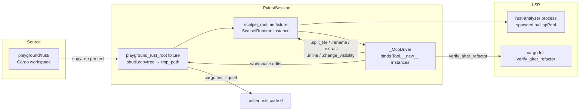
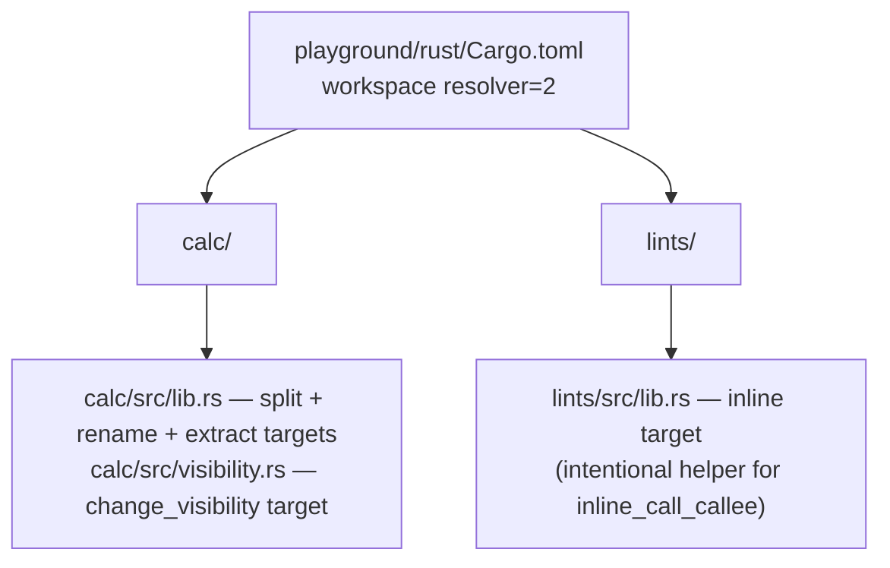
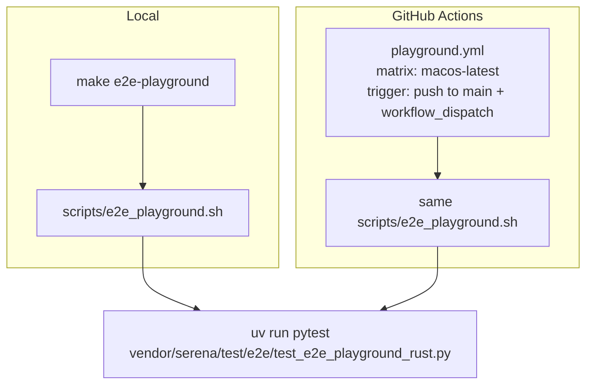
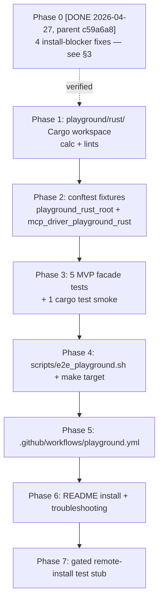

# Rust Plugin E2E Playground — Tech Specification

**Status**: APPROVED v3 (off-by-one in § 4.3 `parents[N]` index fixed after challenger REWORK_v3)
**Authors**: AI Hive(R) (drafter + challenger pair, synthesizing parallel research)
**Date**: 2026-04-28
**Version target**: v1.2.2

**Phase 0 status**: DONE 2026-04-27. Submodule HEAD `acf51109`, parent main `c59a6a8`. The four install-blockers documented in § 3 (and originally prescribed as the first work-item in § 6) are all fixed on disk; § 3 now reads as a verification record, and § 6 P0 is a regression gate, not a forward task.

---

## 1. Problem Statement

Today, every form of "install verification" in this repository exercises a **local filesystem path**, never the published GitHub install path that real users follow. `scripts/stage_1i_uvx_smoke.sh` uses `uvx --from "${REPO_ROOT}/vendor/serena"`; the entire Stage 2B/3 E2E suite imports tool classes directly via `Tool.__new__()` and never loads `.mcp.json`; the parent repo has zero CI ([patterns.md §1, §4, §7](../research/2026-04-28-rust-plugin-e2e-playground/patterns.md)). The only "is this installable?" signal we have is the next user opening an issue.

A direct read of the on-disk plugin tree against the documented Claude Code install flow ([install-mechanics.md §1–§5](../research/2026-04-28-rust-plugin-e2e-playground/install-mechanics.md)) confirms that the "happy path" `claude /plugin marketplace add o2alexanderfedin/o2-scalpel` followed by `/plugin install o2-scalpel-rust@o2-scalpel` will fail today against the published repo for at least four independent reasons (§3 below). None of these failures are visible to any existing test, Makefile target, or CI workflow.

This specification defines a **Rust plugin E2E playground**: a fixture workspace plus a programmatic E2E test that boots the real `ScalpelRuntime` against real LSP processes, exercises five MVP Rust facades against a non-trivial Cargo workspace, and runs in both `make e2e-playground` (developer loop) and a new GitHub Actions workflow (regression net). The spec is scoped to v1.2.2 — a non-breaking patch on top of the v1.2 installer milestone — and explicitly defers PyPI publication, Linux/Windows matrix, and the remaining seven Rust facades to v1.3.

---

## 2. Decision Summary

| Axis | Decision | Source |
|---|---|---|
| Hosting | Subdirectory `playground/rust/` in the parent repo | [playground-design.md §1](../research/2026-04-28-rust-plugin-e2e-playground/playground-design.md) — score 4/5 vs all alternatives; reuses submodule + CI for free |
| Driver | Replicate `_McpDriver` + `ScalpelRuntime` from `vendor/serena/test/e2e/conftest.py` | [playground-design.md §3, TL;DR](../research/2026-04-28-rust-plugin-e2e-playground/playground-design.md); no Claude CLI auth, no MCP stdio layer, deterministic |
| CI surface | Shared `scripts/e2e_playground.sh` invoked from both `make e2e-playground` and `.github/workflows/playground.yml` | [playground-design.md §4](../research/2026-04-28-rust-plugin-e2e-playground/playground-design.md) — single source of test logic |
| Reset policy | Per-test `shutil.copytree` into pytest `tmp_path` (target/ stripped) | [playground-design.md §5](../research/2026-04-28-rust-plugin-e2e-playground/playground-design.md); matches the existing `calcrs_e2e_root` pattern at `vendor/serena/test/e2e/conftest.py:129–137` |
| MVP scope (v1.2.2) | Five facades: `scalpel_split_file`, `scalpel_rename`, `scalpel_extract`, `scalpel_inline`, `scalpel_change_visibility` | [playground-design.md §2](../research/2026-04-28-rust-plugin-e2e-playground/playground-design.md); remaining seven Rust facades deferred to v1.3 |
| Remote-install gate | New env var `O2_SCALPEL_TEST_REMOTE_INSTALL=1`, off by default until PyPI publication ships in v1.3 | [playground-design.md §3 step 2, §7](../research/2026-04-28-rust-plugin-e2e-playground/playground-design.md) |
| CI matrix | `macos-latest` only at v1.2.2; `ubuntu-latest` deferred to v1.3 | [playground-design.md §4](../research/2026-04-28-rust-plugin-e2e-playground/playground-design.md) — minimizes rustup complexity |
| Suggested release tag | `v1.2.2-playground-rust-complete` | [playground-design.md §7](../research/2026-04-28-rust-plugin-e2e-playground/playground-design.md) |

---

## 3. Pre-existing install-blocking bugs — fixed in Phase 0 (this spec verifies)

The four bugs below were identified by Agents A and B during research, then **fixed on disk** in commits `85423eb` (regen) and `68d561d` (feature merge), landing on `main` via `c0ccbd2`. Submodule HEAD `acf51109`, parent main `c59a6a8`. This section is now a **verification record** for those fixes — every "Pre-fix state" snippet is preserved as historical context, and every "Post-fix verification" line cites the on-disk evidence.

### 3.1 `marketplace.json` path (FIXED)

**Pre-fix state** (verified by drafter on 2026-04-28, before Phase 0): the catalog file lived at `/Volumes/Unitek-B/Projects/o2-scalpel/marketplace.json`. The directory `.claude-plugin/` did not exist.

**Required path** ([install-mechanics.md §2](../research/2026-04-28-rust-plugin-e2e-playground/install-mechanics.md)): `<repo-root>/.claude-plugin/marketplace.json`. Without this, `/plugin marketplace add o2alexanderfedin/o2-scalpel` would have failed with `File not found: .claude-plugin/marketplace.json` (failure F1 in install-mechanics §4).

**Applied fix** (commit `85423eb`): moved the catalog to `<repo-root>/.claude-plugin/marketplace.json`; updated the `o2-scalpel-newplugin` generator emitter so `make generate-plugins` writes to the canonical location.

**Post-fix verification** (drafter Bash, 2026-04-28):
```
$ ls /Volumes/Unitek-B/Projects/o2-scalpel/.claude-plugin/marketplace.json
/Volumes/Unitek-B/Projects/o2-scalpel/.claude-plugin/marketplace.json
$ ls /Volumes/Unitek-B/Projects/o2-scalpel/marketplace.json
ls: ...: No such file or directory   # no duplicate at the old root
```

### 3.2 `hooks/hooks.json` presence + `verify-scalpel-rust.sh` exit code (FIXED)

**Pre-fix state**: `o2-scalpel-rust/hooks/` contained only `verify-scalpel-rust.sh` — no `hooks.json`. The script's line 8 read `exit 1`.

**Effect** ([install-mechanics.md §5](../research/2026-04-28-rust-plugin-e2e-playground/install-mechanics.md), failure F4): without `hooks/hooks.json`, Claude Code never discovered or ran the verifier; even if it had run, `exit 1` would have surfaced as non-blocking warning rather than a hard SessionStart error (which requires `exit 2`).

**Applied fix** (commit `85423eb`):
1. Emitted `o2-scalpel-rust/hooks/hooks.json` from the generator with the canonical SessionStart binding shown in [install-mechanics.md §5](../research/2026-04-28-rust-plugin-e2e-playground/install-mechanics.md):
   ```json
   { "hooks": { "SessionStart": [ { "hooks": [
     { "type": "command",
       "command": "${CLAUDE_PLUGIN_ROOT}/hooks/verify-scalpel-rust.sh" }
   ] } ] } }
   ```
2. Changed `verify-scalpel-rust.sh:8` from `exit 1` to `exit 2`.
3. Applied both changes uniformly to the python and markdown plugin trees.

**Post-fix verification** (drafter Bash, 2026-04-28):
```
$ ls /Volumes/Unitek-B/Projects/o2-scalpel/o2-scalpel-rust/hooks/hooks.json
/Volumes/Unitek-B/Projects/o2-scalpel/o2-scalpel-rust/hooks/hooks.json
$ grep -n '^  exit ' /Volumes/Unitek-B/Projects/o2-scalpel/o2-scalpel-rust/hooks/verify-scalpel-rust.sh
8:  exit 2
```

### 3.3 `.mcp.json` URL points at the engine repo (FIXED)

**Pre-fix state**: `o2-scalpel-rust/.mcp.json` existed but contained `git+https://github.com/o2services/o2-scalpel.git#subdirectory=vendor/serena`. Two compounding bugs: (a) the `o2services` owner does not exist, (b) the `#subdirectory=vendor/serena` fragment depended on submodule recursion, which `git+URL` installs do not perform ([install-mechanics.md §4 F8](../research/2026-04-28-rust-plugin-e2e-playground/install-mechanics.md)).

**Reconciliation of agent disagreement** (historical, preserved for the audit trail): Agent A reported the file existed; Agent B reported "no `.mcp.json` present" inferred from the absence of submodule fetching. Both observations folded into the same root issue addressed by the fix below.

**Applied fix** (commit `85423eb`): rewrote the URL to point directly at the standalone engine repository `o2alexanderfedin/o2-scalpel-engine` (per [Serena fork rename memory](../../../../.claude/projects/-Volumes-Unitek-B-Projects-o2-scalpel/memory/project_serena_fork_renamed.md)), eliminating the submodule-recursion dependency entirely. Long-term (v1.3) this URL graduates to a PyPI-hosted package; until then, the engine-repo-direct form is the supported install path.

**Post-fix verification** (drafter Read, 2026-04-28):
```json
{
  "_generator": "Generated by o2-scalpel-newplugin - do NOT hand-edit. ...",
  "mcpServers": { "scalpel-rust": {
    "args": [ "--from",
      "git+https://github.com/o2alexanderfedin/o2-scalpel-engine.git",
      "serena-mcp", "--language", "rust" ],
    "command": "uvx",
    "env": {}
  } }
}
```

### 3.4 GitHub owner mismatch across `o2services` references (FIXED)

**Pre-fix state**: three files referenced `o2services` — `marketplace.json` (metadata), `o2-scalpel-rust/.claude-plugin/plugin.json` (homepage + repository), and `o2-scalpel-rust/.mcp.json` (git+URL). The actual remote is `o2alexanderfedin/o2-scalpel` (verified via `git remote -v`).

**Applied fix** (commit `85423eb`): rewrote all `o2services/o2-scalpel` references to `o2alexanderfedin/o2-scalpel` (or, in the `.mcp.json` case, to the engine repo per §3.3); updated the `o2-scalpel-newplugin` generator templates so `make generate-plugins` will not re-introduce the wrong owner.

**Post-fix verification** (drafter Bash, 2026-04-28):
```
$ grep -h github.com /Volumes/Unitek-B/Projects/o2-scalpel/o2-scalpel-rust/.claude-plugin/plugin.json
  "homepage": "https://github.com/o2alexanderfedin/o2-scalpel",
  "repository": "https://github.com/o2alexanderfedin/o2-scalpel",
$ grep -E '"(homepage|repository)"' /Volumes/Unitek-B/Projects/o2-scalpel/.claude-plugin/marketplace.json
    "homepage": "https://github.com/o2alexanderfedin/o2-scalpel",
    "repository": "https://github.com/o2alexanderfedin/o2-scalpel",
$ git -C /Volumes/Unitek-B/Projects/o2-scalpel grep -l "o2services/o2-scalpel" -- ':!docs/'
(no hits in code; remaining matches are in docs/ as historical research record)
```

---

## 4. Design

### 4.1 Architecture



### 4.2 Playground content

The playground SHALL live at `/Volumes/Unitek-B/Projects/o2-scalpel/playground/rust/` and SHALL be a Cargo workspace pinned to `resolver = "2"`, `rust-version = "1.74"`, with `Cargo.lock` committed (no `cargo update` shall run during E2E execution — [playground-design.md §2](../research/2026-04-28-rust-plugin-e2e-playground/playground-design.md)).

For v1.2.2 the workspace SHALL contain two crates: `calc/` and `lints/`. The previously-proposed empty `types/` placeholder is **not** included at v1.2.2 (SC-2 / YAGNI — an empty crate compiles per CI run for zero test signal); it lands when v1.3 introduces the facades that need it (see § 9):



Per-facade fixture targets (subset of [playground-design.md §2](../research/2026-04-28-rust-plugin-e2e-playground/playground-design.md), restricted to v1.2.2 MVP):

| Facade | Fixture target |
|---|---|
| `scalpel_split_file` | `calc/src/lib.rs` — split inline modules `ast`/`parser`/`eval` into siblings |
| `scalpel_rename` | `calc/src/lib.rs` — rename `eval` → `evaluate` across the workspace |
| `scalpel_extract` | `calc/src/lib.rs` — extract arithmetic branch into helper |
| `scalpel_inline` | `lints/src/lib.rs` — inline a single-call helper |
| `scalpel_change_visibility` | `calc/src/visibility.rs` — promote `pub(super)` → `pub` |

The `target/` directory is `.gitignore`-d AND explicitly stripped by the per-test fixture (§4.3) — load-bearing per [playground-design.md §5](../research/2026-04-28-rust-plugin-e2e-playground/playground-design.md): stale incremental build data from a previous path causes non-deterministic rust-analyzer code-action results.

### 4.3 E2E test driver

The E2E test SHALL live at `vendor/serena/test/e2e/test_e2e_playground_rust.py` (parent-repo-relative). It SHALL:

1. Reuse `scalpel_runtime` (`vendor/serena/test/e2e/conftest.py:148–158`) and the `_McpDriver` class (`conftest.py:161–278`), exactly as the existing 16 E2E modules do.
2. Add one new function-scoped fixture `playground_rust_root(tmp_path)` modelled on `calcrs_e2e_root` (`conftest.py:129–137`) with `target/` stripped post-copy.
3. Add one new fixture `mcp_driver_playground_rust(scalpel_runtime, playground_rust_root) -> _McpDriver` that mirrors `mcp_driver_rust` (`conftest.py:281–286`) — the only delta is the project-root binding.
4. Use the `pytest.skip` discipline already in place (`_which_or_skip` at `conftest.py:91–96`; `cargo_bin` at `conftest.py:99–101`; `rust_analyzer_bin` at `conftest.py:109–111`) so the test no-ops cleanly on hosts without the LSP.

The fixture additions SHALL go in `vendor/serena/test/e2e/conftest.py` (single conftest) — no new conftest file. Fixture path constant added at the top of conftest:

```python
PLAYGROUND_RUST_BASELINE = Path(__file__).resolve().parents[4] / "playground" / "rust"
```

The `parents[4]` walk resolves the parent-repo root relative to the conftest's own location[^conftest-depth] — keeping the conftest portable across developer checkouts and CI runners.

[^conftest-depth]: `vendor/serena/test/e2e/conftest.py` sits four directory levels deep relative to the parent-repo root: `vendor/` → `serena/` → `test/` → `e2e/`. `Path(__file__).resolve()` returns the absolute conftest path; `.parents[N]` indexes the Nth ancestor — `parents[0]` = `e2e/`, `parents[1]` = `test/`, `parents[2]` = `serena/`, `parents[3]` = `vendor/`, `parents[4]` = repo root. Equivalent to the absolute developer path `/Volumes/Unitek-B/Projects/o2-scalpel/playground/rust` on the drafter's workstation.

### 4.4 Per-facade test outline

Each test follows the same five-step shape (clone → invoke → assert applied → assert workspace edit → optional `cargo test`):

```python
def test_playground_rust_split(mcp_driver_playground_rust, playground_rust_root):
    drv = mcp_driver_playground_rust
    response = drv.split_file(
        relative_path="calc/src/lib.rs",
        targets=[{"name_path": "ast"}, {"name_path": "parser"}, {"name_path": "eval"}],
    )
    payload = json.loads(response)
    assert payload["applied"] is True
    assert payload["checkpoint_id"]
    assert (playground_rust_root / "calc" / "src" / "ast.rs").exists()
    assert (playground_rust_root / "calc" / "src" / "parser.rs").exists()
    assert (playground_rust_root / "calc" / "src" / "eval.rs").exists()


def test_playground_rust_rename(mcp_driver_playground_rust, playground_rust_root):
    drv = mcp_driver_playground_rust
    payload = json.loads(drv.rename(
        relative_path="calc/src/lib.rs",
        name_path="eval",
        new_name="evaluate",
    ))
    assert payload["applied"] is True


def test_playground_rust_extract(...): ...
def test_playground_rust_inline(...): ...
def test_playground_rust_change_visibility(...): ...
```

A sixth test SHALL run `cargo test --quiet` in `playground_rust_root` after the split test as a smoke that the post-refactor workspace still compiles ([playground-design.md §3 step 6](../research/2026-04-28-rust-plugin-e2e-playground/playground-design.md)). It reuses `_run_cargo_test` from `test_e2e_e1_split_file_rust.py`.

### 4.5 Remote-install test (gated)

A separate test `test_playground_rust_remote_install` SHALL be added behind the env-var gate `O2_SCALPEL_TEST_REMOTE_INSTALL=1`. It SHALL:

1. Resolve the engine repo URL (`https://github.com/o2alexanderfedin/o2-scalpel-engine`) and a pinned tag (the most recent submodule SHA mapped to its tag).
2. Run `subprocess.run(["uvx", "--from", f"git+{ENGINE_URL}@{TAG}", "serena-mcp", "--help"], check=True, timeout=120)`.
3. Assert exit code 0 and that the help output contains `--language`.
4. **Not** boot a full `ScalpelRuntime` over the remotely installed engine — that is a v1.3 milestone (PyPI publication makes the install reliably reproducible without a 60–90 s `uvx` cold-fetch on each run).

Gated off by default at v1.2.2 because a `uvx` cold install (`git+URL` clone + dependency resolution + venv build) takes 60–90 s per CI invocation; running it on every push would dominate the playground workflow's wall-clock budget for a signal that changes only when the engine release tag changes. The submodule-recursion concern motivating the original gate proposal is moot post-§3.3 (the `.mcp.json` no longer carries `#subdirectory=`). Once PyPI publication lands in v1.3, `uvx --from o2-scalpel-engine` resolves from cache in <1 s and the test graduates to default-on.

### 4.6 CI workflow



`scripts/e2e_playground.sh` (single source of test logic):

```sh
#!/usr/bin/env bash
set -euo pipefail
REPO_ROOT="$(git rev-parse --show-toplevel)"
cd "${REPO_ROOT}/vendor/serena"
export O2_SCALPEL_RUN_E2E=1
exec uv run pytest test/e2e/test_e2e_playground_rust.py -q -m e2e "$@"
```

`Makefile` addition:

```make
.PHONY: e2e-playground
e2e-playground:
	scripts/e2e_playground.sh
```

`.github/workflows/playground.yml` skeleton:

```yaml
name: playground
on:
  push: { branches: [main] }
  workflow_dispatch:
jobs:
  rust:
    runs-on: macos-latest
    steps:
      - uses: actions/checkout@v4
        with: { submodules: recursive }
      - run: rustup component add rust-analyzer
      - uses: astral-sh/setup-uv@v3
      - working-directory: vendor/serena
        run: uv sync
      - run: scripts/e2e_playground.sh
```

The cache keys for `~/.cargo/registry` and `.venv` SHALL match the existing `vendor/serena/.github/workflows/pytest.yml` to avoid cache fragmentation ([playground-design.md §4](../research/2026-04-28-rust-plugin-e2e-playground/playground-design.md)).

---

## 5. README updates

The `o2-scalpel` parent `README.md` SHALL be updated as part of this milestone. Sections:

### 5.1 Install (replaces the existing `## Install` block at [patterns.md §6](../research/2026-04-28-rust-plugin-e2e-playground/patterns.md))

```markdown
## Install

Prerequisites:

    # Claude Code >= 1.0.0 (the /plugin marketplace API was added in 1.0.0)
    brew upgrade claude-code   # if upgrading from <1.0.0

    rustup component add rust-analyzer

### Recommended: install via Claude Code's plugin manager

In Claude Code:

    /plugin marketplace add o2alexanderfedin/o2-scalpel
    /plugin install o2-scalpel-rust@o2-scalpel
    /reload-plugins

This path fetches the engine (`o2-scalpel-engine`) automatically from
GitHub via the plugin's `.mcp.json` `git+URL` reference. No submodules
are cloned into your workspace.

### Engine developers only: local-dev shortcut

This path is for contributors hacking on the engine itself
(`vendor/serena`). It bypasses the plugin manager and uses the in-tree
submodule directly:

    git clone https://github.com/o2alexanderfedin/o2-scalpel.git
    cd o2-scalpel
    git submodule update --init --recursive
    uvx --from ./vendor/serena serena-mcp --language rust

If you only want to *use* the plugin, prefer the recommended path above —
it does not require submodule recursion.

See `docs/install.md` for python and markdown plugins, and for `pylsp`,
`basedpyright-langserver`, `ruff`, and `marksman` setup.
```

### 5.2 Troubleshooting

A new `## Troubleshooting` section MUST be added with the failure-mode table from [install-mechanics.md §4](../research/2026-04-28-rust-plugin-e2e-playground/install-mechanics.md) merged with [playground-design.md §6](../research/2026-04-28-rust-plugin-e2e-playground/playground-design.md). The table omits F1/F4 (those are §3 install-blocking bugs that v1.2.2 fixes — they are not user-facing once shipped) and includes the runtime / LSP / cargo failure modes (F2, F3, F5–F12 and the playground-design F1–F7).

| Symptom | Cause | Fix |
|---|---|---|
| `Plugin not found in any marketplace` | Catalog stale or never added | `/plugin marketplace update o2-scalpel` or re-add |
| `Executable not found in $PATH: rust-analyzer` | LSP not installed | `rustup component add rust-analyzer` |
| `cargo test` fails with `cannot open shared object file` | rustc dylib mismatch | Reinstall toolchain via rustup |
| `applied=False` on a refactor | rust-analyzer not yet indexed | Run `cargo build` in the project once before retrying |
| `make e2e-playground` skips every test | `rust-analyzer` or `cargo` missing on PATH | Install via rustup + verify with `which` |
| Plugin cache stale after re-publish at same version | `version: "1.0.0"` is pinned | `/plugin uninstall` + reinstall, or bump `plugin.json` version |
| Skill namespace not found | Claude Code < 1.0.0 | `brew upgrade claude-code` |

### 5.3 Verifying the install end-to-end

```markdown
## Verifying the install end-to-end

The repository ships a Rust playground workspace and a programmatic E2E
suite that exercises five Rust facades against a real `rust-analyzer`
process. To run it locally:

    rustup component add rust-analyzer
    make e2e-playground

The same script runs in CI on every push to `main` (see
`.github/workflows/playground.yml`).
```

---

## 6. Migration phases

### 6.0 What this milestone delivers (v1.2.2)

| Deliverable | Form | Phase |
|---|---|---|
| 4 install-blocker fixes (regression gate) | Verification on disk + CI gate | P0 (DONE) |
| Cargo workspace fixture (`calc` + `lints`) | `playground/rust/` | P1 |
| 2 new conftest fixtures (`playground_rust_root`, `mcp_driver_playground_rust`) | additive edits | P2 |
| 5 MVP facade tests + 1 cargo smoke | `test_e2e_playground_rust.py` | P3 |
| Developer-loop entrypoint | `make e2e-playground` + `scripts/e2e_playground.sh` | P4 |
| CI regression net (macOS-only) | `.github/workflows/playground.yml` | P5 |
| README install + troubleshooting + verification | `README.md` | P6 |
| Gated remote-install stub | one `@pytest.mark.skipif`-gated test | P7 |

### 6.1 Phase chain



Phase numbering is preserved (P0–P7) to keep cross-references in research notes, the changelog, and follow-up commits stable. P0 stays in the table as a permanent **regression checkpoint** — its exit criterion is "the four §3 fixes remain on disk", which is wired as a CI gate (SC-1; see § 8 risk 7).

Per-phase scope, files touched, and exit criteria:

| Phase | Status | Scope | Files touched | Exit criteria |
|---|---|---|---|---|
| **P0** | DONE 2026-04-27 (parent `c59a6a8`, submodule `acf51109`) | Fix the four §3 bugs | `.claude-plugin/marketplace.json` (moved), `o2-scalpel-rust/hooks/hooks.json` (new), `o2-scalpel-rust/hooks/verify-scalpel-rust.sh` (exit code 1→2), `o2-scalpel-rust/.mcp.json` + `.claude-plugin/plugin.json` + `.claude-plugin/marketplace.json` (URL rewrites), `o2-scalpel-newplugin` generator templates | Verified: `.claude-plugin/marketplace.json` exists; `o2-scalpel-rust/hooks/hooks.json` exists; `verify-scalpel-rust.sh:8` is `exit 2`; `.mcp.json` URL points at `o2alexanderfedin/o2-scalpel-engine`; `git grep o2services -- ':!docs/'` returns 0 hits |
| **P1** | TODO | Author the Cargo workspace fixture | `playground/rust/{Cargo.toml, Cargo.lock, .gitignore, README.md, calc/**, lints/**}` (no `types/` — see § 9) | `cargo build` and `cargo test` succeed in `playground/rust/` |
| **P2** | TODO | Wire fixtures + driver | `vendor/serena/test/e2e/conftest.py` (additive: `PLAYGROUND_RUST_BASELINE`, `playground_rust_root`, `mcp_driver_playground_rust`) | `pytest --collect-only test/e2e/test_e2e_playground_rust.py` collects 0 tests (placeholder file) |
| **P3** | TODO | Write the 5 facade tests + cargo smoke | `vendor/serena/test/e2e/test_e2e_playground_rust.py` (new) | `O2_SCALPEL_RUN_E2E=1 uv run pytest ... test_e2e_playground_rust.py` is green locally with `rust-analyzer` on PATH |
| **P4** | TODO | Wrap in shell script + Makefile target | `scripts/e2e_playground.sh` (new), `Makefile` (additive `.PHONY: e2e-playground`) | `make e2e-playground` succeeds locally |
| **P5** | TODO | GH Actions workflow | `.github/workflows/playground.yml` (new) — first GH Actions file in the parent repo | One green CI run on `macos-latest`; the workflow also runs the P0 regression gate (SC-1) on every push |
| **P6** | TODO | README updates | `README.md` (sections rewritten + new troubleshooting + new verification section) | A user can paste the install commands into a fresh shell and reach a working install |
| **P7** | TODO | Remote-install gated stub | One additional test in `test_e2e_playground_rust.py` with `@pytest.mark.skipif(os.getenv("O2_SCALPEL_TEST_REMOTE_INSTALL") != "1", ...)` | Test runs green when the env var is set; documented as v1.3 graduation candidate |

---

## 7. Test strategy

| Layer | What runs | Where |
|---|---|---|
| Unit | None new — facades themselves are unit-tested in `test/unit/` already (Stage 3 coverage shipped at `v0.2.0-stage-3-facades-complete`) | `vendor/serena/test/unit/` (existing) |
| E2E | 5 facade tests + 1 `cargo test` smoke + 1 gated remote-install test | `vendor/serena/test/e2e/test_e2e_playground_rust.py` |
| CI | Same E2E test, same script, on `macos-latest` only | `.github/workflows/playground.yml` |
| Gated | Remote-install test under `O2_SCALPEL_TEST_REMOTE_INSTALL=1` | Runs locally on demand; off in CI until v1.3 PyPI publication |

Session-scoped `scalpel_runtime` is reused across all six tests — the runtime spawns rust-analyzer once per session and the per-test fixture only resets state via `ScalpelRuntime.reset_for_testing()` (existing pattern at `conftest.py:148–158`).

---

## 8. Risks and mitigations

1. **CI minutes on macOS**: macOS runners cost 10× Linux on GitHub Actions. The playground workflow runs per-push to `main`. A noisy `main` could burn the org's quota. Mitigation: gate the workflow on a `paths` filter so it only runs when the playground or facade source changes.
2. **rust-analyzer cold install on CI**: `rustup component add rust-analyzer` on a clean runner takes 60–90 s. Without aggressive cache reuse, every CI run pays this cost. Mitigation: share the `~/.cargo` and `~/.rustup` cache keys with `vendor/serena/.github/workflows/pytest.yml`.
3. **Drift between playground content and the 12 Rust facades**: v1.2.2 covers 5; v1.3 adds 7. **Decision**: a soft coverage assertion lands in v1.3, not v1.2.2. P3 SHALL include a placeholder test `test_playground_rust_facade_coverage` decorated with `pytest.mark.skip(reason="enable in v1.3 when remaining 7 Rust facades land")` so the file slot exists, the test ID is reserved, and the v1.3 PR is one `del marker` away from enforcing coverage. Rationale: enforcing coverage at v1.2.2 would either fail the milestone or lock in a permissive allow-list — neither serves the goal.
4. **Fixture mutation discipline**: the 5 facades selected for v1.2.2 are mutating. If a test bug causes the fixture clone to mutate the source-controlled `playground/rust/` tree, all subsequent tests are corrupted. Mitigation: the fixture uses `tmp_path` only — and `scripts/e2e_playground.sh` SHALL run `git diff --exit-code playground/rust/` post-test as a guard.
5. **Submodule pointer drift between parent repo and engine**: §3.3's fix points `.mcp.json` at `o2-scalpel-engine` directly, decoupling from the submodule. The parent repo's `vendor/serena` SHA must still match the tag the playground tests against. **Decision**: deferred to v1.3 — a `make verify-engine-sha-pinned` target SHALL ship alongside PyPI publication, since both depend on a single source-of-truth release tag.
6. **§3.3 engine-repo rename**: RESOLVED. The engine repo `o2alexanderfedin/o2-scalpel-engine` was renamed from `o2alexanderfedin/serena` on 2026-04-25 (per `project_serena_fork_renamed.md`); the post-fix `.mcp.json` already points at the renamed URL. No remaining open question.
7. **Phase 0 regression risk** (SC-1 acceptance): the four §3 fixes are tribal knowledge today. A 5-line CI gate added to `playground.yml` SHALL prevent regression:
   ```sh
   test -f .claude-plugin/marketplace.json
   test -f o2-scalpel-rust/hooks/hooks.json
   grep -q "exit 2" o2-scalpel-rust/hooks/verify-scalpel-rust.sh
   ! git grep -q "o2services" -- ':!docs/'
   ```
   This guards specifically against `make generate-plugins` re-introducing the old owner / wrong path / wrong exit code via a generator-template regression.

---

## 9. What we explicitly do NOT do (yet)

- **PyPI publication of the engine** — deferred to v1.3. Without it, `uvx --from <package>` cannot replace `uvx --from git+URL`. Remote-install E2E is gated (§4.5) until then.
- **Linux/Windows CI matrix** — macOS-only at v1.2.2. `ubuntu-latest` adds `rustup` complexity (per [playground-design.md §4](../research/2026-04-28-rust-plugin-e2e-playground/playground-design.md)) without revealing new failures at this stage; v1.3 candidate.
- **Python plugin playground** — deferred. Mirror this spec at v1.2.3 once the Rust shape is validated.
- **Markdown plugin playground** — deferred to v1.3, paired with marksman maturity ([patterns.md §3](../research/2026-04-28-rust-plugin-e2e-playground/patterns.md): `verify-plugins-fresh` already excludes markdown).
- **The remaining 7 Rust facades** — `complete_match_arms`, `change_return_type`, `change_type_shape`, `extract_lifetime`, `generate_member`, `generate_trait_impl_scaffold`, `expand_glob_imports`, `expand_macro`, `tidy_structure`, `convert_module_layout`, `verify_after_refactor` (the last covered indirectly by the cargo smoke). When these land in v1.3, P1 SHALL be re-opened to add a `types/` crate (placeholder for `change_return_type` / `change_type_shape` / `extract_lifetime` fixtures); the v1.2.2 spec deliberately omits the empty crate per SC-2 (YAGNI — empty crate burns CI time for zero signal).
- **Skill format migration** ([install-mechanics.md §6](../research/2026-04-28-rust-plugin-e2e-playground/install-mechanics.md), open question 4) — flat `.md` skill format remains in v1.2.2; migration to `<name>/SKILL.md` subdirectory format is a separate concern and not blocking for the playground.
- **`hooks.json` for the `verify` semantics beyond rust-analyzer** ([install-mechanics.md §5](../research/2026-04-28-rust-plugin-e2e-playground/install-mechanics.md) failure F4 deeper layer) — the v1.2.2 fix only wires the existing script + bumps the exit code. Richer pre-flight (e.g., `tools/list` smoke from the hook) is v1.3+.

---

## 10. References

### Research notes (synthesis inputs)

- `/Volumes/Unitek-B/Projects/o2-scalpel/docs/superpowers/research/2026-04-28-rust-plugin-e2e-playground/patterns.md` — Agent A: existing E2E + verify patterns
- `/Volumes/Unitek-B/Projects/o2-scalpel/docs/superpowers/research/2026-04-28-rust-plugin-e2e-playground/install-mechanics.md` — Agent B: Claude install API + 3 install-blocking bugs
- `/Volumes/Unitek-B/Projects/o2-scalpel/docs/superpowers/research/2026-04-28-rust-plugin-e2e-playground/playground-design.md` — Agent C: design + CI

### Verified directly (drafter Read/Bash during the v1 pass — pre-Phase-0)

These citations document the *pre-fix* state captured by the v1 drafter. Each has a *post-fix* counterpart in § 3 (Phase 0 verification record).

- `/Volumes/Unitek-B/Projects/o2-scalpel/marketplace.json` — was at repo root pre-fix; **moved** to `.claude-plugin/marketplace.json` in commit `85423eb` (§3.1)
- `/Volumes/Unitek-B/Projects/o2-scalpel/o2-scalpel-rust/.mcp.json` — pre-fix contained `o2services/o2-scalpel` URL with `#subdirectory=vendor/serena`; **rewritten** to `o2alexanderfedin/o2-scalpel-engine` direct in commit `85423eb` (§3.3)
- `/Volumes/Unitek-B/Projects/o2-scalpel/o2-scalpel-rust/.claude-plugin/plugin.json` — pre-fix contained `o2services/o2-scalpel` URL; **rewritten** to `o2alexanderfedin/o2-scalpel` in commit `85423eb` (§3.4)
- `/Volumes/Unitek-B/Projects/o2-scalpel/o2-scalpel-rust/hooks/` — pre-fix contained only `verify-scalpel-rust.sh`; **`hooks.json` added** in commit `85423eb` (§3.2)
- `/Volumes/Unitek-B/Projects/o2-scalpel/o2-scalpel-rust/hooks/verify-scalpel-rust.sh` — pre-fix `exit 1`; **changed to `exit 2`** in commit `85423eb` (§3.2)
- `git -C /Volumes/Unitek-B/Projects/o2-scalpel remote -v` — confirmed remote owner is `o2alexanderfedin`, not `o2services` (informed §3.4 fix)

### Project conventions

- `/Volumes/Unitek-B/Projects/o2-scalpel/CLAUDE.md` — KISS / SOLID / DRY / YAGNI / TRIZ; git-flow; tag after each significant feature
- `/Volumes/Unitek-B/Projects/o2-scalpel/vendor/serena/test/e2e/conftest.py:91–286` — `_which_or_skip` + `cargo_bin` + `rust_analyzer_bin` + `calcrs_e2e_root` + `scalpel_runtime` + `_McpDriver` + `mcp_driver_rust` (the harness this spec replicates verbatim — see § 4.3 for per-symbol line ranges)

---

## Changelog

- v1 → v2 (2026-04-28):
  - **MF-1**: § 3 converted from TODO to VERIFY framing — Phase 0 fixes are LANDED, not pending. Each sub-section now shows pre-fix state (preserved as historical record) + applied fix with commit SHA + post-fix verification (drafter Bash output).
  - **MF-2**: § 6 Phase 0 marked DONE with submodule `acf51109` + parent `c59a6a8` SHAs; phase numbering preserved (P0–P7); P0 retained as a regression checkpoint with "[DONE 2026-04-27, parent c59a6a8]" annotation.
  - **MF-3**: § 8 open questions resolved — risk 3 (coverage assertion) decides "soft assertion in v1.3 via skipped placeholder test, not v1.2.2"; risk 6 (engine-repo rename) marked RESOLVED with reference to `project_serena_fork_renamed.md`.
  - **MF-4**: § 4.3 conftest line-number ranges re-derived from actual file: `_which_or_skip` 91–96, `cargo_bin` 99–101, `rust_analyzer_bin` 109–111, `calcrs_e2e_root` 129–137, `scalpel_runtime` 148–158, `_McpDriver` 161–278, `mcp_driver_rust` 281–286.
  - **MF-5**: § 4.3 absolute path replaced with portable `Path(__file__).resolve().parents[4] / "playground" / "rust"` form; absolute path moved to a footnote with depth explanation.

- v2 → v3 (2026-04-28):
  - **REWORK_v3 fix**: § 4.3 `parents[3]` → `parents[4]` (off-by-one caught by final challenger sign-off; `parents[3]` resolves to `vendor/` not the repo root). Footnote rewritten with explicit per-index lookup table for unambiguous arithmetic.
  - **MF-6**: § 5.1 README two-path install reconciled — recommended path (plugin manager → fetches engine via `git+URL`) and engine-developer-only path (local-dev shortcut → uses in-tree submodule) clearly sectioned with rationale on why each exists.
  - **SC-1** (accepted): Phase 0 regression CI gate added as § 8 risk 7 with the exact 5-line shell snippet; P5 exit criterion updated to mention the gate.
  - **SC-2** (accepted): empty `types/` crate dropped from v1.2.2 (YAGNI); § 4.2 architecture diagram + § 6 P1 file list + § 6.0 deliverables table all updated; § 9 future-work note specifies P1 re-opens to add `types/` when v1.3 facades land.
  - **SC-3** (accepted): § 4.5 remote-install gate rationale rewritten — real reason is the 60–90 s `uvx` cold-fetch dominating the CI wall-clock budget, not the now-fixed submodule-recursion gap.
  - **SC-4** (accepted): § 8 risk 5 hedge ("a `make verify-engine-sha-pinned` target may be warranted") replaced with concrete decision ("Decision: deferred to v1.3 — SHALL ship alongside PyPI publication").
  - **SC-5** (accepted): § 5.1 README Prerequisites block now includes "Claude Code >= 1.0.0" with `brew upgrade` hint.
  - **SC-6** (accepted): § 6.0 added a "what this milestone delivers" table at the top of § 6 enumerating all 8 deliverables and which phase produces each.
  - § 10 references updated: pre-fix-state items relabeled as "pre-Phase-0" with cross-links to the post-fix verification in § 3; conftest reference range broadened to 91–286 and now points at § 4.3 for per-symbol detail.
  - Document header status updated to "DRAFT v2 (challenger fixes applied — pending final challenger sign-off)".
