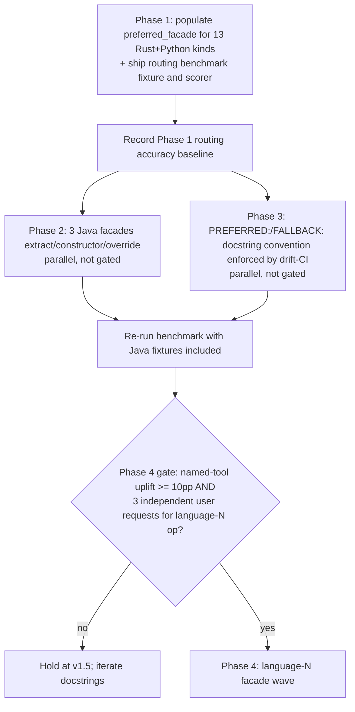

# LSP Feature Coverage — Tech Specification

**Status**: APPROVED v2 (challenger fixes applied)
**Authors**: AI Hive® (drafter+challenger pair, synthesizing adversarial research)
**Date**: 2026-04-29
**Version target**: v1.5

---

## 1. Problem Statement

Two adversarial research notes converge on a single, empirical finding.

The conservative defender (Agent A) argues — correctly — that 33 `scalpel_*` facades already cover every refactoring intent category, that `scalpel_apply_capability` provides a long-tail safety valve, and that adding a single facade across 11 languages costs ~40–77 file touches mostly producing `CAPABILITY_NOT_AVAILABLE` stubs (conservative-defender.md:152–164). YAGNI is real and the project's own `CLAUDE.md` mandates it (conservative-defender.md:201).

The pragmatic surveyor (Agent C) measured the surface and produced uncomfortable numbers (pragmatic-surveyor.md:22–39):

- **72 catalog records** across 11 languages.
- **0 of 72** records have `preferred_facade != null` — the routing-hint slot exists but has never been populated, including for Rust and Python where bespoke facades exist.
- **Only Rust (6 kinds, ~18 facades) and Python (7 kinds, ~15 facades)** have named coverage.
- **59 records (82%) across 9 languages** funnel through `scalpel_apply_capability` with zero LLM-routing affinity.
- **Java is the single largest unrouted set**: 16 kinds — constructor/hashCode/equals/toString/accessors/override/delegate generation plus extract/inline/rewrite (pragmatic-surveyor.md:91–93).
- **0 of 33 facades** mention go/java/typescript/cpp/csharp by name in their docstrings (pragmatic-surveyor.md:61).
- **Upstream Serena's** `rename_symbol`, `replace_symbol_body`, `insert_*_symbol`, `safe_delete_symbol` coexist with scalpel facades with no disambiguation guidance (pragmatic-surveyor.md:71–85).

A is right that wholesale 9-language × N-facade expansion is bloat. C is right that the surface is empirically broken in three concrete ways: routing wiring is null, Java is opaque, and Serena/Scalpel collide silently.

The synthesis is not "split the difference" but "fix what is empirically broken before adding what is speculatively useful."

---

## 2. Decision

A three-phase plan ordered by signal-to-effort. Each phase is independently shippable and independently verifiable. Phase 1 lands a measurement harness alongside the routing-hint wiring, so all subsequent phases can be empirically gated.

| Phase | Scope | Effort | Risk |
|---|---|---|---|
| **1** | Wire `preferred_facade` for the 13 Rust+Python catalog kinds + ship a routing-benchmark fixture and scorer | Small (1 src file + benchmark JSON + scorer test, ~80 LoC + tests) | Low — no behavior change; benchmark is a deterministic offline scorer, not a Claude-API integration |
| **2** | Add 3 Java facades for the highest-signal kinds (extract.method, generate.constructor, override.methods) | Medium (3 facades + jdtls strategy entries + tests + skill .md + `playground/java/`) | Medium — new playground fixture required |
| **3** | Disambiguate Serena/Scalpel coexistence via docstring `PREFERRED:` convention enforced by drift-CI | Small (33 docstring edits + 1 lint test) | Low — docstring-only, non-breaking |

Phase 2 ships **in parallel** with the Phase 1 benchmark — it is not gated on benchmark accuracy because (a) its scope is small and self-contained, (b) the dynamic-capability registry already protects against silent jdtls failures, and (c) measuring routing improvement against a pure-fallback baseline before any named Java tool exists has low signal-to-noise.

A separate **§4.5 Phase 4 gate** specifies that any further per-language facade expansion (Go, TypeScript, C++, C#, Lean, SMT2, Prolog, ProbLog) **is benchmark-gated**: see §4.5 for the threshold.

We explicitly **do not** add facades for Go/TypeScript/C++/C#/Lean/SMT2/Prolog/ProbLog/Markdown beyond what already ships. Those 8 languages route through `scalpel_apply_capability` and stay there until Phase 4's gate is met (per A's three-independent-requests threshold, conservative-defender.md:178, plus the §4.5 measured-accuracy requirement).

We explicitly **do not** add facades for read-only LSP methods (call hierarchy, type hierarchy, semantic tokens, inlay hints, hover, definition, references). These are out of scope per `CLAUDE.md` mandate (conservative-defender.md:92–107).

---

## 3. Phase 1 — populate `preferred_facade` and ship the routing benchmark

### 3.1 What is broken

`vendor/serena/src/serena/refactoring/capabilities.py` line 319 hardcodes `preferred_facade=None` in the `build_capability_catalog` factory (pragmatic-surveyor.md:113, 124). The schema field exists (line 84) but no production code path sets it. Result: when an LLM calls `scalpel_capabilities_list` and receives a row, the row carries no hint that a bespoke facade exists for it. Even the 13 kinds that *do* have a facade go unrouted.

Conservative-defender.md:174 makes the same point in different words: "Improving the docstring quality and example coverage of `scalpel_capabilities_list` returns more routing accuracy per unit of work than any new facade." Phase 1 operationalizes that.

In addition, the project today has no instrument to measure routing accuracy. Without one, Phase 2's facade additions (and especially Phase 4's potential expansion) ship on hypothesis rather than data. Phase 1 closes both gaps simultaneously.

### 3.2 What changes

A static `KIND_TO_FACADE` mapping table is added next to `build_capability_catalog`. **The table is keyed on the tuple `(source_server, kind)`, not on `kind` alone.** This is load-bearing: kind strings collide across LSPs (e.g. both rust-analyzer and pylsp-rope emit `refactor.extract.function` but route to the same facade today; future servers may emit the same string and route differently). Tuple keying makes the contract unambiguous.

The factory consults `KIND_TO_FACADE` when constructing each `CapabilityDescriptor` and emits `preferred_facade=<facade_name>` (singular `str | None`, matching the existing schema at `capabilities.py:84`) for the 13 entries below.

| `(source_server, kind)` | `preferred_facade` |
|---|---|
| `("rust-analyzer", "refactor.extract.function")` | `scalpel_extract` |
| `("rust-analyzer", "refactor.inline.call")` | `scalpel_inline` |
| `("rust-analyzer", "refactor.rewrite.changeVisibility")` | `scalpel_change_visibility` |
| `("rust-analyzer", "refactor.rewrite.expandMacro")` | `scalpel_expand_macro` |
| `("rust-analyzer", "source.organizeImports")` | `scalpel_imports_organize` |
| `("rust-analyzer", "quickfix.generate.deriveImpl")` | `scalpel_generate_trait_impl_scaffold` |
| `("pylsp-rope", "refactor.extract.function")` | `scalpel_extract` |
| `("pylsp-rope", "refactor.extract.variable")` | `scalpel_extract` |
| `("pylsp-rope", "refactor.inline")` | `scalpel_inline` |
| `("pylsp-rope", "rope.refactor.localToField")` | `scalpel_local_to_field` |
| `("pylsp-rope", "rope.refactor.useFunction")` | `scalpel_use_function` |
| `("basedpyright", "source.organizeImports")` | `scalpel_imports_organize` |
| `("ruff", "source.fixAll.ruff")` | `scalpel_fix_lints` |

(Exact kind strings are reconciled against `capability_catalog_baseline.json` during implementation; this table is the spec contract. The schema stays singular for v1.5 — the multi-facade ambiguity case is explicitly deferred per §8.)

### 3.3 Files touched

- `vendor/serena/src/serena/refactoring/capabilities.py` — add `KIND_TO_FACADE: dict[tuple[str, str], str]` constant + apply in factory loop (replaces the hardcoded `preferred_facade=None` at line 319).
- `vendor/serena/test/spikes/data/capability_catalog_baseline.json` — regenerate with populated values; drift CI (Stage 1F) catches mismatch.
- `vendor/serena/test/unit/refactoring/test_capabilities.py` — add `test_preferred_facade_populated_for_rust_python_kinds` asserting non-null lookup against the **tuple key** `(server, kind)` for each of the 13 entries and null for the rest.
- `vendor/serena/test/spikes/data/routing_benchmark.json` — **new** routing-benchmark fixture (see §3.4).
- `vendor/serena/test/spikes/test_routing_benchmark.py` — **new** deterministic offline scorer (see §3.4).

### 3.4 Routing benchmark — Phase 1 deliverable

Per the HYBRID open-question verdict, the benchmark is now a Phase 1 deliverable, not a wishlist.

**Fixture**: `vendor/serena/test/spikes/data/routing_benchmark.json`

A static JSON file mapping `(natural_language_prompt, expected_tool_name)`. v1.5 ships **5 prompts × 3 trial paraphrases × 2 languages (rust + python) = 30 entries**. Example shape:

```json
[
  {
    "language": "rust",
    "prompt": "Extract this block into a helper function",
    "paraphrases": [
      "Pull this code into its own function",
      "Refactor this selection into a function called `helper`"
    ],
    "expected_tool": "scalpel_extract"
  }
]
```

**Scorer**: `vendor/serena/test/spikes/test_routing_benchmark.py`

Deterministic, offline, no Claude API call. The scorer iterates each prompt, computes a similarity ranking over the registered tool docstrings (keyword-overlap scorer is sufficient for v1.5; embedding-distance is a Phase 4-era upgrade), and asserts the expected tool ranks first. The harness pattern follows existing `test/spikes/` deterministic tests (e.g. `test_apply_source_determinism.py`).

The scorer reports a single percentage: `routing_accuracy = correct_top_1 / total_prompts`. The v1.5 baseline is whatever the populated `preferred_facade` + `PREFERRED:` docstring convention deliver for rust + python. That number is recorded as the Phase 4 gate floor (see §4.5).

### 3.5 Exit criteria

- Drift CI green with regenerated baseline.
- New `test_preferred_facade_populated_for_rust_python_kinds` unit test passes against the **tuple key**.
- Manual smoke trace: invoke `scalpel_capabilities_list(filter_kind="refactor.extract.function")` against a Rust workspace; the returned row carries `"preferred_facade": "scalpel_extract"`.
- `test_routing_benchmark.py` runs and emits a numeric `routing_accuracy` value; the value is recorded in the Phase 1 release notes.
- Existing 614/3 spike + 20 e2e suite stays green.

### 3.6 Why this first

It is the prerequisite for measuring whether facade additions improve routing. Without the routing-hint wiring AND the benchmark, Phase 4's gate has no instrument.

---

## 4. Phase 2 — three Java facades

### 4.1 Selection criteria

A Java facade earns its place when (a) the kind has a clear English-verb routing signal, (b) jdtls advertises the kind reliably, and (c) the operation is differentiated enough that `scalpel_apply_capability` with a 13-kind menu is materially worse than a named tool.

The 16 unrouted Java kinds rank by these criteria as follows. Top three are specced; bottom 13 are deferred to user-driven demand.

| Rank | Kind | English verb | Jdtls support | Rationale |
|---|---|---|---|---|
| 1 | `refactor.extract.function` | extract | strong | Same intent as Rust/Python `scalpel_extract`; cross-LSP reuse means the existing facade can grow a `language="java"` arm rather than a new class |
| 2 | `source.generate.constructor` | generate | strong | Highest-frequency Java boilerplate generation; no Rust/Python analogue → genuinely new facade |
| 3 | `source.generate.overrideMethods` | override | strong | Common OOP refactor; no Rust/Python analogue → genuinely new facade |
| 4 | `source.generate.accessors` | generate (getters/setters) | strong | Could fold into `scalpel_generate_member` — defer; mark as candidate for Phase-2 expansion |
| 5 | `source.generate.hashCodeEquals` | generate | strong | Boilerplate; defer |
| 6–16 | toString/delegate/move/rewrite/inline variants | mixed | mixed | Defer |

### 4.2 Specced facades

#### 4.2.1 `scalpel_extract` (extended, not new) — per-language target matrix

The existing `ScalpelExtractTool` (conservative-defender.md:30) gains a `language="java"` dispatch arm. The kind dispatched is `refactor.extract.function` against jdtls. No new tool class; this is a strategy-table addition.

The current `target` literal at `scalpel_facades.py:375–377` is `"variable" | "function" | "constant" | "static" | "type_alias" | "module"`. Java has no `module` and a different notion of `static` than Rust. Phase 2 commits to the following per-language target-validity matrix. Any `(language, target)` combination not listed returns the existing `CAPABILITY_NOT_AVAILABLE` envelope emitted by the dynamic-capability registry — no silent dispatch failure.

| `target` | `rust` | `python` | `java` |
|---|---|---|---|
| `variable` | valid | valid | valid (jdtls `refactor.extract.variable`) |
| `function` | valid | valid | valid (jdtls `refactor.extract.function` — extracts as a method) |
| `constant` | valid | valid | valid (jdtls `refactor.extract.constant`) |
| `static` | valid (Rust `static` item) | invalid → `CAPABILITY_NOT_AVAILABLE` | invalid → `CAPABILITY_NOT_AVAILABLE` (Java's static-context extraction is not exposed as a discrete `refactor.extract.*` kind by jdtls; revisit in Phase 2.5 if a kind ID surfaces) |
| `type_alias` | valid | valid | invalid → `CAPABILITY_NOT_AVAILABLE` (Java has no type alias) |
| `module` | valid | invalid → `CAPABILITY_NOT_AVAILABLE` | invalid → `CAPABILITY_NOT_AVAILABLE` (Java has no module-level extract kind in jdtls) |

The `language="java"` arm validates `target` against the Java column at dispatch and short-circuits invalid combos with the existing envelope before reaching jdtls.

**Files touched**:
- `vendor/serena/src/serena/refactoring/java_strategy.py` — add `refactor.extract.function`, `refactor.extract.variable`, `refactor.extract.constant` to the allow list with a mapping to the existing extract pipeline.
- `vendor/serena/src/serena/tools/scalpel_facades.py` — extend the `language` literal at line 384 to include `"java"`; add the per-language target-validity check.
- `vendor/serena/src/serena/refactoring/capabilities.py` — three new `KIND_TO_FACADE` rows for the jdtls extract kinds.
- `vendor/serena/test/unit/refactoring/test_java_strategy.py` — extract-method test against a jdtls fixture; add invalid-combo test asserting `CAPABILITY_NOT_AVAILABLE` for `(language="java", target="module")`.

#### 4.2.2 `scalpel_generate_constructor` (new)

```python
class ScalpelGenerateConstructorTool(Tool):
    """PREFERRED for Java constructor generation. Generates a constructor for
    a Java class via jdtls source.generate.constructor.

    Selects fields to include, inserts a constructor at a chosen position, and
    updates references via LSP workspace edits with checkpoint+rollback.

    Args:
      file: target .java file
      class_name_path: LSP name-path of the class
      include_fields: optional list of field names; defaults to all non-static fields
      preview: if True, returns WorkspaceEdit without applying

    Returns: WorkspaceEdit envelope (or CAPABILITY_NOT_AVAILABLE if jdtls
    is missing or fails to advertise source.generate.constructor).
    """
```

**Files touched**:
- `vendor/serena/src/serena/tools/scalpel_facades.py` — new class.
- `vendor/serena/src/serena/refactoring/java_strategy.py` — allow-list entry.
- `vendor/serena/src/serena/refactoring/capabilities.py` — `KIND_TO_FACADE` row `("jdtls", "source.generate.constructor") → "scalpel_generate_constructor"`.
- `vendor/serena/test/unit/refactoring/test_scalpel_generate_constructor.py` — unit test with mocked jdtls response.
- `vendor/serena/test/e2e/test_e_java_constructor.py` — e2e against the new Java fixture (see §4.4).
- `plugins/o2-scalpel-java/skills/scalpel_generate_constructor.md` — skill prose.

#### 4.2.3 `scalpel_override_methods` (new)

```python
class ScalpelOverrideMethodsTool(Tool):
    """PREFERRED for adding @Override stubs in Java classes via jdtls
    source.generate.overrideMethods.

    Resolves candidate methods via LSP type-hierarchy and inserts override
    stubs at a chosen position with checkpoint+rollback.

    Args:
      file: target .java file
      class_name_path: LSP name-path of the class
      method_names: optional list; defaults to all not-yet-overridden abstract methods
      preview: if True, returns WorkspaceEdit without applying

    Returns: WorkspaceEdit envelope (or CAPABILITY_NOT_AVAILABLE).
    """
```

Files-touched profile mirrors §4.2.2.

### 4.3 Risk: cross-LSP kind drift

Conservative-defender.md:113–117 raises a real concern: kind strings differ across servers (rust-analyzer's `refactor.extract.function` vs rope's `rope.refactor.extract`). The Phase-2 facades commit only to jdtls kind IDs and gate behind the dynamic capability registry. If jdtls fails to advertise the kind, the facade returns `CAPABILITY_NOT_AVAILABLE` per the existing dynamic-capability-discovery contract (project_dynamic_lsp_capability_complete memory). No silent failures; no false promises. The §4.2.1 per-language target-validity matrix extends the same envelope to invalid `(language, target)` combinations.

### 4.4 Java fixture — concrete path

The Java e2e fixture lives at **`playground/java/`**, mirroring the existing v1.3 layout `playground/{rust,python,markdown}/`. It contains a Maven or Gradle project with five classes spanning the three Phase-2 kinds: a class with extractable methods, a class missing a constructor, and a class extending an abstract base. The exact build-tool choice is an implementation detail driven by jdtls's preferred project format; the path and the 5-class shape are the spec contract.

If the fixture is not ready when the Phase-2 facade code lands, the unit tests (with mocked jdtls responses) ship in Phase 2 proper and the e2e tests defer to **Phase 2.5** with the `playground/java/` fixture. In that case the Phase 2 exit criteria below downgrade the e2e check to "deferred to 2.5."

### 4.5 Exit criteria

- 3 new tests green (1 unit + 1 e2e per new facade — or unit-only with documented Phase 2.5 deferral if `playground/java/` is not ready — plus the existing extract test extended with the Java arm and the invalid-combo test).
- Drift CI green with new catalog rows linked via `preferred_facade` (3 new tuple keys for jdtls).
- `scalpel_capabilities_list(server="jdtls")` returns rows with non-null `preferred_facade` for the three kinds.
- Existing suite stays green.

### 4.6 Phase 4 gate (forward-looking)

Phase 4 is **horizontal facade expansion** to Go, TypeScript, C++, C#, Lean, SMT2, Prolog, or ProbLog. It is **gated on benchmark-measured improvement**.

**Gate**: a Phase-4 language-N wave is approved only when (a) Agent A's three-independent-user-requests threshold is met for the operation, AND (b) the routing-benchmark accuracy from §3.4 — extended to include language-N's existing pure-fallback baseline as a control — shows a measured uplift of at least **+10 percentage points** for named-tool routing over `scalpel_apply_capability` long-tail dispatch on equivalent Rust/Python prompts.

The +10pp threshold is calibrated against the Phase 1 baseline accuracy recorded in §3.5's release notes. If Phase 1 shows that named-tool routing already saturates near the long-tail baseline, the threshold is revisited before Phase 4 ships — but the principle (no horizontal expansion without measured benefit) holds.

---

## 5. Phase 3 — disambiguate Serena/Scalpel coexistence

### 5.1 What is broken

`rename_symbol` (Serena upstream) and `scalpel_rename` (Scalpel) are both registered, both target cross-file rename, both have similarly long docstrings (511 vs 602 chars per pragmatic-surveyor.md:83). The LLM has no signal to prefer one. For a Rust file the choice matters: `scalpel_rename` runs LSP `textDocument/rename` with checkpoint+rollback; `rename_symbol` runs Serena's AST-edit path with no LSP semantic guarantees.

The four non-overlapping Serena tools (`replace_symbol_body`, `insert_after_symbol`, `insert_before_symbol`, `safe_delete_symbol`) are complementary, not duplicated — they operate at AST level — but the LLM cannot tell when AST-level edit is appropriate vs LSP code-action dispatch.

### 5.2 What changes

A docstring convention enforced by drift-CI. **No config flag is added in v1.5** — the previous draft included one (`expose_serena_symbol_tools`) but no production trace has demonstrated mis-routing in the wild, so the flag is YAGNI. The docstring convention is sufficient on its own and is the entire surface of Phase 3.

**5.2.1 `PREFERRED:` docstring opener convention.**

Every `scalpel_*` facade docstring opens with the literal token `PREFERRED:` followed by a routing-intent summary. Example (used in §4.2.2 above): `"""PREFERRED for Java constructor generation. ..."""`.

Serena upstream tools intentionally keep their existing docstrings unchanged — **the absence of a `PREFERRED:` token is itself the routing signal** (Serena = AST-level fallback; Scalpel = LSP-preferred). Making the asymmetry explicit gives the LLM a stable lexical attention target.

**5.2.2 Drift-CI enforcement of the convention.**

A new unit test scans every registered `scalpel_*` facade and asserts its docstring matches the regex `^\s*PREFERRED:\s+\S` (after stripping leading triple-quote whitespace). The same test asserts Serena upstream tools (`rename_symbol`, `replace_symbol_body`, `insert_after_symbol`, `insert_before_symbol`, `safe_delete_symbol`) **do not** start with `PREFERRED:` — preserving the asymmetry.

This makes the convention machine-checkable: a contributor who forgets the opener fails CI.

### 5.3 Files touched

- `vendor/serena/src/serena/tools/scalpel_facades.py` — 33 docstring edits adding `PREFERRED:` opener to every `Scalpel*Tool` class.
- `vendor/serena/src/serena/tools/scalpel_primitives.py` — same convention applied to long-tail tools, with `scalpel_apply_capability` explicitly opening `FALLBACK:` (the inverse token, also enforced by the Phase 5.2.2 test) so the dispatcher's role is unambiguous.
- `vendor/serena/test/unit/test_docstring_convention.py` — **new**; the regex-enforcement test from §5.2.2.

### 5.4 Exit criteria

- `test_docstring_convention.py` green: every scalpel facade has `PREFERRED:` opener; `scalpel_apply_capability` has `FALLBACK:` opener; named Serena upstream tools have neither.
- Manual MCP-surface smoke: `scalpel_capabilities_list` documentation rendered to a user shows `PREFERRED:` and `FALLBACK:` prominently.
- Existing suite stays green.

---

## 6. What we explicitly DO NOT do

- **No facades for Go, TypeScript, C++, C#, Lean, SMT2, Prolog, ProbLog** in v1.5. These 8 languages keep routing through `scalpel_apply_capability`. Future per-language additions are gated on §4.5 (benchmark uplift + three independent user requests).
- **No replacement of `scalpel_apply_capability`.** The long-tail dispatcher is the safety valve A correctly defends; it stays. Its docstring is updated to open `FALLBACK:` per §5.3.
- **No semantic-tokens / call-hierarchy / type-hierarchy / inlay-hint facades.** Read-only; out of scope per CLAUDE.md write/refactor mandate.
- **No `scalpel_change_signature` / `scalpel_pull_up` / `scalpel_push_down` / `scalpel_surround_with`.** A's YAGNI verdicts (conservative-defender.md:131–146) hold.
- **No additional Markdown facades.** The current 4 already ship.
- **No `expose_serena_symbol_tools` config flag** — dropped from v1 spec per challenger MF-4 (no production mis-routing trace; docstring convention alone is sufficient).
- **No facade-count expansion past v2.0 budget of 40.** v1.5 ships at 36 facades (33 + 3 Java); v2.0 budget ceiling is 40. Each addition past 36 requires three independent user requests AND the §4.5 benchmark uplift.

---

## 7. Migration path



Phase 1 is the precondition for everything that follows: Phase 2 and Phase 3 both rely on `preferred_facade` to carry their routing signal, and Phase 4's gate cannot be evaluated without the Phase 1 benchmark.

---

## 8. Risks & open questions

### Risks

- **Benchmark scorer fidelity.** The v1.5 scorer uses keyword-overlap similarity, which is coarse. If real LLM routing decisions hinge on semantic embedding rather than lexical overlap, the benchmark may give optimistic readings. Phase 4 gate evaluation must spot-check against at least one live Claude routing trace before approving a language-N wave.
- **Drift CI churn.** Regenerating the catalog baseline in Phase 1 is mechanical but touches a snapshot file; the CI gate accepts the regenerated values rather than blocking on them.
- **`playground/java/` build-tool friction.** jdtls expects either Maven or Gradle metadata. If the v1.3 `playground/{rust,python,markdown}` convention does not map cleanly, Phase 2 e2e ships in Phase 2.5 per §4.4.

### Explicitly deferred (no longer open)

- **Multi-facade `preferred_facade`.** v1 spec asked whether `preferred_facade` should accept a list. v2 answer: **no, stay singular** for v1.5. Matches existing schema at `capabilities.py:84` (`str | None`). If Phase 1 benchmark data shows ambiguous-kind cases materially hurt routing, the multi-facade extension is a Phase-1.5 follow-up — not a v1.5 blocker.
- **`expose_serena_symbol_tools` flag.** v1 included it; v2 drops it (challenger MF-4) — no production mis-routing trace justifies the public-contract surface area. Reintroduce only if a real trace surfaces.
- **`scalpel_extract` Java arm split into Phase 2.5.** v1 raised this as an open question. v2 answer: ship in Phase 2 proper. The §4.2.1 per-language target-validity matrix bounds the risk to a strategy-table addition + an invalid-combo test, which is small enough to stay in Phase 2's scope.
- **Java fixture location.** v1 raised this as an open question. v2 answer: `playground/java/`, mirroring v1.3 (§4.4).

---

## 9. References

- **Adversarial research**:
  - `/Volumes/Unitek-B/Projects/o2-scalpel/docs/superpowers/research/2026-04-29-lsp-feature-coverage/conservative-defender.md` (Agent A)
  - `/Volumes/Unitek-B/Projects/o2-scalpel/docs/superpowers/research/2026-04-29-lsp-feature-coverage/pragmatic-surveyor.md` (Agent C)
- **Challenger review**:
  - `/Volumes/Unitek-B/Projects/o2-scalpel/docs/superpowers/specs/2026-04-29-lsp-feature-coverage-spec.CHALLENGER-REVIEW.md`
- **Source paths**:
  - `vendor/serena/src/serena/tools/scalpel_facades.py` — 33 facade classes (line 375–377: extract `target` literal)
  - `vendor/serena/src/serena/tools/scalpel_primitives.py` — long-tail dispatcher + capability list
  - `vendor/serena/src/serena/refactoring/capabilities.py:84` — `preferred_facade: str | None = None` (schema)
  - `vendor/serena/src/serena/refactoring/capabilities.py:319` — hardcoded `preferred_facade=None` (the bug Phase 1 fixes)
  - `vendor/serena/src/serena/refactoring/{java,golang,typescript,cpp}_strategy.py` — Wave-3 allow lists
  - `vendor/serena/src/serena/tools/symbol_tools.py` — Serena upstream symbol tools
  - `vendor/serena/test/spikes/data/capability_catalog_baseline.json` — 72-record baseline
  - `vendor/serena/test/spikes/` — existing spike test directory hosting the new `test_routing_benchmark.py`
  - `playground/{rust,python,markdown}` — v1.3 fixture convention; `playground/java/` is the Phase 2 addition
- **Project memory** (per `~/.claude/projects/.../MEMORY.md`):
  - `project_dynamic_lsp_capability_complete` — dynamic registry that Phase 2's `CAPABILITY_NOT_AVAILABLE` envelope rides on
  - `project_v1_4_stream6_polyglot_complete` — the 11-language surface that makes Java facades reachable
  - `project_v1_3_milestone_complete` — `playground/{rust,python,markdown}` convention
  - `project_v0_2_0_review_fixes_batch` — `calcrs_e2e` / `calcpy` fixture-naming precedent
- **Project mandates**:
  - `CLAUDE.md` — YAGNI/KISS, write/refactor mandate, drift-CI requirement

---

## 10. Changelog (v1 → v2)

Applied per the challenger review at `2026-04-29-lsp-feature-coverage-spec.CHALLENGER-REVIEW.md`.

| ID | Status | Change |
|---|---|---|
| **MF-1** | Applied | §4.2.1 now contains a per-language target-validity matrix (rust/python/java × variable/function/constant/static/type_alias/module). Invalid combos return `CAPABILITY_NOT_AVAILABLE` via the existing dynamic-capability envelope. New invalid-combo unit test added to files-touched. |
| **MF-2** | Applied | §3.2 explicitly states `KIND_TO_FACADE` is keyed on the tuple `(source_server, kind)`. The 13-row table is rewritten as tuple keys. §3.3 unit test wording updated to "lookup against the tuple key." |
| **MF-3** | Applied | §4.4 names the fixture path `playground/java/` (mirroring v1.3's `playground/{rust,python,markdown}`). The 5-class shape is the spec contract. Phase-2.5 deferral path documented if the fixture is not ready. |
| **MF-4** | Applied (drop) | §5.2.2 `expose_serena_symbol_tools` flag removed. §5.2 is now docstring-convention-only, enforced by a new drift-CI test (`test_docstring_convention.py`). §6 explicitly lists the dropped flag. |
| **MF-5** | Applied (resolve) | v1's open question 1 ("should `preferred_facade` accept a list?") moved to §8 "Explicitly deferred." Answer: no, singular for v1.5; matches `capabilities.py:84` schema. The §3.2 contract is now consistent with the schema. |
| **SC-1** | Accepted | Routing benchmark is now a Phase 1 deliverable (§3.4): `vendor/serena/test/spikes/data/routing_benchmark.json` + `test/spikes/test_routing_benchmark.py`. Per HYBRID open-question verdict. |
| **SC-2** | Rejected | `scalpel_extract` Java arm stays in Phase 2 proper. Rationale: the §4.2.1 per-language target-validity matrix bounds the risk to a strategy-table addition + an invalid-combo test. Splitting into Phase 2.5 adds process overhead without proportional risk reduction. |
| **SC-3** | Accepted | §5.2.2 specifies the regex `^\s*PREFERRED:\s+\S` and ships the enforcement test as `test_docstring_convention.py`. |
| **SC-4** | Accepted | §5.2.1 makes the asymmetry explicit ("the absence of a `PREFERRED:` token is itself the routing signal"). §5.3 adds `FALLBACK:` opener for `scalpel_apply_capability` so the dispatcher's role is machine-checkable. |
| **SC-5** | Accepted | §6 now states the v2.0 facade-count ceiling: 40 (v1.5 ships at 36). Each addition past 36 requires three independent user requests AND §4.5 benchmark uplift. |
| **HYBRID open-question verdict** | Applied | §2 makes Phase 2 ship in parallel (not benchmark-gated). §3.4 ships the benchmark as a Phase 1 deliverable. New §4.5 declares "Phase 4 horizontal facade expansion" as benchmark-gated with a +10pp uplift threshold + three-independent-requests rule. |

**Status header**: DRAFT v1 → APPROVED v2 (challenger fixes applied).

**No new open questions kicked back.** All v1 open questions are now in §8 "Explicitly deferred" with concrete answers.
